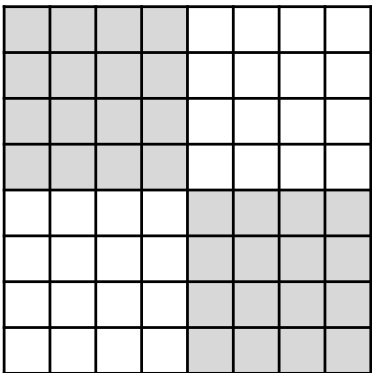
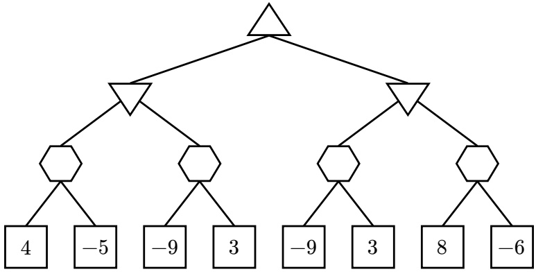
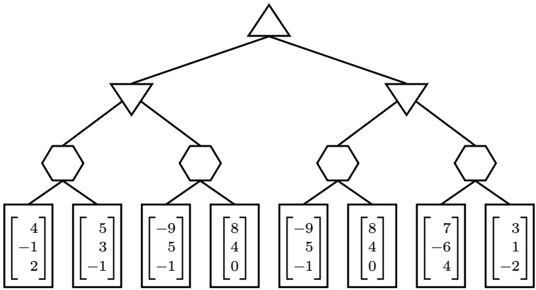
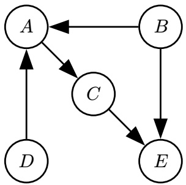
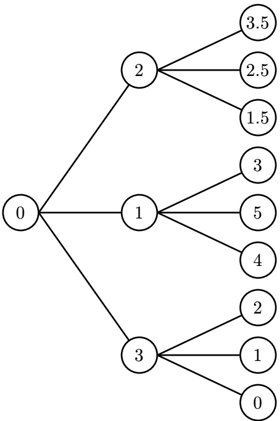

<!-- page: 1 -->

CS 188

Intro to Artificial Intelligence

Summer 2025

Final Exam

Print Your Name:

Print Your Student ID:

Print Student name to your left:

Print Student name to your right:

You have 170 minutes. There are 10 questions of varying credit. (100 points total)

| Question: | 1 | 2 | 3 | 4 | 5 | 6 | 7 | 8 | 9 | 10 | Total |
| --- | --- | --- | --- | --- | --- | --- | --- | --- | --- | --- | --- |
| Points: | 10 | 8 | 9 | 13 | 16 | 12 | 8 | 12 | 4 | 8 | 100 |

We reserve the right to deduct points for failing to follow the marking directions below:

For questions with **circular bubbles**, you may select only one choice.

For questions with **square checkboxes**, you may select one or more choices.

Unselected option (Completely unfilled)

You can select

Don’t do this (it will be graded as incorrect!)

multiple squares

Only one selected option (completely filled)

Don’t do this (it will be graded as incorrect!)

Anything you write outside the answer boxes or you ~~cross out~~ will not be graded. If you write multiple answers, your answer is ambiguous, or the bubble/checkbox is not entirely filled in, we will grade the worst interpretation.

Read the honor code below and sign your name.

By signing below, I affirm that all work on this exam is my own work. I have not referenced any disallowed materials, nor collaborated with anyone else on this exam. I understand that if I cheat on the exam, I may face the penalty of an “F” grade and a referral to the Center for Student Conduct.

Sign your name:

<!-- page: 2 -->

In chess, a knight can move either:

• Two squares horizontally and one square vertically.

• Two squares vertically and one square horizontally.

Examples in the diagram:

•      can move to any squares labeled ×.

•      can move to any squares labeled ✓.

We want to solve the knight’s tour search problem:

• There is a single knight on an 8 × 8 board.

• Given the knight’s starting square, find a sequence of knight moves, such that the knight visits every square at least once.

| × | × |
| --- | --- |
| × | × |
| × | × |
| × | ×✓✓ |

• Each knight move costs 1.

Q1.1 (1 point) What is the maximum branching factor for this search problem?

Q1.2 (2 points) Let 𝑁 be the number of squares that have been visited by the knight.

Select all admissible heuristics for this problem.

𝑁

64 − 𝑁

Manhattan distance to the nearest unvisited square

Euclidean distance to the nearest unvisited square

None of the above

Q1.3 (1 point) Select all algorithms that are guaranteed to find the optimal solution to this problem.

DFS tree search

Greedy search with the zero heuristic

BFS tree search

A\* tree search with the zero heuristic

UCS tree search

None of the above

<!-- page: 3 -->

Q1.4 (2 points) Consider a Pacman search problem (from lecture and project) with an 8 × 8 grid, no walls inside the grid, and 63 food pellets (one per square) that Pacman must eat.

Select all true statements about this Pacman problem and the knight’s tour problem.

Pacman and the knight have different successor functions.

The heuristic (64 − number of pellets eaten) is admissible for this Pacman problem.

The goal test only involves checking Pacman or the knight’s current position.

None of the above

Q1.5 (1 point) What is the approximate size of the state space for this problem? Your answer is the product of all the values you select. 64 642 264 2

Q1.6 (3 points) Lucinda suggests a different way to solve the knight’s tour problem:

1. Split the board into four 4 × 4 sections (see the diagram).

2. Consider a 4 × 4 board.

• For each of the 16 starting squares on this board, find a knight’s tour on the 4 × 4 board.

• Record each of the 16 solutions. Now, we have 16 paths on the 4 × 4 board, one for each starting position.

3. To solve the entire problem:

• Use one of the recorded solutions to visit all squares in the knight’s current 4 × 4 section.

• Take one action to move to any unvisited 4 × 4 section, and use another recorded solution to visit all squares in that section.

• Repeat until all 4 sections have been visited.

Why will Lucinda fail to find the optimal solution to the overall 8 × 8 problem? Select all that apply.

After finishing a section, it may be impossible to move to an unvisited section with one action.

For some starting squares, none of the 16 recorded solutions can be used for the first section.

A knight tour solution on a 4 × 4 board requires visiting some squares more than once.

None of the above

<!-- page: 4 -->

Some farmers plan to set up their shops in a line.

• There are 5 farmers: Emma (𝐸), Frank (𝐹), Grace (𝐺), Hugo (𝐻), Iris (𝐼).

• There are 7 positions, numbered 1 through 7 from left to right.

• The farmers are the variables and the positions are the values.

Constraints of this CSP:

• Two farmers cannot be in the same position.

• Some positions may be empty.

• Frank (𝐹) wants to be directly next to Grace (𝐺).

• Hugo (𝐻) cannot be in positions 3 or 4.

• Emma (𝐸) does not want anyone immediately to her left or right.

• Iris (𝐼) does not want to be directly next to Hugo (𝐻).

Q2.1 (1 point) Which farmer has unary constraints on their value? 𝐸 𝐹 𝐺 OH 𝐼

Q2.2 (1 point) Which constraints can be represented as a single binary constraint? Select all that apply. 𝐹 wants to be directly next to 𝐺. 𝐻 cannot be in positions 3 or 4. 𝐸 does not want anyone immediately to her left or right. 𝐼 does not want to be directly next to 𝐻. None of the above

Q2.3 (2 points) For this subpart, no variables are assigned, and only unary constraints are applied.

For the next two subparts, suppose 𝐸 is assigned, and 𝐹, 𝐺, 𝐻, 𝐼 have the domains below: 𝐸 = 6 𝐹 : {1, 2, 3, 4} 𝐺 : {1, 2, 3, 4} 𝐻 : {1, 2} 𝐼 : {1, 2, 3, 4}

Q2.4 (2 points) We run arc consistency on (𝐼 → 𝐻). Select all values that remain in the domain of 𝐼. 1 2 3 4

Q2.5 (2 points) When running the AC-3 algorithm, which arcs are enqueued after processing (𝐼 → 𝐻)? Select all that apply. (𝐻 → 𝐼) (𝐹 → 𝐼) (𝐻 → 𝐹) (𝐸 → 𝐼) (𝐼 → 𝐻) (𝐺 → 𝐼)

<!-- page: 5 -->

In this question, a hexagon node represents an agent that prefers utilities with the smallest absolute value. In other words, this agent chooses the action that minimizes 𝑓(𝑥) = |𝑥|.

Consider this game tree:

𝐴

𝐵

𝐶

𝐷

𝐸

𝐹

𝐺

𝐻

Q3.1 (1 point) What utility does the root maximizer node receive in this game tree? 4 −5 −9 3 8 −6

Consider pruning this tree. Assume nodes are pruned from left to right, and we prune on equality. Q3.2 (2 points) Select all nodes that will **not be visited** due to pruning.

𝐴

𝐶

𝐵

𝐺

𝐸

None

𝐷

𝐹

𝐻

Q3.3 (2 points) For this subpart only, the value at node 𝐴 is changed from 4 to 2.

Select all nodes that will **not be visited** due to pruning.

𝐴

𝐶

𝐸

𝐺

None

𝐵

𝐷

𝐹

𝐻

Q3.4 (2 points) What values for node 𝐴 would cause node 𝐻 to be **not visited**? Select all that apply.

1

−7

7

10

None

<!-- page: 6 -->

The rest of this question is independent of earlier subparts.

Consider a multi-agent game tree, where:

• Upward triangles maximize the **top** value of the utility tuple.

• Downward triangles minimize the **middle** value of the utility tuple.

• Hexagons minimize the absolute value of the **bottom** value of the utility tuple.

𝐴

𝐵

𝐶

𝐷

𝐸

𝐹

𝐺

𝐻

Q3.5 (1 point) What utility does the root node receive in this game tree? 4 5 −9 8 7 3

Q3.6 (1 point) Can nodes be pruned in this multi-agent game tree? Yes No

<!-- page: 7 -->

Note: You do not need to know about stock trading to solve this question.

Pacman decides to use reinforcement learning to help with his stock trading problem:

• The problem is an MDP with 6 non-terminal states: $S \in \{ A , B , C , D , E , F \}$

• From each non-terminal state, there are 3 actions available: **Buy**, **Sell**, and **Hold**.

• The transition probabilities of the MDP are unknown.

Q4.1 (2 points) Suppose Pacman has a policy 𝜋 and a collection of samples of the form $( S , \pi ( S ) , S ^ { \prime } , R )$ obtained by following 𝜋. He wants to compute the value $V ^ { \pi } ( S _ { i } )$ of each state under this policy.

Which algorithms can be used for this computation? Select all that apply.

Use value iteration to compute 𝑉𝜋 exactly.

Use policy iteration can compute 𝑉𝜋 exactly.

Use Q-learning to estimated 𝑉𝜋.

Use Direct Evaluation to estimate 𝑉𝜋.

Use Temporal Difference Learning to estimate 𝑉𝜋.

None of the above

Q4.2 (2 points) Suppose Pacman has a collection of samples of the form $( S , a , S ^ { \prime } , R )$ , obtained by following a random policy. He wants to compute the optimal values $V ^ { * } ( S _ { i } )$ of each state.

Which algorithms can be used for this computation? Select all that apply.

Use value iteration to compute 𝑉∗ exactly.

Use policy iteration to compute 𝑉∗ exactly.

Use Q-learning to estimated 𝑉∗.

Use Direct Evaluation to estimate 𝑉∗.

Use Temporal Difference Learning to estimate 𝑉∗.

None of the above

Q4.3 (2 points) Suppose Pacman runs Q-learning on this MDP. Which of these policies, when run forever, will visit each state-action pair an infinite number of times?

Always choose an action uniformly at random.

Always choose the optimal action (according to the current estimated Q-values).

Always choose the **Buy** action.

Always choose between the **Buy** and **Sell** actions, uniformly at random.

<!-- page: 8 -->

(Question 4 continued…)

Q4.4 (1 point) Suppose Pacman sets 𝛼 = 1 (never changing 𝛼) when running Q-learning. Will this modified Q-learning eventually converge to the optimal policy, assuming you observe every state-action pair infinitely often? Yes No

Q4.5 (3 points) Recall that we can modify Q-learning to use an exploration function 𝑓(𝑢, 𝑛):

Regular Q-update: $\begin{array} { r } { Q ( s , a ) \leftarrow ( 1 - \alpha ) Q ( s , a ) + \alpha [ R + \gamma \operatorname* { m a x } _ { a ^ { \prime } } Q ( s ^ { \prime } , a ^ { \prime } ) ] } \end{array}$ Modified Q-update: $\begin{array} { r } { Q ( s , a ) \leftarrow ( 1 - \alpha ) Q ( s , a ) + \alpha [ R + \gamma \operatorname* { m a x } _ { a ^ { \prime } } f ( Q ( s ^ { \prime } , a ^ { \prime } ) , N ( s ^ { \prime } , a ^ { \prime } ) ) ] } \end{array}$

In the exploration function, $u = Q ( s ^ { \prime } , a ^ { \prime } )$ is the utility of the state-action pair, and $n = N ( s ^ { \prime } , a ^ { \prime } )$ is the number of times the state-action pair has been visited.

Which exploration functions encourage taking actions that have not been taken often? Select all that apply.

$$
\square f (u, n) = e ^ {- n} \cdot u
$$

$$
\square f (u, n) = u \cdot n
$$

$$
\square f (u, n) = u + \frac {1 0}{n}
$$

$$
\square f (u, n) = 1 / n
$$

𝑓(𝑢, 𝑛) = 𝑢 + 𝑛

None of the above

Q4.6 (3 points) For this subpart only, the MDP has an additional terminal state 𝑇 . No further actions or rewards available from 𝑇 . There are still 6 non-terminal states: $S \in \{ A , B , C , D , E , F \}$

At some point during Q-learning, you have the estimated Q-values in the table below.

You observe these samples $( S , a , S ^ { \prime } , R )$

• First sample: $( A , \mathtt { B u y } , C , 0 )$

• Second sample: (𝐶, **Sell**, 𝐸, 0)

• Third sample:    (𝐸, **Hold**, 𝑇 , 5)

|  | 𝐴 | 𝐵 | 𝐶 | 𝐷 | 𝐸 | 𝐹 | 𝑇 |
| --- | --- | --- | --- | --- | --- | --- | --- |
| 𝑄(𝑆,Buy) | 0 | 0 | 4 | 2 | 3 | 1 | 0 |
| 𝑄(𝑆,Sell) | 1 | 2 | 3 | 4 | 5 | 6 | 0 |
| 𝑄(𝑆,Hold) | 2 | 1 | 2 | 3 | 2 | 4 | 0 |

Perform one Q-update per sample, processing the samples in order. Use 𝛾 = 1 and 𝛼 = 0.5.

New value of 𝑄(𝐴, **Buy**):

New value of 𝑄(𝐶, **Sell**):

New value of 𝑄(𝐸, **Hold**):

<!-- page: 9 -->

Consider the Bayes Net in the diagram. Each random variable is binary (has two possible values).

Q5.1 (2 points) True or false: $D \perp E \mid C$

True (independent)

False (not independent)

What is the equation for computing $P ( + b \mid + e )$ , using inference by enumeration?

$$
P (+ b \mid + e) = \frac {\sum_ {a , c , d} (\mathrm{i})}{\sum_ {a , b , c , d} (\mathrm{ii})}
$$

Q5.2 (2 points) Fill in blank (i).

$$
\bigcirc P (a \mid b, d) P (b) P (c \mid a) P (a \mid d) P (d) P (+ e \mid b, c)
$$

$$
\bigcirc P (a \mid b, d) P (+ b) P (c \mid a) P (a \mid d) P (d) P (+ e \mid b, c)
$$

$$
\bigcirc P (a \mid b, d) P (+ b) P (c \mid a) P (d) P (+ e)
$$

$$
\bigcirc P (a \mid + b, d) P (+ b) P (c \mid a) P (a \mid d) P (d) P (+ e \mid + b, c)
$$

$$
\bigcirc P (a \mid + b, d) P (+ b) P (c \mid a) P (a \mid d) P (d) P (- e \mid + b, c)
$$

Q5.3 (2 points) Fill in blank (ii).

$$
\bigcirc P (a \mid b, d) P (b) P (c \mid a) P (a \mid d) P (d) P (+ e \mid b, c)
$$

$$
\bigcirc P (a \mid b, d) P (+ b) P (c \mid a) P (a \mid d) P (+ e \mid b, c)
$$

$$
\bigcirc P (a \mid b, d) P (+ b) P (c \mid a) P (d) P (+ e)
$$

$$
\bigcirc P (a \mid + b, d) P (+ b) P (c \mid a) P (a \mid d) P (+ e \mid + b, c)
$$

$$
\bigcirc P (a \mid + b, d) P (+ b) P (c \mid a) P (a \mid d) P (- e \mid + b, c)
$$

Q5.4 (2 points) Pacman estimates $P(+b\mid+e)$ using variable elimination. He eliminates hidden variables in the order $A , D , C .$

Select all elimination orders that are more efficient than Pacman’s order. An order is more efficient if the largest factor generated (i.e. the factor with the most rows) is smaller.

$$
\square A, C, D
$$

$$
\square C, D, A
$$

$$
\square D, C, A
$$

𝐶, 𝐴, 𝐷

$$
\square D, A, C
$$

None of the above

<!-- page: 10 -->

(Question 5 continued…)

The Bayes Net is reprinted below for your convenience.

Q5.5 (2 points) Suppose we want to estimate $P ( B \mid + e )$ using sampling. If we use **rejection sampling**, which of these variable orders can be used to produce a valid sample? Select all that apply. 𝐷, 𝐵, 𝐶, 𝐴, 𝐸 𝐵, 𝐴, 𝐶, 𝐸, 𝐷 𝐵, 𝐷, 𝐴, 𝐶, 𝐸 𝐷, 𝐸, 𝐴, 𝐵, 𝐶 𝐷, 𝐵, 𝐴, 𝐶, 𝐸 None of the above

In the next three subparts, consider these samples:

$$
(+ a, - b, + c, + d, + e)
$$

$$
(+ a, + b, + c, + d, + e)
$$

$$
(+ a, - b, - c, - d, + e)
$$

$$
(- a, - b, + c, + d, + e)
$$

Q5.6 (2 points) Using **rejection sampling**, what is the estimate of $P ( + b \mid + e )$ from these samples? 1/6 1/4 2/6 3/4 5/6

Q5.7 (2 points) We use **likelihood weighting** to estimate $P ( + b \mid + e )$ . Ignore samples that likelihood weighting would not generate.

Which of these values will be a weight assigned to at least one of the samples? Select all that apply.

$$
\square P (+ e \mid + b, + c)
$$

$$
\square P (- e \mid + b, + c)
$$

$$
\square P (+ e \mid + b, - c)
$$

$$
\square P (- e \mid + b, - c)
$$

$$
\square P (+ e \mid - b, + c)
$$

$$
\square P (- e \mid - b, + c)
$$

$$
\square P (+ e \mid - b, - c)
$$

$$
\square P (- e \mid - b, - c)
$$

Q5.8 (2 points) We use **likelihood weighting** to estimate 𝑃(+𝑏 | +𝑎). Ignore samples that likelihood weighting would not generate.

The conditional probability table for 𝐷 is shown to the right.

What is the estimate of $P(+b\mid+a)$ from these samples?

| 𝐴 | 𝐷 | 𝑃(𝐴 \| 𝐷) |
| --- | --- | --- |
| +𝑎 | +𝑑 | 0.2 |
| +𝑎 | -𝑑 | 0.4 |
| -𝑎 | +𝑑 | 0.8 |
| -𝑎 | -𝑑 | 0.6 |

<!-- page: 11 -->

An early use case of HMMs was speech recognition. In this question, consider a simplified speech model:

• The hidden state $S _ { t }$ represents who is talking at time 𝑡, which is either $S _ { t } = \mathrm { A l i c e \; o r \; } S _ { t } = \mathrm { B o b } .$

| 𝑆𝑡-1 | 𝑆𝑡 | 𝑃(𝑆𝑡 \| 𝑆𝑡-1) |
| --- | --- | --- |
| Alice | Alice | 0.7 |
| Alice | Bob | 0.3 |
| Bob | Alice | 0.4 |
| Bob | Bob | 0.6 |

• The observation $O _ { t }$ measures the voice pitch at time $t ,$ which is either $O = \mathrm { H i g h \; o r \; } O = \mathrm { L o w } .$

| 𝐸𝑡 | 𝑆𝑡 | 𝑃(𝐸𝑡 \| 𝑆𝑡) |
| --- | --- | --- |
| High | Alice | 0.9 |
| Low | Alice | 0.1 |
| High | Bob | 0.2 |
| Low | Bob | 0.8 |

Q6.1 (4 points) $\operatorname { A t } t = 0 ,$ , the initial belief distribution is uniform: $P ( S _ { 0 } = \mathrm { A l i c e } ) = P ( S _ { 0 } = \mathrm { B o b } ) = 0 . 5 .$ Perform a time elapse update.

What is $P ( S _ { 1 } = \mathrm { A l i c e } ) ?$

What is $P ( S _ { 1 } = \mathrm { B o b } ) ?$

Q6.2 (4 points) After the time elapse update at $t = 5$ , we have these probabilities:

$$
P (S _ {5} = \text {Alice} \mid O _ {1: 4}) = 0. 6
$$

$$
P (S _ {5} = \mathrm{Bob} \mid O _ {1: 4}) = 0. 4
$$

Perform an observation update with $O _ { 5 } = \mathrm { H i g h }$ . Write your answers as fractions.

What is $P ( S _ { 5 } = \mathrm { A l i c e } | O _ { 1 : 5 } ) ?$

$$
\text {What is} P (S _ {5} = \text {Bob} \mid O _ {1: 5})?
$$

Q6.3 (2 points) After the time elapse and observation updates at $t = 9$ , we have these probabilities:

$$
P (S _ {1 0} = \text {Alice} \mid O _ {1: 1 0}) \propto 0. 4
$$

$$
P (S _ {1 0} = \mathrm{Bob} \mid O _ {1: 1 0}) \propto 0. 1
$$

Perform a normalization step. After normalization, what are the values of…

$$
P (S _ {1 0} = \text {Alice} \mid O _ {1: 1 0})?
$$

$$
P (S _ {1 0} = \mathrm{Bob} \mid O _ {1: 1 0})?
$$

Q6.4 (2 points) Select all true statements about HMMs.

The hidden states form a Markov chain.

The stationary distribution of the hidden state is always equivalent to its initial distribution.

Observations are independent of each other, even if no states are observed.

Observations are conditionally independent of each other, given all the hidden states.

$O _ { t }$ is conditionally independent of $S _ { 1 : t - 1 }$ given $S _ { t 1 }$

None of the above

<!-- page: 12 -->

Alan’s location can be modeled as an HMM, where the hidden states are $L _ { t }$ and the observations are $E _ { t } .$ In this question, we will use particle filtering to estimate Alan’s location, which is either 𝐿 = Dwinelle or 𝐿 = Home or 𝐿 = Airport.

Q7.1 (2 points) Suppose we use 20 particles. We pause the algorithm immediately after a time elapse step. How many particles should be at 𝐿 = Home, such that the estimate of 𝑃(𝐿 = Home) based on the current particles is 0.3?

Some time later, we have these unweighted particles after a time elapse step:

• 8 particles at 𝐿 = Dwinelle

• 10 particles at 𝐿 = Home

• 2 particles at 𝐿 = Airport

Our noisy sensor reports that Alan is at 𝐸 = Home. We run an observation update using these values: • 𝑃(𝐸 = Home | 𝐿 = Dwinelle) = 0.2 • 𝑃(𝐸 = Home | 𝐿 = Home) = 0.6 • 𝑃(𝐸 = Home | 𝐿 = Airport) = 0.4

Q7.2 (2 points) After the update, what are the weights of the 8 particles at 𝐿 = Dwinelle? All 8 particles have weight 0.2. All 8 particles have weight 1. All 8 particles have weight 5. Not enough information.

After weighting the particles, we finish the observation update by resampling from the weighted particles. Q7.3 (2 points) What is the probability that a 𝐿 = Dwinelle particle is sampled? Write as a fraction.

Q7.4 (2 points) What is the probability that a 𝐿 = Home particle is sampled? Write as a fraction.

<!-- page: 13 -->

For the next two subparts, consider query vectors $q _ { 1 } , q _ { 2 } , q _ { 3 }$ and key vectors $k _ { 1 } , k _ { 2 } , k _ { 3 }$

$$
q _ {1} = \left[ \begin{array}{c} 1 \\ 0 \\ - 1 \end{array} \right] \quad q _ {2} = \left[ \begin{array}{c} 1 \\ 2 \\ 1 \end{array} \right]
$$

$$
q _ {3} = \left[ \begin{array}{c} 0 \\ 0 \\ - 1 \end{array} \right]
$$

$$
k _ {1} = \left[ \begin{array}{c} 1 \\ 1 \\ - 1 \end{array} \right]
$$

$$
k _ {2} = \left[ \begin{array}{c} 1 \\ 2 \\ 1 \end{array} \right]
$$

$$
k _ {3} = \left[ \begin{array}{c} - 1 \\ - 1 \\ - 1 \end{array} \right]
$$

Q8.1 (1 point) We compute the self attention dot products of all queries with all keys (i.e. $k _ { 1 }$ with $q _ { 1 } , q _ { 2 }$ and $q _ { 3 } ; k _ { 2 }$ with $q _ { 1 } , q _ { 2 } ,$ , and $q _ { 3 } ; \mathbf { e } \mathbf { t } \mathbf { c } . )$ . What is the maximum dot product produced? −1 0 1 2 3 6

Q8.2 (1 point) Which key does $q _ { 1 }$ most strongly attend to (i.e. have the largest dot product with)? O $k _ { 1 }$ O $k _ { 2 }$ O $k _ { 3 }$

Q8.3 (1 point) Reinforcement Learning from Human Feedback (RLHF) uses Q-learning to train language models with RL on human preferences. True False

Q8.4 (1 point) Suppose we shift all of the attention dot product scores by a constant, i.e. if the score is $x _ { i }$ we transform the score to $x _ { i } + c .$ Does this change the attention output? Hint: consider how the output of the softmax operation is impacted by this shift. Yes No

Q8.5 (1 point) Suppose we multiply all of the attention dot product scores by a constant, i.e. if the score is $x _ { i } ,$ we transform the score to $x _ { i } \cdot c _ { i }$ . Does this change the attention output? Hint: Consider how the output of the softmax operation is impacted by this shift. Yes No

Q8.6 (1 point) Tokenization occurs after the embedding step when preparing text to pass as input to a transformer model. True False

Q8.7 (1 point) Instruction tuning uses unsupervised learning to turn a pretrained base model that only knows how to mimic human written text, into a model which can respond to and follow instructions. True False

<!-- page: 14 -->

(Question 8 continued…)

For the next three subparts, consider the search tree below. We proceed left to right through the tree. The number in a node is the value of a heuristic function at that node, where higher values are preferred.

Q8.8 (1 point) If we run greedy search, what is the value of the final node in the path taken? 3.5 2.5 3 5 4 2 1 0

Q8.9 (1 point) If we run beam search with width 2, what is the value of the final node in the path taken? 3.5 2.5 3 5 4 2 1 0

Q8.10 (1 point) If we run beam search with width 3, what is the value of the final node in the path taken? 3.5 2.5 3 5 4 2 1 0

Q8.11 (1 point) Is beam search, regardless of beam width, optimal? yes no

Q8.12 (1 point) Is beam search, regardless of beam width, complete? yes no

<!-- page: 15 -->

These subparts are from the guest lectures.

Q9.1 (1 point) Which types of AI models were used in decoding speech from brain signals that were introduced in the talk Cheol Jun gave “Speech Neuroprostheses for Restoring Naturalistic Communication”? Select all that apply.

Large Language Model (LLM)

Connectionist Temporal Classification (CTC)

Hidden Markov Model (HMM)

Recurrent Neural Network-Transducer (RNN-T)

None of the above

Q9.2 (1 point) Which search methods were used in the talk Charlie gave “Scaling LLM Test-Time Compute Optimally can be More Effective than Scaling Model Parameters”? Select all that apply. Depth-first Search 𝐴∗ Search Lookahead Search Random Search Best-of-N Beam Search Uniform Cost Search None of the above

Q9.3 (1 point) In Ademi’s talk, what primary role did Video Language Models (VLMs) play within Reinforcement Learning? Dynamics Model Value Function Reward Model Exploration Policy Feature-Based Representation

Q9.4 (1 point) Which of the following are true about fuzzy control systems? Select all that apply. Fuzzy sets are used as values for linguistic variables. Fuzzy rules test the values of lingusitic variables. Fuzzy rules are weighted according to the degree of fit of the outputs. The average of maximums is one method used to combine fuzzy sets. Fuzzy inputs are converted to crisp inputs. None of the above

<!-- page: 16 -->

**(8 points)**

For the next two subparts, consider building a decision tree, using the 7 examples in the table, to predict Read (yes/no).

The attributes and their values are:

• Fiction: yes/no

• Age: new/old/ancient

• Award: yes/no

• Rating: hi/med/low

• Length: short/medium/long

<table><tbody><tr><td rowspan="2">Ex.</td><td colspan="5">Attributes</td><td>Target</td></tr><tr><td>Fiction</td><td>Age</td><td>Award</td><td>Rating</td><td>Length</td><td>Read</td></tr><tr><td>1</td><td>no</td><td>new</td><td>no</td><td>hi</td><td>short</td><td>Yes</td></tr><tr><td>2</td><td>yes</td><td>ancient</td><td>no</td><td>med</td><td>long</td><td>No</td></tr><tr><td>3</td><td>yes</td><td>old</td><td>yes</td><td>hi</td><td>medium</td><td>Yes</td></tr><tr><td>4</td><td>yes</td><td>old</td><td>no</td><td>med</td><td>medium</td><td>No</td></tr><tr><td>5</td><td>yes</td><td>ancient</td><td>yes</td><td>low</td><td>short</td><td>No</td></tr><tr><td>6</td><td>no</td><td>new</td><td>no</td><td>low</td><td>short</td><td>No</td></tr><tr><td>7</td><td>yes</td><td>new</td><td>no</td><td>hi</td><td>short</td><td>Yes</td></tr></tbody></table>

Q10.1 (3 points) Which attribute would make the **best** starting attribute to split on? Fiction Age Award Rating Length

Q10.2 (2 points) Which **binary** attribute would make the **worst** starting attribute to split on? Fiction Age Award Rating Length

All binary attributes are equally bad.

The remaining subparts are independent of the decision tree above.

Q10.3 (2 points) Which values are used to determine the split attribute? Select all that apply.

pchance

information gain

None of the above

MaxPchance

entropy

Q10.4 (1 point) Which of the following is a regularization parameter in decision trees? Select all that apply.

pchance

MaxPchance

information gain

entropy

None of the above
