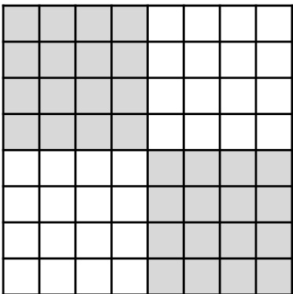
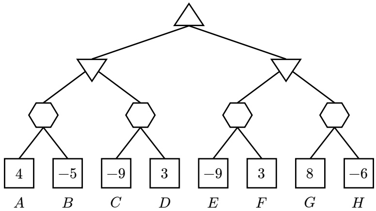
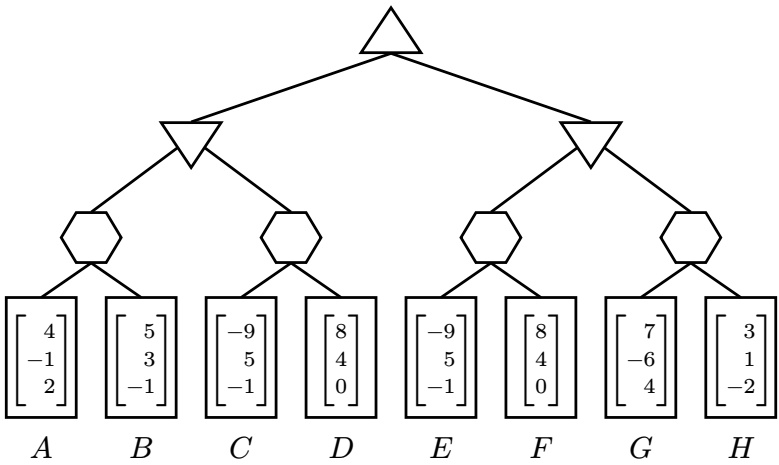
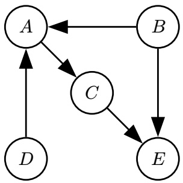
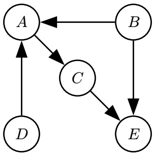
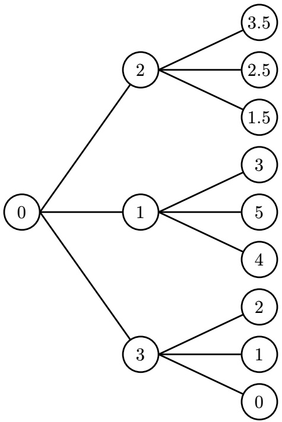

<!-- page: 1 -->

Intro to Artificial Intelligence

## Summer 2025

Final Exam

**Solutions last updated: Friday, August 22, 2025**

Print Your Name:

Print Your Student ID:

Print Student name to your left:

Print Student name to your right:

You have 170 minutes. There are 10 questions of varying credit. (100 points total)

| Question: | 1 | 2 | 3 | 4 | 5 | 6 | 7 | 8 | 9 | 10 | Total |
| --- | --- | --- | --- | --- | --- | --- | --- | --- | --- | --- | --- |
| Points: | 10 | 8 | 9 | 13 | 16 | 12 | 8 | 12 | 4 | 8 | 100 |

We reserve the right to deduct points for failing to follow the marking directions below:

For questions with **circular bubbles**, you may select only one choice.

For questions with **square checkboxes**, you may select one or more choices.

A Unselected option (Completely unfilled)

You can select

B Don’t do this (it will be graded as incorrect!)

multiple squares

C Only one selected option (completely filled)

C Don’t do this (it will be graded as incorrect!)

Anything you write outside the answer boxes or you ~~cross out~~ will not be graded. If you write multiple answers, your answer is ambiguous, or the bubble/checkbox is not entirely filled in, we will grade the worst interpretation.

Read the honor code below and sign your name.

By signing below, I affirm that all work on this exam is my own work. I have not referenced any disallowed materials, nor collaborated with anyone else on this exam. I understand that if I cheat on the exam, I may face the penalty of an “F” grade and a referral to the Center for Student Conduct.

Sign your name:

<!-- page: 2 -->

In chess, a knight can move either:

• Two squares horizontally and one square vertically.

• Two squares vertically and one square horizontally.

Examples in the diagram:

•      can move to any squares labeled ×.

•      can move to any squares labeled ✓.

We want to solve the knight’s tour search problem:

• There is a single knight on an 8 × 8 board.

• Given the knight’s starting square, find a sequence of knight moves, such that the knight visits every square at least once.

| × | × |
| --- | --- |
| × | × |
| × | × |
| × | ×✓✓ |

• Each knight move costs 1.

Q1.1 (1 point) What is the maximum branching factor for this search problem?

**Solution:** A knight has a choice of up to eight moves at each step. For example, see the black knight in the example above.

Q1.2 (2 points) Let 𝑁 be the number of squares that have been visited by the knight.

Select all admissible heuristics for this problem.

A 𝑁

B 64 − 𝑁

C Manhattan distance to the nearest unvisited square

D Euclidean distance to the nearest unvisited square

E None of the above

**Solution:** Manhattan and Euclidean distances overestimate the cost when there are one or two moves left. 𝑁 is not the cost to the goal and overestimates the cost when there are 32 or less squares to visit.

<!-- page: 3 -->

## (Question 1 continued…)

Q1.3 (1 point) Select all algorithms that are guaranteed to find the optimal solution to this problem.

A DFS tree search

D Greedy search with the zero heuristic

B BFS tree search

E A\* tree search with the zero heuristic

C UCS tree search

F None of the above

## Solution:

DFS may find a solution that visits squares more than once.

BFS will find solutions taking 64 moves (optimal) before any solutions taking longer are visited.

UCS with cost 1 behaves like BFS.

Greedy search may behave as poorly as DFS.

A\* search with a zero heuristic behaves like UCS.

Q1.4 (2 points) Consider a Pacman search problem (from lecture and project) with an 8 × 8 grid, no walls inside the grid, and 63 food pellets (one per square) that Pacman must eat.

Select all true statements about this Pacman problem and the knight’s tour problem.

A Pacman and the knight have different successor functions.

B The heuristic (64 − number of pellets eaten) is admissible for this Pacman problem.

C The goal test only involves checking Pacman or the knight’s current position.

D None of the above

## Solution:

(A) is true. Pacman’s successor function models Pacman moving up/down/left/right one square, but the knight’s successor function models the knight moving in the L-shape.

(B) is true. This represents a relaxed version of the problem where Pacman can jump to any arbitrary square.

(C) is false. The current position is not enough to know if all other squares have been visited (in the knight problem), or if all food pellets have been eaten (in the Pacman problem).

<!-- page: 4 -->

<table><tr><td>A 64</td><td>B  $64^2$ </td><td>C  $2^{64}$ </td><td>D 2</td></tr><tr><td colspan="4">Solution: We keep track of the knight&#x27;s location: 64 is the number of positions the knight can be in.We keep an array of 64 booleans, indicating whether each square has been visited before:  $2^{64}$  is the number of squares to be visited.</td></tr></table>

Q1.5 (1 point) What is the approximate size of the state space for this problem?

Your answer is the product of all the values you select.

Q1.6 (3 points) Lucinda suggests a different way to solve the knight’s tour problem:

1. Split the board into four 4 × 4 sections (see the diagram).

2. Consider a 4 × 4 board.

• For each of the 16 starting squares on this board, find a knight’s tour on the 4 × 4 board.

• Record each of the 16 solutions. Now, we have 16 paths on the 4 × 4 board, one for each starting position.

3. To solve the entire problem:

• Use one of the recorded solutions to visit all squares in the knight’s current 4 × 4 section.

• Take one action to move to any unvisited 4 × 4 section, and use another recorded solution to visit all squares in that section.

• Repeat until all 4 sections have been visited.

Why will Lucinda fail to find the optimal solution to the overall 8 × 8 problem? Select all that apply.

A After finishing a section, it may be impossible to move to an unvisited section with one action.

B For some starting squares, none of the 16 recorded solutions can be used for the first section.

C A knight tour solution on a 4 × 4 board requires visiting some squares more than once.

D None of the above

## Solution:

(A) is true. After you finish 3 of the sections, you might end up in a square where it is impossible to move to the last section in a single knight move.

(B) is false. For any starting square, the knight is in one of the sections, and within that section, the knight’s starting position is one of the 16 starting positions in the recorded solutions.

(C) is true. There is no path on a 4 × 4 grid that visits every square exactly once.

<!-- page: 5 -->

Some farmers plan to set up their shops in a line.

• There are 5 farmers: Emma (𝐸), Frank (𝐹), Grace (𝐺), Hugo (𝐻), Iris (𝐼).

• There are 7 positions, numbered 1 through 7 from left to right.

• The farmers are the variables and the positions are the values.

Constraints of this CSP:

• Two farmers cannot be in the same position.

• Some positions may be empty.

• Frank (𝐹) wants to be directly next to Grace (𝐺).

• Hugo (𝐻) cannot be in positions 3 or 4.

• Emma (𝐸) does not want anyone immediately to her left or right.

• Iris (𝐼) does not want to be directly next to Hugo (𝐻).

Q2.1 (1 point) Which farmer has unary constraints on their value?

A 𝐸

B 𝐹

C 𝐺

D 𝐻

E 𝐼

**Solution:** Only Hugo’s request restricts his own position (cannot be 3 or 4), involving one variable, so it is unary.

Q2.2 (1 point) Which constraints can be represented as a single binary constraint? Select all that apply.

A 𝐹 wants to be directly next to 𝐺.

B 𝐻 cannot be in positions 3 or 4.

C 𝐸 does not want anyone immediately to her left or right.

D 𝐼 does not want to be directly next to 𝐻.

E None of the above

**Solution:** (A) and (D) are constraints that check across exactly two variables, so it is binary constraint.

Q2.3 (2 points) For this subpart, no variables are assigned, and only unary constraints are applied.

We use LCV with forward checking to assign 𝐻. Select all positions that LCV could assign to 𝐻.

A 1

B 2

C 3

D 4

E 5

F 6

G 7

**Solution:** Placing Hugo at stall 1 or 7 removes the assigned stall for everyone and only one adjacent stall (2 or 6) for Emma and Iris (since neither wants to be adjacent to Hugo). Any other allowable position (2,5,6) causes Iris to lose three stalls (including the one assigned to Hugo. Therefore, the least-constraining positions are 1 and 7.

For the next two subparts, suppose 𝐸 is assigned, and 𝐹, 𝐺, 𝐻, 𝐼 have the domains below:

𝐸 = 6

𝐹 : {1, 2, 3, 4}

𝐺 : {1, 2, 3, 4}

𝐻 : {1, 2}

𝐼 : {1, 2, 3, 4}

<!-- page: 6 -->

(Question 2 continued…)

Q2.4 (2 points) We run arc consistency on (𝐼 → 𝐻). Select all values that remain in the domain of 𝐼.

A 1

B 2

C 3

D 4

**Solution:** With the domain of Hugo being {1, 2}, assigning Iris as 1 or 2 would always make Hugo next to Iris, violating this binary constraint as these two variables cannot be assigned next to each other and therefore no value in Hugo’s domain can satisfy these assignments. This leaves only {3, 4} for Iris after pruning.

Q2.5 (2 points) When running the AC-3 algorithm, which arcs are enqueued after processing (𝐼 → 𝐻)? Select all that apply.

A (𝐻 → 𝐼)

C (𝐹 → 𝐼)

$$
\boxed {\mathrm{E}} (H \to F)
$$

F (𝐸 → 𝐼)

B (𝐼 → 𝐻)

D (𝐺 → 𝐼)

**Solution:** 𝐼’s domain is now reduced to {3, 4}. AC-3 enqueues (𝑋 → 𝐼) for all neighbors 𝑋 of 𝐼 except 𝐻. 𝐹, 𝐸, and 𝐺 are neighbors of 𝐼.

<!-- page: 7 -->

In this question, a hexagon node represents an agent that prefers utilities with the smallest absolute value. In other words, this agent chooses the action that minimizes $f ( x ) = | x |$

Consider this game tree:

Q3.1 (1 point) What utility does the root maximizer node receive in this game tree?

B −5

C −9

E 8

F −6

| Solution: |
| --- |
| The hexagon nodes take values (from left to right): 4, 3, 3, 6. |
| The minimizer nodes take values (from left to right): 3, 3. |
| The root takes value 3. |

Consider pruning this tree. Assume nodes are pruned from left to right, and we prune on equality.

<!-- page: 8 -->

Q3.2 (2 points) Select all nodes that will **not be visited** due to pruning.

| A | C | E | G | I | None |
| --- | --- | --- | --- | --- | --- |
| B | D | F | H |  |  |

| Solution: |
| --- |
| A and B will be visited, because we haven’t visited enough nodes yet to fill in initial values for the parent maximizer and minimizer nodes. |
| C and D will be visited, because they could have smaller absolute values (e.g. imagine if they were 0) and therefore could affect the decision of the left minimizer. |
| E and F will be visited, because we haven’t visited enough nodes yet to fill in initial values for the parent minimizer node. |
| At this point, the right minimizer is guaranteed to have value ≤ 3. The left minimizer has value 3. Therefore, the maximizer will definitely choose the left action (3) over the right action (≤ 3). (Note that this pruning is possible because we prune on equality.) |
| G and H are not visited, because their values do not affect the choice at the maximizer. |

Q3.3 (2 points) For this subpart only, the value at node 𝐴 is changed from 4 to 2.

Select all nodes that will **not be visited** due to pruning.

| A | C | E | G | I | None |
| --- | --- | --- | --- | --- | --- |
| B | D | F | H |  |  |

| Solution: |
| --- |
| As in the previous subpart, A, B, C, D, E, F must be visited. |
| At this point, the maximizer has a choice between 2 (left) or ≥ 3 (right). It's still possible to choose the right action, so we cannot prune G and H. |
| For example, if G or H were 0, the maximizer would choose the right action instead of the left action. Since G and H affect the maximizer action, they cannot be pruned. |

<!-- page: 9 -->

Q3.4 (2 points) What values for node 𝐴 would cause node 𝐻 to be **not visited**? Select all that apply.

A 1

B −7

C 7

D 10

E None

## Solution:

𝐴 = 1: By the time we are about to visit 𝐻, we have the left minimizer as 1, and the right minimizer $\mathbf { a } \mathbf { s } \leq \mathbf { 3 } .$ If 𝐻 = 0, the right action is chosen, but if 𝐻 = 100, the left action is chosen. Therefore, 𝐻 cannot be pruned.

𝐴 = 7: By the time we are about to visit 𝐻, we have the left minimizer as 3, and the right minimizer as $\leq 3 .$ We can now prune 𝐺 and 𝐻 (similar to the reasoning in the original tree).

𝐴 = −7 and 𝐴 = 10 allows 𝐻 to be pruned for the same reason.

The rest of this question is independent of earlier subparts.

Consider a multi-agent game tree, where:

• Upward triangles maximize the **top** value of the utility tuple.

• Downward triangles minimize the **middle** value of the utility tuple.

• Hexagons minimize the absolute value of the **bottom** value of the utility tuple.

<!-- page: 10 -->

(Question 3 continued…)

Q3.5 (1 point) What utility does the root node receive in this game tree?

A 4

B 5

C −9

D 8

E 7

F 3

## Solution:

The hexagon nodes take values (from left to right): $\begin{bmatrix} 5 \\ 3 \\ -1 \end{bmatrix}, \begin{bmatrix} 8 \\ 4 \\ 0 \end{bmatrix}, \begin{bmatrix} 8 \\ 4 \\ 0 \end{bmatrix}, \begin{bmatrix} 3 \\ 1 \\ -2 \end{bmatrix}$

The minimizer nodes take values (from left to right): $\begin{bmatrix} 5 \\ 3 \\ -1 \end{bmatrix}, \begin{bmatrix} 3 \\ 1 \\ -2 \end{bmatrix}.$

The root maximizer node takes the value $\left[ \begin{matrix} { 5 } \\ { 3 } \\ { - 1 } \\ \end{matrix} \right] .$

Q3.6 (1 point) Can nodes be pruned in this multi-agent game tree?

A Yes

B No

**Solution:** Multi-agent games cannot be pruned in general, since the values of the different players are all independent.

<!-- page: 11 -->

Note: You do not need to know about stock trading to solve this question.

Pacman decides to use reinforcement learning to help with his stock trading problem:

• The problem is an MDP with 6 non-terminal states: $S \in \{ A , B , C , D , E , F \}$

• From each non-terminal state, there are 3 actions available: **Buy**, **Sell**, and **Hold**.

• The transition probabilities of the MDP are unknown.

Q4.1 (2 points) Suppose Pacman has a policy 𝜋 and a collection of samples of the form $( S , \pi ( S ) , S ^ { \prime } , R )$ obtained by following 𝜋. He wants to compute the value $V ^ { \pi } ( S _ { i } )$ of each state under this policy.

Which algorithms can be used for this computation? Select all that apply.

A Use value iteration to compute $V ^ { \pi }$ exactly.

B Use policy iteration can compute $V ^ { \pi }$ exactly.

C Use Q-learning to estimated $V ^ { \pi }$

D Use Direct Evaluation to estimate $V ^ { \pi }$

E Use Temporal Difference Learning to estimate $V ^ { \pi }$

F None of the above

## Solution:

Value iteration and policy iteration require the transition probabilities to compute $V ^ { \pi }$ exactly, but we don’t have the transition probabilities.

Q-learning uses samples to estimate the value of an optimal policy $V ^ { * }$ , not the value of a fixed policy $V ^ { \pi }$

Direct Evaluation and Temporal Difference Learning use samples to estimate $V ^ { \pi } .$

<!-- page: 12 -->

(Question 4 continued…)

Q4.2 (2 points) Suppose Pacman has a collection of samples of the form $( S , a , S ^ { \prime } , R )$ , obtained by following a random policy. He wants to compute the optimal values $V ^ { * } ( S _ { i } )$ of each state.

Which algorithms can be used for this computation? Select all that apply.

A Use value iteration to compute $V ^ { * }$ exactly.

B Use policy iteration to compute $V ^ { * }$ exactly.

C Use Q-learning to estimated $V ^ { * }$

D Use Direct Evaluation to estimate $V ^ { * }$

E Use Temporal Difference Learning to estimate $V ^ { * }$

F None of the above

## Solution:

See solution to the previous subpart.

Value iteration and policy iteration are false because we don’t have the transition probabilities.

Q-learning can be used to estimate the values of an optimal policy $Q ^ { * }$ , which can be used to give us $V ^ { * }$

Direct Evaluation and Temporal Difference evaluate a fixed policy, but they don’t find the optimal policy.

Q4.3 (2 points) Suppose Pacman runs Q-learning on this MDP. Which of these policies, when run forever, will visit each state-action pair an infinite number of times?

A Always choose an action uniformly at random.

B Always choose the optimal action (according to the current estimated Q-values).

C Always choose the **Buy** action.

D Always choose between the **Buy** and **Sell** actions, uniformly at random.

## Solution:

For infinite exploration, each action must have positive probability in every state. (C) and (D) have zero probability for some actions.

(B) could result in a situation where a sub-optimal action is never taken.

<!-- page: 13 -->

(Question 4 continued…)

Q4.4 (1 point) Suppose Pacman sets 𝛼 = 1 (never changing 𝛼) when running Q-learning.

Will this modified Q-learning eventually converge to the optimal policy, assuming you observe every state-action pair infinitely often?

A Yes

B No

**Solution:** No. With $\alpha = 1$ , Q-learning completely replaces old estimates with new ones, leading to instability.

Q4.5 (3 points) Recall that we can modify Q-learning to use an exploration function $f ( u , n )$

Regular Q-update:

$$
Q (s, a) \leftarrow (1 - \alpha) Q (s, a) + \alpha [ R + \gamma \max _ {a ^ {\prime}} Q (s ^ {\prime}, a ^ {\prime}) ]
$$

Modified Q-update:

$$
Q (s, a) \leftarrow (1 - \alpha) Q (s, a) + \alpha [ R + \gamma \max _ {a ^ {\prime}} f (Q (s ^ {\prime}, a ^ {\prime}), N (s ^ {\prime}, a ^ {\prime})) ]
$$

In the exploration function, $u = Q ( s ^ { \prime } , a ^ { \prime } )$ is the utility of the state-action pair, and $n = N ( s ^ { \prime } , a ^ { \prime } )$ is the number of times the state-action pair has been visited.

Which exploration functions encourage taking actions that have not been taken often? Select all that apply.

$$
\boxed {\mathrm{A}} f (u, n) = e ^ {- n} \cdot u
$$

$$
\boxed {\mathrm{C}} f (u, n) = u \cdot n
$$

$$
\boxed {\mathrm{E}} f (u, n) = u + \frac {1 0}{n}
$$

$$
\boxed {\mathrm{B}} f (u, n) = 1 / n
$$

$$
\boxed {\mathrm{D}} f (u, n) = u + n
$$

F None of the above

**Solution:** Functions that decrease as 𝑛 (visit count) increases encourage exploration of lessvisited actions. The fifth option adds $\frac { 1 0 } { n }$ (larger for smaller 𝑛), and the first is the UCB exploration bonus. Added B because even though it is missing the u value, the question just asks about actions infrequently taken.

<!-- page: 14 -->

Q4.6 (3 points) For this subpart only, the MDP has an additional terminal state 𝑇 . No further actions or rewards available from 𝑇 . There are still 6 non-terminal states: $S \in \{ A , B , C , D , E , F \}$

At some point during Q-learning, you have the estimated Q-values in the table below.

You observe these samples (𝑆, 𝑎, 𝑆′, 𝑅):

• First sample:     (𝐴, **Buy**, 𝐶, 0)

• Second sample: (𝐶, **Sell**, 𝐸, 0)

• Third sample:    (𝐸, **Hold**, 𝑇 , 5)

|  | 𝐴 | 𝐵 | 𝐶 | 𝐷 | 𝐸 | 𝐹 | 𝑇 |
| --- | --- | --- | --- | --- | --- | --- | --- |
| 𝑄(𝑆,Buy) | 0 | 0 | 4 | 2 | 3 | 1 | 0 |
| 𝑄(𝑆,Sell) | 1 | 2 | 3 | 4 | 5 | 6 | 0 |
| 𝑄(𝑆,Hold) | 2 | 1 | 2 | 3 | 2 | 4 | 0 |

Perform one Q-update per sample, processing the samples in order. Use 𝛾 = 1 and 𝛼 = 0.5.

New value of 𝑄(𝐴, **Buy**):

New value of 𝑄(𝐶, **Sell**):

New value of 𝑄(𝐸, **Hold**):

**Solution:** Working forwards through the trajectory using the original Q-values at each step:

Solution: Working forwards through the trajectory using the original Q-values at each step:
Step 1: (A, Buy, C, 0)
• Current $Q(A, \text{Buy}) = 0$
• max $Q(C, a') = \max(4, 3, 2) = 4$ (using original Q-values for state 3)
• $Q(A, \text{Buy}) = (1 - 0.5) \times 0 + 0.5 \times (0 + 1 \times 4) = 0 + 2 = 2$
Step 2: (C, a = Sell, E, 0)
• Current $Q(C, \text{Sell}) = 3$
• max $Q(E, a') = \max(3, 5, 2) = 5$ (using original Q-values for state 5)
• $Q(3, \text{Sell}) = (1 - 0.5) \times 3 + 0.5 \times (0 + 1 \times 5) = 1.5 + 2.5 = 4$
Step 3: (E, a = Hold, T, 5)
• Current $Q(E, \text{Hold}) = 2$
• Terminal state: max $Q(T, a') = 0$
• $Q(5, \text{Hold}) = (1 - 0.5) \times 2 + 0.5 \times (5 + 1 \times 0) = 1 + 2.5 = 3.5$
Final answers:
• Updated $Q(A, \text{Buy}) = 2$
• Updated $Q(C, \text{Sell}) = 4$
• Updated $Q(E, \text{Hold}) = 3.5$

<!-- page: 15 -->

Consider the Bayes Net in the diagram. Each random variable is binary (has two possible values).

Q5.1 (2 points) True or false: $D \perp E \mid C$

A True (independent)

B False (not independent)

**Solution:** As 𝐶 is a common effect of 𝐷 and 𝐵, thus the path 𝐷-𝐴-𝐵 gets active. Together with the causal effect, 𝐵-𝐸, the path 𝐷–𝐴–𝐵–𝐸 is active.

What is the equation for computing $P(+b\mid+e)$ , using inference by enumeration?

$$
P (+ b \mid + e) = \frac {\sum_ {a , c , d} (\mathrm{i})}{\sum_ {a , b , c , d} (\mathrm{ii})}
$$

Q5.2 (2 points) Fill in blank (i).

$$
Ⓐ P (a \mid b, d) P (b) P (c \mid a) P (a | d) P (d) P (+ e \mid b, c)
$$

B $P ( a \mid b , d ) \enspace P ( + b ) \enspace P ( c \mid a ) \enspace P ( a \mid d ) \enspace P ( d ) \enspace P ( + e \mid b , c )$

C $P ( a \mid b , d ) \quad P ( + b ) \quad P ( c \mid a ) \quad P ( d ) \quad P ( + e )$

D $P ( a \mid + b , d ) \quad P ( + b ) \quad P ( c \mid a ) \quad P ( a \mid d ) \quad P ( d ) \quad P ( + e \mid + b , c )$

E $P ( a \mid + b , d ) \quad P ( + b ) \quad P ( c \mid a ) \quad P ( a \mid d ) \quad P ( d ) \quad P ( - e \mid + b , c )$

<!-- page: 16 -->

(Question 5 continued…)

Q5.3 (2 points) Fill in blank (ii).

$$
Ⓐ P (a \mid b, d) P (b) P (c \mid a) P (a \mid d) P (d) P (+ e \mid b, c)
$$

$$
Ⓑ P (a \mid b, d) P (+ b) P (c \mid a) P (a \mid d) P (+ e \mid b, c)
$$

$$
Ⓒ P (a \mid b, d) P (+ b) P (c \mid a) P (d) P (+ e)
$$

$$
① P (a \mid + b, d) P (+ b) P (c \mid a) P (a \mid d) P (+ e \mid + b, c)
$$

E $P ( a \mid + b , d ) \quad P ( + b ) \quad P ( c \mid a ) \quad P ( a \mid d ) \quad P ( - e \mid + b , c )$

## Solution:

In inference by enumeration, we join all the factors, and then eliminate all hidden variables.

In both the numerator and denominator, we joined on all factors to get the joint probability $P ( A , B , C , D , E )$

The numerator gives $P ( + b , + e )$ , since we’ve fixed +𝑏 and +𝑒, and we’re summing out the other 3 variables.

The denominator gives $P ( + e )$ , since we’ve fixed only $+ e ,$ and we’re summing out the other 4 variables.

By Bayes’ rule, $\begin{array} { r } { P ( + b | + e ) = \frac { P ( + b , + e ) } { P ( + e ) } } \end{array}$

$$
\sum_ {a, c, d} P (a | + b, d) P (+ b) P (c | a) P (a | d) P (d) P (+ e | + b, c)
$$

$$
\sum_ {a, b, c, d} P (a | b, d) P (b) P (c | a) P (a | d) P (d) P (+ e | b, c)
$$

<!-- page: 17 -->

Q5.4 (2 points) Pacman estimates $P(+b\mid+e)$ using variable elimination. He eliminates hidden variables in the order $A , D , C .$ Select all elimination orders that are more efficient than Pacman’s order. An order is more efficient if the largest factor generated (i.e. the factor with the most rows) is smaller. A 𝐴, 𝐶, 𝐷 C 𝐶, 𝐷, 𝐴 E 𝐷, 𝐶, 𝐴 B 𝐶, 𝐴, 𝐷 D 𝐷, 𝐴, 𝐶 F None of the above

Solution: To calculate $P ( + \mathrm { b } \mid + e )$ we need to eliminate down to get $f(B, +\mathrm{e})$ Original factors: $P ( D ) P ( B ) P ( A | B , D ) P ( C | A ) P ( + e | B , C )$ Pacman’s eliminating order of ADC: Factors after eliminating $\mathrm { A } \colon f _ { 1 } ( B , C , D ) P ( D ) P ( B ) P ( + e | B , C )$ Factors after eliminating $\mathrm{D} \mathrm{:} f_{2}(B, C) P(B) P(+e | B, C)$ Factors after eliminating $\mathbb { C } { : } f _ { 3 } ( B , + e ) P ( B )$ The factor size (number of rows) is defined as possible values of unobserved variables in the each factor: $f _ { 1 } : 2 ^ { 3 } = 8 , f _ { 2 } : 2 ^ { 2 } = 4$ , and $f _ { 3 } : 2 ^ { 1 } = 2$ . So the maximum factor size in eliminating ADC is 8. Similarly, ACD has maximum factor size of 8 as shown below -A: $f _ { 1 } ( B , C , D ) P ( D ) P ( B ) P ( + e | B , C ) \multimap f _ { 1 } : 2 ^ { 3 } = 8$ -C: $f _ { 2 } ( B , D , + e ) P ( D ) P ( B ) \multimap f _ { 2 } : 2 ^ { 2 } = 4$ -D: $f _ { 3 } ( B , + e ) P ( B ) \multimap f _ { 3 } : 2 ^ { 1 } = 2$ For the other options, the maximum random unobserved variables in the factor generated is $2 ,$ thus the largest factor size will be smaller than 8 by ADC. Therefore, the answers are CAD, CDA, DAC, and DCA

The Bayes Net is reprinted below for your convenience.

<!-- page: 18 -->

Q5.5 (2 points) Suppose we want to estimate $P ( B \mid + e )$ using sampling. If we use **rejection sampling**, which of these variable orders can be used to produce a valid sample? Select all that apply.

$$
\boxed {\mathrm{A}} D, B, C, A, E
$$

$$
\boxed {\mathrm{C}} B, A, C, E, D
$$

E 𝐵, 𝐷, 𝐴, 𝐶, 𝐸

B 𝐷, 𝐸, 𝐴, 𝐵, 𝐶

D 𝐷, 𝐵, 𝐴, 𝐶, 𝐸

F None of the above

## Solution:

In rejection sampling, the parents should be sampled before their children. In other words, when there is an arrow from 𝑋 to 𝑌 , then 𝑋 must be sampled before 𝑌 .

In the next three subparts, consider these samples:

$$
(+ a, + b, - c, + d, - e)
$$

$$
(+ a, - b, + c, + d, + e)
$$

$$
(- a, + b, + c, + d, - e)
$$

$$
(+ a, + b, + c, + d, + e)
$$

$$
(+ a, - b, - c, - d, + e)
$$

$$
(- a, - b, + c, + d, + e)
$$

Q5.6 (2 points) Using **rejection sampling**, what is the estimate of $P ( + b \mid + e )$ from these samples?

A 1/6

B 1/4

C 2/6

D 3/4

E 5/6

**Solution:** By rejection sampling, the samples that are not compatible with evidence will be rejected and the probability will be estimated by the remaining samples.

Q5.7 (2 points) We use **likelihood weighting** to estimate $P ( + b \mid + e )$ . Ignore samples that likelihood weighting would not generate.

Which of these values will be a weight assigned to at least one of the samples? Select all that apply.

$$
\boxed {\mathrm{A}} P (+ e \mid + b, + c)
$$

$$
\boxed {\mathrm{E}} P (- e \mid + b, + c)
$$

$$
\boxed {\mathrm{B}} P (+ e \mid + b, - c)
$$

$$
\boxed {\mathrm{F}} P (- e \mid + b, - c)
$$

$$
\boxed {\mathrm{c}} P (+ e \mid - b, + c)
$$

$$
\boxed {\mathrm{G}} P (- e \mid - b, + c)
$$

$$
\boxed {\mathrm{D}} P (+ e \mid - b, - c)
$$

$$
\boxed {\mathrm{H}} P (- e \mid - b, - c)
$$

**Solution:** Likelihood weighting only accepts samples consistent with the evidence, and weights each sample by the probability of the evidence variable given its parents.

<!-- page: 19 -->

(Question 5 continued…)

Q5.8 (2 points) We use **likelihood weighting** to estimate $P(+b\mid+a)$ . Ignore samples that likelihood weighting would not generate.

The conditional probability table for 𝐷 is shown to the right.

What is the estimate of $P(+b\mid+a)$ from these samples?

0.4

| 𝐴 | 𝐷 | 𝑃(𝐴 \| 𝐷) |
| --- | --- | --- |
| +𝑎 | +𝑑 | 0.2 |
| +𝑎 | -𝑑 | 0.4 |
| -𝑎 | +𝑑 | 0.8 |
| -𝑎 | -𝑑 | 0.6 |

## Solution:

$( + a , + b , - c , + d , - e )$ has weight 0.2.

$( + a , - b , + c , + d , + e )$ has weight 0.2.

$( - a , + b , - c , + d , - e )$ will not be generated by likelihood weighting.

$( + a , + b , + c , + d , + e )$ has weight 0.2.

$( + a , - b , - c , - d , + e )$ has weight 0.4.

$( - a , - b , + c , + d , + e )$ will not be generated by likelihood weighting.

There is $0 . 2 + 0 . 2 = 0 . 4$ weight on +𝑏, and $0.2 + 0.4 = 0.6$ weight on –𝑏.

<!-- page: 20 -->

An early use case of HMMs was speech recognition. In this question, consider a simplified speech model:

• The hidden state $S _ { t }$ represents who is talking at time 𝑡, which is either $S _ { t } = \mathrm { A l i c e \; o r \; } S _ { t } = \mathrm { B o b } .$

| 𝑆𝑡-1 | 𝑆𝑡 | 𝑃(𝑆𝑡 \| 𝑆𝑡-1) |
| --- | --- | --- |
| Alice | Alice | 0.7 |
| Alice | Bob | 0.3 |
| Bob | Alice | 0.4 |
| Bob | Bob | 0.6 |

• The observation $O _ { t }$ measures the voice pitch at time $t ,$ which is either $O = \mathrm { H i g h \; o r \; } O = \mathrm { L o w } .$

| 𝐸𝑡 | 𝑆𝑡 | 𝑃(𝐸𝑡 \| 𝑆𝑡) |
| --- | --- | --- |
| High | Alice | 0.9 |
| Low | Alice | 0.1 |
| High | Bob | 0.2 |
| Low | Bob | 0.8 |

Q6.1 (4 points) At 𝑡 = 0, the initial belief distribution is uniform: $P ( S _ { 0 } = \mathrm { A l i c e } ) = P ( S _ { 0 } = \mathrm { B o b } ) = 0 . 5 .$ Perform a time elapse update.

What is $P ( S _ { 1 } = \mathrm { A l i c e } ) ?$

What is $P ( S _ { 1 } = \mathrm { B o b } ) ?$

| 0.55 |
| --- |

**Solution:** Starting from uniform $B _ { 0 } ( \mathrm { A l i c e } ) = 0 . 5 , B _ { 0 } ( B ) = 0 . 5$ , we use the transition matrix to move forwards in time.

$$
\begin{array}{r l} B _ {1} ^ {\prime} (\text {Alice}) & = B _ {0} (\text {Alice}) \cdot P (\text {Alice|Alice}) + B _ {0} (\text {Bob}) \cdot P (\text {Alice|Bob}) \\ & = 0. 5 \cdot 0. 7 + 0. 5 \cdot 0. 4 \\ & = 0. 3 5 + 0. 2 \\ & = 0. 5 5 \end{array}
$$

$$
\begin{array}{r l} & B _ {1} ^ {\prime} (\mathrm{Bob}) = B _ {0} (\mathrm{Bob}) \cdot P (\mathrm{Bob|Alice}) + B _ {0} (\mathrm{Bob}) \cdot P (\mathrm{Bob|Bob}) \\ & \qquad = 0. 5 \cdot 0. 3 + 0. 5 \cdot 0. 6 \\ & \qquad = 0. 1 5 + 0. 3 \\ & \qquad = 0. 4 5 \end{array}
$$

<!-- page: 21 -->

(Question 6 continued…)

Q6.2 (4 points) After the time elapse update at $t = 5 ,$ , we have these probabilities:

$$
P (S _ {5} = \text {Alice} \mid O _ {1: 4}) = 0. 6
$$

$$
P (S _ {5} = \mathrm{Bob} \mid O _ {1: 4}) = 0. 4
$$

Perform an observation update with $O _ { 5 } = \mathrm { H i g h }$ . Write your answers as fractions.

What is $P ( S _ { 5 } = \mathrm { A l i c e } | O _ { 1 : 5 } ) ?$

What is $P ( S _ { 5 } = \mathrm { B o b } | O _ { 1 : 5 } ) ?$

27/31

4/31

**Solution:** Given $B _ { 5 } ^ { \prime } ( \mathrm { A l i c e } ) = 0 . 6 , B _ { 5 } ^ { \prime } ( \mathrm { B o b } ) = 0 . 4 \; \mathrm { a n d } \; O _ { 5 } = \mathrm { H i g h } { : }$

$$
B _ {5} (\text {Alice}) = P (\text {High} | \text {Alice}) \cdot B _ {5} ^ {\prime} (\text {Alice}) = 0. 9 \cdot 0. 6 = 0. 5 4
$$

$$
B _ {5} (\mathrm{Bob}) = P (\mathrm{High} | \mathrm{Bob}) \cdot B _ {5} ^ {\prime} (\mathrm{Bob}) = 0. 2 \cdot 0. 4 = 0. 0 8
$$

After simplifying:

$$
P (S _ {5} = \text {Alice} \mid O _ {1: 5}) = \frac {0 . 5 4}{0 . 5 4 + 0 . 0 8} = \frac {2 7}{3 1} \approx 0. 8 7
$$

$$
P (S _ {5} = \mathrm{Bob} \mid O _ {1: 5}) = \frac {0 . 0 8}{0 . 5 4 + 0 . 0 8} = \frac {4}{3 1} \approx 0. 1 3
$$

Q6.3 (2 points) After the time elapse and observation updates at $t = 9 ,$ , we have these probabilities:

$$
P (S _ {1 0} = \text {Alice} \mid O _ {1: 1 0}) \propto 0. 4
$$

$$
P (S _ {1 0} = \mathrm{Bob} \mid O _ {1: 1 0}) \propto 0. 1
$$

Perform a normalization step. After normalization, what are the values of…

$$
P (S _ {1 0} = \text {Alice} \mid O _ {1: 1 0})?
$$

$$
P (S _ {1 0} = \mathrm{Bob} \mid O _ {1: 1 0})?
$$

0.8

0.2

**Solution:** The sum of unnormalized values is $0 . 4 + 0 . 1 = 0 . 5$ . Divide each by 0.5 to normalize:

$$
B _ {1 0} (\text {State} = A) = \frac {0 . 4}{0 . 5} = 0. 8
$$

$$
B _ {1 0} (\text {State} = B) = \frac {0 . 1}{0 . 5} = 0. 2
$$

Q6.4 (2 points) Select all true statements about HMMs.

A The hidden states form a Markov chain.

B The stationary distribution of the hidden state is always equivalent to its initial distribution.

C Observations are independent of each other, even if no states are observed.

D Observations are conditionally independent of each other, given all the hidden states.

E $O _ { t }$ is conditionally independent of $S _ { 1 : t - 1 }$ given $S _ { t }$

F None of the above

<!-- page: 22 -->

Alan’s location can be modeled as an HMM, where the hidden states are $L _ { t }$ and the observations are $E _ { t } .$ In this question, we will use particle filtering to estimate Alan’s location, which is either 𝐿 = Dwinelle or 𝐿 = Home or 𝐿 = Airport.

Q7.1 (2 points) Suppose we use 20 particles. We pause the algorithm immediately after a time elapse step. How many particles should be at 𝐿 = Home, such that the estimate of $P ( L = \mathrm { H o m e } )$ based on the current particles is 0.3?

**Solution:** The number of particles at Home over the total number of particles, 20, will imply the probability of 𝐿 = Home. Thus, $\begin{array} { r } { \frac { 6 } { 2 0 } = 0 . 3 . } \end{array}$

**Solution:** We downweight particles with the probability of the evidence. Intuitively, the 𝐸 = Home observation is inconsistent with the 𝐿 = Dwinelle particles, so we downweight those particles more heavily.

After weighting the particles, we finish the observation update by resampling from the weighted particles.

<!-- page: 23 -->

Q7.3 (2 points) What is the probability that a 𝐿 = Dwinelle particle is sampled? Write as a fraction.

4/21

## Solution:

𝐿 = Dwinelle: There are 8 particles, each with weight 0.2, for total weight 1.6.

𝐿 = Home: There are 10 particles, each with weight 0.6, for total weight 6.0.

𝐿 = Airport: There are 2 particles, each with weight 0.4, for total weight 0.8.

The amount of weight on Dwinelle is:

$$
\frac {1 . 6}{1 . 6 + 6 . 0 + 0 . 8} = \frac {1 . 6}{8 . 4} = \frac {4}{2 1}
$$

Q7.4 (2 points) What is the probability that a 𝐿 = Home particle is sampled? Write as a fraction.

$$
5 / 7
$$

## Solution:

Continuing from the previous subpart’s solution, the amount of weight on Home is:

$$
\frac {6 . 0}{1 . 6 + 6 . 0 + 0 . 8} = \frac {6 . 0}{8 . 4} = \frac {5}{7}
$$

<!-- page: 24 -->

For the next two subparts, consider query vectors $q _ { 1 } , q _ { 2 } , q _ { 3 }$ and key vectors $k _ { 1 } , k _ { 2 } , k _ { 3 }$

$$
q _ {1} = \left[ \begin{array}{c} 1 \\ 0 \\ - 1 \end{array} \right] \quad q _ {2} = \left[ \begin{array}{c} 1 \\ 2 \\ 1 \end{array} \right]
$$

$$
q _ {3} = \left[ \begin{array}{c} 0 \\ 0 \\ - 1 \end{array} \right]
$$

$$
k _ {1} = \left[ \begin{array}{c} 1 \\ 1 \\ - 1 \end{array} \right]
$$

$$
k _ {2} = \left[ \begin{array}{c} 1 \\ 2 \\ 1 \end{array} \right]
$$

$$
k _ {3} = \left[ \begin{array}{c} - 1 \\ - 1 \\ - 1 \end{array} \right]
$$

Q8.1 (1 point) We compute the self attention dot products of all queries with all keys (i.e. $k _ { 1 }$ with $q _ { 1 } , q _ { 2 }$ and $q _ { 3 } ; k _ { 2 }$ with $q _ { 1 } , q _ { 2 } ,$ , and $q _ { 3 } ;$ etc.). What is the maximum dot product produced?

A −1

B 0

C 1

D 2

E 3

F 6

**Solution:** The largest value is obtained by taking the dot product between $q _ { 2 }$ and $k _ { 2 }$ , which gives a value of 6.

Q8.2 (1 point) Which key does $q _ { 1 }$ most strongly attend to (i.e. have the largest dot product with)?

A $k _ { 1 }$

B $k _ { 2 }$

**Solution:** The dot product with $k _ { 1 }$ is $2 ,$ with $k _ { 2 }$ is $0 ,$ and with $k _ { 3 }$ is also 0, so the answer is $k _ { 1 }$ .

C $k _ { 3 }$

Q8.3 (1 point) Reinforcement Learning from Human Feedback (RLHF) uses Q-learning to train language models with RL on human preferences.

A True

B False

**Solution:** RLHF does not use Q-learning and instead uses a policy gradient method.

Q8.4 (1 point) Suppose we shift all of the attention dot product scores by a constant, i.e. if the score is $x _ { i } ,$ we transform the score to $x _ { i } + c .$ Does this change the attention output?

Hint: consider how the output of the softmax operation is impacted by this shift.

A Yes

B No

**Solution:** The softmax function is invariant to constant shifts, so this does not change the attention output.

Q8.5 (1 point) Suppose we multiply all of the attention dot product scores by a constant, i.e. if the score is $x _ { i } ,$ we transform the score to $x _ { i } \cdot c _ { i }$ . Does this change the attention output?

Hint: Consider how the output of the softmax operation is impacted by this shift.

A Yes

B No

**Solution:** The softmax function is not invariant to multiplicative shifts, so this does change the attention output.

<!-- page: 25 -->

(Question 8 continued…)

Q8.6 (1 point) Tokenization occurs after the embedding step when preparing text to pass as input to a transformer model.

A True

B False

**Solution:** Tokenization occurs before the embedding step, so this is false.

Q8.7 (1 point) Instruction tuning uses unsupervised learning to turn a pretrained base model that only knows how to mimic human written text, into a model which can respond to and follow instructions.

A True

B False

**Solution:** Instruction tuning uses supervised learning, not unsupervised learning.

For the next three subparts, consider the search tree below. We proceed left to right through the tree. The number in a node is the value of a heuristic function at that node, where higher values are preferred.

Q8.8 (1 point) If we run greedy search, what is the value of the final node in the path taken?

A 3.5

B 2.5

C 3

D 5

E 4

F 2

G 1

H 0

**Solution:** Greedy search will visit 3 followed by 2, so will receive a final value of 2.

<!-- page: 26 -->

(Question 8 continued…)

Q8.9 (1 point) If we run beam search with width 2, what is the value of the final node in the path taken?

A 3.5

B 2.5

C 3

D 5

E 4

F 2

G 1

H 0

**Solution:** The beam of width 2 will hold onto the top and bottom nodes, since they are the largest two. This will result in a value of 3.5 from exploring the top node.

Q8.10 (1 point) If we run beam search with width 3, what is the value of the final node in the path taken? A 3.5 B 2.5 C 3 D 5 E 4 F 2 G 1 H 0

**Solution:** For this search space, a beam width of three will correspond to full brute force search, so our search will find the path with the maximum final value, which is 5.

Q8.11 (1 point) Is beam search, regardless of beam width, optimal?

A yes

B no

**Solution:** Beam search is a variant on greedy search and like greedy search is not guaranteed to be optimal

Q8.12 (1 point) Is beam search, regardless of beam width, complete?

A yes

B no

**Solution:** Beam search is a variant on greedy search and like greedy search is not guaranteed to be complete

<!-- page: 27 -->

These subparts are from the guest lectures.

**Solution:** Note for future semesters: These guest lectures are specific to Summer 2025, so this question is probably out of scope for future semesters.

Q9.1 (1 point) Which types of AI models were used in decoding speech from brain signals that were introduced in the talk Cheol Jun gave “Speech Neuroprostheses for Restoring Naturalistic Communication”? Select all that apply.

A Large Language Model (LLM)

B Connectionist Temporal Classification (CTC)

C Hidden Markov Model (HMM)

D Recurrent Neural Network-Transducer (RNN-T)

E None of the above

**Solution:** AI has a large amount of bias, often a result of the training data used being inherently biased. It is an active field of research to mitigate these problems.

Bias shows up in all outputs, especially image generation and text outputs.

Q9.2 (1 point) Which search methods were used in the talk Charlie gave “Scaling LLM Test-Time Compute Optimally can be More Effective than Scaling Model Parameters”? Select all that apply.

A Depth-first Search

E 𝐴∗ Search

B Lookahead Search

F Random Search

C Best-of-N

G Beam Search

D Uniform Cost Search

H None of the above

**Solution:** The paper uses lookahead search, best-of-N, and beam search during its analysis of different methods for searching against verifier LLMs at test-time.

Q9.3 (1 point) In Ademi’s talk, what primary role did Video Language Models (VLMs) play within Reinforcement Learning?

A Dynamics Model

D Value Function

B Reward Model

E Exploration Policy

C Feature-Based Representation

<!-- page: 28 -->

Q9.4 (1 point) Which of the following are true about fuzzy control systems? Select all that apply.

A Fuzzy sets are used as values for linguistic variables.

B Fuzzy rules test the values of lingusitic variables.

C Fuzzy rules are weighted according to the degree of fit of the outputs.

D The average of maximums is one method used to combine fuzzy sets.

E Fuzzy inputs are converted to crisp inputs.

F None of the above

<!-- page: 29 -->

For the next two subparts, consider building a decision tree, using the 7 examples in the table, to predict Read (yes/no). The attributes and their values are: • Fiction: yes/no • Age: new/old/ancient • Award: yes/no • Rating: hi/med/low • Length: short/medium/long

<table><tbody><tr><td rowspan="2">Ex.</td><td colspan="5">Attributes</td><td>Target</td></tr><tr><td>Fiction</td><td>Age</td><td>Award</td><td>Rating</td><td>Length</td><td>Read</td></tr><tr><td>1</td><td>no</td><td>new</td><td>no</td><td>hi</td><td>short</td><td>Yes</td></tr><tr><td>2</td><td>yes</td><td>ancient</td><td>no</td><td>med</td><td>long</td><td>No</td></tr><tr><td>3</td><td>yes</td><td>old</td><td>yes</td><td>hi</td><td>medium</td><td>Yes</td></tr><tr><td>4</td><td>yes</td><td>old</td><td>no</td><td>med</td><td>medium</td><td>No</td></tr><tr><td>5</td><td>yes</td><td>ancient</td><td>yes</td><td>low</td><td>short</td><td>No</td></tr><tr><td>6</td><td>no</td><td>new</td><td>no</td><td>low</td><td>short</td><td>No</td></tr><tr><td>7</td><td>yes</td><td>new</td><td>no</td><td>hi</td><td>short</td><td>Yes</td></tr></tbody></table>

Q10.1 (3 points) Which attribute would make the **best** starting attribute to split on?

A Fiction

B Age

C Award

D Rating

E Length

**Solution:** All three values of Rating map to only one value of Read, meaning Rating alone can determine the value of Read. All other attributes have at least two values that have mixed Read values.

Q10.2 (2 points) Which **binary** attribute would make the **worst** starting attribute to split on? A Fiction B Age C Award D Rating E Length

F All binary attributes are equally bad.

**Solution:** Fiction and Age are the only two binary attributes and they both have identical distributions: one value matches Read-yes and the other Read-no. The other value of Fiction and Age match Read-yes twice and Read-no three times.

The remaining subparts are independent of the decision tree above.

Q10.3 (2 points) Which values are used to determine the split attribute? Select all that apply.

A pchance

C information gain

E None of the above

B MaxPchance

D entropy

**Solution:** Information gain is a measure of the difference in entropy before and after the split.

<!-- page: 30 -->

Q10.4 (1 point) Which of the following is a regularization parameter in decision trees? Select all that apply.

A pchance

C information gain

E None of the above

B $\mathrm { M a x P _ { c h a n c e } }$

D entropy

**Solution:** $\mathrm { M a x P _ { c h a n c e } }$ is a threshold for $\mathbf { p } _ { \mathrm { c h a n c e } }$ values and is user determined. The other values are calculated.
