<!-- page: 1 -->

## Machine Learning co'bàn

<!-- page: 2 -->

Machine Learning cơ bản

<!-- page: 3 -->

Bản quyền ©2016 – 2020: Vũ Hữu Tiệp

Mọi hình thức sao chép, in ấn đều cần được sự đồng ý của tác giả. Mọi chia sẻ đều cần được dẫn nguồn tới [https://github.com/tiepvupsu/ebookMLCB](https://github.com/tiepvupsu/ebookMLCB).

<!-- page: 4 -->

## Mục lục

- 0 Lời nói đầu....15
- 0.1 Mục đích của cuốn sách....16
- 0.2 Hướng tiếp cận của cuốn sách....17
- 0.3 Đối tượng của cuốn sách....17
- 0.4 Yêu cầu về kiến thức....18
- 0.5 Mã nguồn đi kèm....19
- 0.6 Bố cục của cuốn sách....19
- 0.7 Các lưu ý về ký hiệu....19
- 0.8 Tham khảo thêm....20
- 0.9 Đóng góp ý kiến....21
- 0.10 Lời cảm ôn....21
- 0.11 Bằng các ký hiệu....21
- Phần I Kiến thức toán cơ bản
- 1 Ôn tập Đại số tuyến tính....24
- 1.1 Lưu ý về ký hiệu....24
- 1.2 Chuyển vị và Hermitian....24

<!-- page: 5 -->

- 1.3 Phép nhân hai ma trận 25
- 1.4 Ma trận đơn vị và ma trận nghịch đảo 27
- 1.5 Một vài ma trận đặc biệt khác 28
- 1.6 Đình thức 29
- 1.7 Tổ hợp tuyến tính, không gian sinh 30
- 1.8 Hạng của ma trận 32
- 1.9 Hệ trực chuẩn, ma trận trực giao 33
- 1.10 Biễu diễn vector trong các hệ cơ sở khác nhau 34
- 1.11 Trị riêng và vector riêng 35
- 1.12 Chéo hoá ma trận 36
- 1.13 Ma trận xác định dương 38
- 1.14 Chuẩn 40
- 1.15 Vết 42
- 2 Giải tích ma trận 43
- 2.1 Gradient của hàm trả về một số vô hướng 43
- 2.2 Gradient của hàm trả về vector 45
- 2.3 Tính chất quan trọng của gradient 46
- 2.4 Gradient của các hàm số thường gặp 46
- 2.5 Bảng các gradient thường gặp 49
- 2.6 Kiểm tra gradient 49
- 3 Ôn tập Xác suất 54
- 3.1 Xác suất 54
- 3.2 Một vài phân phối thường gặp 62

<!-- page: 6 -->

- 4 Ước lượng tham số mô hình 67
- 4.1 Giới thiệu 67
- 4.2 Ước lượng hợp lý cực đại 68
- 4.3 Ước lượng hậu nghiệm cực đại 73
- 4.4 Tóm tắt 77
- Phần II Tổng quan
- 5 Các khái niệm cơ bản 80
- 5.1 Nhiệm vụ, kinh nghiệm, phép đánh giá 80
- 5.2 Dữ liệu 81
- 5.3 Các bài toán cơ bản trong machine learning 82
- 5.4 Phân nhóm các thuật toán machine learning 84
- 5.5 Hàm mất mát và tham số mô hình 86
- 6 Các kỹ thuật xây dựng đặc trưng 88
- 6.1 Giới thiệu 88
- 6.2 Mỏ hình chung cho các bài toán machine learning 89
- 6.3 Một số kỹ thuật trích chọn đặc trưng 91
- 6.4 Học chuyển tiếp cho bài toán phân loại ảnh 96
- 6.5 Chuẩn hoá vector đặc trưng 99
- 7 Hồi quy tuyến tính 100
- 7.1 Giới thiệu 100
- 7.2 Xây dựng và tối ưu hàm mất mát 101
- 7.3 Ví dụ trên Python 103

<!-- page: 7 -->

- 7.4 Thảo luận ..... 106
- 8 Quá khớp ..... 108
- 8.1 Giới thiệu ..... 108
- 8.2 Xác thực ..... 111
- 8.3 Cơ chế kiểm soát ..... 113
- 8.4 Đọc thêm ..... 115
- Phần III Khởi động
- 9 K lân cận ..... 118
- 9.1 Giới thiệu ..... 118
- 9.2 Phân tích toán học ..... 119
- 9.3 Ví dụ trên cơ sở dữ liệu Iris ..... 122
- 9.4 Thảo luận ..... 126
- 10 Phân cụm K-means ..... 128
- 10.1 Giới thiệu ..... 128
- 10.2 Phân tích toán học ..... 129
- 10.3 Ví dụ trên Python ..... 133
- 10.4 Phân cụm chữ số viết tay ..... 136
- 10.5 Tách vật thể trong ảnh ..... 139
- 10.6 Nén ảnh ..... 140
- 10.7 Thảo luận ..... 141

<!-- page: 8 -->

- 11 Bộ phân loại naive Bayes 145
- 11.1 Bộ phân loại naive Bayes 145
- 11.2 Các phân phối thường dùng trong NBC 147
- 11.3 Ví dụ 148
- 11.4 Thảo luận 155
- Phần IV Mạng neuron nhân tạo
- 12 Gradient descent 158
- 12.1 Giới thiệu 158
- 12.2 Gradient descent cho hàm một biến 159
- 12.3 Gradient descent cho hàm nhiều biến 164
- 12.4 Gradient descent với momentum 167
- 12.5 Nesterov accelerated gradient 170
- 12.6 Stochastic gradient descent 171
- 12.7 Thảo luận 173
- 13 Thuật toán học perceptron 175
- 13.1 Giới thiệu 175
- 13.2 Thuật toán học perceptron 176
- 13.3 Ví dụ và minh hoạ trên Python 179
- 13.4 Mô hình mạng neuron đầu tiên 180
- 13.5 Thảo Luận 183

<!-- page: 9 -->

- 14 Hôi quy logistic ..... 185
- 14.1 Giới thiệu ..... 185
- 14.2 Hàm mất mát và phương pháp tối ưu ..... 188
- 14.3 Triển khai thuật toán trên Python ..... 190
- 14.4 Tính chất của hồi quy logistic ..... 193
- 14.5 Bài toán phân biệt hai chữ số viết tay ..... 195
- 14.6 Bài toán phân loại đa lớp ..... 196
- 14.7 Thảo luận ..... 198
- 15 Hôi quy softmax ..... 201
- 15.1 Giới thiệu ..... 201
- 15.2 Hàm softmax ..... 202
- 15.3 Hàm mất mát và phương pháp tối ưu ..... 205
- 15.4 Ví dụ trên Python ..... 211
- 15.5 Thảo luận ..... 213
- 16 Mạng neuron đa tầng và lan truyền ngược ..... 214
- 16.1 Giới thiệu ..... 214
- 16.2 Các ký hiệu và khái niệm ..... 217
- 16.3 Hàm kích hoạt ..... 218
- 16.4 Lan truyền ngược ..... 220
- 16.5 Ví dụ trên Python ..... 225
- 16.6 Suy giảm trọng số ..... 230
- 16.7 Đọc thêm ..... 232

<!-- page: 10 -->

## Phần V Hệ thống gợi ý

- 17 Hệ thống gọi ý dựa trên nội dung 234
- 17.1 Giới thiệu 234
- 17.2 Ma trận tiện ích 235
- 17.3 Hệ thống dựa trên nội dung 237
- 17.4 Bài toán MovieLens 100k 240
- 17.5 Thảo luận 244
- 18 Lọc cộng tác lân cận 245
- 18.1 Giới thiệu 245
- 18.2 Lọc cộng tác theo người dùng 246
- 18.3 Lọc cộng tác sản phẩm 251
- 18.4 Lập trình trên Python 253
- 18.5 Thảo luận 256
- 19 Lọc cộng tác phân tích ma trận 257
- 19.1 Giới thiệu 257
- 19.2 Xây dựng và tối ưu hàm mất mát 259
- 19.3 Lập trình Python 261
- 19.4 Thảo luận 264

<!-- page: 11 -->

## Phần VI Giảm chiều dữ liệu

- 20 Phân tích giá trị suy biến.... 266
- 20.1 Giới thiệu .... 266
- 20.2 Phân tích giá trị suy biến.... 267
- 20.3 Phân tích giá trị suy biến cho bài toán nén ảnh.... 271
- 20.4 Thảo luận .... 273
- 21 Phân tích thành phần chính .... 274
- 21.1 Phân tích thành phần chính.... 274
- 21.2 Các bước thực hiện phân tích thành phần chính .... 279
- 21.3 Liên hệ với phân tích giá trị suy biến.... 280
- 21.4 Làm thế nào để chọn số chiều của dữ liệu mới .... 282
- 21.5 Lưu ý về tính toán phân tích thành phần chính .... 282
- 21.6 Một số ứng dụng .... 283
- 21.7 Thảo luận .... 287
- 22 Phân tích biệt thức tuyến tính.... 288
- 22.1 Giới thiệu .... 288
- 22.2 Bài toán phân loại nhị phân .... 290
- 22.3 Bài toán phân loại đa lớp .... 293
- 22.4 Ví dụ trên Python .... 297
- 22.5 Thảo luận .... 299

<!-- page: 12 -->

- Phần VII Tối ưu lời
- 23 Tập lồi và hàm lồi ..... 302
- 23.1 Giới thiệu ..... 302
- 23.2 Tập lồi ..... 304
- 23.3 Hàm lồi ..... 309
- 23.4 Tóm tắt ..... 319
- 24 Bài toán tối ưu lồi ..... 320
- 24.1 Giới thiệu ..... 320
- 24.2 Nhắc lại bài toán tối ưu ..... 324
- 24.3 Bài toán tối ưu lồi ..... 326
- 24.4 Quy hoạch tuyến tính ..... 329
- 24.5 Quy hoạch toàn phương ..... 332
- 24.6 Quy hoạch hình học ..... 334
- 24.7 Tóm tắt ..... 337
- 25 Đối ngẫu ..... 338
- 25.1 Giới thiệu ..... 338
- 25.2 Hàm đối ngẫu Lagrange ..... 339
- 25.3 Bài toán đối ngẫu Lagrange ..... 342
- 25.4 Các điều kiện tối ưu ..... 344
- 25.5 Tóm tắt ..... 346

<!-- page: 13 -->

## Phần VIII Máy vector hỗ trợ

- 26 Máy vector hỗ trợ....350
- 26.1 Giới thiệu....350
- 26.2 Xây dựng bài toán tối ưu cho máy vector hỗ trợ....352
- 26.3 Bài toán đối ngẫu của máy vector hỗ trợ....354
- 26.4 Lập trình tìm nghiệm cho máy vector hỗ trợ....357
- 26.5 Tóm tắt....359
- 27 Máy vector hỗ trợ lề mềm....361
- 27.1 Giới thiệu....361
- 27.2 Phân tích toán học....362
- 27.3 Bài toán đối ngẫu Lagrange....364
- 27.4 Bài toán tối ưu không ràng buộc cho SVM lề mềm....367
- 27.5 Lập trình với SVM lề mềm....372
- 27.6 Tóm tắt và thảo luận....376
- 28 Máy vector hỗ trợ hạt nhân....378
- 28.1 Giới thiệu....378
- 28.2 Cơ sở toán học....380
- 28.3 Hàm số hạt nhân....382
- 28.4 Ví dụ minh họa....384
- 28.5 Tóm tắt....386

<!-- page: 14 -->

- 29 Máy vector hỗ trợ đa lớp .... 387
- 29.1 Giới thiệu .... 387
- 29.2 Xây dựng hàm mất mát .... 390
- 29.3 Tính toán giá trị và gradient của hàm mất mát .... 393
- 29.4 Thảo luận .... 400
- A Phương pháp nhân tử Lagrange .... 402
- B Ảnh màu .... 405
- Tài liệu tham khảo .... 409
- Index .... 415

<!-- page: 15 -->

# Lời nói đầu

Những năm gần đây, trí tuệ nhân tạo (artificial intelligence, AI) dần nổi lên như một minh chứng cho cuộc cách mạng công nghiệp lần thứ tư, sau động cơ hơi nước, năng lượng điện và công nghệ thông tin. Trí tuệ nhân tạo đã và đang trở thành nhân tố cốt lõi trong các hệ thống công nghệ cao. Thậm chí, nó đã len lỏi vào hầu hết các lĩnh vực của đời sống mà có thể chúng ta không nhận ra. Xe tự hành của Google và Tesla, hệ thống tự tag khuôn mặt trong ảnh của Facebook, trợ lý ảo Siri của Apple, hệ thống gợi ý sản phẩm của Amazon, hệ thống gợi ý phim của Netflix, hệ thống dịch đa ngôn ngữ Google Translate, máy chơi cờ vây AlphaGo và gần đây là AlphaGo Zero của Google DeepMind,... chỉ là một vài ứng dụng nổi bật trong vô vàn những ứng dụng của trí tuệ nhân tạo.

Học máy (machine learning, ML) là một tập con của trí tuệ nhân tạo. Machine learning là một lĩnh vực nhỏ trong khoa học máy tính, có khả năng tự học hỏi dựa trên dữ liệu được đưa vào mà không cần phải được lập trình cụ thể (Machine Learning is the subfield of computer science, that “gives computers the ability to learn without being explicitly programmed” – Wikipedia).

Những năm gần đây, sự phát triển của các hệ thống tính toán cùng lượng dữ liệu khổng lồ được thu thập bởi các hãng công nghệ lớn đã giúp machine learning tiến thêm một bước dài. Một lĩnh vực mới được ra đời được gọi là học sâu (deep learning, DL). Deep learning đã giúp máy tính thực thi những việc vào mười năm trước tưởng chừng là không thể: phân loại cả ngàn vật thể khác nhau trong các bức ảnh, tự tạo chú thích cho ảnh, bắt chước giọng nói và chữ viết, giao tiếp với con người, chuyển đổi ngôn ngữ, hay thậm chí cả sáng tác văn thơ và âm nhạc<sup>1</sup>.

<small><span class="docvortex-page-footnote" data-block-type="page_footnote" style="color:#6b7280">1 Đọc thêm: 8 Inspirational Applications of Deep Learning ([https://goo.gl/Ds3rRy](https://goo.gl/Ds3rRy)).</span></small>

<!-- page: 16 -->


Hình 0.1. Mối quan hệ giữa AI, ML, và DL. (Nguồn What’s the Difference Between Artificial Intelligence, Machine Learning, and Deep Learning? – [https://goo.gl/NNwGCi](https://goo.gl/NNwGCi)).

## Mối quan hệ AI-ML-DL

DL là một tập con của ML. ML là một tập con của AI (xem Hình 0.1).

## 0.1. Mục đích của cuốn sách

Những phát triển thần kỳ của trí tuệ nhân tạo dẫn tới nhu cầu cao về mặt nhần lực làm việc trong các ngành liên quan tới machine learning ở Việt Nam cũng như trên thế giới. Đó cũng là nguồn động lực để tác giả gây dựng và phát triển blog Machine Learning cơ bản từ đầu năm 2017 ([https://machinelearningcoban.com](https://machinelearningcoban.com)).Tính tới thời điểm đặt bút viết những dòng này, blog đã có hơn một triệu lượt ghé thăm. Facebook page Machine Learning cơ bản<sup>2</sup>chạm mốc 14 nghìn lượt likes, Forum Machine Learning cơ bản<sup>3</sup> đạt tới 17 nghìn thành viên. Trong quá trình viết blog và duy trì các trang Facebook, tác giả đã nhận được nhiều sự ủng hộ của bạn đọc về tinh thần cũng như vật chất. Nhiều bạn đọc cũng khuyến khích tác giả tổng hợp kiến thức trên blog thành một cuốn sách cho cộng đồng những người tiếp cận với ML bằng tiếng Việt. Sự ủng hộ và những lời động viên đó là động lực lớn cho tác giả khi bắt tay vào thực hiện và hoàn thành cuốn sách này.

<small><span class="docvortex-page-footnote" data-block-type="page_footnote" style="color:#6b7280">2[https://goo.gl/wyUEjr](https://goo.gl/wyUEjr)</span></small>

<small><span class="docvortex-page-footnote" data-block-type="page_footnote" style="color:#6b7280">3[https://goo.gl/gDPTKX](https://goo.gl/gDPTKX)</span></small>

<!-- page: 17 -->

Lĩnh vực ML nói chung và DL nói riêng là cực kỳ lớn và có nhiều nhánh nhỏ. Phạm vi một cuốn sách chắc chắn không thể bao quát hết mọi vấn đề và đi sâu vào từng nhánh cụ thể. Do vậy, cuốn sách này chỉ nhằm cung cấp cho bạn đọc những khái niệm, kỹ thuật chung và các thuật toán cơ bản nhất của ML. Từ đó, bạn đọc có thể tự tìm thêm các cuốn sách và khóa học liên quan nếu muốn đi sâu vào từng vấn đề.

Hãy nhớ rằng luôn bắt đầu từ những điều đơn giản. Khi bắt tay vào giải quyết một bài toán ML hay bất cứ bài toán nào, chúng ta nên bắt đầu từ những thuật toán đơn giản. Không phải chỉ có những thuật toán phức tạp mới có thể giải quyết được vấn đề. Những thuật toán phức tạp thường có yêu cầu cao về khả năng tính toán và đôi khi nhạy cảm với cách chọn tham số. Ngược lại, những thuật toán đơn giản giúp chúng ta nhanh chóng có một bộ khung cho mỗi bài toán. Kết quả của các thuật toán đơn giản cũng mang lại cái nhìn sơ bộ về sự phức tạp của mỗi bài toán. Việc cải thiện kết quả sẽ được thực hiện dần ở các bước sau. Cuốn sách này sẽ trang bị cho bạn đọc những kiến thức khái quát và một số hướng tiếp cận cơ bản cho các bài toán ML. Để tạo ra các sản phẩm thực tiễn, chúng ta cần học hỏi và thực hành thêm nhiều.

## 0.2. Hướng tiếp cận của cuốn sách

Để giải quyết mỗi bài toán ML, chúng ta cần chọn một mô hình phù hợp. Mô hình này được mô tả bởi bộ các tham số mà chúng ta cần đi tìm. Thông thường, lượng tham số có thể lên tới hàng triệu và được tìm bằng cách giải một bài toán tối ưu.

Khi viết về các thuật toán ML, tác giả sẽ bắt đầu từ những ý tưởng trực quan. Những ý tưởng này được mô hình hoá dưới dạng một bài toán tối ưu. Các suy luận toán học và ví dụ mẫu trên Python ở cuối mỗi chương sẽ giúp bạn đọc hiểu rõ hơn về nguồn gốc, ý nghĩa, và cách sử dụng mỗi thuật toán. Xen kẽ giữa những thuật toán ML, tác giả sẽ trình bày các kỹ thuật tối ưu cơ bản, với hy vọng giúp bạn đọc hiểu rõ hơn bản chất của vấn đề.

## 0.3. Đối tượng của cuốn sách

Cuốn sách được thực hiện hướng tới nhiều nhóm độc giả khác nhau. Nếu bạn không thực sự muốn đi sâu vào phần toán, bạn vẫn có thể tham khảo mã nguồn và cách sử dụng các thư viện. Nhưng để sử dụng các thư viện một cách hiệu quả, bạn cũng cần hiểu nguồn gốc của mô hình và ý nghĩa của các tham số. Còn nếu bạn thực sự muốn tìm hiểu nguồn gốc, ý nghĩa của các thuật toán, bạn có thể học được nhiều điều từ cách xây dựng và tối ưu các mô hình. Phần tổng hợp các kiến thức toán cần thiết trong Phần I sẽ là một nguồn tham khảo súc tích bất cứ khi nào bạn có thắc mắc về các dẫn giải toán học. Phần VII được dành riêng để

<!-- page: 18 -->

nói về tối ưu lồi – một mảng quan trọng trong tối ưu, phù hợp với các bạn thực sự muốn đi sâu thêm về tối ưu.

Các dẫn giải toán học được xây dựng phù hợp với chương trình toán phổ thông và đại học ở Việt Nam. Các từ khóa khi được dịch sang tiếng Việt đều dựa trên những tài liệu tác giả được học trong nhiều năm tại Việt Nam.

Phần cuối cùng của sách có mục Index các thuật ngữ quan trọng và thuật ngữ tiếng Anh đi kèm giúp bạn dần làm quen khi đọc các tài liệu tiếng Anh.

## 0.4. Yêu cầu về kiến thức

Để có thể bắt đầu đọc cuốn sách này, bạn cần có một kiến thức nhất định về đại số tuyến tính, giải tích ma trận, xác suất thống kê, và kỹ năng lập trình.

Phần I của cuốn sách ôn tập lại các kiến thức toán quan trọng được dùng trong ML. Khi gặp khó khăn về toán, bạn được khuyến khích đọc lại các chương trong phần này.

Ngôn ngữ lập trình được sử dụng trong cuốn sách là Python. Python là một ngôn ngữ lập trình miễn phí, có thể được cài đặt dễ dàng trên các nền tảng hệ điều hành khác nhau. Quan trọng hơn, có rất nhiều thư viện hỗ trợ ML cũng như DL trên Python. Có hai thư viện Python chính thường được sử dụng trong cuốn sách là numpy và scikit-learn.

Numpy ([http://www.numpy.org/](http://www.numpy.org/)) là một thư viện phổ biến giúp xử lý các phép toán liên quan đến các mảng nhiều chiều, hỗ trợ các hàm gần gũi với đại số tuyến tính. Nếu bạn đọc chưa quen thuộc với numpy, bạn có thể tham gia một khóa học ngắn miễn phí trên trang web kèm theo cuốn sách này ([https://fundaml.com](https://fundaml.com)).Bạn sẽ được làm quen với cách xử lý các mảng nhiều chiều với nhiều ví dụ và bài tập thực hành. Các kỹ thuật xử lý mảng trong cuốn sách này đều được đề cập tại đây.

Scikit-learn, hay sklearn ([http://scikit-learn.org/](http://scikit-learn.org/)), là một thư viện chứa đầy đủ các thuật toán ML cơ bản và rất dễ sử dụng. Tài liệu của scikit-learn cũng là một nguồn tham khảo chất lượng cho các bạn làm ML. Scikit-learn sẽ được dùng trong cuốn sách để kiểm chứng các suy luận toán học và các mô hình được xây dựng thông qua numpy.

Có rất nhiều thư viện giúp chúng ta tạo ra các sản phẩm ML/DL mà không yêu cầu nhiều kiến thức toán. Tuy nhiên, cuốn sách này hướng tới việc giúp bạn đọc hiểu bản chất toán học đằng sau mỗi mô hình trước khi áp dụng các thư viện sẵn có. Việc sử dụng thư viện cũng yêu cầu kiến thức nhất định về việc lựa chọn mô hình và điều chỉnh các tham số.

<!-- page: 19 -->

## 0.5. Mã nguồn đi kèm

Toàn bộ mã nguồn trong cuốn sách có thể được tìm thấy tại [https://goo.gl/Fb2p4H](https://goo.gl/Fb2p4H). Các file có đuôi .ipynb là các Jupyter notebook chứa mã nguồn. Các file có đuôi .pdf, và .png là các hình vẽ được sử dụng trong cuốn sách.

## 0.6. Bố cục của cuốn sách

Cuốn sách này được chia thành 8 phần và sẽ tiếp tục được cập nhật:

Phần I ôn tập lại những kiến thức quan trọng trong đại số tuyến tính, giải tích ma trận, xác suất, và hai phương pháp phổ biến trong việc ước lượng tham số cho các mô hình ML dựa trên thống kê.

Phần II giới thiệu các khái niệm cơ bản trong ML, các kỹ thuật xây dựng vector đặc trưng cho dữ liệu, một mô hình ML cơ bản – hồi quy, và một hiện tượng cần tránh khi xây dựng các mô hình ML.

Phần III giúp các bạn làm quen với các mô hình ML không yêu cầu nhiều kiến thức toán phức tạp. Qua đây, bạn đọc sẽ có cái nhìn sơ bộ về việc xây dựng các mô hình ML.

Phần IV đề cập tới một nhóm các thuật toán ML phổ biến nhất – mạng neuron nhân tạo, là nền tảng cho các mô hình DL phức tạp hiện nay. Phần này cũng giới thiệu một kỹ thuật tối ưu phổ biến cho các bài toán tối ưu không ràng buộc.

Phần V giới thiệu về các kỹ thuật thường dùng trong các hệ thống gợi ý sản phẩm.

Phần VI giới thiệu các kỹ thuật giảm chiều dữ liệu.

Phần VII trình bày cụ thể hơn về tối ưu, đặc biệt là tối ưu lồi. Các bài toán tối ưu lồi có ràng buộc cũng được giới thiệu trong phần này.

Phần VIII giới thiệu các thuật toán phân loại dựa trên máy vector hỗ trợ.

## 0.7. Các lưu ý về ký hiệu

Các ký hiệu toán học trong sách được mô tả ở Bảng 0.1 và đầu Chương 1. Các khung với font chữ có cùng chiều rộng được dùng để chứa các đoạn mã nguồn.

```txt
text in a box with constant width represents source codes.
```

Các đoạn ký tự với constant width (có cùng chiều rộng) được dùng để chỉ các biến, hàm số, chuỗi,... trong các đoạn mã.

<!-- page: 20 -->

## Đóng khung và in nghiêng

Các khái niệm, định nghĩa, định lý, và lưu ý quan trọng được đóng khung và in nghiêng. Ký tự phân cách giữa phần nguyên và phần thập phân của các số thực là dấu chấm (.) thay vì dấu phẩy (,) như trong các tài liệu tiếng Việt khác. Cách làm này thống nhất với các tài liệu tiếng Anh và các ngôn ngữ lập trình.

## 0.8. Tham khảo thêm

Có nhiều cuốn sách, khóa học, website hay về machine learning/deep learning. Trong đó, tôi xin đặc biệt nhấn mạnh các nguồn tham khảo sau:

## 0.8.1. Khoá học

a. Khoá học Machine Learning của Andrew Ng trên Coursera ([https://goo.gl/WBwU3K](https://goo.gl/WBwU3K)).

b. Khoá học mới Deep Learning Specialization cũng của Andrew Ng trên Coursera ([https://goo.gl/ssXfYN](https://goo.gl/ssXfYN)).

c. Các khóa CS224n: Natural Language Processing with Deep Learning ([https://goo.gl/6XTNkH](https://goo.gl/6XTNkH)); CS231n: Convolutional Neural Networks for Visual Recognition ([http://cs231n.stanford.edu/](http://cs231n.stanford.edu/)); CS246: Mining Massive Data Sets ([https://goo.gl/TEMQ9H](https://goo.gl/TEMQ9H)) của Stanford.

## 0.8.2. Sách

a. C. Bishop, Pattern Recognition and Machine Learning ([https://goo.gl/pjgqRr](https://goo.gl/pjgqRr)),Springer, 2006 [Bis06].

b. I. Goodfellow et al., Deep Learning ([https://goo.gl/sXaGwV](https://goo.gl/sXaGwV)), MIT press, 2016 [GBC16].

c. J. Friedman et al., The Elements of Statistical Learning ([https://goo.gl/Qh9EkB](https://goo.gl/Qh9EkB)), Springer, 2001 [FHT01].

d. Y. Abu-Mostafa et al., Learning from data ([https://goo.gl/SRfNFJ](https://goo.gl/SRfNFJ)), AML-Book New York, 2012 [AMMIL12].

e. S. JD Prince, Computer Vision: Models, Learning, and Inference ([https://goo.gl/9Fchf3](https://goo.gl/9Fchf3)), Cambridge University Press, 2012 [Pri12].

<!-- page: 21 -->

f. S. Boyd et al., Convex Optimization ([https://goo.gl/NomDpC](https://goo.gl/NomDpC)), Cambridge university press, 2004 [BV04].

Ngoài ra, các website Machine Learning Mastery (https://goo.gl/5DwGbU), Pyimagesearch ([https://goo.gl/5DwGbU](https://goo.gl/5DwGbU)). Kaggle ([https://www.kaggle.com/](https://www.kaggle.com/)), Scikitlearn ([http://scikit-learn.org/](http://scikit-learn.org/)) cũng là các nguồn thông tin hữu ích.

## 0.9. Đóng góp ý kiến

Các bạn có thể gửi các đóng góp tới địa chỉ email vuhuutiep@gmail.com hoặc tạo một GitHub issue mới tại [https://goo.gl/zPYWKV](https://goo.gl/zPYWKV).

## 0.10. Lời cảm ơn

Trước hết, tôi xin được cảm ơn sự ủng hộ và chia sẻ nhiệt tình của bạn bè trên Facebook từ những ngày đầu ra mắt blog. Xin được gửi lời cảm ơn chân thành tới bạn đọc Machine Learning cơ bản đã đồng hành trong hơn một năm qua.

Tôi cũng may mắn nhận được những góp ý và phản hồi tích cực từ các thầy cô tại các trường đại học lớn trong và ngoài nước. Xin phép được gửi lời cảm ơn tới thầy Phạm Ngọc Nam và cô Nguyễn Việt Hương (ĐH Bách Khoa Hà Nội), thầy Chế Viết Nhật Anh (ĐH Bách Khoa TP.HCM), thầy Nguyễn Thanh Tùng (ĐH Thuỷ Lợi), và thầy Trần Duy Trác (ĐH Johns Hopkins).

Đặc biệt, xin cảm ơn Nguyễn Hoàng Linh và Hoàng Đức Huy, Đại học Waterloo, Canada đã nhiệt tình giúp tôi xây dựng trang FundaML.com, cho phép độc giả học Python/Numpy trực tiếp trên trình duyệt. Xin cảm ơn các bạn Nguyễn Tiến Cường, Nguyễn Văn Giang, Vũ Đình Quyền, Lê Việt Hải, và Đinh Hoàng Phong đã góp ý sửa đổi nhiều điểm trong các bản nháp.

Ngoài ta, cũng xin cảm ơn những người bạn thân của tôi tại Penn State (ĐH bang Pennsylvania) đã luôn bên cạnh tôi trong thời gian tôi thực hiện dự án, bao gồm gia đình anh Triệu Thanh Quang, gia đình anh Trần Quốc Long, bạn thân Nguyễn Phương Chi, và các đồng nghiệp tại Phòng nghiên cứu Xử lý Thông tin và Thuật toán (Information Processing and Algorithm Laboratory, iPAL).

Cuối cùng và quan trọng nhất, xin gửi lời cảm ơn sâu sắc nhất tới gia đình tôi, những người luôn ủng hộ vô điều kiện và hỗ trợ tôi hết mình trong quá trình thực hiện dự án này.

## 0.11. Bảng các ký hiệu

Các ký hiệu sử dụng trong sách được liệt kê trong Bảng 0.1 ở trang tiếp theo.

<!-- page: 22 -->

Bảng 0.1: Các quy ước ký hiệu và tên gọi được sử dụng trong sách

| Ký hiệu | Ý nghĩa |
| --- | --- |
| $x, y, N, k$ | in nghiêng, thường hoặc hoa, là các số vô hướng |
| $\mathbf{x}, \mathbf{y}$ | in đậm, chữ thường, là các vector |
| $\mathbf{X}, \mathbf{Y}$ | in đậm, chữ hoa, là các ma trận |
| $\mathbb{R}$ | tập hợp các số thực |
| $\mathbb{N}$ | tập hợp các số tự nhiên |
| $\mathbb{C}$ | tập hợp các số phúc |
| $\mathbb{R}^{m}$ | tập hợp các vector thực có $m$ phần tử |
| $\mathbb{R}^{m \times n}$ | tập hợp các ma trận thực có $m$ hàng, $n$ cột |
| $\mathbb{S}^{n}$ | tập hợp các ma trận vuông đối xứng bậc $n$ |
| $\mathbb{S}_{+}^{n}$ | tập hợp các ma trận nửa xác định dương bậc $n$ |
| $\mathbb{S}_{++}^{n}$ | tập hợp các ma trận xác định dương bậc $n$ |
| $\in$ | phần tử thuộc tập hợp |
| $\exists$ | tồn tại |
| $\forall$ | mọi |
| $\triangleq$ | ký hiệu là/bổi. Ví dụ $a \triangleq f(x)$ nghĩa là “ký hiệu $f(x)$ bồi $a$”. |
| $x_{i}$ | phần tử thứ $i$ (tính từ 1) của vector $\mathbf{x}$ |
| $\text{sgn}(x)$ | hàm xác định dấu. Bằng 1 nếu $x \geq 0$, bằng -1 nếu $x < 0$. |
| $\exp(x)$ | $e^{x}$ |
| $\log(x)$ | logarit tự nhiên của số thực dưỡng $x$ |
| $\underset{x}{\text{argmin}} f(x)$ | giá trị của $x$ dễ hàm $f(x)$ đạt giá trị nhỏ nhất |
| $\underset{x}{\text{argmax}} f(x)$ | giá trị của $x$ dễ hàm $f(x)$ đạt giá trị lớn nhất |
| $a_{ij}$ | phần tử hàng thứ $i$, cột thứ $j$ của ma trận $\mathbf{A}$ |
| $\mathbf{A}^{T}$ | chuyển vị của ma trận $\mathbf{A}$ |
| $\mathbf{A}^{H}$ | chuyển vị liên hợp (Hermitian) của ma trận phúc $\mathbf{A}$ |
| $\mathbf{A}^{-1}$ | nghịch đảo của ma trận vuông $\mathbf{A}$, nếu tồn tại |
| $\mathbf{A}^{\dagger}$ | giả nghịch đảo của ma trận không nhất thiết vuông $\mathbf{A}$ |
| $\mathbf{A}^{-T}$ | chuyển vị của nghịch đảo của ma trận $\mathbf{A}$, nếu tồn tại |
| $\\\| \mathbf{x} \\\|_{p}$ | $\ell_{p}$ norm của vector $\mathbf{x}$ |
| $\\\| \mathbf{A} \\\|_{F}$ | Frobenius norm của ma trận $\mathbf{A}$ |
| diag($\mathbf{A}$) | đường chéo chính của ma trận $\mathbf{A}$ |
| trace($\mathbf{A}$) | trace của ma trận $\mathbf{A}$ |
| det($\mathbf{A}$) | định thức của ma trận vuông $\mathbf{A}$ |
| rank($\mathbf{A}$) | hạng của ma trận $\mathbf{A}$ |
| o.w | otherwise – trong các trường hợp còn lại |
| $\frac{\partial f}{\partial x}$ | đạo hàm của hàm số $f$ theo $x \in \mathbb{R}$ |
| $\nabla_{\mathbf{x}} f$ | gradient của hàm số $f$ theo $\mathbf{x}$ ($\mathbf{x}$ là vector hoặc ma trận) |
| $\nabla_{\mathbf{x}}^{2} f$ | gradient bậc hai của hàm số $f$ theo $\mathbf{x}$, còn được gọi là Hesse |
| $\odot$ | Hadamard product (elementwise product). Phép nhân từng phần tử của hai vector hoặc ma trận cùng kích thước. |
| $\propto$ | tí lệ với |
| ____ | đường nét liền |
| - - - - | đường nét đứt |
| ...... | đường nét chấm (đường chấm chấm) |
| -.-.-.- | đường chấm gạch |
|  | nền chấm |
|  | nền sọc chéo |

<!-- page: 23 -->

Kiến thức toán cơ bản

<!-- page: 24 -->

# Ôn tập Đại số tuyến tính

## 1.1. Lưu ý về ký hiệu

Trong cuốn sách này, những số vô hướng được biểu diễn bởi các chữ cái in nghiêng và có thể viết hoa, ví dụ $x _ { 1 } , N , y , k .$ Các ma trận được biểu diễn bởi các chữ viết hoa in đậm, ví dụ X, Y, W. Các vector được biểu diễn bởi các chữ cái thường in đậm, ví dụ $\mathbf { y } , \mathbf { x } _ { 1 }$ . Nếu không giải thích gì thêm, các vector được mặc định hiểu là các vector cột.

Đối với vector, $\mathbf { x } = [ x _ { 1 } , x _ { 2 } , \ldots , x _ { n } ]$ được hiểu là một vector hàng, $\mathbf { x } = [ x _ { 1 } ; x _ { 2 } ; \ldots ; x _ { n } ]$ được hiểu là vector cột. Chú ý sự khác nhau giữa dấu phẩy (,) và dấu chấm phẩy (;). Đây chính là ký hiệu được Matlab sử dụng. Nếu không giải thích gì thêm, một chữ cái viết thường in đậm được hiểu là một vector cột.

Tương tự, trong ma trận, $\mathbf { X }   =   [ \mathbf { x } _ { 1 } , \mathbf { x } _ { 2 } , \ldots , \mathbf { x } _ { n } ]$ được hiểu là các vector cột $\mathbf { x } _ { j }$ được đặt cạnh nhau theo thứ tự từ trái qua phải để tạo ra ma trận X. Trong khi $\mathbf { X } = [ \mathbf { x } _ { 1 } ; \mathbf { x } _ { 2 } ; \ldots ; \mathbf { x } _ { m } ]$ được hiểu là các vector $\mathbf { x } _ { i }$ được đặt chồng lên nhau theo thứ tự từ trên xuống dưới dể tạo ra ma trận X. Các vector được ngầm hiểu là có kích thước phù hợp để có thể xếp cạnh hoặc xếp chồng lên nhau. Phần tử ở hàng thứ i, cột thứ j được ký hiệu là $x _ { i j }$

Cho một ma trận W, nếu không giải thích gì thêm, ta hiểu rằng $\mathbf { w } _ { i }$ là vector cột thứ i của ma trận đó. Chú ý sự tương ứng giữa ký tự viết hoa và viết thường.

## 1.2. Chuyển vị và Hermitian

Cho một ma trận/vector $\mathbf { A } \in \mathbb { R } ^ { m \times n }$ , ta nói $\mathbf { B } \in \mathbb { R } ^ { n \times m }$ là chuyển vị (transpose) của A nếu $b _ { i j } = a _ { j i } , \forall 1 \leq i \leq n , 1 \leq j \leq m$

<!-- page: 25 -->

Chuyển vị của ma trận A được ký hiệu là $\mathbf { A } ^ { T }$ . Cụ thể hơn:

$$
\mathbf {x} = \left[ \begin{array}{c} x _ {1} \\ x _ {2} \\ \vdots \\ x _ {m} \end{array} \right] \Rightarrow \mathbf {x} ^ {T} = \left[ \begin{array}{c} x _ {1} x _ {2} \dots x _ {m} \end{array} \right];
$$

$$
\mathbf {A} = \left[ \begin{array}{c c c c} a _ {1 1} & a _ {1 2} & \dots & a _ {1 n} \\ a _ {2 1} & a _ {2 2} & \dots & a _ {2 n} \\ \dots & \dots & \ddots & \dots \\ a _ {m 1} & a _ {m 2} & \dots & a _ {m n} \end{array} \right] \Rightarrow \mathbf {A} ^ {T} = \left[ \begin{array}{c c c c} a _ {1 1} & a _ {2 1} & \dots & a _ {m 1} \\ a _ {1 2} & a _ {2 2} & \dots & a _ {m 2} \\ \dots & \dots & \ddots & \dots \\ a _ {1 n} & a _ {2 n} & \dots & a _ {m n} \end{array} \right]
$$

Nếu $\mathbf { A } \in \mathbb { R } ^ { m \times n }$ thì $\mathbf { A } ^ { T } \in \mathbb { R } ^ { n \times m }$ . Nếu $\mathbf { A } ^ { T } = \mathbf { A }$ , ta nói A là một ma trận đối xứng.

Trong trường hợp vector hay ma trận có các phần tử là số phức, việc lấy chuyển vị thường đi kèm với việc lấy liên hợp phức. Tức là ngoài việc đổi vị trí của các phần tử, ta còn lấy liên hợp phức của các phần tử đó. Tên gọi của phép toán chuyển vị và lấy liên hợp này còn được gọi là chuyển vị liên hợp (conjugate transpose), và thường được ký hiệu bằng chữ H thay cho chữ T. Chuyển vị liên hợp của một ma trận A được ký hiệu là $\mathbf { \bar { A } } ^ { H }$ , được đọc là A Hermitian.

Cho $\mathbf { A } \in \mathbb { C } ^ { m \times n }$ , ta nói $\mathbf { B } \in \mathbb { C } ^ { n \times m }$ là chuyển vị liên hợp của A nếu $b _ { i j } = \bar { a } _ { j i } , \; \forall 1 \leq$ $i \leq n , 1 \leq j \leq m$ , trong đó a là liên hiệp phức của a.

Ví dụ:

$$
\mathbf {A} = \left[ \begin{array}{c c} 1 + 2 i & 3 - 4 i \\ i & 2 \end{array} \right] \Rightarrow \mathbf {A} ^ {H} = \left[ \begin{array}{c c} 1 - 2 i & - i \\ 3 + 4 i & 2 \end{array} \right]\tag{1.1}
$$

Nếu A, x là các ma trận và vector thực thì $\mathbf { A } ^ { H } = \mathbf { A } ^ { T } , \mathbf { x } ^ { H } = \mathbf { x } ^ { T }$

Nếu chuyển vị liên hợp của một ma trận vuông phức bằng với chính nó, $\mathbf { A } ^ { H } = \mathbf { A }$ ta nói ma trận đó là Hermitian.

## 1.3. Phép nhân hai ma trận

Cho hai ma trận $\mathbf { A }   \in   \mathbb { R } ^ { m \times n } , \mathbf { B }   \in   \mathbb { R } ^ { n \times p }$ , tích của hai ma trận được ký hiệu là $\mathbf { C } = \mathbf { A } \mathbf { B } \in \mathbb { R } ^ { m \times p }$ trong đó phần tử ở hàng thứ i, cột thứ j của ma trận kết quả được tính bởi:

$$
c _ {i j} = \sum_ {k = 1} ^ {n} a _ {i k} b _ {k j}, \forall 1 \leq i \leq m, 1 \leq j \leq p\tag{1.2}
$$

Để nhân được hai ma trận, số cột của ma trận thứ nhất phải bằng số hàng của ma trận thứ hai. Trong ví dụ trên, chúng đều bằng n.

<!-- page: 26 -->

Giả sử kích thước các ma trận là phù hợp để các phép nhân ma trận tồn tại, ta có một vài tính chất sau:

a. Phép nhân ma trận không có tính chất giao hoán. Thông thường (không phải luôn luôn), $\mathbf { A B } \neq \mathbf { B A }$ . Thậm chí, trong nhiều trường hợp, các phép tính này không tồn tại vì kích thước các ma trận lệch nhau.

b. Phép nhân ma trận có tính chất kết hợp: $\mathbf { A B C } = ( \mathbf { A B } ) \mathbf { C } = \mathbf { A } ( \mathbf { B C } )$

c. Phép nhân ma trận có tính chất phân phối đối với phép cộng: $\mathbf{A}(\mathbf{B} + \mathbf{C}) =$ $\mathbf { A B } + \mathbf { A C }$

d. Chuyển vị của một tích bằng tích các chuyển vị theo thứ tự ngược lại. Điều tương tự xảy ra với Hermitian của một tích:

$$
(\mathbf {A B}) ^ {T} = \mathbf {B} ^ {T} \mathbf {A} ^ {T}; \quad (\mathbf {A B}) ^ {H} = \mathbf {B} ^ {H} \mathbf {A} ^ {H}\tag{1.3}
$$

Tích trong, hay tích vô hướng (inner product) của hai vector $\mathbf { x } , \mathbf { y } \in \mathbb { R } ^ { n }$ được định nghĩa bởi:

$$
\mathbf {x} ^ {T} \mathbf {y} = \mathbf {y} ^ {T} \mathbf {x} = \sum_ {i = 1} ^ {n} x _ {i} y _ {i}\tag{1.4}
$$

Nếu tích vô hướng của hai vector khác không bằng không, ta nói hai vector đó trực giao (orthogonal).

Chú $\check { \mathbf { y } } ,   \mathbf { x } ^ { H } \mathbf { y }$ và $\mathbf { y } ^ { H } \mathbf { x }$ bằng nhau khi và chỉ khi chúng là các số thực.

$\mathbf { x } ^ { H } \mathbf { x } \geq 0 , \forall \mathbf { x } \in \mathbb { C } ^ { n }$ vì tích của một số phức với liên hiệp của nó luôn là một số không âm.

Phép nhân của một ma trận $\mathbf { A }   \in   \mathbb { R } ^ { m \times n }$ với một vector $\mathbf { x }   \in   \mathbb { R } ^ { n }$ là một vector $\mathbf { b } \in \mathbb { R } ^ { m }$ :

$$
\mathbf {A} \mathbf {x} = \mathbf {b}, \text {vói} b _ {i} = \mathbf {A} _ {i,:} \mathbf {x}\tag{1.5}
$$

với $\mathbf { A } _ { i , : }$ là vector hàng thứ i của A.

Ngoài ra, có một phép nhân khác được gọi là phép nhân từng thành $p h \hat { a } n$ hay tích Hadamard (Hadamard product) thường xuyên được sử dụng trong machine learning. Tích Hadamard của hai ma trận cùng kích thước A, $\mathbf { B } \in \mathbb { R } ^ { m \times n }$ , được ký hiệu là $\mathbf { C } = \mathbf { A } \odot \mathbf { B } \in \mathbb { R } ^ { m \times n }$ , trong đó:

$$
c _ {i j} = a _ {i j} b _ {i j}\tag{1.6}
$$

<!-- page: 27 -->

## 1.4. Ma trận đơn vị và ma trận nghịch đảo

## 1.4.1. Ma trận đơn vị

Đường chéo chính của một ma trận là tập hợp các điểm có chỉ số hàng và cột bằng nhau. Cách định nghĩa này cũng có thể được áp dụng cho một ma trận không vuông. Cụ thể, nếu $\mathbf { A } \; \in \; \mathbb { R } ^ { m \times n }$ thì đường chéo chính của A bao gồm $\{ a _ { 1 1 } , a _ { 2 2 } , \ldots , a _ { p p } \}$ , trong đó $p = \operatorname* { m i n } \{ m , n \}$

Một ma trận đơn vị bậc n là một ma trận đặc biệt trong $\mathbb { R } ^ { n \times n }$ với các phần tử trên đường chéo chính bằng 1, các phần tử còn lại bằng 0. Ma trận đơn vị thường được ký hiệu là I. Khi làm việc với nhiều ma trận đơn vị với bậc khác nhau, ta thường ký kiệu $\mathbf { I } _ { n }$ cho ma trận đơn vị bậc n. Dưới đây là các ma trận đơn vị bậc 3 và bậc 4:

$$
\mathbf {I} _ {3} = \left[ \begin{array}{l l l} 1 & 0 & 0 \\ 0 & 1 & 0 \\ 0 & 0 & 1 \end{array} \right], \quad \mathbf {I} _ {4} = \left[ \begin{array}{l l l l} 1 & 0 & 0 & 0 \\ 0 & 1 & 0 & 0 \\ 0 & 0 & 1 & 0 \\ 0 & 0 & 0 & 1 \end{array} \right]\tag{1.7}
$$

Ma trận đơn vị có một tính chất đặc biệt trong phép nhân. Nếu $\mathbf { A }   \in   \mathbb { R } ^ { m \times n }$ $\mathbf { B } \in \mathbb { R } ^ { n \times m }$ và I là ma trận đơn vị bậc n, ta có: AI = A, IB = B.

Với mọi vector $\mathbf { x } \in \mathbb { R } ^ { n }$ , ta có $\mathbf { I } _ { n } \mathbf { x } = \mathbf { x }$

## 1.4.2. Ma trận nghịch đảo

Cho một ma trận vuông $\mathbf { A } \in \mathbb { R } ^ { n \times n }$ , nếu tồn tại một ma trận vuông $\mathbf { B } \in \mathbb { R } ^ { n \times n }$ sao cho $\mathbf { A B } = \mathbf { I } _ { n }$ , ta nói A là khả nghịch, và B được gọi là ma trận nghịch đảo của A. Nếu không tồn tại ma trận B thoả mãn điều kiện trên, ta nói rằng ma trận A là không khả nghịch.

Nếu A khả nghịch, ma trận nghịch đảo của nó được ký hiệu là $\mathbf { A } ^ { - 1 }$ . Ta cũng có:

$$
\mathbf {A} ^ {- 1} \mathbf {A} = \mathbf {A} \mathbf {A} ^ {- 1} = \mathbf {I}\tag{1.8}
$$

Ma trận nghịch đảo thường được sử dụng để giải hệ phương trình tuyến tính. Giả sử $\mathbf { A } \in \mathbb { R } ^ { n \times n }$ là một ma trận khả nghịch và b là một vector bất kỳ trong $\mathbb { R } ^ { n }$ Khi đó, phương trình:

$$
\mathbf {A} \mathbf {x} = \mathbf {b}\tag{1.9}
$$

có nghiệm duy nhất $\mathbf { x } = \mathbf { A } ^ { - 1 } \mathbf { b }$ . Thật vậy, nhân bên trái cả hai vế của phương trình với A−1, ta có $\mathbf{A}\mathbf{x} = \mathbf{b} \Leftrightarrow \mathbf{A}^{-1}\mathbf{A}\mathbf{x} = \mathbf{A}^{-1}\mathbf{b} \Leftrightarrow \mathbf{x} = \mathbf{A}^{-1}\mathbf{b}$

Nếu A không khả nghịch, thậm chí không vuông, phương trình tuyến tính (1.9) có thể không có nghiệm hoặc có vô số nghiệm.

<!-- page: 28 -->

Giả sử các ma trận vuông A, B là khả nghịch, khi đó tích của chúng cũng khả nghịch, và $( \mathbf { A } \mathbf { B } ) ^ { - 1 }   =   \mathbf { B } ^ { - 1 } \mathbf { A } ^ { - 1 }$ Quy tắc này cũng giống với cách tính ma trận chuyển vị của tích các ma trận.

## 1.5. Một vài ma trận đặc biệt khác

## 1.5.1. Ma trận đường chéo

Ma trận đường chéo là ma trận mà các thành phần khác không chỉ nằm trên đường chéo chính. Định nghĩa này cũng có thể được áp dụng lên các ma trận không vuông. Ma trận không (tất cả các phần tử bằng 0) và đơn vị là các ma trận đường chéo. Một vài ví dụ về các ma trận đường chéo: $\stackrel{\frown}{\left [ 1 \right ] , \left [ \begin{matrix} 2 \; 0 \\ 0 \; 0 \end{matrix} \right ] , \left [ \begin{matrix} 1 \; 0 \; 0 \\ 0 \; 2 \; 0 \end{matrix} \right ] , \left [ \begin{matrix} -1 \; 0 \\ 0 \; 2 \\ 0 \; 0 \end{matrix} \right ] }$

Với các ma trận đường chéo vuông, thay vì viết cả ma trận, ta có thể chỉ liệt kê các thành phần trên đường chéo chính. Ví dụ, một ma trận đường chéo vuông $\mathbf { A } \in \mathbb { R } ^ { m \times m }$ có thể được ký hiệu là diag $\mathsf { i } ( a _ { 1 1 } , a _ { 2 2 } , \ldots , a _ { m m } )$ với $a _ { i i }$ là phần tử hàng thứ i, cột thứ i của ma trận A.

Tích, tổng của hai ma trận đường chéo vuông cùng bậc là một ma trận đường chéo. Một ma trận đường chéo vuông là khả nghịch khi và chỉ khi mọi phần tử trên đường chéo chính của nó khác không. Nghịch đảo của một ma trận đường chéo khả nghịch cũng là một ma trận đường chéo. Cụ thể hơn, (diag $( a _ { 1 } , a _ { 2 } , \ldots , a _ { n } ) ) ^ { - 1 } =$ $\operatorname { d i a g } ( a _ { 1 } ^ { - 1 } , a _ { 2 } ^ { - 1 } , \ldots , a _ { n } ^ { - 1 } )$

## 1.5.2. Ma trận tam giác

Một ma trận vuông được gọi là ma trận tam giác trên nếu tất cả các thành phần nằm phía dưới đường chéo chính bằng 0. Tương tự, một ma trận vuông được gọi là ma trận tam giác dưới nếu tất cả các thành phần nằm phía trên đường chéo chính bằng 0.

Các hệ phương trình tuyến tính với ma trận hệ số ở dạng tam giác (trên hoặc dưới) có thể được giải mà không cần tính ma trận nghịch đảo. Xét hệ:

$$
\left\{ \begin{array}{c c c c} a _ {1 1} x _ {1} + a _ {1 2} x _ {2} + \dots + & a _ {1, n - 1} x _ {n - 1} + & a _ {1 n} x _ {n} = & b _ {1} \\ a _ {2 2} x _ {2} + \dots + & a _ {2, n - 1} x _ {n - 2} + & a _ {2 n} x _ {n} = & b _ {2} \\ \dots & \dots & \dots & \dots \\ & a _ {n - 1, n - 1} x _ {n - 1} + & a _ {n - 1, n} x _ {n} = & b _ {n - 1} \\ & & a _ {n n} x _ {n} = & b _ {n} \end{array} \right.\tag{1.10}
$$

Hệ này có thể được viết gọn dưới dạng Ax = b với A là một ma trận tam giác trên. Nhận thấy rằng phương trình này có thể giải mà không cần tính ma trận nghịch đảo A<sup>−1</sup>. Thật vậy, ta có thể giải $x _ { n }$ dựa vào phương trình cuối cùng. Tiếp theo, $x _ { n - 1 }$ có thể được tìm bằng cách thay $x _ { n }$ vào phương trình thứ hai từ

<!-- page: 29 -->

cuối. Tiếp tục quá trình này, ta sẽ có nghiệm cuối cùng x. Quá trình giải từ cuối lên đầu và thay toàn bộ các thành phần đã tìm được vào phương trình hiện tại được gọi là phép thế ngược. Nếu ma trận hệ số là một ma trận tam giác dưới, hệ phương trình có thể được giải bằng một quá trình ngược lại – lần lượt tính $x _ { 1 }$ rồi $x _ { 2 } , \ldots , x _ { n }$ . Quá trình này được gọi là phép thế xuôi.

## 1.6. Định thức

## 1.6.1. Định nghĩa

Định thức của một ma trận vuông A được ký hiệu là det(A) hoặc det A. Có nhiều cách định nghĩa khác nhau của định thức. Chúng ta sẽ sử dụng cách định nghĩa dựa trên quy nạp theo bậc n của ma trận.

Với n = 1, det(A) chính bằng phần tử duy nhất của ma trận đó.

Với một ma trận vuông bậc $n > 1$

$$
\mathbf {A} = \left[ \begin{array}{c c c c} a _ {1 1} & a _ {1 2} & \dots & a _ {1 n} \\ a _ {2 1} & a _ {2 2} & \dots & a _ {2 n} \\ \dots & \dots & \ddots & \dots \\ a _ {n 1} & a _ {n 2} & \dots & a _ {n n} \end{array} \right] \Rightarrow \det (\mathbf {A}) = \sum_ {j = 1} ^ {n} (- 1) ^ {i + j} a _ {i j} \det (\mathbf {A} _ {i j})\tag{1.11}
$$

Trong đó i là một số tự nhiên bất kỳ trong khoảng [1, n] và $\mathbf { A } _ { i j }$ là phần bù đại số của A ứng với phần tử ở hàng i, cột j. Phần bù đại số này là một ma trận con của A, nhận được từ A bằng cách xoá hàng thứ i và cột thứ j của nó. Đây chính là cách tính định thức dựa trên cách khai triển hàng thứ i của ma trận<sup>4</sup>.

## 1.6.2. Tính chất

a. det $( \mathbf { A } ) = \operatorname* { d e t } ( \mathbf { A } ^ { T } )$ : Một ma trận vuông bất kỳ và chuyển vị của nó có định thức như nhau.

b. Định thức của một ma trận đường chéo vuông bằng tích các phần tử trên đường chéo chính. Nói cách khác, nếu $\mathbf { A } = \operatorname { d i a g } ( a _ { 1 } , a _ { 2 } , \ldots , a _ { n } )$ thì det $( \mathbf { A } ) =$ $a _ { 1 } a _ { 2 } \ldots a _ { n }$

c. Định thức của một ma trận đơn vị bằng 1.

d. Định thức của một tích bằng tích các định thức.

$$
\det (\mathbf {A B}) = \det (\mathbf {A}) \det (\mathbf {B})\tag{1.12}
$$

với A, B là hai ma trận vuông cùng chiều.

<small><span class="docvortex-page-footnote" data-block-type="page_footnote" style="color:#6b7280">4 Việc ghi nhớ định nghĩa này không thực sự quan trọng bằng việc ta cần nhớ một vài tính chất của nó.</span></small>

<!-- page: 30 -->

e. Nếu một ma trận có một hàng hoặc một cột là một vector 0, thì định thức của nó bằng 0.

f. Một ma trận là khả nghịch khi và chỉ khi định thức của nó khác 0.

g. Nếu một ma trận khả nghịch, định thức của ma trận nghịch đảo của nó bằng nghịch đảo định thức của nó.

$$
\det (\mathbf {A} ^ {- 1}) = \frac {1}{\det (\mathbf {A})} \text {vì} \det (\mathbf {A}) \det (\mathbf {A} ^ {- 1}) = \det (\mathbf {A A} ^ {- 1}) = \det (\mathbf {I}) = 1.\tag{1.13}
$$

## 1.7. Tổ hợp tuyến tính, không gian sinh

## 1.7.1. Tổ hợp tuyến tính

Cho các vector khác không $\mathbf { a } _ { 1 } , \ldots , \mathbf { a } _ { n } \in \mathbb { R } ^ { m }$ và các số thực $x _ { 1 } , \ldots , x _ { n } \in \mathbb { R }$ , vector:

$$
\mathbf {b} = x _ {1} \mathbf {a} _ {1} + x _ {2} \mathbf {a} _ {2} + \dots + x _ {n} \mathbf {a} _ {n}\tag{1.14}
$$

được gọi là một tổ hợp tuyến tính của $\mathbf { a } _ { 1 } , \ldots , \mathbf { a } _ { n }$ . Xét ma trận $\mathbf { A } = [ \mathbf { a } _ { 1 } , \mathbf { a } _ { 2 } , \ldots , \mathbf { a } _ { n } ] \in$ Rm×n và $\mathbf { x } = [ x _ { 1 } , x _ { 2 } , \ldots , x _ { n } ] ^ { T }$ , biểu thức (1.14) có thể được viết lại thành $\mathbf { b } = \mathbf { A } \mathbf { x }$ Ta có thể nói rằng b là một tổ hợp tuyến tính các cột của A.

Tập hợp các vector có thể biểu diễn được dưới dạng một tổ hợp tuyến tính của một hệ vector được gọi là một không gian sinh của hệ vector đó. Không gian sinh của một hệ vector được ký hiệu là span $( \mathbf { a } _ { 1 } , \ldots , \mathbf { a } _ { n } )$ . Nếu phương trình:

$$
\mathbf {0} = x _ {1} \mathbf {a} _ {1} + x _ {2} \mathbf {a} _ {2} + \dots + x _ {n} \mathbf {a} _ {n}\tag{1.15}
$$

có nghiệm duy nhất $x _ { 1 } = x _ { 2 } = \cdots = x _ { n } = 0$ , ta nói rằng hệ $\{ \mathbf { a } _ { 1 } , \mathbf { a } _ { 2 } , \ldots , \mathbf { a } _ { n } \}$ là một hệ độc lập tuyến tính. Ngược lại, nếu tồn tại $x _ { i } \neq 0$ sao cho phương trình trên thoả mãn, ta nói rằng đó là một hệ phụ thuộc tuyến tính.

## 1.7.2. Tính chất

a. Một hệ là phụ thuộc tuyến tính khi và chỉ khi tồn tại một vector trong hệ đó là tổ hợp tuyến tính của các vector còn lại. Thật vậy, giả sử phương trình (1.15) có nghiệm khác không, và hệ số khác không là $x _ { i } ,$ ta sẽ có:

$$
\mathbf {a} _ {i} = \frac {- x _ {1}}{x _ {i}} \mathbf {a} _ {1} + \dots + \frac {- x _ {i - 1}}{x _ {i}} \mathbf {a} _ {i - 1} + \frac {- x _ {i + 1}}{x _ {i}} \mathbf {a} _ {i + 1} + \dots \frac {- x _ {n}}{x _ {i}} \mathbf {a} _ {n}\tag{1.16}
$$

tức $\mathbf { a } _ { i }$ là một $\mathrm { t } \hat { \mathrm { o } }$ hợp tuyến tính của các vector còn lại.

b. Tập con khác rỗng của một hệ độc lập tuyến tính là một hệ độc lập tuyến tính.

<!-- page: 31 -->

c. Các cột của một ma trận khả nghịch tạo thành một hệ độc lập tuyến tính.

Giả sử ma trận A khả nghịch, phương trình $\mathbf { A x }   =   \mathbf { 0 }$ có nghiệm duy nhất $\mathbf { x } = \mathbf { A } ^ { - 1 } \mathbf { 0 } = \mathbf { 0 }$ . Vì vậy, các cột của A tạo thành một hệ độc lập tuyến tính.

d. Nếu A là một ma trận cao, tức số hàng lớn hơn số cột, $m > n ,$ tồn tại vector b sao cho phương trình $\mathbf { A } \mathbf { x } = \mathbf { b }$ vô nghiệm.

Việc này có thể hình dung được trong không gian ba chiều. Không gian sinh của một vector là một đường thẳng, không gian sinh của hai vector độc lập tuyến tính là một mặt phẳng, tức chỉ biểu diễn được các vector nằm trong mặt phẳng đó. Nói cách khác, với ít hơn ba vector, ta không thể biểu diễn được mọi điểm trong không gian ba chiều.

Ta cũng có thể chứng minh tính chất này bằng phản chứng. Giả sử mọi vector trong không gian m chiều đều nằm trong không gian sinh của n vector cột của một ma trận A. Xét các cột của ma trận đơn vị bậc m. Vì mọi cột của ma trận này đều có thể biểu diễn dưới dạng một tổ hợp tuyến tính của n vector đã cho nên phương trình AX = I có nghiệm. Nếu thêm các vector cột bằng 0 vào A và các vector hàng bằng 0 vào X để được các ma trận vuông, ta sẽ có $\left[ \begin{matrix} { \mathbf { A } \; \mathbf { 0 } } \\ \end{matrix} \right] \left[ \begin{matrix} { \mathbf { X } } \\ { \mathbf { 0 } } \\ \end{matrix} \right] = \mathbf { A } \mathbf { X } = \mathbf { I } .$ . Việc này chỉ ra rằng -A 0 là một ma trận khả nghịch.

Đây là một điều vô lý vì định thức của $[ \mathbf { A }   \mathbf { 0 } ]$ bằng 0.

e. Nếu $n > m$ , n vector bất kỳ trong không gian m chiều tạo thành một hệ phụ thuộc tuyến tính.

Thật vậy, giả sử $\{ \mathbf { a } _ { 1 } , \ldots , \mathbf { a } _ { n } \in \mathbb { R } ^ { m } \}$ là một hệ độc lập tuyến tính với $n > m$ Khi đó tập con của nó $\{ \mathbf { a } _ { 1 } , \ldots , \mathbf { a } _ { m } \}$ cũng là một hệ độc lập tuyến tính, suy ra $\mathbf { A } = [ \mathbf { a } _ { 1 } , \ldots , \mathbf { a } _ { m } ]$ là một ma trận khả nghịch. Khi đó phương trình $\mathbf { A x } = \mathbf { a } _ { m + 1 }$ có nghiệm $\mathbf { x } = \mathbf { A } ^ { - 1 } \mathbf { a } _ { m + 1 }$ . Nói cách khác, $\mathbf { a } _ { m + 1 }$ là một tổ hợp tuyến tính của $\{ \mathbf { a } _ { 1 } , \ldots , \mathbf { a } _ { m } \}$ . Điều này mâu thuẫn với giả thiết phản chứng.

## 1.7.3. Cơ sở của một không gian

Một hệ các vector $\{ \mathbf { a } _ { 1 } , \ldots , \mathbf { a } _ { n } \}$ trong không gian vector m chiều $V = \mathbb { R } ^ { m }$ được gọi là một cơ sở nếu hai điều kiện sau thoả mãn:

$$
\mathrm{a.} V \equiv \operatorname{span} (\mathbf {a} _ {1}, \dots , \mathbf {a} _ {n})
$$

b. $\{ \mathbf { a } _ { 1 } , \ldots , \mathbf { a } _ { n } \}$ là một hệ độc lập tuyến tính.

Khi đó, mọi vector b $\in V$ đều có thể biểu diễn duy nhất dưới dạng một $\mathrm { t } \hat { \mathrm { o } }$ hợp tuyến tính của các $\mathbf { a } _ { i }$ . Từ hai tính chất cuối ở Mục 1.7.2, ta có thể suy ra rằng $m = n$

<!-- page: 32 -->

## 1.7.4. Range và Null space

Với mỗi $\mathbf { A } \in \mathbb { R } ^ { m \times n }$ , có hai không gian con quan trọng ứng với ma trận này.

Range của A, ký hiệu là $\mathcal { R } ( \mathbf { A } )$ , được định nghĩa bởi

$$
\mathcal {R} (\mathbf {A}) = \{\mathbf {y} \in \mathbb {R} ^ {m}: \exists \mathbf {x} \in \mathbb {R} ^ {n}, \mathbf {A x} = \mathbf {y} \}\tag{1.17}
$$

Nói cách khác, $\mathcal { R } ( \mathbf { A } )$ chính là không gian sinh của các cột của A. R(A) là một không gian con của $\mathbb { R } ^ { m }$ với số chiều bằng số lượng lớn nhất các cột độc lập tuyến tính của A.

Null của A, ký hiệu là $\mathcal { N } ( \mathbf { A } )$ , được định nghĩa bởi

$$
\mathcal {N} (\mathbf {A}) = \{\mathbf {x} \in \mathbb {R} ^ {n}: \mathbf {A x} = \mathbf {0} \}\tag{1.18}
$$

Mỗi vector trong $\mathcal { N } ( \mathbf { A } )$ tương ứng với một bộ các hệ số làm cho tổ hợp tuyến tính các cột của A bằng vector 0. N (A) có thể được chứng minh là một không gian con trong R<sup>n</sup>. Khi các cột của A là độc lập tuyến tính, phần tử duy nhất của N (A) là $\mathbf { x } = \mathbf { A } ^ { - 1 } \mathbf { 0 } = \mathbf { 0 }$

R(A) và N (A) là các không gian con vector với số chiều lần lượt là dim $( \mathcal { R } ( \mathbf { A } ) )$ và $\dim ( { \mathcal { N } } ( \mathbf { A } ) )$ , ta có tính chất quan trọng sau đây:

$$
\dim (\mathcal {R} (\mathbf {A})) + \dim (\mathcal {N} (\mathbf {A})) = n\tag{1.19}
$$

## 1.8. Hạng của ma trận

Hạng của một ma trận $\mathbf { A }   \in   \mathbb { R } ^ { m \times n }$ , ký hiệu là rank(A), được định nghĩa là số lượng lớn nhất các cột của nó tạo thành một hệ độc lập tuyến tính.

Dưới đây là các tính chất quan trọng của hạng.

a. Một ma trận có hạng bằng 0 khi và chỉ khi nó là ma trận 0.

b. Hạng của một ma trận bằng hạng của ma trận chuyển vị.

$$
\mathrm{rank} (\mathbf {A}) = \mathrm{rank} (\mathbf {A} ^ {T})
$$

Nói cách khác, số lượng lớn nhất các cột độc lập tuyến tính của một ma trận bằng với số lượng lớn nhất các hàng độc lập tuyến tính của ma trận đó. Từ đây ta suy ra tính chất dưới đây.

c. Hạng của một ma trận không thể lớn hơn số hàng hoặc số cột của nó.

Nếu $\mathbf { A } \in \mathbb { R } ^ { m \times n }$ , thì rank $( \mathbf { A } ) \leq \operatorname* { m i n } ( m , n )$

<!-- page: 33 -->

d. Hạng của một tích không vượt quá hạng của mỗi ma trận nhân tử.

$$
\operatorname{rank} (\mathbf {A B}) \leq \min (\operatorname{rank} (\mathbf {A}), \operatorname{rank} (\mathbf {B}))
$$

e. Hạng của một tổng không vượt quá tổng các hạng.

$$
\mathrm{rank} (\mathbf {A} + \mathbf {B}) \leq \mathrm{rank} (\mathbf {A}) + \mathrm{rank} (\mathbf {B})\tag{1.20}
$$

Điều này chỉ ra rằng một ma trận có hạng bằng k không thể được biểu diễn dưới dạng tổng của ít hơn k ma trận có hạng bằng 1. Trong Chương 20, chúng ta sẽ thấy rằng một ma trận có hạng bằng k có thể biểu diễn được dưới dạng đúng k ma trận có hạng bằng 1.

f. Bất đẳng thức Sylvester về hạng: nếu $\mathbf { A } \in \mathbb { R } ^ { m \times n } , \mathbf { B } \in \mathbb { R } ^ { n \times k }$ , thì

$$
\operatorname{rank} (\mathbf {A}) + \operatorname{rank} (\mathbf {B}) - n \leq \operatorname{rank} (\mathbf {A B})
$$

Xét một ma trận vuông $\mathbf { A } \in \mathbb { R } ^ { n \times }$ , hai điều kiện bất kỳ trong các điều kiện dưới đây là tương đương:

• A là một ma trận khả nghịch. • det(A) 6= 0.

• Các cột của A tạo thành một cơ $\mathrm { s } \mathring { \mathrm { o } } \mathrm { ~  ~ \bullet ~ } \mathrm { r a n k } ( \mathbf { A } ) = n$ trong không gian n chiều.

## 1.9. Hệ trực chuẩn, ma trận trực giao

## 1.9.1. Định nghĩa

Một hệ cơ sở $\{ \mathbf { u } _ { 1 } , \mathbf { u } _ { 2 } , \ldots , \mathbf { u } _ { m } \in \mathbb { R } ^ { m } \}$ được gọi là trực giao nếu mỗi vector khác không và tích vô hướng của hai vector khác nhau bất kỳ bằng không:

$$
\mathbf {u} _ {i} \neq \mathbf {0}; \quad \mathbf {u} _ {i} ^ {T} \mathbf {u} _ {j} = 0 \forall 1 \leq i \neq j \leq m\tag{1.21}
$$

Một hệ cơ sở $\left\{ \mathbf { u } _ { 1 } , \mathbf { u } _ { 2 } , \ldots , \mathbf { u } _ { m } \in \mathbb { R } ^ { m } \right\}$ được gọi là trực chuẩn nếu nó là một hệ trực giao và độ dài Euclid (xem thêm Mục 1.14.1) của mỗi vector bằng 1:

$$
\mathbf {u} _ {i} ^ {T} \mathbf {u} _ {j} = \left\{ \begin{array}{l} 1 \text {nêu} i = j \\ 0 \text {nêu} i \neq j \end{array} \right.\tag{1.22}
$$

Gọi $\mathbf { U } = [ \mathbf { u } _ { 1 } , \mathbf { u } _ { 2 } , \ldots , \mathbf { u } _ { m } ] { ~ \mathit { \mathbf { v o i } } ~ } \{ \mathbf { u } _ { 1 } , \mathbf { u } _ { 2 } , \ldots , \mathbf { u } _ { m } { ~ \in ~ } \mathbb { R } ^ { m } \}$ là trực chuẩn. Từ (1.22) ta có thể suy ra:

$$
\mathbf {U} \mathbf {U} ^ {T} = \mathbf {U} ^ {T} \mathbf {U} = \mathbf {I}\tag{1.23}
$$

trong đó I là ma trận đơn vị bậc m. Nếu một ma trận thoả mãn điều kiện (1.23), ta gọi nó là một ma trận trực giao. Ma trận loại này không được gọi là ma trận trực chuẩn, không có định nghĩa cho ma trận trực chuẩn.

Nếu một ma trận vuông phức U thoả mãn $\mathbf { U } \mathbf { U } ^ { H } = \mathbf { U } ^ { H } \mathbf { U } = \mathbf { I } .$ ta nói rằng U là một ma trận unitary.

<!-- page: 34 -->

## 1.9.2. Tính chất

a. Nghịch đảo của một ma trận trực giao chính là chuyển vị của nó.

$$
\mathbf {U} ^ {- 1} = \mathbf {U} ^ {T}
$$

b. Nếu U là một ma trận trực giao thì chuyển vị của nó $\mathbf { U } ^ { T }$ cũng là một ma trận trực giao.

c. Định thức của một ma trận trực giao bằng 1 hoặc −1.

Điều này có thể suy ra từ việc det $\mathbf { \nabla } _ { \mathbf { \nabla } } ( \mathbf { U } ) \; = \; \operatorname* { d e t } ( \mathbf { U } ^ { T } )$ và det $\mathbf { . ( U ) \operatorname* { d e t } ( U ^ { T } ) \; = }$ det $( \mathbf { I } ) = 1$

d. Ma trận trực giao thể hiện cho phép xoay một vector (xem thêm mục 1.10).

Giả sử có hai vector $\mathbf { x } , \mathbf { y } \in \mathbb { R } ^ { m }$ và một ma trận trực giao $\mathbf { U } \in \mathbb { R } ^ { m \times m }$ . Dùng ma trận này để xoay hai vector trên ta được Ux, Uy. Tích vô hướng của hai vector mới là:

$$
(\mathbf {U} \mathbf {x}) ^ {T} (\mathbf {U} \mathbf {y}) = \mathbf {x} ^ {T} \mathbf {U} ^ {T} \mathbf {U} \mathbf {y} = \mathbf {x} ^ {T} \mathbf {y}
$$

như vậy phép xoay không làm thay đổi tích vô hướng giữa hai vector.

e. Giả sử $\hat { \mathbf { U } } \in \mathbb { R } ^ { m \times r } , r < m$ là một ma trận con của ma trận trực giao U được tạo bởi $r \mathrm { c } \mathrm { \hat { o } t }$ của U, ta sẽ có $\hat { \mathbf { U } } ^ { T } \hat { \mathbf { U } } = \mathbf { I } _ { r }$ . Việc này có thể được suy ra từ (1.22).

## 1.10. Biễu diễn vector trong các hệ cơ sở khác nhau

Trong không gian m chiều, toạ độ của mỗi điểm được xác định dựa trên một hệ toạ độ nào đó. $\dot { \mathrm { O } }$ các hệ toạ độ khác nhau, toạ độ của mỗi điểm cũng khác nhau.

Tập hợp các vector $\mathbf { e } _ { 1 } , \ldots , \mathbf { e } _ { m }$ mà mỗi vector $\mathbf { e } _ { i }$ có đúng 1 phần tử khác 0 ở thành phần thứ i và phần tử đó bằng 1, được gọi là $h \hat { e }$ cơ sở đơn vị (hoặc $h \hat { e }$ đơn $v i ,$ hoặc $h \hat { e }$ chính tắc) trong không gian m chiều. Nếu xếp các vector $\mathbf { e } _ { i } , i = 1 , 2 , \ldots , m$ cạnh nhau theo đúng thứ tự đó, ta sẽ được ma trận đơn vị m chiều.

Mỗi vector cột $\mathbf { x } = [ x _ { 1 } , x _ { 2 } , \ldots , x _ { m } ] \in \mathbb { R } ^ { m }$ có thể coi là một $\mathrm { t } \hat { \mathrm { o } }$ hợp tuyến tính của các vector trong hệ cơ sở chính tắc:

$$
\mathbf {x} = x _ {1} \mathbf {e} _ {1} + x _ {2} \mathbf {e} _ {2} + \dots + x _ {m} \mathbf {e} _ {m}\tag{1.24}
$$

Giả sử có một hệ cơ sở độc lập tuyến tính khác $\mathbf { u } _ { 1 } , \mathbf { u } _ { 2 } , \ldots , \mathbf { u } _ { m }$ . Trong hệ cơ sở mới này, x được viết dưới dạng

$$
\mathbf {x} = y _ {1} \mathbf {u} _ {1} + y _ {2} \mathbf {u} _ {2} + \dots + y _ {m} \mathbf {u} _ {m} = \mathbf {U} \mathbf {y}\tag{1.25}
$$

<!-- page: 35 -->

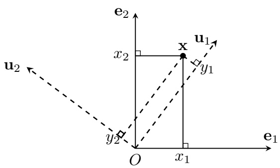

Hình 1.1. Chuyển đổi toạ độ trong các hệ cơ sở khác nhau. Trong hệ toạ độ $O \mathbf { e } _ { 1 } \mathbf { e } _ { 2 } , \mathbf { x }$ có toạ độ là $( x _ { 1 } , x _ { 2 } )$ . Trong hệ toạ độ $O \mathbf { u } _ { 1 } \mathbf { u } _ { 2 }$ x có toạ độ là $( y _ { 2 } , y _ { 2 } )$

với $\mathbf { U } = \left[ \begin{matrix} { \mathbf { u } _ { 1 } \dots \mathbf { u } _ { m } } \\ \end{matrix} \right]$ . Lúc này, vector $\mathbf { y } = [ y _ { 1 } , y _ { 2 } , \ldots , y _ { m } ] ^ { T }$ chính là biểu diễn của x trong hệ cơ sở mới. Biểu diễn này là duy nhất vì $\mathbf { y } = \mathbf { U } ^ { - 1 } \mathbf { x }$

Trong các ma trận đóng vai trò như hệ cơ sở, các ma trận trực giao, tức $\mathbf { U } ^ { T } \mathbf { U } = \mathbf { I }$ được quan tâm nhiều hơn vì nghịch đảo và chuyển vị của chúng bằng nhau, $\mathbf { U } ^ { - 1 } = \mathbf { U } ^ { T }$ . Khi đó, y có thể được tính một cách nhanh chóng $\mathbf { y } = \mathbf { U } ^ { T } \mathbf { x } .$ Từ đó suy ra $y _ { i } = \mathbf { x } ^ { T } \mathbf { u } _ { i } = \mathbf { u } _ { i } ^ { T } \mathbf { x } , i = 1 , \ldots , m$ . Dưới góc nhìn hình học, hệ trực giao tạo thành một hệ trục toạ độ Descartes vuông góc. Hình 1.1 là một ví dụ về việc chuyển hệ cơ sở trong không gian hai chiều.

Có thể nhận thấy rằng vector 0 được biểu diễn như nhau trong mọi hệ cơ sở.

Việc chuyển đổi hệ cơ sở sử dụng ma trận trực giao có thể được coi như một phép xoay trục toạ độ. Nhìn theo một cách khác, đây cũng chính là một phép xoay vector dữ liệu theo chiều ngược lại, nếu ta coi các trục toạ độ là cố định. Trong Chương 21, chúng ta sẽ thấy một ứng dụng quan trọng của việc đổi hệ cơ sở.

## 1.11. Trị riêng và vector riêng

## 1.11.1. Định nghĩa

Cho một ma trận vuông $\mathbf { A }   \in   \mathbb { R } ^ { n \times n }$ , một vector $\mathbf { x }   \in   \mathbb { C } ^ { n } ( \mathbf { x }   \neq   \mathbf { 0 } )$ và một số vô hướng $\lambda \in \mathbb { C }$ . Nếu

$$
\mathbf {A} \mathbf {x} = \lambda \mathbf {x},\tag{1.26}
$$

ta nói λ là một trị riêng của A, x là một vector riêng ứng với trị riêng λ.

Từ định nghĩa ta cũng có $( \mathbf { A } - \lambda \mathbf { I } ) \mathbf { x } = 0$ , tức x là một vector nằm trong không gian $\mathcal { N } ( \mathbf { A } - \lambda \mathbf { I } )$ $\mathrm { V i } \; \mathbf { x } \neq 0$ , ta có $\mathbf { A } - \lambda \mathbf { I }$ là một ma trận không khả nghịch. Nói cách khác det $\left( \mathbf { A } - \lambda \mathbf { I } \right) = 0$ , tức λ là nghiệm của phương trình det $( \mathbf { A } - t \mathbf { I } ) = 0$ Định thức này là một đa thức bậc n của t. Đa thức này còn được gọi là đa thức đặc trưng của A, được ký hiệu là $p _ { \mathbf { A } } ( t )$ . Tập hợp tất cả các trị riêng của một ma trận vuông còn được gọi là phổ của ma trận đó.

<!-- page: 36 -->

## 1.11.2. Tính chất

a. Giả sử λ là một trị riêng của $\mathbf { A } \in \mathbb { C } ^ { n \times n }$ , đặt $E _ { \lambda } ( \mathbf { A } )$ là tập các vector riêng ứng với trị riêng λ đó. Bạn đọc có thể chứng minh được:

• Nếu $\mathbf { x } \in E _ { \lambda } ( \mathbf { A } )$ thì kx $\in E _ { \lambda } ( \mathbf { A } ) , \forall k \in \mathbb { C } .$

• Nếu $\mathbf { x } _ { 1 } , \mathbf { x } _ { 2 } \in E _ { \lambda } ( \mathbf { A } )$ thì $\mathbf { x } _ { 1 } + \mathbf { x } _ { 2 } \in E _ { \lambda } ( \mathbf { A } )$

Từ đó suy ra tập hợp các vector riêng ứng với một trị riêng của một ma trận vuông tạo thành một không gian vector con, thường được gọi là không gian riêng ứng với trị riêng đó.

b. Mọi ma trận vuông bậc n đều có n trị riêng, kể cả lặp và phức.

c. Tích của tất cả các trị riêng của một ma trận bằng định thức của ma trận đó. Tổng tất cả các trị riêng của một ma trận bằng tổng các phần tử trên đường chéo của ma trận đó.

d. Phổ của một ma trận bằng phổ của ma trận chuyển vị của nó.

e. Nếu A, B là các ma trận vuông cùng bậc thì $p _ { \mathbf { A B } } ( t ) = p _ { \mathbf { B A } } ( t )$ . Như vậy, tuy AB có thể khác BA, đa thức đặc trưng của AB và BA luôn bằng nhau nhau. Tức phổ của hai tích này là trùng nhau.

f. Tất cả các trị riêng của một ma trận Hermitian là các số thực. Thật vậy, giả sử λ là một trị riêng của một ma trận Hermitian A và x là một vector riêng ứng với trị riêng đó. Từ định nghĩa ta suy ra:

$$
\mathbf {A} \mathbf {x} = \lambda \mathbf {x} \Rightarrow (\mathbf {A} \mathbf {x}) ^ {H} = \bar {\lambda} \mathbf {x} ^ {H} \Rightarrow \bar {\lambda} \mathbf {x} ^ {H} = \mathbf {x} ^ {H} \mathbf {A} ^ {H} = \mathbf {x} ^ {H} \mathbf {A}\tag{1.27}
$$

với $\bar { \lambda }$ là liên hiệp phức của số vô hướng λ. Nhân cả hai vế vào bên phải với x ta có:

$$
\bar {\lambda} \mathbf {x} ^ {H} \mathbf {x} = \mathbf {x} ^ {H} \mathbf {A} \mathbf {x} = \lambda \mathbf {x} ^ {H} \mathbf {x} \Rightarrow (\lambda - \bar {\lambda}) \mathbf {x} ^ {H} \mathbf {x} = 0\tag{1.28}
$$

vì $\mathbf { x } \neq 0$ nên $\mathbf { x } ^ { H } \mathbf { x } \neq 0$ . Từ đó suy ra $\bar { \lambda } = \lambda$ , tức λ phải là một số thực.

g. Nếu (λ, x) là một cặp trị riêng, vector riêng của một ma trận khả nghịch A, thì $\left( \frac { 1 } { \lambda } , \mathbf { x } \right)$ là một cặp trị riêng, vector riêng của A−1, vì $\mathbf{A}\mathbf{x} = \lambda\mathbf{x} \Rightarrow \frac{1}{\lambda}\mathbf{x} = \mathbf{A}^{-1}\mathbf{x}.$

## 1.12. Chéo hoá ma trận

Việc phân tích một đại lượng toán học ra thành các đại lượng nhỏ hơn mang lại nhiều hiệu quả. Phân tích một số thành tích các thừa số nguyên tố giúp kiểm tra một số có bao nhiêu ước số. Phân tích đa thức thành nhân tử giúp tìm nghiệm của đa thức. Việc phân tích một ma trận thành tích của các ma trận đặc biệt

<!-- page: 37 -->

cũng mang lại nhiều lợi ích trong việc giải hệ phương trình tuyến tính, tính luỹ thừa của ma trận, xấp xỉ ma $\operatorname { t r } { \widehat { \operatorname { a n } } } , . .$ . Trong mục này, chúng ta sẽ ôn lại một phương pháp phân tích ma trận quen thuộc có tên là chéo hoá ma trận.

Giả sử $\mathbf { x } _ { 1 } , \ldots , \mathbf { x } _ { n } \neq \mathbf { 0 }$ là các vector riêng của một ma trận vuông A ứng với các trị riêng lặp hoặc phức $\lambda _ { 1 } , \ldots , \lambda _ { n } \mathbf { : } \mathbf { A } \mathbf { x } _ { i } = \lambda _ { i } \mathbf { x } _ { i } , \forall i = 1 , \ldots , n$

Đặt $\boldsymbol{\varLambda} = \mathrm{diag}(\lambda_1, \lambda_2, \ldots, \lambda_n)$ , và $\mathbf { X } = \left[ \begin{matrix} { \mathbf { x } _ { 1 } , \mathbf { x } _ { 2 } , \ldots , \mathbf { x } _ { n } } \\ \end{matrix} \right]$ , ta sẽ có AX = XΛ. Hơn nữa, nếu các trị riêng $\mathbf { x } _ { 1 } , \ldots , \mathbf { x } _ { n }$ là độc lập tuyến tính, ma trận X là một ma trận khả nghịch. Khi đó ta có thể viết A dưới dạng tích của ba ma trận:

$$
\mathbf {A} = \mathbf {X} \boldsymbol {\Lambda} \mathbf {X} ^ {- 1}\tag{1.29}
$$

Các vector riêng $\mathbf { x } _ { i }$ thường được chọn sao cho $\mathbf { x } _ { i } ^ { T } \mathbf { x } _ { i } = 1$ . Cách biểu diễn một ma trận như (1.29) được gọi là phép phân tích trị riêng.

Ma trận các trị riêng Λ là một ma trận đường chéo. Vì vậy, cách khai triển này cũng có tên gọi là chéo hoá ma trận. Nếu ma trận A có thể phân tích được dưới dạng (1.29), ta nói rằng A là chéo hoá được.

## 1.12.1. Lưu ý

a. Khái niệm chéo hoá ma trận chỉ áp dụng với ma trận vuông. Vì không có định nghĩa vector riêng hay trị riêng cho ma trận không vuông.

b. Không phải ma trận vuông nào cũng chéo hoá được. Một ma trận vuông bậc n chéo hoá được khi và chỉ khi nó có đủ n vector riêng độc lập tuyến tính.

c. Nếu một ma trận là chéo hoá được, có nhiều hơn một cách chéo hoá ma trận đó. Chỉ cần đổi vị trí của các $\lambda _ { i }$ và vị trí tương ứng các cột của X, ta sẽ có một cách chéo hoá mới.

d. Nếu A có thể viết được dưới dạng (1.29), khi đó các luỹ thừa có nó cũng chéo hoá được. Cụ thể:

$$
\mathbf {A} ^ {2} = (\mathbf {X} \boldsymbol {\Lambda} \mathbf {X} ^ {- 1}) (\mathbf {X} \boldsymbol {\Lambda} \mathbf {X} ^ {- 1}) = \mathbf {X} \boldsymbol {\Lambda} ^ {2} \mathbf {X} ^ {- 1}; \quad \mathbf {A} ^ {k} = \mathbf {X} \boldsymbol {\Lambda} ^ {k} \mathbf {X} ^ {- 1}, \forall k \in \mathbb {N}\tag{1.30}
$$

Xin chú ý rằng nếu λ và x là một cặp trị riêng, vector riêng của A, thì $\lambda ^ { k }$ và x là một cặp trị riêng, vector riêng của $\mathbf { A } ^ { k }$ . Thật vậy, $\mathbf { A } ^ { k } \mathbf { x } = \mathbf { A } ^ { k - 1 } ( \mathbf { A } \mathbf { x } )   =$ $\lambda \mathbf{A}^{k - 1} \mathbf{x} = \cdots = \lambda^{k} \mathbf{x}$

e. Nếu A khả nghịch, thì $\mathbf { A } ^ { - 1 } = ( \mathbf { X } \mathbf { \varLambda } \mathbf { X } ^ { - 1 } ) ^ { - 1 } = \mathbf { X } \mathbf { \varLambda } ^ { - 1 } \mathbf { X } ^ { - 1 }$

<!-- page: 38 -->

## 1.13. Ma trận xác định dương

## 1.13.1. Định nghĩa

Một ma trận đối xứng5 $\mathbf { A } \in \mathbb { R } ^ { n \times n }$ được gọi là xác định dương nếu:

$$
\mathbf {x} ^ {T} \mathbf {A} \mathbf {x} > 0, \forall \mathbf {x} \in \mathbb {R} ^ {n}, \mathbf {x} \neq \mathbf {0}.\tag{1.31}
$$

Một ma trận đối xứng $\mathbf { A } \in \mathbb { R } ^ { n \times n }$ được gọi là nửa xác định dương nếu:

$$
\mathbf {x} ^ {T} \mathbf {A} \mathbf {x} \geq 0, \forall \mathbf {x} \in \mathbb {R} ^ {n}, \mathbf {x} \neq \mathbf {0}.\tag{1.32}
$$

Trên thực $\mathrm { t } \hat { \mathrm { e } } ,$ ma trận nửa xác định dương được sử dụng nhiều hơn.

Ma trận xác định âm và nửa xác định âm cũng được định nghĩa tương tự.

Ký hiệu $\mathbf { A } \succ 0 , \succeq 0 , \prec 0 , \preceq 0$ lần lượt $\mathrm { d } \hat { \mathrm { e } }$ chỉ một ma trận là xác định dương, nửa xác định dương, xác định âm, và nửa xác định âm. Ký hiệu $\mathbf { A } \succ \mathbf { B }$ cũng được dùng để chỉ ra rằng $\mathbf { A } - \mathbf { B } \succ 0$

Ví dụ, $\mathbf{A} = \begin{bmatrix} 1 & -1 \\ -1 & 1 \end{bmatrix}$ là nửa xác định dương vì với mọi vector $\mathbf { x } = \left[ \begin{matrix} { u } \\ { v } \end{matrix} \right]$ , ta có:

$$
\mathbf {x} ^ {T} \mathbf {A} \mathbf {x} = \left[ \begin{array}{c c} u & v \end{array} \right] \left[ \begin{array}{c c} 1 & - 1 \\ - 1 & 1 \end{array} \right] \left[ \begin{array}{c} u \\ v \end{array} \right] = u ^ {2} + v ^ {2} - 2 u v = (u - v) ^ {2} \geq 0, \forall u, v \in \mathbb {R}\tag{1.33}
$$

Mở rộng, một ma trận Hermitian $\mathbf { A } \in \mathbb { C } ^ { n \times n }$ là xác định dương nếu

$$
\mathbf {x} ^ {H} \mathbf {A} \mathbf {x} > 0, \forall \mathbf {x} \in \mathbb {C} ^ {n}, \mathbf {x} \neq \mathbf {0}.\tag{1.34}
$$

Các khái niệm nửa xác định dương, xác định âm, và nửa xác định dương cũng được định nghĩa tương tự cho các ma trận Hermitian.

## 1.13.2. Tính chất

a. Mọi trị riêng của một ma trận Hermitian xác định dương đều là một số thực dương. Trước hết, các trị riêng của một ma trận Hermitian là các số thực. Để chứng minh chúng là các số thực dương, ta giả sử λ là một trị riêng của một ma trận xác định dương A và $\mathbf { x } \neq \mathbf { 0 }$ là một vector riêng ứng với trị riêng đó. Nhân vào bên trái cả hai vế của Ax = λx với $\mathbf { x } ^ { H }$ ta có:

$$
\lambda \mathbf {x} ^ {H} \mathbf {x} = \mathbf {x} ^ {H} \mathbf {A} \mathbf {x} > 0\tag{1.35}
$$

Vì $\forall \mathbf { x } \neq \mathbf { 0 } , \mathbf { x } ^ { H } \mathbf { x } > 0$ nên ta phải có $\lambda > 0$ . Tương tự, ta có thể chứng minh được rằng mọi trị riêng của một ma trận nửa xác định dương là không âm.

<small><span class="docvortex-page-footnote" data-block-type="page_footnote" style="color:#6b7280">ý,</span></small>

<small><span class="docvortex-page-footnote" data-block-type="page_footnote" style="color:#6b7280">5 Chú  tồn tại những ma trận không đối xứng thoả mãn điều kiện (1.31). Ta sẽ không xét những ma trận này trong cuốn sách.</span></small>

<!-- page: 39 -->

b. Mọi ma trận xác định dương đều khả nghịch. Hơn nữa, định thức của nó là một số dương. Điều này được trực tiếp suy ra từ tính chất (a). Nhắc lại rằng định thức của một ma trận bằng tích tất cả các trị riêng của nó.

c. Tiêu chuẩn Sylvester. Trước hết, chúng ta làm quen với hai khái niệm: ma trận con chính và ma trận con chính trước.

Giả sử A là một ma trận vuông bậc n. Gọi I là một tập con khác rỗng bất kỳ của $\{ 1 , 2 , \ldots , n \}$ , ký hiệu $\mathbf { A } _ { \mathcal { I } }$ để chỉ một ma trận con của A nhận được bằng cách trích ra các hàng và cột có chỉ số nằm trong I của A. Khi đó, $\mathbf { A } _ { \mathcal { I } }$ được gọi là một ma trận con chính của A. Nếu I chỉ bao gồm các số tự nhiên liên tiếp từ 1 đến $k \leq n .$ , ta nói $\mathbf { A } _ { \mathcal { I } }$ là một ma trận con chính trước bậc k của A.

Tiêu chuẩn Sylvester nói rằng: Một ma trận Hermitian là xác định dương khi và chỉ khi mọi ma trận con chính trước của nó là xác định dương.

Các ma trận Hermitian nửa xác định dương cần điều kiện chặt hơn: Một ma trận Hermitian là nửa xác định dương khi và chỉ khi mọi ma trận con chính của nó là nửa xác định dương.

d. Với mọi ma trận B không nhất thiết vuông, ma trận $\mathbf { A } = \mathbf { B } ^ { H } \mathbf { B }$ là nửa xác định dương. Thật vậy, với mọi vector $\mathbf { x } \neq 0$ với chiều phù hợp, $\mathbf { x } ^ { H } \mathbf { A } \mathbf { x }   =$ $\begin{array} { r } { \mathbf { x } ^ { H } \mathbf { B } ^ { H } \mathbf { B } \mathbf { x } = ( \mathbf { B } \mathbf { x } ) ^ { H } ( \mathbf { B } \mathbf { x } ) \geq 0 } \end{array}$

e. Phân tích Cholesky: Mọi ma trận Hermitian nửa xác định dương A đều biểu diễn được duy nhất dưới dạng $\mathbf { A } = \mathbf { L } \mathbf { L } ^ { H }$ với L là một ma trận tam giác dưới với các thành phần trên đường chéo là thực dương.

f. Nếu A là một ma trận nửa xác định dương thì $\mathbf { x } ^ { T } \mathbf { A } \mathbf { x } = 0 \Leftrightarrow \mathbf { A } \mathbf { x } = 0$

Nếu $\mathbf { A } \mathbf { x } = 0$ , dễ thấy $\mathbf { x } ^ { T } \mathbf { A } \mathbf { x } = 0$ . Nếu $\mathbf { x } ^ { T } \mathbf { A } \mathbf { x } = 0$ , với $\mathbf { y } \neq \mathbf { 0 }$ bất kỳ có cùng kích thước với x, xét hàm số

$$
f (\lambda) = (\mathbf {x} + \lambda \mathbf {y}) ^ {T} \mathbf {A} (\mathbf {x} + \lambda \mathbf {y})\tag{1.36}
$$

Hàm số này không âm với mọi λ vì A là một ma trận nửa xác định dương. Đây là một tam thức bậc hai của λ:

$$
f (\lambda) = \mathbf {y} ^ {T} \mathbf {A} \mathbf {y} \lambda^ {2} + 2 \mathbf {y} ^ {T} \mathbf {A} \mathbf {x} \lambda + \mathbf {x} ^ {T} \mathbf {A} \mathbf {x} = \mathbf {y} ^ {T} \mathbf {A} \mathbf {y} \lambda^ {2} + 2 \mathbf {y} ^ {T} \mathbf {A} \mathbf {x} \lambda\tag{1.37}
$$

Xét hai trường hợp:

$\mathbf { y } ^ { T } \mathbf { A } \mathbf { y } = 0$ . Khi đó, $f ( \lambda ) = 2 \mathbf { y } ^ { T } \mathbf { A } \mathbf { x } \lambda \geq 0 , \forall \lambda$ khi và chỉ khi $\mathbf { y } ^ { T } \mathbf { A } \mathbf { x } = 0$

$\mathbf { y } ^ { T } \mathbf { A } \mathbf { y }   >   0$ . Khi đó tam thức bậc hai $f(\lambda) \geq 0, \forall \lambda$ xảy ra khi và chỉ khi $\varDelta ^ { \prime } = ( \mathbf { y } ^ { T } \mathbf { A } \mathbf { x } ) ^ { 2 } \leq 0$ . Điều này cũng đồng nghĩa với việc $\mathbf { y } ^ { T } \mathbf { A } \mathbf { x } = 0$

Tóm lại, $\mathbf { y } ^ { T } \mathbf { A } \mathbf { x } = 0 , \; \forall \mathbf { y } \neq \mathbf { 0 }$ . Điều này chỉ xảy ra nếu $\mathbf { A } \mathbf { x } = 0 .$

<!-- page: 40 -->

## 1.14. Chuẩn

Trong không gian một chiều, khoảng cách giữa hai điểm là trị tuyệt đối của hiệu giữa hai giá trị đó. Trong không gian hai chiều, tức mặt phẳng, chúng ta thường dùng khoảng cách Euclid để đo khoảng cách giữa hai điểm. Khoảng cách Euclid chính là độ dài đoạn thẳng nối hai điểm trong mặt phẳng. Đôi khi, để đi từ một điểm này tới một điểm kia, chúng ta không thể đi bằng đường thẳng vì còn phụ thuộc vào hình dạng đường đi nối giữa hai điểm.

Việc đo khoảng cách giữa hai điểm dữ liệu nhiều chiều rất cần thiết trong machine learning. Đây chính là lý do khái niệm chuẩn (norm) ra đời. Để xác định khoảng cách giữa hai vector y và z, người ta thường áp dụng một hàm số lên vector hiệu x = y − z. Hàm số này cần có một vài tính chất đặc biệt.

<div class="docvortex-algorithm" style="white-space: pre-wrap; font-family:monospace;">
Định nghĩa 1.1: Chuẩn – Norm

ột hàm số $f : \mathbb{R}^n \to \mathbb{R}$ được gọi là một chuẩn nếu nó thỏa mãn ba điều kiện sau đây:

a. $f(\mathbf{x}) \geq 0$. Dấu bằng xảy ra $\Leftrightarrow \mathbf{x} = \mathbf{0}$.

b. $f(\alpha \mathbf{x}) = |\alpha| f(\mathbf{x}), \quad \forall \alpha \in \mathbb{R}$

c. $f(\mathbf{x}_1) + f(\mathbf{x}_2) \geq f(\mathbf{x}_1 + \mathbf{x}_2), \quad \forall \mathbf{x}_1, \mathbf{x}_2 \in \mathbb{R}^n$
</div>

Điều kiện a) là dễ hiểu vì khoảng cách không thể là một số âm. Hơn nữa, khoảng cách giữa hai điểm y và z bằng 0 khi và chỉ khi hai điểm đó trùng nhau, tức $\mathbf { x } = \mathbf { y } - \mathbf { z } = \mathbf { 0 }$

Điều kiện b) cũng có thể được lý giải như sau. Nếu ba điểm y, v và z thẳng hàng, hơn nữa $\mathbf { v } - \mathbf { y } = \alpha ( \mathbf { v } - \mathbf { z } )$ thì khoảng cách giữa v và y gấp |α| lần khoảng cách giữa v và z.

Điều kiện c) chính là bất đẳng thức tam giác nếu ta coi $\mathbf { x } _ { 1 } = \mathbf { y } - \mathbf { w } , \mathbf { x } _ { 2 } = \mathbf { w } - \mathbf { z }$ với w là một điểm bất kỳ trong cùng không gian.

## 1.14.1. Một số chuẩn vector thường dùng

Độ dài Euclid của một vector $\mathbf { x } \in \mathbb { R } ^ { n }$ chính là một chuẩn, chuẩn này được gọi là chuẩn $\ell _ { 2 }$ hoặc chuẩn Euclid:

$$
\| \mathbf {x} \| _ {2} = \sqrt {x _ {1} ^ {2} + x _ {2} ^ {2} + \cdots + x _ {n} ^ {2}}\tag{1.38}
$$

Bình phương của chuẩn $\ell _ { 2 }$ chính là tích vô hướng của một vector với chính nó, $\| \mathbf { x } \| _ { 2 } ^ { 2 } = \mathbf { x } ^ { T } \mathbf { x }$

<!-- page: 41 -->

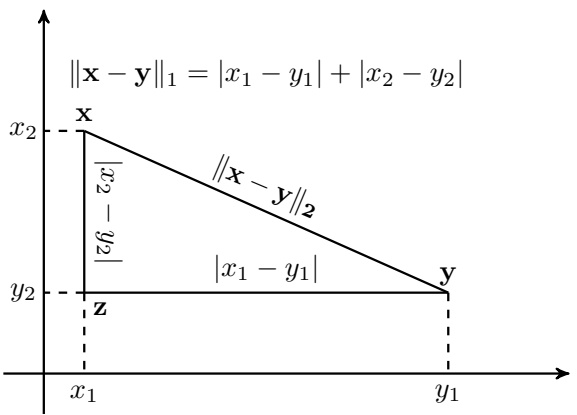

Hình 1.2. Minh họa chuẩn $\ell _ { 1 }$ và chuẩn $\ell _ { 2 }$ trong không gian hai chiều. Chuẩn $\ell _ { 2 }$ chính là khoảng cách Euclid. Trong khi đó chuẩn $\ell _ { 1 }$ là quãng đường ngắn nhất giữa hai điểm nếu chỉ được đi theo các đường song song với các trục toạ độ.

Với p là một số không nhỏ hơn 1 bất kỳ, hàm số:

$$
\| \mathbf {x} \| _ {p} = (| x _ {1} | ^ {p} + | x _ {2} | ^ {p} + \dots | x _ {n} | ^ {p}) ^ {\frac {1}{p}}\tag{1.39}
$$

được chứng minh thỏa mãn ba điều kiện của chuẩn, và được gọi là chuẩn $\ell _ { p }$

Dưới đây là một vài giá trị của p thường được dùng.

a. Khi $p = 2$ , ta có chuẩn $\ell _ { 2 }$ như $\mathring { \mathrm { d } }$ trên.

b. Khi $p = 1$ , ta có chuẩn $\ell _ { 1 } \colon \| \mathbf { x } \| _ { 1 } = | x _ { 1 } | + | x _ { 2 } | + \dots + | x _ { n } |$ là tổng các trị tuyệt đối của từng phần tử của x. Hình 1.2 là một ví dụ sánh chuẩn $\ell _ { 1 }$ và chuẩn $\ell _ { 2 }$ trong không gian hai chiều. Chuẩn $\ell _ { 2 }$ chính là khoảng cách Euclid giữa x và y. Trong khi đó, khoảng cách chuẩn $\ell _ { 1 }$ giữa hai điểm này (đường gấp khúc xzy) có thể diễn giải như là quãng đường từ x tới y nếu chỉ được phép đi song song với các trục toạ độ.

c. Khi $p \to \infty$ , giả sử $i = \arg \operatorname { m a x } _ { j = 1 , 2 , \ldots , n } | x _ { j } |$ . Khi đó:

$$
\| \mathbf {x} \| _ {p} = | x _ {i} | \left(1 + \left| \frac {x _ {1}}{x _ {i}} \right| ^ {p} + \dots + \left| \frac {x _ {i - 1}}{x _ {i}} \right| ^ {p} + \left| \frac {x _ {i + 1}}{x _ {i}} \right| ^ {p} + \dots + \left| \frac {x _ {n}}{x _ {i}} \right| ^ {p}\right) ^ {\frac {1}{p}}\tag{1.40}
$$

Ta thấy rằng

$$
\lim _ {p \to \infty} \left(1 + \left| \frac {x _ {1}}{x _ {i}} \right| ^ {p} + \dots + \left| \frac {x _ {i - 1}}{x _ {i}} \right| ^ {p} + \left| \frac {x _ {i + 1}}{x _ {i}} \right| ^ {p} + \dots + \left| \frac {x _ {n}}{x _ {i}} \right| ^ {p}\right) ^ {\frac {1}{p}} = 1\tag{1.41}
$$

vì đại lượng trong dấu ngoặc đơn không vượt quá n. Ta có

$$
\| \mathbf {x} \| _ {\infty} \triangleq \lim _ {p \to \infty} \| \mathbf {x} \| _ {p} = | x _ {i} | = \max _ {j = 1, 2, \dots , n} | x _ {j} |\tag{1.42}
$$

## 1.14.2. Chuẩn Frobenius của ma trận

Với một ma trận $\mathbf { A } \in \mathbb { R } ^ { m \times n }$ , chuẩn thường được dùng nhất là chuẩn Frobenius, ký hiệu là $\| \mathbf { A } \| _ { F } ,$ là căn bậc hai của tổng bình phương tất cả các phần tử của nó:

<!-- page: 42 -->

$$
\| \mathbf {A} \| _ {F} = \sqrt {\sum_ {i = 1} ^ {m} \sum_ {j = 1} ^ {n} a _ {i j} ^ {2}}
$$

Chú ý rằng chuẩn $\ell _ { 2 } ,   \| \mathbf { A } \| _ { 2 }$ , là một chuẩn khác của ma trận, không phổ biến bằng chuẩn Frobenius. Bạn đọc có thể xem chuẩn $\ell _ { 2 }$ của ma trận trong Phụ lục A.

## 1.15. Vết

Vết (trace) của một ma trận vuông A được ký hiệu là trace(A), là tổng tất cả các phần tử trên đường chéo chính của nó. Hàm vết xác định trên tập các ma trận vuông được sử dụng nhiều trong tối ưu vì nó có những tính chất đẹp.

Các tính chất quan trọng của hàm vết, với giả sử rằng các ma trận trong hàm vết là vuông và các phép nhân ma trận thực hiện được:

a. Một ma trận vuông bất kỳ và chuyển vị của nó có vết bằng nhau: trace $( \mathbf { A } ) =$ trace(A<sup>T</sup>). Việc này được suy ra từ việc phép chuyển vị không làm thay đổi các phần tử trên đường chéo chính của một ma trận.

b. Vết của một tổng bằng tổng các vết:

$$
\mathrm{trace} (\sum_ {i = 1} ^ {k} \mathbf {A} _ {i}) = \sum_ {i = 1} ^ {k} \mathrm{trace} (\mathbf {A} _ {i})
$$

c. tr $\mathrm { a c e } ( k \mathbf { A } ) = k \mathrm { t r a c e } ( \mathbf { A } )$ với k là một số vô hướng bất kỳ.

d. trace $\begin{array} { r } { \iota ( \mathbf { A } ) = \sum _ { i = 1 } ^ { D } \lambda _ { i } } \end{array}$ với A là một ma trận vuông và $\lambda _ { i } , i = 1 , 2 , \ldots , N$ là toàn bộ các trị riêng của nó, có thể lặp hoặc phức. Việc chứng minh tính chất này có thể được dựa trên ma trận đặc trưng của A và định lý Viète.

e. trace(AB) = trace(BA). Đẳng thức này được suy ra từ việc đa thức đặc trưng của AB và BA là như nhau. Bạn đọc cũng có thể chứng minh bằng cách tính trực tiếp các phần tử trên đường chéo chính của AB và BA.

f. tr $\mathrm{ace}(\mathbf{A}\mathbf{B}\mathbf{C}) = \mathrm{trace}(\mathbf{B}\mathbf{C}\mathbf{A})$ , nhưng trace(ABC) không đồng nhất với trace(ACB).

g. Nếu X là một ma trận khả nghịch cùng chiều với A thì

$$
\mathrm{trace} (\mathbf {X A X} ^ {- 1}) = \mathrm{trace} (\mathbf {X} ^ {- 1} \mathbf {X A}) = \mathrm{trace} (\mathbf {A})
$$

h. $\| \mathbf { A } \| _ { F } ^ { 2 } = \operatorname { t r a c e } ( \mathbf { A } ^ { T } \mathbf { A } ) = \operatorname { t r a c e } ( \mathbf { A } \mathbf { A } ^ { T } )$ với A là một ma trận bất kỳ. Từ đây ta cũng suy ra trace(AA<sup>T</sup>) ≥ 0 với mọi ma trận A.

<!-- page: 43 -->

# Giải tích ma trận

Giả sử rằng các gradient tồn tại trong toàn bộ chương. Tài liệu tham khảo chính của chương là Matrix calculus – Stanford ([https://goo.gl/BjTPLr](https://goo.gl/BjTPLr)).

## 2.1. Gradient của hàm trả về một số vô hướng

Gradient bậc nhất (first-order gradient) hay viết gọn là gradient của một hàm số $f ( \mathbf { x } ) : \mathbb { R } ^ { n } \rightarrow \mathbb { R }$ theo x, ký hiệu là $\nabla _ { \mathbf { x } } f ( \mathbf { x } )$ , được định nghĩa bởi

$$
\nabla_ {\mathbf {x}} f (\mathbf {x}) \triangleq \left[ \begin{array}{c} \frac {\partial f (\mathbf {x})}{\partial x _ {1}} \\ \frac {\partial f (\mathbf {x})}{\partial x _ {2}} \\ \vdots \\ \frac {\partial f (\mathbf {x})}{\partial x _ {n}} \end{array} \right] \in \mathbb {R} ^ {n},\tag{2.1}
$$

trong đó $\frac { \partial f ( \mathbf { x } ) } { \partial x _ { i } }$ là đạo hàm riêng của hàm số theo thành phần thứ i của vector x. Đạo hàm này được tính khi tất cả các biến, ngoài $x _ { i } ,$ được giả sử là hằng số. Nếu không có thêm biến nào khác, $\nabla _ { \mathbf { x } } f ( \mathbf { x } )$ thường được viết gọn là $\nabla f ( \mathbf { x } )$ . Gradient của hàm số này là một vector có cùng chiều với vector đang được lấy gradient. Tức nếu vector được viết ở dạng cột thì gradient cũng phải được viết ở dạng cột.

Gradient bậc hai (second-order gradient) của hàm số trên còn được gọi là Hesse (Hessian) và được định nghĩa như sau:

<!-- page: 44 -->

$$
\nabla^ {2} f (\mathbf {x}) \triangleq \left[ \begin{array}{c c c c} \frac {\partial^ {2} f (\mathbf {x})}{\partial x _ {1} ^ {2}} & \frac {\partial^ {2} f (\mathbf {x})}{\partial x _ {1} \partial x _ {2}} & \dots & \frac {\partial^ {2} f (\mathbf {x})}{\partial x _ {1} \partial x _ {n}} \\ \frac {\partial^ {2} f (\mathbf {x})}{\partial x _ {2} \partial x _ {1}} & \frac {\partial^ {2} f (\mathbf {x})}{\partial x _ {2} ^ {2}} & \dots & \frac {\partial^ {2} f (\mathbf {x})}{\partial x _ {2} \partial x _ {n}} \\ \vdots & \vdots & \ddots & \vdots \\ \frac {\partial^ {2} f (\mathbf {x})}{\partial x _ {n} \partial x _ {1}} & \frac {\partial^ {2} f (\mathbf {x})}{\partial x _ {n} \partial x _ {2}} & \dots & \frac {\partial^ {2} f (\mathbf {x})}{\partial x _ {n} ^ {2}} \end{array} \right] \in \mathbb {S} ^ {n}.\tag{2.2}
$$

Gradient của một hàm số $f ( \mathbf { X } ) : \mathbb { R } ^ { n \times m } \rightarrow \mathbb { R }$ theo ma trận X được định nghĩa là

$$
\nabla f (\mathbf {X}) = \left[ \begin{array}{c c c c} \frac {\partial f (\mathbf {X})}{\partial x _ {1 1}} & \frac {\partial f (\mathbf {X})}{\partial x _ {1 2}} & \dots & \frac {\partial f (\mathbf {X})}{\partial x _ {1 m}} \\ \frac {\partial f (\mathbf {X})}{\partial x _ {2 1}} & \frac {\partial f (\mathbf {X})}{\partial x _ {2 2}} & \dots & \frac {\partial f (\mathbf {X})}{\partial x _ {2 m}} \\ \vdots & \vdots & \ddots & \vdots \\ \frac {\partial f (\mathbf {X})}{\partial x _ {n 1}} & \frac {\partial f (\mathbf {X})}{\partial x _ {n 2}} & \dots & \frac {\partial f (\mathbf {X})}{\partial x _ {n m}} \end{array} \right] \in \mathbb {R} ^ {n \times m}.\tag{2.3}
$$

Gradient của hàm số $f : \mathbb { R } ^ { m \times n } \rightarrow$ R là một ma trận trong $\mathbb { R } ^ { m \times n }$

Cụ thể, để tính gradient của một hàm $f : \mathbb { R } ^ { m \times n } \rightarrow \mathbb { R }$ , ta tính đạo hàm riêng của hàm số đó theo từng thành phần của ma trận khi toàn bộ các thành phần khác được giả sử là hằng số. Tiếp theo, ta sắp xếp các đạo hàm riêng tính được theo đúng thứ tự trong ma trận.

Ví dụ: Xét hàm số $f : \mathbb { R } ^ { 2 } \to \mathbb { R } ,   f ( \mathbf { x } ) = x _ { 1 } ^ { 2 } + 2 x _ { 1 } x _ { 2 } + \sin ( x _ { 1 } ) + 2$ . Gradient bậc nhất theo x của hàm số đó là

$$
\nabla f (\mathbf {x}) = \left[ \begin{array}{c} \frac {\partial f (\mathbf {x})}{\partial x _ {1}} \\ \frac {\partial f (\mathbf {x})}{\partial x _ {2}} \end{array} \right] = \left[ \begin{array}{c} 2 x _ {1} + 2 x _ {2} + \cos (x _ {1}) \\ 2 x _ {1} \end{array} \right].
$$

Gradient bậc hai theo x, hay Hesse là

$$
\nabla^ {2} f (\mathbf {x}) = \left[ \begin{array}{c c} \frac {\partial^ {2} f (\mathbf {x})}{\partial x _ {1} ^ {2}} & \frac {\partial f ^ {2} (\mathbf {x})}{\partial x _ {1} \partial x _ {2}} \\ \frac {\partial^ {2} f (\mathbf {x})}{\partial x _ {2} \partial x _ {1}} & \frac {\partial f ^ {2} (\mathbf {x})}{\partial x _ {2} ^ {2}} \end{array} \right] = \left[ \begin{array}{c c} 2 - \sin (x _ {1}) & 2 \\ 2 & 0 \end{array} \right].
$$

Chú $\hat { \mathrm { y } }$ rằng Hesse luôn là một ma trận đối xứng.

<!-- page: 45 -->

## 2.2. Gradient của hàm trả $\mathbf { v } \hat { \hat { \mathbf { e } } }$ vector

Những hàm số mà đầu ra là một vector được gọi là hàm trả về vector (vectorvalued function).

Xét một hàm trả về vector với đầu vào là một số thực $v ( x ) : \mathbb { R } \rightarrow \mathbb { R } ^ { n }$

$$
v (x) = \left[ \begin{array}{c} v _ {1} (x) \\ v _ {2} (x) \\ \vdots \\ v _ {n} (x) \end{array} \right].\tag{2.4}
$$

Gradient của hàm số này theo x là một vector hàng như sau:

$$
\nabla v (x) \triangleq \left[ \frac {\partial v _ {1} (x)}{\partial x} \frac {\partial v _ {2} (x)}{\partial x} \dots \frac {\partial v _ {n} (x)}{\partial x} \right].\tag{2.5}
$$

Gradient bậc hai của hàm số này có dạng:

$$
\nabla^ {2} v (x) \triangleq \left[ \frac {\partial^ {2} v _ {1} (x)}{\partial x ^ {2}} \frac {\partial^ {2} v _ {2} (x)}{\partial x ^ {2}} \dots \frac {\partial^ {2} v _ {n} (x)}{\partial x ^ {2}} \right].\tag{2.6}
$$

Ví dụ: Cho một vector $\mathbf { a } \in \mathbb { R } ^ { n }$ và một hàm số trả về vector $v ( x ) = x \mathbf { a }$ , gradient và Hesse của nó lần lượt là

$$
\nabla v (x) = \mathbf {a} ^ {T}, \quad \nabla^ {2} v (x) = \mathbf {0} \in \mathbb {R} ^ {1 \times n}.\tag{2.7}
$$

Xét một hàm trả $\mathrm { v } \hat { \hat { \mathrm { e } } }$ vector với đầu vào là một vector $h ( \mathbf { x } ) : \mathbb { R } ^ { k } \rightarrow \mathbb { R } ^ { n }$ , gradient của nó là

$$
\nabla h (\mathbf {x}) \triangleq \left[ \begin{array}{c c c c} \frac {\partial h _ {1} (\mathbf {x})}{\partial x _ {1}} & \frac {\partial h _ {2} (\mathbf {x})}{\partial x _ {1}} & \dots & \frac {\partial h _ {n} (\mathbf {x})}{\partial x _ {1}} \\ \frac {\partial h _ {1} (\mathbf {x})}{\partial x _ {2}} & \frac {\partial h _ {2} (\mathbf {x})}{\partial x _ {2}} & \dots & \frac {\partial h _ {n} (\mathbf {x})}{\partial x _ {2}} \\ \vdots & \vdots & \ddots & \vdots \\ \frac {\partial h _ {1} (\mathbf {x})}{\partial x _ {k}} & \frac {\partial h _ {2} (\mathbf {x})}{\partial x _ {k}} & \dots & \frac {\partial h _ {n} (\mathbf {x})}{\partial x _ {k}} \end{array} \right] = \left[ \nabla h _ {1} (\mathbf {x}) \dots \nabla h _ {n} (\mathbf {x}) \right] \in \mathbb {R} ^ {k \times n}\tag{2.8}
$$

Gradient của hàm số $g : \mathbb { R } ^ { m } \rightarrow \mathbb { R } ^ { n }$ là một ma trận thuộc $\mathbb { R } ^ { m \times n }$

Gradient bậc hai của hàm $\mathrm { s } \hat { \mathrm { o } }$ trên là một mảng ba chiều. Trong phạm vi của cuốn sách, chúng ta sẽ không xét gradient bậc hai của các hàm số $g : \mathbb { R } ^ { m } \rightarrow \mathbb { R } ^ { n }$

Trước khi đến phần tính gradient của các hàm số thường gặp, chúng ta cần biết hai tính chất quan trọng khá giống với gradient của hàm một biến.

<!-- page: 46 -->

## 2.3. Tính chất quan trọng của gradient

## 2.3.1. Quy tắc tích

Giả sử các biến đầu vào là một ma trận và các hàm số có chiều phù hợp để phép nhân ma trận thực hiện được. Ta có

$$
\nabla \left(f (\mathbf {X}) ^ {T} g (\mathbf {X})\right) = \left(\nabla f (\mathbf {X})\right) g (\mathbf {X}) + \left(\nabla g (\mathbf {X})\right) f (\mathbf {X}).\tag{2.9}
$$

Quy tắc này tương tự như quy tắc tính đạo hàm của tích các hàm $f , g : \mathbb { R } \rightarrow$ R:

$$
(f (x) g (x)) ^ {\prime} = f ^ {\prime} (x) g (x) + g ^ {\prime} (x) f (x).
$$

Lưu $\hat { \mathrm { y } }$ rằng tính chất giao hoán không còn đúng với vector và ma trận, vì vậy nhìn chung

$$
\nabla \left(f (\mathbf {X}) ^ {T} g (\mathbf {X})\right) \neq g (\mathbf {X}) \left(\nabla f (\mathbf {X})\right) + f (\mathbf {X}) \left(\nabla g (\mathbf {X})\right).\tag{2.10}
$$

Biểu thức bên phải có thể không xác định khi chiều của các ma trận lệch nhau.

## 2.3.2. Quy tắc chuỗi

Quy tắc chuỗi được áp dụng khi tính gradient của các hàm hợp:

$$
\nabla_ {\mathbf {X}} g (f (\mathbf {X})) = (\nabla_ {\mathbf {X}} f) (\nabla_ {f} g).\tag{2.11}
$$

Quy tắc này cũng giống với quy tắc trong hàm một biến:

$$
(g (f (x))) ^ {\prime} = f ^ {\prime} (x) g ^ {\prime} (f).
$$

Một lưu $\hat { \mathrm { y } }$ nhỏ nhưng quan trọng khi làm việc với tích các ma trận là sự phù hợp về kích thước của các ma trận trong tích.

## 2.4. Gradient của các hàm số thường gặp

2.4.1. $f ( \mathbf { x } ) = \mathbf { a } ^ { T } \mathbf { x }$

Giả sử a, $\mathbf { x } \in \mathbb { R } ^ { n }$ , ta viết lại $f ( \mathbf { x } ) = \mathbf { a } ^ { T } \mathbf { x } = a _ { 1 } x _ { 1 } + a _ { 2 } x _ { 2 } + \cdots + a _ { n } x _ { n } .$

Nhận thấy $\frac { \partial f ( \mathbf { x } ) } { \partial x _ { i } } = a _ { i } , \forall i = 1 , 2 \ldots , n .$

$$
\mathrm{V} \hat {\mathrm{a}} \mathrm{y}, \nabla_ {\mathbf {x}} (\mathbf {a} ^ {T} \mathbf {x}) = \left[ a _ {1} a _ {2} \dots a _ {n} \right] ^ {T} = \mathbf {a}.
$$

Ngoài ra, vì $\mathbf { a } ^ { T } \mathbf { x } = \mathbf { x } ^ { T } \mathbf { a }$ nên $\nabla _ { \mathbf { x } } ( \mathbf { x } ^ { T } \mathbf { a } ) = \mathbf { a }$

<!-- page: 47 -->

## 2.4.2. $f ( \mathbf { x } ) = \mathbf { A } \mathbf { x }$

Đây là một hàm trả về vector $f : \mathbb { R } ^ { n } \rightarrow \mathbb { R } ^ { m }$ với $\mathbf { x } \in \mathbb { R } ^ { n } , \mathbf { A } \in \mathbb { R } ^ { m \times n }$ . Giả sử $\mathbf { a } _ { i }$ là hàng thứ i của ma trận A. Ta có

$$
\mathbf {A} \mathbf {x} = \left[ \begin{array}{c} \mathbf {a} _ {1} \mathbf {x} \\ \mathbf {a} _ {2} \mathbf {x} \\ \vdots \\ \mathbf {a} _ {m} \mathbf {x} \end{array} \right].
$$

Từ định nghĩa (2.8) và công thức gradient của $\mathbf { a } _ { i } \mathbf { X }$ , có thể suy ra

$$
\nabla_ {\mathbf {x}} (\mathbf {A} \mathbf {x}) = \left[ \mathbf {a} _ {1} ^ {T} \mathbf {a} _ {2} ^ {T} \dots \mathbf {a} _ {m} ^ {T} \right] = \mathbf {A} ^ {T}\tag{2.12}
$$

Từ đây suy ra đạo hàm của hàm số $f ( \mathbf { x } ) = \mathbf { x } = \mathbf { I } \mathbf { x }$ là

$$
\nabla \mathbf {x} = \mathbf {I}
$$

với I là ma trận đơn vị.

## 2.4.3. $\mathbf { \boldsymbol { f } } ( \mathbf { x } ) = \mathbf { x } ^ { T } \mathbf { A } \mathbf { x }$

Với $\mathbf { x } \in \mathbb { R } ^ { n } , \mathbf { A } \in \mathbb { R } ^ { n \times n }$ , áp dụng quy tắc tích (2.9) ta có

$$
\begin{array}{r l} \nabla f (\mathbf {x}) & = \nabla \left(\left(\mathbf {x} ^ {T}\right) (\mathbf {A x})\right) \\ & = \left(\nabla (\mathbf {x})\right) \mathbf {A x} + \left(\nabla (\mathbf {A x})\right) \mathbf {x} \\ & = \mathbf {I A x} + \mathbf {A} ^ {T} \mathbf {x} \\ & = (\mathbf {A} + \mathbf {A} ^ {T}) \mathbf {x}. \end{array}\tag{2.13}
$$

Từ (2.13) và (2.12), có thể suy ra $\nabla ^ { 2 } \mathbf { x } ^ { T } \mathbf { A } \mathbf { x } = \mathbf { A } ^ { T } + \mathbf { A }$ . Nếu A là một ma trận đối xứng, ta có $\nabla \mathbf { x } ^ { T } \mathbf { A } \mathbf { x } = 2 \mathbf { A } \mathbf { x } , \nabla ^ { 2 } \mathbf { x } ^ { T } \mathbf { A } \mathbf { x } = 2 \mathbf { A }$

Nếu A là ma trận đơn vị, tức $f ( \mathbf { x } ) = \mathbf { x } ^ { T } \mathbf { I } \mathbf { x } = \mathbf { x } ^ { T } \mathbf { x } = \| \mathbf { x } \| _ { 2 } ^ { 2 } ,$ ta có

$$
\nabla \| \mathbf {x} \| _ {2} ^ {2} = 2 \mathbf {x}, \quad \nabla^ {2} \| \mathbf {x} \| _ {2} ^ {2} = 2 \mathbf {I}.\tag{2.14}
$$

## 2.4.4. $\mathbf { \boldsymbol { f } ( \boldsymbol { x } ) } = \| \mathbf { A } \mathbf { x } - \mathbf { b } \| _ { 2 } ^ { 2 }$

Có hai cách tính gradient của hàm số này:

• Cách 1: Trước hết, khai triển:

$$
\begin{array}{r l} & f (\mathbf {x}) = \| \mathbf {A x} - \mathbf {b} \| _ {2} ^ {2} = (\mathbf {A x} - \mathbf {b}) ^ {T} (\mathbf {A x} - \mathbf {b}) = (\mathbf {x} ^ {T} \mathbf {A} ^ {T} - \mathbf {b} ^ {T}) (\mathbf {A x} - \mathbf {b}) \\ & \qquad = \mathbf {x} ^ {T} \mathbf {A} ^ {T} \mathbf {A x} - 2 \mathbf {b} ^ {T} \mathbf {A x} + \mathbf {b} ^ {T} \mathbf {b}. \end{array}
$$

Lấy gradient cho từng số hạng rồi cộng lại ta có

$$
\nabla \| \mathbf {A} \mathbf {x} - \mathbf {b} \| _ {2} ^ {2} = 2 \mathbf {A} ^ {T} \mathbf {A} \mathbf {x} - 2 \mathbf {A} ^ {T} \mathbf {b} = 2 \mathbf {A} ^ {T} (\mathbf {A} \mathbf {x} - \mathbf {b}).
$$

• Cách 2: Sử dụng $\nabla ( \mathbf { A } \mathbf { x } - \mathbf { b } ) = \mathbf { A } ^ { T }$ và $\nabla \| \mathbf { x } \| _ { 2 } ^ { 2 } = 2 \mathbf { x }$ và quy tắc chuỗi (2.11), ta cũng sẽ thu được kết quả tương tự.

<!-- page: 48 -->

## 2.4.5. $\mathbf { \boldsymbol { f } } ( \mathbf { x } ) = \mathbf { a } ^ { T } \mathbf { x } \mathbf { x } ^ { T } \mathbf { b }$

Viết lại $f ( \mathbf { x } ) = { \big ( } \mathbf { a } ^ { T } \mathbf { x } { \big ) } { \big ( } \mathbf { x } ^ { T } \mathbf { b } { \big ) }$ và dùng quy tắc tích (2.9), ta có

$$
\nabla (\mathbf {a} ^ {T} \mathbf {x x} ^ {T} \mathbf {b}) = \mathbf {a x} ^ {T} \mathbf {b} + \mathbf {b a} ^ {T} \mathbf {x} = \mathbf {a b} ^ {T} \mathbf {x} + \mathbf {b a} ^ {T} \mathbf {x} = (\mathbf {a b} ^ {T} + \mathbf {b a} ^ {T}) \mathbf {x},
$$

ở đây ta đã sử dụng tính chất $\mathbf { y } ^ { T } \mathbf { z } = \mathbf { z } ^ { T } \mathbf { y }$

## 2.4.6. f(X) = trace(AX)

Giả sử $\mathbf { A } \in \mathbb { R } ^ { n \times m } , \mathbf { X } = \mathbb { R } ^ { m \times n }$ , và $\mathbf { B } = \mathbf { A } \mathbf { X } \in \mathbb { R } ^ { n \times n }$ . Theo định nghĩa của trace:

$$
f (\mathbf {X}) = \mathrm{trace} (\mathbf {A X}) = \mathrm{trace} (\mathbf {B}) = \sum_ {j = 1} ^ {n} b _ {j j} = \sum_ {j = 1} ^ {n} \sum_ {i = 1} ^ {n} a _ {j i} x _ {j i}.\tag{2.15}
$$

Từ đó suy ra ${ \frac { \partial f ( \mathbf { X } ) } { \partial x _ { i j } } } = a _ { j i }$ . Theo định nghĩa (2.3), ta có $\nabla _ { \mathbf { X } } \mathrm { t r a c e } ( \mathbf { A } \mathbf { X } ) = \mathbf { A } ^ { T }$

## 2.4.7. f(X) = a<sup>T</sup> Xb

Giả sử rằng $\mathbf { a } \in \mathbb { R } ^ { m } , \mathbf { X } \in R ^ { m \times n } , \mathbf { b } \in \mathbb { R } ^ { n }$ . Ta có thể chứng minh được

$$
f (\mathbf {X}) = \sum_ {i = 1} ^ {m} \sum_ {j = 1} ^ {n} x _ {i j} a _ {i} b _ {j}.
$$

Từ đó, sử dụng định nghĩa (2.3), ta đạt được

$$
\nabla_ {\mathbf {X}} (\mathbf {a} ^ {T} \mathbf {X} \mathbf {b} ^ {T}) = \left[ \begin{array}{c c c c} a _ {1} b _ {1} & a _ {1} b _ {2} & \dots & a _ {1} b _ {n} \\ a _ {2} b _ {1} & a _ {2} b _ {2} & \dots & a _ {2} b _ {n} \\ \dots & \dots & \ddots & \dots \\ a _ {m} b _ {1} & a _ {m} b _ {2} & \dots & a _ {m} b _ {n} \end{array} \right] = \mathbf {a} \mathbf {b} ^ {T}.\tag{2.16}
$$

## 2.4.8. $\mathbf { \nabla } f ( \mathbf { X } ) = \| \mathbf { X } \| _ { F } ^ { 2 }$

Giả sử $\mathbf { X } \in \mathbb { R } ^ { n \times n }$ , ta có

$$
\| \mathbf {X} \| _ {F} ^ {2} = \sum_ {i = 1} ^ {n} \sum_ {j = 1} ^ {n} x _ {i j} ^ {2} \Rightarrow \frac {\partial f}{\partial x _ {i j}} = 2 x _ {i j} \Rightarrow \nabla \| \mathbf {X} \| _ {F} ^ {2} = 2 \mathbf {X}.
$$

## 2.4.9. f(X) = trace(X<sup>T</sup> AX)

Giả sử rằng $\mathbf { X } = \left[ \begin{matrix} { \mathbf { x } _ { 1 } \; \mathbf { x } _ { 2 } \; . . . \; \mathbf { x } _ { n } } \\ \end{matrix} \right] \in \mathbb { R } ^ { m \times n } , \mathbf { A } \in \mathbb { R } ^ { m \times m }$ . Bằng cách khai triển

<!-- page: 49 -->

$$
\mathbf {X} ^ {T} \mathbf {A} \mathbf {X} = \left[ \begin{array}{c} \mathbf {x} _ {1} ^ {T} \\ \mathbf {x} _ {2} ^ {T} \\ \vdots \\ \mathbf {x} _ {n} ^ {T} \end{array} \right] \mathbf {A} \left[ \begin{array}{c} \mathbf {x} _ {1} \mathbf {x} _ {2} \dots , \mathbf {x} _ {n} \end{array} \right] = \left[ \begin{array}{c c c c} \mathbf {x} _ {1} ^ {T} \mathbf {A} \mathbf {x} _ {1} & \mathbf {x} _ {1} ^ {T} \mathbf {A} \mathbf {x} _ {2} & \dots & \mathbf {x} _ {1} ^ {T} \mathbf {A} \mathbf {x} _ {n} \\ \mathbf {x} _ {2} ^ {T} \mathbf {A} \mathbf {x} _ {1} & \mathbf {x} _ {2} ^ {T} \mathbf {A} \mathbf {x} _ {2} & \dots & \mathbf {x} _ {2} ^ {T} \mathbf {A} \mathbf {x} _ {n} \\ \dots & \dots & \ddots & \dots \\ \mathbf {x} _ {n} ^ {T} \mathbf {A} \mathbf {x} _ {1} & \mathbf {x} _ {n} ^ {T} \mathbf {A} \mathbf {x} _ {2} & \dots & \mathbf {x} _ {n} ^ {T} \mathbf {A} \mathbf {x} _ {n} \end{array} \right],
$$

ta tính được trace(X<sup>T</sup>AX) = P<sub>n</sub>i=1 xTi Axi.

Sử dụng công thức $\nabla _ { \mathbf { x } _ { i } } \mathbf { x } _ { i } ^ { T } \mathbf { A } \mathbf { x } _ { i } = ( \mathbf { A } + \mathbf { A } ^ { T } ) \mathbf { x } _ { i } ,$ ta có

$$
\nabla_ {\mathbf {X}} \mathrm{trace} (\mathbf {X} ^ {T} \mathbf {A} \mathbf {X}) = (\mathbf {A} + \mathbf {A} ^ {T}) \left[ \mathbf {x} _ {1} \mathbf {x} _ {2} \dots \mathbf {x} _ {n} \right] = (\mathbf {A} + \mathbf {A} ^ {T}) \mathbf {X}.\tag{2.17}
$$

Bằng cách thay A = I, ta cũng thu được $\begin{array} { r } { \nabla _ { \mathbf { X } } \mathrm { t r a c e } ( \mathbf { X } ^ { T } \mathbf { X } ) = \nabla _ { \mathbf { X } } \| \mathbf { X } \| _ { F } ^ { 2 } = 2 \mathbf { X } . } \end{array}$

$$
2. 4. 1 0. f (\mathrm{X}) = \| \mathrm{AX} - \mathrm{B} \| _ {F} ^ {2}
$$

Bằng kỹ thuật hoàn toàn tương tự như đã làm trong Mục 2.4.4, ta thu được

$$
\nabla_ {\mathbf {X}} \| \mathbf {A} \mathbf {X} - \mathbf {B} \| _ {F} ^ {2} = 2 \mathbf {A} ^ {T} (\mathbf {A} \mathbf {X} - \mathbf {B}).
$$

## 2.5. Bảng các gradient thường gặp

Bảng 2.1 bao gồm gradient của các hàm số thường gặp với biến là vector hoặc ma trận.

Bảng 2.1: Bảng các gradient cơ bản.

| f(x) | ∇f(x) | f(X) | ∇X<sup>f</sup>(X) |
| --- | --- | --- | --- |
| x | I | trace(X) | I |
| a<sup>T</sup>x | a | trace(A<sup>T</sup>X) | A |
| x<sup>T</sup>Ax | (A + A<sup>T</sup>)x | trace(X<sup>T</sup>AX) | (A + A<sup>T</sup>)X |
| xTx = kxk22 | 2x | trace(XTX) = kXk2F | 2X |
| kAx - bk22 | 2A<sup>T</sup>(Ax - b) | kAX - Bk2F | 2A<sup>T</sup>(AX - B) |
| a<sup>T</sup>(x<sup>T</sup>x)b | 2a<sup>T</sup>bx | a<sup>T</sup>Xb | ab<sup>T</sup> |
| a<sup>T</sup>xx<sup>T</sup>b | (ab<sup>T</sup> + ba<sup>T</sup>)x | trace(A<sup>T</sup>XB) | AB<sup>T</sup> |

## 2.6. Kiểm tra gradient

Việc tính gradient của hàm nhiều biến thông thường khá phức tạp và rất dễ mắc lỗi. Trong thực nghiệm, có một cách để kiểm tra liệu gradient tính được có chính xác không. Cách này dựa trên định nghĩa của đạo hàm cho hàm một biến.

<!-- page: 50 -->

## 2.6.1. Xấp xỉ đạo hàm của hàm một biến

Xét cách tính đạo hàm của hàm một biến theo định nghĩa:

$$
f ^ {\prime} (x) = \lim _ {\varepsilon \to 0} \frac {f (x + \varepsilon) - f (x)}{\varepsilon}.\tag{2.18}
$$

Trên máy tính, ta có thể chọn $\varepsilon \mathrm { r \hat { a } t }$ nhỏ, ví dụ 10<sup>−6</sup>, rồi xấp xỉ đạo hàm này bởi

$$
f ^ {\prime} (x) \approx \lim _ {\varepsilon \to 0} \frac {f (x + \varepsilon) - f (x)}{\varepsilon}.\tag{2.19}
$$

Trên thực $\mathrm { t } \hat { \hat { \mathrm { e } } } ,$ công thức xấp xỉ đạo hàm hai phía thường được sử dụng:

$$
f ^ {\prime} (x) \approx \frac {f (x + \varepsilon) - f (x - \varepsilon)}{2 \varepsilon}.\tag{2.20}
$$

Cách tính này được gọi là numerical gradient. Có hai cách giải thích việc tại sao cách tính như (2.20) được sử dụng rộng rãi hơn:

\* Bằng giải tích

Sử dụng khai triển Taylor với ε rất nhỏ, ta có hai $\mathrm { x \hat { \hat { a } } p }$ xỉ sau:

$$
f (x + \varepsilon) \approx f (x) + f ^ {\prime} (x) \varepsilon + \frac {f ^ {\prime \prime} (x)}{2} \varepsilon^ {2} + \frac {f ^ {(3)}}{6} \varepsilon^ {3} + \dots\tag{2.21}
$$

$$
f (x - \varepsilon) \approx f (x) - f ^ {\prime} (x) \varepsilon + \frac {f ^ {\prime \prime} (x)}{2} \varepsilon^ {2} - \frac {f ^ {(3)}}{6} \varepsilon^ {3} + \dots\tag{2.22}
$$

Từ đó ta có:

$$
\frac {f (x + \varepsilon) - f (x)}{\varepsilon} \approx f ^ {\prime} (x) + \frac {f ^ {\prime \prime} (x)}{2} \varepsilon + \dots = f ^ {\prime} (x) + O (\varepsilon).\tag{2.23}
$$

$$
\frac {f (x + \varepsilon) - f (x - \varepsilon)}{2 \varepsilon} \approx f ^ {\prime} (x) + \frac {f ^ {(3)} (x)}{6} \varepsilon^ {2} + \dots = f ^ {\prime} (x) + O (\varepsilon^ {2}).\tag{2.24}
$$

trong đó O() là Big O notation.

Từ đó, nếu xấp xỉ đạo hàm bằng công thức (2.23), sai số sẽ là $O ( \varepsilon )$ . Trong khi đó, nếu xấp xỉ đạo hàm bằng công thức (2.24), sai số sẽ là $O ( \varepsilon ^ { 2 } )$ . Khi ε rất nhỏ, $O ( \varepsilon ^ { 2 } ) \ll O ( \varepsilon )$ , tức cách đánh giá sử dụng công thức (2.24) có sai số nhỏ hơn, và vì vậy nó được sử dụng phổ biến hơn.

<!-- page: 51 -->

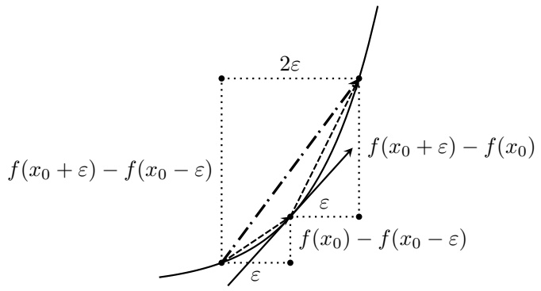

Hình 2.1. Giải thích cách xấp xỉ đạo hàm bằng hình học

\* Bằng hình học

Quan sát Hình 2.1, vector nét liền là đạo hàm chính xác của hàm số tại điểm có hoành độ bằng x<sub>0</sub>. Hai vector nét đứt thể hiện xấp xỉ đạo hàm phía phải và phía trái. Vector chấm gạch thể hiện xấp xỉ đạo hàm hai phía. Trong ba vector xấp xỉ đó, vector chấm gạch gần với vector nét liền nhất nếu xét theo hướng.

Sự khác biệt giữa các phương pháp xấp xỉ còn lớn hơn nữa nếu tại điểm x, hàm số bị bẻ cong mạnh hơn. Khi đó, xấp xỉ trái và phải sẽ khác nhau rất nhiều. Xấp xỉ hai phía sẽ cho kết quả ổn định hơn.

## 2.6.2. Xấp xỉ gradient của hàm nhiều biến

Với hàm nhiều biến, công thức (2.24) được áp dụng cho từng biến khi các biến khác cố định. Cụ thể, ta sử dụng định nghĩa gradient của hàm số nhận đầu vào là một ma trận như công thức (2.3). Mỗi thành phần của ma trận kết quả là đạo hàm riêng của hàm số tại thành phần đó khi ta coi các thành phần còn lại cố định. Chúng ta sẽ thấy rõ điều này hơn ở cách lập trình so sánh hai cách tính gradient ngay sau đây.

Cách tính gradient xấp xỉ hai phía thường cho giá trị khá chính xác. Tuy nhiên, cách này không được sử dụng để tính gradient vì độ phức tạp quá cao so với cách tính trực tiếp. Tại mỗi thành phần, ta cần tính giá trị của hàm số tại phía trái và phía phải. Việc làm này không khả thi với các ma trận lớn. Khi so sánh đạo hàm xấp xỉ với gradient tính theo công thức, người ta thường giảm số chiều dữ liệu và giảm số điểm dữ liệu để thuận tiện cho tính toán. Nếu gradient tính được là chính xác, nó sẽ rất gần với gradient xấp xỉ này.

Đoạn code dưới đây giúp kiểm tra gradient của một hàm số khả vi $f : \mathbb { R } ^ { m \times n } \rightarrow$ R, có kèm theo hai ví dụ. Để sử dụng hàm kiểm tra check\_grad này, ta cần viết hai hàm. Hàm thứ nhất là hàm fn(X) tính giá trị của hàm số tại X. Hàm thứ hai là hàm gr(X) tính giá trị của gradient của fn(X).

<!-- page: 52 -->

```python
from __future__ import print_function
import numpy as np

def check_grad(fn, gr, X):
    X_flat = X.reshape(-1) # convert X to an 1d array, 1 for loop needed
    shape_X = X.shape # original shape of X
    num_grad = np.zeros_like(X) # numerical grad, shape = shape of X
    grad_flat = np.zeros_like(X_flat) # 1d version of grad
    eps = 1e-6 # a small number, 1e-10 -> 1e-6 is usually good
    numElems = X_flat.shape[0] # number of elements in X
    # calculate numerical gradient
    for i in range(numElems): # iterate over all elements of X
        Xp_flat = X_flat.copy()
        Xn_flat = X_flat.copy()
        Xp_flat[i] += eps
        Xn_flat[i] -= eps
        Xp = Xp_flat.reshape(shape_X)
        Xn = Xn_flat.reshape(shape_X)
        grad_flat[i] = (fn(Xp) - fn(Xn))/(2*eps)

    num_grad = grad_flat.reshape(shape_X)

    diff = np.linalg.norm(num_grad - gr(X))
    print('Difference between two methods should be small:', diff)

# === check if grad(trace(A*X)) == A^T === m, n = 10, 20
A = np.random.rand(m, n)
X = np.random.rand(n, m)

def fn1(X):
    return np.trace(A.dot(X))

def gr1(X):
    return A.T

check_grad(fn1, gr1, X)
# === check if grad(x^T*A*x) == (A + A^T)*x === A = np.random.rand(m, m)
x = np.random.rand(m, 1)

def fn2(x):
    return x.T.dot(A).dot(x)

def gr2(x):
    return (A + A.T).dot(x)

check_grad(fn2, gr2, x)
```

## Kết quả:

```txt
Difference between two methods should be small: 2.02303323394e-08  
Difference between two methods should be small: 2.10853872281e-09
```

<!-- page: 53 -->

Kết quả cho thấy sự khác nhau giữa Frobenious norm (norm mặc định trong np.linalg.norm) trong kết quả của hai cách tính là rất nhỏ. Sau khi chạy lại đoạn code với các giá trị m, n khác nhau và biến X khác nhau, nếu sự khác nhau vẫn là nhỏ, ta có thể kết luận rằng gradient mà ta tính được là chính xác.

Bạn đọc có thể kiểm tra lại các công thức trong Bảng 2.1 bằng phương pháp này.

<!-- page: 54 -->

# Ôn tập Xác suất

Chương này được viết dựa trên Chương 2 và 3 của cuốn Computer Vision: Models, Learning, and Inference – Simon J.D. Prince ([https://goo.gl/GTEXzd](https://goo.gl/GTEXzd)).

## 3.1. Xác suất

## 3.1.1. Biến ngẫu nhiên

Một biến ngẫu nhiên (random variable) x là một biến dùng để đo những đại lượng không xác định. Biến này có thể được dùng để ký hiệu kết quả/đầu ra của một thí nghiệm, ví dụ như tung đồng xu, hoặc một đại lượng biến đổi trong tự nhiên, ví dụ như nhiệt độ trong ngày. Nếu quan sát một số lượng lớn đầu ra $\{ x _ { i } \} _ { i = 1 } ^ { I }$ của các thí nghiệm này, ta có thể nhận được những giá trị khác nhau ở mỗi thí nghiệm. Tuy nhiên, sẽ có những giá trị xảy ra nhiều lần hơn những giá trị khác, hoặc xảy ra gần một giá trị này hơn những giá trị khác. Thông tin về đầu ra này được đo bởi một phân phối xác suất (probability distribution) được biểu diễn bằng một hàm p(x). Một biến ngẫu nhiên có thể là rời rạc hoặc liên tục.

Một biến ngẫu nhiên rời rạc sẽ lấy giá trị trong một tập hợp các điểm rời rạc cho trước. Ví dụ tung đồng xu thì có hai khả năng là xấp và ngửa. Tập các giá trị này có thể có thứ tự như khi tung xúc xắc hoặc không có thứ tự như khi đầu ra là các giá trị nắng, mưa, bão. Mỗi đầu ra có một giá trị xác suất tương ứng với nó. Các giá trị xác suất này không âm và có tổng bằng một.

$$
\text {Nếu} x \text {là biến ngẫu nhiên rời rạc thì} \quad \sum_ {x} p (x) = 1.\tag{3.1}
$$

Biến ngẫu nhiên liên tục lấy giá trị là các số thực. Những giá trị này có thể là hữu hạn, ví dụ thời gian làm bài của mỗi thí sinh trong một bài thi 180 phút, hoặc vô hạn, ví dụ thời gian phải chờ tới khách hàng tiếp theo. Không như biến

<!-- page: 55 -->

ngẫu nhiên rời rạc, xác suất để đầu ra bằng chính xác một giá trị nào đó theo lý thuyết là bằng không. Thay vào đó, phân phối của biến ngẫu nhiên rời rạc thường được xác định dựa trên xác suất để đầu ra rơi vào một khoảng giá trị nào đó. Việc này được mô tả bởi một hàm số được gọi là hàm mật độ xác suất (probability density function, pdf). Hàm mật độ xác suất luôn cho giá trị dương, và tích phân của nó trên toàn miền giá trị đầu ra phải bằng một.

Nếu x là biến ngẫu nhiên liên tục thì Z p(x)dx = 1.

(3.2)

Nếu x là một biến ngẫu nhiên rời rạc thì $p ( x ) \leq 1$ , ∀x. Trong khi đó, nếu x là biến ngẫu nhiên liên tục, $p ( x )$ có thể nhận giá trị không âm bất kỳ, điều này vẫn đảm bảo tích phân của hàm mật độ xác suất theo toàn bộ giá trị của x bằng một.

## 3.1.2. Xác suất đồng thời

Nếu quan sát số lượng lớn các cặp đầu ra của hai biến ngẫu nhiên x và y thì có những cặp đầu ra xảy ra thường xuyên hơn những cặp khác. Thông tin này được biểu diễn bằng một phân phối được gọi là xác suất đồng thời (joint probability) của x và y, được ký hiệu là $p ( x , y )$ . Hai biến ngẫu nhiên x và y có thể cùng là biến ngẫu nhiên rời rạc, liên tục, hoặc một rời rạc, một liên tục. Luôn nhớ rằng tổng các xác suất trên mọi cặp giá trị $( x , y )$ đều bằng một.

Cả x và y là rời rạc:

$$
\sum_ {x, y} p (x, y) = 1.\tag{3.3}
$$

Cả x và y là liên tục:

$$
\int p (x, y) d x d y = 1.\tag{3.4}
$$

x rời rạc, y liên tục:

$$
\sum_ {x} \int p (x, y) d y = \int \left(\sum_ {x} p (x, y)\right) d y = 1.\tag{3.5}
$$

Xét ví dụ trong Hình 3.1, phần “Xác suất đồng thời”. Biến ngẫu nhiên x thể hiện điểm thi môn Toán của học sinh ở một trường THPT trong một kỳ thi quốc gia, biến ngẫu nhiên y thể hiện điểm thi môn Vật $\mathrm { L \hat { y } }$ cũng trong kỳ thi đó. Đại lượng $p ( x = x ^ { * } , y = y ^ { * } )$ là tỉ lệ giữa tần suất số học sinh được đồng thời $x ^ { * }$ điểm môn Toán và $y ^ { * }$ điểm môn Vật lý với toàn bộ số học sinh của trường đó. Tỉ lệ này có thể coi là xác suất khi số học sinh trong trường là lớn. $\dot { \mathrm { O } }$ đây $x ^ { * }$ và $y ^ { * }$ là các số xác định. Thông thường, xác suất này được viết gọn lại thành $p ( x ^ { * } , y ^ { * } )$ , và $p ( x , y )$ được dùng như một hàm tổng quát để mô tả các xác suất.

Giả sử thêm rằng điểm các môn là các số tự nhiên từ 1 đến 10.

Các ô vuông màu đen thể hiện xác suất $p ( x , y )$ , với diện tích ô vuông càng lớn biểu thị xác suất càng cao. Chú ý rằng tổng các xác suất này bằng một.

<!-- page: 56 -->

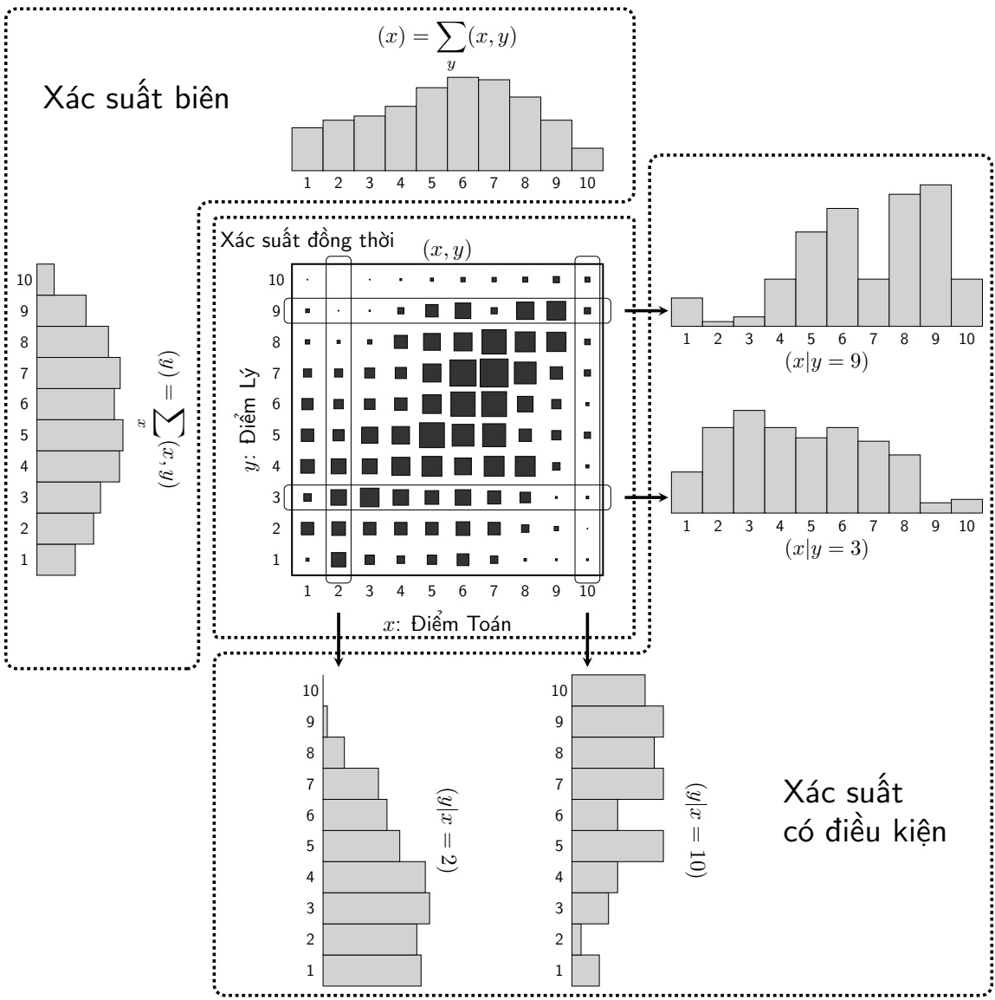

Hình 3.1. Xác suất đồng thời, xác suất biên, xác suất có điền kiện và mối quan hệ giữa chúng

Có thể thấy rằng xác suất để một học sinh được 10 điểm môn Toán và 1 điểm môn Lý rất thấp, điều tương tự xảy ra với 10 điểm môn Lý và 1 điểm môn Toán. Xác suất để một học sinh được khoảng 7 điểm cả hai môn là cao nhất.

Thông thường, chúng ta sẽ làm việc với các bài toán ở đó xác suất được xác định trên nhiều hơn hai biến ngẫu nhiên. Chẳng hạn, $p ( x , y , z )$ thể hiện xác suất đồng thời của ba biến ngẫu nhiên x, y và z. Khi có nhiều biến ngẫu nhiên, ta có thể viết chúng dưới dạng vector. Cụ thể, ta có thể viết $p ( \mathbf { x } )$ để thể hiện xác suất của biến ngẫu nhiên nhiều chiều $\mathbf { x } = [ x _ { 1 } , x _ { 2 } , \ldots , x _ { n } ] ^ { T }$ Khi có nhiều tập các biến ngẫu nhiên, ví dụ x và y, ta có thể viết $p ( \mathbf { x } , \mathbf { y } )$ để thể hiện xác suất đồng thời của tất cả các thành phần trong hai biến ngẫu nhiên nhiều chiều này.

<!-- page: 57 -->

## 3.1.3. Xác suất biên

Nếu biết xác suất đồng thời của nhiều biến ngẫu nhiên, ta cũng có thể xác định được phân phối xác suất của từng biến bằng cách lấy tổng (với biến ngẫu nhiên rời rạc) hoặc tích phân (với biến ngẫu nhiên liên tục) theo tất cả các biến còn lại:

$$
\text {Néu} x, y \text {ròi rạc:} p (x) = \sum_ {y} p (x, y),\tag{3.6}
$$

$$
p (y) = \sum_ {x} p (x, y).\tag{3.7}
$$

$$
\text {Nếu} x, y \text {liên tục:} p (x) = \int p (x, y) d y,\tag{3.8}
$$

$$
p (y) = \int p (x, y) d x.\tag{3.9}
$$

Với nhiều biến hơn, chẳng hạn bốn biến rời rạc x, y, z, w, cách tính được thực hiện tương tự:

$$
p (x) = \sum_ {y, z, w} p (x, y, z, w),\tag{3.10}
$$

$$
p (x, y) = \sum_ {z, w} p (x, y, z, w).\tag{3.11}
$$

Cách xác định xác suất của một biến dựa trên xác suất đồng thời của nó với các biến khác được gọi là phép biên hoá (marginalization). Xác suất đó được gọi là xác suất biên (marginal probability).

Từ đây trở đi, nếu không đề cập gì thêm, chúng ta sẽ dùng ký hiệu $\sum \mathrm { d } \hat { \mathrm { e } }$ chỉ chung cho cả hai loại biến ngẫu nhiên rời rạc và liên tục. Nếu biến là liên tục, ta sẽ ngầm hiểu rằng dấu tổng $( \sum )$ cần được thay bằng dấu tích phân (R), biến lấy vi phân chính là biến được viết dưới dấu $\sum$ . Chẳng hạn, trong (3.11), nếu z là liên tục, w là rời rạc, công thức đúng sẽ là

$$
p (x, y) = \sum_ {w} \left(\int p (x, y, z, w) d z\right) = \int \left(\sum_ {w} p (x, y, z, w)\right) d z.\tag{3.12}
$$

Quay lại ví dụ trong Hình 3.1 với hai biến ngẫu nhiên rời rạc x, y. Lúc này, $p ( x )$ được hiểu là xác suất để một học sinh đạt được x điểm môn Toán. Xác suất này được biểu thị ở khu vực “Xác suất biên”. Có hai cách tính xác suất này. Cách thứ nhất là đếm số học sinh được x điểm môn toán rồi chia cho tổng số học sinh. Cách thứ hai dựa trên xác suất đồng thời để một học sinh được x điểm môn Toán và y điểm môn Lý. Số lượng học sinh đạt $x = x ^ { * }$ điểm môn Toán sẽ bằng tổng số học sinh đạt $x = x ^ { * }$ điểm môn Toán và y điểm môn Lý, với $y$ là một giá trị bất kỳ từ 1 đến 10. vì vậy, để tính xác suất $p ( x )$ , ta chỉ cần tính tổng của toàn bộ $p ( x , y )$ với y chạy từ 1 đến 10.

<!-- page: 58 -->

Dựa trên nhận xét này, mỗi giá trị của $p ( x )$ chính bằng tổng các giá trị trong cột thứ x của hình vuông trung tâm. Mỗi giá trị của $p ( y )$ sẽ bằng tổng các giá trị trong hàng thứ $y$ tính từ đưới lên của hình vuông đó. Chú $\acute { \mathrm { y } }$ rằng tổng các xác suất luôn bằng một.

## 3.1.4. Xác suất có điều kiện.

Dựa vào phân phối điểm của các học sinh, liệu ta có thể tính được xác suất để một học sinh được điểm 10 môn Lý, biết rằng học sinh đó được điểm 1 môn Toán?

Xác suất để một biến ngẫu nhiên x nhận một giá trị nào đó biết rằng biến ngẫu nhiên $y$ có giá trị $y ^ { * }$ được gọi là xác suất có điều kiện (conditional probability), ký hiệu là $p ( x | y = y ^ { * } )$

Xác suất có điều kiện $p ( x | y = y ^ { * } )$ có thể được tính dựa trên xác suất đồng thời $p ( x , y )$ . Quay lại Hình 3.1 ở khu vực “Xác suất có điều kiện”. Nếu biết rằng $y = 9$ xác suất $p ( x | y   =   9 )$ có thể tính được dựa trên hàng thứ chín của hình vuông trung tâm, tức hàng $p ( x , y   =   9 )$ . Xác suất $p ( x | y   =   9 )$ lớn nếu $p ( x , y   =   9 )$ lớn. Chú $\acute { \mathrm { y } }$ rằng tổng các xác suất $\textstyle \sum _ { x } p ( x , y = 9 )$ nhỏ hơn một, và bằng tổng các xác suất trên hàng thứ chín này. Để thoả mãn điều kiện tổng các xác suất bằng một, ta cần chia mỗi đại lượng $p ( x , y = 9 )$ cho tổng của hàng này, tức là

$$
p (x \mid y = 9) = \frac {p (x , y = 9)}{\sum_ {x} p (x , y = 9)} = \frac {p (x , y = 9)}{p (y = 9)}.\tag{3.13}
$$

Tổng quát,

$$
p (x | y = y ^ {*}) = \frac {p (x , y = y ^ {*})}{\sum_ {x} p (x , y = y ^ {*})} = \frac {p (x , y = y ^ {*})}{p (y = y ^ {*})},\tag{3.14}
$$

$\overset { ? } { \mathrm { o } }$ đây ta đã sử dụng công thức tính xác suất biên trong (3.7) cho mẫu số. Thông thường, ta có thể viết xác suất có điều kiện mà không cần chỉ rõ giá trị $y = y ^ { * }$ và có các công thức gọn hơn:

$$
p (x | y) = \frac {p (x , y)}{p (y)}, p (y | x) = \frac {p (y , x)}{p (x)}.\tag{3.15}
$$

Từ đó ta có quan hệ

$$
p (x, y) = p (x | y) p (y) = p (y | x) p (x).
$$

(3.16)

Khi có nhiều hơn hai biến ngẫu nhiên, ta có các công thức

$$
p (x, y, z, w) = p (x, y, z | w) p (w)\tag{3.17}
$$

$$
= p (x, y | z, w) p (z, w) = p (x, y | z, w) p (z | w) p (w)\tag{3.18}
$$

$$
= p (x | y, z, w) p (y | z, w) p (z | w) p (w).\tag{3.19}
$$

Công thức (3.19) có dạng chuỗi và được sử dụng nhiều sau này.

<!-- page: 59 -->

## 3.1.5. Quy tắc Bayes

Công thức (3.16) biểu diễn xác suất đồng thời theo hai cách. Từ đó có thể suy ra

$$
p (y | x) p (x) = p (x | y) p (y).\tag{3.20}
$$

Biến đối một chút:

$$
p (y | x) = \frac {p (x | y) p (y)}{p (x)}\tag{3.21}
$$

$$
= \frac {p (x \mid y) p (y)}{\sum_ {y} p (x , y)}\tag{3.22}
$$

$$
= \frac {p (x | y) p (y)}{\sum_ {y} p (x | y) p (y)}.\tag{3.23}
$$

Trong dòng thứ hai và thứ ba, các công thức về xác suất biên và xác suất đồng thời ở mẫu số đã được sử dụng. Từ (3.23) ta có thể thấy rằng $p ( y | x )$ hoàn toàn có thể tính được nếu ta biết mọi $p ( x | y )$ và $p ( y )$ . Tuy nhiên, việc tính trực tiếp xác suất này thường phức tạp.

Ba công thức (3.21)-(3.23) thường được gọi là quy tắc Bayes. Chúng được sử dụng rộng rãi trong machine learning

## 3.1.6. Biến ngẫu nhiên độc lập

Nếu biết giá trị của một biến ngẫu nhiên x không mang lại thông tin về việc suy ra giá trị của biến ngẫu nhiên y và ngược lại, thì ta nói rằng hai biến ngẫu nhiên này là độc lập. Chẳng hạn, chiều cao của một học sinh và điểm thi môn Toán của học sinh đó có thể coi là hai biến ngẫu nhiên độc lập. Khi hai biến ngẫu nhiên x và y là độc lập, ta có

$$
p (x | y) = p (x),\tag{3.24}
$$

$$
p (y | x) = p (y).\tag{3.25}
$$

Thay vào biểu thức xác suất đồng thời trong (3.16), ta có

$$
p (x, y) = p (x | y) p (y) = p (x) p (y).\tag{3.26}
$$

## 3.1.7. Kỳ vọng

Kỳ vọng (expectation) của một biến ngẫu nhiên x được định nghĩa bởi

$$
\mathrm{E} [ x ] = \sum_ {x} x p (x) \text {neu} x \text {là ròi rạc.}\tag{3.27}
$$

$$
\mathrm{E} [ x ] = \int x p (x) d x \text {nếu} x \text {là liên tục}.\tag{3.28}
$$

<!-- page: 60 -->

Giả sử f(.) là một hàm số trả về một số với mỗi giá trị $x ^ { * }$ của biến ngẫu nhiên x. Khi đó, nếu x là biến ngẫu nhiên rời rạc, ta có

$$
\mathrm{E} [ f (x) ] = \sum_ {x} f (x) p (x).\tag{3.29}
$$

Công thức cho biến ngẫu nhiên liên tục cũng được viết tương tự.

Với xác suất đồng thời, kỳ vọng của một hàm cũng được xác định tương tự:

$$
\mathrm{E} [ f (x, y) ] = \sum_ {x, y} f (x, y) p (x, y) d x d y.\tag{3.30}
$$

Có ba tính chất cần nhớ về kỳ vọng:

a. Kỳ vọng của một hằng số theo một biến ngẫu nhiên x bất kỳ bằng chính hằng số đó:

$$
\mathrm{E} [ \alpha ] = \alpha .\tag{3.31}
$$

b. Kỳ vọng có tính chất tuyến tính:

$$
\mathrm{E} [ \alpha x ] = \alpha \mathrm{E} [ x ],
$$

$$
\mathrm{E} [ f (x) + g (x) ] = \mathrm{E} [ f (x) ] + \mathrm{E} [ g (x) ].\tag{3.32}
$$

(3.33)

c. Kỳ vọng của tích hai biến ngẫu nhiên độc lập bằng tích kỳ vọng của chúng:

$$
\mathrm{E} [ f (x) g (y) ] = \mathrm{E} [ f (x) ] \mathrm{E} [ g (y) ].\tag{3.34}
$$

Khái niệm kỳ vọng thường đi kèm với khái niệm phương sai (variance) trong không gian một chiều và ma trận hiệp phương sai (covariance matrix) trong không gian nhiều chiều.

## 3.1.8. Phương sai

Cho N giá trị $x _ { 1 } , x _ { 2 } , \ldots , x _ { N }$ . Kỳ vọng và phương sai của bộ dữ liệu này được tính theo công thức

$$
\bar {x} = \frac {1}{N} \sum_ {n = 1} ^ {N} x _ {n} = \frac {1}{N} \mathbf {x 1},\tag{3.35}
$$

$$
\sigma^ {2} = \frac {1}{N} \sum_ {n = 1} ^ {N} (x _ {n} - \bar {x}) ^ {2},\tag{3.36}
$$

với $\mathbf { x } = \left[ \begin{matrix} { x _ { 1 } , x _ { 2 } , \ldots , x _ { N } } \\ \end{matrix} \right]$ , và $\mathbf { 1 } \in \mathbb { R } ^ { N }$ là vector cột chứa toàn phần tử 1. Kỳ vọng đơn giản là trung bình cộng của toàn bộ các giá trị. Phương sai là trung bình

<!-- page: 61 -->

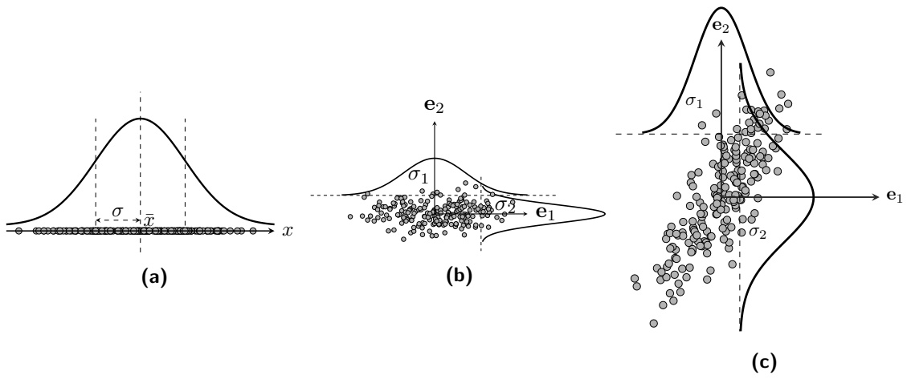

Hình 3.2. Ví dụ về kỳ vọng và phương sai. (a) Dữ liệu trong không gian một chiều. (b) Dữ liệu trong không gian hai chiều mà hai chiều không tương quan. Trong trường hợp này, ma trận hiệp phương sai là ma trận đường chéo với hai phần tử trên đường chéo là $\sigma _ { 1 } , \sigma _ { 2 }$ , đây cũng chính là hai trị riêng của ma trận hiệp phương sai và là phương sai của mỗi chiều dữ liệu. (c) Dữ liệu trong không gian hai chiều $c \dot { 0 }$ tương quan. Theo mỗi chiều, ta có thể tính được kỳ vọng và phương sai. Phương sai càng lớn thì dữ liệu trong chiều đó càng phân tán. Trong ví dụ này, dữ liệu theo chiều thứ hai phân tán nhiều hơn so với chiều thứ nhất.

cộng của bình phương khoảng cách từ mỗi điểm tới kỳ vọng. Phương sai càng nhỏ, các điểm dữ liệu càng gần với kỳ vọng, tức các điểm dữ liệu càng giống nhau. Phương sai càng lớn, dữ liệu càng có tính phân tán. Ví dụ về kỳ vọng và phương sai của dữ liệu một chiều có thể được thấy trong Hình 3.2a.

Căn bậc hai của phương sai, $\sigma$ còn được gọi là độ lệch chuẩn (standard deviation) của dữ liệu.

## 3.1.9. Ma trận hiệp phương sai

Cho N điểm dữ liệu được biểu diễn bởi các vector cột $\mathbf { x } _ { 1 } , \ldots , \mathbf { x } _ { N }$ , khi đó, vector kỳ vọng và ma trận hiệp phương sai của toàn bộ dữ liệu được định nghĩa là

$$
\bar {\mathbf {x}} = \frac {1}{N} \sum_ {n = 1} ^ {N} \mathbf {x} _ {n},\tag{3.37}
$$

$$
\mathbf {S} = \frac {1}{N} \sum_ {n = 1} ^ {N} (\mathbf {x} _ {n} - \bar {\mathbf {x}}) (\mathbf {x} _ {n} - \bar {\mathbf {x}}) ^ {T} = \frac {1}{N} \hat {\mathbf {X}} \hat {\mathbf {X}} ^ {T}.\tag{3.38}
$$

Trong đó $\hat { \mathbf { X } }$ được tạo bằng cách trừ mỗi cột của X đi x¯:

$$
\hat {\mathbf {x}} _ {n} = \mathbf {x} _ {n} - \bar {\mathbf {x}}.\tag{3.39}
$$

<!-- page: 62 -->

Một vài tính chất của ma trận hiệp phương sai:

a. Ma trận hiệp phương sai là một ma trận đối xứng, hơn nữa, nó là một ma trận [nửa xác định dương](https://machinelearningcoban.com/2017/03/12/convexity/#positive-semidefinite).

b. Mọi phần tử trên đường chéo của ma trận hiệp phương sai là các số không âm. Chúng chính là phương sai của từng chiều dữ liệu.

c. Các phần tử ngoài đường chéo $s _ { i j } , i \neq j$ thể hiện sự tương quan giữa thành phần thứ i và thứ j của dữ liệu, còn được gọi là hiệp phương sai. Giá trị này có thể dương, âm hoặc bằng không. Khi nó bằng không, ta nói rằng hai thành phần i, j trong dữ liệu là không tương quan.

d. Nếu ma trận hiệp phương sai là ma trận đường chéo, ta có dữ liệu hoàn toàn không tương quan giữa các chiều.

Ví dụ về sự tương quan của dữ liệu được cho trong Hình 3.2b và 3.2c.

## 3.2. Một vài phân phối thường gặp

## 3.2.1. Phân phối Bernoulli

Phân phối Bernoulli là một phân phối rời rạc mô tả các biến ngẫu nhiên nhị phân với đầu ra chỉ nhận một trong hai giá trị $x   \in   \{ 0 , 1 \}$ . Hai giá trị này có thể là xấp và ngửa khi tung đồng xu; có thể là giao dịch lừa đảo và giao dịch thông thường trong bài toán xác định giao dịch lừa đảo trong tín dụng; có thể là người và không phải người trong bài toán xác định xem trong một bức ảnh có người hay không.

Phân phối Bernoulli được mô tả bằng một tham số $\lambda \in [0,1]$ . Xác suất của mỗi đầu ra là

$$
p (x = 1) = \lambda , \quad p (x = 0) = 1 - p (x = 1) = 1 - \lambda .\tag{3.40}
$$

Hai đẳng thức này thường được viết gọn lại thành

$$
p (x) = \lambda^ {x} (1 - \lambda) ^ {1 - x},\tag{3.41}
$$

với giả định $0 ^ { 0 } = 1$ . Thật vậy, $p ( 0 ) = \lambda ^ { 0 } ( 1   -   \lambda ) ^ { 1 } = 1   -   \lambda ,   \mathrm { v \ddot { a } } \; p ( 1 ) = \lambda ^ { 1 } ( 1   -   \lambda ) ^ { 0 } = \lambda$

Phân phối Bernoulli thường được ký hiệu ngắn gọn dưới dạng

$$
p (x) = \mathrm{Bern} _ {x} [ \lambda ].\tag{3.42}
$$

## 3.2.2. Phân phối categorical

Trong nhiều trường hợp, đầu ra của biến ngẫu nhiên rời rạc có thể nhận nhiều hơn hai giá trị. Ví dụ, một bức ảnh có thể chứa một chiếc xe, một người, hoặc

<!-- page: 63 -->

một con mèo. Khi đó, ta dùng một phân phối tổng quát của phân phối Bernoulli, được gọi là phân phối categorical. Các đầu ra được mô tả bởi một phần tử trong tập hợp $\{ 1 , 2 , \ldots , K \}$

Nếu có K đầu ra, phân phối categorical sẽ được mô tả bởi K tham số, viết dưới dạng vector $\lambda = [ \lambda _ { 1 } , \lambda _ { 2 } , \ldots , \lambda _ { K } ]$ với các $\lambda _ { k }$ không âm và có tổng bằng một. Mỗi giá trị $\lambda _ { k }$ thể hiện xác suất để đầu ra nhận giá trị k: $p ( x = k ) = \lambda _ { k }$

Phân phối categorical thường được ký hiệu dưới dạng:

$$
p (x) = \mathrm{Cat} _ {x} [ \lambda ].\tag{3.43}
$$

Cách biểu diễn đầu ra là một số k trong tập hợp $\{ 1 , 2 , \ldots , K \}$ có thể được thay bằng biểu diễn one-hot. Mỗi vector one-hot là một vector K phần tử, trong đó K − 1 phần tử bằng 0, một phần tử bằng 1 tại vị trí ứng với đầu ra k. Nói cách khác, mỗi đầu ra là một trong các vector đơn vị bậc $K \mathbf { : } \{ \mathbf { e } _ { 1 } , \mathbf { e } _ { 2 } , \ldots , \mathbf { e } _ { K } \}$ . Ta có thể viết

$$
p (x = k) = p (\mathbf {x} = \mathbf {e} _ {k}) = \prod_ {j = 1} ^ {K} \lambda_ {j} ^ {x _ {j}} = \lambda_ {k}.\tag{3.44}
$$

Dấu bằng cuối cùng xảy ra vì $x _ { k } = 1 , x _ { j } = 0 \forall j \neq k .$

## 3.2.3. Phân phối chuẩn một chiều

Phân phối chuẩn một chiều (univariate normal distribution) được định nghĩa trên các biến liên tục nhận giá trị $x \in ( - \infty , \infty )$ . Đây là một phân phối được sử dụng nhiều nhất với các biến ngẫu nhiên liên tục. Phân phối này được mô tả bởi hai tham số: kỳ vọng µ và phương sai $\sigma ^ { 2 }$

Hàm mật độ xác suất của phân phối này được định nghĩa bởi

$$
p (x) = \frac {1}{\sqrt {2 \pi \sigma^ {2}}} \exp \left(- \frac {(x - \mu) ^ {2}}{2 \sigma^ {2}}\right).\tag{3.45}
$$

Hàm mật độ này thường được viết gọn dưới dạng $p ( x ) \; = \; \mathrm { N o r m } _ { x } [ \mu , \sigma ^ { 2 } ]$ hoặc $\mathcal { N } ( \mu , \sigma ^ { 2 } )$

Ví dụ về đồ thị hàm mật độ xác suất của phân phối chuẩn một chiều được biểu thị trên Hình 3.3a.

## 3.2.4. Phân phối chuẩn nhiều chiều

Phân phối chuẩn nhiều chiều (multivariate normal distribution) là trường hợp tổng quát của phân phối chuẩn khi biến ngẫu nhiên là nhiều chiều, giả sử là D chiều. Có hai tham số mô tả phân phối này là vector kỳ vọng $\pmb { \mu } \in \mathbb { R } ^ { D }$ và ma trận hiệp phương sai $\mathbf { \Sigma } \in \mathbb { S } ^ { D }$ là một ma trận đối xứng xác định dương.

<!-- page: 64 -->

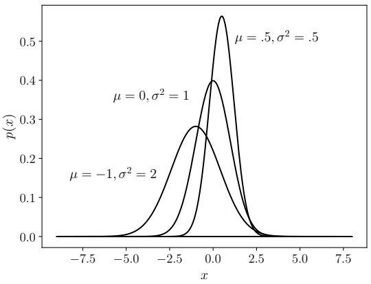

(a)

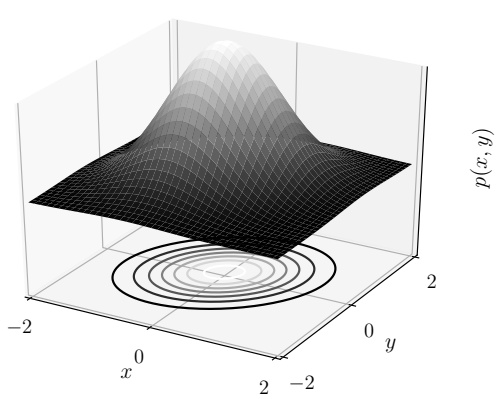

(b)

Hình 3.3. Ví dụ $v \hat { e }$ hàm mật độ xác suất của (a) phân phối chuẩn một chiều, và (b) phân phối chuẩn hai chiều.

Hàm mật độ xác suất có dạng

$$
p (\mathbf {x}) = \frac {1}{(2 \pi) ^ {D / 2} | \boldsymbol {\Sigma} | ^ {1 / 2}} \exp \left(- \frac {1}{2} (\mathbf {x} - \boldsymbol {\mu}) ^ {T} \boldsymbol {\Sigma} ^ {- 1} (\mathbf {x} - \boldsymbol {\mu})\right),\tag{3.46}
$$

với |Σ| là định thức của ma trận hiệp phương sai Σ.

Hàm mật độ này thường được viết gọn lại dưới dạng $p ( \mathbf { x } ) = \operatorname { N o r m } _ { \mathbf { x } } [ \pmb { \mu } , \pmb { \Sigma } ]$ hoặc $\mathcal { N } ( \pmb { \mu } , \pmb { \Sigma } )$

Ví dụ về hàm mật độ xác suất của một phân phối chuẩn hai chiều được mô tả bởi một mặt cong trên Hình 3.3b. Nếu cắt mặt này theo các mặt phẳng song song với mặt đáy, ta sẽ thu được các hình ellipse đồng tâm.

## 3.2.5. Phân phối Beta

Phân phối Beta là một phân phối liên tục được định nghĩa trên một biến ngẫu nhiên $\lambda \in [ 0 , 1 ]$ . Phân phối Beta được dùng để mô tả tham số cho một phân phối khác. Cụ thể, phân phối này phù hợp với việc mô tả sự biến động của tham số λ trong phân phối Bernoulli.

Phân phối Beta được mô tả bởi hai tham số dương $\alpha , \beta .$ Hàm mật độ xác suất của nó được cho bởi

$$
p (\lambda) = \frac {\Gamma (\alpha + \beta)}{\Gamma (\alpha) \Gamma (\beta)} \lambda^ {\alpha - 1} (1 - \lambda) ^ {\beta - 1},\tag{3.47}
$$

với $\varGamma ( . )$ là hàm số gamma, được định nghĩa bởi

$$
\Gamma (z) = \int_ {0} ^ {\infty} t ^ {z - 1} \exp (- t) d t.\tag{3.48}
$$

<!-- page: 65 -->

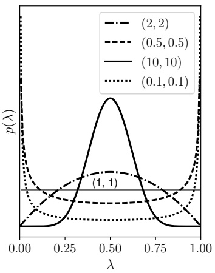

(a) α = β

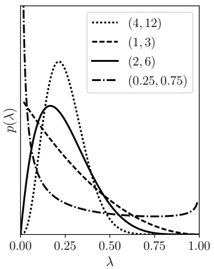

(b) α < β

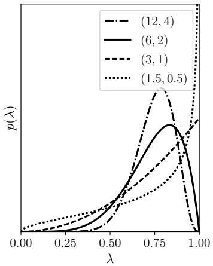

(c) $\alpha > \beta$

Hình 3.4. Ví dụ về hàm mật độ xác suất của phân phối Beta. (a) $\alpha = \beta$ , đồ thị hàm số là đối xứng. (b) $\alpha < \beta$ , đồ thị hàm số lệch sang trái, chứng tỏ xác suất λ nhỏ là lớn. (c) $\alpha > \beta$ , đồ thị hàm số lệch sang phải, chứng tỏ xác suất λ lớn là lớn.

Trên thực tế, việc tính giá trị của hàm số gamma không thực sự quan trọng vì nó chỉ mang tính chuẩn hoá để tổng xác suất bằng một.

Phân phối Beta thường được ký hiệu là $p ( \lambda ) = \mathrm { B e t a } _ { \lambda } [ \alpha , \beta ]$

Hình 3.4 minh hoạ hàm mật độ xác suất của phân phối Beta với các cặp giá trị $( \alpha , \beta )$ khác nhau.

• Trong Hình 3.4a, khi $\alpha = \beta$ . Đồ thị của các hàm mật độ xác suất đối xứng qua đường thẳng $\lambda = 0 . 5$ . Khi $\alpha = \beta = 1$ , thay vào (3.47), ta thấy $p ( \lambda ) = 1$ với mọi λ. Trong trường hợp này, phân phối Beta trở thành phân phối đều Khi $\alpha = \beta > 1$ , các hàm số đạt giá trị cao tại gần trung tâm, tức λ sẽ nhận giá trị xung quanh điểm 0.5 với xác suất cao. Khi $\alpha = \beta < 1$ , hàm số đạt giá trị cao tại các điểm gần 0 và 1.

• Trong Hình 3.4b, khi $\alpha < \beta$ , ta thấy rằng đồ thị có xu hướng lệch sang bên trái. Các giá trị $( \alpha , \beta )$ này nên được sử dụng nếu ta dự đoán rằng λ là một số nhỏ hơn 0.5.

• Trong Hình 3.4c, khi $\alpha > \beta$ , điều ngược lại xảy ra với các hàm số đạt giá trị cao tại các điểm gần 1.

<!-- page: 66 -->

## 3.2.6. Phân phối Dirichlet

Phân phối Dirichlet chính là trường hợp tổng quát của phân phối Beta khi được dùng để mô tả tham số của phân phối categorical. Nhắc lại rằng phân phối categorical là trường hợp tổng quát của phân phối Bernoulli.

Phân phối Dirichlet được định nghĩa trên K biến liên tục $\lambda _ { 1 } , \ldots , \lambda _ { K }$ trong đó các $\lambda _ { k }$ không âm và có tổng bằng một. Bởi vậy, nó phù hợp để mô tả tham số của phân phối categorical. Có K tham số dương để mô tả một phân phối Dirichlet: $\alpha _ { 1 } , \ldots , \alpha _ { K }$

Hàm mật độ xác suất của phân phối Dirichlet được cho bởi

$$
p (\lambda_ {1}, \dots , \lambda_ {K}) = \frac {\Gamma (\sum_ {k = 1} ^ {K} \alpha_ {k})}{\prod_ {k = 1} ^ {K} \Gamma (\alpha_ {k})} \prod_ {k = 1} ^ {K} \lambda_ {k} ^ {\alpha_ {k} - 1}.\tag{3.49}
$$

Dạng thu gọn của nó là $p ( \lambda _ { 1 } , \ldots , \lambda _ { K } ) = \operatorname { D i r } _ { \lambda _ { 1 } , \ldots , \lambda _ { K } } [ \alpha _ { 1 } , \ldots , \alpha _ { K } ] .$

<!-- page: 67 -->

## Ước lượng tham số mô hình

## 4.1. Giới thiệu

Có rất nhiều mô hình machine learning được xây dựng dựa trên các mô hình thống kê. Các mô hình thống kê thường dựa trên các phân phối xác suất đã được đề cập trong Chương 3. Với một mô hình thông kê bất kỳ, ký hiệu θ là tập hợp tất cả các tham số của mô hình đó. Với phân phối Bernoulli, tham số là biến λ. Với phân phối chuẩn nhiều chiều, các tham số là vector kỳ vọng µ và ma trận hiệp phương sai Σ. “Learning” chính là quá trình ước lượng bộ tham số θ sao cho mô hình tìm được khớp với phân phối của dữ liệu nhất. Quá trình này còn được gọi là ước lượng tham số (parameter estimation).

Có hai cách ước lượng tham số thường được dùng trong các mô hình machine learning thống kê. Cách thứ nhất chỉ dựa trên dữ liệu đã biết trong tập huấn luyện, được gọi là ước lượng hợp lý cực đại(maximum likelihood estimation hay ML estimation hoặc MLE). Cách thứ hai không những dựa trên tập huấn luyện mà còn dựa trên những thông tin biết trước của các tham số. Những thông tin này có thể có được bằng cảm quan của người xây dựng mô hình. Cảm quan càng rõ ràng, càng hợp lý thì khả năng thu được bộ tham số tốt càng cao. Chẳng hạn, thông tin biết trước của λ trong phân phối Bernoulli là việc nó là một số trong đoạn [0, 1]. Với bài toán tung đồng xu, với λ là xác suất có được mặt xấp, ta dự đoán được rằng giá trị này là một số gần với 0.5. Cách ước lượng tham số thứ hai này được gọi là ước lượng hậu nghiệm cực đại (maximum a posteriori estimation hay MAP estimation). Trong chương này, chúng ta cùng tìm hiểu ý tưởng và cách giải quyết bài toán ước lượng tham số mô hình theo MLE hoặc MAP.

<!-- page: 68 -->

## 4.2. Ước lượng hợp lý cực đại

## 4.2.1. Ý tưởng

Giả sử có các điểm dữ liệu $\mathbf { x } _ { 1 } , \mathbf { x } _ { 2 } , \ldots , \mathbf { x } _ { N }$ tuân theo một phân phối nào đó được mô tả bởi bộ tham số θ. Ước lượng hợp lý cực đại là việc đi tìm bộ tham số θ để

$$
\theta = \underset {\theta} {\operatorname{argmax}} p (\mathbf {x} _ {1}, \dots , \mathbf {x} _ {N} | \theta).\tag{4.1}
$$

Bài toán (4.1) có $\acute { \mathrm { y } }$ nghĩa như thế nào và vì sao việc này hợp $\mathrm { l y ? }$

Giả sử rằng ta đã biết rằng mô hình có dạng đặc biệt được mô tả bởi bộ tham số θ. Xác suất có điều kiện $p ( \mathbf { x } _ { 1 } | \theta )$ chính là xác suất xảy ra sự kiện $\mathbf { x } _ { 1 }$ trong trường hợp mô hình được mô tả bởi bộ tham số θ. Tương tự, $p ( \mathbf { x } _ { 1 } , \ldots , \mathbf { x } _ { N } | \theta )$ là xác suất để toàn bộ các sự kiện $\mathbf { x } _ { 1 } , \mathbf { x } _ { 2 } , \ldots , \mathbf { x } _ { N }$ đồng thời xảy ra, xác suất đồng thời này còn được gọi là sự hợp lý (likelihood).

Phân phối của dữ liệu và bản thân dữ liệu có thể lần lượt được coi là nguyên nhân và kết quả. Ta cần tìm nguyên nhân (bộ tham số θ) để khả năng xảy ra kết quả (hàm hợp lý) là cao nhất.

## 4.2.2. Giả sử về sự độc lập và log-likelihood

Người ta thường ít khi giải trực tiếp bài toán (4.1) vì khó tìm được một mô hình xác suất đồng thời cho toàn bộ dữ liệu. Một cách tiếp cận phổ biến là đơn giản hoá mô hình bằng cách giả sử các điểm dữ liệu $\mathbf { x } _ { n }$ độc lập với nhau khi biết bộ tham số θ. Nói cách khác, hàm hợp lý trong (4.1) được xấp xỉ bởi<sup>6</sup>

$$
p (\mathbf {x} _ {1}, \dots , \mathbf {x} _ {N} | \theta) \approx \prod_ {n = 1} ^ {N} p (\mathbf {x} _ {n} | \theta).\tag{4.2}
$$

Lúc đó, bài toán (4.1) có thể được giải quyết bằng cách giải bài toán tối ưu

$$
\theta = \operatorname * {a r g m a x} _ {\theta} \prod_ {n = 1} ^ {N} p (\mathbf {x} _ {n} | \theta)\tag{4.3}
$$

Mỗi giá trị $p ( \mathbf { x } _ { n } | \theta )$ là một số dương nhỏ hơn một. Khi N lớn, tích của các số dương này rất gần với 0, máy tính có thể không lưu chính xác được do sai số tính toán. Để tránh hiện tượng này, việc tối đa hàm mục tiêu thường được chuyển về việc tối đa logarit<sup>7</sup>của hàm mục tiêu:

$$
\theta = \underset {\theta} {\operatorname{argmax}} \log \left(\prod_ {n = 1} ^ {N} p (\mathbf {x} _ {n} | \theta)\right) = \underset {\theta} {\operatorname{argmax}} \sum_ {n = 1} ^ {N} \log \left(p (\mathbf {x} _ {n} | \theta)\right).\tag{4.4}
$$

<small><span class="docvortex-page-footnote" data-block-type="page_footnote" style="color:#6b7280">x, y</span></small>

<small><span class="docvortex-page-footnote" data-block-type="page_footnote" style="color:#6b7280">p x, y p x p y</span></small>

<small><span class="docvortex-page-footnote" data-block-type="page_footnote" style="color:#6b7280">6 Nhắc lại rằng nếu hai sự kiện  là độc lập thì xác suất đồng thời bằng tích xác suất của từng sự kiện: ( ) = ( ) ( ). Với xác suất có điều kiện, ( | ) = ( | ) ( | ). p x, y z p x z p y z</span></small>

<small><span class="docvortex-page-footnote" data-block-type="page_footnote" style="color:#6b7280">7 Logarit là một hàm đồng biến.</span></small>

<!-- page: 69 -->

## 4.2.3. Ví dụ

## Ví dụ 1: Phân phối Bernoulli

Bài toán: Giả sử tung một đồng xu N lần và nhận được n mặt ngửa, hãy ước lượng xác suất nhận được mặt ngửa khi tung đồng xu đó.

## Lời giải:

Một cách tự nhiên, ta có thể ước lượng xác suất đó là $\lambda = { \textstyle { \frac { n } { N } } }$ . Chúng ta cùng ước lượng giá trị này bằng phương pháp MLE.

Đặt λ là xác suất để nhận được một mặt ngửa và $x _ { 1 } , x _ { 2 } , \ldots , x _ { N }$ là các đầu ra quan sát thấy. Trong N giá trị này, có n giá trị bằng 1 tương ứng với mặt ngửa và $m = N - n$ giá trị bằng 0 tương ứng với mặt xấp. Nhận thấy

$$
\sum_ {i = 1} ^ {N} x _ {i} = n, \quad N - \sum_ {i = 1} ^ {N} x _ {i} = N - n = m.\tag{4.5}
$$

Vì đây là một xác suất của biến ngẫu nhiên nhị phân rời rạc, sự kiện nhận được mặt ngửa hay xấp khi tung đồng xu tuân theo phân phối Bernoulli:

$$
p (x _ {i} | \lambda) = \lambda^ {x _ {i}} (1 - \lambda) ^ {1 - x _ {i}}.\tag{4.6}
$$

Khi đó tham số mô hình λ có thể được ước lượng bằng việc giải bài toán tối ưu sau đây, với giả sử rằng kết quả của các lần tung đồng xu độc lập với nhau:

$$
\lambda = \underset {\lambda} {\operatorname{argmax}} \left[ p (x _ {1}, x _ {2}, \dots , x _ {N} | \lambda) \right] = \underset {\lambda} {\operatorname{argmax}} \left[ \prod_ {i = 1} ^ {N} p (x _ {i} | \lambda) \right]\tag{4.7}
$$

$$
= \underset {\lambda} {\operatorname{argmax}} \left[ \prod_ {i = 1} ^ {N} \lambda^ {x _ {i}} (1 - \lambda) ^ {1 - x _ {i}} \right] = \underset {\lambda} {\operatorname{argmax}} \left[ \lambda^ {\sum_ {i = 1} ^ {N} x _ {i}} (1 - \lambda) ^ {N - \sum_ {i = 1} ^ {N} x _ {i}} \right]\tag{4.8}
$$

$$
= \underset {\lambda} {\operatorname{argmax}} \left[ \lambda^ {n} (1 - \lambda) ^ {m} \right] \qquad = \underset {\lambda} {\operatorname{argmax}} \left[ n \log (\lambda) + m \log (1 - \lambda) \right]\tag{4.9}
$$

Tới đây, bài toán tối ưu (4.9) có thể được giải bằng cách giải phương trình đạo hàm của hàm mục tiêu bằng 0. Tức λ là nghiệm của phương trình

$$
\frac {n}{\lambda} - \frac {m}{1 - \lambda} = 0 \Leftrightarrow \frac {n}{\lambda} = \frac {m}{1 - \lambda} \Leftrightarrow \lambda = \frac {n}{n + m} = \frac {n}{N}\tag{4.10}
$$

Vậy kết quả ước lượng ban đầu là có cơ sở.

## Ví dụ 2: Phân phối categorical

Bài toán: Giả sử tung một viên xúc xắc sáu mặt có xác suất rơi vào các mặt không đều nhau. Giả sử trong N lần tung, số lượng xuất hiện các mặt thứ nhất,

<!-- page: 70 -->

thứ hai,. . . , thứ sáu lần lượt là $n _ { 1 } , n _ { 2 } , \ldots , n _ { 6 }$ lần với $\sum _ { i = 1 } ^ { 6 } n _ { i } = N$ . Tính xác suất rơi vào mỗi mặt. Giả sử thêm rằng $n _ { i } > 0 , \forall i = 1 , \ldots , 6$

## Lời giải:

Bài toán này phức tạp hơn bài toán trên, nhưng ta cũng có thể dự đoán được ước lượng tốt nhất của xác suất rơi vào mặt thứ i là $\begin{array} { r } { \lambda _ { i } = \frac { n _ { i } } { N } } \end{array}$

Mã hoá mỗi kết quả đầu ra thứ i bởi một vector 6 chiều $\mathbf { x } _ { i } \in \{ 0 , 1 \} ^ { 6 }$ trong đó các phần tử của nó bằng 0 trừ phần tử tương ứng với mặt quan sát được bằng 1. Ta có $\begin{array} { r } { \sum _ { i = 1 } ^ { N } x _ { i } ^ { j } = n _ { j } , \; \forall j = 1 , 2 , \ldots , 6 } \end{array}$ , trong đó $x _ { i } ^ { j }$ là thành phần thứ $j$ của vector $\mathbf { x } _ { i }$

Nhận thấy rằng xác suất rơi vào mỗi mặt tuân theo phân phối categorical với các tham số $\lambda_{j} > 0, j = 1, 2, \ldots, 6$ . Ta dùng λ để thể hiện cho cả sáu tham $\mathrm { s } \hat { \mathrm { o } }$ này.

Với các tham số λ, xác suất để sự kiện $\mathbf { x } _ { i }$ xảy ra là

$$
p (\mathbf {x} _ {i} | \boldsymbol {\lambda}) = \prod_ {j = 1} ^ {6} \lambda_ {j} ^ {x _ {i} ^ {j}}\tag{4.11}
$$

Khi đó, vẫn với giả sử về sự độc lập giữa các lần tung xúc xắc, ước lượng bộ tham số λ dựa trên việc tối đa log-likelihood ta có:

$$
\boldsymbol {\lambda} = \underset {\boldsymbol {\lambda}}{\operatorname{argmax}} \left[ \prod_ {i = 1} ^ {N} p (\mathbf {x} _ {i} | \boldsymbol {\lambda}) \right] = \underset {\boldsymbol {\lambda}}{\operatorname{argmax}} \left[ \prod_ {i = 1} ^ {N} \prod_ {j = 1} ^ {6} \lambda_ {j} ^ {x _ {i} ^ {j}} \right]\tag{4.12}
$$

$$
= \underset {\boldsymbol {\lambda}} {\operatorname{argmax}} \left[ \prod_ {j = 1} ^ {6} \lambda_ {j} ^ {\sum_ {i = 1} ^ {N} x _ {i} ^ {j}} \right] = \underset {\boldsymbol {\lambda}} {\operatorname{argmax}} \left[ \prod_ {j = 1} ^ {6} \lambda_ {j} ^ {n _ {j}} \right]\tag{4.13}
$$

$$
= \underset {\boldsymbol {\lambda}} {\operatorname{argmax}} \left[ \sum_ {j = 1} ^ {6} n _ {j} \log (\lambda_ {j}) \right].\tag{4.14}
$$

Khác với bài toán (4.9), chúng ta không được quên điều kiện $\textstyle \sum _ { j = 1 } ^ { 6 } \lambda _ { j } = 1$ . Ta có bài toán tối ưu có ràng buộc sau đây:

$$
\max _ {\lambda} \sum_ {j = 1} ^ {6} n _ {j} \log (\lambda_ {j}) \quad \text {thoả   mãn:} \sum_ {j = 1} ^ {6} \lambda_ {j} = 1\tag{4.15}
$$

Bài toán tối ưu này có thể được giải bằng phương pháp nhân tử Lagrange (xem Phụ lục A).

Lagrangian của bài toán này là

$$
\mathcal {L} (\lambda , \mu) = \sum_ {j = 1} ^ {6} n _ {j} \log (\lambda_ {j}) + \mu (1 - \sum_ {j = 1} ^ {6} \lambda_ {j})\tag{4.16}
$$

<!-- page: 71 -->

Nghiệm của bài toán là nghiệm của hệ đạo hàm $\mathcal { L } ( . )$ theo từng biến bằng 0:

$$
\frac {\partial \mathcal {L} (\lambda , \mu)}{\partial \lambda_ {j}} = \frac {n _ {j}}{\lambda_ {j}} - \mu \quad = 0, \forall j = 1, 2, \dots , 6;\tag{4.17}
$$

$$
\frac {\partial \mathcal {L} (\lambda , \mu)}{\partial \mu} = 1 - \sum_ {j = 1} ^ {6} \lambda_ {j} = 0.\tag{4.18}
$$

Từ (4.17) ta có $\begin{array} { r } { \lambda _ { j } = \frac { n _ { j } } { \mu } } \end{array}$ . Thay vào (4.18):

$$
\sum_ {j = 1} ^ {6} \frac {n _ {j}}{\mu} = 1 \Rightarrow \mu = \sum_ {j = 1} ^ {6} n _ {j} = N\tag{4.19}
$$

Từ đó ta có ước lượng $\begin{array} { r } { \lambda _ { j } = \frac { n _ { j } } { N } , \forall j = 1 , 2 , \ldots , 6 . } \end{array}$

Qua hai ví dụ trên ta thấy MLE cho kết quả khá hợp lý.

## Ví dụ 3: Phân phối chuẩn một chiều

Bài toán: Khi thực hiện một phép đo, giả sử rằng rất khó để có thể đo chính xác độ dài của một vật. Thay vào đó, người ta thường đo vật đó nhiều lần rồi suy ra kết quả, với giả thiết rằng các phép đo độc lập với nhau và kết quả mỗi phép đo tuân theo một phân phối chuẩn. Hãy ước lượng chiều dài của vật đó dựa trên các kết quả đo được.

## Lời giải:

Vì đã biết kết quả phép đo tuân theo phân phối chuẩn, ta sẽ đi tìm phân phối chuẩn đó. Chiều dài của vật có thể được coi là giá trị mà hàm mật độ xác suất đạt giá trị cao nhất. Trong phân phối chuẩn, ta biết rằng hàm mật độ xác suất đạt giá trị lớn nhất tại kỳ vọng của phân phối đó. Chú ý rằng kỳ vọng của phân phối và kỳ vọng của dữ liệu quan sát được có thể không bằng nhau, nhưng rất gần nhau. Nếu ước lượng kỳ vọng của phân phối bằng MLE, ta sẽ thấy rằng kỳ vọng của dữ liệu chính là đánh giá tốt nhất cho kỳ vọng của phân phối.

Thật vậy, giả sử các kích thước quan sát được là $x _ { 1 } , x _ { 2 } , \ldots , x _ { N }$ . Ta cần đi tìm một phân phối chuẩn, được mô tả bởi giá trị kỳ vọng µ và phương sai $\sigma ^ { 2 }$ , sao cho các giá trị $x _ { 1 } , x _ { 2 } , \ldots , x _ { N }$ là hợp lý nhất. Ta đã biết rằng, hàm mật độ xác suất tại $x _ { i }$ của môt phân phối chuẩn có kỳ vọng $\mu$ và phương sai $\sigma ^ { 2 }$ là

$$
p (x _ {i} | \mu , \sigma^ {2}) = \frac {1}{\sqrt {2 \pi \sigma^ {2}}} \exp \left(- \frac {(x _ {i} - \mu) ^ {2}}{2 \sigma^ {2}}\right).\tag{4.20}
$$

Để đánh giá $\mu$ và σ, ta sử dụng MLE với $\mathrm { g i \ddot { a } }$ thiết rằng kết quả các phép đo là độc lập:

<!-- page: 72 -->

$$
\begin{array}{l} \mu , \sigma = \underset {\mu , \sigma} {\operatorname{argmax}} \left[ \prod_ {i = 1} ^ {N} p (x _ {i} | \mu , \sigma^ {2}) \right] \\ \qquad = \underset {\mu , \sigma} {\operatorname{argmax}} \left[ \frac {1}{(2 \pi \sigma^ {2}) ^ {N / 2}} \exp \left(- \frac {\sum_ {i = 1} ^ {N} (x _ {i} - \mu) ^ {2}}{2 \sigma^ {2}}\right) \right] \\ \qquad = \underset {\mu , \sigma} {\operatorname{argmax}} \left[ - N \log (\sigma) - \frac {\sum_ {i = 1} ^ {N} (x _ {i} - \mu) ^ {2}}{2 \sigma^ {2}} \triangleq J (\mu , \sigma) \right]. \end{array}\tag{4.21}
$$

(4.22)

(4.23)

Ta đã lấy logarit của hàm bên trong dấu ngoặc vuông của (4.22) để được (4.23), phần hằng số có chứa 2π cũng đã được bỏ đi vì không ảnh hưởng tới kết quả.

Để tìm $\mu$ và $\sigma$ , ta giải hệ phương trình đạo hàm của $J ( \mu , \sigma )$ theo mỗi biến bằng không:

$$
\frac {\partial J}{\partial \mu} = \frac {1}{\sigma^ {2}} \sum_ {i = 1} ^ {N} (x _ {i} - \mu) = 0\tag{4.24}
$$

$$
\frac {\partial J}{\partial \sigma} = - \frac {N}{\sigma} + \frac {1}{\sigma^ {3}} \sum_ {i = 1} ^ {N} (x _ {i} - \mu) ^ {2} = 0\tag{4.25}
$$

$$
\Rightarrow \mu = \frac {\sum_ {i = 1} ^ {N} x _ {i}}{N}, \quad \sigma^ {2} = \frac {\sum_ {i = 1} ^ {N} (x _ {i} - \mu) ^ {2}}{N}.\tag{4.26}
$$

Kết quả thu được không có gì bất ngờ.

## Ví dụ 4: Phân phối chuẩn nhiều chiều

Bài toán: Giả sử tập dữ liệu ta thu được là các giá trị nhiều chiều $\mathbf { x } _ { 1 } , \ldots , \mathbf { x } _ { N }$ tuân theo phân phối chuẩn. Hãy đánh giá vector kỳ vọng µ và ma trận hiệp phương sai Σ của phân phối này bằng MLE, giả sử rằng các $\mathbf { x } _ { 1 } , \ldots , \mathbf { x } _ { N }$ độc lập.

Lời giải:

Việc chứng minh các công thức

$$
\boldsymbol {\mu} = \frac {\sum_ {i = 1} ^ {N} \mathbf {x} _ {i}}{N},\tag{4.27}
$$

$$
\boldsymbol {\Sigma} = \frac {1}{N} \sum_ {i = 1} ^ {N} (\mathbf {x} - \mu) (\mathbf {x} - \mu) ^ {T}\tag{4.28}
$$

xin được dành lại cho bạn đọc như một bài tập nhỏ. Dưới đây là một vài gợi ý:

• Hàm mật độ xác suất của phân phối chuẩn nhiều chiều là

<!-- page: 73 -->

$$
p (\mathbf {x} | \boldsymbol {\mu}, \boldsymbol {\Sigma}) = \frac {1}{(2 \pi) ^ {D / 2} | \boldsymbol {\Sigma} | ^ {1 / 2}} \exp \left(- \frac {1}{2} (\mathbf {x} - \boldsymbol {\mu}) ^ {T} \boldsymbol {\Sigma} ^ {- 1} (\mathbf {x} - \boldsymbol {\mu})\right).\tag{4.29}
$$

Chú $\acute { \mathrm { y } }$ rằng ma trận hiệp phương sai Σ là xác định dương nên có nghịch đảo.

• Một vài đạo hàm theo ma trận:

$$
\nabla_ {\boldsymbol {\Sigma}} \log | \boldsymbol {\Sigma} | = (\boldsymbol {\Sigma} ^ {- 1}) ^ {T} \triangleq \boldsymbol {\Sigma} ^ {- T} \quad \text {(chuyển vị của nghích đảo)}\tag{4.30}
$$

$$
\nabla_ {\boldsymbol {\Sigma}} (\mathbf {x} _ {i} - \boldsymbol {\mu}) ^ {T} \boldsymbol {\Sigma} ^ {- 1} (\mathbf {x} _ {i} - \boldsymbol {\mu}) = - \boldsymbol {\Sigma} ^ {- T} (\mathbf {x} _ {i} - \boldsymbol {\mu}) (\mathbf {x} _ {i} - \boldsymbol {\mu}) ^ {T} \boldsymbol {\Sigma} ^ {- T}\tag{4.31}
$$

(Xem thêm Matrix Calculus, mục D.2.1 và D.2.4 tại [https://goo.gl/JKg631](https://goo.gl/JKg631).)

## 4.3. Ước lượng hậu nghiệm cực đại

## 4.3.1. Ý tưởng

Quay lại với Ví dụ 1 về bài toán tung đồng xu. Nếu tung đồng xu 5000 lần và nhận được 1000 lần ngửa, ta có thể đánh giá xác suất nhận được mặt ngửa là 1/5 và việc đánh giá này là đáng tin vì số mẫu lớn. Nếu tung năm lần và chỉ nhận được một mặt ngửa, theo MLE, xác suất để có một mặt ngửa được ước lượng là 1/5. Tuy nhiên với chỉ năm kết quả, ước lượng này là không đáng tin. Khi tập huấn luyện quá nhỏ, ta cần quan tâm thêm tới một vài giả thiết của các tham số. Trong ví dụ này, một giả thiết hợp lý là xác suất nhận được mặt ngửa gần với 1/2.

Ước lượng hậu nghiệm cực đại (maximum a posteriori, MAP) ra đời nhằm giải quyết vấn đề này. Trong MAP, ta giới thiệu một giả thiết biết trước của tham số θ. Từ giả thiết này, ta có thể suy ra các khoảng giá trị và phân bố của tham số.

Khác với MLE, trong MAP, ta đánh giá tham số như một xác suất có điều kiện của dữ liệu:

$$
\theta = \operatorname *{argmax}_{\theta}\underbrace{p(\theta|\mathbf{x}_{1},\ldots,\mathbf{x}_{N})}_{\substack{\text{hãu nghiêm}}}\cdot\tag{4.32}
$$

Biểu thức $p ( \theta | \mathbf { x } _ { 1 } , \ldots , \mathbf { x } _ { N } )$ còn được gọi là xác suất hậu nghiệm của θ. Chính vì vậy, việc ước lượng θ theo (4.32) được gọi là ước lượng hậu nghiệm cực đại.

Thông thường, hàm tối ưu trong (4.32) khó xác định dạng một cách trực tiếp. Chúng ta thường biết điều ngược lại, tức nếu biết tham số, ta có thể tính được hàm mật độ xác suất của dữ liệu. Vì vậy, để giải bài toán MAP, quy tắc Bayes thường được sử dụng. Bài toán MAP được biến đổi thành

<!-- page: 74 -->

Chương 4. Ước lượng tham số mô hình

$$
\begin{array}{r l} & {\theta = \underset {\theta} {\mathrm{argmax}} p (\theta | \mathbf {x} _ {1}, \dots , \mathbf {x} _ {N}) = \underset {\theta} {\mathrm{argmax}} \left[ \overbrace {p (\mathbf {x} _ {1} , \dots , \mathbf {x} _ {N} | \theta)} ^ {\textnormal {{hàm hợp lý}}} \overbrace {p (\theta)} ^ {\textnormal {{tiên nghiệm}}} \right]} \\ & {\quad = \underset {\theta} {\mathrm{argmax}} \left[ p (\mathbf {x} _ {1}, \dots , \mathbf {x} _ {N} | \theta) p (\theta) \right]} \\ & {\quad = \underset {\theta} {\mathrm{argmax}} \left[ \prod_ {i = 1} ^ {N} p (\mathbf {x} _ {i} | \theta) p (\theta) \right].} \end{array}\tag{4.33}
$$

(4.34)

(4.35)

Đẳng thức (4.33) xảy ra theo quy tắc Bayes. Đẳng thức (4.34) xảy ra vì mẫu số của (4.33) không phụ thuộc vào tham số θ. Đẳng thức (4.35) xảy ra nếu có giả thiết về sự độc lập giữa các $\mathbf { x } _ { i }$

Như vậy, điểm khác biệt lớn nhất giữa hai bài toán tối ưu MLE và MAP là việc hàm mục tiêu của MAP có thêm $p ( \theta )$ , tức phân phối của θ. Phân phối này chính là những thông tin biết trước về θ và được gọi là tiên nghiệm (prior). Ta kết luận rằng hậu nghiệm tỉ lệ thuận với tích của hàm hợp lý và tiên nghiệm.

Để chọn tiên nghiệm chúng ta cùng làm quen với một khái niệm mới: tiên nghiệm liên hợp (conjugate prior).

## 4.3.2. Tiên nghiệm liên hợp

Nếu phân phối hậu nghiệm $p ( \theta | \mathbf { x } _ { 1 } , \ldots , \mathbf { x } _ { N } )$ có cùng dạng với phân phối tiên nghiệm $p ( \theta )$ , hai phân phối này được gọi là cặp phân phối liên hợp (conjugate distribution), và $p ( \theta )$ được gọi là tiên nghiệm liên hợp của hàm hợp lý $p ( \mathbf { x } _ { 1 } , \ldots , \mathbf { x } _ { N } | \theta )$ . Ta sẽ thấy rằng bài toán MAP và MLE có cấu trúc giống nhau.

Một vài cặp phân phối liên hợp<sup>8</sup>:

• Nếu hàm hợp lý và tiên nghiệm cho vector kỳ vọng là các phân phối chuẩn thì phân phối hậu nghiệm cũng là một phân phối chuẩn. Ta nói rằng phân phối chuẩn liên hợp với chính nó, hay còn gọi là tự liên hợp (self-conjugate).

• Nếu hàm hợp lý là một phân phối chuẩn và tiên nghiệm cho phương sai là một phân phối gamma, phân phối hậu nghiệm cũng là một phân phối chuẩn. Ta nói rằng phân phối gamma là tiên nghiệm liên hợp cho phương sai của phân phối chuẩn.

• Phân phối beta là liên hợp của phân phối Bernoulli.

• Phân phối Dirichlet là liên hợp của phân phối categorical.

<small><span class="docvortex-page-footnote" data-block-type="page_footnote" style="color:#6b7280">8 Đọc thêm: Conjugate prior – Wikipedia ([https://goo.gl/E2SHbD](https://goo.gl/E2SHbD)).</span></small>

<!-- page: 75 -->

## 4.3.3. Siêu tham số

Xét phân phối Bernoulli với hàm mật độ xác suất

$$
p (x | \lambda) = \lambda^ {x} (1 - \lambda) ^ {1 - x}\tag{4.36}
$$

và liên hợp của nó, phân phối beta, có hàm phân mật độ xác suất

$$
p (\lambda) = \frac {\Gamma (\alpha + \beta)}{\Gamma (\alpha) \Gamma (\beta)} \lambda^ {\alpha - 1} (1 - \lambda) ^ {\beta - 1}.\tag{4.37}
$$

Bỏ qua thành phần hằng số chỉ mang mục đích chuẩn hoá, ta có thể nhận thấy rằng phần còn lại của phân phối beta có cùng dạng với phân phối Bernoulli. Cụ thể, nếu sử dụng phân phối beta làm tiên nghiệm cho tham số λ, và bỏ qua phần thừa số hằng số, hậu nghiệm sẽ có dạng

$$
\begin{array}{c} p (\lambda | x) \propto p (x | \lambda) p (\lambda) \\ \propto \lambda^ {x + \alpha - 1} (1 - \lambda) ^ {1 - x + \beta - 1} \end{array}\tag{4.38}
$$

Nhận thấy (4.38) vẫn có dạng của một phân phối Bernoulli. Vì vậy, phân phối beta là một tiên nghiệm liên hợp của phân phối Bernoulli.

Trong ví dụ này, tham số λ phụ thuộc vào hai tham số khác là α và β. Để tránh nhầm lẫn, hai tham số $( \alpha , \beta )$ được gọi là các siêu tham số (hyperparameter).

Quay trở lại ví dụ về bài toán tung đồng xu N lần có n lần nhận được mặt ngửa và $m   =   N - n$ lần nhận được mặt xấp. Nếu sử dụng MLE, ta nhận được ước lượng $\lambda = n / M$ . Nếu sử dụng MAP với tiên nghiệm là một beta[α, β] thì kết quả sẽ thay đổi thế nào?

Bài toán tối ưu MAP

$$
\begin{array}{l} \lambda = \underset {\lambda} {\operatorname{argmax}} \left[ p (x _ {1}, \ldots , x _ {N} | \lambda) p (\lambda) \right] \\ = \underset {\lambda} {\operatorname{argmax}} \left[ \left(\prod_ {i = 1} ^ {N} \lambda^ {x _ {i}} (1 - \lambda) ^ {1 - x _ {i}}\right) \lambda^ {\alpha - 1} (1 - \lambda) ^ {\beta - 1} \right] \\ = \underset {\lambda} {\operatorname{argmax}} \left[ \lambda^ {\sum_ {i = 1} ^ {N} x _ {i} + \alpha - 1} (1 - \lambda) ^ {N - \sum_ {i = 1} ^ {N} x _ {i} + \beta - 1} \right] \\ = \underset {\lambda} {\operatorname{argmax}} \left[ \lambda^ {n + \alpha - 1} (1 - \lambda) ^ {m + \beta - 1} \right] \end{array}\tag{4.39}
$$

Bài toán tối ưu (4.39) chính là bài toán tối ưu (4.9) với tham số thay đổi một chút. Tương tự như (4.10), nghiệm của (4.39) là

$$
\lambda = \frac {n + \alpha - 1}{n + m + \alpha + \beta - 2} = \frac {n + \alpha - 1}{N + \alpha + \beta - 2}\tag{4.40}
$$

<!-- page: 76 -->

Chương 4. Ước lượng tham số mô hình

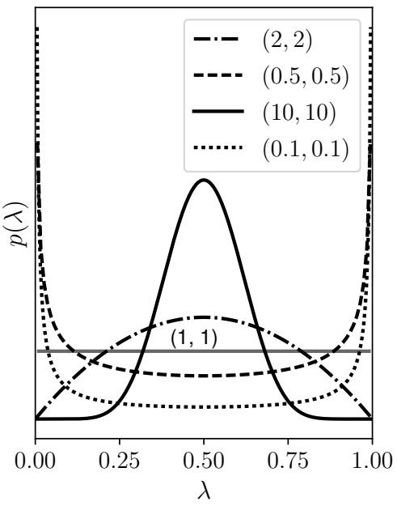

Hình 4.1. Đồ thị hàm mật độ xác suất của phân phối beta khi $\alpha = \beta$ và nhận các giá trị khác nhau. Khi cả hai giá trị này lớn, xác suất để λ gần 0.5 sẽ cao hơn.

Việc chọn tiên nghiệm phù hợp đã khiến cho việc tối ưu bài toán MAP được thuận lợi.

Việc còn lại là chọn cặp siêu tham số α và $\beta .$

Chúng ta cùng xem lại dạng của phân phối beta và thấy rằng khi $\alpha = \beta > 1$ hàm mật độ xác suất của phân phối beta đối xứng qua điểm 0.5 và đạt giá trị cao nhất tại 0.5. Xét Hình 4.1, ta thấy rằng khi $\alpha = \beta > 1$ , mật độ xác suất xung quanh điểm 0.5 nhận giá trị cao, điều này chứng tỏ λ có xu hướng gần 0.5.

Nếu chọn $\alpha = \beta = 1$ , ta nhận được phân phối đều vì đồ thị hàm mật độ xác suất là một đường thẳng. Lúc này, xác suất của λ tại mọi vị trí trong khoảng [0, 1] là như nhau. Thực chất, nếu ta thay $\alpha = \beta = 1$ vào (4.40) ta sẽ thu được $\lambda = n / N$ đây chính là ước lượng thu được bằng MLE. MLE là một trường hợp đặc biệt của MAP khi prior là một phân phối đều.

Nếu ta chọn $\alpha = \beta = 2$ , ta sẽ thu được: $\lambda = \frac { n + 1 } { N + 2 }$ . Chẳng hạn khi $N = 5 , n = 1$ như trong ví dụ. MLE cho kết quả $\lambda = 1 / 5$ , MAP sẽ cho kết quả $\lambda = 2 / 7 ,$ gần với $1 / 2$ hơn.

Nếu chọn $\alpha = \beta = 1 0$ ta sẽ có $\lambda = (1 + 9)/(5 + 18) = 10/23$ Ta thấy rằng khi $\alpha = \beta$ và càng lớn thì ta sẽ thu được λ càng gần 1/2. Điều này có thể dễ nhận thấy vì prior nhận giá trị rất cao tại 0.5 khi các siêu tham số $\alpha = \beta$ lớn.

<!-- page: 77 -->

## 4.4. Tóm tắt

• Khi sử dụng các mô hình thống kê machine learning, chúng ta thường xuyên phải ước lượng các tham số của mô hình θ. Có hai phương pháp phổ biến được sử dụng để ước lượng θ là ước lượng hợp lý cực đại (MLE) và ước lượng hậu nghiệ cực đại (MAP).

• Với MLE, việc xác định tham số θ được thực hiện bằng cách đi tìm các tham số sao cho xác suất của tập huấn luyện, được xác định bằng hàm hợp lý, là lớn nhất:

$$
\theta = \underset {\theta} {\operatorname{argmax}} p (\mathbf {x} _ {1}, \ldots , \mathbf {x} _ {N} | \theta).\tag{4.41}
$$

• Để giải bài toán tối ưu này, giả thiết các dữ liệu $\mathbf { x } _ { i }$ độc lập thường được sử dụng. Và bài toán MLE trở thành

$$
\theta = \operatorname * {a r g m a x} _ {\theta} \prod_ {i = 1} ^ {N} p (\mathbf {x} _ {i} | \theta).\tag{4.42}
$$

• Với MAP, các tham số được đánh giá bằng cách tối đa hậu nghiệm:

$$
\theta = \underset {\theta} {\operatorname{argmax}} p (\theta | \mathbf {x} _ {1}, \dots , \mathbf {x} _ {N})\tag{4.43}
$$

• Quy tắc Bayes và giả thiết về sự độc lập của dữ liệu thường được sử dụng:

$$
\theta = \operatorname * {a r g m a x} _ {\theta} \left[ \prod_ {i = 1} ^ {N} p (\mathbf {x} _ {i} | \theta) p (\theta) \right]\tag{4.44}
$$

Hàm mục tiêu ở đây chính là tích của hàm hợp lý và tiên nghiệm.

• Tiên nghiệm thường được chọn dựa trên các thông tin biết trước của tham số, và phân phối được chọn thường là các phân phối liên hợp của likelihood.

• MAP có thể được coi như một phương pháp giúp tránh thiên lệch khi có ít dữ liệu huấn luyện.

<!-- page: 78 -->

<!-- page: 79 -->

Tổng quan

<!-- page: 80 -->

# Các khái niệm cơ bản

## 5.1. Nhiệm vụ, kinh nghiệm, phép đánh giá

Một thuật toán machine learning là một thuật toán có khả năng học tập từ dữ liệu. Vậy thực sự “học tập” có nghĩa như thế nào? Theo Mitchell [M+97], “A computer program is said to learn from experience E with respect to some tasks T and performance measure P, if its performance at tasks in T, as measured by P, improves with experience E.”

Tạm dịch:

Một chương trình máy tính được gọi là “học tập” từ kinh nghiệm E để hoàn thành nhiệm vụ T với hiệu quả được đo bằng phép đánh giá P, nếu hiệu quả của nó khi thực hiện nhiệm vụ T, khi được đánh giá bởi P, cải thiện theo kinh nghiệm E.

Lấy ví dụ về một chương trình máy tính có khả năng tự chơi cờ vây. Chương trình này tự học từ các ván cờ đã chơi trước đó của con người để tính toán ra các chiến thuật hợp lý nhất. Mục đích của việc học này là tạo ra một chương trình có khả năng giành phần thắng cao. Chương trình này cũng có thể tự cải thiện khả năng của mình bằng cách chơi hàng triệu ván cờ với chính nó. Trong ví dụ này, chương trình máy tính có nhiệm vụ chơi cờ vây thông qua kinh nghiệm là các ván cờ đã chơi với chính nó và của con người. Phép đánh giá ở đây chính là khả năng giành chiến thắng của chương trình.

Để xây dựng một chương trình máy tính có khả năng học, ta cần xác định rõ ba yếu tố: nhiệm vụ, phép đánh giá, và nguồn dữ liệu huấn luyện. Bạn đọc sẽ hiểu rõ hơn về các yếu tố này qua các mục còn lại của chương.

<!-- page: 81 -->

## 5.2. Dữ liệu

Các nhiệm vụ trong machine learning được mô tả thông qua việc một hệ thống xử lý một điểm dữ liệu đầu vào như thế nào.

Một điểm dữ liệu có thể là một bức ảnh, một đoạn âm thanh, một văn bản, hoặc một tập các hành vi của người dùng trên Internet. Để chương trình máy tính có thể học được, các điểm dữ liệu thường được đưa về dạng tập hợp các con số mà mỗi số được gọi là một đặc trưng (feature).

Có những loại dữ liệu được biểu diễn dưới dạng ma trận hoặc mảng nhiều chiều. Một bức ảnh xám có thể được coi là một ma trận mà mỗi phần tử là giá trị độ sáng của điểm ảnh tương ứng. Một bức ảnh màu ba kênh đỏ, lục, và lam có thể được biểu diễn bởi một mảng ba chiều. Trong cuốn sách này, các điểm dữ liệu đều được biểu diễn dưới dạng mảng một chiều, còn được gọi là vector đặc trưng (feature vector). Vector đặc trưng của một điểm dữ liệu thường được ký hiệu là $\mathbf { x } \in \mathbb { R } ^ { d }$ trong đó d là số lượng đặc trưng. Các mảng nhiều chiều được hiểu là đã bị vector hoá (vectorized) thành mảng một chiều. Kỹ thuật xây dựng vector đặc trưng cho dữ liệu được trình bày cụ thể hơn trong Chương 6.

Kinh nghiệm trong machine learning là bộ dữ liệu được sử dụng để xây dựng mô hình. Trong quá trình xây dựng mô hình, bộ dữ liệu thường được chia ra làm ba tập dữ liệu không giao nhau: tập huấn luyện, tập kiểm tra, và tập xác thực.

Tập huấn luyện (training set) bao gồm các điểm dữ liệu được sử dụng trực tiếp trong việc xây dựng mô hình. Tập kiểm tra (test set) gồm các dữ liệu được dùng để đánh giá hiệu quả của mô hình. Để đảm bảo tính phổ quát, dữ liệu kiểm tra không được sử dụng trong quá trình xây dựng mô hình. Điều kiện cần để một mô hình hiệu quả là kết quả đánh giá trên cả tập huấn luyện và tập kiểm tra đều cao. Tập kiểm tra đại diện cho dữ liệu mà mô hình chưa từng thấy, có thể xuất hiện trong quá trình vận hành mô hình trên thực tế.

Một mô hình hoạt động hiệu quả trên tập huấn luyện chưa chắc đã hoạt động hiệu quả trên tập kiểm tra. Để tăng hiệu quả của mô hình trên dữ liệu kiểm tra, người ta thường sử dụng một tập dữ liệu nữa được gọi là tập xác thực (validation set). Tập xác thực này được sử dụng trong việc lựa chọn các siêu tham số mô hình. Các khái niệm này sẽ được làm rõ hơn trong Chương 8.

Lưu ý: Ranh giới giữa tập huấn luyện, tập xác thực, và tập kiểm tra đôi khi không rõ ràng. Dữ liệu thực tế thường không cố định mà thường xuyên được cập nhật. Khi có thêm dữ liệu, dữ liệu kiểm thử ở mô hình cũ có thể trở thành dữ liệu huấn luyện trong mô hình mới. Trong phạm vi cuốn sách, chúng ta chỉ xem xét các mô hình có dữ liệu cố định.

<!-- page: 82 -->

## 5.3. Các bài toán cơ bản trong machine learning

Nhiều bài toán phức tạp có thể được giải quyết bằng machine learning. Dưới đây là một số bài toán phổ biến.

## 5.3.1. Phân loại

Phân loại (classification) là một trong những bài toán được nghiên cứu nhiều nhất trong machine learning. Trong bài toán này, chương trình được yêu cầu xác định lớp/nhãn (class/label) của một điểm dữ liệu trong số C nhãn khác nhau. Cặp (dữ liệu, nhãn) được ký hiệu là (x, y) với y nhận một trong C giá trị trong tập đích Y. Trong bài toán này, việc xây dựng mô hình tương đương với việc đi tìm hàm số f ánh xạ một điểm dữ liệu x vào một phần tử y ∈ Y : y = f(x).

Ví dụ 1 : Bài toán phân loại ảnh chữ số viết tay có mười nhãn là các chữ số từ không đến chín. Trong bài toán này:

• Nhiệm vụ: xác định nhãn của một ảnh chữ số viết tay.

• Phép đánh giá: số lượng ảnh được gán nhãn đúng.

• Kinh nghiệm: dữ liệu gồm các cặp (ảnh chữ số, nhãn) biết trước.

Ví dụ 2 : Bài toán phân loại email rác. Trong bài toán này:

• Nhiệm vụ: xác một email mới trong hộp thư đến là email rác hay không.

• Phép đánh giá: tỉ lệ email rác tìm thấy email thường được xác định đúng.

• Kinh nghiệm: cặp các (email, nhãn) thu thập được trước đó.

## 5.3.2. Hồi quy

Nếu tập đích Y gồm các giá trị thực (có thể vô hạn) thì bài toán được gọi là hồi quy <sup>9</sup>(regression). Trong bài toán này, ta cần xây dựng một hàm số f : R<sup>d</sup> → R.

Ví dụ 1 : Ước lượng giá của một căn nhà rộng x m<sup>2</sup>, có y phòng ngủ và cách trung tâm thành phố z km.

Ví dụ 2 : Microsoft có một ứng dụng dự đoán giới tính và tuổi dựa trên khuôn mặt ([http://how-old.net/](http://how-old.net/)). Phần dự đoán giới tính có thể được coi là một mô hình phân loại, phần dự đoán tuổi có thể coi là một mô hình hồi quy. Chú ý rằng nếu coi tuổi là một số nguyên dương không lớn hơn 150, ta có 150 nhãn khác nhau và phần xác định tuổi có thể được coi là một mô hình phân loại.

<small><span class="docvortex-page-footnote" data-block-type="page_footnote" style="color:#6b7280">9có tài liệu gọi là tiên lượng</span></small>

<!-- page: 83 -->

Bài toán hồi quy có thể mở rộng ra việc dự đoán nhiều đầu ra cùng một lúc, khi đó, hàm cần tìm sẽ là $f : \mathbb { R } ^ { d } \rightarrow \mathbb { R } ^ { m }$ . Một ví dụ là bài toán tạo ảnh độ phân giải cao từ một ảnh có độ phân giải thấp hơn<sup>10</sup>. Khi đó, việc dự đoán giá trị các điểm trong ảnh đầu ra là một bài toán hồi quy nhiều đầu ra.

## 5.3.3. Máy dịch

Trong bài toán máy dịch (machine translation), chương trình máy tính được yêu cầu dịch một đoạn văn trong một ngôn ngữ sang một ngôn ngữ khác. Dữ liệu huấn luyện là các cặp văn bản song ngữ. Các văn bản này có thể chỉ gồm hai ngôn ngữ đang xét hoặc có thêm các ngôn ngữ trung gian. Lời giải cho bài toán này gần đây đã có nhiều bước phát triển vượt bậc dựa trên các thuật toán deep learning.

## 5.3.4. Phân cụm

Phân cụm (clustering) là bài toán chia dữ liệu X thành các cụm nhỏ dựa trên sự liên quan giữa các dữ liệu trong mỗi cụm. Trong bài toán này, dữ liệu huấn luyện không có nhãn, mô hình tự phân chia dữ liệu thành các cụm khác nhau.

Điều này giống với việc yêu cầu một đứa trẻ phân cụm các mảnh ghép với nhiều hình thù và màu sắc khác nhau. Mặc dù không cho trẻ biết mảnh nào tương ứng với hình nào hoặc màu nào, nhiều khả năng chúng vẫn có thể phân loại các mảnh ghép theo màu hoặc hình dạng.

Ví dụ 1 : Phân cụm khách hàng dựa trên hành vi mua hàng. Dựa trên việc mua bán và theo dõi của người dùng trên một trang web thương mại điện tử, mô hình có thể phân người dùng vào các cụm theo sở thích mua hàng. Từ đó, mô hình có thể quảng cáo các mặt hàng mà người dùng có thể quan tâm.

## 5.3.5. Hoàn thiện dữ liệu – data completion

Một bộ dữ liệu có thể có nhiều đặc trưng nhưng việc thu thập đặc trưng cho từng điểm dữ liệu đôi khi không khả thi. Chẳng hạn, một bức ảnh có thể bị xước khiến nhiều điểm ảnh bị mất hay thông tin về tuổi của một số khách hàng không thu thập được. Hoàn thiện dữ liệu (data completion) là bài toán dự đoán các trường dữ liệu còn thiếu đó. Nhiệm vụ của bài toán này là dựa trên mối tương quan giữa các điểm dữ liệu để dự đoán những giá trị còn thiếu. Các hệ thống khuyến nghị là một ví dụ điển hình của loại bài toán này.

Ngoài ra, có nhiều bài toán machine learning khác như xếp hạng (ranking), thu thập thông tin (information retrieval), giảm chiều dữ liệu (dimentionality reduction),...

<small><span class="docvortex-page-footnote" data-block-type="page_footnote" style="color:#6b7280">10 single image super resolution trong tiếng Anh</span></small>

<!-- page: 84 -->

## 5.4. Phân nhóm các thuật toán machine learning

Dựa trên tính chất của tập dữ liệu, các thuật toán machine learning có thể được phân thành hai nhóm chính là học có giám sát và học không giám sát. Ngoài ra, có hai nhóm thuật toán khác gây nhiều chú $\hat { \mathrm { y } }$ trong thời gian gần đây là học bán giám sát và học củng cố.

## 5.4.1. Học có giám sát

Một thuật toán machine learning được gọi là học có giám sát (supervised learning) nếu việc xây dựng mô hình dự đoán mối quan hệ giữa đầu vào và đầu ra được thực hiện dựa trên các cặp (đầu vào, đầu ra) đã biết trong tập huấn luyện. Đây là nhóm thuật toán phổ biến nhất trong các thuật toán machine learning.

Các thuật toán phân loại và hồi quy là hai ví dụ điển hình trong nhóm này. Trong bài toán xác định xem một bức ảnh có chứa một xe máy hay không, ta cần chuẩn bị các ảnh chứa và không chứa xe máy cùng với nhãn của chúng. Dữ liệu này được dùng như dữ liệu huấn luyện cho mô hình phân loại. Một ví dụ khác, nếu việc xây dựng một mô hình máy dịch Anh – Việt được thực hiện dựa trên hàng triệu cặp văn bản Anh – Việt tương ứng, ta cũng nói thuật toán này là học có giám sát.

Cách huấn luyện mô hình học máy như trên tương tự với cách dạy học sau đây của con người. Ban đầu, cô giáo đưa các bức ảnh chứa chữ số cho một đứa trẻ và chỉ ra đâu là chữ số không, đầu là chữ số một,... Qua nhiều lần hướng dẫn, đứa trẻ có thể nhận được các chữ số trong một bức ảnh chúng thậm chí chưa nhìn thấy bao giờ. Quá trình cô giáo chỉ cho đứa trẻ tên của từng chữ số tương đương với việc chỉ cho mô hình học máy đầu ra tương ứng của mỗi điểm dữ liệu đầu vào. Tên gọi học có giám sát xuất phát từ đây.

Diễn giải theo toán học, học có giám sát xảy ra khi việc dự đoán quan hệ giữa đầu ra y và dữ liệu đầu vào x được thực hiện dựa trên các cặp $\{ ( \mathbf { x } _ { 1 } , \mathbf { y } _ { 1 } ) , ( \mathbf { x } _ { 2 } , \mathbf { y } _ { 2 } ) , \ldots , ( \mathbf { x } _ { N } , \mathbf { y } _ { N } ) \}$ trong tập huấn luyện. Việc huấn luyện là việc xây dựng một hàm số f sao cho với mọi $i = 1 , 2 , \ldots , N ,   f ( \mathbf { x } _ { i } )$ gần với $\mathbf { y } _ { i }$ nhất có thể. Hơn thế nữa, khi có một điểm dữ liệu x nằm ngoài tập huấn luyện, đầu ra dự đoán f(x) cũng gần với đầu ra thực sự y.

## 5.4.2. Học không giám sát

Trong một nhóm các thuật toán khác, dữ liệu huấn luyện chỉ bao gồm các dữ liệu đầu vào x mà không có đầu ra tương ứng. Các thuật toán machine learning có thể không dự đoán được đầu ra nhưng vẫn trích xuất được những thông tin quan trọng dựa trên mối liên quan giữa các điểm dữ liệu. Các thuật toán trong nhóm này được gọi là học không giám sát (unsupervised learning).

<!-- page: 85 -->

Các thuật toán giải quyết bài toán phân cụm và giảm chiều dữ liệu là các ví dụ điển hình của nhóm này. Trong bài toán phân cụm, có thể mô hình không trực tiếp dự đoán được đầu ra của dữ liệu nhưng vẫn có khả năng phân các điểm dữ liệu có đặc tính gần giống nhau vào từng nhóm.

Quay lại ví dụ trên, nếu cô giáo giao cho đứa trẻ các bức ảnh chứa chữ số nhưng không nêu rõ tên gọi của chúng, đứa trẻ sẽ không biết tên gọi của từng chữ số. Tuy nhiên, đứa trẻ vẫn có thể tự chia các chữ số có nét giống nhau vào cùng một nhóm và xác định được nhóm tương tứng của một bức ảnh mới. Đứa trẻ có thể tự thực hiện công việc này mà không cần sự chỉ bảo hay giám sát của cô giáo. Tên gọi học không giám sát xuất phát từ đây.

## 5.4.3. Học bán giám sát

Ranh giới giữa học có giám sát và học không giám sát đôi khi không rõ ràng. Có những thuật toán mà tập huấn luyện bao gồm các cặp (đầu vào, đầu ra) và dữ liệu khác chỉ có đầu vào. Những thuật toán này được gọi là học bán giám sát (semi-supervised learning).

Xét một bài toán phân loại mà tập huấn luyện bao gồm các bức ảnh được gán nhãn ‘chó’ hoặc ‘mèo’ và rất nhiều bức ảnh thú cưng tải từ Internet chưa có nhãn. Thực tế cho thấy ngày càng nhiều thuật toán rơi vào nhóm này vì việc thu thập nhãn cho dữ liệu có chi phí cao và tốn thời gian. Chẳng hạn, chỉ một phần nhỏ trong các bức ảnh y học có nhãn vì quá trình gán nhãn tốn thời gian và cần sự can thiệp của các chuyên gia. Một ví dụ khác, thuật toán dò tìm vật thể cho xe tự lái được xây dựng trên một lượng lớn video thu được từ camera xe hơi; tuy nhiên, chỉ một lượng nhỏ các vật thể trong các video huấn luyện đó được xác định cụ thể.

## 5.4.4. Học củng cố

Có một nhóm các thuật toán machine learning khác có thể không yêu cầu dữ liệu huấn luyện mà mô hình học cách ra quyết định bằng cách giao tiếp với môi trường xung quanh. Các thuật toán thuộc nhóm này liên tục ra quyết định và nhận phản hồi từ môi trường để tự củng cố hành vi. Nhóm các thuật toán này có tên học củng cố (reinforcement learning).

Ví dụ 1 : Gần đây, AlphaGo trở nên nổi tiếng với việc chơi cờ vây thắng cả con người ([https://goo.gl/PzKcvP](https://goo.gl/PzKcvP)). Cờ vây được xem là trò chơi có độ phức tạp cực kỳ cao<sup>11</sup> với tổng số thế cờ xấp xỉ 10<sup>761</sup>, con số này ở cờ vua là 10<sup>120</sup> và tổng số nguyên tử trong toàn vũ trụ là khoảng 10<sup>80</sup>!! Hệ thống phải chọn ra một chiến thuật tối ưu trong số hàng nhiều tỉ tỉ lựa chọn, và tất nhiên việc thử tất cả các lựa chọn là không khả thi. Về cơ bản, AlphaGo bao gồm các thuật toán thuộc cả học có giảm sát và học củng cố. Trong phần học có giám sát, dữ liệu từ các

<small><span class="docvortex-page-footnote" data-block-type="page_footnote" style="color:#6b7280">11 Google DeepMind’s AlphaGo: How it works ([https://goo.gl/nDNcCy](https://goo.gl/nDNcCy)).</span></small>

<!-- page: 86 -->

ván cờ do con người chơi với nhau được đưa vào để huấn luyện. Tuy nhiên, mục đích cuối cùng của AlphaGo không dừng lại ở việc chơi như con người mà thậm chí phải thắng cả con người. Vì vậy, sau khi học xong các ván cờ của con người, AlphaGo tự chơi với chính nó qua hàng triệu ván cờ để tìm ra các nước đi tối ưu hơn. Thuật toán trong phần tự chơi này được xếp vào loại học củng cố.

Gần đây, Google DeepMind đã tiến thêm một bước đáng kể với AlphaGo Zero. Hệ thống này thậm chí không cần học từ các ván cờ của con người. Nó có thể tự chơi với chính mình để tìm ra các chiến thuật tối ưu. Sau 40 ngày được huấn luyện, nó đã thắng tất cả các con người và hệ thống khác, bao gồm AlphaGo<sup>12</sup>.

Ví dụ 2 : Huấn luyện cho máy tính chơi game Mario<sup>13</sup>. Đây là một chương trình thú vị dạy máy tính chơi trò chơi điện tử Mario. Trờ chơi này đơn giản hơn cờ vây vì tại một thời điểm, tập hợp các quyết định có thể ra gồm ít phần tử. Người chơi chỉ phải bấm một số lượng nhỏ các nút di chuyển, nhảy, bắn đạn. Đồng thời, môi trường cũng đơn giản hơn và lặp lại ở mỗi lần chơi (tại thời điểm cụ thể sẽ xuất hiện một chướng ngại vật cố định ở một vị trí cố định). Đầu vào của là sơ đồ của màn hình tại thời điểm hiện tại, nhiệm vụ của thuật toán là tìm tổ hợp phím được bấm với mỗi đầu vào.

Việc huấn luyện một thuật toán học củng cố thông thường dựa trên một đại lượng được gọi là điểm thưởng (reward). Mô hình cần tìm ra một thuật toán tối đa điểm thưởng đó qua rất nhiều lần chơi khác nhau. Trong trò chơi cờ vây, điểm thưởng có thể là số lượng ván thắng. Trong trò chơi Mario, điểm thưởng được xác định dựa trên quãng đường nhân vật Mario đi được và thời gian hoàn thành quãng đường đó. Điểm thưởng này không phải là điểm của trò chơi mà là điểm do chính người lập trình tạo ra.

## 5.5. Hàm mất mát và tham số mô hình

Mỗi mô hình machine learning được mô tả bởi bộ các tham số mô hình (model parameter). Công việc của một thuật toán machine learning là đi tìm các tham số mô hình tối ưu cho mỗi bài toán. Việc đi tìm các tham số mô hình có liên quan mật thiết đến các phép đánh giá. Mục đích chính là đi tìm các tham số mô hình sao cho các phép đánh giá đạt kết quả cao nhất. Trong bài toán phân loại, kết quả tốt có thể được hiểu là có ít điểm dữ liệu bị phân loại sai. Trong bài toán hồi quy, kết quả tốt là khi sự sai lệch giữa đầu ra dự đoán và đầu ra thực sự là nhỏ.

Quan hệ giữa một phép đánh giá và các tham số mô hình được mô tả thông qua một hàm số gọi là hàm mất mát (loss function hoặc cost function). Hàm số này thường có giá trị nhỏ khi phép đánh giá cho kết quả tốt và ngược lại. Việc đi tìm các tham số mô hình sao cho phép đánh giá trả về kết quả tốt tương đương

<small><span class="docvortex-page-footnote" data-block-type="page_footnote" style="color:#6b7280">12 AlphaGo Zero: Learning from scratch ([https://goo.gl/xtDjoF](https://goo.gl/xtDjoF)).</span></small>

<small><span class="docvortex-page-footnote" data-block-type="page_footnote" style="color:#6b7280">13 MarI/O - Machine Learning for Video Games ([https://goo.gl/QekkRz](https://goo.gl/QekkRz))</span></small>

<!-- page: 87 -->

với việc tối thiểu hàm mất mát. Như vậy, việc xây dựng một mô hình machine learning chính là việc đi giải một bài toán tối ưu. Quá trình đó được coi là quá trình learning của machine.

Tập hợp các tham số mô hình được ký hiệu bằng θ, hàm mất mát của mô hình được ký hiệu là ${ \mathcal { L } } ( \theta )$ hoặc $J ( \theta )$ . Bài toán đi tìm tham số mô hình tương đương với bài toán tối thiểu hàm mất mát:

$$
\theta^ {*} = \underset {\theta} {\operatorname{argmin}} \mathcal {L} (\theta).\tag{5.1}
$$

Trong đó, ký hiệu argmin ${ \mathcal { L } } ( \theta )$ được hiểu là giá trị của θ để hàm số ${ \mathcal { L } } ( \theta )$ đạt giá θ trị nhỏ nhất. Biến số được ghi dưới dấu argmin là biến đang được tối ưu. Biến số này cần được chỉ rõ, trừ khi hàm mất mát chỉ phụ thuộc vào một biến duy nhất. Ký hiệu argmax cũng được sử dụng một cách tương tự khi cần tìm giá trị của các biến số để hàm số đạt giá trị lớn nhất.

Hàm số ${ \mathcal { L } } ( \theta )$ có thể không có chặn dưới hoặc đạt giá trị nhỏ nhất tại nhiều giá trị θ khác nhau. Thậm chí, việc tìm giá trị nhỏ nhất của hàm số này đôi khi không khả thi. Trong các bài toán tối ưu thực tế, việc chỉ cần tìm ra một bộ tham số θ khiến hàm mất mát đạt giá trị nhỏ nhất hoặc thậm chí một giá trị cực tiểu cũng có thể mang lại các kết quả khả quan.

Để hiểu bản chất của các thuật toán machine learning, việc nắm vững các kỹ thuật tối ưu cơ bản là cần thiêt. Cuốn sách này cũng cung cấp kiến thức nền tảng cho việc giải các bài toán tối ưu, bao gồm tối ưu không ràng buộc (Chương 12) và tối ưu có ràng buộc (xem Phần VII).

Trong các chương tiếp theo của phần này, bạn đọc sẽ dần làm quen với các thành phần cơ bản của một hệ thống machine learning.

<!-- page: 88 -->

# Các kỹ thuật xây dựng đặc trưng

## 6.1. Giới thiệu

Mỗi điểm dữ liệu trong một mô hình machine learning thường được biểu diễn bằng một vector được gọi là vector đặc trưng (feature vector). Trong cùng một mô hình, các vector đặc trưng của các điểm thường có kích thước như nhau. Điều này là cần thiết vì các mô hình bao gồm các phép toán với ma trận và vector, các phép toán này yêu cầu dữ liệu có chiều phù hợp. Tuy nhiên, dữ liệu thực tế thường ở dạng thô với kích thước khác nhau hoặc kích thước như nhau nhưng số chiều quá lớn gây trở ngại trong việc lưu trữ. Vì vậy, việc lựa chọn, tính toán đặc trưng phù hợp cho mỗi bài toán là một bước quan trọng.

Trong những bài toán thị giác máy tính, các bức ảnh thường là các ma trận hoặc mảng nhiều chiều với kích thước khác nhau. Các bức ảnh này có thể được chụp bởi nhiều camera trong các điều kiện ánh sáng khác nhau. Các bức ảnh này không những cần được đưa về kích thước phù hợp mà còn cần được chuẩn hoá để tăng hiệu quả của mô hình.

Trong các bài toán xử lý ngôn ngữ tự nhiên, độ dài văn bản có thể khác nhau, được viết theo những văn phong khác nhau. Trong nhiều trường hợp, việc thêm bớt một vài từ vào một văn bản có thể thay đổi hoàn toàn nội dung của nó. Hoặc cùng là một câu nói nhưng tốc độ, âm giọng của mỗi người là khác nhau, tại các thời điểm khác nhau là khác nhau. Khi làm việc với các bài toán machine learning, nhìn chung ta chỉ có được dữ liệu thô chưa qua chỉnh sửa và chọn lọc. Ngoài ra, ta có thể phải loại bỏ những dữ liệu nhiễu và đưa dữ liệu thô với kích thước khác nhau về cùng một chuẩn. Dữ liệu chuẩn này phải đảm bảo giữ được những thông tin đặc trưng của dữ liệu thô ban đầu. Không những thế, ta cần thiết kế những phép biến đổi để có những đặc trưng phù hợp cho từng bài toán.

<!-- page: 89 -->

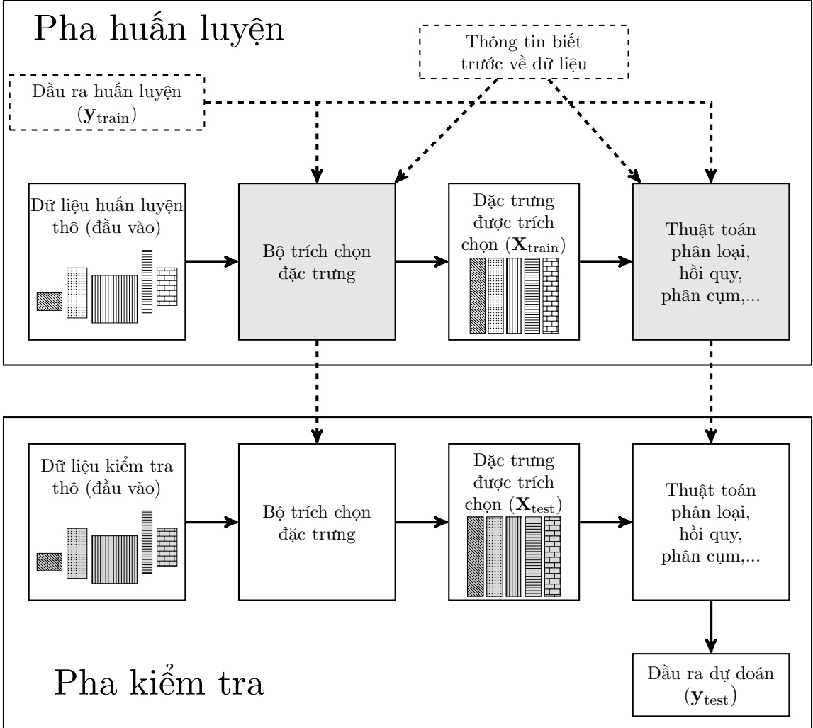

Hình 6.1. Mô hình chung trong các bài toán machine learning

Quá trình quan trọng này được gọi là trích chọn đặc trưng (feature extraction hoặc feature engineering).

Để có cái nhìn tổng quan, chúng ta cần đặt bước trích chọn đặc trưng này trong cả quy trình xây dựng một mô hình machine learning.

## 6.2. Mô hình chung cho các bài toán machine learning

Phần lớn các mô hình machine learning có thể được minh hoạ trong Hình 6.1. Có hai pha lớn trong mỗi bài toán machine learning là pha huấn luyện (training phase) và pha kiểm tra (test phase). Pha huấn luyện xây dựng mô hình dựa trên dữ liệu huấn luyện. Dữ liệu kiểm tra được sử dụng để đánh giá hiệu quả mô hình<sup>14</sup>.

<small><span class="docvortex-page-footnote" data-block-type="page_footnote" style="color:#6b7280">14 Trước khi đánh giá một mô hình trên tập kiểm tra, ta cần đảm bảo rằng mô hình đó đã làm việc tốt trên tập huấn luyện.</span></small>

<!-- page: 90 -->

## 6.2.1. Pha huấn luyện

Có hai khối có nền màu xám cần được thiết kế:

Khối trích chọn đặc trưng có nhiệm vụ tạo ra một vector đặc trưng cho mỗi điểm dữ liệu đầu vào. Vector đặc trưng này thường có kích thước như nhau, bất kể dữ liệu đầu vào có kích thước như thế nào.

Đầu vào của khối trích chọn đặc trưng có thể là các yếu tố sau:

• Dữ liệu huấn luyện đầu vào ở dạng thô bao gồm tất cả các thông tin ban đầu. Ví dụ, dữ liệu thô của một ảnh là giá trị của từng điểm ảnh, của một văn bản là từng từ, từng câu; của một file âm thanh là một đoạn tín hiệu; của thời tiết là thông tin về hướng gió, nhiệt độ, độ ẩm không khí,... Dữ liệu thô này thường không ở dạng vector, không có số chiều như nhau hoặc một vài thông tin bị khuyết. Thậm chí chúng có thể có số chiều như nhau nhưng rất lớn. Chẳng hạn, một bức ảnh màu kích thước 1000 × 1000 có số điểm ảnh là 3 × 10<sup>615</sup>. Đây là một con số quá lớn, không có lợi cho lưu trữ và tính toán.

• Dữ liệu huấn luyện đầu ra: dữ liệu này có thể được sử dụng hoặc không. Trong các thuật toán học không giám sát, ta không biết đầu ra nên hiển nhiên không có giá trị này. Trong các thuật toán học có giám sát, đôi khi dữ liệu này cũng không được sử dụng. Ví dụ, việc giảm chiều dữ liệu có thể không cần sử dụng dữ liệu đầu ra. Nếu dữ liệu đầu vào đã là các vector cột cùng chiều, ta chỉ cần nhân vào bên phải của chúng một ma trận chiếu ngẫu nhiên. Ma trận này có số hàng ít hơn số cột để đảm bảo số chiều thu được nhỏ hơn số chiều ban đầu. Việc làm này mặc dù làm mất đi thông tin, trong nhiều trường hợp vẫn mang lại hiệu quả vì đã giảm được lượng tính toán ở phần sau. Đôi khi ma trận chiếu không phải là ngẫu nhiên mà có thể được học dựa trên toàn bộ dữ liệu thô ban đầu (xem Chương 21).

Trong nhiều trường hợp khác, dữ liệu đầu ra của tập huấn luyện cũng được sử dụng để tạo bộ trích chọn đặc trưng. Việc giữ lại nhiều thông tin không quan trọng bằng việc giữ lại các thông tin có ích. Ví dụ, dữ liệu thô là các hình vuông và hình tam giác màu đỏ và xanh. Trong bài toán phân loại đa giác, nếu các nhãn là tam giác và vuông, ta không quan tâm tới màu sắc mà chỉ quan tâm tới số cạnh của đa giác. Ngược lại, trong bài toán phân loại màu với các nhãn là xanh và đỏ, ta không quan tâm tới số cạnh mà chỉ quan tâm đến màu sắc.

• Các thông tin biết trước về dữ liệu: Ngoài dữ liệu huấn luyện, các thông tin biết trước ngoài lề cũng có tác dụng trong việc xây dựng bộ trích chọn đặc trưng. Chẳng hạn, có thể dùng các bộ lọc để giảm nhiễu nếu dữ liệu là âm

<small><span class="docvortex-page-footnote" data-block-type="page_footnote" style="color:#6b7280">15 Ảnh màu thường có ba kênh: red, green, blue – RGB</span></small>

<!-- page: 91 -->

thanh, hoặc dùng các bộ dò cạnh để tìm ra cạnh của các vật thể trong dữ liệu ảnh. Nếu dữ liệu là ảnh các tế bào và ta cần đưa ảnh về kích thước nhỏ hơn, ta cần lưu ý về độ phân giải của tế bảo của ảnh trong kích thước mới. Ta cần xây dựng một bộ trích chọn đặc trưng phù hợp với từng loại dữ liệu.

Sau khi xây dựng bộ trích chọn đặc trưng, dữ liệu thô ban đầu được đưa qua và tạo ra các vector đặc trưng tương ứng gọi là đặc trưng đã trích xuất (extracted feature). Những đặc trưng này được dùng để huấn luyện các thuật toán machine learning chính như phân loại, phân cụm, hồi quy,... trong khối màu xám thứ hai.

Trong một số thuật toán cao cấp hơn, việc xây dựng bộ trích chọn đặc trưng và các thuật toán chính có thể được thực hiện đồng thời thay vì riêng lẻ như trên. Đầu vào của toàn bộ mô hình là dữ liệu thô hoặc dữ liệu thô đã qua một bước xử lý nhỏ. Các mô hình đó có tên gọi chung là ‘mô hình đầu cuối’ (end-to-end model). Với sự phát triển của deep learning trong những năm gần đây, người ta cho rằng các mô hình đầu cuối mang lại kết quả tốt hơn nhờ vào việc hai khối được huấn luyện cùng nhau, bổ trợ lẫn nhau cùng hướng tới mục đích chung cuối cùng. Thực tế cho thấy, các mô hình machine learning hiệu quả nhất thường là các mô hình đầu cuối.

## 6.2.2. Pha kiểm tra

Ở pha kiểm tra, vector đặc trưng của một điểm dữ liệu thô mới được tạo bởi bộ trích chọn đặc trưng thu được từ pha huấn luyện. Vector đặc trưng này được đưa vào thuật toán chính đã tìm được để đưa ra quyết tra. Có một lưu ý quan trọng là khi xây dựng bộ trích chọn đặc trưng và các thuật toán chính, ta không được sử dụng dữ liệu kiểm tra. Các công việc đó được thực hiện chỉ dựa trên dữ liệu huấn luyện.

## 6.3. Một số kỹ thuật trích chọn đặc trưng

## 6.3.1. Trực tiếp lấy dữ liệu thô

Xét bài toán với dữ liệu là các bức ảnh xám có kích thước cố tra m × n điểm ảnh. Cách đơn giản nhất để tạo ra vector đặc trưng cho bức ảnh này là xếp chồng các cột của ma trận điểm ảnh để được một vector m × n phần tử. Vector này có thể được coi là vector đặc trưng với mỗi đặc trưng là giá trị của một điểm ảnh. Việc làm đơn giản này đã làm mất thông tin về vị trí tương đối giữa các điểm ảnh vì các điểm ảnh gần nhau theo phương ngang trong bức ảnh ban đầu không còn gần nhau trong vector đặc trưng. Tuy nhiên, trong nhiều trường hợp, kỹ thuật này vẫn mang lại kết quả khả quan.

<!-- page: 92 -->

## 6.3.2. Lựa chọn đặc trưng

Đôi khi, việc trích chọn đặc trưng đơn giản là chọn ra các thành phần phù hợp trong dữ liệu ban đầu. Việc làm này thường xuyên được áp dụng khi một lượng dữ liệu thu được không có đầy đủ các thành phần hoặc dữ liệu có quá nhiều chiều mà phần lớn không mang nhiều thông tin hữu ích.

## 6.3.3. Giảm chiều dữ liệu

Giả sử dữ liệu ban đầu là một vector $\mathbf { x } \in \mathbb { R } ^ { D }$ , A là một ma trận trong $R ^ { d \times D }$ và $\mathbf { z }   =   \mathbf { A } \mathbf { x }   \in   \mathbb { R } ^ { d }$ . Nếu d < D, ta thu được một vector với số chiều nhỏ hơn. Đây là một kỹ thuật phổ biến trong giảm chiều dữ liệu. Ma trận A được gọi là ma trận chiếu (projection matrix), có thể là một ma trận ngẫu nhiên. Tuy nhiên, việc chọn một ma trận chiếu ngẫu nhiên đôi khi mang lại kết quả tệ không mong muốn vì thông tin có thể bị thất thoát quá nhiều. Một phương pháp phổ biến để tối thiểu lượng thông tin mất đi có tên là phân tích thành phần chính (principal component analysis) sẽ được trình bày trong Chương 21.

Lưu ý: Kỹ thuật xây dựng đặc trưng không nhất thiết luôn làm giảm số chiều dữ liệu, đôi khi vector đặc trưng có thể có có kích thước lớn hơn dữ liệu thô ban đầu nếu việc này mang lại hiệu quả tốt hơn.

## 6.3.4. Túi từ

Chúng ta hẳn đã tự đặt ra các câu hỏi: với một văn bản, vector đặc trưng sẽ có dạng như thế nào? Làm sao đưa các từ, các câu, đoạn văn ở dạng ký tự trong các văn bản về một vector mà mỗi phần tử là một số?

Có một kỹ thuật rất phổ biến trong xử lý văn bản có tên là túi từ (bag of words, BoW).

Bắt đầu bằng ví dụ phân loại tin nhắn rác. Nhận thấy rằng nếu một tin có chứa các từ “khuyến mại”, “giảm giá”, “trúng thưởng”, “miễn phí”, “quà tặng”, “tri ân”,..., nhiều khả năng đó là một tin nhắn rác. Từ đó, phương pháp đầu tiên có thể nghĩ tới là đếm số lần các từ này xuất hiện, nếu số lượng này nhiều hơn một ngưỡng nào đó thì ta quyết định đó là tin rác<sup>16</sup>. Với các loại văn bản khác nhau, lượng từ liên quan tới từng chủ đề cũng khác nhau. Từ đó có thể dựa vào số lượng các từ trong từng loại để tạo các vector đặc trưng cho từng văn bản.

Xin lấy một ví dụ về hai văn bản đơn giản sau đây<sup>17</sup>:

<small><span class="docvortex-page-footnote" data-block-type="page_footnote" style="color:#6b7280">(1) "John likes to watch movies. Mary likes movies too."</span></small>

<small><span class="docvortex-page-footnote" data-block-type="page_footnote" style="color:#6b7280">16 Bài toán thực tế phức tạp hơn khi các tin nhắn có thể được viết dưới dạng không dấu, bị cố tình viết sai chính tả, hoặc dùng các ký tự đặc biệt</span></small>

<small><span class="docvortex-page-footnote" data-block-type="page_footnote" style="color:#6b7280">17 Bag of words – Wikipedia ([https://goo.gl/rBtZqx](https://goo.gl/rBtZqx))</span></small>

<!-- page: 93 -->

và

```txt
(2) "John also likes to watch football games."
```

Dựa trên hai văn bản này, ta có danh sách các từ được sử dụng, được gọi là từ điển (dictionary hoặc codebook) với mười từ như sau:

```json
["John", "likes", "to", "watch", "movies", "also", "football", "games", "Mary", "too"]
```

Với mỗi văn bản, ta sẽ tạo ra một vector đặc trưng có số chiều bằng 10, mỗi phần tử đại diện cho số từ tương ứng xuất hiện trong văn bản đó. Với hai văn bản trên, ta sẽ có hai vector đặc trưng:

```txt
(1) [1, 2, 1, 1, 2, 0, 0, 0, 1, 1]
(2) [1, 1, 1, 1, 0, 1, 1, 1, 0, 0]
```

Văn bản (1) có một từ "John", hai từ "likes", không từ "also", không từ "football ",... nên ta thu được vector tương ứng như trên.

Có một vài điều cần lưu ý trong BoW:

• Với những ứng dụng thực tế, từ điển có số lượng từ lớn hơn rất nhiều, có thể đến cả triệu, như vậy vector đặc trưng thu được sẽ rất dài. Một văn bản chỉ có một câu, và một tiểu thuyết nghìn trang đều được biểu diễn bằng các vector có kích thước như nhau.

• Có rất nhiều từ trong từ điển không xuất hiện trong một văn bản. Như vậy các vector đặc trưng thu được thường có nhiều phần tử bằng không. Các vector đó được gọi là vector thưa (sparse vector). Để việc lưu trữ được hiệu quả hơn, ta không lưu mọi thành phần của một vector thưa mà chỉ lưu vị trí của các phần tử khác không và giá trị tương ứng. Chú ý rằng nếu có hơn một nửa số phần tử khác không, việc làm này lại phản tác dụng. Tuy nhiên, trường hợp này ít xảy ra vì hiếm có văn bản chứa tới một nửa số từ trong từ điển.

• Các từ hiếm gặp được xử lý như thế nào? Một kỹ thuật thường dùng là thêm phần tử &lt;Unknown&gt; vào trong từ điển. Mọi từ không có trong từ điển đều được coi là &lt;Unknown&gt;.

• Tuy nhiên, những từ hiếm đôi khi lại mang những thông tin quan trọng nhất mà chỉ loại văn bản đó có. Đây là một nhược điểm của BoW. Có một phương pháp cải tiến giúp khắc phục nhược điểm này tên là term frequency-inverse

<!-- page: 94 -->

document frequency (TF-IDF) [SWY75] dùng để xác định tầm quan trọng của một từ trong một văn bản dựa trên toàn bộ văn bản trong cơ sở dữ liệu<sup>18</sup>.

• Nhược điểm lớn nhất của BoW là nó không mang thông tin về thứ tự của các từ, cũng như sự liên kết giữa các câu, các đoạn văn trong văn bản. Thứ tự của các từ trong văn bản thường mang thông tin quan trọng. Ví dụ, ba câu sau đây: “Em yêu anh không?”, “Em không yêu anh”, và “Không, (nhưng) anh yêu em” khi được trích chọn đặc trưng bằng BoW sẽ cho ra ba vector giống hệt nhau, mặc dù ý nghĩa khác hẳn nhau.

## 6.3.5. BoW cho dữ liệu ảnh

BoW cũng được áp dụng cho các bức ảnh với cách định nghĩa từ và từ điển khác. Xét các ví dụ sau:

Ví dụ 1 : Giả sử có một tập dữ liệu ảnh có hai nhãn là rừng và sa mạc, và một bức ảnh chỉ rơi vào một trong hai loại này. Việc phân loại một bức ảnh là rừng hay sa mạc một cách tự nhiên nhất là dựa vào màu sắc. Màu xanh lục nhiều tương ứng với rừng, màu đỏ và vàng nhiều tương ứng với sa mạc. Ta có một mô hình đơn giản để trích chọn đặc trưng như sau:

• Với một bức ảnh, chuẩn bị một vector x có số chiều bằng 3, đại diện cho ba màu xanh lục (x<sub>1</sub>), đỏ (x<sub>2</sub>), và vàng (x<sub>3</sub>).

• Với mỗi điểm ảnh trong bức ảnh đó, xem nó gần với màu xanh, đỏ hay vàng nhất dựa trên giá trị của điểm ảnh đó. Nếu nó gần điểm xanh nhất, tăng x<sub>1</sub> lên một; gần đỏ nhất, tăng x<sub>2</sub> lên một; gần vàng nhất, tăng x<sub>3</sub> lên một.

• Sau khi xem xét tất cả các điểm ảnh, dù cho bức ảnh có kích thước thế nào, ta vẫn thu được một vector có kích thước bằng ba, mỗi phần tử thể hiện việc có bao nhiêu điểm ảnh trong bức ảnh có màu tương ứng. Vector cuối này còn được gọi là histogram vector của bức ảnh và có thể coi là một vector đặc trưng tốt trong bài toán phân loại ảnh rừng hay say mạc.

Ví dụ 2 : Trên thực tế, các bài toán xử lý ảnh không đơn giản như trong ví dụ trên đây. Mắt người thực ra nhạy với các đường nét, hình dáng hơn là màu sắc. Chúng ta có thể nhận biết được một bức ảnh có cây hay không ngay cả khi bức ảnh đó không có màu. Vì vậy, xem xét giá trị từng điểm ảnh không mang lại kết quả khả quan vì lượng thông tin về đường nét đã bị mất.

Có một giải pháp là thay vì xem xét một điểm ảnh, ta xem xét một vùng hình chữ nhật nhỏ trong ảnh, vùng này còn được gọi là patch. Các patch này nên đủ lớn để có thể chứa được các bộ phận đặc tả vật thể trong ảnh. Ví dụ với mặt

<small><span class="docvortex-page-footnote" data-block-type="page_footnote" style="color:#6b7280">18 5 Algorithms Every Web Developer Can Use and Understand, section 5 ([https://goo.gl/LJW3H1](https://goo.gl/LJW3H1)).</span></small>

<!-- page: 95 -->


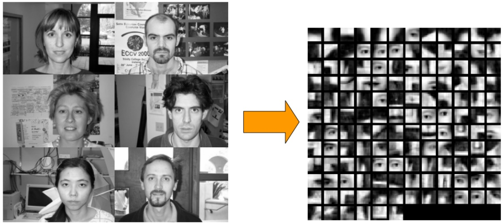

Hình 6.2. Bag of words cho ảnh chứa mặt người (Nguồn: Bag of visual words model: recognizing object categories ([https://goo.gl/EN2oSM](https://goo.gl/EN2oSM)).

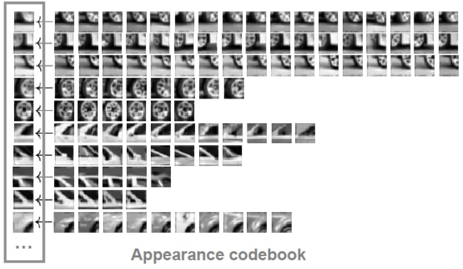

Source: B. Leibe

Hình 6.3. Bag of Words cho ảnh xe hơi (Nguồn: B. Leibe).

người, các patch cần chứa được các phần của khuôn mặt như mắt, mũi, miệng (xem Hình 6.2). Tương tự, với ảnh là ô tô, các patch thu được có thể là bánh xe, khung xe, cửa xe,...(xem Hình 6.3, hàng trên bên phải).

<!-- page: 96 -->

Trong xử lý văn bản, hai từ được coi là như nhau nếu nó được biểu diễn bởi các ký tự giống nhau. Câu hỏi đặt ra là, trong xử lý ảnh, hai patch được coi là như nhau khi nào? Khi mọi điểm ảnh trong hai patch có giá trị bằng nhau sao?

Câu trả lời là không. Xác suất để hai patch giống hệt nhau từng điểm ảnh là rất thấp vì có thể một phần của vật thể trong một patch bị lệch đi, bị méo, hoặc có độ sáng thay đổi. Trong những trường hợp này, mặc dù mắt người vẫn thấy hai patch đó rất giống nhau, máy tính có thể nghĩ đó là hai patch khác nhau. Vậy, hai patch được coi là như nhau khi nào? Từ và từ điển ở đây được định nghĩa như thế nào?

Ta có thể áp dụng một phương pháp phân cụm đơn giản là K-means (xem Chương 10) để tạo ra từ điển và coi hai patch là gần nhau nếu khoảng cách Euclid giữa hai vector tạo bởi hai patch là nhỏ. Với rất nhiều patch thu được, giả sử cần xây dựng một từ điển với chỉ khoảng 1000 từ, ta có thể dùng phân cụm K-means để phân toàn bộ các patch thành 1000 cụm (mỗi cụm được coi là một bag) khác nhau. Mỗi cụm gồm các patch gần giống nhau, được mô tả bởi trung bình cộng của tất cả các patch trong cụm đó (xem Hình 6.3 hàng dưới). Với một ảnh bất kỳ, ta trích ra các patch từ ảnh đó, tìm xem mỗi patch gần với cụm nào nhất trong 1000 cụm tìm được ở trên và quyết định patch này thuộc cụm đó. Cuối cùng, ta sẽ thu được một vector đặc trưng có kích thước bằng 1000 mà mỗi phần tử là số lượng các patch trong ảnh rơi vào cụm tương ứng.

## 6.4. Học chuyển tiếp cho bài toán phân loại ảnh

Mục này được viết trên cơ sở bạn đọc đã có kiến thức nhất định và deep learning.

Ngoài BoW, các phương pháp phổ biến được sử dụng để xây dựng vector đặc trưng cho ảnh là scale invariant feature transform – SIFT [Low99], speeded-up robust features – SURF [BTVG06], histogram of oriented gradients – HOG [DT05], local binary pattern – LBP [Low99],... Các bộ phân loại thường được sử dụng là SVM đa lớp (Chương 29), hồi quy softmax (Chương 15), mã hóa thưa và học từ điển [WYG+09, VMM+16, VM17], rừng ngẫu nhiên [LW+02],...

Các đặc trưng được tạo bởi các phương pháp nêu trên thường được gọi là các đặc trưng thủ công (hand-crafted feature) vì chúng chủ yếu dựa trên các quan sát về đặc tính riêng của ảnh và được xây dựng chung cho mọi loại dữ liệu ảnh. Các phương pháp này cho kết quả khá ấn tượng trong một số trường hợp. Tuy nhiên, chúng vẫn còn nhiều hạn chế vì quá trình tìm ra các đặc trưng và các bộ phân loại là riêng biệt. Hơn nữa, các bộ trích chọn này chỉ tìm ra các đặc trưng mức thấp (low-level features) của ảnh.

Những năm gần đây, deep learning phát triển cực nhanh dựa trên lượng dữ liệu huấn luyện khổng lồ và khả năng tính toán ngày càng được cải tiến của các máy tính. Kết quả cho bài toán phân loại ảnh ngày càng được nâng cao. Bộ

<!-- page: 97 -->

cơ sở dữ liệu thường được dùng nhất là ImageNet ([https://www.image-net.org](https://www.image-net.org))với 1.2 triệu ảnh cho 1000 nhãn khác nhau. Rất nhiều mô hình deep learning đã giành chiến thắng trong các cuộc thi ImageNet large scale visual recognition challenge – ILSVRC ([https://goo.gl/1A8drd](https://goo.gl/1A8drd)): AlexNet [KSH12], ZFNet [ZF14], GoogLeNet [SLJ+15], ResNet [HZRS16], VGG [SZ14]. Nhìn chung, các mô hình này là các mạng neuron đa tầng (multi-layer neural network). Các tầng phía trước thường là các tầng tích chập (convolutional layer). Tầng cuối cùng là một tầng nối kín (fully connected layer) và thường là một bộ hồi quy softmax (xem Hình 6.4). Vì vậy đầu ra của tầng gần cuối cùng có thể được coi là vector đặc trưng và hồi quy softmax chính là bộ phân loại được sử dụng<sup>19</sup>.

Việc bộ trích chọn đặc trưng và bộ phân loại được huấn luyện cùng nhau thông qua tối ưu hệ số trong mạng neuron sâu khiến các mô hình này đạt kết quả tốt. Tuy nhiên, những mô hình này đều bao gồm rất nhiều tầng các trọng số. Việc huấn luyện dựa trên hơn một triệu bức ảnh tốn rất nhiều thời gian (2-3 tuần).

Với các bài toán phân loại các dữ liệu ảnh khác với tập huấn luyện nhỏ, ta có thể không cần xây dựng lại mạng neuron và huấn luyện nó từ đầu. Thay vào đó, ta có thể sử dụng các mô hình đã được huấn luyện nêu trên và thay đổi kiến trúc của mạng cho phù hợp. Phương pháp sử dụng các mô hình có sẵn như vậy còn được gọi là học chuyển tiếp (transfer learning).

Toàn bộ các tầng trừ tầng đầu ra có thể được coi là một bộ trích chọn đặc trưng. Điều này được rút ra dựa trên nhận xét rằng các bức ảnh thường có những đặc tính giống nhau. Sau đó, ta huấn luyện một bộ phân loại khác dựa trên vector đặc trưng đã đã được trích chọn. Cách làm này có thể tăng độ chính xác phân loại lên đáng kể so với việc sử dụng các đặc trưng thủ công vì các mạng neuron sâu được cho là có khả năng trích chọn các đặc trưng mức cao (high-level features) của ảnh.

Hướng tiếp cận thứ hai là sử dụng các mô hình đã được huấn luyện và cho huấn luyện thêm một vài tầng cuối dựa trên dữ liệu mới. Kỹ thuật này được gọi là tinh chỉnh (fine-tuning). Việc này được thực hiện dựa trên quan sát rằng những tầng đầu trong mạng neuron sâu trích xuất những đặc trưng chung mức thấp của đa số ảnh, các tầng cuối giúp trích chọn các đặc trưng mức cao phù hợp cho từng cơ sở dữ liệu (CSDL). Các đặc trưng mức cao có thể khác nhau tuỳ theo từng CSDL. Vì vậy, khi có dữ liệu mới, ta chỉ cần huấn luyện mạng neuron để trích chọn các đặc trưng mức cao phù hợp với dữ liệu mới này.

Dựa trên kích thước và sự giống nhau giữa CSDL mới và CSDL gốc (dùng để huấn luyện mạng neuron ban đầu), có một vài quy tắc để huấn luyện mạng neuron mới<sup>20</sup>:

<small><span class="docvortex-page-footnote" data-block-type="page_footnote" style="color:#6b7280">19 hồi quy softmax là một thuật toán phân loại, tên gọi hồi quy của nó mang tính lịch sử.</span></small>

<small><span class="docvortex-page-footnote" data-block-type="page_footnote" style="color:#6b7280">20 Transfer Learning, CS231n ([https://goo.gl/VN1g7F](https://goo.gl/VN1g7F))</span></small>

<!-- page: 98 -->

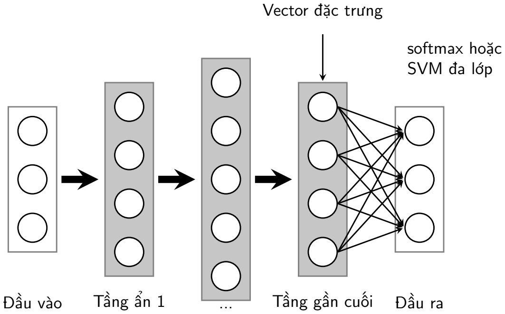

Hình 6.4. Kiến trúc deep learning cơ bản cho bài toán phân loại. Tầng cuối cùng là một tầng nối kín và thường là một hồi quy softmax.

• CSDL mới nhỏ, tương tự CSDL gốc. Vì CSDL mới nhỏ, việc tiếp tục huấn luyện mô hình có thể dễ dẫn đến hiện tượng quá khớp (overfitting, xem Chương 8). Cũng vì hai CSDL tương tự nhau, ta dự đoán rằng các đặc trưng mức cao của chúng tương tự nhau. Vì vậy, ta không cần huấn luyện lại mạng neuron mà chỉ cần huấn luyện một bộ phân loại dựa trên các vector đặc trưng thu được.

• CSDL mới lớn, tương tự CSDL gốc. Vì CSDL này lớn, quá khớp ít xảy ra hơn, ta có thể huấn luyện mô hình thêm một vài vòng lặp. Việc huấn luyện có thể được thực hiện trên toàn bộ hoặc chỉ một vài tầng cuối.

• CSDL mới nhỏ, rất khác CSDL gốc. Vì CSDL này nhỏ, tốt hơn hết là dùng các bộ phân loại đơn giản khác để tránh quá khớp. Nếu muốn sử dụng mạng neuron cũ, ta cũng chỉ nên tinh chỉnh các tầng cuối của nó. Hoặc có thể coi đầu ra của một tầng ở giữa của mạng neuron là vector đặc trưng rồi huấn luyện thêm một bộ phân loại.

• CSDL mới lớn rất khác CSDL gốc. Thực tế cho thấy, sử dụng các mạng neuron sẵn có trên CSDL mới vẫn hữu ích. Trong trường hợp này, ta vẫn có thể sử dụng các mạng neuron sẵn có như là điểm khởi tạo của mạng neuron mới, không nên huấn luyện mạng neuron mới từ đầu.

<!-- page: 99 -->

Một điểm đáng chú ý là khi tiếp tục huấn luyện các mạng neuron này, ta chỉ nên chọn tốc độ học nhỏ để các hệ số mới không đi quá xa so với các hệ số đã được huấn luyện ở các mô hình trước.

## 6.5. Chuẩn hoá vector đặc trưng

Các điểm dữ liệu đôi khi được đo đạc bằng những đơn vị khác nhau, chẳng hạn mét và feet. Đôi khi, hai thành phần của dữ liệu ban đầu chênh lệch nhau lớn, chẳng hạn một thành phần có khoảng giá trị từ 0 đến 1000, thành phần kia chỉ có khoảng giá trị từ 0 đến 1. Lúc này, chúng ta cần chuẩn hóa dữ liệu trước khi thực hiện các bước tiếp theo.

Chú ý : việc chuẩn hóa này chỉ được thực hiện khi vector dữ liệu đã có cùng chiều.

Sau đây là một vài phương pháp chuẩn hóa thường dùng.

## 6.5.1. Chuyển khoảng giá trị

Phương pháp đơn giản nhất là đưa tất cả các đặc trưng về cùng một khoảng, ví dụ [0, 1] hoặc [−1, 1]. Để muốn đưa đặc trưng thứ i của một vector đặc trưng x về khoảng [0, 1], ta sử dụng công thức

$$
x _ {i} ^ {\prime} = \frac {x _ {i} - \min (x _ {i})}{\max (x _ {i}) - \min (x _ {i})}
$$

trong đó $x _ { i }$ và $x _ { i } ^ { \prime }$ lần lượt là giá trị đặc trưng ban đầu và giá trị đặc trưng sau khi được chuẩn hóa. min $( x _ { i } )$ , max $( x _ { i } )$ là giá trị nhỏ nhất và lớn nhất của đặc trưng thứ i xét trên toàn bộ dữ liệu huấn luyện.

## 6.5.2. Chuẩn hoá theo phân phối chuẩn

Một phương pháp khác thường được sử dụng là đưa mỗi đặc trưng về dạng một phân phối chuẩn có kỳ vọng là 0 và phương sai là 1. Công thức chuẩn hóa là

$$
x _ {i} ^ {\prime} = \frac {x _ {i} - \bar {x} _ {i}}{\sigma_ {i}}
$$

với $\bar { x } _ { i } , \sigma _ { i }$ lần lượt là kỳ vọng và độ lệch chuẩn của đặc trưng đó xét trên toàn bộ dữ liệu huấn luyện.

## 6.5.3. Chuẩn hoá về cùng norm

Một lựa chọn khác cũng được sử dụng rộng rãi là biến vector dữ liệu thành vector có độ dài Euclid bằng một. Việc này có thể được thực hiện bằng cách chia mỗi vector đặc trưng cho $\ell _ { 2 }$ norm của nó:

$$
\mathbf {x} ^ {\prime} = \frac {\mathbf {x}}{\| \mathbf {x} \| _ {2}}
$$

<!-- page: 100 -->

# Hồi quy tuyến tính

Hồi quy tuyến tính (linear regression) là một thuật toán hồi quy mà đầu ra là một hàm số tuyến tính của đầu vào. Đây là thuật toán đơn giản nhất trong nhóm các thuật toán học có giám sát.

## 7.1. Giới thiệu

Xét bài toán ước lượng giá của một căn nhà rộng $x _ { 1 } \mathrm { m ^ { 2 } }$ , có $x _ { 2 }$ phòng ngủ và cách trung tâm thành phố $x _ { 3 }$ km. Giả sử có một tập dữ liệu của 10000 căn nhà trong thành phố đó. Liệu rằng khi có một căn nhà mới với các thông số về diện tích $x _ { 1 }$ , số phòng ngủ $x _ { 2 }$ và khoảng cách tới trung tâm $x _ { 3 } ,$ chúng ta có thể dự đoán được giá y của căn nhà đó không? Nếu có thì hàm dự đoán $y = f ( \mathbf { x } )$ sẽ có dạng như thế nào. $\dot { \mathrm { O } }$ đây, vector đặc trưng $\mathbf { x } = [ x _ { 1 } , x _ { 2 } , x _ { 3 } ] ^ { T }$ là một vector cột chứa dữ liệu đầu vào, đầu ra y là một số thực dương.

Nhận thấy rằng giá nhà cao nến diện tích lớn, nhiều phòng ngủ và gần trung tâm thành phố. Từ đó, ta có thể mô hình đầu ra là một hàm đơn giản của đầu vào:

$$
y \approx \hat {y} = f (\mathbf {x}) = w _ {1} x _ {1} + w _ {2} x _ {2} + w _ {3} x _ {3} = \mathbf {x} ^ {T} \mathbf {w},\tag{7.1}
$$

trong đó $\mathbf { w } = [ w _ { 1 } , w _ { 2 } , w _ { 3 } ] ^ { T }$ là vector trọng số (weight vector) cần tìm. Mối quan hệ $y \approx f ( \mathbf { x } )$ như trong (7.1) là một mối quan hệ tuyến tính.

Bài toán trên đây là bài toán dự đoán giá trị của đầu ra dựa trên vector đặc trưng đầu vào. Ngoài ra, giá trị của đầu ra có thể nhận rất nhiều giá trị thực dương khác nhau. Vì vậy, đây là một bài toán hồi quy. Mối quan hệ $\hat { y } = \mathbf { x } ^ { T } \mathbf { w }$ là một mối quan hệ tuyến tính. Tên gọi hồi quy tuyến tính xuất phát từ đây.

<!-- page: 101 -->

## 7.2. Xây dựng và tối ưu hàm mất mát

Tổng quát, nếu mỗi điểm dữ liệu được mô tả bởi một vector đặc trưng d chiều $\mathbf { x } \in \mathbb { R } ^ { d }$ , hàm dự đoán đầu ra được viết dưới dạng

$$
y = w _ {1} x _ {1} + w _ {2} x _ {2} + \dots + w _ {d} x _ {d} = \mathbf {x} ^ {T} \mathbf {w}.\tag{7.2}
$$

## 7.2.1. Sai số dự đoán

Sau khi xây dựng được mô hình dự đoán đầu ra như (7.2), ta cần tìm một phép đánh giá phù hợp với bài toán. Với bài toán hồi quy nói chung, ta mong muốn sự sai khác e giữa đầu ra thực sự y và đầu ra dự đoán $\hat { y }$ là nhỏ nhất:

$$
\frac {1}{2} e ^ {2} = \frac {1}{2} (y - \hat {y}) ^ {2} = \frac {1}{2} (y - \mathbf {x} ^ {T} \mathbf {w}) ^ {2}.\tag{7.3}
$$

$\dot { \mathrm { O } }$ đây, bình phương được lấy vì $e = y - { \hat { y } }$ có thể là một số âm. Việc sai $\mathrm { s } \hat { \mathrm { o } }$ là nhỏ nhất có thể được mô tả bằng cách lấy trị tuyệt đối $| e | = | y - { \hat { y } } |$ . Tuy nhiên, cách làm này ít được sử dụng vì hàm trị tuyệt đối không khả vi tại gốc toạ độ, không thuận tiện cho việc tối ưu. Hệ số $\frac { 1 } { 2 }$ sẽ bị triệt tiêu khi lấy đạo hàm của e theo tham số mô hình w.

## 7.2.2. Hàm mất mát

Điều tương tự xảy ra với tất cả các cặp dữ liệu $( \mathbf { x } _ { i } , y _ { i } ) , i = 1 , 2 , \ldots , N$ , với N là số lượng dữ liệu trong tập huấn luyện. Việc tìm mô hình tốt nhất tương đương với việc tìm w để hàm số sau đạt giá trị nhỏ nhất:

$$
\mathcal {L} (\mathbf {w}) = \frac {1}{2 N} \sum_ {i = 1} ^ {N} (y _ {i} - \mathbf {x} _ {i} ^ {T} \mathbf {w}) ^ {2}.\tag{7.4}
$$

Hàm số $\mathcal { L } ( \mathbf { w } )$ chính là hàm mất mát của mô hình hồi quy tuyến tính với tham số $\theta = \mathbf { w }$ . Ta luôn mong muốn sự mất mát là nhỏ nhất, điều này có thể đạt được bằng cách tối thiểu hàm mất mát theo w:

$$
\mathbf {w} ^ {*} = \underset {\mathbf {w}} {\operatorname{argmin}} \mathcal {L} (\mathbf {w}).\tag{7.5}
$$

$\mathbf { w } ^ { * }$ là nghiệm cần tìm của bài toán. Đôi khi dấu ∗ được bỏ đi và nghiệm có thể được viết gọn lại thành $\mathbf { w } = \operatorname { a r g m i n } \mathcal { L } ( \mathbf { w } )$

<!-- page: 102 -->

## Trung bình sai số

Trong machine learning, hàm mất mát thường là trung bình cộng của sai số tại mỗi điểm. Về mặt toán học, hệ số $\frac { 1 } { 2 N }$ không ảnh hưởng tới nghiệm của bài toán. Tuy nhiên, việc lấy trung bình này quan trọng vì số lượng điểm dữ liệu trong tập huấn luyện có thể thay đổi. Việc tính toán mất mát trên từng điểm dữ liệu sẽ hữu ích hơn trong việc đánh giá chất lượng mô hình. Ngoài ra, việc lấy trung bình cũng giúp tránh hiện tượng tràn số khi số lượng điểm dữ liệu lớn.

Trước khi xây dựng nghiệm cho bài toán tối ưu hàm mất mát, ta thấy rằng hàm số này có thể được viết gọn lại dưới dạng ma trận, vector, và norm như sau:

$$
\mathcal {L} (\mathbf {w}) = \frac {1}{2 N} \sum_ {i = 1} ^ {N} (y _ {i} - \mathbf {x} _ {i} ^ {T} \mathbf {w}) ^ {2} = \frac {1}{2 N} \left\| \left[ \begin{array}{c} y _ {1} \\ y _ {2} \\ \vdots \\ y _ {N} \end{array} \right] - \left[ \begin{array}{c} \mathbf {x} _ {1} ^ {T} \\ \mathbf {x} _ {2} ^ {T} \\ \vdots \\ \mathbf {x} _ {N} ^ {T} \end{array} \right] \mathbf {w} \right\| _ {2} ^ {2} = \frac {1}{2 N} \| \mathbf {y} - \mathbf {X} ^ {T} \mathbf {w} \| _ {2} ^ {2}\tag{7.6}
$$

với $\begin{aligned} { \mathbf { y } = [ y _ { 1 } , y _ { 2 } , \ldots , y _ { N } ] ^ { T } , \: \mathbf { X } = [ \mathbf { x } _ { 1 } , \mathbf { x } _ { 2 } , \ldots , \mathbf { x } _ { N } ] } \\ \end{aligned}$ . Như vậy $\mathcal { L } ( \mathbf { w } )$ là một hàm số liên quan tới bình phương của $\ell _ { 2 }$ norm.

## 7.2.3. Nghiệm của hồi quy tuyến tính

Nhận thấy rằng hàm mất mát $\mathcal { L } ( \mathbf { w } )$ có gradient tại mọi w (xem Bảng 2.1). Giá trị tối ưu của w có thể tìm được thông qua việc giải phương trình đạo hàm của $\mathcal { L } ( \mathbf { w } )$ theo w bằng không. Gradient của hàm số này tương đối đơn giản:

$$
\frac {\nabla \mathcal {L} (\mathbf {w})}{\nabla \mathbf {w}} = \frac {1}{N} \mathbf {X} (\mathbf {X} ^ {T} \mathbf {w} - \mathbf {y})\tag{7.7}
$$

Phương trình gradient bằng không:

$$
\frac {\nabla \mathcal {L} (\mathbf {w})}{\nabla \mathbf {w}} = \mathbf {0} \Leftrightarrow \mathbf {X} \mathbf {X} ^ {T} \mathbf {w} = \mathbf {X} \mathbf {y}\tag{7.8}
$$

Nếu ma trận vuông $\mathbf { X } \mathbf { X } ^ { T }$ khả nghịch, phương trình (7.8) có nghiệm duy nhất $\mathbf { w } = ( \mathbf { X } \mathbf { X } ^ { T } ) ^ { - 1 } \mathbf { X } \mathbf { y }$

Nếu ma trận $\mathbf { X } \mathbf { X } ^ { T }$ không khả nghịch, phương trình (7.8) vô nghiệm hoặc có vô số nghiệm. Lúc này, một nghiệm đặc biệt của phương trình có thể được xác định dựa vào giả nghịch đảo (pseudo inverse). Người ta chứng minh được rằng<sup>21</sup> với mọi ma trận X, luôn tồn tại duy nhất một giá trị w có $\ell _ { 2 }$ norm nhỏ nhất giúp tối thiểu $\| \mathbf { X } ^ { T } \mathbf { w } - \mathbf { y } \| _ { F } ^ { 2 }$ . Cụ thể, $\mathbf { w } = ( \mathbf { X } \mathbf { X } ^ { T } ) ^ { \dagger } \mathbf { X } \mathbf { y }$ trong đó $( \mathbf { X } \mathbf { X } ^ { T } ) ^ { \dagger }$ là giả nghịch

<small><span class="docvortex-page-footnote" data-block-type="page_footnote" style="color:#6b7280">21 Least Squares, Pseudo-Inverse, PCA & SVD ([https://goo.gl/RoQ6mS](https://goo.gl/RoQ6mS))</span></small>

<!-- page: 103 -->

đảo của $\mathbf { X } \mathbf { X } ^ { T }$ . Giả nghịch đảo của một ma trận luôn tồn tại kể cả khi ma trận đó không vuông. Khi ma trận là vuông và khả nghịch, giả nghịch đảo chính là nghịch đảo. Tổng quát, nghiệm của bài toán tối ưu (7.5) là

$$
\mathbf {w} = (\mathbf {X X} ^ {T}) ^ {\dagger} \mathbf {X y}\tag{7.9}
$$

Hàm số tính giả nghịch đảo của một ma trận bất kỳ có sẵn trong thư viện numpy.

## 7.2.4. Hệ số điều chỉnh

Hàm dự đoán đầu ra của hồi quy tuyến tính thường có thêm một hệ số điều chỉnh (bias) b:

$$
f (\mathbf {x}) = \mathbf {x} ^ {T} \mathbf {w} + b\tag{7.10}
$$

Nếu $b = 0$ , đường thẳng/mặt phẳng $\mathbf { y } = \mathbf { x } ^ { T } \mathbf { w } + b$ luôn đi qua gốc toạ độ. Việc thêm hệ số b khiến mô hình linh hoạt hơn. Hệ số điều chỉnh này cũng là một tham số mô hình.

Để $\acute { \mathrm { y } }$ thấy rằng, nếu coi mỗi điểm dữ liệu có thêm một đặc trưng $x _ { 0 } = 1$ , ta sẽ có

$$
y = \mathbf {x} ^ {T} \mathbf {w} + b = w _ {1} x _ {1} + w _ {2} x _ {2} + \dots + w _ {d} x _ {d} + b x _ {0} = \bar {\mathbf {x}} ^ {T} \bar {\mathbf {w}}\tag{7.11}
$$

trong đó $\begin{aligned} { \bar { \mathbf { x } } \quad = \quad [ x _ { 0 } , x _ { 1 } , x _ { 2 } , \ldots , x _ { N } ] ^ { T } \quad \hat { \operatorname { v a } } \quad \bar { \mathbf { w } } \quad = \quad [ b , w _ { 1 } , w _ { 2 } , \ldots , w _ { N } ] } \\ \end{aligned}$ . Nếu đặt $\bar { \textbf { X } } =$ $\left[ \bar { \mathbf { x } } _ { 1 } , \bar { \mathbf { x } } _ { 2 } , \ldots , \bar { \mathbf { x } } _ { N } \right]$ , ta có nghiệm của bài toán tối thiểu hàm mất mát

$$
\bar {\mathbf {w}} = \underset {\mathbf {w}} {\mathrm{argmin}} \frac {1}{2 N} \| \mathbf {y} - \bar {\mathbf {X}} ^ {T} \bar {\mathbf {w}} \| _ {2} ^ {2} = (\bar {\mathbf {X}} \bar {\mathbf {X}} ^ {T}) ^ {\dagger} \bar {\mathbf {X}} \mathbf {y}\tag{7.12}
$$

Kỹ thuật thêm một đặc trưng $x _ { 0 } = 1$ vào vector đặc trưng và ghép hệ số điều chỉnh b vào vector trọng số w như trên còn được gọi là thủ thuật gộp hệ số điều chỉnh (bias trick). Chúng ta sẽ gặp lại kỹ thuật đó nhiều lần trong cuốn sách này.

## 7.3. Ví dụ trên Python

## 7.3.1. Bài toán

Xét một ví dụ đơn giản có thể áp dụng hồi quy tuyến tính. Chúng ta sẽ so sánh nghiệm của bài toán khi giải theo phương trình (7.12) và nghiệm tìm được khi dùng thư viện scikit-learn của Python.

Giả sử có dữ liệu cân nặng và chiều cao của 15 người trong Bảng 7.1. Dữ liệu của hai người có chiều cao 155 cm và 160 cm được tách ra làm tập kiểm tra, phần còn lại tạo thành tập huấn luyện.

Bài toán đặt ra là liệu có thể dự đoán cân nặng của một người dựa vào chiều cao của họ không? Có thể thấy là cân nặng thường tỉ lệ thuận với chiều cao, vì vậy hồi quy tuyến tính là một mô hình phù hợp.

<!-- page: 104 -->

Bảng 7.1: Bảng dữ liệu về chiều cao và cân nặng của 15 người

<table><tbody><tr><td colspan="4">Chiều cao (cm) Cân nặng (kg) Chiều cao (cm) Cân nặng (kg)</td></tr><tr><td>147</td><td>49</td><td>168</td><td>60</td></tr><tr><td>150</td><td>50</td><td>170</td><td>72</td></tr><tr><td>153</td><td>51</td><td>173</td><td>63</td></tr><tr><td>155</td><td>52</td><td>175</td><td>64</td></tr><tr><td>158</td><td>54</td><td>178</td><td>66</td></tr><tr><td>160</td><td>56</td><td>180</td><td>67</td></tr><tr><td>163</td><td>58</td><td>183</td><td>68</td></tr><tr><td>165</td><td>59</td><td></td><td></td></tr></tbody></table>

## 7.3.2. Hiển thị dữ liệu trên đồ thị

Trước tiên, ta khai báo dữ liệu huấn luyện.

```python
from __future__ import print_function
import numpy as np
import matplotlib.pyplot as plt
X = np.array([[147, 150, 153, 158, 163, 165, 168, 170, 173, 175, 178, 180,
    183]]).T # height (cm), input data, each row is a data point
# weight (kg)
y = np.array([ 49, 50, 51,  54, 58, 59, 60, 62, 63, 64, 66, 67, 68])
```

Các điểm dữ liệu được minh hoạ bởi các điểm hình tròn trong Hình 7.1. Ta thấy rằng dữ liệu được sắp xếp gần như theo một đường thẳng, vậy mô hình hồi quy tuyến tính sau đây có khả năng cho kết quả tốt, với w\_0 là hệ số điều chỉnh b:

$$
(\text {cân nặng}) = w _ {-} 1 ^ {*} (\text {chiêu cao}) + w _ {-} 0
$$

## 7.3.3. Nghiệm theo công thức

Tiếp theo, ta tìm các hệ số w\_1 và w\_0 dựa vào công thức (7.12). Giả nghịch đảo của một ma trận A trong Python được tính bằng numpy.linalg.pinv(A).

```txt
# Building Xbar
one = np.ones((X.shape[0], 1))
Xbar = np.concatenate((one, X), axis = 1) # each row is one data point
# Calculating weights of the linear regression model
A = np.dot(Xbar.T, Xbar)
b = np.dot(Xbar.T, y)
w = np.dot(np.linalg.pinv(A), b)
# weights
w_0, w_1 = w[0], w[1]
```

Đường thẳng mô tả mối quan hệ giữa đầu vào và đầu ra được minh hoạ trong Hình 7.1. Ta thấy rằng các điểm dữ liệu nằm khá gần đường thẳng dự đoán. Vậy mô hình hồi quy tuyến tính hoạt động tốt với tập dữ liệu huấn luyện. Bây giờ, chúng ta sử dụng mô hình này để dự đoán dữ liệu trong tập kiểm tra.

<!-- page: 105 -->

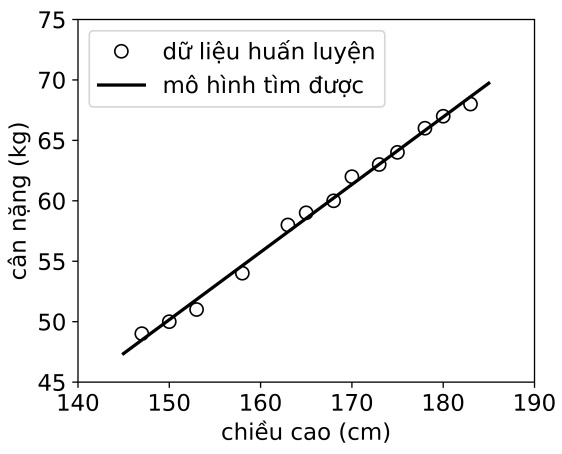

Hình 7.1. Minh hoạ dữ liệu và đường thẳng xấp xỉ tìm được bởi hồi quy tuyến tính

```matlab
y1 = w_1*155 + w_0
y2 = w_1*160 + w_0
print('Input 155cm, true output 52kg, predicted output %.2fkg.' %(y1) )
print('Input 160cm, true output 56kg, predicted output %.2fkg.' %(y2) )
```

Kết quả:

```txt
Input 155cm, true output 52kg, predicted output 52.94kg.
Input 160cm, true output 56kg, predicted output 55.74kg.
```

Chúng ta thấy rằng đầu ra dự đoán khá gần đầu ra thực sự.

## 7.3.4. Nghiệm theo thư viện scikit-learn

Tiếp theo, chúng ta sẽ sử dụng thư viện scikit-learn để tìm nghiệm.

```python
from sklearn import datasets, linear_model
# fit the model by Linear Regression
regr = linear_model.LinearRegression()
regr.fit(X, y) # in scikit-learn, each sample is one row
# Compare two results
print("scikit-learn's solution: w_1 = ", regr.coef_[0], "w_0 = ",\
    regr.intercept_)
print("our solution          : w_1 = ", w[1], "w_0 = ", w[0])
```

Kết quả:

```toml
scikit-learn solution: w_1 = [ 0.55920496] w_0 = [-33.73541021]
our solution : w_1 = [ 0.55920496] w_0 = [-33.73541021]
```

Chúng ta thấy rằng hai kết quả thu được là như nhau.

<!-- page: 106 -->

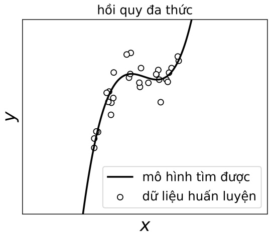

(a)

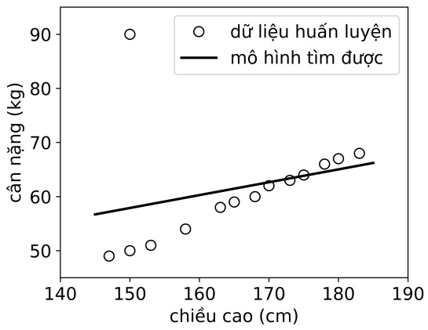

(b)

Hình 7.2. (a) Hồi quy đa thức bậc ba (b) Hồi quy tuyến tính nhạy cảm với nhiễu.

## 7.4. Thảo luận

## 7.4.1. Các bài toán có thể giải bằng hồi quy tuyến tính

Hàm số $y \approx f ( \mathbf { x } ) = \mathbf { x } ^ { T } \mathbf { w } + b$ là một hàm tuyến tính theo cả w và x. Hồi quy tuyến tính có thể áp dụng cho các mô hình chỉ cần tuyến tính theo w. Ví dụ

$$
y \approx w _ {1} x _ {1} + w _ {2} x _ {2} + w _ {3} x _ {1} ^ {2} + w _ {4} \sin (x _ {2}) + w _ {5} x _ {1} x _ {2} + w _ {0}\tag{7.13}
$$

là một hàm tuyến tính theo w nhưng không tuyến tính theo x. Bài toán này vẫn có thể được giải bằng hồi quy tuyến tính. Với mỗi vector đặc trưng $\mathbf { x } = [ x _ { 1 } , x _ { 2 } ] ^ { T }$ ta tính vector đặc trưng mới $\tilde { \mathbf { x } } = [ x _ { 1 } , x _ { 2 } , x _ { 1 } ^ { 2 } , \operatorname { s i n } ( x _ { 2 } ) , x _ { 1 } x _ { 2 } ] ^ { T }$ rồi áp dụng hồi quy tuyến tính với dữ liệu mới này. Tuy nhiên, việc tìm ra các hàm số sin(x<sub>2</sub>) hay $x _ { 1 } x _ { 2 }$ là tương đối không tự nhiên. Hồi quy đa thức (polynomial regression) thường được sử dụng nhiều hơn với các vector đặc trưng mới có dạng $[ 1 , x _ { 1 } , x _ { 1 } ^ { 2 } , \dots ] ^ { T }$ . Một ví dụ về hồi quy đa thức bậc 3 được thể hiện trong Hình 7.2a.

## 7.4.2. Hạn chế của hồi quy tuyến tính

Hạn chế đầu tiên của hồi quy tuyến tính là nó rất nhạy cảm với nhiễu (sensitive to noise). Trong ví dụ về mối quan hệ giữa chiều cao và cân nặng bên trên, nếu có chỉ một cặp dữ liệu nhiễu (150 cm, 90kg) thì kết quả sẽ sai khác đi rất nhiều (xem Hình 7.2b).

Một kỹ thuật giúp tránh hiện tượng này là loại bỏ các nhiễu trong quá trình tìm nghiệm. Việc làm này có thể phức tạp và tương đối tốn thời gian. Có một cách khác giúp tránh công việc loại bỏ nhiễu là sử dụng mất mát $H u b e r ^ { 2 2 }$ . Hồi

<small><span class="docvortex-page-footnote" data-block-type="page_footnote" style="color:#6b7280">22 Huber loss ([https://goo.gl/TBUWzg](https://goo.gl/TBUWzg))</span></small>

<!-- page: 107 -->

quy tuyến tính với mất mát Huber được gọi là hồi quy Huber, được khẳng định là có khả năng kháng nhiễu tốt hơn. Xem thêm Huber Regressor, scikit learn $( \mathsf { h t t p s } { : / / } \mathsf { g o o . g l / h } 2 \mathsf { r K u 5 } )$

Hạn chế thứ hai của hồi quy tuyến tính là nó không biễu diễn được các mô hình phức tạp. Mặc dù phương pháp này có thể được áp dụng nếu quan hệ giữa đầu ra và đầu vào là phi tuyến, mối quan hệ này vẫn đơn giản hơn nhiều so với các mô hình thực tế. Hơn nữa, việc tìm ra các đặc trưng $x _ { 1 } ^ { 2 } , \sin ( x _ { 2 } ) , x _ { 1 } x _ { 2 }$ như trên là không khả thi khi số chiều dữ liệu lớn lên.

## 7.4.3. Hồi quy ridge

Có một kỹ thuật nhỏ giúp tránh trường hợp $\mathbf { X } \mathbf { X } ^ { T }$ không khả nghịch là biến nó thành $\mathbf { A } = \mathbf { X } \mathbf { X } ^ { T } + \lambda \mathbf { I }$ với λ là một số dương nhỏ và I là ma trận đơn vị với bậc phù hợp.

Ma trận A là khả nghịch vì nó là một ma trận xác định dương. Thật vậy, với mọi $\mathbf { w } \neq \mathbf { 0 }$ ,

$$
\mathbf {w} ^ {T} \mathbf {A} \mathbf {w} = \mathbf {w} ^ {T} (\mathbf {X X} ^ {T} + \lambda \mathbf {I}) \mathbf {w} = \mathbf {w} ^ {T} \mathbf {X X} ^ {T} \mathbf {w} + \lambda \mathbf {w} ^ {T} \mathbf {w} = \| \mathbf {X} ^ {T} \mathbf {w} \| _ {2} ^ {2} + \lambda \| \mathbf {w} \| _ {2} ^ {2} > 0.
$$

Lúc này, nghiệm của bài toán là $\mathbf { y } = ( \mathbf { X } \mathbf { X } ^ { T } + \lambda \mathbf { I } ) ^ { - 1 } \mathbf { X } \mathbf { y }$

Xét hàm mất mát

$$
\mathcal {L} _ {2} (\mathbf {w}) = \frac {1}{2 N} (\| \mathbf {y} - \mathbf {X} ^ {T} \mathbf {w} \| _ {2} ^ {2} + \lambda \| \mathbf {w} \| _ {2} ^ {2}).\tag{7.14}
$$

Phương trình gradient theo w bằng không:

$$
\frac {\nabla \mathcal {L} _ {2} (\mathbf {w})}{\nabla \mathbf {w}} = \mathbf {0} \Leftrightarrow \frac {1}{N} (\mathbf {X} (\mathbf {X} ^ {T} \mathbf {w} - \mathbf {y}) + \lambda \mathbf {w}) = \mathbf {0} \Leftrightarrow (\mathbf {X X} ^ {T} + \lambda \mathbf {I}) \mathbf {w} = \mathbf {X y}\tag{7.15}
$$

Ta thấy $\mathbf { w }   =   ( \mathbf { X } \mathbf { X } ^ { T } + \lambda \mathbf { I } ) ^ { - 1 } \mathbf { X } \mathbf { y }$ chính là nghiệm của bài toán tối thiểu $\mathcal { L } _ { 2 } ( \mathbf { w } )$ trong (7.14). Mô hình machine learning với hàm mất mát (7.14) còn được gọi là hồi quy ridge. Ngoài việc giúp phương trình gradient theo hệ số bằng không có nghiệm duy nhất, hồi quy ridge còn giúp mô hình tránh được overfitting như sẽ thấy trong Chương 8.

## 7.4.4. Phương pháp tối ưu khác

Hồi quy tuyến tính là một mô hình đơn giản, lời giải cho phương trình gradient bằng không cũng không phức tạp. Trong hầu hết các trường hợp, việc giải các phương trình gradient bằng không tương đối phức tạp. Tuy nhiên, nếu ta tính được đạo hàm của hàm mất mát, các tham số mô hình có thể được giải bằng một phương pháp hữu dụng có tên gradient descent. Trên thực tế, một vector đặc trưng có thể có kích thước rất lớn, dẫn đến ma trận $\mathbf { X } \mathbf { X } ^ { T }$ cũng có kích thước lớn và việc tính ma trận nghịch đảo có thể không lợi về mặt tính toán. Gradient descent sẽ giúp tránh được việc tính ma trận nghịch đảo. Chúng ta sẽ hiểu kỹ hơn về phương pháp này trong Chương 12.

<!-- page: 108 -->

# Quá khớp

Quá khớp (overfitting) là một hiện tượng không mong muốn thường gặp, người xây dựng mô hình machine learning cần nắm được các kỹ thuật để tránh hiện tượng này.

## 8.1. Giới thiệu

Trong các mô hình học có giám sát, ta thường phải đi tìm một mô hình ánh xạ các vector đặc trưng thành các kết quả tương ứng trong tập huấn luyện. Nói cách khác, ta cần đi tìm hàm số f sao cho $y _ { i } \approx f ( \mathbf { x } _ { i } ) , \forall i = 1 , 2 , \ldots , N$ . Một cách tự nhiên, ta sẽ đi tìm các tham số mô hình của f sao cho việc xấp xỉ có sai số càng nhỏ càng tốt. Điều này nghĩa là mô hình càng khớp với dữ liệu càng tốt. Tuy nhiên, sự thật là nếu một mô hình quá khớp với dữ liệu huấn luyện thì nó sẽ gây phản tác dụng. Quá khớp là một hiện tượng không mong muốn mà người xây dựng mô hình machine learning cần lưu ý. Hiện tượng này xảy ra khi mô hình tìm được mang lại kết quả cao trên tập huấn luyện nhưng không có kết quả tốt trên tập kiểm tra. Nói cách khác, mô hình tìm được không có tính tổng quát.

Để có cái nhìn đầu tiên về quá khớp, chúng ta cùng xem ví dụ trong Hình 8.1. Có 50 cặp điểm dữ liệu ở đó đầu ra là một đa thức bậc ba của đầu vào cộng thêm nhiễu. Tập dữ liệu này được chia làm hai phần: tập huấn luyện gồm 30 điểm dữ liệu hình tròn, tập kiểm tra gồm 20 điểm dữ liệu hình vuông. Đồ thị của đa thức bậc ba này được cho bởi đường nét đứt. Bài toán đặt ra là hãy tìm một mô hình tốt để mô tả quan hệ giữa đầu vào và đầu ra của dữ liệu đã cho. Giả sử thêm rằng đầu ra xấp xỉ là một đa thức của đầu vào.

Với N cặp điểm dữ liệu $( x _ { 1 } , y _ { 1 } ) , \ldots , ( x _ { N } , y _ { N } )$ với các $x _ { i }$ khác nhau đôi một, luôn tìm được một đa thức nội suy Lagrange $P ( x )$ bậc không vượt quá $N - 1$ sao cho $P ( x _ { i } ) = y _ { i } , \forall i = 1 , 2 , \ldots , N$

<!-- page: 109 -->

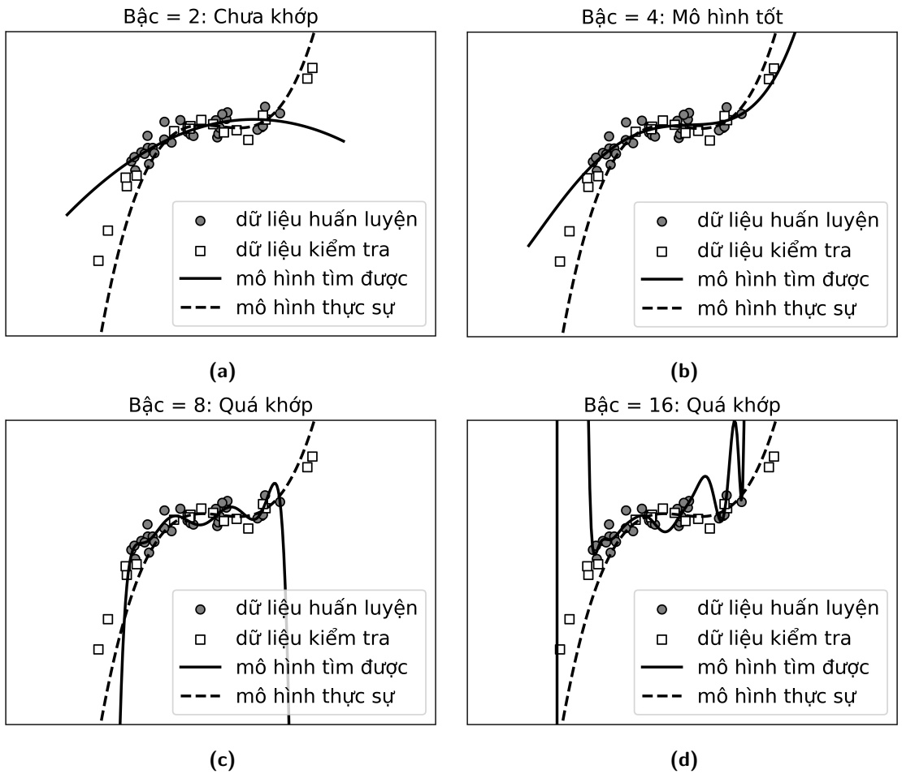

Hình 8.1. Chưa khớp và quá khớp trong hồi quy đa thức.

Như đã đề cập trong Chương 7, với loại dữ liệu này, chúng ta có thể áp dụng hồi quy đa thức với vector đặc trưng $\mathbf { x } = [ 1 , x , x ^ { 2 } , \hat { x ^ { 3 } } , \dots , \hat { x ^ { d } } ] ^ { T }$ cho đa thức bậc d. Điều quan trọng là cần xác định bậc d của đa thức. Giá trị d còn được gọi là siêu tham số của mô hình.

Rõ ràng một đa thức bậc không vượt quá 29 có thể mô tả chính xác dữ liệu huấn luyện. Tuy nhiên, ta sẽ xem xét các đa thức bậc thấp hơn d = 2, 4, 8, 16. Với d = 2, mô hình không thực sự tốt vì mô hình dự đoán (đường nét liền) quá khác so với mô hình thực; thậm chí nó có xu hướng đi xuống khi dữ liệu đang có hướng đi lên. Trong trường hợp này, ta nói mô hình bị chưa khớp (underfitting). Khi d = 8, với các điểm dữ liệu trong tập huấn luyện, mô hình dự đoán và mô hình thực khá giống nhau. Tuy nhiên, đa thức bậc 8 cho kết quả hoàn toàn ngược với xu hướng của dữ liệu ở phía phải. Điều tương tự xảy ra trong trường hợp d = 16. Đa thức bậc 16 này quá khớp với tập huấn luyện. Việc quá khớp trong trường hợp bậc 16 là không tốt vì mô hình có thể đang cố gắng mô tả nhiễu thay vì dữ liệu. Hiện tượng xảy ra ở hai trường hợp đa thức bậc cao này chính là quá khớp. Độ phức tạp của đồ thị trong hai trường hợp này cũng khá lớn, dẫn đến

<!-- page: 110 -->

các đường dự đoán không được tự nhiên. Khi bậc của đa thức tăng lên, độ phức tạp của nó cũng tăng theo và hiện tượng quá khớp xảy ra nghiêm trọng hơn.

Với $d = 4 .$ , mô hình dự đoán khá giống với mô hình thực. Hệ số bậc cao nhất tìm được rất gần với không<sup>23</sup>, vì vậy đa thức bậc bốn này khá gần với đa thức bậc ba ban đầu. Đây chính là một mô hình tốt.

Quá khớp sẽ gây ra hậu quả lớn nếu trong tập huấn luyện có nhiễu. Khi đó, mô hình quá chú trọng vào việc bắt chước tập huấn luyện mà quên đi việc quan trọng hơn là tính tổng quát. Quá khớp đặc biệt xảy ra khi lượng dữ liệu huấn luyện quá nhỏ hoặc độ phức tạp của mô hình quá cao. Trong ví dụ trên đây, độ phức tạp của mô hình có thể được coi là bậc của đa thức cần tìm.

Vậy, có những kỹ thuật nào giúp tránh quá khớp?

Trước hết, chúng ta cần một vài đại lượng để đánh giá chất lượng của mô hình trên tập huấn luyện và tập kiểm tra. Dưới đây là hai đại lượng đơn giản, với giả sử y là đầu ra thực sự, và ŷ là đầu ra dự đoán của mô hình. $\dot { \mathrm { O } }$ đây, đầu ra có thể là một vector.

Sai số huấn luyện (training error): Đại lượng này là mức độ sai khác giữa đầu ra thực và đầu ra dự đoán của mô hình. Trong nhiều trường hợp, giá trị này chính là hàm mất mát khi áp dụng lên dữ liệu huấn luyện. Hàm mất mát này cần có một thừa số $\frac { 1 } { N _ { \mathrm { t r a i n } } }$ để tính giá trị trung bình mất mát trên mỗi điểm dữ liệu. Với các bài toán hồi quy, đại lượng này thường được xác định bởi sai số trung bình bình phương (mean squared error – MSE):

$$
\text {sai số huấn luyện} = \frac {1}{2 N _ {\text {train}}} \sum_ {\text {tập huấn luyện}} \| \mathbf {y} - \hat {\mathbf {y}} \| _ {2} ^ {2}
$$

Với các bài toán phân loại, có nhiều cách đánh giá mô hình trên các tập dữ liệu. Chúng ta sẽ dần thấy trong các chương sau.

Sai số kiểm tra (test error): Tương tự như trên, áp dụng mô hình tìm được vào dữ liệu kiểm tra. Chú ý rằng dữ liệu kiểm tra không được sử dụng khi xây dựng mô hình. Với các mô hình hồi quy, đại lượng này thường được định nghĩa bởi

$$
\text {sai số kiểm tra} = \frac{1}{2N_{\text {test}}}\sum_{\substack{\text {tập kiểm tra}}} \| \mathbf{y} - \hat{\mathbf{y}}\|_{2}^{2}
$$

Việc lấy trung bình là quan trọng vì lượng dữ liệu trong tập huấn luyện và tập kiểm tra có thể chênh lệch nhau.

<small><span class="docvortex-page-footnote" data-block-type="page_footnote" style="color:#6b7280">23 Mã nguồn tại [https://goo.gl/uD9hm1](https://goo.gl/uD9hm1).</span></small>

<!-- page: 111 -->

Một mô hình được coi là tốt nếu cả sai số huấn luyện và test error đều thấp. Nếu sai số huấn luyện thấp nhưng sai số kiểm tra cao, ta nói mô hình bị quá khớp. Nếu sai số huấn luyện cao và sai số kiểm tra cao, ta nói mô hình bị chưa khớp. Xác suất để xảy ra việc sai số huấn luyện cao nhưng sai số kiểm tra thấp là rất nhỏ. Trong chương này, chúng ta sẽ làm quen với hai kỹ thuật phổ biến giúp tránh quá khớp là xác thực và cơ chế kiểm soát.

## 8.2. Xác thực

## 8.2.1. Xác thực

Một mô hình được coi là tốt nếu cả sai số huấn luyện và sai số kiểm tra đều nhỏ. Tuy nhiên, nếu xây dựng một mô hình chỉ dựa trên tập huấn luyện, làm thế nào để biết được chất lượng của nó trên tập kiểm tra? Phương pháp đơn giản nhất là trích từ tập huấn luyện ra một tập con nhỏ và thực hiện việc đánh giá mô hình trên tập dữ liệu này. Tập dữ liệu này được gọi là tập xác thực (validation set). Lúc này, tập huấn luyện mới là phần còn lại của tập huấn luyện ban đầu.

Việc này khá giống với việc chúng ta ôn thi. Giả sử đề thi của các năm trước là tập huấn luyện, đề thi năm nay là tập kiểm tra mà ta chưa biết. Khi chuẩn bị, ta thường chia đề các năm trước ra hai phần: phần thứ nhất có thể xem lời giải và tài liệu để ôn tập, phần còn lại được sử dụng để tự đánh giá kiến thức sau khi ôn tập. Lúc này, phần thứ nhất đóng vai trò là tập huấn luyện mới, trong khi phần thứ hai chính là tập xác thực. Nếu kết quả bài làm trên phần thứ hai là khả quan, ta có thể tự tin hơn khi vào bài thi thật.

Lúc này, ngoài sai số huấn luyện và sai số kiểm tra, có thêm một đại lượng nữa ta cần quan tâm là sai số xác thực (validation error) được định nghĩa tương tự trên tập xác thực. Với khái niệm mới này, ta tìm mô hình sao cho cả sai số huấn luyện và sai số xác thực đều nhỏ, qua đó có thể dự đoán được rằng sai số kiểm tra cũng nhỏ. Để làm điều đó, ta có thể huấn luyện nhiều mô hình khác nhau dựa trên tập huấn luyện, sau đó áp dụng các mô hình tìm được và tính sai số xác thực. Mô hình cho sai số xác thực nhỏ nhất sẽ là một mô hình tốt.

Thông thường, ta bắt đầu từ mô hình đơn giản, sau đó tăng dần độ phức tạp của mô hình. Khi độ phức tạp tăng lên, sai số huấn luyện sẽ có xu hướng nhỏ dần, nhưng điều tương tự có thể không xảy ra ở sai số xác thực. Lỗi xác thực ban đầu thường giảm dần và đến một lúc sẽ tăng lên do quá khớp xảy ra khi độ phức tạp của mô hình tăng lên. Để chọn ra một mô hình tốt, ta quan sát sai số xác thực. Khi sai số xác thực có chiều hướng tăng lên, ta chọn mô hình tốt nhất trước đó.

Hình 8.2 mô tả ví dụ ở đầu chương với bậc của đa thức tăng từ một đến tám. Tập xác thực là 10 điểm được lấy ra ngẫu nhiên từ tập huấn luyện 30 điểm ban đầu. Chúng ta hãy tạm chỉ xét hai đường nét liền và nét đứt, tương ứng với sai số huấn luyện và sai số xác thực. Khi bậc của đa thức tăng lên, sai số huấn luyện có

<!-- page: 112 -->

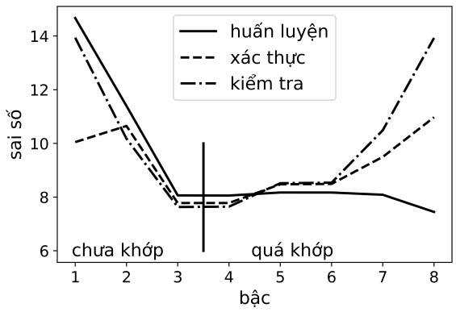

Hình 8.2. Lựa chọn mô hình dựa trên sai số xác thực

xu hướng giảm. Điều này dễ hiểu vì đa thức bậc càng cao, việc xấp xỉ càng chính xác. Quan sát đường nét đứt, khi bậc của đa thức là ba hoặc bốn thì sai số xác thực thấp, sau đó nó tăng dần lên. Dựa vào sai số xác thực, ta có thể xác định được bậc cần chọn là ba hoặc bốn. Quan sát tiếp đường nét chấm gạch, tương ứng với sai số kiểm tra. Thật trùng hợp, sai số kiểm tra cũng đạt giá trị nhỏ nhất tại bậc bằng ba hoặc bốn và tăng lên khi bậc tăng lên. Ở đây, kỹ thuật này đã tỏ ra hiệu quả. Mô hình phù hợp là mô hình có bậc bằng ba hoặc bốn. Trong ví dụ này, tập xác thực đóng vai trò tìm ra bậc của đa thức, tập huấn luyện đóng vai trò tìm các hệ số của đa thức với bậc đã biết. Các hệ số của đa thức chính là các tham số mô hình, trong khi bậc của đa thức có thể được coi là siêu tham số. Cả tập huấn luyện và tập xác thực đều đóng vai trò xây dựng mô hình. Nhắc lại rằng hai tập hợp này được tách ra từ tập huấn luyện ban đầu.

Trong ví dụ trên, ta vẫn thu được kết quả khả quan trên tập kiểm tra mặc dù không sử dụng tập này trong việc huấn luyện. Việc này xảy ra vì ta đã giả sử rằng dữ liệu xác thực và dữ liệu kiểm tra có chung một đặc điểm nào đó (chung phân phối và đều chưa được mô hình nhìn thấy khi huấn luyện).

Để ý rằng, khi bậc nhỏ bằng một hoặc hai, cả ba sai số đều cao, khi đó chưa khớp xảy ra.

## 8.2.2. Xác thực chéo

Trong nhiều trường hợp, lượng dữ liệu để xây dựng mô hình là hạn chế. Nếu lấy quá nhiều dữ liệu huấn luyện ra làm dữ liệu xác thực, phần dữ liệu còn lại không đủ để xây dựng mô hình. Lúc này, tập xác thực phải thật nhỏ để giữ được lượng dữ liệu huấn luyện đủ lớn. Tuy nhiên, một vấn đề khác nảy sinh. Việc đánh giá trên tập xác thực quá nhỏ có thể gây ra hiện tượng thiên lệch. Có giải pháp nào cho tình huống này không?

Câu trả lời là xác thực chéo (cross-validation).

<!-- page: 113 -->

Trong xác thực chéo, tập huấn luyện được chia thành k tập con có kích thước gần bằng nhau và không giao nhau. Tại mỗi lần thử, một trong k tập con đó được lấy ra làm tập xác thực, k − 1 tập con còn lại được coi là tập huấn luyện. Như vậy, với mỗi bộ tham số mô hình, ta có k mô hình khác nhau. Sai số huấn luyện và sai số xác thực được tính là trung bình cộng của các giá trị tương ứng trong k mô hình đó. Cách làm này có tên gọi là xác thực chéo k-fold (k-fold cross validation).

Khi k bằng với số lượng phần tử trong tập huấn luyện ban đầu, tức mỗi tập con có đúng một phần tử, ta gọi kỹ thuật này là leave-one-out.

Thư viện scikit-learn hỗ trợ rất nhiều phương pháp phân chia dữ liệu để xây dựng mô hình. Bạn đọc có thể xem thêm Cross-validation: evaluating estimator performance ([https://goo.gl/Ars2cr](https://goo.gl/Ars2cr)).

## 8.3. Cơ chế kiểm soát

Một nhược điểm lớn của xác thực chéo là số lượng mô hình cần huấn luyện tỉ lệ thuận với k. Điều đáng nói là mô hình hồi quy đa thức như trên chỉ có một siêu tham số liên quan đến độ phức tạp của mô hình cần xác định là bậc của đa thức. Trong nhiều bài toán, lượng siêu tham số cần xác định thường lớn hơn, và khoảng giá trị của mỗi tham số cũng rộng hơn, chưa kể có những tham số có thể là số thực. Điều này dẫn đến việc huấn luyện nhiều mô hình là khó khả thi. Có một kỹ thuật tránh quá khớp khác giúp giảm số mô hình cần huấn luyện có tên là cơ chế kiểm soát (regularization).

Cơ chế kiểm soát là một kỹ thuật phổ biến giúp tránh quá khớp theo hướng làm giảm độ phức tạp của mô hình. Việc giảm độ phức tạp này có thể khiến lỗi huấn luyện tăng lên nhưng lại làm tăng tính tổng quát của mô hình. Dưới đây là một vài kỹ thuật kiểm soát.

## 8.3.1. Kết thúc sớm

Các mô hình machine learning phần lớn được xây dựng thông qua lặp đi lặp lại một quy trình tới khi hàm mất mát hội tụ. Nhìn chung, giá trị hàm mất mát giảm dần khi số vòng lặp tăng lên. Một giải pháp giúp giảm quá khớp là dừng thuật toán trước khi nó hội tụ. Giải pháp này có tên là kết thúc sớm (early stopping).

Vậy kết thúc khi nào là phù hợp? Kỹ thuật thường dùng là tách từ tập huấn luyện ra một tập xác thực. Khi huấn luyện, ta tính toán cả sai số huấn luyện và sai số xác thực, nếu sai số huấn luyện vẫn có xu hướng giảm nhưng sai số xác thực có xu hướng tăng lên thì ta kết thúc thuật toán.

Hình 8.3 mô tả cách tìm điểm kết thúc. Chúng ta thấy rằng phương pháp này tương tự phương pháp tìm bậc của đa thức ở đầu chương, với độ phức tạp của

<!-- page: 114 -->

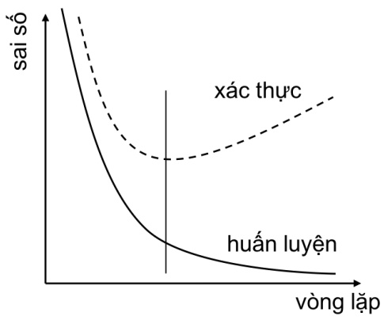

Hình 8.3. Kết thúc sớm. Thuật toán huấn luyện dừng lại tại vòng lặp mà sai số xác thực đạt giá trị nhỏ nhất.

mô hình có thể được coi là số vòng lặp cần chạy. Số vòng lặp càng cao thì sai số huấn luyện càng nhỏ nhưng sai số xác thức có thể tăng lên, tức mô hình có khả năng bị quá khớp.

## 8.3.2. Thêm số hạng vào hàm mất mát

Kỹ thuật phổ biến hơn là thêm vào hàm mất mát một số hạng giúp kiểm soát độ phức tạp mô hình. Số hạng này thường dùng để đánh giá độ phức tạp của mô hình với giá trị lớn thể hiện mô hình phức tạp. Hàm mất mát mới được gọi là hàm mất mát được kiểm soát (regularized loss function), thường được định nghĩa như sau:

$$
\mathcal {L} _ {\mathrm{reg}} (\theta) = \mathcal {L} (\theta) + \lambda R (\theta)
$$

Nhắc lại rằng θ được dùng để ký hiệu các tham số trong mô hình. ${ \mathcal { L } } ( \theta )$ là hàm mất mát phụ thuộc vào tập huấn luyện và θ, R(θ) là số hạng kiểm soát chỉ phụ thuộc vào θ. Số vô hướng λ thường là một số dương nhỏ, còn được gọi là tham số kiểm soát (regularization parameter). Tham số kiểm soát thường được chọn là các giá trị nhỏ để đảm bảo nghiệm của bài toán tối ưu $\mathcal { L } _ { \mathrm { r e g } } ( \theta )$ không quá xa nghiệm của bài toán tối ưu L(θ).

Hai hàm kiểm soát phổ biến là $\ell _ { 1 }$ norm và $\ell _ { 2 }$ norm. Ví dụ, khi chọn $R ( \mathbf { w } ) = \| \mathbf { w } \| _ { 2 } ^ { 2 }$ cho hàm mất mát của hồi quy tuyến tính, chúng ta sẽ thu được hồi quy ridge. Hàm kiểm soát $\ell _ { 2 }$ này khiến các hệ số trong w không quá lớn, giúp tránh việc đầu ra phụ thuộc mạnh vào một đặc trưng nào đó. Trong khi đó, nếu chọn $R ( \mathbf { w } ) = \| \mathbf { w } \| _ { 1 }$ nghiệm w tìm được có xu hướng rất nhiều phần tử bằng không $( \mathit { n g h i \acute { e } m t h u a ^ { 2 4 } } )$ Khi thêm kiểm soát $\ell _ { 1 }$ vào hàm mất mát của hồi quy tuyến tính, chúng ta thu được hồi quy LASSO. Các thành phần khác không của w tương đương với các đặc trưng quan trọng đóng góp vào việc dự đoán đầu ra. Các đặc trưng ứng với thành phần bằng không của w được coi là ít quan trọng. Chính vì vậy, hồi quy LASSO cũng được coi là một phương pháp giúp lựa chọn những đặc trưng hữu ích cho mô hình và có ý nghĩa trong việc trích chọn đặc trưng.

<small><span class="docvortex-page-footnote" data-block-type="page_footnote" style="color:#6b7280">24 L1 Norm Regularization and Sparsity Explained for Dummies ([https://goo.gl/VqPTLh](https://goo.gl/VqPTLh)).</span></small>

<!-- page: 115 -->

So với kiểm soát $\ell _ { 2 } .$ , kiểm soát $\ell _ { 1 }$ được cho là giúp mô hình kháng nhiễu tốt hơn. Tuy nhiên, hạn chế của kiểm soát $\ell _ { 1 }$ là hàm $\ell _ { 1 }$ norm không có đạo hàm mọi nơi, dẫn đến việc tìm nghiệm thường tốn thời gian hơn. Trong khi đó, đạo hàm của $\ell _ { 2 }$ norm xác định mọi nơi. Hơn nữa, $\ell _ { 2 }$ norm là một hàm lồi chặt, trong khi $\ell _ { 1 }$ là một hàm lồi. Các tính chất của hàm lồi và hàm lồi chặt sẽ được thảo luận trong Phần VII.

Trong mạng neuron, phương pháp sử dụng kiểm soát $\ell _ { 2 }$ còn được gọi là suy giảm trọng số (weight decay) [KH92]. Ngoài ra, gần đây có một phương pháp kiểm soát rất hiệu quả cho các mạng neuron sâu được sử dụng là dropout [SHK+14].

## 8.4. Đọc thêm

a. A. Krogh et al., A simple weight decay can improve generalization. NIPS 1991 [KH92].

b. N. Srivastava et al., Dropout: A Simple Way to Prevent Neural Networks from Overfitting, Journal of Machine Learning Research 15.1 (2014): 1929-1958 [SHK+14].

c. Understanding the Bias-Variance Tradeoff ([https://goo.gl/yvQv3w](https://goo.gl/yvQv3w)).

<!-- page: 116 -->

<!-- page: 117 -->

Khởi động

Trong phần này, chúng ta sẽ làm quen với ba thuật toán machine learning chưa cần nhiều tới tối ưu: K-lân cận cho các bài toán hồi quy và phân loại, K-means cho bài toán phân cụm và bộ phân loại naive Bayes cho dữ liệu dạng văn bản.

<!-- page: 118 -->

# K lân cận

Nếu con người có kiểu học “nước đến chân mới nhảy” thì machine learning cũng có một thuật toán như vậy.

## 9.1. Giới thiệu

## 9.1.1. K lân cận

K lân cận (K-nearest neighbor hay KNN) là một trong những thuật toán học có giám sát đơn giản nhất. Khi huấn luyện, thuật toán này gần như không học một điều gì từ dữ liệu huấn luyện mà ghi nhớ lại một cách máy móc toàn bộ dữ liệu đó. Mọi tính toán được thực hiện tại pha kiểm tra. KNN có thể được áp dụng vào các bài toán phân loại và hồi quy. KNN còn được gọi là một thuật toán lười học, instance-based [AKA91], hoặc memory-based learning.

KNN là thuật toán đi tìm đầu ra của một điểm dữ liệu mới chỉ dựa trên thông tin của K điểm dữ liệu gần nhất trong tập huấn luyện.

Hình 9.1 mô tả một bài toán phân loại với ba nhãn: đỏ, lam, lục (xem ảnh màu trong Hình B.1). Các hình tròn nhỏ với màu khác nhau thể hiện dữ liệu huấn luyện của các nhãn khác nhau. Các vùng màu nền khác nhau thể hiện “lãnh thổ” của mỗi nhãn. Nhãn của một điểm bất kỳ được xác định dựa trên nhãn của điểm gần nó nhất trong tập huấn luyện. Trong hình này, có một vài vùng nhỏ xem lẫn vào các vùng lớn hơn khác màu. Điểm này rất có thể là nhiễu. Các điểm dữ liệu kiểm tra gần khu vực điểm này nhiều khả năng sẽ bị phân loại sai.

Với KNN, mọi điểm trong tập huấn luyện đều được mô hình mô tả một cách chính xác. Việc này khiến overfitting dễ xảy ra với KNN.

<!-- page: 119 -->

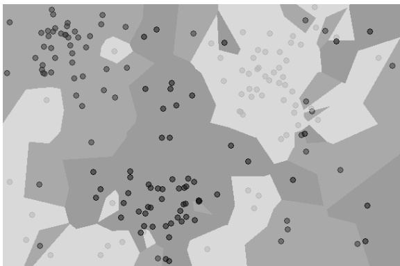

Hình 9.1. Ví dụ về 1NN. Các hình tròn là các điểm dữ liệu huấn luyện. Các hình khác màu thể hiện các lớp khác nhau. Các vùng nền thể hiện các điểm được phân loại vào lớp có màu tương ứng khi sử dựng 1NN (Nguồn: [K-nearest neighbors algorithm – Wikipedia](https://en.wikipedia.org/wiki/K-nearest_neighbors_algorithm), xem ảnh màu trong Hình B.1).

Mặc dù có nhiều hạn chế, KNN vẫn là giải pháp đầu tiên nên nghĩ tới khi giải quyết một bài toán machine learning. Khi làm các bài toán machine learning nói chung, không có mô hình đúng hay sai, chỉ có mô hình cho kết quả tốt hơn. Chúng ta luôn cần một mô hình đơn giản để giải quyết bài toán, sau đó mới dần tìm cách tăng chất lượng của mô hình.

## 9.2. Phân tích toán học

Không có hàm mất mát hay bài toán tối ưu nào cần thực hiện trong quá trình huấn luyện KNN. Mọi tính toán được tiến hành ở bước kiểm tra. Vì KNN ra quyết định dựa trên các điểm gần nhất nên có hai vấn đề ta cần lưu tâm. Thứ nhất, khoảng cách được định nghĩa như thế nào. Thứ hai, cần phải tính toán khoảng cách như thế nào cho hiệu quả.

Với vấn đề thứ nhất, mỗi điểm dữ liệu được thể hiện bằng một vector đặc trưng, khoảng cách giữa hai điểm chính là khoảng cách giữa hai vector đó. Có nhiều loại khoảng cách khác nhau tuỳ vào bài toán, nhưng khoảng cách được sử dụng nhiều nhất là khoảng cách Euclid (xem Mục 1.14).

Vấn đề thứ hai cần được lưu tâm hơn, đặc biệt với các bài toán có tập huấn luyện lớn và vector dữ liệu có kích thước lớn. Giả sử các vector huấn luyện là các cột của ma trận $\mathbf { X } \in \mathbb { R } ^ { d \times N }$ với d và N lớn. KNN sẽ phải tính khoảng cách từ một điểm dữ liệu mới $\mathbf { z } \in \mathbb { R } ^ { d }$ đến toàn bộ N điểm dữ liệu đã cho và chọn ra K khoảng cách nhỏ nhất. Nếu không có cách tính hiệu quả, khối lượng tính toán sẽ rất lớn.

Tiếp theo, chúng ta cùng thực hiện một vài phân tích toán học để tính các khoảng cách một cách hiệu quả. Ở đây khoảng cách được xem xét là khoảng cách Euclid.

## Khoảng cách từ một điểm tới từng điểm trong một tập hợp

Khoảng cách Euclid từ một điểm z tới một điểm x<sub>i</sub> trong tập huấn luyện được định nghĩa bởi $\| \mathbf { z } - \mathbf { x } _ { i } \| _ { 2 }$ . Người ta thường dùng bình phương khoảng cách Euclid $\| \mathbf { z }   -   \mathbf { x } _ { i } \| _ { 2 } ^ { 2 }$ để tránh phép tính căn bậc hai. Việc bình phương này không ảnh hưởng tới thứ tự của các khoảng cách. Để ý rằng

<!-- page: 120 -->

$$
\| \mathbf {z} - \mathbf {x} _ {i} \| _ {2} ^ {2} = (\mathbf {z} - \mathbf {x} _ {i}) ^ {T} (\mathbf {z} - \mathbf {x} _ {i}) = \| \mathbf {z} \| _ {2} ^ {2} + \| \mathbf {x} _ {i} \| _ {2} ^ {2} - 2 \mathbf {x} _ {i} ^ {T} \mathbf {z}\tag{9.1}
$$

Để tìm ra $\mathbf { x } _ { i }$ gần với z nhất, số hạng đầu tiên có thể được bỏ qua. Hơn nữa, nếu có nhiều điểm dữ liệu trong tập kiểm tra, các giá trị $\| \mathbf { x } _ { i } \| _ { 2 } ^ { 2 }$ có thể được tính và lưu trước vào bộ nhớ. Khi đó, ta chỉ cần tính các tích vô hướng $\mathbf { x } _ { i } ^ { T } \mathbf { Z } .$

Để thấy rõ hơn, chúng ta cùng làm một ví dụ trên Python. Trước hết, chọn d và N là các giá trị lớn và khai báo ngẫu nhiên X và z. Khi lập trình Python, cần lưu ý rằng chiều thứ nhất thường chỉ thứ tự của điểm dữ liệu.

```python
from __future__ import print_function
import numpy as np
from time import time # for comparing running time
d, N = 1000, 10000 # dimension, number of training points
X = np.random.randn(N, d) # N d-dimensional points
z = np.random.randn(d)
```

Tiếp theo, ta viết ba hàm số:

a. dist\_pp(z, x) tính bình phương khoảng cách Euclid giữa z và x. Hàm này tính hiệu z − x rồi lấy bình phương $\ell _ { 2 }$ norm của nó.

b. dist\_ps\_naive(z, X) tính bình phương khoảng cách giữa z và mỗi hàng của X. Trong hàm này, các khoảng cách được xây dựng dựa trên việc tính từng giá trị dist\_pp(z, X[i]).

c. dist\_ps\_fast(z, X) tính bình phương khoảng cách giữa z và mỗi hàng của X, tuy nhiên, kết quả được tính dựa trên đẳng thức (9.1). Ta cần tính tổng bình phương các phần tử của mỗi điểm dữ liệu trong X và tính tích X.dot(z)

Đoạn code dưới đây thể hiện hai cách tính khoảng cách từ một điểm z tới một tập hợp điểm X. Kết quả và thời gian chạy của mỗi hàm được in ra để so sánh.

```python
# naively compute square distance between two vector
def dist_pp(z, x):
    d = z - x.reshape(z.shape) # force x and z to have the same dims
    return np.sum(d*d)

# from one point to each point in a set, naive
def dist_ps_naive(z, X):
    N = X.shape[0]
    res = np.zeros((1, N))
    for i in range(N):
        res[0][i] = dist_pp(z, X[i])
    return res
```

<!-- page: 121 -->

```python
# from one point to each point in a set, fast
def dist_ps_fast(z, X):
    X2 = np.sum(X*X, 1) # square of l2 norm of each X[i], can be precomputed
    z2 = np.sum(z*z) # square of l2 norm of z
    return X2 + z2 - 2*X.dot(z) # z2 can be ignored

t1 = time()
D1 = dist_ps_naive(z, X)
print('naive point2set, running time:', time() - t1, 's')

t1 = time()
D2 = dist_ps_fast(z, X)
print('fast point2set , running time:', time() - t1, 's')
print('Result difference:', np.linalg.norm(D1 - D2))
```

## Kết quả:

```txt
naive point2set, running time: 0.0932548046112 s
fast point2set, running time: 0.0514178276062 s
Result difference: 2.11481965531e-11
```

Kết quả chỉ ra rằng hàm dist\_ps\_fast(z, X) chạy nhanh hơn gần gấp đôi so với hàm dist\_ps\_naive(z, X). Tỉ lệ này còn lớn hơn khi kích thước dữ liệu tăng lên và X2 được tính từ trước. Quan trọng hơn, sự chênh lệch nhỏ giữa kết quả của hai cách tính chỉ ra rằng dist\_ps\_fast(z, X) nên được ưu tiên hơn.

## Khoảng cách giữa từng cặp điểm trong hai tập hợp

Thông thường, tập kiểm tra bao gồm nhiều điểm dữ liệu tạo thành một ma trận Z. Ta phải tính từng cặp khoảng cách giữa mỗi điểm trong tập kiểm tra và một điểm trong tập huấn luyện. Nếu mỗi tập có 1000 phần tử, có một triệu khoảng cách cần tính. Nếu không có phương pháp tính hiệu quả, thời gian thực hiện sẽ rất dài.

Đoạn code dưới đây thể hiện hai phương pháp tính bình phương khoảng cách giữa các cặp điểm trong hai tập điểm. Phương pháp thứ nhất sử dụng một vòng for tính khoảng cách từ từng điểm trong tập thứ nhất đến tất cả các điểm trong tập thứ hai thông qua hàm dist\_ps\_fast(z, X) ở trên. Phương pháp thứ hai tiếp tục sử dụng (9.1) cho trường hợp tổng quát.

```python
Z = np.random.randn(100, d)
# from each point in one set to each point in another set, half fast
def dist_ss_0(Z, X):
    M, N = Z.shape[0], X.shape[0]
    res = np.zeros((M, N))
    for i in range(M):
        res[i] = dist_ps_fast(Z[i], X)
    return res
```

<!-- page: 122 -->

```python
# from each point in one set to each point in another set, fast
def dist_ss_fast(Z, X):
    X2 = np.sum(X*X, 1) # square of l2 norm of each ROW of X
    Z2 = np.sum(Z*Z, 1) # square of l2 norm of each ROW of Z
    return Z2.reshape(-1, 1) + X2.reshape(1, -1) - 2*Z.dot(X.T)

t1 = time()
D3 = dist_ss_0(Z, X)
print('half fast set2set running time:', time() - t1, 's')
t1 = time()
D4 = dist_ss_fast(Z, X)
print('fast set2set running time', time() - t1, 's')
print('Result difference:', np.linalg.norm(D3 - D4))
```

Kết quả:

```txt
half fast set2set running time: 4.33642292023 s
fast set2set running time 0.0583250522614 s
Result difference: 9.93586539607e-11
```

Điều này chỉ ra rằng hai cách tính cho kết quả chênh lệch nhau không đáng kể. Trong khi đó dist\_ss\_fast(Z, X) chạy nhanh hơn dist\_ss\_0(Z, X) nhiều lần.

Khi làm việc trên python, chúng ta có thể sử dụng hàm cdist ([https://goo.gl/vYMnmM](https://goo.gl/vYMnmM)) trong scipy.spatial.distance, hoặc hàm pairwise\_distances ([https://goo.gl/QK6Zyi](https://goo.gl/QK6Zyi)) trong sklearn.metrics.pairwise. Các hàm này giúp tính khoảng cách từng cặp điểm trong hai tập hợp khá hiệu quả. Phần còn lại của chương này sẽ trực tiếp sử dụng thư viện scikit-learn cho KNN. Việc viết lại thuật toán này không quá phức tạp khi đã có một hàm tính khoảng cách hiệu quả.

Bạn đọc có thể tham khảo thêm bài báo [JDJ17] về cách thực hiện KNN trên và mã nguồn tại [https://github.com/facebookresearch/faiss](https://github.com/facebookresearch/faiss).

## 9.3. Ví dụ trên cơ sở dữ liệu Iris

## 9.3.1. Bộ cơ sở dữ liệu hoa Iris

Bộ dữ liệu hoa Iris ([https://goo.gl/eUy83R](https://goo.gl/eUy83R)) là một bộ dữ liệu nhỏ. Bộ dữ liệu này bao gồm thông tin của ba nhãn hoa Iris khác nhau: Iris setosa, Iris virginica và Iris versicolor. Mỗi nhãn chứa thông tin của 50 bông hoa với dữ liệu là bốn thông tin: chiều dài, chiều rộng đài hoa, và chiều dài, chiều rộng cánh hoa. Hình 9.2 là ví dụ về hình ảnh của ba loại hoa. Chú ý rằng các điểm dữ liệu không phải là các bức ảnh mà chỉ là một vector đặc trưng bốn chiếu gồm các thông tin ở trên.

<!-- page: 123 -->


Iris setosa


Iris versicolor


Iris virginica

Hình 9.2. Ba loại hoa lan trong bộ cơ sở dữ liệu hoa Iris (xem ảnh màu trong Hình B.2).

## 9.3.2. Thí nghiệm

Trong phần này, 150 điểm dữ liệu được tách thành tập huấn luyện và tập kiểm tra. KNN dựa vào trông tin trong tập huấn luyện để dự đoán mỗi dữ liệu trong tập kiểm tra tương ứng với loại hoa nào. Kết quả này được đối chiếu với đầu ra thực sự để đánh giá hiệu quả của KNN.

Trước tiên, chúng ta cần khai báo vài thư viện. Bộ dữ liệu hoa Iris có sẵn trong thư viện scikit-learn.

```python
from __future__ import print_function
import numpy as np
from sklearn import neighbors, datasets
from sklearn.model_selection import train_test_split # for splitting data
from sklearn.metrics import accuracy_score      # for evaluating results

iris = datasets.load_iris()
iris_X = iris.data
iris_y = iris.target
```

Tiếp theo, 20 mẫu dữ liệu được lấy ra ngẫu nhiên tạo thành tập huấn luyện, 130 mẫu còn lại được dùng để kiểm tra.

```python
print('Labels:', np.unique(iris_y))

# split train and test
np.random.seed(7)
X_train, X_test, y_train, y_test = train_test_split(
    iris_X, iris_y, test_size=130)
print('Training size:', X_train.shape[0], ', test size:', X_test.shape[0])
```

```txt
Labels: [0 1 2]
Training size: 20 , test size: 130
```

Machine Learning cơ bản

<!-- page: 124 -->

Dòng np.random.seed(7) để đảm bảo kết quả chạy ở các lần khác nhau là giống nhau. Có thể thay 7 bằng một số tự nhiên 32 bit bất kỳ.

## Kết quả với 1NN

Tới đây, ta trực tiếp sử dụng thư viện scikit-learn cho KNN. Xét ví dụ đầu tiên với K = 1.

```python
model = neighbors.KNeighborsClassifier(n_neighbors = 1, p = 2)
model.fit(X_train, y_train)
y_pred = model.predict(X_test)
print("Accuracy of 1NN: %.2f %%" %(100*accuracy_score(y_test, y_pred)))
```

Kết quả:

```txt
Accuracy of 1NN: 92.31 %
```

Kết quả thu được là 92.31% (tỉ lệ số mẫu được phân loại chính xác trên tổng số mẫu). Ở đây, n\_neighbors = 1 chỉ ra rằng chỉ điểm gần nhất được lựa chọn, tức K = 1, p = 2 chính là \`2 norm để tính khoảng cách. Bạn đọc có thể thử với p = 1 tương ứng với khoảng cách \`1 norm.

## Kết quả với 7NN

Như đã đề cập, 1NN rất dễ gây ra overfitting. Để hạn chế việc này, ta có thể tăng lượng điểm lân cận lên, ví dụ bảy điểm, kết quả được xác định dựa trên đa số.

```txt
model = neighbors.KNeighborsClassifier(n_neighbors = 7, p = 2)
model.fit(X_train, y_train)
y_pred = model.predict(X_test)

print("Accuracy of 7NN with major voting: %.2f %\"\n\n\n\n\n\n\n\n\n\n\n\n\n\n\n\n\n\n\n\n\n\n\n\n\n\n\n\n\n\n\n\n\n\n\n\n\n\n\n\n\n\n\n\n\n\n\n\n\n\n\n\n\n\n\n\n\n\n\n\n\n\n\n\n\n\n\n\n\n\n\n\n\n\n\n\n\n\n\n\n\n\n\n\n\n\n\n\n\n\n\n\n\n\n\n\n\n\n\n\n\n
%(100*accuracy_score(y_test, y_pred)))
```

Kết quả:

```txt
Accuracy of 7NN with major voting: 93.85 %
```

Nhận thấy rằng khi sử dụng nhiều điểm lân cận hơn, độ chính xác đã tăng lên. Phương pháp dựa trên đa số trong lân cận còn được gọi là bầu chọn đa số.

## Đánh trọng số cho các điểm lân cận

Trong kỹ thuật bầu chọn đa số phía trên, các điểm trong bảy điểm gần nhất đều có vai trò như nhau và giá trị “lá phiếu” của mỗi điểm này cũng như nhau. Cách bầu chọn này có thể thiếu công bằng vì các điểm gần hơn nên có tầm ảnh hưởng

<!-- page: 125 -->

lớn hơn. Để thực hiện việc này, ta chỉ cần đánh trọng số khác nhau cho từng điểm trong bảy điểm gần nhất này. Cách đánh trọng số phải thoả mãn điều kiện điểm lân cận hơn được đánh trọng số cao hơn. Một cách đơn giản là lấy nghịch đảo của khoảng cách tới điểm lân cận. Trong trường hợp tồn tại khoảng cách bằng không, tức điểm kiểm tra trùng với một điểm huấn luyện, ta trực tiếp lấy đầu ra của điểm huấn luyện đó.

Để thực hiện việc này trong scikit-learn, ta chỉ cần gán weights = ’distance’. Giá trị mặc định của weights là ’uniform’, tương ứng với việc coi tất cả các điểm lân cận có giá trị bằng nhau như trong bầu chọn đa số.

```txt
model = neighbors.KNeighborsClassifier(n_neighbors = 7, p = 2, \
weights = 'distance')
model.fit(X_train, y_train)
y_pred = model.predict(X_test)

print("Accuracy of 7NN (1/distance weights): %.2f %%" %(100*accuracy_score(
    y_test, y_pred)))
```

Kết quả:

```txt
Accuracy of 7NN (1/distance weights): 94.62 %
```

Độ chính xác tiếp tục được tăng lên.

## KNN với trọng số tự định nghĩa

Ngoài hai cách đánh trọng số weights = ‘uniform’ và weights = ‘distance’, scikitlearn còn cung cấp cách đánh trọng số tùy chọn. Ví dụ, một cách đánh trọng số phổ biến khác thường được dùng là

$$
w _ {i} = \exp \left(\frac {- \left\| \mathbf {z} - \mathbf {x} _ {i} \right\| _ {2} ^ {2}}{\sigma^ {2}}\right)
$$

trong đó w<sub>i</sub> là trọng số của điểm gần thứ i (x<sub>i</sub>) của điểm dữ liệu đang xét z, σ là một số dương. Hàm số này cũng thỏa mãn điều kiện điểm càng gần x thì trọng số càng cao (cao nhất bằng 1). Với hàm số này, ta có thể lập trình như sau:

```python
def myweight(distances):
sigma2 = .4 # we can change this number
return np.exp(-distances**2/sigma2)

model = neighbors.KNeighborsClassifier(
    n_neighbors = 7, p = 2, weights = myweight)
model.fit(X_train, y_train)
y_pred = model.predict(X_test)

print("Accuracy of 7NN (customized weights): %.2f %%\n*(100*accuracy_score(y_test, y_pred)))
```

<!-- page: 126 -->

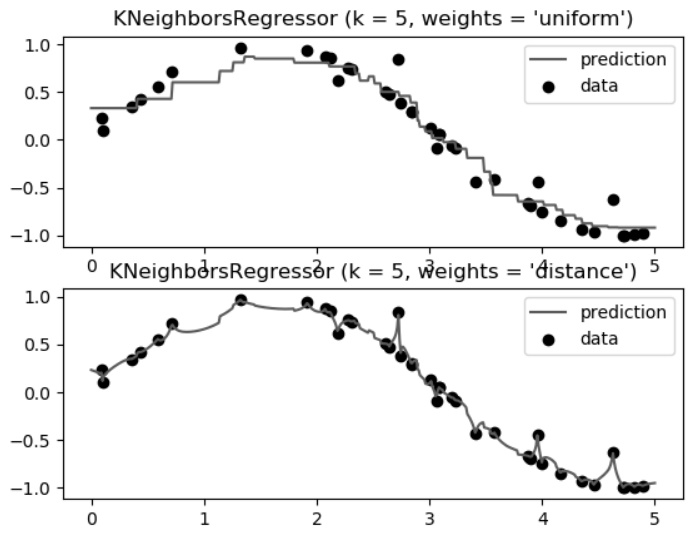

Hình 9.3. KNN cho bài toán hồi quy (Nguồn: Nearest neighbors regression – scikitlearn – [https://goo.gl/9VyBF3](https://goo.gl/9VyBF3)).

Kết quả:

Accuracy of 7NN (customized weights): 95.38 %

Kết quả tiếp tục tăng lên một chút. Với từng bài toán, chúng ta có thể thay các thuộc tính của KNN bằng các giá trị khác nhau và chọn ra giá trị tốt nhất thông qua xác thực chéo (xem Mục 8.2.2).

## 9.4. Thảo luận

## 9.4.1. KNN cho bài toán hồi quy

Với bài toán hồi quy, chúng ta cũng hoàn toàn có thể sử dụng phương pháp tương tự: đầu ra của một điểm được xác định dựa trên đầu ra của các điểm lân cận và khoảng cách tới chúng. Giả sử $\mathbf { x } _ { 1 } , \ldots , \mathbf { x } _ { K }$ là K điểm lân cận của một điểm dữ liệu z với đầu ra tương ứng là $y _ { 1 } , \ldots , y _ { K }$ Giả sử các trọng số ứng với các lân cận này là $w _ { 1 } , \ldots , w _ { K }$ . Kết quả dự đoán đầu ra của z có thể được xác định bởi

$$
\frac {w _ {1} y _ {1} + w _ {2} y _ {2} + \cdots + w _ {K} w _ {K}}{w _ {1} + w _ {2} + \cdots + w _ {K}}\tag{9.2}
$$

Hình 9.3 là một ví dụ về KNN cho hồi quy với K = 5, sử dụng hai cách đánh trọng số khác nhau. Ta có thể thấy rằng weights = ’distance’ có xu hướng gây ra overfitting.

<!-- page: 127 -->

## 9.4.2. Ưu điểm của KNN

• Độ phức tạp tính toán của quá trình huấn luyện gần như bằng 0. Việc tính bình phương $\ell _ { 2 }$ norm của mỗi điểm dữ liệu huấn luyện có thể được thực hiện trước trong bước này.

• Việc dự đoán kết quả của dữ liệu mới tương đối đơn giản sau khi đã xác định được các điểm lân cận.

• KNN không không cần giả sử về phân phối của từng nhãn.

## 9.4.3. Nhược điểm của KNN

• KNN nhạy cảm với nhiễu khi K nhỏ.

• Khi sử dụng KNN, phần lớn tính toán nằm ở pha kiểm tra. Trong đó việc tính khoảng cách tới từng điểm dữ liệu huấn luyện tốn nhiều thời gian, đặc biệt là với các cơ sở dữ liệu có số chiều lớn và có nhiều điểm dữ liệu. K càng lớn thì độ phức tạp càng cao. Ngoài ra, việc lưu toàn bộ dữ liệu trong bộ nhớ cũng ảnh hưởng tới hiệu năng của KNN.

## 9.4.4. Đọc thêm

a. Tutorial To Implement k-Nearest Neighbors in Python From Scratch ([https://goo.gl/J78Qso](https://goo.gl/J78Qso)).

b. Mã nguồn cho chương này có thể được tìm thấy tại [https://goo.gl/asF58Q](https://goo.gl/asF58Q).

<!-- page: 128 -->

## Phân cụm K-means

## 10.1. Giới thiệu

Trong Chương 7 và, 9, chúng ta đã làm quen các thuật toán học có giám sát. Trong chương này, một thuật toán đơn giản của học không giám sát sẽ được trình bày. Thuật toán này có tên là phân cụm K-means (K-means clustering).

Trong phân cụm K-means, ta không biết nhãn của từng điểm dữ liệu. Mục đích là làm thể nào để phân dữ liệu thành các cụm (cluster) khác nhau sao cho dữ liệu trong cùng một cụm có những tính chất giống nhau.

Ví dụ: Một công ty muốn tạo ra một chính sách ưu đãi cho những nhóm khách hàng khác nhau dựa trên sự tương tác giữa mỗi khách hàng với công ty đó (số năm là khách hàng, số tiền khách hàng đã chi trả cho công ty, độ tuổi, giới tính, thành phố, nghề nghiệp,...). Giả sử công ty có dữ liệu của khách hàng nhưng phân cụm. Phân cụm K-means là một thuật toán có thể giúp thực hiện công việc này. Sau khi phân cụm, nhân viên công ty có thể quyết định mỗi nhóm tương ứng với nhóm khách hàng nào. Phần việc cuối cùng này cần sự can thiệp của con người, nhưng lượng công việc đã được rút gọn đi đáng kể.

Một nhóm/cụm có thể được định nghĩa là tập hợp các điểm có vector đặc trưng gần nhau. Việc tính toán khoảng cách có thể phụ thuộc vào từng loại dữ liệu, trong đó khoảng cách Euclid được sử dụng phổ biến nhất. Trong chương này, các tính toán được thực hiện dựa trên khoảng cách Euclid. Tuy nhiên, quy trình thực hiện thuật toán có thể được áp dụng cho các loại khoảng cách khác.

Hình 10.1 là một ví dụ về dữ liệu được phân vào ba cụm. Giả sử mỗi cụm có một điểm đại diện được gọi là tâm cụm, được minh hoạ bởi các điểm màu trắng lớn. Mỗi điểm thuộc vào cụm có tâm gần nó nhất. Tới đây, chúng ta có một bài toán

<!-- page: 129 -->

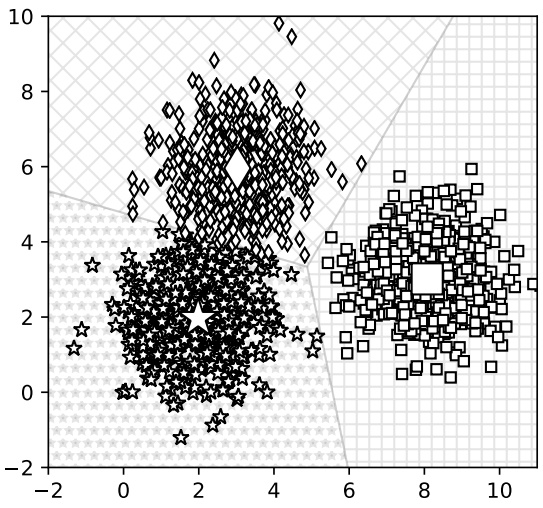

Hình 10.1. Ví dụ với ba cụm dữ liệu trong không gian hai chiều.

thú vị: Trên vùng biển hình chữ nhật có ba đảo hình thoi, hình vuông và sao năm cánh lớn màu trắng như Hình 10.1. Một điểm trên biển được gọi là thuộc lãnh hải của một đảo nếu nó nằm gần đảo này hơn so với hai đảo còn lại. Hãy xác định ranh giới lãnh hải giữa các đảo.

Cũng trên Hình 10.1, các vùng với nền khác nhau biểu thị lãnh hải của mỗi đảo. Có thể thấy rằng đường phân định giữa các lãnh hải có dạng đường thẳng. Chính xác hơn, chúng là đường trung trực của các cặp đảo gần nhau. Vì vậy, lãnh hải của một đảo sẽ là một hình đa giác. Cách phân chia dựa trên khoảng cách tới điểm gần nhất này trong toán học được gọi là Voronoi diagram<sup>25</sup>. Trong không gian ba chiều, lấy ví dụ là các hành tinh, lãnh không của mỗi hành tinh sẽ là một đa diện. Trong không gian nhiều chiều hơn, chúng ta sẽ có những siêu đa diện.

## 10.2. Phân tích toán học

Mục đích cuối cùng của thuật toán phân cụm K-means là từ dữ liệu đầu vào và số lượng cụm cần tìm, hãy xác định tâm mỗi cụm và phân các điểm dữ liệu vào cụm tương ứng. Giả sử thêm rằng mỗi điểm dữ liệu chỉ thuộc đúng một cụm.

Giả sử N điểm dữ liệu trong tập huấn luyện được ghép lại thành ma trận $\mathbf { X } =$ $[ \mathbf { x } _ { 1 } , \mathbf { x } _ { 2 } , \ldots , \mathbf { x } _ { N } ]   \in   \mathbb { R } ^ { d \times N }$ và $K < N$ là số cụm được xác định trước. Ta cần tìm các tâm cụm $\mathbf { m } _ { 1 } , \mathbf { m } _ { 2 } , \ldots , \mathbf { m } _ { K } \in \mathbb { R } ^ { d \times 1 }$ và nhãn của mỗi điểm dữ liệu. Ở đây, mỗi cụm được đại diển bởi một nhãn, thường là một số tự nhiên từ 1 đến K. Nhắc lại rằng các điểm dữ liệu trong bài toán phân cụm K-means ban đầu không có nhãn cụ thể.

Với mỗi điểm dữ liệu $\mathbf { x } _ { i } ,$ ta cần tìm nhãn $y _ { i } = k$ của nó, ở đây $k \in \{ 1 , 2 , \ldots , K \}$ Nhãn của một điểm cũng thường được biểu diễn dưới dạng một vector hàng K

<small><span class="docvortex-page-footnote" data-block-type="page_footnote" style="color:#6b7280">25 Vonoroi diagram – Wikipedia ([https://goo.gl/xReCW8](https://goo.gl/xReCW8)).</span></small>

<!-- page: 130 -->

phần tử $\mathbf { y } _ { i } \in \mathbb { R } ^ { 1 \times K }$ , trong đó tất cả các phần tử của $\mathbf { y } _ { i }$ bằng 0 trừ phần tử $\overset { ? } { \mathrm { o } }$ vị trí thứ k bằng 1. Cách biểu diễn này còn được gọi là mã hoá one-hot. Cụ thể, $y _ { i j }   =   0 , \quad \forall j   \neq   k , y _ { i k }   =   1$ . Khi chồng các vector $\mathbf { y } _ { i }$ lên nhau, ta được một ma trận nhãn $\mathbf { Y } \in \mathbb { R } ^ { N \times K }$ . Nhắc lại rằng $y _ { i j }$ là phần tử hàng thứ $i ,$ cột thứ $j$ của ma trận Y, và cũng là phần tử thứ $j$ của vector $\mathbf { y } _ { i }$ . Ví dụ, nếu một điểm dữ liệu có vector nhãn là $[ 1 , 0 , 0 , \ldots , 0 ]$ thì nó thuộc vào cụm thứ nhất, là $[ 0 , 1 , 0 , \ldots , 0 ]$ thì nó thuộc vào cụm thứ hai,... Điều kiện của $\mathbf { y } _ { i }$ có thể viết dưới dạng toán học:

$$
y _ {i j} \in \{0, 1 \}, \forall i, j; \quad \sum_ {j = 1} ^ {K} y _ {i j} = 1, \forall i\tag{10.1}
$$

## 10.2.1. Hàm mất mát và bài toán tối ưu

Gọi $\mathbf { m } _ { k } \in \mathbb { R } ^ { d }$ là tâm của cụm thứ k. Giả sử một điểm dữ liệu $\mathbf { x } _ { i }$ được phân vào cụm k. Vector sai $\mathrm { s } \hat { \mathrm { o } }$ nếu thay $\mathbf { x } _ { i }$ bằng m<sub>k</sub> là $\left( \mathbf { x } _ { i }   -   \mathbf { m } _ { k } \right)$ . Ta muốn vector sai số này gần với vector không, tức $\mathbf { x } _ { i }$ gần với $\mathbf { m } _ { k }$ . Việc này có thể được thực hiện thông qua việc tối thiểu bình phương khoảng cách Euclid $\| \mathbf { x } _ { i } - \mathbf { m } _ { k } \| _ { 2 } ^ { 2 }$ . Hơn nữa, vì $\mathbf { x } _ { i }$ được phân vào cụm k nên $y _ { i k } = 1 , y _ { i j } = 0 , \forall j \neq k$ . Khi đó, biểu thức khoảng cách Euclid có thể được viết lại thành

$$
\| \mathbf {x} _ {i} - \mathbf {m} _ {k} \| _ {2} ^ {2} = y _ {i k} \| \mathbf {x} _ {i} - \mathbf {m} _ {k} \| _ {2} ^ {2} = \sum_ {j = 1} ^ {K} y _ {i j} \| \mathbf {x} _ {i} - \mathbf {m} _ {j} \| _ {2} ^ {2}\tag{10.2}
$$

Như vậy, sai $\mathrm { s } \hat { \mathrm { o } }$ trung bình cho toàn bộ dữ liệu sẽ là:

$$
\mathcal {L} (\mathbf {Y}, \mathbf {M}) = \frac {1}{N} \sum_ {i = 1} ^ {N} \sum_ {j = 1} ^ {K} y _ {i j} \| \mathbf {x} _ {i} - \mathbf {m} _ {j} \| _ {2} ^ {2}\tag{10.3}
$$

Trong đó $\mathbf { M } = [ \mathbf { m } _ { 1 } , \mathbf { m } _ { 2 } , \ldots , \mathbf { m } _ { K } ] \in \mathbb { R } ^ { d \times K }$ là ma trận tạo bởi K tâm cụm. Hàm mất mát trong bài toán phân cụm K-means là $\mathcal { L } ( \mathbf { Y } , \mathbf { M } )$ với ràng buộc như được nêu trong (10.1). Để tìm các tâm cụm và cụm tương ứng của mỗi điểm dữ liệu, ta cần giải bài toán tối ưu có ràng buộc

$$
\mathbf {Y}, \mathbf {M} = \underset {\mathbf {Y}, \mathbf {M}} {\operatorname{argmin}} \frac {1}{N} \sum_ {i = 1} ^ {N} \sum_ {j = 1} ^ {K} y _ {i j} \| \mathbf {x} _ {i} - \mathbf {m} _ {j} \| _ {2} ^ {2}
$$

$$
\text {thoả   mãn:} y _ {i j} \in \{0, 1 \}, \forall i, j; \quad \sum_ {j = 1} ^ {K} y _ {i j} = 1, \forall i\tag{10.4}
$$

## 10.2.2. Thuật toán tối ưu hàm mất mát

Bài toán (10.4) là một bài toán khó tìm điểm tối ưu vì có thêm các điều kiện ràng buộc. Bài toán này thuộc loại mix-integer programming (điều kiện biến là

<!-- page: 131 -->

số nguyên) - là loại rất khó tìm nghiệm tối ưu toàn cục. Tuy nhiên, trong một số trường hợp chúng ta vẫn có phương pháp để tìm nghiệm gần đúng. Một kỹ thuật đơn giản và phổ biến để giải bài toán (10.4) là xen kẽ giải Y và M khi biến còn lại được cố định cho tới khi hàm mất mát hội tụ. Chúng ta sẽ lần lượt giải quyết hai bài toán sau.

## Cố định M, tìm Y

Giả sử đã tìm được các tâm cụm, hãy tìm các vector nhãn để hàm mất mát đạt giá trị nhỏ nhất.

Khi các tâm cụm là cố định, bài toán tìm vector nhãn cho toàn bộ dữ liệu có thể được chia nhỏ thành bài toán tìm vector nhãn cho từng điểm dữ liệu $\mathbf { x } _ { i }$ như sau:

$$
\begin{array}{c} \mathbf {y} _ {i} = \underset {\mathbf {y} _ {i}} {\operatorname{argmin}} \frac {1}{N} \sum_ {j = 1} ^ {K} y _ {i j} \| \mathbf {x} _ {i} - \mathbf {m} _ {j} \| _ {2} ^ {2} \\ \text {thoả   mãn:} y _ {i j} \in \{0, 1 \}, \forall i, j; \quad \sum_ {j = 1} ^ {K} y _ {i j} = 1, \forall i. \end{array}\tag{10.5}
$$

Vì chỉ có một phần tử của vector nhãn $\mathbf { y } _ { i }$ bằng 1 nên bài toán (10.5) chính là bài toán đi tìm tâm cụm gần điểm $\mathbf { x } _ { i }$ nhất:

$$
j = \underset {j} {\operatorname{argmin}} \left\| \mathbf {x} _ {i} - \mathbf {m} _ {j} \right\| _ {2} ^ {2}.\tag{10.6}
$$

Vì $\| \mathbf { x } _ { i } - \mathbf { m } _ { j } \| _ { 2 } ^ { 2 }$ là bình phương khoảng cách Euclid từ điểm $\mathbf { x } _ { i }$ tới centroid $\mathbf { m } _ { j }$ , ta có thể kết luận rằng mỗi điểm $\mathbf { x } _ { i }$ thuộc vào cụm có tâm gần nó nhất. Từ đó có thể suy ra vector nhãn của từng điểm dữ liệu.

## Cố định Y, tìm M

Giả sử đã biết cụm của từng điểm, hãy tìm các tâm cụm mới để hàm mất mát đạt giá trị nhỏ nhất.

Khi vector nhãn cho từng điểm dữ liệu đã được xác định, bài toán tìm tâm cụm được rút gọn thành

$$
\mathbf {m} _ {j} = \underset {\mathbf {m} _ {j}} {\mathrm{argmin}} \frac {1}{N} \sum_ {i = 1} ^ {N} y _ {i j} \| \mathbf {x} _ {i} - \mathbf {m} _ {j} \| _ {2} ^ {2}.\tag{10.7}
$$

Để $\acute { \mathrm { y } }$ rằng hàm mục tiêu là một hàm liên tục và có đạo hàm xác định tại mọi điểm mj. Vì vậy, ta có thể tìm nghiệm bằng phương pháp giải phương trình đạo hàm bằng không. Đặt $l ( \mathbf { m } _ { j } )$ là hàm mục tiêu bên trong dấu argmin của (10.7), ta cần giải phương trình sau đây:

<!-- page: 132 -->

$$
\nabla_ {\mathbf {m} _ {j}} l (\mathbf {m} _ {j}) = \frac {2}{N} \sum_ {i = 1} ^ {N} y _ {i j} (\mathbf {m} _ {j} - \mathbf {x} _ {i}) = \mathbf {0}\tag{10.8}
$$

$$
\Leftrightarrow \mathbf {m} _ {j} \sum_ {i = 1} ^ {N} y _ {i j} = \sum_ {i = 1} ^ {N} y _ {i j} \mathbf {x} _ {i} \Leftrightarrow \mathbf {m} _ {j} = \frac {\sum_ {i = 1} ^ {N} y _ {i j} \mathbf {x} _ {i}}{\sum_ {i = 1} ^ {N} y _ {i j}}\tag{10.9}
$$

Để ý rằng mẫu số chính là tổng số điểm dữ liệu trong cụm $j ,$ tử số là tổng các điểm dữ liệu trong cụm $j .$ Nói cách khác, $\mathbf { m } _ { j }$ là trung bình cộng (mean) của các điểm trong cụm j.

Tên gọi phân cụm K-means xuất phát từ đây.

## 10.2.3. Tóm tắt thuật toán

Tới đây, ta có thể tóm tắt thuật toán phân cụm K-means như sau.

## Thuật toán 10.1: phân cụm K-means

Đầu vào: Ma trận dữ liệu $\mathbf { X } \in \mathbb { R } ^ { d \times N }$ và số lượng cụm cần tìm $K < N .$ Đầu ra: Ma trận tâm cụm $\mathbf { M } \in \mathbb { R } ^ { d \times K }$ và ma trận nhãn Y $\in \mathbb { R } ^ { N \times K }$

1. Chọn K điểm bất kỳ trong tập huấn luyện làm các tâm cụm ban đầu.

2. Phân mỗi điểm dữ liệu vào cụm có tâm gần nó nhất.

3. Nếu việc phân cụm dữ liệu vào từng cụm ở bước 2 không thay đổi so với vòng lặp trước nó thì dừng thuật toán.

4. Cập nhật tâm cụm bằng cách lấy trung bình cộng của các điểm đã được gán vào cụm đó sau bước 2.

5. Quay lại bước 2.

Thuật toán này sẽ hội tụ sau một số hữu hạn vòng lặp. Thật vậy, dãy số biểu diễn giá trị của hàm mất mát sau mỗi bước là một đại lượng không tăng và bị chặn dưới. Điều này chỉ ra rằng dãy số này phải hội tụ. Để ý thêm nữa, số lượng cách phân cụm cho toàn bộ dữ liệu là hữu hạn (khi số cụm K là cố định) nên đến một lúc nào đó, hàm mất mát sẽ không thể thay đổi, và chúng ta có thể dừng thuật toán tại đây.

Nếu tồn tại một cụm không chứa điểm nào, mẫu số trong (10.8) sẽ bằng không, và phép chia sẽ không thực hiện được. Vì vậy, K điểm bất kỳ trong tập huấn luyện được chọn làm các tâm cụm ban đầu ở bước 1 để đảm bảo mỗi cụm có ít nhất một điểm. Trong quá trình huấn luyện, nếu tồn tại một cụm không chứa điểm nào, có hai cách giải quyết. Cách thứ nhất là bỏ cụm đó và giảm K đi một. Cách thứ hai là thay tâm của cụm đó bằng một điểm bất kỳ trong tập huấn luyện, chẳng hạn như điểm xa tâm cụm hiện tại của nó nhất.

<!-- page: 133 -->

## 10.3. Ví dụ trên Python

## 10.3.1. Giới thiệu bài toán

Chúng ta sẽ làm một ví dụ đơn giản. Trước hết, ta tạo tâm cụm và dữ liệu cho từng cụm bằng cách lấy mẫu theo phân phối chuẩn có kỳ vọng là tâm của cụm đó và ma trận hiệp phương sai là ma trận đơn vị. Ở đây, hàm cdist trong scipy. spatial.distance được dùng để tính khoảng cách giữa các cặp điểm trong hai tập hợp một cách hiệu quả<sup>26</sup>.

Dữ liệu được tạo bằng cách lấy ngẫu nhiên 500 điểm cho mỗi cụm theo phân phối chuẩn có kỳ vọng lần lượt là (2, 2), (8, 3) và (3, 6); ma trận hiệp phương sai giống nhau và là ma trận đơn vị.

```python
from __future__ import print_function
import numpy as np
import matplotlib.pyplot as plt
from scipy.spatial.distance import cdist
import random
np.random.seed(18)
means = [[2, 2], [8, 3], [3, 6]]
cov = [[1, 0], [0, 1]]
N = 500
X0 = np.random.multivariate_normal(means[0], cov, N)
X1 = np.random.multivariate_normal(means[1], cov, N)
X2 = np.random.multivariate_normal(means[2], cov, N)
X = np.concatenate((X0, X1, X2), axis = 0)
K = 3 # 3 clusters
original_label = np.asarray([0]*N + [1]*N + [2]*N).T
```

## 10.3.2. Các hàm số cần thiết cho phân cụm K-means

Trước khi viết thuật toán chính phân cụm K-means, ta cần một số hàm phụ trợ:

a. kmeans\_init\_centroids khởi tạo các tâm cụm.

b. kmeans\_asign\_labels tìm nhãn mới cho các điểm khi biết các tâm cụm.

c. kmeans\_update\_centroids cập nhật các tâm cụm khi biết nhãn của từng điểm.

d. has\_converged kiểm tra điều kiện dừng của thuật toán.

```python
def kmeans_init_centroids(X, k):
    # randomly pick k rows of X as initial centroids
    return X[np.random.choice(X.shape[0], k, replace=False)]
```

<small><span class="docvortex-page-footnote" data-block-type="page_footnote" style="color:#6b7280">26 việc xây dựng hàm số này không sử dụng thư viện đã được thảo luận kỹ trong Chương 9</span></small>

<!-- page: 134 -->

```python
def kmeans_assign_labels(X, centroids):
    # calculate pairwise distances btw data and centroids
    D = cdist(X, centroids)
    # return index of the closest centroid
    return np.argmin(D, axis = 1)

def has_converged(centroids, new_centroids):
    # return True if two sets of centroids are the same
    return (set([tuple(a) for a in centroids]) == set([tuple(a) for a in new_centroids]))

def kmeans_update_centroids(X, labels, K):
    centroids = np.zeros((K, X.shape[1]))
    for k in range(K):
        # collect all points that are assigned to the k-th cluster
        Xk = X[labels == k, :]
        centroids[k,:] = np.mean(Xk, axis = 0) # take average
    return centroids
```

Phần chính của phân cụm K-means:

```python
def kmeans(X, K):
    centroids = [kmeans_init_centroids(X, K)]
    labels = []
    it = 0
    while True:
        labels.append(kmeans_assign_labels(X, centroids[-1]))
        new_centroids = kmeans_update_centroids(X, labels[-1], K)
        if has_converged(centroids[-1], new_centroids):
            break
        centroids.append(new_centroids)
        it += 1
    return (centroids, labels, it)
```

Áp dụng thuật toán vừa viết vào dữ liệu ban đầu và hiển thị kết quả cuối cùng:

```txt
centroids, labels, it = kmeans(X, K)
print('Centers found by our algorithm:\n', centroids[-1])
kmeans_display(X, labels[-1])
```

Kết quả:

```txt
Centers found by our algorithm:
[[ 1.9834967    1.96588127]
[ 3.02702878   5.95686115]
[ 8.07476866   3.01494931]]
```

Hình 10.2 minh hoạ thuật toán phân cụm K-means trên tập dữ liệu này sau một số vòng lặp. Nhận thấy rằng tâm cụm và các vùng lãnh thổ của chúng thay đổi qua các vòng lặp và hội tụ chỉ sau sáu vòng lặp. Từ kết quả này ta thấy rằng

<!-- page: 135 -->

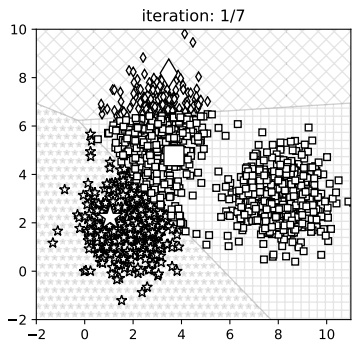

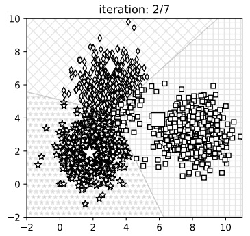

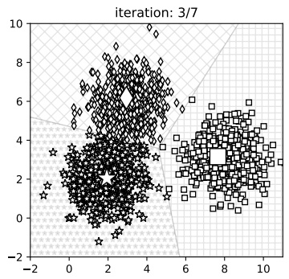

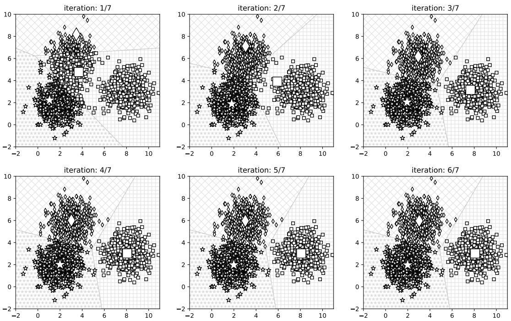

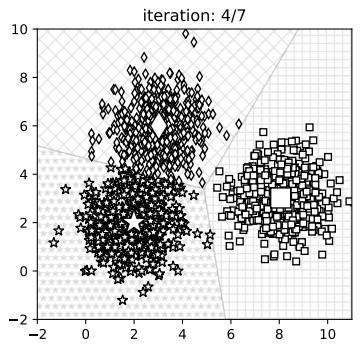

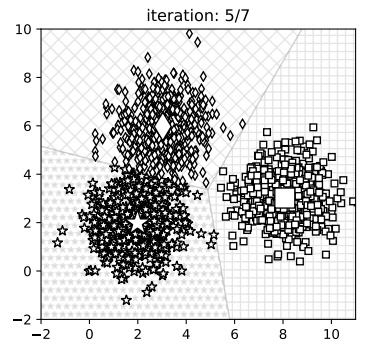

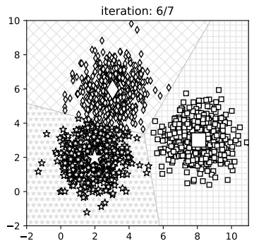

Hình 10.2. Thuật toán phân cụm K-means qua các vòng lặp.

thuật toán phân cụm K-means làm việc khá thành công, các tâm cụm tìm được gần với các tâm cụm ban đầu và các nhóm dữ liệu được phân ra gần như hoàn hảo (một vài điểm gần ranh giới giữa hai cụm hình thoi và hình sao có thể lẫn vào nhau).

## 10.3.3. Kết quả tìm được bằng thư viện scikit-learn

Để kiểm tra thêm, chúng ta hãy so sánh kết quả trên với kết quả thu được bằng cách sử dụng thư viện [scikit−learn](http://scikit-learn.org/stable/modules/generated/sklearn.cluster.KMeans.html).

```python
from sklearn.cluster import KMeans
model = KMeans(n_clusters=3, random_state=0).fit(X)
print('Centers found by scikit-learn:')
print(model.cluster_centers_)
pred_label = model.predict(X)
kmeans_display(X, pred_label)
```

Kết quả:

```txt
Centroids found by scikit-learn:
[[ 8.0410628   3.02094748]
[ 2.99357611   6.03605255]
[ 1.97634981   2.01123694]]
```

Ta nhận thấy rằng các tâm cụm tìm được rất gần với kết quả kỳ vọng.

<!-- page: 136 -->

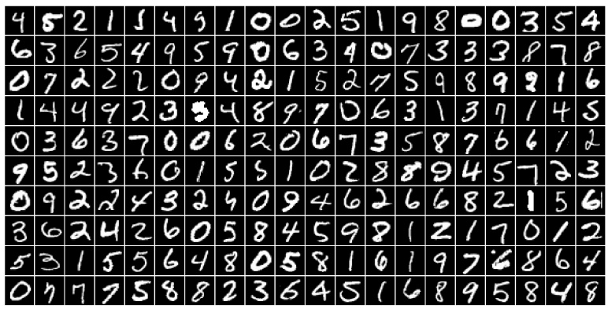

Hình 10.3. 200 mẫu ngẫu nhiên trong bộ cơ sở dữ liệu MNIST.

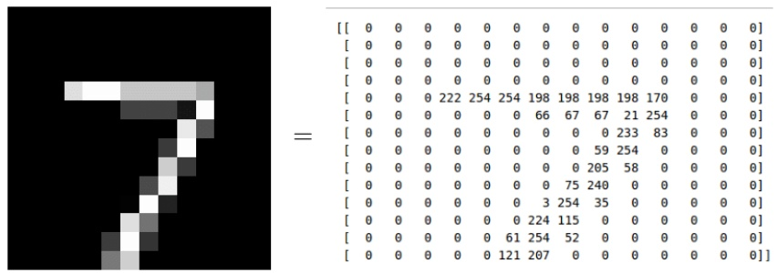

Hình 10.4. Ví dụ về chữ số 7 và giá trị các pixel của nó.

Tiếp theo, chúng ta cùng xem xét ba ứng dụng đơn giản của phân cụm K-means.

## 10.4. Phân cụm chữ số viết tay

## 10.4.1. Bộ cơ sở dữ liệu MNIST

MNIST [LCB10] là bộ cơ sở dữ liệu lớn nhất về chữ số viết tay và được sử dụng trong hầu hết các thuật toán phân loại hình ảnh. MNIST bao gồm hai tập con: tập huấn luyện có 60 nghìn mẫu và tập kiểm tra có 10 nghìn mẫu. Tất cả đều đã được gán nhãn. Hình 10.3 hiển thị 200 mẫu được trích ra từ MNIST.

Mỗi bức ảnh là một ảnh xám (chỉ có một kênh), có kích thước 28 × 28 điểm ảnh (tức 784 điểm ảnh). Mỗi điểm ảnh mang giá trị là một số tự nhiên từ 0 đến 255. Các điểm ảnh màu đen có giá trị bằng không, các điểm ảnh càng trắng thì có giá trị càng cao. Hình 10.4 là một ví dụ về chữ số 7 và giá trị các điểm ảnh của nó<sup>27</sup>.

## 10.4.2. Bài toán phân cụm giả định

Bài toán: Giả sử ta không biết nhãn của các bức ảnh, hãy phân các bức ảnh gần giống nhau về một cụm.

<small><span class="docvortex-page-footnote" data-block-type="page_footnote" style="color:#6b7280">27 Vì mục đích hiển thị ma trận điểm ảnh ở bên phải, bức ảnh kích thước 28 × 28 ban đầu đã được resize về kích thước 14 × 14.</span></small>

<!-- page: 137 -->

Bài toán này có thể được giải quyết bằng phân cụm K-means. Mỗi bức ảnh có thể được coi là một điểm dữ liệu với vector đặc trưng là vector cột 784 chiều. Vector này nhận được bằng cách chồng các cột của ma trận điểm ảnh lên nhau.

## 10.4.3. Làm việc trên Python

Để tải về MNIST, chúng ta có thể dùng trực tiếp một hàm số trong scikit-learn:

```python
from __future__ import print_function
import numpy as np
from sklearn.datasets import fetch_mldata

data_dir = '../../data' # path to your data folder
mnist = fetch_mldata('MNIST original', data_home=data_dir)
print("Shape of minst data:", mnist.data.shape)

Két quả:

Shape of minst data: (70000, 784)
```

shape của ma trận dữ liệu mnist.data là (70000, 784) tức có 70000 mẫu, mỗi mẫu có kích thước 784. Chú ý rằng trong scikit-learn, mỗi điểm dữ liệu thường được lưu dưới dạng một vector hàng. Tiếp theo, chúng ta lấy ra ngẫu nhiên 10000 mẫu và thực hiện phân cụm K-means trên tập con này:

```python
from sklearn.cluster import KMeans
from sklearn.neighbors import NearestNeighbors
K = 10 # number of clusters
N = 10000
X = mnist.data[np.random.choice(mnist.data.shape[0], N)]
kmeans = KMeans(n_clusters=K).fit(X)
pred_label = kmeans.predict(X)
```

Sau khi thực hiện đoạn code trên, các tâm cụm được lưu trong biến kmeans. cluster\_centers\_, nhãn của mỗi điểm dữ liệu được lưu trong biến pred\_label. Hình 10.5 hiển thị các tâm cụm tìm được và 20 mẫu ngẫu nhiên được phân vào cụm tương ứng. Mỗi hàng tương ứng với một cụm, cột đầu tiên bên trái là các tâm cụm tìm được. Ta thấy rằng các tâm cụm đều giống với một chữ số hoặc là kết hợp của hai/ba chữ số nào đó. Ví dụ, tâm cụm ở hàng thứ tư là sự kết hợp của các chữ số 4, 7, 9; ở hàng thứ bảy là kết hợp của các chữ số 7, 8 và 9.

Nhận thấy rằng các bức ảnh lấy ra ngẫu nhiên từ mỗi cụm không thực sự giống nhau. Lý do có thể vì những bức ảnh này ở xa các tâm cụm mặc dù tâm cụm đó đã là gần nhất. Như vậy phân cụm K-means làm việc chưa thực sự tốt trong trường hợp này. Tuy nhiên, chúng ta vẫn có thể khai thác một số thông tin hữu ích sau khi thực hiện thuật toán. Thay vì chọn ngẫu nhiên các bức ảnh trong mỗi cụm, ta chọn 20 bức ảnh gần tâm của mỗi cụm nhất, vì càng gần tâm thì độ tin

<!-- page: 138 -->

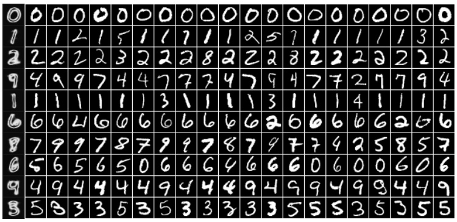

**Hình 10.5.** Các tâm cụm (cột đầu) và 20 điểm ngẫu nhiên trong mỗi cụm. Các chữ số trên mỗi hàng thuộc vào cùng một cụm.

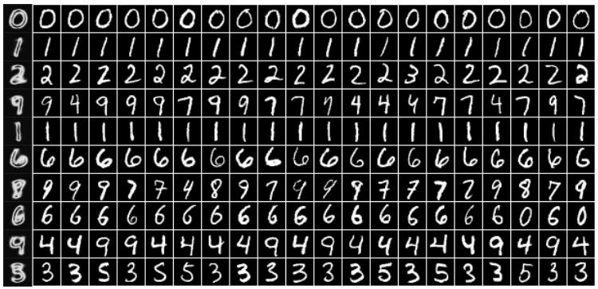

**Hình 10.6.** Tâm và 20 điểm gần tâm nhất của mỗi cụm.

cậy càng cao. Quan sát Hình 10.6, có thể thấy dữ liệu trong mỗi hàng khá giống nhau và giống với tâm cụm ở cột đầu tiên bên trái. Từ đây có thể rút ra một vài quan sát thú vị:

a. Có hai kiểu viết chữ số 1 – thẳng và chéo. Phân cụm K-means nghĩ rằng đó là hai chữ số khác nhau. Điều này là dễ hiểu vì phân cụm K-means là một thuật toán học không giám sát. Nếu có sự can thiệp của con người, chúng có thể được nhóm lại thành một.

b. Ở hàng thứ chín, chữ số 4 và 9 được phân vào cùng một cụm. Sự thật là hai chữ số này khá giống nhau. Điều tương tự xảy ra đối với hàng thứ bảy với các chữ số 7, 8, 9. Phân cụm K-means có thể được áp dụng để tiếp tục phân nhỏ các cụm đó.

Một kỹ thuật phân cụm thường được sử dụng là phân cụm theo tầng (hierarchical clustering [Ble08]). Có hai loại phân cụm theo tầng:

• Agglomerative tức “đi từ dưới lên”. Ban đầu ta chọn K là một số lớn gần bằng số điểm dữ liệu. Sau khi thực hiện phân cụm K-means lần đầu, các cụm gần nhau được ghép lại thành một cụm. Khoảng cách giữa các cụm có thể được xác định bằng khoảng cách giữa các tâm cụm. Sau bước này, ta thu được một số lượng cụm nhỏ hơn. Tiếp tục phân cụm K-means với điểm khởi tạo là tâm của cụm lớn vừa thu được. Lặp lại quá trình này đến khi nhận được kết quả chấp nhận được.

<!-- page: 139 -->


Hình 10.7. Ảnh:Trọng Vũ ([https://goo.gl/9D8aXW](https://goo.gl/9D8aXW), xem ảnh màu trong Hình B.3) .

• Divisive tức “đi từ trên xuống”. Ban đầu, thực hiện phân cụm K-means với K nhỏ để được các cụm lớn. Sau đó tiếp tục áp dụng phân cụm K-means vào mỗi cụm lớn đến khi kết quả chấp nhận được.

## 10.5. Tách vật thể trong ảnh

Phân cụm K-means cũng được áp dụng vào bài toán tách vật thể trong ảnh (object segmentation). Cho bức ảnh như trong Hình 10.7, hãy xây dựng một thuật toán tự động nhận diện và tách rời vùng khuôn mặt.

Bức ảnh có ba màu chủ đạo: hồng ở khăn và môi; đen ở mắt, tóc, và hậu cảnh; màu da ở vùng còn lại của khuôn mặt. Ảnh này khá rõ nét và các vùng được phân biệt rõ ràng bởi màu sắc nên chúng ta có thể áp dụng thuật toán phân cụm K-means. Thuật toán này sẽ phân các điểm ảnh thành ba cụm, cụm chứa phần khuôn mặt có thể được chọn tự động hoặc bằng tay.

Đây là một bức ảnh màu, mỗi điểm ảnh được biểu diễn bởi ba giá trị tương ứng với màu đỏ, lục, và lam (RGB). Nếu coi mỗi điểm ảnh là một điểm dữ liệu được mô tả bởi một vector ba chiều chứa các giá trị này, sau đó áp dụng phân cụm K-means, chúng ta có thể đạt được kết quả như mong muốn.

## 10.5.1. Làm việc trên Python

Khai báo thư viện và hiển thị bức ảnh:

```python
import matplotlib.image as mpimg
import matplotlib.pyplot as plt
import numpy as np
from sklearn.cluster import KMeans
img = mpimg.imread('girl3.jpg')
plt.imshow(img)
imgplot = plt.imshow(img)
plt.axis('off')
plt.show()
```

<!-- page: 140 -->


**Hình 10.8.** Kết quả nhận được sau khi thực hiện phân cụm Kmeans. Có ba cụm tương ứng với ba màu đỏ, hồng, đen (xem ảnh màu trong Hình B.4).

Biến đổi bức ảnh thành một ma trận mà mỗi hàng là ba giá trị màu của một điểm ảnh:

```txt
X = img.reshape((img.shape[0]*img.shape[1], img.shape[2]))
```

Phần còn lại của mã nguồn có thể được tìm thấy tại [https://goo.gl/Tn6Gec](https://goo.gl/Tn6Gec).

Sau khi tìm được các cụm, giá trị của mỗi pixel được thay bằng giá trị của tâm tương ứng. Kết quả được minh hoạ trên Hình 10.8. Ba màu đỏ, đen, và màu da (xem ảnh màu trong Hình B.4) đã được phân nhóm khá thành công. Khuôn mặt có thể được tách ra từ phần có màu da và vùng bên trong nó. Như vậy, phân cụm K-means tạo ra một kết quả chấp nhận được cho bài toán này.

## 10.6. Nén ảnh

Trước hết, xét đoạn code dưới đây:

```python
for K in [5, 10, 15, 20]:
    kmeans = KMeans(n_clusters=K).fit(X)
    label = kmeans.predict(X)

img4 = np.zeros_like(X)
# replace each pixel by its centroid
for k in range(K):
    img4[label == k] = kmeans.cluster_centroids_[k]
# reshape and display output image
img5 = img4.reshape((img.shape[0], img.shape[1], img.shape[2]))
plt.imshow(img5, interpolation='nearest')
plt.axis('off')
plt.show()
```

Nhận thấy rằng mỗi điểm ảnh có thể nhận một trong số 256<sup>3</sup> ≈ 16 triệu màu. Đây là một số rất lớn (tương đương với 24 bit cho một điểm ảnh). Phân cụm K-means có thể được áp dụng để nén ảnh với số bit ít hơn. Phép nén ảnh này làm mất dữ liệu nhưng kết quả vẫn chấp nhận được. Quay trở lại bài toán tách vật thể trong mục trước, nếu thay mỗi điểm ảnh bằng tâm cụm tương ứng, ta

<!-- page: 141 -->


k=5


K = 10


K = 15


K = 20

Hình 10.9. Chất lượng nén ảnh với số lượng cluster khác nhau (xem ảnh màu trong Hình B.5).

thu được một bức ảnh nén. Tuy nhiên, chất lượng bức ảnh rõ ràng đã giảm đi nhiều. Trong đoạn code trên đây, ta đã làm một thí nghiệm nhỏ với số lượng cụm tăng lên 5, 10, 15, 20. Sau khi tìm được tâm cho mỗi cụm, giá trị của một điểm ảnh được thay bằng giá trị của tâm tương ứng. Kết quả được hiển thị trên Hình 10.9. Có thể thấy rằng khi số lượng cụm tăng lên, chất lượng bức ảnh đã được cải thiện. Để nén bức ảnh này, ta chỉ cần lưu K tâm cụm tìm được và nhãn của mỗi điểm ảnh.

## 10.7. Thảo luận

## 10.7.1. Hạn chế của phân cụm K-means

• Số cụm K cần được xác định trước. Trong trường hợp, chúng ta không biết trước giá trị này. Bạn đọc có thể tham khảo phương pháp elbow giúp xác định giá trị K này ([https://goo.gl/euYhpK](https://goo.gl/euYhpK)).

• Nghiệm cuối cùng phụ thuộc vào các tâm cụm được khởi tạo ban đầu. Thuật toán phân cụm K-means không đảm bảo tìm được nghiệm tối ưu toàn cục, nghiệm cuối cùng phụ thuộc vào các tâm cụm được khởi tạo ban đầu.

<!-- page: 142 -->

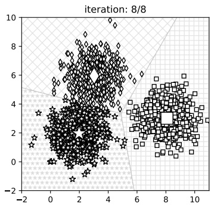

(a)

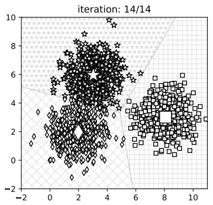

(b)

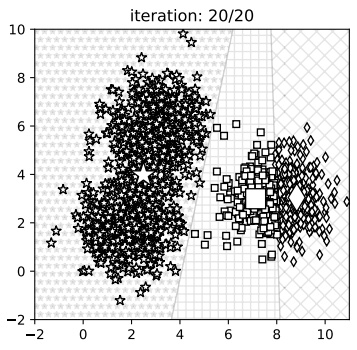

(c)

Hình 10.10. Các giá trị khởi tạo ban đầu khác nhau dẫn đến các nghiệm khác nhau.

Hình 10.10 thể hiện các kết quả khác nhau khi các tâm cụm được khởi tạo khác nhau. Ta cũng thấy rằng trường hợp (a) và (b) cho kết quả tốt, trong khi kết quả thu được ở trường hợp (c) không thực sự tốt. Một điểm nữa có thể rút ra là số lượng vòng lặp tới khi thuật toán hội tụ cũng khác nhau. Trường hợp (a) và (b) cùng cho kết quả tốt nhưng (b) chạy trong thời gian gần gấp đôi. Một kỹ thuật giúp hạn chế nghiệm xấu như trường hợp (c) là chạy thuật toán phân cụm K-means nhiều lần với các tâm cụm được khởi tạo khác nhau và chọn ra lần chạy cho giá trị hàm mất mát thấp nhất<sup>28</sup>. Ngoài ra, có một vài thuật toán giúp chọn các tâm cụm ban đầu [KA04], Kmeans++ [AV07, BMV+12].

• Các cụm cần có số lượng điểm gần bằng nhau. Hình 10.11a minh hoạ kết quả khi các cụm có số điểm chênh lệch. Trong trường hợp này, nhiều điểm lẽ ra thuộc cụm hình vuông đã bị phân nhầm vào cụm hình sao.

• Các cụm cần có dạng hình tròn (cầu). Khi các cụm vẫn tuân theo phân phối chuẩn nhưng ma trận hiệp phương sai không tỉ lệ với ma trận đơn vị, các cụm sẽ không có dạng tròn (hoặc cầu trong không gian nhiều chiều). Khi đó, phân cụm K-means không hoạt động hiệu quả. Lý do chính là vì phân cụm K-means quyết định nhãn của một điểm dữ liệu dựa trên khoảng cách Euclid của nó tới các tâm. Trong trường hợp này, Gaussian mixture models (GMM) [Rey15] có thể cho kết quả tốt hơn<sup>29</sup>. Trong GMM, mỗi cụm được giả sử tuân theo một phân phối chuẩn với ma trận hiệp phương sai không nhất thiết tỉ lệ với ma trận đơn vị. Ngoài các tâm cụm, các ma trận hiệp phương sai cũng là các biến cần tối ưu trong GMM.

• Khi một cụm nằm trong cụm khác. Hình 10.12 là một ví dụ kinh điển về việc phân cụm K-means không làm việc. Một cách tự nhiên, chúng ta sẽ phân dữ liệu ra thành bốn cụm: mắt trái, mắt phải, miệng, xung quanh mặt. Nhưng vì mắt và miệng nằm trong khuôn mặt nên phân cụm K-means cho kết quả không

<small><span class="docvortex-page-footnote" data-block-type="page_footnote" style="color:#6b7280">28 KMeans – scikit-learn ([https://goo.gl/5KavVn](https://goo.gl/5KavVn)).</span></small>

<small><span class="docvortex-page-footnote" data-block-type="page_footnote" style="color:#6b7280">29 Đọc thêm: Gaussian mixture models – Wikipedia ([https://goo.gl/GzdauR](https://goo.gl/GzdauR)).</span></small>

<!-- page: 143 -->

chính xác. Với dữ liệu như trong ví dụ này, phân cụm spectral [VL07, NJW02] sẽ cho kết quả tốt hơn. Phân cụm spectral cũng coi các điểm gần nhau tạo thành một cụm, nhưng không giả sử về một tâm chung cho cả cụm. Phân cụm spectral được thực hiện dựa trên một đồ thị vô hướng với đỉnh là các điểm dữ liệu và cạnh được nối giữa các điểm gần nhau, mỗi cạnh được đánh trọng số là một hàm của khoảng cách giữa hai điểm.

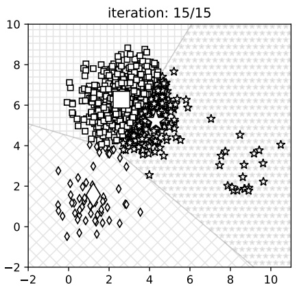

(a)

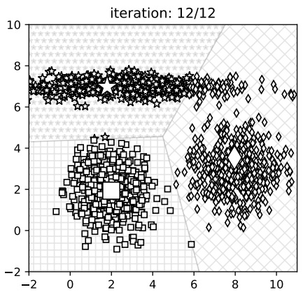

(b)

Hình 10.11. Phân cụm K-means hoạt động không thực sự tốt trong trường hợp các cụm có số lượng phần tử chênh lệch hoặc các cụm không có dạng hình tròn.

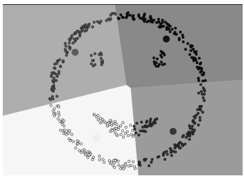

Hình 10.12. Một ví dụ về việc phân cụm K-means không hoạt động hiệu quả.

## 10.7.2. Các ứng dụng khác của phân cụm K-means

Mặc dù có những hạn chế, phân cụm K-means vẫn cực kỳ quan trọng trong machine learning và là nền tảng cho nhiều thuật toán phức tạp khác. Dưới đây là một vài ứng dụng khác của phân cụm K-means.

Cách thay một điểm dữ liệu bằng tâm cụm tương ứng là một trong số các kỹ thuật có tên chung là vector quantization – VQ [AM93]). Không chỉ được áp dụng trong nén dữ liệu, VQ còn được kết hợp với Bag-of-Words[LSP06] áp dụng rộng rãi trong các thuật toán xây dựng vector đặc trưng.

Ngoài ra, VQ cũng được áp dụng vào các bài toán tìm kiếm trong cơ sở dữ liệu lớn. Khi số điểm dữ liệu là rất lớn, việc tìm kiếm trở nên cực kỳ quan trọng.

<!-- page: 144 -->

Khó khăn chính của việc này là làm thế nào có thể tìm kiếm một cách nhanh chóng trong lượng dữ liệu khổng lồ đó. Ý tưởng cơ bản là sử dụng các thuật toán phân cụm để phân các điểm dữ liệu thành nhiều cụm nhỏ. Để tìm các điểm gần nhất của một điểm truy vấn, ta có thể tính khoảng cách giữa điểm này và các tâm cụm thay vì toàn bộ các điểm trong cơ sở dữ liệu. Bạn đọc có thể đọc thêm các bài báo nổi tiếng gần đây về vấn đề này: Product Quantization [JDS11], Cartesian k-means [NF13, JDJ17], Composite Quantization [ZDW14], Additive Quantization [BL14].

Mã nguồn cho chương này có thể được tìm thấy tại [https://goo.gl/QgW5f2](https://goo.gl/QgW5f2).

## 10.7.3. Đọc thêm

a. Clustering documents using k-means – scikit-learn ([https://goo.gl/y4xsy2](https://goo.gl/y4xsy2)).

b. Voronoi Diagram – Wikipedia ([https://goo.gl/v8WQEv](https://goo.gl/v8WQEv)).

c. Cluster centroid initialization algorithm for K-means clustering ([https://goo.gl/hBdody](https://goo.gl/hBdody)).

d. Visualizing K-Means Clustering ([https://goo.gl/ULbpUM](https://goo.gl/ULbpUM)).

e. Visualizing K-Means Clustering – Standford ([https://goo.gl/idzR2i](https://goo.gl/idzR2i)).

<!-- page: 145 -->

## Bộ phân loại naive Bayes

## 11.1. Bộ phân loại naive Bayes

Xét các bài toán phân loại với C nhãn khác nhau. Thay vì tìm ra chính xác nhãn của mỗi điểm dữ liệu $\mathbf { x } \in \mathbb { R } ^ { d }$ , ta có thể đi tìm xác suất để kết quả rơi vào mỗi nhãn: $p ( y   =   c | \mathbf { x } )$ , hoặc viết gọn thành $p ( c | \mathbf { x } )$ . Biểu thức này được hiểu là xác suất để đầu ra là nhãn c biết rằng đầu vào là vector x. Nếu tính được biểu thức này, ta có thể giúp xác định nhãn của mỗi điểm dữ liệu bằng cách chọn ra nhãn có xác suất rơi vào cao nhất:

$$
c = \underset {c \in \{1, \dots , C \}} {\operatorname{argmax}} p (c | \mathbf {x})\tag{11.1}
$$

Nhìn chung, khó có cách tính trực tiếp $p ( c | \mathbf { x } )$ . Thay vào đó, quy tắc Bayes thường được sử dụng:

$$
c = \underset {c} {\operatorname{argmax}} p (c | \mathbf {x}) = \underset {c} {\operatorname{argmax}} \frac {p (\mathbf {x} | c) p (c)}{p (\mathbf {x})} = \underset {c} {\operatorname{argmax}} p (\mathbf {x} | c) p (c)\tag{11.2}
$$

Dấu bằng thứ hai xảy ra theo quy tắc Bayes, dấu bằng thứ ba xảy ra vì $p ( \mathbf { x } )$ ở mẫu số không phụ thuộc vào c. Tiếp tục quan sát, $p ( c )$ có thể được hiểu là xác suất để một điểm bất kỳ rơi vào nhãn c. Nếu tập huấn luyện lớn, $p ( c )$ có thể được xác định bằng phương pháp ước lượng hợp lý cực đại (MLE) – là tỉ lệ giữa số điểm thuộc nhãn c và số điểm trong tập huấn luyện. Nếu tập huấn luyện nhỏ, giá trị này có thể được xác định bằng phương pháp ước lượng hậu nghiệm cực đại (MAP).

Thành phần còn lại $p ( \mathbf { x } | c )$ là phân phối của các điểm dữ liệu trong nhãn c. Thành phần này thường rất khó tính toán vì x là một biến ngẫu nhiên nhiều chiều. Để có thể ước lượng được phân phối đó, tập huấn luyện phải rất lớn. Nhằm đơn giản

<!-- page: 146 -->

hoá việc tính toán, người ta thường giả sử rằng các thành phần của biến ngẫu nhiên x độc lập với nhau khi đã biết c:

$$
p (\mathbf {x} | c) = p (x _ {1}, x _ {2}, \dots , x _ {d} | c) = \prod_ {i = 1} ^ {d} p (x _ {i} | c)\tag{11.3}
$$

Giả thiết các chiều của dữ liệu độc lập với nhau là quá chặt và trên thực tế, ít khi tìm được dữ liệu mà các thành phần hoàn toàn độc lập với nhau. Tuy nhiên, giả thiết ngây thơ (naive) này đôi khi mang lại những kết quả tốt bất ngờ. Giả thiết về sự độc lập của các chiều dữ liệu này được gọi là naive Bayes. Một phương pháp xác định nhãn của dữ liệu dựa trên giả thiết này có tên là phân loại naive Bayes (NBC).

Nhờ giả thiết độc lập, NBC có tốc độ huấn luyện và kiểm tra rất nhanh. Việc này rất quan trọng trong các bài toán với dữ liệu lớn.

Ở bước huấn luyện, các phân phối $p ( c )$ và $p ( x _ { i } | c ) , i = 1 , \ldots$ , d được xác định dựa vào dữ liệu huấn luyện. Việc xác định các giá trị này có thể được thực hiện bằng MLE hoặc MAP.

Ở bước kiểm tra, nhãn của một điểm dữ liệu mới x được xác đinh bởi

$$
c = \underset {c \in \{1, \dots , C \}} {\operatorname{argmax}} p (c) \prod_ {i = 1} ^ {d} p (x _ {i} | c).\tag{11.4}
$$

Khi d lớn và các xác suất nhỏ, biểu thức ở vế phải của (11.4) là một số rất nhỏ, khi tính toán có thể gặp sai số. Để giải quyết việc này, (11.4) thường được viết lại dưới dạng tương đương bằng cách lấy log của vế phải:

$$
c = \underset {c \in \{1, \dots , C \}} {\operatorname{argmax}} \left(\log (p (c)) + \sum_ {i = 1} ^ {d} \log (p (x _ {i} | c))\right).\tag{11.5}
$$

Việc này không ảnh hưởng tới kết quả vì log là một hàm đồng biến trên tập các số dương.

Sự đơn giản của NBC mang lại hiệu quả đặc biệt trong các bài toán phân loại văn bản, ví dụ bài toán lọc tin nhắn hoặc email rác. Trong phần sau của chương này, chúng ta cùng xây dựng một bộ lọc email rác tiếng Anh đơn giản. Cả quá trình huấn luyện và kiểm tra của NBC đều cực kỳ nhanh so với các phương pháp phân loại phức tạp khác. Việc giả sử các thành phần trong dữ liệu là độc lập với nhau khiến cho việc tính toán mỗi phân phối $p ( \mathbf { x } _ { i } | c )$ trở nên đơn giản.

Việc tính toán $p ( \mathbf { x } _ { i } | c )$ phụ thuộc vào loại dữ liệu. Có ba loại phân bố xác suất phổ biến là Gaussian naive Bayes, multinomial naive Bayes, và Bernoulli Naive. Chúng ta cùng xem xét từng loại.

<!-- page: 147 -->

## 11.2. Các phân phối thường dùng trong NBC

## 11.2.1. Gaussian naive Bayes

Mô hình này được sử dụng chủ yếu trong loại dữ liệu mà các thành phần là các biến liên tục. Với mỗi chiều dữ liệu i và một nhãn $c ,   x _ { i }$ tuân theo một phân phối chuẩn có kỳ vọng $\mu _ { c i }$ và phương sai $\sigma _ { c i } ^ { 2 }$

$$
p (x _ {i} | c) = p (x _ {i} | \mu_ {c i}, \sigma_ {c i} ^ {2}) = \frac {1}{\sqrt {2 \pi \sigma_ {c i} ^ {2}}} \exp \left(- \frac {(x _ {i} - \mu_ {c i}) ^ {2}}{2 \sigma_ {c i} ^ {2}}\right)\tag{11.6}
$$

Trong đó, bộ tham số $\theta = \{ \mu _ { c i } , \sigma _ { c i } ^ { 2 } \}$ được xác định bằng $\mathrm { M L E ^ { 3 0 } }$ dựa trên các điểm trong tập huấn luyện thuộc nhãn c.

## 11.2.2. Multinomial naive Bayes

Mô hình này chủ yếu được sử dụng trong bài toán phân loại văn bản mà vector đặc trưng được xây dựng dựa trên ý tưởng bag of words (BoW). Lúc này, mỗi văn bản được biểu diễn bởi một vector có độ dài d là số từ trong từ điển. Giá trị của thành phần thứ i trong mỗi vector là số lần từ thứ i xuất hiện trong văn bản đó. Khi đó, $p ( x _ { i } | c )$ tỉ lệ với tần suất từ thứ i (hay đặc trưng thứ i trong trường hợp tổng quát) xuất hiện trong các văn bản có nhãn c. Giá trị này có thể được tính bởi

$$
\lambda_ {c i} = p (x _ {i} | c) = \frac {N _ {c i}}{N _ {c}}.\tag{11.7}
$$

Trong đó:

$N _ { c i }$ là tổng số lần từ thứ i xuất hiện trong các văn bản của nhãn c. Nó chính là tổng tất cả thành phần thứ i của các vector đặc trưng ứng với nhãn c.

$N _ { c }$ là tổng số từ, kể cả lặp, xuất hiện trong nhãn c. Nói cách khác, Nc là tổng độ dài của tất cả các văn bản thuộc nhãn c. Có thể suy ra rằng $\begin{array} { r } { N _ { c } = \sum _ { i = 1 } ^ { d } N _ { c i } } \end{array}$ từ đó $\textstyle \sum _ { i = 1 } ^ { d } \lambda _ { c i } = 1$

Cách tính này có một hạn chế là nếu có một từ mới chưa bao giờ xuất hiện trong nhãn c thì biểu thức (11.7) sẽ bằng không, dẫn đến vế phải của (11.4) bằng không bất kể các giá trị còn lại lớn thế nào (xem thêm ví dụ ở mục sau). Để giải quyết việc này, một kỹ thuật được gọi là làm mềm Laplace (Laplace smoothing) được áp dụng:

$$
\hat {\lambda} _ {c i} = \frac {N _ {c i} + \alpha}{N _ {c} + d \alpha}\tag{11.8}
$$

với α là một số dương, thường bằng 1, để tránh trường hợp tử số bằng không. Mẫu số được cộng với dα để đảm bảo tổng xác suất $\textstyle \sum _ { i = 1 } ^ { d } { \hat { \lambda } } _ { c i } = 1$ . Như vậy, mỗi nhãn c được mô tả bởi một bộ các số dương có tổng bằng 1: $\hat { \lambda } _ { c } = \{ \hat { \lambda } _ { c 1 } , \dots , \hat { \lambda } _ { c d } \}$

<small><span class="docvortex-page-footnote" data-block-type="page_footnote" style="color:#6b7280">30 Xem ví dụ trang 71.</span></small>

<!-- page: 148 -->

## 11.2.3. Bernoulli Naive Bayes

Mô hình này được áp dụng cho các loại dữ liệu mà mỗi thành phần là một giá trị nhị phân – bằng 0 hoặc 1. Ví dụ, cũng với loại văn bản nhưng thay vì đếm tổng số lần xuất hiện của một từ trong văn bản, ta chỉ cần quan tâm từ đó có xuất hiện hay không.

Khi đó, $p ( x _ { i } | c )$ được tính bởi

$$
p (x _ {i} | c) = p (i | c) ^ {x _ {i}} (1 - p (i | c)) ^ {1 - x _ {i}}\tag{11.9}
$$

với $p ( i | c )$ được hiểu là xác suất từ thứ i xuất hiện trong các văn bản của class c, $x _ { i }$ bằng 1 hoặc 0 tuỳ vào việc từ thứ i có xuất hiện hay không.

## 11.3. Ví dụ

## 11.3.1. Bắc hay Nam

Giả sử trong tập huấn luyện có các văn bản d1, d2, d3, d4 như trong Bảng 11.1. Mỗi văn bản này thuộc vào một trong hai nhãn: B (Bắc) hoặc N (Nam). Hãy xác định nhãn của văn bản d5.

Bảng 11.1: Ví dụ về nội dung của các văn bản trong bài toán Bắc hay Nam

| Văn bả | n Nội dung | Nhãn |
| --- | --- | --- |
| d1 | hanoi pho chaolong hanoi | B |
| d2 | hanoi buncha pho omai | B |
| Dữ liệu huấn luyện |  |  |
| d3 | pho banhgio omai | B |
| d4 | saigon hutiu banhbo pho | N |
| Dữ liệu kiểm tra d5 | hanoi hanoi buncha hutiu | ? |

Ta có thể dự đoán rằng d5 có nhãn Bắc.

Bài toán này có thể được giải quyết bằng NBC sử dụng multinomial Naive Bayes hoặc Bernoulli naive Bayes. Chúng ta sẽ cùng làm ví dụ với mô hình thứ nhất và triển khai code cho cả hai mô hình. Việc mô hình nào tốt hơn phụ thuộc vào mỗi bài toán. Ta có thể thử cả hai để chọn ra mô hình tốt hơn.

Nhận thấy rằng ở đây có hai nhãn B và N, ta cần đi tìm p(B) và $p ( \mathrm { N } )$ dựa trên tần số xuất hiện của mỗi nhãn trong tập huấn luyện. Ta có

$$
p (\mathrm{B}) = \frac {3}{4}, \qquad p (\mathrm{N}) = \frac {1}{4}.\tag{11.10}
$$

Tập hợp toàn bộ các từ trong tập huấn luyện là

V = {hanoi, pho, chaolong, buncha, omai, banhgio, saigon, hutiu, banhbo}

<!-- page: 149 -->

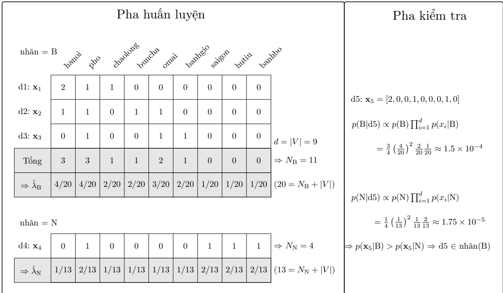

Hình 11.1. Minh hoạ NBC với Multinomial naive Bayes cho bài toán Bắc hay Nam.

Tổng cộng số phần tử trong từ điển là $| V | = 9$

Hình 11.1 minh hoạ quá trình huấn luyện và kiểm tra cho bài toán này khi sử dụng Multinomial naive Bayes, trong đó làm mềm Laplace được sử dụng với $\alpha = 1$ . Chú $\acute { \mathrm { y } } ,$ hai giá trị tìm được $1 . 5 \times 1 0 ^ { - 4 } \mathrm { v \AA } 1 . 7 5 \times 1 0 ^ { - 5 }$ không phải là hai xác suất cần tìm mà là hai đại lượng tỉ lệ thuận với hai xác suất đó. Để tính cụ thể, ta có thể làm như sau:

$$
p (\mathrm{B} | \mathrm{d} 5) = \frac {1 . 5 \times 1 0 ^ {- 4}}{1 . 5 \times 1 0 ^ {- 4} + 1 . 7 5 \times 1 0 ^ {- 5}} \approx 0. 8 9 5 5, \quad p (\mathrm{N} | \mathrm{d} 5) = 1 - p (\mathrm{B} | \mathrm{d} 5) \approx 0. 1 0 4 5.
$$

Như vậy xác suất để d5 có nhãn B là 89.55%, có nhãn N là 10.45%. Bạn đọc có thể tự tính với ví dụ khác: $\mathrm { d 6 = p h o }$ hutiu banhbo. Nếu tính toán đúng, ta sẽ thu được

$$
p (\mathrm{B} | \mathrm{d} 6) \approx 0. 2 9, \quad p (\mathrm{N} | \mathrm{d} 6) \approx 0. 7 1,
$$

và suy ra d6 thuộc vào class N.

## 11.3.2. Bộ phân loại naive Bayes với thư viện scikit-learn

Để kiểm tra lại các phép tính phía trên, chúng ta cùng giải quyết bài toán này bằng scikit-learn. Ở đây, dữ liệu huấn luyện và kiểm tra đã được đưa về dạng vector đặc trưng sử dụng BoW.

<!-- page: 150 -->

Chương 11. Bộ phân loại naive Bayes

```python
from __future__ import print_function
from sklearn.naive_bayes import MultinomialNB
import numpy as np
# train data
d1 = [2, 1, 1, 0, 0, 0, 0, 0, 0]
d2 = [1, 1, 0, 1, 1, 0, 0, 0, 0]
d3 = [0, 1, 0, 0, 1, 1, 0, 0, 0]
d4 = [0, 1, 0, 0, 0, 0, 1, 1, 1]
train_data = np.array([d1, d2, d3, d4])
label = np.array(['B', 'B', 'B', 'N'])
# test data
d5 = np.array([[2, 0, 0, 1, 0, 0, 0, 1, 0]])
d6 = np.array([[0, 1, 0, 0, 0, 0, 0, 1, 1]])
## call MultinomialNB
model = MultinomialNB()
# training
model.fit(train_data, label)

# test
print('Predicting class of d5:', str(model.predict(d5)[0]))
print('Probability of d6 in each class:', model.predict_proba(d6))
```

Kết quả:

```txt
Predicting class of d5: B
Probability of d6 in each class: [[ 0.29175335  0.70824665]]
```

Kết quả này nhất quán với những kết quả được tính bằng tay ở trên.

Nếu sử dụng Bernoulli naive Bayes, chúng ta cần thay đổi một chút về feature vector. Lúc này, các giá trị khác không sẽ đều được đưa về một vì ta chỉ quan tâm đến việc từ đó có xuất hiện trong văn bản hay không.

```python
from __future__ import print_function
from sklearn.naive_bayes import BernoulliNB
import numpy as np
# train data
d1 = [1, 1, 1, 0, 0, 0, 0, 0, 0]
d2 = [1, 1, 0, 1, 1, 0, 0, 0, 0]
d3 = [0, 1, 0, 0, 1, 1, 0, 0, 0]
d4 = [0, 1, 0, 0, 0, 0, 1, 1, 1]
train_data = np.array([d1, d2, d3, d4])
label = np.array(['B', 'B', 'B', 'N']) # 0 - B, 1 - N
# test data
d5 = np.array([[1, 0, 0, 1, 0, 0, 0, 1, 0]])
d6 = np.array([[0, 1, 0, 0, 0, 0, 0, 1, 1]])
## call MultinomialNB
model = BernoulliNB()
# training
model.fit(train_data, label)
# test
print('Predicting class of d5:', str(model.predict(d5)[0]))
print('Probability of d6 in each class:', model.predict_proba(d6))
```

<!-- page: 151 -->

Kết quả:

```txt
Predicting class of d5: B
Probability of d6 in each class: [[ 0.16948581  0.83051419]]
```

Ta thấy rằng, với bài toán nhỏ này, cả hai mô hình đều cho kết quả giống nhau (xác suất tìm được khác nhau nhưng không ảnh hưởng tới quyết định cuối cùng).

## 11.3.3. Bộ phân loại naive Bayes cho bài toán lọc email rác

Tiếp theo, chúng ta cùng làm việc với một bộ cơ sở dữ liệu lớn hơn<sup>31</sup>. Trong ví dụ này, dữ liệu đã được xử lý, và là một tập con của cơ sở dữ liệu Ling-Spam dataset ([https://goo.gl/whHCd9](https://goo.gl/whHCd9)).

Tập dữ liệu này bao gồm 960 email tiếng Anh, được tách thành tập huấn luyện và tập kiểm tra theo tỉ lệ 700:260 với 50% trong mỗi tập là các email rác.

Dữ liệu ở đây đã được tiền xử lý. Các quy tắc xử lý như sau<sup>32</sup>:

• Loại bỏ stop words: Những từ xuất hiện thường xuyên như ‘and’, ‘the’, ‘of’,... được loại bỏ vì chúng xuất hiện ở cả hai nhãn.

• Lemmatization: Những từ có cùng gốc được đưa về cùng loại. Ví dụ, ‘include’, ‘includes’, ‘included’ đều được đưa chung về ‘include’. Tất cả các từ cũng đã được đưa về dạng ký tự thường.

• Loại bỏ non-words: chữ số, dấu câu và các ký tự đặc biệt đã được loại bỏ.

Dưới đây là một ví dụ của một email bình thường trước khi được xử lý:

```txt
Subject: Re: 5.1344 Native speaker intuitions
The discussion on native speaker intuitions has been extremely interesting, but I worry that my brief intervention may have muddied the waters. I take it that there are a number of separable issues. The first is the extent to which a native speaker is likely to judge a lexical string as grammatical or ungrammatical per se. The second is concerned with the relationships between syntax and interpretation (although even here the distinction may not be entirely clear cut).
```

<small><span class="docvortex-page-footnote" data-block-type="page_footnote" style="color:#6b7280">31 Dữ liệu trong ví dụ này được lấy từ Exercise 6: Naive Bayes – Machine Learning, Andrew Ng ([https://goo.gl/kbzR3d](https://goo.gl/kbzR3d)).</span></small>

<small><span class="docvortex-page-footnote" data-block-type="page_footnote" style="color:#6b7280">32 sử dụng thư viện NLTK ([http://www.nltk.org/](http://www.nltk.org/))</span></small>

<!-- page: 152 -->

và sau khi được xử lý:

```txt
re native speaker intuition discussion native speaker intuition extremely interest worry brief intervention muddy waters number separable issue first extent native speaker likely judge lexical string grammatical ungrammatical per se second concern relationship between syntax interpretation although even here distinction entirely clear cut
```

Dưới đây là một ví dụ về email rác sau khi được xử lý:

```txt
financial freedom follow financial freedom work ethic extraordinary desire earn least per month work home special skills experience required train personal support need ensure success legitimate homebased income opportunity put back control finance life ve try opportunity past fail live promise
```

Các từ ‘financial’, ‘extraordinary’, ‘earn’, ‘opportunity’,... là những từ thường thấy trong các email rác.

Trong ví dụ này, chúng ta sẽ sử dụng multinomial naive Bayes.

Để bài toán được đơn giản, chúng ta sẽ sử dụng dữ liệu đã được xử lý, có thể tải về tại [https://goo.gl/CSMxHU](https://goo.gl/CSMxHU). Thư mục sau khi giải nén bao gồm các file:

```ignorefile
test-features.txt
test-labels.txt
train-features-50.txt
train-features-100.txt
train-features-400.txt
train-features.txt
train-labels-50.txt
train-labels-100.txt
train-labels-400.txt
train-labels.txt
```

tương ứng với các file chứa dữ liệu của tập huấn luyện và tập kiểm tra. File train −features−50.txt chứa dữ liệu của tập huấn luyện thu gọn với chỉ tổng cộng 50 email. Mỗi file labels.txt chứa nhiều dòng, mỗi dòng là một ký tự 0 hoặc 1 thể hiện email là thường hay rác.

Mỗi file features.txt chứa nhiều dòng, mỗi dòng có ba số, chẳng hạn:

```txt
1 564 1
1 19 2
```

Trong đó, số đầu tiên là chỉ số của email, bắt đầu từ 1; số thứ hai là thứ tự của từ trong từ điển (tổng cộng 2500 từ); số thứ ba là tần xuất của từ đó trong email đang xét. Dòng đầu tiên nói rằng trong email thứ nhất, từ thứ 564 trong từ điển

<!-- page: 153 -->

xuất hiện một lần. Cách lưu dữ liệu này giúp tiết kiệm bộ nhớ vì các email chỉ chứa một lượng nhỏ các từ trong từ điển.

Nếu biểu diễn mỗi email bằng một vector hàng có độ dài bằng độ dài từ điển (2500) thì dòng thứ nhất nói rằng đặc trưng thứ 564 của vector này bằng 1. Tương tự, đặc trưng thứ 19 của vector này bằng 2. Nếu không xuất hiện, các thành phần khác được hiểu bằng 0. Dựa trên các thông tin này, ta có thể tiến hành lập trình với thư viện sklearn.

Khai báo thư viện và đường dẫn tới files:

```python
from __future__ import print_function
import numpy as np
from scipy.sparse import coo_matrix # for sparse matrix
from sklearn.naive_bayes import MultinomialNB, BernoulliNB
from sklearn.metrics import accuracy_score # for evaluating results
# data path and file name
path = 'ex6DataPrepared/'
train_data_fn = 'train-features.txt'
test_data_fn = 'test-features.txt'
train_label_fn = 'train-labels.txt'
test_label_fn = 'test-labels.txt'
```

Tiếp theo ta cần viết hàm số đọc dữ liệu từ file data\_fn với nhãn tương ứng được lưu trong file label\_fn. Chú ý rằng số lượng từ trong từ điển là 2500.

Dữ liệu được lưu trong một ma trận mà mỗi hàng là một vector đặc trưng của email. Đây là một ma trận thưa nên ta sử dụng hàm [scipy.sparse.coo\_matrix](https://docs.scipy.org/doc/scipy/reference/generated/scipy.sparse.coo_matrix.html).

```python
nwords = 2500

def read_data(data_fn, label_fn):
    ## read label_fn
    with open(path + label_fn) as f:
        content = f.readlines()
    label = [int(x.strip()) for x in content]
    ## read data_fn
    with open(path + data_fn) as f:
        content = f.readlines()
    # remove '\n' at the end of each line
    content = [x.strip() for x in content]
    dat = np.zeros((len(content), 3), dtype = int)
    for i, line in enumerate(content):
        a = line.split(' ')
        dat[i, :] = np.array([int(a[0]), int(a[1]), int(a[2])])

    # remember to -1 at coordinate since we're in Python
    data = coo_matrix((dat[:, 2], (dat[:, 0] - 1, dat[:, 1] - 1)),\shape=(len(label), nwords))
    return (data, label)
```

<!-- page: 154 -->

Đoạn code dưới đây giúp lấy dữ liệu huấn luyện và kiểm tra, sau đó sử dụng MultinomialNB để phân loại.

```python
(train_data, train_label) = read_data(train_data_fn, train_label_fn)
(test_data, test_label) = read_data(test_data_fn, test_label_fn)

clf = MultinomialNB()
clf.fit(train_data, train_label)

y_pred = clf.predict(test_data)
print('Training size = %d, accuracy = %.2f%%' % \
(train_data.shape[0],accuracy_score(test_label, y_pred)*100))
```

Kết quả:

```txt
Training size = 700, accuracy = 98.08%
```

Như vậy, có tới 98.08% email được phân loại đúng. Chúng ta tiếp tục thử với các tập huấn luyện nhỏ hơn:

```python
train_data_fn = 'train-features-100.txt'
train_label_fn = 'train-labels-100.txt'
test_data_fn = 'test-features.txt'
test_label_fn = 'test-labels.txt'

(train_data, train_label) = read_data(train_data_fn, train_label_fn)
(test_data, test_label) = read_data(test_data_fn, test_label_fn)
clf = MultinomialNB()
clf.fit(train_data, train_label)
y_pred = clf.predict(test_data)
print('Training size = %d, accuracy = %.2f%%' % \
(train_data.shape[0],accuracy_score(test_label, y_pred)*100))

train_data_fn = 'train-features-50.txt'
train_label_fn = 'train-labels-50.txt'
test_data_fn = 'test-features.txt'
test_label_fn = 'test-labels.txt'

(train_data, train_label) = read_data(train_data_fn, train_label_fn)
(test_data, test_label) = read_data(test_data_fn, test_label_fn)
clf = MultinomialNB()
clf.fit(train_data, train_label)
y_pred = clf.predict(test_data)
print('Training size = %d, accuracy = %.2f%%' % \
(train_data(shape[0],accuracy_score(test_label, y_pred)*100))
```

Kết quả:

```txt
Training size = 100, accuracy = 97.69%
Training size = 50, accuracy = 97.31%
```

<!-- page: 155 -->

Ta thấy rằng thậm chí khi tập huấn luyện là rất nhỏ, chỉ có tổng cộng 50 email, kết quả đạt được đã rất ấn tượng.

Nếu bạn muốn tiếp tục thử mô hình BernoulliNB:

```python
clf = BernoulliNB(binarize = .5)
clf.fit(train_data, train_label)
y_pred = clf.predict(test_data)
print('Training size = %d, accuracy = %.2f%%' % \
    (train_data.shape[0],accuracy_score(test_label, y_pred)*100))
```

Kết quả:

```txt
Training size = 50, accuracy = 69.62%
```

Ta thấy rằng trong bài toán này, MultinomialNB hoạt động hiệu quả hơn.

## 11.4. Thảo luận

## 11.4.1. Tóm tắt

• Bộ phân loại Naive Bayes (NBC) thường được sử dụng trong các bài toán phân loại văn bản.

• NBC có thời gian huấn luyện và kiểm tra rất nhanh. Điều này có được là do giả sử về tính độc lập giữa các thành phần.

• Nếu giả sử về tính độc lập được thoả mãn (dựa vào bản chất của dữ liệu), NBC được cho là sẽ có kết quả tốt hơn so với SVM (Phần VIII) và hồi quy logistic (Chương 14) khi có ít dữ liệu huấn luyện.

• NBC có thể hoạt động với các vector đặc trưng mà một phần là liên tục (sử dụng Gaussian naive Bayes), phần còn lại ở dạng rời rạc (sử dụng multinomial hoặc Bernoulli). Sự độc lập giữa các đặc trưng khiến NBC có khả năng này.

• Làm mềm Laplace được sử dụng để tránh trường hợp một từ trong tập kiểm tra chưa xuất hiện trong tập huấn luyện.

• Mã nguồn trong chương này có thể được tìm thấy tại [https://goo.gl/yUR55o](https://goo.gl/yUR55o).

## 11.4.2. Đọc thêm

a. Text Classification and Naive Bayes - Stanford ([https://goo.gl/HcefLX](https://goo.gl/HcefLX)).

b. 6 Easy Steps to Learn Naive Bayes Algorithm (with code in Python) ([https://goo.gl/odQaaY](https://goo.gl/odQaaY)).

<!-- page: 156 -->

<!-- page: 157 -->

Mạng neuron nhân tạo

<!-- page: 158 -->

# Gradient descent

## 12.1. Giới thiệu

Xét một hàm số $f : \mathbb { R } ^ { d } \rightarrow \mathbb { R }$ với tập xác định D,

• Điểm $\mathbf { x } ^ { * } \in \mathcal { D }$ được gọi là cực tiểu toàn cục (tương ứng cực đại toàn cục) nếu $f ( \mathbf { x } ) \geq f ( \mathbf { x } ^ { * } )$ (tương ứng $f ( \mathbf { x } ) \leq f ( \mathbf { x } ^ { * } ) )$ với mọi x trong tập xác định D. Các điểm cực tiểu toàn cục và cực đại toàn cục được gọi chung là cực trị toàn cục.

• Điểm $\mathbf { x } ^ { * } \in \mathcal { D }$ được gọi là cực tiểu địa phương (tương ứng cực đại địa phương) nếu tồn tại $\varepsilon   >   0$ sao cho $f ( \mathbf { x } )   \geq   f ( \mathbf { x } ^ { * } )$ (tương ứng $f ( \mathbf { x } )   \leq   f ( \mathbf { x } ^ { * } ) )$ với mọi x nằm trong lân cận $\mathcal { V } ( \varepsilon )   =   \{ \mathbf { x }   :   \mathbf { x }   \in   \mathcal { D } , d ( \mathbf { x } , \mathbf { x } ^ { * } )   \leq   \varepsilon \}$ . Ở đây $d ( \mathbf { x } , \mathbf { x } ^ { * } )$ ký hiệu khoảng cách giữa hai vector x và $\mathbf { x } ^ { * }$ , thường là khoảng cách Euclid. Các điểm cực tiểu địa phương và cực đại địa phương được gọi chung là cực trị địa phương. Các điểm cực tiểu/cực đại/cực trị toàn cục cũng là các điểm cực tiểu/cực đại/cực trị địa phương.

Giả sử ta đang quan tâm đến một hàm liên tục một biến có đạo hàm mọi nơi, xác định trên R. Cùng nhắc lại một vài điểm cơ bản:

• Điểm cực tiểu địa phương $x ^ { * }$ của hàm số là điểm có đạo hàm $f ^ { \prime } ( x ^ { * } )$ bằng không. Hơn nữa, trong lân cận của nó, đạo hàm của các điểm phía bên trái $x ^ { * }$ là không dương, đạo hàm của các điểm phía bên phải $x ^ { * }$ là không âm.

• Đường tiếp tuyến với đồ thị hàm số đó tại một điểm bất kỳ có hệ số góc bằng đạo hàm của hàm số tại điểm đó.

Hình 12.1 mô tả sự biến thiên của hàm số $f ( x ) = { \textstyle { \frac { 1 } { 2 } } } ( x - 1 ) ^ { 2 } - 2$ . Điểm $x ^ { * } = 1$ là một điểm cực tiểu toàn cục của hàm số này. Các điểm bên trái của $\mathbf { x } ^ { * }$ có đạo

<!-- page: 159 -->

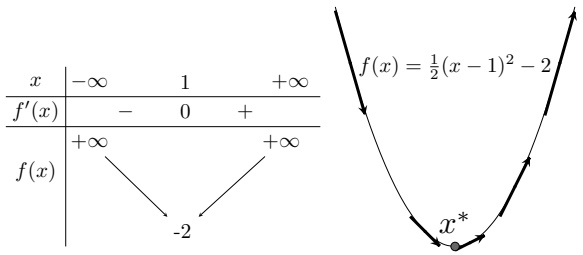

Hình 12.1. Khảo sát sự biến thiên của một đa thức bậc hai.

hàm âm, các điểm bên phải có đạo hàm dương. Với hàm số này, càng xa về phía trái của $\mathbf { x } ^ { * }$ thì đạo hàm càng âm, càng xa về phía phải thì đạo hàm càng dương.

Trong machine learning nói riêng và toán tối ưu nói chung, chúng ta thường xuyên phải tìm các cực tiểu toàn cục của một hàm số. Nếu chỉ xét riêng các hàm khả vi, việc giải phương trình đạo hàm bằng không có thể phức tạp hoặc có vô số nghiệm. Thay vào đó, người ta thường tìm các điểm cực tiểu địa phương, và coi đó là một nghiệm cần tìm của bài toán trong những trường hợp nhất định.

Các điểm cực tiểu địa phương là nghiệm của phương trình đạo hàm bằng không (ta vẫn đang giả sử rằng các hàm này liên tục và khả vi). Nếu tìm được toàn bộ (hữu hạn) các điểm cực tiểu địa phương, ta chỉ cần thay từng điểm đó vào hàm số để suy ra điểm cực tiểu toàn cục. Tuy nhiên, trong hầu hết các trường hợp, việc giải phương trình đạo hàm bằng không là bất khả thi. Nguyên nhân có thể đến từ sự phức tạp của đạo hàm, từ việc các điểm dữ liệu có số chiều lớn hoặc từ việc có quá nhiều điểm dữ liệu. Thực tế cho thấy, trong nhiều bài toán machine learning, các điểm cực tiểu địa phương thường cho kết quả tốt, đặc biệt là trong các mạng neuron nhân tạo.

Một hướng tiếp cận phổ biến để giải quyết các bài toán tối ưu là dùng một phép toán. Đầu tiên, chọn một điểm xuất phát rồi tiến dần đến đích sau mỗi vòng lặp. Gradient descent (GD) và các biến thể của nó là một trong những phương pháp được dùng nhiều nhất.

Chú ý : Khái niệm nghiệm của một bài toán tối ưu được sử dụng không hẳn để chỉ cực tiểu toàn cục. Nó được sử dụng theo nghĩa là kết quả của quá trình tối ưu. Kết quả ở một vòng lặp trung gian được gọi là vị trí của nghiệm. Nói cách khác, nghiệm có thể được hiểu là giá trị hiện tại của tham số cần tìm trong quá trình tối ưu.

## 12.2. Gradient descent cho hàm một biến

Xét các hàm số một biến $f : \mathbb { R } \to \mathbb { R }$ . Quay trở lại Hình 12.1 và một vài quan sát đã nêu. Giả sử $x _ { t }$ là điểm tìm được sau vòng lặp thứ t. Ta cần tìm một thuật toán $\mathrm { d } \hat { \mathrm { e } }$ đưa $x _ { t }$ về càng gần $x ^ { * }$ càng tốt. Có hai quan sát sau đây:

<!-- page: 160 -->

• Nếu đạo hàm của hàm số tại $x _ { t }$ là dương $( f ^ { \prime } ( x _ { t } ) > 0 )$ thì $x _ { t }$ nằm về bên phải so với $x ^ { * }$ , và ngược lại. Để điểm tiếp theo $x _ { t + 1 }$ gần với $x ^ { * }$ hơn, ta cần di chuyển $x _ { t }$ về bên trái, tức về phía âm. Nói các khác, ta cần di chuyển $x _ { t }$ ngược dấu với đạo hàm:

$$
x _ {t + 1} = x _ {t} + \varDelta .\tag{12.1}
$$

Trong đó $\varDelta$ là một đại lượng ngược dấu với đạo hàm $f ^ { \prime } ( x _ { t } )$

$x _ { t }$ càng xa $x ^ { * }$ về bên phải thì $f ^ { \prime } ( x _ { t } )$ càng lớn (và ngược lại). Một cách tự nhiên nhất, ta chọn lượng di chuyển $\varDelta$ tỉ lệ thuận với $- f ^ { \prime } ( x _ { t } )$

Từ hai nhận xét trên, ta có công thức cập nhật đơn giản là

$$
\boxed {x _ {t + 1} = x _ {t} - \eta f ^ {\prime} (x _ {t})}\tag{12.2}
$$

Trong đó η là một số dương được gọi là tốc độ học (learning rate). Dấu trừ thể hiện việc $x _ { t }$ cần đi ngược với đạo hàm $f ^ { \prime } ( x _ { t } )$ . Tên gọi gradient descent xuất phát từ đây<sup>33</sup>. Mặc dù các quan sát này không đúng trong mọi trường hợp, chúng vẫn là nền tảng cho rất nhiều phương pháp tối ưu.

## 12.2.1. Ví dụ đơn giản với Python

Xét hàm số $f ( x ) = x ^ { 2 } + 5 \sin ( x )$ với đạo hàm $f ^ { \prime } ( x ) = 2 x + 5 \cos ( x )$ . Giả sử xuất phát từ một điểm $x _ { 0 }$ , quy tắc cập nhật tại vòng lặp thứ t là

$$
x _ {t + 1} = x _ {t} - \eta (2 x _ {t} + 5 \cos (x _ {t})).\tag{12.3}
$$

Khi thực hiện trên Python, ta cần viết các hàm $\mathrm { s } \hat { \mathrm { o } } ^ { 3 4 }$

a. grad để tính đạo hàm.

b. cost để tính giá trị của hàm số. Ta không sử dụng hàm này trong thuật toán cập nhật nghiệm. Tuy nhiên, nó vẫn đóng vai trò quan trọng trong việc kiểm tra tính chính xác của đạo hàm và sự biến thiên của hàm số sau mỗi vòng lặp.

c. myGD1 là phần chính thực hiện thuật toán GD. Đầu vào của hàm số này là điểm xuất phát x0 và tốc độ học eta. Đầu ra là nghiệm của bài toán. Thuật toán dừng lại khi đạo hàm đủ nhỏ.

```python
def grad(x):
    return 2*x+ 5*np.cos(x)

def cost(x):
    return x**2 + 5*np.sin(x)
```

<small><span class="docvortex-page-footnote" data-block-type="page_footnote" style="color:#6b7280">33 Descent nghĩa là đi ngược</span></small>

<small><span class="docvortex-page-footnote" data-block-type="page_footnote" style="color:#6b7280">34 Giả sử rằng các thư viện đã được khai báo đầy đủ</span></small>

<!-- page: 161 -->

```python
def myGD1(x0, eta):
    x = [x0]
    for it in range(100):
        x_new = x[-1] - eta*grad(x[-1])
        if abs(grad(x_new)) < 1e-3: # just a small number
            break
        x.append(x_new)
    return (x, it)
```

## Điểm xuất phát khác nhau

Sau khi đã có các hàm cần thiết, chúng ta thử tìm nghiệm với các điểm xuất phát khác nhau là $x _ { 0 } = - 5$ và $x _ { 0 } = 5$ với cùng tốc độ học $\eta = 0 . 1$

```txt
(x1, it1) = myGD1(-5, .1)
(x2, it2) = myGD1(5, .1)
print('Solution x1 = %f, cost = %f, after %d iterations'\
    %(x1[-1], cost(x1[-1]), it1))
print('Solution x2 = %f, cost = %f, after %d iterations'\
    %(x2[-1], cost(x2[-1]), it2))
```

Kết quả:

```txt
Solution x1 = -1.110667, cost = -3.246394, after 11 iterations
Solution x2 = -1.110341, cost = -3.246394, after 29 iterations
```

Như vậy, thuật toán trả về kết quả gần giống nhau với các điểm xuất phát khác nhau, nhưng tốc độ hội tụ khác nhau. Hình 12.2 và Hình 12.3 thể hiện vị trí của $x _ { t }$ và đạo hàm qua các vòng lặp với cùng tốc độ học $\eta = 0 . 1$ nhưng điểm xuất phát khác nhau tại −5 và 5.

Hình 12.2 tương ứng với $x _ { 0 } = - 5$ , thuật toán hội tụ nhanh hơn. Hơn nữa, đường đi tới đích khá suôn sẻ với đạo hàm luôn âm và trị tuyệt đối của đạo hàm nhỏ dần khi $x _ { t }$ tiến gần tới đích.

Hình 12.3 tương ứng với $x _ { 0 } = 5 ,$ đường đi của $x _ { t }$ chứa một khu vực có đạo hàm khá nhỏ gần điểm có hoành độ bằng 2.5. Điều này khiến thuật toán la cà ở đây khá lâu. Khi vượt qua được điểm này thì mọi việc diễn ra tốt đẹp. Các điểm không phải là điểm cực tiểu nhưng có đạo hàm gần bằng không rất dễ gây ra hiện tượng $x _ { t }$ bị bẫy vì đạo hàm nhỏ khiến nó không thay đổi nhiều ở vòng lặp tiếp theo. Chúng ta sẽ thấy một kỹ thuật khác giúp thuật toán thoát những chiếc bẫy này.

## Tốc độ học khác nhau

Tốc độ hội tụ của GD không những phụ thuộc vào điểm xuất phát mà còn phụ thuộc vào tốc độ học. Hình 12.4 và Hình 12.5 thể hiện vị trí của $x _ { t }$ qua các vòng

<!-- page: 162 -->

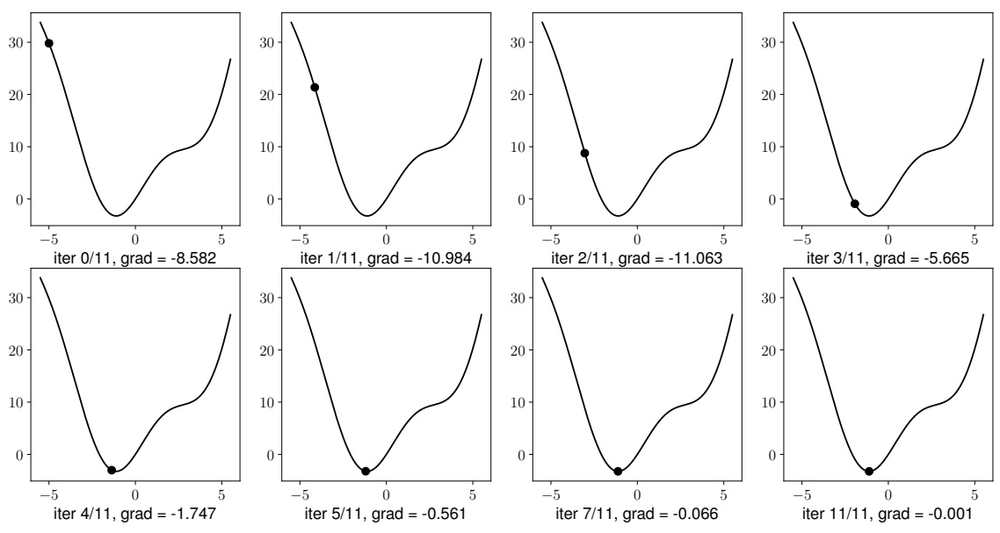

Hình 12.2. Kết quả tìm được qua các vòng lặp với $x _ { 0 } = - 5 , \eta = 0 . 1$

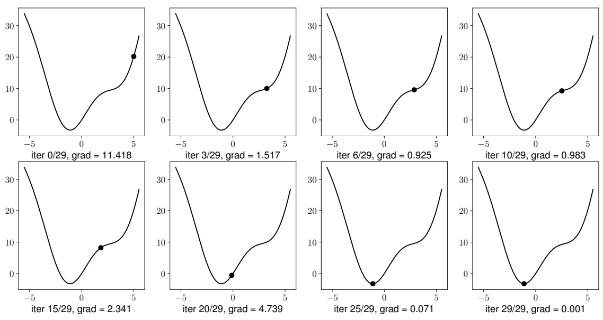

Hình 12.3. Kết quả tìm được qua các vòng lặp với $x _ { 0 } = 5 , \eta = 0 . 1$

lặp với cùng điểm xuất phát $x _ { 0 } = - 5$ nhưng tốc độ học khác nhau. Ta quan sát thấy hai điều:

• Với tốc độ học nhỏ $\eta = 0 . 0 1$ (Hình 12.4), tốc độ hội tụ rất chậm. Trong ví dụ này ta chọn tối đa 100 vòng lặp nên thuật toán dừng lại trước khi tới đích, mặc dù đã rất gần. Trong thực tế, khi việc tính toán trở nên phức tạp, tốc độ

<!-- page: 163 -->

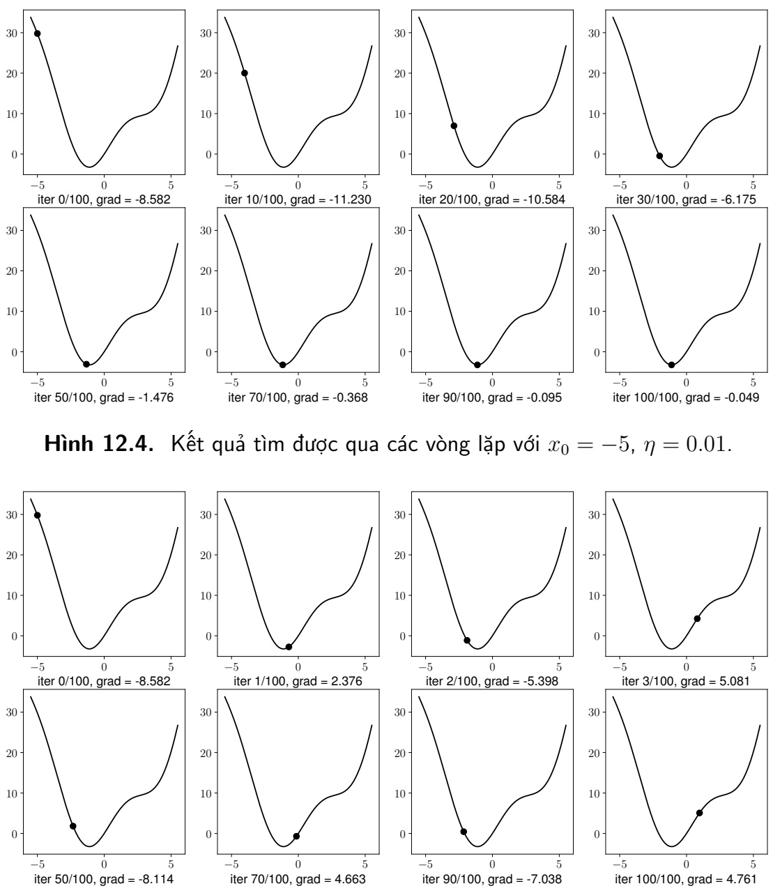

Hình 12.5. Kết quả tìm được qua các vòng lặp với $x _ { 0 } = - 5 , \eta = 0 . 5$

học quá thấp sẽ ảnh hưởng nhiều tới tốc độ của thuật toán. Thậm chí $x _ { t }$ có thể không bao giờ tới được đích.

• Với tốc độ học lớn $\eta = 0 . 5$ (Hình 12.5), $x _ { t }$ tiến nhanh tới gần đích sau vài vòng lặp. Tuy nhiên, thuật toán không hội tụ được vì sự thay đổi vị trí của $x _ { t }$ sau mỗi vòng lặp là quá lớn, khiến $x _ { t }$ dao động quanh đích nhưng không tới được đích.

<!-- page: 164 -->

Việc lựa chọn tốc độ học rất quan trọng. Tốc độ học thường được chọn thông qua các thí nghiệm. Ngoài ra, GD có thể làm việc hiệu quả hơn bằng cách chọn tốc độ học khác nhau ở mỗi vòng lặp. Trên thực tế, một kỹ thuật thường được sử dụng có tên là suy giảm tốc độ học (learning rate decay). Trong kỹ thuật này, tốc độ học được giảm đi sau một vài vòng lặp để nghiệm không bị dao động mạnh khi gần đích hơn.

## 12.3. Gradient descent cho hàm nhiều biến

Giả sử ta cần tìm cực tiểu toàn cục cho hàm f(θ) trong đó θ là tập hợp các tham số cần tối ưu. Gradient<sup>35</sup> của hàm số đó tại một điểm θ bất kỳ được ký hiệu là $\nabla _ { \theta } f ( \theta )$ Tương tự như hàm một biến, thuật toán GD cho hàm nhiều biến cũng bắt đầu bằng một điểm dự đoán $\theta _ { 0 } ,$ , sau đó sử dụng quy tắc cập nhật

$$
\boxed {\theta_ {t + 1} = \theta_ {t} - \eta \nabla_ {\theta} f (\theta_ {t})}\tag{12.4}
$$

Hoặc viết dưới dạng đơn giản hơn: $\theta \leftarrow \theta - \eta \nabla _ { \theta } f ( \theta )$

## Quay lại với bài toán hồi quy tuyến tính

Trong mục này, chúng ta quay lại với bài toán hồi quy tuyến tính và thử tối ưu hàm mất mát của nó bằng thuật toán GD.

Nhắc lại hàm mất mát của hồi quy tuyến tính và gradient theo w:

$$
\mathcal {L} (\mathbf {w}) = \frac {1}{2 N} \| \mathbf {y} - \mathbf {X} ^ {T} \mathbf {w} \| _ {2} ^ {2}; \quad \nabla_ {\mathbf {w}} \mathcal {L} (\mathbf {w}) = \frac {1}{N} \mathbf {X} (\mathbf {X} ^ {T} \mathbf {w} - \mathbf {y})\tag{12.5}
$$

## Ví dụ trên Python và một vài lưu ý khi lập trình

Trước tiên, chúng ta tạo 1000 điểm dữ liệu gần đường thẳng y = 4 + 3x rồi dùng thư viện scikit-learn để tìm nghiệm cho hồi quy tuyến tính:

```python
from sklearn.linear_model import LinearRegression
X = np.random.rand(1000)
y = 4 + 3 * X + .5*np.random.randn(1000) # noise added
model = LinearRegression()
model.fit(X.reshape(-1, 1), y.reshape(-1, 1))
w, b = model.coef_[0][0], model.intercept_[0]
sol_sklearn = np.array([b, w])
print(sol_sklearn)
```

Kết quả:

```json
Solution found by sklearn: [ 3.94323245  3.12067542]
```

<small><span class="docvortex-page-footnote" data-block-type="page_footnote" style="color:#6b7280">35 Với các biến nhiều chiều, chúng ta sẽ sử dụng gradient thay cho đạo hàm.</span></small>

<!-- page: 165 -->

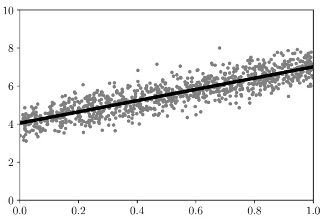

Hình 12.6. Nghiệm của bài toán hồi quy tuyến tính (đường thằng màu đen) tìm được bằng thư viện scikit-learn.

Các điểm dữ liệu và đường thẳng tìm được bằng hồi quy tuyến tính có phương trình y ≈ 3.94 + 3.12x được minh hoạ trong Hình 12.6. Nghiệm tìm này được rất gần với mong đợi.

Tiếp theo, ta sẽ thực hiện tìm nghiệm bằng GD. Ta cần viết hàm mất mát và gradient theo w. Chú ý rằng ở đây w đã bao gồm hệ số điều chỉnh b.

```python
def grad(w):
    N = Xbar.shape[0]
    return 1/N * Xbar.T.dot(Xbar.dot(w) - y)

def cost(w):
    N = Xbar.shape[0]
    return .5/N*np.linalg.norm(y - Xbar.dot(w))**2
```

Với các hàm phức tạp, chúng ta cần kiểm tra độ chính xác của gradient thông qua numerical gradient (xem Mục 2.6). Phần kiểm tra này xin giành lại cho bạn đọc. Dưới đây là thuật toán GD cho bài toán.

```python
def myGD(w_init, grad, eta):
    w = [w_init]
    for it in range(100):
        w_new = w[-1] - eta*grad(w[-1])
        if np.linalg.norm(grad(w_new))/len(w_new) < 1e-3:
            break
        w.append(w_new)
    return w, it

one = np.ones((X.shape[0],1))
Xbar = np.concatenate((one, X.reshape(-1, 1)), axis = 1)
w_init = np.array([[2], [1]])
w1, it1 = myGD(w_init, grad, 1)
print('Sol found by GD: w = ', w1[-1].T, ', after %d iterations.' %(it1+1))
```

Kết quả:

```txt
Sol found by GD: w = [ 3.99026984  2.98702942] , after 49 iterations.
```

<!-- page: 166 -->

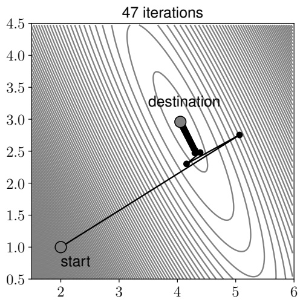

(a) η = 1.

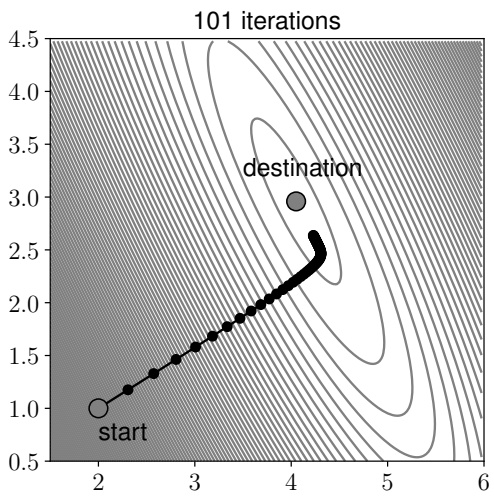

(b) η = 0.1.

Hình 12.7. Đường đi nghiệm của hồi quy tuyến tính với các tốc độ học khác nhau.

Thuật toán hội tụ tới kết quả khá gần với nghiệm tìm được theo scikit-learn sau 49 vòng lặp. Hình 12.7 mô tả đường đi của w với cùng điểm xuất phát nhưng tốc độ học khác nhau. Các điểm được đánh dấu ‘start’ là các điểm xuất phát. Các điểm được đánh dấu ‘destination’ là nghiệm tìm được bằng thư viện scikit-learn. Các điểm hình tròn nhỏ màu đen là vị trí của w qua các vòng lặp trung gian. Ta thấy rằng khi η = 1, thuật toán hội tụ tới rất gần đích theo thư viện sau 49 vòng lặp. Với tốc độ học nhỏ hơn, $\eta = 0 . 1$ , nghiệm vẫn còn cách xa đích sau hơn 100 vòng lặp. Như vậy, việc chọn tốc độ học hợp lý là rất quan trọng.

Ở đây, chúng ta cùng làm quen với một khái niệm quan trọng: đường đồng mức. Khái niệm này thường xuất hiện trong các bản đồ tự nhiên. Với các ngọn núi, đường đồng mức là các đường kín bao quanh đỉnh núi, bao gồm các điểm có cùng độ cao so với mực nước biển. Khái niệm tương tự cũng được sử dụng trong tối ưu. Đường đồng mức của một hàm số là tập hợp các điểm làm cho hàm số có cùng giá trị. Xét một hàm số hai biến với đồ thị là một bề mặt trong không gian ba chiều. Các đường đồng mức là giao điểm của bề mặt này với các mặt phẳng song song với đáy. Hàm mất mát của hồi quy tuyến tính với dữ liệu một chiều là một hàm bậc hai theo hai thành phần trong vector trọng số w. Đồ thị của nó là một bề mặt parabolic. Vì vậy, các đường đồng mức của hàm này là các đường ellipse có cùng tâm như trên Hình 12.7. Tâm này chính là đáy của parabolic và là giá trị nhỏ nhất của hàm mất mát. Các đường đồng mức càng gần tâm (’destination’) tương ứng với giá trị càng thấp.

<!-- page: 167 -->

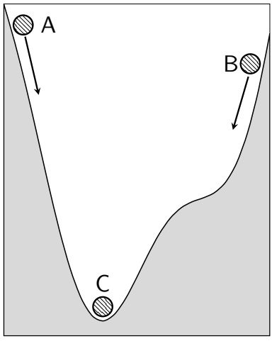

(a) GD

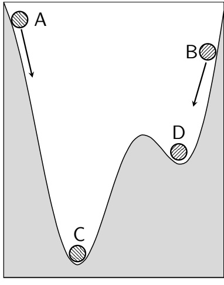

(b) GD

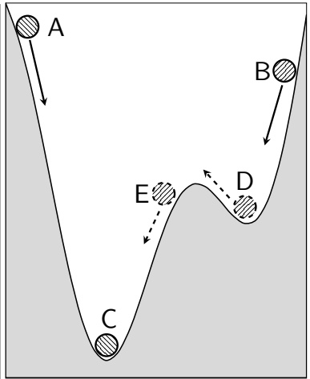

(c) GD với momentum

Hình 12.8. So sánh GD với các hiện tượng vật lý.

## 12.4. Gradient descent với momentum

Trước hết, nhắc lại thuật toán GD để tối ưu một hàm mất mát J(θ):

• Dự đoán một điểm xuất phát $\theta = \theta _ { 0 }$

• Cập nhật θ theo công thức

$$
\theta \leftarrow \theta - \eta \nabla_ {\theta} J (\theta)\tag{12.6}
$$

tới khi hội tụ. $\dot { \mathrm { O } }$ đây, $\nabla _ { \theta } J ( \theta )$ là gradient của hàm mất mát tại θ.

## Gradient dưới góc nhìn vật lý

Thuật toán GD thường được ví với tác dụng của trọng lực lên một hòn bi đặt trên một mặt có dạng thung lũng như Hình 12.8a. Bất kể ta đặt hòn bi ở A hay B thì cuối cùng nó cũng sẽ lăn xuống và kết thúc ở vị trí C.

Tuy nhiên, nếu bề mặt có hai đáy thung lũng như Hình 12.8b thì tùy vào việc đặt bi ở A hoặc B, vị trí cuối cùng tương ứng của bi sẽ ở C hoặc D (giả sử rằng ma sát đủ lớn và đà không mạnh để bi có thể vượt dốc). Điểm D là một điểm cực tiểu địa phương, điểm C là điểm cực tiểu toàn cục.

Vẫn trong Hình 12.8b, nếu vận tốc ban đầu của bi ở điểm B đủ lớn, nó vẫn có thể tiến tới dốc bên trái của D do có đà. Nếu vận tốc ban đầu lớn hơn nữa, bi có thể vượt dốc tới điểm E rồi lăn xuống C như trong Hình 12.8c. Dựa trên quan sát này, một thuật toán được ra đời nhằm giúp GD thoát được các cực tiểu địa phương. Thuật toán đó có tên là momentum (tức theo đà ).

<!-- page: 168 -->

## Gradient descent với momentum

## Làm thế nào để biểu diễn momentum dưới dạng toán học?

Trong GD, ta cần tính lượng thay đổi ở thời điểm t để cập nhật vị trí mới cho nghiệm (tức hòn bi). Nếu ta coi đại lượng này như vận tốc $v _ { t }$ trong vật lý, vị trí mới của hòn bi sẽ là $\theta _ { t + 1 } = \theta _ { t } - v _ { t }$ với giả sử rằng mỗi vòng lặp là một đơn vị thời gian. Dấu trừ thể hiện việc phải di chuyển ngược với gradient. Việc tiếp theo là tính đại lượng $v _ { t }$ sao cho nó vừa mang thông tin của độ dốc hiện tại (tức gradient), vừa mang thông tin của đà. Thông tin của đà có thể được hiểu là vận tốc trước đó $v _ { t - 1 }$ (với giả sử rằng vận tốc ban đầu $v _ { 0 } = 0 )$ . Một cách đơn giản nhất, ta có thể lấy tổng trọng số của chúng:

$$
\boxed {v _ {t} = \gamma v _ {t - 1} + \eta \nabla_ {\theta} J (\theta)}\tag{12.7}
$$

Trong đó $\gamma$ là một số dương nhỏ hơn một. Giá trị thường được chọn là khoảng 0.9, $v _ { t - 1 }$ là vận tốc tại thời điểm trước đó, $\nabla _ { \theta } J ( \theta )$ chính là độ dốc tại điểm hiện tại. Từ đó, ta có công thức cập nhật nghiệm:

$$
\boxed {\theta \leftarrow \theta - v _ {t} = \theta - \eta \nabla_ {\theta} J (\theta) - \gamma v _ {t - 1}}\tag{12.8}
$$

Sự khác nhau giữa GD thông thường và GD với momentem nằm ở thành phần cuối cùng trong (12.8). Thuật toán đơn giản này mang lại hiệu quả trong các bài toán thực tế.

Xét một hàm đơn giản có hai điểm cực tiểu địa phương, trong đó một điểm là cực tiểu toàn cục:

$$
f (x) = x ^ {2} + 1 0 \sin (x).\tag{12.9}
$$

Hàm số này có đạo hàm là $f ^ { \prime } ( x ) = 2 x + 1 0 \cos ( x )$ . Hình 12.9 thể hiện các vị trí trung gian của nghiệm khi không sử dụng momentum. Ta thấy rằng thuật toán hội tụ nhanh chóng sau chỉ bốn vòng lặp. Tuy nhiên, nghiệm đạt được không phải là cực tiểu toàn cục. Trong khi đó, Hình 12.10 thể hiện các vị trí trung gian của nghiệm khi có sử dụng momentum. Chúng ta thấy rằng hòn bi vượt được dốc thứ nhất nhờ có đà, theo quán tính tiếp tục vượt qua điểm cực tiểu toàn cục, nhưng trở lại điểm này sau 50 vòng lặp rồi chuyển động chậm dần quanh đó tới khi dừng hẳn ở vòng lặp thứ 100. Ví dụ này cho thấy momentum thực sự đã giúp nghiệm thoát được khu vực cực tiểu địa phương.

Nếu biết trước điểm xuất phát theta, gradient của hàm mất mát tại một điểm bất kỳ grad(theta), lượng thông tin lưu trữ từ vận tốc trước đó gamma và tốc độ học eta, chúng ta có thể viết hàm GD\_momentum như sau:

<!-- page: 169 -->

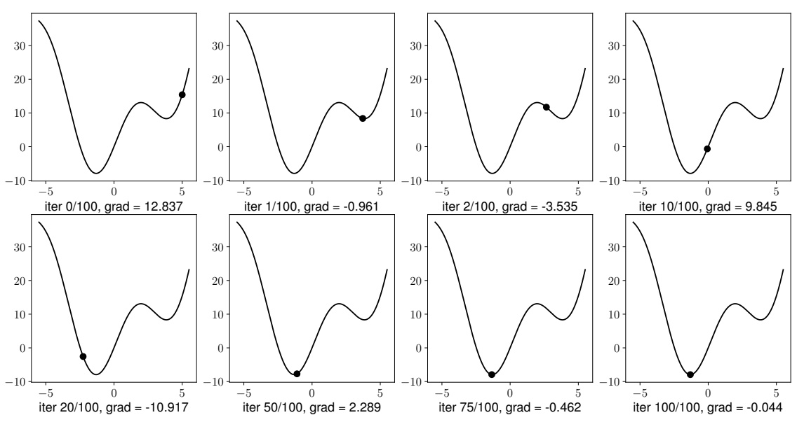

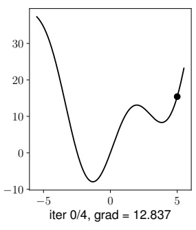

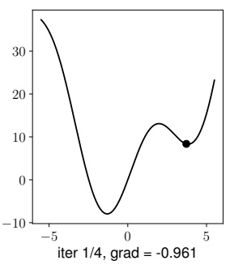


Hình 12.9. GD thông thường

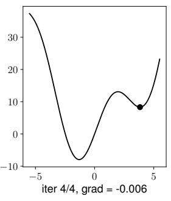

Hình 12.10. GD với momentum

```python
def GD_momentum(grad, theta_init, eta, gamma):
    # Suppose we want to store history of theta
    theta = [theta_init]
    v_old = np.zeros_like(theta_init)
    for it in range(100):
        v_new = gamma*v_old + eta*grad(theta[-1])
        theta_new = theta[-1] - v_new
        if np.linalg.norm(grad(theta_new))/np.array(theta_init).size < 1e-3:
            break
        theta.append(theta_new)
        v_old = v_new
    return theta
```

<!-- page: 170 -->

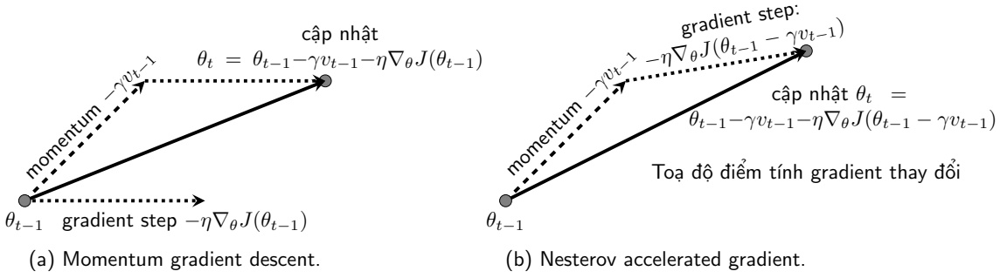

Hình 12.11. Ý tưởng của Nesterov accelerated gradient

## 12.5. Nesterov accelerated gradient

Momentum giúp nghiệm vượt qua được khu vực cực tiểu địa phương. Tuy nhiên, có một hạn chế có thể thấy trong ví dụ trên. Khi tới gần đích, momemtum khiến nghiệm dao động một khoảng thời gian nữa trước khi hội tụ. Một kỹ thuật có tên Nesterov accelerated gradient (NAG) [Nes07] giúp cho thuật toán momentum GD hội tụ nhanh hơn.

Ý tưởng trung tâm của thuật toán là dự đoán vị trí của nghiệm trước một bước. Cụ thể, nếu sử dụng số hạng momentum $\gamma v _ { t - 1 }$ để cập nhật thì vị trí tiếp theo của nghiệm là $\theta - \gamma v _ { t - 1 }$ . Vậy, thay vì sử dụng gradient tại điểm hiện tại, NAG sử dụng gradient tại điểm tiếp theo nếu sử dụng momentum. $\acute { \mathrm { Y } }$ tưởng này được thể hiện trên Hình 12.11.

## 12.5.1. Công thức cập nhật

Công thức cập nhật của NAG được cho như sau:

$$
\begin{array}{l} {v _ {t} = \gamma v _ {t - 1} + \eta \nabla_ {\theta} J (\theta - \gamma v _ {t - 1})} \\ {\theta \leftarrow \theta - v _ {t}} \end{array}\tag{12.10}
$$

(12.11)

Đoạn code dưới đây thể hiện cách cập nhật nghiệm bằng NAG:

```python
def GD_NAG(grad, theta_init, eta, gamma):
    theta = [theta_init]
    v = [np.zeros_like(theta_init)]
    for it in range(100):
        v_new = gamma*v[-1] + eta*grad(theta[-1] - gamma*v[-1])
        theta_new = theta[-1] - v_new
        if np.linalg.norm(grad(theta_new))/np.array(theta_init).size < 1e-3:
            break
        theta.append(theta_new)
        v.append(v_new)
return theta
```

<!-- page: 171 -->

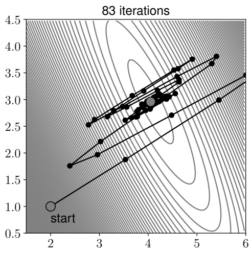

(a) GD với momentum.

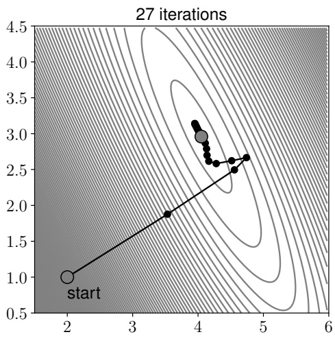

(b) GD với NAG.

Hình 12.12. Đường đi của nghiệm cho bài toán hồi quy tuyến tính với hai phương pháp gradient descent khác nhau. NAG cho nghiệm mượt hơn và nhanh hơn.

## 12.5.2. Ví dụ minh họa

Chúng ta cùng áp dụng cả GD với momentum và GD với NAG cho bài toán hồi quy tuyến tính. Hình 12.12a thể hiện đường đi của nghiệm với phương pháp momentum. Nghiệm đi khá zigzag và mất nhiều vòng lặp hơn. Hình 12.12b thể hiện đường đi của nghiệm với phương pháp NAG, nghiệm hội tụ nhanh hơn và đường đi ít zigzag hơn.

## 12.6. Stochastic gradient descent

## 12.6.1. Batch gradient descent

Thuật toán GD được đề cập từ đầu chương còn được gọi là batch gradient desenct. Batch ở đây được hiểu là tất cả, tức sử dụng tất cả các điểm dữ liệu $\mathbf { x } _ { i }$ để cập nhật bộ tham số θ. Hạn chế của việc này là khi lượng cơ sở dữ liệu lớn, việc tính toán gradient trên toàn bộ dữ liệu tại mỗi vòng lặp tốn nhiều thời gian.

Online learning là khi cơ sở dữ liệu được cập nhật liên tục, mỗi lần tăng thêm vài điểm dữ liệu mới. Việc này yêu cầu mô hình cũng phải được thay đổi để phù hợp với dữ liệu mới. Nếu thực hiện batch GD, tức tính lại gradient của hàm mất mát với toàn bộ dữ liệu, độ phức tạp tính toán sẽ rất cao. Lúc đó, thuật toán có thể không còn mang tính online nữa do mất quá nhiều thời gian tính toán.

Một kỹ thuật đơn giản hơn được sử dụng là stochastic gradient descent (SGD). Thuật toán này có thể gây ra sai số nhưng mang lại lợi ích về mặt tính toán.

<!-- page: 172 -->

## 12.6.2. Stochastic gradient descent

Trong SGD, tại một thời điểm, ta tính gradient của hàm mất mát dựa trên chỉ một điểm dữ liệu $\mathbf { x } _ { i }$ rồi cập nhật θ. Chú ý rằng hàm mất mát thường được lấy trung bình trên tất điểm dữ liệu nên gradient tương ứng với một điểm được kỳ vọng là khá gần với gradient tính theo mọi điểm dữ liệu. Sau khi duyệt qua tất cả các điểm dữ liệu, thuật toán lặp lại quá trình trên. Biến thể đơn giản này trên thực tế làm việc rất hiệu quả.

## epoch

Mỗi lần duyệt một lượt qua tất cả các điểm trên toàn bộ dữ liệu được gọi là một epoch. Với GD thông thường, mỗi epoch ứng với một lần cập nhật θ. Với SGD, mỗi epoch ứng với N lần cập nhật θ với N là số điểm dữ liệu. Một mặt, việc cập nhật θ theo từng điểm có thể làm giảm tốc độ thực hiện một epoch. Nhưng mặt khác, với SGD, nghiệm có thể hội tụ sau vài epoch. Vì vậy, SGD phù hợp với các bài toán có lượng cơ sở dữ liệu lớn và các bài toán yêu cầu mô hình thay đổi liên tục như học trực tuyến<sup>36</sup>. Với một mô hình đã được huấn luyện từ trước, khi có thêm dữ liệu, ta có thể chạy thêm một vài epoch nữa là đã có nghiệm hội tụ.

Mỗi lần cập nhật nghiệm là một vòng lặp. Mỗi lần duyệt hết toàn bộ dữ liệu là một epoch. Một epoch bao gồm nhiều vòng lặp.

## Thứ tự lựa chọn điểm dữ liệu

Một điểm cần lưu $\hat { \mathrm { y } }$ là sau mỗi epoch, thứ tự lấy các dữ liệu cần được xáo trộn để đảm bảo tính ngẫu nhiên. Việc này cũng ảnh hưởng tới hiệu năng của SGD. Đây cũng chính là lý do thuật toán này có chứa từ stochastic<sup>37</sup>.

Quy tắc cập nhật của SGD là

$$
\theta \leftarrow \theta - \eta \nabla_ {\theta} J (\theta ; \mathbf {x} _ {i}, \mathbf {y} _ {i})\tag{12.12}
$$

Trong đó $J ( \theta ; \mathbf { x } _ { i } , \mathbf { y } _ { i } ) { ~ \triangleq ~ } J _ { i } ( \theta )$ là hàm mất mát nếu chỉ có một cặp dữ liệu thứ i. Các kỹ thuật biến thể của GD như momentum hay NAG hoàn toàn có thể được áp dụng vào SGD.

<small><span class="docvortex-page-footnote" data-block-type="page_footnote" style="color:#6b7280">36 online learning</span></small>

<small><span class="docvortex-page-footnote" data-block-type="page_footnote" style="color:#6b7280">37 ngẫu nhiên</span></small>

<!-- page: 173 -->


Hình 12.13. Ví dụ về giá trị hàm mất mát sau mỗi vòng lặp khi sử dụng mini-batch gradient descent. Hàm mất mát dao động sau mỗi lần cập nhật nhưng nhìn chung giảm dần và có xu hướng hội tụ.

## 12.6.3. Mini-batch gradient descent

Khác với SGD, mini-batch GD sử dụng $1   <   k   <   N$ điểm dữ liệu để cập nhật ở mỗi vòng lặp. Giống với SGD, mini-batch GD bắt đầu mỗi epoch bằng việc xáo trộn ngẫu nhiên dữ liệu rồi chia toàn bộ dữ liệu thành các mini-batch, mỗi mini-batch có k điểm dữ liệu (trừ mini-batch cuối có thể có ít hơn nếu N không chia hết cho k). Ở mỗi vòng lặp, một mini-batch được lấy ra để tính toán gradient rồi cập nhật θ. Khi thuật toán chạy hết dữ liệu một lượt cũng là khi kết thúc một epoch. Như vậy, một epoch bao gồm xấp xỉ N/k vòng lặp. Giá trị k được gọi là kích thước batch (không phải kích thước mini-batch) được chọn trong khoảng khoảng từ vài chục đến vài trăm.

Hình 12.13 là ví dụ về giá trị của hàm mất mát của một mô hình phức tạp hơn khi sử dụng mini-batch GD. Mặc dù giá trị của hàm mất mát sau các vòng lặp không luôn luôn giảm, nhìn chung giá trị này có xu hướng giảm và hội tụ.

## 12.7. Thảo luận

## 12.7.1. Điều kiện dừng thuật toán

Khi nào thì nên dừng thuật toán GD?

Trong thực nghiệm, chúng ta có thể kết hợp các phương pháp sau:

a. Giới hạn số vòng lặp. Nhược điểm của cách làm này là thuật toán có thể dừng lại trước khi nghiệm đủ tốt. Tuy nhiên, đây là phương pháp phổ biến nhất và cũng đảm bảo được chương trình chạy không quá lâu.

b. So sánh gradient của hàm mất mát tại hai lần cập nhật liên tiếp, khi nào giá trị này đủ nhỏ thì dừng lại.

<!-- page: 174 -->

c. So sánh giá trị của hàm mất mát sau một vài epoch, khi nào sự sai khác đủ nhỏ thì dừng lại. Nhược điểm của phương pháp này là nếu hàm mất mát có dạng bằng phẳng tại một điểm không phải cực tiểu địa phương, thuật toán sẽ dừng lại trước khi đạt giá trị mong muốn.

d. Vừa chạy GD, vừa kiểm tra kết quả. Một kỹ thuật khác thường được sử dụng là cho thuật toán chạy với số lượng vòng lặp lớn. Trong quá trình chạy, chương trình thường xuyên kiểm tra chất lượng mô hình trên tập huấn luyện và tập xác thực. Đồng thời, mô hình sau một vài vòng lặp được lưu lại trong bộ nhớ. Nếu ta thấy chất lượng mô hình bắt đầu giảm trên tập xác thực thì dừng lại. Đây chính là kỹ thuật early stoping đã đề cập trong Chương 8.

## 12.7.2. Đọc thêm

Mã nguồn trong chương này có thể được tìm thấy tại [https://goo.gl/RJrRv7](https://goo.gl/RJrRv7).

Ngoài các thuật toán đã đề cập trong chương này, có nhiều thuật toán khác giúp cải thiện GD được đề xuất gần đây [Rud16]. Bạn đọc có thể tham khảo thêm AdaGrad [DHS11], RMSProp [TH12], Adam [KB14],...

Các trang web và video dưới đây cũng là các tài liệu tốt về GD.

a. An overview of gradient descent optimization algorithms ([https://goo.gl/AGwbbg](https://goo.gl/AGwbbg)).

b. Stochastic Gradient descent – Wikipedia ([https://goo.gl/pmuLzk](https://goo.gl/pmuLzk)).

c. Stochastic gradient descent – Andrew Ng ([https://goo.gl/jgBf2N](https://goo.gl/jgBf2N)).

d. An Interactive Tutorial on Numerical Optimization ([https://goo.gl/t85mvA](https://goo.gl/t85mvA)).

e. Machine Learning cơ bản, Bài 7, 8 ([https://goo.gl/US17PP](https://goo.gl/US17PP)).

<!-- page: 175 -->

## Thuật toán học perceptron

## 13.1. Giới thiệu

Trong chương này, chúng ta cùng tìm hiểu một trong các thuật toán xuất hiện đầu tiên trong lịch sử machine learning. Đây là một phương pháp phân loại đơn giản có tên là thuật toán học perceptron (perceptron learning algorithm – PLA [Ros57]). Thuật toán này được thiết kế cho bài toán phân loại nhị phân khi dữ liệu chỉ thuộc một trong hai nhãn. Đây là nền tảng cho các thuật toán liên quan tới mạng neuron nhân tạo và gần đây là deep learning.

Giả sử có hai tập dữ liệu hình vuông và tròn như được minh hoạ trong Hình 13.1a. Bài toán đặt ra là từ dữ liệu của hai tập được gán nhãn cho trước, hãy xây dựng một bộ phân loại có khả năng dự đoán nhãn của một điểm dữ liệu mới, chẳng hạn điểm hình tam giác màu xám.

Nếu coi mỗi vector đặc trưng là một điểm trong không gian nhiều chiều, bài toán phân loại có thể được coi như bài toán xác định nhãn của từng điểm trong không gian. Nếu coi mỗi nhãn chiếm một hoặc vài vùng trong không gian, ta cần đi tìm ranh giới giữa các vùng đó. Ranh giới đơn giản nhất trong không gian hai chiều là một đường thẳng, trong không gian ba chiều là một mặt phẳng, trong không gian nhiều chiều là một siêu phẳng. Những ranh giới phẳng này đơn giản vì chúng có thể được biểu diễn bởi một hàm số tuyến tính. Hình 13.1b minh họa một đường thẳng phân chia hai tập dữ liệu trong không gian hai chiều. Trong trường hợp này, điểm dữ liệu mới hình tam giác rơi vào cùng tập hợp với các điểm hình tròn.

PLA là một thuật toán đơn giản giúp tìm ranh giới siêu phẳng cho bài toán phân loại nhị phân trong trường hợp tồn tại siêu phẳng đó. Nếu hai tập dữ liệu có thể được phân chia hoàn toàn bằng một siêu phẳng, ta nói rằng hai tập đó tách biệt tuyến tính (linearly separable).

<!-- page: 176 -->

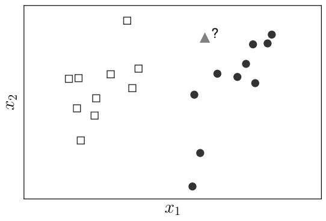

(a)

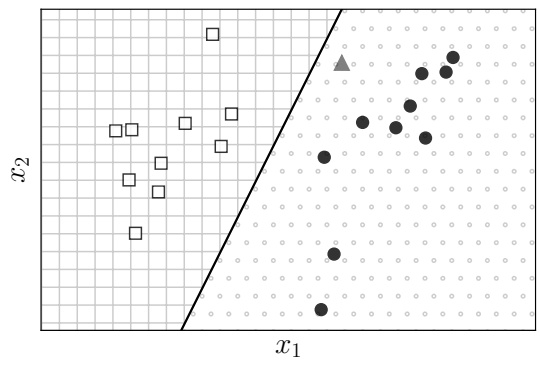

(b)

Hình 13.1. Bài toán phân loại nhị phân trong không gian hai chiều. (a) Cho hai tập dữ liệu được gán nhãn vuông và tròn, hãy xác định nhãn của điểm tam giác. (b) Ví dụ về một ranh giới phẳng phân chia hai tập hợp. Điểm tam giác được phân vào tập các điểm hình tròn.

## 13.2. Thuật toán học perceptron

## 13.2.1. Quy tắc phân loại

Giả sử $\mathbf { X } = [ \mathbf { x } _ { 1 } , \mathbf { x } _ { 2 } , \ldots , \mathbf { x } _ { N } ] \in \mathbb { R } ^ { d \times N }$ là ma trận chứa tập huấn luyện mà mỗi cột $\mathbf { x } _ { i }$ là một điểm dữ liệu trong không gian d chiều. Các nhãn được lưu trong một vector hàng $\mathbf { y } = [ y _ { 1 } , y _ { 2 } , \ldots , y _ { N } ] \in \mathbb { R } ^ { 1 \times N }$ với $y _ { i } = 1$ nếu $\mathbf { x } _ { i }$ mang nhãn vuông và $y _ { i } = - 1$ nếu $\mathbf { x } _ { i }$ mang nhãn tròn.

Tại một thời điểm, giả sử ranh giới là một siêu phẳng có phương trình

$$
f _ {\mathbf {w}} (\mathbf {x}) = w _ {1} x _ {1} + \dots + w _ {d} x _ {d} + w _ {0} = \mathbf {x} ^ {T} \mathbf {w} + w _ {0} = 0\tag{13.1}
$$

với $\mathbf { w }   \in   \mathbb { R } ^ { d }$ là vector trọng số và $w _ { 0 }$ là hệ số điều chỉnh. Bằng cách sử dụng thủ thuật gộp hệ số điều chỉnh (xem Mục 7.2.4), ta có thể coi phương trình siêu phẳng là $f _ { \mathbf { w } } ( \mathbf { x } )   =   \mathbf { x } ^ { T } \mathbf { w }   =   0$ với x ở đây được ngầm hiểu như vector đặc trưng mở rộng thêm một đặc trưng bằng một. Vector trọng số w chính là vector pháp tuyến của siêu phẳng $\mathbf { x } ^ { T } \mathbf { w } = 0$

Trong không gian hai chiều, giả sử đường thẳng $w _ { 1 } x _ { 1 } + w _ { 2 } x _ { 2 } + w _ { 0 } = 0$ là nghiệm cần tìm như Hình 13.2a. Ta thấy rằng các điểm nằm cùng phía so với đường thẳng này làm cho hàm số $f _ { \mathbf { w } } ( \mathbf { x } )$ mang cùng dấu. Nếu cần thiết, ta có thể đổi dấu của w để các điểm trên nửa mặt phẳng nền kẻ ô vuông mang dấu dương (+), các điểm trên nửa mặt phẳng nền chấm mang dấu âm (-). Các dấu này tương đương với nhãn y của mỗi điểm dữ liệu. Như vậy, nếu w là một nghiệm của bài toán thì nhãn của một điểm dữ liệu mới x được xác định bởi

$$
\operatorname{label} (\mathbf {x}) = \left\{ \begin{array}{l} 1 \quad \text {nếu} \mathbf {x} ^ {T} \mathbf {w} \geq 0 \\ - 1 \text {trường hợp còn lại} \end{array} \right.\tag{13.2}
$$

<!-- page: 177 -->

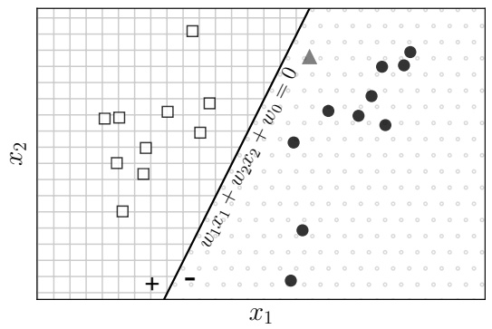

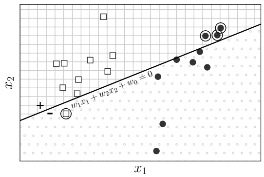

(a) Đường thẳng phân chia không gây lỗi, mọi điểm (b) Đường thẳng phân chia gây ra lỗi tại các điểm được phân loại đúng. được khoanh tròn.

**Hình 13.2.** Ví dụ về các đường thẳng trong không gian hai chiều: (a) một nghiệm của bài toán PLA, (b) đường thẳng không phân chia chính xác hai lớp.

Vậy, label $( \mathbf { x } ) = \mathrm { s g n } ( \mathbf { w } ^ { T } \mathbf { x } )$ với sgn là hàm xác định dấu. Quy ước $\mathrm { s g n } ( 0 ) = 1$

## 13.2.2. Xây dựng hàm mất mát

Tiếp theo, chúng ta xây dựng một hàm mất mát theo tham số w bất kỳ. Vẫn trong không gian hai chiều, xét đường thẳng $w _ { 1 } x _ { 1 } + w _ { 2 } x _ { 2 } + w _ { 0 } = 0$ được cho như Hình 13.2b. Các điểm khoanh tròn là các điểm bị phân loại lỗi. Tham số w là một nghiệm của bài toán nếu nó không gây ra điểm bị phân loại lỗi nào. Như vậy, hàm đếm số lượng điểm bị phân loại lỗi có thể coi là hàm mất mát của mô hình. Ta sẽ tìm cách tối thiểu hàm số này.

Nếu một điểm $\mathbf { x } _ { i }$ với nhãn $y _ { i }$ bị phân loại lỗi, ta có $\mathrm { s g n } ( \mathbf { x } ^ { T } \mathbf { w } ) \neq y _ { i }$ . Vì hai giá trị này chỉ bằng 1 hoặc −1, ta phải có $y _ { i } \mathrm { s g n } \big ( \mathbf { x } _ { i } ^ { T } \mathbf { w } \big ) = - 1$ . Như vậy, hàm đếm số lượng điểm bị phân loại lỗi có thể được viết dưới dạng

$$
J _ {1} (\mathbf {w}) = \sum_ {\mathbf {x} _ {i} \in \mathcal {M}} (- y _ {i} \mathrm{sgn} (\mathbf {x} _ {i} ^ {T} \mathbf {w}))\tag{13.3}
$$

trong đó M ký hiệu tập các điểm bị phân loại lỗi ứng với mỗi w. Mục đích cuối cùng là đi tìm w sao cho mọi điểm trong tập huấn luyện đều được phân loại đúng, tức $J _ { 1 } ( \mathbf { w } ) = 0$ . Một điểm quan trọng cần lưu $\hat { \mathrm { y } }$ là hàm mất mát $J _ { 1 } ( \mathbf { w } )$ rất khó được tối ưu vì sgn là một hàm rời rạc. Chúng ta cần tìm một hàm mất mát khác để việc tối ưu khả thi hơn. Xét hàm

$$
J (\mathbf {w}) = \sum_ {\mathbf {x} _ {i} \in \mathcal {M}} (- y _ {i} \mathbf {x} _ {i} ^ {T} \mathbf {w}).\tag{13.4}
$$

Trong hàm số này, hàm rời rạc sgn đã được lược bỏ. Ngoài ra, khi một điểm phân loại lỗi $\mathbf { x } _ { i }$ nằm càng xa ranh giới, giá trị $- y _ { i } \mathbf { x } _ { i } ^ { T }$ w sẽ càng lớn, khiến cho hàm mất mát cũng càng lớn. Lưu $\acute { \mathrm { y } }$ rằng hàm mất mát chỉ được tính trên các tập điểm bị

<!-- page: 178 -->

phân loại lỗi M, giá trị nhỏ nhất của hàm số này cũng bằng không nếu M là một tập rỗng. Vì vậy, J(w) được cho là tốt hơn $J _ { 1 } ( \mathbf { w } )$ vì nó trừng phạt rất nặng những điểm lấn sâu sang lãnh thổ của $t \hat { a } p$ còn lại. Trong khi đó, $J _ { 1 } ( \mathbf { w } )$ trừng phạt các điểm phân loại lỗi một lượng như nhau và đều bằng một, bất kể chúng gần hay xa ranh giới.

## 13.2.3. Tối ưu hàm mất mát

Tại một thời điểm, nếu chỉ quan tâm tới các điểm bị phân loại lỗi thì hàm số $J ( \mathbf { w } )$ khả vi tại mọi w. Vậy ta có thể sử dụng GD hoặc SGD để tối ưu hàm mất mát này. Chúng ta sẽ giải quyết bài toán tối ưu hàm mất mát $J ( \mathbf { w } )$ bằng SGD. Nếu chỉ một điểm dữ liệu $\mathbf { x } _ { i }$ bị phân loại lỗi, hàm mất mát và gradient của nó lần lượt là

$$
J (\mathbf {w}; \mathbf {x} _ {i}; y _ {i}) = - y _ {i} \mathbf {x} _ {i} ^ {T} \mathbf {w}; \quad \nabla_ {\mathbf {w}} J (\mathbf {w}; \mathbf {x} _ {i}; y _ {i}) = - y _ {i} \mathbf {x} _ {i}\tag{13.5}
$$

Quy tắc cập nhật w sử dụng SGD là

$$
\mathbf {w} \leftarrow \mathbf {w} - \eta (- y _ {i} \mathbf {x} _ {i}) = \mathbf {w} + \eta y _ {i} \mathbf {x} _ {i}\tag{13.6}
$$

với η là tốc độ học. Trong PLA, η được chọn bằng 1. Ta có một quy tắc cập nhật rất gọn:

$$
\mathbf {w} _ {t + 1} = \mathbf {w} _ {t} + y _ {i} \mathbf {x} _ {i}\tag{13.7}
$$

Tiếp theo, ta thấy rằng

$$
\mathbf {x} _ {i} ^ {T} \mathbf {w} _ {t + 1} = \mathbf {x} _ {i} ^ {T} (\mathbf {w} _ {t} + y _ {i} \mathbf {x} _ {i}) = \mathbf {x} _ {i} ^ {T} \mathbf {w} _ {t} + y _ {i} \| \mathbf {x} _ {i} \| _ {2} ^ {2}.\tag{13.8}
$$

Nếu $\mathbf { x } _ { i }$ bị phân loại lỗi và có nhãn đúng $y _ { i } = 1$ , ta có $\mathbf { x } _ { i } ^ { T } \mathbf { w } _ { t } < 0$ . Cũng vì $y _ { i } = 1$ nên $y _ { i } \| \mathbf { x } _ { i } \| _ { 2 } ^ { 2 } = \| \mathbf { x } _ { i } \| _ { 2 } ^ { 2 } \geq 1$ (chú $\hat { \textbf { y } } \mathbf { x } _ { i }$ là một vector đặc trưng mở rộng với một phần tử bằng một). Từ đó suy ra $\mathbf { x } _ { i } ^ { T } \mathbf { w } _ { t + 1 } > \mathbf { x } _ { i } ^ { T } \mathbf { w } _ { t }$ . Nói cách khác, $- y _ { i } \mathbf { x } _ { i } ^ { T } \mathbf { w } _ { t + 1 } < - y _ { i } \mathbf { x } _ { i } ^ { T } \mathbf { w } _ { t }$ Điều tương tự cũng xảy ra với $y _ { i } = - 1$ . Việc này chỉ ra rằng đường thẳng được mô tả bởi $\mathbf { w } _ { t + 1 }$ có xu hướng khiến hàm mất mát tại điểm bị phân loại lỗi $\mathbf { x } _ { i }$ giảm đi. Chú ý rằng việc này không đảm bảo hàm mất mát tổng cộng sẽ giảm, vì rất có thể siêu thẳng mới sẽ làm cho một điểm lúc trước được phân loại đúng trở thành một điểm bị phân loại lỗi. Tuy nhiên, thuật toán này được đảm bảo sẽ hội tụ sau một số hữu hạn bước. Thuật toán perceptron được tóm tắt dưới đây:

## Thuật toán 13.1: Perceptron

a. Tại thời điểm $t = 0$ , chọn ngẫu nhiên một vector trọng số $\mathbf { W } _ { 0 }$

b. Tại thời điểm t, nếu không có điểm dữ liệu nào bị phân loại lỗi, dừng thuật toán.

c. Giả sử $\mathbf { x } _ { i }$ là một điểm bị phân loại $l \tilde { \delta } i ,$ cập nhật

$$
\mathbf {w} _ {t + 1} = \mathbf {w} _ {t} + y _ {i} \mathbf {x} _ {i}
$$

d. Thay đổi $t = t + 1$ rồi quay lại Bước 2.

<!-- page: 179 -->

## 13.2.4. Chứng minh hội tụ

Gọi $\mathbf { w } ^ { * }$ là một nghiệm của bài toán phân loại nhị phân. Nghiệm này luôn tồn tại khi hai tập dữ liệu tách biệt tuyến tính. Ta sẽ chứng minh bằng phản chứng Thuật toán 13.1 kết thúc sau một số hữu hạn bước.

Giả sử ngược lại, tồn tại một điểm xuất phát w khiến Thuật toán 13.1 chạy vô hạn bước. Trước hết ta thấy rằng, nếu $\mathbf { w } ^ { * }$ là nghiệm thì $\alpha \mathbf { W } ^ { * }$ cũng là nghiệm của bài toán với $\alpha > 0$ bất kỳ. Xét dãy số không âm $u _ { \alpha } ( t ) = \| \mathbf { w } _ { t } - \alpha \mathbf { w } ^ { * } \| _ { 2 } ^ { 2 }$ . Theo giả thiết phản chứng, luôn tồn tại một điểm bị phân loại lỗi khi dùng nghiệm $\mathbf { w } _ { t }$ Giả sử đó là điểm $\mathbf { x } _ { i }$ với nhãn $y _ { i }$ . Ta có

$$
\begin{array}{r l} & u _ {\alpha} (t + 1) = \| \mathbf {w} _ {t + 1} - \alpha \mathbf {w} ^ {*} \| _ {2} ^ {2} \\ & \qquad = \| \mathbf {w} _ {t} + y _ {i} \mathbf {x} _ {i} - \alpha \mathbf {w} ^ {*} \| _ {2} ^ {2} \\ & \qquad = \| \mathbf {w} _ {t} - \alpha \mathbf {w} ^ {*} \| _ {2} ^ {2} + y _ {i} ^ {2} \| \mathbf {x} _ {i} \| _ {2} ^ {2} + 2 y _ {i} \mathbf {x} _ {i} ^ {T} (\mathbf {w} _ {t} - \alpha \mathbf {w} ^ {*}) \\ & \qquad <   u _ {\alpha} (t) + \| \mathbf {x} _ {i} \| _ {2} ^ {2} - 2 \alpha y _ {i} \mathbf {x} _ {i} ^ {T} \mathbf {w} ^ {*} \end{array}\tag{13.9}
$$

Dấu nhỏ hơn $\mathring { \mathrm { d } }$ dòng cuối xảy ra vì $y _ { i } ^ { 2 } = 1$ và $2 y _ { i } \mathbf { x } _ { i } ^ { T } \mathbf { w } _ { t } < 0$ . Nếu tiếp tục đặt

$$
\beta^ {2} = \max _ {i = 1, 2, \dots , N} \| \mathbf {x} _ {i} \| _ {2} ^ {2} \geq 1, \quad \gamma = \min _ {i = 1, 2, \dots , N} y _ {i} \mathbf {x} _ {i} ^ {T} \mathbf {w} ^ {*}
$$

và chọn $\begin{array} { r } { \alpha = \frac { \beta ^ { 2 } } { \gamma } } \end{array}$ , ta sẽ có $0 \leq u _ { \alpha } ( t + 1 ) < u _ { \alpha } ( t ) + \beta ^ { 2 } - 2 \alpha \gamma = u _ { \alpha } ( t ) - \beta ^ { 2 }$ . Ta có $\mathrm { t h } \hat { \hat { \mathrm { e } } }$ chọn giá trị này vì (13.9) đúng với α bất kỳ. Điều này chỉ ra rằng nếu luôn có điểm bị phân loại lỗi thì dãy $u _ { \alpha } ( t )$ là một dãy giảm bị chặn dưới bởi 0, và phần tử sau kém phần tử trước ít nhất một lượng là $\beta ^ { 2 } \geq 1$ . Điều vô lý này chứng tỏ giả thiết phản chứng là sai. Nói cách khác, thuật toán perceptron hội tụ sau một số hữu hạn bước.

## 13.3. Ví dụ và minh hoạ trên Python

Thuật toán 13.1 có thể được triển khai như sau:

## Quy tắc phân loại

Giả sử đã tìm được vector trọng số w, nhãn của các điểm dữ liệu X được xác định bằng hàm predict(w, X):

```python
import numpy as np
def predict(w, X):
    """
    predict label of each row of X, given w
    X: a 2-d numpy array of shape (N, d), each row is a datapoint
    w: a 1-d numpy array of shape (d)
    """
    return np.sign(X.dot(w))
```

<!-- page: 180 -->

## Thuật toán tối ưu hàm mất mát

Hàm perceptron(X, y, w\_init) thực hiện thuật toán PLA với tập huấn luyện X, nhãn y và nghiệm ban đầu w\_init.

```python
def perceptron(X, y, w_init):
    """ perform perceptron learning algorithm
    X: a 2-d numpy array of shape (N, d), each row is a datapoint
    y: a 1-d numpy array of shape (N), label of each row of X. y[i] = 1/-1
    w_init: a 1-d numpy array of shape (d)
    """
    w = w_init
    while True:
        pred = predict(w, X)
        # find indexes of misclassified points
        mis_idxs = np.where(np.equal(pred, y) == False)[0]
        # number of misclassified points
        num_mis = mis_idxs.shape[0]
        if num_mis == 0: # no more misclassified points
            return w
        # randomly pick one misclassified point
        random_id = np.random.choice(mis_idxs, 1)[0]
        # update w
        w = w + y[random_id]*X[random_id]
    return w
```

Áp dụng thuật toán vừa viết vào dữ liệu trong không gian hai chiều:

```python
means = [[-1, 0], [1, 0]]
cov = [[.3, .2], [.2, .3]]
N = 10
X0 = np.random.multivariate_normal(means[0], cov, N)
X1 = np.random.multivariate_normal(means[1], cov, N)

X = np.concatenate((X0, X1), axis = 0)
y = np.concatenate((np.ones(N), -1*np.ones(N)))

Xbar = np.concatenate((np.ones((2*N, 1)), X), axis = 1)
w_init = np.random.randn(Xbar.shape[1])
w = perceptron(Xbar, y, w_init)
```

Mỗi nhãn có 10 phần tử, là các vector ngẫu nhiên lấy theo phân phối chuẩn có ma trận hiệp phương sai cov và vector kỳ vọng means. Hình 13.3 minh hoạ thuật toán học perceptron cho bài toán này. Nghiệm hội tụ chỉ sau sáu vòng lặp.

## 13.4. Mô hình mạng neuron đầu tiên

Hàm số dự đoán đầu ra của perceptron label $( \mathbf { x } )   =   \mathrm { s g n } ( \mathbf { w } ^ { T } \mathbf { x } )$ được mô tả trên Hình 13.4a. Đây chính là dạng đơn giản nhất của một mạng neuron.

<!-- page: 181 -->

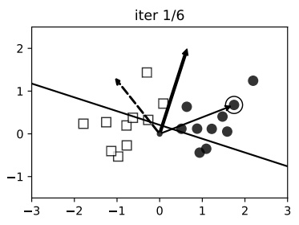

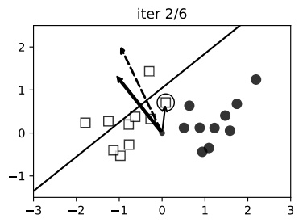

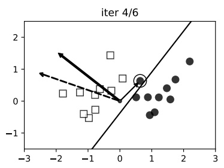

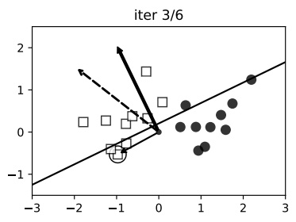

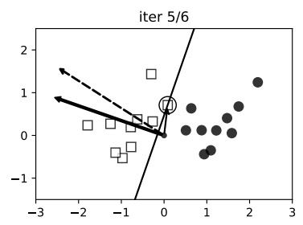

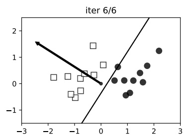

Hình 13.3. Minh hoạ thuật toán perceptron. Các điểm hình vuông có nhãn bằng 1, các điểm hình tròn có nhãn −1. Tại mỗi vòng lặp, đường thẳng là đường ranh giới. Vector pháp tuyến $\mathbf { w } _ { t }$ của đường thằng này là vector đậm nét liền. Điểm được khoanh tròn là một điểm bị phân loại lỗi $\mathbf { x } _ { i }$ . Vector mảnh nét liền thể hiện vector $\mathbf { x } _ { i }$ . Vector nét đứt thể hiện $\mathbf { w } _ { t + 1 }$ . Nếu $y _ { i } = 1$ (một điểm hình vuông), vector nét đứt bằng tổng hai vector kia. Nếu $y _ { i } = - 1$ , vector nét đứt bằng hiệu hai vector kia.

$z = \sum _ { i = 0 } ^ { d } w _ { i } x _ { i } = \mathbf { w } ^ { T } \mathbf { x } ,$ Tầng đầu vào Tầng đầu ra Tầng đầu vào Tầng đầu ra x0

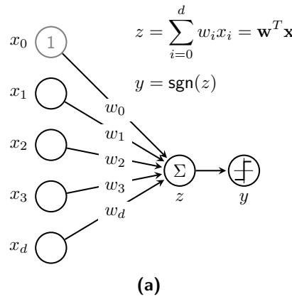

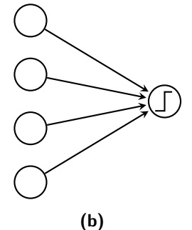

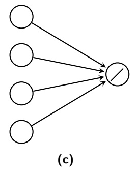

Hình 13.4. Biểu diễn perceptron và hồi quy tuyến tính dưới dạng mạng neuron. (a) perceptron đầy đủ, (b) perceptron thu gọn, (c) hồi quy tuyến tính thu gọn.

Đầu vào x của mạng được minh họa bằng các hình tròn bên trái gọi là các nút. Tập hợp các nút này được gọi là tầng đầu vào. Số nút trong tầng đầu vào là $d   +   1$ với nút điều chỉnh $x _ { 0 }$ đôi khi được ẩn đi và ngầm hiểu bằng một. Các trọng số $w _ { 0 } , w _ { 1 } , \ldots , w _ { d }$ được gán vào các mũi tên đi tới nút $\begin{array} { r } { z   =   \sum _ { i = 0 } ^ { d } w _ { i } x _ { i } =   \mathbf { x } ^ { T } \mathbf { w } } \end{array}$ . Nút $y = \operatorname { s g n } ( z )$ là đầu ra của mạng. Ký hiệu hình chữ Z ngược trong nút y thể hiện đồ thị của hàm sgn. Hàm $y = \operatorname { s g n } ( z )$ đóng vai trò là một hàm kích hoạt. Có nhiều loại hàm kích hoạt khác nhau sẽ được trình bày trong các chương sau. Dữ liệu

<!-- page: 182 -->

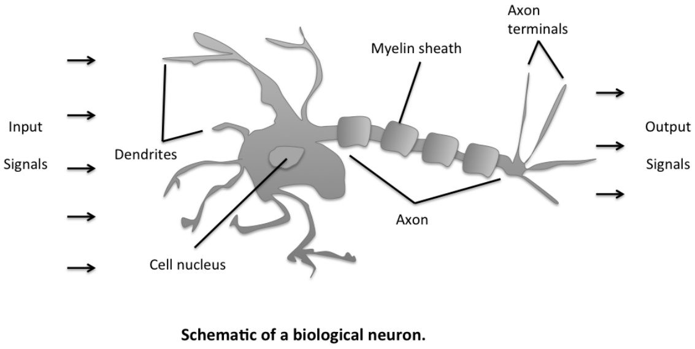

Hình 13.5. Cấu trúc của một neuron thần kinh sinh học. Nguồn: Single-Layer Neural Networks and Gradient Descent ([https://goo.gl/RjBREb](https://goo.gl/RjBREb)).

đầu vào được đặt tại tầng đầu vào, lấy tổng có trọng số lưu vào biến z rồi đi qua hàm kích hoạt để có kết quả ở y. Đây chính là dạng đơn giản nhất của một mạng neuron nhân tạo. Perceptron cũng có thể được vẽ giản lược như Hình 13.4b, với ẩn ý rằng hàm tính tổng và hàm kích hoạt được gộp làm một.

Các mạng neuron có thể có một hoặc nhiều nút ở đầu ra tạo thành một tầng đầu ra. Trong các mô hình phức tạp hơn, các mạng neuron có thể có thêm các tầng trung gian giữa tầng đầu vào và tầng đầu ra gọi là tầng ẩn. Chúng ta sẽ đi sâu vào các mạng nhiều tầng ẩn ở Chương 16. Trước đó, chúng ta sẽ tìm hiểu các mạng neuron đơn giản hơn không có tầng ẩn nào.

Để ý rằng nếu thay hàm kích hoạt bởi hàm đồng nhất y = z, ta sẽ có một mạng neuron mô tả mô hình hồi quy tuyến tính như Hình 13.4c. Đường thẳng chéo trong nút đầu ra thể hiện đồ thị hàm số y = z. Các trục tọa độ đã được lược bỏ.

Mô hình perceptron ở trên khá giống với một thành phần nhỏ của mạng thần kinh sinh học như Hình 13.5. Dữ liệu từ nhiều dây thần kinh đầu vào đi về một nhân tế bào. Nhân tế bào tổng hợp thông tin và đưa ra quyết định ở tín hiệu đầu ra. Trong mạng neuron nhận tạo của perceptron, mỗi giá trị x<sub>i</sub> đóng vai trò một tín hiệu đầu vào, hàm tính tổng và hàm kích hoạt có chức năng tương tự nhân tế bào. Tên gọi mạng neuron nhân tạo được khởi nguồn từ đây.

<!-- page: 183 -->

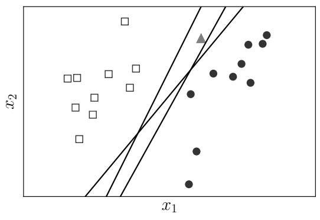

(a)

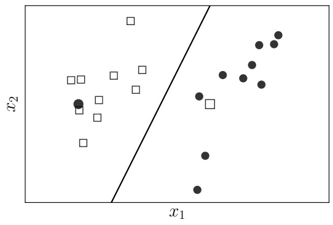

(b)

Hình 13.6. Với bài toán phân loại nhị phân, PLA có thể (a) cho vô số nghiệm, hoặc (b) vô nghiệm thậm chí khi có nhiễu nhỏ.

## 13.5. Thảo Luận

PLA có thể cho vô số nghiệm khác nhau. Nếu hai tập dữ liệu tách biệt tuyến tính thì có vô số đường ranh giới như trong Hình 13.6a. Các đường khác nhau sẽ quyết định điểm hình tam giác có nhãn khác nhau. Trong các đường đó, đường nào là tốt nhất? Và định nghĩa “tốt nhất” được hiểu theo nghĩa nào? Các câu hỏi này sẽ được thảo luận kỹ hơn trong Chương 26.

PLA đòi hỏi hai tập dữ liệu phải tách biệt tuyến tính. Hình 13.6b mô tả hai tập dữ liệu gần tách biệt tuyến tính. Mỗi tập có một điểm nhiễu nằm lẫn tập còn lại. Trong trường hợp này, thuật toán PLA không bao giờ dừng lại vì luôn có ít nhất hai điểm bị phân loại lỗi.

Trong một chừng mực nào đó, đường thẳng màu đen vẫn có thể coi là một nghiệm tốt vì nó đã giúp phân loại chính xác hầu hết các điểm. Việc không hội tụ với dữ liệu gần tách biệt tuyến tính là một nhược điểm lớn của PLA.

Nhược điểm này có thể được khắc phục bằng thuật toán bỏ túi (pocket algorithm).

Thuật toán bỏ túi [AMMIL12]: một cách trực quan, nếu chỉ có ít nhiễu, ta sẽ đi tìm một đường ranh giới sao cho có ít điểm bị phân loại lỗi nhất. Việc này có thể được thực hiện thông qua PLA và thuật toán tìm số nhỏ nhất trong mảng một chiều:

• Giới hạn số lượng vòng lặp của PLA. Đặt nghiệm w sau vòng lặp đầu tiên và số điểm bị phân loại lỗi vào trong túi.

• Mỗi lần cập nhật nghiệm w<sub>t</sub> mới, ta đếm xem có bao nhiêu điểm bị phân loại lỗi. So sánh số lượng này với số điểm bị phân loại lỗi trong túi. Nếu số lượng điểm bị phân loại lỗi này nhỏ hơn, tức ta đạt được mô hình tốt hơn trên tập

<!-- page: 184 -->

huấn luyện, ta thay thế nghiệm trong túi bằng nghiệm mới và số điểm bị phân loại lỗi tương ứng. Lặp lại bước này đến khi hết số vòng lặp.

Mã nguồn trong chương này có thể được tìm thấy tại [https://goo.gl/tisSTq](https://goo.gl/tisSTq).

<!-- page: 185 -->

## Hồi quy logistic

## 14.1. Giới thiệu

## 14.1.1. Nhắc lại hai mô hình tuyến tính

Hai mô hình tuyến tính đã thảo luận trong cuốn sách này, hồi quy tuyến tính và PLA, đều có thể viết chung dưới dạng $y   =   f ( \mathbf { x } ^ { T } \mathbf { w } )$ trong đó $f ( s )$ là một hàm kích hoạt. Trong hồi quy tuyến tính $f ( s ) = s ,$ tích vô hướng $\mathbf { x } ^ { T } \mathbf { w }$ được trực tiếp sử dụng để dự đoán đầu ra y. Mô hình này phù hợp nếu ta cần dự đoán một đầu ra không bị chặn. PLA có đầu ra chỉ nhận một trong hai giá trị 1 hoặc −1 với hàm kích hoạt $f ( s ) = \operatorname { s g n } ( s )$ phù hợp với các bài toán phân loại nhị phân. Trong chương này, chúng ta sẽ thảo luận một mô hình tuyến tính với một hàm kích hoạt khác, thường được áp dụng cho các bài toán phân loại nhị phân. Trong mô hình này, đầu ra có thể được biểu diễn dưới dạng xác suất. Ví dụ, xác suất thi đỗ nếu biết thời gian ôn thi, xác suất ngày mai có mưa dựa trên những thông tin đo được trong ngày hôm nay,... Mô hình này có tên là hồi quy logistic. Mặc dù trong tên có chứa từ hồi quy, phương pháp này thường được sử dụng nhiều hơn cho các bài toán phân loại.

## 14.1.2. Một ví dụ nhỏ

Bảng 14.1: Thời gian ôn thi và kết quả thi của 20 sinh viên.

| Số giờ | Đậu? | Số giờ | Đậu? | Số giờ | Đậu? | Số giờ | Đậu? |
| --- | --- | --- | --- | --- | --- | --- | --- |
| 0.5 | 0 | 0.75 | 0 | 1 | 0 | 1.25 | 0 |
| 1.5 | 0 | 1.75 | 0 | 1.75 | 1 | 2 | 0 |
| 2.25 | 1 | 2.5 | 0 | 2.75 | 1 | 4 | 0 |
| 3.25 | 1 | 3.5 | 0 | 4 | 1 | 4.25 | 1 |
| 4.5 | 1 | 4.75 | 1 | 5 | 1 | 5.5 | 1 |

<!-- page: 186 -->

Chương 14. Hồi quy logistic

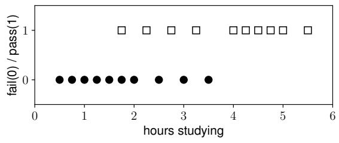

Hình 14.1. Ví dụ về kết quả thi dựa trên số giờ ôn tập. Trục hoành thể hiện thời gian ôn tập của mỗi sinh viên, trục tung gồm hai giá trị 0/fail (các điểm hình tròn) và 1/pass (các điểm hình vuông).

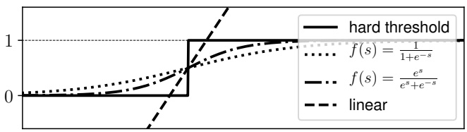

**Hình 14.2.** Một vài ví dụ về các hàm kích hoạt khác nhau.

Xét một ví dụ về quan hệ giữa thời gian ôn thi và kết quả của 20 sinh viên trong Bảng 14.1. Bài toán đặt ra là từ dữ liệu này hãy xây dựng mô hình đánh giá khả năng đỗ của một sinh viên dựa trên thời gian ôn tập. Dữ liệu trong Bảng 14.1 được mô tả trên Hình 14.1. Nhìn chung, thời gian học càng nhiều thì khả năng đỗ càng cao. Tuy nhiên, không có một ngưỡng thời gian học nào giúp phân biệt rạch ròi việc đỗ/trượt . Nói cách khác, dữ liệu của hai tập này là không tách biệt tuyến tính, và vì vậy PLA sẽ không hữu ích. Tuy nhiên, thay vì dự đoán chính xác hai giá trị đỗ/trượt, ta có thể dự đoán xác suất để một sinh viên thi đỗ dựa trên thời gian ôn thi.

## 14.1.3. Mô hình hồi quy logistic

Quan sát Hình 14.2 với các hàm kích hoạt f(s) khác nhau.

• Đường nét đứt biểu diễn một hàm kích hoạt tuyến tính không phù hợp vì đầu ra không bị chặn. Có một cách đơn giản để đưa đầu ra về dạng bị chặn: nếu đầu ra nhỏ hơn không thì thay bằng không, nếu đầu ra lớn hơn một thì thay bằng một. Điểm phân chia, còn gọi là ngưỡng, được chọn là điểm có tung độ 0.5 trên đường thằng này. Đây cũng không phải là một lựa chọn tốt. Giả sử có thêm một bạn sinh viên tiêu biểu ôn tập đến 20 giờ hoặc hơn thi đỗ. Lúc này ngưỡng tương ứng với mốc tung độ bằng 0.5 sẽ dịch nhiều về phía phải. Kéo theo đó, rất nhiều sinh viên thi đỗ được dự đoán là trượt. Rõ ràng đây là một mô hình không tốt. Nhắc lại rằng hồi quy tuyến tính rất nhạy cảm với nhiễu, ở đây là bạn sinh viên tiêu biểu đó.

• Đường nét liền tương tự với hàm kích hoạt của PLA<sup>38</sup>. Ngưỡng dự đoán đỗ/trượt tại vị trí hàm số đổi dấu còn được gọi là ngưỡng cứng.

<small><span class="docvortex-page-footnote" data-block-type="page_footnote" style="color:#6b7280">38 Đường này chỉ khác hàm kích hoạt của PLA ở chỗ hai nhãn là 0 và 1 thay vì -1 và 1.</span></small>

<!-- page: 187 -->

• Các đường nét chấm và chấm gạch phù hợp với bài toán đang xét hơn. Chúng có một vài tính chất quan trọng:

– Là các hàm số liên tục nhận giá trị thực, bị chặn trong khoảng (0, 1).

Nếu coi điểm có tung độ bằng 0.5 là ngưỡng, các điểm càng xa ngưỡng về bên trái có giá trị càng gần không, các điểm càng xa ngưỡng về bên phải có giá trị càng gần một. Điều này phù hợp với nhận xét rằng học càng nhiều thì xác suất đỗ càng cao và ngược lại.

– Hai hàm này có đạo hàm mọi nơi, điều này có thể có ích trong tối ưu.

## Hàm sigmoid và tanh

Trong các hàm số có ba tính chất nói trên, hàm sigmoid:

$$
f (s) = \frac {1}{1 + e ^ {- s}} \triangleq \sigma (s)\tag{14.1}
$$

được sử dụng nhiều nhất, vì nó bị chặn trong khoảng (0, 1) và:

$$
\lim _ {s \to - \infty} \sigma (s) = 0; \quad \lim _ {s \to + \infty} \sigma (s) = 1.\tag{14.2}
$$

Thú vị hơn:

$$
\sigma^ {\prime} (s) = \frac {e ^ {- s}}{(1 + e ^ {- s}) ^ {2}} = \frac {1}{1 + e ^ {- s}} \frac {e ^ {- s}}{1 + e ^ {- s}} = \sigma (s) (1 - \sigma (s))\tag{14.3}
$$

Với đạo hàm đơn giản, hàm sigmoid được sử dụng rộng rãi trong mạng neuron. Chúng ta sẽ sớm thấy hàm sigmoid được khám phá ra như thế nào.

Ngoài ra, hàm tanh cũng hay được sử dụng:

$$
\tanh (s) = \frac {e ^ {s} - e ^ {- s}}{e ^ {s} + e ^ {- s}} = 2 \sigma (2 s) - 1.\tag{14.4}
$$

Hàm số này nhận giá trị trong khoảng (−1, 1).

Hàm sigmoid có thể được thực hiện trên Python như sau:

```python
def sigmoid(S):
    """
    S: an numpy array
    return sigmoid function of each element of S
    """
    return 1/(1 + np.exp(-S))
```

<!-- page: 188 -->

## 14.2. Hàm mất mát và phương pháp tối ưu

## 14.2.1. Xây dựng hàm mất mát

Với các mô hình có hàm kích hoạt $f(s) \in (0,1)$ , ta có thể giả sử rằng xác suất để một điểm dữ liệu $\mathbf { x } _ { i }$ có nhãn thứ nhất là $f ( \mathbf { x } _ { i } ^ { T } \mathbf { w } )$ và nhãn còn lại là $1 - f ( \mathbf { x } _ { i } ^ { T } \mathbf { w } )$

$$
p (y _ {i} = 1 | \mathbf {x} _ {i}; \mathbf {w}) = f (\mathbf {x} _ {i} ^ {T} \mathbf {w})\tag{14.5}
$$

$$
p (y _ {i} = 0 | \mathbf {x} _ {i}; \mathbf {w}) = 1 - f (\mathbf {x} _ {i} ^ {T} \mathbf {w})\tag{14.6}
$$

trong đó $p ( y _ { i } = 1 | \mathbf { x } _ { i } ; \mathbf { w } )$ được hiểu là xác suất xảy ra sự kiện nhãn $y _ { i } = 1$ khi biết tham số mô hình w và dữ liệu đầu vào $\mathbf { x } _ { i }$ . Mục đích là tìm các hệ số w sao cho $f ( \mathbf { x } _ { i } ^ { T } \mathbf { w } ) \approx y _ { i }$ với mọi điểm trong tập huấn luyện.

Ký hiệu $a _ { i } = f ( \mathbf { x } _ { i } ^ { T } \mathbf { w } )$ , hai biểu thức (14.5) và (14.6) có thể được viết gọn lại:

$$
p (y _ {i} | \mathbf {x} _ {i}; \mathbf {w}) = a _ {i} ^ {y _ {i}} (1 - a _ {i}) ^ {1 - y _ {i}}\tag{14.7}
$$

Biểu thức này tương đương với hai biểu thức (14.5) và (14.6) vì khi $y _ { i } = 1$ , thừa số thứ hai của vế phải sẽ bằng một, khi $y _ { i } = 0$ , thừa số thứ nhất sẽ bằng một. Để mô hình tạo ra dự đoán khớp với dữ liệu đã cho nhất, ta cần tìm w để xác xuất này đạt giá trị cao nhất.

Xét toàn bộ tập huấn luyện với ma trận dữ liệu $\mathbf { X } = [ \mathbf { x } _ { 1 } , \mathbf { x } _ { 2 } , \ldots , \mathbf { x } _ { N } ] \in \mathbb { R } ^ { d \times N }$ và vector nhãn tương ứng $\mathbf { y } = [ y _ { 1 } , y _ { 2 } , \ldots , y _ { N } ]$ . Ta cần giải bài toán tối ưu

$$
\mathbf {w} = \arg \max _ {\mathbf {w}} p (\mathbf {y} | \mathbf {X}; \mathbf {w})\tag{14.8}
$$

Đây chính là một bài toán MLE với tham số mô hình w cần được ước lượng. Ta có thể giải quyết bài toán này bằng cách giả sử các điểm dữ liệu độc lập nếu biết tham số mô hình. Đây cũng là giả sử thường được dùng khi giải các bài toán liên quan tới MLE:

$$
p (\mathbf {y} | \mathbf {X}; \mathbf {w}) = \prod_ {i = 1} ^ {N} p (y _ {i} | \mathbf {x} _ {i}; \mathbf {w}) = \prod_ {i = 1} ^ {N} a _ {i} ^ {y _ {i}} (1 - a _ {i}) ^ {1 - y _ {i}}\tag{14.9}
$$

Lấy logarit tự nhiên, đổi dấu rồi lấy trung bình, ta thu được hàm số

$$
J (\mathbf {w}) = - \frac {1}{N} \log p (\mathbf {y} | \mathbf {X}; \mathbf {w}) = - \frac {1}{N} \sum_ {i = 1} ^ {N} (y _ {i} \log a _ {i} + (1 - y _ {i}) \log (1 - a _ {i}))\tag{14.10}
$$

với chú $\hat { \mathrm { y } }$ rằng $a _ { i }$ là một hàm số của w và $\mathbf { x } _ { i }$ . Hàm số này là hàm mất mát của hồi quy logistic. Vì đã đổi dấu sau khi lấy logarit, ta cần tìm w để J(w) đạt giá trị nhỏ nhất.

<!-- page: 189 -->

## 14.2.2. Tối ưu hàm mất mát

Bài toán tối ưu hàm mất mát của hồi quy logistic có thể được giải quyết bằng SGD. Tại mỗi vòng lặp, w được cập nhật dựa trên một điểm dữ liệu ngẫu nhiên. Hàm mất mát của hồi quy logistic với chỉ một điểm dữ liệu $( \mathbf { x } _ { i } , y _ { i } )$ và gradient của nó lần lượt là

$$
J (\mathbf {w}; \mathbf {x} _ {i}, y _ {i}) = - (y _ {i} \log a _ {i} + (1 - y _ {i}) \log (1 - a _ {i}))\tag{14.11}
$$

$$
\nabla_ {\mathbf {w}} J (\mathbf {w}; \mathbf {x} _ {i}, y _ {i}) = - (\frac {y _ {i}}{a _ {i}} - \frac {1 - y _ {i}}{1 - a _ {i}}) (\nabla_ {\mathbf {w}} a _ {i}) = \frac {a _ {i} - y _ {i}}{a _ {i} (1 - a _ {i})} (\nabla_ {\mathbf {w}} a _ {i})\tag{14.12}
$$

ở đây ta đã sử dụng quy tắc chuỗi để tính gradient với $a _ { i } = f ( \mathbf { x } _ { i } ^ { T } \mathbf { w } )$ . Để cho biểu thức này đơn giản, ta sẽ tìm hàm $a _ { i } = f ( \mathbf { x } _ { i } ^ { T } \mathbf { w } )$ sao cho mẫu số bị triệt tiêu.

Đặt $z = \mathbf { x } _ { i } ^ { T } \mathbf { w }$ , ta có

$$
\nabla_ {\mathbf {w}} a _ {i} = \frac {\partial a _ {i}}{\partial z _ {i}} (\nabla_ {\mathbf {w}} z _ {i}) = \frac {\partial a _ {i}}{\partial z _ {i}} \mathbf {x} _ {i}\tag{14.13}
$$

Tạm thời bỏ qua các chỉ số i, ta đi tìm hàm số $a = f ( z )$ sao cho

$$
\frac {\partial a}{\partial z} = a (1 - a)\tag{14.14}
$$

Nếu điều này xảy ra, mẫu số trong biểu thức (14.12) sẽ bị triệt tiêu. Phương trình vi phân này không quá phức tạp. Thật vậy, (14.14) tương đương với

$$
\frac {\partial a}{a (1 - a)} = \partial z\tag{\(\Leftrightarrow\}
$$

$$
\left(\frac {1}{a} + \frac {1}{1 - a}\right) \partial a = \partial z\tag{\(\Leftrightarrow\}
$$

$$
\log a - \log (1 - a) = z + C\tag{\(\Leftrightarrow\}
$$

$$
\log {\frac {a}{1 - a}} = z + C\tag{\(\Leftrightarrow\}
$$

$$
\frac {a}{1 - a} = e ^ {z + C}\tag{\(\Leftrightarrow\}
$$

$$
a = e ^ {z + C} (1 - a)\tag{\(\Leftrightarrow\}
$$

$$
a = \frac {e ^ {z + C}}{1 + e ^ {z + C}} = \frac {1}{1 + e ^ {- z - C}} = \sigma (z + C)
$$

với C là một hằng số. Chọn C = 0, ta được $a   =   f ( \mathbf { x } ^ { T } \mathbf { w } )   =   \sigma ( z )$ . Đây chính là hàm sigmoid. Hồi quy logistic với hàm kích hoạt là hàm sigmoid được sử dụng phổ biến nhất. Mô hình này còn có tên là hồi quy logistic sigmoid. Khi nói hồi quy logistic, ta ngầm hiểu rằng đó chính là hồi quy logistic sigmoid.

Thay (14.13) và (14.14) vào (14.12) ta thu được

$$
\nabla_ {\mathbf {w}} J (\mathbf {w}; \mathbf {x} _ {i}, y _ {i}) = (a _ {i} - y _ {i}) \mathbf {x} _ {i} = (\sigma (\mathbf {x} _ {i} ^ {T} \mathbf {w}) - y _ {i}) \mathbf {x} _ {i}.\tag{14.15}
$$

<!-- page: 190 -->

Từ đó, công thức cập nhật nghiệm cho hồi quy logistic sử dụng SGD là

$$
\mathbf {w} \leftarrow \mathbf {w} - \eta (a _ {i} - y _ {i}) \mathbf {x} _ {i} = \mathbf {w} - \eta (\sigma (\mathbf {x} _ {i} ^ {T} \mathbf {w}) - y _ {i}) \mathbf {x} _ {i}\tag{14.16}
$$

với η là tốc độ học.

## 14.2.3. Hồi quy logistic với suy giảm trọng số

Một trong các kỹ thuật phổ biến giúp tránh overfitting cho các mạng neuron là sử dụng suy giảm trọng số (weight decay). Đây là một kỹ thuật kiểm soát, trong đó một đại lượng tỉ lệ với bình phương chuẩn $\ell _ { 2 }$ của vector trọng số w được cộng vào hàm mất mát để kiểm soát độ lớn của các hệ số. Hàm mất mát trở thành

$$
\bar {J} (\mathbf {w}) = \frac {1}{N} \sum_ {i = 1} ^ {N} \left(- y _ {i} \log a _ {i} - (1 - y _ {i}) \log (1 - a _ {i}) + \frac {\lambda}{2} \| \mathbf {w} \| _ {2} ^ {2}\right).\tag{14.17}
$$

Công thức cập nhật w bằng SGD trong hồi quy logistic với suy giảm trọng số là:

$$
\mathbf {w} \leftarrow \mathbf {w} - \eta \left((\sigma (\mathbf {x} _ {i} ^ {T} \mathbf {w}) - y _ {i}) \mathbf {x} _ {i} + \lambda \mathbf {w}\right)\tag{14.18}
$$

## 14.3. Triển khai thuật toán trên Python

Hàm ước lượng xác suất đầu ra cho mỗi điểm dữ liệu và hàm tính giá trị hàm mất mát với weight decay có thể được thực hiện như sau trong Python.

```python
def prob(w, X):
    """
    X: a 2d numpy array of shape (N, d). N datapoint, each with size d
    w: a 1d numpy array of shape (d)
    """
    return sigmoid(X.dot(w))

def loss(w, X, y, lam):
    """
    X, w as in prob
    y: a 1d numpy array of shape (N). Each elem = 0 or 1
    """
    a = prob(w, X)
    loss_0 = -np.mean(y*np.log(a) + (1-y)*np.log(1-a))
    weight_decay = 0.5*lam/X.shape[0]*np.sum(w*w)
    return loss_0 + weight_decay
```

Từ công thức (14.18), ta có thể thực hiện thuật toán tìm w cho hồi quy logistic như sau:

<!-- page: 191 -->

```python
def logistic_regression(w_init, X, y, lam, lr = 0.1, nepoches = 2000):
    # lam: regulariza paramether, lr: learning rate, nepoches: # epoches
    N, d = X.shape[0], X.shape[1]
    w = w_old = w_init
    # store history of loss in loss_hist
    loss_hist = [loss(w_init, X, y, lam)]
    ep = 0
    while ep < nepoches:
        ep += 1
        mix_ids = np.random.permutation(N) # stochastic
        for i in mix_ids:
            xi = X[i]
            yi = y[i]
            ai = sigmoid(xi.dot(w))
            # update
            w = w - lr*((ai - yi)*xi + lam*w)
            loss_hist.append(loss(w, X, y, lam))
        if np.linalg.norm(w - w_old)/d < 1e-6:
            break
        w_old = w
    return w, loss_hist
```

## 14.3.1. Hồi quy logistic cho ví dụ đầu chương

Áp dụng vào bài toán dự đoán đỗ/trượt ở đầu chương:

```python
np.random.seed(2)
X = np.array([[0.50, 0.75, 1.00, 1.25, 1.50, 1.75, 1.75, 2.00, 2.25, 2.50,
2.75, 3.00, 3.25, 3.50, 4.00, 4.25, 4.50, 4.75, 5.00, 5.50]]).T
y = np.array([0, 0, 0, 0, 0, 1, 0, 1, 0, 1, 0, 1, 1, 1, 1, 1])
# bias trick
Xbar = np.concatenate((X, np.ones((X.shape[0], 1))), axis = 1)
w_init = np.random.randn(Xbar.shape[1])
lam = 0.0001
w, loss_hist = logistic_regression(w_init, Xbar, y, lam, lr = 0.05, nepoches
= 500)
print('Solution of Logistic Regression:', w)
print('Final loss:', loss(w, Xbar, y, lam))
```

Kết quả:

```txt
Solution of Logistic Regression: [ 1.54337021 -4.06486702]
Final loss: 0.402446724975
```

Từ đây ta có thể rút ra xác suất thi đỗ dựa trên công thức:

```txt
probability_of_pass ≈ sigmoid(1.54 * hours_of_studying - 4.06)
```

Biểu thức này cũng chỉ ra rằng xác suất thi đỗ tăng khi thời gian ôn tập tăng, do sigmoid là một hàm đồng biến. Nghiệm của mô hình hồi quy logistic và giá trị hàm mất mát qua mỗi epoch được mô tả trên Hình 14.3.

<!-- page: 192 -->

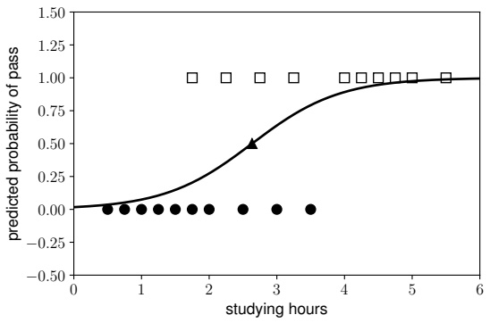

(a)

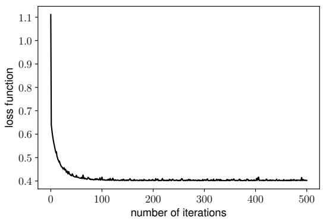

(b)

Hình 14.3. Nghiệm của hồi quy logistic cho bài toán dự đoán kết quả thi dựa trên thời gian học. (a) Đường nét liền thể hiện xác suất thi đỗ dựa trên thời gian học. Điểm tam giác thể hiện ngưỡng ra quyết định đỗ/trượt. Điểm này có thể thay đổi tuỳ vào bài toán. (b) Giá trị của hàm mất mát qua các vòng lặp. Hàm mất mát giảm nhanh và hội tụ sớm.

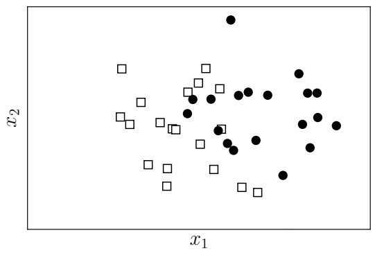

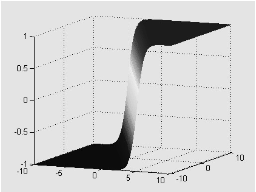

(a) Dữ liệu cho bài toán phân loại trong không gian(b) Đồ thị hàm sigmoid trong không gian hai hai chiều. chiều (xem ảnh màu trong Hình B.6).

Hình 14.4. Ví dụ về dữ liệu và hàm sigmoid trong không gian hai chiều.

## 14.3.2. Ví dụ với dữ liệu hai chiều

Giả sử có hai tập dữ liệu vuông và tròn phân bố trên mặt phẳng như trong Hình 14.4a. Với dữ liệu đầu vào nằm trong không gian hai chiều, hàm sigmoid có dạng thác nước như trong Hình 14.4b.

Kết quả dự đoán xác suất đầu ra khi áp dụng mô hình hồi quy logistic được minh họa như Hình 14.5 với độ sáng của nền thể hiện xác suất điểm đó có nhãn tròn. Màu đen đậm thể hiện giá trị gần bằng không, màu trắng thể hiện giá trị rất gần bằng một.

<!-- page: 193 -->

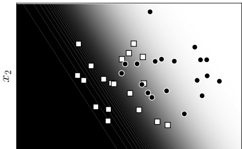

x<sub>1</sub>

**Hình 14.5.** Ví dụ về hồi quy logistic với dữ liệu hai chiều. Vùng màu càng đen thể hiện xác suất thuộc nhãn hình vuông càng cao. Vùng màu càng trắng thể hiện xác suất thuộc nhãn hình tròn càng cao. Vùng biên giữa hai nhãn (khu vực màu xám) thể hiện các điểm thuộc vào mỗi nhãn với xác suất thấp hơn.

Nếu phải lựa chọn một ranh giới thay vì xác suất, ta thấy các đường thẳng nằm trong khu vực màu xám là các lựa chọn hợp lý. Ta sẽ chứng minh ở phần sau rằng tập hợp các điểm có cùng xác suất đầu ra tạo thành một siêu phẳng.

Mã nguồn cho chương này có thể được tìm thấy tại [https://goo.gl/9e7sPF](https://goo.gl/9e7sPF).

Cách sử dụng hồi quy logistic trong thư viện scikit-learn có thể được tìm thấy tại [https://goo.gl/BJLJNx](https://goo.gl/BJLJNx).

## 14.4. Tính chất của hồi quy logistic

## a. Hồi quy logistic thực ra là một thuật toán phân loại.

Mặc dù trong tên có từ hồi quy, hồi quy logistic được sử dụng nhiều trong các bài toán phân loại. Sau khi tìm được mô hình, việc xác định nhãn y cho một điểm dữ liệu x được xác định bằng việc so sánh hai giá trị:

$$
P (y = 1 | \mathbf {x}; \mathbf {w}); P (y = 0 | \mathbf {x}; \mathbf {w})\tag{14.19}
$$

Nếu giá trị thứ nhất lớn hơn, ta kết luận điểm dữ liệu có nhãn một và ngược lại. Vì tổng hai giá trị này luôn bằng một nên ta chỉ cần xác định $P ( y = 1 | \mathbf { x } ; \mathbf { w } )$ có lớn hơn 0.5 hay không.

## b. Đường ranh giới tạo bởi hồi quy logistic là một siêu phẳng.

Thật vậy, giả sử những điểm có xác suất đầu ra lớn hơn 0.5 được gán nhãn một. Tập hợp các điểm này là nghiệm của bất phương trình:

$$
P (y = 1 | \mathbf {x}; \mathbf {w}) > 0. 5 \Leftrightarrow \frac {1}{1 + e ^ {- \mathbf {x} ^ {T} \mathbf {w}}} > 0. 5 \Leftrightarrow e ^ {- \mathbf {x} ^ {T} \mathbf {w}} <   1 \Leftrightarrow \mathbf {x} ^ {T} \mathbf {w} > 0
$$

Nói cách khác, tập hợp các điểm được gán nhãn một tạo thành một nửa không gian $\mathbf { x } ^ { T } \mathbf { w } > 0$ , tập hợp các điểm được gán nhãn không tạo thành nửa không gian còn lại. Ranh giới giữa hai nhãn là siêu phẳng $\mathbf { x } ^ { T } \mathbf { w } = 0$

Vì vậy, hồi quy logistic được coi như một bộ phân loại tuyến tính.

<!-- page: 194 -->

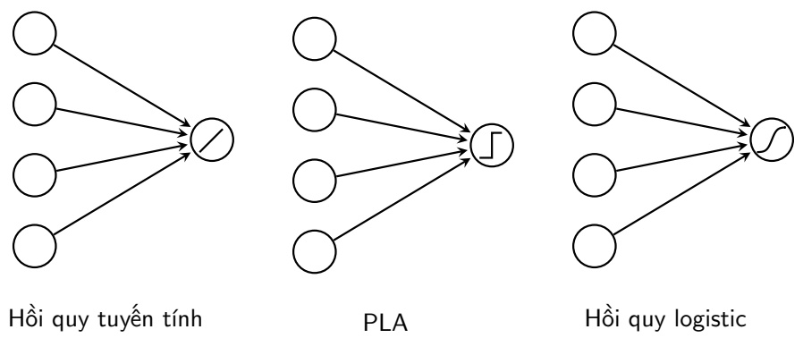

Hình 14.6. Biểu diễn hồi quy tuyến tính, PLA, và hồi quy logistic dưới dạng neural network.

## c. Hồi quy logistic không yêu cầu giả thiết tách biệt tuyến tính.

Một điểm cộng của hồi quy logistic so với PLA là nó không cần giả thiết dữ liệu hai tập hợp là tách biệt tuyến tính. Tuy nhiên, ranh giới tìm được vẫn có dạng tuyến tính. Vì vậy, mô hình này chỉ phù hợp với loại dữ liệu mà hai tập gần tách biệt tuyến tính.

## d. Ngưỡng ra quyết định có thể thay đổi.

Hàm dự đoán đầu ra của các điểm dữ liệu mới có thể được viết như sau:

```python
def predict(w, X, threshold = 0.5):
    """
predict output for each row of X
X: a numpy array of shape (N, d), threshold: 0 < threshold < 1
return a 1d numpy array, each element is 0 or 1
    """
res = np.zeros(X.shape[0])
res[np.where(prob(w, X) > threshold)[0]] = 1
return res
```

Trong các ví dụ đã nêu, ngưỡng ra quyết định đều được lấy tại 0.5. Trong nhiều trường hợp, ngưỡng này có thể được thay đổi. Ví dụ, việc xác định các giao dịch là lừa đảo của một công ty tín dụng là rất quan trọng. Việc phân loại nhầm một giao dịch lừa đảo thành một giao dịch thông thường gây ra hậu quả nghiêm trọng hơn chiều ngược lại. Trong bài toán đó, ngưỡng phân loại có thể giảm xuống còn 0.3. Nghĩa là các giao dịch được dự đoán là lừa đảo với xác suất lớn hơn 0.3 sẽ được gán nhãn lừa đảo và cần được xử lý bằng các biện pháp khác.

e. Khi biểu diễn dưới dạng các mạng neuron, hồi quy tuyến tính, PLA và hồi quy logistic có thể được biểu diễn như trong Hình 14.6. Sự khác nhau chỉ nằm ở lựa chọn hàm kích hoạt.

<!-- page: 195 -->

## 14.5. Bài toán phân biệt hai chữ số viết tay

Xét bài toán phân biệt hai chữ số không và một trong bộ cơ sở dữ liệu MNIST. Trong mục này, class LogisticRegression trong thư viện scikit-learn sẽ được sử dụng. Trước tiên, ta cần khai báo các thư viện và tải về bộ cơ sở dữ liệu MNIST:

```python
import numpy as np
from sklearn.datasets import fetch_mldata
from sklearn.model_selection import train_test_split
from sklearn.linear_model import LogisticRegression
from sklearn.metrics import accuracy_score
mnist = fetch_mldata('MNIST original', data_home='../../data/')
N, d = mnist.data.shape
print('Total {:d} samples, each has {:d} pixels.'.format(N, d))
```

Kết quả:

```txt
Total 70000 samples, each has 784 pixels.
```

Có tổng cộng 70000 điểm dữ liệu trong tập dữ liệu MNIST, mỗi điểm là một mảng 784 phần tử tương ứng với 784 pixel. Mỗi chữ số từ không đến chín chiếm khoảng mười phần trăm. Chúng ta sẽ lấy ra tất cả các điểm ứng với chữ số không và một, sau đó chọn ngẫu nhiên 2000 điểm làm tập kiểm tra, phần còn lại đóng vai trò tập huấn luyện.

```txt
X_all = mnist.data
y_all = mnist.target
X0 = X_all[np.where(y_all == 0)[0]] # all digit 0
X1 = X_all[np.where(y_all == 1)[0]] # all digit 1
y0 = np.zeros(X0.shape[0]) # class 0 label
y1 = np.ones(X1.shape[0]) # class 1 label
X = np.concatenate((X0, X1), axis = 0) # all digits 0 and 1
y = np.concatenate((y0, y1)) # all labels
# split train and test
X_train, X_test, y_train, y_test = train_test_split(X, y, test_size=2000)
```

Tiếp theo, ta xây dựng mô hình hồi quy logistic trên tập huấn luyện và dự đoán nhãn của các điểm trong tập kiểm tra. Kết quả này được so sánh với nhãn thực sự của mỗi điểm dữ liệu để tính độ chính xác của bộ phân loại:

```python
model = LogisticRegression(C = 1e5) # C is inverse of lam
model.fit(X_train, y_train)
y_pred = model.predict(X_test)
print("Accuracy %.2f %%" % (100*accuracy_score(y_test, y_pred.tolist()))))
```

Kết quả:

```txt
Accuracy 99.90 %
```

<!-- page: 196 -->

Chương 14. Hồi quy logistic

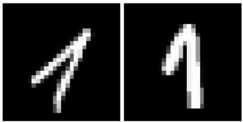

Hình 14.7. Các chữ số bị phân loại lỗi trong bài toán phân loại nhị phân với hai chữ số không và một.

Như vậy, gần 100% các ảnh được phân loại chính xác. Điều này dễ hiểu vì hai chữ số không và một khác nhau rất nhiều.

Tiếp theo, ta cùng đi tìm những ảnh bị phân loại sai và hiển thị chúng:

```python
mis = np.where((y_pred - y_test) !=0)[0]
Xmis = X_test[mis, :]
from display_network import *
filename = 'mnist_mis.pdf'
with PdfPages(filename) as pdf:
plt.axis('off')
A = display_network(Xmis.T, 1, Xmis.shape[0])
f2 = plt.imshow(A, interpolation='nearest' )
plt.gray()
pdf.savefig(bbox_inches='tight')
plt.show()
```

Chỉ có hai chữ số bị phân loại lỗi được cho trên Hình 14.7. Trong đó, chữ số không bị phân loại lỗi là dễ hiểu vì nó trông rất giống chữ số một.

Bạn đọc có thể xem thêm ví dụ về bài toán xác định giới tính dựa trên ảnh khuôn mặt tại [https://goo.gl/9V8wdD](https://goo.gl/9V8wdD).

## 14.6. Bài toán phân loại đa lớp

Hồi quy logistic được áp dụng cho các bài toán phân loại nhị phân. Các bài toán phân loại thực tế có thể có nhiều hơn hai nhãn dữ liệu, được gọi là bài toán phân loại đa lớp (multi-class classification). Hồi quy logistic cũng có thể được áp dụng vào các bài toán này bằng một vài kỹ thuật.

Có ít nhất bốn cách áp dụng các bộ phân loại nhị phân vào bài toán phân loại đa lớp.

## 14.6.1. one-vs-one

Ta có thể xây dựng nhiều bộ phân loại nhị phân cho từng cặp hai nhãn dữ liệu. Bộ thứ nhất phân biệt nhãn thứ nhất và nhãn thứ hai, bộ thứ hai phân biệt nhãn thứ nhất và nhãn thứ ba,... Có tổng cộng $\begin{array} { r } { P = \frac { C ( C - 1 ) } { 2 } } \end{array}$ bộ phân loại nhị phân cần xây dựng với C là số lượng nhãn. Cách thực hiện này được gọi là one-vs-one.

<!-- page: 197 -->

Với một điểm dữ liệu kiểm tra, ta dùng tất cả P bộ phân loại để dự đoán nhãn của nó. Kết quả cuối cùng có thể được xác định bằng cách xem điểm dữ liệu đó được gán nhãn nào nhiều nhất. Ngoài ra, nếu mỗi bộ phân loại có thể đưa ra xác suất giống hồi quy logistic, ta có thể tính tổng các xác suất mà điểm dữ liệu đó rơi vào mỗi nhãn. Chú ý rằng tổng các xác suất là P thay vì một bởi có P bộ phân loại khác nhau.

Cách làm này không lợi về tính toán vì số bộ phân loại phải huấn luyện tăng nhanh khi số nhãn tăng lên. Hơn nữa, điều không hợp lý xảy ra nếu một chữ số có nhãn bằng một được đưa vào bộ phân loại giữa hai nhãn chữ số năm và sáu.

## 14.6.2. Phân loại phân tầng

One-vs-one yêu cầu xây dựng $\frac { C ( C { - } 1 ) } { 2 }$ bộ phân loại khác nhau. Để giảm số bộ phân loại cần xây dựng, ta có thể dùng phương pháp phân tầng. Ý tưởng của phương pháp này có thể được thấy qua ví dụ sau.

Xét bài toán phân loại bốn chữ số {4, 5, 6, 7} trong MNIST. Vì chữ số 4 và 7 khá giống nhau, chữ số 5 và 6 khá giống nhau nên trước tiên ta xây dựng bộ phân loại giữa {4, 7} và {5, 6}. Sau đó xây dựng thêm hai bộ phân loại để xác định từng chữ số trong mỗi nhóm. Tổng cộng, ta cần ba bộ phân loại nhị phân so với sáu bộ như khi sử dụng one-vs-one.

Có nhiều cách chia nhỏ tập dữ liệu ban đầu ra các cặp tập con. Cách phân tầng có ưu điểm là giảm số bộ phân loại nhị phân cần xây dựng. Tuy nhiên, cách làm này có một hạn chế lớn: nếu chỉ một bộ phân loại cho kết quả sai thì kết quả cuối cùng chắc chắn sẽ sai. Ví dụ, nếu một ảnh chứa chữ số 5 bị phân loại lỗi bởi bộ phân loại đầu tiên thì cuối cùng nó sẽ bị nhận nhầm thành 4 hoặc 7.

## 14.6.3. Mã hoá nhị phân

Có một cách tiếp tục giảm số bộ phân loại là mã hoá nhị phân. Trong phương pháp này, mỗi nhãn được mã hoá bởi một số nhị phân. Ví dụ, nếu có bốn nhãn thì chúng được mã hoá bởi 00, 01, 10, và 11. Số bộ phân loại nhị phân cần xây dựng chỉ là $m   =   \lceil \log _ { 2 } ( C ) \rceil$ trong đó C là số nhãn, dae là số nguyên nhỏ nhất không nhỏ hơn a. Bộ phân loại đầu tiên giúp xác định bit đầu tiên của nhãn, bộ thứ hai xác định bit tiếp theo,.... Cách làm này sử dụng một số lượng nhỏ nhất các bộ phân loại nhị phân. Tuy nhiên, một điểm dữ liệu chỉ được phân loại đúng khi mọi bộ phân loại nhị phân dự đoán đúng bit tương ứng. Hơn nữa, nếu số nhãn không phải là lũy thừa của hai, mã nhị phân nhận được có thể không tương ứng với nhãn nào.

<!-- page: 198 -->

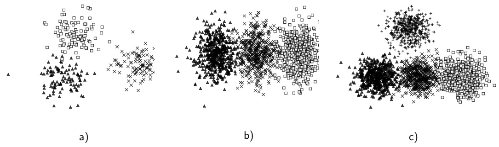

Hình 14.8. Ví dụ về phân phối của các tập dữ liệu trong bài toán phân loại đa lớp.

## 14.6.4. one-vs-rest

Kỹ thuật được sử dụng nhiều nhất là one-vs-rest 39. Cụ thể, C bộ phân loại nhị phân được xây dựng tương ứng với các nhãn. Bộ thứ nhất xác định một điểm có nhãn thứ nhất hay không, hoặc xác suất để một điểm có nhãn đó. Tương tự, bộ thứ hai xác định điểm đó có nhãn thứ hai hay không hoặc xác xuất có nhãn thứ hai là bao nhiêu. Nhãn cuối cùng được xác định theo nhãn mà điểm đó rơi vào với xác suất cao nhất.

Hồi quy logistic trong thư viện scikit-learn có thể được áp dụng trực tiếp vào các bài toán phân loại đa lớp với kỹ thuật one-vs-rest. Với MNIST, ta có thể dùng hồi quy logistic kết hợp với one-vs-rest (mặc định) như sau:

```python
X_train, X_test, y_train, y_test = \
train_test_split(X_all, y_all, test_size=10000)
model = LogisticRegression(C = 1e5) # C is inverse of lam
model.fit(X_train, y_train)
y_pred = model.predict(X_test)
print("Accuracy %.2f %%" % (100*accuracy_score(y_test, y_pred.tolist()))))
```

Kết quả thu được tương đối thấp, khoảng 91.7%. Phương pháp KNN đơn giản hơn đã có độ chính xác khoảng 96%. Điều này chứng tỏ one-vs-rest không làm việc tốt trong trường hợp này.

## 14.7. Thảo luận

## 14.7.1. Kết hợp các phương pháp trên

Trong nhiều trường hợp, ta cần kết hợp nhiều kỹ thuật trong số bốn kỹ thuật đã đề cập. Xét ba ví dụ trong Hình 14.8.

• Hình 14.8a: Cả bốn phương pháp trên đây đều có thể áp dụng được.

<small><span class="docvortex-page-footnote" data-block-type="page_footnote" style="color:#6b7280">39 Một số tài liệu gọi là one-vs-all, one-against-rest, hoặc one-against-all.</span></small>

<!-- page: 199 -->

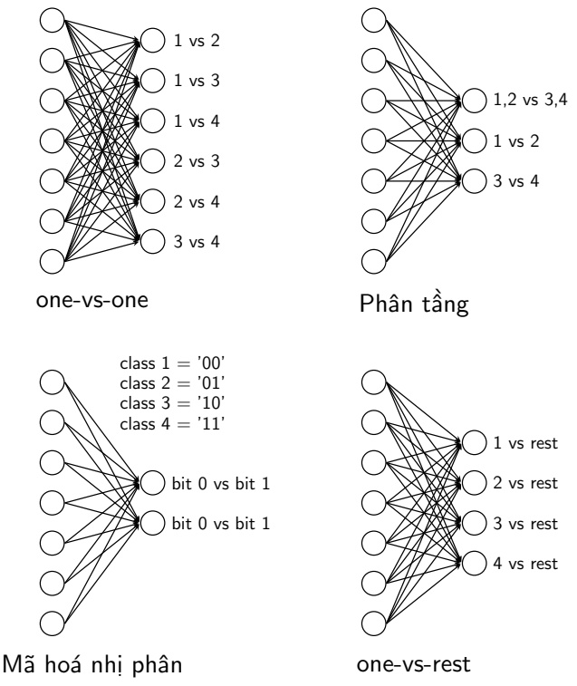

Hình 14.9. Mô hình neural network cho các kỹ thuật sử dụng các bộ phân loại nhị phân cho bài toán phân loại đa lớp.

• Hình 14.8b: One-vs-rest không phù hợp vì tập dữ liệu ở giữa và hợp của hai tập còn lại là không (gần) tách biệt tuyến tính. Lúc này, one-vs-one hoặc phân tầng phù hợp hơn.

• Hình 14.8c: Tương tự như trên, có ba tập dữ liệu thẳng hàng nên one-vs-rest sẽ không phù hợp. Trong khi đó, one-vs-one vẫn hiệu quả vì từng cặp nhãn dữ liệu là (gần) tách biệt tuyến tính. Tương tự, phân tầng cũng làm việc nếu ta phân chia các nhãn một cách hợp lý. Ta cũng có thể kết hợp nhiều phương pháp. Ví dụ, dùng one-vs-rest để tách nhãn ở hàng trên ra khỏi ba nhãn thẳng hàng ở dưới. Ba nhãn còn lại có thể tiếp tục được phân loại bằng các phương pháp khác. Tuy nhiên, khó khăn vẫn nằm ở việc phân nhóm như thế nào.

Với bài toán phân loại đa lớp, nhìn chung các kỹ thuật sử dụng các bộ phân loại nhị phân ít mang lại hiệu quả. Mời bạn đọc thêm Chương 15 và Chương 29 để tìm hiểu về các bộ phân loại đa lớp phổ biến nhất hiện nay.

## 14.7.2. Biểu diễn dưới dạng mạng neuron

Lấy ví dụ bài toán có bốn nhãn dữ liệu {1, 2, 3, 4}; ta có thể biểu diễn các kỹ thuật đã được đề cập dưới dạng mạng neuron như trong Hình 14.9. Mỗi nút ở tầng đầu ra thể hiện đầu ra của một bộ phân loại nhị phân.

Các mạng neuron này đều có nhiều nút ở tầng đầu ra, vector trọng số w đã trở thành ma trận trọng số W. Mỗi cột của W tương ứng với vector trọng số của

<!-- page: 200 -->

một nút đầu ra. Các bộ phân loại nhị phân này có thể được xây dựng đồng thời. Nếu chúng là các bộ hồi quy logistic, công thức cập nhật theo SGD:

$$
\mathbf {w} \leftarrow \mathbf {w} - \eta (a _ {i} - y _ {i}) \mathbf {x} _ {i}\tag{14.20}
$$

có thể được tổng quát thành

$$
\mathbf {W} \leftarrow \mathbf {W} - \eta \mathbf {x} _ {i} (\mathbf {a} _ {i} - \mathbf {y} _ {i}) ^ {T}.\tag{14.21}
$$

Với $\mathbf { W } , \mathbf { y } _ { i } , \mathbf { a } _ { i }$ lần lượt là ma trận trọng $\hat { \mathrm { s 0 } } ,$ vector đầu ra thực sự và vector đầu ra dự đoán ứng với dữ liệu $\mathbf { x } _ { i }$ . Chú $\acute { \mathrm { y } }$ rằng vector $\mathbf { y } _ { i }$ là một vector nhị phân, vector $\mathbf { a } _ { i }$ gồm các phần tử nằm trong khoảng (0, 1).

Chú $\acute { y }$ : Số hạng thứ hai trong (14.21) không thể là $( \mathbf { a } _ { i } - \mathbf { y } _ { i } ) \mathbf { x } _ { i } ^ { T }$ vì ma trận này khác chiều với W. Số hạng này cần là tích của hai vector: vector thứ nhất cần có cùng số hàng với W, tức chiều của dữ liệu $\mathbf { x } _ { i } ;$ vector thứ hai cần phù hợp với số cột của W, tức số nút $\mathring { \mathrm { d } }$ tầng đầu ra.

<!-- page: 201 -->

# Hồi quy softmax

Các bài toán phân loại thực tế thường có nhiều lớp dữ liệu. Như đã thảo luận trong Chương 14, các bộ phân loại nhị phân tuy có thể kết hợp với nhau để giải quyết các bài toán phân loại đa lớp nhưng chúng vẫn có những hạn chế nhất định. Trong chương này, một phương pháp mở rộng của hồi quy logistic có tên là hồi quy softmax sẽ được giới thiệu nhằm khắc phục những hạn chế đã đề cập. Một lần nữa, mặc dù trong tên có chứa từ “hồi quy”, hồi quy softmax được sử dụng cho các bài toán phân loại. Hồi quy softmax là một trong những thành phần phổ biến nhất trong các bộ phân loại hiện nay.

## 15.1. Giới thiệu

Với bài toán phân loại nhị phân sử dụng hồi quy logistic, đầu ra của mạng neural là một số thực trong khoảng (0, 1), có ý nghĩa như xác suất để đầu vào thuộc một trong hai lớp. Ý tưởng này cũng có thể mở rộng cho bài toán phân loại đa lớp, ở đó có C nút ở tầng đầu ra và giá trị mỗi nút đóng vai trò như xác suất để đầu vào rơi vào lớp tương ứng. Như vậy, các đầu ra này liên kết với nhau qua việc chúng đều là các số dương và có tổng bằng một. Mô hình hồi quy softmax thảo luận trong chương này đảm bảo tính chất đó.

Nhắc lại biểu diễn dưới dạng mạng neural của kỹ thuật one-vs-rest như trong Hình 15.1. Tầng đầu ra có thể tách thành hai tầng con z và a. Mỗi thành phần của tầng con thứ hai $a _ { i }$ chỉ phụ thuộc vào thành phần tương ứng ở tầng con thứ nhất $z _ { i }$ thông qua hàm sigmoid $a _ { i }   =   \sigma ( z _ { i } )$ . Các giá trị đầu ra $a _ { i }$ đều là các số dương nhưng vì không có ràng buộc giữa chúng, tổng các xác suất này không đảm bảo bằng một.

Các mô hình hồi quy tuyến tính, PLA, và hồi quy logistic chỉ có một nút ở tầng đầu ra. Trong các trường hợp đó, tham số mô hình chỉ là một vector w.

<!-- page: 202 -->

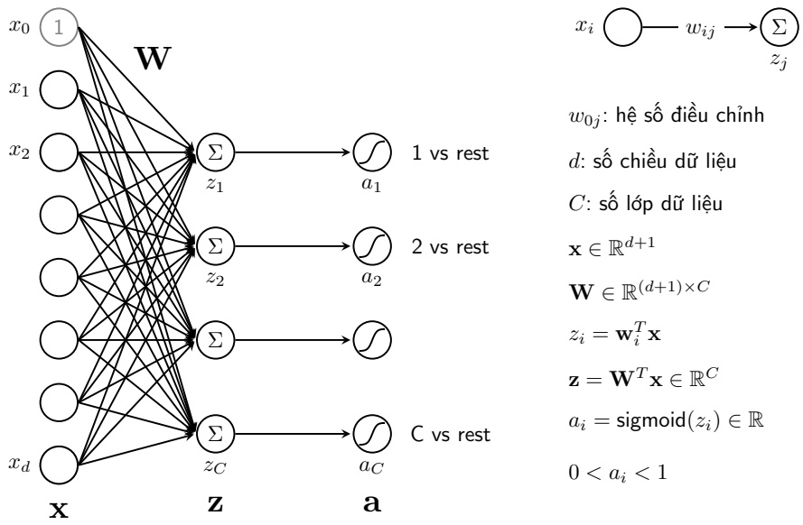

Hình 15.1. Phân loại đa lớp với hồi quy logistic và one-vs-rest.

Trong trường hợp tầng đầu ra có nhiều hơn một nút, tham số mô hình sẽ là tập hợp tham số $\mathbf { w } _ { i }$ ứng với từng nút. Lúc này, ta có một ma trận trọng số $\mathbf { W } = [ \mathbf { w } _ { 1 } , \mathbf { w } _ { 2 } , \ldots , \mathbf { w } _ { C } ]$ , mỗi cột ứng với một nút ở tầng đầu ra.

## 15.2. Hàm softmax

## 15.2.1. Hàm softmax

Chúng ta cần một mô hình xác suất sao cho với mỗi đầu vào $\mathbf { x } , \; a _ { i }$ thể hiện xác suất để đầu vào đó rơi vào lớp thứ i. Vậy điều kiện cần là các $a _ { i }$ phải dương và tổng của chúng bằng một. Ngoài ra, ta sẽ thêm điều kiện giá trị $z _ { i } = \mathbf { x } ^ { T } \mathbf { w } _ { i }$ càng lớn thì xác suất dữ liệu rơi vào lớp thứ i càng cao. Điều kiện cuối này chỉ ra rằng ta cần một quan hệ đồng biến.

Chú ý rằng $z _ { i }$ có thể nhận giá trị cả âm và dương vì nó là một tổ hợp tuyến tính các thành phần của vector đặc trưng x. Một hàm số khả vi đồng biến đơn giản có thể biến $z _ { i }$ thành một giá trị dương là hàm exp $( z _ { i } ) = e ^ { z _ { i } }$ . Hàm số này không những khả vi mà còn có đạo hàm bằng chính nó, việc này mang lại nhiều lợi ích khi tối ưu. Điều kiện tổng các $a _ { i }$ bằng một có thể được đảm bảo nếu

$$
a _ {i} = \frac {\exp (z _ {i})}{\sum_ {j = 1} ^ {C} \exp (z _ {j})}, \forall i = 1, 2, \dots , C.\tag{15.1}
$$

Mối quan hệ này thoả mãn tất cả các điều kiện đã xét: các đầu ra $a _ { i }$ dương, có tổng bằng một và giữ được thứ tự của $z _ { i }$ . Hàm số này được gọi là hàm softmax. Lúc này, ta có thể coi rằng

$$
p (y _ {k} = i | \mathbf {x} _ {k}; \mathbf {W}) = a _ {i}\tag{15.2}
$$

<!-- page: 203 -->

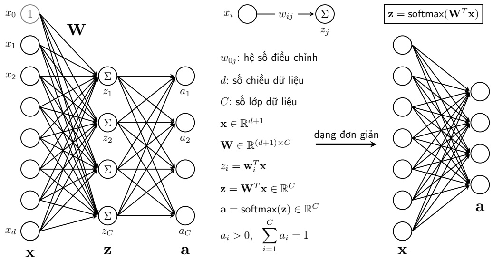

Hình 15.2. Mô hình hồi quy softmax dưới dạng neural network.

Trong đó, $p ( y = i | \mathbf { x } ; \mathbf { W } )$ được hiểu là xác suất để một điểm dữ liệu x rơi vào lớp thứ i nếu biết tham số mô hình là ma trận trọng số W. Hình 15.2 thể hiện mô hình hồi quy softmax dưới dạng mạng neural. Mô hình này khác one-vs-rest nằm ở chỗ nó có các liên kết giữa mọi nút của hai tầng con z và a.

## 15.2.2. Xây dựng hàm softmax trong Python

Dưới đây là một đoạn code thực hiện hàm softmax. Đầu vào là một ma trận với mỗi hàng là một vector z, đầu ra cũng là một ma trận mà mỗi hàng có giá trị là a = softmax(z). Các giá trị của z còn được gọi là score:

```python
import numpy as np
def softmax(Z):
    """
    Compute softmax values for each sets of scores in Z.
    each column of Z is a set of scores.
    Z: a numpy array of shape (N, C)
    return a numpy array of shape (N, C)
    """
    e_Z = np.exp(Z)
    A = e_Z / e_Z.sum(axis = 1, keepdims = True)
    return A
```

## 15.2.3. Một vài ví dụ

Hình 15.3 mô tả một vài ví dụ về mối quan hệ giữa đầu vào và đầu ra của hàm softmax. Hàng trên thể hiện các score $z _ { i }$ với giả sử rằng số lớp dữ liệu là ba. Hàng dưới thể hiện các giá trị đầu ra $a _ { i }$ của hàm softmax.

<!-- page: 204 -->

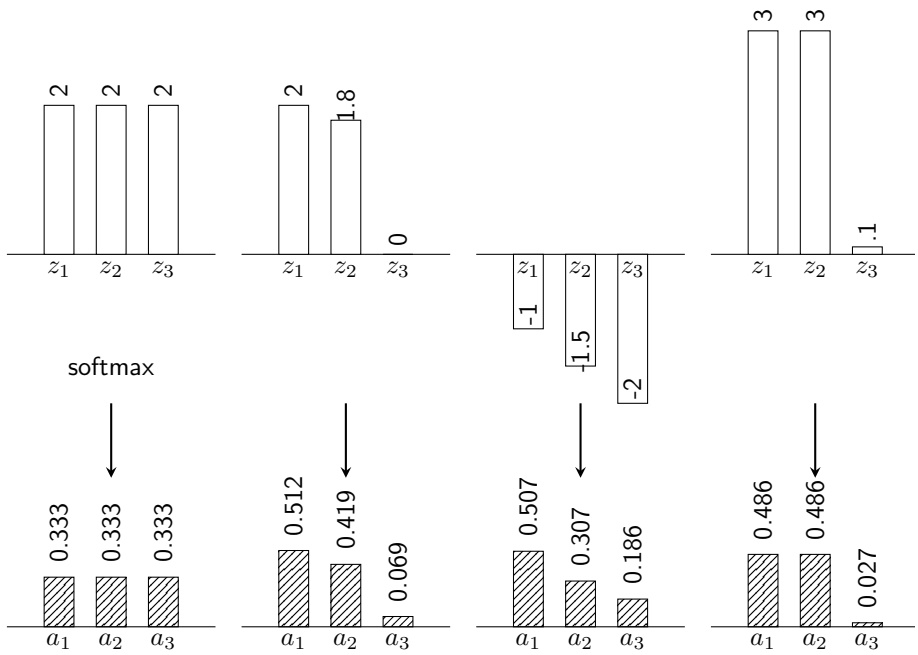

Hình 15.3. Một số ví dụ về đầu vào và đầu ra của hàm softmax.

Có một vài quan sát như sau:

• Cột 1: Nếu các $z _ { i }$ bằng nhau (bằng 2 hoặc một số bất kỳ) thì các $a _ { i }$ cũng bằng nhau và bằng $1 / 3$

• Cột 2: Nếu giá trị lớn nhất trong các $z _ { i }$ là $z _ { 1 }$ vẫn bằng 2, thì mặc dù xác suất tương ứng $a _ { 1 }$ vẫn là lớn nhất, nó đã tăng lên hơn 0.5. Sự chênh lệch ở đầu ra là đáng kể, nhưng thứ tự tương ứng không thay đổi.

• Cột 3: Khi các giá trị $z _ { i }$ là âm thì các giá trị $a _ { i }$ vẫn là dương và thứ tự vẫn được đảm bảo.

• Cột 4: Nếu $z _ { 1 } = z _ { 2 }$ thì $a _ { 1 } = a _ { 2 }$

Bạn đọc có thể thử với các giá trị khác trên trình duyệt tại [https://goo.gl/pKxQYc](https://goo.gl/pKxQYc),phần softmax.

## 15.2.4. Phiên bản ổn định hơn của hàm softmax

Khi một trong các $z _ { i }$ quá lớn, việc tính toán $\exp ( z _ { i } )$ có thể gây ra hiện tượng tràn số, ảnh hưởng lớn tới kết quả của hàm softmax. Có một cách khắc phục hiện tượng này dựa trên quan sát

$$
\frac {\exp (z _ {i})}{\sum_ {j = 1} ^ {C} \exp (z _ {j})} = \frac {\exp (- c) \exp (z _ {i})}{\exp (- c) \sum_ {j = 1} ^ {C} \exp (z _ {j})} = \frac {\exp (z _ {i} - c)}{\sum_ {j = 1} ^ {C} \exp (z _ {j} - c)}\tag{15.3}
$$

<!-- page: 205 -->

với c là một hằng số bất kỳ. Từ đây, một kỹ thuật đơn giản giúp khắc phục hiện tượng tràn số là trừ tất cả các $z _ { i }$ đi một giá trị đủ lớn. Trong thực nghiệm, giá trị đủ lớn này thường được chọn là $c = \operatorname* { m a x } z _ { i }$ . Ta có thể cải tiến đoạn code cho hàm softmax phía trên bằng cách trừ mỗi hàng của ma trận đầu vào Z đi giá trị lớn nhất trong hàng đó. Ta có phiên bản ổn định hơn là softmax\_stable<sup>40</sup>:

```python
def softmax_stable(Z):
    """
    Compute softmax values for each set of scores in Z.
    each row of Z is a set of scores.
    """
    e_Z = np.exp(Z - np.max(Z, axis = 1, keepdims = True))
    A = e_Z / e_Z.sum(axis = 1, keepdims = True)
    return A
```

## 15.3. Hàm mất mát và phương pháp tối ưu

## 15.3.1. Entropy chéo

Đầu ra của mạng softmax, $\mathbf { a } = \operatorname { s o f t m a x } ( \mathbf { W } ^ { T } \mathbf { x } )$ , là một vector có số phần tử bằng số lớp dữ liệu. Các phần tử của vector này là các số dương có tổng bằng một, thể hiện xác suất để điểm đầu vào rơi vào từng lớp dữ liệu. Với một điểm dữ liệu huấn luyện thuộc lớp thứ c, chúng ta mong muốn xác suất tương ứng với lớp này càng cao càng tốt, tức càng gần một càng tốt. Việc này kéo theo các phần tử còn lại gần với không. Một cách tự nhiên, đầu ra thực sự y là một vector có tất cả các phần tử bằng không trừ phần từ ở vị trí thứ c bằng một. Cách biểu diễn nhãn dưới dạng vector này được gọi là mã hoá one-hot.

Hàm mất mát của hồi quy softmax được xây dựng dựa trên bài toán tối thiểu sự khác nhau giữa đầu ra dự đoán a và đầu ra thực sự y ở dạng one-hot. Khi cả hai là các vector thể hiện xác suất, khoảng cách giữa chúng thường được đo bằng một hàm số được gọi là entropy chéo H(y, a). Đặc điểm nổi bật của hàm số

Một đặc điểm nổi bật là nếu cố định y, hàm số sẽ đạt giá trị nhỏ nhất khi $\mathbf { a } = \mathbf { y }$ và càng lớn nếu a càng khác y.

Entropy chéo giữa hai vector phân phối p và q rời rạc được định nghĩa bởi

$$
H (\mathbf {p}, \mathbf {q}) = - \sum_ {i = 1} ^ {C} p _ {i} \log q _ {i}\tag{15.4}
$$

Hình 15.4 thể hiện ưu điểm của hàm entropy chéo so với hàm bình phương khoảng cách Euclid. Đây là ví dụ trong trường hợp $C = 2$ và $p _ { 1 }$ lần lượt nhận các giá trị 0.5, 0.1 và 0.8 và $p _ { 2 } = 1 - p _ { 1 }$ . Có hai nhận xét quan trọng:

<small><span class="docvortex-page-footnote" data-block-type="page_footnote" style="color:#6b7280">40 Xem thêm về cách xử lý mảng numpy trong Python tại [https://fundaml.com](https://fundaml.com)</span></small>

<!-- page: 206 -->

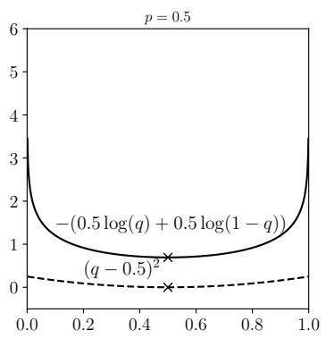

(a)

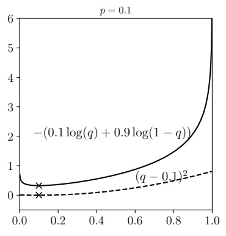

(b)

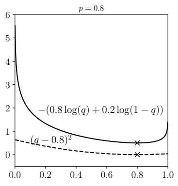

(c)

Hình 15.4. So sánh hàm entropy chéo (đường nét $\mathsf { I i } \hat { \mathsf { e } } \mathsf { n } )$ và hàm bình phương khoảng cách (đường nét đứt). Các điểm được đánh dấu thể hiện điểm cực tiểu toàn cục của mỗi hàm. Càng xa điểm cực tiểu toàn cục, khoảng cách giữa hai hàm số càng lớn.

• Giá trị nhỏ nhất của cả hai hàm số đạt được khi $q = p$ tại hoành độ các điểm được đánh dấu.

• Nhận thấy rằng hàm entropy chéo nhận giá trị rất cao, tức mất mát rất cao, khi q ở xa p. Sự chênh lệch giữa các mất mát ở gần hay xa nghiệm của hàm bình phương khoảng cách $( q - p ) ^ { 2 }$ là ít đáng kể hơn. Về mặt tối ưu, hàm entropy chéo sẽ cho nghiệm gần với p hơn vì những nghiệm ở xa gây ra mất mát lớn.

Hai tính chất trên đây khiến hàm entropy chéo được sử dụng rộng rãi khi tính khoảng cách giữa hai phân phối xác suất. Tiếp theo, chúng ta sẽ chứng minh nhận định sau.

Cho $\mathbf { p } \in \mathbb { R } _ { + } ^ { C }$ là một vector với các thành phần dương có tổng bằng một. Bài toán tối ưu

$$
\mathbf {q} = \arg \min _ {\mathbf {q}} H (\mathbf {p}, \mathbf {q})
$$

$$
\text {thoả   mãn:} \sum_ {i = 1} ^ {C} q _ {i} = 1; q _ {i} > 0
$$

có nghiệm $\mathbf { q } = \mathbf { p }$

Bài toán này có thể giải quyết bằng phương pháp nhân tử Lagrange (xem Phụ lục A).

Lagrangian của bài toán tối ưu này là

$$
\mathcal {L} (q _ {1}, q _ {2}, \dots , q _ {C}, \lambda) = - \sum_ {i = 1} ^ {C} p _ {i} \log (q _ {i}) + \lambda (\sum_ {i = 1} ^ {C} q _ {i} - 1)
$$

<!-- page: 207 -->

Ta cần giải hệ phương trình

$$
\nabla_ {q _ {1}, \dots , q _ {C}, \lambda} \mathcal {L} (q _ {1}, \dots , q _ {C}, \lambda) = 0 \Leftrightarrow \left\{ \begin{array}{c} - \frac {p _ {i}}{q _ {i}} + \lambda = 0, \quad i = 1, \dots , C \\ q _ {1} + q _ {2} + \dots + q _ {C} = 1 \end{array} \right.
$$

Từ phương trình thứ nhất ta có $$p _ { i } = \lambda q _ { i } .$ Vi v\hat{ay}, $1 = \sum _ { i = 1 } ^ { C } p _ { i } = \lambda \sum _ { i = 1 } ^ { C } q _ { i } = \lambda \Rightarrow$$ $\lambda = 1$ . Điều này tương đương với $q _ { i } = p _ { i } , \forall i .$

## Chú ý

a. Hàm entropy chéo không có tính đối xứng $H ( \mathbf { p } , \mathbf { q } ) \neq H ( \mathbf { q } , \mathbf { p } )$ . Điều này có thể nhận ra từ việc các thành phần của p trong công thức (15.4) có thể nhận giá trị bằng không, trong khi các thành phần của q phải là dương vì log(0) không xác định. Chính vì vậy, khi sử dụng entropy chéo trong các bài toán phân loại, p là đầu ra thực sự ở dạng one-hot, q là đầu ra dự đoán. Trong các thành phần thể hiện xác suất của q, không có thành phần nào tuyệt đối bằng một hoặc tuyệt đối bằng không do hàm exp luôn trả về một giá trị dương.

b. Khi p là một vector ở dạng one-hot, giả sử chỉ có $p _ { c }   =   1$ , biểu thức entropy chéo trở thành $- \log ( q _ { c } )$ . Biểu thức này đạt giá trị nhỏ nhất nếu $q _ { c } = 1$ , điều này không xảy ra vì nghiệm này không thuộc miền xác định của bài toán. Tuy nhiên, giá trị entropy chéo tiệm cận tới không khi $q _ { c }$ tiến đến một, tức $z _ { c }$ rất rất lớn so với các $z _ { i }$ còn lại.

## 15.3.2. Xây dựng hàm mất mát

Trong trường hợp có C lớp dữ liệu, mất mát giữa đầu ra dự đoán và đầu ra thực sự của một điểm dữ liệu $\mathbf { x } _ { i }$ với nhãn $\mathbf { y } _ { i }$ được tính bởi

$$
J _ {i} (\mathbf {W}) \triangleq J (\mathbf {W}; \mathbf {x} _ {i}, \mathbf {y} _ {i}) = - \sum_ {j = 1} ^ {C} y _ {j i} \log (a _ {j i})\tag{15.5}
$$

với $y _ { j i }$ và $a _ { j i }$ lần lượt là phần tử thứ $j$ của vector xác suất $\mathbf { y } _ { i }$ và $\mathbf { a } _ { i }$ . Nhắc lại rằng đầu ra $\mathbf { a } _ { i }$ phụ thuộc vào đầu vào $\mathbf { x } _ { i }$ và ma trận trọng số W. Tới đây, nếu để $\hat { \mathrm { y } }$ rằng chỉ có đúng một j sao cho $y _ { j i } = 1 , \forall i$ , biểu thức (15.5) chỉ còn lại một số hạng tương ứng với giá trị j đó. Để tránh việc sử dụng quá nhiều ký hiệu, chúng ta giả sử rằng $y _ { i }$ là nhãn của điểm dữ liệu $\mathbf { x } _ { i }$ (các nhãn là các số tự nhiên từ 1 tới C), khi đó $j$ chính bằng $y _ { i }$ . Sau khi có ký hiệu này, ta có thể viết lại

$$
J _ {i} (\mathbf {W}) = - \log (a _ {y _ {i}, i})\tag{15.6}
$$

với $a _ { y _ { i } , i }$ là phần tử thứ $y _ { i }$ của vector $\mathbf { a } _ { i }$ .

Khi sử dụng toàn bộ tập huấn luyện $\mathbf { x } _ { i } , \mathbf { y } _ { i } , i = 1 , 2 , \ldots , N$ , hàm mất mát của hồi quy softmax được xác định bởi

<!-- page: 208 -->

$$
J (\mathbf {W}; \mathbf {X}, \mathbf {Y}) = - \frac {1}{N} \sum_ {i = 1} ^ {N} \log (a _ {y _ {i}, i})\tag{15.7}
$$

Ở đây, ma trận trọng số W là biến cần tối ưu. Hàm mất mát này có gradient khá gọn, kỹ thuật tính gradient gần giống với hồi quy logistic. Để tránh quá khớp, ta cũng có thể sử dụng cơ chế kiểm soát suy giảm trọng số:

$$
\bar {J} (\mathbf {W}; \mathbf {X}, \mathbf {Y}) = - \frac {1}{N} \left(\sum_ {i = 1} ^ {N} \log (a _ {y _ {i}, i}) + \frac {\lambda}{2} \| \mathbf {W} \| _ {F} ^ {2}\right)\tag{15.8}
$$

Trong các mục tiếp theo, chúng ta sẽ làm việc với hàm mất mát (15.7). Việc mở rộng cho hàm mất mát với cơ chế kiểm soát (15.8) không phức tạp vì gradient của số hạng kiểm soát $\textstyle \frac { \lambda } { 2 } \| \mathbf { W } \| _ { F } ^ { 2 }$ đơn giản là λW. Hàm mất mát (15.7) có thể được thực hiện trên Python như sau<sup>41</sup>:

```python
def softmax_loss(X, y, W):
    """
    W: 2d numpy array of shape (d, C),
    each column corresponding to one output node
    X: 2d numpy array of shape (N, d), each row is one data point
    y: 1d numpy array -- label of each row of X
    """
    A = softmax_stable(X.dot(W))
    id0 = range(X.shape[0]) # indexes in axis 0, indexes in axis 1 are in y
    return -np.mean(np.log(A[id0, y]))
```

## Chú ý

a. Khi biểu diễn dưới dạng toán học, mỗi điểm dữ liệu là một cột của ma trận X; nhưng khi làm việc với numpy, mỗi điểm dữ liệu được đọc theo axis = 0 của mảng hai chiều X. Việc này thống nhất với các thư viện scikit-learn hay tensorflow ở việc X[i] được dùng để chỉ điểm dữ liệu thứ i, tính từ 0. Tức là, nếu có N điểm dữ liệu trong không gian d chiều thì $\mathbf { X } \in \mathbb { R } ^ { d \times N }$ , nhưng X.shape == (N, d).

b. $\mathbf { W } \in \mathbb { R } ^ { d \times C }$ , W.shape == (d, C).

c. W<sup>T</sup>X sẽ được biểu diễn bởi X.dot(W), và có shape == (N, C).

d. Khi làm việc với phép nhân ma trận hay mảng nhiều chiều trong numpy, cần chú ý tới kích thước của các ma trận sao cho các phép nhân thực hiện được.

## 15.3.3. Tối ưu hàm mất mát

Hàm mất mát sẽ được tối ưu bằng gradient descent, cụ thể là mini-batch gradient descent. Mỗi lần cập nhật của mini-batch gradient descent được thực hiện trên

<small><span class="docvortex-page-footnote" data-block-type="page_footnote" style="color:#6b7280">41 Truy cập vào nhiều phần tử của mảng hai chiều trong numpy - FundaML [https://goo.gl/SzLDxa](https://goo.gl/SzLDxa).</span></small>

<!-- page: 209 -->

một batch có số phần tử $1 < k \ll N$ . Để tính được gradient của hàm mất mát theo tập con này, trước hết ta xem xét gradient của hàm mất mát tại một điểm dữ liệu.

Với chỉ một cặp dữ liệu $( \mathbf { x } _ { i } , \mathbf { y } _ { i } )$ , ta dùng (15.5)

$$
\begin{array}{l} J _ {i} (\mathbf {W}) = - \sum_ {j = 1} ^ {C} y _ {j i} \log (a _ {j i}) = - \sum_ {j = 1} ^ {C} y _ {j i} \log \left(\frac {\exp (\mathbf {x} _ {i} ^ {T} \mathbf {w} _ {j})}{\sum_ {k = 1} ^ {C} \exp (\mathbf {x} _ {i} ^ {T} \mathbf {w} _ {k})}\right) \\ \qquad = - \sum_ {j = 1} ^ {C} \left(y _ {j i} \mathbf {x} _ {i} ^ {T} \mathbf {w} _ {j} - y _ {j i} \log \left(\sum_ {k = 1} ^ {C} \exp (\mathbf {x} _ {i} ^ {T} \mathbf {w} _ {k})\right)\right) \\ \qquad = - \sum_ {j = 1} ^ {C} y _ {j i} \mathbf {x} _ {i} ^ {T} \mathbf {w} _ {j} + \log \left(\sum_ {k = 1} ^ {C} \exp (\mathbf {x} _ {i} ^ {T} \mathbf {w} _ {k})\right) \end{array} \tag {15}\tag{15.9}
$$

Tiếp theo ta sử dụng công thức

$$
\nabla_ {\mathbf {W}} J _ {i} (\mathbf {W}) = \left[ \nabla_ {\mathbf {w} _ {1}} J _ {i} (\mathbf {W}), \nabla_ {\mathbf {w} _ {2}} J _ {i} (\mathbf {W}), \dots , \nabla_ {\mathbf {w} _ {C}} J _ {i} (\mathbf {W}) \right].\tag{15.10}
$$

Trong đó, gradient theo từng cột của $\mathbf { w } _ { j }$ có thể tính được dựa theo (15.9) và quy tắc chuỗi:

$$
\begin{array}{r l} \nabla_ {\mathbf {w} _ {j}} J _ {i} (\mathbf {W}) & = - y _ {j i} \mathbf {x} _ {i} + \frac {\exp (\mathbf {x} _ {i} ^ {T} \mathbf {w} _ {j})}{\sum_ {k = 1} ^ {C} \exp (\mathbf {x} _ {i} ^ {T} \mathbf {w} _ {k})} \mathbf {x} _ {i} \\ & = - y _ {j i} \mathbf {x} _ {i} + a _ {j i} \mathbf {x} _ {i} = \mathbf {x} _ {i} (a _ {j i} - y _ {j i}) \\ & = e _ {j i} \mathbf {x} _ {i} (\mathrm{vói} e _ {j i} = a _ {j i} - y _ {j i}) \end{array}\tag{15.11}
$$

Giá trị $e _ { j i } = a _ { j i } - y _ { j i }$ chính là sự sai khác giữa đầu ra dự đoán và đầu ra thực sự tại thành phần thứ j. Kết hợp (15.10) và (15.11) với $\mathbf { e } _ { i } = \mathbf { a } _ { i } - \mathbf { y } _ { i }$ , ta có

$$
\nabla_ {\mathbf {W}} J _ {i} (\mathbf {W}) = \mathbf {x} _ {i} [ e _ {1 i}, e _ {2 i}, \dots , e _ {C i} ] = \mathbf {x} _ {i} \mathbf {e} _ {i} ^ {T}\tag{15.12}
$$

$$
\Rightarrow \nabla_ {\mathbf {W}} J (\mathbf {W}) = \frac {1}{N} \sum_ {i = 1} ^ {N} \mathbf {x} _ {i} \mathbf {e} _ {i} ^ {T} = \frac {1}{N} \mathbf {X} \mathbf {E} ^ {T}\tag{15.13}
$$

với $\mathbf { E } = \mathbf { A } - \mathbf { Y }$ . Công thức đơn giản này giúp cả batch gradient descent và minibatch gradient descent có thể dễ dàng được áp dụng. Trong trường hợp mini-batch gradient, giả sử kích thước batch là k, ký hiệu $\mathbf { X } _ { b } \in \mathbb { R } ^ { d \times k } , \mathbf { Y } _ { b } \in \{ 0 , 1 \} ^ { C \times k } , \mathbf { A } _ { b } \in$ $\mathbb { R } ^ { C \times k }$ là dữ liệu ứng với một batch, công thức cập nhật cho một batch sẽ là

$$
\mathbf {W} \leftarrow \mathbf {W} - \frac {\eta}{N _ {b}} \mathbf {X} _ {b} \mathbf {E} _ {b} ^ {T}\tag{15.14}
$$

với $N _ { b }$ là kích thước của mỗi batch và η là tốc độ học.

Hàm số tính gradient theo W trong Python có thể được thực hiện như sau:

<!-- page: 210 -->

```python
def softmax_grad(X, y, W):
    """
    W: 2d numpy array of shape (d, C),
    each column corresponding to one output node
    X: 2d numpy array of shape (N, d), each row is one data point
    y: 1d numpy array -- label of each row of X
    """
    A = softmax_stable(X.dot(W)) # shape of (N, C)
    id0 = range(X.shape[0])
    A[id0, y] -= 1 # A - Y, shape of (N, C)
    return X.T.dot(A)/X.shape[0]
```

Bạn đọc có thể kiểm tra lại sự chính xác của việc tính gradient này bằng hàm check\_grad.

Từ đó, ta có thể viết hàm số huấn luyện hồi quy softmax như sau:

```python
def softmax_fit(X, y, W, lr = 0.01, nepochs = 100, tol = 1e-5, batch_size = 10):
    W_old = W.copy()
    ep = 0
    loss_hist = [loss(X, y, W)] # store history of loss
    N = X.shape[0]
    nbatches = int(np.ceil(float(N)/batch_size))
    while ep < nepochs:
        ep += 1
        mix_ids = np.random.permutation(N) # stochastic
        for i in range(nbatches):
            # get the i-th batch
            batch_ids = mix_ids[batch_size*i:min(batch_size*(i+1), N)]
            X_batch, y_batch = X[batch_ids], y[batch_ids]
            W -= lr*softmax_grad(X_batch, y_batch, W) # gradient descent
            loss_hist.append(softmax_loss(X, y, W))
        if np.linalg.norm(W - W_old)/W.size < tol:
            break
        W_old = W.copy()
    return W, loss_hist
```

Cuối cùng là hàm dự đoán nhãn của các điểm dữ liệu mới. Nhãn của một điểm dữ liệu mới được xác định bằng chỉ số của lớp dữ liệu có xác suất rơi vào cao nhất, và cũng chính là chỉ số của score cao nhất.

```python
def pred(W, X):
    """
    predict output of each columns of X . Class of each x_i is determined by location of the max probability. Note that classes are indexed from 0.
    """
    return np.argmax(X.dot(W), axis =1)
```

<!-- page: 211 -->

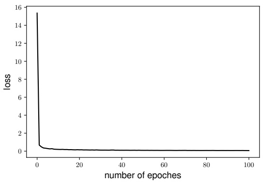

(a)

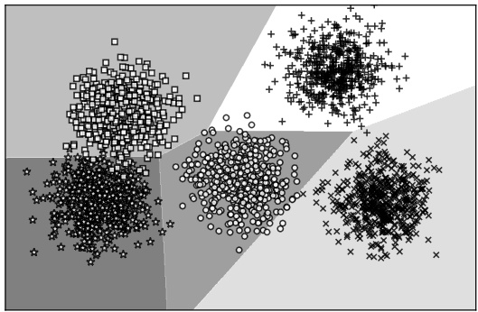

(b)

Hình 15.5. Ví dụ về sử dụng hồi quy softmax cho năm lớp dữ liệu. (a) Giá trị hàm mất mát qua các epoch. (b) Kết quả phân loại cuối cùng.

## 15.4. Ví dụ trên Python

Để minh hoạ ranh giới của các lớp dữ liệu khi sử dụng hồi quy softmax, chúng ta cùng làm một ví dụ nhỏ trong không gian hai chiều với năm lớp dữ liệu:

```python
C, N = 5, 500    # number of classes and number of points per class
means = [[2, 2], [8, 3], [3, 6], [14, 2], [12, 8]]
cov = [[1, 0], [0, 1]]
X0 = np.random.multivariate_normal(means[0], cov, N)
X1 = np.random.multivariate_normal(means[1], cov, N)
X2 = np.random.multivariate_normal(means[2], cov, N)
X3 = np.random.multivariate_normal(means[3], cov, N)
X4 = np.random.multivariate_normal(means[4], cov, N)
X = np.concatenate((X0, X1, X2, X3, X4), axis = 0) # each row is a datapoint
Xbar = np.concatenate((X, np.ones((X.shape[0], 1))), axis = 1) # bias trick

y = np.asarray([0]*N + [1]*N + [2]*N+ [3]*N + [4]*N) # label
W_init = np.random.randn(Xbar.shape[1], C)
W, loss_hist = softmax_fit(Xbar, y, W_init, lr = 0.05)
```

Giá trị của hàm mất mát qua các epoch được cho trên Hình 15.5a. Ta thấy rằng hàm mất mát giảm rất nhanh sau đó hội tụ. Các điểm dữ liệu huấn luyện của mỗi lớp là các điểm có hình dạng khác nhau trong Hình 15.5b. Các phần có nền khác nhau thể hiện vùng của mỗi lớp dữ liệu tìm được bằng hồi quy softmax. Ta thấy rằng các đường ranh giới có dạng đường thẳng. Kết quả phân chia vùng cũng khá tốt, chỉ có một số ít điểm trong tập huấn luyện bị phân loại sai. Ta cũng thấy hồi quy softmax tốt hơn rất nhiều so với phương pháp kết hợp các bộ phân loại nhị phân.

<!-- page: 212 -->

## MNIST với hồi quy softmax trong scikit-learn

Trong scikit-learn, hồi quy softmax được tích hợp trong class sklearn.linear\_model.LogisticRegression. Như sẽ thấy trong phần thảo luận, hồi quy logistic chính là hồi quy softmax cho bài toán phân loại nhị phân. Với bài toán phân loại đa lớp, thư viện này mặc định sử dụng kỹ thuật one-vs-rest. Để sử dụng hồi quy softmax, ta thay đổi thuộc tính multi\_class = ’multinomial’ và solver = ’lbfgs’. Ở đây,’lbfgs’ là một phương pháp tối ưu rất mạnh cũng dựa trên gradient. Trong khuôn khổ của cuốn sách, chúng ta sẽ không thảo luận về phương pháp này<sup>42</sup>.

Quay lại với bài toán phân loại chữ số viết tay trong cơ sở dữ liệu MNIST. Đoạn code dưới đây thực hiện việc lấy ra 10000 điểm dữ liệu trong số 70000 điểm làm tập kiểm tra, còn lại là tập huấn luyện. Bộ phân loại được sử dụng là hồi quy softmax.

```python
import numpy as np
from sklearn.datasets import fetch_mldata
from sklearn.linear_model import LogisticRegression
from sklearn.model_selection import train_test_split
from sklearn.metrics import accuracy_score
mnist = fetch_mldata('MNIST original', data_home='../../data/')
X = mnist.data
y = mnist.target
X_train, X_test, y_train, y_test = train_test_split(X, y, test_size=10000)
model = LogisticRegression(C = 1e5,
solver = 'lbfgs', multi_class = 'multinomial') # C is inverse of lam
model.fit(X_train, y_train)
y_pred = model.predict(X_test)
print("Accuracy %.2f %" % (100*accuracy_score(y_test, y_pred.tolist()))))
```

Kết quả:

```txt
Accuracy: 92.19 %
```

So với kết quả hơn 91.7% của one-vs-rest hồi quy logistic, kết quả của hồi quy softmax đã được cải thiện. Kết quả thấp này hoàn toàn có thể dự đoán được vì thực ra hồi quy softmax chỉ tạo ra các đường ranh giới tuyến tính. Kết quả tốt nhất của bài toán phân loại chữ số trong MNIST hiện nay vào khoảng hơn 99.7%, đạt được bằng một mạng neuron tích chập với rất nhiều tầng ẩn và tầng cuối cùng là một hồi quy softmax.

<small><span class="docvortex-page-footnote" data-block-type="page_footnote" style="color:#6b7280">42 Đọc thêm: Limited-memory BFGS – Wikipedia ([https://goo.gl/qf1kmn](https://goo.gl/qf1kmn)).</span></small>

<!-- page: 213 -->

## 15.5. Thảo luận

## 15.5.1. Hồi quy logistic là trường hợp đặc biệt của hồi quy softmax

Khi $C = 2$ , hồi quy softmax và hồi quy logistic là hai mô hình giống nhau. Thật vậy, với $C = 2$ , đầu ra của hàm softmax cho một đầu vào x là:

$$
a _ {1} = \frac {\exp (\mathbf {x} ^ {T} \mathbf {w} _ {1})}{\exp (\mathbf {x} ^ {T} \mathbf {w} _ {1}) + \exp (\mathbf {x} ^ {T} \mathbf {w} _ {2})} = \frac {1}{1 + \exp (\mathbf {x} ^ {T} (\mathbf {w} _ {2} - \mathbf {w} _ {1}))}; \quad a _ {2} = 1 - a _ {1}\tag{15.15}
$$

Từ đây ta thấy rằng, $a _ { 1 }$ có dạng là một hàm sigmoid với vector trọng số có dạng $\mathbf { w } = - ( \mathbf { w } _ { 2 } - \mathbf { w } _ { 1 } )$ . Khi $C = 2$ , bạn đọc cũng có thể thấy rằng hàm mất mát của hồi quy logistic và hồi quy softmax là như nhau. Hơn nữa, mặc dù có hai đầu ra, hồi quy softmax có thể biểu diễn bởi một đầu ra vì tổng của chúng bằng một.

Giống như hồi quy logistic, hồi quy softmax được sử dụng trong các bài toán phân loại. Các tên gọi này được giữ lại vì vấn đề lịch sử.

## 15.5.2. Ranh giới tạo bởi hồi quy softmax là các mặt tuyến tính

Thật vậy, dựa vào hàm softmax thì một điểm dữ liệu x được dự đoán là rơi vào class j nếu $a _ { j } \geq a _ { k } , \forall k \neq j$ . Bạn đọc có thể chứng minh được rằng:

$$
a _ {j} \geq a _ {k} \Leftrightarrow z _ {j} \geq z _ {k} \Leftrightarrow \mathbf {x} ^ {T} \mathbf {w} _ {j} \geq \mathbf {x} ^ {T} \mathbf {w} _ {k} \Leftrightarrow \mathbf {x} ^ {T} (\mathbf {w} _ {j} - \mathbf {w} _ {k}) \geq 0.\tag{15.16}
$$

Như vậy, một điểm thuộc lớp thứ $j$ nếu và chỉ nếu $\mathbf { x } ^ { T } ( \mathbf { w } _ { j } - \mathbf { w } _ { k } )   \geq   0$ $\forall k \neq j$ Như vậy, mỗi lớp dữ liệu chiếm một vùng là giao của các nửa không gian. Nói cách khác, đường ranh giới giữa các lớp là các mặt tuyến tính.

## 15.5.3. Hồi quy softmax là một trong hai bộ phân loại phổ biến nhất

Hồi quy softmax cùng với máy vector hỗ trợ đa lớp (Chương 29) là hai bộ phân loại phổ biến nhất được dùng hiện nay. Hồi quy softmax đặc biệt được sử dụng nhiều trong các mạng neuron sâu với rất nhiều tầng ẩn. Những tầng phía trước có thể được coi như một bộ trích chọn vector đặc trưng, tầng cuối cùng thường là một hồi quy softmax.

Mã nguồn của chương này có thể được tìm thấy tại [https://goo.gl/XU8ZXm](https://goo.gl/XU8ZXm).

<!-- page: 214 -->

# Mạng neuron đa tầng và lan truyền ngược

## 16.1. Giới thiệu

## 16.1.1. Perceptron cho các hàm logic cơ bản

Chúng ta cùng xét khả năng của perceptron (PLA) trong bài toán biểu diễn các hàm logic nhị phân: NOT, AND, OR, và XOR<sup>43</sup>. Để có thể sử dụng PLA với đầu ra là 1 hoặc -1, ta quy ước True = 1 và False = −1 ở đầu ra. Quan sát hàng trên của Hình 16.1, các điểm hình vuông là các điểm có nhãn bằng 1, các điểm hình tròn là các điểm có nhãn bằng -1. Hàng dưới của Hình 16.1 là các mạng perceptron với những hệ số tương ứng. Nhận thấy rằng với bài toán NOT, AND, và OR, dữ liệu hai lớp là tách biệt tuyến, vì vậy ta có thể tìm được các hệ số cho mạng perceptron giúp biểu diễn chính xác mỗi hàm số. Chẳng hạn với hàm NOT, khi $x _ { 1 }   =   0$ (False), ta có $a   =   \mathrm { s g n } ( - 2 \times 0   +   1 )   =   1$ (True); khi $x _ { 1 }   =   1$ $a = \operatorname{sgn}(-2 \times 1 + 1) = -1$ Trong cả hai trường hợp, đầu ra dự đoán đều giống đầu ra thực sự. Bạn đọc có thể tự kiểm chứng các hệ số với hàm AND và OR.

## 16.1.2. Biểu diễn hàm XOR với nhiều perceptron

Đối với hàm XOR, vì dữ liệu không tách biệt tuyến tính nên không thể biểu diễn bằng một perceptron. Nếu thay perceptron bằng hồi quy logistic ta cũng không tìm được các hệ số thỏa mãn, vì về bản chất, hồi quy logistic hay cả hồi quy softmax chỉ tạo ra các ranh giới tuyến tính. Như vậy, các mô hình mạng neuron đã biết không thể biểu diễn được hàm số logic đơn giản này.

<small><span class="docvortex-page-footnote" data-block-type="page_footnote" style="color:#6b7280">43 đầu ra bằng True nếu và chỉ nếu hai đầu vào logic khác nhau.</span></small>

<!-- page: 215 -->

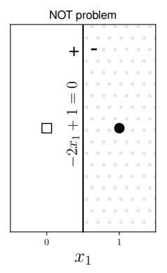

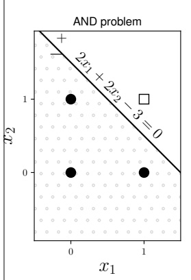

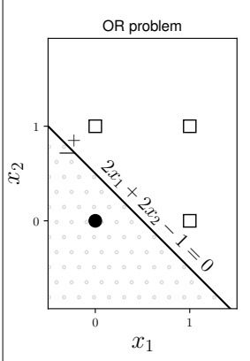

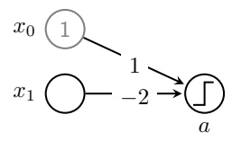

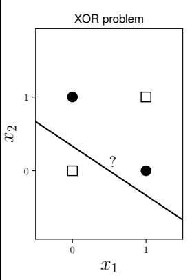

$$
a = \mathsf {s g n} (- 2 x _ {1} + 1)
$$

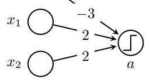

$$
a = \operatorname{sgn} (2 x _ {1} + 2 x _ {2} - 3)
$$

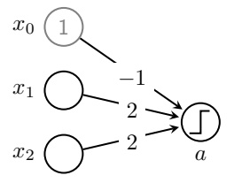

$$
a = \mathsf {s g n} (2 x _ {1} + 2 x _ {2} - 1)
$$

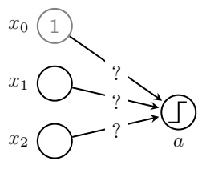

No solution!

Hình 16.1. Biểu diễn các hàm logic cơ bản sử dụng perceptron.

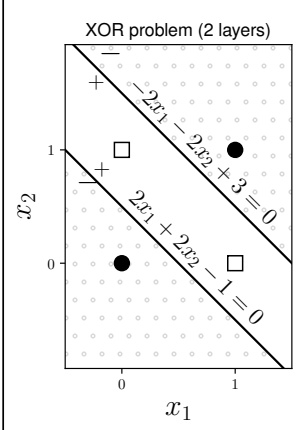

(a)

Input layer

Hidden layer

Output layer

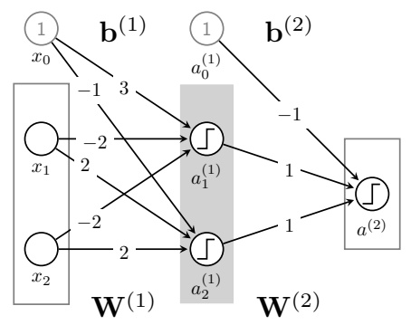

(b)

Hình 16.2. Ba perceptron biểu diễn hàm XOR.

$$
\mathbf {W} ^ {(1)} = \left[ \begin{array}{c c} - 2 & 2 \\ - 2 & 2 \end{array} \right]; \mathbf {b} ^ {(1)} = \left[ \begin{array}{c} 3 \\ - 1 \end{array} \right]
$$

$$
\mathbf {W} ^ {(2)} = \left[ \begin{array}{c} 1 \\ 1 \end{array} \right]; \mathbf {b} ^ {(2)} = \left[ \begin{array}{c} - 1 \end{array} \right]
$$

$$
\mathbf {x} = \left[ \begin{array}{c} x _ {1} \\ x _ {2} \end{array} \right]; \mathbf {a} ^ {(1)} = \left[ \begin{array}{c} a _ {1} ^ {(1)} \\ a _ {2} ^ {(1)} \end{array} \right]
$$

$$
\mathbf {a} ^ {(1)} = f \Big (\mathbf {W} ^ {(1) T} \mathbf {x} + \mathbf {b} ^ {(1)} \Big)
$$

$$
a ^ {(2)} = f \Big (\mathbf {W} ^ {(2) T} \mathbf {a} ^ {(1)} + \mathbf {b} ^ {(2)} \Big)
$$

$$
f (.) = \operatorname{sgn} (.) \text {(element - wise)}
$$

Nhận thấy rằng nếu cho phép sử dụng hai đường thẳng, bài toán biểu diễn hàm XOR có thể được giải quyết như Hình 16.2. Các hệ số tương ứng với hai đường thẳng trong Hình 16.2a được minh họa trên Hình 16.2b. Đầu ra $\left[ a _ { 1 } ^ { ( 1 ) } \right.$ bằng 1 với các điểm nằm về phía (+) của đường thẳng $3 - 2x_{1} - 2x_{2} = 0$ , bằng -1 với các điểm nằm về phía (-). Tương tự, đầu ra $a _ { 2 } ^ { ( 1 ) }$ bằng 1 với các điểm nằm về phía (+) của đường thẳng $-1+2x_{1}+2x_{2}=0$ . Như vậy, hai đường thẳng ứng với hai perceptron này tạo ra hai đầu ra tại các nút $a _ { 1 } ^ { ( 1 ) } , a _ { 2 } ^ { ( \overset { \circ } { 1 } ) }$ . Vì hàm XOR chỉ có một đầu

<!-- page: 216 -->

ra nên ta cần thêm một bước nữa: coi $a _ { 1 } , a _ { 2 }$ như là đầu vào của một perceptron khác. Trong perceptron mới này, đầu vào là các nút ở giữa (cần nhớ giá trị tương ứng với hệ số điều chỉnh luôn có giá trị bằng 1), đầu ra là nút bên phải. Các hệ số được cho trên Hình 16.2b. Kiểm tra lại một chút, với các điểm hình vuông (Hình 16.2a), $a _ { 1 } ^ { ( 1 ) }   =   a _ { 2 } ^ { ( 1 ) }   =   1$ , khi đó $a ^ { ( 2 ) }   =   \mathrm { s g n } ( - 1 + 1 + 1 )   =   1$ . Với các điểm hình tròn, vì $\bar { a _ { 1 } ^ { ( 1 ) } } = - \bar { a _ { 2 } ^ { ( 1 ) } }$ nên $a ^ { ( 2 ) } = \mathrm { s g n } ( - 1   +   a _ { 1 } ^ { ( 1 ) }   +   a _ { 2 } ^ { ( 1 ) } ) = \mathrm { s g n } ( - 1 ) = - 1$ . Trong cả hai trường hợp, đầu ra dự đoán đều giống với đầu ra thực sự. Như vậy, ta sẽ biểu diễn được hàm XOR nếu sử dụng ba perceptron. Ba perceptron kể trên được xếp vào hai tầng (layers). Ở đây, đầu ra của tầng thứ nhất chính là đầu vào của tầng thứ hai. Tổng hợp lại ta được một mô hình mà ngoài tầng đầu vào và đầu ra, ta còn có một tầng ở giữ có nền xám.

Một mạng neuron với nhiều hơn hai tầng còn được gọi là mạng neuron đa tầng (multi-layer neural network) hoặc perceptron đa tầng(multilayer perceptron MLP). Tên gọi perceptron ở đây có thể gây nhầm lẫn<sup>44</sup>, vì cụm từ này để chỉ mạng neuron nhiều tầng và mỗi tầng không nhất thiết là một hoặc nhiều perceptron. Thực chất, perceptron rất hiếm khi được sử dụng trong các mạng neuron đa tầng. Hàm kích hoạt thường là các hàm phi tuyến khác thay vì hàm sgn.

Một mạng neuron đa tầng có thể xấp xỉ mối quan hệ giữa các cặp quan hệ $( \mathbf { x } , \mathbf { y } )$ trong tập huấn luyện bằng một hàm số có dạng

$$
\mathbf {y} \approx g ^ {(L)} \left(g ^ {(L - 1)} \left(\dots (g ^ {(2)} (g ^ {(1)} (\mathbf {x}))\right)\right).\tag{16.1}
$$

Trong đó, tầng thứ nhất đóng vai trò như hàm $\mathbf { a } ^ { ( 1 ) } \triangleq g ^ { ( 1 ) } ( \mathbf { x } )$ ; tầng thứ hai đóng vai trò như hàm $\begin{array} { r } { \mathbf { a } ^ { ( 2 ) } \triangleq g ^ { ( 2 ) } ( \tilde { g ^ { ( 1 ) } } ( \mathbf { x } ) ) = f ^ { ( 2 ) } ( \mathbf { a } ^ { ( 1 ) } ) , } \end{array}$

Trong phạm vi cuốn sách, chúng ta quan tâm tới các tầng đóng vai trò như các hàm có dạng

$$
g ^ {(l)} (\mathbf {a} ^ {(l - 1)}) = f ^ {(l)} (\mathbf {W} ^ {(l) T} \mathbf {a} ^ {(l - 1)} + \mathbf {b} ^ {(l)})\tag{16.2}
$$

với $\mathbf { W } ^ { ( l ) } , \mathbf { b } ^ { ( l ) }$ là ma trận và vector với số chiều phù hợp, $f ^ { ( l ) }$ là các hàm kích hoạt.

## Lưu ý:

• Để đơn giản hơn, chúng ta sử dụng ký hiệu $\mathbf { W } ^ { ( l ) T }$ thay cho $( \mathbf { W } ^ { ( l ) } ) ^ { T }$ (ma trận chuyển vị). Trong Hình 16.2b, ký hiệu ma trận W(<sup>2</sup>) được sử dụng mặc dù nó là một vector. Ký hiệu này được sử dụng trong trường hợp tổng quát khi tầng đầu ra có thể có nhiều hơn một nút. Tương tự với vector điều chỉnh $\mathbf { b } ^ { ( 2 ) }$

• Khác với các chương trước về mạng neuron, khi làm việc với mạng neuron đa tầng, ta nên tách riêng phần vector điều chỉnh và ma trận trọng số. Điều này đồng nghĩa với việc vector đầu vào x là vector KHÔNG mở rộng.

<small><span class="docvortex-page-footnote" data-block-type="page_footnote" style="color:#6b7280">44 Geofrey Hinton, phù thuỷ Deep Learning, từng thừa nhận trong khoá học “Neural Networks for Machine Learning” ([https://goo.gl/UfdT1t](https://goo.gl/UfdT1t)) rằng “Multilayer Neural Networks should never have been called Multilayer Perceptron. It is partly my fault, and I’m sorry.”.</span></small>

<!-- page: 217 -->

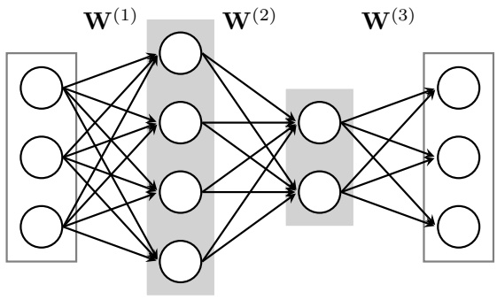

Input Hidden 1 Hidden 2 Output

**Hình 16.3.** MLP với hai tầng ẩn (các hệ số điều chỉnh đã được ẩn đi).

Đầu ra của mạng neuron đa tầng ở dạng này ứng với một đầu vào x có thể được tính theo:

$$
\mathbf {a} ^ {(0)} = \mathbf {x}\tag{16.3}
$$

$$
\mathbf {z} ^ {(l)} = \mathbf {W} ^ {(l) T} \mathbf {a} ^ {(l - 1)} + \mathbf {b} ^ {(l)}, l = 1, 2, \dots , L\tag{16.4}
$$

$$
\mathbf {a} ^ {(l)} = f ^ {(l)} (\mathbf {z} ^ {(l)}), l = 1, 2, \dots , L\tag{16.5}
$$

$$
\hat {\mathbf {y}} = \mathbf {a} ^ {(L)}\tag{16.6}
$$

Vector ŷ chính là đầu ra dự đoán. Bước này được gọi là lan truyền thuận (feedforward) vì cách tính toán được thực hiện từ đầu đến cuối của mạng. Hàm mất mát đạt giá trị nhỏ khi đầu ra dự đoán gần với đầu ra thực sự. Tuỳ vào bài toán, phân loại hoặc hồi quy, chúng ta cần thiết kế các hàm mất mát phù hợp.

## 16.2. Các ký hiệu và khái niệm

## 16.2.1. Tầng

Ngoài tầng đầu vào và tầng đầu ra, một mạng neuron đa tầng có thể có nhiều tầng ẩn (hidden layer) ở giữa. Các tầng ẩn theo thứ tự từ tầng đầu vào đến tầng đầu ra được đánh số thứ thự từ một. Hình 16.3 là một ví dụ về một mạng neuron đa tầng với hai tầng ẩn.

Số lượng tầng trong một mạng neuron đa tầng, được ký hiệu là L, được tính bằng số tầng ẩn cộng với một. Khi đếm số tầng của một mạng neuron đa tầng, ta không tính tầng đầu vào. Trong Hình 16.3, L = 3.

## 16.2.2. Nút

Quan sát Hình 16.4, mỗi điểm hình tròn trong một tầng được gọi là một nút (node hoặc unit). Đầu vào của tầng ẩn thứ l được ký hiệu bởi $\mathbf { z } ^ { ( l ) }$ , đầu ra tại mỗi tầng thường được ký hiệu là $\mathbf { a } ^ { ( l ) }$ (thể hiện activation, tức giá trị tại các nút sau khi áp dụng hàm kích hoạt lên đầu vào $\mathbf { z } ^ { ( l ) } \Big )$ . Đầu ra của nút thứ i trong tầng thứ l được ký hiệu là $a _ { i } ^ { ( l ) }$ . Giả sử thêm rằng số nút trong tầng thứ l (không tính hệ số điều chỉnh) là $d ^ { ( l ) }$ . Vector biểu diễn đầu ra của tầng thứ l là $\mathbf { a } ^ { ( l ) } \in \mathbb { R } ^ { d ^ { ( l ) } }$

<!-- page: 218 -->

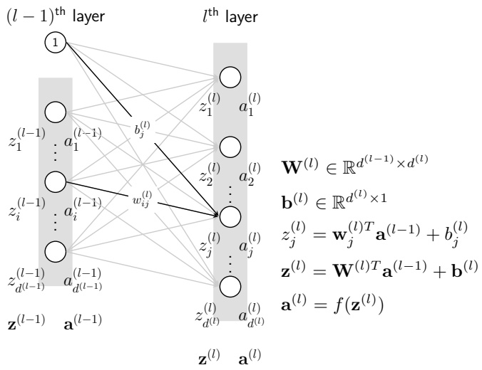

Hình 16.4. Các ký hiệu sử dụng trong mạng neuron đa tầng.

## 16.2.3. Trọng số và hệ số điều chỉnh

Có L ma trận trọng số cho một mạng neuron có L tầng. Các ma trận này được ký hiệu là $\hat { \mathbf { W } ^ { ( l ) } } \in \mathbb { R } ^ { d ^ { ( l - 1 ) } \times d ^ { ( l ) } } , l = 1 , 2 , \ldots , L$ trong đó $\mathbf { W } ^ { ( l ) }$ thể hiện các kết nối từ tầng thứ l − 1 tới tầng thứ l (nếu ta coi tầng đầu vào là tầng thứ 0). Cụ thể hơn, phần tử $w _ { i j } ^ { ( l ) }$ thể hiện kết nối từ nút thứ i của tầng thứ (l − 1) tới nút từ j của tầng thứ (l). Các hệ số điều chỉnh của tầng thứ (l) được ký hiệu là $\mathbf { b } ^ { ( l ) } \in \mathbb { R } ^ { d ^ { ( l ) } }$ Các trọng số này được ký hiệu trên Hình 16.4. Khi tối ưu một mạng neuron đa tầng cho một công việc nào đó, chúng ta cần đi tìm các trọng số và hệ số điều chỉnh này. Tập hợp các trọng số và hệ số điều chỉnh lần lượt được ký hiệu là W và b.

## 16.3. Hàm kích hoạt

Mỗi đầu ra tại một tầng, trừ tầng đầu vào, được tính theo công thức:

$$
\mathbf {a} ^ {(l)} = f ^ {(l)} (\mathbf {W} ^ {(l) T} \mathbf {a} ^ {(l - 1)} + \mathbf {b} ^ {(l)}).\tag{16.7}
$$

Trong đó $f ^ { ( l ) } ( . )$ là một hàm kích hoạt phi tuyến. Nếu hàm kích hoạt tại một tầng là một hàm tuyến tính, tầng này và tầng tiếp theo có thể rút gọn thành một tầng vì hợp của các hàm tuyến tính là một hàm tuyến tính.

Hàm kích hoạt thường là một hàm số áp dụng lên từng phần tử của ma trận hoặc vector đầu vào<sup>45</sup>.

## 16.3.1. Hàm sgn không được sử dụng trong MLP

Hàm sgn chỉ được sử dụng trong perceptron. Trong thực tế, hàm sgn không được sử dụng vì đạo hàm tại hầu hết các điểm bằng không (trừ tại gốc toạ độ không

<small><span class="docvortex-page-footnote" data-block-type="page_footnote" style="color:#6b7280">45 Hàm softmax không áp dụng lên từng phần tử vì nó sử dụng mọi thành phần của vector đầu vào.</span></small>

<!-- page: 219 -->

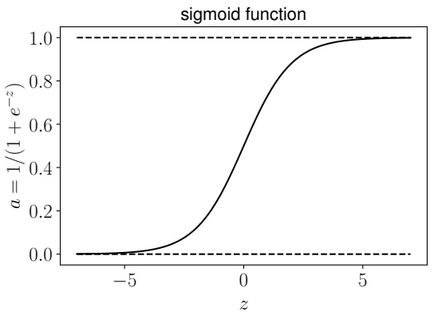

(a)

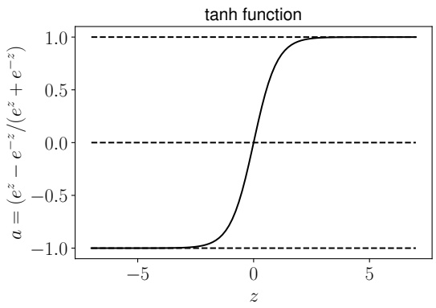

(b)

Hình 16.5. Ví dụ về đồ thị của hàm (a)sigmoid và (b)tanh.

có đạo hàm). Việc đạo hàm bằng không này khiến cho các thuật toán dựa trên gradient không hoạt động.

## 16.3.2. Sigmoid và tanh

Hàm sigmoid có dạng sigmoid $\mathrm { l } ( z ) = 1 / ( 1   +   \exp ( - z ) )$ với đồ thị như trong Hình 16.5a. Nếu đầu vào lớn, hàm số sẽ cho đầu ra gần với một. Với đầu vào nhỏ (rất âm), hàm số sẽ cho đầu ra gần với không. Trước đây, hàm kích hoạt này được sử dụng nhiều vì có đạo hàm rất đẹp. Những năm gần đây, hàm số này ít khi được sử dụng. Một hàm tương tự thường được sử dụng và mang lại hiệu quả tốt hơn là hàm tanh với tanh $\mathbf { i } ( z ) = { \frac { \exp ( z ) - \exp \left( - z \right) } { \exp ( z ) + \exp ( - z ) } }$ . Hàm số này có tính chất đầu ra chạy từ -1 đến 1, khiến cho nó có tính chất tâm không (zero-centered) thay vì chỉ dương như hàm sigmoid. Gần đây, hàm sigmoid chỉ được sử dụng ở tầng đầu ra khi đầu ra là các giá trị nhị phân hoặc biểu diễn các xác suất. Một nhược điểm dễ nhận thấy là khi đầu vào có trị tuyệt đối lớn, đạo hàm của cả sigmoid và tanh rất gần với không. Điều này đồng nghĩa với việc các hệ số tương ứng với nút đang xét sẽ gần như không được cập nhật khi sử dụng công thức cập nhật gradient desent. Thêm nữa, khi khởi tạo các hệ số cho mạng neuron đa tầng với hàm kích hoạt sigmoid, chúng cần tránh trường hợp đầu vào một tầng ẩn nào đó quá lớn, vì khi đó đầu ra của tầng đó rất gần không hoặc một, dẫn đến đạo hàm bằng không và gradient desent hoạt động không hiệu quả.

## 16.3.3. ReLU

ReLU (Rectified Linear Unit) gần đây được sử dụng rộng rãi vì tính đơn giản của nó. Đồ thị của hàm ReLU được minh họa trên Hình 16.6a. Hàm ReLU có công thức toán học $f ( z )   =   \operatorname* { m a x } ( 0 , z )$ – rất đơn giản trong tính toán. Đạo hàm của nó bằng không tại các điểm âm, bằng một tại các điểm dương. ReLU được chứng minh giúp việc huấn luyện các mạng neuron đa tầng nhanh hơn rất nhiều

<!-- page: 220 -->

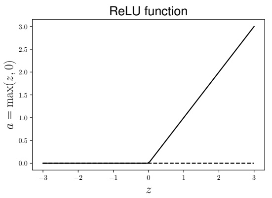

(a)

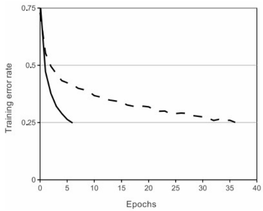

(b)

Hình 16.6. Hàm ReLU và tốc độ hội tụ khi so sánh với hàm tanh.

so với hàm tanh [KSH12]. Hình 16.6b so sánh sự hội tụ của hàm mất mát khi sử dụng hai hàm kích ReLU hoặc tanh. Ta thấy rằng với các mạng sử dụng hàm kích hoạt ReLU, hàm mất mát giảm rất nhanh sau một vài epoch đầu tiên.

Mặc dù cũng có nhược điểm đạo hàm bằng 0 với các giá trị đầu vào âm, ReLU được chứng minh bằng thực nghiệm rằng có thể khắc phục việc này bằng việc tăng số nút ẩn<sup>46</sup>. Khi xây dựng một mạng neuron đa tầng, hàm kích hoạt ReLU nên được thử đầu tiên vì nó nhanh cho kết quả và thường hiệu quả trong nhiều trường hợp. Hầu hết các mạng neuron sâu đều có hàm kích hoạt là ReLU trong các tầng ẩn, trừ hàm kích hoạt ở tầng đầu ra vì nó phụ thuộc vào từng bài toán.

Ngoài ra, các biến thể của ReLU như leaky rectified linear unit (Leaky ReLU), parametric rectified linear unit (PReLU) và randomized leaky rectified linear units (RReLU) [XWCL15] cũng được sử dụng và cho kết quả tốt.

## 16.4. Lan truyền ngược

Phương pháp phổ biến nhất để tối ưu mạng neuron đa tầng chính là gradient descent (GD). Để áp dụng GD, chúng ta cần tính được gradient của hàm mất mát theo từng ma trận trọng số W(<sup>l</sup>) và vector điều chỉnh b(<sup>l</sup>).

Giả sử J(W, b, X, Y) là một hàm mất mát của bài toán, trong đó W, b là tập hợp tất cả các ma trận trọng số và vector điều chỉnh. X, Y là cặp dữ liệu huấn luyện với mỗi cột tương ứng với một điểm dữ liệu. Để có thể áp dụng các phương pháp gradient descent, chúng ta cần tính được các $\nabla _ { \mathbf { W } ^ { ( l ) } } J ; \nabla _ { \mathbf { b } ^ { ( l ) } } J , \; \forall l = 1 , 2 , \ldots , L .$

Nhắc lại quá trình lan truyền thuận:

<small><span class="docvortex-page-footnote" data-block-type="page_footnote" style="color:#6b7280">46 Neural Networks and Deep Learning – Activation function ([https://goo.gl/QGjKmU](https://goo.gl/QGjKmU)).</span></small>

<!-- page: 221 -->

$$
\mathbf {a} ^ {(0)} = \mathbf {x}\tag{16.8}
$$

$$
\mathbf {z} ^ {(l)} = \mathbf {W} ^ {(l) T} \mathbf {a} ^ {(l - 1)} + \mathbf {b} ^ {(l)}, l = 1, 2, \dots , L\tag{16.9}
$$

$$
\mathbf {a} ^ {(l)} = f ^ {(l)} (\mathbf {z} ^ {(l)}), l = 1, 2, \dots , L\tag{16.10}
$$

$$
\hat {\mathbf {y}} = \mathbf {a} ^ {(L)}\tag{16.11}
$$

Xét ví dụ của hàm mất mát là hàm sai số trung bình bình phương (MSE):

$$
J (\mathbf {W}, \mathbf {b}, \mathbf {X}, \mathbf {Y}) = \frac {1}{N} \sum_ {n = 1} ^ {N} \| \mathbf {y} _ {n} - \hat {\mathbf {y}} _ {n} \| _ {2} ^ {2} = \frac {1}{N} \sum_ {n = 1} ^ {N} \| \mathbf {y} _ {n} - \mathbf {a} _ {n} ^ {(L)} \| _ {2} ^ {2}\tag{16.12}
$$

với N là số cặp dữ liệu $( \mathbf { x } , \mathbf { y } )$ trong tập huấn luyện. Theo các công thức này, việc tính toán trực tiếp các giá trị gradient tương đối phức tạp vì hàm mất mát không phụ thuộc trực tiếp vào các ma trận trọng số và vector điều chỉnh. Phương pháp phổ biến nhất được dùng có tên là lan truyền ngược (backpropagation) giúp tính gradient ngược từ tầng cuối cùng đến tầng đầu tiên. Tầng cuối cùng được tính toán trước vì nó ảnh hưởng trực tiếp tới đầu ra dự đoán và hàm mất mát. Việc tính toán gradient của các ma trận trọng số trong các tầng trước được thực hiện dựa trên quy tắc chuỗi quen thuộc cho gradient của hàm hợp.

Stochastic gradient descent có thể được sử dụng để cập nhật các ma trận trọng số và vector điều chỉnh dựa trên một cặp điểm huấn luyện x, y. Đơn giản hơn, ta coi J là hàm mất mát nếu chỉ xét cặp điểm này. $\dot { \mathrm { O } }$ đây J là hàm mất mát bất kỳ, không chỉ hàm MSE như ở trên. Đạo hàm riêng của hàm mất mát theo chỉ một thành phần của ma trận trọng số của tầng đầu ra:

$$
\frac {\partial J}{\partial w _ {i j} ^ {(L)}} = \frac {\partial J}{\partial z _ {j} ^ {(L)}}. \frac {\partial z _ {j} ^ {(L)}}{\partial w _ {i j} ^ {(L)}} = e _ {j} ^ {(L)} a _ {i} ^ {(L - 1)}\tag{16.13}
$$

trong đó $e _ { j } ^ { ( L ) } = \frac { \partial J } { \partial z _ { j } ^ { ( L ) } }$ thường là một đại lượng không quá khó $\mathrm { d } \hat { \mathrm { e } }$ tính toán và $\frac { \partial z _ { j } ^ { ( L ) } } { \partial w _ { i j } ^ { ( L ) } } = a _ { i } ^ { ( L - 1 ) } \stackrel { \circ } { \mathrm { v i } } z _ { j } ^ { ( L ) } = \mathbf { w } _ { j } ^ { ( L ) T } \mathbf { a } ^ { ( L - 1 ) }   +   b _ { j } ^ { ( L ) }$ . Tương tự, gradient của hàm mất mát theo hệ số tự do của tầng cuối cùng là

$$
\frac {\partial J}{\partial b _ {j} ^ {(L)}} = \frac {\partial J}{\partial z _ {j} ^ {(L)}}. \frac {\partial z _ {j} ^ {(L)}}{\partial b _ {j} ^ {(L)}} = e _ {j} ^ {(L)}\tag{16.14}
$$

Với đạo hàm riêng theo trọng số ở các tầng $l < L$ , hãy quan sát Hình 16.7. Ở đây, tại mỗi nút, đầu vào z và đầu ra a được viết riêng để tiện theo dõi.

Dựa vào Hình 16.7, bằng quy nạp ngược từ cuối, ta có thể tính được:

$$
\frac {\partial J}{\partial w _ {i j} ^ {(l)}} = \frac {\partial J}{\partial z _ {j} ^ {(l)}}. \frac {\partial z _ {j} ^ {(l)}}{\partial w _ {i j} ^ {(l)}} = e _ {j} ^ {(l)} a _ {i} ^ {(l - 1)}.\tag{16.15}
$$

<!-- page: 222 -->

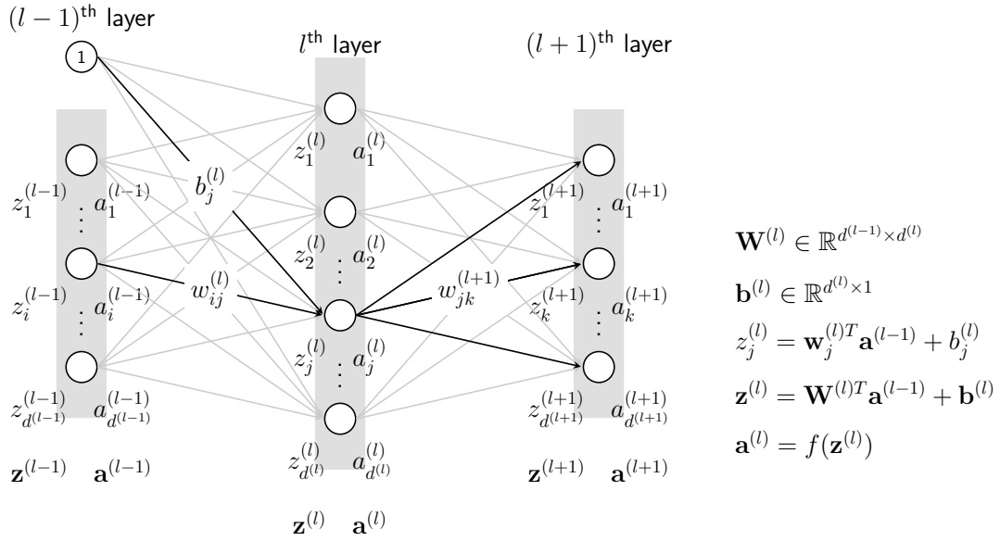

Hình 16.7. Mô phỏng cách tính lan truyền ngược. Tầng cuối có thể là tầng đầu ra.

với:

$$
\begin{array}{l} e _ {j} ^ {(l)} = \frac {\partial J}{\partial z _ {j} ^ {(l)}} = \frac {\partial J}{\partial a _ {j} ^ {(l)}}. \frac {\partial a _ {j} ^ {(l)}}{\partial z _ {j} ^ {(l)}} \\ \quad = \left(\sum_ {k = 1} ^ {d ^ {(l + 1)}} \frac {\partial J}{\partial z _ {k} ^ {(l + 1)}}. \frac {\partial z _ {k} ^ {(l + 1)}}{\partial a _ {j} ^ {(l)}}\right) f ^ {(l) ^ {\prime}} (z _ {j} ^ {(l)}) = \left(\sum_ {k = 1} ^ {d ^ {(l + 1)}} e _ {k} ^ {(l + 1)} w _ {j k} ^ {(l + 1)}\right) f ^ {(l) ^ {\prime}} (z _ {j} ^ {(l)}) \\ \quad = \left(\mathbf {w} _ {j:} ^ {(l + 1)} \mathbf {e} ^ {(l + 1)} f ^ {(l) ^ {\prime}}\right) (z _ {j} ^ {(l)}) \end{array}
$$

trong đó $\mathbf { e } ^ { ( l + 1 ) } = [ e _ { 1 } ^ { ( l + 1 ) } , e _ { 2 } ^ { ( l + 1 ) } , . . . , e _ { d ^ { ( l + 1 ) } } ^ { ( l + 1 ) } ] ^ { T } \in \mathbb { R } ^ { d ^ { ( l + 1 ) } \times 1 } \mathrm { ~ v \hat { a } ~ } \mathbf { w } _ { j : } ^ { ( l + 1 ) }$ được hiểu là hàng thứ j của ma trận $\mathbf { W } ^ { ( l + 1 ) }$ (chú ý dấu hai chấm, khi không có dấu này, chúng ta mặc định dùng nó để ký hiệu cho vector cột). Dấu $\sum$ tính tổng ở dòng thứ hai trong phép tính trên xuất hiện vì $a _ { j } ^ { ( l ) }$ đóng $\mathrm { g \acute { O } p }$ vào việc tính tất cả các $z _ { k } ^ { ( l + 1 ) } , k   =   1 , 2 , \ldots , d ^ { ( l + 1 ) }$ . Biểu thức đạo hàm ngoài dấu ngoặc lớn xuất hiện vì $a _ { j } ^ { ( l ) } = f ^ { ( l ) } ( z _ { j } ^ { ( l ) } )$ . Tới đây, ta có thể thấy rằng việc hàm kích hoạt có đạo hàm đơn giản sẽ có ích rất nhiều trong việc tính toán. Với cách làm tương tự, bạn đọc có thể suy ra

$$
\frac {\partial J}{\partial b _ {j} ^ {(l)}} = e _ {j} ^ {(l)}.\tag{16.16}
$$

Nhận thấy rằng trong những công thức trên, việc tính các $e _ { j } ^ { ( l ) }$ đóng một vài trò quan trọng. Hơn nữa, để tính được giá trị này, ta cần tính được các $e _ { j } ^ { ( l + 1 ) }$ . Nói cách khác, ta cần tính ngược các giá trị này từ tầng cuối cùng. tên gọi lan truyền ngược xuất phát từ đây.

<!-- page: 223 -->

Tóm tắt quá trình tính toán gradient cho ma trận trọng số và vector điều chỉnh tại mỗi tầng:

## Thuật toán 16.1: Lan truyền ngược tới $( 1 0 0 , 0 0 )$

1. Lan truyền thuận: Với 1 giá trị đầu vào x, tính giá trị đầu ra của mạng, trong quá trình tính toán, lưu lại các giá trị $\mathbf { a } ^ { ( l ) }$ tại mỗi tầng.

2. Với mỗi nút j ở tầng đầu ra, tính:

$$
e _ {j} ^ {(L)} = \frac {\partial J}{\partial z _ {j} ^ {(L)}}; \quad \frac {\partial J}{\partial w _ {i j} ^ {(L)}} = a _ {i} ^ {(L - 1)} e _ {j} ^ {(L)}; \quad \frac {\partial J}{\partial b _ {j} ^ {(L)}} = e _ {j} ^ {(L)}\tag{16.17}
$$

3. Với $l = L - 1 , L - 2 , . . . , 1$ , tính:

$$
e _ {j} ^ {(l)} = \left(\mathbf {w} _ {j:} ^ {(l + 1)} \mathbf {e} ^ {(l + 1)}\right) f ^ {\prime} (z _ {j} ^ {(l)})\tag{16.18}
$$

4. Cập nhật gradient cho từng thành phần:

$$
\frac {\partial J}{\partial w _ {i j} ^ {(l)}} = a _ {i} ^ {(l - 1)} e _ {j} ^ {(l)}; \quad \frac {\partial J}{\partial b _ {j} ^ {(l)}} = e _ {j} ^ {(l)}\tag{16.19}
$$

Phiên bản vector hoá của thuật toán trên có thể được thực hiện như sau:

## Thuật toán 16.2: Lan truyền ngược tới $\textcircled { 1 } \textcircled { 2 } \textcircled { 3 } \textcircled { 4 } \textcircled { 5 } \textcircled { 5 } \textcircled { 6 } \textcircled { 7 } \textcircled { 7 } \textcircled { 7 }$

1. Lan truyền thuận: Với một giá trị đầu vào x, tính giá trị đầu ra của mạng, trong quá trình tính toán, lưu lại các $\mathbf { a } ^ { ( l ) }$ tại mỗi tầng.

2. Với tầng đầu ra, tính:

$$
\mathbf {e} ^ {(L)} = \nabla_ {\mathbf {z} ^ {(L)}} J \in \mathbb {R} ^ {d ^ {(L)}}; \nabla_ {\mathbf {W} ^ {(L)}} J = \mathbf {a} ^ {(L - 1)} \mathbf {e} ^ {(L) T} \in \mathbb {R} ^ {d ^ {(L - 1)} \times d ^ {(L)}}; \nabla_ {\mathbf {b} ^ {(L)}} J = \mathbf {e} ^ {(L)}
$$

3. Với $l = L - 1 , L - 2 , . . . , 1$ , tính:

$$
\mathbf {e} ^ {(l)} = \left(\mathbf {W} ^ {(l + 1)} \mathbf {e} ^ {(l + 1)}\right) \odot f ^ {\prime} (\mathbf {z} ^ {(l)}) \in \mathbb {R} ^ {d ^ {(l)}}\tag{16.20}
$$

trong đó $\odot$ là tích Hadamard, tức lấy từng thành phần của hai vector nhân với nhau để được vector kết quả.

4. Cập nhật gradient cho các ma trận trọng số và vector điều chỉnh:

$$
\nabla_ {\mathbf {W} ^ {(l)}} J = \mathbf {a} ^ {(l - 1)} \mathbf {e} ^ {(l) T} \in \mathbb {R} ^ {d ^ {(l - 1)} \times d ^ {(l)}}; \quad \nabla_ {\mathbf {b} ^ {(l)}} J = \mathbf {e} ^ {(l)}\tag{16.21}
$$

Khi làm việc với các phép tính gradient phức tạp, ta luôn cần nhớ hai điều sau:

<!-- page: 224 -->

• Gradient của một hàm có đầu ra là một số vô hướng theo một vector hoặc ma trận là một đại lượng có cùng kích thước với vector hoặc ma trận đó.

• Phép nhân ma trận và vector thực hiện được chỉ khi chúng có kích thước phù hợp.

Trong công thức $\nabla _ { \mathbf { W } ^ { ( L ) } } J = \mathbf { a } ^ { ( L - 1 ) } \mathbf { e } ^ { ( L ) T }$ , vế trái là một ma trận thuộc $\mathbb { R } ^ { d ^ { ( L - 1 ) } \times d ^ { ( L ) } }$ vậy vế phải cũng phải là một đại lượng có chiều tương tự. Từ đó bạn đọc có thể thấy tại sao vế phải phải là $\mathbf { a } ^ { ( L - 1 ) } \mathbf { e } ^ { ( L ) T }$ mà không thể là $\mathbf { a } ^ { ( L - 1 ) } \mathbf { e } ^ { ( L ) }$ hay $\mathbf { e } ^ { ( L ) } \mathbf { a } ^ { ( L - 1 ) }$

## 16.4.1. Lan truyền ngược cho một mini-batch

Nếu ta muốn thực hiện batch hoặc mini-batch GD thì thế nào? Trong thực tế, mini-batch GD được sử dụng nhiều nhất với các bài toán mà tập huấn luyện lớn. Nếu lượng dữ liệu nhỏ, batch GD trực tiếp được sử dụng. Khi đó, cặp (đầu vào, đầu ra) sẽ ở dạng ma trận (X, Y). Giả sử mỗi mini-batch có N dữ liệu. Khi đó, $\mathbf { X } \in \mathbb { R } ^ { \overset { \cdot } { d ^ { ( 0 ) } } \times N } , \mathbf { Y } \in \mathbb { R } ^ { d ^ { ( L ) } \times N }$ . Với $d ^ { ( 0 ) } = d$ là chiều của dữ liệu đầu vào.

Khi đó các activation sau mỗi layer sẽ có dạng $\mathbf { A } ^ { ( l ) } \in \mathbb { R } ^ { d ^ { ( l ) } \times N }$ . Tương tự, $\mathbf { E } ^ { ( l ) } \in$ $\mathbb { R } ^ { d ^ { ( l ) } \times N }$ . Và ta cũng có thể suy ra công thức cập nhật như sau:

## Thuật toán 16.3: Lan truyền ngược tới W(<sup>l</sup>) và b(<sup>l</sup>)(mini-batch)

a. Lan truyền thuận: Với toàn bộ dữ liệu hoặc một mini-batch đầu vào X, tính giá trị đầu ra của mạng, trong quá trình tính toán, lưu lại các $\mathbf { A } ^ { ( l ) }$ tại mỗi tầng. Mỗi cột của $\mathbf { A } ^ { ( l ) }$ tương ứng với một cột của X, tức một điểm dữ liệu đầu vào.

b. Tại tầng đầu ra, tính:

$$
\mathbf {E} ^ {(L)} = \nabla_ {\mathbf {Z} ^ {(L)}} J; \quad \nabla_ {\mathbf {W} ^ {(L)}} J = \mathbf {A} ^ {(L - 1)} \mathbf {E} ^ {(L) T}; \quad \nabla_ {\mathbf {b} ^ {(L)}} J = \sum_ {n = 1} ^ {N} \mathbf {e} _ {n} ^ {(L)}
$$

c. Với $l = L - 1 , L - 2 , . . . , 1$ , tính:

$$
\mathbf {E} ^ {(l)} = \left(\mathbf {W} ^ {(l + 1)} \mathbf {E} ^ {(l + 1)}\right) \odot f ^ {\prime} (\mathbf {Z} ^ {(l)})
$$

d. Cập nhật gradient cho ma trận trọng số và vector điều chỉnh:

$$
\nabla_ {\mathbf {W} ^ {(l)}} J = \mathbf {A} ^ {(l - 1)} \mathbf {E} ^ {(l) T}; \quad \nabla_ {\mathbf {b} ^ {(l)}} J = \sum_ {n = 1} ^ {N} \mathbf {e} _ {n} ^ {(l)}
$$

<!-- page: 225 -->

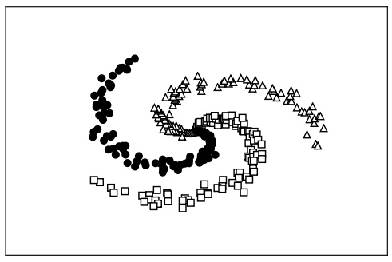

(a)

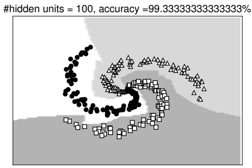

(b)

Hình 16.8. Dữ liệu giả trong không gian hai chiều và ví dụ về các ranh giới tốt.

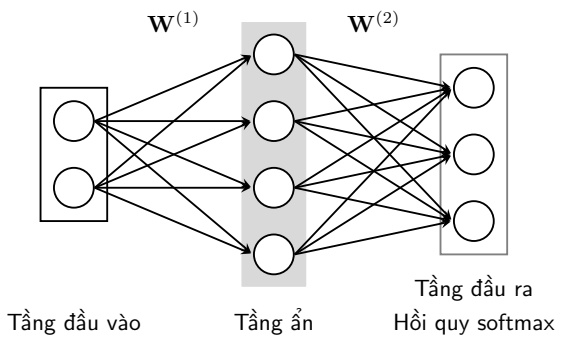

**Hình 16.9.** Mạng neuron đa tầng với tầng đầu vào có hai nút (nút điều chỉnh đã được ẩn), một tầng ẩn với hàm kích hoạt ReLU (có thể có số lượng nút ẩn tuỳ ý), và tầng đầu ra là một hồi quy softmax với ba phần tử đại diện cho ba lớp dữ liệu.

## 16.5. Ví dụ trên Python

Trong mục này, chúng ta sẽ tạo dữ liệu giả trong không gian hai chiều sao cho đường ranh giới giữa các class không có dạng tuyến tính. Điều này khiến hồi quy softmax không làm việc được. Tuy nhiên, bằng cách thêm một tầng ẩn, chúng ta sẽ thấy rằng mạng neuron này làm việc rất hiệu quả.

## 16.5.1. Tạo dữ liệu giả

Các điểm dữ liệu giả của ba lớp được tạo và minh hoạ bởi các điểm vuông, tròn, tam giác trong Hình 16.8a. Ta thấy rõ ràng rằng đường ranh giới giữa các lớp dữ liệu không thể là các đường thẳng. Hình 16.8b là một ví dụ về các đường ranh giới được coi là tốt với hầu hết các điểm dữ liệu. Các đường ranh giới này tạo được bởi một mạng neuron với một tầng ẩn sử dụng ReLU làm hàm kích hoạt và tầng đầu ra là một hồi quy softmax như trong Hình 16.9. Chúng ta cùng đi sâu vào xây dựng bộ phân loại dựa trên dữ liệu huấn luyện này.

Nhắc lại hàm ReLU $f ( z ) = \operatorname* { m a x } ( z , 0 )$ , với đạo hàm:

$$
f ^ {\prime} (z) = \left\{ \begin{array}{l} 0 \text {neu} z \leq 0 \\ 1 \quad \text {o.w} \end{array} \right.\tag{16.22}
$$

<!-- page: 226 -->

Vì lượng dữ liệu huấn luyện nhỏ chỉ với 100 điểm cho mỗi lớp, ta có thể dùng batch GD để cập nhật các ma trận trọng số và vector điều chỉnh. Trước hết, ta cần tính gradient của hàm mất mát theo các ma trận và vector này bằng lan truyền ngược.

## 16.5.2. Tính toán lan truyền thuận

Giả sử các cặp dữ liệu huấn luyện là $( \mathbf { x } _ { i } , \mathbf { y } _ { i } )$ với $\mathbf { y } _ { i }$ là một vector ở dạng one-hot. Các điểm dữ liệu này xếp cạnh nhau tạo thành các ma trận đầu vào X và ma trận đầu ra Y. Bước lan truyền thuận được thực hiện như sau:

$$
\mathbf {Z} ^ {(1)} = \mathbf {W} ^ {(1) T} \mathbf {X} + \mathbf {B} ^ {(1)}\tag{16.23}
$$

$$
\mathbf {A} ^ {(1)} = \max (\mathbf {Z} ^ {(1)}, \mathbf {0})\tag{16.24}
$$

$$
\mathbf {Z} ^ {(2)} = \mathbf {W} ^ {(2) T} \mathbf {A} ^ {(1)} + \mathbf {B} ^ {(2)}\tag{16.25}
$$

$$
\hat {\mathbf {Y}} = \mathbf {A} ^ {(2)} = \mathrm{softmax} (\mathbf {Z} ^ {(2)})\tag{16.26}
$$

Trong đó $\mathbf { B } ^ { ( 1 ) } , \mathbf { B } ^ { ( 2 ) }$ là các ma trận điều chỉnh với tất cả các cột bằng nhau lần lượt bằng $\mathbf { b } ^ { ( 1 ) }$ và $\mathbf { b } ^ { ( 2 ) 4 7 }$ . Hàm mất mát được sử dụng là hàm entropy chéo:

$$
J \triangleq J (\mathbf {W}, \mathbf {b}; \mathbf {X}, \mathbf {Y}) = - \frac {1}{N} \sum_ {i = 1} ^ {N} \sum_ {j = 1} ^ {C} y _ {j i} \log (\hat {y} _ {j i})\tag{16.27}
$$

## 16.5.3. Tính toán lan truyền ngược

$\mathrm { \AA _ { P } }$ dụng Thuật toán 16.3, ta có

$$
\mathbf {E} ^ {(2)} = \nabla_ {\mathbf {Z} ^ {(2)}} = \frac {1}{N} (\mathbf {A} ^ {(2)} - \mathbf {Y})\tag{16.28}
$$

$$
\nabla_ {\mathbf {W} ^ {(2)}} = \mathbf {A} ^ {(1)} \mathbf {E} ^ {(2) T}; \quad \nabla_ {\mathbf {b} ^ {(2)}} = \sum_ {n = 1} ^ {N} \mathbf {e} _ {n} ^ {(2)}\tag{16.29}
$$

$$
\mathbf {E} ^ {(1)} = \left(\mathbf {W} ^ {(2)} \mathbf {E} ^ {(2)}\right) \odot f ^ {\prime} (\mathbf {Z} ^ {(1)})\tag{16.30}
$$

$$
\nabla_ {\mathbf {W} ^ {(1)}} = \mathbf {A} ^ {(0)} \mathbf {E} ^ {(1) T} = \mathbf {X} \mathbf {E} ^ {(1) T}; \quad \nabla_ {\mathbf {b} ^ {(1)}} = \sum_ {n = 1} ^ {N} \mathbf {e} _ {n} ^ {(1)}\tag{16.31}
$$

Các công thức toán học phức tạp này sẽ được lập trình một cách đơn giản hơn trên numpy.

## 16.5.4. Triển khai thuật toán trên numpy

Trước hết, ta viết lại hàm softmax và entropy chéo:

<small><span class="docvortex-page-footnote" data-block-type="page_footnote" style="color:#6b7280">47 Ta cần xếp các vector điều chỉnh giống nhau để tạo thành các ma trận điều chỉnh vì trong toán học, không có định nghĩa tổng của một ma trận và một vector. Khi lập trình, việc này là khả thi.</span></small>

<!-- page: 227 -->

```python
def softmax_stable(Z):
    """
    Compute softmax values for each sets of scores in Z.
    each ROW of Z is a set of scores.
    """
    e_Z = np.exp(Z - np.max(Z, axis = 1, keepdims = True))
    A = e_Z / e_Z.sum(axis = 1, keepdims = True)
    return A

def crossentropy_loss(Yhat, y):
    """
    Yhat: a numpy array of shape (Npoints, nClasses) -- predicted output
    y: a numpy array of shape (Npoints) -- ground truth.
    NOTE: We don't need to use the one-hot vector here since most of
    elements are zeros. When programming in numpy, in each row of Yhat, we
    need to access to the corresponding index only.
    """
    id0 = range(Yhat.shape[0])
    return -np.mean(np.log(Yhat[id0, y]))
```

Các hàm khởi tạo và dự đoán nhãn của các điểm dữ liệu:

```python
def mlp_init(d0, d1, d2):
    """ Initialize W1, b1, W2, b2
    d0: dimension of input data
    d1: number of hidden unit
    d2: number of output unit = number of classes
    """
    W1 = 0.01*np.random.randn(d0, d1)
    b1 = np.zeros(d1)
    W2 = 0.01*np.random.randn(d1, d2)
    b2 = np.zeros(d2)
    return (W1, b1, W2, b2)

def mlp_predict(X, W1, b1, W2, b2):
    """Suppose the network has been trained, predict class of new points.
    X: data matrix, each ROW is one data point.
    W1, b1, W2, b2: learned weight matrices and biases
    """
    Z1 = X.dot(W1) + b1      # shape (N, d1)
    A1 = np.maximum(Z1, 0) # shape (N, d1)
    Z2 = A1.dot(W2) + b2      # shape (N, d2)
    return np.argmax(Z2, axis=1)
```

Tiếp theo là hàm chính huấn luyện hồi quy softmax:

```python
def mlp_fit(X, y, W1, b1, W2, b2, eta):
    loss_hist = []
    for i in xrange(20000): # number of epochs
        # feedforward
        Z1 = X.dot(W1) + b1          # shape (N, d1)
        A1 = np.maximum(Z1, 0)     # shape (N, d1)
        Z2 = A1.dot(W2) + b2      # shape (N, d2)
        Yhat = softmax_stable(Z2) # shape (N, d2)
```

<!-- page: 228 -->

<u>Chương 16. Mạng neuron đa tầng và lan truyền ngược</u>

```python
if i %1000 == 0: # print loss after each 1000 iterations
    loss = crossentropy_loss(Yhat, y)
    print("iter %d, loss: %f" %(i, loss))
loss_hist.append(loss)

# back propagation
id0 = range(Yhat.shape[0])
Yhat[id0, y] -=1
E2 = Yhat/N                      # shape (N, d2)
dW2 = np.dot(A1.T, E2)      # shape (d1, d2)
db2 = np.sum(E2, axis = 0) # shape (d2,)
E1 = np.dot(E2, W2.T)       # shape (N, d1)
E1[Z1 <= 0] = 0               # gradient of ReLU, shape (N, d1)
dW1 = np.dot(X.T, E1)       # shape (d0, d1)
db1 = np.sum(E1, axis = 0) # shape (d1,)

# Gradient Descent update
W1 += -eta*dW1
b1 += -eta*db1
W2 += -eta*dW2
b2 += -eta*db2
return (W1, b1, W2, b2, loss_hist)
```

Sau khi đã hoàn thành các hàm chính của mạng neuron đa tầng này, chúng ta đưa dữ liệu vào, xác định số nút ẩn và huấn luyện mạng:

```python
# suppose X, y are training input and output, respectively
d0 = 2          # data dimension
d1 = h = 100    # number of hidden units
d2 = C = 3      # number of classes
eta = 1          # learning rate
(W1, b1, W2, b2) = mlp_init(d0, d1, d2)
(W1, b1, W2, b2, loss_hist) = mlp_fit(X, y, W1, b1, W2, b2, eta)
y_pred = mlp_predict(X, W1, b1, W2, b2)
acc = 100*np.mean(y_pred == y)
print('training accuracy: %.2f %%' % acc)
```

Kết quả:

```txt
iter 0, loss: 1.098628
iter 2000, loss: 0.030014
iter 4000, loss: 0.021071
iter 6000, loss: 0.018158
iter 8000, loss: 0.016914
training accuracy: 99.33 %
```

Có thể thấy rằng hàm mất mát giảm dần và hội tụ. Kết quả phân loại trên tập huấn luyện rất tốt, chỉ một vài điểm bị phân loại lỗi, nhiều khả năng nằm ở khu vực trung tâm. Với chỉ một tầng ẩn, mạng này đã thực hiện công việc gần như hoàn hảo.

<!-- page: 229 -->

#hidden units = 2, accuracy =59.66666666666667%

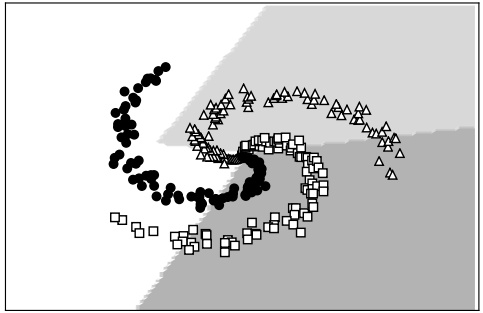

(a)

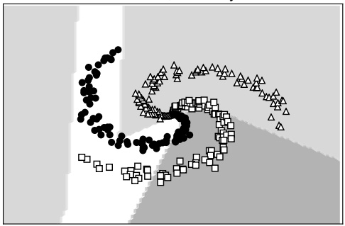

(b)

#hidden units = 15, accuracy =94.33333333333334%

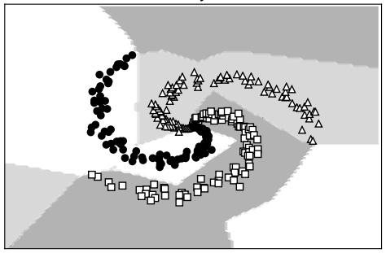

(c)

#hidden units = 30, accuracy =95.33333333333334%

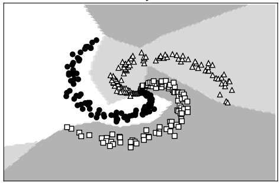

(d)

Hình 16.10. Kết quả với số lượng nút trong tầng ẩn là khác nhau.

Bằng cách thay đổi số lượng nút ẩn(biến d1) và huấn luyện lại các mạng, chúng ta thu được các kết quả như trên Hình 16.10. Khi chỉ có hai nút ẩn, các đường ranh giới vẫn gần như đường thẳng, kết quả là có tới 40% số điểm dữ liệu trong tập huấn luyện bị phân loại lỗi. Khi lượng nút ẩn là năm, độ chính xác được cải thiện thêm khoảng 15%, tuy nhiên, các đường ranh giới vẫn chưa thực sự tốt. Nếu tiếp tục tăng số lượng nút ẩn, ta thấy rằng các đường ranh giới tương đối hoàn hảo.

Có thể chứng minh được rằng với một hàm số liên tục bất kỳ f(x) và một số $\varepsilon > 0$ , luôn luôn tồn tại một mạng neuron mà đầu ra có dạng g(x) chỉ với một tầng ẩn (với số nút ẩn đủ lớn và hàm kích hoạt phi tuyến phù hợp) sao cho với mọi x, $| f ( x ) - g ( x ) | < \varepsilon$ . Nói cách khác, mạng neuron có khả năng xấp xỉ hầu hết các hàm liên tục [Cyb89].

Trên thực tế, việc tìm ra số lượng nút ẩn và hàm kích hoạt nói trên gần như bất khả thi. Thay vào đó, thực nghiệm chứng minh rằng mạng neuron với nhiều tầng ẩn kết hợp cùng các hàm kích hoạt đơn giản, ví dụ ReLU, có khả năng xấp xỉ dữ liệu tốt hơn. Tuy nhiên, khi số lượng tầng ẩn lớn lên, số lượng trọng số cần tối ưu cũng lớn theo và mô hình trở nên phức tạp. Sự phức tạp này ảnh hưởng tới hai khía cạnh. Thứ nhất, tốc độ tính toán sẽ chậm đi rất nhiều. Thứ hai, nếu

<!-- page: 230 -->

mô hình quá phức tạp, nó có thể biểu diễn rất tốt dữ liệu huấn luyện, nhưng có thể không biểu diễn tốt dữ liệu kiểm tra. Đây chính là hiện tượng quá khớp.

Vậy có các kỹ thuật nào giúp tránh quá khớp cho mạng neuron đa tầng? Ngoài kỹ thuật xác thực chéo, chúng ta quan tâm hơn tới các phương pháp kiểm soát. Kỹ thuật phổ biến nhất được dùng để tránh quá khớp là suy giảm trọng số (weight decay) hoặc dropout.

## 16.6. Suy giảm trọng số

Với suy giảm trọng số, hàm mất mát sẽ được cộng thêm một đại lượng kiểm soát có dạng:

$$
\lambda R (\mathbf {W}) = \lambda \sum_ {l = 1} ^ {L} \| \mathbf {W} ^ {(l)} \| _ {F} ^ {2}
$$

tức tổng bình phương Frobenius norm của tất cả các ma trận trọng số. Chú ý rằng khi làm việc với mạng neuron đa tầng, hệ số điều chỉnh hiếm khi được kiểm soát. Đây cũng là lý do vì sao nên tách rời ma trận trọng số và vector điều chỉnh khi làm việc với mạng neuron đa tầng. Việc tối thiểu hàm mất mát mới (với số hạng kiểm soát) sẽ khiến cho thành phần của các vector trọng số W(<sup>l</sup>) không quá lớn, thậm chí nhiều thành phần sẽ gần với không. Điều này dẫn đến việc có nhiều nút ẩn vẫn an toàn vì phần lớn trong đó gần với không.

Tiếp theo, chúng ta sẽ làm một ví dụ khác trong không gian hai chiều. Lần này, chúng ta sẽ sử dụng thư viện scikit-learn.

```python
from __future__ import print_function
import numpy as np
from sklearn.neural_network import MLPClassifier
means = [[-1, -1], [1, -1], [0, 1]]
cov = [[1, 0], [0, 1]]
N = 20
X0 = np.random.multivariate_normal(means[0], cov, N)
X1 = np.random.multivariate_normal(means[1], cov, N)
X2 = np.random.multivariate_normal(means[2], cov, N)

X = np.concatenate((X0, X1, X2), axis = 0)
y = np.asarray([0]*N + [1]*N + [2]*N)

alpha = 1e-1 # regularization parameter
clf = MLPClassifier(solver='lbfgs', alpha=alpha, hidden_layer_sizes=(100))
clf.fit(X, y)
y_pred = clf.predict(X)
acc = 100*np.mean(y_pred == y)
print('training accuracy: %.2f %%' % acc)
```

Kết quả:

```txt
training accuracy: 100.00 %
```

<!-- page: 231 -->

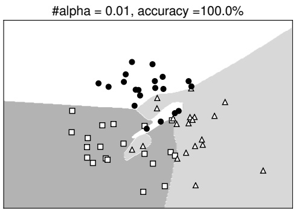

(a)

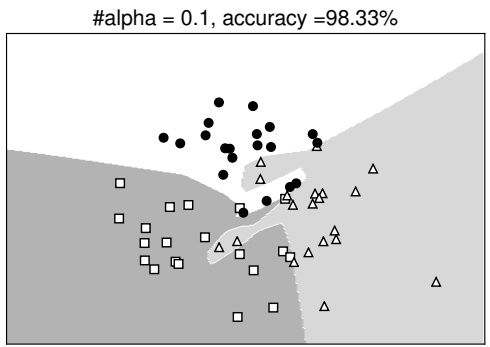

(b)

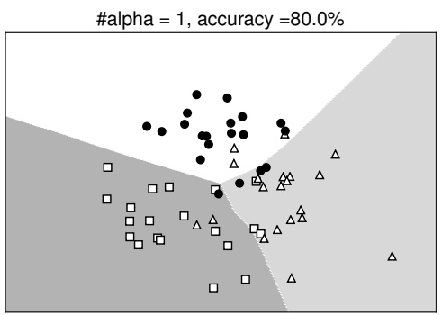

(c)

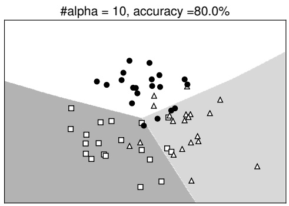

(d)

Hình 16.11. Kết quả với số nút ẩn khác nhau.

Trong đoạn code trên, thuộc tính alpha chính là tham số kiểm soát λ. alpha càng lớn sẽ khiến thành phần trong các ma trận trọng số càng nhỏ. Thuộc tính hidden\_layer\_sizes chính là số lượng nút trong mỗi tầng ẩn. Nếu có nhiều tầng ẩn, chẳng hạn hai với số nút ẩn lần lượt là 10 và 100, ta cần khai báo hidden\_layer\_sizes=(10, 100). Hình 16.11 minh hoạ ranh giới giữa các lớp tìm được với các giá trị alpha khác nhau, tức mức độ kiểm soát khác nhau. Khi alpha nhỏ cỡ 0.01, ranh giới tìm được trông không tự nhiên và vùng xác định lớp màu xám nhạt hơn (chứa các điểm tam giác) không được liên tục. Mặc dù độ chính xác trên tập huấn luyện này là 100%, ta có thể quan sát thấy rằng quá khớp đã xảy ra. Với alpha = 0.1, kết quả cho thấy vùng nền của các lớp đã liên tục, nhưng quá khớp vẫn xảy ra. Khi alpha cao hơn, độ chính xác giảm xuống nhưng các đường ranh giới tự nhiên hơn. Bạn đọc có thể thay đổi các giá trị alpha trong mã nguồn ([https://goo.gl/czxrSf](https://goo.gl/czxrSf)) và quan sát các hiện tượng xảy ra. Đặc biệt, khi alpha = 100, độ chính xác còn 33.33%. Tại sao lại như vậy? Hy vọng bạn đọc có thể tự trả lời được.

<!-- page: 232 -->

## 16.7. Đọc thêm

a. Neural Networks: Setting up the Architecture, Andrej Karpathy ([https://goo.gl/rfzCVK](https://goo.gl/rfzCVK)).

b. Neural Networks, Case study, Andrej Karpathy ([https://goo.gl/3ihCxL](https://goo.gl/3ihCxL)).

c. Lecture Notes on Sparse Autoencoders, Andrew Ng ([https://goo.gl/yTgtLe](https://goo.gl/yTgtLe)).

d. Yes you should understand backprop ([https://goo.gl/8B3h1b](https://goo.gl/8B3h1b)).

e. Backpropagation, Intuitions, Andrej Karpathy ([https://goo.gl/fjHzNV](https://goo.gl/fjHzNV)).

f. How the backpropagation algorithm works, Michael Nielsen ([https://goo.gl/mwz2kU](https://goo.gl/mwz2kU)).

<!-- page: 233 -->

# Hệ thống gợi ý

Có lẽ các bạn đã từng gặp những hiện tượng sau đây nhiều lần. Các bạn có lẽ đã gặp những hiện tượng sau đây nhiều lần. Youtube tự động chạy các clip liên quan đến clip bạn đang xem hoặc gợi ý những clip bạn có thể sẽ thích. Khi mua một món hàng trên Amazon, hệ thống sẽ tự động gợi ý những sản phẩm thường xuyên được mua cùng nhau, hoặc biết người dùng có thể thích món hàng nào dựa trên lịch sử mua hàng. Facebook hiển thị quảng cáo những sản phẩm có liên quan đến từ khoá bạn vừa tìm kiếm hoặc gợi ý kết bạn. Netflix tự động gợi ý phim cho khán giả. Và còn rất nhiều ví dụ khác mà hệ thống có khả năng tự động gợi ý cho người dùng những sản phẩm họ có thể thích. Bằng cách thiết lập quảng cáo hướng đến đúng nhóm đối tượng, hiệu quả của việc marketing cũng sẽ tăng lên.

Những thuật toán đằng sau các ứng dụng này là nhóm thuật toán machine learning được gọi chung là hệ thống gợi ý hoặc hệ thống khuyến nghị (recommender system, recommendation system).

Trong phần này của cuốn sách, chúng ta sẽ cùng tìm hiểu ba thuật toán cơ bản nhất trong các hệ thống gợi ý.

<!-- page: 234 -->

# Hệ thống gợi ý dựa trên nội dung

## 17.1. Giới thiệu

Hệ thống gợi ý là một mảng khá rộng của machine learning và có xuất hiện sau phân loại hay hồi quy vì internet mới chỉ thực sự bùng nổ khoảng 10-15 năm gần đây. Có hai thực thể chính trong một hệ thống gợi ý là người dùng (user) và sản phẩm (item). Mục đích chính của các hệ thống gợi ý là dự đoán mức độ quan tâm của một người dùng tới một sản phẩm nào đó, qua đó có chiến lược gợi ý phù hợp.

## 17.1.1. Hiện tượng đuôi dài

Chúng ta cùng đi vào việc so sánh điểm khác nhau căn bản giữa các cửa hàng thực và cửa hàng điện tử trên khía cạnh lựa chọn sản phẩm để quảng bá. Ở đây, chúng ta tạm quên đi khía cạnh cảm giác thật chạm vào sản phẩm của các cửa hàng thực và tập trung vào phần làm thế nào để quảng bá đúng sản phẩm tới khách hàng.

Có thể các bạn đã biết tới Nguyên lý Pareto (quy tắc 20/80) ([https://goo.gl/NujWjH](https://goo.gl/NujWjH)): phần lớn kết quả được gây ra bởi phần nhỏ nguyên nhân. Phần lớn số từ sử dụng hàng ngày chỉ là một phần nhỏ trong từ điển. Phần lớn của cải được sở hữu bởi phần nhỏ số người. Trong hương mại, những sản phẩm bán chạy nhất chiếm phần nhỏ trên tổng số sản phẩm.

Các cửa hàng thực thường có hai khu vực: khu trưng bày và kho. Nguyên tắc dễ thấy để đạt doanh thu cao là trưng ra các sản phẩm phổ biến ở những nơi dễ thấy nhất và cất những sản phẩm ít phổ biến hơn trong kho. Cách làm này có một hạn chế rõ rệt: những sản phẩm được trưng ra mang tính phổ biến nhưng chưa chắc đã phù hợp với nhu cầu của một khách hàng cụ thể. Một cửa hàng

<!-- page: 235 -->

có thể có món hàng một người đang tìm kiếm nhưng không bán được vì khách hàng đó không tìm thấy sản phẩm. Điều này dẫn đến việc khách hàng không tiếp cận được sản phẩm ngay cả khi chúng đã được trưng ra. Ngoài ra, vì không gian có hạn, cửa hàng không thể trưng ra tất cả các sản phẩm mà mỗi loại chỉ đưa ra một số lượng nhỏ. Ở đây, phần lớn doanh thu (80%) đến từ phần nhỏ số sản phẩm phổ biến nhất (20%). Nếu sắp xếp các sản phẩm của cửa hàng theo doanh số từ cao đến thấp, ta sẽ nhận thấy có thể phần nhỏ các sản phẩm tạo ra phần lớn doanh số. Và một danh sách dài phía sau chỉ đóng góp một lượng nhỏ. Hiện tượng này còn được gọi là đuôi dài (long tail phenomenon).

Với các cửa hàng điện tử, nhược điểm trên hoàn toàn có thể tránh được vì gian trưng bày của các cửa hàng điện tử gần như là vô tận, mọi sản phẩm đều có thể được trưng ra. Hơn nữa, việc sắp xếp online là linh hoạt, tiện lợi với chi phí chuyển đổi gần như bằng không khiến việc mang đúng sản phẩm tới khách hàng trở nên thuận tiện. Doanh thu vì thế có thể được tăng lên.

## 17.1.2. Hai nhóm thuật toán trong hệ thống gợi ý

Các thuật toán trong hệ thống gợi ý được chia thành hai nhóm lớn:

a. Hệ thống dựa trên nội dung: Gợi ý dựa trên đặc tính của sản phẩm. Ví dụ, hệ thống nên gợi ý các bộ phim hình sự tới những người thích xem phim “Cảnh sát hình sự” hay “Người phán xử”. Cách tiếp cận này yêu cầu sắp xếp các sản phẩm vào từng nhóm hoặc đi tìm các đặc trưng của từng sản phẩm. Tuy nhiên, có những sản phẩm không có rơi vào một nhóm cụ thể và việc xác định nhóm hoặc đặc trưng của từng sản phẩm đôi khi bất khả thi.

b. Lọc cộng tác (collaborative filtering): Hệ thống gợi ý các sản phẩm dựa trên sự tương quan giữa người dùng và/hoặc sản phẩm. Ở nhóm này, một sản phẩm được gợi ý tới một người dùng dựa trên những người dùng có sở thích tương tự hoặc những sản phẩm tương ựu. Ví dụ, ba người dùng A, B, C đều thích các bài hát của Noo Phước Thịnh. Ngoài ra, hệ thống biết rằng người dùng B, C cũng thích các bài hát của Bích Phương nhưng chưa có thông tin về việc liệu người dùng A có thích ca sĩ này hay không. Dựa trên thông tin của những người dùng tương tự là B và C, hệ thống có thể dự đoán rằng A cũng thích Bích Phương và gợi ý các bài hát của ca sĩ này tới A.

Trong chương này, chúng ta sẽ làm quen với nhóm thuật toán thứ nhất. Nhóm thuật toán thứ hai, lọc cộng tác, sẽ được trình bày trong các chương tiếp theo.

## 17.2. Ma trận tiện ích

Có hai thực thể chính trong các hệ thống gợi ý là người dùng và sản phẩm. Mỗi người dùng có mức quan tâm tới từng sản phẩm khác nhau. Thông tin về mức

<!-- page: 236 -->

Chương 17. Hệ thống gợi ý dựa trên nội dung

|  | A | B | C | D | E | F |
| --- | --- | --- | --- | --- | --- | --- |
| Mưa nửa đêm | 5 | 5 | 0 | 0 | 1 | ? |
| Cỏ úa | 5 | ? | ? | 0 | ? | ? |
| Vùng lá me bay | ? | 4 | 1 | ? | ? | 1 |
| Con cò bé bé | 1 | 1 | 4 | 4 | 4 | ? |
| Em yêu trường em | 1 | 0 | 5 | ? | ? | ? |

**Hình 17.1.** Ví dụ về ma trận tiện ích với hệ thống gợi ý bài hát. Các bài hát được người dùng đánh giá theo mức độ từ 0 đến 5 sao. Các dấu ’?’ nền màu xám ứng với việc dữ liệu còn thiếu. Hệ thống gợi ý cần dự đoán các giá trị này.

độ quan tâm của một người dùng tới một sản phẩm có thể được thu thập thông qua một hệ thống đánh giá (review và rating), qua việc người dùng đã click vào thông tin của sản phẩm hoặc qua thời lượng người dùng xem thông tin của một sản phẩm. Các ví dụ trong phần này đều dựa trên hệ thống đánh giá sản phẩm.

## 17.2.1. Ma trận tiện ích

Với một hệ thống đánh giá sản phẩm, mức độ quan tâm của một người dùng tới một sản phẩm được đo bằng số sao trên tổng số sao, chẳng hạn năm sao. Tập hợp tất cả các đánh giá ở dạng số, bao gồm cả những giá trị cần được dự đoán, tạo nên một ma trận gọi là ma trận tiện ích (utility matrix). Xét ví dụ trong Hình 17.1, có sáu người dùng A, B, C, D, E, F và năm bài hát. Các ô đã được đánh số thể hiện việc một người dùng đã đánh giá một bài hát từ 0 (không thích) đến 5 (rất thích). Các ô có dấu ’ ?’ tương ứng với các ô chưa có dữ liệu. Công việc của một hệ thống gợi ý là dự đoán giá trị tại các ô màu xám này, từ đó đưa ra gợi ý cho người dùng. Vì vậy, bài toán hệ thống gợi ý đôi khi được coi là bài toán hoàn thiện ma trận (matrix completion).

Nhận thấy có hai thể loại nhạc khác nhau: ba bài đầu là nhạc bolero và hai bài sau là nhạc thiếu nhi. Từ dữ liệu này, ta cũng có thể đoán được rằng A, B thích thể loại nhạc Bolero; trong khi C, D, E, F thích nhạc thiếu nhi. Từ đó, một hệ thống tốt nên gợi ý “Cỏ úa” cho B; “Vùng lá me bay” cho A; “Em yêu trường em” cho D, E, F. Giả sử chỉ có hai thể loại nhạc này, khi có một bài hát mới, ta cần phân loại rồi đưa ra gợi ý với từng người dùng.

Thông thường, có rất nhiều người dùng và sản phẩm trong hệ thống nhưng mỗi người dùng chỉ đánh giá một lượng nhỏ các sản phẩm, thậm chí có những người dùng không đánh giá sản phẩm nào. Vì vậy, lượng ô màu xám của ma trận tiện ích thường rất lớn so với lượng ô màu trắng đã biết.

Rõ ràng, càng nhiều ô được điền thì độ chính xác của hệ thống sẽ càng được cải thiện. Vì vậy, các hệ thống luôn khuyến khích người dùng bày tỏ sự quan tâm của họ tới các sản phẩm thông qua việc đánh giá các sản phẩm đó. Việc đánh giá không những giúp người dùng khác biết được chất lượng của sản phẩm mà còn giúp hệ thống biết được sở thích của người dùng, qua đó có chính sách quảng cáo hợp lý.

<!-- page: 237 -->

## 17.2.2. Xây dựng ma trận tiện ích

Không có ma trận tiện ích, hệ thống gần như không thể gợi ý được sản phẩm tới người dùng. Vì vậy, việc xây dựng ma trận tiện ích là tối quan trọng trong các hệ thống gợi ý. Tuy nhiên, việc xây dựng ma trận này thường gặp nhiều khó khăn. Có hai hướng tiếp cận phổ biến để xác định giá trị đánh giá cho mỗi cặp (người dùng, sản phẩm) trong ma trận tiện ích:

a. Khuyến khích người dùng đánh giá sản phẩm. Amazon luôn khuyến khích người dùng đánh giá các sản phẩm bằng cách gửi mail nhắc nhở nhiều lần. Tuy nhiên, cách tiếp cận này cũng có một vài hạn chế. Các đánh giá có thể thiên lệch bởi những người sẵn sàng đáng giá.

b. Hướng tiếp cận thứ hai là dựa trên hành vi của người dùng. Nếu một người dùng mua một sản phẩm trên Amazon, xem một clip trên Youtube nhiều lần hay đọc một bài báo, có thể khẳng định người dùng này có xu hướng thích các sản phẩm đó. Facebook cũng dựa trên việc bạn like những nội dung nào để hiển thị trên newsfeed những nội dung liên quan. Bạn càng đam mê Facebook, Facebook càng được hưởng lợi. Với cách làm này, ta có thể xây dựng được một ma trận với các thành phần là 1 và 0, với 1 thể hiện người dùng thích sản phẩm, 0 thể hiện chưa có thông tin. Trong trường hợp này, 0 không có nghĩa là thấp hơn 1, nó chỉ có nghĩa là người dùng chưa cung cấp thông tin. Chúng ta cũng có thể xây dựng ma trận với các giá trị cao hơn 1 thông qua thời gian hoặc số lượt mà người dùng xem một sản phẩm nào đó. Ngoài ra, đôi khi nút dislike cũng mang lại những lợi ích nhất định cho hệ thống, lúc này có thể gán giá trị tương ứng bằng −1.

## 17.3. Hệ thống dựa trên nội dung

## 17.3.1. Xây dựng thông tin sản phẩm

Trong các hệ thống dựa trên nội dung, chúng ta cần xây dựng thông tin cho mỗi sản phẩm. Thông tin này được biểu diễn dưới dạng toán học là một vector đặc trưng. Trong những trường hợp đơn giản, vector này được trực tiếp trích xuất từ sản phẩm. Ví dụ, thông tin của một bài hát có thể được xác định bởi:

a. Ca sĩ. Cùng là bài “Thành phố buồn” nhưng có người thích bản của Đan Nguyên, có người lại thích bản của Đàm Vĩnh Hưng.

b. Nhạc sĩ sáng tác. Cùng là nhạc trẻ nhưng có người thích Phan Mạnh Quỳnh, người khác lại thích MTP.

c. Năm sáng tác. Một số người thích nhạc xưa cũ hơn nhạc hiện đại.

d. Thể loại. Quan họ và Bolero sẽ có thể thu hút những nhóm người khác nhau.

<!-- page: 238 -->

Chương 17. Hệ thống gợi ý dựa trên nội dung

|  | A | B | C | D | E | F | vector đặc trưng |
| --- | --- | --- | --- | --- | --- | --- | --- |
| Mưa nửa đêm | 5 | 5 | 0 | 0 | 1 | ? | x<sub>1</sub> = [0.99,0.02]<sup>T</sup> |
| Cỏ úa | 5 | ? | ? | 0 | ? | ? | x<sub>2</sub> = [0.91,0.11]<sup>T</sup> |
| Vùng lá me bay | ? | 4 | 1 | ? | ? | 1 | x<sub>3</sub> = [0.95,0.05]<sup>T</sup> |
| Con cò bé bé | 1 | 1 | 4 | 4 | 4 | ? | x<sub>4</sub> = [0.01,0.99]<sup>T</sup> |
| Em yêu trường em | 1 | 0 | 5 | ? | ? | ? | x<sub>5</sub> = [0.03,0.98]<sup>T</sup> |
| Mô hình người dùng | θ<sub>1</sub> | θ<sub>2</sub> | θ<sub>3</sub> | θ<sub>4</sub> | θ<sub>5</sub> | θ<sub>6</sub> | ← tham số cần tìm |

Hình 17.2. Giả sử vector đặc trưng cho mỗi sản phẩm đã biết trước, được cho trong cột cuối cùng. Với mỗi người dùng, chúng ta cần tìm một mô hình $\theta _ { u }$ tương ứng.

Trong ví dụ trong Hình 17.1, chúng ta đơn giản hoá bài toán bằng việc xây dựng một vector đặc trưng hai chiều cho mỗi bài hát: chiều thứ nhất là mức độ Bolero, chiều thứ hai là mức độ Thiếu nhi của bài hát đó. Giả sử ta đã xây dựng được vector đặc trưng cho mỗi bài hát là $\mathbf { x } _ { 1 } , \mathbf { x } _ { 2 } , \mathbf { x } _ { 3 } , \mathbf { x } _ { 4 } , \mathbf { x } _ { 5 }$ như trong Hình 17.2. Tương tự, hành vi của mỗi người dùng cũng có thể được mô hình hoá dưới dạng tập các tham số θ. Dữ liệu huấn luyện để xây dựng mỗi mô hình $\theta _ { w }$ là các cặp (thông tin sản phẩm, đánh giá) tương ứng với các sản phẩm người dùng đó đã đánh giá. Việc điền giá trị còn thiếu trong ma trận tiện ích chính là việc dự đoán mức độ quan tâm khi áp dụng mô hình $\theta _ { u }$ . Đầu ra này có thể được viết dưới dạng hàm số $f ( \theta _ { u } , \mathbf { x } _ { i } )$ . Việc lựa chọn dạng của $f ( \theta _ { u } , \mathbf { x } _ { i } )$ tuỳ thuộc vào mỗi bài toán. Trong chương này, chúng ta sẽ quan tâm tới dạng đơn giản nhất – dạng tuyến tính.

## 17.3.2. Xây dựng hàm mất mát

Đặt số lượng người dùng là N, số lượng sản phẩm là M; ma trận thông tin sản phẩm $\mathbf { X } = [ \mathbf { x } _ { 1 } , \mathbf { x } _ { 2 } , \ldots , \mathbf { x } _ { M } ] \in \mathbb { R } ^ { d \times M }$ và ma trận tiện ích là $\mathbf { Y } \in \mathbb { R } ^ { M \times \vec { N } }$ Thành phần ở hàng thứ m, cột thứ n của Y là mức độ quan tâm (ở đây là số sao đã đánh giá) của người dùng thứ n lên sản phẩm thứ m mà hệ thống đã thu thập được. Ma trận Y bị khuyết rất nhiều thành phần tương ứng với các giá trị cần dự đoán. Thêm nữa, gọi R là ma trận thể hiện việc một người dùng đã đánh giá một sản phẩm hay chưa. Cụ thể, $r _ { m n }$ bằng một nếu sản phẩm thứ m đã được đánh giá bởi người dùng thứ n, bằng không trong trường hợp ngược lại.

## Mô hình tuyến tính

Giả sử ta có thể tìm được một mô hình cho mỗi người dùng, được minh hoạ bởi một vector cột hệ số $\mathbf { w } _ { n } \in \mathbb { R } ^ { d }$ và hệ số điều chỉnh $b _ { n }$ sao cho mức độ quan tâm của một người dùng tới một sản phẩm tính được bằng một hàm tuyến tính:

$$
y _ {m n} = \mathbf {w} _ {n} ^ {T} \mathbf {x} _ {m} + b _ {n}\tag{17.1}
$$

Xét người dùng thứ $n ,$ nếu coi tập huấn luyện là tập hợp các thành phần đã biết của $\mathbf { y } _ { n }$ (cột thứ n của ma trận Y), ta có thể xây dựng hàm mất mát tương tự

<!-- page: 239 -->

như hồi quy ridge (hồi quy tuyến tính với kiểm soát $l _ { 2 } )$ như sau:

$$
\mathcal {L} _ {n} (\mathbf {w} _ {n}, b _ {n}) = \frac {1}{2 s _ {n}} \sum_ {m: r _ {m n} = 1} (\mathbf {x} _ {m} ^ {T} \mathbf {w} _ {n} + b _ {n} - y _ {m n}) ^ {2} + \frac {\lambda}{2 s _ {n}} \| \mathbf {w} _ {n} \| _ {2} ^ {2}\tag{17.2}
$$

trong đó, thành phần thứ hai đóng vai trò kiểm soát và λ là một tham số dương; $s _ { n }$ là số lượng các sản phẩm mà người dùng thứ n đã đánh giá, là tổng các phần tử trên cột thứ n của ma trận R, tức $\begin{array} { r } { s _ { n } = \sum _ { m = 1 } ^ { M } r _ { m n } } \end{array}$ . Chú $\acute { \mathrm { y } }$ rằng cơ chế kiểm soát thường không được áp dụng lên hệ số điều chỉnh $b _ { n }$

Vì biểu thức hàm mất mát (17.2) chỉ phụ thuộc vào các sản phẩm đã được đánh giá, ta có thể rút gọn nó bằng cách đặt $\hat { \mathbf { y } } _ { n } \in \mathbb { R } ^ { s _ { n } }$ là vector con của $\mathbf { y } _ { n }$ , được xây dựng bằng cách trích các thành phần đã biết ở cột thứ n của Y. Đồng thời, đặt $\hat { \mathbf { X } } _ { n } \in \mathbb { R } ^ { d \times s _ { n } }$ là ma trận con của ma trận đặc trưng X, thu được bằng cách trích các cột tương ứng với những sản phẩm đã được đánh giá bởi người dùng thứ n. Biểu thức hàm mất mát của mô hình cho người dùng thứ n được viết gọn thành:

$$
\mathcal {L} _ {n} (\mathbf {w} _ {n}, b _ {n}) = \frac {1}{2 s _ {n}} \| \hat {\mathbf {X}} _ {n} ^ {T} \mathbf {w} _ {n} + b _ {n} \mathbf {e} _ {n} - \hat {\mathbf {y}} _ {n} \| _ {2} ^ {2} + \frac {\lambda}{2 s _ {n}} \| \mathbf {w} _ {n} \| _ {2} ^ {2}\tag{17.3}
$$

trong $\mathrm { d } \bar { \mathrm { o } } ,   \mathbf { e } _ { n }$ là vector cột với tất cả các thành phần bằng một. Đây chính là hàm mất mát của hồi quy ridge. Cặp nghiệm $\mathbf { w } _ { n } , b _ { n }$ có thể được tìm thông qua các thuật toán gradient descent. Trong chương này, chúng ta sẽ trực tiếp sử dụng class Ridge trong thư viện sklearn.linear\_model. Một điểm đáng lưu $\acute { \mathrm { y } }$ ở đây là $\mathbf { w } _ { n }$ chỉ được xác định nếu người dùng thứ n đã đánh giá ít nhất một sản phẩm.

## 17.3.3. Ví dụ về hàm mất mát cho người dùng E

Quay trở lại ví dụ trong Hình 17.2, ma trận đặc trưng cho các sản phẩm (mỗi cột tương ứng với một sản phẩm) là

$$
\mathbf {X} = \left[ \begin{array}{c c c c c} 0. 9 9 & 0. 9 1 & 0. 9 5 & 0. 0 1 & 0. 0 3 \\ 0. 0 2 & 0. 1 1 & 0. 0 5 & 0. 9 9 & 0. 9 8 \end{array} \right]\tag{17.4}
$$

Xét trường hợp của người dùng E với $n = 5 ,   \mathbf { y } _ { 5 } = [ 1 , ? , ? , 4 , ? ] ^ { T }$ Từ đó, vector nhị phân $\mathbf { r } _ { 5 } = [ 1 , 0 , 0 , 1 , 0 ] ^ { T }$ . Vì E mới chỉ đánh giá sản phẩm thứ nhất và thứ tư nên $s _ { 5 } = 2$ . Hơn nữa,

$$
\hat {\mathbf {X}} _ {5} = \left[ \begin{array}{c c} 0. 9 9 & 0. 0 1 \\ 0. 0 2 & 0. 9 9 \end{array} \right], \hat {\mathbf {y}} _ {5} = \left[ \begin{array}{c} 1 \\ 4 \end{array} \right], \mathbf {e} _ {5} = \left[ \begin{array}{c} 1 \\ 1 \end{array} \right].\tag{17.5}
$$

Khi đó, hàm mất mát cho hệ số tương ứng với người dùng E là:

$$
\mathcal {L} _ {5} (\mathbf {w} _ {5}, b _ {5}) = \frac {1}{4} \left\| \left[ \begin{array}{c c} 0. 9 9 & 0. 0 2 \\ 0. 0 1 & 0. 9 9 \end{array} \right] \mathbf {w} _ {5} + b _ {5} \left[ \begin{array}{c} 1 \\ 1 \end{array} \right] - \left[ \begin{array}{c} 1 \\ 4 \end{array} \right] \right\| _ {2} ^ {2} + \frac {\lambda}{4} \| \mathbf {w} _ {5} \| _ {2} ^ {2}\tag{17.6}
$$

Chúng ta sẽ áp dụng những phân tích trên đây để đi tìm nghiệm cho một bài toán gần với thực tế.

<!-- page: 240 -->

## 17.4. Bài toán MovieLens 100k

## 17.4.1. Cơ sở dữ liệu MovieLens 100k

Bộ cơ sở dữ liệu MovieLens 100k ([https://goo.gl/BzHgtq](https://goo.gl/BzHgtq)) được công bố năm 1998 bởi GroupLens ([https://grouplens.org](https://grouplens.org)). Bộ cơ sở dữ liệu này bao gồm 100,000 (100k) đánh giá từ 943 người dùng cho 1682 bộ phim. Các bạn cũng có thể tìm thấy các bộ cơ sở dữ liệu tương tự với khoảng 1M, 10M, 20M đánh giá.

Bộ cơ sở dự liệu này bao gồm nhiều file, chúng ta cần quan tâm các file sau:

• u.data: Chứa toàn bộ các đánh giá của 943 người dùng cho 1682 bộ phim. Mỗi người dùng đánh giá ít nhất 20 bộ phim. Thông tin về thời điểm đánh giá cũng được cho nhưng chúng ta không sử dụng trong ví dụ này.

• ua.base, ua.test, ub.base, ub.test: Là hai cách chia toàn bộ dữ liệu ra thành hai tập con: tập huấn luyện và tập kiểm tra. Chúng ta sẽ thực hành trên ua.base và ua.test. Bạn đọc có thể thử với cách chia dữ liệu còn lại.

• u.user: Chứa thông tin về người dùng, bao gồm: id, tuổi, giới tính, nghề nghiệp, mã vùng (zipcode). Những thông tin này có thể ảnh hưởng tới sở thích của người dùng; tuy nhiên, chúng ta chỉ sử dụng id để xác định người dùng khác nhau.

• u.genre: Chứa tên của 19 thể loại phim, gồm: unknown, Action, Adventure, Animation, Children’s, Comedy, Crime, Documentary, Drama, Fantasy, Film-Noir, Horror, Musical, Mystery, Romance, Sci-Fi, Thriller, War, Western,

• u.item: Thông tin về mỗi bộ phim. Một vài dòng đầu tiên của file:

```txt
1|Toy Story (1995)|01-Jan-1995||http://us.imdb.com/M/title-exact?Toy%20Story
    %20(1995)|0|0|0|1|1|1|0|0|0|0|0|0|0|0|0|0|0|
2|GoldenEye (1995)|01-Jan-1995||http://us.imdb.com/M/title-exact?GoldenEye
    %20(1995)|0|1|1|0|0|0|0|0|0|0|0|0|0|0|0|0|1|0|0
3|Four Rooms (1995)|01-Jan-1995||http://us.imdb.com/M/title-exact?Four%20
    Rooms%20(1995)|0|0|0|0|0|0|0|0|0|0|0|0|0|0|1|0|0
4|Get Shorty (1995)|01-Jan-1995||http://us.imdb.com/M/title-exact?Get%20
    Shorty%20(1995)|0|1|0|0|0|1|0|0|1|0|0|0|0|0|0|0|0|0
```

Trong mỗi dòng, chúng ta sẽ thấy id của phim, tên phim, ngày phát hành, đường dẫn và các số nhị phân 0, 1 thể hiện bộ phim thuộc các thể loại nào trong 19 thể loại đã cho. Một bộ phim có thể thuộc nhiều thể loại khác nhau. Thông tin về thể loại này sẽ được dùng để xây dựng thông tin sản phẩm.

<!-- page: 241 -->

Chúng ta sử dụng thư viện pandas ([http://pandas.pydata.org](http://pandas.pydata.org)) để đọc dữ liệu:

```python
from __future__ import print_function
import numpy as np
import pandas as pd
# Reading user file:
u_cols = ['user_id', 'age', 'sex', 'occupation', 'zip_code']
users = pd.read_csv('ml-100k/u.user', sep='|', names=u_cols)
n_users = users.shape[0]
print('Number of users:', n_users)

#Reading ratings file:
r_cols = ['user_id', 'movie_id', 'rating', 'unix_timestamp']

ratings_base = pd.read_csv('ml-100k/ua.base', sep='\t', names=r_cols)
ratings_test = pd.read_csv('ml-100k/ua.test', sep='\t', names=r_cols)

rate_train = ratings_base.as_matrix()
rate_test = ratings_test.as_matrix()

print('Number of traing rates:', rate_train.shape[0])
print('Number of test rates:', rate_test.shape[0])
```

Kết quả:

```txt
Number of users: 943
Number of traing rates: 90570
Number of test rates: 9430
```

Ta sẽ chỉ quan tâm tới 19 giá trị nhị phân ở cuối mỗi hàng để xây dựng thông tin sản phẩm.

```python
X0 = items.as_matrix()
X_train_counts = X0[:, -19:]
```

## 17.4.2. Xây dựng thông tin sản phẩm

Công việc quan trọng trong hệ thống gợi ý dựa trên nội dung là xây dựng vector đặc trưng cho mỗi sản phẩm. Trước hết, chúng ta cần lưu thông tin về các sản phẩm vào biến items:

```python
#Reading items file:
i_cols = ['movie id', 'movie title' ,'release date','video release date', '
    IMDb URL', 'unknown', 'Action', 'Adventure', 'Animation', 'Children\'s',
    'Comedy', 'Crime', 'Documentary', 'Drama', 'Fantasy', 'Film-Noir', '
    'Horror', 'Musical', 'Mystery', 'Romance', 'Sci-Fi', 'Thriller', 'War', '
    Western']

items = pd.read_csv('ml-100k/u.item', sep='|', names=i_cols)

n_items = items.shape[0]
print('Number of items:', n_items)
```

Machine Learning cơ bản

<!-- page: 242 -->

Chương 17. Hệ thống gợi ý dựa trên nội dung

Kết quả:

```txt
Number of items: 1682
```

Tiếp theo, chúng ta hiển thị một vài hàng đầu tiên của ma trận rate\_train:

```txt
print(rate_train[:4, :])
```

Kết quả:

```txt
[[          1          1          5 874965758]
[       1       2       3 876893171]
[       1       3       4 878542960]
[       1       4       3 876893119]]
```

Hàng thứ nhất được hiểu là người dùng thứ nhất đánh giá bộ phim thứ nhất năm sao. Cột cuối cùng là thời điểm đánh giá, chúng ta sẽ bỏ qua thông số này.

Tiếp theo, chúng ta sẽ xây dựng vector đặc trưng cho mỗi sản phẩm dựa trên ma trận thể loại phim và đặc trưng TF-IDF ([https://goo.gl/bpDdQ8](https://goo.gl/bpDdQ8)) trong thư viện sklearn:

```python
#tfidf
from sklearn.feature_extraction.text import TfidfTransformer
transformer = TfidfTransformer(smooth_idf=True, norm ='l2')
X = transformer.fit_transform(X_train_counts.tolist()).toArray()
```

Sau bước này, mỗi hàng của X tương ứng với vector đặc trưng của một bộ phim.

## 17.4.3. Xây dựng mô hình cho mỗi người dùng

Với mỗi người dùng, chúng ta cần đi tìm những bộ phim nào mà người dùng đó đã đánh giá, và giá trị của các đánh giá đó.

```python
def get_items_rated_by_user(rate_matrix, user_id):
    """
    return (item_ids, scores)
    """
    y = rate_matrix[:,0] # all users
    # item indices rated by user_id
    # we need to +1 to user_id since in the rate_matrix, id starts from 1
    # but id in python starts from 0
    ids = np.where(y == user_id +1)[0]
    item_ids = rate_matrix[ids, 1] - 1 # index starts from 0
    scores = rate_matrix[ids, 2]
    return (item_ids, scores)
```

Bây giờ, ta có thể đi tìm vector trọng số của mỗi người dùng:

<!-- page: 243 -->

```python
from sklearn.linear_model import Ridge
from sklearn import linear_model
d = X.shape[1] # data dimension
W = np.zeros((d, n_users))
b = np.zeros(n_users)
for n in range(n_users):
    ids, scores = get_items_rated_by_user(rate_train, n)
    model = Ridge(alpha=0.01, fit_intercept = True)
    Xhat = X[ids, :]
    model.fit(Xhat, scores)
    W[:, n] = model.coef_
    b[n] = model.intercept_
```

Sau khi tính được các hệ số W và b, mức độ quan tâm của mỗi người dùng tới một bộ phim được dự đoán bởi:

```txt
Yhat = X.dot(W) + b
```

Dưới đây là một ví dụ với người dùng có id bằng 10:

```python
n = 10
np.set_printoptions(precision=2) # 2 digits after .
ids, scores = get_items_rated_by_user(rate_test, n)
print('Rated movies ids:', ids )
print('True ratings     :', scores)
print('Predicted ratings:', Yhat[ids, n])
```

Kết quả:

```txt
Rated movies ids : [ 37 109 110 226 424 557 722 724 731 739]
True ratings     : [3 3 4 3 4 3 5 3 3 4]
Predicted ratings: [3.18 3.13 3.42 3.09 3.35 5.2   4.01 3.35 3.42 3.72]
```

## 17.4.4. Đánh giá mô hình

Để đánh giá mô hình tìm được, chúng ta sẽ sử dụng căn bậc hai sai số trung bình bình phương (root mean squared error, RMSE):

```python
def evaluate(Yhat, rates, W, b):
    se = cnt = 0
    for n in xrange(n_users):
        ids, scores_truth = get_items_rated_by_user(rates, n)
        scores_pred = Yhat[ids, n]
        e = scores_truth - scores_pred
        se += (e*e).sum(axis = 0)
        cnt += e.size
        return np.sqrt(se/cnt)

print('RMSE for training: %.2f' %evaluate(Yhat, rate_train, W, b))
print('RMSE for test : %.2f' %evaluate(Yhat, rate_test, W, b))
```

Machine Learning cơ bản

<!-- page: 244 -->

Chương 17. Hệ thống gợi ý dựa trên nội dung

Kết quả:

```txt
RMSE for training: 0.91
RMSE for test : 1.27
```

Như vậy, với training set, sai số vào khoảng 0.91 (sao); với test set, sai số lớn hơn một chút, khoảng 1.27. Các kết quả này chưa thực sự tốt vì mô hình đã được đơn giản hoá quá nhiều. Kết quả tốt hơn có thể được thấy trong các chương tiếp theo về lọc cộng tác.

## 17.5. Thảo luận

• Hệ thống gợi ý dựa trên nội dung là một phương pháp gợi ý đơn giản. Đặc điểm của phương pháp này là việc xây dựng mô hình cho mỗi người dùng không phụ thuộc vào người dùng khác.

• Việc xây dựng mô hình cho mỗi người dùng có thể coi như bài toán hồi quy với dữ liệu huấn luyện là thông tin sản phẩm và đáng giá của người dùng đó về sản phẩm đó. Thông tin sản phẩm không phụ thuộc vào người dùng mà phụ thuộc vào các đặc điểm mô tả của sản phẩm.

• Mã nguồn trong chương này có thể tìm thấy tại [https://goo.gl/u9M3vb](https://goo.gl/u9M3vb).

## Đọc thêm

a. Recommendation Systems – Stanford InfoLab ([https://goo.gl/P1pesC](https://goo.gl/P1pesC)).

b. Recommendation systems – Machine Learning, Andrew Ng ([https://goo.gl/jdFvej](https://goo.gl/jdFvej)).

c. Content Based Recommendations – Stanford University ([https://goo.gl/3wnbZ4](https://goo.gl/3wnbZ4)).

<!-- page: 245 -->

# Lọc cộng tác lân cận

## 18.1. Giới thiệu

Trong hệ thống gợi ý dựa trên nội dung, chúng ta đã làm quen với một hệ thống gợi ý sản phẩm đơn giản dựa trên vector đặc trưng của mỗi sản phẩm. Đặc điểm của các hệ thống này là việc xây dựng mô hình cho mỗi người dùng không phụ thuộc vào các người dùng khác mà chỉ phụ thuộc vào thông tin sản phẩm. Việc làm này có lợi thế là tiết kiệm bộ nhớ và thời gian tính toán nhưng có hai nhược điểm cơ bản. Thứ nhất, việc xây dựng thông tin cho sản phẩm không phải lúc nào cũng thực hiện được. Thứ hai, khi xây dựng mô hình cho một người dùng, các hệ thống gợi ý theo nội dung không tận dụng được thông tin đã có từ những người dùng khác. Những thông tin này thường rất hữu ích vì hành vi mua hàng của người dùng thường được chia thành một vài nhóm cơ bản. Nếu biết hành vi mua hàng của một vài người dùng trong nhóm, hệ thống nên có khả năng dự đoán hành vi của những người dùng còn lại trong nhóm đó.

Những nhược điểm này có thể được giải quyết bằng một kỹ thuật có tên là lọc cộng tác (collaborative filtering – CF) [SFHS07, ERK+11]. Trong chương này, chúng ta cùng làm quen với một phương pháp CF có tên là lọc cộng tác dựa trên lân cận (neighborhood-based collaborative filtering – NBCF). Chương tiếp theo sẽ trình bày về một phương pháp CF khác có tên lọc cộng tác phân tích ma trận (matrix factorization collaborative filtering). Nếu chỉ nói lọc cộng tác, ta gầm hiểu rằng đó là lọc cộng tác dựa trên lân cận.

Ý tưởng của NBCF là xác định mức độ quan tâm của một người dùng tới một sản phẩm dựa trên những người dùng có hành vi tương tự. Việc xác định sự tương tự giữa những người dùng có thể được xác định thông qua mức độ quan tâm của họ tới các sản phẩm khác mà hệ thống đã biết. Ví dụ, A và B thích phim “Cảnh

<!-- page: 246 -->

sát hình $\mathrm { s u } _ { \bullet } ^ { \mathfrak { z } ^ { \mathfrak { z } } } .$ đều đã đánh giá bộ phim này năm sao. Ta đã biết thêm A thích “Người phán $\mathrm { x } \hat { \mathrm { u } } ^ { \flat } { } ^ { \flat }$ , vậy nhiều khả năng B cũng thích bộ phim này.

Có hai câu hỏi chính khi xây dựng một hệ thống lọc cộng tác dựa trên lân cận:

a. Làm thế nào xác định được sự tương tự giữa hai người dùng?

b. Khi đã xác định được các người dùng có hành vi gần giống nhau, làm thế nào dự đoán được mức độ quan tâm của một người dùng lên một sản phẩm?

Việc xác định mức độ quan tâm của mỗi người dùng tới một sản phẩm dựa trên mức độ quan tâm của những người dùng tương tự tới sản phẩm đó còn được gọi là lọc cộng tác người dùng (user-user collaborative filtering). Có một hướng tiếp cận khác thường cho kết quả tốt hơn là lọc cộng tác sản phẩm (item-item collaborative filtering). Trong hướng tiếp cận này, thay vì xác định độ tương tự giữa các người dùng, hệ thống sẽ xác định độ tương tự giữa các sản phẩm. Từ đó, hệ thống gợi $\acute { \mathrm { y } }$ một sản phẩm tương tự những sản phẩm khác mà người dùng đó có mức độ quan tâm cao.

Cấu trúc của chương như sau: Mục 18.2 trình bày lọc cộng tác người dùng. Mục 18.3 nêu một số hạn chế của phương pháp này và cách khắc phục bằng lọc cộng tác sản phẩm. Kết quả của hai phương pháp này được trình bày qua ví dụ trên cơ sở dữ liệu MovieLens 100k trong Mục 18.4. Mục 18.5 thảo luận các ưu nhược điểm của NBCF.

## 18.2. Lọc cộng tác theo người dùng

## 18.2.1. Hàm số đo độ tương tự

Việc quan trọng nhất trong lọc cộng tác người dùng là xác định được độ tương tự (similarity) giữa hai người dùng. Giả sử thông tin duy nhất chúng ta có là ma trận tiện ích Y. Độ tương tự giữa hai người dùng sẽ được xác định dựa trên các cột tương ứng với họ trong ma trận này.

Xét ví dụ trong Hình 18.1. Giả sử có những người dùng từ $u _ { 0 }$ đến $u _ { 6 }$ và các sản phẩm từ $i _ { 0 }$ đến $i _ { 4 }$ . Các số trong mỗi ô vuông thể hiện số sao mà mỗi người dùng đã đánh giá sản phẩm với giá trị cao hơn thể hiện mức quan tâm cao hơn. Các dấu hỏi chấm là các giá trị mà hệ thống cần tìm. Đặt mức độ tương tự của hai người dùng $u _ { i } , u _ { j }$ là sim $( u _ { i } , u _ { j } )$ . Có thể nhận thấy $u _ { 0 } , u _ { 1 }$ thích $i _ { 0 } , i _ { 1 } , i _ { 2 }$ hơn $i _ { 3 } , i _ { 4 }$ . Trong khi đó $u _ { 2 } , u _ { 3 } , u _ { 4 } , u _ { 5 } , u _ { 6 }$ thích $i _ { 3 } , i _ { 4 }$ hơn $i _ { 0 } , i _ { 1 } , i _ { 2 }$ . Vì vậy, một hàm đo độ tương tự (similarity function) tốt cần đảm bảo:

$$
\mathrm{sim} (u _ {0}, u _ {1}) > \mathrm{sim} (u _ {0}, u _ {i}), \forall i > 1,\tag{18.1}
$$

với giá trị cao hơn ứng với độ giống nhau cao hơn.

<!-- page: 247 -->

|  | u<sub>0</sub> | u<sub>1</sub> | u<sub>2</sub> | u<sub>3</sub> | u<sub>4</sub> | u<sub>5</sub> | u<sub>6</sub> |
| --- | --- | --- | --- | --- | --- | --- | --- |
| i<sub>0</sub> | 5 | 5 | 2 | 0 | 1 | ? | ? |
| i<sub>1</sub> | 3 | ? | ? | 0 | ? | ? | ? |
| i<sub>2</sub> | ? | 4 | 1 | ? | ? | 1 | 2 |
| i<sub>3</sub> | 2 | 2 | 3 | 4 | 4 | ? | 4 |
| i<sub>4</sub> | 2 | 0 | 4 | ? | ? | ? | 5 |

Hình 18.1. Ví dụ $v \hat { e }$ ma trận tiện ích dựa trên $s \hat { \mathsf { G } }$ sao người dùng đánh giá sản phẩm. Nhận thấy hành vi của $u _ { 0 }$ giống $u _ { 1 }$ hơn $u _ { 2 } , u _ { 3 } , u _ { 4 } , u _ { 5 } , u _ { 6 }$ . Từ đó $c \dot { 0 }$ thể dự đoán rằng $u _ { 0 }$ sẽ quan tâm tới $i _ { 2 }$ vì $u _ { 1 }$ cũng quan tâm tới sản phẩm này.

Để xác định mức độ quan tâm của $u _ { 0 }$ lên $i _ { 2 }$ , chúng ta nên dựa trên hành vi của $u _ { 1 }$ lên sản phẩm này. Vì đã biết $u _ { 1 }$ thích $i _ { 2 }$ , hệ thống có thể gợi $\mathrm { ~ \textit ~ { ~ } ~ } i _ { 2 }$ tới $u _ { 0 }$

Câu hỏi đặt ra là, hàm đo độ tương tự cần được xây dựng như thế nào? Để đo độ tương tự giữa hai người dùng, cách thường làm là xây dựng vector đặc trưng cho mỗi người dùng rồi áp dụng một hàm có khả năng đo độ giống nhau giữa hai vector đó. Ở đây, việc xây dựng vector đặc trưng khác với việc xây dựng thông tin sản phẩm như trong các hệ thống gợi ý dựa trên nội dung. Các vector đặc trưng này được xây dựng trực tiếp dựa trên ma trận tiện ích mà không dùng thêm thông tin bên ngoài. Với mỗi người dùng, thông tin duy nhất chúng ta biết là các đánh giá mà người dùng đó đã thực hiện, có thể tìm thấy trong cột tương ứng trong ma trận tiện ích. Tuy nhiên, khó khăn là các cột này thường có nhiều giá trị bị khuyết (các dấu $^ { \circ } \cdot ^ { \prime }$ trong Hình 18.1) vì mỗi người dùng thường chỉ đánh giá một lượng nhỏ các sản phẩm. Một cách khắc phục là điền các ước lượng thô (raw estimation) vào các $\hat { \mathrm { ~ O ~ } } ^ { \mathrm { ~ \scriptsize ~  ~ } } \hat { \mathrm { ~ } } ^ { \mathrm { ~ \scriptsize ~  ~ } }$ sao cho việc này không ảnh hưởng nhiều tới độ tương tự giữa hai vector. Các giá trị ước lượng này chỉ phục vụ việc tính độ tương tự, không phải là kết quả cuối cùng hệ thống cần xác định.

Vậy mỗi dấu ‘?’ nên được thay bởi giá trị nào để hạn chế sai lệch khi ước lượng? Lựa chọn đầu tiên có thể nghĩ đến là thay các dấu $^ { \circ } \cdot ^ { \flat }$ bằng 0. Điều này không thực sự tốt vì giá trị 0 dễ bị nhầm với với mức độ quan tâm thấp nhất; và một người dùng chưa đánh giá một sản phẩm không có nghĩa là họ hoàn toàn không quan tâm tới sản phẩm đó. Một giá trị an toàn hơn là trung bình cộng của khoảng giá trị, ở đây là 2.5 trên hệ thống đánh giá năm sao. Tuy nhiên, giá trị này có nhược điểm đối với những người dùng dễ tính hoặc khó tính. Những người dùng dễ tính có thể đánh giá ba sao cho các sản phẩm họ không thích; ngược lại, những người dùng khó tính có thể đánh giá ba sao cho những sản phẩm họ thích. Việc thay đồng loạt các phần tử khuyết bởi 2.5 trong trường hợp này chưa mang lại hiệu quả.

Một giá trị khả dĩ hơn cho việc này là ước lượng các phần tử khuyết bởi giá trị trung bình mà một người dùng đã đánh giá. Điều này giúp tránh việc một người

<!-- page: 248 -->

dùng quá khó tính hoặc dễ tính. Các giá trị ước lượng này phụ thuộc vào từng người dùng. Quan sát ví dụ trong Hình 18.2.

Hàng cuối cùng trong Hình 18.2a là trung bình các đánh giá của mỗi người dùng. Các giá trị cao tương ứng với những người dùng dễ tính và ngược lại. Khi đó, nếu tiếp tục trừ từ mỗi đánh giá đi giá trị trung bình này và thay các giá trị chưa biết bằng 0, ta sẽ được một ma trận tiện ích chuẩn hoá (normalized utility matrix) như trong Hình 18.2b. Việc làm này có một vài ưu điểm:

• Việc trừ mỗi giá trị đi trung bình cộng của cột tương ứng trong ma trận tiện ích khiến mỗi cột có cả những giá trị dương và âm. Những giá trị dương ứng với những sản phẩm được người dùng quan tâm hơn. Những ô có giá trị 0 tương ứng với việc người dùng chưa đánh giá sản phẩm tương ứng. Tâ cần đự đoán giá trị ở các ô này.

• Về mặt kỹ thuật, số chiều của ma trận tiện ích là rất lớn với hàng triệu người dùng và sản phẩm, việc lưu toàn bộ các giá trị này trong một ma trận sẽ yêu cầu bộ nhớ lớn. Vì số lượng đánh giá biết trước thường là một số rất nhỏ so với kích thước của ma trận tiện ích, sẽ tốt hơn nếu chúng ta lưu ma trận này dưới dạng một ma trận thưa, tức chỉ lưu các giá trị khác không và vị trí của chúng. Vì vậy, tốt hơn hết, các dấu ’?’ nên được thay bằng giá trị ’0’, tức chưa xác định liệu người dùng có thích sản phẩm hay không. Việc này không những tối ưu bộ nhớ mà việc tính toán ma trận tương tự về sau hiệu quả hơn. Ở đây, phần tử ở hàng thứ i, cột thứ j của ma trận tương tự là độ tương tự giữa người dùng thứ i và thứ j.

Sau khi dữ liệu đã được chuẩn hoá, hàm tương tự thường được sử dụng là tương tự cos (cosine similarity):

$$
\text {cosine\_similarity} (\mathbf {u} _ {1}, \mathbf {u} _ {2}) = \cos (\mathbf {u} _ {1}, \mathbf {u} _ {2}) = \frac {\mathbf {u} _ {1} ^ {T} \mathbf {u} _ {2}}{\| \mathbf {u} _ {1} \| _ {2} . \| \mathbf {u} _ {2} \| _ {2}}\tag{18.2}
$$

Trong đó $\mathbf { u } _ { 1 , 2 }$ là các vector tương ứng với hai người dùng trong ma trận tiện ích chuẩn hoá. Có một hàm trong Python giúp cách tính hàm số này một cách hiệu quả, chúng ta sẽ thấy trong phần lập trình.

Mức độ tương tự của hai vector là một số thực trong đoạn [-1, 1]. Giá trị bằng 1 thể hiện hai vector hoàn toàn giống nhau. Hàm số cos của một góc bằng 1 xảy ra khi góc giữa hai vector bằng 0, tức hai vector có cùng phương và cùng hướng. Giá trị của hàm cos bằng -1 khi hai vector hoàn toàn trái ngược nhau, tức cùng phương nhưng khác hướng. Điều này có nghĩa là nếu hành vi của hai người dùng là hoàn toàn ngược nhau thì độ tương tự giữa họ là thấp nhất.

Ví dụ về tương tự cos của người dùng (đã được chuẩn hoá) trong Hình 18.2b được cho trong Hình 18.2c. Ma trận tương tự S là một ma trận đối xứng vì cos là

<!-- page: 249 -->

|  | u<sub>0</sub> | u<sub>1</sub> | u<sub>2</sub> | u<sub>3</sub> | u<sub>4</sub> | u<sub>5</sub> | u<sub>6</sub> |
| --- | --- | --- | --- | --- | --- | --- | --- |
| i<sub>0</sub> | 5 | 5 | 2 | 0 | 1 | ? | ? |
| i<sub>1</sub> | 4 | ? | ? | 0 | ? | 2 | ? |
| i<sub>2</sub> | ? | 4 | 1 | ? | ? | 1 | 1 |
| i<sub>3</sub> | 2 | 2 | 3 | 4 | 4 | ? | 4 |
| i<sub>4</sub> | 2 | 0 | 4 | ? | ? | ? | 5 |

|  | u<sub>0</sub> | u<sub>1</sub> | u<sub>2</sub> | u<sub>3</sub> | u<sub>4</sub> | u<sub>5</sub> | u<sub>6</sub> |
| --- | --- | --- | --- | --- | --- | --- | --- |
| i<sub>0</sub> | 1.75 | 2.25 | -0.5 | -1.33 | -1.5 | 0 | 0 |
| i<sub>1</sub> | 0.75 | 0 | 0 | -1.33 | 0 | 0.5 | 0 |
| i<sub>2</sub> | 0 | 1.25 | -1.5 | 0 | 0 | -0.5 | -2.33 |
| i<sub>3</sub> | -1.25 | -0.75 | 0.5 | 2.67 | 1.5 | 0 | 0.67 |
| i<sub>4</sub> | -1.25 | -2.75 | 1.5 | 0 | 0 | 0 | 1.67 |

|  | ↓ | ↓ | ↓ | ↓ | ↓ | ↓ | ↓ |
| --- | --- | --- | --- | --- | --- | --- | --- |
| $\bar{u}_{j}$ | 3.25 | 2.75 | 2.5 | 1.33 | 2.5 | 1.5 | 3.33 |

a) Ma trận tiện ích ban đầu Y và trung bình độ quan tâm của người dùng

b) Ma trận tiện ích chuẩn hoá Ȳ

|  | u<sub>0</sub> | u<sub>1</sub> | u<sub>2</sub> | u<sub>3</sub> | u<sub>4</sub> | u<sub>5</sub> | u<sub>6</sub> |
| --- | --- | --- | --- | --- | --- | --- | --- |
| u<sub>0</sub> | 1 | 0.83 | -0.58 | -0.79 | -0.82 | 0.2 | -0.38 |
| u<sub>1</sub> | 0.83 | 1 | -0.87 | -0.40 | -0.55 | -0.23 | -0.71 |
| u<sub>2</sub> | -0.58 | -0.87 | 1 | 0.27 | 0.32 | 0.47 | 0.96 |
| u<sub>3</sub> | -0.79 | -0.40 | 0.27 | 1 | 0.87 | -0.29 | 0.18 |
| u<sub>4</sub> | -0.82 | -0.55 | 0.32 | 0.87 | 1 | 0 | 0.16 |
| u<sub>5</sub> | 0.2 | -0.23 | 0.47 | -0.29 | 0 | 1 | 0.56 |
| u<sub>6</sub> | -0.38 | -0.71 | 0.96 | 0.18 | 0.16 | 0.56 | 1 |

c) Ma trận tương tự người dùng S

|  | u<sub>0</sub> | u<sub>1</sub> | u<sub>2</sub> | u<sub>3</sub> | u<sub>4</sub> | u<sub>5</sub> | u<sub>6</sub> |
| --- | --- | --- | --- | --- | --- | --- | --- |
| i<sub>0</sub> | 1.75 | 2.25 | -0.5 | -1.33 | -1.5 | 0.18 | -0.63 |
| i<sub>1</sub> | 0.75 | 0.48 | -0.17 | -1.33 | -1.33 | 0.5 | 0.05 |
| i<sub>2</sub> | 0.91 | 1.25 | -1.5 | -1.84 | -1.78 | -0.5 | -2.33 |
| i<sub>3</sub> | -1.25 | -0.75 | 0.5 | 2.67 | 1.5 | 0.59 | 0.67 |
| i<sub>4</sub> | -1.25 | -2.75 | 1.5 | 1.57 | 1.56 | 1.59 | 1.67 |

d) Ma trận tiện ích chuẩn hoá sau hoàn thiện

Dự đoán độ quan tâm chuẩn hoá của u1 cho $i _ { 1 }$ với Người dùng đã đánh giá $i _ { 1 } : \{ u _ { 0 } , u _ { 3 } , u _ { 5 } \}$ Độ tương tự tương ứng: {0.83, -0.40, -0.23} ⇒ k người dùng giống nhất: $\mathcal { N } ( u _ { 1 } , i _ { 1 } ) = \scriptstyle \left\{ u _ { 0 } , u _ { 5 } \right\}$ với đánh giá chuẩn hoá {0.75, 0.5}

$$
\Rightarrow \hat {y} _ {i _ {1}, u _ {1}} = \frac {0 . 8 3 * 0 . 7 5 + (- 0 . 2 3) * 0 . 5}{0 . 8 3 + | - 0 . 2 3 |} \approx 0. 4 8
$$

| 2 | u<sub>0</sub> | u<sub>1</sub> | u<sub>2</sub> | u<sub>3</sub> | u<sub>4</sub> | u<sub>5</sub> | u<sub>6</sub> |
| --- | --- | --- | --- | --- | --- | --- | --- |
| i<sub>0</sub> | 5 | 5 | 2 | 0 | 1 | 1.68 | 2.70 |
| i<sub>1</sub> | 4 | 3.23 | 2.33 | 0 | 1.67 | 2 | 3.38 |
| i<sub>2</sub> | 4.15 | 4 | 1 | -0.5 | 0.71 | 1 | 1 |
| i<sub>3</sub> | 2 | 2 | 3 | 4 | 4 | 2.10 | 4 |
| i<sub>4</sub> | 2 | 0 | 4 | 2.9 | 4.06 | 3.10 | 5 |

f) Ma trận tiện ích sau hoàn thiện

e) Ví dụ cách tính ô viền đậm trong d)

Hình 18.2. Ví dụ mô tả lọc cộng tác người dùng. a) Ma trận tiện ích ban đầu. b) Ma trận tiện ích đã được chuẩn hoá. c) Ma trận tương tự giữa người dùng. d) Dự đoán độ quan tâm (chuẩn hoá) còn thiếu. e) Ví dụ về cách dự đoán độ quan tâm chuẩn hoá của $u _ { 1 }$ tới $i _ { 1 } . \; \mathsf { f } )$ Dự đoán các độ quan tâm còn thiếu.

một hàm chẵn<sup>48</sup>, và nếu A tương tự B thì điều ngược lại cũng đúng. Các ô trên đường chéo đều là cos của góc giữa một vector và chính nó, tức cos(0) = 1. Khi tính toán ở các bước sau, chúng ta không cần quan tâm tới các giá trị này. Tiếp

<small><span class="docvortex-page-footnote" data-block-type="page_footnote" style="color:#6b7280">f(x) = f(−x) x ∈</span></small>

<small><span class="docvortex-page-footnote" data-block-type="page_footnote" style="color:#6b7280">48 Một hàm số f : R → R được gọi là chẵn nếu , ∀ R.</span></small>

<!-- page: 250 -->

tục quan sát các vector hàng tương ứng với $u _ { 0 } , u _ { 1 } , u _ { 2 }$ , chúng ta sẽ thấy một vài điều thú vị:

$u _ { 0 }$ gần với $u _ { 1 }$ và $u _ { 5 }$ (độ tương tự là dương) hơn các người dùng còn lại. Việc độ tương tự cao giữa $u _ { 0 }$ và $u _ { 1 }$ là dễ hiểu vì cả hai đều có xu hướng quan tâm tới $i _ { 0 } , i _ { 1 } , i _ { 2 }$ hơn các sản phẩm còn lại. Việc $u _ { 0 }$ gần với $u _ { 5 }$ thoạt đầu có vẻ vô lý vì $u _ { 5 }$ đánh giá thấp các sản phẩm mà $u _ { 0 }$ đánh giá cao (Hình 18.2a); tuy nhiên khi nhìn vào ma trận tiện ích đã chuẩn hoá trong Hình 18.2b, ta thấy rằng điều này là hợp lý vì sản phẩm duy nhất mà cả hai người dùng này đã cung cấp thông tin là $i _ { 1 }$ với các giá trị tương ứng đều lớn hơn không, tức đều mang hướng tích cực.

• $u _ { 1 }$ gần với $u _ { 0 }$ và xa những người dùng còn lại.

$u _ { 2 }$ gần với $u _ { 3 } , u _ { 4 } , u _ { 5 } , u _ { 6 }$ và xa những người dùng còn lại.

Từ ma trận tương tự này, ta có thể phân các người dùng ra thành hai cụm $\{ u _ { 0 } , u _ { 1 } \}$ và $\{ u _ { 2 } , u _ { 3 } , u _ { 4 } , u _ { 5 } , u _ { 6 } \}$ . Vì ma trận S nhỏ nên chúng ta có thể quan sát thấy điều này; khi số người dùng lớn hơn, việc xác định bằng mắt thường là không khả thi. Thuật toán phân cụm người dùng (users clustering) sẽ được trình bày trong chương tiếp theo.

## 18.2.2. Hoàn thiện ma trận tiện ích

Việc dự đoán mức độ quan tâm của một người dùng tới một sản phẩm dựa trên các người dùng tương tự này khá giống với K lân cận (KNN) với hàm khoảng cách được thay bằng hàm tương tự.

Giống với như KNN, NBCF cũng dùng thông tin của k người dùng lân cận để dự đoán. Tất nhiên, để đánh giá độ quan tâm của một người dùng lên một sản phẩm, chúng ta chỉ quan tâm tới những người dùng đã đánh giá sản phẩm đó trong lân cận. Giá trị cần điền thường được xác định là trung bình có trọng số của các đánh giá đã chuẩn hoá. Có một điểm cần lưu ý, trong KNN, các trọng số được xác định dựa trên khoảng cách giữa hai điểm, và các khoảng cách này luôn là các số không âm. Trong NBCF, các trọng số được xác định dựa trên độ tương tự giữa hai người dùng. Những trọng số này có thể là các số âm. Công thức phổ biến được sử dụng để dự đoán độ quan tâm của người dùng u tới sảm phẩm i là:<sup>49</sup>

$$
\hat {y} _ {i, u} = \frac {\sum_ {u _ {j} \in \mathcal {N} (u , i)} \bar {y} _ {i , u _ {j}} \mathrm{sim} (u , u _ {j})}{\sum_ {u _ {j} \in \mathcal {N} (u , i)} | \mathrm{sim} (u , u _ {j}) |}\tag{18.3}
$$

trong đó $\mathcal { N } ( u , i )$ là tập hợp k người dùng tương tự với u nhất đã đánh giá i. Hình 18.2d hoàn thiện ma trận tiện ích đã chuẩn hoá. Các ô nền sọc chéo thể

<small><span class="docvortex-page-footnote" data-block-type="page_footnote" style="color:#6b7280">49 Sự khác biệt so với trung bình có trọng số là mẫu số có sử dụng trị tuyệt đối.</span></small>

<!-- page: 251 -->

hiện các giá trị dương, tức các sản phẩm nên được gợi ý tới người dùng tương ứng. $\dot { \mathrm { O } }$ đây, ngưỡng được lấy là 0, ngưỡng này hoàn toàn có thể được thay đổi tuỳ thuộc vào việc ta muốn gợi $\acute { \mathrm { y } }$ nhiều hay ít sản phẩm.

Một ví dụ về việc tính độ quan tâm chuẩn hoá của $u _ { 1 }$ tới $i _ { 1 }$ được cho trong Hình 18.2e với số lân cận $k = 2$ . Các bước thực hiện như sau:

a. Xác định những người dùng đã đánh giá $i _ { 1 } ,   \mathring { \mathrm { o } }$ đây là $u _ { 0 } , u _ { 3 } , u _ { 5 }$

b. Mức độ tương tự giữa $u _ { 1 }$ và những người dùng này lần lượt là $\{ 0 . 8 3 , - 0 . 4 0 , - 0 . 2 3 \}$ Hai (k = 2) giá trị lớn nhất là 0.83 và −0.23 tương ứng với $u _ { 0 }$ và $u _ { 5 }$

c. Xác định các đánh giá (đã chuẩn hoá) của $u _ { 0 }$ và $u _ { 5 }$ tới $i _ { 1 }$ , ta thu được hai giá trị lần lượt là 0.75 và 0.5.

d. Dự đoán kết quả:

$$
\hat {y} _ {i _ {1}, u _ {1}} = \frac {0 . 8 3 \times 0 . 7 5 + (- 0 . 2 3) \times 0 . 5}{0 . 8 3 + | - 0 . 2 3 |} \approx 0. 4 8\tag{18.4}
$$

Việc quy đổi các giá trị đánh giá chuẩn hoá về thang năm có thể được thực hiện bằng cách cộng các cột của ma trận $\hat { \mathbf { Y } }$ với giá trị đánh giá trung bình của mỗi người dùng như đã tính trong Hình 18.2a. Việc hệ thống quyết định gợi ý sản phẩm nào cho mỗi người dùng có thể được xác định bằng nhiều cách khác nhau. Hệ thống có thể sắp xếp các sản phẩm chưa được đánh giá theo độ giảm dần của mức độ quan tâm được dự đoán, hoặc có thể chỉ chọn các sản phẩm có độ quan tâm chuẩn hoá dương – tương ứng với việc người dùng này có nhiều khả năng thích hơn.

## 18.3. Lọc cộng tác sản phẩm

Lọc cộng tác người dùng có một số hạn chế như sau:

• Khi lượng người dùng lớn hơn số lượng sản phẩm (điều này thường xảy ra), mỗi chiều của ma trận tương tự bằng với số lượng người dùng. Việc lưu trữ một ma trận với kích thước lớn đôi khi không khả thi.

• Ma trận tiện ích Y thường rất thưa, tức chỉ có một tỉ lệ nhỏ các phần tử đã biết. Khi lượng người dùng lớn so với lượng sản phẩm, nhiều cột của ma trận này có ít phần tử khác không vì người dùng thường lười đánh giá sản phẩm. Vì thế, khi một người dùng thay đổi hoặc thêm các đánh giá, trung bình cộng các đánh giá cũng như vector chuẩn hoá tương ứng với người dùng này thay đổi theo. Kéo theo đó, việc tính toán ma trận tương tự, vốn tốn nhiều bộ nhớ và thời gian, cần được thực hiện lại.

<!-- page: 252 -->

Có một cách tiếp cận khác, thay vì tìm sự tương tự giữa các người dùng, ta có thể tìm sự tương tự giữa các sản phẩm. Từ đó nếu một người dùng thích một sản phẩm thì hệ thống nên gợi ý các sản phẩm tương tự tới người dùng đó.

Khi lượng sản phẩm nhỏ hơn lượng người dùng, việc xây dựng mô hình dựa trên dự tương tự giữa các sản phẩm có một số ưu điểm:

• Ma trận tương tự (vuông) có kích thước nhỏ hơn với số hàng bằng số sản phẩm. Việc này khiến việc lưu trữ và tính toán ở các bước sau được thực hiện một cách hiệu quả hơn.

• Khi ma trận tiện ích có số hàng ít hơn số cột, trung bình số lượng phần tử đã biết trong mỗi hàng sẽ nhiều hơn trung bình số lượng phần tử đã biết trong mỗi cột. Nói cách khác, trung bình số sản phẩm được đánh giá bởi một người dùng sẽ ít hơn trung bình số người dùng đã đánh giá một sản phẩm. Kéo theo đó, việc tính độ tương tự giữa các hàng trong ma trận tiện ích cũng đáng tin cậy hơn. Hơn nữa, giá trị trung bình của mỗi hàng cũng thay đổi ít hơn khi có thêm một vài đánh giá. Như vậy, ma trận tương tự cần được cập nhật ít thường xuyên hơn.

Cách tiếp cận thứ hai này được gọi là lọc cộng tác sản phẩm (item-item CF). Khi lượng sản phẩm ít hơn số lượng người dùng, phương pháp này được ưu tiên sử dụng hơn.

Quy trình hoàn thiện ma trận tiện tích tương tự như trong lọc cộng tác người dùng, chỉ khác là bây giờ ta cần tính độ tương tự giữa các hàng của ma trận đó.

## Liên hệ giữa lọc cộng tác sản phẩm và lọc cộng tác người dùng

Về mặt toán học, lọc cộng tác sản phẩm có thể nhận được từ lọc cộng tác ngừoi dùng bằng cách chuyển vị ma trận tiện ích và coi như sản phẩm đang đánh giá ngược người dùng. Sau khi hoàn thiện ma trận, ta cần chuyển vị một lần nữa để thu được kết quả.

Hình 18.3 mô tả quy trình này cho cùng ví dụ trong Hình 18.2. Một điểm thú vị trong ma trận tương tự trong Hình 18.3c là các phần tử trong hai khu vực hình vuông lớn đều không âm, các phần tử bên ngoài là các số âm. Việc này thể hiện rằng các sản phẩm có thể được chia thành hai cụm rõ rệt. Như vậy, một cách vô tình, chúng ta đã thực hiện việc phâm cụm sản phẩm. Việc này giúp ích cho việc dự đoán ở phần sau vì các sản phẩm gần giống nhau rất có thể đã được phân vào một cụm. Kết quả cuối cùng về việc chọn sản phẩm nào để gợi ý cho mỗi người dùng được thể hiện bởi các ô có nền sọc chéo trong Hình 18.3d. Kết quả này có khác một chút so với kết quả tìm được bởi lọc cộng tác người dùng ở hai cột cuối cùng tương ứng với u<sub>5</sub>, u<sub>6</sub>. Nhưng dường như kết quả này hợp lý hơn vì từ ma

<!-- page: 253 -->

|  | u<sub>0</sub> | u<sub>1</sub> | u<sub>2</sub> | u<sub>3</sub> | u<sub>4</sub> | u<sub>5</sub> | u<sub>6</sub> |  |  |
| --- | --- | --- | --- | --- | --- | --- | --- | --- | --- |
| i<sub>0</sub> | 5 | 5 | 2 | 0 | 1 | ? | ? | → | 2.6 |
| i<sub>1</sub> | 4 | ? | ? | 0 | ? | 2 | ? | → | 2 |
| i<sub>2</sub> | ? | 4 | 1 | ? | ? | 1 | 1 | → | 1.75 |
| i<sub>3</sub> | 2 | 2 | 3 | 4 | 4 | ? | 4 | → | 3.17 |
| i<sub>4</sub> | 2 | 0 | 4 | ? | ? | ? | 5 | → | 2.75 |

a) Ma trận tiện ích ban đầu Yvà trung bình của các hàng

|  | u<sub>0</sub> | u<sub>1</sub> | u<sub>2</sub> | u<sub>3</sub> | u<sub>4</sub> | u<sub>5</sub> | u<sub>6</sub> |
| --- | --- | --- | --- | --- | --- | --- | --- |
| i<sub>0</sub> | 2.4 | 2.4 | -.6 | -2.6 | -1.6 | 0 | 0 |
| i<sub>1</sub> | 2 | 0 | 0 | -2 | 0 | 0 | 0 |
| i<sub>2</sub> | 0 | 2.25 | -0.75 | 0 | 0 | -0.75 | -0.75 |
| i<sub>3</sub> | -1.17 | -1.17 | -0.17 | 0.83 | 0.83 | 0 | 0.83 |
| i<sub>4</sub> | -0.75 | -2.75 | 1.25 | 0 | 0 | 0 | 2.25 |

b) Ma trận tiện ích chuẩn hoá.

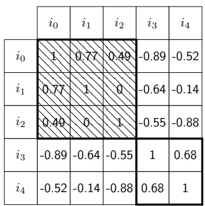

c) Ma trận tương tự sản phẩm S.

|  | u<sub>0</sub> | u<sub>1</sub> | u<sub>2</sub> | u<sub>3</sub> | u<sub>4</sub> | u<sub>5</sub> | u<sub>6</sub> |
| --- | --- | --- | --- | --- | --- | --- | --- |
| i<sub>0</sub> | 2.4 | 2.4 | -.6 | -2.6 | -1.6 | -0.29 | -1.52 |
| i<sub>1</sub> | 2 | 2.4 | -0.6 | -2 | -1.25 | 0 | -2.25 |
| i<sub>2</sub> | 2.4 | 2.25 | -0.75 | -2.6 | -1.20 | -0.75 | -0.75 |
| i<sub>3</sub> | -1.17 | -1.17 | -0.17 | 0.83 | 0.83 | 0.34 | 0.83 |
| i<sub>4</sub> | -0.75 | -2.75 | 1.25 | 1.03 | 1.16 | 0.65 | 2.25 |

d) Ma trận tiện ích chuẩn hoá sau hoàn thiện

Hình 18.3. Ví dụ mô tả item-item CF. a) Ma trận utility ban đầu. b) Ma trận utility đã được chuẩn hoá. c) User similarity matrix. d) Dự đoán các (normalized) rating còn thiếu.

trận tiện ích, ta nhận thấy có hai nhóm người dùng có sở thích khác nhau. Nhóm thứ nhất là $u _ { 0 }$ và $u _ { 1 } ;$ nhóm thứ hai là những người dùng còn lại.

Mục 18.4 sau đây mô tả cách lập trình cho NNCF trên Python. Thư viện sklearn hiện chưa hỗ trợ các thuật toán gợi ý. Bạn đọc có thể tham khảo một thư viện khác khá tốt trên python là surprise ([http://surpriselib.com/](http://surpriselib.com/)).

## 18.4. Lập trình trên Python

Thuật toán lọc cộng tác tương đối đơn giản và không chứa bài toán tối ưu nào. Chúng ta tiếp tục sử dụng bộ cơ sở dữ liệu MovieLens 100k như trong chương trước. Class uuCF trong đoạn code dưới đây thực hiện quy trình lọc cộng tác người dùng. Có hai phương thức chính của class này là fit – tính ma trận tương tự, và predict – dự đoán số sao mà một người dùng sẽ đánh giá một sản phẩm:

<!-- page: 254 -->

```python
from __future__ import print_function
import pandas as pd
import numpy as np
from sklearn.metrics.pairwise import cosine_similarity
from scipy import sparse

class uuCF(object):
    def __init__(self, Y_data, k, sim_func=cosine_similarity):
        self.Y_data = Y_data # a 2d array of shape (n_users, 3)
        # each row of Y_data has form [user_id, item_id, rating]
        self.k = k # number of neighborhood
        # similarity function, default: cosine_similarity
        self.sim_func = sim_func
        self.Ybar = None   # normalize data
        # number of users
        self.n_users = int(np.max(self.Y_data[:, 0])) + 1
        # number of items
        self.n_items = int(np.max(self.Y_data[:, 1])) + 1

    def fit(self):
        # normalized Y_data -> Ybar
        users = self.Y_data[:, 0] # all users - first column of Y_data
        self.Ybar = self.Y_data.copy()
        self.mu = np.zeros((self.n_users,))
        for n in xrange(self.n_users):
            # row indices of ratings made by user n
            ids = np.where(users == n)[0].astype(np.int32)
            # indices of all items rated by user n
            item_ids = self.Y_data[ids, 1]
            # ratings made by user n
            ratings = self.Y_data[ids, 2]
            # avoid zero division
            self.mu[n] = np.mean(ratings) if ids.size > 0 else 0
            self.Ybar[ids, 2] = ratings - self.mu[n]

        # form the rating matrix as a sparse matrix.
        # see more: https://goo.gl/i2mmT2
        self.Ybar = sparse.coo_matrix((self.Ybar[:, 2],
                             (self.Ybar[:, 1], self.Ybar[:, 0]),
                             (self.n_items, self.n_users)).tocsr()
        self.S = self.sim_func(self.Ybar.T, self.Ybar.T)

    def pred(self, u, i):
        """ predict the rating of user u for item i"""
        # find item i
        ids = np.where(self.Y_data[:, 1] == i)[0].astype(np.int32)
        # all users who rated i
        users_rated_i = (self.Y_data[ids, 0]).astype(np.int32)
        sim = self.S[u, users_rated_i]  # sim. of u and those users

        nns = np.argsort(sim)[-self.k:] # most k similar users
        nearest_s = sim[nns] # and the corresponding similarities
        r = self.Ybar[i, users_rated_i[nns]] # the corresponding ratings
        eps = 1e-8 # a small number to avoid zero division
        return (r*nearest_s).sum()/(np.abs(nearest_s).sum()+eps)+self.mu[u]
```

<!-- page: 255 -->

Tiếp theo, ta áp dụng vào MoviesLen 100k:

```python
r_cols = ['user_id', 'movie_id', 'rating', 'unix_timestamp']
ratings_base = pd.read_csv('ml-100k/ua.base', sep='\t', names=r_cols)
ratings_test = pd.read_csv('ml-100k/ua.test', sep='\t', names=r_cols)
rate_train = ratings_base.as_matrix()
rate_test = ratings_test.as_matrix()
rate_train[:, :2] -= 1 # since indices start from 0
rate_test[:, :2] -= 1
rs = uuCF(rate_train, k = 40)
rs.fit()
n_tests = rate_test.shape[0]
SE = 0 # squared error
for n in xrange(n_tests):
    pred = rs.pred(rate_test[n, 0], rate_test[n, 1])
    SE += (pred - rate_test[n, 2])**2

RMSE = np.sqrt(SE/n_tests)
print('User-user CF, RMSE =', RMSE)
```

Kết quả:

```txt
User-user CF, RMSE = 0.976614028929
```

Như vậy, trung bình mỗi đánh giá bị dự đoán lệch khoảng 0.976. Kết quả này tốt hơn kết quả có được bởi gợi ý dựa trên nội dung trong chương trước.

Tiếp theo, chúng ta áp dụng lọc cộng tác sản phẩm vào tập cơ sở dữ liệu này. Để áp dụng lọc cộng tác sản phẩm, ta chỉ cần chuyển vị ma trận tiện ích. Trong trường hợp này, vì ma trận tiện ích được lưu dưới dạng [user\_id, item\_id, rating] nên ta chỉ cần đổi chỗ cột thứ nhất cho cột thứ hai của Y\_data:

```python
rate_train = rate_train[:, [1, 0, 2]]
rate_test = rate_test[:, [1, 0, 2]]

rs = uuCF(rate_train, k = 40)
rs.fit()

n_tests = rate_test.shape[0]
SE = 0 # squared error
for n in xrange(n_tests):
    pred = rs.pred(rate_test[n, 0], rate_test[n, 1])
    SE += (pred - rate_test[n, 2])**2

RMSE = np.sqrt(SE/n_tests)
print('Item-item CF, RMSE=', RMSE)
```

Kết quả:

```txt
Item-item CF, RMSE = 0.968846083868
```

<!-- page: 256 -->

Như vậy, trong trường hợp này lọc cộng tác sản phẩm cho kết quả tốt hơn, ngay cả khi số sản phẩm (1682) lớn hơn số người dùng (943). Với các bài toán khác, chúng ta nên thử cả hai phương pháp trên một tập xác thực và chọn ra phương pháp cho kết quả tốt hơn. Kích thước lân cận k cũng có thể được thay bằng các giá trị khác.

## 18.5. Thảo luận

• Lọc cộng tác là một phương pháp gợi ý sản phẩm dựa trên hành vi của các người dùng tương tự khác lên cùng một sản phẩm. Việc làm này được thực hiện dựa trên sự tương tự giữa người dùng được mô tả bởi ma trận tương tự.

• Để tính ma trận tương tự, trước tiên ta cần chuẩn hoá dữ liệu. Phương pháp chuẩn hoá dữ liệu phổ biến là trừ mỗi cột (hoặc hàng) của ma trận tiện ích đi trung bình của các phần tử đã biết trong cột (hàng) đó.

• Hàm tương tự thường dùng là tương tự cos.

• Một hướng tiếp cận khác là thay vì đi tìm các người dùng tương tự với một người dùng (lọc cộng tác người dùng), ta đi tìm các sản phẩm tương tự với một sản phẩm cho trước (lọc cộng tác sản phẩm). Trong nhiều trường hợp, lọc cộng tác sản phẩm mang lại kết quả tốt hơn.

• Mã nguồn trong chương này có thể được tìm thấy tại [https://goo.gl/vGKjbo](https://goo.gl/vGKjbo).

## Đọc thêm

1. M. Ekstrand et al., Collaborative filtering recommender systems. ([https://goo.gl/GVn8av](https://goo.gl/GVn8av)) Foundations and Trends® in Human–Computer Interaction 4.2 (2011): 81-173.

<!-- page: 257 -->

## Lọc cộng tác phân tích ma trận

## 19.1. Giới thiệu

Trong Chương 18, chúng ta đã làm quen với phương pháp lọc cộng tác dựa trên hành vi của người dùng hoặc sản phẩm lân cận. Trong chương này, chúng ta sẽ làm quen với một hướng tiếp cận khác cho lọc cộng tác dựa trên bài toán phân tích ma trận thành nhân tử (matrix factorization hoặc matrix decomposition). Phương pháp này được gọi là lọc cộng tác phân tích ma trận (matrix factorization collaborative filtering – MFCF) [KBV09].

Nhắc lại rằng trong hệ thống gợi $\acute { \mathrm { y } }$ dựa trên nội dung, mỗi sản phẩm được mô tả bằng một vector thông tin x. Trong phương pháp đó, ta cần tìm một vector trọng số w tương ứng với mỗi người dùng sao cho các đánh giá đã biết của người dùng tới các sản phẩm được xấp xỉ bởi:

$$
y \approx \mathbf {x} ^ {T} \mathbf {w}\tag{19.1}
$$

Với cách làm này, ma trận tiện ích Y, giả sử đã được điền hết, sẽ xấp xỉ với:

$$
\mathbf {Y} \approx \left[ \begin{array}{c c c c} \mathbf {x} _ {1} ^ {T} \mathbf {w} _ {1} & \mathbf {x} _ {1} ^ {T} \mathbf {w} _ {2} & \dots & \mathbf {x} _ {1} ^ {T} \mathbf {w} _ {N} \\ \mathbf {x} _ {2} ^ {T} \mathbf {w} _ {1} & \mathbf {x} _ {2} ^ {T} \mathbf {w} _ {2} & \dots & \mathbf {x} _ {2} ^ {T} \mathbf {w} _ {N} \\ \dots & \dots & \ddots & \dots \\ \mathbf {x} _ {M} ^ {T} \mathbf {w} _ {1} & \mathbf {x} _ {M} ^ {T} \mathbf {w} _ {2} & \dots & \mathbf {x} _ {M} ^ {T} \mathbf {w} _ {N} \end{array} \right] = \left[ \begin{array}{c} \mathbf {x} _ {1} ^ {T} \\ \mathbf {x} _ {2} ^ {T} \\ \dots \\ \mathbf {x} _ {M} ^ {T} \end{array} \right] \left[ \begin{array}{c} \mathbf {w} _ {1}   \mathbf {w} _ {2}   \dots   \mathbf {w} _ {N} \end{array} \right] = \mathbf {X} ^ {T} \mathbf {W}\tag{19.2}
$$

với M, N lần lượt là số lượng sản phẩm và người dùng. Chú ý rằng trong hệ thống gợi $\hat { \mathrm { y } }$ dựa trên nội dung, x được xây dựng dựa trên thông tin mô tả của sản phẩm và quá trình xây dựng này độc lập với quá trình đi tìm hệ số phù hợp cho mỗi người dùng. Như vậy, việc xây dựng thông tin sản phẩm đóng vai trò quan trọng và có ảnh hưởng trực tiếp tới hiệu năng của mô hình. Thêm nữa, việc xây dựng từng mô hình riêng lẻ cho mỗi người dùng dẫn đến kết quả chưa thực sự tốt vì không khai thác được mối quan hệ giữa người dùng.

<!-- page: 258 -->

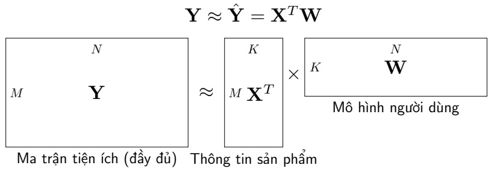

Hình 19.1. Phân tích ma trận. Ma trận tiện ích $\mathbf { Y } \in \mathbb { R } ^ { M \times N }$ được xấp xỉ bởi tích của hai ma trận $\mathbf { X } \in \mathbb { R } ^ { M \times K }$ và $\mathbf { W } \in \mathbb { R } ^ { K \times N }$

Bây giờ, giả sử rằng không cần xây dựng trước thông tin sản phẩm x mà vector này có thể được huấn luyện đồng thời với mô hình của mỗi người dùng (ở đây là một vector trọng số). Điều này nghĩa là, biến số trong bài toán tối ưu là cả X và W; trong đó, mỗi cột của X là thông tin về một sản phẩm, mỗi cột của W là mô hình của một người dùng.

Với cách làm này, chúng ta đang cố gắng xấp xỉ ma trận tiện ích $\mathbf { Y } \in \mathbb { R } ^ { M \times N }$ bằng tích của hai ma trận $\mathbf { X } \in \mathbb { R } ^ { K \times M } { \mathrm { ~ v \hat { a } ~ } } \mathbf { W } \in \mathbb { R } ^ { K \times N }$ . Thông thường, K được chọn là một số nhỏ hơn so với M, N. Khi đó, cả hai ma trận X và W đều có hạng không vượt quá K. Chính vì vậy, phương pháp này còn được gọi là phân tích ma trận hạng thấp (low-rank matrix factorization) (xem Hình 19.1).

## Một vài điểm cần lưu $\hat { \mathbf { y } } ;$

$\acute { \mathrm { Y } }$ tưởng chính đằng sau lọc cộng tác phân tích ma trận là tồn tại các đặc trưng ẩn (latent feature) mô tả mối quan hệ giữa sản phẩm và người dùng. Ví dụ, trong hệ thống khuyến nghị các bộ phim, đặc trưng ẩn có thể là hình sự, chính trị, hành động, hài,...; cũng có thể là một sự kết hợp nào đó của các thể loại này. Đặc trưng ẩn cũng có thể là bất cứ điều gì mà chúng ta không thực sự cần đặt tên. Mỗi sản phẩm sẽ mang đặc trưng ẩn ở một mức độ nào đó tương ứng với các hệ số trong vector x của nó, hệ số càng cao tương ứng với việc mang tính chất đó càng cao. Tương tự, mỗi người dùng cũng sẽ có xu hướng thích những tính chất ẩn nào đó được mô tả bởi các hệ số trong vector w. Hệ số cao tương ứng với việc người dùng thích các bộ phim có tính chất ẩn đó nhiều. Giá trị của biểu thức x<sup>T</sup> w sẽ cao nếu các thành phần tương ứng của x và w đều cao (và dương) hoặc đều thấp (và âm). Điều này nghĩa là sản phẩm mang các tính chất ẩn mà người dùng thích, vậy ta nên gợi ý sản phẩm này cho người dùng đó.

• Tại sao phân tích ma trận được xếp vào lọc cộng tác? Câu trả lời đến từ việc tối ưu hàm mất mát được thảo luận ở Mục 19.2. Về cơ bản, để tìm nghiệm của bài toán tối ưu, ta phải lần lượt đi tìm X và W khi thành phần còn lại được cố định. Như vậy, mỗi cột của X sẽ phụ thuộc vào toàn bộ các cột của

<!-- page: 259 -->

W. Ngược lại, mỗi cột của W phụ thuộc vào toàn bộ các cột của X. Như vậy, có những mỗi quan hệ ràng buộc chằng chịt giữa các thành phần của hai ma trận trên. Vì vậy, phương pháp này cũng được xếp vào lọc cộng tác.

• Trong các bài toán thực tế, số lượng sản phẩm M và số lượng người dùng N thường rất lớn. Việc tìm ra các mô hình đơn giản giúp dự đoán độ quan tâm cần được thực hiện một cách nhanh nhất có thể. Lọc cộng tác dựa trên lân cận không yêu cầu việc huấn luyện quá nhiều, nhưng trong quá trình dự đoán, ta cần đi tìm độ tương tự của một người dùng với toàn bộ người dùng còn lại rồi suy ra kết quả. Ngược lại, với phân tích ma trận, việc huấn luyện tạp hơn vì phải lặp đi lặp lại việc tối ưu một ma trận khi cố định ma trận còn lại. Tuy nhiên, việc dự đoán đơn giản hơn vì chỉ cần tính tích vô hướng $\mathbf { x } ^ { T } \mathbf { w } ,$ mỗi vector có độ dài K là một số nhỏ hơn nhiều so với M, N. Vì vậy, quá trình dự đoán không yêu cầu nặng về tính toán. Việc này khiến phân tích ma trận trở nên phù hợp với các mô hình có tập dữ liệu lớn.

• Hơn nữa, việc lưu trữ hai ma trận X và W yêu cầu lượng bộ nhớ nhỏ so với việc lưu toàn bộ ma trận tiện ích và tương tự trong lọc cộng tác lân cận. Cụ thể, ta cần bộ nhớ để chứa $K ( M + N )$ phần tử thay vì $M ^ { 2 }$ hoặc $N ^ { 2 }$ của ma trận tương tự $( K \ll M , N )$

## 19.2. Xây dựng và tối ưu hàm mất mát

## 19.2.1. Xấp xỉ các đánh giá đã biết

Như đã đề cập, đánh giá của người dùng n tới sản phẩm m có thể được xấp xỉ bởi $y _ { m n } = \mathbf { x } _ { m } ^ { T } \mathbf { w } _ { n }$ . Ta cũng có thể thêm các hệ số điều chỉnh vào công thức xấp xỉ này và tối ưu các hệ số đó. Cụ thể:

$$
y _ {m n} \approx \mathbf {x} _ {m} ^ {T} \mathbf {w} _ {n} + b _ {m} + d _ {n}\tag{19.3}
$$

Trong đó, $b _ { m }$ và $d _ { n }$ lượt lượt là các hệ số điều chỉnh ứng với sản phẩm m và người dùng n. Vector b $\begin{aligned} { = [ b _ { 1 } , b _ { 2 } , \ldots , b _ { M } ] ^ { T } } \\ \end{aligned}$ là vector điều chỉnh cho các sản phẩm, vector $\mathbf { d } = [ d _ { 1 } , d _ { 2 } , \ldots , d _ { N } ] ^ { T }$ là vector điều chỉnh cho các người dùng. Giống như lọc cộng tác lân cận (NBCF), các giá trị này cũng có thể được coi là các giá trị giúp chuẩn hoá dữ liệu với b tương ứng với lọc cộng tác sản phẩm và d tương ứng với lọc cộng tác người dùng. Không giống như trong NBCF, các vector này sẽ được tối ưu để tìm ra các giá trị phù hợp với tập huấn luyện nhất. Thêm vào đó, huấn luyện d và b cùng lúc giúp kết hợp cả lọc cộng tác người dùng và lân cận vào một bài toán tối ưu. Vì vậy, chúng ta mong đợi rằng phương pháp này sẽ mang lại hiệu quả tốt hơn.

## 19.2.2. Hàm mất mát

Hàm mất mát cho MFCF có thể được viết như sau:

<!-- page: 260 -->

$$
\mathcal {L} (\mathbf {X}, \mathbf {W}, \mathbf {b}, \mathbf {d}) = \underbrace {\frac {1}{2 s} \sum_ {n = 1} ^ {N} \sum_ {m : r _ {m n} = 1} \left(\mathbf {x} _ {m} ^ {T} \mathbf {w} _ {n} + b _ {m} + d _ {n} - y _ {m n}\right) ^ {2}} _ {\text {mất mát trên dữ liệu}} + \underbrace {\frac {\lambda}{2} \left(\| \mathbf {X} \| _ {F} ^ {2} + \| \mathbf {W} \| _ {F} ^ {2}\right)} _ {\text {mất mát kiểm soát}}
$$

trong đó $r _ { m n } = 1$ nếu sản phẩm thứ $m$ đã được đánh giá bởi người dùng thứ $n$ s là số lượng đánh giá đã biết trong tập huấn luyện, $y _ { m n }$ là đánh giá chưa chuẩn hoá<sup>50</sup> của người dùng thứ $n$ tới sản phẩm thứ m. Thành phần thứ nhất của hàm mất mát chính là sai số trung bình bình phương sai số của mô hình. Thành phần thứ hai chính là kiểm soát $l _ { 2 }$ giúp mô hình tránh quá khớp.

Việc tối ưu đồng thời X, W, b, d là tương đối phức tạp. Phương pháp được sử dụng là lần lượt tối ưu một trong hai cặp (X, b), (W, d) trong lúc cố định cặp còn lại. Quá trình này được lặp đi lặp lại cho tới khi hàm mất mát hội tụ.

## 19.2.3. Tối ưu hàm mất mát

Khi cố định cặp (X, b), bài toán tối ưu cặp (W, d) có thể được tách thành N bài toán nhỏ:

$$
\mathcal {L} _ {1} (\mathbf {w} _ {n}, d _ {n}) = \frac {1}{2 s} \sum_ {m: r _ {m n} = 1} (\mathbf {x} _ {m} ^ {T} \mathbf {w} _ {n} + b _ {m} + d _ {n} - y _ {m n}) ^ {2} + \frac {\lambda}{2} \| \mathbf {w _ {n}} \| _ {F} ^ {2}\tag{19.4}
$$

Mỗi bài toán có thể được tối ưu bằng gradient descent. Công việc quan trọng là tính các gradient của từng hàm mất mát nhỏ này theo $\mathbf { w } _ { n }$ và $d _ { n }$ . Vì biểu thức trong dấu $\sum$ chỉ phụ thuộc vào các sản phẩm đã được đánh giá bởi người dùng thứ n (tương ứng với các $r _ { m n } = 1 )$ , ta có thể đơn giản (19.4) bằng cách đặt $\hat { \mathbf { X } } _ { n }$ là ma trận con được tạo bởi các cột của X tương ứng với các sản phẩm đã được đánh giá bởi người dùng $n ,   \hat { \mathbf { b } } _ { n }$ là vector điều chỉnh con tương ứng, và $\hat { \mathbf { y } } _ { n }$ là các đánh giá tương ứng. Khi đó,

$$
\mathcal {L} _ {1} (\mathbf {w} _ {n}, d _ {n}) = \frac {1}{2 s} \| \hat {\mathbf {X}} _ {n} ^ {T} \mathbf {w} _ {n} + \hat {\mathbf {b}} _ {n} + d _ {n} \mathbf {1} - \hat {\mathbf {y}} _ {n} \| ^ {2} + \frac {\lambda}{2} \| \mathbf {w} _ {n} \| _ {2} ^ {2}\tag{19.5}
$$

với 1 là vector với mọi phần tử bằng một với kích thước phù hợp. Các gradient của nó là:

$$
\nabla_ {\mathbf {w} _ {n}} \mathcal {L} _ {1} = \frac {1}{s} \hat {\mathbf {X}} _ {n} (\hat {\mathbf {X}} _ {n} ^ {T} \mathbf {w} _ {n} + \hat {\mathbf {b}} _ {n} + d _ {n} \mathbf {1} - \hat {\mathbf {y}} _ {n}) + \lambda \mathbf {w} _ {n}\tag{19.6}
$$

$$
\nabla_ {b _ {n}} \mathcal {L} _ {1} = \frac {1}{s} \mathbf {1} ^ {T} (\hat {\mathbf {X}} _ {n} ^ {T} \mathbf {w} _ {n} + \hat {\mathbf {b}} _ {n} + d _ {n} \mathbf {1} - \hat {\mathbf {y}} _ {n})\tag{19.7}
$$

Công thức cập nhật cho $\mathbf { W } _ { n }$ và $d _ { n }$ :

$$
\mathbf {w} _ {n} \leftarrow \mathbf {w} _ {n} - \eta \left(\frac {1}{s} \hat {\mathbf {X}} _ {n} (\hat {\mathbf {X}} _ {n} ^ {T} \mathbf {w} _ {n} + \hat {\mathbf {b}} _ {n} + d _ {n} \mathbf {1} - \hat {\mathbf {y}} _ {n}) + \lambda \mathbf {w} _ {n}\right)\tag{19.8}
$$

$$
d _ {n} \leftarrow d _ {n} - \eta \left(\frac {1}{s} \mathbf {1} ^ {T} (\hat {\mathbf {X}} _ {n} ^ {T} \mathbf {w} _ {n} + \hat {\mathbf {b}} _ {n} + d _ {n} \mathbf {1} - \hat {\mathbf {y}} _ {n})\right)\tag{19.9}
$$

<small><span class="docvortex-page-footnote" data-block-type="page_footnote" style="color:#6b7280">50 việc chuẩn hoá sẽ được tự động thực hiện thông qua việc huấn luyện b và d</span></small>

<!-- page: 261 -->

Tương tự, mỗi cột $\mathbf { x } _ { m }$ của X và $b _ { m }$ sẽ được tìm bằng cách tối ưu bài toán

$$
\mathcal {L} _ {2} (\mathbf {x} _ {m}, b _ {m}) = \frac {1}{2 s} \sum_ {n: r _ {m n} = 1} (\mathbf {w} _ {n} ^ {T} \mathbf {x} _ {m} + d _ {n} + b _ {m} - y _ {m n}) ^ {2} + \frac {\lambda}{2} \| \mathbf {x} _ {m} \| _ {2} ^ {2}\tag{19.10}
$$

Đặt $\hat { \mathbf { W } } _ { m }$ là ma trận con tạo bởi các cột của W ứng với các người dùng đã đánh giá sản phẩm $m ,   \hat { \mathbf { d } } _ { m }$ là vector điều chỉnh con tương ứng, và $\hat { \mathbf { y } } ^ { m }$ là vector các đánh giá tương ứng. Bài toán (19.10) trở thành

$$
\mathcal {L} (\mathbf {x} _ {m}, b _ {m}) = \frac {1}{2 s} \| \hat {\mathbf {W}} _ {m} ^ {T} \mathbf {x} _ {m} + \hat {\mathbf {d}} _ {m} + b _ {n} \mathbf {1} - \hat {\mathbf {y}} _ {m} \| + \frac {\lambda}{2} \| \mathbf {x} _ {m} \| _ {2} ^ {2}.\tag{19.11}
$$

Tương tự ta có

Công thức cập nhật cho $\mathbf { x } _ { m }$ và $b _ { m }$ :

$$
\mathbf {x} _ {m} \leftarrow \mathbf {x} _ {m} - \eta \left(\frac {1}{s} \hat {\mathbf {W}} _ {m} (\hat {\mathbf {W}} _ {m} ^ {T} \mathbf {x} _ {m} + \hat {\mathbf {d}} _ {m} + b _ {n} \mathbf {1} - \hat {\mathbf {y}} _ {m}) + \lambda \mathbf {x} _ {m}\right)\tag{19.12}
$$

$$
b _ {m} \leftarrow b _ {m} - \eta \left(\frac {1}{s} \mathbf {1} ^ {T} (\hat {\mathbf {W}} _ {m} ^ {T} \mathbf {x} _ {m} + \hat {\mathbf {d}} _ {m} + b _ {n} \mathbf {1} - \hat {\mathbf {y}} _ {m})\right)\tag{19.13}
$$

## 19.3. Lập trình Python

Chúng ta sẽ viết một class MF thực hiện việc tối ưu các biến với ma trận tiện ích được cho dưới dạng Y\_data giống như với NBCF.

Trước tiên, ta khai báo một vài thư viện cần thiết và khởi tạo class MF:

```python
from __future__ import print_function
import pandas as pd
import numpy as np
from sklearn.metrics.pairwise import cosine_similarity
from scipy import sparse

class MF(object):
    def __init__(self, Y, K, lam = 0.1, Xinit = None, Winit = None,
        learning_rate = 0.5, max_iter = 1000, print_every = 100):
        self.Y = Y  # represents the utility matrix
        self.K = K
        self.lam = lam  # regularization parameter
        self.learning_rate = learning_rate # for gradient descent
        self.max_iter = max_iter # maximum number of iterations
        self.print_every = print_every # print loss after each a few iters
        self.n_users = int(np.max(Y[:, 0])) + 1
        self.n_items = int(np.max(Y[:, 1])) + 1
        self.n_ratings = Y.shape[0] # number of known ratings
        self.X = np.random.randn(self.n_items, K) if Xinit is None\
            else Xinit
        self.W = np.random.randn(K, self.n_users) if Winit is None\
            else Winit
        self.b = np.random.randn(self.n_items) # item biases
        self.d = np.random.randn(self.n_users) # user biases
```

<!-- page: 262 -->

Tiếp theo, chúng ta viết các phương thức loss, updateXb, updateWd cho class MF.

```python
def loss(self):
    L = 0
    for i in range(self.n_ratings):
        # user_id, item_id, rating
        n, m, rating = int(self.Y[i,0]), int(self.Y[i,1]), self.Y[i,2]
        L += 0.5*(self.X[m].dot(self.W[:, n])\
        + self.b[m] + self.d[n] - rating)**2

        L /= self.n_ratings
        # regularization, don't ever forget this
        return L + 0.5*self.lam*(np.sum(self.X**2) + np.sum(self.W**2))

def updateXb(self):
    for m in range(self.n_items):
        # get all users who rated item m and corresponding ratings
        ids = np.where(self.Y[:, 1] == m)[0] # row indices of items m
        user_ids, ratings=self.Y[ids, 0].astype(np.int32),self.Y[ids, 2]
        Wm, dm = self.W[:, user_ids], self.d[user_ids]
        for i in range(30): # 30 iteration for each sub problem
            xm = self.X[m]
            error = xm.dot(Wm) + self.b[m] + dm - ratings
            grad_xm = error.dot(Wm.T)/self.n_ratings + self.lam*xm
            grad_bm = np.sum(error)/self.n_ratings
            # gradient descent
            self.X[m] -= self.learning_rate*grad_xm.reshape(-1)
            self.b[m] -= self.learning_rate*grad_bm

def updateWd(self): # and d
    for n in range(self.n_users):
        # get all items rated by user n, and the corresponding ratings
        ids = np.where(self.Y[:,0] == n)[0] #indexes of items rated by n
        item_ids,ratings=self.Y[ids, 1].astype(np.int32), self.Y[ids, 2]
        Xn, bn = self.X[item_ids], self.b[item_ids]
        for i in range(30): # 30 iteration for each sub problem
            wn = self.W[:, n]
            error = Xn.dot(wn) + bn + self.d[n] - ratings
            grad_wn = Xn.T.dot(error)/self.n_ratings + self.lam*xn
            grad_dn = np.sum(error)/self.n_ratings
            # gradient descent
            self.W[:, n] -= self.learning_rate*grad_wn.reshape(-1)
            self.d[n] -= self.learning_rate*grad_dn
```

Phần tiếp theo là quá trình tối ưu chính của MF (fit), dự đoán đánh giá (pred) và đánh giá chất lượng mô hình bằng RMSE (evaluate\_RMSE).

```python
def fit(self):
    for it in range(self.max_iter):
        self.updateWd()
        self.updateXb()
        if (it + 1) % self.print_every == 0:
            rmse_train = self.evaluate_RMSE(self.Y)
            print('iter = %d, loss = %.4f, RMSE train = %.4f'%(it + 1,
                self.loss(), rmse_train))
```

<!-- page: 263 -->

```python
def pred(self, u, i):
    """
    predict the rating of user u for item i
    """
    u, i = int(u), int(i)
    pred = self.X[i, :].dot(self.W[:, u]) + self.b[i] + self.d[u]
    return max(0, min(5, pred)) # 5-scale in MoviesLen

def evaluate_RMSE(self, rate_test):
    n_tests = rate_test.shape[0] # number of test
    SE = 0 # squared error
    for n in range(n_tests):
        pred = self.pred(rate_test[n, 0], rate_test[n, 1])
        SE += (pred - rate_test[n, 2])*2

    RMSE = np.sqrt(SE/n_tests)
    return RMSE
```

Tới đây, class MF đã được xây dựng với các phương thúc cần thiết. Ta cần kiểm tra chất lượng mô hình khi áp dụng lên tập dữ liệu MoviesLen 100k:

```python
r_cols = ['user_id', 'movie_id', 'rating', 'unix_timestamp']
ratings_base = pd.read_csv('ml-100k/ua.base', sep='\t', names=r_cols)
ratings_test = pd.read_csv('ml-100k/ua.test', sep='\t', names=r_cols)

rate_train = ratings_base.as_matrix()
rate_test = ratings_test.as_matrix()

# indices start from 0
rate_train[:, :2] -= 1
rate_test[:, :2] -= 1

rs = MF(rate_train, K = 50, lam = .01, print_every = 5, learning_rate = 50,
max_iter = 30)
rs.fit()
# evaluate on test data
RMSE = rs.evaluate_RMSE(rate_test)
print('\nMatrix Factorization CF, RMSE = %.4f' %RMSE)
```

Kết quả:

```txt
iter = 5, loss = 0.4447, RMSE train = 0.9429
iter = 10, loss = 0.4215, RMSE train = 0.9180
iter = 15, loss = 0.4174, RMSE train = 0.9135
iter = 20, loss = 0.4161, RMSE train = 0.9120
iter = 25, loss = 0.4155, RMSE train = 0.9114
iter = 30, loss = 0.4152, RMSE train = 0.9110

Matrix Factorization CF, RMSE = 0.9621
```

RMSE thu được là 0.9621, tốt hơn so với NBCF trong chương trước (0.9688).

<!-- page: 264 -->

## 19.4. Thảo luận

• Phân tích ma trận không âm:. Khi ma trận tiện ích chưa được chuẩn hoá, các phần tử đều là giá trị không âm. Kể cả trong trường hợp dải giá trị của các đánh giá có chứa giá trị âm, ta chỉ cần cộng thêm vào ma trận tiện ích một giá trị hợp lý để có được các thành phần là các số không âm. Khi đó, một phương pháp phân tích ma trận thường mang lại hiệu quả cao trong các hệ thống gợi ý là phân tích ma trận không âm (nonnegative matrix factorization – NMF) [ZWFM06], tức phân tích ma trận thành tích các ma trận có các phần tử không âm. Lúc này, đặc trưng ẩn của một sản phẩm và hệ số tương ứng của người dùng là các số không âm.

Thông qua phân tích ma trận, người dùng và sản phẩm được liên kết với nhau bởi các đặc trưng ẩn. Độ liên kết của mỗi người dùng và sản phẩm tới mỗi đặc trưng ẩn được đo bằng thành phần tương ứng trong vector đặc trưng, giá trị càng lớn thể hiện việc người dùng hoặc sản phẩm có liên quan đến đặc trưng ẩn đó càng lớn. Bằng trực giác, sự liên quan của một người dùng hoặc sản phẩm đến một đặc trưng ẩn nên là một số không âm với giá trị không thể hiện việc không liên quan thay vì giá trị âm. Hơn nữa, mỗi người dùng và sản phẩm chỉ liên quan đến một vài đặc trưng ẩn nhất định. Vì vậy, các vector đặc trưng cho người dùng và sản phẩm nên là các vector không âm và có rất nhiều giá trị bằng không. Những nghiệm này có thể đạt được bằng cách cho thêm ràng buộc không âm vào các thành phần của X và W. Đây chính là nguồn gốc của ý tưởng và tên gọi phân tích ma trận không âm.

• Phân tích ma trận điều chỉnh nhỏ: thời gian dự đoán của một hệ thống gợi ý sử dụng phân tích ma trận là rất nhanh nhưng thời gian huấn luyện là khá lâu với các bài toán quy mô lớn. Thực tế cho thấy, ma trận tiện ích thay đổi liên tục vì có thêm người dùng, sản phẩm cũng như các đánh giá mới, vì vậy các tham số mô hình cũng phải thường xuyên được cập nhật. Điều này đồng nghĩa với việc ta phải tiếp tục thực hiện quá trình huấn luyện vốn tốn khá nhiều thời gian. Thay vì huấn luyện lại toàn bộ mô hình, ta có thể điều chỉnh các ma trận X và W bằng cách huấn luyện thêm một vài vòng lặp. Kỹ thuật này được gọi là phân tích ma trận điều chỉnh nhỏ (incremental matrix factorization) [VJG14], được áp dụng nhiều trong các bài toán quy mô lớn.

• Có nhiều các giải bài toán tối ưu của phân tích ma trận ngoài cách áp dụng gradient descent. Bạn đọc có thể xem thêm alternating least square (ALS) ([https://goo.gl/g2M4fb](https://goo.gl/g2M4fb)), generalized low rank models ([https://goo.gl/DrDWyW](https://goo.gl/DrDWyW)), và phân tích giá trị suy biến [SKKR02, Pat07]. Chương 20 sẽ trình bày kỹ về phân tích giá trị suy biến.

• Mã nguồn trong chương này có thể được tìm thấy tại [https://goo.gl/XbbFH4](https://goo.gl/XbbFH4).

<!-- page: 265 -->

# Giảm chiều dữ liệu

Các bài toán quy mô lớn trên thực tế có lượng điểm dữ liệu lớn và dữ liệu nhiều chiều. Nếu thực hiện lưu trữ và tính toán trực tiếp trên dữ liệu có số chiều lớn thì sẽ gặp khó khăn về lưu trữ và tính toán. Vì vậy, giảm chiều dữ liệu (dimensionality reduction hoặc dimension reduction) là một bước quan trọng trong nhiều bài toán machine learning.

Dưới góc độ toán học, giảm chiều dữ liệu là việc đi tìm một hàm số $f : \mathbb { R } ^ { D } \rightarrow \mathbb { R } ^ { K }$ với $K < D$ biến một điểm dữ liệu x trong không gian có số chiều lớn $\mathbb { R } ^ { D }$ thành một điểm z trong không gian có số chiều nhỏ hơn $\mathbb { R } ^ { D }$ . Giảm chiều dữ liệu có thể áp dụng vào các bài toán nén thông tin. Nó cũng hữu ích trong việc chọn ra những đặc trưng quan trọng hoặc tạo ra các đặc trưng mới từ đặc trưng cũ phù hợp với từng bài toán. Trong nhiều trường hợp, làm việc trên dữ liệu đã giảm chiều cho kết quả tốt hơn dữ liệu trong không gian ban đầu.

Trong phần này, chúng ta sẽ xem xét các phương pháp giảm chiều dữ liệu phổ biến nhất: phân tích thành phần chính (principle component analysis) cho bài toán giảm chiều dữ liệu vẫn giữ tối đa lượng thông tin, và linear discriminant analysis cho bài toán giữ lại những đặc trưng quan trọng nhất cho việc phân loại. Trước hết, chúng ta cùng tìm hiểu một phương pháp phân tích ma trận vô cùng quan trọng – phân tích giá trị suy biến (singular value decomposition).

<!-- page: 266 -->

# Phân tích giá trị suy biến

## 20.1. Giới thiệu

Nhắc lại bài toán chéo hoá ma trận: Một ma trận vuông $\mathbf { A } \in \mathbb { R } ^ { n \times n }$ gọi là chéo hoá được nếu tồn tại ma trận đường chéo D và ma trận khả nghịch P sao cho:

$$
\mathbf {A} = \mathbf {P D P} ^ {- 1}\tag{20.1}
$$

Nhân cả hai vế của (20.1) với P ta có

$$
\mathrm{AP} = \mathrm{PD}\tag{20.2}
$$

Gọi $\mathbf { p } _ { i } , \mathbf { d } _ { i }$ lần lượt là cột thứ i của ma trận P và D. Vì mỗi cột của vế trái và vế phải của (20.2) phải bằng nhau, ta cần có

$$
\mathbf {A p} _ {i} = \mathbf {P d} _ {i} = d _ {i i} \mathbf {p} _ {i}\tag{20.3}
$$

với $d _ { i i }$ là phần tử thứ i của $\mathbf { d } _ { i }$ . Dấu bằng thứ hai xảy ra vì D là ma trận đường chéo, tức $\mathbf { d } _ { i }$ chỉ có thành phần $d _ { i i }$ khác không. Biểu thức (20.3) chỉ ra rằng mỗi phần tử $d _ { i i }$ phải là một trị riêng của A và mỗi vector cột $\mathbf { p } _ { i }$ phải là một vector riêng của A ứng với trị riêng $d _ { i i }$

Cách phân tích một ma trận vuông thành nhân tử như (20.1) còn được gọi là phân tích riêng (eigen decomposition). Đáng chú $\acute { \mathbf { y } } ,$ không phải lúc nào cũng tồn tại cách phân tích này cho một ma trận bất kỳ. Nó chỉ tồn tại nếu ma trận A có n vector riêng độc lập tuyến tính, tức ma trận P khả nghịch. Thêm nữa, cách phân tích này không phải là duy nhất vì nếu P, D thoả mãn (20.1) thì kP, D cũng thoả mãn với k là một số thực khác không bất kỳ.

Việc phân tích một ma trận thành tích của nhiều ma trận đặc biệt khác mang lại những ích lợi quan trọng trong bài toán gợi $\acute { \mathrm { y } }$ sản phẩm, giảm chiều dữ liệu, nén

<!-- page: 267 -->

dữ liệu, tìm hiểu các đặc tính của dữ liệu, giải các hệ phương trình tuyến tính, phân cụm và nhiều ứng dụng khác.

Trong chương này, chúng ta sẽ làm quen với một trong những phương pháp phân tích ma trận rất đẹp của đại số tuyến tính có tên là phân tích giá trị suy biên (singular value decomposition – SVD) [GR70]. Mọi ma trận, không nhất thiết vuông, đều có thể được phân tích thành tích của ba ma trận đặc biệt.

## 20.2. Phân tích giá trị suy biến

Để hạn chế nhầm lẫn trong các phép toán, ta sẽ ký hiệu một ma trận cùng với kích thước của nó, ví dụ $\mathbf { A } _ { m \times n }$ ký hiệu một ma trận $\mathbf { A } \in \mathbb { R } ^ { m \times n }$

## 20.2.1. Phát biểu phân tích giá trị suy biến

## Phân tích giá trị suy biến (SVD)

Một ma trận $\mathbf { A } _ { m \times n }$ bất kỳ đều có thể phân tích thành dạng:

$$
\mathbf {A} _ {m \times n} = \mathbf {U} _ {m \times m} \boldsymbol {\Sigma} _ {m \times n} (\mathbf {V} _ {n \times n}) ^ {T}\tag{20.4}
$$

với U, V là các ma trận trực giao, Σ là một ma trận đường chéo cùng kích thước với A. Các phần tử trên đường chéo chính của Σ là không âm và được sắp xếp theo thứ tự giảm dần $\sigma _ { 1 } \geq \sigma _ { 2 } \geq \cdots \geq \sigma _ { r } \geq 0 = 0 = \cdots = 0 .$ Số lượng các phần tử khác không trong Σ chính là hạng của ma trận A: $r = \mathit { r a n k } ( \mathbf { A } )$

SVD của một ma trận bất kỳ luôn tồn tại<sup>51</sup>. Cách biểu diễn (20.4) không là duy nhất vì ta chỉ cần đổi dấu của cả U và V thì (20.4) vẫn thoả mãn.

Hình 20.1 mô tả SVD của ma trận $\mathbf { A } _ { m \times n }$ trong hai trường hợp: m < n và $m > n$ Trường hợp $m = n$ có thể xếp vào một trong hai trường hợp trên.

## 20.2.2. Nguồn gốc tên gọi

Tạm bỏ qua chiều của mỗi ma trận, từ (20.4) ta có:

$$
\mathbf {A} \mathbf {A} ^ {T} = \mathbf {U} \boldsymbol {\Sigma} \mathbf {V} ^ {T} (\mathbf {U} \boldsymbol {\Sigma} \mathbf {V} ^ {T}) ^ {T}\tag{20.5}
$$

$$
= \mathbf {U} \boldsymbol {\Sigma} \mathbf {V} ^ {T} \mathbf {V} \boldsymbol {\Sigma} ^ {T} \mathbf {U} ^ {T}\tag{20.6}
$$

$$
= \mathbf {U} \boldsymbol {\Sigma} \boldsymbol {\Sigma} ^ {T} \mathbf {U} ^ {T} = \mathbf {U} \boldsymbol {\Sigma} \boldsymbol {\Sigma} ^ {T} \mathbf {U} ^ {- 1}\tag{20.7}
$$

Dấu bằng ở (20.6) xảy ra vì $\mathbf { V } ^ { T } \mathbf { V } = \mathbf { I }$ do V là một ma trận trực giao. Dấu bằng ở (20.7) xảy ra vì U là một ma trận trực giao.

<small><span class="docvortex-page-footnote" data-block-type="page_footnote" style="color:#6b7280">51 Bạn đọc có thể tìm thấy chứng minh cho việc này tại [https://goo.gl/TdtWDQ](https://goo.gl/TdtWDQ).</span></small>

<!-- page: 268 -->

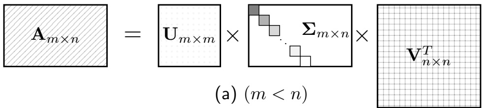

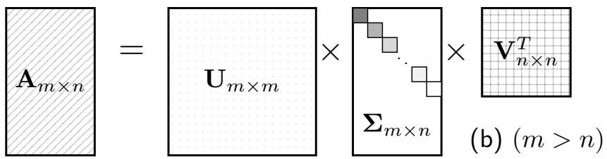

Hình 20.1. SVD cho ma trận A khi: (a) $m < n .$ và (b) m > n. Σ là một ma trận đường chéo với các phần tử trên đó giảm dần và không âm. Màu xám càng đậm thể hiện giá trị càng cao. Các ô màu trắng trên ma trận Σ thể hiện giá trị bằng không.

Quan sát thấy rằng $\Sigma \Sigma ^ { T }$ là một ma trận đường chéo với các phần tử trên đường chéo là $\sigma _ { 1 } ^ { 2 } , \sigma _ { 2 } ^ { 2 } , \ldots$ . Vậy (20.7) chính là một phân tích riêng của $\mathbf { A } \mathbf { A } ^ { T } \mathrm { v \hat { a } } \; \sigma _ { 1 } ^ { 2 } , \sigma _ { 2 } ^ { 2 } , \ldots$ là các trị riêng của ma trận này. Ma trận $\mathbf { A } \mathbf { A } ^ { T }$ luôn là nửa xác định dương nên các trị riêng của nó là không âm. Căn bậc hai các trị riêng của $\mathbf { A } \mathbf { A } ^ { T } , \; \sigma _ { i } ,$ còn được gọi là giá trị suy biến (singular value) của A. Tên gọi phân tích giá trị suy biến xuất phát từ đây.

Cũng theo đó, mỗi cột của U là một vector riêng của $\mathbf { A } \mathbf { A } ^ { T }$ . Ta gọi mỗi cột này là một vector suy biến trái (left-singular vector) của A. Tương tự, $\mathbf { A } ^ { T } \mathbf { A } =$ $\dot { \mathbf { V } \mathbf { \Sigma } ^ { T } \mathbf { \Sigma } \mathbf { V } ^ { T } }$ và các cột của V được gọi là các vector suy biến phải (right-singular vectors) của A.

Trong Python, để tính SVD của một ma trận, chúng ta sử dụng module linalg của numpy:

```python
from __future__ import print_function
import numpy as np
from numpy import linalg as LA

m, n = 3, 4
A = np.random.rand(m, n)
U, S, V = LA.svd(A) # A = U*S*V (no V transpose here)

# checking if U, V are orthogonal and S is a diagonal matrix with
# nonnegative decreasing elements
print('Frobenius norm of (UU^T - I) =', LA.norm(U.dot(U.T) - np.eye(m)))
print('S = ', S)
print('Frobenius norm of (VV^T - I) =', LA.norm(V.dot(V.T) - np.eye(n)))
```

<!-- page: 269 -->

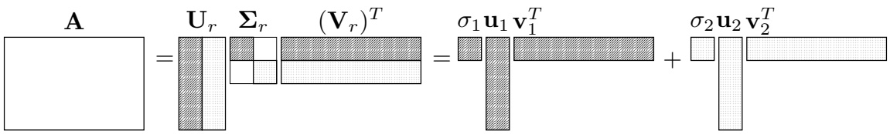

Hình 20.2. Biểu diễn compact SVD dưới dạng tổng các ma trận có rank bằng 1. Các khối ma trận đặt cạnh nhau thể hiện phép nhân ma trận.

Kết quả:

```txt
Frobenius norm of (UU^T - I) = 4.09460889695e-16
S = [ 1.76321041 0.59018069 0.3878011 ]
Frobenius norm of (VV^T - I) = 5.00370755311e-16
```

Lưu $\hat { \mathrm { y } }$ rằng biến S được trả về chỉ bao gồm các phần tử trên đường chéo của Σ. Biến V trả về là $\mathbf { V } ^ { T }$ trong (20.4).

## 20.2.3. Giá trị suy biến của ma trận nửa xác định dương

Giả sử A là một ma trận vuông đối xứng nửa xác định dương, ta sẽ chứng minh rằng giá trị suy biến chính là trị riêng của nó. Thật vậy, gọi λ là một trị riêng của A và x là một vector riêng ứng với trị riêng và $\| \mathbf { x } \| _ { 2 } = 1$ . Vì A là nửa xác định dương, $\lambda \geq 0$ . Ta có

$$
\mathbf {A} \mathbf {x} = \lambda \mathbf {x} \Rightarrow \mathbf {A} ^ {T} \mathbf {A} \mathbf {x} = \lambda \mathbf {A} \mathbf {x} = \lambda^ {2} \mathbf {x}\tag{20.8}
$$

Như vậy, $\lambda ^ { 2 }$ là một trị riêng của $\mathbf { A } ^ { T } \mathbf { A } \Rightarrow \mathrm { g i a }$ trị suy biến của A chính là ${ \sqrt { \lambda ^ { 2 } } } = \lambda$

## 20.2.4. Phân tích giá trị suy biến giản lược

Viết lại biểu thức (20.4) dưới dạng tổng của các ma trận có hạng bằng môt:

$$
\mathbf {A} = \sigma_ {1} \mathbf {u} _ {1} \mathbf {v} _ {1} ^ {T} + \sigma_ {2} \mathbf {u} _ {2} \mathbf {v} _ {2} ^ {T} + \dots + \sigma_ {r} \mathbf {u} _ {r} \mathbf {v} _ {r} ^ {T}\tag{20.9}
$$

với chú $\acute { \mathrm { y } }$ rằng mỗi $\mathbf { u } _ { i } \mathbf { v } _ { i } ^ { T } , 1 \leq i \leq r ,$ là một ma trận có hạng bằng một.

Trong cách biểu diễn này, ma trận A chỉ phụ thuộc vào r cột đầu tiên của U, V và r giá trị khác 0 trên đường chéo của ma trận Σ. Vì vậy ta có một cách phân tích gọn hơn và gọi là SVD giản lược (compact SVD):

$$
\mathbf {A} = \mathbf {U} _ {r} \boldsymbol {\Sigma} _ {r} (\mathbf {V} _ {r}) ^ {T}\tag{20.10}
$$

với U , V lần lượt là ma trận được tạo bởi r cột đầu tiên của U và V. Σ là ma trận con được tạo bởi r hàng đầu tiên và r cột đầu tiên của Σ. Nếu ma trận A có hạng nhỏ hơn rất nhiều so với số hàng và số cột, tức $r \ll m , n ,$ ta sẽ được lợi nhiều về việc lưu trữ. Hình 20.2 là một ví dụ minh hoạ với $m=4,n=6,r=2$

<!-- page: 270 -->

## 20.2.5. Phân tích giá trị suy biến cắt ngọn

Nhắc lại rằng các giá trị trên đường chéo chính của Σ là không âm và giảm dần $\sigma _ { 1 } \geq \sigma _ { 2 } \geq \cdots \geq \sigma _ { r } \geq 0 = 0 = \cdots = 0 .$ Thông thường, chỉ một lượng nhỏ các $\sigma _ { i }$ mang giá trị lớn, các giá trị còn lại nhỏ và gần không. Khi đó ta có thể xấp xỉ ma trận A bằng tổng của $k < r$ ma trận có hạng bằng một:

$$
\mathbf {A} \approx \mathbf {A} _ {k} = \mathbf {U} _ {k} \boldsymbol {\Sigma} _ {k} (\mathbf {V} _ {k}) ^ {T} = \sigma_ {1} \mathbf {u} _ {1} \mathbf {v} _ {1} ^ {T} + \sigma_ {2} \mathbf {u} _ {2} \mathbf {v} _ {2} ^ {T} + \dots + \sigma_ {k} \mathbf {u} _ {k} \mathbf {v} _ {k} ^ {T}\tag{20.11}
$$

Việc bỏ đi $r - k$ giá trị suy biến khác không nhỏ nhất được gọi là SVD cắt ngọn (truncated SVD). Dưới đây là một định lý thú vị. Định lý này nói rằng sai số do cách xấp xỉ SVD cắt ngọn bằng căn bậc hai tổng bình phương của các giá trị suy biến bị cắt đi. $\dot { \mathrm { O } }$ đây sai số được định nghĩa là Frobineous norm của hiệu hai ma trận.

## Định lý 20.1: Sai số do xấp xỉ bởi SVD cắt ngọn

Sai số do xấp xỉ một ma trận A có hạng r bởi SVD cắt ngọn với $k < r$ phần tử là

$$
\| \mathbf {A} - \mathbf {A} _ {k} \| _ {F} ^ {2} = \sum_ {i = k + 1} ^ {r} \sigma_ {i} ^ {2}\tag{20.12}
$$

Chứng minh: Sử dụng tính chất $\| \mathbf { X } \| _ { F } ^ { 2 } = \operatorname { t r a c e } ( \mathbf { X } \mathbf { X } ^ { T } )$ và trace(XY) = trace(YX) với mọi ma trận X, Y ta có:

$$
\begin{array}{l} \| \mathbf {A} - \mathbf {A} _ {k} \| _ {F} ^ {2} = \left\| \sum_ {i = k + 1} ^ {r} \sigma_ {i} \mathbf {u} _ {i} \mathbf {v} _ {i} ^ {T} \right\| _ {F} ^ {2} = \operatorname{trace} \left\{\left(\sum_ {i = k + 1} ^ {r} \sigma_ {i} \mathbf {u} _ {i} \mathbf {v} _ {i} ^ {T}\right) \left(\sum_ {j = k + 1} ^ {r} \sigma_ {j} \mathbf {u} _ {j} \mathbf {v} _ {j} ^ {T}\right) ^ {T} \right\} \\ = \operatorname{trace} \left\{\sum_ {i = k + 1} ^ {r} \sum_ {j = k + 1} ^ {r} \sigma_ {i} \sigma_ {j} \mathbf {u} _ {i} \mathbf {v} _ {i} ^ {T} \mathbf {v} _ {j} \mathbf {u} _ {j} ^ {T} \right\} = \operatorname{trace} \left\{\sum_ {i = k + 1} ^ {r} \sigma_ {i} ^ {2} \mathbf {u} _ {i} \mathbf {u} _ {i} ^ {T} \right\} \\ = \operatorname{trace} \left\{\sum_ {i = k + 1} ^ {r} \sigma_ {i} ^ {2} \mathbf {u} _ {i} ^ {T} \mathbf {u} _ {i} \right\} \\ = \operatorname{trace} \left\{\sum_ {i = k + 1} ^ {r} \sigma_ {i} ^ {2} \right\} = \sum_ {i = k + 1} ^ {r} \sigma_ {i} ^ {2} \end{array} \tag {20.15}
$$

Dấu bằng thứ hai ở (20.13) xảy ra vì V có các cột vuông góc với nhau. Dấu bằng ở (20.14) xảy ra vì hàm trace có tính chất giao hoán. Dấu bằng ở (20.15) xảy ra vì biểu thức trong dấu ngoặc là một số vô hướng.

Thay k = 0 ta sẽ có

$$
\| \mathbf {A} \| _ {F} ^ {2} = \sum_ {i = 1} ^ {r} \sigma_ {i} ^ {2}\tag{20.16}
$$

<!-- page: 271 -->

Từ đó

$$
\frac {\| \mathbf {A} - \mathbf {A} _ {k} \| _ {F} ^ {2}}{\| \mathbf {A} \| _ {F} ^ {2}} = \frac {\sum_ {i = k + 1} ^ {r} \sigma_ {i} ^ {2}}{\sum_ {j = 1} ^ {r} \sigma_ {j} ^ {2}}\tag{20.17}
$$

Như vậy, sai số do xấp xỉ càng nhỏ nếu các giá trị suy biến bị cắt càng nhỏ so với các giá trị suy biến được giữ lại. Đây là một định lý quan trọng giúp xác định việc xấp xỉ ma trận dựa trên lượng thông tin muốn giữ lại. $\dot { \mathrm { O } }$ đây, lượng thông tin được định nghĩa là tổng bình phương của giá trị suy biến. Ví dụ, nếu muốn giữ lại ít nhất 90% lượng thông tin trong A, trước hết ta tính $\textstyle \sum _ { j = 1 } ^ { r } \sigma _ { j } ^ { 2 }$ , sau đó chọn k là số nhỏ nhất sao cho

$$
\frac {\sum_ {i = 1} ^ {k} \sigma_ {i} ^ {2}}{\sum_ {j = 1} ^ {r} \sigma_ {j} ^ {2}} \geq 0. 9\tag{20.18}
$$

Khi k nhỏ, ma trận $\mathbf { A } _ { k }$ có hạng nhỏ bằng k Vì vậy, SVD cắt ngọn cũng được xếp vào loại xấp xỉ hạng thấp.

## 20.2.6. Xấp xỉ hạng k tốt nhất

Người ta chứng minh được rằng<sup>52</sup> $\mathbf { A } _ { k }$ chính là nghiệm của bài toán tối ưu sau đây:

$$
\begin{array}{c} \underset {\mathbf {B}} {\min} \| \mathbf {A} - \mathbf {B} \| _ {F} \\ \text {thoả mãn: rank(B) = k} \end{array}
$$

(20.19)

và $\begin{array} { r } { \| \mathbf { A } - \mathbf { A } _ { k } \| _ { F } ^ { 2 } = \sum _ { i = k + 1 } ^ { r } \sigma _ { i } ^ { 2 } } \end{array}$ như đã chứng minh $\overset { ? } { \mathrm { o } }$ trên .

Nếu sử dụng $\ell _ { 2 }$ norm của ma trận (xem Phụ lục A) thay vì Frobenius norm để đo sai số, $\mathbf { A } _ { k }$ cũng là nghiệm của bài toán tối ưu

$$
\begin{array}{c} \underset {\mathbf {B}} {\min} \| \mathbf {A} - \mathbf {B} \| _ {2} \\ \text {thoả mãn: rank(\mathbf {B}) = k} \end{array}\tag{20.20}
$$

và sai số $\| \mathbf { A } - \mathbf { A } _ { k } \| _ { 2 } ^ { 2 } = \sigma _ { k + 1 } ^ { 2 }$ . Trong đó, $\ell _ { 2 }$ norm của một ma trận được định nghĩa bởi

$$
\| \mathbf {A} \| _ {2} = \max _ {\| \mathbf {x} \| _ {2} = 1} \| \mathbf {A x} \| _ {2}\tag{20.21}
$$

Frobenius norm và $\ell _ { 2 }$ norm là hai norm được sử dụng nhiều nhất trong ma trận. Như vậy, xét trên cả hai norm này, SVD cắt ngọn đều cho xấp xỉ tốt nhất. Vì vậy, SVD cắt ngọn còn được coi là xấp xỉ hạng thấp tốt nhất (best low-rank approximation).

## 20.3. Phân tích giá trị suy biến cho bài toán nén ảnh

Xét ví dụ trong Hình 20.3. Bức ảnh gốc trong Hình 20.3a là một ảnh xám có kích thước $9 6 0 \times 1 4 4 0$ điểm ảnh. Bức ảnh này có thể được coi là một ma trận

<small><span class="docvortex-page-footnote" data-block-type="page_footnote" style="color:#6b7280">52 Singular Value Decomposition – Princeton ([https://goo.gl/hU38GF](https://goo.gl/hU38GF)).</span></small>

<!-- page: 272 -->


(a)

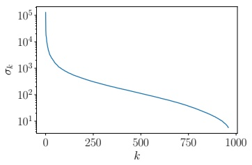

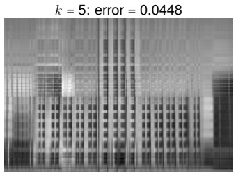

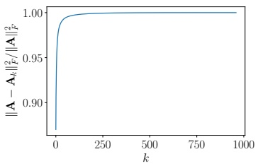

(b)

(d)

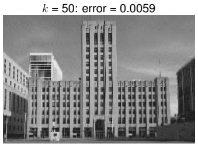

(e)

(c)

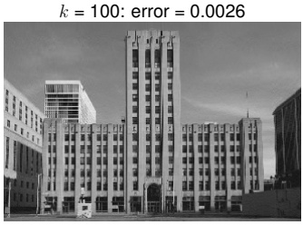

(f)

Hình 20.3. Ví dụ về SVD cho ảnh. (a) Bức ảnh $\hat { \mathtt { g } } \hat { \hat { 0 } } \mathtt { C }$ là một ma trận cỡ $9 6 0 \times 1 4 4 0$ (b) Các giá trị suy biến của ma trận ảnh theo thang đo logarit. Các giá trị suy biến giảm nhanh ở khoảng $k = 2 0 0$ . (c) Biểu diễn lượng thông tin được giữ lại khi chọn các k khác nhau. Có thể thấy từ khoảng $k = 2 0 0$ , lượng thông tin giữ lại gần bằng 1. Vậy ta có thể xấp xỉ ma trận ảnh này bằng một ma trận có hạng nhỏ hơn. (d), (e), (f) Các ảnh xấp xỉ với k lần lượt là 5, 50, 100.

$\mathbf { A } \in \mathbb { R } ^ { 9 6 0 \times 1 4 4 0 }$ . Có thể thấy rằng ma trận này có hạng thấp vì toà nhà có các tầng tương tự nhau, tức ma trận có nhiều hàng tương tự nhau. Hình 20.3b thể hiện các giá trị suy biến sắp xếp theo thứ tự giảm dần của ma trận điểm ảnh. Ở đây, các giá trị suy biến được biểu diễn trong thang logarit thập phân. Giá trị suy biến đầu tiên lớn hơn giá trị suy biến thứ 250 khoảng gần 1000 lần. Hình 20.3c mô tả chất lượng của việc xấp xỉ A bởi $\mathbf { A } _ { k }$ thông qua SVD cắt ngọn. Ta thấy giá trị này xấp xỉ bằng một tại $k = 2 0 0$ . Hình 20.3d, 20.3e, 20.3f là các bức ảnh xấp xỉ khi chọn các giá trị k khác nhau. Khi k gần 100, lượng thông tin mất đi hơn 0.3%, ảnh thu được có chất lượng gần như ảnh $\mathrm { g } \hat { \mathrm { O } } \mathrm { c }$

Để lưu ảnh với SVD cắt ngọn, ta lưu các ma trận $\mathbf { U } _ { k } \in \mathbb { R } ^ { m \times k }$ $\mathbf { \Sigma } _ { k } \in \mathbb { R } ^ { k \times k }$ $\mathbf { V } _ { k } \in$ $\mathbb { R } ^ { n \times k }$ . Tổng số phần tử phải lưu là $k ( m + n + 1 )$ với chú $\acute { \mathrm { y } }$ rằng $\boldsymbol { \Sigma } _ { k }$ là một ma trận đường chéo. Nếu mỗi phần tử được lưu bởi một số thực bốn byte thì số byte cần lưu là $4k(m+n+1)$ . Nếu so giá trị này với ảnh $\mathrm { g } \hat { \mathrm { o } } \mathrm { c }$ có kích thước mn, mỗi giá trị là một số nguyên một byte, tỉ lệ nén là

$$
\frac {4 k (m + n + 1)}{m n}\tag{20.22}
$$

Khi $k   \ll   m , n$ , ta được một tỉ lệ nhỏ hơn 1. Trong ví dụ trên, $m   =   960, n   =$ 1440, $k = 1 0 0$ , tỉ lệ nén là xấp xỉ 0.69, tức đã tiết kiệm được khoảng 30% bộ nhớ.

<!-- page: 273 -->

## 20.4. Thảo luận

• Ngoài những ứng dụng nêu trên, SVD còn được áp dụng trong việc giải phương trình tuyến tính thông qua giả nghịch đảo Moore Penrose ([https://goo.gl/4wrXue](https://goo.gl/4wrXue)), hệ thống gợi ý [SKKR00], giảm chiều dữ liệu [Cyb89], khử mờ ảnh (image deblurring) [HNO06], phân cụm [DFK+04],...

• Khi ma trận A lớn, việc tính toán SVD tốn nhiều thời gian. Cách tính SVD cắt ngọn với k như được trình bày trở nên không khả thi. Có một phương pháp lặp giúp tính các trị riêng và vector riêng của một ma trận lớn một cách hiệu quả. Trong phương pháp này, ta chỉ cần tìm k trị riêng lớn nhất của AATvà các vector riêng tương ứng. Việc này giúp khối lượng tính toán giảm đi đáng kể. Bạn đọc có thể tìm đọc thêm Power method for approximating eigenvalues ([https://goo.gl/PfDqsn](https://goo.gl/PfDqsn)).

• Mã nguồn trong chương này có thể được tìm thấy tại [https://goo.gl/Z3wbsU](https://goo.gl/Z3wbsU).

## Đọc thêm

a. Singular Value Decomposition - Stanford University ([https://goo.gl/Gp726X](https://goo.gl/Gp726X)).

b. Singular Value Decomposition - Princeton ([https://goo.gl/HKpcsB](https://goo.gl/HKpcsB)).

c. CS168: The Modern Algorithmic Toolbox Lecture #9: The Singular Value Decomposition (SVD) and Low-Rank Matrix Approximations - Stanford ([https://goo.gl/RV57KU](https://goo.gl/RV57KU)).

d. The Moore-Penrose Pseudoinverse (Math 33A - UCLA) ([https://goo.gl/VxMYx1](https://goo.gl/VxMYx1)).

<!-- page: 274 -->

## Phân tích thành phần chính

## 21.1. Phân tích thành phần chính

## 21.1.1. Ý tưởng

Giả sử vector dữ liệu ban đầu $\mathbf { x } \in \mathbb { R } ^ { D }$ được giảm chiều trở thành $\mathbf { z }   \in   \mathbb { R } ^ { K }$ với $K < D$ . Một cách đơn giản để giảm chiều dữ liệu từ D về $K < D$ là chỉ giữ lại K phần tử quan trọng nhất. Có hai câu hỏi lập tức được đặt ra. Thứ nhất, làm thế nào để xác định tầm quan trọng của mỗi phần tử? Thứ hai, nếu tầm quan trọng của các phần tử là như nhau, ta cần bỏ đi những phần tử nào?

Để trả lời câu hỏi thứ nhất, hãy quan sát Hình 21.1a. Giả sử các điểm dữ liệu có thành phần thứ hai (phương đứng) giống hệt nhau hoặc sai khác nhau không đáng kể (phương sai nhỏ). Khi đó, thành phần này hoàn toàn có thể được lược bỏ, và ta ngầm hiểu rằng nó sẽ được xấp xỉ bằng kỳ vọng của thành phần đó trên toàn bộ dữ liệu. Ngược lại, nếu áp dụng phương pháp này lên chiều thứ nhất (phương ngang), lượng thông tin bị mất đi đáng kể do sai số xấp xỉ quá lớn. Vì vậy, lượng thông tin theo mỗi thành phần có thể được đo bằng phương sai của dữ liệu trên thành phần đó. Tổng lượng thông tin là tổng phương sai trên toàn bộ các thành phần. Lấy một ví dụ về việc có hai camera được đặt dùng để chụp cùng một người, một camera phía trước và một camera đặt trên đầu. Rõ ràng, hình ảnh thu được từ camera đặt phía trước mang nhiều thông tin hơn so với hình ảnh nhìn từ phía trên đầu. Vì vậy, bức ảnh chụp từ phía trên đầu có thể được bỏ qua mà không làm mất đi quá nhiều thông tin về hình dáng của người đó.

Câu hỏi thứ hai tương ứng với trường hợp Hình 21.1b. Trong cả hai chiều, phương sai của dữ liệu đều lớn; việc bỏ đi một trong hai chiều đều khiến một lượng thông tin đáng kể bị mất đi. Tuy nhiên, nếu xoay trục toạ độ đi một góc phù hợp, một

<!-- page: 275 -->

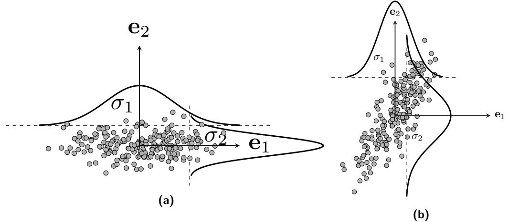

Hình 21.1. Ví dụ $v \hat { e }$ phương sai của dữ liệu trong không gian hai chiều. (a) Phương sai của chiều thử hai (tỉ lệ với độ rộng của đường hình chuông) nhỏ hơn phương sai của chiều thứ nhất. (b) Cả hai chiều có phương sai đáng kể. Phương sai của mỗi chiều là phương sai của thành phần tương ứng được lấy trên toàn bộ dữ liệu. Phương sai tỉ lệ thuận với độ phân tán của dữ liệu.

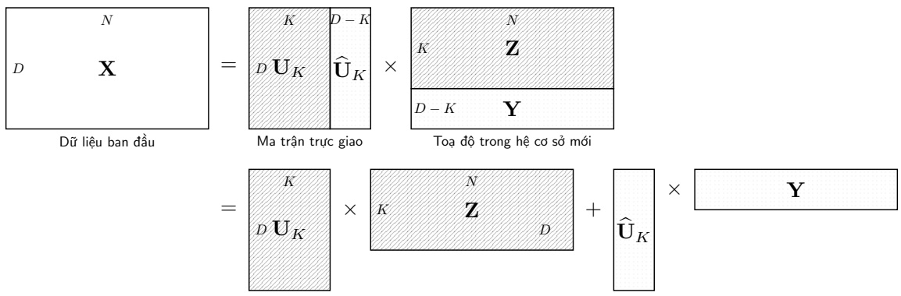

Hình 21.2. Ý tưởng chính của PCA: Tìm một hệ trực chuẩn mới sao cho trong hệ này, các thành phần quan trọng nhất nằm trong K thành phần đầu tiên.

trong hai chiều dữ liệu có thể được lược bở vì dữ liệu có xu hướng phân bố xung quanh một đường thẳng.

Phân tích thành phần chính (principle component analysis, PCA) là phương pháp đi tìm một phép xoay trục toạ độ để được một hệ trục toạ độ mới sao cho trong hệ mới này, thông tin của dữ liệu chủ yếu tập trung ở một vài thành phần. Phần còn lại chứa ít thông tin hơn có thể được lược bỏ.

Phép xoay trục toạ độ có liên hệ chặt chẽ tới hệ trực chuẩn và ma trận trực giao (xem Mục 1.9 và 1.10). Giả sử hệ cơ sở trực chuẩn mới là U (mỗi cột của U là một vector đơn vị cho một chiều) và ta muốn giữ lại K toạ độ trong hệ cơ sở mới này. Không mất tính tổng quát, giả sử đó là K thành phần đầu tiên. Quan sát Hình 21.2 với cơ sở mới $\mathbf { U } = [ \mathbf { U } _ { K } , \widehat { \mathbf { U } } _ { K } ]$ là một hệ trực chuẩn với $\mathbf { U } _ { K }$ là ma trận

<!-- page: 276 -->

con tạo bởi K cột đầu tiên của U. Trong hệ cơ sở mới này, ma trận dữ liệu có thể được viết thành

$$
\mathbf {X} = \mathbf {U} _ {K} \mathbf {Z} + \widehat {\mathbf {U}} _ {K} \mathbf {Y}\tag{21.1}
$$

Từ đây ta cũng suy ra

$$
\left[ \begin{array}{c} \mathbf {Z} \\ \mathbf {Y} \end{array} \right] = \left[ \begin{array}{c} \mathbf {U} _ {K} ^ {T} \\ \widehat {\mathbf {U}} _ {K} ^ {T} \end{array} \right] \mathbf {X} \Rightarrow \begin{array}{l} \mathbf {Z} = \mathbf {U} _ {K} ^ {T} \mathbf {X} \\ \mathbf {Y} = \widehat {\mathbf {U}} _ {K} ^ {T} \mathbf {X} \end{array}\tag{21.2}
$$

Mục đích của PCA là đi tìm ma trận trực giao U sao cho phần lớn thông tin nằm ở $\mathbf { U } _ { K } \mathbf { Z }$ , phần nhỏ thông tin nằm $\mathrm { ~  ~ \ddot { s } ~ } \widehat { \bf U } _ { K } { \bf Y }$ . Phần nhỏ này sẽ được lược bỏ và bxấp xỉ bằng một ma trận có các cột như nhau. Gọi mỗi cột đó là b, khi đó, ta sẽ xấp xỉ $\mathbf { Y } \approx \mathbf { b } \mathbf { 1 } ^ { T }$ với $\mathbf { 1 } ^ { T } \in \mathbb { R } ^ { 1 \times N }$ là một vector hàng có toàn bộ các phần tử bằng một. Giả sử đã tìm được U, ta cần tìm b thoả mãn:

$$
\mathbf {b} = \mathrm{argmin} _ {\mathbf {b}} \| \mathbf {Y} - \mathbf {b 1} ^ {T} \| _ {F} ^ {2} = \mathrm{argmin} _ {\mathbf {b}} \| \widehat {\mathbf {U}} _ {K} ^ {T} \mathbf {X} - \mathbf {b 1} ^ {T} \| _ {F} ^ {2}\tag{21.3}
$$

Giải phương trình đạo hàm theo b của hàm mục tiêu bằng 0:

$$
(\mathbf {b} \mathbf {1} ^ {T} - \widehat {\mathbf {U}} _ {K} ^ {T} \mathbf {X}) \mathbf {1} = 0 \Rightarrow N \mathbf {b} = \widehat {\mathbf {U}} _ {K} ^ {T} \mathbf {X} \mathbf {1} \Rightarrow \mathbf {b} = \widehat {\mathbf {U}} _ {K} ^ {T} \bar {\mathbf {x}}.\tag{21.4}
$$

$\dot { \mathrm { O } }$ đây ta đã sử dụng $\mathbf { 1 } ^ { T } \mathbf { 1 } = N$ và $\begin{array} { r } { \mathbf { \bar { x } } = \frac { 1 } { N } \mathbf { X } \mathbf { 1 } } \end{array}$ là vector trung bình các cột của X. Với giá trị b tìm được này, dữ liệu ban đầu sẽ được xấp xỉ bởi

$$
\mathbf {X} = \mathbf {U} _ {K} \mathbf {Z} + \widehat {\mathbf {U}} _ {k} \mathbf {Y} \approx \mathbf {U} _ {K} \mathbf {Z} + \widehat {\mathbf {U}} _ {k} \mathbf {b 1} ^ {T} = \mathbf {U} _ {K} \mathbf {Z} + \widehat {\mathbf {U}} _ {K} \widehat {\mathbf {U}} _ {K} ^ {T} \bar {\mathbf {x}} \mathbf {1} ^ {T} \triangleq \tilde {\mathbf {X}}\tag{21.5}
$$

## 21.1.2. Hàm mất mát

Hàm mất mát của PCA được coi như sai số của phép xấp xỉ, được định nghĩa là

$$
\begin{array}{r l} \frac {1}{N} \| \mathbf {X} - \tilde {\mathbf {X}} \| _ {F} ^ {2} & = \frac {1}{N} \| \widehat {\mathbf {U}} _ {K} \mathbf {Y} - \widehat {\mathbf {U}} _ {K} \widehat {\mathbf {U}} _ {K} ^ {T} \bar {\mathbf {x}} \mathbf {1} ^ {T} \| _ {F} ^ {2} = \frac {1}{N} \| \widehat {\mathbf {U}} _ {K} \widehat {\mathbf {U}} _ {K} ^ {T} \mathbf {X} - \widehat {\mathbf {U}} _ {K} \widehat {\mathbf {U}} _ {K} ^ {T} \bar {\mathbf {x}} \mathbf {1} ^ {T} \| _ {F} ^ {2} \\ & = \frac {1}{N} \| \widehat {\mathbf {U}} _ {k} \widehat {\mathbf {U}} _ {k} ^ {T} (\mathbf {X} - \bar {\mathbf {x}} \mathbf {1} ^ {T}) \| _ {F} ^ {2} \triangleq J (\mathbf {U}) \end{array} \tag {21}\tag{21.6}
$$

Chú $\hat { \mathrm { y } }$ rằng, nếu các cột của một ma trận V tạo thành một hệ trực chuẩn thì với một ma trận W bất kỳ, ta luôn có

$$
\| \mathbf {V} \mathbf {W} \| _ {F} ^ {2} = \mathrm{trace} (\mathbf {W} ^ {T} \mathbf {V} ^ {T} \mathbf {V} \mathbf {W}) = \mathrm{trace} (\mathbf {W} ^ {T} \mathbf {W}) = \| \mathbf {W} \| _ {F} ^ {2}\tag{21.7}
$$

Đặt $\widehat { \mathbf { X } } = \mathbf { X } - \mathbf { \bar { x } } \mathbf { 1 } ^ { T }$ . Ma trận này có được bằng cách trừ mỗi cột của X đi trung bbình các cột của nó. Ta gọi $\widehat { \mathbf { X } }$ là ma trận dữ liệu đã được chuẩn hoá. Có thể thấy $\hat { \mathbf { x } } _ { n } = \mathbf { x } _ { n } - \bar { \mathbf { x } } , \forall n = 1 , 2 , \ldots , N$

Vì vậy hàm mất mát trong (21.6) có thể được viết lại thành:

<!-- page: 277 -->

$$
J (\mathbf {U}) = \frac {1}{N} \| \widehat {\mathbf {U}} _ {K} ^ {T} \widehat {\mathbf {X}} \| _ {F} ^ {2} = \frac {1}{N} \| \widehat {\mathbf {X}} ^ {T} \widehat {\mathbf {U}} _ {K} \| _ {F} ^ {2} = \frac {1}{N} \sum_ {i = K + 1} ^ {D} \| \widehat {\mathbf {X}} ^ {T} \mathbf {u} _ {i} \| _ {2} ^ {2}\tag{21.8}
$$

$$
= \frac {1}{N} \sum_ {i = K + 1} ^ {D} \mathbf {u} _ {i} ^ {T} \widehat {\mathbf {X}} \widehat {\mathbf {X}} ^ {T} \mathbf {u} _ {i} = \sum_ {i = K + 1} ^ {D} \mathbf {u} _ {i} ^ {T} \mathbf {S} \mathbf {u} _ {i}\tag{21.9}
$$

với $\begin{array} { r } { \mathbf { S } = \frac { 1 } { N } \widehat { \mathbf { X } } \widehat { \mathbf { X } } ^ { T } } \end{array}$ là ma trận hiệp phương sai của dữ liệu và luôn là một ma trận b bnửa xác định dương (xem Mục 3.1.7).

Công việc còn lại là tìm các $\mathbf { u } _ { i }$ để mất mát là nhỏ nhất.

Với ma trận U trực giao bất kỳ, thay $K = 0$ vào (21.9) ta có

$$
\begin{array}{l} L = \sum_ {i = 1} ^ {D} \mathbf {u} _ {i} ^ {T} \mathbf {S} \mathbf {u} _ {i} = \frac {1}{N} \| \widehat {\mathbf {X}} ^ {T} \mathbf {U} \| _ {F} ^ {2} = \frac {1}{N} \mathrm{trace} (\widehat {\mathbf {X}} ^ {T} \mathbf {U} \mathbf {U} ^ {T} \widehat {\mathbf {X}}) \\ = \frac {1}{N} \mathrm{trace} (\widehat {\mathbf {X}} ^ {T} \widehat {\mathbf {X}}) = \frac {1}{N} \mathrm{trace} (\widehat {\mathbf {X}} \widehat {\mathbf {X}} ^ {T}) = \mathrm{trace} (\mathbf {S}) = \sum_ {i = 1} ^ {D} \lambda_ {i} \end{array}\tag{21.10}
$$

(21.11)

Với $\lambda _ { 1 } \geq \lambda _ { 2 } \geq \dots \geq \lambda _ { D } \geq 0$ là các trị riêng của ma trận nửa xác định dương S. Chú ý rằng các trị riêng này là thực và không âm53.

Như vậy L không phụ thuộc vào cách chọn ma trận trực giao U và bằng tổng các phần tử trên đường chéo của S. Nói cách khác, L chính là tổng các phương sai theo từng thành phần của dữ liệu ban đầu<sup>54</sup>.

Vì vậy, việc tối thiểu hàm mất mát J được cho bởi (21.9) tương đương với việc tối đa biểu thức

$$
F = L - J = \sum_ {i = 1} ^ {K} \mathbf {u} _ {i} \mathbf {S} \mathbf {u} _ {i} ^ {T}\tag{21.12}
$$

## 21.1.3. Tối ưu hàm mất mát

Nghiệm của bài toán tối ưu hàm mất mát PCA được tìm dựa trên khẳng định sau đây:

<small><span class="docvortex-page-footnote" data-block-type="page_footnote" style="color:#6b7280">53 Tổng các trị riêng của một ma trận vuông bất kỳ luôn bằng vết của ma trận đó.</span></small>

<small><span class="docvortex-page-footnote" data-block-type="page_footnote" style="color:#6b7280">54 Mỗi thành phần trên đường chéo chính của ma trận hiệp phương sai chính là phương sai của thành phần dữ liệu tương ứng.</span></small>

<!-- page: 278 -->

Chương 21. Phân tích thành phần chính

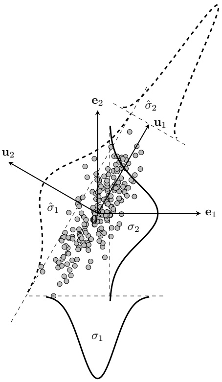

**Hình 21.3.** PCA có thể được coi là phương pháp đi tìm một hệ cơ sở trực chuẩn đóng vai trò một phép xoay, sao cho trong hệ cơ sở mới này, phương sai theo một số chiều nào đó là không đáng $k \hat { \hat { e } }$ và có thể lược bỏ. Trong hệ cơ sở ban đầu $\mathbf { O e } _ { 1 } \mathbf { e } _ { 2 }$ , phương sai theo mỗi chiều (độ rộng của các đường hình chuông nét liền) đều lớn. Trong không gian mới với hệ cơ sở $\mathbf { O u } _ { 1 } \mathbf { u } _ { 2 }$ , phương sai theo hai chiều (độ rộng của các đường hình chuông nét đứt) chênh lệch nhau đáng kể. Chiều dữ liệu có phương sai nhỏ có thể được lược bỏ vì dữ liệu theo chiều này ít phân tán.

Nếu S là một ma trận nửa xác định dương, bài toán tối ưu

$$
\max _ {\mathbf {U} _ {K}} \sum_ {i = 1} ^ {K} \mathbf {u} _ {i} ^ {T} \mathbf {S} \mathbf {u} _ {i}\tag{21.13}
$$

$$
t h o \acute {a} m \tilde {n}: \mathbf {U} _ {K} ^ {T} \mathbf {U} _ {K} = \mathbf {I}\tag{21.14}
$$

có nghiệm $\mathbf { u } _ { 1 } , \ldots , \mathbf { u } _ { K }$ là các vector riêng ứng với K trị riêng $( k \hat { e } ^ { \prime }$ cả $l \breve { a } p )$ lớn nhất của S. Khi đó, giá trị lớn nhất của hàm mục tiêu là $\textstyle \sum _ { i = 1 } ^ { K } \lambda _ { i }$ , với $\lambda _ { 1 } \geq \lambda _ { 2 } \geq \dots \geq \lambda _ { D }$ là các trị riêng của S.

Khẳng định này có thể được chứng minh bằng quy nạp<sup>55</sup>.

Trị riêng lớn nhất $\lambda _ { 1 }$ của ma trận hiệp phương sai S còn được gọi là thành phần chính thứ nhất (the first principal component), trị riêng thứ hai $\lambda _ { 2 }$ được gọi là thành phần chính thứ hai,... Tên gọi phân tích thành phần chính (principal component analysis) bắt nguồn từ đây. Ta chỉ giữ lại K thành phần chính đầu tiên khi giảm chiều dữ liệu dùng PCA.

Hình 21.3 minh hoạ các thành phần chính với dữ liệu hai chiều. Trong không gian ban đầu với các vector cơ sở $\mathbf { e } _ { 1 } , \mathbf { e } _ { 2 }$ , phương sai theo mỗi chiều dữ liệu (tỉ lệ

<small><span class="docvortex-page-footnote" data-block-type="page_footnote" style="color:#6b7280">55 Xin được bỏ qua phần chứng minh. Bạn đọc có thể xem Excercise 12.1 trong tài liệu tham khảo [Bis06] với lời giải tại [https://goo.gl/sM32pB](https://goo.gl/sM32pB).</span></small>

<!-- page: 279 -->

với độ rộng của các hình chuông nét liền) đều lớn. Trong hệ cơ sở mới $\mathbf { O u } _ { 1 } \mathbf { u } _ { 2 }$ phương sai theo chiều thứ hai $\hat { \sigma } _ { 2 } ^ { 2 }$ nhỏ so với $\hat { \sigma } _ { 1 } ^ { 2 }$ . Điều này chỉ ra rằng khi chiếu dữ liệu lên $\mathbf { u } _ { 2 }$ , ta được các điểm rất gần nhau và gần với giá trị trung bình theo chiều đó. Trong trường hợp này, vì giá trị trung bình theo mọi chiều bằng 0, ta có thể thay thế toạ độ theo chiều $\mathbf { u } _ { 2 }$ bằng 0. Rõ ràng là nếu dữ liệu có phương sai càng nhỏ theo một chiều nào đó thì khi xấp xỉ chiều đó bằng một hằng số, sai số xấp xỉ càng nhỏ. PCA thực chất là đi tìm một phép xoay tương ứng với một ma trận trực giao sao cho trong hệ toạ độ mới, tồn tại các chiều có phương sai nhỏ có thể được bỏ qua; ta chỉ cần giữ lại các chiều/thành phần khác quan trọng hơn. Như đã khẳng định ở trên, tổng phương sai theo toàn bộ các chiều chiều trong một hệ cơ sở bất kỳ là như nhau và bằng tổng các trị riêng của ma trận hiệp phương sai. Vì vậy, PCA còn được coi là phương pháp giảm số chiều dữ liệu sao tổng phương sai còn lại là lớn nhất.

## 21.2. Các bước thực hiện phân tích thành phần chính

Từ các suy luận trên, ta có thể tóm tắt lại các bước trong PCA như sau:

1) Tính vector trung bình của toàn bộ dữ liệu: $\begin{array} { r } { \bar { \mathbf { x } } = \frac { 1 } { N } \sum _ { n = 1 } ^ { N } \mathbf { x } _ { n } } \end{array}$

2) Trừ mỗi điểm dữ liệu đi vector trung bình của toàn bộ dữ liệu để được dữ liệu chuẩn hoá:

$$
\hat {\mathbf {x}} _ {n} = \mathbf {x} _ {n} - \bar {\mathbf {x}}\tag{21.15}
$$

3) Đặt $\widehat { \mathbf { X } }   =   \left[ \widehat { \mathbf { x } } _ { 1 } , \widehat { \mathbf { x } } _ { 2 } , \ldots , \widehat { \mathbf { x } } _ { D } \right]$ là ma trận dữ liệu chuẩn hoá, tính ma trận hiệp bphương sai:

$$
\mathbf {S} = \frac {1}{N} \widehat {\mathbf {X}} \widehat {\mathbf {X}} ^ {T}\tag{21.16}
$$

4) Tính các trị riêng và vector riêng tương ứng có $\ell _ { 2 }$ norm bằng 1 của ma trận này, sắp xếp chúng theo thứ tự giảm dần của trị riêng.

5) Chọn K vector riêng ứng với K trị riêng lớn nhất để xây dựng ma trận $\mathbf { U } _ { K }$ có các cột tạo thành một hệ trực giao. K vector này được gọi là các thành phần chính, tạo thành một không gian con gần với phân bố của dữ liệu ban đầu đã chuẩn hoá.

6) Chiếu dữ liệu ban đầu đã chuẩn hoá $\widehat { \mathbf { X } }$ xuống không gian con tìm được.

7) Dữ liệu mới là toạ độ của các điểm dữ liệu trên không gian mới: $\mathbf { Z } = \mathbf { U } _ { K } ^ { T } \widehat { \mathbf { X } } .$

Như vậy, PCA là kết hợp của phép tịnh tiến, xoay trục toạ $d \hat { \varrho }$ và chiếu dữ liệu lên $h \hat { e }$ toạ độ mới.

Dữ liệu ban đầu có thể tính được xấp xỉ theo dữ liệu mới bởi $\mathbf { x } \approx \mathbf { U } _ { K } \mathbf { Z } + \bar { \mathbf { x } } .$

<!-- page: 280 -->

Quy trình thực hiện PCA

<table><tr><td>1. Tîm vector trung bình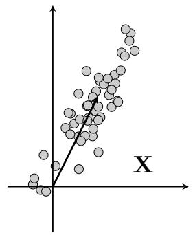</td><td>2. Trừ đi vector trung bình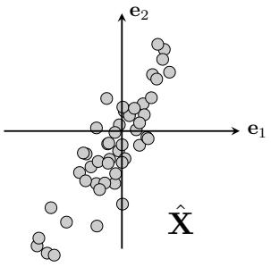</td><td>3. Tính ma trận hiệp phương sai: $\mathbf{S} = \frac{1}{N} \hat{\mathbf{X}} \hat{\mathbf{X}}^{T}$ 4. Tîm trị riêng và vector riêng của  $\mathbf{S}$ : $(\lambda_{1}, \mathbf{u}_{1}), \ldots, (\lambda_{D}, \mathbf{u}_{D})$ . Các vector riêng được chọn phải tạo thành một hệ trực chuẩn.</td></tr><tr><td>7. Dữ liệu giảm chiều (các điểm màu trắng)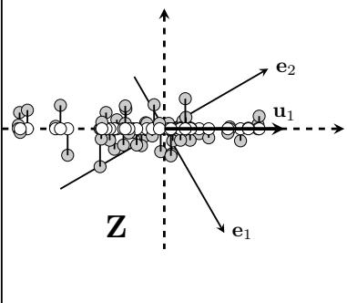</td><td>6. Chiểu dữ liệu ban đầu xuống các vector riêng đó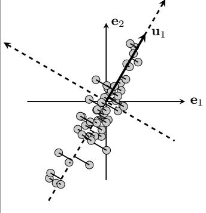</td><td>5. Chọn  $K$  vector riêng ứng với các trị riêng lớn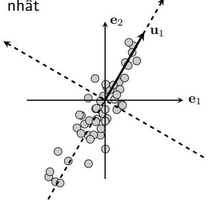</td></tr></table>

Hình 21.4. Các bước thực hiện PCA.

Một điểm dữ liệu mới $\mathbf { v }   \in   \mathbb { R } ^ { D }$ sẽ được giảm chiều bằng PCA theo công thức $\mathbf { w } = \mathbf { U } _ { K } ^ { T } ( \mathbf { v } - \bar { \mathbf { x } } ) \in \mathbb { R } ^ { K }$ Ngược lại, nếu biết w, ta có thể xấp xỉ v bởi $\mathbf { U } _ { K } \mathbf { w } + \bar { \mathbf { x } }$ Các bước thực hiện PCA được minh hoạ trong Hình 21.4.

## 21.3. Liên hệ với phân tích giá trị suy biến

PCA và SVD có mối quan hệ đặc biệt với nhau. Xin phép nhắc lại hai điểm đã trình bày dưới đây:

## 21.3.1. SVD cho bài toán xấp xỉ hạng thấp tốt nhất

Nghiệm của bài toán xấp xỉ một ma trận bởi một ma trận có hạng không vượt quá k (xem Chương 20:

$$
\begin{array}{c} \underset {\mathbf {A}} {\min} \| \mathbf {X} - \mathbf {A} \| _ {F} \\ \text {thoả mãn: rank(\mathbf {A}) = K} \end{array}\tag{21.17}
$$

chính là SVD cắt ngọn của A.

<!-- page: 281 -->

Cụ thể, nếu SVD của $\mathbf { X } \in \mathbb { R } ^ { D \times N }$ là

$$
\mathbf {X} = \mathbf {U} \boldsymbol {\Sigma} \mathbf {V} ^ {T}\tag{21.18}
$$

với $\mathbf { U } \in \mathbb { R } ^ { D \times D }$ và $\mathbf { V } \in \mathbb { R } ^ { N \times N }$ là các ma trận trực giao và $\mathbf { \Sigma } \in \mathbb { R } ^ { D \times N }$ là ma trận đường chéo (không nhất thiết vuông) với các phần tử trên đường chéo không âm giảm dần. Nghiệm của bài toán (21.17) chính là:

$$
\mathbf {A} = \mathbf {U} _ {K} \boldsymbol {\Sigma} _ {K} \mathbf {V} _ {K} ^ {T}\tag{21.19}
$$

với $\mathbf { U } \in \mathbb { R } ^ { D \times K }$ và $\mathbf { V } \in \mathbb { R } ^ { N \times K }$ là các ma trận tạo bởi K cột đầu tiên của U và V, $\mathbf { \Sigma } _ { K } \in \mathbb { R } ^ { K \times K }$ là ma trận đường chéo con ứng với K hàng đầu tiên và K cột đầu tiên của Σ.

## 21.3.2. Ý tưởng của PCA

Như đã chứng minh ở (21.5), PCA là bài toán đi tìm ma trận trực giao U và ma trận mô tả dữ liệu ở không gian thấp chiều Z sao cho việc xấp xỉ sau đây là tốt nhất:

$$
\mathbf {X} \approx \tilde {\mathbf {X}} = \mathbf {U} _ {K} \mathbf {Z} + \widehat {\mathbf {U}} _ {K} \widehat {\mathbf {U}} _ {K} ^ {T} \bar {\mathbf {x}} \mathbf {1} ^ {T}\tag{21.20}
$$

với $\mathbf { U } _ { K } , \hat { \mathbf { U } } _ { K }$ lần lượt là các ma trận được tạo bởi K cột đầu tiên và $D - K$ cột bcuối cùng của ma trận trực giao U, và x¯ là vector trung bình của dữ liệu.

Giả sử rằng vector trung bình $\bar { \bf x } = { \bf 0 }$ . Khi đó, (21.20) tương đương với

$$
\mathbf {X} \approx \tilde {\mathbf {X}} = \mathbf {U} _ {K} \mathbf {Z}\tag{21.21}
$$

Bài toán tối ưu của PCA sẽ trở thành:

$$
\begin{array}{c} \mathbf {U} _ {K}, \mathbf {Z} = \arg \min _ {\mathbf {U} _ {K}, \mathbf {Z}} \| \mathbf {X} - \mathbf {U} _ {K} \mathbf {Z} \| _ {F} \\ \text {thoả   mãn:} \quad \mathbf {U} _ {K} ^ {T} \mathbf {U} _ {K} = \mathbf {I} _ {K} \end{array}\tag{21.22}
$$

với $\mathbf { I } _ { K } \in \mathbb { R } ^ { K \times K }$ là ma trận đơn vị trong không gian K chiều và điều kiện ràng buộc để đảm bảo các cột của $\mathbf { U } _ { K }$ tạo thành một hệ trực chuẩn.

## 21.3.3. Quan hệ giữa hai phương pháp

Bạn có nhận ra điểm tương đồng giữa hai bài toán tối ưu (21.17) và (21.22) với nghiệm của bài toán đầu tiên được cho trong (21.19)? Có thể nhận ra nghiệm của bài toán (21.22) chính là

$$
\begin{array}{r l} \mathbf {U} _ {K} & \text {trong} \quad (2 1. 2 2) = \mathbf {U} _ {K} \quad \text {trong} \quad (2 1. 1 9) \\ \mathbf {Z} & \text {trong} \quad (2 1. 2 2) = \boldsymbol {\Sigma} _ {K} \mathbf {V} _ {K} ^ {T} \quad \text {trong} \quad (2 1. 1 9) \end{array}
$$

Như vậy, nếu các điểm dữ liệu được biểu diễn bởi các cột của một ma trận, và trung bình các cột của ma trận đó là vector không thì nghiệm của bài toán PCA được rút ra trực tiếp từ SVD cắt ngọn của ma trận đó. Nói cách khác, việc đi tìm nghiệm cho PCA chính là việc giải một bài toán phân tích ma trận thông qua SVD.

<!-- page: 282 -->

## 21.4. Làm thế nào để chọn số chiều của dữ liệu mới

Một câu hỏi được đặt ra là, làm thế nào để chọn giá trị K – chiều của dữ liệu mới – với từng dữ liệu cụ thể?

Thông thường, K được chọn dựa trên việc lượng thông tin muốn giữ lại. $\dot { \mathrm { O } }$ đây, toàn bộ thông tin chính là tổng phương sai của toàn bộ các chiều dữ liệu. Lượng dữ liệu muốn dữ lại là tổng phương sai của dữ liệu trong hệ trục toạ độ mới.

Nhắc lại rằng trong mọi hệ trục toạ độ, tổng phương sai của dữ liệu là như nhau và bằng tổng các trị riêng của ma trận hiệp phương sai $\textstyle \sum _ { i = 1 } ^ { D } \lambda _ { i }$ . Thêm nữa, PCA giúp giữ lại lượng thông tin (tổng các phương sai) là $\textstyle \sum _ { i = 1 } ^ { K } \lambda _ { i }$ . Vậy ta có thể coi biểu thức:

$$
r _ {K} = \frac {\sum_ {i = 1} ^ {K} \lambda_ {i}}{\sum_ {j = 1} ^ {D} \lambda_ {j}}\tag{21.23}
$$

là tỉ lệ thông tin được giữ lại khi số chiều dữ liệu mới sau PCA là K. Như vậy, giả sử ta muốn giữ lại 99% dữ liệu, ta chỉ cần chọn K là số tự nhiên nhỏ nhất sao cho $r _ { K } \geq 0 . 9 9$

Khi dữ liệu phân bố quanh một không gian con, các giá trị phương sai lớn nhất ứng với các $\lambda _ { i }$ đầu tiên cao $\mathrm { g } \hat { \mathrm { a } } \mathrm { p }$ nhiều lần các phương sai còn lại. Khi đó, ta có thể chọn được K khá nhỏ để đạt được $r _ { K } \geq 0 . 9 9$

## 21.5. Lưu $\acute { \mathbf { y } }$ về tính toán phân tích thành phần chính

Có hai trường hợp trong thực tế mà chúng ta cần lưu ý về PCA. Trường hợp thứ nhất là lượng dữ liệu có được nhỏ hơn rất nhiều so với số chiều dữ liệu. Trường hợp thứ hai là khi lượng dữ liệu trong tập huấn luyện rất lớn, việc tính toán ma trận hiệp phương sai và trị riêng đôi khi trở nên bất khả thi. Có những hướng giải quyết hiệu quả cho các trường hợp này.

Trong mục này, ta sẽ coi như dữ liệu đã được chuẩn hoá, tức đã được trừ đi vector kỳ vọng. Khi đó, ma trận hiệp phương sai sẽ là $\begin{array} { r } { \mathbf { S } = \frac { 1 } { N } \mathbf { X } \mathbf { X } ^ { T } } \end{array}$

## 21.5.1. Số chiều dữ liệu nhiều hơn số điểm dữ liệu

Đó là trường hợp $D > N$ , tức ma trận dữ liệu X là một ma trận cao. Khi đó, số trị riêng khác không của ma trận hiệp phương sai S sẽ không vượt quá hạng của nó, tức không vượt quá N. Vậy ta cần chọn $K \leq N$ vì không thể chọn ra được nhiều hơn N trị riêng khác không của một ma trận có hạng bằng N.

Việc tính toán các trị riêng và vector riêng cũng có thể được thực hiện một cách hiệu quả dựa trên các tính chất sau đây:

<!-- page: 283 -->

a. Trị riêng của A cũng là trị riêng của kA với $k \neq 0$ bất kỳ. Điều này có thể được suy ra trực tiếp từ định nghĩa của trị riêng và vector riêng.

b. Trị riêng của AB cũng là trị riêng của BA với $\mathbf { A } \in \mathbb { R } ^ { d _ { 1 } \times d _ { 2 } } , \mathbf { B } \in \mathbb { R } ^ { d _ { 2 } \times d _ { 1 } }$ là các ma trận bất kỳ và $d _ { 1 } , d _ { 2 }$ là các số tự nhiên khác không bất kỳ.

Như vậy, thay vì tìm trị riêng của ma trận hiệp phương sai $\mathbf { S } \in \mathbb { R } ^ { D \times D }$ , ta đi tìm trị riêng của ma trận $\mathbf { T } \stackrel { \sim } { = } \mathbf { X } ^ { T } \mathbf { X } \in \mathbb { R } ^ { N \times N }$ có số chiều nhỏ hơn $( \mathrm { v i } \; N < D )$

c. Nếu (λ, u) là một cặp trị riêng, vector riêng của T thì (λ, Xu) là một cặp trị riêng, vector riêng của S. Thật vậy:

$$
\mathbf {X} ^ {T} \mathbf {X} \mathbf {u} = \mathbf {T} \mathbf {u} = \lambda \mathbf {u} \Rightarrow (\mathbf {X} \mathbf {X} ^ {T}) (\mathbf {X} \mathbf {u}) = \lambda (\mathbf {X} \mathbf {u})\tag{21.24}
$$

Dấu bằng thứ nhất xảy ra theo định nghĩa của trị riêng và vector riêng.

Như vậy, ta có thể hoàn toàn tính được trị riêng và vector riêng của ma trận hiệp phương sai S dựa trên một ma trận T có kích thước nhỏ hơn. Việc này trong nhiều trường hợp khiến thời gian tính toán giảm đi đáng kể.

## 21.5.2. Với các bài toán quy mô lớn

Trong rất nhiều bài toán quy mô lớn, ma trận hiệp phương sai là một ma trận rất lớn. Ví dụ, có một triệu bức ảnh 1000 × 1000 pixel, như vậy $D = N = 1 0 ^ { 6 }$ là các số rất lớn, việc trực tiếp tính toán trị riêng và vector riêng cho ma trận hiệp phương sai là không khả thi. Lúc này, các trị riêng và vector riêng của ma trận hiệp phương sai thường được tính thông qua power method ([https://goo.gl/eBRPxH](https://goo.gl/eBRPxH))

## 21.6. Một số ứng dụng

Ứng dụng đầu tiên của PCA chính là việc giảm chiều dữ liệu, giúp việc lưu trữ và tính toán được thuận tiện hơn. Thực tế cho thấy, nhiều khi làm việc trên dữ liệu đã được giảm chiều mang lại kết quả tốt hơn so với dữ liệu gốc. Thứ nhất, có thể phần dữ liệu mang thông tin nhỏ bị lược đi chính là phần gây nhiễu, những thông tin quan trọng hơn đã được giữ lại. Thứ hai, số điểm dữ liệu nhiều khi ít hơn số chiều dữ liệu. Khi có quá ít dữ liệu và số chiều dữ liệu quá lớn, quá khớp rất dễ xảy ra. Việc giảm chiều dữ liệu phần nào giúp khắc phục hiện tượng này.

Dưới đây là hai ví dụ về ứng dụng của PCA trong bài toán phân loại khuôn mặt và dò điểm bất thường.

## 21.6.1. Khuôn mặt riêng

Khuôn mặt riêng (eigenface) từng là một trong những kỹ thuật phổ biến trong bài toán nhận dạng khuôn mặt. Ý tưởng của khuôn mặt riêng là đi tìm một không

<!-- page: 284 -->

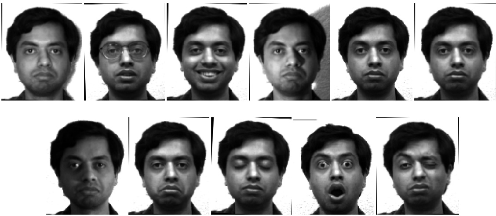

Hình 21.5. Ví dụ về ảnh của một người trong Yale Face Database.

gian có số chiều nhỏ hơn để mô tả mỗi khuôn mặt, từ đó sử dụng vector trong không gian thấp chiều này như vector đặc trưng cho bộ phân loại. Điều đáng nói là một bức ảnh khuôn mặt có kích thước khoảng 200 × 200 sẽ có số chiều là 40k – một số rất lớn, trong khi đó, vector đặc trưng thường chỉ có số chiều bằng vài trăm hoặc vài nghìn. Khuôn mặt riêng thực ra chính là PCA. Các khuôn mặt riêng chính là các vector riêng ứng với những trị riêng lớn nhất của ma trận hiệp phương sai.

Trong phần này, chúng ta làm một thí nghiệm nhỏ trên cơ sở dữ liệu khuôn mặt Yale ([https://goo.gl/LNg8LS](https://goo.gl/LNg8LS)). Các bức ảnh trong thí nghiệm này đã được căn chỉnh cho cùng với kích thước và khuôn mặt nằm trọn vẹn trong một hình chữ nhật có kích thước 116 × 98 điểm ảnh. Có tất cả 15 người khác nhau, mỗi người có 11 bức ảnh được chụp ở các điều kiện ánh sáng và cảm xúc khác nhau, bao gồm ’centerlight’, ’glasses’, ’happy’, ’leftlight’, ’noglasses’, ’normal, ’rightlight’,’sad’, ’sleepy’, ’surprised’, và ’wink’. Hình 21.5 minh hoạ các bức ảnh của người có id là 10.

Ta thấy rằng số chiều dữ liệu 116 × 98 = 11368 là một số khá lớn. Tuy nhiên, vì chỉ có tổng cộng 15 × 11 = 165 bức ảnh nên ta có thể nén các bức ảnh này về dữ liệu mới có chiều nhỏ hơn 165. Trong ví dụ này, chúng ta chọn K = 100.

Dưới đây là đoạn code thực hiện PCA cho toàn bộ dữ liệu. Ở đây, A trong sklearn được sử dụng:

<!-- page: 285 -->

```python
import numpy as np
from scipy import misc                      # for loading image
np.random.seed(1)

# filename structure
path = 'unpadded/' # path to the database
ids = range(1, 16) # 15 persons
states = ['centerlight', 'glasses', 'happy', 'leftlight',
           'noglasses', 'normal', 'rightlight','sad',
           'sleepy', 'surprised', 'wink' ]
prefix = 'subject'
surfix = '.pgm'
# data dimension
h, w, K = 116, 98, 100 # hight, weight, new dim
D = h * w
N = len(states)*15
# collect all data
X = np.zeros((D, N))
cnt = 0
for person_id in range(1, 16):
    for state in states:
        fn = path + prefix + str(person_id).zfill(2) + '.' + state + surfix
        X[:, cnt] = misc.imread(fn).reshape(D)
        cnt += 1

# Doing PCA, note that each row is a datapoint
from sklearn.decomposition import PCA
pca = PCA(n_components=K) # K = 100
pca.fit(X.T)
# projection matrix
U = pca.components_.T
```

Trong dòng pca = PCA(n\_components=K), nếu n\_components là một số thực trong khoảng (0, 1), PCA sẽ thực hiện việc tìm K dựa trên biểu thức (21.23).

Hình 21.6 biểu diễn 18 vector riêng đầu tiên (18 cột đầu tiên của U<sub>k</sub>) tìm được bằng PCA. Các vector đã được reshape về cùng kích thước như các bức ảnh gốc. Nhận thấy các vector thu được ít nhiều mang thông tin của mặt người. Thực tế, một khuôn mặt gốc sẽ được xấp xỉ như tổng có trọng số của các khuôn mặt này. Vì các vector riêng này đóng vai trò như cơ sở của không gian mới với ít chiều hơn, chúng còn được gọi là khuôn mặt riêng hoặc khuôn mặt chính. Từ chính được dùng vì nó đi kèm với văn cảnh của phân tích thành phần chính.

Để xem mức độ hiệu quả của phương pháp này, chúng ta minh hoạ các bức ảnh gốc và các bức ảnh được xấp xỉ bằng PCA như trên Hình 21.7. Các khuôn mặt nhận được vẫn mang khá đầy đủ thông tin của các khuôn mặt gốc. Đáng chú ý hơn, các khuôn mặt trong hàng dưới được suy ra từ một vector 100 chiều, so với 11368 chiều như ở hàng trên.

<!-- page: 286 -->

Chương 21. Phân tích thành phần chính

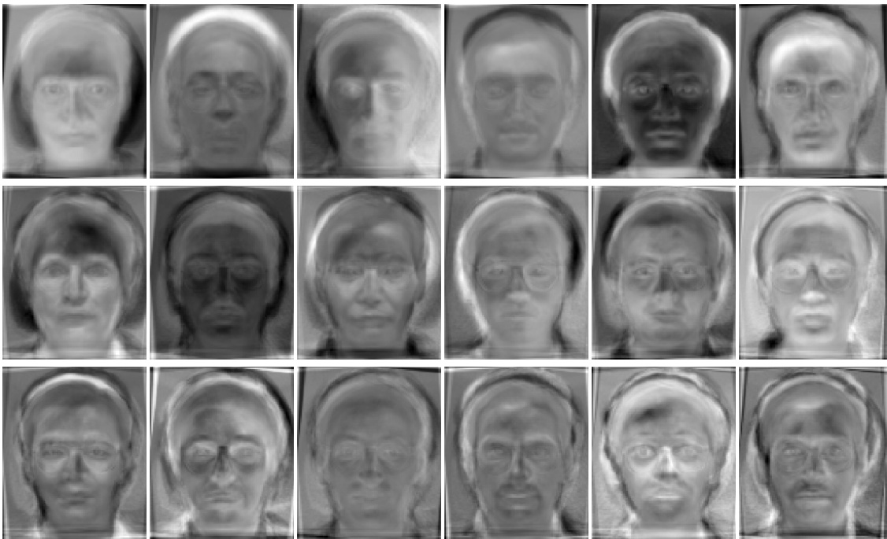

Hình 21.6. Các eigenfaces tìm được bằng PCA.

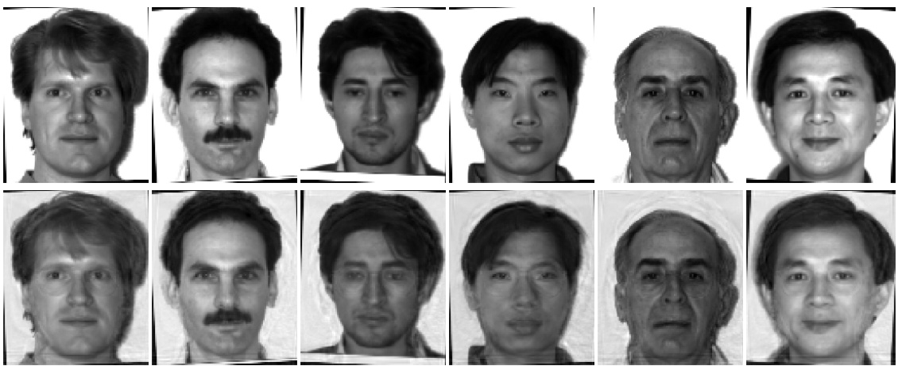

Hình 21.7. Hàng trên: các ảnh gốc. Hàng dưới: các ảnh được tái tạo dùng khuôn mặt riêng. Ảnh ở hàng dưới có nhiễu nhưng vẫn mang những đặc điểm riêng mà mắt người có thể phân biệt được.

## 21.6.2. Dò tìm điểm bất thường

Ngoài các ứng dụng về nén và phân loại, PCA còn được sử dụng trong nhiều lĩnh vực khác. Dò tìm điểm bất thường (abnormal detection hoặc outlier detection) là một trong số đó [SCSC03, LCD04].

<!-- page: 287 -->

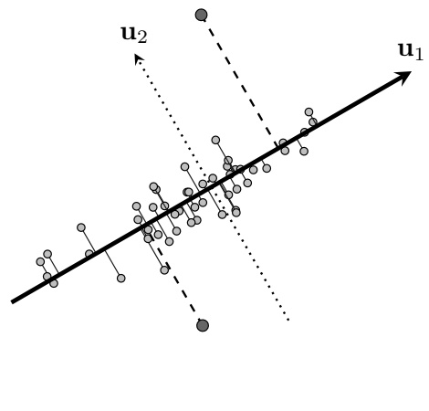

**Hình 21.8.** PCA cho bài toán dò tìm điểm bất thường. Giả sử các sự kiện bình thường chiếm đa số và nằm gần một không gian con nào đó. Khi đó, nếu làm PCA trên toàn bộ dữ liệu, không gian con thu được gần với không gian con của tập các sự kiện bình thường. Lúc này, các điểm hình tròn to đậm hơn có thể được coi là các sự kiện bất thường vì chúng nằm xa không gian con chính.

Ý tưởng cơ bản là giả sử tồn tại một không gian con mà các sự kiện bình thường nằm gần trong khi các sự kiện bất thường nằm xa không gian con đó. Hơn nữa, số sự kiện bất thường có một tỉ lệ nhỏ. Như vậy, PCA có thể được sử dụng trên toàn bộ dữ liệu để tìm ra các thành phần chính, từ đó suy ra không gian con mà các điểm bình thường nằm gần. Việc xác định một điểm là bình thường hay bất thường được xác định bằng cách đo khoảng cách từ điểm đó tới không gian con tìm được. Hình 21.8 minh hoạ cho việc xác định các sự kiện bất thường bằng PCA.

## 21.7. Thảo luận

• PCA là phương pháp giảm chiều dữ liệu dựa trên việc tối đa lượng thông tin được giữ lại. Lượng thông tin được giữ lại được đo bằng tổng các phương sai trên mỗi thành phần của dữ liệu. Lượng dữ liệu sẽ được giữ lại nhiều nhất khi các chiều dữ liệu còn lại tương ứng với các vector riêng của trị riêng lớn nhất của ma trận hiệp phương sai.

• Với các bài toán quy mô lớn, đôi khi việc tính toán trên toàn bộ dữ liệu là không khả thi vì vấn đề bộ nhớ. Giải pháp là thực hiện PCA lần đầu trên một tập con dữ liệu vừa với bộ nhớ, sau đó lấy một tập con khác để từ từ (incrementally) cập nhật nghiệm của PCA tới khi hội tụ. Ý tưởng này khá giống với mini-batch gradient descent, và được gọi là incremental PCA [ZYK06].

• Ngoài ra, còn rất nhiều hướng mở rộng của PCA, bạn đọc có thể tìm kiếm theo từ khoá: Sparse PCA [dGJL05], Kernel PCA [MSS+99], Robust PCA [CLMW11].

• Mã nguồn trong chương này có thể được tìm thấy tại [https://goo.gl/zQ3DSZ](https://goo.gl/zQ3DSZ).

<!-- page: 288 -->

# Phân tích biệt thức tuyến tính

## 22.1. Giới thiệu

Trong chương trước, chúng ta đã làm quen với một thuật toán giảm chiều dữ liệu phổ biến nhất – phân tích thành phần chính (PCA). Như đã đề cập, PCA là một thuật toán học không giám sát, tức chỉ sử dụng các vector dữ liệu mà không cần tới nhãn. Tuy nhiên, trong bài toán phân loại, việc khai thác mối liên quan giữa dữ liệu và nhãn sẽ mang lại kết quả phân loại tốt hơn.

Nhắc lại rằng PCA là phương pháp giảm chiều dữ liệu sao cho lượng thông tin về dữ liệu giữ lại, thể hiện ở tổng phương sai của các thành phần giữ lại, là nhiều nhất. Tuy nhiên, trong nhiều bài toán, ta không cần giữ lại lượng thông tin lớn nhất mà chỉ cần giữ lại thông tin cần thiết cho riêng bài toán đó. Xét ví dụ bài toán phân loại nhị phân được minh họa trong Hình 22.1. Ở đây, giả sử rằng dữ liệu được chiếu lên một đường thẳng và mỗi điểm được thay bởi hình chiếu của nó lên đường thẳng kia. Như vậy, số chiều dữ liệu đã được giảm từ hai về một. Câu hỏi đặt ra là đường thẳng cần có phương như thế nào để hình chiếu của dữ liệu có ích cho việc phân loại nhất? Việc phân loại trong không gian một chiều có thể hiểu là việc tìm ra một ngưỡng giúp phân tách hai lớp. Xét hai đường thằng $d _ { 1 }$ và $d _ { 2 }$ . Trong đó phương của $d _ { 1 }$ gần với phương của thành phần chính nếu thực hiện PCA, phương của $d _ { 2 }$ gần với phương của thành phần phụ tìm được bằng PCA. Nếu thực hiện giảm chiều dữ liệu bằng PCA, ta sẽ thu được dữ liệu gần với các điểm được chiếu lên $d _ { 1 }$ . Lúc này việc phân tách hai lớp trở nên phức tạp vì các điểm dữ liệu mới của hai lớp chồng lấn lên nhau. Ngược lại, nếu ta chiếu dữ liệu lên đường thẳng gần với thành phần phụ tìm được bởi PCA, tức $d _ { 2 }$ , các điểm hình chiếu nằm hoàn toàn về hai phía khác nhau của điểm màu đen trên đường thẳng này. Như vậy, việc chiếu dữ liệu lên $d _ { 2 }$ sẽ mang lại hiệu quả hơn trong bài toán phân loại. Việc phân loại một điểm dữ liệu mới được xác định nhanh chóng bằng cách so sánh hình chiếu của nó lên $d _ { 2 }$ với điểm phân ngưỡng màu đen.

<!-- page: 289 -->

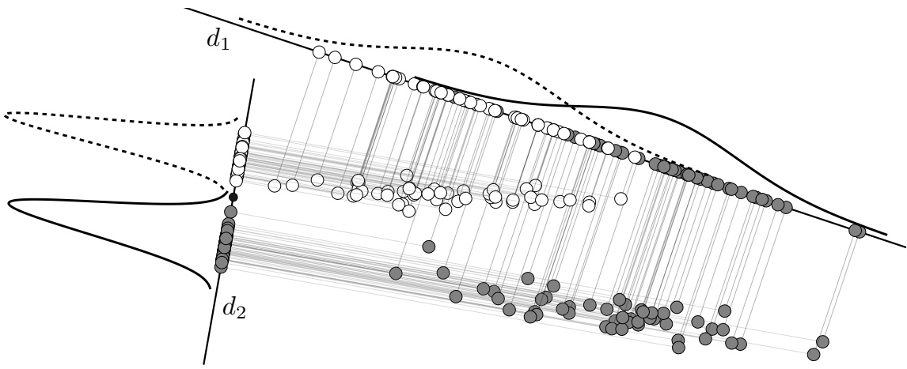

Hình 22.1. Chiếu dữ liệu lên các đường thẳng khác nhau. Có hai lớp dữ liệu minh hoạ bởi các điểm màu xám và trắng trong không gian hai chiều. Số chiều được giảm về một bằng cách chiếu dữ liệu lên các đường thẳng khác nhau $d _ { 1 }$ và $d _ { 2 }$ . Trong hai cách chiếu này, phương của $d _ { 1 }$ gần giống với phương của thành phần chính thứ nhất của dữ liệu, phương của $d _ { 2 }$ gần với thành phần phụ của dữ liệu nếu dùng PCA. Khi chiếu dữ liệu lên $d _ { 1 }$ , nhiều điểm màu xám và trắng bị chồng lấn lên nhau, khiến cho việc phân loại dữ liệu là không khả thi trên đường thẳng này. Ngược lại, khi được chiếu lên $d _ { 2 }$ , dữ liệu của hai lớp được chia thành các cụm tương ứng tách biệt nhau, khiến cho việc phân loại trở nên đơn giản và hiệu quả hơn. Các đường cong hình chuông thể hiện xấp xỉ phân bố xác suất của dữ liệu hình chiếu trong mỗi lớp.

Qua ví dụ trên ta thấy rằng, việc giữ lại thông tin nhiều nhất không mang lại kết quả tốt trong một số trường hợp. Chú ý rằng kết quả của phân tích trên đây không có nghĩa là thành phần phụ mang lại hiệu quả tốt hơn thành phần chính. Việc chiếu dữ liệu lên đường thẳng nào giúp ích cho các bài toán phân loại cần nhiều phân tích cụ thể hơn. Ngoài ra, hai đường thằng $d _ { 1 }$ và $d _ { 2 }$ trên đây không vuông góc với nhau, chúng được chọn gần với các thành phần chính và phụ của dữ liệu phục vụ cho mục đích minh hoạ.

Phân tích biệt thức tuyến tính (linear discriminant analysis, LDA) ra đời giúp tìm phương chiếu dữ liệu hiệu quả cho bài toán phân loại. LDA có thể được coi là một phương pháp giảm chiều dữ liệu hoặc phân loại, hoặc được áp dụng đồng thời cho cả hai, tức giảm chiều dữ liệu sao cho việc phân loại hiệu quả nhất. Số chiều của dữ liệu mới nhỏ hơn hoặc bằng C − 1 trong đó C là số lớp dữ liệu. Từ biệt thức (discriminant) được hiểu là những thông tin riêng biệt của mỗi lớp.

Trong Mục 22.2 dưới đây, chúng ta sẽ thảo luận về LDA cho bài toán phân loại nhị phân. Mục 22.3 sẽ tổng quát LDA lên cho trường hợp phân loại đa lớp. Mục 22.4 trình bày các ví dụ và mã nguồn Python cho LDA.

<!-- page: 290 -->

## 22.2. Bài toán phân loại nhị phân

## 22.2.1. Ý tưởng cơ bản

Quay lại với Hình 22.1, giả sử dữ liệu của mỗi lớp khi chiếu xuống một đường thẳng tuân theo phân phối chuẩn có hàm mật độ xác suất dạng hình chuông. Độ rộng của mỗi đường hình chuông này thể hiện độ lệch chuẩn (standard deviation<sup>56</sup>, ký hiệu là s) của dữ liệu. Dữ liệu càng tập trung thì độ lệch chuẩn càng nhỏ, càng phân tán thì độ lệch chuẩn càng cao. Khi chiếu lên $d _ { 1 }$ , dữ liệu của hai lớp bị phân tán quá nhiều và trộn lẫn vào nhau. Khi chiếu lên $d _ { 2 }$ , mỗi lớp có độ lệch chuẩn nhỏ, khiến dữ liệu trong từng lớp tập trung hơn.

Tuy nhiên, việc độ lệch chuẩn nhỏ trong mỗi lớp chưa đủ để đảm bảo độ độ riêng biệt của dữ liệu giữa hai lớp. Xét các ví dụ trong Hình 22.2. Hình 22.2a thể hiện trường hợp dữ liệu được chiếu lên $d _ { 1 }$ như trong Hình 22.1. Cả hai lớp đều quá phân tán khiến lượng chồng lấn lớn (phần diện tích màu xám), tức dữ liệu chưa thực sự riêng biệt. Hình 22.2b thể hiện trường hợp độ lệch chuẩn của hai lớp đều nhỏ, tức dữ liệu trong mỗi lớp tập trung hơn. Tuy nhiên, khoảng cách giữa hai lớp, được đo bằng khoảng cách giữa hai trung bình $m _ { 1 }$ và $m _ { 2 }$ là quá nhỏ. Việc này khiến phần chồng lấn chiếm một tỉ lệ lớn, không tốt cho việc phân loại. Hình 22.2c thể hiện trường hợp cả hai độ lệch chuẩn nhỏ và khoảng cách giữa hai trung bình lớn, phần chồng lấn nhỏ không đáng kể.

Vậy, độ lệch chuẩn và khoảng cách giữa hai trung bình cụ thể đại diện cho các tiêu chí gì?

• Độ lệch chuẩn nhỏ thể hiện việc dữ liệu ít phân tán, tức dữ liệu trong mỗi lớp có xu hướng giống nhau. Hai phương sai $s _ { 1 } ^ { 2 } , s _ { 2 } ^ { 2 }$ còn được gọi là các phương sai nội lớp (within-class variance).

• Khoảng cách giữa các trung bình lớn chứng tỏ hai lớp cách xa nhau, tức dữ liệu giữa hai lớp khác nhau nhiều. Bình phương khoảng cách giữa hai trung bình $( m _ { 1 } - m _ { 2 } ) ^ { 2 }$ còn được gọi là phương sai liên lớp (between-class variance). Ở đây bình phương của hiệu hai trung bình được lấy để có cùng thứ nguyên với phương sai.

Hai lớp dữ liệu được gọi là tách biệt (discriminative) nếu hai lớp đó cách xa nhau (phương sai liên lớp lớn) và dữ liệu trong mỗi lớp có xu hướng giống nhau (phương sai nội lớp nhỏ). LDA là thuật toán đi tìm một phép chiếu sao cho tỉ lệ giữa phương sai liên lớp và phương sai nội lớp trở nên lớn nhất có thể.

<small><span class="docvortex-page-footnote" data-block-type="page_footnote" style="color:#6b7280">56 độ lệch chuẩn là căn bậc hai của phương sai</span></small>

<!-- page: 291 -->

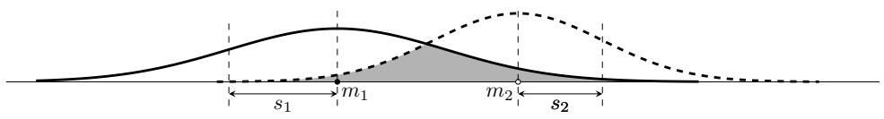

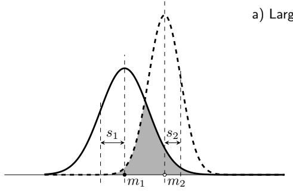

a) Large $( m _ { 1 } - m _ { 2 } ) ^ { 2 }$ , large $s _ { 1 } ^ { 2 } + s _ { 2 } ^ { 2 }$

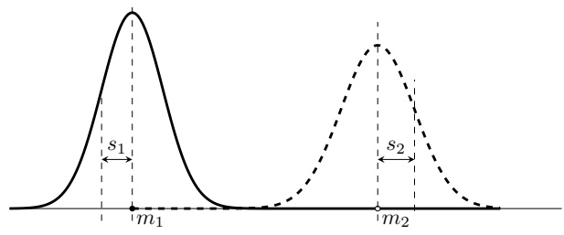

b) Small $( m _ { 1 } - m _ { 2 } ) ^ { 2 }$ , small $s _ { 1 } ^ { 2 } + s _ { 2 } ^ { 2 }$

c) Large $( m _ { 1 } - m _ { 2 } ) ^ { 2 }$ , small $s _ { 1 } ^ { 2 } + s _ { 2 } ^ { 2 }$

Hình 22.2. Khoảng cách giữa các trung bình và tổng các phương sai ảnh hưởng tới độ biệt thức của dữ liệu. (a) Khoảng cách giữa hai trung bình lớn nhưng phương sai trong mỗi class cũng lớn, khiến cho hai phân phối chồng lấn lên nhau (phần màu xám). (b) Phương sai cho mỗi class rất nhỏ nhưng hai trung bình quá gần nhau, khiến khó phân biệt hai class. (c) Khi phương sai đủ nhỏ và khoảng cách giữa hai trung bình đủ lớn, ta thấy rằng dữ liệu hai lớp tách biệt hơn.

## 22.2.2. Hàm mục tiêu của phân tích biệt thức tuyến tính

Giả sử có N điểm dữ liệu $\mathbf { x } _ { 1 } , \mathbf { x } _ { 2 } , \ldots , \mathbf { x } _ { N } \; \in \; \mathbb { R } ^ { D }$ trong đó $N _ { 1 } \; < \; N$ điểm đầu tiên thuộc lớp thứ nhất, $N _ { 2 } \; = \; N   -   N _ { 1 }$ điểm còn lại thuộc lớp thứ hai. Ký hiệu $\mathcal { C } _ { 1 }   =   \{ n | 1   \leq   n   \leq   N _ { 1 } \}$ là tập hợp chỉ số các điểm thuộc lớp thứ nhất và $\mathcal { C } _ { 2 } = \{ m | N _ { 1 } + 1 \leq m \leq N \} )$ là tập hợp chỉ số các điểm thuộc lớp thứ hai. Phép chiếu dữ liệu xuống một đường thẳng được mô tả bằng một vector trọng số w, giá trị tương ứng của mỗi điểm dữ liệu chiếu được cho bởi

$$
z _ {n} = \mathbf {w} ^ {T} \mathbf {x} _ {n}, 1 \leq n \leq N.\tag{22.1}
$$

Vector trung bình của mỗi lớp được tính bởi

$$
\mathbf {m} _ {k} = \frac {1}{N _ {k}} \sum_ {n \in \mathcal {C} _ {k}} \mathbf {x} _ {n}, \quad k = 1, 2\tag{22.2}
$$

$$
\Rightarrow m _ {1} - m _ {2} = \frac {1}{N _ {1}} \sum_ {i \in \mathcal {C} _ {1}} z _ {i} - \frac {1}{N _ {2}} \sum_ {j \in \mathcal {C} _ {2}} z _ {j} = \mathbf {w} ^ {T} (\mathbf {m} _ {1} - \mathbf {m} _ {2}).\tag{22.3}
$$

Các phương sai nội lớp được định nghĩa bởi

$$
s _ {k} ^ {2} = \sum_ {n \in \mathcal {C} _ {k}} (z _ {n} - m _ {k}) ^ {2}, k = 1, 2\tag{22.4}
$$

Chú $\acute { y } ;$ Các phương sai nội lớp không được lấy trung bình như phương sai thông thường. Điều này có thể lý giải bởi tầm quan trọng của mỗi phương sai nội lớp

<!-- page: 292 -->

cần tỉ lệ thuận với số lượng điểm dữ liệu trong lớp đó, tức phương sai nội lớp bằng phương sai nhân với số điểm trong lớp đó.

LDA là thuật toán đi tìm giá trị lớn nhất của hàm mục tiêu:

$$
J (\mathbf {w}) = \frac {(m _ {1} - m _ {2}) ^ {2}}{s _ {1} ^ {2} + s _ {2} ^ {2}}\tag{22.5}
$$

Thông qua việc tối đa hàm mục tiêu này, ta sẽ thu được phương sai liên lớp $( m _ { 1 } - m _ { 2 } ) ^ { 2 }$ lớn và phương sai nội lớp $s _ { 1 } ^ { 2 } + s _ { 2 } ^ { 2 }$ nhỏ.

Tiếp theo, chúng ta sẽ tìm biểu thức phụ thuộc giữa tử số và mẫu số trong vế phải của (22.5) vào w. Tử số được viết lại thành:

$$
(m _ {1} - m _ {2}) ^ {2} = (\mathbf {w} ^ {T} (\mathbf {m} _ {1} - \mathbf {m} _ {2})) ^ {2} = \mathbf {w} ^ {T} \underbrace {(\mathbf {m} _ {1} - \mathbf {m} _ {2}) (\mathbf {m} _ {1} - \mathbf {m} _ {2}) ^ {T}} _ {\mathbf {S} _ {B}} \mathbf {w} = \mathbf {w} ^ {T} \mathbf {S} _ {B} \mathbf {w}
$$

${ \bf S } _ { B }$ còn được gọi là ma trận phương sai liên lớp. Có thể thấy đây là một ma trận đối xứng nửa xác định dương.

Mẫu số được viết lại thành:

$$
\begin{array}{c} s _ {1} ^ {2} + s _ {2} ^ {2} = \sum_ {k = 1} ^ {2} \sum_ {n \in \mathcal {C} _ {k}} \left(\mathbf {w} ^ {T} (\mathbf {x} _ {n} - \mathbf {m} _ {k})\right) ^ {2} \\ = \mathbf {w} ^ {T} \underbrace {\sum_ {k = 1} ^ {2} \sum_ {n \in \mathcal {C} _ {k}} (\mathbf {x} _ {n} - \mathbf {m} _ {k}) (\mathbf {x} _ {n} - \mathbf {m} _ {k}) ^ {T}} _ {\mathbf {S} _ {W}} \mathbf {w} = \mathbf {w} ^ {T} \mathbf {S} _ {W} \mathbf {w} \end{array}\tag{22.6}
$$

$\mathbf { S } _ { W }$ còn được gọi là ma trận phương sai nội lớp. Đây là một ma trận đối xứng nửa xác định dương vì nó là tổng của hai ma trận đối xứng nửa xác định dương<sup>57</sup>.

Như vậy, bài toán tối ưu cho LDA trở thành

$$
\mathbf {w} = \arg \max _ {\mathbf {w}} \frac {\mathbf {w} ^ {T} \mathbf {S} _ {B} \mathbf {w}}{\mathbf {w} ^ {T} \mathbf {S} _ {W} \mathbf {w}}\tag{22.7}
$$

## 22.2.3. Nghiệm của bài toán tối ưu

Nghiệm w của (22.7) là nghiệm của phương trình đạo hàm hàm mục tiêu bằng không. Sử dụng quy tắc chuỗi cho đạo hàm nhiều biến và công thức $\nabla _ { \mathbf { w } } \mathbf { w } \mathbf { A } \mathbf { w } =$ 2Aw với A là một ma trận đối xứng, ta thu được:

<small><span class="docvortex-page-footnote" data-block-type="page_footnote" style="color:#6b7280">57 T 2 T T T T</span></small>

<small><span class="docvortex-page-footnote" data-block-type="page_footnote" style="color:#6b7280">(a b) = (a b)(a b) = a bb a với a, b là hai vector cùng chiều bất kỳ.</span></small>

<!-- page: 293 -->

$$
\begin{array}{r l} \nabla_ {\mathbf {w}} J (\mathbf {w}) & = \frac {1}{(\mathbf {w} ^ {T} \mathbf {S} _ {W} \mathbf {w}) ^ {2}} \left(2 \mathbf {S} _ {B} \mathbf {w} (\mathbf {w} ^ {T} \mathbf {S} _ {W} \mathbf {w}) - 2 \mathbf {w} ^ {T} \mathbf {S} _ {B} \mathbf {w} ^ {T} \mathbf {S} _ {W} \mathbf {w}\right) = \mathbf {0} (2 2. 8) \\ \Leftrightarrow \mathbf {S} _ {B} \mathbf {w} & = \frac {\mathbf {w} ^ {T} \mathbf {S} _ {B} \mathbf {w}}{\mathbf {w} ^ {T} \mathbf {S} _ {W} \mathbf {w}} \mathbf {S} _ {W} \mathbf {w} = J (\mathbf {w}) \mathbf {S} _ {W} \mathbf {w} \\ \Rightarrow \mathbf {S} _ {W} ^ {- 1} \mathbf {S} _ {B} \mathbf {w} & = J (\mathbf {w}) \mathbf {w} \end{array} \tag {22.10}
$$

Lưu $\dot { \mathbf { y } } ;$ Trong (22.10), ta đã giả sử rằng ma trận $\mathbf { S } _ { W }$ khả nghịch. Điều này không luôn đúng, nhưng có thể được khắc phục bằng một kỹ thuật nhỏ là xấp xỉ $\mathbf { S } _ { W }$ bởi $\bar { \mathbf { S } } _ { W } = \mathbf { S } _ { W } + \lambda \mathbf { I }$ với λ là một số thực dương nhỏ. Ma trận mới này khả nghịch vì trị riêng nhỏ nhất của nó dương, bằng với trị riêng nhỏ nhất của $\mathbf { S } _ { W }$ cộng với λ. Điều này suy ra từ việc $\mathbf { S } _ { W }$ là một ma trận nửa xác định dương. Từ đó, $\bar { \bar { \mathbf { S } } } _ { W }$ là một ma trận xác định dương vì mọi trị riêng của nó không nhỏ hơn λ, và vì vậy khả nghịch. Khi tính toán, ta có thể sử dụng nghịch đảo của $\bar { \bar { \mathbf { S } } } _ { W }$ . Kỹ thuật này được sử dụng rất nhiều khi cần sử dụng nghịch đảo của một ma trận nửa xác định dương và chưa biết nó có thực sự xác định dương hay không.

Trở lại đẳng thức (22.10), vì $J ( \mathbf { w } )$ là một số vô hướng, ta suy ra w phải là một vector riêng của $\mathbf { S } _ { W } ^ { - 1 } \mathbf { S } _ { B }$ ứng với $J ( \mathbf { w } )$ . Vậy, để hàm mục tiêu là lớn nhất thì $J ( \mathbf { w } )$ phải là trị riêng lớn nhất của $\mathbf { S } _ { W } ^ { - 1 } \mathbf { S } _ { B }$ . Dấu bằng xảy ra khi w là vector riêng ứng với trị riêng lớn nhất đó. Từ đó, nếu w là nghiệm của (22.7) thì kw cũng là nghiệm với k là số thực khác không bất kỳ. Vậy ta có thể chọn w sao cho $( \mathbf { m } _ { 1 } - \mathbf { m } _ { 2 } ) ^ { T } \mathbf { w } = L$ với L là trị riêng lớn nhất của $\mathbf { S } _ { W } ^ { - 1 } \mathbf { S } _ { B }$ và cũng là giá trị tối ưu của $J ( \mathbf { w } )$ . Khi đó, thay định nghĩa của ${ \bf S } _ { B }$ ở (22.6) vào (22.10) ta có:

$$
L \mathbf {w} = \mathbf {S} _ {W} ^ {- 1} (\mathbf {m} _ {1} - \mathbf {m} _ {2}) \underbrace {(\mathbf {m} _ {1} - \mathbf {m} _ {2}) ^ {T} \mathbf {w}} _ {L} = L \mathbf {S} _ {W} ^ {- 1} (\mathbf {m} _ {1} - \mathbf {m} _ {2})\tag{22.11}
$$

Điều này nghĩa là ta có thể chọn

$$
\mathbf {w} = \alpha \mathbf {S} _ {W} ^ {- 1} (\mathbf {m} _ {1} - \mathbf {m} _ {2})\tag{22.12}
$$

với $\alpha \neq 0$ bất $\mathrm { k \hat { y } }$ . Biểu thức (22.12) còn được biết với tên gọi biệt thức tuyến tính Fisher (Fisher’s linear discriminant), được đặt theo tên nhà khoa học Ronald Fisher ([https://goo.gl/eUk1KS](https://goo.gl/eUk1KS)).

## 22.3. Bài toán phân loại đa lớp

## 22.3.1. Xây dựng hàm mục tiêu

Trong mục này, chúng ta sẽ xem xét trường hợp tổng quát của LDA khi có nhiều hơn hai lớp dữ liệu, $C > 2$ . Giả sử rằng chiều của dữ liệu D lớn hơn C. Đặt số chiều dữ liệu mới là $D ^ { \prime } < D$ và dữ liệu mới ứng với mỗi điểm dữ liệu x là:

$$
\mathbf {z} = \mathbf {W} ^ {T} \mathbf {x}\tag{22.13}
$$

với $\mathbf { W } \in \mathbb { R } ^ { D \times D ^ { \prime } }$

<!-- page: 294 -->

Chương 22. Phân tích biệt thức tuyến tính

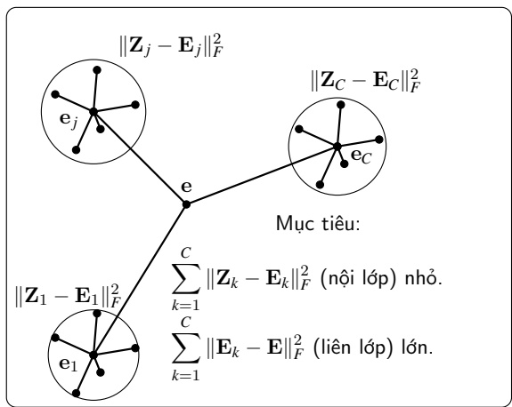

Hình 22.3. LDA cho bài toán phân loại đa lớp. Mục đích chung là phương sai nội lớp nhỏ và phương sai liên lớp lớn. Các vòng tròn thể hiện các lớp khác nhau.

Một vài ký hiệu:

$\mathbf { X } _ { k } , \mathbf { Z } _ { k } = \mathbf { W } ^ { T } \mathbf { X } _ { k }$ lần lượt là ma trận dữ liệu của lớp thứ k trong không gian ban đầu và không gian mới với số chiều nhỏ hơn. Mỗi cột tương ứng với một điểm dữ liệu.

$\mathbf { m } _ { k } = \frac { 1 } { N _ { k } } \sum _ { n \in \mathcal { C } _ { k } } \mathbf { x } _ { k } \in \mathbb { R } ^ { D }$ là vector trung bình của lớp k trong không gian ban đầu.

$\mathbf { e } _ { k } = \frac { 1 } { N _ { k } } \sum _ { n \in \mathcal { C } _ { k } } \mathbf { z } _ { n } = \mathbf { W } ^ { T } \mathbf { m } _ { k } \in \mathbb { R } ^ { D ^ { \prime } }$ là vector trung bình của lớp k trong không gian mới.

• m $\in \mathbb { R } ^ { D }$ là vector trung bình của toàn bộ dữ liệu trong không gian ban đầu và $\mathbf { e } \in R ^ { D ^ { \prime } }$ là vector trung bình trong không gian mới.

Một trong những cách xây dựng hàm mục tiêu cho LDA đa lớp được minh họa trong Hình 22.3. Độ phân tán của một lớp dữ liệu được coi như tổng bình phương khoảng cách từ mỗi điểm trong lớp đó tới vector trung bình của chúng. Nếu tất cả các điểm đều gần vector trung bình này thì tập dữ liệu đó có độ phân tán nhỏ. Ngược lại, nếu tổng này lớn, tức trung bình các điểm đều xa trung tâm, tập hợp này được coi là có độ phân tán cao. Dựa vào nhận xét này, ta có thể xây dựng các đại lượng phương sai nội lớp và liên lớp như sau đây.

Phương sai nội lớp của lớp thứ k được định nghĩa như sau:

$$
\begin{array}{r l} & {\sigma_ {k} ^ {2} = \sum_ {n \in \mathcal {C} _ {k}} \| \mathbf {z} _ {n} - \mathbf {e} _ {k} \| _ {F} ^ {2} = \| \mathbf {Z} _ {k} - \mathbf {E} _ {k} \| _ {2} ^ {2} = \| \mathbf {W} ^ {T} (\mathbf {X} _ {k} - \mathbf {M} _ {k}) \| _ {F} ^ {2}} \\ & {\quad = \mathrm{trace} \left(\mathbf {W} ^ {T} (\mathbf {X} _ {k} - \mathbf {M} _ {k}) (\mathbf {X} _ {k} - \mathbf {M} _ {k}) ^ {T} \mathbf {W}\right)} \end{array}\tag{22.14}
$$

(22.15)

<!-- page: 295 -->

Với $\mathbf { E } _ { k }$ là một ma trận có các cột giống hệt nhau và bằng với vector trung bình $\mathbf { e } _ { k }$ . Có thể nhận thấy $\mathbf { E } _ { k } = \mathbf { W } ^ { T } \mathbf { M } _ { k }$ với $\mathbf { M } _ { k }$ là ma trận có các cột giống hệt nhau và bằng với vector trung bình $\mathbf { m } _ { k }$ trong không gian ban đầu. Vậy đại lượng đo phương sai nội lớp trong LDA đa lớp có thể được đo bằng:

$$
s _ {W} = \sum_ {k = 1} ^ {C} \sigma_ {k} ^ {2} = \sum_ {k = 1} ^ {C} \operatorname{trace} \left(\mathbf {W} ^ {T} (\mathbf {X} _ {k} - \mathbf {M} _ {k}) (\mathbf {X} _ {k} - \mathbf {M} _ {k}) ^ {T} \mathbf {W}\right) = \operatorname{trace} \left(\mathbf {W} ^ {T} \mathbf {S} _ {W} \mathbf {W}\right)
$$

với

$$
\mathbf {S} _ {W} = \sum_ {k = 1} ^ {C} \| \mathbf {X} _ {k} - \mathbf {M} _ {k} \| _ {F} ^ {2} = \sum_ {k = 1} ^ {C} \sum_ {n \in \mathcal {C} _ {k}} (\mathbf {x} _ {n} - \mathbf {m} _ {k}) (\mathbf {x} _ {n} - \mathbf {m} _ {k}) ^ {T}\tag{22.16}
$$

Ma trận $\mathbf { S } _ { W }$ này là một ma trận nửa xác định dương.

Phương sai liên lớp lớn có thể đạt được nếu tất cả các điểm trong không gian mới đều xa vector trung bình chung e. Điều này cũng có thể đạt được nếu các vector trung bình của mỗi lớp xa các vector trung bình chung (trong không gian mới). Vậy ta có thể định nghĩa đại lượng phương sai liên lớp như sau:

$$
s _ {B} = \sum_ {k = 1} ^ {C} N _ {k} \| \mathbf {e} _ {k} - \mathbf {e} \| _ {F} ^ {2} = \sum_ {k = 1} ^ {C} \| \mathbf {E} _ {k} - \mathbf {E} \| _ {F} ^ {2}\tag{22.17}
$$

Ta lấy $N _ { k }$ làm trọng số vì có thể có những lớp có nhiều phần tử so với các lớp còn lại. Chú ý rằng ma trận E có thể có số cột linh động, phụ thuộc vào số cột của ma trận $\mathbf { E } _ { k }$ mà nó đi cùng (và bằng $N _ { k } )$

Lập luận tương tự như (22.16), bạn đọc có thể chứng minh được:

$$
s _ {B} = \mathrm{trace} \left(\mathbf {W} ^ {T} \mathbf {S} _ {B} \mathbf {W}\right)\tag{22.18}
$$

với

$$
\mathbf {S} _ {B} = \sum_ {k = 1} ^ {C} (\mathbf {M} _ {k} - \mathbf {M}) (\mathbf {M} _ {k} - \mathbf {M}) ^ {T} = \sum_ {k = 1} ^ {C} N _ {k} (\mathbf {m} _ {k} - \mathbf {m}) (\mathbf {m} _ {k} - \mathbf {m}) ^ {T}\tag{22.19}
$$

và số cột của ma trận M cũng linh động theo số cột của $\mathbf { M } _ { k }$ . Ma trận này một ma trận nửa đối xứng xác định dương vì nó là tổng của các ma trận đối xứng nửa xác định dương.

## 22.3.2. Hàm mục tiêu của LDA đa lớp

Với cách định nghĩa và $\acute { \mathrm { y } }$ tưởng về phương sai nội lớp nhỏ và phương sai đa lớp lớn như trên, ta có thể xây dựng bài toán tối ưu:

$$
\mathbf {W} = \arg \max _ {\mathbf {W}} J (\mathbf {W}) = \arg \max _ {\mathbf {W}} \frac {\operatorname{trace} (\mathbf {W} ^ {T} \mathbf {S} _ {B} \mathbf {W})}{\operatorname{trace} (\mathbf {W} ^ {T} \mathbf {S} _ {W} \mathbf {W})}\tag{22.20}
$$

<!-- page: 296 -->

Nghiệm của bài toán tối ưu này được tìm bằng cách giải phương trình đạo hàm hàm mục tiêu bằng không. Nhắc lại về đạo hàm của hàm trace theo ma trận:

$$
\nabla_ {\mathbf {W}} \mathrm{trace} (\mathbf {W} ^ {T} \mathbf {A W}) = 2 \mathbf {A W}\tag{22.21}
$$

với $\mathbf { A } \in \mathbb { R } ^ { D \times D }$ là một ma trận đối xứng.

Với cách tính tương tự như (22.8) - (22.10), ta có:

$$
\begin{array}{r} \nabla_ {\mathbf {W}} J (\mathbf {W}) = \frac {2 (\mathbf {S} _ {B} \mathbf {W} \mathrm{trace} (\mathbf {W} ^ {T} \mathbf {S} _ {W} \mathbf {W}) - \mathrm{trace} (\mathbf {W} ^ {T} \mathbf {S} _ {B} \mathbf {W}) \mathbf {S} _ {W} \mathbf {W})}{(\mathrm{trace} (\mathbf {W} ^ {T} \mathbf {S} _ {W} \mathbf {W})) ^ {2}} = \mathbf {0} \\ \Leftrightarrow \mathbf {S} _ {W} ^ {- 1} \mathbf {S} _ {B} \mathbf {W} = \frac {\mathrm{trace} (\mathbf {W} ^ {T} \mathbf {S} _ {B} \mathbf {W})}{\mathrm{trace} (\mathbf {W} ^ {T} \mathbf {S} _ {W} \mathbf {W})} \mathbf {W} = J (\mathbf {W}) \mathbf {W} \end{array}
$$

Từ đó suy ra mỗi cột của W là một vector riêng của $\mathbf { S } _ { W } ^ { - 1 } \mathbf { S } _ { B }$ ứng với trị riêng lớn nhất của ma trận này. Nhận thấy rằng các cột của W phải độc lập tuyến tính. Vì nếu không, dữ liệu trong không gian mới $\mathbf { z } = \mathbf { W } ^ { T } \mathbf { x }$ sẽ phụ thuộc tuyến tính và có thể tiếp tục được giảm số chiều. Vậy các cột của W là các vector độc lập tuyến tính ứng với trị riêng cao nhất của $\mathbf { S } _ { W } ^ { - 1 } \mathbf { S } _ { B }$ . Câu hỏi đặt ra là có nhiều nhất bao nhiêu vector riêng độc lập tuyến tính ứng với trị riêng lớn nhất của $\mathbf { S } _ { W } ^ { - 1 } \mathbf { S } _ { B } ?$ Số lượng này chính là số chiều $D ^ { \prime }$ của dữ liệu mới.

Số lượng lớn nhất các vector riêng độc lập tuyến tính ứng với một trị riêng của một ma trận không thể lớn hơn hạng của ma trận đó. Dưới đây là một bổ đề quan trọng.

Bổ đề:

$$
\mathrm{rank} (\mathbf {S} _ {B}) \leq C - 1\tag{22.22}
$$

Chứng minh<sup>58</sup>:

Viết lại 22.19 dưới dạng

$$
\mathbf {S} _ {B} = \mathbf {P P} ^ {T}\tag{22.23}
$$

với $\mathbf { P } \in R ^ { D \times C }$ mà cột thứ k cuả nó là $\mathbf { p } _ { k } = \sqrt { N _ { k } } ( \mathbf { m } _ { k } - \mathbf { m } )$

Cột cuối cùng là một tổ hợp tuyến tính của các cột còn lại vì

$$
\mathbf {m} _ {C} - \mathbf {m} = \mathbf {m} _ {C} - \frac {\sum_ {k = 1} ^ {C} N _ {k} \mathbf {m} _ {k}}{N} = \sum_ {k = 1} ^ {C - 1} \frac {N _ {k}}{N} (\mathbf {m} _ {k} - \mathbf {m})\tag{22.24}
$$

Như vậy ma trận P có nhiều nhất $C - 1$ cột độc lập tuyến tính, vì vậy hạng<sup>59</sup> của nó không vượt quá $C - 1$ . Cuối cùng, ${ \bf S } _ { B }$ là tích của hai ma trận với hạng không quá $C - 1$ , nên hạng của nó không vượt quá $C - 1$

<small><span class="docvortex-page-footnote" data-block-type="page_footnote" style="color:#6b7280">58 Việc chứng minh này không thực sự quan trọng, chỉ phù hợp với những bạn muốn hiểu sâu.</span></small>

<small><span class="docvortex-page-footnote" data-block-type="page_footnote" style="color:#6b7280">59 Các tính chất của hạng có thể được tìm thấy trong Mục 1.8.</span></small>

<!-- page: 297 -->

Từ đó ra có rank $\left( \mathbf { S } _ { W } ^ { - 1 } \mathbf { S } _ { B } \right) \leq \mathrm { r a n k } \mathbf { S } _ { B } \leq C - 1$ . Vậy số chiều của không gian mới là một số không lớn hơn C − 1.

Tóm lại, nghiệm của bài toán multi-class LDA là các vector riêng độc lập tuyến tính ứng với trị riêng cao nhất của $\mathbf { S } _ { W } ^ { - 1 } \mathbf { S } _ { B }$

Lưu ý: Có nhiều cách khác nhau để xây dựng hàm mục tiêu cho LDA đa lớp dựa trên việc định nghĩa phương sai nội lớp nhỏ và phương sai liên lớp lớn. Chúng ta đang sử dụng hàm trace để đong đếm hai đại lượng này. Một ví dụ khác về hàm tối ưu là $\hat{J(\mathbf{W})} =  trace (s_W^{-1}s_B) =  trace \{(\mathbf{W}\mathbf{S}_W\mathbf{W}^T)^{-1}(\mathbf{W}\mathbf{S}_B\mathbf{W}^T)\}$ [Fuk13]. Hàm số này cũng đạt giá trị lớn nhất khi W là tập hợp của D<sup>0</sup> vector riêng ứng với các trị riêng lớn nhất của $\mathbf { S } _ { W } ^ { - 1 } \mathbf { S } _ { B }$ . Có một điểm chung giữa các cách tiếp cận này là chiều của không gian mới không vượt quá C − 1.

## 22.4. Ví dụ trên Python

Trong mục này, chúng ta sẽ minh hoạ LDA cho bài toán phân loại nhị phân qua một ví dụ đơn giản với dữ liệu trong không gian hai chiều.

Dữ liệu của hai lớp được tạo như sau:

```python
from __future__ import division, print_function, unicode_literals
import numpy as np
import matplotlib.pyplot as plt
from matplotlib.backends.backend_pdf import PdfPages
np.random.seed(22)

means = [[0, 5], [5, 0]]
cov0 = [[4, 3], [3, 4]]
cov1 = [[3, 1], [1, 1]]
N0, N1 = 50, 40
N = N0 + N1
X0 = np.random.multivariate_normal(means[0], cov0, N0) # each row is a point
X1 = np.random.multivariate_normal(means[1], cov1, N1)
```

Hai lớp dữ liệu được minh hoạ bởi các điểm hình vuông và tròn trong Hình 22.4. Tiếp theo, chúng ta tính các ma trận phương sai nội lớp và đa lớp:

```python
# Build S_B
m0 = np.mean(X0.T, axis = 1, keepdims = True)
m1 = np.mean(X1.T, axis = 1, keepdims = True)

a = (m0 - m1)
S_B = a.dot(a.T)

# Build S_W
A = X0.T - np.tile(m0, (1, N0))
B = X1.T - np.tile(m1, (1, N1))

S_W = A.dot(A.T) + B.dot(B.T)
```

<!-- page: 298 -->

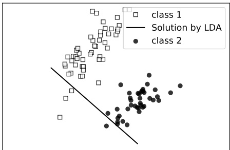

**Hình 22.4.** Ví dụ minh hoạ về LDA trong không gian hai chiều. Dữ liệu sẽ được chiếu lên đường thằng. Nếu chiếu lên đường thẳng này, dữ liệu của hai lớp sẽ nằm về hai phía của một điểm trên đường thẳng đó.

Nghiệm của bài toán là vector riêng ứng với trị riêng lớn nhất của $\mathbf { S } _ { W } ^ { - 1 } \mathbf { W } _ { B }$

```python
_, W = np.linalg.eig(np.linalg.inv(S_W).dot(S_B))
w = W[:,0]
print('w = ', w)
```

Kết quả:

```toml
w = [ 0.75091074 -0.66040371]
```

Đường thẳng có phương w được minh hoạ trong Hình 22.4. Ta thấy rằng nghiệm này hợp lý với dữ liệu của bài toán.

Để kiểm chứng độ chính xác của nghiệm tìm được, ta cùng so sánh nó với nghiệm tìm được bởi thư viện sklearn:

```python
from sklearn.discriminant_analysis import LinearDiscriminantAnalysis
X = np.concatenate((X0, X1))
y = np.array([0]*N0 + [1]*N1)
clf = LinearDiscriminantAnalysis()
clf.fit(X, y)

print('w_sklearn = ', clf.coef_[0]/np.linalg.norm(clf.coef_)) # normalize

w_sklearn =  [ 0.75091074 -0.66040371]
```

Nghiệm tìm theo công thức và nghiệm tìm theo thư viện là như nhau.

Một ví dụ khác so sánh PCA và LDA có thể được tìm thấy tại Comparison of LDA and PCA 2D projection of Iris dataset ([https://goo.gl/tWjAEs](https://goo.gl/tWjAEs)).

<!-- page: 299 -->

## 22.5. Thảo luận

• LDA là một phương pháp giảm chiều dữ liệu có sử dụng thông tin về label của dữ liệu. Vì vậy, LDA là một thuật toán học có giám sát.

• Ý tưởng cơ bản của LDA là tìm một không gian mới với số chiều nhỏ hơn không gian ban đầu sao cho hình chiếu của các điểm trong cùng lớp trong không gian mới gần nhau trong khi hình chiếu của các điểm thuộc các lớp khác nhau xa nhau.

• Trong PCA, số chiều của không gian mới có thể là bất kỳ số nào không lớn hơn số chiều và số điểm dữ liệu. Trong LDA, với bài toán có C lớp, số chiều của không gian mới không được vượt quá C − 1.

• Với bài toán có hai lớp, từ Hình 22.1 có thể thấy rằng hai lớp là tách biệt tuyến tính khi và chỉ khi tồn tại một đường thẳng và một điểm trên đường thẳng đó sao cho dữ liệu hình chiếu của hai lớp nằm về hai phía khác nhau của điểm đó.

• LDA hoạt động rất tốt nếu các lớp là tách biệt tuyến tính. Chất lượng mô hình giảm đi rõ rệt nếu các lớp không tách biệt tuyến tính. Điều này dễ hiểu vì dữ liệu chiếu lên mọi phương vẫn bị chồng lần, và việc tách biệt không thể thực hiện được như ở không gian ban đầu.

• Mặc dù LDA có nhiều hạn chế, ý tưởng về phương sai nội lớp nhỏ và phương sai liên lớp lớn được sử dụng rất nhiều trong các thuật toán phân loại [VM17, VM16, YZFZ11].

<!-- page: 300 -->

<!-- page: 301 -->

Tối ưu lồi

<!-- page: 302 -->

# Tập lồi và hàm lồi

## 23.1. Giới thiệu

## 23.1.1. Bài toán tối ưu

Các bài toán tối ưu đã thảo luận trong cuốn sách này đều là các bài toán tối ưu không ràng buộc (unconstrained optimization problem), tức tối ưu hàm mất mát mà không có điều kiện ràng buộc (constraint) nào về nghiệm. Tuy nhiên, không chỉ trong machine learning, cài bài toán tối ưu trên thực tế thường có rất nhiều ràng buộc khác nhau.

Trong toán tối ưu, một bài toán có ràng buộc thường được viết dưới dạng

$$
\begin{array}{r l r} \mathbf {x} ^ {*} = & & \arg \min _ {\mathbf {x}} f _ {0} (\mathbf {x}) \\ \text {thỏa mãn:} & & f _ {i} (\mathbf {x}) \leq 0, i = 1, 2, \ldots , m \\ & & h _ {j} (\mathbf {x}) = 0, j = 1, 2, \ldots , p \end{array}\tag{23.1}
$$

Trong đó, vector $\mathbf { x } = [ x _ { 1 } , x _ { 2 } , \ldots , x _ { n } ] ^ { T }$ được gọi là biến tối ưu (optimization variable). Hàm số $f _ { 0 } : \mathbb { R } ^ { n } \to \mathbb { R }$ được gọi là hàm mục tiêu (objective function)<sup>60</sup>. Các bất phương trình $f _ { i } ( \mathbf { x } )   < =   0 , i   =   1 , 2 , \ldots , m$ được gọi là bất phương trình ràng buộc (inequality constraint), và các hàm tương ứng $f _ { i } ( \mathbf { x } ) , i = 1 , 2 , \ldots$ , m được gọi là hàm bất phương trình ràng buộc (inequality constraint function). Các phương trình $h _ { j } ( \mathbf { x } )   =   0 , j   =   1 , 2 , \ldots , p$ được gọi là các phương trình ràng buộc (equality constraint), các hàm tương ứng là các hàm phương trình ràng buộc (equality constraint function).

<small><span class="docvortex-page-footnote" data-block-type="page_footnote" style="color:#6b7280">60 các hàm mục tiêu trong machine learning thường được gọi là hàm mất mát</span></small>

<!-- page: 303 -->

Ký hiệu domf là tập các điểm mà trên đó hàm số xác định, hay còn gọi là tập xác định (domain). Tập xác định của một bài toán tối ưu là giao của tập xác định tất cả các hàm liên quan:

$$
\mathcal {D} = \bigcap_ {i = 0} ^ {m} \mathbf {d o m} f _ {i} \cap \bigcap_ {j = 0} ^ {p} \mathbf {d o m} h _ {j}\tag{23.2}
$$

Một điểm $\mathbf { x } \in \mathcal { D }$ được gọi là điểm khả thi (feasible point) nếu nó thỏa mãn tất cả ràng buộc: $f _ { i } ( \mathbf { x } ) { \leq } 0 , i { = } 1 , 2 , \ldots , m ; h _ { j } ( \mathbf { x } ) { = } 0 , j { = } 1 , 2 , \ldots , p .$ Tập hợp các điểm khả thi được gọi là tập khả thi (feasible set) hoặc tập ràng buộc (constraint set). Như vậy, tập khả thi là một tập con của tập xác định. Mỗi điểm trong tập khả thi được gọi là một điểm khả thi (feasible point).

Bài toán (23.1) được gọi là khả thi (tương ứng bất khả thi) nếu tập khả thi của nó khác (tương ứng bằng) rỗng.

Chú ý:

• Nếu bài toán yêu cầu tìm giá trị lớn nhất thay vì nhỏ nhất của hàm mục tiêu, ta chỉ cần đổi dấu của $f _ { 0 } ( \mathbf { x } )$

• Nếu ràng buộc là lớn hơn hoặc bằng $( \geq )$ , tức $f _ { i } ( \mathbf { x } ) \geq b _ { i }$ , ta chỉ cần đổi dấu của ràng buộc là sẽ có điều kiện nhỏ hơn hoặc $\check { b { \check { a } } n g }   - f _ { i } ( { \bf x } ) \leq - b _ { i }$

• Các ràng buộc cũng có thể là lớn hơn (>) hoặc nhỏ hơn (<).

• Nếu ràng buộc là bằng nhau, tức $h _ { j } ( \mathbf { x } ) = 0$ , ta có thể viết nó dưới dạng hai bất phương trình $h _ { j } ( \mathbf { x } ) \leq 0 \mathrm { ~ v \text{a } - } h _ { j } ( \mathbf { x } ) \leq 0$

• Trong chương này, x, y được dùng chủ yếu để ký hiệu các biến số, không phải là dữ liệu như trong các chương trước. Các biến cần tối được ghi dưới dấu arg min. Khi viết một bài toán tối ưu, ta cần chỉ rõ biến nào cần được tối ưu, biến nào là cố định.

Nhìn chung, không có cách giải quyết tổng quát cho các bài toán tối ưu, thậm chí nhiều bài toán tối ưu chưa có lời giải hiểu quả. Hầu hết các phương pháp không chứng minh được nghiệm tìm được có phải là điểm tối ưu toàn cục hay không. Thay vào đó, nghiệm thường là các điểm cực trị địa phương. Trong nhiều trường hợp, các cực trị địa phương cũng mang lại những kết quả tốt.

Để bắt đầu nghiên cứu về tối ưu, chúng ta cần biết tới một mảng rất quan trọng có tên là tối ưu lồi (convex optimization), trong đó hàm mục tiêu là một hàm lồi (convex function), tập khả thi là một tập lồi (convex set). Những tính chất đặc biệt về cực trị địa phương và toàn cục của một hàm lồi khiến tối ưu lồi trở nên cực kỳ quan trọng. Trong chương này, chúng ta sẽ thảo luận định nghĩa và các

<!-- page: 304 -->

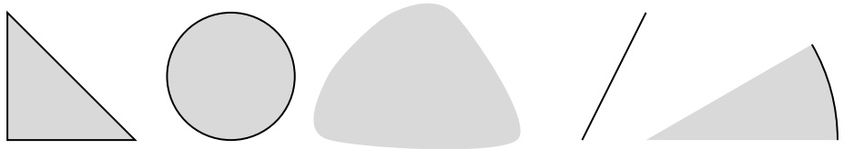

Hình 23.1. Các ví dụ về tập lồi

tính chất cơ bản của tập lồi và hàm lồi. Bài toán tối ưu lồi (convex optimization problem) sẽ được đề cập trong chương tiếp theo.

Trước khi đi sâu vào tập lồi và hàm lồi, xin nhắc lại các hàm liên quan: supremum và infimum.

## 23.1.2. Các hàm supremum và infimum

Xét một tập $\mathcal { C } \subset \mathbb { R }$ . Một số a được gọi là chặn trên (upper bound) của C nếu $x \leq a$ $\forall x   \in   { \mathcal { C } } .$ Tập các chặn trên của một tập hợp có thể là tập rỗng, ví dụ $\mathcal { C } \equiv \mathbb { R }$ , toàn bộ R, chỉ khi C =), hoặc nửa đoạn $[ b , + \infty )$ . Trong trường hợp cuối, số b được gọi là chặn trên nhỏ nhất (supremum) của C, được ký hiệu là sup C. Chúng ta cũng ký hiệu sup = −∞ và sup C = +∞ nếu C không bị chặn trên (unbounded above).

Tương tự, một số a được gọi là chặn dưới (lower bound) của C nếu $x \geq a ,$ ∀x $\in { \mathcal { C } } .$ Chặn dưới lớn nhất (infimum) của C được ký hiệu là inf C. Chúng ta cũng định nghĩa inf $= + \infty$ và inf $\mathcal { C } = - \infty$ nếu C không bị chặn dưới.

Nếu C có hữu hạn số phẩn tử thì max C = sup C và min C = inf C.

## 23.2. Tập lồi

## 23.2.1. Định nghĩa

Bạn đoc có thể đã biết đến khái niệm đa giác lồi. Hiểu một cách đơn giản, lồi (convex) là phình ra ngoài, hoặc nhô ra ngoài. Trong toán học, bằng phẳng cũng được coi là lồi.

Định nghĩa không chính thức của tập lồi: Một tập hợp được gọi là tập lồi (convex set) nếu mọi điểm trên đoạn thẳng nối hai điểm bất kỳ trong nó đều thuộc tập hợp đó.

Một vài ví dụ về tập lồi được cho trong Hình 23.1. Các hình với đường biên màu đen thể hiện việc biên cũng thuộc vào hình đó, biên màu trắng thể hiện việc biên đó không nằm trong hình. Đường thẳng hoặc đoạn thẳng cũng là một tập lồi theo định nghĩa phía trên.

<!-- page: 305 -->

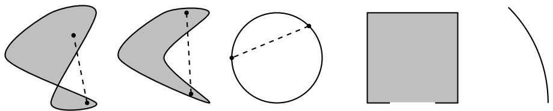

Hình 23.2. Các ví dụ về tập không lồi.

Một vài ví dụ thực tế:

• Giả sử một căn phòng có dạng hình lồi, nếu ta đặt một bóng đèn đủ sáng ở bất kỳ vị trí nào trên trần nhà, mọi điểm trong căn phòng đều được chiếu sáng.

• Nếu một đất nước có bản đồ dạng hình lồi thì đoạn thẳng nối hai thành phố bất kỳ của đất nước đó nằm trọn vẹn trong lãnh thổ của nó. Một cách lý tưởng, mọi đường bay trong đất nước đều được tối ưu vì chi phí bay thẳng ít hơn chi phí bay vòng hoặc qua không phận của nước khác. Bản đồ Việt Nam không có dạng lồi vì đường thẳng nối sân bay Nội Bài và Tân Sơn Nhất đi qua địa phận Campuchia.

Hình 23.2 minh hoạ một vài ví dụ về các tập không phải là tập lồi, nói gọn là tập không lồi (nonconvex set). Ba hình đầu tiên không phải lồi vì các đường nét đứt chứa nhiều điểm không nằm bên trong các tập đó. Hình thứ tư, hình vuông không có biên ở đáy, là tập không lồi vì đoạn thẳng nối hai điểm ở đáy có thể chứa phần ở giữa không thuộc tập đang xét. Một đường cong bất kỳ cũng là tập không lồi vì đường thẳng nối hai điểm bất kỳ không thuộc đường cong đó.

Để mô tả một tập lồi dưới dạng toán học, ta sử dụng:

## Định nghĩa 23.1: Tập hợp lồi

Một tập hợp C được gọi là một tập lồi (convex set) nếu với hai điểm bất kỳ $\mathbf { x } _ { 1 } , \mathbf { x } _ { 2 } \in \mathcal { C } ,$ điểm $\mathbf { x } _ { \theta } = \theta \mathbf { x } _ { 1 } + ( 1 - \theta ) \mathbf { x } _ { 2 }$ cũng nằm trong C với $0 \leq \theta \leq 1$

Tập hợp các điểm có dạng $\left( \theta \mathbf { x } _ { 1 } + ( 1 - \theta ) \mathbf { x } _ { 2 } \right)$ chính là đoạn thẳng nối hai điểm $\mathbf { x } _ { 1 }$ và $\mathbf { x } _ { 2 }$

Với định nghĩa này, toàn bộ không gian là một tập lồi vì đoạn thằng nào cũng nằm trong không gian đó. Tập rỗng cũng có thể coi là một trường hợp đặc biệt của tập lồi.

<!-- page: 306 -->

## 23.2.2. Các ví dụ về tập lồi

## Siêu mặt phẳng và nửa không gian

## Định nghĩa 23.2: Siêu mặt phẳng

Một siêu mặt phẳng, hay siêu phẳng (hyperplane) trong không gian n chiều là tập hợp các điểm thỏa mãn phương trình

$$
a _ {1} x _ {1} + a _ {2} x _ {2} + \dots + a _ {n} x _ {n} = \mathbf {a} ^ {T} \mathbf {x} = b\tag{23.3}
$$

với $b , a _ { i } , i = 1 , 2 , \ldots , n$ là các số thực.

Siêu phẳng là các tập lồi. Điều này có thể được suy ra từ Định nghĩa 23.1. Thật vậy, nếu

$$
\mathbf {a} ^ {T} \mathbf {x} _ {1} = \mathbf {a} ^ {T} \mathbf {x} _ {2} = b
$$

thì với $0 \leq \theta \leq 1$ bất kỳ, ta có $\begin{aligned} { \mathbf { a } ^ { T } \mathbf { x } _ { \theta } = \mathbf { a } ^ { T } ( \theta \mathbf { x } _ { 1 } + ( 1 - \theta ) \mathbf { x } _ { 2 } ) = \theta b + ( 1 - \theta ) b = b . } \\ \end{aligned}$ Tức là $\theta \mathbf { x } _ { 1 } + ( 1 - \theta ) \mathbf { x } _ { 2 }$ cũng là một điểm thuộc siêu phẳng đó.

## Định nghĩa 23.3: Nửa không gian

Một nửa không gian (halfspace) trong không gian n chiều là tập hợp các điểm thỏa mãn bất phương trình

$$
a _ {1} x _ {1} + a _ {2} x _ {2} + \dots + a _ {n} x _ {n} = \mathbf {a} ^ {T} \mathbf {x} \leq b
$$

với $b , a _ { i } , i = 1 , 2 , \ldots , n$ là các số thực.

Các nửa không gian cũng là các tập lồi, bạn đọc có thể kiểm tra theo Định nghĩa 23.1 và cách chứng minh tương tự như trên.

## Cầu chuẩn

## Định nghĩa 23.4: Cầu chuẩn

Cho một tâm $\mathbf { x } _ { c } ,$ một bán kính r và khoảng cách giữa các điểm được xác định bởi một chuẩn. Cầu chuẩn (norm ball) tương ứng là tập hợp các điểm thoả mãn

$$
B (\mathbf {x} _ {c}, r) = \left\{\mathbf {x} \mid \| \mathbf {x} - \mathbf {x} _ {c} \| \leq r \right\} = \left\{\mathbf {x} _ {c} + r \mathbf {u} \mid \| \mathbf {u} \| \leq 1 \right\}
$$

Khi chuẩn là $\ell _ { 2 }$ , cầu chuẩn là một hình tròn trong không gian hai chiều, hình cầu trong không gian ba chiều, hoặc siêu cầu trong các không gian nhiều chiều.

<!-- page: 307 -->

(a) p < 1: nonconvex sets

$$
\mathcal {C} _ {p} = \{(x, y) \mid (| x | ^ {p} + | y | ^ {p}) ^ {1 / p} \leq 1 \}
$$

(b) p ≥ 1: convex sets

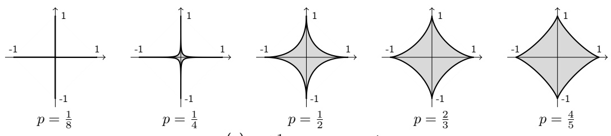

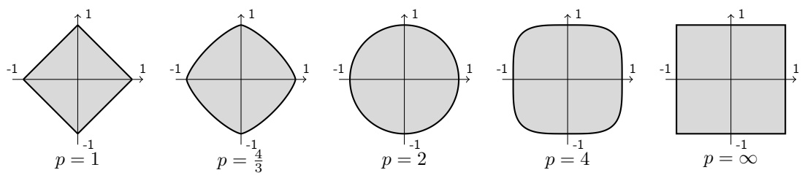

Hình 23.3. Hình dạng của các tập hợp bị chặn bởi các (a) giả chuẩn và (b) chuẩn.

Cầu chuẩn là tập lồi. Để chứng minh việc này, ta dùng Định nghĩa 23.1 và bất đẳng thức tam giác của chuẩn. Với $\mathbf { x } _ { 1 } , \mathbf { x } _ { 2 }$ bất kỳ thuộc $B ( \mathbf { x } _ { c } , r )$ và $0 \leq \theta \leq 1$ bất kỳ, xét $\mathbf { x } _ { \theta } = \theta \mathbf { x } _ { 1 } + ( 1 - \theta ) \mathbf { x } _ { 2 }$ , ta có:

$$
\begin{array}{r l} & {\| \mathbf {x} _ {\theta} - \mathbf {x} _ {c} \| = \| \theta (\mathbf {x} _ {1} - \mathbf {x} _ {c}) + (1 - \theta) (\mathbf {x} _ {2} - \mathbf {x} _ {c}) \|} \\ & {\qquad \leq \theta \| \mathbf {x} _ {1} - \mathbf {x} _ {c} \| + (1 - \theta) \| \mathbf {x} _ {2} - \mathbf {x} _ {c} \| \leq \theta r + (1 - \theta) r = r} \end{array}
$$

Vậy $\mathbf { x } _ { \theta } \in B ( \mathbf { x } _ { c } , r )$

Hình 23.3 minh họa tập hợp các điểm có tọa độ $( x , y )$ trong không gian hai chiều thỏa mãn:

$$
(| x | ^ {p} + | y | ^ {p}) ^ {1 / p} \leq 1\tag{23.4}
$$

Hàng trên là các tập tương ứng $0 < p < 1$ là các giả chuẩn; hàng dưới tương ứng $p \geq 1$ là các chuẩn thực sự. Có thể thấy rằng khi p nhỏ gần bằng không, tập hợp các điểm thỏa mãn bất đẳng thức (23.4) gần như nằm trên các trục tọa độ và bị chặn trong đoạn [0, 1]. Quan sát này sẽ giúp ích khi làm việc với giả chuẩn $\ell _ { 0 }$ Khi $p \to \infty$ , các tập hợp hội tụ về hình vuông. Đây cũng là một trong các lý do vì sao cần có điều kiện $p \geq 1$ khi định nghĩa chuẩn $\ell _ { p }$

## 23.2.3. Giao của các tập lồi

Giao của các tập lồi là một tập lồi. Điều này có thể nhận thấy trong Hình 23.4a. Giao của hai trong ba hoặc cả ba tập lồi đều là các tập lồi. Điều này có thể được chứng minh theo Định nghĩa 23.1: nếu $\mathbf { x } _ { 1 } , \mathbf { x } _ { 2 }$ thuộc giao của các tập lồi thì $\left( \theta \mathbf { x } _ { 1 } + ( 1 - \theta ) \mathbf { x } _ { 2 } \right)$ cũng thuộc giao của chúng.

<!-- page: 308 -->

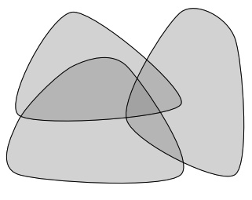

(a)

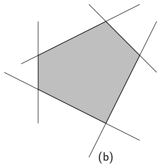

Hình 23.4. (a) Giao của các tập lồi là một tập lồi. (b) Giao của các siêu phẳng và nửa không gian là một tập lồi và được gọi là siêu đa diện (polyhedra).

Từ đó suy ra giao của các nửa không gian và nửa mặt phẳng là một tập lồi. Chúng là các đa giác lồi trong không gian hai chiều, đa diện lồi trong không gian ba chiều, và siêu đa diện trong không gian nhiều chiều. Giả sử có m nửa không gian và p siêu phẳng. Mỗi nửa không gian có thể được viết dưới dạng $\mathbf { a } _ { i } ^ { T } \mathbf { x } \leq b _ { i } , \; \forall i = 1 , 2 , \ldots , m$ Một siêu phẳng có thể được viết dưới dạng $\begin{array} { r } { \mathbf { c } _ { i } ^ { T } \mathbf { x } = d _ { i } , \forall i = 1 , 2 , \ldots , p . } \end{array}$

Vậy nếu đặt $\mathbf { A } \: = \: [ \mathbf { a } _ { 1 } , \mathbf { a } _ { 2 } , \ldots , \mathbf { a } _ { m } ] , \; \mathbf { b } \: = \: [ b _ { 1 } , b _ { 2 } , \ldots , b _ { m } ] ^ { T } , \mathbf { C } \: = \: [ \mathbf { c } _ { 1 } , \mathbf { c } _ { 2 } , \ldots , \mathbf { c } _ { p } ]$ và $\mathbf { d } { \mathrm { ~ = ~ } } [ d _ { 1 } , d _ { 2 } , \ldots , d _ { p } ] ^ { T }$ , ta có thể viết siêu đa diện dưới dạng tập hợp các điểm x thỏa mãn

$$
\mathbf {A} ^ {T} \mathbf {x} \preceq \mathbf {b}, \quad \mathbf {C} ^ {T} \mathbf {x} = \mathbf {d}
$$

trong $\mathrm { d \hat { o } \preceq t h \hat { e } }$ hiện mỗi phần tử trong vế trái nhỏ hơn hoặc bằng phần tử tương ứng trong vế phải.

## 23.2.4. Tổ hợp lồi và bao lồi

## Định nghĩa 23.5: Tổ hợp lồi

Một điểm được gọi là tổ hợp lồi (convex combination) của các điểm $\mathbf { x } _ { 1 } , \mathbf { x } _ { 2 } , \ldots , \mathbf { x } _ { k }$ nếu nó có thể được viết dưới dạng

$$
\mathbf {x} = \theta_ {1} \mathbf {x} _ {1} + \theta_ {2} \mathbf {x} _ {2} + \dots + \theta_ {k} \mathbf {x} _ {k} \text {với} \theta_ {1} + \theta_ {2} + \dots + \theta_ {k} = 1 \text {và} \theta_ {i} \geq 0, \forall i = 1, 2, \dots , k
$$

Bao lồi (convex hull) của một tập bất kỳ là tập toàn bộ các tổ hợp lồi của tập hợp đó. Bao lồi của một tập bất kỳ là một tập lồi. Bao lồi của một tập lồi là chính nó. Bao lồi của một tập hợp là tập lồi nhỏ nhất chứa tập hợp đó. Khái niệm nhỏ nhất được hiểu là mọi tập lồi chứa toàn bộ các tổ hợp lồi đều chứa bao lồi của tập hợp đó.

Nhắc lại khái niệm tách biệt tuyến tính đã sử dụng nhiều trong cuốn sách. Hai tập hợp được gọi là tách biệt tuyến tính nếu bao lồi của chúng không giao nhau.

<!-- page: 309 -->

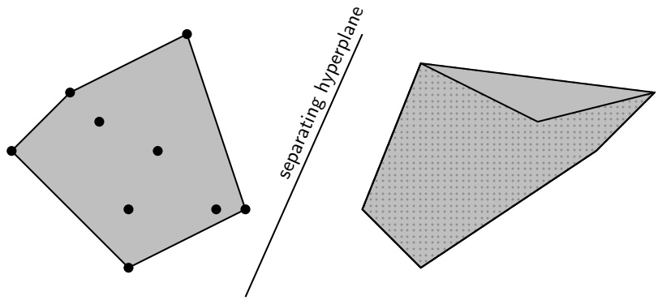

Hình 23.5. Trái: Bao lồi của các điểm màu đen là đa giác lồi nhỏ nhất chứa toàn bộ các điểm này. Phải: Bao lồi của đa giác lõm nền chấm là hợp của nó và tam giác màu xám phía trên. Hai bao lồi không giao nhau này có thể được phân tách hoàn toàn bằng một siêu phẳng (trong trường hơp này là một đường thẳng).

Trong Hình 23.5, bao lồi của các điểm màu đen là vùng màu xám bao bởi các đa giác lồi. Trong Hình 23.5 bên phải, bao lồi của đa giác lõm nền chấm là hợp của nó và phần tam giác màu xám.

## Định lý 23.1: Siêu phẳng phân chia

Hai tập lồi không rỗng C, D không giao nhau khi và chỉ khi tồn tại một vector a và một số b sao cho

$$
\mathbf {a} ^ {T} \mathbf {x} \leq b, \forall \mathbf {x} \in \mathcal {C}, \quad \mathbf {a} ^ {T} \mathbf {x} \geq b, \forall \mathbf {x} \in \mathcal {D}
$$

Tập hợp tất cả các điểm x thỏa mãn $\mathbf { a } ^ { T } \mathbf { x }   =   b$ là một siêu phẳng. Siêu phẳng này được gọi là siêu phẳng phân chia (separating hyperplane).

Ngoài ra, còn nhiều tính chất thú vị của các tập lồi và các phép toán bảo toàn chính chất lồi của một tập hợp, bạn đọc có thể đọc thêm Chương 2 của cuốn Convex Optimization [BV04].

## 23.3. Hàm lồi

## 23.3.1. Định nghĩa

Trước hết ta xem xét các hàm một biến với đồ thị của nó là một đường trong một mặt phẳng. Một hàm số được gọi là lồi (convex) nếu tập xác định của nó là một tập lồi và đoạn thẳng nối hai điểm bất kỳ trên đồ thị hàm số đó nằm về phía trên hoặc nằm trên đồ thị (xem Hình 23.6).

<!-- page: 310 -->

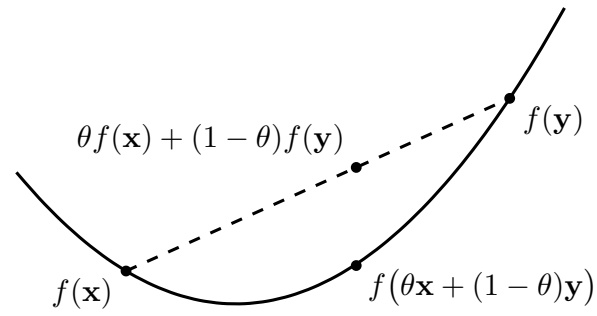

**Hình 23.6.** Định nghĩa hàm lồi. Diễn đạt bằng lời, một hàm số là lồi nếu đoạn thẳng nối hai điểm bất kỳ trên đồ thị của nó không nằm phía dưới đồ thị đó.

$$
\theta f (\mathbf {x}) + (1 - \theta) f (\mathbf {y}) \geq f \big (\theta \mathbf {x} + (1 - \theta) \mathbf {y} \big)
$$

## Định nghĩa 23.6: Hàm lồi

Một hàm số $f : \mathbb { R } ^ { n } \to \mathbb { R }$ được gọi là một hàm lồi (convex function) nếu domf là một tập lồi, và:

$$
f (\theta \mathbf {x} + (1 - \theta) \mathbf {y}) \leq \theta f (\mathbf {x}) + (1 - \theta) f (\mathbf {y})
$$

với mọi x, y ∈ domf, $0 \leq \theta \leq 1$

Điều kiện domf là một tập lồi rất quan trọng. Nếu không có điều kiện này, tồn tại những θ mà $\theta \mathbf { x } _ { 1 } + ( 1 - \theta ) \mathbf { x } _ { 2 }$ không thuộc domf và $f ( \theta \mathbf { x } + ( 1 - \theta ) \mathbf { y } )$ không xác định.

Một hàm số f được gọi là hàm lõm (concave fucntion) nếu −f là một hàm lồi. Một hàm số có thể không thuộc hai loại trên. Các hàm tuyến tính vừa lồi vừa lõm.

## Định nghĩa 23.7: Hàm lồi chặt

Một hàm số $f : \mathbb { R } ^ { n } \to \mathbb { R }$ được gọi là hàm lồi chặt (strictly convex function) nếu domf là một tập lồi, và

$$
f (\theta \mathbf {x} + (1 - \theta) \mathbf {y}) <   \theta f (\mathbf {x}) + (1 - \theta) f (\mathbf {y})
$$

$\forall \mathbf { x } , \mathbf { y } \in \mathrm { d o m } f , \mathbf { x } \neq \mathbf { y } , 0 < \theta < 1$ (chỉ khác hàm lồi ở dấu nhỏ hơn).

Tương tự với định nghĩa hàm lõm chặt (stricly concave function).

Nếu một hàm số là lồi chặt và có điểm cực trị, thì điểm cực trị đó là duy nhất và cũng là cực trị toàn cục.

<!-- page: 311 -->

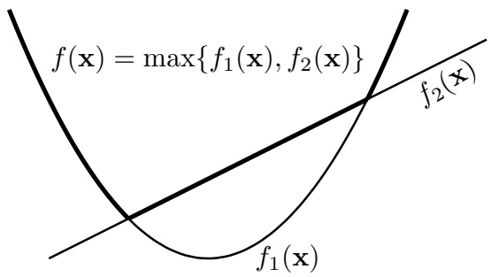

Hình 23.7. Ví dụ về Pointwise maximum. Maximum của các hàm lồi là một hàm lồi.

## 23.3.2. Các tính chất cơ bản

• Nếu $f ( \mathbf { x } )$ là một hàm lồi thì $a f ( \mathbf { x } )$ cũng lồi khi $a > 0$ và lõm khi $a < 0$ . Điều này có thể suy ra trực tiếp từ định nghĩa.

• Tổng của hai hàm lồi là một hàm lồi, với tập xác định là giao của hai tập xác định của hai hàm đã cho (nhắc lại rằng giao của hai tập lồi là một tập lồi).

• Hàm max và sup tại từng điểm: Nếu các hàm số $f _ { 1 } , f _ { 2 } , \ldots , f _ { m }$ lồi thì

$$
f (\mathbf {x}) = \max \{f _ {1} (\mathbf {x}), f _ {2} (\mathbf {x}), \dots , f _ {m} (\mathbf {x}) \}
$$

cũng là lồi trên dom $f = \bigcap _ { i = 1 } ^ { m } \mathbf { d o m } f _ { i }$ . Hàm max cũng có thể thay thế bằng hàm sup. Tính chất này có thể được chứng minh theo Định nghĩa 23.6. Hình 23.7 minh hoạ tính chất này. Các hàm $f _ { 1 } ( \mathbf { x } ) , f _ { 2 } ( \mathbf { x } )$ là các hàm lồi. Đường nét đậm chính là đồ thị của hàm số $f ( \mathbf { x } ) = \operatorname* { m a x } ( f _ { 1 } ( \mathbf { x } ) , f _ { 2 } ( \mathbf { x } ) )$ . Mọi đoạn thẳng nối hai điểm bất kì trên đường này đều không nằm phía dưới nó.

## 23.3.3. Ví dụ

## Các hàm một biến

Ví dụ về hàm lồi:

• Hàm $y = a x + b$ là một hàm lồi vì đoạn thẳng nối hai điểm bất kỳ trên đường thẳng đó đều không nằm phía dưới đường thẳng đó.

• Hàm $y = e ^ { a x }$ với $a \in \mathbb { R }$ bất kỳ.

• Hàm $y = x ^ { a }$ trên tập các số thực dương và $a \geq 1$ hoặc $a \leq 0$

• Hàm entropy âm (negative entropy) y = x log x trên tập các số thực dương.

Hình 23.8 minh hoạ đồ thị của một số hàm lồi thường gặp với biến một chiều.

<!-- page: 312 -->

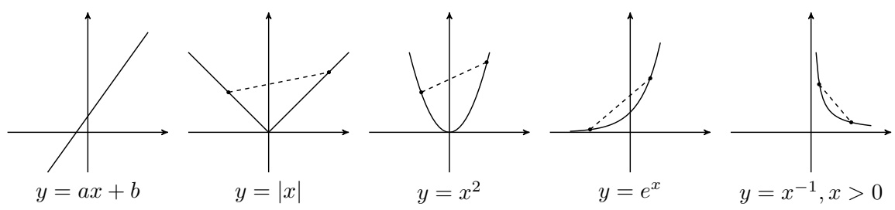

Hình 23.8. Ví dụ về các hàm lồi một biến.

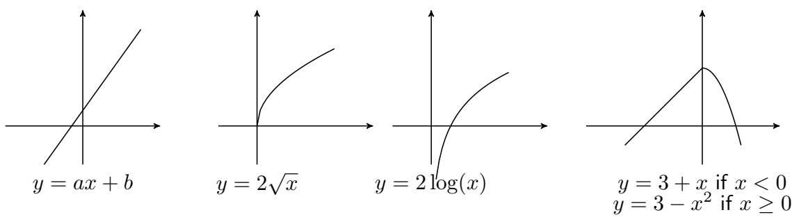

Hình 23.9. Ví dụ về các hàm lõm một biến.

Ví dụ về hàm lõm:

• Hàm $y = ax + b$ là một concave function vì −y là một convex function.

• Hàm $y = x ^ { a }$ trên tập số dương và $0 \leq a \leq 1$

• Hàm logarithm $y = \log ( x )$ trên tập các số dương.

Hình 23.9 minh hoạ đồ thị của một vài hàm số concave.

## Hàm affine

Hàm affine là tổng của một hàm tuyến tính và một hằng số, tức là các hàm có dạng $f ( \mathbf { x } ) = \mathbf { a } ^ { T } \mathbf { x } + b$

Khi biến là một ma trận X, các hàm affine được định nghĩa:

$$
f (\mathbf {X}) = \mathrm{trace} (\mathbf {A} ^ {T} \mathbf {X}) + b
$$

trong đó, A là một ma trận có cùng kích thước như X để đảm bảo phép nhân ma trận thực hiện được và kết quả là một ma trận vuông. Các hàm affine vừa lồi vừa lõm.

<!-- page: 313 -->

## Dạng toàn phương

Đa thức bậc hai một biến có dạng $f ( x ) = a x ^ { 2 } + b x + c$ là lồi nếu $a > 0$ , là lõm nếu $a < 0$

Khi biến là một vector $\mathbf { x } = [ x _ { 1 } , x _ { 2 } , \ldots , x _ { n } ]$ , dạng toàn phương (quadratic form) là một hàm số có dạng

$$
f (\mathbf {x}) = \mathbf {x} ^ {T} \mathbf {A} \mathbf {x} + \mathbf {b} ^ {T} \mathbf {x} + c
$$

với A là một ma trận đối xứng và x là vector có chiều phù hợp.

Nếu A là một ma trận nửa xác định dương thì $f ( \mathbf { x } )$ là một hàm lồi. Nếu A là một ma trận nửa xác định âm, $f ( \mathbf { x } )$ là một hàm lõm.

Nhắc lại hàm mất mát trong hồi quy tuyến tính:

$$
\begin{array}{r} \mathcal {L} (\mathbf {w}) = \frac {1}{2 N} \| \mathbf {y} - \mathbf {X} ^ {T} \mathbf {w} \| _ {2} ^ {2} = \frac {1}{2 N} (\mathbf {y} - \mathbf {X} ^ {T} \mathbf {w}) ^ {T} (\mathbf {y} - \mathbf {X} ^ {T} \mathbf {w}) \\ = \frac {1}{2 N} \mathbf {w} ^ {T} \mathbf {X} \mathbf {X} ^ {T} \mathbf {w} - \frac {1}{N} \mathbf {y} ^ {T} \mathbf {X} ^ {T} \mathbf {w} + \frac {1}{2 N} \mathbf {y} ^ {T} \mathbf {y}. \end{array}
$$

Vì $\mathbf { X } \mathbf { X } ^ { T }$ là một ma trận nửa xác định dương, hàm mất mát của hồi quy tuyến tính là một hàm lồi.

## Chuẩn

Mọi hàm số bất kỳ thỏa mãn ba điều kiện của chuẩn đều là hàm số lồi. Việc này có thể được trực tiếp suy ra từ bất đẳng thức tam giác của một chuẩn.

Hình 23.10 minh hoạ hai ví dụ về bề mặt của chuẩn $\ell _ { 1 }$ và $\ell _ { 2 }$ trong không gian hai chiều (chiều thứ ba là giá trị của hàm số). Nhận thấy các bề mặt này đều có một đáy duy nhất tại gốc tọa độ (đây chính là điều kiện đầu tiên của chuẩn).

Hai hàm tiếp theo là ví dụ về các hàm không lồi hoặc lõm. Hàm thứ nhất $f(x,y)=$ $x ^ { 2 } - y ^ { 2 }$ là một hyperbolic, hàm thứ hai $\begin{array} { r } { f ( x , y ) = \frac { 1 } { 1 0 } ( x ^ { 2 } + 2 y ^ { 2 } - 2 \sin ( x y ) ) } \end{array}$ . Các bề mặt của hai hàm này được minh họa trên Hình 23.11

## 23.3.4. Đường đồng mức

Để khảo sát tính lồi của các bề mặt trong không gian ba chiều, việc minh hoạ trực tiếp như các ví dụ trên đây có thể khó tưởng tượng hơn. Một phương pháp thường được sử dụng là dùng các đường đồng mức (contour hay level set). Đường đồng mức là cách mô tả các mặt ở không gian ba chiều trong không gian hai chiều. Ở đó, các điểm thuộc cùng một đường tương ứng với các điểm làm cho hàm số có giá trị như nhau. Trong Hình 23.10 và Hình 23.11, các đường nối liền ở mặt phẳng đáy 0xy chính là các đường đồng mức. Nói cách khác, nếu cắt bề mặt bởi các mặt phẳng song song với đáy, ta sẽ thu được các đường đồng mức.

<!-- page: 314 -->

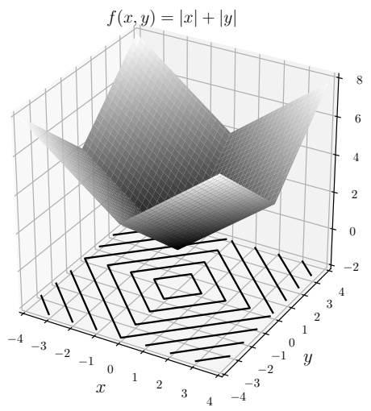

(a) Norm 1

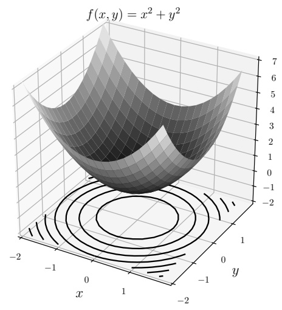

(b) Norm 2

Hình 23.10. Ví dụ về mặt của các chuẩn của vector hai chiều.

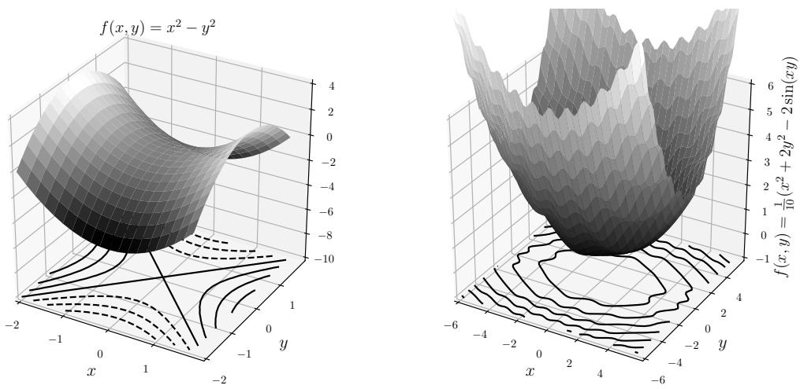

Hình 23.11. Ví dụ về các hàm hai biến không lồi.

Khi khảo sát tính lồi hoặc tìm điểm cực trị của một hàm hai biến, người ta thường vẽ các đường đồng mức thay vì các bề mặt trong không gian ba chiều. Hình 23.12 minh hoạ một vài ví dụ về đường đồng mức. Ở hàng trên, các đường đồng mức là các đường khép kín. Khi các đường này co dần lại ở một điểm thì điểm đó là điểm cực trị. Với các hàm lồi như trong ba ví dụ này, chỉ có một điểm cực trị và đó cũng là điểm cực trị toàn cục. Nếu để ý, bạn sẽ thấy các đường khép kín tạo thành biên của các tập lồi. Ở hàng dưới, các đường không khép kín. Hình 23.12d minh hoạ các đường đồng mức của một hàm tuyến tính $f ( x , y )   =   x + y ,$ và là một hàm lồi. Hình 23.12e minh hoạ các đường đồng mức của một hàm lồi (chúng ta sẽ sớm chứng minh) nhưng các đường đồng mức không kín. Hàm này có chứa log nên tập xác định là góc phần tư thứ nhất tương ứng với tọa độ dương (chú ý

<!-- page: 315 -->

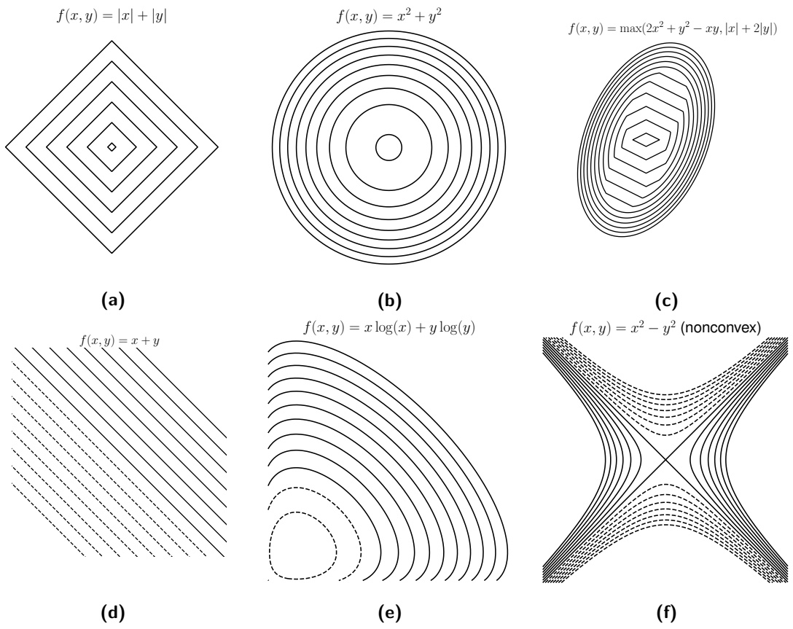

Hình 23.12. Ví dụ về đường đồng mức. Hàng trên: các đường đồng mức càng gần tâm tương ứng với các giá trị càng nhỏ. Hàng dưới: các đường nét đứt tương ứng với các giá trị âm, các đường nét liền tương ứng với các giá trị không âm. Các hàm số đều lồi ngoại trừ hàm số trong hình f).

rằng tập hợp điểm có tọa độ dương cũng là một tập lồi vì nó là một siêu đa diện). Các đường không kín này nếu kết hợp với trục Ox, Oy sẽ tạo thành biên của các tập lồi. Hình 23.12f minh hoạ các đường đồng mức của một hàm hyperbolic, hàm này không phải là một hàm lồi.

## 23.3.5. Tập dưới mức α

## Định nghĩa 23.8: Tập dưới mức α

Tập dưới mức α (α-sublevel set) của một hàm số $f : \mathbb { R } ^ { n } \to \mathbb { R }$ là một tập hợp được định nghĩa bởi

$$
\mathcal {C} _ {\alpha} = \{\mathbf {x} \in \mathbf {d o m} f \mid f (\mathbf {x}) \leq \alpha \}
$$

Diễn đạt bằng lời, một tập dưới mức α của một hàm số f(.) là tập hợp các điểm trong tập xác định của f(.) mà tại đó hàm số đạt giá trị không lớn hơn α.

<!-- page: 316 -->

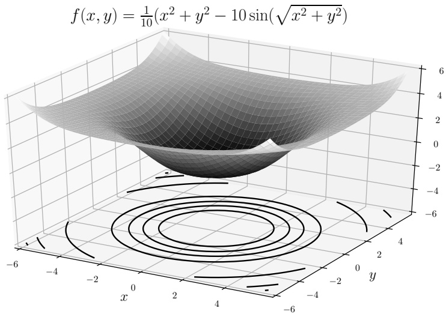

Hình 23.13. Mọi tập dưới mức α là tập lồi nhưng hàm số là không lồi.

Quay lại với Hình 23.12, hàng trên, tập dưới mức α là các hình lồi được bao bởi đường đồng mức. Trong Hình 23.12d, tập dưới mức α là phần nửa mặt phẳng phía dưới xác định bởi các đường thẳng đồng mức. Trong Hình 23.12e, tập dưới mức α là vùng bị giới hạn bởi các trục tọa độ và các đường đường đồng mức. Trong Hình 23.12f, tập dưới mức α hơi khó tưởng tượng hơn. Với $\alpha > 0$ , đường đồng mức là các đường nét liền, các tập dưới mức α tương ứng là phần nằm giữa các đường nét liền này. Có thể nhận thấy các vùng này không phải là tập lồi.

## Định lý 23.2

Nếu một hàm số là lồi thì mọi tập dưới mức α của nó lồi. Điều ngược lại chưa chắc đã đúng, tức nếu các tập dưới mức α của một hàm số là lồi thì hàm số đó chưa chắc đã lồi.

Điều này chỉ ra rằng nếu tồn tại một giá trị α sao cho một tập dưới mức α của một hàm số là không lồi, thì hàm số đó không lồi. Vì vậy, hàm hyperbolic không phải là một hàm lồi. Các ví dụ trong Hình 23.12, trừ Hình 23.12f, đều tương ứng với các hàm lồi.

Xét ví dụ về việc một hàm số không lồi nhưng mọi tập dưới mức α đều lồi. Hàm $f ( x , y ) = - e ^ { x + y }$ có mọi tập dưới mức α là một nửa mặt phẳng (lồi), nhưng nó không phải là một hàm lồi (trong trường hợp này nó là một hàm lõm).

Hình 23.13 là một ví dụ khác về việc một hàm số có mọi tập dưới mức α lồi nhưng không phải là một hàm lồi. Mọi tập dưới mức α− của hàm số này đều là hình tròn – lồi, nhưng hàm số đó không lồi. Vì có thể tìm được hai điểm trên mặt này sao cho đoạn thẳng nối chúng nằm hoàn toàn phía dưới của mặt. Chẳng

<!-- page: 317 -->

hạn, đoạn thẳng nối một điểm ở cánh và một điểm ở đáy không nằm hoàn toàn phía trên của mặt. Những hàm số có tập xác định là một tập lồi và có mọi tập dưới mức α là lồi được gọi là hàm tựa lồi (quasiconvex function). Mọi hàm lồi đều là tựa lồi nhưng ngược lại không đúng. Định nghĩa chính thức của hàm tựa lồi được phát biểu như sau

## Định nghĩa 23.9: Hàm tựa lồi

Một hàm số $f : { \mathcal { C } } \to \mathbb { R }$ với C là một tập con lồi của $\mathbb { R } ^ { n }$ được gọi là tựa $l \hat { \partial } i$ (quasiconvex) nếu với mọi $\mathbf { x } , \mathbf { y } \in \mathcal { C }$ và mọi $\theta \in [ 0 , 1 ]$ , ta có:

$$
f (\theta \mathbf {x} + (1 - \theta) \mathbf {y}) \leq \max \{f (\mathbf {x}), f (\mathbf {y}) \}
$$

## 23.3.6. Kiểm tra tính chất lồi dựa vào đạo hàm

Ta có thể nhận biết một hàm số khả vi có là hàm lồi hay không dựa vào các đạo hàm bậc nhất hoặc bậc hai của nó. Giả sử rằng các đạo hàm đó tồn tại.

## Điều kiện bậc nhất

Trước hết chúng ta định nghĩa phương trình (mặt) tiếp tuyến của một hàm số f khả vi tại một điểm nằm trên đồ thị (mặt) của hàm số đó $( \mathbf { x } _ { 0 } , f ( \mathbf { x } _ { 0 } )$ . Với hàm một biến, phương trình tiếp tuyến tại điểm có tọa độ $( x _ { 0 } , f ( x _ { 0 } ) )$ là

$$
y = f ^ {\prime} (x _ {0}) (x - x _ {0}) + f (x _ {0})
$$

Với hàm nhiều biến, đặt $\nabla f ( \mathbf { x } _ { 0 } )$ là gradient của hàm số f tại điểm $\mathbf { x } _ { 0 }$ , phương trình mặt tiếp tuyến được cho bởi:

$$
y = \nabla f (\mathbf {x} _ {0}) ^ {T} (\mathbf {x} - \mathbf {x} _ {0}) + f (\mathbf {x} _ {0})
$$

## Điều kiện bậc nhất

Giả sử hàm số f có tập xác định là lồi và có đạo hàm tại mọi điểm trên tập xác định đó. Khi đó, hàm số f lồi khi và chỉ khi với mọi $\mathbf { x } , \mathbf { x } _ { 0 }$ trên tập xác định, ta có:

$$
f (\mathbf {x}) \geq f (\mathbf {x} _ {0}) + \nabla f (\mathbf {x} _ {0}) ^ {T} (\mathbf {x} - \mathbf {x} _ {0})\tag{23.5}
$$

Một hàm số là lồi chặt nếu dấu bằng trong (23.5) xảy ra khi và chỉ khi $\mathbf { x } = \mathbf { x } _ { 0 }$

Một cách trực quan hơn, một hàm số là lồi nếu mặt tiếp tuyến tại một điểm bất kỳ không nằm phía trên mặt đồ thị của hàm số đó.

<!-- page: 318 -->

f khả vi và có tập xác định lồi

f là hàm lồi nếu và chỉ nếu $\begin{aligned} { f ( \mathbf { x } ) \geq f ( \mathbf { x } _ { 0 } ) + \nabla f ( \mathbf { x } _ { 0 } ) ^ { T } ( \mathbf { x } - \mathbf { x } _ { 0 } ) , \forall \mathbf { x } , \mathbf { x } _ { 0 } \in } \\ \end{aligned}$ **dom**f

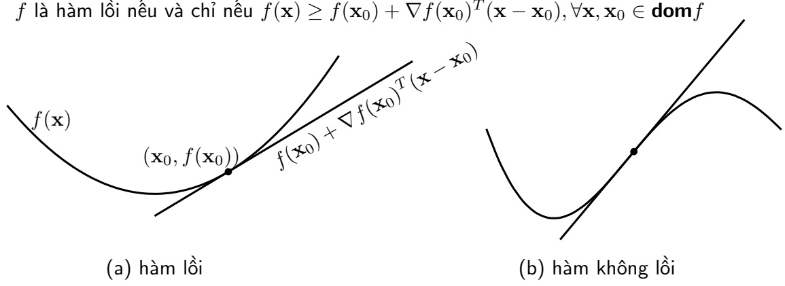

Hình 23.14. Kiểm tra tính lồi dựa vào đạo hàm bậc nhất. Trái: hàm lồi vì tiếp tuyến tại mọi điểm đều nằm phía dưới đồ thị của hàm số, phải: hàm không lồi.

Hình 23.14 minh hoạ đồ thị của một hàm lồi và một hàm không lồi. Hình 23.14a mô tả một hàm lồi. Hình 23.14b mô tả một hàm không lồi vì đồ thị của nó không hoàn toàn nằm phía trên đường thẳng tiếp tuyến.

Ví dụ: $f ( \mathbf { x } ) = \mathbf { x } ^ { T } \mathbf { A } \mathbf { x }$ là một hàm lồi nếu A là một ma trận nửa xác định dương.

Chứng minh: Đạo hàm bậc nhất của f(x) là $\nabla f ( \mathbf { x } ) = 2 \mathbf { A } \mathbf { x }$ Vậy điều kiện bậc nhất có thể viết dưới dạng (chú ý rằng A là một ma trận đối xứng):

$$
\begin{array}{c} \mathbf {x} ^ {T} \mathbf {A} \mathbf {x} \geq 2 (\mathbf {A} \mathbf {x} _ {0}) ^ {T} (\mathbf {x} - \mathbf {x} _ {0}) + \mathbf {x} _ {0} ^ {T} \mathbf {A} \mathbf {x} _ {0} \\ \Leftrightarrow \mathbf {x} ^ {T} \mathbf {A} \mathbf {x} \geq 2 \mathbf {x} _ {0} ^ {T} \mathbf {A} \mathbf {x} - \mathbf {x} _ {0} ^ {T} \mathbf {A} \mathbf {x} _ {0} \\ \Leftrightarrow (\mathbf {x} - \mathbf {x} _ {0}) ^ {T} \mathbf {A} (\mathbf {x} - \mathbf {x} _ {0}) \geq 0 \end{array}
$$

Bất đẳng thức cuối cùng đúng dựa trên định nghĩa của ma trận nửa xác định dương. Vậy hàm số $f ( \mathbf { x } ) = \mathbf { x } ^ { T } \mathbf { A } \mathbf { x }$ là một hàm lồi.

## Điều kiện bậc hai

Với hàm có đối số là một vector có chiều d, đạo hàm bậc nhất của nó là một vector cũng có chiều d. Đạo hàm bậc hai của nó là một ma trận vuông có chiều $d \times d .$

## Điều kiện bậc hai

Một hàm số f có đạo hàm bậc hai là hàm lỗi nếu tập xác định của nó lồi và Hesse là một ma trận nửa xác định dương với mọi x trong tập xác định:

$$
\nabla^ {2} f (\mathbf {x}) \succeq 0.
$$

<!-- page: 319 -->

Nếu Hesse của một hàm số là một ma trận xác định dương thì hàm số đó lồi chặt. Tương tự, nếu Hesse là một ma trận xác định âm thì hàm số đó lõm chặt.

Với hàm số một biến f(x), điều kiện này tương đương với $f ( x ) \geq 0$ với mọi x thuộc tập xác định (và tập xác định là lồi).

Ví dụ:

• Hàm $f ( x )   =   x \log ( x )$ là lồi chặt vì tập xác định $x   >   0$ là một tập lồi và $f ( x ) = 1 / x$ là một số dương với mọi x thuộc tập xác định.

• Xét hàm số hai biến: $f ( x , y ) = x \log ( x ) + y \log ( y )$ trên tập các giá trị dương của $x \mathrm { v \hat { a } } y$ . Hàm số này có đạo hàm bậc nhất $[ \log ( x )   +   1 , \log ( y )   +   1 ] ^ { T }$ và Hesse $\left[ \begin{matrix} { 1 / x \quad 0 } \\ { 0 \quad 1 / y } \\ \end{matrix} \right]$ là một ma trận đường chéo xác định dương. Vậy đây là một hàm lồi chặt.

• Hàm $f ( x )   =   x ^ { 2 }   +   5 \sin ( x )$ không là hàm lồi vì đạo hàm bậc hai $f^{\prime\prime}(x)   =$ $2 - 5 \sin ( x )$ có thể nhận cả giá trị âm và dương.

• Hàm entropy chéo là một hàm lồi chặt. Xét hai xác suất x và $1 - x \left( 0 < x < 1 \right)$ và a là một hằng số thuộc đoạn $[ 0 , 1 ] \colon f ( x ) = - ( a \operatorname { l o g } ( x ) + ( 1 - a ) \operatorname { l o g } ( 1 - x ) )$ có đạo hàm bậc hai $\frac{a}{x^{2}} + \frac{1 - a}{(1 - x)^{2}}$ là một số dương.

• Nếu A là một ma trận xác định dương thì $\begin{array} { r } { f ( \mathbf { x } ) = \frac { 1 } { 2 } \mathbf { x } ^ { T } \mathbf { A } \mathbf { x } } \end{array}$ là lồi vì A chính là Hesse của nó.

Ngoài ra còn nhiều tính chất thú vị của các hàm lồi, mời bạn đọc thêm Chương 3 của cuốn Convex Optimization [BV04].

## 23.4. Tóm tắt

• Machine learning và tối ưu có quan hệ mật thiết với nhau. Trong tối ưu, tối ưu lồi là quan trọng nhất.

• Mọi đoạn thẳng nối hai điểm bất kỳ của một tập lồi nằm trọn vẹn trong tập đó. Giao điểm của các tập lồi tạo thành một tập lồi.

• Một hàm số là lồi nếu đoạn thẳng nối hai điểm bất kỳ trên đồ thì hàm số đó không nằm phía dưới đồ thị đó.

• Một hàm số khả vi là lồi nếu tập xác định của nó là lồi và mặt tiếp tuyến tại một điểm bất kỳ không nằm phía trên đồ thị của hàm số đó.

• Các chuẩn là các hàm lồi, được sử dụng nhiều trong tối ưu.

<!-- page: 320 -->

# Bài toán tối ưu lồi

## 24.1. Giới thiệu

Chúng ta cùng bắt đầu bằng ba bài toán tối ưu khá gần với thực tế.

## 24.1.1. Bài toán nhà xuất bản

Bài toán: Một nhà xuất bản (NXB) nhận được hai đơn hàng của cuốn “Machine Learning cơ bản”, 600 bản tới Thái Bình và 400 bản tới Hải Phòng. NXB hiện có 800 cuốn ở kho Nam Định và 700 cuốn ở kho Hải Dương. Giá chuyển phát một cuốn sách từ Nam Định tới Thái Bình là 50k (VND), từ Nam Định tới Hải Phòng là 100k; từ Hải Dương tới Thái Bình là 150k, từ Hải Dương tới Hải Phòng là 40k. Công ty đó nên phân phối mỗi kho chuyển bao nhiêu cuốn tới mỗi địa điểm để tốn ít chi phí chuyển phát nhất?

## Phân tích

Ta xây dựng bảng số lượng sách chuyển từ nguồn tới đích như sau:

| Nguồn | Đích | Đơn giá (×10k) | Số lượng |
| --- | --- | --- | --- |
| Nam Định | Thái Bình | 5 | x |
| Nam Định | Hải Phòng | 10 | y |
| Hải Dương | Thái Bình | 15 | z |
| Hải Dương | Hải Phòng | 4 | t |

Tổng chi phí (hàm mục tiêu) là $f(x,y,z,t)=5x+10y+15z+4t$ . Các điều kiện ràng buộc viết dưới dạng biểu thức toán học như sau:

<!-- page: 321 -->

• Chuyển 600 cuốn tới Thái Bình: x + z = 600.

• Chuyển 400 cuốn tới Hải Phòng: y + t = 400.

• Lấy từ kho Nam Định không quá 800: $x + y \leq 8 0 0 .$

• Lấy từ kho Hải Dương không quá $700: \; z + t \leq 700.$

• x, y, z, t là các số tự nhiên. Ràng buộc là số tự nhiên sẽ khiến cho bài toán rất khó giải nếu số lượng biến lớn. Với bài toán này, giả sử rằng x, y, z, t là các số thực dương. Nghiệm sẽ được làm tròn tới số tự nhiên gần nhất.

Vậy ta cần giải bài toán tối ưu sau đây:

Bài toán NXB<sup>61</sup>

$$
\begin{array}{l} (x, y, z, t) = \arg \min _ {x, y, z, t} 5 x + 1 0 y + 1 5 z + 4 t \\ \text {tho\grave{a} \tilde{m}\tilde{a} n:} x + z = 6 0 0 \\ \quad y + t = 4 0 0 \\ \quad x + y \leq 8 0 0 \\ \quad z + t \leq 7 0 0 \\ \quad x, y, z, t \geq 0 \end{array}\tag{24.1}
$$

Nhận thấy rằng hàm mục tiêu là một hàm tuyến tính của các biến x, y, z, t. Các điều kiện ràng buộc đều tuyến tính vì chúng có dạng siêu phẳng hoặc nửa không gian. Bài toán tối ưu với cả hàm mục tiêu và ràng buộc đều tuyến tính được gọi là quy hoạch tuyến tính (linear programming – LP). Dạng tổng quát và cách thức lập trình để giải một bài toán quy hoạch tuyến tính sẽ được cho trong phần sau của chương.

## 24.1.2. Bài toán canh tác

Bài toán: Một anh nông dân có tổng cộng 10 ha (hecta) đất canh tác. Anh dự tính trồng cà phê và hồ tiêu trên diện tích đất này với tổng chi phí cho việc trồng không quá 16 tr (triệu đồng). Chi phí để trồng cà phê là 2 tr/ha, hồ tiêu là 1 tr/ha. Thời gian trồng cà phê là 1 ngày/ha và hồ tiêu là 4 ngày/ha; trong khi anh chỉ có thời gian tổng cộng 32 ngày. Sau khi trừ tất cả chi phí (bao gồm chi phí trồng cây), mỗi ha cà phê mang lại lợi nhuận 5 tr, mỗi ha hồ tiêu mang lại lợi nhuận 3 tr. Hỏi anh phải quy hoạch như thế nào để tối đa lợi nhuận?

<small><span class="docvortex-page-footnote" data-block-type="page_footnote" style="color:#6b7280">61 Nghiệm cho bài toán này có thể nhận thấy ngay là x = 600, y = 0, z = 0, t = 400.</span></small>

<!-- page: 322 -->

## Phân tích

Gọi x và y lần lượt là số ha cà phê và hồ tiêu mà anh nông dân nên trồng. Lợi nhuận anh thu được là $f ( x , y )   =   5 x + 3 y$ (triệu đồng). Đây chính là hàm mục tiêu của bài toán. Các ràng buộc trong bài toán được viết dưới dạng:

• Tổng diện tích trồng không vượt quá 10 ha: $x + y \leq 1 0 .$

• Tổng chi phí trồng không vượt quá 16 tr: $2 x + y \leq 1 6 .$

• Tổng thời gian trồng không vượt quá 32 ngày: $x + 4y \leq 32$

• Diện tích cà phê và hồ tiêu là các số không âm: $x , y \geq 0 .$

Vậy ta có bài toán tối ưu sau đây:

Bài toán canh tác

$$
\begin{array}{c} (x, y) = \underset {x, y} {\arg \max} 5 x + 3 y \\ \text {thoả măn:} x + y \leq 1 0 \\ 2 x + y \leq 1 6 \\ x + 4 y \leq 3 2 \\ x, y \geq 0 \end{array}\tag{24.2}
$$

Bài toán này yêu cầu tối đa hàm mục tiêu thay vì tối thiểu nó. Việc chuyển bài toán về dạng tối thiểu có thể được thực hiện bằng cách đổi dấu hàm mục tiêu. Khi đó hàm mục tiêu là tuyến tính và bài toán mới vẫn là một bài toán quy hoạch tuyến tính nữa. Hình 24.1 minh hoạ nghiệm cho bài toán canh tác.

Vùng màu xám có dạng một đa giác lồi chính là tập khả thi. Các đường song song là các đường đồng mức của hàm mục tiêu 5x + 3y, mỗi đường ứng với một giá trị khác nhau, khoảng cách giữa các nét đứt càng nhỏ ứng với các giá trị càng cao. Một cách trực quan, nghiệm của bài toán có thể được tìm bằng cách di chuyển một đường nét đứt về bên phải (phía làm cho giá trị của hàm mục tiêu lớn hơn) đến khi nó không còn điểm chung với phần đa giác màu xám nữa.

Có thể nhận thấy nghiệm của bài toán chính là giao điểm của hai đường thẳng x + y = 10 và 2x + y = 16. Giải hệ phương trình này ta có $x ^ { * } = 6$ và $y ^ { * } = 4$ . Tức anh nông dân nên trồng 6 ha cà phê và 4 ha hồ tiêu. Lúc đó lợi nhuận thu được là $5x^{*} + 3y^{*} = 42$ triệu đồng và chỉ mất thời gian là 22 ngày. Trong khi đó, nếu trồng toàn bộ hồ tiêu trong 32 ngày, tức 8 ha, anh chỉ thu được 24 triệu đồng.

Với các bài toán tối ưu có nhiều biến và ràng buộc hơn, sẽ rất khó để minh hoạ và tìm nghiệm bằng cách này. Chúng ta cần có một công cụ hiệu quả hơn để tìm nghiệm bằng cách lập trình.

<!-- page: 323 -->

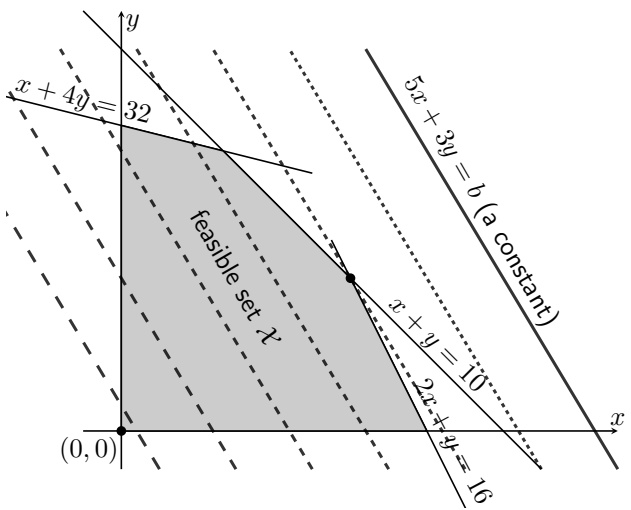

Hình 24.1. Minh hoạ nghiệm cho bài toán canh tác. Phần ngũ giác màu xám thể hiện tập khả thi của bài toán. Các đường song song thể hiện các đường đồng mức của hàm mục tiêu với khoảng cách giữa các nét đứt càng nhỏ tương ứng với giá trị càng cao. Nghiệm tìm được chính là điểm hình tròn đen, là giao điểm của hình ngũ giác xám và đường đồng mức ứng với giá trị cao nhất.

## 24.1.3. Bài toán đóng thùng

Bài toán: Một công ty phải chuyển 400 $m ^ { 3 }$ cát tới địa điểm xây dựng ở bên kia sông bằng cách thuê một chiếc xà lan. Ngoài chi phí vận chuyển 100k cho một lượt đi về, công ty phải thiết kế một thùng hình hộp chữ nhật không cần nắp đặt trên xà lan để đựng cát. Chi phí sản xuất các mặt xung quanh là 1 $\mathrm { t r } / m ^ { 2 }$ và mặt đáy là $2 ~ \mathrm { t r } / m ^ { 2 }$ . Để tổng chi phí vận chuyển là nhỏ nhất, chiếc thùng cần được thiết kế như thế nào? Để đơn giản hóa bài toán, giả sử cát chỉ được đổ ngang hoặc thấp hơn với phần trên của thành thùng, không đổ thành ngọn. Để đơn giản hơn nữa, giả sử thêm rằng xà lan có thể chở được thùng có kích thước vô hạn và khối lượng vô hạn (không được đổ trực tiếp cát lên mặt xà lan).

## Phân tích

Giả sử chiếc thùng cần làm có chiều dài, chiều rộng, chiều cao lần lượt là $x , y , z$ (m). Thể tích của thùng là $x y z ( m ^ { 3 } )$ . Có hai loại chi phí:

• Chi phí thuê xà lan: Số chuyến xà lan phải thuê62 là $\frac { 4 0 0 } { x y z }$ . Số tiền phải trả cho xà lan là $0.1\frac{400}{xyz}=\frac{40}{xyz}=40x^{-1}y^{-1}z^{-1}$ (0.1 ở đây là 0.1 triệu đồng).

• Chi phí làm thùng: Diện tích xung quanh của thùng là $2 ( x + y ) z$ . Diện tích đáy là xy. Vậy tổng chi phí làm thùng là $2(x+y)z+2xy=2(xy+yz+zx)$

Tổng toàn bộ chi phí là $f ( x , y , z ) = 4 0 x ^ { - 1 } y ^ { - 1 } z ^ { - 1 } + 2 ( x y + y z + z x )$ . Điều kiện ràng buộc duy nhất là kích thước thùng phải dương. Vậy ta có bài toán tối ưu sau.

<small><span class="docvortex-page-footnote" data-block-type="page_footnote" style="color:#6b7280">62 Ta hãy tạm giả sử rằng đây là một số tự nhiên, việc làm tròn này sẽ không thay đổi kết quả đáng kể vì chi phí vận chuyển một chuyến là nhỏ so với chi phí làm thùng</span></small>

<!-- page: 324 -->

Bài toán vận chuyển:

$$
(x, y) = \arg \min _ {x, y, z} 4 0 x ^ {- 1} y ^ {- 1} z ^ {- 1} + 2 (x y + y z + z x)\tag{24.3}
$$

thoả mãn: $x , y , z > 0$

Bài toán này thuộc loại quy hoạch hình học geometric programming, GP). Định nghĩa của GP và cách dùng công cụ tối ưu sẽ được trình bày trong phần sau của chương.

Nhận thấy rằng bài toán này hoàn toàn có thể giải được bằng bất đẳng thức Cauchy, nhưng chúng ta muốn một lời giải tổng quát cho bài toán để có thể lập trình được.

(Lời giải: $\begin{array} { r } { f ( x , y , z ) = \frac { 2 0 } { x y z } + \frac { 2 0 } { x y z } + 2 x y + 2 y z + 2 z x \geq 5 \sqrt [ 5 ] { 3 2 0 0 } . } \end{array}$ Dấu bằng xảy ra khi và chỉ khi $x = y = z = \sqrt[5]{10}.)$

Khi có các ràng buộc về kích thước của thùng và trọng lượng mà xà lan tải được thì bài toán trở nên phức tạp hơn, và bất đẳng thức Cauchy không phải lúc nào cũng làm việc hiệu quả.

Những bài toán trên đây đều là các bài toán tối ưu. Chính xác hơn, chúng đều là các bài toán tối ưu lồi (convex optimization problems). Trước hết, chúng ta cần hiểu các khái niệm cơ bản trong một bài toán tối ưu.

## 24.2. Nhắc lại bài toán tối ưu

## 24.2.1. Các khái niệm cơ bản

Bài toán tối ưu ở dạng tổng quát:

$$
\begin{array}{c} \mathbf {x} ^ {*} = \arg \min _ {\mathbf {x}} f _ {0} (\mathbf {x}) \\ \text {thoả mãn:} f _ {i} (\mathbf {x}) \leq 0, i = 1, 2, \ldots , m \\ h _ {j} (\mathbf {x}) = 0, j = 1, 2, \ldots , p \end{array}\tag{24.4}
$$

Phát biểu bằng lời: Tìm giá trị của biến x để tối thiểu hàm $f _ { 0 } ( \mathbf { x } )$ trong số những giá trị x thoả mãn các điệu kiện ràng buộc. Ta có bảng khái niệm song ngữ và ký hiệu của bài toán tối ưu được trình bày trong Bảng 24.1.

Ngoài ra:

• Khi $m = p = 0$ , bài toán (24.4) được gọi là bài toán tối ưu không ràng buộc (unconstrained optimization problem).

• D là tập xác định, tức giao của tất cả các tập xác định của mọi hàm số xuất hiện trong bài toán. Tập hợp các điểm thoả mãn mọi điều kiện ràng buộc là

<!-- page: 325 -->

Bảng 24.1: Bảng các thuật ngữ và ký hiệu trong bài toán tối ưu.

| Ký hiệu | Tiếng Anh | Tiếng Việt |
| --- | --- | --- |
| x ∈ R<sup>n</sup> | optimization variable | biến tối ưu |
| f<sub>0</sub> : R<sup>n</sup> → R | objective/loss/cost/function | hàm mục tiêu |
| f<sub>i</sub>(x) ≤ 0 | inequality constraint | bất đẳng thức ràng buộc |
| f<sub>i</sub> : R<sup>n</sup> → R | inequality constraint function | hàm bất đẳng thức ràng buộc |
| h<sub>j</sub>(x) = 0 | equality constraint | đẳng thức ràng buộc |
| h<sub>j</sub> : R<sup>n</sup> → R | equality constraint function | hàm đẳng thức ràng buộc |
| D = T<sub>mi</sub>=0 <sub>domfi</sub> ∩ T<sub>pj</sub>=1 <sub>domhj</sub> | domain | tập xác định |

một tập con của D được gọi là tập khả khi (feasible set). Khi tập khả thi là một tập rỗng thì bài toán tối ưu (24.4) bất khả thi (infeasible). Một điểm nằm trong tập khả thi được gọi là điểm khả thi (feasible point).

• Giá trị tối ưu (optimal value) của bài toán tối ưu (24.4) được định nghĩa là:

$$
p ^ {*} = \inf \left\{f _ {0} (\mathbf {x}) | f _ {i} (\mathbf {x}) \leq 0, i = 1, \dots , m; h _ {j} (\mathbf {x}) = 0, j = 1, \dots , p \right\}
$$

$p ^ { * }$ có thể nhận các giá $\mathrm { t r i } \pm \infty$ . Nếu bài toán là bất khả thi, ta coi $p ^ { * } = + \infty$ Nếu hàm mục tiêu không bị chặn dưới, ta coi $p ^ { * } = - \infty$

## 24.2.2. Điểm tối ưu và tối ưu địa phương

Một điểm $\mathbf { x } ^ { * }$ được gọi là điểm tối ưu (optimal point) , của bài toán (24.4) nếu $\mathbf { x } ^ { * }$ là một điểm khả thi và $f _ { 0 } ( \mathbf { x } ^ { * } ) = p ^ { * }$ . Tập hợp tất cả các điểm tối ưu được gọi là tập tối ưu (optimal set). Nếu tập tối ưu khác rỗng, ta nói bài toán (24.4) giải được (solvable). Ngược lại, nếu tập tối ưu rỗng, ta nói giá trị tối ưu không thể đạt được.

Ví dụ: Xét hàm mục tiêu $f ( x ) = 1 / x$ với ràng buộc $x > 0$ . Giá trị tối ưu của bài toán này là $p ^ { * } = 0$ nhưng tập tối ưu là một tập rỗng vì không có giá trị nào của x để hàm mục tiêu đạt giá trị $p ^ { * }$

Với hàm một biến, một điểm là cực $t i \hat { e } u / t \hat { o } i$ ưu địa phương của hàm số nếu tại đó hàm số đạt giá trị nhỏ nhất trong một lân cận (và lân cận này thuộc tập xác định của hàm số). Trong không gian một chiều, lân cận của một điểm được hiểu là tập các điểm cách điểm đó một khoảng rất nhỏ. Trong không gian nhiều chiều, ta gọi một điểm x là tối ưu địa phương nếu tồn tại một giá trị $R > 0$ sao cho:

$$
\begin{array}{r l} {f _ {0} (\mathbf {x}) =} & {\inf \bigl \{f _ {0} (\mathbf {z}) | f _ {i} (\mathbf {z}) \leq 0, i = 1, \dots , m,} \\ & {h _ {j} (\mathbf {z}) = 0, j = 1, \dots , p, \| \mathbf {z} - \mathbf {x} \| _ {2} \leq R \bigr \}} \end{array}\tag{24.5}
$$

<!-- page: 326 -->

## 24.2.3. Một vài lưu $\dot { \mathbf { y } }$

Bài toán trong định nghĩa (24.4) là tối thiểu hàm mục tiêu với các ràng buộc nhỏ hơn hoặc bằng không. Các bài toán yêu cầu tối đa hàm mục tiêu và điều kiện ràng buộc ở dạng khác đều có thể đưa về được dạng này:

• max $f _ { 0 } ( \mathbf { x } ) \Leftrightarrow \operatorname* { m i n } - f _ { 0 } ( \mathbf { x } )$

$f _ { i } ( \mathbf { x } ) \leq g ( \mathbf { x } ) \Leftrightarrow f _ { i } ( \mathbf { x } ) - g ( \mathbf { x } ) \leq 0 .$

$f _ { i } ( \mathbf { x } ) \geq 0 \Leftrightarrow - f _ { i } ( \mathbf { x } ) \leq 0 .$

• a ≤ f<sub>i</sub>(x) ≤ b ⇔ f<sub>i</sub>(x) − b ≤ 0 và a − f<sub>i</sub>(x) ≤ 0.

• Trong nhiều trường hợp, ràng buộc $f _ { i } ( \mathbf { x } ) \leq 0$ được viết lại dưới dạng hai ràng buộc $f _ { i } ( \mathbf { x } ) + s _ { i } = 0$ và $s _ { i } \geq 0$ . Biến được thêm vào $s _ { i }$ được gọi là biến lỏng lẻo (slack variable). Ràng buộc không âm $s _ { i } \geq 0$ nói chung dễ giải quyết hơn bất phương trình ràng buộc $f _ { i } ( \mathbf { x } ) \leq 0$

## 24.3. Bài toán tối ưu lồi

## 24.3.1. Định nghĩa

## Định nghĩa 24.1: Bài toán tối ưu lồi

Một bài toán tối ưu lồi (convex optimization problem) là một bài toán tối ưu có dạng

$$
\mathbf {x} ^ {*} = \arg \min _ {\mathbf {x}} f _ {0} (\mathbf {x})
$$

thoả mãn: $f _ { i } ( \mathbf { x } ) \leq 0 , \quad i = 1 , 2 , \ldots , m$

$$
h _ {j} (\mathbf {x}) = \mathbf {a} _ {j} ^ {T} \mathbf {x} - b _ {j} = 0, j = 1, \dots ,\tag{24.6}
$$

trong đó $f _ { 0 } , f _ { 1 } , \ldots , f _ { m }$ là các hàm lồi.

So với bài toán tối ưu (24.4), bài toán tối ưu lồi (24.6) có thêm ba điều kiện:

• Hàm mục tiêu là một hàm lồi.

• Các hàm bất đẳng thức ràng buộc $f _ { i }$ là các hàm lồi.

• Hàm đẳng thức ràng buộc $h _ { j }$ là hàm affine.

Trong toán tối ưu, chúng ta đặc biệt quan tâm tới các bài toán tôi ưu lồi.

<!-- page: 327 -->

Một vài nhận xét:

• Tập hợp các điểm thoả mãn $h _ { j } ( \mathbf { x } ) = 0$ là một tập lồi vì nó có dạng siêu phẳng.

• Khi $f _ { i }$ là một hàm lồi, tập hợp các điểm thoả mãn $f _ { i } ( \mathbf { x } ) \leq 0$ là tập dưới mức 0 của $f _ { i }$ và là một tập lồi.

• Tập hợp các điểm thoả mãn mọi điều kiện ràng buộc là giao của các tập lồi, vì vậy nó là một tập lồi.

Trong một bài toán tối ưu lồi, một hàm mục tiêu lồi được tối thiểu trên một tập lồi.

## 24.3.2. Cực trị địa phương của bài toán tối ưu lồi là cực trị toàn cục

Tính chất quan trọng nhất của bài toán tối ưu lồi chính là mọi điểm cực tiểu địa phương đều là cực tiểu toàn cục. Điều này có thể chứng minh bằng phản chứng. Gọi $\mathbf { x } _ { 0 }$ là một điểm cực tiểu địa phương:

$$
f _ {0} (\mathbf {x} _ {0}) = \inf \{f _ {0} (\mathbf {x}) | \mathbf {x} \in \text {tập khả thi}, \| \mathbf {x} - \mathbf {x} _ {0} \| _ {2} \leq R \}
$$

với $R > 0$ nào đó. Giả sử $\mathbf { x } _ { 0 }$ không phải là một cực trị toàn cục, tức tồn tại một điểm khả thi y sao cho $f ( \mathbf { y } )   <   f ( \mathbf { x } _ { 0 } )$ (hiển nhiên y không nằm trong lân cận đang xét). Ta có thể tìm được $\theta \in [ 0 , 1 ]$ sao cho $\mathbf { z } = ( 1 - \theta ) \mathbf { x } _ { 0 } + \theta \mathbf { y }$ nằm trong lân cận của $\mathbf { x } _ { 0 }$ , tức $\| \mathbf { z } - \mathbf { x } _ { 0 } \| _ { 2 } < R$ . Việc này đạt được được vì tập khả thi là một tập lồi. Hơn nữa, vì hàm mục tiêu $f _ { 0 }$ là một hàm lồi, ta có

$$
f _ {0} (\mathbf {z}) = f _ {0} ((1 - \theta) \mathbf {x} _ {0} + \theta \mathbf {y})\tag{24.7}
$$

$$
\leq (1 - \theta) f _ {0} (\mathbf {x} _ {0}) + \theta f _ {0} (\mathbf {y})\tag{24.8}
$$

$$
<   (1 - \theta) f _ {0} (\mathbf {x} _ {0}) + \theta f _ {0} (\mathbf {x} _ {0}) = f _ {0} (\mathbf {x} _ {0})\tag{24.9}
$$

Điều này mâu thuẫn với giả thiết $\mathbf { x } _ { 0 }$ là một điểm cực tiểu địa phương và z nằm trong lân cận của $\mathbf { x } _ { 0 }$ . Vậy giả thiết phản chứng là sai, tức $\mathbf { x } _ { 0 }$ chính là một điểm cực trị toàn cục.

Chứng minh bằng lời: Ggiả sử một điểm cực tiểu địa phương không phải là cực tiểu toàn cục. Vì hàm mục tiêu và tập khả thi đều lồi, ta luôn tìm được một điểm khác trong lân cận của điểm cực tiểu đó sao cho giá trị của hàm mục tiêu tại điểm mới này nhỏ hơn giá trị của hàm mục tiêu tại điểm cực tiểu. Sự mâu thuẫn này chỉ ra rằng với một bài toán tối ưu lồi, điểm cực tiểu địa phương phải là điểm cực tiểu toàn cục.

<!-- page: 328 -->

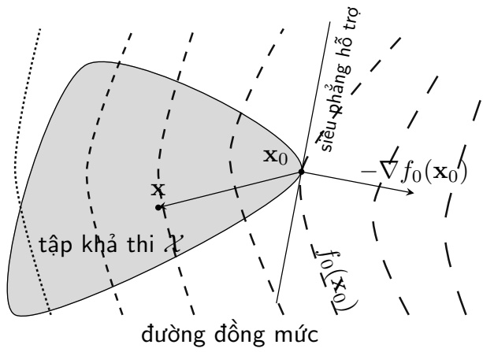

Hình 24.2. Biểu diễn hình học của điều kiện tối ưu cho hàm mục tiêu khả vi. Các đường nét đứt tương ứng với các đường đồng mức. Nét đứt càng ngắn ứng với giá trị càng cao.

## 24.3.3. Điều kiện tối ưu cho hàm mục tiêu khả vi

Nếu hàm mục tiêu $f _ { 0 }$ là khả vi, theo điều kiện bậc nhất, với mọi $\mathbf { x } , \mathbf { y } \in \mathbf { d o m } f _ { 0 }$ ta có:

$$
f _ {0} (\mathbf {x}) \geq f _ {0} (\mathbf {x} _ {0}) + \nabla f _ {0} (\mathbf {x} _ {0}) ^ {T} (\mathbf {x} - \mathbf {x} _ {0})\tag{24.10}
$$

Đặt X là tập khả thi. Điều kiện cần và đủ để một điểm $\mathbf { x } _ { 0 } \in \mathcal { X }$ là điểm tối ưu là:

$$
\nabla f _ {0} (\mathbf {x} _ {0}) ^ {T} (\mathbf {x} - \mathbf {x} _ {0}) \geq 0, \forall \mathbf {x} \in \mathcal {X}\tag{24.11}
$$

Phần chứng minh cho điều kiện này được bỏ qua, bạn đọc có thể tìm trong trang 139-140 của cuốn Convex Optimization [BV04].

Điều này chỉ ra rằng nếu $\nabla f _ { 0 } ( \mathbf { x } _ { 0 } ) = 0$ thì $\mathbf { x } _ { 0 }$ chính là một điểm tối ưu của bài toán. Nếu $\nabla f _ { 0 } ( \mathbf { x } _ { 0 } ) \neq 0$ , nghiệm của bài toán sẽ phải nằm trên biên của tập khả thi. Thật vậy, quan sát Hình 24.2, điều kiện này nói rằng nếu $\mathbf { x } _ { 0 }$ là một điểm tối ưu thì với mọi $\mathbf { x } \in \mathcal { X }$ , vector đi từ $\mathbf { x } _ { 0 }$ tới x hợp với vector $- \nabla f _ { 0 } ( \mathbf { x } _ { 0 } )$ một góc tù. Nói cách khác, nếu ta vẽ mặt tiếp tuyến của hàm mục tiêu tại $\mathbf { x } _ { 0 }$ thì mọi điểm khả thi nằm về một phía so với mặt tiếp tuyến này. Điều này chỉ ra rằng $\mathbf { x } _ { 0 }$ phải nằm trên biên của tập khả thi X . Hơn nữa, tập khả thi nằm về phía làm cho hàm mục tiêu đạt giá trị cao hơn $f _ { 0 } ( \mathbf { x } _ { 0 } )$ . Mặt tiếp tuyến này được gọi là siêu phẳng hỗ trợ (supporting hyperplane) của tập khả thi tại điểm $\mathbf { x } _ { 0 }$

Một mặt phẳng đi qua một điểm trên biên của một tập hợp sao cho mọi điểm trong tập hợp đó nằm về một phía (hoặc nằm trên) so với mặt phẳng đó được gọi là một siêu phẳng hỗ trợ. Tồn tại một siêu phẳng hỗ trợ tại mọi điểm trên biên của một tập lồi.

## 24.3.4. Giới thiệu thư viện CVXOPT

CVXOPT là một thư viện miễn phí trên Python đi kèm với cuốn sách Convex Optimization. Hướng dẫn cài đặt, tài liệu hướng dẫn, và các ví dụ mẫu của thư viện này cũng có đầy đủ trên trang web CVXOPT ([http://cvxopt.org/](http://cvxopt.org/)). Trong

<!-- page: 329 -->

phần còn lại của chương, chúng ta sẽ thảo luận ba bài toán cơ bản trong tối ưu lồi: quy hoạch tuyến tính, quy hoạch toàn phương và quy hoạch hình học. Chúng ta sẽ cùng lập trình để giải các ví dụ đã nêu ở phần đầu chương dựa trên thư viện CVXOPT này.

## 24.4. Quy hoạch tuyến tính

Chúng ta cùng bắt đầu với lớp các bài toán quy hoạch tuyến tính (linear programming, LP). Trong đó, hàm mục tiêu $f _ { 0 } ( \mathbf { x } )$ và các hàm bất đẳng thức ràng buộc $f _ { i } ( \mathbf { x } ) , i = 1 , \ldots , m$ đều là hàm affine.

## 24.4.1. Dạng tổng quát của quy hoạch tuyến tính

$$
\begin{array}{c} \mathbf {x} = \arg \min _ {\mathbf {x}} \mathbf {c} ^ {T} \mathbf {x} + d \\ t h o \acute {a} m \tilde {a} n: \quad \mathbf {G x} \preceq \mathbf {h} \\ \mathbf {A x} = \mathbf {b} \end{array}\tag{24.12}
$$

$$
\mathbf {G} \in \mathbb {R} ^ {m \times n}, \mathbf {h} \in \mathbb {R} ^ {m}, \mathbf {A} \in \mathbb {R} ^ {p \times n}, \mathbf {b} \in \mathbb {R} ^ {p}, \mathbf {c}, \mathbf {x} \in \mathbb {R} ^ {n}
$$

Số vô hướng d chỉ làm thay đổi giá trị của hàm mục tiêu mà không làm thay đổi nghiệm của bài toán nên có thể được lược bỏ. Nhắc lại rằng ký hiệu  nghĩa là mỗi phần tử trong vector ở vế trái nhỏ hơn hoặc bằng phần tử tương ứng trong vector ở vế phải. Các bất đẳng thức dạng $\mathbf { g } _ { i } \mathbf { x } \leq h _ { i }$ , với $\mathbf { g } _ { i }$ là những vector hàng, có thể viết gộp dưới dạng $\mathbf { G } \mathbf { x } \preceq \mathbf { h }$ trong đó mỗi hàng của G ứng với một $\mathbf { g } _ { i }$ , mỗi phần tử của h tương ứng với một $h _ { i }$

## 24.4.2. Dạng tiêu chuẩn của quy hoạch tuyến tính

Trong dạng tiêu chuẩn quy hoạch tuyến tính, bất phương trình ràng buộc chỉ là điều kiện nghiệm có các thành phần không âm.

$$
\begin{array}{c} \mathbf {x} = \arg \min _ {\mathbf {x}} \mathbf {c} ^ {T} \mathbf {x} \\ t h o \acute {a} m \tilde {a} n: \mathbf {A x} = \mathbf {b} \\ \mathbf {x} \succeq \mathbf {0} \end{array}\tag{24.13}
$$

Dạng tổng quát (24.12) có thể được đưa về dạng tiêu chuẩn (24.13) bằng cách đặt thêm biến lỏng lẻo s:

<!-- page: 330 -->

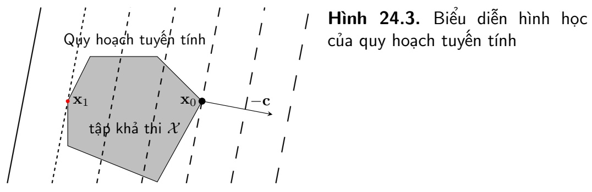

**Hình 24.3.** Biểu diễn hình học của quy hoạch tuyến tính

$$
\begin{array}{c} \mathbf {x} = \arg \min _ {\mathbf {x}, \mathbf {s}} \mathbf {c} ^ {T} \mathbf {x} \\ \text {thoả mãn:} \mathbf {A x} = \mathbf {b} \\ \mathbf {G x} + \mathbf {s} = \mathbf {h} \\ \mathbf {s} \succeq \mathbf {0} \end{array}\tag{24.14}
$$

Tiếp theo, nếu ta biểu diễn x dưới dạng hiệu của hai vector với thành phần không âm: $\mathbf { x } = \mathbf { x } ^ { + } - \mathbf { x } ^ { - }$ , với $\mathbf { x } ^ { + } , \mathbf { x } ^ { - } \succeq 0$ . Ta có thể tiếp tục viết lại (24.14) dưới dạng:

$$
\begin{array}{c} \mathbf {x} = \arg \min _ {\mathbf {x} ^ {+}, \mathbf {x} ^ {-}, \mathbf {s}} \mathbf {c} ^ {T} \mathbf {x} ^ {+} - \mathbf {c} ^ {T} \mathbf {x} ^ {-} \\ \text {thoả   mãn:} \mathbf {A x} ^ {+} - \mathbf {A x} ^ {-} = \mathbf {b} \\ \mathbf {G x} ^ {+} - \mathbf {G x} ^ {-} + \mathbf {s} = \mathbf {h} \\ \mathbf {x} ^ {+} \succeq 0, \mathbf {x} ^ {-} \succeq 0, \mathbf {s} \succeq \mathbf {0} \end{array}\tag{24.15}
$$

Tới đây, bạn đọc có thể thấy rằng (24.15) có dạng (24.13).

## 24.4.3. Minh hoạ bằng hình học của bài toán quy hoạch tuyến tính

Các bài toán quy hoạch tuyến tính có thể được minh hoạ như Hình 24.3 với tập khả thi có dạng đa diện lồi. Điểm $\mathbf { x } _ { 0 }$ là điểm cực tiểu toàn cục, điểm $\mathbf { x } _ { 1 }$ là điểm cực đại toàn cục. Nghiệm của các bài toán quy hoạch tuyến tính, nếu tồn tại, là một điểm trên biên của của tập khả thi.

## 24.4.4. Giải bài toán quy hoạch tuyến tính bằng CVXOPT

Nhắc lại bài toán canh tác:

$$
\begin{array}{c} (x, y) = \underset {x, y} {\arg \max} 5 x + 3 y \\ \text {thoả mãn:} x + y \leq 1 0 \\ 2 x + y \leq 1 6 \\ x + 4 y \leq 3 2 \\ x, y \geq 0 \end{array}\tag{24.16}
$$

Các điều kiện ràng buộc có thể viết lại dưới dạng $\mathbf { G } \mathbf { x } \preceq \mathbf { h }$ , trong đó:

<!-- page: 331 -->

$$
\mathbf {G} = \left[ \begin{array}{c c} 1 & 1 \\ 2 & 1 \\ 1 & 4 \\ - 1 & 0 \\ 0 & - 1 \end{array} \right] \mathbf {h} = \left[ \begin{array}{c} 1 0 \\ 1 6 \\ 3 2 \\ 0 \\ 0 \end{array} \right]
$$

Khi sử dụng CVXOPT, chúng ta lập trình như sau:

```python
from cvxopt import matrix, solvers
c = matrix([-5., -3.])  # since we need to maximize the objective function
G = matrix([[1., 2., 1., -1., 0.], [1., 1., 4., 0., -1.]])
h = matrix([10., 16., 32., 0., 0.])

solvers.options['show_progress'] = False
sol = solvers.lp(c, G, h)

print('Solution'")
print(sol['x'])
```

Kết quả:

```yaml
Solution:
[ 6.00e+00]
[ 4.00e+00]
```

Nghiệm này chính là nghiệm mà chúng ta đã tìm được trong phần đầu của bài viết dựa trên biểu diễn hình học.

Một vài lưu ý:

• Hàm solvers.lp của cvxopt giải bài toán (24.14).

• Trong bài toán này, vì phải tìm giá trị lớn nhất nên hàm mục tiêu cần được đổi về dạng −5x − 3y. Vì vậy, ta cần khai báo c = matrix([−5., −3.]).

• Hàm matrix nhận đầu vào là một list trong Python, list này thể hiện một vector cột. Nếu muốn biểu diễn một ma trận, đầu vào của matrix phải là một list của list, trong đó mỗi list bên trong thể hiện một vector cột.

• Các hằng số trong bài toán phải ở dạng số thực. Nếu chúng là các số nguyên, ta cần thêm dấu chấm (.) để chuyển chúng thành số thực.

• Với đẳng thức ràng buộc Ax = b, solvers.lp lấy giá trị mặc định của A và b là None, tức nếu không khai báo thì không có đẳng thức ràng buộc nào.

Với các tuỳ chọn khác, bạn đọc có thể tìm trong tài liệu của CVXOPT([https://goo.gl/q5CZmz](https://goo.gl/q5CZmz)). Việc giải Bài toán NXB bằng CVXOPT xin nhường lại cho bạn đọc.

<!-- page: 332 -->

## 24.5. Quy hoạch toàn phương

## 24.5.1. Bài toán quy hoạch toàn phương

Một dạng bài toán tối ưu lồi phổ biến khác là quy hoạch toàn phương (quadratic programming, QP). Khác biệt duy nhất của quy hoạch toàn phương so với quy hoạch tuyến tính là hàm mục tiêu có dạng toàn phương (quadratic form).

## Quy hoạch toàn phương

$$
\mathbf {x} = \arg \min _ {\mathbf {x}} \frac {1}{2} \mathbf {x} ^ {T} \mathbf {P} \mathbf {x} + \mathbf {q} ^ {T} \mathbf {x} + \mathbf {r}
$$

thoả mãn: $\mathbf { G } \mathbf { x } \preceq \mathbf { h }$

$$
\mathbf {A} \mathbf {x} = \mathbf {b}\tag{24.17}
$$

Trong đó P là một ma trận vuông nửa xác định dương bậc n, $\textbf { G } \in$ Rm×n, $\mathbf { A } \in \mathbb { R } ^ { p \times n }$

Điều kiện nửa xác định dương của P nhằm đảm bảo hàm mục tiêu là lồi. Trong quy hoạch toàn phương, một dạng toàn phương được tối thiểu trên một đa diện lồi (Xem Hình 24.4). Quy hoạch tuyến tính là một trường hợp đặc biệt của quy hoạch toàn phương với $\mathbf { P } = \mathbf { 0 }$

## 24.5.2. Ví dụ

Bài toán: Một hòn đảo có dạng đa giác lồi. Một con thuyền ở ngoài biển cần đi theo hướng nào để tới đảo nhanh nhất, giả sử rằng tốc độ của sóng và gió bằng không. Đây chính là bài toán tìm khoảng cách từ một điểm tới một đa diện.

Bài toán tìm khoảng cách từ một điểm tới một đa diện: Cho một đa diện là tập hợp các điểm thoả mãn Ax  b và một điểm u, tìm điểm x thuộc đa diện đó sao cho khoảng cách Euclid giữa x và u là nhỏ nhất. Đây là một bài toán quy hoạch toàn phương có dạng:

$$
\mathbf {x} = \arg \min _ {\mathbf {x}} \frac {1}{2} \| \mathbf {x} - \mathbf {u} \| _ {2} ^ {2}
$$

thoả mãn: Gx  h

Hàm mục tiêu đạt giá trị nhỏ nhất bằng 0 nếu u nằm trong polyheron đó và nghiệm chính là x = u. Khi u không nằm trong polyhedron, ta viết:

$$
\frac {1}{2} \| \mathbf {x} - \mathbf {u} \| _ {2} ^ {2} = \frac {1}{2} (\mathbf {x} - \mathbf {u}) ^ {T} (\mathbf {x} - \mathbf {u}) = \frac {1}{2} \mathbf {x} ^ {T} \mathbf {x} - \mathbf {u} ^ {T} \mathbf {x} + \frac {1}{2} \mathbf {u} ^ {T} \mathbf {u}
$$

Biểu thức này có dạng hàm mục tiêu như trong (24.17) với $\mathbf { P } = \mathbf { I } , \mathbf { q } = - \mathbf { u } , \mathbf { r } =$ $\textstyle { \frac { 1 } { 2 } } \mathbf { u } ^ { T } \mathbf { u }$ , trong đó I là ma trận đơn vị.

<!-- page: 333 -->

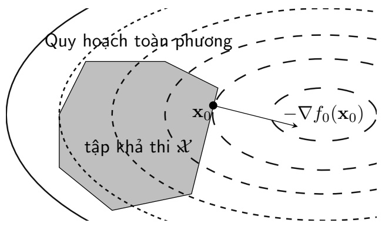

Hình 24.4. Biểu diễn hình học của quy hoạch toàn phương

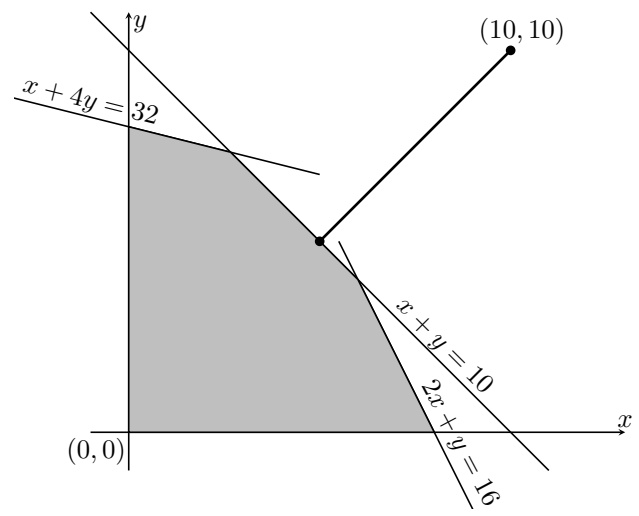

Hình 24.5. Ví dụ về khoảng cách giữa một điểm và một đa diện

24.5.3. Giải bài toán quy hoạch toàn phương bằng CVXOPT

Xét bài toán được cho trên Hình 24.5. Ta cần tìm khoảng cách từ điểm có toạ độ (10, 10) tới đa giác lồi màu xám. Khoảng cách từ một điểm tới một tập hợp trong trường hợp này được định nghĩa là khoảng cách từ điểm đó tới điểm gần nhất trong tập hợp. Bài toán này được viết dưới dạng quy hoạch toàn phương như sau:

$$
\begin{array}{c} (x, y) = \underset {x, y} {\arg \min} (x - 1 0) ^ {2} + (y - 1 0) ^ {2} \\ \text {thoả măn:} \quad \left[ \begin{array}{c c} 1 & 1 \\ 2 & 1 \\ 1 & 4 \\ - 1 & 0 \\ 0 & - 1 \end{array} \right] \left[ \begin{array}{c} x \\ y \end{array} \right] \preceq \left[ \begin{array}{c} 1 0 \\ 1 6 \\ 3 2 \\ 0 \\ 0 \end{array} \right] \end{array}
$$

Tập khả thi của bài toán được lấy từ Bài toán canh tác và $\mathbf { u }   =   [ 1 0 , 1 0 ] ^ { T }$ . Bài toán này có thể được giải bằng CVXOPT như sau:

<!-- page: 334 -->

```python
from cvxopt import matrix, solvers
P = matrix([[1., 0.], [0., 1.]])
q = matrix([-10., -10.])
G = matrix([[1., 2., 1., -1., 0.], [1., 1., 4., 0., -1.]])
h = matrix([10., 16., 32., 0., 0])

solvers.options['show_progress'] = False
sol = solvers.qp(P, q, G, h)

print('Solution:')
print(sol['x'])
```

Kết quả:

```yaml
Solution:
[ 5.00e+00]
[ 5.00e+00]
```

Như vậy, nghiệm của bài toán tối ưu này là điểm có toạ độ (5, 5) .

## 24.6. Quy hoạch hình học

Trong mục này, chúng ta cùng thảo luận một nhóm các bài toán không lồi, nhưng có thể được biến đổi về dạng lồi. Trước hết, ta làm quen với hai khái niệm đơn thức và đa thức.

## 24.6.1. Đơn thức và đa thức

Một hàm số $f : \mathbb { R } ^ { n } \to \mathbb { R }$ với tập xác định dom $f = \mathbf { R } _ { + + } ^ { n }$ (tất cả các phần tử đều dương) có dạng:

$$
f (\mathbf {x}) = c x _ {1} ^ {a _ {1}} x _ {2} ^ {a _ {2}} \dots x _ {n} ^ {a _ {n}}\tag{24.18}
$$

trong đó $c > 0$ và $a _ { i } \in \mathbb { R }$ , được gọi là một đơn thức (monomial) (trong chương trình phổ thông, đơn thức được định nghĩa với c bất kỳ và $a _ { i }$ là các số tự nhiên).

Tổng của các đơn thức:

$$
f (\mathbf {x}) = \sum_ {k = 1} ^ {K} c _ {k} x _ {1} ^ {a _ {1 k}} x _ {2} ^ {a _ {2 k}} \dots x _ {n} ^ {a _ {n k}}\tag{24.19}
$$

trong đó $c _ { k } > 0$ , được gọi là đa thức (posynomial).

<!-- page: 335 -->

## 24.6.2. Quy hoạch hình học

## Quy hoạch hình học

$$
\mathbf {x} = \arg \min _ {\mathbf {x}} f _ {0} (\mathbf {x})
$$

$$
t h o \acute {a} m \tilde {a} n: f _ {i} (x) \leq 1, i = 1, 2, \dots , m\tag{24.20}
$$

$$
h _ {j} (x) = 1, j = 1, 2, \dots , p
$$

trong đó $f _ { 0 } , f _ { 1 } , \ldots , f _ { m }$ là các đa thức và $h _ { 1 } , \ldots , h _ { p }$ là các đơn thức.

Điều kiện $\mathbf { x } \succ 0$ đã được ẩn đi.

Chú ý rằng nếu f là một đa thức, h là một đơn thức thì $f / h$ là một đa thức.

Ví dụ, bài toán tối ưu

$$
\begin{array}{c} (x, y, z) = \arg \min _ {x, y, z} x / y \\ \text {thoả mãn:} \quad 1 \leq x \leq 2 \\ \quad x ^ {3} + 2 y / z \leq \sqrt {y} \\ \quad x / y = z \end{array}\tag{24.21}
$$

có thể được viết lại dưới dạng quy hoạch hình học:

$$
(x, y, z) = \arg \min _ {x, y, z} x y ^ {- 1}
$$

$$
\begin{array}{l l} \text {thoả mãn:} & x ^ {- 1} \leq 1 \\ & (1 / 2) x \leq 1 \\ & x ^ {3} y ^ {- 1 / 2} + 2 y ^ {1 / 2} z ^ {- 1} \leq 1 \\ & x y ^ {- 1} z ^ {- 1} = 1 \end{array}\tag{24.22}
$$

Bài toán này không là một bài toán tối ưu lồi vì cả hàm mục tiêu và điều kiện ràng buộc đều không lồi.

## 24.6.3. Biến đổi quy hoạch hình học về dạng bài toán tối ưu lồi

Quy hoạch hình học có thể được biến đổi về dạng lồi bằng cách sau đây. Đặt $y _ { i } = \log ( x _ { i } )$ , tức $x _ { i } = \exp ( y _ { i } )$ . Nếu f là một đơn thức của x thì:

$$
f (\mathbf {x}) = c (\exp (y _ {1})) ^ {a _ {1}} \dots (\exp (y _ {n})) ^ {a _ {n}} = c \exp \left(\sum_ {i = 1} ^ {n} a _ {i} y _ {i}\right) = \exp (\mathbf {a} ^ {T} \mathbf {y} + b)
$$

với $b = \log ( c )$ Lúc này, hàm số $g ( y ) = \exp ( \mathbf { a } ^ { T } \mathbf { y } + b )$ là một hàm lồi theo y. (Bạn đọc có thể chứng minh theo định nghĩa rằng hợp của hai hàm lồi là một hàm lồi. Trong trường hợp này, hàm exp và hàm affine đều là các hàm lồi.)

<!-- page: 336 -->

Tương tự, đa thức trong đẳng thức (24.19) có thể được viết dưới dạng:

$$
f (\mathbf {x}) = \sum_ {k = 1} ^ {K} \exp (\mathbf {a} _ {k} ^ {T} \mathbf {y} + b _ {k})
$$

trong đó $\mathbf { a } _ { k }   =   [ a _ { 1 k } , \ldots , a _ { n k } ] ^ { T } , b _ { k }   =   \log ( c _ { k } ) \mathrm { ~ v a ~ } y _ { i }   =   \log ( x )$ . Lúc này, đa thức đã được viết dưới dạng tổng của các hàm exp của các hàm affine, và vì vậy là một hàm lồi theo y. Lưu $\acute { \mathrm { y } }$ rằng tổng của các hàm lồi là một hàm lồi.

Bài toán quy hoạch hình học (24.20) được viết lại dưới dạng:

$$
\mathbf {y} = \arg \min _ {\mathbf {y}} \sum_ {k = 1} ^ {K _ {0}} \exp (\mathbf {a} _ {0 k} ^ {T} \mathbf {y} + b _ {0 k})
$$

$$
\begin{array}{c} \text {thoả   mãn:} \sum_ {k = 1} ^ {K _ {i}} \exp (\mathbf {a} _ {i k} ^ {T} \mathbf {y} + b _ {i k}) \leq 1, i = 1, \ldots , m \\ \exp (\mathbf {g} _ {j} ^ {T} \mathbf {y} + h _ {j}) = 1, j = 1, \ldots , p \end{array}\tag{24.23}
$$

với $\begin{array} { r } { \mathbf { a } _ { i k } \in \mathbb { R } ^ { n } , \forall i = 1 , \ldots , p \mathrm { v \AA } \mathbf { g } _ { j } \in \mathbb { R } ^ { n } , \forall j = 1 , \ldots , p . } \end{array}$

Với chú $\hat { \mathrm { y } }$ rằng hàm số log $\textstyle ( \sum _ { i = 1 } ^ { m } \exp ( g _ { i } ( \mathbf { z } ) ) )$ là môt hàm lồi theo z nếu $g _ { i }$ là các hàm lồi (xin bỏ qua phần chứng minh), ta có thể viết lại bài toán (24.23) dưới dạng một bài toán tối ưu lồi bằng cách lấy log của các hàm như sau.

Quy hoạch hình học dưới dạng bài toán tối ưu $l \hat { \partial } i$

$$
\begin{array}{c} \min _ {\mathbf {y}} \tilde {f} _ {0} (\mathbf {y}) = \log \left(\sum_ {k = 1} ^ {K _ {0}} \exp (\mathbf {a} _ {0 k} ^ {T} \mathbf {y} + b _ {i 0})\right) \\ \text {thoâ   mân:} \tilde {f} _ {i} (\mathbf {y}) = \log \left(\sum_ {k = 1} ^ {K _ {i}} \exp (\mathbf {a} _ {i k} ^ {T} \mathbf {y} + b _ {i k})\right) \leq 0, i = 1, \ldots , m \\ \tilde {h} _ {j} (\mathbf {y}) = \mathbf {g} _ {j} ^ {T} \mathbf {y} + h _ {j} = 0, j = 1, \ldots , p \end{array}\tag{24.24}
$$

Lúc này, ta có thể nói rằng quy hoạch hình học tương đương với một bài toán tối ưu lồi vì hàm mục tiêu và các hàm bất phương trình ràng buộc trong (24.24) đều là hàm lồi, đồng thời ràng buộc phương trình cuối cùng có dạng affine.

## 24.6.4. Giải quy hoạch hình học bằng CVXOPT

Quay lại ví dụ về Bài toán đóng thùng không ràng buộc và hàm mục tiêu $f ( x , y , z )   =   4 0 x ^ { - 1 } y ^ { - 1 } z ^ { - 1 }   +   2 x y   +   2 y z   +   2 z x$ là một đa thức. Vậy đây cũng là một bài toán quy hoạch hình học.

Nghiệm của bài toán có thể được tìm bằng CVXOPT như sau:

<!-- page: 337 -->

```python
from cvxopt import matrix, solvers
from math import log, exp# gp
from numpy import array
import numpy as np

K = [4] # number of monomials
F = matrix([[-1., 1., 1., 0.],
 [-1., 1., 0., 1.],
 [-1., 0., 1., 1.]])
g = matrix([log(40.), log(2.), log(2.), log(2.)])
solvers.options['show_progress'] = False
sol = solvers.gp(K, F, g)

print('Solution:')
print(np.exp(np.array(sol['x']))))

print('\nchecking sol^5')
print(np.exp(np.array(sol['x']))**5)
```

Kết quả:

Nghiệm thu được chính là $x = y = z = \sqrt[5]{10}$ Bạn đọc nên đọc thêm chỉ dẫn của hàm solvers.gp ([https://goo.gl/5FEBtn](https://goo.gl/5FEBtn)) để hiểu cách thiết lập và giải bài toán quy hoạch hình học.

## 24.7. Tóm tắt

• Các bài toán tối ưu xuất hiện rất nhiều trong thực tế, trong đó tối ưu lồi đóng một vai trò quan trọng. Trong bài toán tối ưu lồi, nếu tìm được cực trị địa phương thì đó chính là cực trị toàn cục.

• Có những bài toán tối ưu không được viết dưới dạng lồi nhưng có thể biến đổi về dạng lồi, ví dụ như bài toán quy hoạch hình học.

• Quy hoạch tuyến tính và quy hoạch hình học đóng một vai trò quan trọng trong toán tối ưu, được sử dụng nhiều trong các thuật toán machine learning.

• Thư viện CVXOPT được dùng để giải nhiều bài toán tối ưu lồi, rất dễ sử dụng, phù hợp với mục đích học tập và nghiên cứu.

<!-- page: 338 -->

# Đối ngẫu

## 25.1. Giới thiệu

Trong Chương 23 và Chương 24, chúng ta đã thảo luận về tập lồi, hàm lồi và các bài toán tối ưu lồi. Trong chương này, chúng ta sẽ tiếp tục tìm hiểu sâu hơn scác điều kiện về nghiệm của các bài toán tối ưu, cả lồi và không lồi; bài toán đối ngẫu (dual problem) và điều kiện KKT.

Trước tiên chúng ta xét bài toán tối ưu chỉ có một phương trình ràng buộc:

$$
\mathbf {x} = \arg \min _ {\mathbf {x}} f _ {0} (\mathbf {x})\tag{25.1}
$$

$$
\text {thoả măn:} f _ {1} (\mathbf {x}) = 0
$$

Bài toán này không nhất thiết là bài toán tối ưu lồi. Tức hàm mục tiêu và hàm ràng buộc không nhất thiết phải lồi. Bài toán này có thể được giải bằng phương pháp nhân tử Lagrange (xem Phụ Lục A). Cụ thể, xét hàm số:

$$
\mathcal {L} (\mathbf {x}, \lambda) = f _ {0} (\mathbf {x}) + \lambda f _ {1} (\mathbf {x})\tag{25.2}
$$

Hàm số L(x, λ) được gọi là hàm Lagrange (the Lagrangian) của bài toán tối ưu (25.1). Trong hàm số này, chúng ta có thêm một biến λ được gọi là nhân tử Lagrange (Lagrange multiplier). Người ta đã chứng minh được rằng, điểm tối ưu của bài toán (25.1) thoả mãn điều kiện $\nabla _ { \mathbf { x } , \lambda } \mathcal { L } ( \mathbf { x } , \lambda ) = 0$ . Tức là:

$$
\nabla_ {\mathbf {x}} \mathcal {L} (\mathbf {x}, \lambda) = \nabla_ {\mathbf {x}} f _ {0} (\mathbf {x}) + \lambda \nabla_ {\mathbf {x}} f _ {1} (\mathbf {x}) = \mathbf {0}\tag{25.3}
$$

$$
\nabla_ {\lambda} \mathcal {L} (\mathbf {x}, \lambda) = f _ {1} (\mathbf {x}) = 0\tag{25.4}
$$

Để ý rằng điều kiện thứ hai chính là phương trình ràng buộc trong bài toán (25.1). Trong nhiều trường hợp, việc giải hệ phương trình (25.3) - (25.4) đơn giản hơn việc trực tiếp đi tìm optimal value của bài toán (25.1). Một số ví dụ về phương pháp nhân tử Lagrange có thể được tìm thấy tại Phụ Lục A.

<!-- page: 339 -->

## 25.2. Hàm đối ngẫu Lagrange

## 25.2.1. Hàm Lagrange của bài toán tối ưu

Xét bài toán tối ưu tổng quát:

$$
\begin{array}{c} \mathbf {x} ^ {*} = \arg \min _ {\mathbf {x}} f _ {0} (\mathbf {x}) \\ \text {thoâ   mãn:} f _ {i} (\mathbf {x}) \leq 0, i = 1, 2, \ldots , m \\ h _ {j} (\mathbf {x}) = 0, j = 1, 2, \ldots , p \end{array}\tag{25.5}
$$

với tập xác định $\begin{array} { r } { \mathcal { D } = \bigcap _ { i = 0 } ^ { m } \mathbf { d o m } f _ { i } ) \cap ( \bigcap _ { j = 1 } ^ { p } \mathbf { d o m } h _ { j } } \end{array}$ . Chú $\hat { \mathrm { y } }$ rằng, ở đây không có giả sử về tính chất lồi của hàm tối ưu hay các hàm ràng buộc. Giả sử duy nhất là tập xác định $\mathcal { D } \neq \emptyset ( \mathrm { t \hat { a } p r \tilde { \hat { o } n g } } )$ . Bài toán tối ưu này còn được gọi là bài toán chính (primal problem).

Hàm số Lagrange cũng được xây dựng tương tự với mỗi nhân tử Lagrange cho một (bất) phương trình ràng buộc:

$$
\mathcal {L} (\mathbf {x}, \boldsymbol {\lambda}, \boldsymbol {\nu}) = f _ {0} (\mathbf {x}) + \sum_ {i = 1} ^ {m} \lambda_ {i} f _ {i} (\mathbf {x}) + \sum_ {j = 1} ^ {p} \nu_ {j} h _ {j} (\mathbf {x}).
$$

Trong đó, $\mathbf { \lambda } = [ \lambda _ { 1 } , \lambda _ { 2 } , \ldots , \lambda _ { m } ] ; \mathbf { \nu } = [ \nu _ { 1 } , \nu _ { 2 } , \ldots , \nu _ { p } ]$ là các vector được gọi là $b i \hat { e } n$ đối ngẫu (dual variable) hoặc vector nhân tử Lagrange (Lagrange multiplier vector). Nếu biến chính $\mathbf { x } \in \mathbb { R } ^ { n }$ thì tổng số biến của hàm số Lagrange là $n + m + p .$

## 25.2.2. Hàm đối ngẫu Lagrange

Hàm đối ngẫu Lagrange (the Lagrange dual function) của bài toán tối ưu (viết gọn là hàm số đối ngẫu) (25.5) là một hàm của các biến đối ngẫu λ và ν, được định nghĩa là infimum theo x của hàm Lagrange:

$$
g (\boldsymbol {\lambda}, \boldsymbol {\nu}) = \inf _ {\mathbf {x} \in \mathcal {D}} \mathcal {L} (\mathbf {x}, \boldsymbol {\lambda}, \boldsymbol {\nu}) = \inf _ {\mathbf {x} \in \mathcal {D}} \left(f _ {0} (\mathbf {x}) + \sum_ {i = 1} ^ {m} \lambda_ {i} f _ {i} (\mathbf {x}) + \sum_ {j = 1} ^ {p} \nu_ {j} h _ {j} (\mathbf {x})\right)\tag{25.6}
$$

Nếu hàm Lagrange không bị chặn dưới, hàm đối ngẫu tại λ, ν lấy giá trị −∞.

Lưu ý :

• inf được lấy trên miền $x \in \mathcal { D }$ , tức tập xác định của bài toán. Tập xác định này khác với tập khả thi – là tập hợp các điểm thoả mãn các ràng buộc.

• Với mỗi x, hàm số đối ngẫu là một hàm affine của $( \lambda , \nu )$ , tức là một hàm vừa lồi, vừa lõm. Hàm đối ngẫu chính là một infimum từng thành phần của (có

<!-- page: 340 -->

thể vô hạn) các hàm lõm, tức cũng là một hàm lõm. Như vậy, hàm đối ngẫu của một bài toán tối ưu bất kỳ là một hàm lõm, bất kể bài toán tối ưu đó có là bài toán tối ưu lồi hay không. Nhắc lại rằng supremum từng thành phần của các hàm lồi là một hàm lồi; và một hàm là lõm nếu hàm đối của nó là một hàm lồi (xem thêm Mục 23.3.2).

## 25.2.3. Chặn dưới của giá trị tối ưu

Nếu $p ^ { * }$ là giá trị tối ưu của bài toán (25.5) thì với các biến đối ngẫu $\lambda _ { i } \geq 0$ , ∀i và ν bất kỳ, ta sẽ có

$$
g (\boldsymbol {\lambda}, \boldsymbol {\nu}) \leq p ^ {*}\tag{25.7}
$$

Tính chất này có thể được chứng minh như sau. Giả sử $\mathbf { x } _ { 0 }$ là một điểm khả thi bất kỳ của bài toán (25.5), tức thoả mãn các điều kiện ràng buộc $f _ { i } ( \mathbf { x } _ { 0 } ) \leq 0 , \forall i =$ $1 , \ldots , m ; h _ { j } ( \mathbf { x } _ { 0 } ) = 0 , \forall j = 1 , \ldots , p ,$ ta sẽ có

$$
\mathcal {L} (\mathbf {x} _ {0}, \boldsymbol {\lambda}, \boldsymbol {\nu}) = f _ {0} (\mathbf {x} _ {0}) + \sum_ {i = 1} ^ {m} \underbrace {\lambda_ {i} f _ {i} (\mathbf {x} _ {0})} _ {\leq 0} + \sum_ {j = 1} ^ {p} \underbrace {\nu_ {j} h _ {j} (\mathbf {x} _ {0})} _ {= 0} \leq f _ {0} (\mathbf {x} _ {0})
$$

Vì điều này đúng với mọi điểm khả thi $\mathbf { x } _ { 0 }$ , ta có tính chất quan trọng sau đây:

$$
g (\boldsymbol {\lambda}, \boldsymbol {\nu}) = \inf _ {\mathbf {x} \in \mathcal {D}} \mathcal {L} (\mathbf {x}, \boldsymbol {\lambda}, \boldsymbol {\nu}) \leq \mathcal {L} (\mathbf {x} _ {0}, \boldsymbol {\lambda}, \boldsymbol {\nu}) \leq f _ {0} (\mathbf {x} _ {0}).
$$

Khi $\mathbf { x } _ { 0 } = \mathbf { x } ^ { * } \; ( \mathrm { d i \mathring { e } m \; t \mathring { o } i \; u u } ) , \; f _ { 0 } ( \mathbf { x } _ { 0 } ) = p ^ { * }$ , ta suy ra bất đẳng thức (25.7). Bất đẳng thức quan trọng này chỉ ra rằng giá trị tối ưu của hàm mục tiêu trong bài toán chính (25.5) không nhỏ hơn giá trị lớn nhất của hàm đối ngẫu Lagrange $g ( \lambda , \nu )$

## 25.2.4. Ví dụ

Ví dụ 1: Xét bài toán tối ưu:

$$
\begin{array}{c} x = \arg \min _ {x} x ^ {2} + 1 0 \sin (x) + 1 0 \\ \text {thoả   mãn:} (x - 2) ^ {2} \leq 4 \end{array}\tag{25.8}
$$

Trong bài toán này, tập xác định $\mathcal { D } = \mathbb { R }$ nhưng tập khả thi là $0 \leq x \leq 4$ . Đồ thị của hàm mục tiêu được minh hoạ bởi đường nét đậm trong Hình 25.1a. Hàm số ràng buộc $f_{1}(x) = (x - 2)^{2} - 4$ được biểu diễn bởi đường chấm gạch. Có thể nhận ra rằng giá trị tối ưu của bài toán là điểm trên đồ thị có hoành độ bằng 0 (là điểm nhỏ nhất trên đường nét đậm trong đoạn [0, 4]). Chú ý rằng hàm mục tiêu không phải là hàm lồi nên bài toán tối ưu cũng không phải là lồi, mặc dù hàm bất phương trình ràng buộc $f _ { 1 } ( x )$ là lồi.

Hàm số Lagrange của bài toàn này có dạng

$$
\mathcal {L} (x, \lambda) = x ^ {2} + 1 0 \sin (x) + 1 0 + \lambda ((x - 2) ^ {2} - 4)
$$

<!-- page: 341 -->

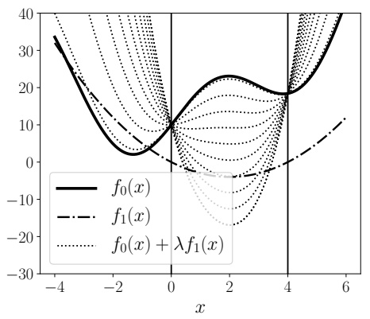

(a)

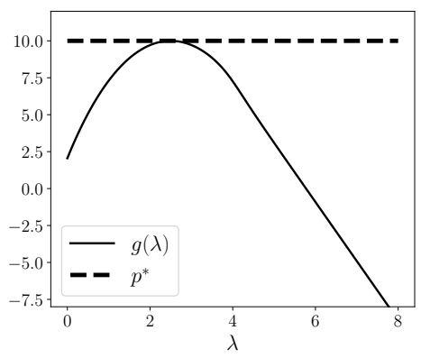

(b)

Hình 25.1. Ví dụ về hàm số đối $n g \hat { \mathsf { d } } \mathsf { u } .$ (a) Đường nét liền đậm thể hiện hàm mục tiêu. Đường chấm gạch thể hiện hàm số ràng buộc. Các đường chấm chấm thể hiện hàm Lagrange ứng với λ khác nhau. (b) Đường nét đứt nằm ngang thể hiện giá trị tối ưu của bài toán. Đường nét liền thể hiện hàm số đối ngẫu. Với mọi λ, giá trị của hàm đối ngẫu nhỏ hơn hoặc bằng giá trị tối ưu của bài toán chính.

Các đường nét chấm trong Hình 25.1a là các đồ thị của hàm Lagrange ứng với λ khác nhau. Vùng bị chặn giữa hai đường thẳng đứng màu đen thể hiện tập khả thi của bài toán.

Với mỗi λ, hàm số đối ngẫu được định nghĩa là:

$$
g (\lambda) = \inf _ {x} \left(x ^ {2} + 1 0 \sin (x) + 1 0 + \lambda ((x - 2) ^ {2} - 4)\right), \lambda \geq 0.
$$

Từ Hình 25.1a, có thể thấy rằng với các λ khác nhau, hàm g(λ) đạt giá trị nhỏ nhất tại điểm có hoành độ bằng 0 của đường nét liền hoặc tại một điểm thấp hơn điểm đó. Trong Hình 25.1b, đường nét liền thể hiện đồ thị của hàm $g ( \lambda )$ , đường nét đứt thể hiện giá trị tối ưu của bài toán tối ưu chính. Ta có thể thấy hai điều:

• Đường nét liền luôn nằm phía dưới (hoặc có đoạn trùng) đường nét đứt.

• Hàm g(λ) là một hàm lõm.

Mã nguồn cho Hình 25.1 có thể được tìm thấy tại [https://goo.gl/jZiRCp](https://goo.gl/jZiRCp).

Ví dụ 2 : Xét một bài toán quy hoạch tuyến tính:

$$
\begin{array}{c} x = \arg \min _ {\mathbf {x}} \mathbf {c} ^ {T} \mathbf {x} \\ \text {thoả mãn:} \mathbf {A} \mathbf {x} = \mathbf {b} \\ \mathbf {x} \succeq 0 \end{array}\tag{25.9}
$$

<!-- page: 342 -->

Hàm ràng buộc cuối cùng có thể được viết lại thành $f _ { i } ( \mathbf { x } ) = - x _ { i } , i = 1 , \ldots , n$ Hàm Lagrange của bài toán này là:

$$
\mathcal {L} (\mathbf {x}, \boldsymbol {\lambda}, \boldsymbol {\nu}) = \mathbf {c} ^ {T} \mathbf {x} - \sum_ {i = 1} ^ {n} \lambda_ {i} x _ {i} + \boldsymbol {\nu} ^ {T} (\mathbf {A} \mathbf {x} - \mathbf {b}) = - \mathbf {b} ^ {T} \boldsymbol {\nu} + (\mathbf {c} + \mathbf {A} ^ {T} \boldsymbol {\nu} - \boldsymbol {\lambda}) ^ {T} \mathbf {x}
$$

(đừng quên điều kiện $\lambda \succeq 0 )$ . Hàm đối ngẫu là

$$
g (\boldsymbol {\lambda}, \boldsymbol {\nu}) = \inf _ {\mathbf {x}} \mathcal {L} (\mathbf {x}, \boldsymbol {\lambda}, \boldsymbol {\nu}) = - \mathbf {b} ^ {T} \boldsymbol {\nu} + \inf _ {\mathbf {x}} (\mathbf {c} + \mathbf {A} ^ {T} \boldsymbol {\nu} - \boldsymbol {\lambda}) ^ {T} \mathbf {x}\tag{25.10}
$$

Nhận thấy rằng hàm tuyến tính $\mathbf { d } ^ { T } \mathbf { x }$ của x bị chặn dưới khi vào chỉ khi $\mathbf { d } = 0$ Vì nếu có một phần tử $d _ { i }$ của d khác 0, chỉ cần chọn $x _ { i }$ rất lớn và ngược dấu với $d _ { i } ,$ ta sẽ có một giá trị nhỏ tuỳ $\hat { \mathbf { y } } .$ Nói cách khác, $g ( \pmb { \lambda } , \pmb { \nu } )   =   - \infty$ trừ khi $\mathbf { c } + \mathbf { A } ^ { T } \pmb { \nu } - \pmb { \lambda } = 0$ . Tóm lại,

$$
g (\boldsymbol {\lambda}, \boldsymbol {\nu}) = \left\{ \begin{array}{c c} - \mathbf {b} ^ {T} \boldsymbol {\nu} & \text {neu} \mathbf {c} + \mathbf {A} ^ {T} \boldsymbol {\nu} - \boldsymbol {\lambda} = 0 \\ - \infty & \text {o.w.} \end{array} \right.\tag{25.11}
$$

Trường hợp thứ hai khi $g ( \pmb { \lambda } , \pmb { \nu } ) = - \infty$ chúng ta sẽ gặp rất nhiều sau này. Trường hợp này không mấy thú vị vì hiển nhiên $g ( \pmb { \lambda } , \pmb { \nu } ) \leq p ^ { * }$ . Với mục đích chính là đi tìm chặn dưới của $p ^ { * }$ , ta chỉ cần quan tâm tới các giá trị của λ và ν sao cho $g ( \lambda , \nu )$ càng lớn càng tốt. Trong bài toán này, ta sẽ quan tâm tới λ và ν sao cho $\mathbf { c } + \mathbf { A } ^ { T } \pmb { \nu } - \pmb { \lambda } = 0$

## 25.3. Bài toán đối ngẫu Lagrange

Với mỗi cặp $( \lambda , \nu )$ , hàm đối ngẫu Lagrange cho chúng ta một chặn dưới cho giá trị tối ưu $p ^ { * }$ của bài toán chính (25.5). Câu hỏi đặt ra là: với cặp giá trị nào của $( \lambda , \nu )$ , chúng ta sẽ có một chặn dưới tốt nhất của $p ^ { * } ?$ Nói cách khác, ta đi cần giải bài toán

$$
\boldsymbol {\lambda} ^ {*}, \boldsymbol {\nu} ^ {*} = \arg \max _ {\boldsymbol {\lambda}, \boldsymbol {\nu}} g (\boldsymbol {\lambda}, \boldsymbol {\nu})
$$

$$
\text {thoả mãn:} \boldsymbol {\lambda} \succeq 0\tag{25.12}
$$

Đây là một bài toán tối ưu lồi vì ta cần tối đa một hàm lõm trên tập khả thi lồi. Trong nhiều trường hợp, lời giải cho bài toán (25.12) có thể dễ tìm hơn bài toán chính.

Bài toán tối ưu (25.12) được gọi là bài toán đối ngẫu Lagrange (Lagrange dual problem) (hoặc viết gọn là bài toán đối ngẫu) ứng với bài toán chính (25.5). Tập khả thi của bài toán đối ngẫu được gọi là tập khả thi đối ngẫu (dual feasible set). Ràng buộc của bài toán đối ngẫu bao gồm điều kiện $\lambda \succeq 0$ và điều kiện ẩn $g ( \pmb { \lambda } , \pmb { \nu } ) > - \infty$ (điều kiện này được thêm vào vì ta chỉ quan tâm tới các $( \lambda , \nu )$ sao cho hàm mục tiêu của bài toán đối ngẫu càng lớn càng tốt). Nghiệm của bài toán đối ngẫu (25.12) ký hiệu bởi $( \lambda ^ { * } , \nu ^ { * } )$ , được gọi là điểm tối ưu đối ngẫu (dual optimal point).

<!-- page: 343 -->

Trong nhiều trường hợp, điều kiện ẩn $g ( \pmb { \lambda } , \pmb { \nu } ) > - \infty$ cũng có thể được viết cụ thể. Quay lại với ví dụ phía trên, điệu kiện ẩn có thể được viết thành $\mathbf { c }   +   \mathbf { A } ^ { T } \pmb { \nu }   -   \pmb { \lambda } = 0$ Đây là một hàm affine. Vì vậy, khi có thêm ràng buộc này, ta vẫn thu được một bài toán lồi.

## 25.3.1. Đối ngẫu yếu

Ký hiệu giá trị tối ưu của bài toán đối ngẫu (25.12) là $d ^ { * }$ . Theo (25.7), ta đã biết $d ^ { * } \leq p ^ { * }$ . Tính chất quan trọng này được gọi là đối ngẫu yếu (weak duality). Ta quan sát thấy hai điều:

• Nếu giá trị tối ưu trong bài toán chính là $p ^ { * } = - \infty$ , ta phải có $d ^ { * } = - \infty$ Điều này tương đương với việc bài toán đối ngẫu là bất khả thi (không có giá trị nào thỏa mãn các ràng buộc).

• Nếu hàm mục tiêu trong bài toán đối ngẫu không bị chặn trên, nghĩa là $d ^ { * } = + \infty$ , ta phải có $p ^ { * } = + \infty$ . Khi đó, bài toán chính là bất khả thi.

Giá trị $p ^ { * } - d ^ { * }$ được gọi là cách biệt đối ngẫu tối ưu (optimal duality gap). Cách biệt này luôn là một số không âm.

Đôi khi có những bài toán tối ưu (lồi hoặc không) rất khó giải. Tuy nhiên, nếu tìm được $d ^ { * }$ , ta có thể biết chặn dưới của bài toán chính. Việc tìm d∗thường đơn giản hơn vì bài toán đối ngẫu luôn luôn là lồi.

## 25.3.2. Đối ngẫu mạnh và tiêu chuẩn ràng buộc Slater

Nếu đẳng thức $p ^ { * } = d ^ { * }$ thoả mãn, cách biệt đối ngẫu tối ưu bằng không, ta nói rằng đối ngẫu mạnh (strong duality) xảy ra. Lúc này, việc giải bài toán đối ngẫu đã giúp tìm được chính xác giá trị tối ưu của bài toán gốc.

Thật không may, đối ngẫu mạnh không thường xuyên xảy ra trong các bài toán tối ưu. Tuy nhiên, nếu bài toán chính là lồi, tức có dạng

$$
\begin{array}{c} x = \arg \min _ {\mathbf {x}} f _ {0} (\mathbf {x}) \\ \text {thoả mãn:} f _ {i} (\mathbf {x}) \leq 0, i = 1, 2, \ldots , m \\ \mathbf {A x} = \mathbf {b} \end{array}\tag{25.13}
$$

trong đó $f _ { 0 } , f _ { 1 } , \ldots , f _ { m }$ là các hàm lồi, chúng ta thường (không luôn luôn) có đối ngẫu mạnh. Rất nhiều nghiên cứu đã thiết lập các điều kiện ngoài tính chất lồi để đối ngẫu mạnh xảy ra. Những điều kiện đó có tên là tiêu chuẩn ràng buộc (constraint qualification).

Một trong các tiêu chuẩn ràng buộc phổ biến nhất là tiêu chuẩn ràng buộc Slater (Slater’s constraint qualification).

<!-- page: 344 -->

Trước khi thảo luận về tiêu chuẩn ràng buộc Slatter, chúng ta cần định nghĩa:

## Định nghĩa 25.1: Khả thi chặt

Một điểm khả thi của bài toán (25.13) được gọi là khả thi chặt (stricly feasible) nếu:

$$
f _ {i} (\mathbf {x}) <   0, i = 1, 2, \dots , m, \quad \mathbf {A x} = \mathbf {b}
$$

Khả thi chặt khác với khả thi ở việc dấu bằng trong các bất phương trình ràng buộc không xảy ra.

## Định lý 25.1: Tiêu chuẩn ràng buộc Slater

Nếu bài toàn chính là một bài toán tối ưu lồi và tồn tại một điểm khả thi chặt thì đối ngẫu mạnh xảy ra.

Điều kiện khá đơn giản sẽ giúp ích cho nhiều bài toán tối ưu sau này.

Chú ý:

• Đối ngẫu mạnh không thường xuyên xảy ra. Với các bài toán lồi, điều này xảy ra thường xuyên hơn. Tồn tại những bài toán lồi mà đối ngẫu mạnh không đạt được.

• Có những bài toán không lồi nhưngđối ngẫu mạnh vẫn xảy ra. Bài toán tối ưu trong Hình 25.1 là một ví dụ.

## 25.4. Các điều kiện tối ưu

## 25.4.1. Sự lỏng lẻo bù trừ

Giả sử đối ngẫu mạnh xảy ra. Gọi $\mathbf { x } ^ { * }$ là một điểm tối ưu của bài toán chính và $( \lambda ^ { * } , \nu ^ { * } )$ là cặp điểm tối ưu của bài toán đối ngẫu. Ta có

$$
f _ {0} (\mathbf {x} ^ {*}) = g (\boldsymbol {\lambda} ^ {*}, \boldsymbol {\nu} ^ {*})\tag{25.14}
$$

$$
= \inf _ {\mathbf {x}} \left(f _ {0} (\mathbf {x}) + \sum_ {i = 1} ^ {m} \lambda_ {i} ^ {*} f _ {i} (\mathbf {x}) + \sum_ {j = 1} ^ {p} \nu_ {j} ^ {*} h _ {j} (\mathbf {x})\right)\tag{25.15}
$$

$$
\begin{array}{l} \leq f _ {0} (\mathbf {x} ^ {*}) + \sum_ {i = 1} ^ {m} \lambda_ {i} ^ {*} f _ {i} (\mathbf {x} ^ {*}) + \sum_ {j = 1} ^ {p} \nu_ {j} ^ {*} h _ {j} (\mathbf {x} ^ {*}) \\ \leq f _ {0} (\mathbf {x} ^ {*}) \end{array}\tag{25.16}
$$

(25.17)

<!-- page: 345 -->

Đẳng thức (25.14) xảy ra do đối ngẫu mạnh. Đẳng thức (25.15) xảy ra do định nghĩa của hàm đối ngẫu. Bất đẳng thức (25.16) là hiển nhiên vì infimum của một hàm nhỏ hơn giá trị của hàm đó tại bất kỳ điểm nào khác. Bất đẳng thức (25.17) xảy ra vì các ràng buộc $f _ { i } ( \mathbf { x } ^ { * } ) \leq 0 , \lambda _ { i } \geq 0 , i = 1 , 2 , \ldots , m$ và $h _ { j } ( \mathbf { x } ^ { * } ) = 0$ . Từ đây có thể thấy rằng dấu đẳng thức ở (25.16) và (25.17) phải đồng thời xảy ra. Ta lại có thêm hai quan sát thú vị nữa:

$\mathbf { x } ^ { * }$ là một điểm tối ưu của $g ( \pmb { \lambda } ^ { * } , \pmb { \nu } ^ { * } )$

• Thú vị hơn, $\sum_{i = 1}^{m} \lambda_{i}^{*} f_{i}(\mathbf{x}^{*}) = 0. \mathrm{Vi} \lambda^{*} f_{i}(\mathbf{x}^{*}) \leq 0.$ , ta phải có $\lambda _ { i } ^ { * } f _ { i } ( \mathbf { x } ^ { * } )   =   0 ,$ ∀i. Điều kiện này được gọi là điều kiện lỏng lẻo bù trừ (complementary slackness). Từ đây ta có:

$$
\lambda_ {i} ^ {*} > 0 \Rightarrow f _ {i} (\mathbf {x} ^ {*}) = 0\tag{25.18}
$$

$$
f _ {i} (\mathbf {x} ^ {*}) <   0 \Rightarrow \lambda_ {i} ^ {*} = 0\tag{25.19}
$$

Tức một trong hai giá trị này phải bằng 0.

## 25.4.2. Các điều kiện tối ưu KKT

Ta vẫn giả sử rằng các hàm đang xét có đạo hàm và bài toán tối ưu không nhất thiết là lồi.

## Điều kiện KKT cho bài toán tối ưu (không nhất thiết lồi)

Giả sử đối ngẫu mạnh xảy ra. ${ \mathrm { G o i ~ } } { \bf x } ^ { * } { \mathrm { ~ v \AA ~ } } ( { \pmb \lambda } ^ { * } , { \pmb \nu } ^ { * } )$ là mộ bộ điểm tối ưu chính và tối ưu đối ngẫu. Vì $\mathbf { x } ^ { * }$ tối ưu hàm khả vi $\mathcal { L } ( \mathbf { x } , \pmb { \lambda } ^ { * } , \pmb { \nu } ^ { * } )$ , đạo hàm của hàm Lagrange tại $\mathbf { x } ^ { * }$ phải bằng 0.

Điều kiện Karush-Kuhn-Tucker (KKT) nói rằng $\mathbf { x } ^ { * } , \pmb { \lambda } ^ { * } , \pmb { \nu } ^ { * }$ phải thoả mãn:

$$
f _ {i} (\mathbf {x} ^ {*}) \leq 0, i = 1, 2, \dots , m\tag{25.20}
$$

$$
h _ {j} (\mathbf {x} ^ {*}) = 0, j = 1, 2, \dots , p\tag{25.21}
$$

$$
\lambda_ {i} ^ {*} \geq 0, i = 1, 2, \dots , m\tag{25.22}
$$

$$
\lambda_ {i} ^ {*} f _ {i} (\mathbf {x} ^ {*}) = 0, i = 1, 2, \dots , m\tag{25.23}
$$

$$
\nabla_ {\mathbf {x}} f _ {0} (\mathbf {x} ^ {*}) + \sum_ {i = 1} ^ {m} \lambda_ {i} ^ {*} \nabla_ {\mathbf {x}} f _ {i} (\mathbf {x} ^ {*}) + \sum_ {j = 1} ^ {p} \nu_ {j} ^ {*} \nabla_ {\mathbf {x}} h _ {j} (\mathbf {x} ^ {*}) = 0\tag{25.24}
$$

Đây là điều kiện cần để $\mathbf { x } ^ { * } , \pmb { \lambda } ^ { * } , \pmb { \nu } ^ { * }$ là nghiệm của bài toán chính và bài toán đối ngẫu. Hai điều kiện đầu chính là ràng buộc của bài toán chính. Điều kiện $\lambda _ { i } ^ { * } f _ { i } ( \mathbf { x } ^ { * } )$ là điều kiện lỏng lẻo bù trừ. Điều kiện cuối cùng là đạo hàm của hàm Lagrange theo $\mathbf { x } ^ { * }$ bằng không.

<!-- page: 346 -->

## Điều kiện KKT cho bài toán lồi

Với bài toán lồi và đối ngẫu mạnh xảy ra, các điều kiện KKT vừa đề cập cũng là điều kiện đủ. Vậy với các bài toán tối ưu lồi có hàm mục tiêu và hàm ràng buộc là khả vi, bất kỳ bộ (x∗, λ∗, ν∗) nào thoả mãn các điều kiện KKT đều là điểm tối ưu của bài toán chính và bài toán đối ngẫu.

Các điều kiện KKT rất quan trọng trong tối ưu. Trong một vài trường hợp đặc biệt (chúng ta sẽ thấy trong Phần 26), việc giải hệ (bất) phương trình các điều kiện KKT là khả thi. Rất nhiều thuật toán tối ưu được xây dựng dựa trên việc giải hệ điều kiện KKT.

Ví dụ: Xét bài toán quy hoạch toàn phương với ràng buộc phương trình:

$$
\mathbf {x} = \arg \min _ {\mathbf {x}} \frac {1}{2} \mathbf {x} ^ {T} \mathbf {P} \mathbf {x} + \mathbf {q} ^ {T} \mathbf {x} + r
$$

thoả mãn: Ax = b.

(25.25)

Trong đó P làm một ma trận nửa nửa xác định dương. Hàm số Lagrange của bài toán này là

$$
\mathcal {L} (\mathbf {x}, \boldsymbol {\nu}) = \frac {1}{2} \mathbf {x} ^ {T} \mathbf {P} \mathbf {x} + \mathbf {q} ^ {T} \mathbf {x} + r + \boldsymbol {\nu} ^ {T} (\mathbf {A} \mathbf {x} - \mathbf {b})
$$

Hệ điều kiện KKT:

$$
\mathbf {A} \mathbf {x} ^ {*} = \mathbf {b}\tag{25.26}
$$

$$
\mathbf {P} \mathbf {x} ^ {*} + \mathbf {q} + \mathbf {A} ^ {T} \boldsymbol {\nu} ^ {*} = 0\tag{25.27}
$$

Phương trình thứ hai chính là phương trình đạo hàm của hàm Lagrange tại $\mathbf { x } ^ { * }$ bằng 0. Hệ phương trình này có thể được viết lại dưới dạng

$$
\left[ \begin{array}{c c} \mathbf {P} & \mathbf {A} ^ {T} \\ \mathbf {A} & \mathbf {0} \end{array} \right] \left[ \begin{array}{c} \mathbf {x} ^ {*} \\ \boldsymbol {\nu} ^ {*} \end{array} \right] = \left[ \begin{array}{c} - \mathbf {q} \\ \mathbf {b} \end{array} \right]
$$

Đây là một phương trình tuyến tính đơn giản.

## 25.5. Tóm tắt

Giả sử rằng các hàm số đều khả vi.

• Các bài toán tối ưu với ràng buộc chỉ gồm phương trình có thể được giải bằng phương pháp nhân tử Lagrange. Điều kiện cần để một điểm là nghiệm của bài toán tối ưu là nó phải thỏa mãn đạo hàm của hàm Lagrange bằng không.

• Với các bài toán tối ưu (không nhất thiết lồi) có thêm ràng buộc là bất phương trình, chúng ta có hàm Lagrange tổng quát và các biến đối ngẫu Lagrange λ, ν. Với các giá trị (λ, ν) cố định, ta có định nghĩa về hàm đối ngẫu Lagrange g(λ, ν). Hàm số này là infimum của hàm Lagrange khi x thay đổi trên tập xác định của bài toán.

<!-- page: 347 -->

$g ( \pmb { \lambda } , \pmb { \nu } ) \leq p ^ { * }$ với mọi $( \lambda , \nu )$

• Hàm đối ngẫu Lagrange là lõm bất kể bài toán tối ưu chính có lồi hay không.

• Bài toán đi tìm giá trị lớn nhất của hàm đối ngẫu Lagrange với điều kiện λ  0 được gọi là bài toán đối ngẫu. Đây là một bài toán tối ưu lồi bất kể bài toán chính có lồi hay không.

• Gọi giá trị tối ưu của bài toán đối ngẫu là d∗, ta có $d ^ { * } \leq p ^ { * }$ . Đây được gọi là đối ngẫu yếu.

• Đối ngẫu mạnh xảy ra khi $d ^ { * } = p ^ { * }$ . Trong các bài toán lồi, đối ngẫu mạnh thường xảy ra nhiều hơn.

• Nếu bài toán chính là lồi và tiêu chuẩn ràng buộc Slater thoả mãn thì đối ngẫu mạnh xảy ra.

• Nếu bài toán chính là lồi và đối ngẫu mạnh xảy ra thì điểm tối ưu thoả mãn các điều kiện KKT (điều kiện cần và đủ).

• Rất nhiều bài toán tối ưu được giải quyết thông qua các điều kiện KKT.

<!-- page: 348 -->

<!-- page: 349 -->

Máy vector hỗ trợ

<!-- page: 350 -->

# Máy vector hỗ trợ

## 26.1. Giới thiệu

Máy vector hỗ trợ (support vector machine, SVM) là một trong những thuật toán phân loại phổ biến và hiệu quả. $\acute { \mathrm { Y } }$ tưởng đứng sau SVM khá đơn giản, nhưng để giải bài toán tối ưu SVM, chúng ta cần kiến thức về tối ưu và đối ngẫu.

Trước khi đi vào phần $\acute { \mathrm { y } }$ tưởng chính của SVM, chúng ta cùng ôn lại kiến thức về hình học giải tích trong chương trình phổ thông.

## 26.1.1. Khoảng cách từ một điểm tới một siêu mặt phẳng

Trong không gian hai chiều, khoảng cách từ một điểm có toạ độ $( x _ { 0 } , y _ { 0 } )$ tới đường thẳng có phương trình $w_{1}x + w_{2}y + b = 0$ được xác định bởi

$$
\frac {| w _ {1} x _ {0} + w _ {2} y _ {0} + b |}{\sqrt {w _ {1} ^ {2} + w _ {2} ^ {2}}}
$$

Trong không gian ba chiều, khoảng cách từ một điểm có toạ độ $( x _ { 0 } , y _ { 0 } , z _ { 0 } )$ tới một mặt phẳng có phương trình $w _ { 1 } x + w _ { 2 } y + w _ { 3 } z + b = 0$ được xác định bởi

$$
\frac {| w _ {1} x _ {0} + w _ {2} y _ {0} + w _ {3} z _ {0} + b |}{\sqrt {w _ {1} ^ {2} + w _ {2} ^ {2} + w _ {3} ^ {2}}}
$$

Hơn nữa, nếu bỏ dấu trị tuyệt đối ở tử số, ta có thể xác định được điểm đó nằm về phía nào của đường thẳng hay mặt phẳng đang xét. Những điểm làm cho biểu thức trong dấu trị tuyệt đối mang dấu dương nằm về cùng một phía (tạm gọi là phía dương), những điểm làm cho giá trị này mang dấu âm nằm về phía còn lại (gọi là phía âm). Những điểm làm cho tử số bằng không sẽ nằm trên đường thẳng/mặt phẳng phân chia.

<!-- page: 351 -->

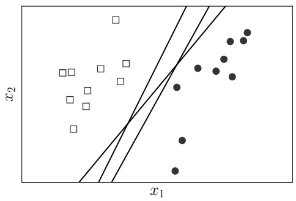

Hình 26.1. Hai lớp dữ liệu vuông và tròn là tách biệt tuyến tính. Có vô số đường thằng có thể phân loại chính xác hai lớp dữ liệu này (xem thêm Chương 13).

Các công thức này có thể được tổng quát lên cho trường hợp không gian d chiều. Khoảng cách từ một điểm (vector) có toạ độ $( x _ { 1 0 } , x _ { 2 0 } , \ldots , x _ { d 0 } )$ tới siêu phẳng $w _ { 1 } x _ { 1 } + w _ { 2 } x _ { 2 } + \cdots + w _ { d } x _ { d } + b = 0$ được xác định bởi

$$
\frac {| w _ {1} x _ {1 0} + w _ {2} x _ {2 0} + \cdots + w _ {d} x _ {d 0} + b |}{\sqrt {w _ {1} ^ {2} + w _ {2} ^ {2} + \cdots + w _ {d} ^ {2}}} = \frac {| \mathbf {w} ^ {T} \mathbf {x} _ {0} + b |}{\| \mathbf {w} \| _ {2}}
$$

$$
\mathrm{v} \acute {\mathrm{o}} \mathrm{i} \mathbf {x} _ {0} = [ x _ {1 0}, x _ {2 0}, \dots , x _ {d 0} ] ^ {T}, \mathbf {w} = [ w _ {1}, w _ {2}, \dots , w _ {d} ] ^ {T}.
$$

## 26.1.2. Nhắc lại bài toán phân loại hai lớp dữ liệu

Xin nhắc lại bài toán phân loại đã đề cập trong Chương 13 (PLA). Giả sử có hai lớp dữ liệu được mô tả bởi các vector đặc trưng trong không gian nhiều chiều. Hơn nữa, hai lớp dữ liệu này là tách biệt tuyến tính, tức tồn tại một siêu phẳng phân chia chính xác hai lớp đó. Hãy tìm một siêu phẳng sao cho tất cả các điểm thuộc một lớp nằm về cùng một phía của siêu phẳng đó và ngược phía với toàn bộ các điểm thuộc lớp còn lại. Chúng ta đã biết rằng, thuật toán PLA có thể thực hiện được việc này nhưng PLA có thể cho vô số nghiệm như Hình 26.1.

Có một câu hỏi được đặt ra: Trong vô số các mặt phân chia đó, đâu là mặt tốt nhất? Trong ba đường thẳng minh họa trong Hình 26.1, có hai đường thẳng khá lệch về phía lớp hình tròn. Điều này có thể khiến nhiều điểm hình tròn chưa nhìn thấy bị phân loại lỗi thành điểm hình vuông. Liệu có cách nào tìm được đường phân chia sao cho đường này không lệch về một lớp không?

Để trả lời câu hỏi này, chúng ta cần tìm một tiêu chuẩn để đo sự lệch về mỗi lớp của đường phân chia. Gọi khoảng cách nhỏ nhất từ một điểm thuộc một lớp tới đường phân chia là lề (margin). Ta cần tìm một đường phân chia sao cho lề của hai lớp là như nhau đối với đường phân chia đó. Hơn nữa, độ rộng của lề càng lớn thì khả năng xảy ra phân loại lỗi càng thấp. Bài toán tối ưu trong SVM chính là bài toán đi tìm đường phân chia sao cho lề rộng nhất. Đây cũng là lý do SVM còn được gọi là bộ phân loại lề lớn nhất (maximum margin classifier). Nguồn gốc tên gọi máy vector hỗ trợ sẽ sớm được làm sáng tỏ.

<!-- page: 352 -->

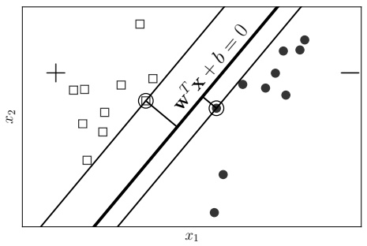

(a)

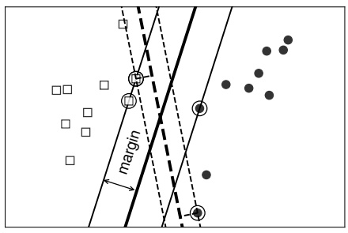

(b)

Hình 26.2. Ý tưởng của SVM. Lề của một lớp được định nghĩa là khoảng cách từ các điểm gần nhất của lớp đó tới mặt phân chia. Lề của hai lớp phải bằng nhau và lớn nhất có thể.

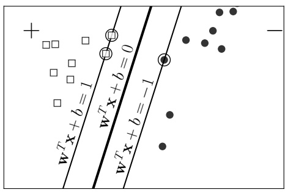

**Hình 26.3.** Giả sử mặt phân chia có phương trình $\mathbf { w } ^ { T } \mathbf { x }   +   b = 0$ Không mất tính tổng quát, bằng cách nhân các hệ số w và b với các hằng số phù hợp, ta $c \dot { 0 }$ thể giả sử rằng điểm gần nhất của lớp vuông tới mặt này thoả mãn $\mathbf { w } ^ { T } \mathbf { x + } b = 1$ Khi đó, điểm gần nhất của lớp tròn thoả mãn $\mathbf { w } ^ { T } \mathbf { x } + b = - 1$

## 26.2. Xây dựng bài toán tối ưu cho máy vector hỗ trợ

Giả sử dữ liệu trong tập huấn luyện là các cặp (vector đặc trưng, nhãn): $( \mathbf { x } _ { 1 } , y _ { 1 } ) , ( \mathbf { x } _ { 2 } , y _ { 2 } ) , \ldots , ( \mathbf { x } _ { N } , y _ { N } )$ nhãn bằng +1 hoặc -1 và N là số điểm dữ liệu. Không mất tính tổng quát, giả sử các điểm vuông có nhãn là 1, các điểm tròn có nhãn là -1 và siêu phẳng $\mathbf { w } ^ { T } \mathbf { x } + b = 0$ là mặt phân chia hai lớp (Hình 26.3). Ngoài ra, lớp hình vuông nằm về phía dương, lớp hình tròn nằm về phía âm của mặt phân chia. Nếu xảy ra điều ngược lại, ta chỉ cần đổi dấu của w và b. Bài toán tối ưu trong SVM sẽ là bài toán đi tìm các tham số mô hình w và b.

Với cặp dữ liệu $( \mathbf { x } _ { n } , y _ { n } )$ bất kỳ, khoảng cách từ $\mathbf { x } _ { n }$ tới mặt phân chia là $\frac { y _ { n } ( \mathbf { w } ^ { T } \mathbf { x } _ { n } + b ) } { \| \mathbf { w } \| _ { 2 } }$ Điều này xảy ra ta đã giả sử $y _ { n }$ cùng dấu với phía của $\mathbf { x } _ { n }$ . Từ đó suy ra $y _ { n }$ cùng dấu với $\left( \mathbf { w } ^ { T } \mathbf { x } _ { n } + b \right)$ và tử số luôn là một đại lượng không âm. Với mặt phân chia này, lề được tính là khoảng cách gần nhất từ một điểm (trong cả hai lớp, vì cuối cùng lề của hai lớp bằng nhau) tới mặt phân chia:

$$
\mathrm{l} \dot {\mathrm{e}} = \min _ {n} \frac {y _ {n} (\mathbf {w} ^ {T} \mathbf {x} _ {n} + b)}{\| \mathbf {w} \| _ {2}}
$$

<!-- page: 353 -->

Bài toán $\mathrm { t } \hat { \mathrm { O i } }$ ưu của SVM đi tìm w và b sao cho lề đạt giá trị lớn nhất:

$$
(\mathbf {w}, b) = \arg \max _ {\mathbf {w}, b} \left\{\min _ {n} \frac {y _ {n} \left(\mathbf {w} ^ {T} \mathbf {x} _ {n} + b\right)}{\| \mathbf {w} \| _ {2}} \right\} = \arg \max _ {\mathbf {w}, b} \left\{\frac {1}{\| \mathbf {w} \| _ {2}} \min _ {n} y _ {n} \left(\mathbf {w} ^ {T} \mathbf {x} _ {n} + b\right) \right\}\tag{26.1}
$$

Nếu ta thay vector trọng số w bởi kw và b bởi kb trong đó k là một hằng số dương bất kỳ thì mặt phân chia không thay đổi, tức khoảng cách từ từng điểm đến mặt phân chia không đổi, tức lề không đổi. Vì vậy, ta có thể giả sử:

$$
y _ {m} (\mathbf {w} ^ {T} \mathbf {x} _ {m} + b) = 1
$$

với những điểm nằm gần mặt phân chia nhất (được khoanh tròn trong Hình 26.3).

Như vậy, với mọi n ta luôn có

$$
y _ {n} (\mathbf {w} ^ {T} \mathbf {x} _ {n} + b) \geq 1
$$

Bài toán tối ưu (26.1) có thể được đưa về bài toán tối ưu ràng buộc có dạng

$$
\begin{array}{c} {(\mathbf {w}, b) = \arg \max _ {\mathbf {w}, b} \frac {1}{\| \mathbf {w} \| _ {2}}} \\ {\mathrm{thoâ} \tilde {\mathrm{mân}}: y _ {n} (\mathbf {w} ^ {T} \mathbf {x} _ {n} + b) \geq 1, \forall n = 1, 2, \ldots , N} \end{array}\tag{26.2}
$$

Bằng một biến đổi đơn giản, ta có thể tiếp tục đưa bài toán này về dạng

$$
\begin{array}{c} (\mathbf {w}, b) = \arg \min _ {\mathbf {w}, b} \frac {1}{2} \| \mathbf {w} \| _ {2} ^ {2} \\ \text {thoả   mãn:} 1 - y _ {n} (\mathbf {w} ^ {T} \mathbf {x} _ {n} + b) \leq 0, \forall n = 1, 2, \ldots , N \end{array}\tag{26.3}
$$

$\dot { \mathrm { O } }$ đây, ta đã lấy nghịch đảo hàm mục tiêu, bình phương nó $\mathrm { d } \hat { \mathrm { e } }$ được một hàm khả vi, và nhân với $\left[ \frac{1}{2} \right.$ để biểu thức đạo hàm đẹp hơn.

Trong bài toán (26.3), hàm mục tiêu là một chuẩn – có dạng toàn phương. Các hàm bất phương trình ràng buộc là affine. Vậy bài toán (26.3) là một bài toán quy hoạch toàn phương. Hơn nữa, hàm mục tiêu là lồi chặt vì $\begin{array} { r } { \big [ \| \mathbf { w } \| _ { 2 } ^ { 2 } = \mathbf { w } ^ { T } \mathbf { I } \mathbf { w } } \end{array}$ và I là ma trận đơn vị – một ma trận xác định dương. Từ đây có thể suy ra nghiệm của SVM là duy nhất.

Tới đây, bài toán này có thể giải được bằng các công cụ hỗ trợ giải quy hoạch toàn phương, ví dụ CVXOPT. Tuy nhiên, việc giải bài toán này trở nên phức tạp khi số chiều d của không gian dữ liệu và số điểm dữ liệu N lớn. Thay vào đó, người ta thường giải bài toán đối ngẫu của bài toán này. Thứ nhất, bài toán đối ngẫu có những tính chất thú vị khiến nó được giải một cách hiệu quả hơn. Thứ hai, trong quá trình xây dựng bài toán đối ngẫu, người ta thấy rằng SVM có thể được áp dụng cho những bài toán mà dữ liệu không nhất thiết tách biệt tuyến tính, như chúng ta sẽ thấy ở các chương sau của phần này.

<!-- page: 354 -->

## Xác định lớp cho một điểm dữ liệu mới

Sau khi đã tìm được mặt phân chia $\mathbf { w } ^ { T } \mathbf { x } + b = 0$ , nhãn của một điểm bất kỳ sẽ được xác định đơn giản bằng

$$
\mathrm{class} (\mathbf {x}) = \mathrm{sgn} (\mathbf {w} ^ {T} \mathbf {x} + b)
$$

## 26.3. Bài toán đối ngẫu của máy vector hỗ trợ

Bài toán tối ưu (26.3) là một bài toán lồi. Chúng ta biết rằng nếu một bài toán lồi thoả mãn tiêu chuẩn Slater thì đối ngẫu mạnh xảy ra (xem Mục 25.3.2). Ngoài ra, nếu đối ngẫu mạnh thoả mãn thì nghiệm của bài toán chính là nghiệm của hệ điều kiện KKT (xem Mục 25.4.2).

## 26.3.1. Kiểm tra tiêu chuẩn Slater

Trong bước này, chúng ta sẽ chứng minh bài toán tối ưu (26.3) thoả mãn điều kiện Slater. Điều kiện Slater nói rằng, nếu tồn tại w, b thoả mãn

$$
1 - y _ {n} (\mathbf {w} ^ {T} \mathbf {x} _ {n} + b) <   0, \forall n = 1, 2, \dots , N
$$

thì đối ngẫu mạnh cũng thoả mãn. Việc kiểm tra điều kiện này không quá phức tạp. Vì luôn có một siêu phẳng phân chia hai lớp dữ liệu tách biệt tuyến tính nên tập khả thi của bài toán tối ưu (26.3) khác rỗng. Điều này cũng có nghĩa là luôn tồn tại cặp $\left( \mathbf { w } _ { 0 } , b _ { 0 } \right)$ sao cho:

$$
1 - y _ {n} (\mathbf {w} _ {0} ^ {T} \mathbf {x} _ {n} + b _ {0}) \leq 0, \forall n = 1, 2, \dots , N\tag{26.4}
$$

$$
\Leftrightarrow 2 - y _ {n} (2 \mathbf {w} _ {0} ^ {T} \mathbf {x} _ {n} + 2 b _ {0}) \leq 0, \forall n = 1, 2, \dots , N\tag{26.5}
$$

Vậy chỉ cần chọn $\mathbf { w } _ { 1 } = 2 \mathbf { w } _ { 0 }$ và $b _ { 1 } = 2 b _ { 0 }$ , ta sẽ có:

$$
1 - y _ {n} (\mathbf {w} _ {1} ^ {T} \mathbf {x} _ {n} + b _ {1}) \leq - 1 <   0, \forall n = 1, 2, \dots , N
$$

Điều này chỉ ra rằng $( \mathbf { w } _ { 1 } , b _ { 1 } )$ là một điểm khả thi chặt. Từ đó suy ra điều kiện Slater thoả mãn.

## 26.3.2. Hàm Lagrange của bài toán tối ưu

Hàm Lagrange của bài toán (26.3) là

$$
\mathcal {L} (\mathbf {w}, b, \boldsymbol {\lambda}) = \frac {1}{2} \| \mathbf {w} \| _ {2} ^ {2} + \sum_ {n = 1} ^ {N} \lambda_ {n} (1 - y _ {n} (\mathbf {w} ^ {T} \mathbf {x} _ {n} + b))\tag{26.6}
$$

với $\begin{aligned} { \mathbf { \lambda } = [ \lambda _ { 1 } , \lambda _ { 2 } , \ldots , \lambda _ { N } ] ^ { T } \hat { \operatorname { v a } } \lambda _ { n } \geq 0 , \forall n = 1 , 2 , \ldots , N . } \\ \end{aligned}$

<!-- page: 355 -->

## 26.3.3. Hàm đối ngẫu Lagrange

Theo định nghĩa, hàm đối ngẫu Lagrange là

$$
g (\boldsymbol {\lambda}) = \min _ {\mathbf {w}, b} \mathcal {L} (\mathbf {w}, b, \boldsymbol {\lambda})
$$

với $\lambda \succeq 0$ . Việc tìm giá trị nhỏ nhất của hàm này theo w và b có thể đựợc thực hiện bằng cách giải hệ phương trình đạo hàm của $\mathcal { L } ( \mathbf { w } , b , \mathbf { \lambda } )$ theo w và b bằng 0:

$$
\nabla_ {\mathbf {w}} \mathcal {L} (\mathbf {w}, b, \boldsymbol {\lambda}) = \mathbf {w} - \sum_ {n = 1} ^ {N} \lambda_ {n} y _ {n} \mathbf {x} _ {n} = \mathbf {0} \Rightarrow \mathbf {w} = \sum_ {n = 1} ^ {N} \lambda_ {n} y _ {n} \mathbf {x} _ {n}\tag{26.7}
$$

$$
\nabla_ {b} \mathcal {L} (\mathbf {w}, b, \boldsymbol {\lambda}) = \sum_ {n = 1} ^ {N} \lambda_ {n} y _ {n} = 0\tag{26.8}
$$

Thay (26.7) và (26.8) vào (26.6) ta thu được $g ( \lambda ) ^ { 6 3 }$

$$
g (\pmb {\lambda}) = \sum_ {n = 1} ^ {N} \lambda_ {n} - \frac {1}{2} \sum_ {n = 1} ^ {N} \sum_ {m = 1} ^ {N} \lambda_ {n} \lambda_ {m} y _ {n} y _ {m} \mathbf {x} _ {n} ^ {T} \mathbf {x} _ {m}\tag{26.9}
$$

Hàm $g ( \lambda )$ trong (26.9) là hàm $\mathrm { s } \hat { \mathrm { o } }$ quan trọng nhất của SVM, chúng ta sẽ thấy rõ hơn $\mathring { \mathrm { d } }$ Chương 28.

Ta có thể viết lại $g ( \lambda )$ dưới dạng<sup>64</sup>

$$
g (\pmb {\lambda}) = - \frac {1}{2} \pmb {\lambda} ^ {T} \pmb {\mathsf {V}} ^ {T} \pmb {\mathsf {V}} \pmb {\lambda} + \pmb {\mathsf {1}} ^ {T} \pmb {\lambda}.\tag{26.10}
$$

$$
\text {vói} \mathbf {V} = \left[ y _ {1} \mathbf {x} _ {1}, y _ {2} \mathbf {x} _ {2}, \dots , y _ {N} \mathbf {x} _ {N} \right] \text {và} \mathbf {1} = [ 1, 1, \dots , 1 ] ^ {T}.
$$

Nếu đặt $\mathbf { K } = \mathbf { V } ^ { T } \mathbf { V }$ thì K là một ma trận nửa xác định dương. Thật vậy, với mọi vector λ ta có $$\pmb { \lambda } ^ { T } \mathbf { K } \pmb { \lambda } = \pmb { \lambda } ^ { T } \mathbf { V } ^ { T } \mathbf { V } \pmb { \lambda } = \| \mathbf { V } \pmb { \lambda } \| _ { 2 } ^ { 2 } \geq 0 .$ V ö y $g ( { \pmb \lambda } ) \stackrel { \cdot } { = } - \frac { 1 } { 2 } { \pmb \lambda } ^ { T } \dot { \mathbf { K } } { \pmb \lambda } + { \pmb 1 } ^ { T } { \pmb \lambda }$$ là một hàm lồi.

## 26.3.4. Bài toán đối ngẫu Lagrange

Từ đó, kết hợp hàm đối ngẫu Lagrange và các điều kiện ràng buộc của λ, ta sẽ thu được bài toán đối ngẫu Lagrange của bài toán (26.3):

$$
\boldsymbol {\lambda} = \arg \max _ {\boldsymbol {\lambda}} g (\boldsymbol {\lambda})
$$

thoả mãn: λ  0

$$
\sum_ {n = 1} ^ {N} \lambda_ {n} y _ {n} = 0\tag{26.11}
$$

<small><span class="docvortex-page-footnote" data-block-type="page_footnote" style="color:#6b7280">63 Phần chứng minh coi như một bài tập nhỏ cho bạn đọc.</span></small>

<small><span class="docvortex-page-footnote" data-block-type="page_footnote" style="color:#6b7280">64 Phần chứng minh coi như một bài tập nhỏ khác cho bạn đọc.</span></small>

<!-- page: 356 -->

Ràng buộc thứ hai được lấy từ (26.8). Đây là một bài toán lồi vì ta đang đi tìm giá trị lớn nhất của một hàm mục tiêu lõm trên một đa diện. Hơn nữa, đây là một bài toán quy hoạch toàn phương và cũng có thể được giải bằng các thư viện như CVXOPT.

Biến tối ưu trong bài toán tối ngẫu là λ, là một vector N chiều tương ứng với số điểm dữ liệu. Trong khi đó, số tham số phải tìm trong bài toán tối ưu chính (26.3) là d + 1, chính là tổng số chiều của w và b, tức số chiều của mỗi điểm dữ liệu cộng một. Trong rất nhiều trường hợp, số điểm dữ liệu trong tập huấn luyện lớn hơn số chiều dữ liệu. Nếu giải trực tiếp bằng các công cụ giải quy hoạch toàn phương, bài toán đối ngẫu có thể phức tạp hơn bài toán gốc. Tuy nhiên, điểm hấp dẫn của bài toán đối ngẫu này đến từ cấu trúc đặc biệt của hệ điều kiện KKT.

## 26.3.5. Điều kiện KKT

Quay trở lại bài toán, vì đây là một bài toán tối ưu lồi và đối ngẫu mạnh xảy ra, nghiệm của bài toán thoả mãn hệ điều kiện KKT sau đây với biến số w, b và λ:

$$
1 - y _ {n} (\mathbf {w} ^ {T} \mathbf {x} _ {n} + b) \leq 0, \forall n = 1, 2, \dots , N\tag{26.12}
$$

$$
\lambda_ {n} \geq 0, \forall n = 1, 2, \dots , N\tag{26.13}
$$

$$
\lambda_ {n} (1 - y _ {n} (\mathbf {w} ^ {T} \mathbf {x} _ {n} + b)) = 0, \forall n = 1, 2, \dots , N\tag{26.14}
$$

$$
\mathbf {w} = \sum_ {n = 1} ^ {N} \lambda_ {n} y _ {n} \mathbf {x} _ {n}\tag{26.15}
$$

$$
\sum_ {n = 1} ^ {N} \lambda_ {n} y _ {n} = 0\tag{26.16}
$$

Trong những điều kiện trên, điều kiện lỏng lẻo bù trừ (26.14) là thú vị nhất. Từ đó ta có thể suy ra $\lambda _ { n } = 0$ hoặc $1 - y _ { n } ( \mathbf { w } ^ { T } \mathbf { x } _ { n } + b ) = 0$ với n bất kỳ. Trường hợp thứ hai tương đương với

$$
\mathbf {w} ^ {T} \mathbf {x} _ {n} + b = y _ {n}.\tag{26.17}
$$

Những điểm thoả mãn (26.17) chính là những điểm nằm gần mặt phân chia nhất (những điểm được khoanh tròn trong Hình 26.3). Hai đường thẳng $\mathbf { w } ^ { T } \mathbf { x } _ { n }   +   b = \pm 1$ tựa lên các vector thoả mãn (26.17). Những vector thoả mãn (26.17) được gọi là vector hỗ trợ(support vector). Tên gọi máy vector hỗ trợ xuất phát từ đây.

Số lượng điểm thoả mãn (26.17) thường chiếm một lượng nhỏ trong số N điểm dữ liệu huấn luyện. Chỉ cần dựa trên những vector hỗ trợ này, chúng ta hoàn toàn có thể xác định được mặt phân cách cần tìm. Nói cách khác, hầu hết các $\lambda _ { n }$ bằng không, tức λ là một vector thưa. Máy vector hỗ trợ vì vậy cũng được coi là một mô hình thưa (sparse model). Các mô hình thưa thường có cách giải quyết hiệu quả hơn các mô hình tương tự với nghiệm dày đặc (dense, hầu hết các phần tử khác không). Đây là lý do thứ hai của việc bài toán đối ngẫu SVM được quan tâm nhiều hơn là bài toán chính.

<!-- page: 357 -->

Tiếp tục phân tích, với những bài toán với số điểm dữ liệu N nhỏ, ta có thể giải hệ điều kiện KKT phía trên bằng cách xét các trường hợp $\lambda _ { n } = 0$ hoặc $\lambda _ { n } \neq 0$ Tổng số trường hợp phải xét là $2 ^ { N }$ . Thông thường, $N > 5 0$ và $2 ^ { N }$ là một con số rất lớn. Việc thử $2 ^ { N }$ trường hợp là bất khả thi. Phương pháp thường được dùng để giải hệ này là sequential minimal optimization (SMO) [Pla98, ZYX+08]. Trong phạm vi cuốn sách, chúng ta sẽ không đi sâu tiếp vào việc giải hệ KKT như thế nào.

Trong phần tiếp theo chúng ta sẽ giải bài toán tối ưu (26.11) qua một ví dụ nhỏ bằng CVXOPT, và trực tiếp sử dụng thư viện sklearn để huấn luyện mô hình SVM. Sau khi tìm được λ từ bài toán (26.11), ta có thể suy ra w dựa vào (26.15) và b dựa vào (26.14) và (26.16). Rõ ràng ta chỉ cần quan tâm tới $\lambda _ { n } \neq 0$

Đặt $\mathcal { S }   =   \{ n   :   \lambda _ { n }   \neq   0 \}$ và $N _ { S }$ là số phần tử của S. Theo (26.15), w được tính bằng

$$
\mathbf {w} = \sum_ {m \in \mathcal {S}} \lambda_ {m} y _ {m} \mathbf {x} _ {m}.\tag{26.18}
$$

Với mỗi $n \in S$ , ta có

$$
1 = y _ {n} (\mathbf {w} ^ {T} \mathbf {x} _ {n} + b) \Leftrightarrow b = y _ {n} - \mathbf {w} ^ {T} \mathbf {x} _ {n}.
$$

Mặc dù hoàn toàn có thể suy ra b từ một cặp $( \mathbf { x } _ { n } , y _ { n } )$ nếu đã biết w, một phiên bản tính b khác thường được sử dụng và có phần ổn định hơn trong tính toán là trung bình $\mathrm { c \hat { o } n g ^ { 6 5 } }$ của các b tính được theo mỗi $n \in S$

$$
b = \frac {1}{N _ {\mathcal {S}}} \sum_ {n \in \mathcal {S}} (y _ {n} - \mathbf {w} ^ {T} \mathbf {x} _ {n}) = \frac {1}{N _ {\mathcal {S}}} \sum_ {n \in \mathcal {S}} \left(y _ {n} - \sum_ {m \in \mathcal {S}} \lambda_ {m} y _ {m} \mathbf {x} _ {m} ^ {T} \mathbf {x} _ {n}\right)\tag{26.19}
$$

Để xác định một điểm x thuộc vào lớp nào, ta cần tìm dấu của biểu thức

$$
\mathbf {w} ^ {T} \mathbf {x} + b = \sum_ {m \in \mathcal {S}} \lambda_ {m} y _ {m} \mathbf {x} _ {m} ^ {T} \mathbf {x} + \frac {1}{N _ {\mathcal {S}}} \sum_ {n \in \mathcal {S}} \left(y _ {n} - \sum_ {m \in \mathcal {S}} \lambda_ {m} y _ {m} \mathbf {x} _ {m} ^ {T} \mathbf {x} _ {n}\right).
$$

Biểu thức này phụ thuộc vào cách tính tích vô hướng giữa x và từng $\mathbf { x } _ { m } \in \mathcal { S }$ Nhận xét quan trọng này sẽ giúp ích cho chúng ta trong chương 28.

## 26.4. Lập trình tìm nghiệm cho máy vector hỗ trợ

Trong mục này, ta sẽ tìm nghiệm của SVM bằng hai cách khác nhau. Cách thứ nhất dựa trên bài toán (26.11) với nghiệm tìm được theo các công thức (26.19) và (26.18). Cách làm này giúp chứng minh tính đúng đắn của các công thức đã xây dựng. Cách thứ hai sử dụng trực tiếp thư viện sklearn, giúp bạn đọc làm quen với việc áp dụng SVM vào dữ liệu thực tế.

<small><span class="docvortex-page-footnote" data-block-type="page_footnote" style="color:#6b7280">65 Việc lấy trung bình này giống cách đo trong các thí nghiệm vật lý. Để đo một đại lượng, người ta thường thực hiện việc đo nhiều lần rồi lấy kết quả trung bình để tránh sai số. Ở đây, về mặt toán học, b phải như nhau theo mọi cách tính. Tuy nhiên, khi tính toán bằng máy tính, chúng ta có thể gặp các sai số nhỏ. Việc lấy trung bình sẽ làm giảm sai số đó.</span></small>

<!-- page: 358 -->

## 26.4.1. Tìm nghiệm theo công thức

Trước tiên ta khai báo các thư viện và tạo dữ liệu giả (dữ liệu này được sử dụng trong các hình từ đầu chương. Ta thấy rằng hai lớp dữ liệu tách biệt tuyến tính):

```python
from __future__ import print_function
import numpy as np
np.random.seed(22)
# simulated samples
means = [[2, 2], [4, 2]]
cov = [[.3, .2], [.2, .3]]
N = 10
X0 = np.random.multivariate_normal(means[0], cov, N) # blue class data
X1 = np.random.multivariate_normal(means[1], cov, N) # red class data
X = np.concatenate((X0, X1), axis = 0)          # all data
y = np.concatenate((np.ones(N), -np.ones(N)), axis = 0) # label
# solving the dual problem (variable: lambda)
from cvxopt import matrix, solvers
V = np.concatenate((X0, -X1), axis = 0) # V in the book
Q = matrix(V.dot(V.T))
p = matrix(-np.ones((2*N, 1))) # objective function 1/2 lambda^T*Q*lambda - 1^T*lambda
# build A, b, G, h
G = matrix(-np.eye(2*N))
h = matrix(np.zeros((2*N, 1)))
A = matrix(y.reshape(1, -1))
b = matrix(np.zeros((1, 1)))
solvers.options['show_progress'] = False
sol = solvers.qp(Q, p, G, h, A, b)
l = np.array(sol['x']) # solution lambda

# calculate w and b
w = Xbar.T.dot(l)
S = np.where(l > 1e-8)[0] # support set, 1e-8 to avoid small value of l.
b = np.mean(y[S].reshape(-1, 1) - X[S,:].dot(w))
print('Number of suport vectors = ', S.size)
print('w = ', w.T)
print('b = ', b)
```

Kết quả:

```python
Number of suport vectors = 3
w = [[-2.00984382 0.64068336]]
b = 4.66856068329
```

Như vậy trong số 20 điểm dữ liệu của cả hai lớp, chỉ có ba điểm đóng vai trò vector hỗ trợ. Ba điểm này giúp tính w và b. Đường thẳng phân chia tìm được có màu đen đậm và được minh hoạ trong Hình 26.4. Hai đường đen mảnh thể hiện đường thẳng tựa lên các vector hỗ trợ được khoanh tròn.

Hình vẽ và mã nguồn trong bài có thể được tìm thấy tại [https://goo.gl/VKBgVG](https://goo.gl/VKBgVG).

<!-- page: 359 -->

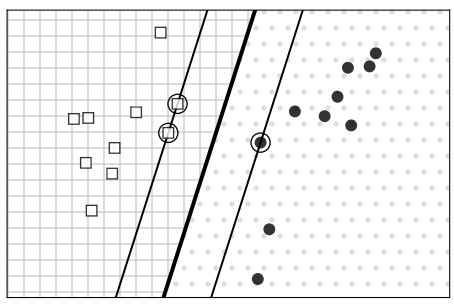

**Hình 26.4.** Minh hoạ nghiệm tìm được bởi SVM. Tất cả các điểm nằm trong vùng có nền kẻ ô sẽ được phân vào cùng lớp với các điểm vuông. Điều tương tự xảy ra với các điểm tròn nằm trên nền dấu chấm.

## 26.4.2. Tìm nghiệm theo thư viện

Chúng ta sẽ sử dụng [sklearn.svm.SVC](http://scikit-learn.org/stable/modules/generated/sklearn.svm.SVC.html)<sup>66</sup>. Bạn đọc có thể tham khảo thêm thư viện [libsvm](https://www.csie.ntu.edu.tw/~cjlin/libsvm/) được viết trên ngôn ngữ C, có API cho Python và Matlab:

```python
# solution by sklearn
from sklearn.svm import SVC

model = SVC(kernel = 'linear', C = 1e5) # just a big number
model.fit(X, y)

w = model.coef_
b = model.intercept_
print('w = ', w)
print('b = ', b)
```

Kết quả:

```toml
w =  [[-2.00971102  0.64194082]]
b =  [ 4.66595309]
```

Kết quả này thống nhất với kết quả tìm được ở mục trước. Có rất nhiều tuỳ chọn cho SVC, trong đó có thuộc tính kernel, các bạn sẽ dần thấy trong các chương sau.

## 26.5. Tóm tắt

• Nếu hai lớp dữ liệu tách biệt tuyến tính, có vô số các siêu phẳng phân chia hai lớp đó. Khoảng cách gần nhất từ một điểm dữ liệu tới siêu phẳng này được gọi là lề.

• SVM là bài toán đi tìm mặt phân cách sao cho lề của hai lớp bằng nhau và lớn nhất, đồng nghĩa với việc các điểm dữ liệu có một khoảng cách an toàn tới mặt phân chia.

<small><span class="docvortex-page-footnote" data-block-type="page_footnote" style="color:#6b7280">66 SVC là viết tắt của bộ phân loại vector hỗ trợ (support vector classifier).</span></small>

<!-- page: 360 -->

• Bài toán tối ưu trong SVM là một bài toán quy hoạch toàn phương với hàm mục tiêu lồi chặt. Vì vậy, cực tiểu địa phương cũng là cực tiểu toàn cục của bài toán.

• Mặc dù có thể trực tiếp giải SVM qua bài toán chính, người ta thường giải bài toán đối ngẫu. Bài toán đối ngẫu cũng là một bài toán quy hoạch toàn phương nhưng nghiệm là các vector thưa nên có những phương pháp giải hiệu quả hơn. Ngoài ra, bài toán đối ngẫu có những tính chất thú vị sẽ được thảo luận trong các chương tiếp theo.

<!-- page: 361 -->

## Máy vector hỗ trợ lề mềm

## 27.1. Giới thiệu

Giống với thuật toán học perceptron (PLA), máy vector hỗ trợ (SVM) chỉ làm việc khi dữ liệu của hai lớp tách biệt tuyến tính. Một cách tự nhiên, chúng ta cũng mong muốn SVM có thể làm việc với dữ liệu gần tách btệt tuyến tính như hồi quy logistic đã làm được.

Xét hai ví dụ trong Hình 27.1. Có hai trường hợp dễ nhận thấy SVM làm việc không hiệu quả hoặc thậm chí không làm việc:

• Trường hợp 1: Dữ liệu vẫn tách biệt tuyến tính như Hình 27.1a nhưng có một điểm nhiễu của lớp tròn ở quá gần lớp vuông. Trong trường hợp này, SVM sẽ tạo ra lề rất nhỏ. Ngoài ra, mặt phân cách nằm quá gần các điểm vuông và xa các điểm tròn. Trong khi đó, nếu hy sinh điểm nhiễu này thì ta thu được nghiệm là đường nét đứt đậm. Nghiệm này tạo ra lề rộng hơn, có khả năng tăng độ chính xác cho mô hình.

• Trường hợp 2: Dữ liệu gần tách biệt tuyến tính như trong Hình 27.1b. Trong trường hợp này, không tồn tại đường thẳng nào hoàn toàn phân chia hai lớp dữ liệu, vì vậy bài toán tối ưu SVM vô nghiệm. Tuy nhiên, nếu chấp nhận việc những điểm ở gần khu vực ranh giới bị phân loại lỗi, ta vẫn có thể tạo được một đường phân chia khá tốt như đường nét đứt đậm. Các đường hỗ trợ (nét đứt mảnh) vẫn giúp tạo được lề lớn. Với mỗi điểm nằm lần sang phía bên kia của các đường hỗ trợ tương ứng, ta gọi điểm đó rơi vào vùng không an toàn. Như trong hình, hai điểm tròn nằm phía bên trái đường hỗ trợ của lớp tròn được xếp vào loại không an toàn, mặc dù có một điểm tròn vẫn nằm trong khu vực nền chấm. Hai điểm vuông ở phía phải của đường hỗ trợ của lớp tương ứng thậm chí đều lấn sang phần có nền chấm.

<!-- page: 362 -->

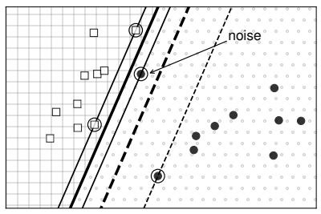

(a) Khi có nhiễu nhỏ.

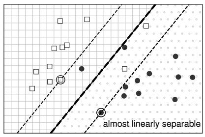

(b) Khi dữ liệu gần linearly separable.

Hình 27.1. Hai trường hơp khi SVM thuần làm việc không hiệu quả. (a) Hai lớp vẫn tách biệt tuyến tính nhưng một điểm thuộc lớp này quá gần lớp kia, điểm này có thể là nhiễu. (b) Dữ liệu hai lớp gần tách biệt tuyến tính.

Trong cả hai trường hợp trên, lề tạo bởi đường phân chia và đường nét đứt mảnh được gọi là lề mềm (soft-margin). Từ mềm thể hiện sự linh hoạt, có thể chấp nhận việc một vài điểm bị phân loại sai để mô hình hoạt động tốt hơn trên toàn bộ dữ liệu. SVM tạo ra các lề mềm được gọi là SVM lề mềm (soft-margin SVM). Để phân biệt, SVM thuần trong chương trước được gọi là SVM lề cứng (hard-margin SVM).

Có hai cách xây dựng và giải quyết bài toán tối ưu SVM lề mềm. Cả hai đều mang lại những kết quả thú vị, có thể phát triển tiếp thành các thuật toán SVM phức tạp và hiệu quả hơn như sẽ thấy trong các chương sau. Cách thứ nhất là giải một bài toán tối ưu có ràng buộc thông qua việc giải bài toán đối ngẫu như với SVM lề cứng. Hướng giải quyết này là cơ sở cho phương pháp SVM hạt nhân áp dụng cho dữ liệu không thực sự tách biệt tuyến tính được đề cập trong chương tiếp theo. Cách giải quyết thứ hai là đưa về một bài toán tối ưu không ràng buộc, giải được bằng các phương pháp gradient descent. Nhờ đó, hướng giải quyết này có thể được áp dụng cho các bài toán quy mô lớn. Ngoài ra, trong cách giải này, chúng ta sẽ làm quen với một hàm mất mát mới có tên là bản lề (hinge). Hàm mất mát này có thể được mở rộng cho bài toán phân loại đa lớp được đề cập trong chương 29. Cách phát triển từ SVM lề mềm thành SVM đa lớp có thể được so sánh với cách phát triển từ hồi quy logistic thành hồi quy softmax.

## 27.2. Phân tích toán học

Như đã đề cập phía trên, để có một lề rộng hơn trong SVM lề mềm, ta cần hy sinh một vài điểm dữ liệu bằng cách chấp nhận cho chúng rơi vào vùng không an toàn. Tất nhiên, việc hy sinh này cần được hạn chế; nếu không, ta có thể tạo ra một biên cực lớn bằng cách hy sinh hầu hết các điểm. Vậy hàm mục tiêu nên là một sự kết hợp sao cho lề được tối đa và sự hy sinh được tối thiểu.

<!-- page: 363 -->

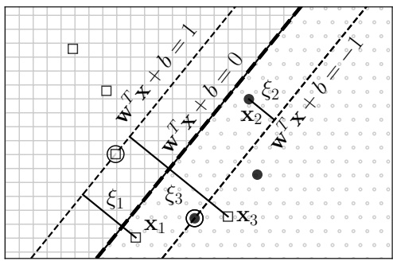

**Hình 27.2.** Giới thiệu các biến lỏng lẻo $\xi _ { n }$ . Với các điểm nằm trong khu vực an toàn, $\xi _ { n }   =   0$ . Những điểm nằm trong vùng không an toàn nhưng vẫn đúng phía so với đường ranh giới (đường nét đứt đậm) tương ứng với các $0 < \xi _ { n } <$ 1, ví dụ $\mathbf { x } _ { 2 }$ . Những điểm nằm ngược phía lớp thực sự của chúng so với đường nét đứt đậm tương ứng $\xi _ { n } >$ 1, ví dụ như $\mathbf { x } _ { 1 }$ và $\mathbf { x } _ { 3 }$

Giống SVM lề cứng, việc tối đa lề có thể đưa về việc tối thiểu $\| \mathbf { w } \| _ { 2 } ^ { 2 }$ . Để đong đếm sự hy sinh, chúng ta cùng quan sát Hình 27.2. Với mỗi điểm $\mathbf { x } _ { n }$ trong tập huấn luyện, ta giới thiệu thêm một biến đo sự hy sinh $\xi _ { n }$ tương ứng. Biến này còn được gọi là biến lỏng lẻo (slack variable). Với những điểm $\mathbf { x } _ { n }$ nằm trong vùng an toàn (nằm đúng vào màu nền tương ứng và nằm ngoài khu vực lề), $\xi _ { n } = 0$ tức không có sự hy sinh nào xảy ra. Với mỗi điểm nằm trong vùng không an toàn như $\mathbf { x } _ { 1 } , \mathbf { x } _ { 2 }$ hay $\mathbf { x } _ { 3 }$ ta cần có $\xi _ { i } > 0$ để đo sự hy sinh. Đại lượng này cần tỉ lệ với khoảng cách từ vị trí vi phạm tương ứng tới biên giới an toàn (đường nét đứt mảnh tương ứng với lớp đó). Nhận thấy nếu $y _ { i } = \pm 1$ là nhãn của $\mathbf { x } _ { i }$ trong vùng không an toàn thì $\xi _ { i }$ có thể được định nghĩa bởi

$$
\boldsymbol {\xi} _ {i} = | \mathbf {w} ^ {T} \mathbf {x} _ {i} + b - y _ {i} |\tag{27.1}
$$

(Mẫu số $\| \mathbf { w } \| _ { 2 }$ được lược bỏ vì ta chỉ cần một đại lượng tỉ lệ thuận.) Nhắc lại bài toán tối ưu cho SVM lề cứng:

$$
\begin{array}{c} {(\mathbf {w}, b) = \arg \min _ {\mathbf {w}, b} \frac {1}{2} \| \mathbf {w} \| _ {2} ^ {2}} \\ {\mathrm{thoà} \tilde {\mathrm{mân}}: y _ {n} (\mathbf {w} ^ {T} \mathbf {x} _ {n} + b) \geq 1, \forall n = 1, 2, \ldots , N} \end{array}\tag{27.2}
$$

Với SVM lề mềm, hàm mục tiêu sẽ có thêm một số hạng nữa giúp tối thiểu tổng sự hy sinh. Từ đó ta có hàm mục tiêu:

$$
\frac {1}{2} \| \mathbf {w} \| _ {2} ^ {2} + C \sum_ {n = 1} ^ {N} \xi_ {n}\tag{27.3}
$$

trong đó C là một hằng số dương. Hằng số C được dùng để điều chỉnh tầm quan trọng giữa độ rộng lề và sự hy sinh.

Điều kiện ràng buộc cũng được thay đổi so với SVM lề cứng. Với mỗi cặp dữ liệu $( \mathbf { x } _ { n } , y _ { n } )$ , thay vì ràng buộc cứng $y _ { n } ( \mathbf { w } ^ { T } \mathbf { x } _ { n } + b ) \geq 1$ , ta sử dụng ràng buộc mềm:

$$
y _ {n} (\mathbf {w} ^ {T} \mathbf {x} _ {n} + b) \geq 1 - \xi_ {n} \Leftrightarrow 1 - \xi_ {n} - y _ {n} (\mathbf {w} ^ {T} \mathbf {x} _ {n} + b) \leq 0, \forall n = 1, 2, \dots , n
$$

<!-- page: 364 -->

Và ràng buộc phụ $\xi _ { n } \geq 0 , \forall n = 1 , 2 , \ldots , N$ . Tóm lại, ta có bài toán tối ưu chính cho SVM lề mềm như sau:

$$
\begin{array}{c} {(\mathbf {w}, b, \xi) = \arg \min _ {\mathbf {w}, b, \xi} \frac {1}{2} \| \mathbf {w} \| _ {2} ^ {2} + C \sum_ {n = 1} ^ {N} \xi_ {n}} \\ {\mathrm{thoà} \tilde {\mathrm{mān}}: 1 - \xi_ {n} - y _ {n} (\mathbf {w} ^ {T} \mathbf {x} _ {n} + b) \leq 0, \forall n = 1, 2, \dots , N} \\ {- \xi_ {n} \leq 0, \forall n = 1, 2, \dots , N} \end{array}\tag{27.4}
$$

Nhận xét:

• Nếu C nhỏ, việc sự hy sinh cao hay thấp không gây ảnh hưởng nhiều tới giá trị của hàm mục tiêu, thuật toán sẽ điều chỉnh sao cho $\| \mathbf { w } \| _ { 2 } ^ { 2 }$ nhỏ nhất, tức lề lớn nhất, điều này dẫn tới $\textstyle \sum _ { n = 1 } ^ { N } \xi _ { n }$ sẽ lớn theo vì vùng an toàn bị nhỏ đi. Ngược lại, nếu C quá lớn, để hàm mục tiêu đạt giá trị nhỏ nhất, thuật toán sẽ tập trung vào làm giảm $\begin{array} { r } { \sum _ { n = 1 } ^ { N } \xi _ { n } . } \end{array}$ Trong trường hợp C rất rất lớn và hai lớp dữ liệu tách biệt tuyến tính, ta sẽ thu được $\begin{array} { r } { \sum _ { n = 1 } ^ { N } \xi _ { n } = 0 } \end{array}$ . Điều này đồng nghĩa với việc không có điểm nào phải hy sinh, nghiệm thu được cũng chính là nghiệm của SVM lề cứng. Nói cách khác, SVM lề cứng là một trường hợp đặc biệt của SVM lề mềm.

• Bài toán tối ưu (27.4) có thêm sự xuất hiện của các biến lỏng lẻo $\xi _ { n }$ . Các $\xi _ { n } = 0$ ứng với những điểm dữ liệu nằm trong vùng an toàn. Các $0 < \xi _ { n } \leq 1$ ứng với những điểm nằm trong vùng không an toàn nhưng vẫn được phân loại đúng, tức vẫn nằm về đúng phía so với đường phân chia. Các $\xi _ { n } > 1$ tương ứng với các điểm bị phân loại sai.

• Hàm mục tiêu trong bài toán tối ưu (27.4) là một hàm lồi vì nó là tổng của hai hàm lồi: một hàm chuẩn và một hàm tuyến tính. Các hàm ràng buộc cũng là các hàm tuyến tính theo (w, b, ξ). Vì vậy bài toán tối ưu (27.4) là một bài toán lồi, hơn nữa còn có thể biểu diễn dưới dạng một bài toán quy hoạch toàn phương.

Tiếp theo, chúng ta sẽ giải bài toán tối ưu (27.4) bằng hai cách khác nhau.

## 27.3. Bài toán đối ngẫu Lagrange

Lưu ý rằng bài toán này có thể giải trực tiếp bằng các công cụ hỗ trợ quy hoạch toàn phương, nhưng giống như với SVM lề cứng, chúng ta sẽ quan tâm hơn tới bài toán đối ngẫu của nó.

Trước kết, ta cần kiểm tra tiêu chuẩn Slater của bài toán tối ưu lồi (27.4). Nếu tiêu chuẩn này thoả mãn, đối ngẫu mạnh sẽ thoả mãn, và ta có thể tìm nghiệm của bài toán tối ưu (27.4) thông qua hệ điều kiện KKT (xem Chương 25).

<!-- page: 365 -->

## 27.3.1. Kiểm tra tiêu chuẩn Slater

Rõ ràng là với mọi $n = 1 , 2 , \ldots , N$ và $( \mathbf { w } , b )$ , ta luôn có thể tìm được các số dương $\xi _ { n } , n = 1 , 2 , \ldots , N$ , đủ lớn sao cho $\begin{aligned} { y _ { n } ( \mathbf { w } ^ { T } \mathbf { x } _ { n } + b ) + \xi _ { n } > 1 , \forall n = 1 , 2 , \ldots , N } \\ \end{aligned}$ . Vì vậy, tồn tại điểm khả thi chặt cho bài toán và tiêu chuẩn Slater thỏa mãn.

## 27.3.2. Hàm Lagrange của bài toán SVM lề mềm

Hàm Lagrange cho bài toán (27.4) là

$$
\mathcal {L} (\mathbf {w}, b, \boldsymbol {\xi}, \boldsymbol {\lambda}, \boldsymbol {\mu}) = \frac {1}{2} \| \mathbf {w} \| _ {2} ^ {2} + C \sum_ {n = 1} ^ {N} \xi_ {n} + \sum_ {n = 1} ^ {N} \lambda_ {n} (1 - \xi_ {n} - y _ {n} (\mathbf {w} ^ {T} \mathbf {x} _ {n} + b)) - \sum_ {n = 1} ^ {N} \mu_ {n} \xi_ {n}\tag{27.5}
$$

với $\mathbf { \lambda } = [ \lambda _ { 1 } , \lambda _ { 2 } , \ldots , \lambda _ { N } ] ^ { T } \succeq 0$ và $\pmb { \mu } = [ \mu _ { 1 } , \mu _ { 2 } , \ldots , \mu _ { N } ] ^ { T } \succeq 0$ là các biến đối ngẫu Lagrange.

## 27.3.3. Bài toán đối ngẫu

Hàm số đối ngẫu của bài toán tối ưu (27.4) là:

$$
g (\boldsymbol {\lambda}, \boldsymbol {\mu}) = \min _ {\mathbf {w}, b, \boldsymbol {\xi}} \mathcal {L} (\mathbf {w}, b, \boldsymbol {\xi}, \boldsymbol {\lambda}, \boldsymbol {\mu})
$$

Với mỗi $\mathrm { c \check { a } p } ( \pmb { \lambda } , \pmb { \mu } )$ , chúng ta đặc biệt quan tâm tới (w, b, ξ) thoả mãn điều kiện đạo hàm của hàm Lagrange bằng không:

$$
\nabla_ {\mathbf {w}} \mathcal {L} = 0 \Leftrightarrow \mathbf {w} = \sum_ {n = 1} ^ {N} \lambda_ {n} y _ {n} \mathbf {x} _ {n}\tag{27.6}
$$

$$
\nabla_ {b} \mathcal {L} = 0 \Leftrightarrow \sum_ {n = 1} ^ {N} \lambda_ {n} y _ {n} = 0\tag{27.7}
$$

$$
\nabla_ {\xi_ {n}} \mathcal {L} = 0 \Leftrightarrow \lambda_ {n} = C - \mu_ {n}\tag{27.8}
$$

Phương trình (27.8) chỉ ra rằng ta chỉ cần quan tâm tới những cặp $( \lambda , \mu )$ sao cho $\lambda _ { n } = C - \mu _ { n }$ . Từ đây cũng có thể suy ra $0 \leq \lambda _ { n } , \mu _ { n } \leq C , n = 1 , 2 , \ldots , N$ . Thay các biểu thức này vào biểu thức hàm Lagrange (27.5), ta thu được hàm mục tiêu của bài toán đối $\mathrm { n g \tilde { a } u ^ { 6 7 } }$

$$
g (\boldsymbol {\lambda}, \boldsymbol {\mu}) = \sum_ {n = 1} ^ {N} \lambda_ {n} - \frac {1}{2} \sum_ {n = 1} ^ {N} \sum_ {m = 1} ^ {N} \lambda_ {n} \lambda_ {m} y _ {n} y _ {m} \mathbf {x} _ {n} ^ {T} \mathbf {x} _ {m}\tag{27.9}
$$

Chú $\hat { \mathrm { y } }$ rằng hàm này không phụ thuộc vào $\mu$ nhưng ta cần lưu $\acute { \mathrm { y } }$ ràng buộc (27.8), ràng buộc này và điều kiện không âm của λ có thể được viết gọn lại thành $0 \leq \lambda _ { n } \leq C$ , tức đã giảm được biến $\mu .$ Lúc này, bài toán đối ngẫu trở thành:

<small><span class="docvortex-page-footnote" data-block-type="page_footnote" style="color:#6b7280">67 Bạn đọc hãy coi đây như một bài tập nhỏ.</span></small>

<!-- page: 366 -->

$$
\boldsymbol {\lambda} = \arg \max _ {\boldsymbol {\lambda}} g (\boldsymbol {\lambda})
$$

$$
\text {thoả mãn:} \quad \sum_ {n = 1} ^ {N} \lambda_ {n} y _ {n} = 0\tag{27.10}
$$

$$
0 \leq \lambda_ {n} \leq C, \forall n = 1, 2, \dots , N\tag{27.11}
$$

Bài toán này giống bài toán đối ngẫu của SVM lề cứng, chỉ khác là có thêm ràng buộc $\lambda _ { n }$ bị chặn trên bởi C. Khi C rất lớn, ta có thể coi hai bài toán là như nhau. Ràng buộc (27.11) còn được gọi là ràng buộc hộp (box constraint) vì tập hợp các điểm λ thoả mãn ràng buộc này giống một hình hộp chữ nhật trong không gian nhiều chiều. Bài toán này cũng hoàn toàn giải được bằng các công cụ giải quy hoạch toàn phương thông thường, ví dụ CVXOPT. Sau khi tìm được λ của bài toán đối ngẫu, ta cần quay lại tìm nghiệm (w, b, ξ) của bài toán gốc. Trước hết, chúng ta cùng xem xét hệ điều kiện KKT và các tính chất của nghiệm.

## 27.3.4. Hệ điều kiện KKT

Hệ điều kiện KKT của bài toán tối ưu SVM lề mềm:

$$
1 - \dot {\xi} _ {n} - y _ {n} (\mathbf {w} ^ {T} \mathbf {x} _ {n} + b) \leq 0\tag{27.12}
$$

$$
- \xi_ {n} \leq 0\tag{27.13}
$$

$$
\lambda_ {n} \geq 0\tag{27.14}
$$

$$
\mu_ {n} \geq 0\tag{27.15}
$$

$$
\lambda_ {n} (1 - \xi_ {n} - y _ {n} (\mathbf {w} ^ {T} \mathbf {x} _ {n} + b)) = 0\tag{27.16}
$$

$$
\mu_ {n} \dot {\xi} _ {n} = 0\tag{27.17}
$$

$$
\mathbf {w} = \sum_ {n = 1} ^ {N} \lambda_ {n} y _ {n} \mathbf {x} _ {n}\tag{27.6}
$$

$$
\sum_ {n = 1} ^ {N} \lambda_ {n} y _ {n} = 0\tag{27.7}
$$

$$
\lambda_ {n} = C - \mu_ {n}\tag{27.8}
$$

với mọi $n = 1 , 2 , \ldots , N$

Từ (27.6) và (27.8) ta thấy chỉ có những n ứng với $\lambda _ { n } > 0$ mới đóng góp vào việc tính nghiệm w của bài toán SVM lề mềm. Tập hợp $\mathcal { S } = \{ n : \lambda _ { n } > 0 \}$ được gọi là tập hỗ trợ (support set) và $\{ \mathbf { x } _ { n } , n \in \mathcal { S } \}$ được gọi là tập các vector hỗ trợ.

Khi $\lambda _ { n } > 0$ , (27.16) chỉ ra rằng:

$$
y _ {n} (\mathbf {w} ^ {T} \mathbf {x} _ {n} + b) = 1 - \xi_ {n}\tag{27.18}
$$

Nếu $0 < \lambda _ { n } < C ,$ (27.8) nói rằng $\mu _ { n } = C - \lambda _ { n } > 0$ . Kết hợp với (27.17), ta thu được $\xi _ { n } = 0$ . Tiếp tục kết hợp với (27.18), ta suy ra $y _ { n } ( \mathbf { w } ^ { T } \mathbf { x } _ { n } + b ) = 1$ , hay nói cách khác $\mathbf { w } ^ { T } \mathbf { x } _ { n } + b = y _ { n } , \forall n : 0 < \lambda _ { n } < C$

<!-- page: 367 -->

Tóm lại, khi $0 < \lambda _ { n } < C .$ , các điểm $\mathbf { x } _ { n }$ nằm chính xác trên hai đường thẳng hỗ trợ (hai đường nét đứt mảnh trong Hình 27.2). Tương tự như SVM lề cứng, giá trị b có thể được tính theo công thức:

$$
b = \frac {1}{N _ {\mathcal {M}}} \sum_ {m \in \mathcal {M}} \left(y _ {m} - \mathbf {w} ^ {T} \mathbf {x} _ {m}\right)\tag{27.19}
$$

với $\mathcal { M } = \{ m : 0 < \lambda _ { m } < C \}$ và $N _ { \mathcal { M } }$ là số phần tử của S. Nghiệm của bài toán SVM lề mềm được cho bởi (27.6) và (27.19).

## Nghiệm của bài toán SVM lề mềm

$$
\begin{array}{l} \mathbf {w} = \sum_ {m \in \mathcal {S}} \lambda_ {m} y _ {m} \mathbf {x} _ {m} \\ b = \frac {1}{N _ {\mathcal {M}}} \sum_ {n \in \mathcal {M}} (y _ {n} - \mathbf {w} ^ {T} \mathbf {x} _ {n}) = \frac {1}{N _ {\mathcal {M}}} \sum_ {n \in \mathcal {M}} \left(y _ {n} - \sum_ {m \in \mathcal {S}} \lambda_ {m} y _ {m} \mathbf {x} _ {m} ^ {T} \mathbf {x} _ {n}\right) (2 7. 2 1) \end{array} \tag {27.20}
$$

Với $\lambda _ { n } = C$ , từ (27.8) và (27.16) ta suy ra $y _ { n } ( \mathbf { w } ^ { T } \mathbf { x } _ { n } + b ) = 1 - \xi _ { n } \leq 1$ . Điều này nghĩa là những điểm ứng với $\lambda _ { n } = C$ nằm giữa hai đường hỗ trợ hoặc nằm trên chúng. Như vậy, dựa trên các giá trị của $\lambda _ { n }$ ta có thể xác định được vị trí tương đối của $\mathbf { x } _ { n }$ so với hai đường hỗ trợ.

Mục đích cuối cùng là xác định nhãn cho một điểm mới x. Vì vậy, ta quan tâm hơn tới cách xác định giá trị của biểu thức sau đây:

$$
\mathbf {w} ^ {T} \mathbf {x} + b = \sum_ {m \in \mathcal {S}} \lambda_ {m} y _ {m} \mathbf {x} _ {m} ^ {T} \mathbf {x} + \frac {1}{N _ {\mathcal {M}}} \sum_ {n \in \mathcal {M}} \left(y _ {n} - \sum_ {m \in \mathcal {S}} \lambda_ {m} y _ {m} \mathbf {x} _ {m} ^ {T} \mathbf {x} _ {n}\right)\tag{27.22}
$$

Biểu thức này có thể được xác định trực tiếp thông qua các điểm dữ liệu huấn luyện. Ta không cần thực hiện việc tính w và b. Nếu có thể tính các tích vô hướng $\mathbf { x } _ { m } ^ { T } \mathbf { x }$ và $\mathbf { x } _ { m } ^ { T } \mathbf { x } _ { n }$ , ta sẽ xác định được bộ phân loại. Quan sát này rất quan trọng và là ý tưởng chính cho SVM hạt nhân được trình bày trong chương tiếp theo.

## 27.4. Bài toán tối ưu không ràng buộc cho SVM lề mềm

Trong mục này, chúng ta sẽ biến đổi bài toán tối ưu có ràng buộc (27.4) về bài toán tối ưu không ràng buộc có thể giải được bằng các phương pháp gradient descent. Đây cũng là $\acute { \mathrm { y } }$ tưởng chính cho SVM đa lớp được trình bày trong Chương 29.

<!-- page: 368 -->

## 27.4.1. Bài toán tối ưu không ràng buộc tương đương

Để $\acute { \mathrm { y } }$ rằng điều kiện ràng buộc thứ nhất:

$$
1 - \xi_ {n} - y _ {n} (\mathbf {w} ^ {T} \mathbf {x} + b) \leq 0 \Leftrightarrow \xi_ {n} \geq 1 - y _ {n} (\mathbf {w} ^ {T} \mathbf {x} + b)\tag{27.23}
$$

Kết hợp với điều kiện $\xi _ { n } \geq 0$ ta thu được bài toán ràng buộc tương đương với bài toán (27.4) như sau:

$$
\begin{array}{c} (\mathbf {w}, b, \xi) = \arg \min _ {\mathbf {w}, b, \xi} \frac {1}{2} \| \mathbf {w} \| _ {2} ^ {2} + C \sum_ {n = 1} ^ {N} \xi_ {n} \\ \text {thoâ   mân:} \xi_ {n} \geq \max (0, 1 - y _ {n} (\mathbf {w} ^ {T} \mathbf {x} + b)), \forall n = 1, 2, \ldots , N \end{array}\tag{27.24}
$$

Để đưa bài toán (27.24) về dạng không ràng buộc, chúng ta sẽ chứng minh nhận xét sau đây bằng phương pháp phản chứng: Nếu $( \mathbf { w } , b , \xi )$ là điểm tối ưu của bài toán (27.24) thì

$$
\xi_ {n} = \max (0, 1 - y _ {n} (\mathbf {w} ^ {T} \mathbf {x} _ {n} + b)), \forall n = 1, 2, \dots , N\tag{27.25}
$$

Thật vậy, giả sử ngược lại, tồn tại n sao cho:

$$
\xi_ {n} > \max (0, 1 - y _ {n} (\mathbf {w} ^ {T} \mathbf {x} _ {n} + b)),
$$

chọn $\xi _ { n } ^ { \prime }   =   \operatorname* { m a x } ( 0 , 1   -   y _ { n } ( \mathbf { w } ^ { T } \mathbf { x } _ { n }   +   b ) )$ , ta sẽ thu được một giá trị thấp hơn của hàm mục tiêu, trong khi tất cả các ràng buộc vẫn được thoả mãn. Điều này mâu thuẫn với việc hàm mục tiêu đã đạt giá trị nhỏ nhất tương ứng với $\xi _ { n } !$ Điều mâu thuẫn này chỉ ra rằng nhận xét (27.25) là chính xác.

Khi đó, bằng cách thay toàn bộ các giá trị của $\xi _ { n }$ trong (27.25) vào hàm mục tiêu, ta thu được bài toán tối ưu

$$
\begin{array}{c} (\mathbf {w}, b, \xi) = \arg \min _ {\mathbf {w}, b, \xi} \frac {1}{2} \| \mathbf {w} \| _ {2} ^ {2} + C \sum_ {n = 1} ^ {N} \max (0, 1 - y _ {n} (\mathbf {w} ^ {T} \mathbf {x} _ {n} + b)) \\ \text {thoả   mãn:} \xi_ {n} = \max (0, 1 - y _ {n} (\mathbf {w} ^ {T} \mathbf {x} _ {n} + b)), \forall n = 1, 2, \ldots , N \end{array}\tag{27.26}
$$

Từ đây ta thấy biến số $\xi$ không xuất hiện trong hàm mục tiêu, vì vậy điều kiện ràng buộc có thể được bỏ qua:

$$
(\mathbf {w}, b) = \arg \min _ {\mathbf {w}, b} \left\{\frac {1}{2} \| \mathbf {w} \| _ {2} ^ {2} + C \sum_ {n = 1} ^ {N} \max (0, 1 - y _ {n} (\mathbf {w} ^ {T} \mathbf {x} _ {n} + b)) \triangleq J (\mathbf {w}, b) \right\}\tag{27.27}
$$

Đây là một bài toán tối ưu không ràng buộc với hàm mất mát $J ( \mathbf { w } , b )$ . Bài toán này có thể được giải bằng các phương pháp gradient descent. Nhưng trước hết cùng xem xét hàm số này từ một góc nhìn khác bằng cách sử dụng hàm mất mát bản lề (hinge loss).

<!-- page: 369 -->

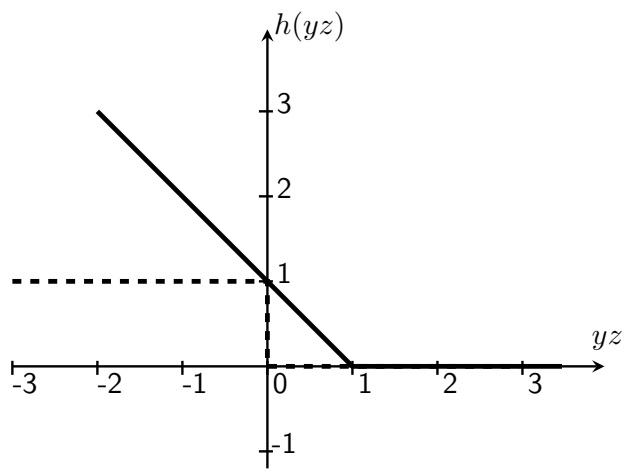

Hình 27.3. Mất mát bản lề (nét liền) và mất mát không-một (nét đứt). Với mất mát không-một, những điểm nằm xa đường hỗ trợ (hoành độ bằng 1) và đường phân chia (hoành độ bằng 0) đều mang lại mất mát bằng một. Trong khi đó, với mất mát bản lề, những điểm ở xa về phía trái gây ra mất mát nhiều hơn.

27.4.2. Mất mát bản lề

Nhắc lại hàm entropy chéo: Với mỗi cặp hệ số (w, b) và dữ liệu $( \mathbf { x } _ { n } , y _ { n } )$ , đặt $a _ { n } = \sigma ( \mathbf { w } ^ { T } \mathbf { x } _ { n } + b )$ (hàm sigmoid). Hàm entropy chéo được định nghĩa là:

$$
J _ {n} ^ {1} (\mathbf {w}, b) = - (y _ {n} \log (a _ {n}) + (1 - y _ {n}) \log (1 - a _ {n}))\tag{27.28}
$$

Hàm số này đạt giá trị nhỏ nếu xác suất $a _ { n }$ gần với $y _ { n } ( 0 < a _ { n } < 1 , y _ { n } \in \{ 0 , 1 \} )$

Ở đây, chúng ta làm quen với một hàm số khác cũng được sử dụng nhiều trong các hệ thống phân loại. Hàm số này có dạng

$$
J _ {n} (\mathbf {w}, b) = \max (0, 1 - y _ {n} z _ {n})
$$

Hàm này có tên là mất mát bản $l \hat { e }$ (hinge loss). Trong đó, $z _ { n }   =   \mathbf { w } ^ { T } \mathbf { x } _ { n } + b$ còn được gọi là điểm số (score) của $\mathbf { x } _ { n }$ ứng với cặp hệ số $( \mathbf { w } , b ) ,   y _ { n } = \pm 1$ là nhãn của $\mathbf { x } _ { n }$ . Hình 27.3 mô tả đồ thị hàm mất mát bản $\mathrm { l } \hat { \mathrm { e } } ^ { 6 8 } f ( y z ) = \mathrm { m a x } ( 0 , 1 - y z )$ và so sánh với hàm mất mát không-một (zero-one loss). Hàm mất mát không-một trả về không nếu một điểm được phân loại đúng và trả về một nếu điểm đó bị phân loại sai. Như vậy, mất mát không-một là hàm đếm số điểm bị phân loại sai của tập huấn luyện. Trong Hình 27.5, biến số là $y z$ là tích của đầu ra mong muốn y và điểm số z. Những điểm ở phía phải của trục tung ứng với những điểm được phân loại đúng, tức z tìm được cùng dấu với y. Những điểm ở phía trái của trục tung ứng với các điểm bị phân loại sai. Ta có các nhận xét sau đây:

• Với mất mát không-một, các điểm dữ liệu có điểm số ngược dấu với đầu ra mong muốn $( y z < 0 )$ sẽ gây ra mất mát như nhau và đều bằng một, bất kể chúng ở gần hay xa đường ranh giới (trục tung). Đây là một hàm rời rạc, rất khó tối ưu và không giúp đo đếm sự hy sinh nếu một điểm nằm quá xa so với đường hỗ trợ.

<small><span class="docvortex-page-footnote" data-block-type="page_footnote" style="color:#6b7280">68 Đồ thị của hàm số này có dạng chiếc bản lề.</span></small>

<!-- page: 370 -->

• Với mất mát bản lề, những điểm nằm trong vùng an toàn ứng với $y z \geq 1$ sẽ không gây ra mất mát gì. Những điểm nằm giữa đường hỗ trợ của lớp tương ứng và đường ranh giới ứng với $0 < y < 1$ sẽ gây ra một mất mát nhỏ (nhỏ hơn một). Những điểm bị phân loại lỗi, tức $y z < 0$ sẽ gây ra mất mát lớn hơn. Vì vậy, khi tối thiểu hàm mất mát, ta sẽ hạn chế được những điểm bị phân loại lỗi và sang lớp kia quá nhiều. Đây chính là một ưu điểm của mất mát bản lề.

• Mất mát bản lề là một hàm liên tục, và có đạo hàm tại gần như mọi nơi (almost everywhere differentiable) trừ điểm có hoành độ bằng 1. Ngoài ra, đạo hàm của hàm này theo yz cũng rất dễ xác định: bằng -1 tại các điểm nhỏ hơn 1 và bằng 0 tại các điểm lớn hơn 1. Tại 1, ta có thể coi đạo hàm của nó bằng 0.

## 27.4.3. Xây dựng hàm mất mát

Xét bài toán SVM lề mềm sử dụng mất mát bản lề, với mỗi cặp $( \mathbf { w } , b )$ , đặt

$$
L _ {n} (\mathbf {w}, b) = \max (0, 1 - y _ {n} z _ {n}) = \max (0, 1 - y _ {n} (\mathbf {w} ^ {T} \mathbf {x} _ {n} + b))\tag{27.29}
$$

Lấy trung bình cộng của các mất mát này trên toàn tập huấn luyện ta được

$$
L (\mathbf {w}, b) = \frac {1}{N} \sum_ {n = 1} ^ {N} L _ {n} = \frac {1}{N} \sum_ {n = 1} ^ {N} \max (0, 1 - y _ {n} (\mathbf {w} ^ {T} \mathbf {x} _ {n} + b))
$$

Trong trường hợp dữ liệu hai lớp tách biệt tuyến tính, giá trị tối ưu tìm được của $L ( \mathbf { w } , b )$ sẽ bằng 0. Điều này nghĩa là:

$$
1 - y _ {n} (\mathbf {w} ^ {T} \mathbf {x} _ {n} + b) \leq 0, \forall n = 1, 2, \dots , N\tag{27.30}
$$

Nhân cả hai về với một hằng số $a > 1$ ta có:

$$
a - y _ {n} (a \mathbf {w} ^ {T} \mathbf {x} _ {n} + a b) \leq 0, \forall n = 1, 2, \ldots , N\tag{27.31}
$$

$$
\Rightarrow 1 - y _ {n} (a \mathbf {w} ^ {T} \mathbf {x} _ {n} + a b) \leq 1 - a <   0, \forall n = 1, 2, \dots , N\tag{27.32}
$$

Điều này chỉ ra (aw, ab) cũng là nghiệm của bài toán. Nếu không có thêm ràng buộc, bài toán có thể dẫn tới nghiệm không ổn định vì w và b có thể lớn tuỳ ý!

Để tránh hiện tượng này, chúng ta cần thêm một số hạng kiểm soát vào $L ( \mathbf { w } , b )$ giống như cách làm để tránh quá khớp trong mạng neuron. Lúc này, ta sẽ có hàm mất mát tổng cộng:

$$
J (\mathbf {w}, b) = L (\mathbf {w}, b) + \lambda R (\mathbf {w}, b)
$$

với λ là một số dương, gọi là tham số kiểm soát, hàm R() giúp hạn chế việc các hệ số $( \mathbf { w } , b )$ quá lớn. Có nhiều cách chọn hàm $R ( )$ , nhưng cách phổ biến nhất là dùng chuẩn $\ell _ { 2 }$ , khi đó hàm mất mát của SVM lề mềm trở thành:

<!-- page: 371 -->

$$
J (\mathbf {w}, b) = \frac {1}{N} \left(\underbrace {\sum_ {n = 1} ^ {N} \max (0 , 1 - y _ {n} (\mathbf {w} ^ {T} \mathbf {x} _ {n} + b))} _ {\text {mất mát bản lề}} + \underbrace {\frac {\lambda}{2} \| \mathbf {w} \| _ {2} ^ {2}} _ {\text {kiểm soát}}\right)\tag{27.33}
$$

Kỹ thuật này tương đương với kỹ thuật suy giảm trọng số trong mạng neuron. Suy giảm trọng số không được áp dụng lên hệ số điều chỉnh b.

Ta thấy rằng hàm mất mát (27.33) tương đương hàm mất mát (27.27) với $\lambda = { \textstyle { \frac { 1 } { C } } }$

Trong phần tiếp theo của mục này, chúng ta sẽ quan tâm tới bài toán tối ưu hàm mất mát được cho trong (27.33). Trước hết, đây là một hàm lồi theo w, b vì các lý do sau:

$1 - y _ { n } ( \mathbf { w } ^ { T } \mathbf { x } _ { n } + b )$ là một hàm lồi vì nó tuyến tính theo w, b. Hàm lấy giá trị lớn hơn trong hai hàm lồi là một hàm lồi. Vì vậy, mất mát bản lề là một hàm lồi.

• Chuẩn là một hàm lồi.

• Tổng của hai hàm lồi là một hàm lồi.

Vì hàm mất mát là lồi, các thuật toán gradient descent với tốc độ học phù hợp sẽ giúp tìm nghiệm của bài toán một cách hiệu quả.

## 27.4.4. Tối ưu hàm mất mát

Để sử dụng gradient descent, chúng ta cần tính đạo hàm của hàm mất mát theo w và b.

Đạo hàm của mất mát bản lề không quá phức tạp:

$$
\begin{array}{r l} & {\nabla_ {\mathbf {w}} \left(\max (0, 1 - y _ {n} (\mathbf {w} ^ {T} \mathbf {x} _ {n} + b))\right) = \left\{ \begin{array}{c c c} - y _ {n} \mathbf {x} _ {n} & \mathrm{n} \acute {\mathrm{e}} \mathrm{u} & 1 - y _ {n} (\mathbf {w} ^ {T} \mathbf {x} _ {n} + b) \geq 0 \\ \mathbf {0} & & \mathrm{o.w.} \end{array} \right.} \\ & {\nabla_ {b} \left(\max (0, 1 - y _ {n} (\mathbf {w} ^ {T} \mathbf {x} _ {n} + b))\right) = \left\{ \begin{array}{c c c} - y _ {n} & \mathrm{n} \acute {\mathrm{e}} \mathrm{u} & 1 - y _ {n} (\mathbf {w} ^ {T} \mathbf {x} _ {n} + b) \geq 0 \\ 0 & & \mathrm{o.w.} \end{array} \right.} \end{array}
$$

Phần kiểm soát cũng có đạo hàm tương đối đơn giản:

$$
\nabla_ {\mathbf {w}} \left(\frac {\lambda}{2} \| \mathbf {w} \| _ {2} ^ {2}\right) = \lambda \mathbf {w}; \quad \nabla_ {b} \left(\frac {\lambda}{2} \| \mathbf {w} \| _ {2} ^ {2}\right) = 0
$$

Khi sử dụng stochastic gradient descent trên từng điểm dữ liệu, nếu $1   -   y _ { n } ( \mathbf { w } ^ { T } \mathbf { x } _ { n } +$ $b ) < 0$ , ta không cần cập nhật và chuyển sang điểm tiếp theo. Ngược lại biểu thức cập nhật cho w, b được cho bởi:

<!-- page: 372 -->

$$
\begin{array}{l l l l} \mathbf {w} \leftarrow \mathbf {w} - \eta (- y _ {n} \mathbf {x} _ {n} + \lambda \mathbf {w}); & b \leftarrow b + \eta y _ {n} & \text {neu} & 1 - y _ {n} (\mathbf {w} ^ {T} \mathbf {x} _ {n} + b) \geq 0) \\ \mathbf {w} \leftarrow \mathbf {w} - \eta \lambda \mathbf {w}; & b \leftarrow b & \text {o.w.} \end{array}
$$

với η là tốc độ học. Với mini-batch gradient descent hoặc batch gradient descent, các biểu thức đạo hàm trên đây hoàn toàn có thể được lập trình bằng các kỹ thuật vector hóa như chúng ta sẽ thấy trong mục tiếp theo.

## 27.5. Lập trình với SVM lề mềm

Trong mục này, nghiệm của một bài toán SVM lề mềm được tìm bằng ba cách khác nhau: sử dụng thư viện sklearn, giải bài toán đối ngẫu bằng CVXOPT, và giải bài toán tối ưu không ràng buộc bằng gradient descent. Giá trị C được sử dụng là 100. Nếu mọi tính toán từ đầu chương là chính xác, nghiệm của ba cách làm này sẽ gần giống nhau, sự khác nhau có thể đến từ sai số tính toán. Chúng ta cũng sẽ thay C bởi những giá trị khác nhau và quan sát sự thay đổi của lề.

Khai báo thư viện và tạo dữ liệu giả:

```python
from __future__ import print_function
import numpy as np
import matplotlib.pyplot as plt
np.random.seed(22)

means = [[2, 2], [4, 2]]
cov = [[.7, 0], [0, .7]]
N = 20 # number of samplers per class
X0 = np.random.multivariate_normal(means[0], cov, N) # each row is a data point
X1 = np.random.multivariate_normal(means[1], cov, N)
X = np.concatenate((X0, X1))
y = np.concatenate((np.ones(N), -np.ones(N)))
```

Hình 27.4 minh hoạ các điểm dữ liệu của hai lớp. Hai lớp dữ liệu gần tách biệt tuyến tính.

## 27.5.1. Giải bài toán bằng thư viện sklearn

```python
from sklearn.svm import SVC
C = 100
clf = SVC(kernel = 'linear', C = C)
clf.fit(X, y)
w_sklearn = clf.coef_.reshape(-1, 1)
b_sklearn = clf.intercept_[0]
print(w_sklearn.T, b_sklearn)
```

Kết quả:

```toml
w_sklearn =  [[-1.87461946 -1.80697358]]
b_sklearn =  8.49691190196
```

<!-- page: 373 -->

## 27.5.2. Tìm nghiệm bằng cách giải bài toán đối ngẫu

Đoạn mã dưới đây tương tự với việc giải bài toán SVM lề cứng có thêm chặn trên của các nhân tử Lagrange:

```python
from cvxopt import matrix, solvers
# build K
V = np.concatenate((X0, -X1), axis = 0) # V[n,:] = y[n]*X[n]
K = matrix(V.dot(V.T))
p = matrix(-np.ones((2*N, 1)))
# build A, b, G, h
G = matrix(np.vstack((-np.eye(2*N), np.eye(2*N))))
h = np.vstack((np.zeros((2*N, 1)), C*np.ones((2*N, 1))))
h = matrix(np.vstack((np.zeros((2*N, 1)), C*np.ones((2*N, 1))))))
A = matrix(y.reshape((-1, 2*N)))
b = matrix(np.zeros((1, 1)))
solvers.options['show_progress'] = False
sol = solvers_qp(K, p, G, h, A, b)

l = np.array(sol['x']).reshape(2*N) # lambda vector

# support set
S = np.where(l > 1e-5)[0]
S2 = np.where(l < .999*C)[0]
# margin set
M = [val for val in S if val in S2] # intersection of two lists

VS = V[S]          # shape (NS, d)
lS = l[S]          # shape (NS,)
w_dual = lS.dot(VS) # shape (d,)
yM = y[M]           # shape(NM,)
XM = X[M]           # shape(NM, d)
b_dual = np.mean(yM - XM.dot(w_dual)) # shape (1,)
print('w_dual = ', w_dual)
print('b_dual = ', b_dual)
```

Kết quả:

```txt
w_dual =  [-1.87457279 -1.80695039]
b_dual =  8.49672109814
```

Kết quả này gần giống với kết quả tìm được bằng sklearn.

## 27.5.3. Tìm nghiệm bằng giải bài toán tối ưu không ràng buộc

Trong phương pháp này, chúng ta cần tính gradient của hàm mất mát. Như thường lệ, cần kiểm chứng tính chính xác của đạo hàm này. Chú ý rằng trong phương pháp này, ta cần dùng tham số lam = 1/C. Trước hết viết các hàm tính giá trị hàm mất mát và đạo hàm theo w và b:

<!-- page: 374 -->

```python
lam = 1./C
def loss(X, y, w, b):
    """
    X.shape = (2N, d), y.shape = (2N,), w.shape = (d,), b is a scalar
    """
    z = X.dot(w) + b # shape (2N,)
    yz = y*z
    return (np.sum(np.maximum(0, 1 - yz)) + .5*lam*w.dot(w))/X.shape[0]

def grad(X, y, w, b):
    z = X.dot(w) + b # shape (2N,)
    yz = y*z          # element wise product, shape (2N,)
    active_set = np.where(yz <= 1)[0] # consider 1 - yz >= 0 only
    _yX = - X*y[:, np.newaxis]   # each row is y_n*x_n
    grad_w = (np.sum(_yX[active_set], axis = 0) + lam*w)/X.shape[0]
    grad_b = (-np.sum(y[active_set]))/X.shape[0]
    return (grad_w, grad_b)

def num_grad(X, y, w, b):
    eps = 1e-10
    gw = np.zeros_like(w)
    gb = 0
    for i in xrange(len(w)):
        wp = w.copy()
        wm = w.copy()
        wp[i] += eps
        wm[i] -= eps
        gw[i] = (loss(X, y, wp, b) - loss(X, y, wm, b))/(2*eps)
        gb = (loss(X, y, w, b + eps) - loss(X, y, w, b - eps))/(2*eps)
        return (gw, gb)

w = .1*np.random.randn(X.shape[1])
b = np.random.randn()
(gw0, gb0) = grad(X, y, w, b)
(gw1, gb1) = num_grad(X, y, w, b)
print('grad_w difference = ', np.linalg.norm(gw0 - gw1))
print('grad_b difference = ', np.linalg.norm(gb0 - gb1))
```

Kết quả:

```txt
grad_w difference = 1.27702840067e-06
grad_b difference = 4.13701854995e-08
```

Sự sai khác giữa hai cách tính gradient khá nhỏ; ta có thể tin tưởng sử dụng hàm grad khi thực hiện gradient descent.

<!-- page: 375 -->

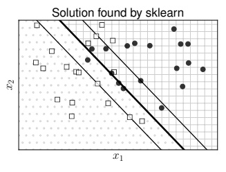

(a)

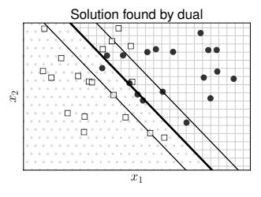

(b)

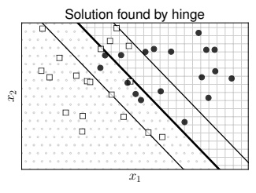

(c)

Hình 27.4. Các đường phân chia tìm được bởi ba cách khác nhau: a) Thư viện sklearn, b) Giải bài toán đối ngẫu bằng CVXOPT, c) Hàm mất mát bản lề. Các kết quả tìm được gần giống nhau.

Đoạn mã dưới đây trình bày cách cập nhật nghiệm bằng gradient descent:

```python
def softmarginSVM_gd(X, y, w0, b0, eta):
    w, b, it = w0, b0, 0
    while it < 10000:
        it = it + 1
        (gw, gb) = grad(X, y, w, b)
        w -= eta*gw
        b -= eta*gb
        if (it % 1000) == 0:
            print('iter %d' %it + ' loss: %f' %loss(X, y, w, b))
    return (w, b)

w0 = .1*np.random.randn(X.shape[1])
b0 = .1*np.random.randn()
lr = 0.05
(w_hinge, b_hinge) = softmarginSVM_gd(X, y, w0, b0, lr)
print('w_hinge = ', w_dual)
print('b_hinge = ', b_dual)
```

Kết quả:

```toml
iter 1000 loss: 0.436460
iter 2000 loss: 0.405307
iter 3000 loss: 0.399860
iter 4000 loss: 0.395440
iter 5000 loss: 0.394562
iter 6000 loss: 0.393958
iter 7000 loss: 0.393805
iter 8000 loss: 0.393942
iter 9000 loss: 0.394005
iter 10000 loss: 0.393758
w_hinge = [-1.87457279 -1.80695039]
b_hinge = 8.49672109814
```

Ta thấy rằng loss giảm dần và hội tụ theo thời gian. Nghiệm này cũng gần giống nghiệm tìm được bằng sklearn và CVXOPT. Hình 27.4 mình hoạ các nghiệm tìm

<!-- page: 376 -->

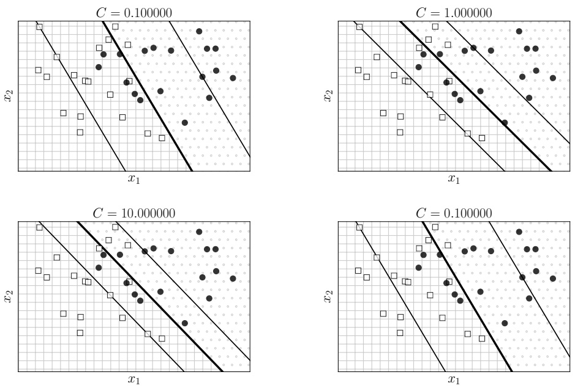

Hình 27.5. Ảnh hưởng của C lên nghiệm của SVM lề mềm. C càng lớn thì biên càng nhỏ và ngược lại.

được bằng cả ba phương pháp. Ta thấy rằng các nghiệm tìm được gần như giống nhau.

## 27.5.4. Ảnh hưởng của C lên nghiệm

Hình 27.5 minh hoạ nghiệm tìm được bằng sklearn với các giá trị C khác nhau. Quan sát thấy khi C càng lớn, biên càng nhỏ đi. Điều này phù hợp với các suy luận ở đầu chương.

## 27.6. Tóm tắt và thảo luận

• SVM thuần (SVM lề cứng) hoạt động không hiệu quả khi có nhiễu ở gần ranh giới hoặc khi dữ liệu giữa hai lớp gần tách biệt tuyến tính. SVM lề mềm có thể giúp khắc phục điểm này.

• Trong SVM lề mềm, chúng ta chấp nhận lỗi xảy ra ở một vài điểm dữ liệu. Lỗi này được xác định bằng khoảng cách từ điểm đó tới đường hỗ trợ tương ứng. Bài toán tối ưu sẽ tối thiểu lỗi này bằng cách sử dụng thêm các biến lỏng lẻo. Có hai cách khác nhau giải bài toán tối ưu.

• Cách thứ nhất là giải bài toán đối ngẫu. Bài toán đối ngẫu của SVM lề mềm rất giống với bài toán đối ngẫu của SVM lề cứng ngoại trừ việc có thêm ràng buộc chặn trên của các nhân tử Laggrange. Ràng buộc này còn được gọi là ràng buộc hộp.

<!-- page: 377 -->

• Cách thứ hai là đưa bài toán về dạng không ràng buộc dựa trên mất mát bản lề. Trong phương pháp này, hàm mất mát thu được là một hàm lồi và có thể giải hiệu quả bằng các phương pháp gradient descent.

• SVM lề mềm yêu cầu chọn hằng số C. Hướng tiếp cận này còn được gọi là C-SVM. Ngoài ra, còn có một hướng tiếp cận khác cũng hay được sử dụng, gọi là ν-SVM [SSWB00].

• Mã nguồn trong chương này có thể được tìm thấy tại [https://goo.gl/PuWxba](https://goo.gl/PuWxba).

• LIBSVM là một thư viện SVM phổ biến ([https://goo.gl/Dt7o7r](https://goo.gl/Dt7o7r)).

• Đọc thêm: L. Rosasco et al.,. Are Loss Functions All the Same? ([https://goo.gl/QH2Cgr](https://goo.gl/QH2Cgr)). Neural Computation.2004 [RDVC+04].

<!-- page: 378 -->

## Máy vector hỗ trợ hạt nhân

## 28.1. Giới thiệu

Có một sự tương đồng thú vị giữa hai nhóm thuật toán phân loại phổ biến nhất: mạng neuron và máy vector hỗ trợ. Chúng đều bắt đầu từ bài toán phân loại nhị phân với hai lớp dữ liệu tách biệt tuyến tính, phát triển tiếp cho trường hợp hai lớp gần tách biệt tuyến tính, tới các bài toán phân loại đa lớp và cuối cùng là các bài toán với các lớp dữ liệu hoàn toàn không tách biệt tuyến tính. Sự tương đồng này có thể thấy trong Bảng 28.1.

Bảng 28.1: Sự tương đồng giữa mạng neuron và máy vector hỗ trợ

| Mạng neuron | Máy vector hỗ trợ | Tính chất chung |
| --- | --- | --- |
| PLA | SVM lề cứng | Hai lớp tách biệt tuyến tính |
| Hồi quy logistic | SVM lề mềm | Hai lớp gần tách biệt tuyến tính |
| Hồi quy softmax | SVM đa lớp | Nhiều lớp dữ liệu, ranh giới tuyến tính |
| Mạng neuron đa tầng | SVM hạt nhân | Bài toán phân loại hai lớp không tách biệt tuyến tính |

Trong chương này, chúng ta cùng thảo luận về SVM hạt nhân (kernel SVM) cho bài toán phân loại dữ liệu không tách biệt tuyến tính. Bài toán phân loại đa lớp sử dụng ý tưởng SVM sẽ được thảo luận trong chương tiếp theo.

Ý tưởng cơ bản của SVM hạt nhân và các mô hình hạt nhân (kernel model) nói chung là tìm một phép biến đổi dữ liệu không tách biệt tuyến tính ở một không gian thành dữ liệu (gần) tách biệt tuyến tính trong một không gian mới. Nếu có thể thực hiện điều này, bài toán phân loại sẽ được giải quyết bằng SVM lề cứng/mềm.

<!-- page: 379 -->

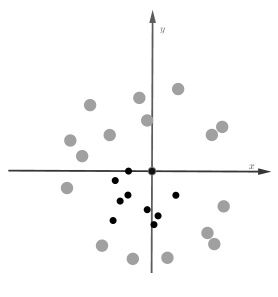

(a)

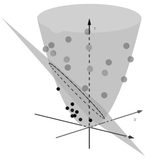

(b)

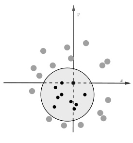

(c)

Hình 28.1. Ví dụ về SVM hạt nhân. (a) Dữ liệu hai lớp không tách biệt tuyến tính trong không gian hai chiều. (b) Nếu xét thêm chiều thứ ba là một hàm số của hai chiều còn lại $z = x ^ { 2 } + y ^ { 2 }$ , các điểm dữ liệu sẽ được phân bố trên một mặt parabolic và hai lớp đã trở nên tách biệt tuyến tính. Mặt phẳng cắt prabolic chính là mặt phân chia, có thể tìm được bởi một SVM lề cứng hoặc mềm. (c) Giao tuyến của mặt phẳng tìm được và mặt parabolic là một đường ellipse. Hình chiếu của đường ellipse này xuống không gian ban đầu chính là đường phân chia hai lớp dữ liệu.

Xét ví dụ trên Hình 28.1 với việc biến dữ liệu không tách biệt tuyến tính trong không gian hai chiều thành tách biệt tuyến tính trong không gian ba chiều. Để quan sát ví dụ này một cách sinh động hơn, bạn có thể xem clip đi kèm trên blog Machine Learning cơ bản tại [https://goo.gl/3wMHyZ](https://goo.gl/3wMHyZ).

Nhìn từ góc độ toán học, SVM hạt nhân là phương pháp đi tìm một hàm số Φ(x) biến đổi dữ liệu x từ không gian đặc trưng ban đầu thành dữ liệu trong một không gian mới. Trong không gian mới, ta mong muốn dữ liệu giữa hai lớp là (gần) tách biệt tuyến tính. Khi đó, ta có thể dùng các bộ phân loại tuyến tính thông thường như hồi quy logistic/softmax hoặc SVM lề cứng/mềm.

Các hàm Φ(x) thường tạo ra dữ liệu mới có số chiều lớn, thậm chí có thể vô hạn chiều. Nếu tính toán các hàm này trực tiếp, chắc chắn chúng ta sẽ gặp các vấn đề về bộ nhớ và hiệu năng tính toán. Có một cách tiếp cận khác là sử dụng các hàm số hạt nhân (kernel function) mô tả quan hệ giữa hai vector trong không gian mới thay vì tính toán trực tiếp biến đổi của từng vector. Kỹ thuật này được xây dựng dựa trên việc giải bài toán đối ngẫu trong SVM lề cứng/mềm.

Nếu phải so sánh, ta thấy rằng hàm hạt nhân có chức năng tương tự như hàm kích hoạt trong mạng neuron vì chúng đều tạo ra các quan hệ phi tuyến.

<!-- page: 380 -->

## 28.2. Cơ sở toán học

Cùng nhắc lại bài toán đối ngẫu trong SVM lề mềm cho dữ liệu $\mathrm { g } \hat { \mathrm { a } } \mathrm { n }$ tách biệt tuyến tính:

$$
\begin{array}{c} \boldsymbol {\lambda} = \arg \max _ {\boldsymbol {\lambda}} \sum_ {n = 1} ^ {N} \lambda_ {n} - \frac {1}{2} \sum_ {n = 1} ^ {N} \sum_ {m = 1} ^ {N} \lambda_ {n} \lambda_ {m} y _ {n} y _ {m} \mathbf {x} _ {n} ^ {T} \mathbf {x} _ {m} \\ \text {thoả   mãn:} \sum_ {n = 1} ^ {N} \lambda_ {n} y _ {n} = 0 \\ 0 \leq \lambda_ {n} \leq C, \forall n = 1, 2, \ldots , N. \end{array}\tag{28.1}
$$

Trong đó, N là số cặp điểm dữ liệu huấn luyện; $\mathbf { x } _ { n }$ và $y _ { n }   =   \pm 1$ lần lượt là là vector đặc trưng và nhãn của dữ liệu thứ $n ;   \lambda _ { n }$ là nhân tử Lagrange ứng với điểm dữ liệu thứ n; và C là một hằng số dương giúp cân đối độ lớn giữa độ rộng lề và sự hy sinh của các điểm nằm trong vùng không an toàn. Khi $C = \infty$ hoặc rất lớn, SVM lề mềm trở thành SVM lề cứng.

Sau khi tìm được λ cho bài toán (28.1), nhãn của một điểm dữ liệu mới sẽ được xác định bởi

$$
\mathrm{class} (\mathbf {x}) = \mathrm{sgn} \left\{\sum_ {m \in \mathcal {S}} \lambda_ {m} y _ {m} \mathbf {x} _ {m} ^ {T} \mathbf {x} + \frac {1}{N _ {\mathcal {M}}} \sum_ {n \in \mathcal {M}} \left(y _ {n} - \sum_ {m \in \mathcal {S}} \lambda_ {m} y _ {m} \mathbf {x} _ {m} ^ {T} \mathbf {x} _ {n}\right) \right\}\tag{28.2}
$$

trong đó, $\mathcal { M } = \{ n   :   0   <   \lambda _ { n }   <   C \}$ là tập hợp những điểm nằm trên hai đường thẳng hỗ trợ; $\mathcal { S } = \{ n : 0 < \lambda _ { n } \}$ là tập hợp các vector nằm trên hai đường hỗ trợ hoặc nằm giữa chúng; $N _ { M }$ là số phần tử của M.

Rất hiếm khi dữ liệu thực tế gần tách biệt tuyến tính, vì vậy nghiệm của bài toán (28.1) có thể không thực sự tạo ra một bộ phân loại tốt. Giả sử rằng ta có thể tìm được hàm số $\varPhi ( )$ sao cho các điểm dữ liệu $\phi ( \mathbf { x } )$ trong không gian mới $( \mathrm { g \hat { a } n } )$ tách biệt tuyến tính.

Trong không gian mới, bài toán (28.1) trở thành:

$$
\begin{array}{c} \boldsymbol {\lambda} = \arg \max _ {\boldsymbol {\lambda}} \sum_ {n = 1} ^ {N} \lambda_ {n} - \frac {1}{2} \sum_ {n = 1} ^ {N} \sum_ {m = 1} ^ {N} \lambda_ {n} \lambda_ {m} y _ {n} y _ {m} \varPhi (\mathbf {x} _ {n}) ^ {T} \varPhi (\mathbf {x} _ {m}) \\ \text {thoả   mãn:} \sum_ {n = 1} ^ {N} \lambda_ {n} y _ {n} = 0 \\ 0 \leq \lambda_ {n} \leq C, \forall n = 1, 2, \ldots , N \end{array}\tag{28.3}
$$

Nhãn của một điểm dữ liệu mới được xác định bởi dấu của biểu thức:

<!-- page: 381 -->

$$
\mathbf {w} ^ {T} \varPhi (\mathbf {x}) + b = \sum_ {m \in \mathcal {S}} \lambda_ {m} y _ {m} \varPhi (\mathbf {x} _ {m}) ^ {T} \varPhi (\mathbf {x}) + \frac {1}{N _ {\mathcal {M}}} \sum_ {n \in \mathcal {M}} \left(y _ {n} - \sum_ {m \in \mathcal {S}} \lambda_ {m} y _ {m} \varPhi (\mathbf {x} _ {m}) ^ {T} \varPhi (\mathbf {x} _ {n})\right)\tag{28.4}
$$

Như đã đề cập, việc tính toán trực tiếp $\phi ( \mathbf { x } )$ cho mỗi điểm dữ liệu có thể sẽ tốn rất nhiều bộ nhớ và thời gian vì số chiều của $\phi ( \mathbf { x } )$ thường rất lớn, có thể là vô hạn. Thêm nữa, để tìm nhãn của một điểm dữ liệu mới x, ta cần tính $\phi ( \mathbf { x } )$ rồi lấy tích vô hướng với các $\varPhi ( \mathbf { x } _ { m } ) , m \in \mathcal { S }$ . Việc tính toán này có thể được hạn chế bằng quan sát dưới đây.

Trong bài toán (28.3) và biểu thức (28.4), ta không cần tính trực tiếp $\phi ( \mathbf { x } )$ cho mọi điểm dữ liệu. Thay vào đó, ta chỉ cần tính $\varPhi ( \mathbf { x } ) ^ { T } \varPhi ( \mathbf { z } )$ với hai điểm dữ liệu x, z. Vì vậy, ta không cần xác định hàm $\varPhi ( . )$ mà chỉ cần tính giá trị $k ( \mathbf { x } , \mathbf { z } ) = \varPhi ( \mathbf { x } ) ^ { T } \varPhi ( \mathbf { z } )$ Kỹ thuật tính tích vô hướng của hai điểm trong không gian mới thay vì tọa độ của từng điểm có tên gọi chung là thủ thuật hạt nhân (kernel trick).

Bằng cách định nghĩa hàm hạt nhân $k ( \mathbf { x } , \mathbf { z } ) = \varPhi ( \mathbf { x } ) ^ { T } \varPhi ( \mathbf { z } )$ , ta có thể viết lại bài toán (28.3) và biểu thức (28.4) như sau:

$$
\boldsymbol {\lambda} = \arg \max _ {\boldsymbol {\lambda}} \sum_ {n = 1} ^ {N} \lambda_ {n} - \frac {1}{2} \sum_ {n = 1} ^ {N} \sum_ {m = 1} ^ {N} \lambda_ {n} \lambda_ {m} y _ {n} y _ {m} k (\mathbf {x} _ {n}, \mathbf {x} _ {m})
$$

$$
\begin{array}{r l} & {\mathrm{thoà} \tilde {\mathrm{mān}}: \sum_ {n = 1} ^ {N} \lambda_ {n} y _ {n} = 0} \\ & {\qquad 0 \leq \lambda_ {n} \leq C, \forall n = 1, 2, \dots , N} \end{array}\tag{28.5}
$$

và

$$
\sum_ {m \in \mathcal {S}} \lambda_ {m} y _ {m} k (\mathbf {x} _ {m}, \mathbf {x}) + \frac {1}{N _ {\mathcal {M}}} \sum_ {n \in \mathcal {M}} \left(y _ {n} - \sum_ {m \in \mathcal {S}} \lambda_ {m} y _ {m} k (\mathbf {x} _ {m}, \mathbf {x} _ {n})\right)\tag{28.6}
$$

Ví dụ: Xét phép biến đổi một điểm trong không gian hai chiều $\mathbf { x } = [ x _ { 1 } , x _ { 2 } ] ^ { T }$ thành một điểm trong không gian năm chiều $\varPhi ( \mathbf { x } )   =   [ 1 , \sqrt { 2 } x _ { 1 } , \sqrt { 2 } x _ { 2 } , \vec { x _ { 1 } ^ { 2 } , \sqrt { 2 } x _ { 1 } x _ { 2 } , x _ { 2 } ^ { 2 } } ] ^ { T }$ Ta có:

$$
\begin{array}{r l} & {\varPhi (\mathbf {x}) ^ {T} \varPhi (\mathbf {z}) = [ 1, \sqrt {2} x _ {1}, \sqrt {2} x _ {2}, x _ {1} ^ {2}, \sqrt {2} x _ {1} x _ {2}, x _ {2} ^ {2} ] [ 1, \sqrt {2} z _ {1}, \sqrt {2} z _ {2}, z _ {1} ^ {2}, \sqrt {2} z _ {1} z _ {2}, z _ {2} ^ {2} ] ^ {T}} \\ & {\qquad = 1 + 2 x _ {1} z _ {1} + 2 x _ {2} z _ {2} + x _ {1} ^ {2} x _ {2} ^ {2} + 2 x _ {1} z _ {1} x _ {2} z _ {2} + x _ {2} ^ {2} z _ {2} ^ {2}} \\ & {\qquad = (1 + x _ {1} z _ {1} + x _ {2} z _ {2}) ^ {2} = (1 + \mathbf {x} ^ {T} \mathbf {z}) ^ {2} = k (\mathbf {x}, \mathbf {z})} \end{array}
$$

Trong ví dụ này, việc tính toán hàm hạt nhân $k ( \mathbf { x } , \mathbf { z } ) = ( 1 + \mathbf { x } ^ { T } \mathbf { z } ) ^ { 2 }$ cho hai điểm dữ liệu đơn giản hơn việc tính từng $\varPhi ( . )$ rồi nhân chúng với nhau. Hơn nữa, giá trị thu được là một số vô hướng thay vì hai vector năm chiều $\mathbf { \phi } ( \mathbf { x } ) , \mathbf { \phi } ( \mathbf { z } )$

Hàm hạt nhân cần có những tính chất $\hat { \mathrm { g 1 } } ,$ và những hàm nào được sử dụng phổ biến?

<!-- page: 382 -->

## 28.3. Hàm số hạt nhân

## 28.3.1. Tính chất của các hàm hạt nhân

Không phải hàm $k ( )$ nào cũng có thể được sử dụng. Các hàm hạt nhân cần có các tính chất:

• Đối xứng: $k ( \mathbf { x } , \mathbf { z } ) = k ( \mathbf { z } , \mathbf { x } )$ , vì tích vô hướng của hai vector có tính đối xứng.

• Về lý thuyết, hàm kernel cần thỏa mãn điều kiện Mercer<sup>69</sup>:

$$
\sum_ {n = 1} ^ {N} \sum_ {m = 1} ^ {N} k (\mathbf {x} _ {m}, \mathbf {x} _ {n}) c _ {n} c _ {m} \geq 0, \forall c _ {i} \in \mathbb {R}, i = 1, 2, \dots , N\tag{28.7}
$$

với mọi tập hữu hạn các vector $\mathbf { x } _ { 1 } , \ldots , \mathbf { x } _ { N }$ . Tính chất này giúp đảm bảo hàm mục tiêu trong bài toán đối ngẫu (28.5) là lồi. Thật vậy, nếu một hàm kernel thỏa mãn điều kiện (28.7), xét $c _ { n } = y _ { n } \lambda _ { n }$ , ta sẽ có:

$$
\boldsymbol {\lambda} ^ {T} \mathbf {K} \boldsymbol {\lambda} = \sum_ {n = 1} ^ {N} \sum_ {m = 1} ^ {N} k (\mathbf {x} _ {m}, \mathbf {x} _ {n}) y _ {n} y _ {m} \lambda_ {n} \lambda_ {m} \geq 0, \forall \lambda_ {n}\tag{28.8}
$$

với K là một ma trận đối xứng và $k _ { n m } = y _ { n } y _ { m } k ( \mathbf { x } _ { n } , \mathbf { x } _ { m } )$ . Từ (28.8) ta suy ra K là một ma trận nửa xác định dương. Vì vậy, bài toán tối ưu (28.5) có ràng buộc là lồi và hàm mục tiêu là một hàm lồi (một quy hoạch toàn phương). Điều kiện này giúp bài toán được giải một cách hiệu quả.

• Trong thực hành, một vài hàm số $k ( )$ không thỏa mãn điều kiện Mercer vẫn cho kết quả chấp nhận được. Những hàm số này vẫn được gọi là hạt nhân. Trong chương này, chúng ta chỉ quan tâm tới các hàm hạt nhân thông dụng có sẵn trong các thư viện.

Việc giải quyết bài toán (28.5) hoàn toàn tương tự như bài toán đối ngẫu trong SVM lề mềm. Chúng ta sẽ không đi sâu vào việc tính nghiệm này. Thay vào đó, chúng ta sẽ thảo luận các hàm hạt nhân thông dụng và hiệu năng của chúng trong các bài toán.

## 28.3.2. Một số hàm hạt nhân thông dụng

## Tuyến tính

Đây là trường hợp đơn giản với hàm hạt nhân chính là tích vô hướng của hai vector: $k ( \mathbf { x } , \mathbf { z } ) = \mathbf { x } ^ { T } \mathbf { z }$ . Như đã chứng minh trong Chương 26, hàm số thỏa mãn điều kiện (28.7). Khi sử dụng sklearn.svm.SVC, hàm này được chọn bằng cách gán kernel = ’linear’.

<small><span class="docvortex-page-footnote" data-block-type="page_footnote" style="color:#6b7280">69 Xem Kernel method – Wikipedia ([https://goo.gl/YXct7F](https://goo.gl/YXct7F))</span></small>

<!-- page: 383 -->

## Đa thức

Hàm hạt nhân đa thức có dạng

$$
k (\mathbf {x}, \mathbf {z}) = (r + \gamma \mathbf {x} ^ {T} \mathbf {z}) ^ {d}\tag{28.9}
$$

Với d là một số thực dương. Khi d là một số tự nhiên, hạt nhân đa thức có thể mô tả hầu hết các đa thức có bậc không vượt quá d.

Khi sử dụng thư viện sklearn, hạt nhân này được chọn bằng cách gán kernel $=  po1y$ . Bạn đọc có thể tìm thấy tài liệu chính thức trong scikit-learn tại [https://goo.gl/QvtFc9](https://goo.gl/QvtFc9).

## Hàm cơ sở radial

Hàm cơ sở radial (radial basic function, RBF hay hạt nhân Gauss) là lựa chọn mặc định trong sklearn, được sử dụng nhiều nhất trong thực tế. Hàm số này được định nghĩa bởi

$$
k (\mathbf {x}, \mathbf {z}) = \exp (- \gamma \| \mathbf {x} - \mathbf {z} \| _ {2} ^ {2}), \gamma > 0\tag{28.10}
$$

## Sigmoid

Hàm dạng sigmoid cũng được sử dụng làm hạt nhân:

$$
k (\mathbf {x}, \mathbf {z}) = \tanh (\gamma \mathbf {x} ^ {T} \mathbf {z} + r)\tag{28.11}
$$

Trong sklearn, hạt nhân này được lựa chọn bằng cách gán kernel = ’sigmoid’.

## Bảng tóm tắt các hàm hạt nhân thông dụng

Bảng 28.2 tóm tắt các hàm hạt nhân thông dụng và cách sử dụng trong sklearn.

Bảng 28.2: Bảng các hàm hạt nhân thông dụng

| Tên | Công thức | Thiết lập hệ số |
| --- | --- | --- |
| 'linear' | x<sup>T</sup>z | không có hệ số |
| 'poly' | (r + γx<sup>T</sup>z)<sup>d</sup> | d: degree, γ: gamma, r: coef0 |
| 'sigmoid' | tanh(γx<sup>T</sup>z + r) | γ: gamma, r: coef0 |
| 'rbf' | exp(-γ&amp;x - z&amp;22) | γ > 0: gamma |

Nếu muốn sử dụng các thư viện cho $\mathrm { C / C + + }$ , các bạn có thể tham khảo LIBSVM ([https://goo.gl/Dt7o7r](https://goo.gl/Dt7o7r)) và LIBLINEAR ([https://goo.gl/ctD7a3](https://goo.gl/ctD7a3)).

## Hàm tự định nghĩa

Ngoài các hàm hạt nhân thông dụng như trên, chúng ta cũng có thể tự định nghĩa các hàm hạt nhân theo hướng dẫn tại [https://goo.gl/A9ajzp](https://goo.gl/A9ajzp).

<!-- page: 384 -->

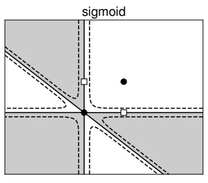

(a) hạt nhân sigmoid

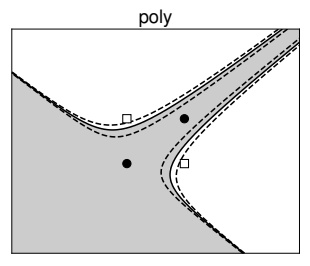

(b) hạt nhân đa thức

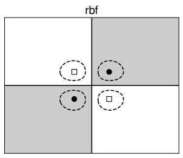

(c) hạt nhân rbf

Hình 28.2. Sử dụng SVM hạt nhân để giải quyết bài toán XOR: (a) hạt nhân sigmoid, (b) hạt nhân đa thức, (c) hạt nhân RBF. Các đường nét liền là các đường phân loại, ứng với giá trị của biểu thức (28.6) bằng 0. Các đường nét đứt là các đường đồng mức ứng với giá trị của biểu thức (28.6) bằng ±0.5. Các vùng có nền màu xám tương ứng với lớp các điểm đen hình tròn, các vùng có nền trắng tương ứng với lớp các điểm trắng hình vuông. Trong ba hạt nhân, RBF cho kết quả đối xứng, hợp lý với dữ liệu bài toán.

## 28.4. Ví dụ minh họa

## 28.4.1. Bài toán XOR

Chúng ta biết rằng bài toán XOR không thể giải quyết nếu chỉ dùng một bộ phân loại tuyến tính. Trong mục này, chúng ta sẽ thử ba hàm hạt nhân khác nhau và sử dụng SVM. Kết quả được minh hoạ trong Hình 28.2. Dưới đây là đoạn mã tìm các mô hình tương ứng:

```python
import numpy as np
import matplotlib.pyplot as plt
from sklearn import svm

# XOR dataset and targets
X = np.array([[0, 0], [1, 1], [1, 0], [0, 1]])
y = np.array([0, 0, 1, 1])
# fit the model
for kernel in ('sigmoid', 'poly', 'rbf'):
    clf = svm.SVC(kernel=kernel, gamma=4, coef0 = 0)
    clf.fit(X, y)
```

## Nhận xét với mỗi hàm hạt nhân:

• sigmoid: Nghiệm tìm được không thật tốt vì có ba trong bốn điểm nằm chính xác trên các đường phân chia.

• poly: Nghiệm này tốt hơn nghiệm của sigmoid nhưng kết quả có phần quá khớp.

<!-- page: 385 -->

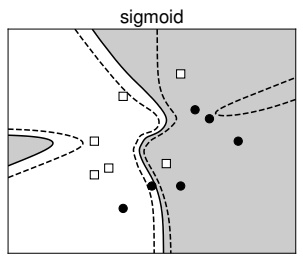

(a) sigmoid kernel.

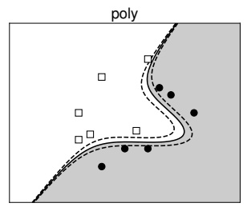

(b) poly kernel.

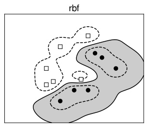

(c) rbf kernel.

Hình 28.3. Sử dụng SVM hạt nhân giải quyết bài toán với dữ liệu gần tách biệt tuyến tính: (a) hạt nhân sigmoid, (b) hạt nhân đa thức, (c) hạt nhân RBF. Hạt nhân đa thức cho kết quả hợp lý nhất.

• rbf: Đường phân chia tìm được khá hợp lý khi tạo ra các vùng đối xứng phù hợp với dữ liệu. Trên thực tế, các rbf kernel được sử dụng nhiều nhất và cũng là lựa chọn mặc định trong sklearn.svm.SVC.

## 28.4.2. Dữ liệu gần tách biệt tuyến tính

Xét một ví dụ khác với dữ liệu giữa hai lớp gần tách biệt tuyến tính như trong Hình 28.3. Trong ví dụ này, dường như quá khớp đã xảy ra với kernel = ’rbf’. Hạt nhân sigmoid cho kết quả không thực sự tốt và ít được sử dụng.

## 28.4.3. Máy vector hỗ trợ hạt nhân cho MNIST

Tiếp theo, chúng ta áp dụng SVM với hạt nhân RBF vào bài toán phân loại bốn chữ số 0, 1, 2, 3 của cơ sở dữ liệu chữ số viết tay MNIST. Trước hết, chúng ta cần lấy dữ liệu rồi chuẩn hóa về đoạn [0, 1] bằng cách chia toàn bộ các thành phần cho 255 (giá trị cao nhất của mỗi điểm ảnh):

```python
from __future__ import print_function
import numpy as np
from sklearn import svm
from sklearn.datasets import fetch_mldata
data_dir = '../../data' # path to your data folder
mnist = fetch_mldata('MNIST original', data_home=data_dir)

X_all = mnist.data/255. # data normalization
y_all = mnist.target
digits = [0, 1, 2, 3]
ids = []
for d in digits:
    ids.append(np.where(y_all == d)[0])

selected_ids = np.concatenate(ids, axis = 0)
X = X_all[selected_ids]
y = y_all[selected_ids]
print('Number of samples = ', X.shape[0])
```

<!-- page: 386 -->

Chương 28. Máy vector hỗ trợ hạt nhân

Kết quả:

```txt
Number of samples = 28911
```

Như vậy, tổng cộng có khoảng 29000 điểm dữ liệu. Chúng ta lấy ra 24000 điểm làm tập kiểm tra, còn lại là dữ liệu huấn luyện. Sử dụng bộ phân loại SVM hạt nhân:

```python
from sklearn.model_selection import train_test_split
from sklearn.metrics import accuracy_score
X_train, X_test, y_train, y_test = train_test_split(X, y, test_size= 24000)

model = svm.SVC(kernel='rbf', gamma=.1, coef0 = 0)
model.fit(X_train, y_train)
y_pred = model.predict(X_test)
print("Accuracy: %.2f %%" %(100*accuracy_score(y_test, y_pred)))
```

Kết quả:

```txt
Accuracy: 94.22 %
```

Kết quả thu được là khoảng 94%. Nếu chọn nhiều điểm dữ liệu huấn luyện hơn và thay đổi các tham số gamma, coef0, bạn đọc có thể sẽ thu được kết quả tốt hơn. Đây là một bài toán phân loại đa lớp, và kỹ thuật giải quyết của thư viện này là one-vs-rest. Như đã đề cập trong Chương 14, one-vs-rest có nhiều hạn chế vì phải huấn luyện nhiều bộ phân loại. Hơn nữa, với SVM hạt nhân, việc tính toán các hàm hạt nhân cũng trở nên phức tạp khi lượng dữ liệu và số chiều dữ liệu tăng lên.

## 28.5. Tóm tắt

• Trong bài toán phân loại nhị phân, nếu dữ liệu hai lớp không tách biệt tuyến tính, chúng ta có thể tìm cách biến đổi dữ liệu sao cho chúng (gần) tách biệt tuyến tính trong không gian mới.

• Việc tính toán trực tiếp hàm Φ() đôi khi phức tạp và tốn nhiều bộ nhớ. Thay vào đó, ta có thể sử dụng thủ thuật hạt nhân. Trong cách tiếp cận này, ta chỉ cần tính tích vô hướng của hai vector bất kỳ trong không gian mới: $k ( \mathbf { x } , \mathbf { z } ) = \varPhi ( \mathbf { x } ) ^ { T } \varPhi ( \mathbf { z } )$ . Thông thường, các hàm k(., .) thỏa mãn điều kiện Mercer, và được gọi là hàm hạt nhân. Cách giải bài toán SVM với hàm hạt nhân hoàn toàn giống cách giải bài toán tối ưu trong SVM lề mềm.

• Có bốn hàm hạt nhân thông dụng: linear, poly, rbf, sigmoid. Trong đó, rbf được sử dụng nhiều nhất và là lựa chọn mặc định trong các thư viện SVM.

• Mã nguồn cho chương này có thể được tìm thấy tại [https://goo.gl/6sbds5](https://goo.gl/6sbds5).

<!-- page: 387 -->

## Máy vector hỗ trợ đa lớp

## 29.1. Giới thiệu

## 29.1.1. Từ phân loại nhị phân tới phân loại đa lớp

Các mô hình máy vector hỗ trợ đã đề cập (lề cứng, lề mềm, hạt nhân) đều được xây dựng nhằm giải quyết bài toán phân loại nhị phân. Để áp dụng những mô hình này cho bài toán phân loại đa lớp, chúng ta có thể sử dụng các kỹ thuật one-vs-rest hoặc one-vs-one. Cách làm này có những hạn chế như đã trình bày trong Chương 14.

Hồi quy softmax (xem Chương 15) – mô hình tổng quát của hồi quy logistic – được sử dụng phổ biến nhất trong các mô hình phân loại hiện nay. Hồi quy softmax tìm ma trận trọng số $\mathbf { W } \in \bar { \mathbb { R } ^ { d \times C } }$ và vector điều chỉnh $\mathbf { b } \in \mathbb { R } ^ { C }$ sao cho với mỗi cặp dữ liệu huấn luyện $( \mathbf { x } , y )$ , thành phần lớn nhất của vector $\mathbf { z } = \mathbf { W } ^ { T } \mathbf { x }$ nằm tại vị trí tương ứng với nhãn y $( y \in \{ 0 , 1 , \ldots , C - 1 \} )$ . Vector z, còn được gọi là vector điểm số (score vector). Để tìm xác suất mỗi điểm dữ liệu rơi vào từng lớp, vector điểm số được đưa qua hàm softmax.

Trong chương này, chúng ta sẽ thảo luận một mô hình khác cũng được áp dụng cho các bài toán phân loại đa lớp – mô hình SVM đa lớp (multi-class SVM). Trong đó, ma trận trọng số W và vector điều chỉnh b cần được tìm sao cho thành phần cao nhất của vector điểm số nằm tại vị trí ứng với nhãn của dữ liệu đầu vào. Tuy nhiên, hàm mất mát được xây dựng dựa trên ý tưởng của hàm mất mát bản lề thay vì entropy chéo. Hàm mất mát này cũng được tối ưu bởi gradient descent. SVM đa lớp cũng có thể thay thế tầng softmax trong các mạng neuron sâu để tạo ra các bộ phân loại khá hiệu quả.

<!-- page: 388 -->

plane

bird

cat

deer

dog

frog

horse

ship

truck

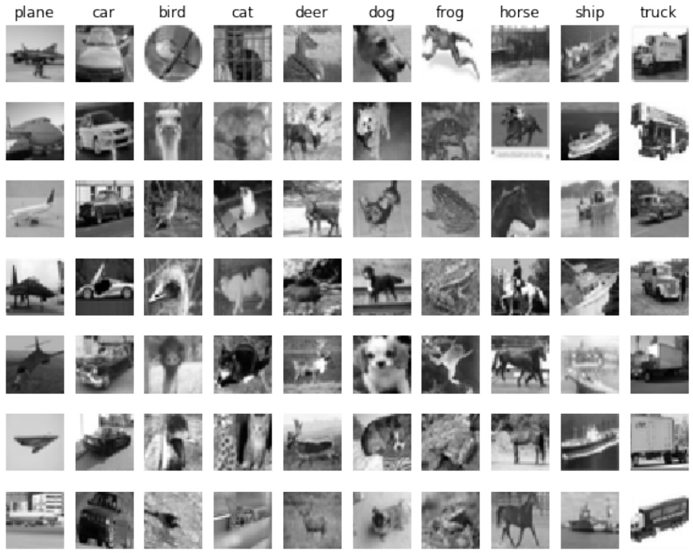

Hình 29.1. Ví dụ về các bức ảnh trong 10 lớp của bộ dữ liệu CIFAR10 (xem ảnh màu tại trang 407).

Chúng ta sẽ tìm hiểu SVM đa lớp qua ví dụ về bài toán phân loại các bức ảnh thuộc 10 lớp khác nhau trong bộ cơ sở dữ liệu CIFAR10 ([https://goo.gl/9KKbQu](https://goo.gl/9KKbQu)).

## 29.1.2. Bộ cơ sở dữ liệu CIFAR10

Bộ cơ sở dữ liệu CIFAR10 gồm 60000 ảnh có kích thước 32 × 32 điểm ảnh thuộc 10 lớp dữ liệu: plane, car, bird, cat, deer, dog, frog, horse, ship, và truck. Một vài ví dụ của mỗi lớp được hiển thị trong Hình 29.1. Tập huấn luyện gồm 50000 bức ảnh, tập kiểm tra gồm 10000 ảnh còn lại. Trong số 50000 ảnh huấn luyện, 1000 ảnh sẽ được lấy ra ngẫu nhiên làm tập xác thực. Đây là một bộ cơ sở dữ liệu tương đối khó vì các bức ảnh có độ phân giải thấp và các đối tượng trong cùng một lớp biến đổi rất nhiều về màu sắc và hình dáng. Thuật toán tốt nhất hiện nay cho bài toán này đã đạt được độ chính xác trên 96% ([https://goo.gl/w1sgK4](https://goo.gl/w1sgK4)),sử dụng một mạng neuron tích chập đa tầng kết hợp với một hồi quy softmax ở tầng cuối cùng. Trong chương này, chúng ta sẽ sử dụng một mạng neuron đơn giản với một tầng SVM đa lớp để giải quyết bài toán. Mô hình này chỉ mang lại độ chính xác khoảng 40%, nhưng cũng đã rất ấn tượng. Chúng ta sẽ

<!-- page: 389 -->

phân tích mô hình và lập trình chỉ sử dụng thư viện numpy. Bài toán này cũng như nội dung chính của chương được lấy từ ghi chép bài giảng Linear Classifier II – CS231n 2016 ([https://goo.gl/y3QsDP](https://goo.gl/y3QsDP)) và Assignment #1 – CS231n 2016 ([https://goo.gl/1Qh84b](https://goo.gl/1Qh84b)).

Trước khi đi vào mục xây dựng và tối ưu hàm mất mát cho SVM đa lớp, chúng ta cần xây dựng một bộ trích chọn đặc trưng cho mỗi ảnh.

## 29.1.3. Xây dựng vector đặc trưng

Sử dung phương pháp xây dựng vector đặc trưng đơn giản nhất: lấy trực tiếp tất cả các điểm trong mỗi ảnh và chuẩn hóa dữ liệu.

• Mỗi ảnh màu của CIFAR-10 có kích thước đều là 32 × 32 điểm ảnh, vì vậy việc đầu tiên chúng ta có thể làm là kéo dài cả ba kênh red, green, blue của bức ảnh thành một vector có kích thước 3 × 32 × 32 = 3072.

• Phương pháp chuẩn hóa dữ liệu đơn giản là trừ mỗi vector đặc trưng đi vector trung bình của dữ liệu trong tập huấn luyện. Việc này sẽ giúp tất cả các thành phần đặc trưng có trung bình bằng không trên tập huấn luyện.

## 29.1.4. Thủ thuật gộp hệ số điều chỉnh

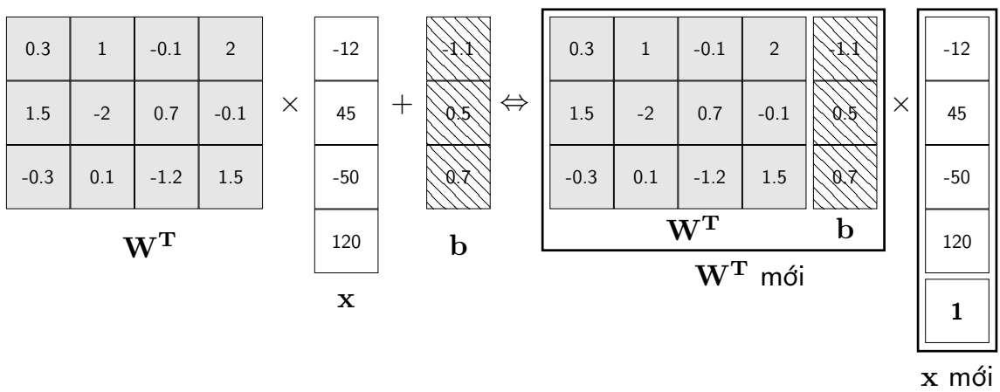

Hình 29.2. Thủ thuật gộp hệ số điều chỉnh

Với một ma trận trọng số $\mathbf { W } \in \mathbb { R } ^ { d \times C }$ và vector điều chỉnh $\mathbf { b } \in \mathbb { R } ^ { C }$ , vector điểm số ứng với một vector đầu vào x được tính bởi:

$$
\mathbf {z} = f (\mathbf {x}, \mathbf {W}, \mathbf {b}) = \mathbf {W} ^ {T} \mathbf {x} + \mathbf {b}\tag{29.1}
$$

Để biểu thức này đơn giản hơn, ta có thể thêm một phần tử bằng một vào x và gộp vector điều chỉnh b vào ma trận trọng số W như ví dụ trong Hình 29.2. Kỹ

<!-- page: 390 -->

thuật này được gọi là thuật gộp hệ số điều chỉnh (bias trick). Từ đây, khi viết W và x, ta ngầm hiểu chúng đã được mở rộng như phần bên phải của Hình 29.2.

Tiếp theo, chúng ta viết chương trình lấy dữ liệu từ CIFAR10, chuẩn hoá dữ liệu và thêm phần tử bằng một vào cuối mỗi vector đặc trưng. Đồng thời, 1000 dữ liệu từ tập huấn luyện cũng được tách ra làm tập xác thực:

```python
from __future__ import print_function
import numpy as np
# need cs231 folder from https://goo.gl/cgJgcG
from cs231n.data_utils import load_CIFAR10

# Load CIFAR 10 dataset
cifar10_dir = 'cs231n/datasets/cifar-10-batches-py'
X_train, y_train, X_test, y_test = load_CIFAR10(cifar10_dir)

# Extract a validation from X_train
from sklearn.model_selection import train_test_split
X_train, X_val, y_train, y_val = train_test_split(X_train, y_train,
    test_size= 1000)

# mean image of all training images
img_mean = np.mean(X_train, axis = 0)

def feature_engineering(X):
    X -= img_mean # zero-centered
    N = X.shape[0] # number of data point
    X = X.reshape(N, -1) # vectorization
    return np.concatenate((X, np.ones((N, 1))), axis = 1) # bias trick

X_train = feature_engineering(X_train)
X_val   = feature_engineering(X_val)
X_test  = feature_engineering(X_test)
print('X_train shape = ', X_train.shape)
print('X_val shape   = ', X_val.shape)
print('X_test shape   = ', X_test.shape)
```

Kết quả:

```python
X_train shape = (49000, 3073)
X_val shape = (1000, 3073)
X_test shape = (10000, 3073)
```

## 29.2. Xây dựng hàm mất mát

## 29.2.1. Mất mát bản lề tổng quát cho SVM đa lớp

Trong SVM đa lớp, nhãn của một điểm dữ liệu mới được xác định bởi thành phần có giá trị lớn nhất trong vector điểm số $\mathbf { z } = \mathbf { W } ^ { T } \mathbf { x }$ (xem Hình 29.3). Điều này tương tự như hồi quy softmax. Hồi quy softmax sử dụng mất mát entropy chéo để ép hai vector xác suất bằng nhau. Việc tối thiểu mất mát entropy chéo

<!-- page: 391 -->

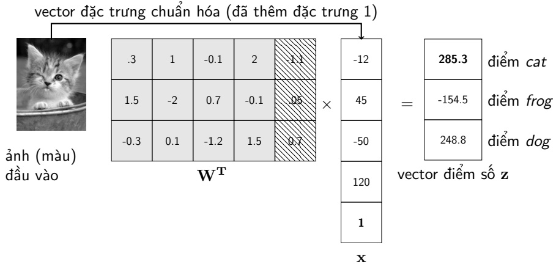

Hình 29.3. Ví dụ về cách tính vector điểm số. Nhãn của một điểm dữ liệu được xác định dựa trên lớp tương ứng có điểm cao nhất.

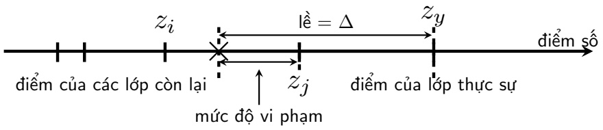

Hình 29.4. Mô tả mất mát bản lề tổng quát. SVM đa lớp ép điểm số của lớp thực sự $\left( z _ { y } \right)$ cao hơn các điểm số khác $( z _ { i } )$ một khoảng cách an toàn ∆. Những điểm số nằm trong vùng an toàn, tức phía trái của điểm $\times ,   \mathsf { s } \tilde { \mathsf { e } }$ gây ra mất mát bằng không. Trong khi đó, những điểm số nằm bên phải điểm × đã rơi vào vùng không an toàn và cần được gán mất mát dương.

tương đương với việc ép phần tử tương ứng nhãn thực sự trong vector xác suất gần bằng một, đồng thời khiến các phần tử xác suất còn lại gần bằng không. Điều này khiến phần tử tương ứng với nhãn thực sự càng lớn hơn các phần tử còn lại càng tốt. SVM đa lớp sử dụng một giải pháp khác cho mục đích tương tự.

Trong SVM đa lớp, hàm mất mát được xây dựng dựa trên định nghĩa của vùng an toàn giống như SVM lề cứng/mềm cho bài toán phân loại nhị phân. Cụ thể, SVM đa lớp ép thành phần ứng của nhãn thực sự của vector điểm số lớn hơn các phần tử khác; không những thế, nó cần lớn hơn một đại lượng $\varDelta > 0$ như được mô tả trong Hình 29.4. Ta gọi đại lượng ∆ này là lề an toàn.

Nếu điểm số tương ứng với nhãn thực sự lớn hơn các điểm số khác một lượng bằng lề an toàn ∆ thì mất mát bằng không. Nói các khác, những điểm số nằm bên trái điểm × không gây ra mất mát nào. Ngược lại, các điểm số nằm bên phải của × cần bị xử phạt, và mức xử phạt tỉ lệ thuận với độ vi phạm (mức độ vượt quá ranh giới an toàn ×).

<!-- page: 392 -->

Để mô tả các mức vi phạm này dưới dạng toán học, trước hết ta giả sử rằng các thành phần của vector điểm số và các lớp dữ liệu được đánh số thứ tự từ một thay vì không như hồi quy softmax. Giả sử rằng điểm dữ liệu x đang xét có nhãn y và vector điểm số $\mathbf { z } = \mathbf { W } ^ { T } \mathbf { x }$ . Như vậy, điểm số của nhãn thực sự là $z _ { y } ,$ điểm số của các nhãn khác là các $z _ { i } , i \neq y$ . Trong Hình 29.4, điểm số $z _ { i }$ nằm trong vùng an toàn còn $z _ { j }$ nằm trong vùng không an toàn. Với mỗi điểm số $z _ { i }$ trong vùng an toàn, mất mát bằng không. Với mỗi điểm số $z _ { j }$ vượt quá ×, mất mát được tính bằng khoảng cách từ điểm đó tới $\times \colon z _ { j } - ( z _ { y } - \varDelta ) = \varDelta - z _ { y } + z _ { j }$

Tóm lại, với một điểm số $z _ { j } , j \neq y ,$ , mất mát do nó gây ra là

$$
\max (0, \Delta - z _ {y} + z _ {j}) = \max (0, \Delta - \mathbf {w} _ {y} ^ {T} \mathbf {x} + \mathbf {w} _ {j} ^ {T} \mathbf {x})\tag{29.2}
$$

trong đó $\mathbf { w } _ { j }$ là cột thứ $j$ của ma trận trọng số W. Như vậy, mất mát tại một điểm dữ liệu $\mathbf { x } _ { n } , n = 1 , 2 , \ldots , N$ vỡi nhãn $y _ { n }$ là

$$
\mathcal {L} _ {n} = \sum_ {j \neq y _ {n}} \max (0, \varDelta - z _ {y _ {n}} ^ {n} + z _ {j} ^ {n})
$$

với $\mathbf { z } ^ { n } = \mathbf { W } ^ { T } \mathbf { x } _ { n } = [ z _ { 1 } ^ { n } , z _ { 2 } ^ { n } , \ldots , z _ { C } ^ { n } ] ^ { T } \in \mathbb { R } ^ { C \times 1 }$ là vector điểm số tương ứng với $\mathbf { x } _ { n }$ Mất mát trên toàn bộ dữ liệu huấn luyện $\mathbf { X }   =   [ \mathbf { x } _ { 1 } , \mathbf { x } _ { 2 } , \ldots , \mathbf { x } _ { N } ]$ , mát mát được định nghĩa là

$$
\mathcal {L} (\mathbf {X}, \mathbf {y}, \mathbf {W}) = \frac {1}{N} \sum_ {n = 1} ^ {N} \sum_ {j \neq y _ {n}} \max (0, \varDelta - z _ {y _ {n}} ^ {n} + z _ {j} ^ {n}).\tag{29.3}
$$

Trong đó, $\mathbf { y } = [ y _ { 1 } , y _ { 2 } , \ldots , y _ { N } ]$ là vector chứa nhãn thực sự của dữ liệu huấn luyện.

## 29.2.2. Cơ chế kiểm soát

Điều gì sẽ xảy ra nếu nghiệm tìm được W là một nghiệm hoàn hảo, tức không có điểm số nào vi phạm và hàm mất mát (29.3) bằng không? Nói cách khác,

$$
\Delta - z _ {y _ {n}} ^ {n} + z _ {j} ^ {n} \leq 0 \Leftrightarrow \Delta \leq \mathbf {w} _ {y _ {n}} ^ {T} \mathbf {x} _ {n} - \mathbf {w} _ {j} ^ {T} \mathbf {x} _ {n} \forall n = 1, 2, \dots , N; j = 1, 2, \dots , C; j \neq y _ {n}
$$

Điều này có nghĩa kW cũng là một nghiệm của bài toán với $k > 1$ bất kỳ. Điều này dẫn tới bài toán có vô số nghiệm và có thể có nghiệm lớn vô cùng. Phương pháp suy giảm trọng số có thể ngăn chặn việc W trở nên quá lớn:

$$
\mathcal {L} (\mathbf {X}, \mathbf {y}, \mathbf {W}) = \underbrace {\frac {1}{N} \sum_ {n = 1} ^ {N} \sum_ {j \neq y _ {n}} \max (0 , \varDelta - \mathbf {w} _ {y _ {n}} ^ {T} \mathbf {x} _ {n} + \mathbf {w} _ {j} ^ {T} \mathbf {x} _ {n})} _ {\text {mất mát dữ liệu}} + \underbrace {\frac {\lambda}{2} \| \mathbf {W} \| _ {F} ^ {2}} _ {\text {suy giảm trọng số}}\tag{29.4}
$$

với λ là một tham số kiểm soát dương giúp cân bằng giữa thành phần mất mát dữ liệu và thành phần kiểm soát. Tham số kiểm soát này được chọn bằng xác thực chéo.

<!-- page: 393 -->

## 29.2.3. Hàm mất mát của SVM đa lớp

Có hai siêu tham số trong hàm mất mát (29.4) là ∆ và λ, câu hỏi đặt ra là làm thế nào để chọn ra cặp giá trị hợp lý nhất cho từng bài toán. Liệu chúng ta có cần thực hiện xác thực chéo cho từng giá trị không? Trên thực tế, người ta nhận thấy rằng $\varDelta$ có thể được chọn bằng một mà không làm ảnh hưởng tới chất lượng của nghiệm ([https://goo.gl/NSyfQi](https://goo.gl/NSyfQi)). Từ đó, hàm mất mát của SVM có dạng

$$
\mathcal {L} (\mathbf {X}, \mathbf {y}, \mathbf {W}) = \frac {1}{N} \sum_ {n = 1} ^ {N} \sum_ {j \neq y _ {n}} \max (0, 1 - \mathbf {w} _ {y _ {n}} ^ {T} \mathbf {x} _ {n} + \mathbf {w} _ {j} ^ {T} \mathbf {x} _ {n}) + \frac {\lambda}{2} \| \mathbf {W} \| _ {F} ^ {2}\tag{29.5}
$$

Nghiệm của bài toán tối thiểu hàm mất mát có thể tìm được bằng gradient descent. Điều này sẽ được thảo luận kỹ trong Mục 29.3.

## 29.2.4. SVM lề mềm là một trường hợp đặc biệt của SVM đa lớp

## (Hồi quy logistic là một trường hợp đặc biệt của hồi quy softmax.)

Khi số lớp dữ liệu $C = 2$ , tạm bỏ qua mất mát kiểm soát, hàm mất mát tại mỗi điểm dữ liệu trở thành

$$
\mathcal {L} _ {n} = \sum_ {j \neq y _ {n}} \max (0, 1 - \mathbf {w} _ {y _ {n}} ^ {T} \mathbf {x} _ {n} + \mathbf {w} _ {j} ^ {T} \mathbf {x} _ {n})\tag{29.6}
$$

Xét hai trường hợp:

$$
\begin{array}{r l} & {\bullet y _ {n} = 1 \Rightarrow \mathcal {L} _ {n} = \max (0, 1 - \mathbf {w} _ {1} ^ {T} \mathbf {x} _ {n} + \mathbf {w} _ {2} ^ {T} \mathbf {x} _ {n}) = \max (0, 1 - (1) (\mathbf {w} _ {1} - \mathbf {w} _ {2}) ^ {T} \mathbf {x})} \\ & {\bullet y _ {n} = 2 \Rightarrow \mathcal {L} _ {n} = \max (0, 1 - \mathbf {w} _ {2} ^ {T} \mathbf {x} _ {n} + \mathbf {w} _ {1} ^ {T} \mathbf {x} _ {n}) = \max (0, 1 - (- 1) (\mathbf {w} _ {1} - \mathbf {w} _ {2}) ^ {T} \mathbf {x})} \end{array}
$$

Nếu ta thay $y _ { n } = - 1$ cho dữ liệu thuộc lớp có nhãn bằng 2 và đặt $\mathbf { \bar { w } } = \mathbf { w } _ { 1 } - \mathbf { w } _ { 2 }$ hai trường hợp trên có thể được viết gọn thành

$$
\mathcal {L} _ {n} = \max (0, 1 - y _ {n} \bar {\mathbf {w}} ^ {T} \mathbf {x} _ {n})
$$

Đây chính là mất mát bản lề trong SVM lề mềm. Như vậy, SVM lề mềm là trường hợp đặc biệt của SVM đa lớp khi số lớp dữ liệu C = 2.

## 29.3. Tính toán giá trị và gradient của hàm mất mát

Với những hàm số phức tạp, việc tính toán gradient rất dễ gây ra kết quả không chính xác. Trước khi thực hiện các thuật toán tối ưu sử dụng gradient, ta cần đảm bảo sự chính xác của việc tính gradient. Một lần nữa, có thể sử dụng phương pháp xấp xỉ gradient theo định nghĩa. Để thực hiện phương pháp này, chúng ta cần tính giá trị của hàm mất mát tại một điểm W bất kỳ.

<!-- page: 394 -->

Việc tính toán giá trị của hàm mất mát và gradient của nó tại W bất kỳ không những cần sự chính xác mà còn cần được thực hiện một cách hiệu quả. Để đạt được điều đó, chúng ta sẽ thực hiện từng bước một. Bước thứ nhất phải đảm bảo rằng các tính toán là chính xác, dù cách tính có thể rất chậm. Bước thứ hai là đảm bảo các phép tính được thực hiện một cách hiệu quả. Hai bước này nên được thực hiện trên một lượng dữ liệu nhỏ để có thể nhanh chóng có kết quả. Việc tính xấp xỉ gradient trên dữ liệu lớn thường tốn rất nhiều thời gian vì phải tính giá trị của hàm số trên từng thành phần của ma trận trọng số W. Các quy tắc này cũng được áp dụng với những bài toán tối ưu khác có sử dụng gradient trong quá trình tìm nghiệm. Hai mục tiếp theo sẽ mô tả hai bước đã nêu ở trên.

## 29.3.1. Tính chính xác

Dưới đây là cách tính hàm mất mát và gradient trong (29.5) bằng hai vòng for:

```python
def svm_loss_naive(W, X, y, reg):
    ''' calculate loss and gradient of the loss function at W. Naive way
    W: 2d numpy array of shape (d, C). The weight matrix.
    X: 2d numpy array of shape (N, d). The training data
    y: 1d numpy array of shape (N, ). The training label
    reg: a positive number. The regularization parameter
    '''
    d, C = W.shape # data dim, No. classes
    N = X.shape[0] # No. points
    loss = 0
    dW = np.zeros_like(W)
    for n in xrange(N):
        xn = X[n]
        score = xn.dot(W)
        for j in xrange(C):
            if j == y[n]:
                continue
            margin = 1 - score[y[n]] + score[j]
            if margin > 0:
                loss += margin
                dW[:, j] += xn
                dW[:, y[n]] -= xn

    loss /= N
    loss += 0.5*reg*np.sum(W * W) # regularization
    dW /= N
    dW += reg*W
    return loss, dW

# random, small data
d, C, N = 100, 3, 300
reg = .1
W_rand = np.random.randn(d, C)
X_rand = np.random.randn(N, d)
y_rand = np.random.randint(0, C, N)
# sanity check
print('Loss with reg = 0 :,', svm_loss_naive(W_rand, X_rand, y_rand, 0)[0])
print('Loss with reg = 0.1:',', svm_loss_naive(W_rand, X_rand, y_rand, .1)[0])
```

<!-- page: 395 -->

Kết quả:

```txt
Loss with reg = 0 : 12.5026818221
Loss with reg = 0.1: 27.7805360552
```

Cách tính với hai vòng for lồng nhau như trên mô tả chính xác biểu thức (29.5) nên tính chính xác có thể được đảm bảo. Việc kiểm tra ở cuối cho cái nhìn ban đầu về hàm mất mát: dương và không có kiểm soát sẽ cho giá trị cao hơn.

Cách tính gradient cho phần mất mát dữ liệu dựa trên nhận xét sau đây:

$$
\begin{array}{r l} \nabla_ {\mathbf {w} _ {y _ {n}}} \max (0, 1 - \mathbf {w} _ {y _ {n}} ^ {T} \mathbf {x} _ {n} + \mathbf {w} _ {j} ^ {T} \mathbf {x} _ {n}) & = \left\{ \begin{array}{c} 0 \quad \text {néu} 1 - \mathbf {w} _ {y _ {n}} ^ {T} \mathbf {x} _ {n} + \mathbf {w} _ {j} ^ {T} \mathbf {x} _ {n} <   0 \\ - \mathbf {x} _ {n} \text {néu} 1 - \mathbf {w} _ {y _ {n}} ^ {T} \mathbf {x} _ {n} + \mathbf {w} _ {j} ^ {T} \mathbf {x} _ {n} > 0 \end{array} \right. \\ \nabla_ {\mathbf {w} _ {j}} \max (0, 1 - \mathbf {w} _ {j} ^ {T} \mathbf {x} _ {n} + \mathbf {w} _ {j} ^ {T} \mathbf {x} _ {n}) & = \left\{ \begin{array}{c} 0 \quad \text {néu} 1 - \mathbf {w} _ {y _ {n}} ^ {T} \mathbf {x} _ {n} + \mathbf {w} {_ j^ {T}} \mathbf {x} _ {n} <   0 \\ \mathbf {x} _ {n} \text {néu} 1 - \mathbf {w} _ {y _ {n}} ^ {T} \mathbf {x} _ {n} + \mathbf {w} {_ j^ {T}} \mathbf {x} _ {n} > 0 \end{array} \right. \end{array} \tag {29.8}
$$

Mặc dù gradient không xác định tại các điểm mà $1 - \mathbf { w } _ { y _ { n } } ^ { T } \mathbf { x } _ { n } + \mathbf { w } _ { j } ^ { T } \mathbf { x } _ { n } = 0$ , ta vẫn có thể giả sử rằng gradient tại 0 cũng bằng 0.

Việc kiểm tra tính chính xác của gradient bằng phương pháp xấp xỉ gradient theo định nghĩa xin dành lại cho bạn đọc.

Khi tính chính xác của gradient đã được đảm bảo, ta cần một cách hiệu quả để tính gradient.

## 29.3.2. Tính hiệu quả

Cách tính toán hiệu quả thường không chứa các vòng for mà được viết gọn lại sử dụng các kỹ thuật vector hóa. Để dễ hình dung, chúng ta cùng quan sát Hình 29.5. Ở đây, chúng ta tạm quên thành phần kiểm soát vì giá trị và gradient của thành phần này đều được tính một cách đơn giản. Chúng ta cũng bỏ qua hệ số $\frac { 1 } { N }$ cho các phép tính đơn giản hơn.

Giả sử có bốn lớp dữ liệu và mini-batch X gồm ba điểm dữ liệu $\mathbf { X } = \left[ \begin{matrix} { \mathbf { x } _ { 1 }   \mathbf { x } _ { 2 }   \mathbf { x } _ { 3 } } \\ \end{matrix} \right]$ lần lượt thuộc các lớp 1, 3, 2 (vector y). Các ô có nền màu xám ở mỗi cột tương ứng với nhãn thực sự của điểm dữ liệu. Các bước tính giá trị và gradient của hàm mất mát có thể được hình dung như sau:

• Bước 1: Tính ma trận điểm số $\mathbf { Z } = \mathbf { W } ^ { T } \mathbf { X } .$

• Bước 2: Với mỗi ô, tính max $\mathbf { \mathit { i } } ( 0 , 1 - \mathbf { w } _ { y _ { n } } ^ { T } \mathbf { x } _ { n } + \mathbf { w } _ { j } ^ { T } \mathbf { x } _ { n } )$ Vì biểu thức hàm mất mát cho một điểm dữ liệu không chứa thành phần $j = y _ { n }$ nên ta không cần tính các ô có nền màu xám. Sau khi tính được giá trị của từng ô, ta chỉ quan tâm tới các ô có giá trị lớn hơn 0 – các ô có nền sọc chéo. Lấy tổng tất cả

<!-- page: 396 -->

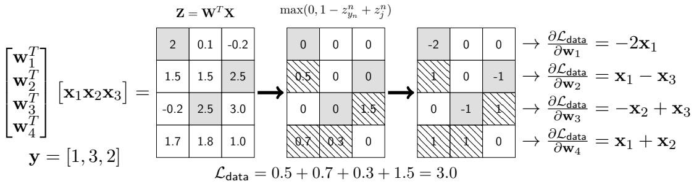

Hình 29.5. Mô phỏng cách tính hàm mất mát và gradient trong SVM đa lớp.

các phần tử của các ô nền sọc chéo, ta được giá trị của hàm mất mát. Ví dụ, nhìn vào ma trận ở giữa trong Hình 29.5, giá trị hàng thứ hai, cột thứ nhất bằng max $( 0 , 1 - 2 + 1 . 5 )   =   \operatorname* { m a x } ( 0 , 0 . 5 )   =   0 . 5$ . Giá trị hàng thứ ba, cột thứ nhất bằng max $( 0 , 1 - 2 + ( - 0 . 2 ) ) = \operatorname* { m a x } ( 0 , - 1 . 2 ) = 0$ . Giá trị hàng thứ tư, cột thứ nhất bằng max $(0,1-2+1.7)=0.7.$ Tương tự với các cột còn lại.

• Bước 3: Theo công thức (29.7) và (29.8), với ô nền sọc ở hàng thứ hai, cột thứ nhất (ứng với điểm dữ liệu $\mathbf { x } _ { 1 } )$ , gradient theo vector trọng số $\mathbf { w } _ { 2 }$ được cộng thêm một lượng $\mathbf { x } _ { 1 }$ và gradient theo vector trọng số $\mathbf { w } _ { 1 }$ bị trừ đi một lượng $\mathbf { x } _ { 1 }$ . Như vậy, trong cột thứ nhất, có bao nhiêu ô nền sọc thì có bấy nhiêu lần gradient của $\mathbf { w } _ { 1 }$ bị trừ đi một lượng $\mathbf { x } _ { 1 }$ . Xét ma trận bên phải, giá trị của ô ở hàng thứ i, cột thứ j là hệ số của gradient theo $\mathbf { w } _ { i }$ gây ra bởi điểm dữ liệu x<sub>j</sub>. Tất cả các ô nền sọc đều có giá trị bằng 1. Ô màu xám ở cột thứ nhất phải bằng -2 vì cột đó có hai ô nền sọc. Tương tự với các ô nền sọc và xám còn lại.

• Bước 4: Cộng theo mỗi hàng, ta được gradient theo hệ số của lớp tương ứng.

Cách tính toán trên đây có thể thực hiện như sau:

```python
def svm_loss_vectorized(W, X, y, reg):
    d, C = W.shape
    N = X.shape[0]
    loss = 0
    dW = np.zeros_like(W)
    Z = X.dot(W) # shape (N, C)
    id0 = np.arange(Z.shape[0])
    correct_class_score = Z[id0, y].reshape(N, 1) # shape (N, 1)
    margins = np.maximum(0, Z - correct_class_score + 1) # shape (N, C)
    margins[id0, y] = 0
    loss = np.sum(margins)
    loss /= N
    loss += 0.5 * reg * np.sum(W * W)

    F = (margins > 0).astype(int)# shape (N, C)
    F[np.arange(F.shape[0]), y] = np.sum(-F, axis = 1)
    dW = X.T.dot(F)/N + reg*W
    return loss, dW
```

<!-- page: 397 -->

Đoạn mã phía trên không chứa vòng for nào. Để kiểm tra tính chính xác và hiệu quả của hàm này, chúng ta cần kiểm chứng ba điều. (i) Giá trị hàm mất mát đã chính xác? (ii) Giá trị gradient đã chính xác? (iii) Cách tính đã thực sự hiệu quả?:

```lua
d, C = 3073, 10
W_rand = np.random.randn(d, C)
import time
t1 = time.time()
l1, dW1 = svm_loss_naive(W_rand, X_train, y_train, reg)
t2 = time.time()
l2, dW2 = svm_loss_vectorized(W_rand, X_train, y_train, reg)
t3 = time.time()
print('Naive          -- run time:', t2 - t1, '(s)')
print('Vectorized   -- run time:', t3 - t2, '(s)')
print('loss difference:', np.linalg.norm(l1 - l2))
print('gradient difference:', np.linalg.norm(dW1 - dW2))
```

Kết quả:

```txt
Naive          -- run time: 7.34640693665 (s)
Vectorized  -- run time: 0.365024089813 (s)
loss difference: 8.73114913702e-11
gradient difference: 1.87942037251e-10
```

Kết quả cho thấy cách tính vector hóa hiệu quả hơn khoảng 20 lần và sự chênh lệch giữa hai cách tính là không đáng kể. Như vậy cả tính chính xác và tính hiệu quả đều đã được đảm bảo.

## 29.3.3. Mini-batch gradient descent cho SVM đa lớp

Việc huấn luyện SVM đa lớp có thể thực hiện như sau:

```python
def multiclass_svm_GD(X, y, Winit, reg, lr=.1,
                    batch_size = 1000, num_iters = 50, print_every = 10):
    W = Winit
    loss_history = []
    for it in xrange(num_iters):
        mix_ids = np.random.permutation(X.shape[0])
        n_batches = int(np.ceil(X.shape[0]/float(batch_size)))
        for ib in range(n_batches):
            ids = mix_ids[batch_size*ib: min(batch_size*(ib+1), X.shape[0])]
            X_batch = X[ids]
            y_batch = y[ids]
            lossib, dW = svm_loss_vectorized(W, X_batch, y_batch, reg)
            loss_history.append(lossib)
            W -= lr*dW
        if it % print_every == 0 and it > 0:
            print('it %d/%d, loss = %f' %(it, num_iters, loss_history[it]))
    return W, loss_history
```

<!-- page: 398 -->

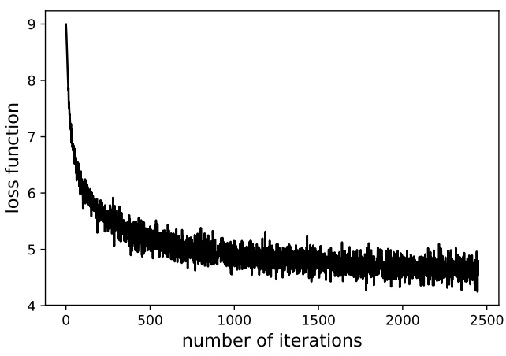

**Hình 29.6.** Lịch sử giá trị hàm mất mát qua các vòng lặp. Ta thấy rằng mất mát có xu hướng giảm và hội tụ khá nhanh.

```python
d, C = X_train.shape[1], 10
reg = .1
W = 0.00001*np.random.randn(d, C)

W, loss_history = multiclass_svm_GD(X_train, y_train, W, reg, lr = 1e-8,
    num_iters = 50, print_every = 5)
```

Kết quả:

```txt
epoch 5/50, loss = 5.482782
epoch 10/50, loss = 5.204365
epoch 15/50, loss = 4.885159
epoch 20/50, loss = 5.051539
epoch 25/50, loss = 5.060423
epoch 30/50, loss = 4.691241
epoch 35/50, loss = 4.841132
epoch 40/50, loss = 4.643097
epoch 45/50, loss = 4.691177
```

Ta thấy rằng giá trị hàm mất mát có xu hướng giảm và hội tụ nhanh. Giá trị hàm mất mát sau mỗi vòng lặp được minh hoạ trong Hình 29.6.

Sau khi đã tìm được ma trận trọng số W, chúng ta cần viết các hàm xác định nhãn của các điểm dữ liệu mới và đánh giá độ chính xác của mô hình:

```python
def multisvm_predict(W, X):
    Z = X.dot(W)
    return np.argmax(Z, axis=1)

def evaluate(W, X, y):
    y_pred = multisvm_predict(W, X)
    acc = 100*np.mean(y_pred == y)
    return acc
```

<!-- page: 399 -->

Tiếp theo, ta sử dụng tập xác thực để chọn ra bộ siêu tham số mô hình phù hợp. Có hai siêu tham số trong thuật toán tối ưu SVM đa lớp: tham số kiểm soát và tốc độ học. Hai tham số này sẽ được tìm bằng phương pháp tìm trên lưới (grid search). Bộ giá trị mang lại độ chính xác trên tập xác thực cao nhất sẽ được dùng để đánh giá tập kiểm tra:

```python
lrs = [1e-9, 1e-8, 1e-7, 1e-6]
regs = [0.1, 0.01, 0.001, 0.0001]
best_W = 0
best_acc = 0
for lr in lrs:
    for reg in regs:
        W, loss_history = multiclass_svm_GD(X_train, y_train, W, reg, \
            lr = 1e-8, num_iters = 100, print_every = 1e20)
        acc = evaluate(W, X_val, y_val)
        print('lr = %e, reg = %e, loss = %f, val acc = %.2f'
            %(lr, reg, loss_history[-1], acc))
        if acc > best_acc:
            best_acc, best_W = acc, W
```

Kết quả:

```csv
lr = 1.000000e-09, reg = 1.000000e-01, loss = 4.422479, val acc = 40.30
lr = 1.000000e-09, reg = 1.000000e-02, loss = 4.474095, val acc = 40.70
lr = 1.000000e-09, reg = 1.000000e-03, loss = 4.240144, val acc = 40.90
lr = 1.000000e-09, reg = 1.000000e-04, loss = 4.257436, val acc = 41.40
lr = 1.000000e-08, reg = 1.000000e-01, loss = 4.482856, val acc = 41.50
lr = 1.000000e-08, reg = 1.000000e-02, loss = 4.036566, val acc = 41.40
lr = 1.000000e-08, reg = 1.000000e-03, loss = 4.085053, val acc = 41.00
lr = 1.000000e-08, reg = 1.000000e-04, loss = 3.891934, val acc = 41.40
lr = 1.000000e-07, reg = 1.000000e-01, loss = 3.947408, val acc = 41.50
lr = 1.000000e-07, reg = 1.000000e-02, loss = 4.088984, val acc = 41.90
lr = 1.000000e-07, reg = 1.000000e-03, loss = 4.073365, val acc = 41.70
lr = 1.000000e-07, reg = 1.000000e-04, loss = 4.006863, val acc = 41.80
lr = 1.000000e-06, reg = 1.000000e-01, loss = 3.851727, val acc = 41.90
lr = 1.000000e-06, reg = 1.000000e-02, loss = 3.941015, val acc = 41.80
lr = 1.000000e-06, reg = 1.000000e-03, loss = 3.995598, val acc = 41.60
lr = 1.000000e-06, reg = 1.000000e-04, loss = 3.857822, val acc = 41.8
```

Như vậy, độ chính xác cao nhất cho tập xác thực là 41.9%. Ma trận trọng số W tốt nhất đã được lưu trong biến best\_W. Áp dụng mô hình này lên tập kiểm tra:

```python
acc = evaluate(best_W, X_test, y_test)
print('Accuracy on test data = %2f %%'%acc)
```

Kết quả:

```txt
Accuracy on test data = 39.88 %
```

Như vậy, kết quả đạt được rơi vào khoảng gần 40 %.

<!-- page: 400 -->

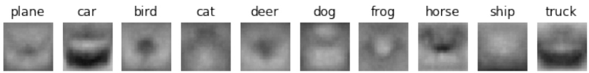

Hình 29.7. Minh họa hệ $s \hat { \mathsf { G } }$ tìm được dưới dạng các bức ảnh (xem ảnh màu tại trang 407).

## 29.3.4. Minh họa nghiệm tìm được

Để $\acute { \mathrm { y } }$ rằng mỗi $\mathbf { w } _ { i }$ có chiều bằng chiều của dữ liệu. Bằng cách loại bỏ các hệ số điều chỉnh ở cuối và sắp xếp lại các điểm ảnh của mỗi trong 10 vector trọng số tìm được, ta sẽ thu được các bức ảnh có cùng kích thước $3 \times 3 2 \times 3 2$ như mỗi ảnh nhỏ trong cơ sở dữ liệu. Hình 29.7 minh họa các vector trọng số $\mathbf { w } _ { i }$ tìm được.

Ta thấy rằng vector trọng số tương ứng với mỗi lớp khá giống các bức ảnh trong lớp đó, ví dụ car và truck. Vector trọng số của ship và plane có mang màu xanh của nước biển và bầu trời (xem ảnh màu tại trang 407). Trong khi đó, horse giống như một con ngựa hai đầu; điều này dễ hiểu vì các con ngựa có thể quay đầu về hai phía trong tập huấn luyện. Có thể nói rằng các hệ số tìm được là ảnh đại diện của mỗi lớp.

Xin nhắc lại, nhãn của mỗi điểm dữ liệu được xác định bởi vị trí của thành phần có giá trị cao nhất trong vector điểm số $\mathbf { z } = \mathbf { W } ^ { T }$ x:

$$
\mathrm{class} (\mathbf {x}) = \arg \max _ {i = 1, 2, \dots , C} \mathbf {w} _ {i} ^ {T} \mathbf {x}
$$

Để ý rằng tích vô hướng chính là đại lượng đo sự tương quan giữa hai vector. Đại lượng này càng lớn thì sự tương quan càng cao, tức hai vector càng giống nhau. Như vậy, việc đi tìm nhãn của một bức ảnh mới chính là việc đi tìm bức ảnh đó giống với bức ảnh đại diện cho lớp nào nhất. Kỹ thuật này này khá giống với KNN, nhưng chỉ có 10 tích vô hướng cần được tính thay vì khoảng cách tới mọi điểm dữ liệu huấn luyện.

## 29.4. Thảo luận

• Giống như hồi quy softmax, SVM đa lớp vẫn được coi là một bộ phân loại tuyến tính vì đường ranh giới giữa các lớp là các đường tuyến tính.

• SVM hạt nhân hoạt động khá tốt, nhưng việc tính toán ma trận hạt nhân có thể tốn nhiều thời gian và bộ nhớ. Hơn nữa, việc mở rộng SVM hạt nhân cho bài toán phân loại đa lớp thường không hiệu quả bằng SVM đa lớp vì kỹ thuật được sử dụng vẫn là one-vs-rest. Một ưu điểm nữa của SVM đa lớp là nó có thể được tối ưu bằng các phương pháp gradient descent, phù hợp với

<!-- page: 401 -->

các bài toán với dữ liệu lớn. Ngoài ra, SVM đa lớp có thể được kết hợp với các mạng neuron đa tầng trong trường hợp dữ liệu không tách biệt tuyến tính.

• Trên thực tế, SVM đa lớp và hồi quy softmax có hiệu quả tương đương nhau (xem [https://goo.gl/xLccj3](https://goo.gl/xLccj3)). Có thể trong một bài toán cụ thể, phương pháp này tốt hơn phương pháp kia nhưng điều ngược lại xảy ra trong các bài toán khác. Khi thực hành, ta có thể thử cả hai phương pháp rồi chọn phương pháp cho kết quả tốt hơn.

<!-- page: 402 -->

## Phương pháp nhân tử Lagrange

Việc tối ưu hàm số một biến liên tục và khả vi trên miền xác định là một tập $\mathrm { m } \mathring { \mathrm { o } } ^ { 1 }$ thường được thực hiện dựa trên việc giải phương trình đạo hàm bằng không. Gọi hàm mục tiêu là $f ( x ) : \mathbb { R } \to \mathbb { R } ,$ cực trị toàn cục nếu có thường được tìm bằng cách giải phương trình $f^{\prime}(x) = 0$ . Chú $\acute { \mathrm { y } }$ rằng điều ngược lại không đúng, tức một điểm thoả mãn đạo hàm bằng không chưa chắc đã là cực trị của hàm số. Ví dụ hàm $f ( x ) = x ^ { 3 }$ có đạo hàm bằng không tại $x = 0$ nhưng điểm này không là một điểm cực trị. Với hàm nhiều biến, ta cũng có thể áp dụng quan sát này: giải phương trình gradient bằng không.

Cách làm trên đây được áp dụng vào các bài toán tối ưu không ràng buộc. Các bài toán có ràng buộc là một phương trình:

$$
\begin{array}{c} \mathbf {x} = \arg \min _ {\mathbf {x}} f _ {0} (\mathbf {x}) \\ \text {thoả   mãn:} \quad f _ {1} (\mathbf {x}) = 0, \end{array}\tag{A.1}
$$

cũng có thể được đưa về bài toán không ràng buộc bằng phương pháp nhân tử Lagrange.

Xét hàm số $\mathcal { L } ( \mathbf { x } , \lambda )   =   f _ { 0 } ( \mathbf { x } ) + \lambda f _ { 1 } ( \mathbf { x } )$ với biến λ được gọi là nhân tử Lagrange (Lagrange multiplier). Hàm số $\mathcal { L } ( \mathbf { x } , \lambda )$ được gọi là hàm Lagrange của bài toán. Người ta đã chứng minh được rằng, điểm tối ưu của bài toán (A.1) thoả mãn điều kiện $\nabla _ { \mathbf { x } , \lambda } \mathcal { L } ( \mathbf { x } , \lambda ) = \mathbf { 0 }$ . Điều này tương đương với:

$$
\nabla_ {\mathbf {x}} \mathcal {L} (\mathbf {x}, \lambda) = \nabla_ {\mathbf {x}} f _ {0} (\mathbf {x}) + \lambda \nabla_ {\mathbf {x}} f _ {1} (\mathbf {x}) = 0\tag{A.2}
$$

$$
\nabla_ {\lambda} \mathcal {L} (\mathbf {x}, \lambda) = f _ {1} (\mathbf {x}) = 0\tag{A.3}
$$

Để $\acute { \mathrm { y } }$ rằng điều kiện thứ hai chính là ràng buộc trong bài toán (A.1).

<small><span class="docvortex-page-footnote" data-block-type="page_footnote" style="color:#6b7280">( ps://goo g / g n)</span></small>

<small><span class="docvortex-page-footnote" data-block-type="page_footnote" style="color:#6b7280">1 Xem thêm: Open sets, closed sets and sequences of real numbers htt . l A KhC .</span></small>

<!-- page: 403 -->

Trong nhiều trường hợp, việc giải hệ phương trình (A.2) - (A.3) đơn giản hơn việc trực tiếp đi tìm nghiệm của bài toán (A.1).

## Ví dụ 1:

Tìm giá trị lớn nhất và nhỏ nhất của hàm số $f _ { 0 } ( x , y ) = x + y$ với x, y thoả mãn điều kiện $f_{1}(x,y)=x^{2}+y^{2}=2$

## Lời giải:

Điều kiện ràng buộc có thể được viết lại dưới dạng $x ^ { 2 }   +   y ^ { 2 }   -   2 = 0$ . Hàm Lagrange của bài toán này là $\mathcal { L } ( x , y , \lambda ) = x + y + \lambda ( x ^ { 2 } + y ^ { 2 } - 2 )$ . Các điểm cực trị của hàm số Lagrange phải thoả mãn hệ điều kiện:

$$
\nabla_ {x, y, \lambda} \mathcal {L} (x, y, \lambda) = 0 \Leftrightarrow \left\{ \begin{array}{l} 1 + 2 \lambda x = 0 \\ 1 + 2 \lambda y = 0 \\ x ^ {2} + y ^ {2} = 2 \end{array} \right.\tag{A.4}
$$

Từ hai phương trình đầu của $(\mathrm { A . 4 ) }$ suy ra $\begin{array} { r } { x = y = \frac { - 1 } { 2 \lambda } } \end{array}$ . Thay vào phương trình cuối ta sẽ có $\lambda ^ { 2 } = { \textstyle { \frac { 1 } { 4 } } } \Rightarrow \lambda = \pm { \textstyle { \frac { 1 } { 2 } } }$ . Vậy ta được 2 cặp nghiệm $(x,y) \in \{(1,1),(-1,-1)\}$ Bằng cách thay các giá trị này vào hàm mục tiêu, ta tìm được giá trị nhỏ nhất và lớn nhất của bài toán.

Ví dụ 2: Chuẩn $\ell _ { 2 }$ của ma trận.

Nhắc lại chuẩn $\ell _ { 2 }$ của một vector $\mathbf { x } : \| \mathbf { x } \| _ { 2 } = { \sqrt { \mathbf { x } ^ { T } \mathbf { x } } }$ . Dựa trên chuẩn $\ell _ { 2 }$ của vector, chuẩn $\ell _ { 2 }$ của một ma trận $\mathbf { A } \in \mathbb { R } ^ { m \times n }$ , ký hiệu là $\| \mathbf { A } \| _ { 2 }$ , được định nghĩa như sau:

$$
\| \mathbf {A} \| _ {2} = \max \frac {\| \mathbf {A x} \| _ {2}}{\| \mathbf {x} \| _ {2}} = \max \sqrt {\frac {\mathbf {x} ^ {T} \mathbf {A} ^ {T} \mathbf {A x}}{\mathbf {x} ^ {T} \mathbf {x}}}, \text {vói} \mathbf {x} \in \mathbb {R} ^ {n}\tag{A.5}
$$

Bài toán tối ưu này tương đương với:

$$
\begin{array}{c} \max \left(\mathbf {x} ^ {T} \mathbf {A} ^ {T} \mathbf {A x}\right) \\ \text {thoả mãn:} \mathbf {x} ^ {T} \mathbf {x} = 1 \end{array}\tag{A.6}
$$

Hàm Lagrange của bài toán này là

$$
\mathcal {L} (\mathbf {x}, \lambda) = \mathbf {x} ^ {T} \mathbf {A} ^ {T} \mathbf {A} \mathbf {x} + \lambda (1 - \mathbf {x} ^ {T} \mathbf {x})\tag{A.7}
$$

Các điểm cực trị của hàm số Lagrange phải thoả mãn:

$$
\nabla_ {\mathbf {x}} \mathcal {L} = 2 \mathbf {A} ^ {T} \mathbf {A} \mathbf {x} - 2 \lambda \mathbf {x} = \mathbf {0}\tag{A.8}
$$

$$
\nabla_ {\lambda} \mathcal {L} = 1 - \mathbf {x} ^ {T} \mathbf {x} = 0\tag{A.9}
$$

Từ $( \mathrm { A . 8 ) }$ ta có $\mathbf { A } ^ { T } \mathbf { A } \mathbf { x } = \lambda \mathbf { x }$ . Vậy x phải là một vector riêng của $\mathbf { A } ^ { T } \mathbf { A }$ ứng với trị riêng λ. Nhân cả hai vế của biểu thức này với $\mathbf { x } ^ { T }$ vào bên trái và sử dụng (A.9), ta thu được:

<!-- page: 404 -->

$$
\mathbf {x} ^ {T} \mathbf {A} ^ {T} \mathbf {A} \mathbf {x} = \lambda \mathbf {x} ^ {T} \mathbf {x} = \lambda\tag{A.10}
$$

Từ đó suy ra $\| \mathbf { A } \mathbf { x } \| _ { 2 }$ đạt giá trị lớn nhất khi λ đạt giá trị lớn nhất. Nói cách khác, λ phải là trị riêng lớn nhất của $\mathbf { A } ^ { T } \mathbf { A }$ . Vậy, $\| \mathbf { A } \| _ { 2 } = \lambda _ { \operatorname* { m a x } } ( \mathbf { A } ^ { T } \mathbf { A } )$

Các trị riêng của $\mathbf { A } ^ { T } \mathbf { A }$ còn được gọi là giá trị suy biến (singular value) của A. Tóm lại, chuẩn $\ell _ { 2 }$ của một ma trận là giá trị suy biến lớn nhất của ma trận đó.

Hoàn toàn tương tự, nghiệm của bài toán

$$
\min _ {\| \mathbf {x} \| = 1} \| \mathbf {A x} \| _ {2}\tag{A.11}
$$

chính là một vector riêng ứng với giá trị suy biến nhỏ nhất của A.

<!-- page: 405 -->

# Ảnh màu

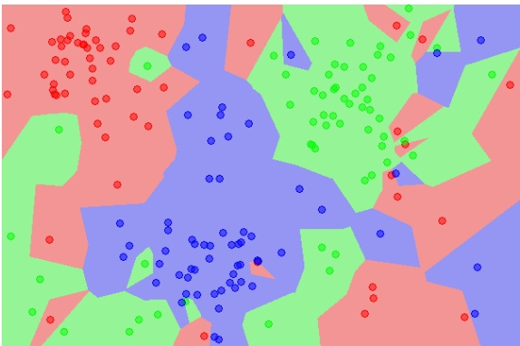

Hình B.1. Ví dụ về 1NN. Các hình tròn khác màu thể hiện các điểm dữ liệu huấn luyện của các lớp khác nhau. Các vùng nền thể hiện những điểm được phân loại vào lớp có màu tương ứng khi sử dụng 1NN (Nguồn: K-nearest neighbors algorithm – Wikipedia ([https://goo.gl/Ba4xhX](https://goo.gl/Ba4xhX)), ảnh màu của Hình B.1.).


Iris setosa


Iris versicolor


Iris virginica

Hình B.2. Ba loại hoa lan trong bộ cơ sở dữ liệu hoa Iris (ảnh màu của Hình 9.2).

<!-- page: 406 -->


Hình B.3. Ảnh:Trọng Vũ ([https://goo.gl/9D8aXW](https://goo.gl/9D8aXW), ảnh màu của Hình 10.7) .


Hình B.4. Kết quả nhận được sau khi thực hiện phân cụm K-means cho các điểm dữ liệu. Có ba cụm dữ liệu tương ứng với ba màu đỏ, hồng, đen (ảnh màu của Hình 10.8).


k=5


K = 10


K = 15


K = 20

Hình B.5. Chất lượng nén ảnh với số lượng cụm khác nhau (ảnh màu của Hình 10.9).

<!-- page: 407 -->

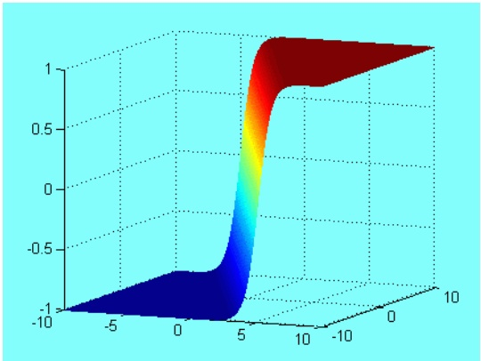

**Hình B.6.** Đồ thị hàm sigmoid trong không gian hai chiều (ảnh màu của Hình 14.4b).

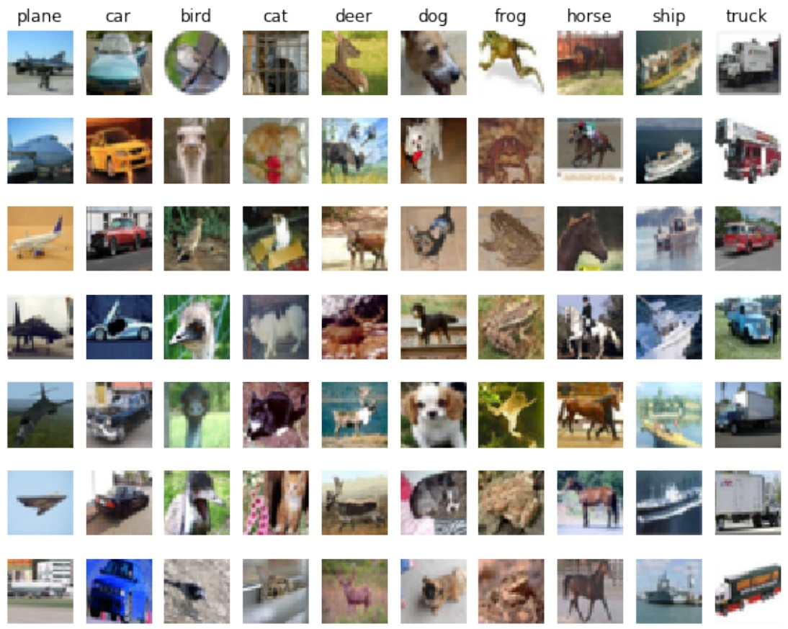

Hình B.7. Ví dụ về các bức ảnh trong 10 lớp của bộ dữ liệu CIFAR10 (ảnh màu của Hình 29.1).

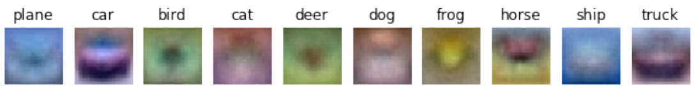

Hình B.8. Minh họa hệ số tìm được dưới dạng các bức ảnh (ảnh màu của Hình B.8).

<!-- page: 408 -->

<!-- page: 409 -->

## Tài liệu tham khảo

[AKA91] David W Aha, Dennis Kibler, and Marc K Albert. Instance-based learning algorithms. Machine learning, 6(1):37–66, 1991.

[AM93] Sunil Arya and David M Mount. Algorithms for fast vector quantization. In Data Compression Conference, pages 381–390. IEEE, 1993.

[AMMIL12] Yaser S Abu-Mostafa, Malik Magdon-Ismail, and Hsuan-Tien Lin. Learning from data, volume 4. AMLBook New York, NY, USA:, 2012.

[AV07] David Arthur and Sergei Vassilvitskii. K-means++: The advantages of careful seeding. In Proceedings of the eighteenth annual ACM-SIAM symposium on Discrete algorithms, pages 1027–1035. Society for Industrial and Applied Mathematics, 2007.

[Bis06] Christopher M Bishop. Pattern recognition and machine learning. Springer, 2006.

[BL14] Artem Babenko and Victor Lempitsky. Additive quantization for extreme vector compression. In Proceedings IEEE Conference on Computer Vision and Pattern Recognition, pages 931–938, 2014.

[Ble08] David M Blei. Hierarchical clustering. 2008.

[BMV+12] Bahman Bahmani, Benjamin Moseley, Andrea Vattani, Ravi Kumar, and Sergei Vassilvitskii. Scalable k-means++. Proceedings of the VLDB Endowment, 5(7):622–633, 2012.

[BTVG06] Herbert Bay, Tinne Tuytelaars, and Luc Van Gool. SURF: Speeded Up Robust Features. Proceedings IEEE European Conference on Computer Vision, pages 404–417, 2006.

[BV04] Stephen Boyd and Lieven Vandenberghe. Convex optimization. Cambridge university press, 2004.

[CLMW11] Emmanuel J Candès, Xiaodong Li, Yi Ma, and John Wright. Robust principal component analysis? Journal of the ACM (JACM),

<!-- page: 410 -->

58(3):11, 2011.

[Cyb89] George Cybenko. Approximation by superpositions of a sigmoidal function. Mathematics of Control, Signals, and Systems (MCSS), 2(4):303–314, 1989.

[DFK+04] Petros Drineas, Alan Frieze, Ravi Kannan, Santosh Vempala, and V Vinay. Clustering large graphs via the singular value decomposition. Machine learning, 56(1):9–33, 2004.

[dGJL05] Alexandre d’Aspremont, Laurent E Ghaoui, Michael I Jordan, and Gert R Lanckriet. A direct formulation for sparse pca using semidefinite programming. In Advances in Neural Information Processing Systems, pages 41–48, 2005.

[DHS11] John Duchi, Elad Hazan, and Yoram Singer. Adaptive subgradient methods for online learning and stochastic optimization. Journal of Machine Learning Research, 12(Jul):2121–2159, 2011.

[DT05] Navneet Dalal and Bill Triggs. Histograms of oriented gradients for human detection. In Proceedings IEEE Conference on Computer Vision and Pattern Recognition, volume 1, pages 886–893. IEEE, 2005.

[ERK+11] Michael D Ekstrand, John T Riedl, Joseph A Konstan, et al. Collaborative filtering recommender systems. Foundations and Trends® in Human–Computer Interaction, 4(2):81–173, 2011.

[FHT01] Jerome Friedman, Trevor Hastie, and Robert Tibshirani. The elements of statistical learning, volume 1. Springer series in statistics New York, 2001.

[Fuk13] Keinosuke Fukunaga. Introduction to statistical pattern recognition. Academic press, 2013.

[GBC16] Ian Goodfellow, Yoshua Bengio, and Aaron Courville. Deep Learning. MIT Press, 2016. [http://www.deeplearningbook.org](http://www.deeplearningbook.org).

[GR70] Gene H Golub and Christian Reinsch. Singular value decomposition and least squares solutions. Numerische mathematik, 14(5):403–420, 1970.

[HNO06] Per Christian Hansen, James G Nagy, and Dianne P O’leary. Deblurring images: matrices, spectra, and filtering. SIAM, 2006.

[HZRS16] Kaiming He, Xiangyu Zhang, Shaoqing Ren, and Jian Sun. Deep residual learning for image recognition. In Proceedings IEEE Conference on Computer Vision and Pattern Recognition, pages 770–778, 2016.

[JDJ17] Jeff Johnson, Matthijs Douze, and Hervé Jégou. Billion-scale similarity search with gpus. arXiv preprint arXiv:1702.08734, 2017.

<!-- page: 411 -->

[JDS11] Herve Jegou, Matthijs Douze, and Cordelia Schmid. Product quantization for nearest neighbor search. IEEE Transactions on Pattern Analysis and Machine Intelligence, 33(1):117–128, 2011.

[KA04] Shehroz S Khan and Amir Ahmad. Cluster center initialization algorithm for k-means clustering. Pattern recognition letters, 25(11):1293–1302, 2004.

[KB14] Diederik Kingma and Jimmy Ba. Adam: A method for stochastic optimization. arXiv preprint arXiv:1412.6980, 2014.

[KBV09] Yehuda Koren, Robert Bell, and Chris Volinsky. Matrix factorization techniques for recommender systems. Computer, 42(8), 2009.

[KH92] Anders Krogh and John A Hertz. A simple weight decay can improve generalization. In Advances in Neural Information Processing Systems, pages 950–957, 1992.

[KSH12] Alex Krizhevsky, Ilya Sutskever, and Geoffrey E Hinton. Imagenet classification with deep convolutional neural networks. In Advances in Neural Information Processing Systems, pages 1097–1105, 2012.

[LCB10] Yann LeCun, Corinna Cortes, and Christopher JC Burges. Mnist handwritten digit database. AT&T Labs [Online]. Available: http://yann. lecun. com/exdb/mnist, 2, 2010.

[LCD04] Anukool Lakhina, Mark Crovella, and Christophe Diot. Diagnosing network-wide traffic anomalies. In ACM SIGCOMM Computer Communication Review, volume 34, pages 219–230. ACM, 2004.

[Low99] David G Lowe. Object recognition from local scale-invariant features. In Proceedings IEEE International Conference on Computer Vision, volume 2, pages 1150–1157. IEEE, 1999.

[LSP06] Svetlana Lazebnik, Cordelia Schmid, and Jean Ponce. Beyond bags of features: Spatial pyramid matching for recognizing natural scene categories. In Proceedings IEEE Conference on Computer Vision and Pattern Recognition, volume 2, pages 2169–2178, 2006.

[LW+02] Andy Liaw, Matthew Wiener, et al. Classification and regression by randomforest. R news, 2(3):18–22, 2002.

[M+97] Tom M Mitchell et al. Machine learning. wcb, 1997.

[MSS+99] Sebastian Mika, Bernhard Schölkopf, Alex J Smola, Klaus-Robert Müller, Matthias Scholz, and Gunnar Rätsch. Kernel pca and denoising in feature spaces. In Advances in Neural Information Processing Systems, pages 536–542, 1999.

[Nes07] Yurii Nesterov. Gradient methods for minimizing composite objective function, 2007.

<!-- page: 412 -->

[NF13] Mohammad Norouzi and David J Fleet. Cartesian k-means. In Proceedings IEEE Conference on Computer Vision and Pattern Recognition, pages 3017–3024, 2013.

[NJW02] Andrew Y Ng, Michael I Jordan, and Yair Weiss. On spectral clustering: Analysis and an algorithm. In Advances in Neural Information Processing Systems, pages 849–856, 2002.

[Pat07] Arkadiusz Paterek. Improving regularized singular value decomposition for collaborative filtering. In Proceedings of KDD cup and workshop, volume 2007, pages 5–8, 2007.

[Pla98] John Platt. Sequential minimal optimization: A fast algorithm for training support vector machines. 1998.

[Pri12] Simon JD Prince. Computer vision: models, learning, and inference. Cambridge University Press, 2012.

[RDVC+04] Lorenzo Rosasco, Ernesto De Vito, Andrea Caponnetto, Michele Piana, and Alessandro Verri. Are loss functions all the same? Neural Computation, 16(5):1063–1076, 2004.

[Rey15] Douglas Reynolds. Gaussian mixture models. Encyclopedia of biometrics, pages 827–832, 2015.

[Ros57] F Rosemblat. The perceptron: A perceiving and recognizing automation. Cornell Aeronautical Laboratory Report, 1957.

[Rud16] Sebastian Ruder. An overview of gradient descent optimization algorithms. arXiv preprint arXiv:1609.04747, 2016.

[SCSC03] Mei-Ling Shyu, Shu-Ching Chen, Kanoksri Sarinnapakorn, and LiWu Chang. A novel anomaly detection scheme based on principal component classifier. Technical report, MIAMI UNIV CORAL GABLES FL DEPT OF ELECTRICAL AND COMPUTER ENGINEERING, 2003.

[SFHS07] J Ben Schafer, Dan Frankowski, Jon Herlocker, and Shilad Sen. Collaborative filtering recommender systems. In The adaptive web, pages 291–324. Springer, 2007.

[SHK+14] Nitish Srivastava, Geoffrey E Hinton, Alex Krizhevsky, Ilya Sutskever, and Ruslan Salakhutdinov. Dropout: a simple way to pre-vent neural networks from overfitting. Journal of Machine Learning Research, 15(1):1929–1958, 2014.

[SKKR00] Badrul Sarwar, George Karypis, Joseph Konstan, and John Riedl. Application of dimensionality reduction in recommender system-a case study. Technical report, Minnesota Univ Minneapolis Dept of Computer Science, 2000.

<!-- page: 413 -->

[SKKR02] Badrul Sarwar, George Karypis, Joseph Konstan, and John Riedl. Incremental singular value decomposition algorithms for highly scalable recommender systems. In Fifth International Conference on Computer and Information Science, pages 27–28. Citeseer, 2002.

[SLJ+15] Christian Szegedy, Wei Liu, Yangqing Jia, Pierre Sermanet, Scott Reed, Dragomir Anguelov, Dumitru Erhan, Vincent Vanhoucke, and Andrew Rabinovich. Going deeper with convolutions. In Proceedings IEEE Conference on Computer Vision and Pattern Recognition, pages 1–9, 2015.

[SSWB00] Bernhard Schölkopf, Alex J Smola, Robert C Williamson, and Peter L Bartlett. New support vector algorithms. Neural computation, 12(5):1207–1245, 2000.

[SWY75] Gerard Salton, Anita Wong, and Chung-Shu Yang. A vector space model for automatic indexing. Communications of the ACM, 18(11):613–620, 1975.

[SZ14] Karen Simonyan and Andrew Zisserman. Very deep convolutional networks for large-scale image recognition. arXiv preprint arXiv:1409.1556, 2014.

[TH12] Tijmen Tieleman and Geoffrey Hinton. Lecture 6.5-rmsprop: Divide the gradient by a running average of its recent magnitude. COURS-ERA: Neural networks for machine learning, 4(2):26–31, 2012.

[VJG14] João Vinagre, Alípio Mário Jorge, and João Gama. Fast incremental matrix factorization for recommendation with positive-only feedback. In International Conference on User Modeling, Adaptation, and Personalization, pages 459–470. Springer, 2014.

[VL07] Ulrike Von Luxburg. A tutorial on spectral clustering. Statistics and computing, 17(4):395–416, 2007.

[VM16] Tiep Vu and Vishal Monga. Learning a low-rank shared dictionary for object classification. In Proceedings IEEE International Conference on Image Processing, pages 4428–4432. IEEE, 2016.

[VM17] Tiep Vu and Vishal Monga. Fast low-rank shared dictionary learning for image classification. IEEE Transactions on Image Processing, 26(11):5160–5175, Nov 2017.

[VMM+16] Tiep Vu, Hojjat Seyed Mousavi, Vishal Monga, Ganesh Rao, and UK Arvind Rao. Histopathological image classification using discriminative feature-oriented dictionary learning. IEEE Transactions on Medical Imaging, 35(3):738–751, 2016.

[WYG+09] John Wright, Allen Y Yang, Arvind Ganesh, S Shankar Sastry, and Yi Ma. Robust face recognition via sparse representation. IEEE Transactions on Pattern Analysis and Machine Intelligence,

<!-- page: 414 -->

31(2):210–227, 2009.

[XWCL15] Bing Xu, Naiyan Wang, Tianqi Chen, and Mu Li. Empirical evaluation of rectified activations in convolutional network. arXiv preprint arXiv:1505.00853, 2015.

[YZFZ11] M. Yang, L. Zhang, X. Feng, and D. Zhang. Fisher discrimination dictionary learning for sparse representation. In Proceedings IEEE International Conference on Computer Vision, pages 543–550, Nov. 2011.

[ZDW14] Ting Zhang, Chao Du, and Jingdong Wang. Composite quantization for approximate nearest neighbor search. In International Conference on Machine Learning, number 2, pages 838–846, 2014.

[ZF14] Matthew D Zeiler and Rob Fergus. Visualizing and understanding convolutional networks. In Proceedings IEEE European Conference on Computer Vision, pages 818–833. Springer, 2014.

[ZWFM06] Sheng Zhang, Weihong Wang, James Ford, and Fillia Makedon. Learning from incomplete ratings using non-negative matrix factorization. In Proceedings of the 2006 SIAM International Conference on Data Mining, pages 549–553. SIAM, 2006.

[ZYK06] Haitao Zhao, Pong Chi Yuen, and James T Kwok. A novel incremental principal component analysis and its application for face recognition. IEEE Transactions on Systems, Man, and Cybernetics, Part B (Cybernetics), 36(4):873–886, 2006.

[ZYX+08] Zhi-Qiang Zeng, Hong-Bin Yu, Hua-Rong Xu, Yan-Qi Xie, and Ji Gao. Fast training support vector machines using parallel sequential minimal optimization. In International Conference on Intelligent System and Knowledge Engineering, volume 1, pages 997–1001. IEEE, 2008.

<!-- page: 415 -->

<div class="docvortex-algorithm" style="white-space: pre-wrap; font-family:monospace;">
K lân cận – K-nearest neighbor, 118
K-means clustering – phân cụm K-means, 128
centroid – tâm cụm, 128
K-nearest neighbor – K lân cận, 118
α-sublevel set – tập dưới mức α, 315
đạo hàm riêng – partial derivative, 43
định thức – determinant, 29

activation function – hàm kích hoạt, 180, 218
ReLU, 219
sigmoid, 187, 218
tanh, 187, 218
affine function – hàm affine, 312
argmin, 87

bất phương trình ràng buộc – inequality constraint, 302
bầu chọn đa số – major voting, 124
bài toán đối ngẫu Lagrange – Lagrange dual problem, 342
bài toán chính – dual problem, 339
bài toán tối ưu – convex optimization, 302
bài toán tối ưu – optimization problem, 324
bài toán tối ưu không ràng buộc – unconstrained optimization problem, 302
bài toán tối ưu lời – convex optimization problem, 326
bộ phân loại lề rộng nhất – maximum margin classifier, 351
bộ phân loại naive Bayes – naive Bayes classifier, 145
backpropagation – lan truyền ngược, 220
bag of words – túi từ, 92
từ diễn, 92
bao lời – convex hull, 308
basic – cơ cổ, 31
basic – cơ sở
orthogonal – trực giao, 33
orthonormal – trực chuẩn, 33
batch gradient descent, 171
Bayes’ rule – quy tắc Bayes, 59
between-class variance – phương sai liên lớp, 290

between-class variance matrix – ma trận phương sai liên lớp, 292
biến đối ngẫu – dual variable, 339
biến lỏng lẻo – slack variable, 326, 362
biến ngẫu nhiên – random variable, 54
biến ngẫu nhiên độc lập – independent random variables, 59
biến tối ưu – optimization variable, 302
biệt thức – discriminant, 289
biệt thức tuyến tính Fisher – Fisher’s linear discriminant, 293
biểu diễn one-hot – one-hot encoding, 63
bias – hệ số điều chỉnh, 103
bias trick – thủ thuật gộp hệ số điều chỉnh, 103, 389

binary classification – phân loại nhị phân, 175

cầu chuẩn – norm ball, 306
cực đại địa phương – local maxima, 158
cực đại toàn cục – global maxima, 158
cực tiểu địa phương – local minima, 158
cực tiểu toàn cục – global minima, 158
cực trị địa phương – local extrema, 158
cực trị toàn cục – global extrema, 158
cụm – cluster, 128
có cổ – basic, 31
có chế kiểm soát – regularization, 113, 392
kiểm soát $\ell_1 - \ell_1$ regularization, 114
kiểm soát $\ell_2 - \ell_2$ regularization, 114
có sở – basic
trực chuẩn – orthonormal, 33
trực giao – orthogonal, 33
có sở dữ liệu khuôn mặt Yale – Yale face database, 284
căn bậc hai sai số trung bình bình phương – root mean squared error, 243
chéo hoá ma trận – matrix diagonalization, 37
chặn dưới – lower bound, 304
chặn dưới lớn nhất – infimum, 304
chặn trên – upper bound, 304
chặn trên nhỏ nhất – supremum, 304
chưa khớp – underfitting, 109
</div>

## Index

<!-- page: 416 -->

<div class="docvortex-algorithm" style="white-space: pre-wrap; font-family:monospace;">
chain rule – quy tắc chuỗi, 46
characteristic polynomial – đa thức đặc trưng, 35
Cholesky decomposition – Phân tích Cholesky, 39
chuẩn – norm, 39
    chuẩn $\ell_1$, 41
    chuẩn $\ell_2$ – $\ell_2$ norm, 40
    chuẩn $\ell_p$, 40
    chuẩn Euclid – Euclidean norm, 40
    chuẩn Frobenius – Frobenius norm, 41
chuẩn hoá theo phân phối chuẩn – standardiza-
tion, 99
chuyển khoảng giá trị – rescaling, 99
chuyển vị – transpose, 24
chuyển vị liên hợp – conjugate transpose, 25
class boundary, 175
classification – Phân loại, 82
cluster – cụm, 128
clustering – phân cụm, 83
compact SVD – SVD giản lược, 269
complementary slackness – điều kiện lỏng lẻo bù
trừ, 344, 356
concave function – hàm lõm, 310
conditional probability – xác suất có điều kiện,
58
conjugate distribution – phân phối liên hợp, 74
conjugate prior – tiên nghiệm liên hợp, 74
conjugate transpose – chuyển vị liên hợp, 25
consine similarity – tương tự cos, 248
constraint – ràng buộc, 302
constraint qualification – tiêu chuẩn ràng buộc,
343
convex – lồi, 302
convex combination – tổ hợp lồi, 308
convex function – hàm lồi, 309
convex hull – bao lồi, 308
convex optimization – bài toán tối ưu, 302
convex optimization problem – bài toán tối ưu
lồi, 326
convex set – tập lồi, 304
cross entropy – entropy chéo, 205, 319
CVXOPT, 328
dạng toàn phương – quadratic form, 312
đa thức – posynomial, 334
đa thức đặc trưng – characteristic polynomial, 35
đặc trưng – feature, 81
đặc trưng đã trích xuất – extracted feature, 91
đặc trưng thủ công – hand-crafted feature, 96
data point – điểm dữ liệu, 81
đầu ra dự đoán – predicted output, 100
đầu ra thực sự – ground truth, 100
determinant – định thức, 29
điều kiện KKT – KKT condition, 345
điều kiện Mercer, 382
điều kiện bậc hai – second-order condition, 318
điều kiện bậc nhất – first-order condition, 317
điều kiện lỏng lẻo bù trừ – complementary
slackness, 344, 356

đieểm dữ liệu – data point, 81
đieểm khả thi – feasible point, 302, 303
đieểm tối ưu – optimal point, 325
đieểm tối ưu đối ngẫu – dual optimal point, 342
đieểm tối ưu địa phương – local optimal point, 325
dimensionality reduction – giảm chiều dữ liệu,
92, 265
định lý siêu phẳng phân chia – separating
hyperplane theorem, 309
discriminant – biệt thức, 289
độ lệch chuẩn – standard deviation, 60, 290
độc lập tuyến tính – linearly independent, 30
đối ngẫu – duality, 338
đối ngẫu mạnh – strong duality, 343
đối ngẫu yếu – weak duality, 343
domain – tập xác định, 302
đơn thức – monomial, 334
dual feasible set – tập khả thi đối ngẫu, 342
dual optimal point – diễm tối ưu đối ngẫu, 342
dual problem – bài toán chính, 339
dual variable – biến đối ngẫu, 339
duality – đối ngẫu, 338
đường đồng mức – level sets, 166, 313

early stopping – kết thúc sớm, 113
eigen decomposition – phân tích riêng, 266
eigendecomposition – phân tích trị riêng, 37
eigenface – khuôn mặt riêng, 283
eigenspace – không gian riêng, 36
eigenvalues – trị riêng, 35
eigenvectors – vector riêng, 35
end-to-end, 91
entropy chéo – cross entropy, 205, 319
epoch, 172
equality constraint – phương trình ràng buộc, 302
equality constraint function – hàm phương trình
ràng buộc, 302
expectation – kỳ vọng, 59
extracted feature – đặc trưng đã trích xuất, 91

feasible point – diễm khả thi, 302, 303
feasible set – tập khả thi, 302, 303, 322
feature – đặc trưng, 81
feature extraction – trích chọn đặc trưng, 88, 265
feature selection – lựa chọn đặc trưng, 92, 114,
265

feature vector – vector đặc trưng, 81, 88
feedforward – lan truyền thuận, 217
first-order condition – điều kiện bậc nhất, 317
Fisher’s linear discriminant – biệt thức tuyến
tính Fisher, 293

Gaussian naive Bayes, 147
Gaussian mixture model, 142
GD, 158

geometric programming – quy hoạch hình học,
334

giá trị suy biến – singular value, 267
</div>

<!-- page: 417 -->

giá trị tối ưu – optimal value, 325

giả chuẩn – pseudo norm, 307

giả nghịch đảo – pseudo inverse, 102

giảm chiều dữ liệu – dimensionality reduction, 92, 265

global extrema – cực trị toàn cục, 158

global maxima – cực đại toàn cục, 158

global minima – cực tiểu toàn cục, 158

first-order gradient – gradient bậc nhất, 43

gradient bậc hai – second-order gradient, 43

gradient bậc nhất – first-order gradient, 43

gradient xấp xỉ – numerical gradient, 49, 393

numerical gradient – gradient xấp xỉ, 49, 393

second-order gradient – gradient bậc hai, 43

gradient descent, 158

điều kiện dừng – stopping criteria, 173

batch size – kích thước batch, 173

kích thước batch – batch size, 173

mini-batch, 173

momentum, 167

Nesterov accelerated gradient, 170

stopping criteria – điều kiện dừng, 173

gradient desenct

stochastic gradient descent, 171

grid search – tìm trên lưới, 398

ground truth – đầu ra thực sự, 100

hồi quy – regression, 82

hồi quy đa thức – polynomial regression, 106, 109

hồi quy Huber – Huber regression, 106

hồi quy lasso – lasso regression, 114

hồi quy logistic – logistic regression, 185

hồi quy logistic multinomial, 213

hồi quy ridge – ridge regression, 107, 114, 239

hồi quy softmax – softmax regression, 201

hồi quy tuyến tính – linear regression, 100

hàm đối ngẫu Lagrange – the Lagrange dual function, 339

hàm đo độ tương tự – similarity function, 246

hàm affine – affine function, 312

hàm bất phương trình ràng buộc – inequality constraint function, 302

hàm cơ sở radial – radial basic function, RBF, 383

hàm hợp lý – likelihood, 68

hàm hạt nhân – kernel function, 379, 382

đa thức – polynomial, 383

RBF, 383

sigmoid, 383

tuyến tính – linear, 382

hàm kích hoạt – activation function, 180, 218 ReLU, 219

sigmoid, 187, 218

tanh, 187, 218

hàm lồi – convex function, 309

hàm lồi chặt – stricly convex function, 310

hàm lõm – concave function, 310

hàm lõm chặt – stricly concave function, 310

hàm mất mát – loss function/cost function, 86

hàm mất mát được kiểm soát – regularized loss function, 114

hàm mật độ xác suất – probability density function, 55

hàm phương trình ràng buộc – equality constraint function, 302

hàm số Lagrange – Lagrangian, 339

hàm softmax, 202

hàm trả về vector – vector-valued function, 45

hệ số điều chỉnh – bias, 103

hệ thống gợi ý – recommendation system, 233, 234

dựa trên nội dung – content-based, 234

hiện tượng đuôi dài – long tail, 234

lọc cộng tác – collaborative filtering, 235

lọc cộng tác lân cận – neighborhood-based collaborative filtering, 245

lọc cộng tác người dùng – user-user collaborative filtering, 246

lọc cộng tác sản phẩm – item-item collaborative filtering, 251

ma trận tương tự – similarity matrix, 248

ma trận tiện ích – utility matrix, 235

ma trận tiện ích chuẩn hoá – normalized utility matrix, 248

người dùng, 234

sản phẩm, 234

hạng – rank, 32

học bán giám sát – semi-supervised learning, 85

học có giám sát – supervised learning, 84

học củng cố – reinforcement learning, 85

học chuyển tiếp – transfer learning, 97

học không giám sát – unsupervised learning, 84

học ngoại tuyến – offline learning, 81

học trực tuyến – online learning, 81, 172

Hadamard product – phép nhân từng thành phần, 26

Hadamard product – tích từng thành phân, 223

halfspace – nửa không gian, 306

hard threshold – ngưỡng cứng, 186

hard-margin SVM – SVM lề cứng, 362

Hermitian, 25

Hesse – Hessian, 43, 318

Hessian – Hesse, 43, 318

hidden layer – tầng ẩn, 182

hierarchical classification – phân loại phân tầng, 197

hierarchical clustering – phân cụm theo tầng, 138

hinge loss – mất mát bản lề, 369

hoàn thiện dữ liệu, 83

hoàn thiện ma trận – matrix completion, 236

Huber regression – hồi quy Huber, 106

hyperparameter – siêu tham số, 75

hyperplane – siêu mặt phẳng, 306

hyperplane – siêu phẳng, 175

<!-- page: 418 -->

identity matrix - ma trận đơn vị, 27 incremental matrix factorization – phân tích ma trận điều chỉnh nhỏ, 264 independent random variables – biến ngẫu nhiên độc lập, 59 inequality constraint – bất phương trình ràng buộc, 302 inequality constraint function – hàm bất phương trình ràng buộc, 302 infimum – chặn dưới lớn nhất, 304 inner product – tích vô hướng, 26 input layer – tầng đầu vào, 180 inverse matrix - ma trận nghịch đảo, 27 iteration – vòng lặp, 172 joint probability – xác suất đồng thời, 55 kết thúc sớm – early stopping, 113 kỳ vọng – expectation, 59 kernel function – hàm hạt nhân, 379, 382 linear – tuyến tính, 382 polynomial – đa thức, 383 RBF, 383 sigmoid, 383 kernel model – mô hình hạt nhân, 378 kernel SVM – SVM hạt nhân, 378 kernel trick – thủ thuật hạt nhân, 381 không gian null – null space, 31 không gian range – range space, 31 không gian riêng – eigenspace, 36 không gian sinh – span space, 30 khuôn mặt riêng – eigenface, 283 KKT condition – điều kiện KKT, 345 KNN, 118 lồi – convex, 302 làm mềm Laplace – Laplace smoothing, 147 lựa chọn đặc trưng – feature selection, 92, 114, 265 Lagrange dual problem – bài toán đối ngẫu Lagrange, 342 Lagrange multiplier – nhân tử Lagrange, 338 Lagrangian – hàm số Lagrange, 339 lan truyền ngược – backpropagation, 220 lan truyền thuận – feedforward, 217 Laplace smoothing – làm mềm Laplace, 147 large-scale – quy mô lớn, 119 lasso regression – hồi quy lasso, 114 layer – tầng, 217 LDA, 288 LDA đa lớp – multi-class LDA, 293 leading principal submatrix – ma trận con chính trước, 39 learning rate – tốc độ học, 160 learning rate decay – suy giảm tốc độ học, 163 left-singular value – vector suy biến trái, 267 level sets – đường đồng mức, 166, 313 likelihood – hàm hợp lý, 68

linear combination – tổ hợp tuyến tính, 30 linear constraint – ràng buộc tuyến tính, 321 linear discriminant analysis – phân tích biệt thức tuyến tính, 288 linear programming – quy hoạch tuyến tính, 329 general form – dạng tổng quát, 329 standard form – dạng tiêu chuẩn, 329 linear regression – hồi quy tuyến tính, 100 linearly dependent – phụ thuộc tuyến tính, 30 linearly independent – độc lập tuyến tính, 30 linearly separable – tách biệt tuyến tính, 175, 299, 308 local extrema – cực trị địa phương, 158 local maxima – cực đại địa phương, 158 local minima – cực tiểu địa phương, 158 local optimal point – điểm tối ưu địa phương, 325 log-likelihood, 68 logistic regression – hồi quy logistic, 185 loss function/cost function – hàm mất mát, 86 low-rank approximation – xấp xỉ hạng thấp, 271 lower bound – chặn dưới, 304 mất mát bản lề – hinge loss, 369 mất mát bản lề tổng quát, 390 mất mát không-một – zero-one loss, 369 máy dịch – machine translation, 83 máy vector hỗ trợ – support vector machine, 350 lề – margin, 351 máy vector hỗ trợ đa lớp, 387 mô hình hạt nhân – kernel model, 378 mô hình thưa – sparse model, 356 mạng neuron – neural network, 180 mã hoá one-hot – one-hot coding, 129 ma trận đối xứng – symmetric matrix, 25 ma trận đường chéo, 28 ma trận chiếu – projection matrix, 92, 289 ma trận con chính – principal submatrix, 39 ma trận con chính trước – leading principal submatrix, 39 ma trận phương sai liên lớp – between-class variance matrix, 292 ma trận phương sai nội lớp – within-class variance matrix, 292 ma trận tam giác, 28 ma trận tam giác dưới, 28 ma trận tam giác trên, 28 ma trận trực giao – orthogonal matrix, 33 ma trận trọng số – weight matrix, 199, 201 ma trận unitary, 33 machine translation – máy dịch, 83 major voting – bầu chọn đa số, 124 MAP, 73 MAP estimation, 67 marginal probability – xác suất biên, 57 marginalization – phép biên hóa, 57 marginalization – xác suất biên, 57 matrix completion – hoàn thiện ma trận, 236 matrix diagonalization – chéo hoá ma trận, 37

<!-- page: 419 -->

maximum a posteriori estimation – ước lượng hậu nghiệm cực đại, 67

maximum a posteriori estimation, MAP estimation – ước lượng hậu nghiệm cực đại, 73

maximum likelihood estimation – ước lượng hợp lý cực đại, 68

maximum margin classifier – bộ phân loại lề rộng nhất, 351

mean squared error, MSE – sai số trung bình bình phương, 110

misclassified – phân loại lỗi, 177

MLE, 68

MNIST, 136

model hyperparameter – siêu tham số mô hình, 111

model parameter – tham số mô hình, 67, 86, 111

monomial – đơn thức, 334

MSE – sai số trung bình bình phương, 221

multi-class classification – phân loại đa lớp, 196

multi-class LDA – LDA đa lớp, 293

multinomial naive Bayes, 147

nút – node, unit, 217

nửa không gian – halfspace, 306

nửa xác định âm – negative semidefinite, 38

nửa xác định dương – positive semidefinite, 38

naive Bayes classifier – bộ phân loại naive Bayes, 145

NBC, 145

negative definite – xác định âm, 38

negative semidefinite – nửa xác định âm, 38

neural network – mạng neuron, 180

ngưỡng – threshold, 186

ngưỡng cứng – hard threshold, 186

nhân tử Lagrange – Lagrange multiplier, 338

NMF, 264

node, unit – nút, 217

nonconvex set – tập không lồi, 305

nonnegative matrix factorization, NMF – phân tích ma trận không âm, 264

norm – chuẩn, 39

\`2 norm – chuẩn \`2, 40

chuẩn \`1, 41

chuẩn \`p, 40

Euclidean norm – chuẩn Euclid, 40

Frobenius norm – chuẩn Frobenius, 41

norm ball – cầu chuẩn, 306

null space – không gian null, 31

numpy, 18

offline learning – học ngoại tuyến, 81

one-hot, 205

one-hot coding – mã hoá one-hot, 129

one-hot encoding – biểu diễn one-hot, 63

one-vs-one, 196

one-vs-rest, 198

online learning – học trực tuyến, 81, 172 optimal point – điểm tối ưu, 325 optimal value – giá trị tối ưu, 325 optimization problem – bài toán tối ưu, 324 optimization variable – biến tối ưu, 302 orthogonal – trực giao, 26 orthogonal matrix – ma trận trực giao, 33 output layer – tầng đầu ra, 182 overfitting – quá khớp, 108 parameter estimation – ước lượng tham số, 67 partial derivative – đạo hàm riêng, 43 patch, 94 PCA, 274 pdf, 55 perceptron learning algorithm – thuật toán học perceptron, 175 phép biên hóa – marginalization, 57 phép nhân từng thành phần – Hadamard product, 26 phép thế ngược, 29 phép thế xuôi, 29 phân cụm K-means – K-means clustering, 128 tâm cụm – centroid, 128 phân cụm – clustering, 83 phân cụm spectral – spectral clustering, 142 phân cụm theo tầng – hierarchical clustering, 138 Phân loại – classification, 82 phân loại đa lớp – multi-class classification, 196 phân loại lỗi – misclassified, 177 phân loại nhị phân – binary classification, 175 phân loại phân tầng – hierarchical classification, 197 phân phối liên hợp – conjugate distribution, 74 phân phối xác suất – probability distribution, 54, 62 phân phối Beta, 64 phân phối categorical, 62 phân phối chuẩn một chiều – univariate normal distribution, 63 phân phối chuẩn nhiều chiều – multivariate normal distribution, 63 phân phối Dirichlet, 66 phân phói Bernoulli, 62 phân tích biệt thức tuyến tính – linear discriminant analysis, 288 Phân tích Cholesky – Cholesky decomposition, 39 phân tích giá trị suy biến – singular value decomposition, 266 phân tích ma trận điều chỉnh nhỏ – incremental matrix factorization, 264 phân tích ma trận không âm – nonnegative matrix factorization, NMF, 264 phân tích riêng – eigen decomposition, 266 phân tích thành phần chính – principal component analysis, 92 phân tích thành phần chính principle component analysis, 274

<!-- page: 420 -->

phân tích trị riêng – eigendecomposition, 37 phần bù đại số, 29 phụ thuộc tuyến tính – linearly dependent, 30 phổ của ma trận – spectrum, 35 phương pháp elbow, 141 phương pháp nhân tử Lagrange, 402 phương sai – variance, 60 phương sai liên lớp – between-class variance, 290 phương sai nội lớp – within-class variance, 290 phương trình ràng buộc – equality constraint, 302 PLA, 175 pocket algorithm – thuật toán bỏ túi, 183 polyhedra – siêu đa diện, 307 polynomial regression – hồi quy đa thức, 106, 109 positive definite – xác định dương, 38 positive semidefinite – nửa xác định dương, 38 posterior probability – xác suất hậu nghiệm, 73 posynomial – đa thức, 334 predicted output – đầu ra dự đoán, 100 principal component analysis – phân tích thành phần chính, 92 principal submatrix – ma trận con chính, 39 principle component analysis – phân tích thành phần chính, 274 prior – tiên nghiệm, 74 probability density function – hàm mật độ xác suất, 55 probability distribution – phân phối xác suất, 54, 62 multivariate normal distribution – phân phối chuẩn nhiều chiều, 63 phân phối Beta, 64 phân phối categorical, 62 phân phối Dirichlet, 66 phân phói Bernoulli, 62 univariate normal distribution – phân phối chuẩn một chiều, 63 product rule – quy tắc tích, 46 projection matrix – ma trận chiếu, 92, 289 pseudo inverse – giả nghịch đảo, 102 pseudo norm – giả chuẩn, 307 quá khớp – overfitting, 108 quadratic form – dạng toàn phương, 312 quadratic programming – quy hoạch toàn phương, 331 quasiconvex – tựa lồi, 317 quy hoạch hình học – geometric programming, 334 quy hoạch toàn phương – quadratic programming, 331 quy hoạch tuyến tính – linear programming, 329 dạng tổng quát – general form, 329 dạng tiêu chuẩn – standard form, 329 quy mô lớn – large-scale, 119 quy tắc Bayes – Bayes’ rule, 59 quy tắc chuỗi – chain rule, 46 quy tắc tích – product rule, 46

ràng buộc – constraint, 302 ràng buộc tuyến tính – linear constraint, 321 radial basic function, RBF – hàm cơ sở radial, 383 random variable – biến ngẫu nhiên, 54 range space – không gian range, 31 rank – hạng, 32 recommendation system – hệ thống gợi ý, 233, 234 collaborative filtering – lọc cộng tác, 235 content-based – dựa trên nội dung, 234 item-item collaborative filtering – lọc cộng tác sản phẩm, 251 long tail – hiện tượng đuôi dài, 234 neighborhood-based collaborative filtering lọc cộng tác lân cận, 245 người dùng, 234 normalized utility matrix – ma trận tiện ích chuẩn hoá, 248 sản phẩm, 234 similarity matrix – ma trận tương tự, 248 user-user collaborative filtering – lọc cộng tác người dùng, 246 utility matrix – ma trận tiện ích, 235 regression – hồi quy, 82 regularization – cơ chế kiểm soát, 113, 392 \`1 regularization – kiểm soát \`1, 114 \`2 regularization – kiểm soát \`2, 114 regularization parameter – tham số kiểm soát, 114 regularized loss function – hàm mất mát được kiểm soát, 114 reinforcement learning – học củng cố, 85 rescaling – chuyển khoảng giá trị, 99 ridge regression – hồi quy ridge, 107, 114, 239 right-singular value – vector suy biến phải, 267 RMSE, 243 root mean squared error – căn bậc hai sai số trung bình bình phương, 243 sai số huấn luyện, 110 sai số mô hình, 100 sai số trung bình bình phương – mean squared error, MSE, 110 sai số trung bình bình phương – MSE, 221 scikit-learn, 18 score vector – vector điểm số, 387 second-order condition – điều kiện bậc hai, 318 semi-supervised learning – học bán giám sát, 85 separating hyperplane theorem – định lý siêu phẳng phân chia, 309 SGD, 171 siêu đa diện – polyhedra, 307 siêu mặt phẳng – hyperplane, 306 siêu phẳng – hyperplane, 175 siêu phẳng hỗ trợ – supporting hyperplane, 328 siêu tham số – hyperparameter, 75

<!-- page: 421 -->

```csv
tập lồi – convex set, 304
tập xác định – domain, 302
tập xác thực – validation set, 81, 111
tựa lồi – quasiconvex, 317
tổ hợp lồi – convex combination, 308
tổ hợp tuyến tính – linear combination, 30
tương tự cos – consine similarity, 248
tensor, 81
test set – tập kiểm tra, 81
thủ thuật gộp hệ số điều chỉnh – bias trick, 103, 389
thủ thuật hạt nhân – kernel trick, 381
tham số kiểm soát – regularization parameter, 114
tham số mô hình – model parameter, 67, 86, 111
the Lagrange dual function – hàm đối ngẫu Lagrange, 339
threshold – ngưỡng, 186
thuật toán bổ túi – pocket algorithm, 183
thuật toán học perceptron – perceptron learning algorithm, 175
tiên nghiệm – prior, 74
tiên nghiệm liên hợp – conjugate prior, 74
tiêu chuẩn ràng buộc – constraint qualification, 343
tiêu chuẩn ràng buộc Slater – Slater’s constraint qualification, 343
tỉnh chỉnh – fine-tuning, 97
trích chọn đặc trưng – feature extraction, 88, 265
trực giao – orthogonal, 26
trị riêng – eigenvalues, 35
trace – vết, 42
training set – tập huấn luyện, 81
transpose – chuyển vị, 24
truncated SVD – SVD cắt ngọn, 269

unconstrained optimization problem – bài toán tối ưu không ràng buộc, 302
underfitting – chưa khớp, 109
unsupervised learning – học không giám sát, 84
ước lượng hậu nghiệm cực đại – maximum a posteriori estimation, 67
ước lượng hậu nghiệm cực đại – maximum a posteriori estimation, MAP estimation, 73
ước lượng hợp lý cực đại – maximum likelihood estimation, 68
ước lượng tham số – parameter estimation, 67
upper bound – chặn trên, 304

vết – trace, 42
vòng lập – iteration, 172
validation – xác thực, 111
    cross-validation – xác thực chéo, 112, 392
    leave-one-out, 112
    xác thực chéo k-fold, 112
validation set – tập xác thực, 81, 111
variance – phương sai, 60
vector đặc trưng – feature vector, 81, 88
```

<!-- page: 422 -->

vector điểm số – score vector, 387

vector hóa – vectorization, 395

vector hoá – vectorization, 91

vector riêng – eigenvectors, 35

vector suy biến phải – right-singular value, 267

vector suy biến trái – left-singular value, 267

vector thưa – sparse vector, 93, 356

vector trọng số – weight vector, 100

vector-valued function – hàm trả về vector, 45

vectorization – vector hóa, 395

vectorization – vector hoá, 91

weak duality – đối ngẫu yếu, 343 weight decay – suy giảm trọng số, 115, 190, 208, 230, 369, 392

weight matrix – ma trận trọng số, 199, 201

weight vector – vector trọng số, 100

within-class variance – phương sai nội lớp, 290 within-class variance matrix – ma trận phương sai nội lớp, 292

xấp xỉ hạng thấp – low-rank approximation, 271

xác định âm – negative definite, 38

xác định dương – positive definite, 38

xác suất đồng thời – joint probability, 55

xác suất biên – marginal probability, 57

xác suất biên – marginalization, 57

xác suất có điều kiện – conditional probability, 58

xác suất hậu nghiệm – posterior probability, 73

xác thực – validation, 111

leave-one-out, 112

xác thực chéo – cross-validation, 112, 392

xác thực chéo k-fold, 112

Yale face database – cơ sở dữ liệu khuôn mặt Yale, 284

zero-one loss – mất mát không-một, 369
