<!-- page: 1 -->

TRÍ TUÊ NHÂN TẠO

## Lập trình tiến hóa

Cấu trúc dữ liệu + Thuật giải di truyền = Chương trình tiến hóa

Thuật giải di truyền •

Tối ưu số

Tối ưu tổ hợp •

NHÀ XUẤT BẢN GIÁO DỤC

<!-- page: 2 -->

- 6/289-00 PIK08n0

## MỤC LỤC

- MÔ ĐẦU : Cấu trúc dữ liệu + Thuật giải di truyền
- = Chương trình tiến hoá ....5
- Phân 1 : Thuật Giải Di Truyền ....11
- Chương 1 : Thuật Giải Di Truyền - Các khái niệm cơ bản....13
- 1.1. Tối uu hàm một biến....18
- 1.2. Thế tiến thoái lượng nan của tù nhân....24
- 1.3. Bài toán Người Du Lịch....28
- 1.4. Thuật giải leo đổi, mô phỏng việc luyện thép và di truyền 31
- 1.5. Kết luận....37
- Chương 2 : Thuật giải di truyền - Cơ chế thực hiện....39
- Chương 3 : Thuật giải di truyền - Nguyên lý hoạt động....61
- Phân 2 : Tối Úu Số ....77
- Chương 4 : Biểu diễn nhiễm sắc thể cho bài toán tối ưu số....79
- 4.1. Mô tả bài toán....82
- 4.2. Hai cài đặt thử nghiệm....83
- 4.3. Thủ nghiệm....84
- 4.4. Hiệu quả về thời gian....90
- 4.5. Kết luận....91
- CHƯƠNG 5 : Bàn thêm về phép đột biến không đồng bộ....93
- 5.1. Các trường hợp thử nghiệm....94
- 5.2. Chương trình tiến hóa giải bài toán tối ưu hóa số....97
- 5.3. Thủ nghiệm và kết quả....100
- 5.4. Chương trình tiến hóa với các phương pháp khác....103
- 5.5. Kết luận....109

<!-- page: 3 -->

- Chương 6 : Xử lý ràng buộc....113
- 6.1. Bài toán qui hoạch phi tuyến trên không gian lôi....114
- 6.2. Tối uu hàm phi tuyến....126
- 6.3. Các kỹ thuật khác....130
- 6.4. Các khả năng khác....135
- 6.5. GENOCOP III....140
- Chương 7 : Bài toán vận tải....143
- 7.1. Bài toán vận tải tuyến tính....143
- 7.2. Bài toán vận tải phi tuyến....159
- Chân 3 : Tối Ủy Tổ Hợp....179
- Chương 8 : Bài toán người du lịch....181
- Chương 9 : Các bài toán tối uu tổ hợp khác....227
- 9.1. Bài toán lập lịch....227
- 9.2. Lập thời khoá biểu cho trường học....237
- 9.3. Phân hoạch đối tượng và đồ thị....239
- 9.4. Vạch lộ trình cho rõbô di chuyển....248
- 9.5. Lưu ý....261
- HỤ LỤC....269
- Phụ lục 1 : Các chủ đề chọn lọc....271
- 1. Cơ chế tạo mẫu....272
- 2. Các đặc trưng của hàm....282
- 3. Thuật giải di truyền ánh xạ co....286
- 4. Thuật giải di truyền với kích thước quản thể thay đổi....294
- 5. Thuật giải di truyền, các ràng buộc và bài toán ba lô....305
- 6. Những ý kiến khác....318
- Phụ lục 2 : Chiến lược tiến hóa và các phương pháp khác....325
- 1. Tiến hóa của các chiến lược tiến hóa....325
- 2. So sánh các chiến lược tiến hóa và các thuật giải di truyền 332
- 3. Tối uu hóa hàm đa mục tiêu và đa kết quả....338
- 4. Những chương trình tiến hóa khác....344

## Mổ dâu

## Cấu trúc dữ liệu + Thuật giải di truyền = Chương trình tiến hoá

Thuật ngữ Chương trình tiến hoá trong công thức trên là khái niệm dùng để chỉ các chương trình máy tính có sử dụng thuật toán tìm kiếm và tối ưu hóa dựa trên nguyên lý tiến hóa tự nhiên. Ta gọi chung các thuật toán như thế là thuật toán tiến hóa. Dưới đây là một số thuật toán tiến hóa đã được công bố.

\- Qui hoạch tiến hóa - EP, do D.B. Pogel để xuất. Có thể diễn tả EP đơn giản như sau: Cho một lớp các phương pháp khả dĩ giải quyết được một (số) phần của vấn đề. Dựa vào qui luật tiến hóa, tìm một phương pháp liên hợp đủ khả năng giải quyết trọn ven vấn đề đó.

\- Chiến lược tiến hóa, do T. Baeck, F.H. Hofmeister và H.P. Schwefel để xuất. Thuật toán này dựa trên một số chiến lược ban đầu, tiến hóa để tạo ra những chiến lược mới phù hợp với môi trường thực tế một cách tốt nhất.

\- Thuật giải di truyền do D.E. Goldberg đề xuất, được L. Davis và Z. Michalevicz phát triển. Đây là thuật toán tiến hóa chính chúng tôi để cập trong cuốn sách này.

Thuật giải di truyền, cũng như các thuật toán tiến hóa nói chung, hình thành dựa trên quan niệm cho ràng, quá trình tiến hóa tự nhiên là quá trình hoàn hảo nhất, hợp lý nhất, và tự nó đã mang tính tối ưu. Quan niệm này có thể được xem như một tiên đề đúng, không chứng minh được, nhưng phù hợp với thực tế khách quan. Quá trình tiến hóa thể hiện tính tối ưu ở chỗ, thể hệ sau bao giờ cũng tốt

<!-- page: 4 -->

hon (phát triển hơn, hoàn thiện hơn) thế hệ trước. Tiến hóa tự nhiên được duy trì nhớ hai quá trình cơ bản: sinh sản và chọn lọc tự nhiên. Xuyên suốt quá trình tiến hóa tự nhiên, các thế hệ mối luôn được sinh ra để bổ sung thay thế thể hệ cũ. Cá thể nào phát triển hơn, thích ứng hơn với môi trường sẽ tồn tại. Cá thể nào không thích ứng được với môi trường sẽ bị đào thải. Sự thay đổi môi trường là động lực thúc đẩy quá trình tiến hóa. Ngược lại, tiến hóa cũng tác động trở lại góp phần làm thay đổi môi trường.

Các cá thể mới sinh ra trong quá trình tiến hóa nhờ sự lai ghép ở thể hệ cha-mẹ. Một cá thể mới có thể mang những tính trạng của cha-mẹ (di truyền), cũng có thể mang những tính trạng hoàn toàn mới (đột biến). Di truyền và đột biến là hai cơ chế có vai trò quan trọng như nhau trong tiến trình tiến hóa, dù rằng đột biến xảy ra với xác suất nhỏ hơn nhiều so với hiện tượng di truyền. Các thuật toán tiến hóa, tuy có những điểm khác biệt, nhưng đều mô phỏng bốn quá trình cơ bản: lai ghép, đột biến, sinh sản và chọn lọc tự nhiên.

## Quá trình lai ghép (phép lai)

Phép lai là quá trình hình thành nhiễm sắc thể môi trên cơ sở các nhiễm sắc thể cha-mệ, bằng cách ghép một hay nhiều đoạn gen của hai (hay nhiều) nhiễm sắc thể cha-mệ với nhau. Phép lai xảy ra với xác suất $p_{c}$, có thể mô phỏng như sau:

\- Chọn ngẫu nhiên hai (hay nhiều) cá thể bất kỳ trong quân thể. Giả sử các nhiễm sắc thể của cha-mệ đều có $m$ gen.

\- Tạo một số ngẫu nhiên trong khoảng từ 1 đến m-1 (ta gọi là điểm lai). Điểm lai chia các chuỗi cha-mệ dài m thành hai nhóm chuỗi con dài $m_1$ và $m_2$. Hai chuỗi nhiễm sắc thể con mối sẽ là $m_{11} + m_{22}$ và $m_{21} + m_{12}$.

\- Đưa hai cá thể mới này vào quản thể để tham gia các quá trình tiến hóa tiếp theo.

## Quá trình đột biến (phép đột biến)

Đột biến là hiện tượng cá thể con mang một (số) tính trạng không có trong mã di truyền của cha-mệ. Pháp đột biến xây ra với xác suất $p_{m}$, nhỏ hơn rất nhiều so với xác suất lai $p_{c}$. Pháp đột biến có thể mô phỏng như sau:

\- Chọn ngẫu nhiên một cá thể bất kỳ cha-mệ trong quản thể.

\- Tạo một số ngẫu nhiên $k$ trong khoảng từ $1$ đến $m$, $1 \leq k \leq m$.

\- Thay đổi gen thứ $k$ và trả cá thể này về quản thể để tham gia quá trình tiến hóa tiếp theo.

## Quá trình sinh sản và chọn lọc (phép tái sinh và phép chọn)

Phép tái sinh là quá trình trong đó các cá thể được sao chép trên cơ sở độ thích nghi của nó. Độ thích nghi là một hàm gán một giá trị thực cho các cá thể trong quản thể. Quá trình này có thể được mô phỏng như sau:

\- Tính độ thích nghi của từng cá thể trong quản thể hiện hành, lập bảng cộng đơn các giá trị thích nghi (theo số thứ tự gán cho từng cá thể). Giá sử quản thể có n cá thể. Gọi độ thích nghi của cá thể thứ i là $F_i$, tổng đơn thứ i là $F_{ti}$, tổng độ thích nghi của toàn quản thể là $F_m$.

\- Tạo một số ngẫu nhiên $F$ trong đoạn từ 0 đến $F_{m}$.

\- Chọn cá thể thứ $k$ đầu tiên thỏa $F \geq F_{th}$ đưa vào quản thể của thể hệ mới.

<!-- page: 5 -->

Phép chơn là quá trình loại bổ các cá thể xấu trong quản thể để chỉ giữ lại trong quản thể các cá thể tốt. Phép chơn có thể được mô phỏng như sau:

\- Sắp xếp quản thể theo thứ tự độ thích nghi giảm dẫn.

\- Loại bỏ các cá thể cuối đầy để chỉ giữ lại $n$ cá thể tốt nhất. Ô đây, ta giả sử quản thể có kích thước cố định $n$.

Một thuật giải di truyền, giải một bài toán được cho phải có năm thành phần sau:

\- Một cấu trúc dữ liệu I biểu diễn không gian lời giải của bài toán,

\- Phương pháp khởi tạo quản thể ban đầu P(0),

\- Hàm dinh nghĩa độ thích nghi eval(.) đóng vai trò môi trường,

\- Các phép toán di truyền như đã mô phỏng trên,

\- Và các tham số thuật giải di truyền sử dụng (kích ,thuốc quản thể, xác suất lai, đột biến,...)

Hình 0.1. trình bày một cấu trúc thuật giải di truyền tổng quát.

## Thuật giải di truyền

Tính độ thích nghi cho các cá thể thuộc P(t);

Khi (điều kiện dùng chưa thoả) lặp

Hình 0.1. Một thuật giải di truyền

Trong lập trình tiến hóa, khi giải một bài toán đặt ra, cần tận dụng tối đa trị thức về bài toán đó để chương trình tiến hóa đạt được hiệu quả cao nhất có thể. Việc tận dụng tri thức bài toán có thể được thể hiện (1) qua việc xây dựng một cấu trúc dữ liệu hợp lý sao cho việc xây dựng các phép toán di truyền được tự nhiên và hiệu quả nhất (2) hay qua việc sử dụng phương pháp đã và đang được sử dụng để giải bài toán này và kết hợp chúng với thuật giải di truyền (3) và cách tận dụng hay nhất là tận dụng cả 2 cách trên trong 1 chương trình tiến hóa; đây là cách được nhiều nhà nghiên cứu ứng dụng lập trình tiến hóa sử dụng nhất. Tuy nhiên, để không bị phân tán, chúng tôi chỉ tập trung vào cách thứ nhất: tận dụng trị thức để biểu diễn cấu trúc dữ liệu và xây dựng các phép di truyền. Hy vọng, khi

<!-- page: 6 -->

đã nấm vững các kỹ thuật cơ bản của lập trình tiến hóa được trình bày trong cuốn sách này, bạn có thể tận dụng tri thức bài toán theo cách (2) và (3) để giải bài toán của bạn.

Nội dung của cuốn sách được xây dựng trên cơ sở hai tài liệu chính: cuốn Evolutionary Algorithms in Theory and Practice của Thomas Back (1996) và cuốn Genetic Algorithms + Data Structures = Evolution Programs của Zbigniew Michalewicz (1999) và được chia làm ba phần chính và hai phụ lục:

\- Phân 1: Thuật giải di truyền. Phân này trình bày chi tiết về thuật giải di truyền cũng như nguyên lý và cơ chế hoạt động của nó.

\- Phân 2: Tối ưu số. Phân này trình bày cách áp dụng thuật giải di truyền giải các bài toán tối ưu số. Chúng tôi cũng trình bày một số phương pháp giải quyết các ràng buộc của chương trình tiến hóa trong một bài toán qui hoạch phi tuyến tổng quát.

\- Phân 3: Tối ưu tố hợp. Các bài toán tổ hợp thuộc lớp bài toán NP-dủ được xem xét và giải quyết bằng thuật giải di truyền sẽ được trình bày và phân tích trong phần này.

Cuối cùng, hai phụ lục sẽ trình bày các khóa cạnh lý thuyết cũng như những khóa cạnh ứng dụng liên quan đến thuật giải di truyền gốc và các thuật giải di truyền cải tiến. Ô dây, chúng tôi cũng trình bày tóm tất một số thuật toán tiến hóa khác.

Phân 1

## THUÂT GJÂJ DJ TRUYÊN

<!-- page: 7 -->

## Chương 1

# THUẬT GIẢI DI TRUYỀN : CÁC KHÁI NIÊM CƠ BẢN

Với khả năng hiện nay, máy tính đã giúp giải được rất nhiều bài toán khó mà trước kia thường bó tay. Mặc dù vậy, vẫn còn một số lớn các bài toán rất thú vị nhưng chưa có thuật giải hợp lý để giải chúng. Trong số đó, các bài toán tối ưu là những bài toán thường xuyên gặp phải trong các ứng dụng thực tiễn.

Trong thực tiễn, có nhiều bài toán tối ưu quan trọng đồi hỏi những thuật giải chất lượng cao. Ví dụ, ta có thể áp dụng phương pháp mô phỏng luyện thép để giải bài toán tìm đường đi ngắn nhất cho xe cứu hoả hay bài toán người du lịch.... Cũng có nhiều bài toán tối ưu tổ hợp (trong đó có nhiều bài đã được chứng minh là thuộc loại NP - đủ) có thể được giải gần đúng trên máy tính hiện đại bằng kỹ thuật Monte-Carlo.

Nói chung, bài toán tối uu có thể được xem như bài toán tìm kiếm giải pháp (tốt nhất) trong không gian (vô cùng lớn) các giải pháp. Khi không gian tìm kiếm nhỏ, các phương pháp cổ diễn như trên cũng đủ thích hợp; nhưng khi không gian lớn cần phải dùng đến những kỹ thuật Trí Tuệ Nhân Tạo đặc biệt. Thuật giải Di Truyền (GA) là một trong những kỹ thuật đó. GA là một loại thuật giải mô phỏng các hiện tượng tự nhiên: kế thừa và dấu tranh sinh tôn để cải tiến lời giải và khảo sát không gian lời giải. Khái niệm kế thừa và dấu tranh sinh tôn được giải thích qua thí dụ về sự tiến hóa của một quản thể thở như sau:

Có một quản thể thổ. Trong số đó có một số con nhanh nhen và thông minh hơn những con khác. Những chú thổ nhanh nhen và

<!-- page: 8 -->

thông minh có xác suất bị chôn cáo ăn thịt nhỏ hơn, do đó chúng tồn tại để làm những gì tốt nhất có thể: Tạo thêm nhiều thô tốt. Dĩ nhiên, một số thỏ chậm chạp đần dộn cũng sống chỉ vì may mắn. Quẩn thể những chú thỏ còn sống sót sẽ bắt đầu sinh sản. Việc sinh sản này sẽ tạo ra một hôn hợp tốt về “nguyên liệu di truyền thô”: Một số thỏ chậm chạp có con với những con thỏ nhanh, một số thỏ nhanh với thỏ nhanh, một số thỏ thông minh với thỏ đần dộn, vv... Và trên tất cả, thiên nhiên thỉnh thoảng lại ném vào một con thỏ ‘hoang đã’ bằng cách làm đột biến nguyên liệu di truyền thô. Những chú thỏ con, do kết quả này, sẽ nhanh hơn và thông minh hơn những con trong quản thể gốc vì có nhiều bổ mẹ nhanh nhen và thông minh hơn đã thoát chết khởi chôn cáo. (Thật hay là những con chôn cũng trải qua những tiến trình tương tự - nếu không những con thỏ sẽ trở nên nhanh và thông minh đến nổi những con chôn không thể bắt chúng được).

Khi tìm kiếm lời giải tối ưu, thuật giải di truyền cũng thực hiện các bước tương ứng với câu chuyên dấu tranh sinh tôn của loài thổ.

Thuật giải di truyền sử dụng các thuật ngữ vay mượn của di truyền học. Ta có thể nói về các cá thể (hay kiểu gen, cấu trúc), trong một quản thể; những cá thể này cũng còn được gọi là các chuỗi hay các nhiễm sắc thể. Điều này có thể gây chút lẫn lợn: mỗi tế bào của một cơ thể của một chủng loại đã cho, mang một số những nhiễm sắc thể nào đó (thí dụ, người có 46 nhiễm sắc thể) nhưng trong thuật giải di truyền, ta chỉ nói về những cá thể có một nhiễm sắc thể. Các nhiễm sắc thể được tạo thành từ các đơn vị - các gen - biểu diễn trong một chuỗi tuyến tính; mỗi gen kiểm soát một (số) đặc trưng. Gen với những đặc trưng nhất định có vị trí nhất định trong nhiễm sắc thể. Bất cứ đặc trưng nào của mỗi cá thể có thể tự biểu hiện một cách phân biệt; và gen có thể nhận một số giá trị khác nhau (các giá trị về tính năng).

Môi kiểu (nhóm) gen (ta gọi là một nhiễm sắc thể) sẽ biểu diễn một lời giải của bài toán đang giải (ý nghĩa của một nhiễm sắc thể cụ thể được người sử dụng xác định trước); một tiến trình tiến hóa được thực hiện trên một quản thể các nhiễm sắc thể tương ứng với một quá trình tìm kiếm lời giải trong không gian lời giải. Tìm kiểm đó cần cân đối hai mục tiêu (có về màu thuẫn nhau): Khai thác những lời giải tốt nhất và khảo sát không gian tìm kiếm. Leo đổi là một thí dụ về chiến lược cho phép khai thác và cải thiện lời giải tốt nhất hiện hành; nhưng, leo đổi lại bỏ qua việc khảo sát không gian tìm kiếm. Ngược lại, tìm kiếm ngẫu nhiên là một thí dụ diễn hình của chiến lược khảo sát không gian tìm kiếm mà không chú ý đến việc khai thác những vùng đầy húa hạn của không gian. Thuật giải di truyền (GA) là phương pháp tìm kiếm (độc lập miễn) tạo được sự cân đối dáng kể giữa việc khai thác và khảo sát không gian tìm kiếm.

Thực ra, GA thuộc lớp các thuật giải xác suất, nhưng lại rất khác những thuật giải ngẫu nhiên vì chúng kết hợp các phần tử tìm kiếm trực tiếp và ngẫu nhiên. Khác biệt quan trọng giữa tìm kiếm của GA và các phương pháp tìm kiếm khác là GA duy trì và xử lý một tập các lời giải (ta gọi là một quản thể) - tất cả những phương pháp khác chỉ xử lý một điểm trong không gian tìm kiếm. Chính vì thế, GA mạnh hơn các phương pháp tìm kiếm hiện có rất nhiều.

Đơn cử, ta so sánh GA với hai phương pháp tìm kiếm hiện được sử dụng rộng rãi: Leo đổi và Mô phỏng luyện thép.

Phương pháp leo đổi dùng kỹ thuật lập và áp dụng cho một điểm duy nhất (điểm hiện hành trong không gian tìm kiếm). Trong mỗi bước lập, một điểm mới được chọn từ lân cận của điểm hiện hành (vì thế leo đổi còn được gọi là phương pháp tìm kiếm lân cận hay tìm kiếm cục bộ). Nếu điểm mới cho giá trị (của hàm mục tiêu) tốt hơn, điểm mới sẽ trở thành điểm hiện hành. Nếu không, một lân

<!-- page: 9 -->

cận khác sẽ được chọn và thử. Quá trình trên sẽ dùng nếu không cải thiện thêm được cho lời giải hiện hành.

Rõ ràng là phương pháp leo đổi chỉ cung cấp các giá trị tối ưu cục bộ và những giá trị này phụ thuộc rất nhiều vào điểm khối đầu. Hon nửa, không có thông tin sẵn có về sai số tương đối (thỏa tối ưu toàn cục) của lời giải tìm được.

Đế tăng cơ hội thành công, phương pháp leo đổi thường được thực hiện nhiều lần; mỗi lần với một điểm khởi đầu khác nhau (những điểm này không cần chọn ngẫu nhiên - một tập hợp các điểm khởi đầu của một lần thực thi phụ thuộc vào kết quả của những lần chạy trước đó).

Kỹ thuật mô phỏng luyện thép là một kỹ thuật khác phục những bất lợi của phương pháp leo đổi: Lời giải không còn tùy thuộc nhiều vào điểm khởi đầu nửa và (thường là) gần với điểm tối uu. Đạt được điều này là nhỏ đưa vào xác suất nhận $p$. Xác suất $p$ là hàm theo giá trị của hàm mục tiêu đối với điểm hiện hành và điểm mới, và một tham số điều khiển bổ sung, tham số “nhiệt độ” $T$. Nói chung, nhiệt độ $T$ càng thấp thì cơ hội nhận điểm mới càng nhỏ. Khi thực hiện thuật giải, nhiệt độ $T$ của hệ thống sẽ được hạ thấp dẫn theo từng bước. Thuật giải dùng khi $T$ nhỏ hơn một ngưỡng cho trước; với ngưỡng này thì gần như không còn thay đổi nào được chấp nhận nửa.

Như đã để cập, GA thực hiện tiến trình tìm kiếm lời giải tối ưu theo nhiều hướng, bằng cách duy trì một quản thể các lời giải, và thúc đẩy sự thành hình và trao đổi thông tin giữa các hướng này. Quản thể trải qua tiến trình trình tiến hóa: ở mỗi thể hệ lại tái sinh các lời giải tương đối "tốt", trong khi các lời giải tương đối "xấu" thì chết đi. Đế phân biệt các lời giải khác nhau, hàm mục tiêu được dùng để đóng vai trò môi trường.

Cấu trúc của một thuật giải di truyền đơn giản tương tự với cấu trúc của bất kỳ chương trình tiến hóa nào (xem hình 0.1, phân mở đầu). Ô bước lập $t$, thuật giải di truyền duy trì một quản thể các lời giải (các nhiễm sắc thể, các vecto), $P(t) = \{x_1', ..., x_n'\}$. Môi lời giải

$x_{i}^{\prime}$ được lượng giá để biết được độ “thích nghi” của nó. Rồi một quản thể mới (lần lập thứ $t + 1$) được hình thành bằng cách chọn giữ lại những cá thể thích nghi nhất. Một số cá thể của quản thể này trải qua những biến đổi nhờ lai tạo (phép lai) và đột biến (phép đột biến), hình thành nên những lời giải mới. Phép Lai kết hợp các tính chất của hai nhiễm sắc thể ‘cha’ và ‘me’ để tạo ra các nhiễm sắc thể ‘con’ bằng cách hoán vị các đoạn gen tương ứng của cha và me. Thí dụ, nếu cha mẹ được biểu diễn bằng vectơ 5 chiều ($a_{1}, b_{1}, c_{1}, d_{1}, e_{1}$) và ($a_{1}, b_{2}, c_{2}, d_{2}, e_{2}$), thì lai tạo, hoán vị tại vị trí thứ 2, sẻ sinh ra các nhiễm sắc thể con ($a_{1}, b_{1}, c_{2}, d_{2}, e_{2}$) và ($a_{2}, b_{2}, c_{1}, d_{1}, e_{1}$). Phép lai cho phép trao đổi thông tin giữa các lời giải.

Khác với phép lai, phép đột biến thay đổi một cách ngẫu nhiên một hay nhiều gen của nhiễm sắc thể được chọn, thay đổi này được thực hiện với một xác suất thể hiện tốc độ đột biến. Pháp đột biến cho phép đưa thêm các thống tin mới vào quản thể làm cho chất liệu di truyền phong phí thêm.

Một thuật giải di truyền (hay một chương trình tiến hóa bất kỳ) giải một bài toán cụ thể phải gồm năm thành phần sau đây:

\- Cách biểu diễn di truyền cho lời giải của bài toán;

• Cách khởi tạo quản thể ban đầu;

\- Một hàm lượng giá đóng vai trò môi trường, đánh giá các lời giải theo mức độ “thích nghi” của chúng;

• Các phép toán di truyền;

<!-- page: 10 -->

\- Các tham số khác (kích thước quản thể, xác suất áp dụng các phép toán di truyền vv...)

Đế dẻ hình dung, chúng tới sẽ thảo luận các tính năng chính của thuật giải di truyền qua ba thí dụ cụ thể. Trong thi dụ thứ nhất, ta áp dụng thuật giải di truyền tâm giá trị lớn nhất của một hàm thực một biến. Thí dụ thứ hai minh hoa cách dùng một thuật giải di truyền để học một chiến lược của một trò chơi đơn giản. Thi dụ 3 bàn về một ứng dụng của thuật giải di truyền để tiếp cận một bài toán tổ hợp NP-dầy đủ, bài toán người du lịch.

## 1.1. Tối ưu hàm một biến

Xét bài toán tối ưu không ràng buộc sau:

$$
\text {Max} f (x) = x * \sin (1 0 \pi * x) + 1. 0; x \in [ - 1, 2 ].
$$

Hình 1.1 là đồ thị của $f$. Bài toán có nghĩa là tìm $x$ trong khoảng [-1,2] để $f$ có giá trị lớn nhất, nghĩa là tìm $x_o$ sao cho:

<div class="docvortex-algorithm" style="white-space: pre-wrap; font-family:monospace;">
$f(x_0) \geq f(x), \forall x \in [-1,2]$
</div>

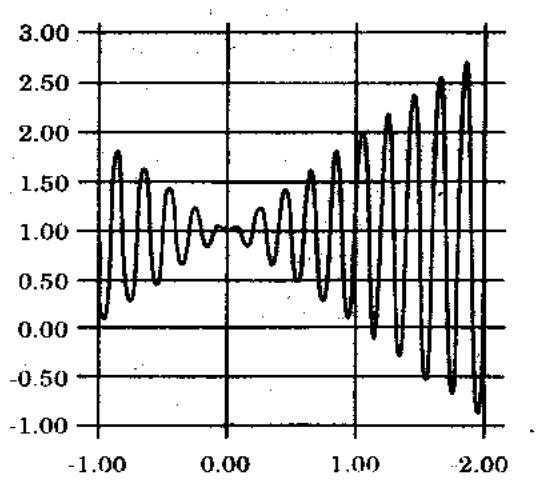

Hinh 1.1. Đồ thị hàm $f(x) = x \times \sin (10\pi \times x) + 1.0$

Khi đạo hàm bậc nhất bằng 0, nghĩa là,

$$
f ^ {\prime} (x) = \sin (1 0 \pi * x) + 1 0 \pi x * \cos (1 0 \pi * x) = 0
$$

$\Leftrightarrow \tan g(10\pi * x) = -10\pi x.$

Rô ràng là phương trình trên có vô số lời giai.

$$
x _ {i} = \frac {2 i - 1}{2 0} + \varepsilon_ {i}, I = 1, 2, \dots
$$

$$
x _ {0} = 0
$$

$$
x _ {i} = \frac {2 i + 1}{2 0} - \varepsilon_ {i} i = - 1, - 2, \dots
$$

trong đó các số hạng ε, là các dây số thực giảm (i = 1, 2, ..., và i = -1, -2, ...) dẫn về 0.

Công chú y ràng hàm $f$ đạt đến cực đại (cục bộ) tại điểm $x_i$, khi $i$ là số nguyên lẻ, và đạt đến cực tiểu của nó tại $x_i$, khi $i$ chẩn (xem hình 1.1).

Vì miền giá trị của bài toán là [-1,2], hàm đạt cực đại tại $x_{19} = \frac{37}{20} + \varepsilon_{19} = 1.85 + \varepsilon_{19}$, ở đây $f(x_{19})$ hơi lớn hơn $f(1.85) = 1.85 * \sin (18\pi + \pi/2) + 1.0 = 2.85$.

Bây giờ ta dùng thuật giải di truyền để giải bài toán trên, nghĩa là, tìm một điểm trong đoạn [-1, 2] sao cho tại đó $f$ có giá trị lớn nhất.

<!-- page: 11 -->

Ta sẽ lần lượt bàn về 5 thành phần chính của thuật giải di truyền giải bài toán này.

## 1.1.1. Biểu diễn

Ta sử dụng một vectơ nhi phân làm nhiễm sắc thể để biểu diễn các giá trị thực của biến x. Chiều dài vectơ phụ thuộc vào độ chính xác cần có, trọng thí dụ này, ta tính chính xác đến 6 số lẻ.

Miền giá trị của $x$ có chiều dài $2 - (-1) = 3$; với yêu cầu về độ chính xác 6 số lẻ như thế phải chia khoảng $[-1, 2]$ thành ít nhất $3 \times 10^{6}$ khoảng có kích thước bằng nhau. Điều này có nghĩa là cần có 22 bit cho vectơ nhị phân (nhiễm sắc thể):

$$
2 0 9 7 1 5 2 = 2 ^ {2 1} <   3 0 0 0 0 0 0 \leq 2 ^ {2 2} = 4 1 9 4 3 0 4
$$

Ánh xạ biến chuỗi nhi phân (b$_{21}$b$_{20}$...b$_{0}$) thành số thực x trong khoảng [-1, 2] được thực hiện qua hai bước như sau:

\- đôi chuỗi nhi phân (b$_{21}$b$_{20}$...b$_{0}$) từ cơ số 2 sang cơ số 10:

$$
(<   b _ {2 1} b _ {2 0}.. b _ {0} >) _ {2} = \left(\sum_ {i = 0} ^ {2 1} b _ {i} 2 ^ {i}\right) _ {1 0} = x'
$$

\- tìm số thực x tương ứng

$$
x = - 1 + x ^ {\prime}. \frac {3}{2 ^ {2 2} - 1}
$$

với -1 là cận dưới của miền giá trị và 3 là chiều dài của miền.

Thí dụ, nhiễm sắc thể (1000101110110101000111) biểu diễn số 0.637197 vì

$$
\mathrm{x} ^ {\prime} = (1 0 0 0 1 0 1 1 1 0 1 1 0 1 0 1 0 0 0 1 1 1) _ {2} = 2 2 8 8 9 6 7 _ {1 0}
$$

$$
\mathrm{va} \mathrm{x} = - 1. 0 + 2 2 8 8 9 6 7 \times 3 / 4 1 9 4 3 0 3 = 0. 6 3 7 1 9 7
$$

Đương nhiên nhiệm sắc thể

(00000000000000000000) và (11111111111111111111) biểu diễn các cận của miền, -1.0 và 2.0 cho mỗi cận.

## 1.1.2. Khôi tạo quân thể

Tiến trình khởi tạo rất đơn giản: Ta tạo một quản thể các nhiễm sắc thể, trong đó mỗi nhiễm sắc thể là một vectơ nhị phân 22 bit, tất cả 22 bit của mỗi nhiễm sắc thể đều được khởi tạo ngẫu nhiên.

## 1.1.3. Hàm lượng giá

Hàm lượng giá eval của các vecto nhị phân v chính là hàm f:

$$
e v a l (v) = f (x)
$$

trong đó, nhiễm sắc thể v biểu diễn giá trị thực x như đã nói ở trên, hàm lượng giá đóng vai trò môi trường, đánh giá từng lời giải theo độ thích nghi của chúng. Thí dụ, 3 nhiễm sắc thể:

$$
v _ {1} = (1 0 0 0 1 0 1 1 1 0 1 1 0 1 0 1 0 0 0 1 1 1),
$$

$$
v _ {2} = (0 0 0 0 0 0 1 1 1 0 0 0 0 0 0 0 0 1 0 0 0 0),
$$

$$
v _ {3} = (1 1 1 0 0 0 0 0 0 0 1 1 1 1 1 1 0 0 0 1 0 1),
$$

tương ứng với các giá trị $x_{1}=0.637197$, $x_{2}=-0.958973$, và $x_{3}=1.627888$. Và có độ thích nghi tương ứng:

$$
e v a l (v _ {1}) = f (x _ {1}) = 1. 5 8 6 3 4 5,
$$

$$
e v a l (v _ {2}) = f (x _ {2}) = 0. 0 7 8 8 7 8,
$$

<!-- page: 12 -->

$eval(v_{3}) = f(x_{3}) = 2.250650.$

Rō ràng, nhiễm sắc thể v$_{2}$ là tốt nhất trong 3 nhiễm sắc thể này, vì hàm lượng giá nó trả về giá trị cao nhất.

## 1.1.4. Các phép toán di truyền

Trong giai đoạn tiến hoá quản thể, ta có thể dùng 2 phép toán di truyền cổ điện: đột biến và lai.

Như đã trình bày ở trên, đột biến làm thay đổi một (số) gen (các vị trí trong một nhiễm sắc thể) với xác suất bằng tốc độ đột biến. Giá định ràng gen thứ 5 trong nhiễm sắc thể $v_3$ được chọn để đột biến. Và đột biến chính là thay đổi giá trị gen này: 0 thành 1 và 1 thành 0. Như vậy, sau đột biến này, $v_3$ sẽ là:

$$
v _ {3} ^ {\prime} = (1 1 1 0 1 0 0 0 0 0 1 1 1 1 1 1 0 0 0 1 0 1)
$$

Nhiễm sắc thể này biểu diễn giá trị $x_{3} = 1.721638$ và $f(x_{3}') = -0.082257$. Điều này có nghĩa là đột biến cụ thể này làm giảm khá nhiều giá trị của nhiễm sắc thể $v_{3}$. Bảy giờ, nếu gen thử 10 được chọn để đột biến trong nhiễm sắc thể $v_{3}$ thì

$$
v _ {3} ^ {\prime \prime} = (1 1 1 0 0 0 0 0 0 1 1 1 1 1 1 1 0 0 0 1 0 1).
$$

Giá trị tương ứng $x''_{3} = 1.630818$ và $f(x''_{3}) = 2.343555$, khả hơn giá trị $f(x_{3}) = 2.250650$.

Ta sẽ minh họa phép lai trên các nhiễm sắc thế $v_{2}$ và $v_{3}$. Giá định rằng điểm lai được chọn (ngẫu nhiên) ở vị trí thứ 6:

$$
v _ {2} = (\underline {{0 0 0 0 0}} \mid \underline {{1 1 1 0 0 0 0 0 0 0 0 1 0 0 0 0}}),
$$

$$
v _ {3} = (1 1 1 0 0 | 0 0 0 0 0 1 1 1 1 1 0 0 0 1 0 1).
$$

Hai con của kết quả lai là

$$
v _ {2} ^ {\prime} = (\underline {{0 0 0 0 0}} | 0 0 0 0 0 1 1 1 1 1 1 0 0 0 1 0 1)
$$

$$
v _ {3} ^ {\prime} = (1 1 1 0 0 \mid \underline {{0 1 1 1 0 0 0 0 0 0 0 0 1 0 0 0 0}}).
$$

Các con này có độ thích nghi:

$$
f (v _ {2} ^ {\prime}) = f (- 0. 9 9 8 1 1 3) = 0. 9 4 0 8 6 5,
$$

$$
f (v _ {3} ^ {\prime}) = f (1. 6 6 6 0 2 8) = 2. 4 5 9 2 4 5
$$

Chú ý ràng con thứ 2 thích nghi hơn cả cha lẩn mẹ của nó.

## 1.1.5. Các tham số

Đối với bài toán đặc biệt này, ta đã dùng các tham số sau đáy: kích thước quản thể pop-size = 50, xác suất lai tạo $p_c = 0.25$, xác suất đột biến $p_m = 0.01$. Xác suất lai $p_c = 0.25$ nghĩa là cá thể $v$ trong quản thể có 25% cơ hội được chọn để thực hiện phép lai; còn xác suất đột biến $p_m = 0.01$ lại là 1% 1 bit tất bất kỳ của 1 cá thể bất kỳ trong quản thể bị đột biến.

## 1.1.6. Các kết quả thử nghiệm

Bảng 1.1 trình bày một số kết quả hàm mục tiêu $f$ ở 1 số thể hệ. Cột bên trái cho biết thể hệ được xem xét, và cột bên phải cho biết giá trị của hàm $f$. Nhiễm sắc thể tốt nhất sau 150 thể hệ là

$$
v _ {m a x} = (1 1 1 0 0 1 1 0 1 0 0 0 1 0 0 0 0 0 1 0 1),
$$

tương ứng với giá trị  $x_{max} = 1.850773$ .

Đúng như ta mong đợi, $x_{max} = 1.85 + \varepsilon$, và $f(x_{max})$ lớn hơn 2.85 một chút.

<!-- page: 13 -->

Bảng 1.1. Kết quả của 150 thể hệ

| Thế hệ thú | Hàm lượng giá |
| --- | --- |
| 1 | 1.441942 |
| 6 | 2.250003 |
| 8 | 2.250283 |
| 9 | 2.250284 |
| 10 | 2.250363 |
| 12 | 2.328077 |
| 39 | 2.344251 |
| 40 | 2.345087 |
| 51 | 2.738930 |
| 99 | 2.849246 |
| 137 | 2.850217 |
| 145 | 2.850227 |

## 1.2. Thế tiến thoái lưỡng nan của tù nhân

Ví dụ này minh họa cách áp dụng thuật giải di truyền để học chiến lược của một trò chơi đơn giản: trò tiến thoái luông nan của tù nhân. Bài toán được mô tả nhu sau,

Hai tù nhân bị giam trong hai xà lim riêng biệt, không thể thông tin cho nhau. Môi tù nhân được yêu cầu là hây ly khai và phản bội người tù kia, một cách độc lập. Nếu chỉ có một người ly khai, anh ta được thương, còn người kia bị phạt. Nếu cả hai đều ly khai, cả hai đều bị giam lại và tra tán. Nếu không ai ly khai, cả hai đều được phân thường khá. Nhu vây, cách chọn ích ký là ly khai sẽ luôn đem lại phân thường hoặc hình phạt cao hơn, bất chấp người kia chọn ra sao - nhưng nếu có hai đều ly khai thì họ đều làm những điều tệ hại hơn là hợp tác với nhau. Tỉnh thế khó khăn của người từ là phải quyết định nên ly khai hay hợp tác với người kia.

Trò chơi này gồm hai người chơi, trong trò chơi này, tối phiên minh, mỗi người sẽ chọn ly khai hoặc hợp tác với người kia. Các dấu thủ sẽ được ghi điểm theo cách thường phạt được liệt kê trong bảng 1.2.

Bảng 1.2. Bảng thường phạt của trò chơi "Tiến thoái luống nan của tù nhân": $P_{i}$ là sự thường phạt dành cho người chơi $I$.

| Đấu thủ 1 | Đấu thủ 2 | $P_{1}$ | $P_{2}$ | Lời bình |
| --- | --- | --- | --- | --- |
| Ly khai | Ly khai | 1 | 1 | Phạt vì ly khai lẩn nhau |
| Ly khai | Hợp tác | 5 | 0 | Cám dỗ ly khai và sự thuống phạt |
| Hợp tác | Ly khai | 0 | 5 | Sự thuống phạt và cám dỗ ly khai |
| Hợp tác | Hợp tác | 3 | 3 | Phần thuống cho sự hợp tác |

Ta sè xem cách thuật giải di truyền được sử dụng để học chiến lược của trò chơi tiến thoái luông nan này. Tiếp cận bằng GA nhằm duy trì quản thể các "đấu thủ", mỗi cá thể có chiến lược của riêng nó. Ban đầu, chiến lược của mỗi đấu thủ được chọn ngẫu nhiên. Sau đó, ở mỗi bước, mỗi đấu thủ chơi và được ghi điểm. Rôi có một số đấu thủ được chọn cho thế hệ mới, và một số trong đó được chọn để ghép đôi. Khi hai đấu thủ được ghép đôi, đấu thủ mới được tạo ra có chiến lược

<!-- page: 14 -->

thừa huống từ những chiến lược của cha mẹ (lai tạo). Một đột biến, như thường lệ, dẫn tới có biến đổi trong chiến lược của các đối thủ do các thay đổi ngẫu nhiên trên biểu diễn của các chiến lược này.

## 1.2.1. Biểu diễn chiến lược

Trước hết, ta cần một số cách biểu diễn về chiến lược (nghĩa là, một lời giải khả thi). Đế đơn giản, ta sẽ quan tâm đến các chiến lược tất định và sử dụng kết quả của chuyển dịch của 3 bước trước để quyết định bước hiện tại. Vì có 4 khả năng có thể có cho mỗi bước, nên tất cả có 4 × 4 × 4 = 64 khả năng chuyển dịch của 3 bước trước đó.

Có thể đặc tả chiến lược theo kiểu này bằng cách chỉ định chuyển dịch nào cần được thực hiện cho các khả năng có thể xây ra. Như thế, một chiến lược có thể được biểu diễn bằng chuỗi 64 bit (môi bít nhận giá trị Ds -ly khai- hoặc Cs -hợp tác-), chỉ định cho chuyển dịch nào phải làm đối với 64 khả năng. Đề có chiến lược khởi điểm ở đầu một chuyển dịch, chúng ta cũng cần đặc tả tiến đề về 3 chuyển dịch giả định trước khi bất đầu trò chơi. Điều này dòi hồi phải có hơn 6 gen, như vậy toàn bộ nhiễm sắc thể ít nhất cần 70 bít.

Chuỗi 70 bit đặc tả những gì một dấu thú trong từng trường hợp có thể xảy ra và như thế xác định hoàn toàn một chiến lược riêng. Chuỗi 70 gen chính là một nhiễm sắc thể của dấu thú để dùng trong tiến trình tiến hóa.

## 1.2.2. Thuật giải di truyền

Thuật giải di truyền dùng để học chiến lược tiến thoái lượng nan của từ nhân gồm 4 giai đoạn, như sau:

1. Chọn quản thế khởi đầu. Mỗi dấu thủ được gần ngẫu nhiên một chuỗi 70 bit, biểu diễn cho một chiến lược như đã trình bày ở trên.

2. Kiểm tra mỗi dấu thủ để quyết định hiệu quả đạt được. Mỗi dấu thủ dùng một chiến lược được xác định trong nhiễm sắc thể của nó để dấu với những dấu thủ khác. Điểm của dấu thủ là điểm trung bình của tất cả các bước.

3. Chọn các dấu thủ để phát sinh. Nếu dấu thủ có điểm trung bình sẽ được cho một điểm cộng. Khi điểm có độ lệch chuẩn trên trung bình sẽ được cho hai điểm cộng; còn khi điểm có độ lệch chuẩn dưới trung bình sẽ không được điểm cộng nào.

4. Những dấu thủ chơi thành công sẽ được kết đôi một cách ngẫu nhiên để sinh con qua mỗi lần ghép đôi. Chiến lược của môi con sẽ được quyết định từ những chiến lược của cha mẹ. Điều này được thực hiện bằng cách sử dụng hai phép toán di truyền: lai và đột biến như trong ví dụ trước.

Sau 4 giai đoạn này ta có một quản thể mới. Quản thể này sẻ biểu diễn các mẫu ứng xử giống cách cư xử của những cá thể thành công trong thể hệ trước nhiều hơn, ít giống cách cư xử của những cá thể không thành công hơn. Với môi thể hệ mới, những cá thể có điểm tương đối cao sẽ có nhiều khả năng truyền các phần chiến lược của chúng, trong khi những cá thể không thành công sẽ không có phần chiến lược nào được truyền lại cho thể hệ sau.

## 1.2.3. Kết quả thực nghiệm

Khi chạy chương trình này, ta nhận được những kết quả rất đáng lưu ý. Từ một khởi đầu rất ngẫu nhiên, thuật giải di truyền làm tiến hóa các quản thể mà thành viên trung gian cũng thành công như thuật giải dùng các heuristic sau:

1. Dùng lắc lu thuyền: tiếp tục hợp tác sau 3 lần tương tác (nghĩa là, C sau (CC)(CC)(CC)).

2. Khiêu khích: ly khai khi dấu thủ khác ly khai (nghĩa là, D sau khi nhận (CC)(CC)(CD)).

<!-- page: 15 -->

3. Nhận lời xin lôi: tiếp tục hợp tác sau khi việc hợp tác được phục hồi ( nghĩa là, C sau (CD)(DC)(CC)).

4. Quên: hợp tác khi sự tương tác đã được phục hồi sau khi bị lợi dụng (nghĩa là, C sau (DC)(CC)(CC)).

5. Nhân ghép đôi: ly khai sau 3 lần ly khai lẫn nhau. (nghĩa là, D sau (DD)(DD)(DD)).

## 1.3. Bài toán Người Du Lịch

Ví dụ cuối cùng chúng tôi muốn trình bày là tiếp cận thuật giải di truyền giải bài toán Nguời Du Lịch (TSP). Bài toán TSP được mô tả như sau.

Một du khách muốn thăm mọi thành phố anh quan tâm; mỗi thành phố thăm qua đúng một lần; rời trở về điểm khối hành. Biết trước chi phí di chuyển giữa hai thành phố bất kỳ. Hây xây dựng một lộ trình thỏa các điều kiện trên với tổng chi phí nhỏ nhất.

TSP là bài toán tối ưu tổ hợp và có rất nhiều ứng dụng. Có thể giải bài toán này bằng nhiều phương pháp: phương pháp nhánh cận, phương pháp gần đúng hay những phương pháp tìm kiếm heuristic. Ta sẽ giải bài toán này bằng thuật giải di truyền.

Như ta đã biết, khó khăn đầu tiên đặt ra cho người thiết kế thuật giải di truyền là biểu diễn nhiễm sắc thể. Trong ví dụ thứ nhất, tối ưu hàm một biến, bằng cách chấp nhận một ít sai số, ta đã sử dụng biểu diễn nhị phân để biểu diễn nhiễm sắc thể. Cơn trong ví dụ thứ hai, với một chút phân tích, ta cũng đưa được về biểu diễn nhị phân các chiến lược cần thiết. Với cách biểu diễn như thế, các phép di truyền truyền thống, lai và đột biến, được áp dụng trực tiếp không cần sửa đổi gì cả. Khi thực hiện lai hay đột biến, các nhiễm sắc thể kết quả vẫn hợp lệ, nghĩa là vẫn là một lời giải thuộc không gian tìm kiếm. Điều này không còn đúng trong bài toán TSP nửa.

Nếu biểu diễn nhị phân cho bài toán TSP có n thành phố, mỗi thành phố phải được đánh mã bằng một chuỗi $\left[\log_{2}(n)\right]$ bit; và nhiễm sắc thể là một chuỗi gồm $n^{*}\left[\log_{2}(n)\right]$ bit. Đột biến có thể tạo ra một lộ trình không thỏa điều kiện bài toán nửa: Ta có thể thăm một thành phố 2 lần. Hon nửa, đối với một bài toán TSP có 20 thành phố (ta cần 5 bit để biểu diễn một thành phố), có một số chuỗi 5 bit nào đó (như 10101) sẽ không tương ứng với thành phố nào cả vì 5 bit có thể biểu diễn tối đa 32 trường hợp. Phép lai cũng gây ra những vấn đề tương tự. Rỗ ràng nếu ta dùng các phép toán đột biến và lai truyền thống như đã định nghĩa trước đây, ta sẽ phải dùng đến một loại “thuật giải sửa chữa”, thuật giải “sửa chữa” một nhiễm sắc thể không hợp lệ để đưa nó về không gian tìm kiếm.

Cách tự nhiên là ta sẽ đánh số các thành phố và dùng một vectơ nguyên để biểu diễn một nhiễm sắc thể lộ trình. Cách biểu diễn này giúp ta tránh phải dùng thuật giải sửa chữa bằng cách kết hợp những hiểu biết về bài toán vào các phép toán di truyền. Với cách biểu diễn này, một vectơ các thành phần nguyên $v = <i_1, i_2, ..., i_n>$ biểu diễn một lộ trình: từ $i_1$ đến $i_2, ...,$ từ $i_{n-1}$ đến $i_n$, và trở về $i_1$ ($v$ là một hoán vị của vectơ $<1, 2, ..., n>$).

Vấn đề thứ hai là khởi tạo quản thể đầu. Đối với tiến trình khởi tạo, ta có thể sử một số thuật giải heuristic (chẳng hạn như dùng thuật giải Greedy áp dụng nguyên lý “tham lam” vào bài toán TSP. Ta sẽ áp dụng thuật giải Greedy nhiều lần, mỗi lần từ một thành phố dấu khác nhau); hoặc đơn giản hơn là khởi tạo quản thể bằng cách tạo ngẫu nhiên các mẫu từ các hoán vị của <1, 2, ..., n>.

Việc lượng giá một nhiễm sắc thể rất dễ dàng: cho trước chi phí của chuyển di giữa các thành phố, ta có thể dễ dàng tính tổng chi phí của trọn lộ trình.

Về các phép toán di truyền, trước hết, ta xây dựng phép lai OX như sau: cho trước hai cá thể cha-mệ, cá thể con có được bằng cách

<!-- page: 16 -->

chơn thứ tự lộ trình từ một cá thể và bảo toàn thứ tự tương đối giữa các thành phố trong cá thể kia. Thị dụ, nếu cha-me là:

<1 2 3 4 5 6 7 8 9 10 11 12> và

<7 3 1 11 4 12 5 2 10 9 6 8>

và khúc được chọn là (4 5 6 7), cá thể con của phép lai sẽ là:

<1 11 12 4 5 6 7 2 10 9 8 3>

Như yêu cầu, cá thể con có quan hệ cấu trúc đối với cả hai cá thể cha-me. Vai trò của cha và mẹ có thể hoán đổi khi xây dựng cá thể con thứ hai.

Phép đột biến thực hiện đơn giản hơn: ta chỉ cần hoàn vị hai vị trí bất kỳ trong cá thể được chọn.

(Dī nhiên dây chỉ là một cách định nghĩa các phép toán di truyền. Bạn đọc có thể nghĩ ra những cách định nghĩa khác hay hơn).

Như thế, nếu cho trước các tham số liên quan, thuật giải di truyền có thể được thi hành.

Những vấn đề về biểu diễn và các phép toán di truyền giải bài toán TSP sẽ được bản chi tiết hơn trong phần 3 – Tối uu tố hợp.

## 1.4. Thuật giải leo đổi, mô phỏng việc luyện thép và di truyền

Trong phần này ta bàn về ba thuật giải, đó là leo đổi, mô phỏng việc luyện thép và thuật giải di truyền; cùng áp dụng giải bài toán tôi uu đơn giản. Thí dụ sau đây chứng tổ khá năng uu viết của cách tiếp cận GA.

Không gian tìm kiếm là một tập các chuỗi nhị phân v có chiều dài 30. Hàm mục tiêu f là cần cực đại hóa là hàm:

$$
f (v) = | 1 1 * \text {one} (v) - 1 5 0 |,
$$

trong đó, hàm one(v) cho biết tổng số số 1 có trong chuỗi v. Thí dụ, với ba chuỗi sau đây:

$$
v _ {1} = (1 1 0 1 1 0 1 0 1 1 1 0 1 0 1 1 1 1 1 1 1 0 1 1 0 1 1 0 1 1),
$$

$$
v _ {2} = (1 1 1 0 0 0 1 0 0 1 0 0 1 1 0 1 1 1 0 0 1 0 1 0 1 0 0 0 1 1),
$$

$$
\nu_ {3} = (0 0 0 0 1 0 0 0 0 0 1 1 0 0 1 0 0 0 0 0 0 0 1 0 0 0 1 0 0 0),
$$

.thì

$$
f (v _ {l}) = | 1 1 ^ {*} 2 2 - 1 5 0 | = 9 2,
$$

$$
f (v _ {2}) = | 1 1 ^ {*} 1 5 - 1 5 0 | = 1 5,
$$

$$
f (v _ {3}) = \left| 1 1 ^ {*} 6 - 1 5 0 \right| = 8 4,
$$

$$
(\text {one} (v _ {1}) = 2 2; \text {one} (v _ {2}) = 1 5 \text {va one} (v _ {3}) = 6).
$$

f là hàm tuyến tính. Chúng tôi chỉ dùng nó để minh họa ý tuống chính của ba thuật giải: leo đổi, mô phỏng luyện thép và thuật giải di truyền. Tuy nhiên, cần lưu ý là f có một cục đại toàn cục với

$$
v _ {g} = (1 1 1 1 1 1 1 1 1 1 1 1 1 1 1 1 1 1 1 1 1 1 1 1 1)
$$

khi đó  $f(v_{g}) = |11^{*}30 - 150|$  và một cục đại cục bộ khi

$$
v _ {I} = (0 0 0 0 0 0 0 0 0 0 0 0 0 0 0 0 0 0 0 0 0 0 0 0 0 0 0 0)
$$

$$
f (v _ {\nu}) = | 1 1 ^ {*} 0 - 1 5 0 | = 1 5 0
$$

<!-- page: 17 -->

Có nhiều phiên bản khác nhau của thuật giải leo dôi. Chúng chỉ khác nhau theo cách chuỗi mới được chọn để so sánh với chuỗi hiện tại. Một phiên bản đơn giản (lắp) của leo dôi (MAX lần lắp lại) được cho trong hình 1.2. Thoạt đầu, 30 lần cần được quan tâm, và lần cận $v_{n}$, trả về giá trị lớn nhất $f(v_{n})$. Dược chọn để cạnh tranh với chuỗi $v$, hiện hành. Nếu $f(v_{c}) < f(v_{n})$, thì chuỗi mới trở thành chuỗi hiện hành. Nguộc lại thì không có cải thiện cục bộ nào xảy ra: thuật giải đạt đến (cục bộ hoặc toàn cục) tối ưu (cục bộ = TRUE). Trong trường hợp như vậy, lần lắp kê ($t \leftarrow t+1$) được thực hiện với một chuỗi mới, chọn theo ngẫu nhiên.

Đáng chú ý ràng thành công hay thất bại của mỗi lần lập trong thuật giải leo đổi (nghĩa là trả về tối ưu cục bộ hay toàn cục) tuỷ thuộc chuỗi khởi đầu (được chọn lựa ngẫu nhiên). Rô ràng là nếu chuỗi khởi đầu có 13 số 1 hoặc ít hơn, thuật giải sẽ luôn luôn chấm dứt tại tối ưu cục bộ (thất bại). Lý do là chuỗi 13 số 1 trả về giá trị 7 của hàm mục tiêu, và bất cứ cải thiện của từng bước lập đều hướng về tối ưu cục bộ, nghĩa là, tăng số số 1 đến 40, giám trị số của hàm mục tiêu còn 4. Mặt khác, bất cứ việc giám lượng số 1 nào cũng sẽ làm tăng trị số của hàm: một chuỗi có 12 số 1 sẽ mang lại giá trị 18 cho hàm, chuỗi 11 số 1 cho trị 29, vv... Điều này có thể đầy việc tìm kiếm theo hướng “sai”, về phía cực đại cục bộ.

<div class="docvortex-algorithm" style="white-space: pre-wrap; font-family:monospace;">
cục bộ ← FALSE
chọn ngẫu nhiên một chuỗi $v_c$
tiến hóa $v_c$
lặp lại
+ chọn 30 chuỗi mới trong lân cận $v_c$
bàng cách thay một các bit của $v_c$
+ chọn chuỗi $v_n$ trong tập các chuỗi có
giá trị hàm mục tiêu $f$ lớn nhất
+ nếu $f(v_c) &lt; f(v_n)$
thì $v_c \leftarrow v_n$
nếu không cục bộ ← TRUE
cho đến khi cục bộ
$t \leftarrow t + 1$
cho đến khi $t = MAX$
chấm dứt
</div>

## Hình 1.2. Thuật giải leo đổi đơn giản (lặp)

Đối với những bài toán có nhiều tối ưu cục bộ, cơ hội chạm được tối ưu toàn cục của thuật giải leo đối là rất mong mạnh.

Còn hình 1.3. trang sau trình bày thủ tục mô phỏng luyện thép.

Hàm random [0,1) trả về một số ngẫu nhiên trong khoảng [0,1). Các (điều kiện - dùng) kiểm tra xem đã đạt “cân bằng nhiệt độ”

<!-- page: 18 -->

chưa, nghĩa là, phân bố xác suất của các chuỗi mới đã chọn có đạt đến phân bố Boltzmann không. Tuy nhiên, trong một số cải đặt, vòng lập chỉ được thực thi $k$ lần, $k$ là tham số bổ sung của phương pháp.

Nhiệt độ T được hạ thấp theo từng bước ( g(T,t) < T với mọi t). Thuật giải dùng khi T đạt một giá trị đủ nhỏ: (tiêu chuẩn - dùng) kiểm tra xem hệ thống đã “đông” lại chưa, nghĩa là, không thay đổi nào được chấp nhận nửa.

Như đã nói trước đây, thuật giải mô phỏng luyện thép có thể thoát khối tối ưu cục bộ. Ta hây xem một chuỗi,

với 12 số 1-cho giá trị của $f(v_4) = |11*12 - 150| = 18$ với $v_4$ là chuỗi khởi tạo, thuật giải leo đổi có thể tiến đến cực đại cực bộ

$v_{l}=(000000000000000000000000000000).$

Do một chuỗi 30 số 1 bất kỳ (nghĩa là, một bước ‘tiến đến’ tối ưu toàn cục) cho giá trị 7 ( nhỏ hơn 18). Mặt khác, thuật giải mô phỏng luyện thép có thể nhận một chuỗi có 30 số 1 làm chuỗi hiện hành mới với xác suất

$$
p = \exp \{(f (v _ {n}) - f (v _ {c})) / T \} = \exp \{(7 - 1 8) / T \},
$$

đối với một nhiệt độ nào đó, chẳng hạn $T = 20$, sẽ cho $p = e^{-11/20} = 0.57695$,

nghĩa là các cơ hội chấp nhận tốt hơn 50%.

<div class="docvortex-algorithm" style="white-space: pre-wrap; font-family:monospace;">
Thủ tục mô phỏng luyện thép
bất đầu
    t ← 0
    khởi tạo nhiệt độ T
    chọn ngấu nhiên chuỗi $v_c$ làm chuỗi hiện hành
    tiến hóa $v_c$
    lặp lại
        lặp lại
            + chọn chuỗi $v_n$ mới trong lần cận $v_c$
                bằng cách thay một bit của $v_c$
            + nếu $f(v_c) &lt; f(v_n)$
                thì $v_c \leftarrow v_n$
            + nếu không thì
                nếu random[0,1) &lt; exp {((f($v_n$) - f($v_c$))/T}
                thì $v_c \leftarrow v_n$
        cho đến khi (điều kiện dùng thỏa)
        T ← g(T,t)
        t ← t+1
    cho đến khi (điều kiện dùng 2 thỏa)
chấm dứt
</div>

Hình 1.3. Thuật giải mô phỏng luyện thép.

<!-- page: 19 -->

Thuật giải di truyền, như đã trình bày trọng 1.1, duy trì một quản thể các chuỗi. Hai chuỗi tương đối xấu,

$$
v _ {5} = (1 1 1 1 1 0 0 0 0 0 0 0 1 1 0 1 1 1 0 0 1 1 1 0 1 0 0 0 0 0) \mathrm{va}
$$

$$
v _ {6} = (0 0 0 0 0 0 0 0 0 0 0 1 1 0 1 1 1 0 0 1 0 1 0 1 1 1 1 1 1 1)
$$

môi chuỗi được lượng giá là 16, có thể sinh ra con tốt hơn nhiều (nếu điểm lai rơi vào bất cứ vị trí nào giữa vị trí thứ 5 và thứ 12)

$$
v _ {7} = (1 1 1 1 1 0 0 0 0 0 0 1 1 0 1 1 1 0 0 1 0 1 0 1 1 1 1 1 1).
$$

Con mới được lượng giá

$$
f (v _ {7}) = \{1 1 ^ {*} 1 9 - 1 5 0 \} = 5 9
$$

Ta kết thúc chương này bằng cách dẫn ra một thông điệp khối hài vừa được giới thiệu trên Internet (comp.ai.neural-nets).

“Chú ý rằng, trong mọi kỹ thuật [leo đôi] đã thảo luận từ lâu, con thô có thể hy vọng tìm được đình núi gần chỗ nó khởi hành. Không có gì bảo đảm đáy là đình Everest, hoặc một ngọn núi rất cao. Nhiều phương pháp khác nhau đã được dùng để thù tìm ra tối ưu toàn cục thực sự.

Trong mô phỏng luyện thép, con thô đã được ăn uống và hy vọng một cách ngẫu nhiên suốt một thời gian dài, nó sáng suốt lên và có hy vọng nhảy lên đến định đổi cao nhất.

Trong thuật giải di truyền, có nhiều thở được thả ngẫu nhiên vào một số nơi của dãy Hy mã lạp son. Những con thở này không biết ràng chúng phải tìm đình Everest. Những, cứ vài năm một lần bạn phải bản chúng ở độ cao thấp, với hy vọng những con còn lại sẽ thành công và sinh sản thêm".

## 1.5. Kết luận

Ba thí dụ về thuật giải di truyền giải bài toán tối ưu hàm, thế tiến thoái luông nan của tù nhân và người du lịch, cho thấy ứng dụng rộng rãi của thuật giải di truyền. Nhưng đồng thời cũng bộc lộ những khó khăn đầu tiên khi sử dụng thuật giải di truyền. Văn để biểu diễn cho bài toán người du lịch không rõ ràng lấm. Phép toán mối được sử dụng (lai tạo OX) không hệ tầm thường. Còn những khó khăn nào nữa mà ta gặp phải ở những bài toán nào khác (khó hơn)? Trong hai thí dụ, tối ưu hàm và TSP, hàm lượng giá được định nghĩa rõ ràng; trong thí dụ thứ hai (tiến thoái luông nan của tù nhân) một tiến trình mô phỏng đơn giản cho ta một lượng giá của nhiễm sắc thể (ta thứ từng đấu thủ để quyết định sự thành công của nó: mỗi đấu thủ dùng một chiến lược do nhiễm sắc thể của nó định nghĩa để chơi với những đấu thủ khác, còn điểm của mỗi đấu thủ là điểm trung bình trên tất cả những trò chơi mà nó chơi). Ta phải tiến hành cách nào trong trường hợp hàm lượng gia không được định nghĩa rõ ràng? Thí dụ, Bài toán Thỏa mặn biến Boolean (Boolean Satisfiability Problem - BSP) dưỡng như cần có một biểu diễn chuỗi nhị phân (bit thứ i biểu diễn thứ tự đúng của biến Boolean thứ i), tuy nhiên, tiến trình chọn một hàm lượng gia không phải là rõ ràng (xem các chương sau).

Thí dụ thứ nhất về tối ưu hàm không ràng buộc cho phép ta dùng một biểu diễn tiện lợi, trong đó bất cứ chuỗi nhị phân nào cũng tương ứng với một giá trị trong miền giá trị của bài toán (nghĩa

<!-- page: 20 -->

Chuong 2

là, [-1,2]). Điều này có nghĩa là bất cứ một đột biến hay một lai tạo nào cũng sản sinh một con hợp lệ. Điều này cũng đúng trong thí dụ thứ hai: Một kết hợp các bit bất kỳ biểu diễn một chiến lược hợp lệ. Bài toán thứ ba có một ràng buộc duy nhất: mỗi thành phố phải xuất hiện chính xác một lần trong lộ trình hợp lệ. Điều này gây ra vai vấn đề: ta đã dùng các vectơ số nguyên (thay vì biểu diễn nhị phân) và sửa lại phép toán lai. Thế bằng cách nào chúng ta tiếp cận một bài toán có ràng buộc tổng quát ? Chúng ta phải có những khả năng gì ?

Câu trả lời thật không dễ dàng; chúng ta sẽ xem xét các giải pháp ở trong những phần sau.

## THUẬT GIẢI DI TRUYÊN :

## CƠ CHẾ THỰC HIÊN

Trong chương này, chúng tôi sẽ trình bày về cơ chế thực hiện của thuật giải đi truyền thông qua một bài toán tối ưu số đơn giản. Ta sẽ bắt đầu thảo luận một vài ý kiến chung trước khi đi vào chi tiết ví dụ.

Không mất tính tổng quát, ta giả định những bài toán tối ưu là bài toán tìm giá trị cực đại. Bài toán tìm cực tiểu hàm $f$ chính là tìm cực đại hàm $g = -f$:

min $f(x) = \max g(x) = \max \{-f(x)\}$.

Hon nua, ta có thể giả định ràng hàm mục tiêu f có giá trị dương trên miền xác định của nó, nếu không, ta có thể cộng thêm một hàng số C dương, nghĩa là:

max $g(x) = \max |g(x) + C|$

(vế trái và vé phải cùng đạt max tại 1 điểm $x_0$)

Bây giờ, giả sử ta muốn tìm cực đại một hàm $k$ biến $f(x_{1},...,x_{k})$: $R^{k} \to R$. Giá sử thêm là mỗi biến $x_{i}$ có thể nhận giá trị trong miền $D_{i} = [a_{i}, b_{i}] \subseteq R$ và $f(x_{1},...,x_{k}) > 0$ với mọi $x_{i}$ thuộc $D_{i}$. Ta muốn tối ưu hóa hàm $f$ với một độ chính xác cho trước: giả sử cần 6 số lẻ đối với giá trị của các biến.

<!-- page: 21 -->

Rô ràng là để đạt được độ chính xác như vậy mỗi miền $D_i$ được phân cắt thành $(b_i - a_i)\times 10^6$ miền con bằng nhau. Gọi $m_i$ là số nguyên nhỏ nhất sao cho

$$
(b _ {i} - a _ {i}) \times 1 0 ^ {6} \leq 2 ^ {m _ {i}} - 1.
$$

Như vậy, mỗi biến $x_i$ được biểu diễn bằng một chuỗi nhị phân có chiều dài $m_i$. Biểu diễn như trên, rõ ràng thỏa mãn điều kiện về độ chính xác yêu cầu. Công thức sau tính giá trị thập phân của mỗi chuỗi nhị phân biểu diễn biến $x_i$,

$$
x _ {i} = a _ {i} + d e c i m a l (1 1 1 0 0 1... 0 0 1 _ {2}). \frac {b _ {i} - a _ {i}}{2 ^ {m _ {i}} - 1}
$$

trong đó decimal(chuỗi₂) cho biết giá trị thập phân của chuỗi nhị phân đó.

Bây giờ, mỗi nhiễm sắc thể (là một lời giải) được biểu diễn bằng chuỗi nhị phân có chiều dài $m = \sum_{i=1}^{k} m_i$; $m_1$ bit đầu tiên biểu diễn các giá trị trong khoảng $[a_1, b_1]$; $m_2$ bit kế tiếp biểu diễn giá trị trong khoảng $[a_2, b_2]$; ... ; nhóm $m_k$ bit cuối cùng biểu diễn giá trị trong khoảng $[a_k, b_k]$.

Đế khởi tạo quản thể, chỉ cần đơn giản tạo pop-size nhiễm sắc thể ngầu nhiên theo từng bit. Nhùng nếu bạn biết một chút về xác suất, thì nên dùng những hiểu biết về sự phân phối để khởi tạo quản thể ban đầu sẽ tốt hơn.

Phân còn lại của thuật giải di truyền rất đơn giản: trong mỗi thể hệ, ta lượng giá từng nhiễm sắc thể (tính giá trị hàm f trên các chuỗi biến nhị phân đã được giải mã), chọn quản thể mới thỏa phân bố xác suất dựa trên độ thích nghi và thực hiện các phép đột biến và lai để tạo các cá thể thể hệ mới. Sau một số thể hệ, khi không còn cải thiện thêm được gì nữa, nhiễm sắc thể tốt nhất sẽ được xem 40

như lời giải của bài toán tối ưu (thường là toàn cục). Thông thường, ta cho dùng thuật giải di truyền sau một số bước lập cố định tùy thuộc điều kiện về tốc độ và tài nguyên máy tính.

Đối với tiến trình chọn lọc (chọn quản thể mới thỏa phân bố xác suất dựa trên các độ thích nghi), ta dùng bánh xe quay Ru lét với các rãnh được định kích thước theo độ thích nghi. Ta xây dựng bánh xe Rulét như sau (giả định ràng, các độ thích nghi đều dương, trong trường hợp ngược lại thì ta có thể dùng một vài phép biến đổi tương ứng để định lại tỷ lệ sao cho các độ thích nghi đều dương)

\- Tính độ thích nghi $eval(v_i)$ của môi nhiễm sắc thể $v_i$ ($i=1...pop-size$).

\- Tîm tổng giá trị thích nghi toàn quản thể:
$F = \sum_{i=1}^{pop\_size} eval(v_i)$

\- Tính xác suất chọn $p_i$ cho mỗi nhiễm sắc thể $v_i$, (i=1...pop-size): $p_i = eval(v_i)/F$.

\- Tính vị tri xác suất $q_i$ của môi nhiễm sắc thể $v_i$, ($i = 1...pop-size$). $q_i = \sum_{j=1}^{i} p_j$

Tiến trình chọn lọc được thực hiện bằng cách quay bánh xe ru lét pop-size lần; mỗi lần chọn một nhiễm sắc thể từ quản thể hiện hành vào quản thể mới theo cách sau:

\- Phát sinh ngâu nhiên một số $r$ trong khoảng [0..1]

\- Nếu $r < q_1$ thì chọn nhiễm sắc thể đầu tiên ($v_1$); ngược lại thì chọn nhiễm sắc thể thứ $i$, $v_i$ ($2 \leq i \leq pop-size$) sao cho $q_{i-1} < r \leq q_i$.

Hiền nhiên, có thể sẽ có một số nhiễm sắc thể được chọn nhiều lần. Điều này phù hợp với lý thuyết sơ đồ (xem chương 3): các nhiễm

<!-- page: 22 -->

sắc thể tốt nhất có nhiều bản sao hơn, các nhiễm sắc thể trung bình không thay đổi, các nhiễm sắc thể kém nhất thì chết đi.

Bây giờ ta có thể áp dụng phép toán di truyền: kết hợp, lai vào các cá thể trong quản thể mới, vừa được chọn từ quản thể cũ như trên. Một trong những tham số của hệ di truyền là xác suất lai $p_c$. Xác suất này cho ta số nhiễm sắc thể pop-size$x_p$ mong đoi, các nhiễm sắc thể này được dùng trong tác vụ lai tạo. Ta tiến hành theo cách sau đây:

Đối với mỗi nhiễm sắc thể trong quản thể (mới):

\- Phát sinh ngẫu nhiên một một số $r$ trong khoảng [0..1];

\- Nếu $r < p_c$, hǎy chọn nhiễm sắc thể đó để lai tạo.

Bây giờ, ta ghép đôi các nhiễm sắc thể đã chọn được một cách ngẫu nhiên: đối với mỗi cặp nhiễm sắc thể được ghép đôi, ta phát sinh ngẫu nhiên một số nguyên pos trong khoảng [1..m-1] (m là tổng chiều dài - số bit - của một nhiễm sắc thể). Số pos cho biết vị trí của điểm lai. Hai nhiễm sắc thể:

$$
(b _ {1} b _ {2}... b _ {p o s} b _ {p o s + 1}... b _ {m}) \text {va}
$$

$$
(c _ {1} c _ {2}... c _ {p o s} c _ {p o s + 1}... c _ {m})
$$

được thay bằng một cặp con của chúng:

$$
(b _ {1} b _ {2}... b _ {p o s} c _ {p o s + 1}... c _ {n})
$$

$$
(c _ {1} c _ {2}... c _ {p o s} b _ {p o s + 1 1}... b _ {m})
$$

Phép toán kế tiếp, đột biến, được thực hiện trên cơ sở từng bit. Một tham số khác của hệ thống di truyền $p_m$, cho ta số bit đột biến $p_m \times m \times pop\text{-}size$ mong đợi. Mỗi bit (trong tất cả các nhiễm sắc thể trong quản thể) có cơ hội bị đột biến như nhau, nghĩa là, đối từ 0 thành 1 hoặc ngược lại. Vi thế ta tiến hành theo cách sau đây.

Đối với mỗi nhiễm sắc thể trong quản thể hiện hành (nghĩa là sau khi lai) và đối với mỗi bit trong nhiễm sắc thể:

\- Phát sinh ngâu nhiên một số $r$ trong khoảng [0..1];

\- Nếu $r < p_m$, hãy đột biến bit đó.

Sau quá trình chọn lọc, lai và đột biến, quản thể mới đến lượt lượng giá kế tiếp của nó. Lượng giá này được dùng để xây dựng phân bố xác suất (cho tiến trình chọn lựa kế tiếp), nghĩa là, để xây dựng lại bánh xe rulét với các rảnh được định kích thước theo các giá trị thích nghi hiện hành. Phần còn lại của tiến hóa chỉ là lặp lại chu trình của những bước trên (xem hình 0.1 trong phần dẫn nhập).

Toàn bộ tiến trình sẽ được minh họa trong một thí dụ. Trong ví dụ này, ta sẽ mô phỏng thuật giải di truyền giải bài toán tối ưu số.

Giả sử kích thước quản thể pop-size = 20, và các xác suất di truyền tương ứng là $p_c = 0.25$ và $p_m = 0.01$.

Ta cần cục đại hóa hàm sau đây:

$$
f (x _ {1}, x _ {2}) = 2 1. 5 + x _ {1} \times \sin (4 \pi x _ {1}) + x _ {2} \times \sin (2 0 \pi x _ {2})
$$

$$
\text {vói} - 3. 0 \leq \mathrm{x} _ {1} \leq 1 2. 1 \text {va} 4. 1 \leq \mathrm{x} _ {2} \leq 5. 8.
$$

Hình 2.1. là đô thị của hàm f.

<!-- page: 23 -->

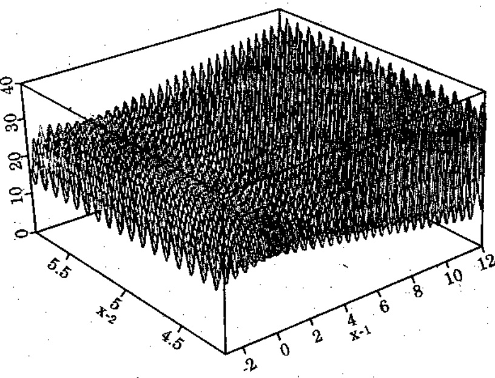

Hinh 2.1. Đồ thi hàm $f(x_{1},x_{2}) = 21.5 + x_{1} \times \sin (4\pi x_{1}) + x_{2} \times \sin (20\pi x_{2})$

Giả sử ta cần tính chính xác đến 4 số lẻ đối với mỗi biến. Miền của biến $x_{1}$ có chiều dài 15.1; điều kiện chính xác dồi hỏi đoạn [-3.0,12.1] cần được được chia thành các khoảng có kích thước bằng nhau, ít nhất là 15.1×10000 khoảng. Điều này nghĩa là eân 18 bit làm phần đầu tiên của nhiễm sắc thể:

$$
2 ^ {1 7} \leq 1 5 1 0 0 0 \leq 2 ^ {1 8}
$$

Miền của biến $x_{2}$ có chiều dài 1.7; điều kiện chính xác đồi hỏi doạn [4.1,5.8] cần được được chia thành các khoảng có kích thước bằng nhau, ít nhất là $1.7 \times 10000$ khoảng. Điều này nghĩa là cần 15 bit làm phần đầu tiên của nhiễm sắc thể:

$$
2 ^ {1 4} \leq 1 7 0 0 0 \leq 2 ^ {1 5}
$$

Chiều dài toàn bộ nhiễm sắc thể (vectơ lời giải) lúc này là $m=18+15=33$ bit; 18 bit đầu tiên mã hóa $x_{1}$, và 15 bit còn lại (từ 19 đến 33) mã hóa $x_{2}$.

Ta hây xét một nhiễm sắc thể làm thí dụ:

(010001001011010000111110010100010)

18 bit đầu tiên, 010001001011010000, biểu diễn

$$
x _ {I} = - 3. 0 + d e c i m a l (0 1 0 0 0 1 0 0 1 0 1 1 0 1 0 0 0 0 _ {2}) \times \frac {1 2 . 1 - (- 3 . 0)}{2 ^ {1 8} - 1}.
$$

$$
= - 3, 0 + 7 0 3 5 2 \frac {1 5 . 1}{2 2 6 2 1 4 3} = - 3. 0 + 4. 0 5 2 4 2 6
$$

15 bit kế tiếp 111110010100010, biểu diễn

$x_{2} = 4.1 + decimal(111110010100010_{2}) \times \frac{5.8 - 4.1}{2^{15} - 1} = 4.1 + 31906.\frac{1.7}{32767}$

$$
= . 1 + 1. 6 5 5 3 3 0
$$

$$
= 5. 7 5 5 3 3 0
$$

Nhu vay, nhiêm sắc thể

(010001001011010000111110010100010)

tương ứng với  $<x_{1},x_{2}>=<1.052426,5.755330>$ .

Độ thích nghi của nhiễm sắc thể này là

$$
f (1. 0 5 2 4 2 6, 5. 7 5 5 3 3 0) = 2 0. 2 5 2 6 4 0.
$$

<!-- page: 24 -->

Đế cực đại hóa hàm $f$ bằng thuật giải di truyền, ta tạo một quản thể có $pop\_size = 20$ nhiễm sắc, thể. Cả 33 bit trong tất cả các nhiễm sắc thể đều được khởi tạo ngẫu nhiên.

Giả sử ràng sau tiến trình khởi tạo, ta có quản thể sau đây:

$$
v _ {j} = (1 0 0 1 1 0 1 0 0 0 0 0 0 0 1 1 1 1 1 1 1 0 1 0 0 1 1 0 1 1 1 1)
$$

$$
v _ {2} = (1 1 1 0 0 0 1 0 0 1 0 0 1 1 0 1 1 1 0 0 1 0 1 0 1 0 0 0 1 1 0 1 0)
$$

$$
v _ {3} = (0 0 0 0 1 0 0 0 0 0 1 1 0 0 1 0 0 0 0 0 1 0 1 0 1 1 1 0 1 1 1 0 1)
$$

$$
v _ {4} = (1 0 0 0 1 1 0 0 0 1 0 1 1 0 1 0 0 1 1 1 1 0 0 0 0 0 1 1 1 0 0 1 0)
$$

$$
v _ {5} = (0 0 0 1 1 1 0 1 1 0 0 1 0 1 0 0 1 1 0 1 0 1 1 1 1 1 1 0 0 0 1 0 1)
$$

$$
v _ {6} = (0 0 0 1 0 1 0 0 0 0 1 0 0 1 0 1 0 1 0 0 1 0 1 0 1 1 1 1 1 1 0 1 1)
$$

$$
v _ {7} = (0 0 1 0 0 0 1 0 0 0 0 0 1 1 0 1 0 1 1 1 1 0 1 1 0 1 1 1 1 1 0 1 1)
$$

$$
v _ {8} = (1 0 0 0 0 1 1 0 0 0 0 1 1 1 0 1 0 0 0 1 0 1 1 0 1 0 1 1 0 0 1 1 1)
$$

$$
v _ {9} = (0 1 0 0 0 0 0 0 0 1 0 1 1 0 0 0 1 0 1 1 0 0 0 0 0 0 1 1 1 1 1 0 0)
$$

$$
v _ {1 0} = (0 0 0 0 0 1 1 1 1 0 0 0 1 1 0 0 0 0 0 1 1 0 1 0 0 0 0 1 1 1 0 1 1)
$$

$$
v _ {1 1} = (0 1 1 0 0 1 1 1 1 1 1 0 1 1 0 1 0 1 1 0 0 0 0 1 1 0 1 1 1 1 0 0 0)
$$

$$
v _ {1 2} = (1 1 0 1 0 0 0 1 0 1 1 1 1 0 1 1 0 1 0 0 0 1 0 1 0 1 0 0 0 0 0 0 0)
$$

$$
v _ {1 3} = (1 1 1 0 1 1 1 1 1 0 1 0 0 0 1 0 0 0 1 1 0 0 0 0 0 0 1 0 0 0 1 1 0)
$$

$$
v _ {1 4} = (0 1 0 0 1 0 0 1 1 0 0 0 0 0 1 0 1 0 1 0 0 1 1 1 1 0 0 1 0 1 0 0 1)
$$

$$
v _ {1 5} = (1 1 1 0 1 1 1 0 1 1 0 1 1 1 0 0 0 0 1 0 0 0 1 1 1 1 1 0 1 1 1 1 0)
$$

$$
\nu_ {1 6} = (1 1 0 0 1 1 1 1 0 0 0 0 0 1 1 1 1 1 1 0 0 0 0 1 1 0 1 0 0 1 0 1 1)
$$

$$
v _ {1 7} = (0 1 1 0 1 0 1 1 1 1 1 1 0 0 1 1 1 1 0 1 0 0 0 1 1 0 1 1 1 1 1 0 1)
$$

$$
v _ {I G} = (0 1 1 1 0 1 0 0 0 0 0 0 0 0 1 1 1 0 1 0 0 1 1 1 1 1 0 1 0 1 1 0 1)
$$

$$
v _ {1 9} = (0 0 0 1 0 1 0 1 0 0 1 1 1 1 1 1 1 1 1 1 0 0 0 0 1 1 0 0 0 1 1 0 0)
$$

$$
v _ {2 0} = (1 0 1 1 1 0 0 1 0 1 1 0 0 1 1 1 1 0 0 1 1 0 0 0 1 0 1 1 1 1 1 1 0)
$$

Trong giai doan luong giá ta giải mã từng nhiễm sắc thể và tính các giá trị hàm thích nghi từ các giá trị ($x_1$, $x_2$) mới giải mã. Ta có:

$$
\operatorname{eval} (v _ {j}) = f (6. 0 8 4 4 9 2, 5. 6 5 2 2 4 2) \quad = 2 6. 0 1 9 6 0 0
$$

$$
\operatorname{eval} (v _ {2}) = f (1 0. 3 4 8 4 3 4, 4. 3 8 0 2 6 4) = 7. 5 8 0 0 1 5
$$

$$
\text {eval} (v _ {3}) = f (- 2. 5 1 6 6 0 3, 4. 3 9 0 3 8 1) = 1 9. 6 2 6 3 2 9
$$

$$
\operatorname{eval} (v _ {4}) = f (5. 2 7 8 6 3 8, 5. 5 9 3 4 6 0) = 1 7. 4 0 6 7 2 5
$$

$$
e v a l (v _ {5}) = f (- 1. 2 5 5 1 7 3, 4. 7 3 4 4 5 8) = 2 5. 3 4 1 1 6 0
$$

$$
\text {eval} (v _ {6}) = f (- 1. 8 1 1 7 2 5, 4. 3 9 1 9 3 7) = 1 8. 1 0 0 4 1 7
$$

$$
\text {eval} (v _ {7}) = f (- 0. 9 9 1 4 7 1, 5. 6 8 0 2 5 8) = 1 6. 0 2 0 8 1 2
$$

$$
\text {eval} (v _ {8}) = f (4. 9 1 0 6 1 8, 4. 7 0 3 0 1 8) = 1 7. 9 5 9 7 0 1
$$

$$
\text {eval} (v _ {9}) = f (0. 7 9 5 4 0 6, 5. 3 8 1 4 7 2) = 1 6. 1 2 7 7 9 9
$$

$$
e v a l (v _ {1 0}) = f (- 2. 5 5 4 8 5 1, 4. 7 9 3 7 0 7) = 2 1. 2 7 8 4 3 5
$$

$$
\text {eval} (v _ {I I}) = f (3. 1 3 0 0 7 8, 4. 9 9 6 0 9 7) = 2 3. 4 1 0 6 6 9
$$

<!-- page: 25 -->

[NO TEXT]

$$
\text {eval} (v _ {1 2}) = f (9. 3 5 6 1 7 9, 4. 2 3 9 4 5 7) = 1 5. 0 1 1 6 1 9
$$

$$
e v a l (v _ {1 3}) = f (1 1. 1 3 4 6 4 6, 5. 3 7 8 6 7 1) = 2 7. 3 1 6 7 0 2
$$

$$
e v a l (v _ {1 4}) = f (1. 3 3 5 9 4 4, 5. 1 5 1 3 7 8) = 1 9. 8 7 6 2 9 4
$$

$$
\text {eval} (v _ {1 5}) = f (1 1. 0 8 9 0 2 5, 5. 0 5 4 5 1 5) = 3 0. 0 6 0 2 0 5
$$

$$
\text {eval} (v _ {1 6}) = f (9. 2 1 1 5 9 8, 4. 9 9 3 7 6 2) = 2 3. 9 6 7 2 2 7
$$

$$
\text {eval} (v _ {1 7}) = f (3. 3 6 7 5 1 4, 4. 5 7 1 3 4 3) = 1 3. 6 9 6 1 6 5
$$

$$
\text {eval} (v _ {1 8}) = f (3. 8 4 3 0 2 0, 5. 1 5 8 2 2 6) = 1 5. 4 1 4 1 2 8
$$

$$
\text {eval} (v _ {1 9}) = f (- 1. 7 4 6 6 3 5, 5. 3 9 5 5 8 4) = 2 0. 0 9 5 9 0 3
$$

eval(v20) = f(1.58364)
Rõ ràng nhiễm sắc thể v15 mạnh nhất và nhiễm sắc thể v2 yếu

Bây giờ ta xây dựng hệ thống kiến trúc bánh xe rulét cho tiến trình chọn lọc. Tổng độ thích nghi của quản thể là:

$$
F = \sum_ {i = 1} ^ {2 0} e v a l (v _ {i}) = 3 8 7. 7 7 6 8 2 2
$$

Xác suất chọn lọc $p_i$ của mỗi nhiễm sắc thể $v_i$ ($i=1,\ldots,20$) là:

$$
p _ {2} = e v a l (v) / F = 0. 0 1 9 5 4 7
$$

$$
p _ {I} = e v a l (v 1) / F = 0. 0 6 7 0 9 9
$$

$$
p _ {4} = e v a l (v) / F = 0. 0 4 4 8 8 9
$$

$$
p _ {3} = e v a l (v) / F = 0. 0 5 0 3 5 5
$$

$$
p _ {5} = e v a l (v) / F = 0. 0 6 5 3 5 0
$$

$$
p _ {6} = \operatorname{eval} (v) / F = 0. 0 4 6 6 7 7
$$

$$
p _ {7} = e v a l (v) / F = 0. 0 4 1 3 1 5
$$

$$
p _ {8} = e v a l (v) / F = 0. 0 4 6 3 1 5
$$

$$
p _ {9} = e v a l (v) / F = 0. 0 4 1 5 9 0
$$

$$
p _ {1 0} = e v a l (v) / F = 0. 0 5 4 8 7 3
$$

$$
p _ {I I} = e v a l (v) / F = 0. 0 6 0 3 7 2
$$

$$
p _ {1 2} = e v a l (v) / F = 0. 0 3 8 7 1 2
$$

$$
p _ {1 3} = e v a l (v) / F = 0. 0 7 0 4 4 4
$$

$$
p _ {1, j} = e v a l (v) / F = 0. 0 5 1 2 5 7
$$

$$
p _ {1 5} = e v a l (v) / F = 0. 0 7 7 5 1 9
$$

$$
p _ {1 6} = e v a l (v) / F = 0. 0 6 1 5 4 9
$$

$$
p _ {1 7} = e v a l (v) / F = 0. 0 3 5 3 2 0
$$

$$
p _ {1 8} = e v a l (v) / F = 0. 0 3 9 7 5 0
$$

$$
p _ {1 9} = e v a l (v) / F = 0. 0 5 1 8 2 3
$$

$$
p _ {2 0} = e v a l (v) / F = 0. 0 3 5 2 4 4
$$

Các vị trí xác suất $q_i$ của mỗi nhiễm sắc thể $v_i$ ($I=1,..,20$) là:

$$
q _ {I} = 0. 0 6 7 0 9 9
$$

$$
q _ {2} = 0. 0 8 6 6 4 7
$$

$$
q _ {3} = 0. 1 3 7 0 0 1
$$

$$
q _ {4} = 0. 1 8 1 8 9 0
$$

$$
q _ {5} = 0. 2 4 7 2 4 0
$$

$$
q _ {6} = 0. 2 \dot {9} 3 9 1 7
$$

$$
q _ {7} = 0. 3 3 5 2 3 2
$$

$$
q _ {8} = 0. 3 8 1 5 4 6
$$

$$
q _ {9} = 0. 4 2 3 1 3 7
$$

$$
q _ {1 0} = 0. 4 7 8 0 0 9
$$

$$
q _ {1 1} = 0. 5 3 8 3 8 1
$$

$$
q _ {1 2} = 0. 5 7 7 0 9 3
$$

$$
q _ {1 3} = 0. 6 4 7 5 3 7
$$

$$
q _ {1 4} = 0. 6 9 8 7 9 4
$$

$$
q _ {1 5} = 0. 7 7 6 3 1 4
$$

$$
q _ {1 6} = 0. 8 3 7 8 6 3
$$

$$
q _ {1 7} = 0. 8 7 3 1 8 2
$$

$$
q _ {1 8} = 0. 8 1 2 9 3 2
$$

$$
q _ {1 9} = 0. 9 6 4 7 5 6
$$

$$
q _ {2 0} = 1. 0 0 0 0 0 0
$$

Bây giờ ta quay bánh xe rulét 20 lần; mỗi lần chọn một nhiễm sắc thể cho quản thể mối. Giả sử thứ tự (ngẫu nhiên) của 20 số trong khoảng [0,1] được phát sinh là

$$
0. 3 0 8 6 5 2
$$

$$
0. 5 3 4 5 3 4
$$

$$
0. 2 2 6 4 3 1
$$

$$
0. 4 9 4 7 7 3
$$

$$
0. 4 2 4 7 2 0
$$

<!-- page: 26 -->

| 0.703899 | 0.389647 | 0.277226 | 0.368071 | 0.983437 |
| --- | --- | --- | --- | --- |
| 0.005398 | 0.765682 | 0.646473 | 0.767139 | 0.780237 |

Số đầu tiên $r = 0.513870$ lớn hơn $q_{10}$ và nhỏ hơn $q_{11}$, nghĩa là nhiễm sắc thể $v_{11}$ được chọn vào quản thể mới; số thứ hai, 0.175741 lớn hơn $q_{3}$ nhỏ hơn $q_{4}$, nghĩa là $v_{4}$ được chọn cho quản thể mới, vv...

<div class="docvortex-algorithm" style="white-space: pre-wrap; font-family:monospace;">
Nhú vây, quản thể mối gồm có các nhiễm sắc thể sau:
$v'_{1} = (011001111110110101100001101111000)(v_{11})$
$v'_{2} = (100011000101101001111000001110010)(v_{4})$
$v'_{3} = (001000100000110101111011011111011)(v_{7})$
$v'_{4} = (011001111110110101100001101111000)(v_{11})$
$v'_{5} = (00010101001111111110000110001100)(v_{19})$
$v'_{6} = (100011000101101001111000001110010)(v_{4})$
$v'_{7} = (111011101101110000100011111011110)(v_{15})$
$v'_{8} = (000111011001010011010111111000101)(v_{5})$
$v'_{9} = (011001111110110101100001101111000)(v_{11})$
$v'_{10} = (000010000011001000001010111011101)(v_{3})$
$v'_{11} = (111011101101110000100011111011110)(v_{15})$
$v'_{12} = (01000000010110001011000000111110) (v_{9})$
$v'_{13} = (000101000010010101001010111118  (v_{6})$
</div>

$$
v _ {1 4} ^ {\prime} = (1 0 0 0 0 1 1 0 0 0 0 1 1 1 0 1 0 0 0 1 0 1 1 0 1 0 1 1 0 0 1 1 1) \left(v _ {k}\right)
$$

$$
v _ {1 5} ^ {\prime} = (1 0 1 1 1 0 0 1 0 1 1 0 0 1 1 1 1 0 0 1 1 0 0 0 1 0 1 1 1 1 1 1 0) (v _ {2 0})
$$

$$
v _ {1 6} ^ {\prime} = (1 0 0 1 1 0 1 0 0 0 0 0 0 0 1 1 1 1 1 1 0 1 0 0 1 1 0 1 1 1 1 1) (v _ {t})
$$

$$
v _ {1 7} ^ {\prime} = (0 0 0 0 0 1 1 1 1 0 0 0 1 1 0 0 0 0 0 1 1 0 1 0 0 0 0 1 1 1 0 1 1) (v _ {1 0})
$$

$$
v _ {1 8} ^ {\prime} = (1 1 1 0 1 1 1 1 1 0 1 0 0 0 1 0 0 0 1 1 0 0 0 0 0 0 1 0 0 0 1 1 0) (v _ {1 3})
$$

$$
v _ {1 9} ^ {\prime} = (1 1 1 0 1 1 1 0 1 1 0 1 1 1 0 0 0 0 1 0 0 0 1 1 1 1 1 0 1 1 1 1 0) (v _ {1 5})
$$

$$
v _ {2 0} ^ {\prime} = (1 1 0 0 1 1 1 1 0 0 0 0 0 1 1 1 1 1 1 0 0 0 0 1 1 0 1 0 0 1 0 1 1) (v _ {1 6})
$$

Bây giờ ta sẽ áp dụng phép toán kết hợp, lai cho những cá thể trong quản thể mới (các vectơ $v_{i}^{'}$). Xác suất lai $p_{c} = 0.25$ vì thể ta hy vọng (trung bình) 25% nhiễm sắc thể (nghĩa là, 5/20) sẽ tham gia lai tạo. Ta tiến hành theo cách sau: đối với mỗi nhiễm sắc thể trong quản thể (mới) ta phát sinh ngẫu nhiên một số $r$ trong khoảng [0,1]; nếu $r < 0.25$, ta chọn một nhiễm sắc thể cho trước để lai tạo.

Giả sử thú tự các số ngẫu nhiên là:

| 0.822951 | 0.151932 | 0.625477 | 0.314685 | 0.346901 |
| --- | --- | --- | --- | --- |
| 0.917204 | 0.519760 | 0.401154 | 0.606758 | 0.785402 |
| 0.031523 | 0.869921 | 0.166525 | 0.574520 | 0.758400 |
| 0.581893 | 0.389248 | 0.200232 | 0.355635 | 0.826927 |

Điều này có nghĩa là các nhiễm sắc thể $v'_{2}$, $v'_{11}$, $v'_{13}$ và $v'_{18}$ đã được chọn để lai tạo. (Ta đã gặp may: số nhiễm sắc thể được chọn là chẩn, vậy có thể ghép thành cập một cách dễ dàng. Trường hợp là số lẻ, chúng ta sẽ cộng thêm một nhiễm sắc thể ngoại hoặc lấy bót một

<!-- page: 27 -->

nhiễm sắc thể - thực hiện điều này một cách ngẫu nhiên thì tốt hơn). Bảy giờ ta cho phối ngẫu một cách ngẫu nhiên: tức là, hai nhiễm sắc thể đầu tiên (ví dụ $v'_{2}$ và $v'_{11}$) và cặp kế tiếp ($v'_{13}$ và $v'_{18}$) được kết cặp. Đối với mỗi cặp trong hai cặp này, ta phát sinh một số nguyên ngẫu nhiên pos thuộc khoảng {1, ..., 32} (32+1 là tổng chiều dài - số bit - trong một nhiễm sắc thể). Số pos cho biết vị trí của điểm lai tạo. Cặp nhiễm sắc thể đầu tiên là:

$$
v _ {2} ^ {\prime} = (1 0 0 0 1 1 0 0 0 \mid 1 0 1 1 0 1 0 0 1 1 1 1 0 0 0 0 0 1 1 1 0 0 1 0)
$$

$$
v _ {1 1} ^ {\prime} = (1 1 1 0 1 1 1 0 1 \mid 1 0 1 1 1 0 0 0 0 1 0 0 0 1 1 1 1 1 0 1 1 1 1 0)
$$

và giả sử số phát sinh pos = 9. Các nhiễm sắc thể này bị cắt sau bit thứ 9 và được thay bằng cặp con của chúng:

$$
v _ {2} ^ {\prime \prime} = (1 0 0 0 1 1 0 0 0 | 1 0 1 1 1 0 0 0 0 1 0 0 0 1 1 1 1 1 0 1 1 1 1 0)
$$

$$
v _ {1 1} ^ {\prime \prime} = (1 1 1 0 1 1 1 0 1 | 1 0 1 1 0 1 0 0 1 1 1 1 0 0 0 0 0 1 1 1 0 0 1 0)
$$

Cập nhiễm sắc thể thứ hai là:

$$
v _ {1 3} ^ {\prime} = (0 0 0 1 0 1 0 0 0 0 1 0 0 1 0 1 0 1 0 0 | 1 0 1 0 1 1 1 1 1 1 0 1 1)
$$

$$
v _ {1 8} ^ {\prime} = (1 1 1 0 1 1 1 1 1 0 1 0 0 0 1 0 0 0 1 1 | 0 0 0 0 0 0 1 0 0 0 1 1 0)
$$

và số phát sinh pos = 20. Các nhiễm sắc thể này được thay bồi một cấp con của chúng:

$$
v _ {I 3} ^ {\prime \prime} = (0 0 0 1 0 1 0 0 0 0 1 0 0 1 0 1 0 1 0 0 | 0 0 0 0 0 0 1 0 0 0 1 1 0)
$$

$$
v _ {1 8} ^ {\prime \prime} = (1 1 1 0 1 1 1 1 1 0 1 0 0 0 1 0 0 0 1 1 | 1 0 1 0 1 1 1 1 1 1 0 1 1)
$$

Cuôi cùng, quản thế hiện hành là:

$$
v _ {1} ^ {\prime} = (0 1 1 0 0 1 1 1 1 1 0 1 1 0 1 0 1 1 0 0 0 0 1 1 0 1 1 1 1 0 0 0)
$$

$$
v _ {2} ^ {\prime} = (1 0 0 0 1 1 0 0 0 1 0 1 1 1 0 0 0 0 1 0 0 0 1 1 1 1 1 0 1 1 1 1 0)
$$

$$
v _ {3} ^ {\prime} = (0 0 1 0 0 0 1 0 0 0 0 0 1 1 0 1 0 1 1 1 1 0 1 1 0 1 1 1 1 1 0 1 1)
$$

$$
v _ {4} ^ {\prime} = (0 1 1 0 0 1 1 1 1 1 0 1 1 0 1 0 1 1 0 0 0 0 1 1 0 1 1 1 1 0 0 0)
$$

$$
v _ {5} ^ {\prime} = (0 0 0 1 0 1 0 1 0 0 1 1 1 1 1 1 1 1 1 0 0 0 0 1 1 0 0 0 1 1 0 0)
$$

$$
v _ {6} ^ {\prime} = (1 0 0 0 1 1 0 0 0 1 0 1 1 0 1 0 0 1 1 1 1 0 0 0 0 0 1 1 1 0 0 1 0)
$$

$$
v _ {7} ^ {\prime} = (1 1 1 0 1 1 1 0 1 1 0 1 1 1 0 0 0 0 1 0 0 0 1 1 1 1 1 0 1 1 1 1 0)
$$

$$
v _ {8} ^ {\prime} = (0 0 0 1 1 1 0 1 1 0 0 1 0 1 0 0 1 1 0 1 0 1 1 1 1 1 1 0 0 0 1 0 1)
$$

$$
v _ {g} ^ {\prime} = (0 1 1 0 0 1 1 1 1 1 0 1 1 0 1 0 1 1 0 0 0 0 1 1 0 1 1 1 1 0 0 0)
$$

$$
v _ {1 0} ^ {\prime} = (0 0 0 0 1 0 0 0 0 0 1 1 0 0 1 0 0 0 0 0 1 0 1 0 1 1 1 0 1 1 1 0 1)
$$

$$
v _ {1 1} ^ {\prime} = (1 1 1 0 1 1 1 0 1 1 0 1 1 0 1 0 0 1 1 1 1 0 0 0 0 0 1 1 1 0 0 1 0)
$$

$$
v _ {1 2} ^ {\prime} = (0 1 0 0 0 0 0 0 0 1 0 1 1 0 0 0 1 0 1 1 0 0 0 0 0 0 1 1 1 1 1 0 0)
$$

$$
v _ {1 3} ^ {\prime} = (0 0 0 1 0 1 0 0 0 0 1 0 0 1 0 1 0 1 0 0 0 0 0 0 0 0 1 0 0 0 1 1 0)
$$

$$
v _ {1 4} ^ {\prime} = (1 0 0 0 0 1 1 0 0 0 0 1 1 1 0 1 0 0 0 1 0 1 1 0 1 0 1 1 0 0 1 1 1)
$$

$$
v _ {1 5} ^ {\prime} = (1 0 1 1 1 0 0 1 0 1 1 0 0 1 1 1 1 0 0 1 1 0 0 0 1 0 1 1 1 1 1 0)
$$

$$
v _ {I 6} ^ {\prime} = (1 0 0 1 1 0 1 0 0 0 0 0 0 0 1 1 1 1 1 1 0 1 0 0 1 1 0 1 1 1 1 1)
$$

$$
v _ {1 7} ^ {\prime} = (0 0 0 0 0 1 1 1 1 0 0 0 1 1 0 0 0 0 0 1 1 0 1 0 0 0 0 1 1 1 0 1 1)
$$

$$
v _ {1 8} ^ {\prime} = (1 1 1 0 1 1 1 1 1 0 1 0 0 0 1 0 0 0 1 1 1 0 1 0 1 1 1 1 1 1 0 1 1)
$$

$$
v _ {1 9} ^ {\prime} = (1 1 1 0 1 1 1 0 1 1 0 1 1 1 0 0 0 0 1 0 0 0 1 1 1 1 0 1 1 1 1 0)
$$

$$
v _ {2 0} ^ {\prime} = (1 1 0 0 1 1 1 1 0 0 0 0 0 1 1 1 1 1 1 0 0 0 0 1 1 0 1 0 0 1 0 1 1)
$$

Phép toán kế tiếp, đột biến, được thực hiện trên cơ sở từng bit một. Xác suất đột biến $p_m = 0.01$, vì thế ta hy vọng (trung bình) 1/100 số bit sẽ qua đột biến. Có 660 bit ($m \times \text{pop-size} = 33 \times 20$) trong

<!-- page: 28 -->

toàn quản thể; ta hy vọng (trung bình) 6.6 đột biến mỗi thể hệ. Mồi bit có cơ hội đột biến ngang nhau, vì thế, đối với mỗi bit trong quản thể, ta phát sinh ngẫu nhiên một số $r$ trong khoảng [0,1]; nếu $r < 0.01$, ta đột biến bit này.

Điều này có nghĩa là ta phải phát sinh 660 số ngẫu nhiên. Giá sử, có 5 trong số 660 số này nhỏ hơn 0.01; vị trí bit và số ngẫu nhiên được trình bày dưới đây:

| Vị trí bit | Số ngẫu nhiên |
| --- | --- |
| 112 | 0.000213 |
| 349 | 0.009945 |
| 418 | 0.008809 |
| 429 | 0.005425 |
| 602 | 0.002835 |

Bảng sau cho biết nhiễm sắc thể vị trí của bit bị đột biến tương ứng với 5 vị trí bit trên.

| Vị trí bit | Số nhiễm sắc thể | Số bit trong nhiễm sắc thể |
| --- | --- | --- |
| 112 | 4 | 13 |
| 349 | 11 | 19 |
| 418 | 13 | 22 |
| 429 | 13 | 33 |
| 602 | 19 | 8 |

Điều này có nghĩa là 4 nhiễm sắc thể chịu ảnh hưởng của phép toán đột biến: một trong số này là nhiễm sắc thể thứ 13, có hai bit bị thay đổi.

Quản thể cuối cùng được liệt kê ở dưới; các bit đột biến được tô đậm và gạch dưới.

$v_1$ = (011001111110110101100001101111000)
$v_2$ = (100011000101110000100011111011110)
$v_3$ = (001000100000110101111011011111011)
$v_4$ = (011001111110010101100001101111000)
$v_5$ = (00010101001111111110000110001100)
$v_6$ = (100011000101101001111000001110010)
$v_7$ = (111011101101110000100011111011110)
$v_8$ = (000111011001010011010111111000101)
$v_9$ = (011001111110110101100001101111000)
$v_{i_9}$ = (00001000001100100000101011101110
$v_{i_9}$ = (  (  (  (  (  (  (  (  (  (  (  (  (  (  (  (  (  (  (  (  (  (  (  (  (  (  (  (  (  (  (  (  (  (  (  (  (  (  (  (  (  (  (  (  (  (  (  (  (  (  (   )

<!-- page: 29 -->

$$
v _ {1 7} = (0 0 0 0 0 1 1 1 1 0 0 0 1 1 0 0 0 0 0 1 1 0 1 0 0 0 0 1 1 1 0 1 1)
$$

$$
v _ {1 8} = (1 1 1 0 1 1 1 1 1 0 1 0 0 0 1 0 0 0 1 1 1 0 1 0 1 1 1 1 1 1 0 1 1)
$$

$$
v _ {1 9} = (1 1 1 0 1 1 1 0 \underline {{0}} 1 0 1 1 1 0 \dot {0} 0 0 1 0 0 0 1 1 1 1 1 0 1 1 1 1 0)
$$

$$
v _ {2 0} = (1 1 0 0 1 1 1 1 0 0 0 0 0 1 1 1 1 1 1 0 0 0 0 1 1 0 1 0 0 1 0 1 1)
$$

Ta vừa hoàn thành một bước lặp (nghĩa là một thể hệ) của thủ tục di truyền (Hình 0.1 trong phần dẫn nhập). Ta xem xét một chút các kết quả của tiến trình tiến hóa quản thể mới. Trong thời kỳ tiến hóa, ta giải mã từng nhiễm sắc thể và tính các giá trị của hàm thích nghi từ giá trị ($x_1$, $x_2$) vừa được giải mã. Ta được:

$$
\text {eval} (v _ {1}) = f (3. 1 3 0 0 7 8, 4. 9 9 6 0 9 7) = 2 3. 4 1 0 6 6 9
$$

$$
\text {eval} (v _ {2}) = f (5. 2 7 9 0 4 2, 5. 0 5 4 5 1 5) = 1 8. 2 0 1 0 8 3
$$

$$
\text {eval} (v _ {3}) = f (- 0. 9 9 1 4 7 1, 5. 6 8 0 2 5 8) = 1 6. 0 2 0 8 1 2
$$

$$
\text {eval} (v _ {4}) = f (3. 1 2 8 2 3 5, 4. 9 9 6 0 9 7) = 2 3. 4 1 2 6 1 3
$$

$$
\text {eval} (v _ {5}) = f (- 1. 7 4 6 6 3 5, 5. 3 9 5 5 8 4) = 2 0. 0 9 5 9 0 3
$$

$$
\text {eval} (v _ {6}) = f (5. 2 7 8 6 3 8, 5. 5 9 3 4 6 0) = 1 7. 4 0 6 7 2 5
$$

$$
\text {eval} (v _ {7}) = f (1 1. 0 8 9 0 2 5, 5. 0 5 4 5 1 5) = 3 0. 0 6 0 2 0 5
$$

$$
e v a l (v _ {8}) = f (- 1. 2 5 5 1 7 3, 4. 7 3 4 4 5 8) = 2 5. 3 4 1 1 6 0
$$

$$
\text {eval} (v _ {9}) = f (3. 1 3 0 0 7 8, 4. 9 9 6 0 9 7) = 2 3. 4 1 0 6 6 9
$$

$$
\text {eval} (v _ {1 0}) = f (- 2. 5 1 6 6 0 3, 4. 3 9 0 3 8 1) = 1 9. 5 2 6 3 2 9
$$

$$
e v a l (v _ {I I}) = f (1 1. 0 8 8 6 2 1, 4. 7 4 3 4 3 4) = 3 3. 3 5 1 8 7 4
$$

$$
e v a l (v _ {1 2}) = f (0. 7 9 5 4 0 6, 5. 3 8 1 4 7 2) = 1 6. 1 2 7 7 9 9
$$

$$
\text {eval} (v _ {1 3}) = f (- 1. 8 1 1 7 2 5, 4. 2 0 9 9 3 7) = 2 2. 6 9 2 4 6 2
$$

$$
e v a l (v _ {1 4}) = f (4. 9 1 0 6 1 8, 6. 7 0 3 0 1 8) = 1 7. 9 5 9 7 0 1
$$

$$
e v a l (v _ {1 5}) = f (7. 9 3 5 9 9 8, 4. 7 5 7 3 8 8) = 1 3. 6 6 6 9 1 6
$$

$$
\text {eval} (v _ {1 6}) = f (6. 0 8 4 4 9 2, 5. 6 5 2 2 4 2) = 2 6. 0 1 9 6 0 0.
$$

$$
\text {eval} (v _ {1 7}) = f (- 2. 5 5 4 8 5 1, 4. 7 9 3 7 0 7) = 2 1. 2 7 8 4 3 5
$$

$$
e v a l (v _ {1 8}) = f (1 1. 1 3 4 6 4 6, 5. 6 6 6 9 7 6) = 2 7. 5 9 1 0 6 4
$$

$$
\text {eval} (v _ {1 9}) = f (1 1. 0 5 9 5 3 2, 5. 0 5 4 5 1 5) = 2 7. 6 0 8 4 4 1
$$

$$
e v a l (v _ {2 0}) = f (9. 2 1 1 5 9 8, 4. 9 9 3 7 6 2) = 2 3. 8 6 7 2 2 7
$$

Chú ý ràng tổng độ thích nghi $F$ của quản thể mới là 447.049688 cao hơn tổng độ thích nghi của quản thể trước nhiều (387.776822). Cùng thể, nhiễm sắc thể tốt nhất hiện nay $v_{11}$ có độ thích nghi (33.351874) tốt hơn nhiễm sắc thể tốt nhất $v_{15}$ của quản thể trước (30.060205).

Tiến trình lặp lại lần nửa và các phép toán di truyền được áp dụng, lượng giá thế hệ kế tiếp .v.v... Giá sử sau 1000 thế hệ ta được quản thể:

$$
v _ {I} = (1 1 1 0 1 1 1 1 0 1 1 0 0 1 1 0 1 1 1 0 0 1 0 1 0 1 0 1 1 1 0 1 1)
$$

$$
v _ {2} = (1 1 1 0 0 1 1 0 0 1 1 0 0 0 0 1 0 0 0 1 0 1 0 1 0 1 0 1 1 1 0 0 0)
$$

$$
v _ {3} = (1 1 1 0 1 1 1 1 0 1 1 1 0 1 1 1 0 0 1 0 1 0 1 0 1 1 1 0 1 1)
$$

$$
v _ {q} = (1 1 1 0 0 1 1 0 0 0 1 0 0 0 0 1 1 0 0 0 0 1 0 1 0 1 0 1 1 1 0 0 1)
$$

<!-- page: 30 -->

$v_{5}=(111011110111011011100101010111011)$
$v_{6}=(111001100111000100000100010100001)$
$v_{7}=(110101100010010010001100010110000)$
$v_{8}=(111101100010001010001101010010001)$
$v_{9}=(111001100010010010001100010110001)$
$v_{10}=(111011110111011011100101010111011)$
$v_{11}=(110101100000010010001100010110000)$
$v_{12}=(110101100010010010001100010110001)$
$v_{13}=(111011110111011011100101010111011)$
$v_{14}=(1110011001100001000QOIOIOIOIOIOIOIOIOIOIOIOIOIOIOIOIOIOIOIOIOIOIOIOIOIOIOIOIOIOIOIOIOIOIOIOIOIOIOIOIOIOIOIOIOIOIOIOIOIOIOIOIOIOIOIOIOIOIOIOIOIOIOIOIOIOIOIOIOIOIOIOIOIOIOIOIOIOIOIOIOIOIOIOIOIOIOIOIOIOIOIOIOIOIOIOIOIOIOIOIOI
\( v_{15}=(1110011OLOIOTOIILOOLOTOIOTOOIOTOOIOTOOIOTOOIOTOOIOTOOIOTOOIOTOOIOTOOIOTOOIOTOOIOTOOIOTOOIOTOOIOTOOIOTOOIOTOOIOTOOIOTOOIOTOOIOTOOIOTOOIOTOOIOTOOIOTOOIOTOOIOTOOIOTOOIOTOOIOTOOIOTOOIOTOOIOTOOIOTOOIA \)
\( v_{16}=(111OOLILOOIILOOLOOLOOLOOLOOLOOLOOLOOLOOLOOLOOLOOLOOLOOLOOLOOLOOLOOLOOLOOLOOLOOLOOLOOLOOLOOLOOLOOLOOLOOLOOLOOLOOLOOLOOLOOLOOLOOLOOLOOLOOLOOLOOLOOLOOLOOLOOLOOLOOLOOLOAO \)
\( v_{17}=(1IIOLOILOOIILOOLOOLOOLOOLOOLOOLOOLOOLOOLOOLOOLOOLOOLOOLOOLOOLOOLOOLOOLOOLOOLOOLOOLOOLOOLOOLOOLOOLOAO \)
\( v_{28}=(IIIOLOILOOIILOOLOOLOOLOOLOOLOOLOOLOOLOOLOOLOOLOOLOOLOAO \)
\( v_{29}=(IIIILOILOUOKOUOKOUOKOUOKOUOKOUOKOUOKOUOKOUOKOUOKOUOKOUOKOUOKOUOKOUOKOUOKOUOKOUOKOUOKOUOKOUOKOUOKOUOKOUOKOUOKOUOKOUOKOUOKOUOKOUOKOUOKOUOKOUOKOUOKOUOKOUOKOUOKOUOKOUOKOUOKOUOKOUOKOUOKOUOKOUOKOUOKOUOKOUOKOUOKOUOKOUOKAU \)
\( v_{29}=(IIIILOILOUOKOUOKOUOKOUOKOUKOUOKOUKOUOKOUKOUOKOUKOUOKOUKOUOKOUKOUOKOUKOUOKOUKOUOKOUKOUOKOUKOUKOUKOUKOUKOUKOUKOUKOUKOUKOUKOUKOUKOUKOUKOUKOUKOUKOUKOUKOUKOUKOUKOUKOUKOUKOUKOUKOUKOUKOUKOUKOUKOUKOUKOUKOUKOUKOUKOUKOUKOUKOUKOUKOUKOUKOUKOUKOUKOUKOU KOUTOG UNG LA: \)
Vói do thich nghi tuong ung là:
eval($v_3$) = f ( 5.9254) = 3.298543

$$
e v a l (v _ {2}) = f (1 0. 5 8 8 7 5 6, 4. 6 6 7 3 5 8) = 2 6. 8 6 9 7 2 4
$$

$$
\text {eval} (v _ {3}) = f (1 1. 1 2 4 6 4 7, 5. 0 9 2 5 1 4) = 3 0. 3 1 6 5 7 5
$$

$$
e v a l (v _ {1}) = f (1 0. 5 7 4 1 2 5, 4, 2 4 2 4 1 0) = 3 1. 9 3 3 1 2 0
$$

$$
e v a l (v _ {5}) = f (1 1. 1 2 4 6 2 7, 5. 0 9 2 5 1 4) = 3 0. 3 1 6 5 7 5
$$

$$
\text {eval} (v _ {6}) = f (1 0. 5 8 8 7 5 6, 4. 2 1 4 6 0 3) = 3 4. 3 5 6 1 2 5
$$

$$
e v a l (v _ {7}) = f (9. 6 3 1 0 6 6, 4. 4 2 7 8 8 1) = 3 5. 4 5 8 6 3 6
$$

$$
e v a l (v _ {8}) = f (1 1. 5 1 8 1 0 6, 4. 4 5 2 8 3 5) = 2 3. 3 0 9 0 7 8
$$

$$
e v a l (v _ {9}) = f (1 0. 5 7 4 8 1 6, 4. 4 2 7 9 3 3) = 3 4. 3 9 3 8 2 0
$$

$$
\text {eval} (v _ {1 0}) = f (1 1. 1 2 4 6 2 7, 5. 0 9 2 5 1 4) = 3 0. 3 1 6 5 7 5
$$

$$
\text {eval} (v _ {1 1}) = f (9. 6 2 3 6 9 3, 4. 4 2 7 8 8 1) = 3 5. 4 7 7 9 3 8
$$

$$
e v a l (v _ {1 2}) = f (9. 6 3 1 0 6 6, 4. 4 2 7 9 3 3) = 3 5. 4 5 6 0 6 6
$$

$$
\text {eval} (v _ {1 3}) = f (1 1. 1 2 4 6 2 7, 5. 0 9 2 5 1 4) = 3 0. 3 1 6 5 7 5
$$

$$
e v a l (v _ {1 4}) = f (1 0. 5 8 8 7 5 6, 4. 2 4 2 5 1 4) = 3 2. 9 3 2 0 9 8
$$

$$
\text {eval} (v _ {1 5}) = f (1 0. 6 0 6 5 5 5, 4. 6 5 3 7 1 4) = 3 0. 7 4 6 7 6 8
$$

$$
e v a l (v _ {1 6}) = f (1 0. 5 8 8 8 1 4, 4. 2 1 4 6 0 3) = 3 4. 3 5 9 5 4 5
$$

$$
\text {eval} (v _ {1 7}) = f (1 0. 5 8 8 7 5 6, 4. 2 4 2 5 1 4) = 3 2. 9 3 2 0 9 8
$$

$$
\text {eval} (v _ {1 8}) = f (1 0. 5 8 8 7 5 6, 4. 2 4 2 4 1 0) = 3 2. 9 5 6 6 6 4
$$

$$
c v a l (v _ {1 9}) = f (1 1. 5 1 8 1 0 6, 4. 4 7 2 7 5 7) = 1 9. 6 6 9 6 7 0
$$

<!-- page: 31 -->

$$
\text {eval} (v _ {2 0}) = f (1 0. 5 8 8 7 5 6, 4. 2 4 2 4 1 0) = 3 2. 9 5 6 6 6 4
$$

Tuy nhiên, nếu ta khảo sát tiến trình trong khi chạy, ta có thể khám phá ràng trong những thể hệ đầu, các giá trị thích nghi của một số nhiễm sắc thể tốt hơn giá trị 35.477938 của nhiễm sắc thể tốt nhất sau 1000 thể hệ. Điều này là do các lôi tạo mẫu hỗn loạn - trong các chương sau ta sẽ bản về vấn đề này.

Không khó để theo dõi cá thể tốt nhất trong tiến trình tiến hóa. Thông thường (trong các cải đặt thuật giải di truyền) cá thể tốt "trội hơn cả" được lưu trữ tại một vị trí riêng biệt; bằng cách đó, thuật giải có thể duy trì cá thể tốt nhất tìm được trong suốt quá trình (không chắc là cá thể tốt nhất trong quản thể cuối cùng).

## Chương 3

## THUẬT GIẢI DI TRUYÊN : NGUYÊN LÝ HOẠT ĐỘNG

Nên tầng lý thuyết của thuật giải di truyền dựa trên biểu diễn chuỗi nhị phân và lý thuyết sơ đồ. Một sơ đồ là một chuỗi, dài bằng chuỗi nhiễm sắc thể, các thành phần của nó có thể nhận một trong các giá trị trong tập ký tự biểu diễn gen hoặc một ký tự đại diện ‘\*’."So đồ biểu diễn một không gian con của không gian tìm kiếm. Không gian con này là tập tất cả các chuỗi trong không gian lời giải mà với mọi vị trí trong chuỗi, giá trị của gen trùng với giá trị của sơ đồ; Ký tự đại diện ‘\*’ có thể trùng khớp với bất kỳ ký tự biểu diễn gen nào.

Thí dụ, các chuỗi và sơ đồ có chiều dài 10. Sơ đồ (\*111100100) sẽ khớp với hai chuỗi:

{(0111100100), (1111100100)}

và sơ đồ (\* 1 \* 1 1 0 0 1 0 0) sẽ khớp với 4 chuỗi

((0101100100), (0111100100), (1101100100), (1111100100))

Đương nhiên, sơ đồ (1001110001) chỉ khớp với chính nó, và sơ đồ (\*\*\*) khớp với tất cả các chuỗi có chiều dài 10. Rỗ ràng là mỗi sơ đồ cụ thể có tương ứng 2$^{r}$ chuỗi, với r là số ký tự dài diện '\*' có trong sơ đồ. Mặt khác, mỗi chuỗi chiều dài m sẽ khớp với 2$^{m}$ sơ đồ. Thí dụ, xét chuỗi (1001110001). Chuỗi này phù hợp với 2$^{10}$ sơ đồ sau:

<!-- page: 32 -->

<div class="docvortex-algorithm" style="white-space: pre-wrap; font-family:monospace;">
$t \leftarrow t + 1$
</div>

(1.001110001)

(\*001110001)

(100111000\*)

Một chuỗi chiều dài $m$, sẽ có tối đa $3^{m}$ sơ đồ. Trong một quản thể kích thước $n$, có thể có tương ứng từ $2^{m}$ đến $n \times 2^{m}$ sơ đồ khác nhau.

Các sơ đồ khác nhau có những đặc trưng khác nhau. Các đặc trưng này thể hiện qua hai thuộc tính quan trọng: bậc và chiều dài xác định.

(1) Bộc của sơ đồ S (ký hiệu là o(S)) là số các vị trí 0 và 1 có trong sơ đồ. Đây chính là các vị trí cổ định (không phải là những vị trí của ký tự đại diện), trong sơ đồ. Nói cách khác, bộc là chiều dài của chuỗi trừ đi số ký tự dài diện. Bậc xác định đặc trưng của sơ đó. Thị dụ, ba sơ đó chiều dài 10 sau:

$$
S _ {j} = (* * * 0 0 1 * 1 1 0)
$$

$$
S _ {2} = (* * * * 0 0 * * 0 *)
$$

$$
S _ {3} = (1 1 1 0 1 * * 0 0 1)
$$

có bậc tương ứng:

$$
\mathrm{o} (S _ {1}) = 6; \mathrm{o} (S _ {2}) = 3; \mathrm{o} (S _ {3}) = 8;
$$

và $S_{3}$ là sơ đồ 'đặc hiệu' nhất.

Khái niệm bậc của sơ đồ giúp chio việc tính xác suất sống còn của sơ đồ do ảnh hưởng của đột biến; Ta sẽ thảo luận chi tiết sau.

(2) Chiêu dài xác định của sơ đồ S (ký hiệu là δ(S)) là khoảng cách giữa hai vị trí cổ định ở đầu và cuối. Nó định nghĩa ‘độ nén’ của thông tin chữa trong một sơ đồ. Thí dụ:

$$
\delta (S _ {1}) = 1 0 - 4 = 6; \quad \delta (S _ {2}) = 9 - 5 = 4; \quad \delta (S _ {3}) = 1 0 - 1 = 9.
$$

Như vậy, một sơ đồ chỉ có một vị trí có định duy nhất thì sẽ có chiều dài xác định là 0.

Khái niệm chiều dài xác định của sơ đồ giúp tính xác suất sống còn của sơ đồ do ảnh hưởng của phép lai; Ta cũng sẽ thảo luận chi tiết sau.

Nhu đã thảo luận ở các chương trước, tiến trình mô phỏng tiến hóa của thuật giải di truyền là quá trình lập gồm có 4 bước:

chọn  $P(t)$  tù  $P(t-1)$

tái kết hợp  $P(t)$

lương giá  $P(t)$

<!-- page: 33 -->

M

Buốc 1, (t ← t+1), chỉ đơn giản đến số thể hệ tiến hóa; và bước cuối (lượng giá P(t)) là lượng giá để tính độ thích nghi của các cá thể trong quản thể hiện hành. Hiện tượng chủ yếu của chu trình tiến hóa xảy ra trong hai bước còn lại của: chọn lọc và tái kết hợp. Ta sẽ bàn về hiệu quả của hai bước này trên một số sơ đổ cần thiết, biểu diễn trong một quản thể.

Ta bắt đầu bằng bước chọn lọc.

Giả sử, quản thể có kích thước pop-size = 20, chiều dài của chuỗi (và cũng là chiều dài của các sơ đồ) là m = 33 (như trong thí dụ đã trình bày trong chương trước). Giá sử thêm ràng (ở thể hệ thứ t) quản thể gồm có các chuỗi sau đây:

$$
\begin{array}{l} v _ {1} = (1 0 0 1 1 0 1 0 0 0 0 0 0 0 1 1 1 1 1 1 1 0 1 0 0 1 1 0 1 1 1 1 1) \\ v _ {2} = (1 1 1 0 0 0 1 0 0 1 0 0 1 1 0 1 1 1 0 0 1 0 1 0 1 0 0 0 1 1 0 1 \dot {0}) \\ v _ {3} = (0 0 0 0 1 0 0 0 0 0 1 1 0 0 1 0 0 0 0 0 1 0 1 0 1 1 1 0 1 1 1 \dot {0} \\ v _ {4} = (1 0 0 0 1 1 0 0 0 1 0 1 \dot {1} \dot {0} \dot {1} \dot {0} \dot {1} \dot {1} \dot {1} \dot {0} \dot {0} \dot {1} \dot {0}) \\ v _ {5} = (0 0 0 \dot {1} \dot {1} \dot {1} \dot {0} \dot {1} \dot {1} \dot {0} \dot {1} \dot {0} \dot {1} \dot {0} \dot {1} \dot {1} \dot {0} \dot {1} \dot {1} \dot {1} \dot {1} \dot {1} \dot {1} \dot {0} \dot {0} \dot {1} \dot {0} \\ v _ {6} = (0 0 0 \dot {1} \dot {0} \dot {1} \dot {0} \dot {0} \dot {0} \dot {1} \dot {0} \dot {0} \dot {1} \dot {0} \dot {1} \dot {0} \dot {1} \dot {0} \dot {1} \dot {0} \dot {1} \dot {0} \dot {1} \dot {1} \dot {1} \dot {1} \dot {1} \dot {1} \dot {0} \dot {1} \\ v _ {7} = (0 0 \dot {1} \dot {0} \dot {0} \dot {0} \dot {1} \dot {0} \dot {0} \dot {0} \dot {0} \dot {1} \dot {1} \dot {0} \dot {1} \dot {0} \dot {1} \dot {1} \dot {1} \dot {1} \dot {0} \dot {1} \dot {1} \\ v _ {\theta} = (1 0 \dot {0} \dot {0} \dot {0} \dot {1} \dot {1} \dot {0} \dot {0} \dot {0} \dot {1} \dot {1} \dot {1} \dot {0} \dot {1} \dot {0} \dot {0} \dot {1} \dot {0} \dot {1} \dot {1} \dot {0} \dot {1} \dot {1} \dot {0} \dot {1} \\ v _ {\theta_ {\mathrm{f}}} = (0. i l o o o o o o o o o o o o o o o o o o o o o o o o o o o o o o o o o o o o o o o o o o o o o o o o o o o o o o o o o o o o o o o o o o o o o o o o o o o o o o o o o o o o o o o o o o o o o o o o o o o o e \\ v _ {\theta_ {\mathrm{f}} ^ {*}} = (o i l l a n d a n d a n d a n d a n d a n d a n d a n d a n d a n d a n d a n d a n d a n d a n d a n d a n d a n d a n d a n d a n d a n d a n d a n d a n d a n d a n d a n d a n d a n d a n d a n d a n d a n d b y \\ v _ {\theta_ {\mathrm{f}} ^ {*}} = (o i l l a n d a n d a n d a n d a n d a n d a n d a n d a n d a n d a n d a n d a n d a n d a n d a n d a n d a n d a n d a n d a n d a n d a n d a n d b y \\ v _ {\theta_ {\mathrm{f}} ^ {*}} = (o i l l a n d a nd a nd a nd a nd a nd a nd a nd a nd a nd a nd a nd a nd a nd a nd a nd b y \\ v _ {\theta_ {\mathrm{f}} ^ {*}} = (o i l l a n d a nd a nd a nd a nd a nd a nd a nd a nd a nd a nd b y \\ v _ {\theta_ {\mathrm{f}} ^ {*}} = (o i l l a n d a nd a nd a nd a nd a nd b y \\ v _ {\theta_ {\mathrm{f}} ^ {*}} = (o i l l b r e s t h e r m e x t h e r m e x t h e r m e x t h e r m e x t h e r m e x t h e r m e x t h e r m e x t h e r m e x t h e r m e x t h e r m e x t h e r m e x t h e r m e x t h e r m e x t h e r m e x t h e r m e x t t h e r m e x t t h e r m e x t t h e r m e x t t h e r m e x t t h e r m e x t t h e r m e x t t h e r m e x t t h e r m e x t t h e r m e x t t h e r m e x t t h e r m e x t t h e r m e x t t h e - c u r c l y \\ v _ {\theta_ {\mathrm{f}} ^ {*}} = (o i l l b r e s t h e r m e x t h e r m e x t h e r m e x t h e r m e x t h e r m e x t h e r m e x t h e r m e x t t h e r m e x t t h e r m e x t t h e r m e x t t h e r m e x t t h e r m e x t t h e - c u r c l y \\ v _ {\theta_ {\mathrm{f}} ^ {*}} = (o i l l b r e s t h e r m e x t h e r m e x t h e - c u r c l y \\ v _ {\theta_ {\mathrm{f}} ^ {*}} = (o i l l b r e s t h e - c u r c l y \\ v _ {\theta_ {\mathrm{f}} ^ {*}} = (o i l l b r e s t h e - c u r c l y \\ v _ {\theta_ {\mathrm{f}} ^ {*}} = (o i l l b r e s t h e - c u r c l y \\ v _ {\theta_ {\mathrm{f}} ^ {*}} = (o i l l b re s t h e - c u r c l y \\ v _ {\theta_ {\mathrm{f}} ^ {*}} = (o i l l b re s t h e - c u r c l y \\ v _ {\theta_ {\mathrm{f}} ^ {*}} = (o i l l b re s t h e - c u r c l y \\ v _ {\theta_ {\mathrm{f}} ^ {*}} = (o i l l b res t h e - c u r c l y \\ v _ {\theta_ {\mathrm{f}} ^ {*}} = (o i l l b res t h e - c u r c l y \\ v _ {\theta_ {\mathrm{f}} ^ {*}} = (o i l l b res t h e - c u r c l y \\ v _ {\theta_ {\mathrm{f}} ^ {*}} = (o i l l b res.t h. & v _ {\theta_ {\mathrm{f}} ^ {*}} = (o i l l b res.t h. & v _ {\theta_ {\mathrm{f}} ^ {*}} = (o i l l b res.t h. & v _ {\theta_ {\mathrm{f}} ^ {*}} = (o i l l b res.t h. & v _ {\theta_ {\mathrm{f}} ^ {*}} = (o i l l b rees.t h. & v _ {\theta_ {\mathrm{f}} ^ {*}} = (o i l l b rees.t h. & v _ {\theta_ {\mathrm{f}} ^ {*}} = (o i l l b rees.t h. & v _ {\theta_ {\mathrm{f}} ^ {*}} = (o i l l b rees.t h. & v _ {\theta_ {\mathrm{f}} ^ {*}} = (o il l b rees.th. & v _ {\theta_ {\mathrm{f}} ^ {*}} = (o il l b rees.th. & v _ {\theta_ {\mathrm{f}} ^ {*}} = (o il l b rees.th. & v _ {\theta_ {\mathrm{f}} ^ {*}} = (o il l b rees.th. & v _ {\theta_ {\mathrm{f}} ^ {*}} = (o il lb rees.th. & v _ {\theta_ {\mathrm{f}} ^ {*}} = (o il lb rees.th. & v _ {\theta_ {\mathrm{f}} ^ {*}} = (o il lb rees.th. & v _ {\theta_ {\mathrm{f}} ^ {*}} = (o il lb rees.th. & v _ {\theta_ {\mathrm{f}} ^ {*}} = (O L O O O O O O O O O O O O O O O O O O O O O O O O O O O O O O O O O O O O O O O O O O O O O O O O O O O O O O O O O O O O O O O O O O O O O O O O O O O O O O O OO< nl>
$$

$v_{10}=(000001111000110000011010000111011)$

$$
v _ {I I} = (0 1 1 0 0 1 1 1 1 1 1 0 1 1 0 1 0 1 1 0 0 0 0 1 1 0 1 1 1 1 0 0 0)
$$

$$
v _ {1 2} = (1 1 0 1 0 0 0 1 0 1 1 1 1 0 1 1 0 1 0 0 0 1 0 1 0 1 0 0 0 0 0 0 0)
$$

$$
v _ {1 3} = (1 1 1 0 1 1 1 1 1 0 1 0 0 0 1 0 0 0 1 1 0 0 0 0 0 0 1 0 0 0 1 1 0)
$$

$v_{14}=(010010011000001010100111100101001)$

$$
v _ {1 6} = (1 1 0 0 1 1 1 1 0 0 0 0 0 1 1 1 1 1 1 0 0 0 0 1 1 0 1 0 0 1 0 1 1)
$$

(1) Đặt  $\xi(S, t)$  là số chuỗi trong quản thể, ở thể hệ thứ t, phù hợp với sơ đồ S. Thí dụ, đối với sơ đồ,

$S_{0} = (* * * * 1 1 1 * * * * * * * * * * * * * * * * * * * * * * * * * * * ),$

thì $\xi(S_{0}, t) = 3$; vì có 3 chuỗi, $v_{13}$, $v_{15}$ và $v_{16}$, phù hợp với sơ độ $S_{0}$. Chú ý ràng bậc của sơ đồ $S_{0}$, o($S_{0}$) = 3, và chiều dài xác định của nó $\delta(S_{0}) = 7 - 5 = 2$.

<!-- page: 34 -->

(2) Gọi eval(S,t) là độ thích nghi của sơ đồ S ở thể hệ t. Giá sử có p chuỗi $\{v_{i1},...,v_{ip}\}$ trong quản thể phù hợp với sơ đồ S vào thời điểm t. Thị:

$$
e v a l (S, t) = \frac {\sum_ {j = 1} ^ {p} e v a l (v _ {i j})}{p}.
$$

Trong bước chọn loc, một quản thể trung gian được tạo ra gồm pop-size = 20 các chuỗi được chọn ra từ quản thể hiện hành. Các chuỗi được chọn dựa và độ thích nghi của nó và được chép vào quản thể hệ mới. Nhuí ta đã biết trong chương trước, chuỗi $v_i$ có xác suất được chọn là $p_i = eval(v_i)/F(t) (F(t))$ là tổng thích nghi của toàn quản thể vào thời điểm $t$, $F(t) = \sum_{i=1}^{20} eval(v_i)$.

Sau bước chọn lọc, tả có $\xi(S, t+1)$ chuỗi phù hợp với sơ đồ S. Do:

(1) Với một chuỗi phù hợp với sơ đồ S, trung bình xác suất được chơn của nó là eval(S,t) / F(t),

(2) Ô thể hệ $t$, số chuỗi phù hợp với sơ đồ $S$ là $\xi(S, t)$ và,

(3) Chọn trong pop-size chuỗi,

vây:

$$
\xi (\mathrm{S}, \mathrm{t} + 1) = \xi (\mathrm{S}, \mathrm{t}) * \text {pop - size} ^ {*} \operatorname{eval} (\mathrm{S}, \mathrm{t}) / \mathrm{F} (\mathrm{t}).
$$

Với $\overline{F(t)} = F(t) / pop\_size$ là độ thích nghi trung bình của quân thể, ta có thể viết lại công thức trên thành:

$$
\xi (\mathrm{S}, \mathrm{t} + 1) = \xi (\mathrm{S}, \mathrm{t}) * \operatorname{eval} (\mathrm{S}, \mathrm{t}) / \overline {{F (t)}}\tag{3.1}
$$

Nói cách khác, số chuỗi trong quản thể tăng bằng với tí lệ độ thích nghi của sơ đồ với độ thích nghi trung bình của quản thể. Điều này có nghĩa là sơ đồ "trên trung bình" sè nhận được thêm số chuỗi trong quân thể thể hệ kế tiếp, sơ đồ "duối trung bình" nhận số chuỗi giảm đi, còn sơ đồ trung bình vấn giữ nguyên mức.

Hệ quả lâu dài của luật trên cũng rõ ràng. Nếu ta cho rằng sơ độ $S$ vẫn giữ trên trung bình $\varepsilon$ % (nghĩa là, $eval(S,t) = \overline{F(t)} + \varepsilon * \overline{F(t)}$), thì:

$$
\xi (S, t) = \xi (S, 0) (1 + \varepsilon) ^ {t},
$$

và $\varepsilon = (eval(S,t) - \overline{F(t)}) / \overline{F(t)}$ ($\varepsilon > 0$, đối với các so đổ trên trung bình và $\varepsilon < 0$ đối với các so đổ dưới trung bình).

Như vậy, ta có thể nói ràng, chẳng những một sơ đồ “trên trung bình” nhận số chuỗi tăng lên trong thế hệ kế tiếp, mà nó cũng tiếp tục nhận số chuỗi tăng theo lũy thừa trong các thế hệ kế tiếp.

Ta gọi phương trình (3.1) là phương trình tăng trưởng sinh sản của sơ đồ.

Trổ về với sơ đồ thí dụ, $S_0$. Vì có ba chuỗi là $v_{13}$, $v_{15}$ và $v_{16}$ (vào thời điểm $t$) phù hợp với sơ đồ $S_0$, độ thích nghi eval ($S_0$) của sơ đồ là:

$$
e v a l (S _ {0}, t) = (2 7. 3 1 6 7 0 2 + 3 0. 0 6 0 2 0 5 + 2 3. 8 6 7 2 2 7) / 3 = 2 7. 0 8 1 3 7 8
$$

đồng thời, độ thích nghi trung bình của toàn quản thể là:

$$
\overline {{F (t)}} = \sum_ {i = 1} ^ {2 0} e v a l (v _ {i}) / p o p \_ s i z e = 3 8 7. 7 7 6 8 2 2 / 2 0 = 1 9. 3 8 8 8 4 1
$$

và tí lệ thích nghi của sơ đồ $S_{0}$ đối với độ thích nghi trung bình của quản thể là:

$$
\mathrm{eval} (\mathrm{S} _ {0}, \mathrm{t}) / \overline {{F (t)}} = 1. 3 9 6 7 5 1
$$

<!-- page: 35 -->

Điều này có nghĩa là, nếu sơ đồ $S_0$ trên trung bình, thì nó nhận số chuỗi tăng theo lũy thừa trong các thể hệ kế tiếp. Đặc biệt, nếu sơ đồ $S_0$ vẫn giữ trên trung bình do nhân với hàng số 1.396751, thì, vào thời điểm $t+1$, ta sẽ có $3*1.396751 = 4.19$ chuỗi phù hợp với $S_0$ (nghĩa là 4 hoặc 5), vào thời điểm $t+2 : 3*1.396751^2 = 5.85$ chuỗi như vậy (nghĩa là gần 6 chuỗi), vv...

Dễ thấy ràng, sơ đồ $S_{0}$ như vậy xác định một phần hứa hạn của không gian tìm kiếm và số mẫu đại diện của nó trong quản thể sẽ tăng theo lũy thừa.

Ta sẽ kiểm tra dự đoán này vào thí dụ của ta, với sơ đồ $S_0$. Trong quản thể vào thời điểm $t$, sơ đồ $S_0$ phù hợp với 3 chuỗi $v_{13}, v_{15}$, và $v_{16}$. Trong chương trước, ta đã mô phỏng tiến trình chọn lọc sử dụng cùng một quản thể để tạo ra quản thể mới. Quản thể mới gồm các nhiễm sắc thể sau:

$$
v _ {1} ^ {\prime} = (0 1 1 0 0 1 1 1 1 1 0 1 1 0 1 0 1 1 0 0 0 0 1 1 0 1 1 1 1 0 0 0) (v _ {1 1})
$$

$$
v _ {2} ^ {\prime} = (1 0 0 0 0 1 0 0 0 1 0 1 1 0 1 0 0 1 1 1 1 0 0 0 0 0 1 1 1 0 0 1 0) (v _ {j})
$$

$$
v _ {3} ^ {\prime} = (0 0 1 0 0 0 1 0 0 0 0 0 1 1 0 1 0 1 1 1 1 0 1 1 0 1 1 1 1 1 0 1 1) (v _ {7})
$$

$$
v _ {1} ^ {\prime} = (0 1 1 0 0 1 1 1 1 1 0 1 1 0 1 0 1 1 0 0 0 0 1 1 0 1 1 1 1 0 0 0) \left(v _ {1 1}\right)
$$

$$
v _ {5} ^ {\prime} = (0 0 0 1 0 1 0 1 0 0 1 1 1 1 1 1 1 1 1 0 0 0 0 1 1 0 0 0 1 1 0 0) \left(v _ {I 9}\right)
$$

$$
v _ {6} ^ {\prime} = (1 0 0 0 1 1 0 0 0 1 0 1 1 0 1 0 0 1 1 1 1 0 0 0 0 0 1 1 1 0 0 1 0) (v _ {4})
$$

$$
v _ {7} ^ {\prime} = (1 1 1 0 1 1 1 0 1 1 0 1 1 1 0 0 0 0 1 0 0 0 1 1 1 1 1 0 1 1 1 1 0) \left(v _ {1 5}\right)
$$

$$
v _ {8} ^ {\prime} = (0 0 0 1 1 1 0 1 1 0 0 1 0 1 0 0 1 1 0 1 0 1 1 1 1 1 1 0 0 0 1 0 1) (v _ {5})
$$

$$
v _ {9} ^ {\prime} = (0 1 1 0 0 1 1 1 1 1 0 1 1 0 1 0 1 1 0 0 0 0 1 1 0 1 1 1 1 0 0 0) (v _ {I I})
$$

$$
v _ {1 0} ^ {\prime} = (0 0 0 0 1 0 0 0 0 0 1 1 0 0 1 0 0 0 0 0 1 0 1 0 1 1 1 0 1 1 1 0 1) (v _ {3})
$$

$$
v _ {1 1} ^ {\prime} = (1 1 1 0 1 1 1 0 1 1 0 1 1 1 0 0 0 0 1 0 0 0 1 1 1 1 1 0 1 1 1 1 0) (v _ {1 5})
$$

$$
v _ {1 2} ^ {\prime} = (0 1 0 0 0 0 0 0 0 1 0 1 1 0 0 0 1 0 1 1 0 0 0 0 0 0 1 1 1 1 1 0 0) (v _ {9})
$$

$$
v _ {1 3} ^ {\prime} = (0 0 0 1 0 1 0 0 0 0 1 0 0 1 0 1 0 1 0 0 1 0 1 0 1 1 1 1 1 1 0 1 1) (v _ {6})
$$

$$
v _ {i, 1} ^ {\prime} = (1 0 0 0 0 1 1 0 0 0 0 1 1 1 0 1 0 0 0 1 0 1 1 0 1 0 1 1 0 0 1 1 1) (v _ {s})
$$

$$
v _ {1 5} ^ {\prime} = (1 0 1 1 1 0 0 1 0 1 1 0 0 1 1 1 1 0 0 1 1 0 0 0 1 0 1 1 1 1 1 1 0) (v _ {2 0})
$$

$$
v _ {1 6} ^ {\prime} = (1 1 1 0 0 1 1 0 0 1 1 0 0 0 0 1 0 1 0 0 0 1 0 0 0 1 0 1 0 0 0 0 1) (v _ {l})
$$

$$
v _ {1 7} ^ {\prime} = (1 1 1 0 0 1 1 0 0 1 1 0 0 0 0 1 0 0 0 0 0 1 0 1 0 1 0 1 1 1 0 1 1) \cdot (v _ {1 0})
$$

$$
v _ {1 8} ^ {\prime} = (1 1 1 0 1 1 1 1 1 0 1 0 0 0 1 0 0 0 1 1 0 0 0 0 0 0 1 0 0 0 1 1 0) (v _ {1 3})
$$

$$
v _ {1 9} ^ {\prime} = (1 1 1 0 1 1 1 0 1 1 0 1 1 1 0 0 0 0 1 0 0 0 1 1 1 1 1 0 1 1 1 1 0) (v _ {1 5})
$$

$$
v _ {2 0} = (1 1 0 0 1 1 1 1 0 0 0 0 0 1 1 1 1 1 1 0 0 0 0 1 1 0 1 0 0 1 0 1 1) (v _ {I 6})
$$

Sơ đồ $S_0$ bảy giờ phù hợp với 5 chuỗi $v'_7, v'_{11}, v'_{18}, v'_{19}$ và $v'_{20}$.

Tuy nhiên, chỉ riêng phép chọn thì không giới thiệu một điểm mới nào dáng lưu tâm từ không gian tìm kiếm; chọn lọc chỉ sao chép một số chuỗi để hình thành quản thể trung gian. Vĩ thể, bước thứ hai của chu kỳ tiến hóa tái kết hợp, có nhiệm vụ giới thiệu những cá thể mới trong quản thể. Điều này được thực hiện bởi các phép toán di truyền: lai và đột biến. Ta lần lượt xem xét tác động của hai phép toán này trên một số sơ đồ trong quản thể.

## PHÉP LAI

Bất đầu với phép lai và xét thí dụ sau. Như ta đã biết, một chuỗi trong quản thể, chẳng hạn

$$
v _ {1 8} ^ {\prime} = (1 1 1 0 1 1 1 1 1 0 1 0 0 0 1 0 0 0 1 1 0 0 0 0 0 0 1 0 0 0 1 1 0),
$$

phù hợp với tối đa 2$^{33}$ sơ đồ; cụ thể là chuỗi trên phù hợp với hai sơ đồ sau:

<!-- page: 36 -->

$S_{\theta} = (* * * * 1 1 1 * * * * * * * * * * * * * * * * * * * * * *) \mathrm{va}$

$S_{i} = (111 * * * * * * * * * * * * * * * * * * * * * * * * * * * 10)$.

Giả sử thêm ràng chuỗi này được chọn để thi hành phép lai (như ở chương 2) và (theo như ví dụ ở chương 2, $v'_{18}$ được lai với $v'_{13}$) vị trí lai phát sinh tại pos = 20. Rõ ràng là sơ đồ $S_0$ vẫn tồn tại, nghĩa là vẫn còn một con phù hợp với $S_0$. Lý do là vị trí lai này bảo tồn chuỗi '111' trên các vị trí thứ 5, thứ 6, và thứ 7 của chuỗi trong một đưa con: các chuỗi:

$$
v _ {1 8} ^ {\prime} = (1 1 1 0 1 1 1 1 1 0 1 0 0 0 1 0 0 0 1 1 | 0 0 0 0 0 0 1 0 0 0 1 1 0),
$$

$$
v _ {1 3} ^ {\prime} = (0 0 0 1 0 1 0 0 0 0 1 0 0 1 0 1 0 1 0 0 | 1 0 1 0 1 1 1 1 1 1 0 1 1),
$$

sē sinh ra:

$$
v _ {1 8} ^ {\prime \prime} = (1 1 1 0 1 1 1 1 1 0 1 0 0 0 1 0 0 0 1 1 | 1 0 1 0 1 1 1 1 1 1 0 1 1)
$$

$$
v _ {1 3} ^ {\prime \prime} = (0 0 0 1 0 1 0 0 0 0 1 0 0 1 0 1 0 1 0 0 | 0 0 0 0 0 0 1 0 0 0 1 1 0)
$$

Tuy nhiên, sơ đồ $S_{1}$ có thể bị phá vỡ: không con nào phù hợp với nó. Lý do là các vị trí cố định '111' ở đầu mẫu và các vị trí cố định '10' ở cuối được đặt vào con khác.

Rō ràng là chiều dài xác định của sơ đồ đóng vai trò quan trọng trong xác suất bị loại bỏ hay tôn tại của sơ đồ. Chú ý rằng, chiều dài xác định của sơ đồ $S_{0}$ là $\delta(S_{0}) = 2$, còn chiều dài xác định của sơ đồ $S_{1}$ là $\delta(S_{1}) = 32$.

Và, các vị trí lai, trong số m-1 vị trí, có cơ hội được chọn ngang nhau. Điều này có nghĩa là xác suất bị loại của sơ đồ S là:

$$
p _ {d} (S) = \frac {\delta (s)}{m - 1},
$$

và do đó, xác suất tôn tại là:

$$
p _ {s} (S) = 1 - \frac {\delta (s)}{m - 1}.
$$

Cụ thể, các xác suất tôn tại và bị loại của các sơ đồ $S_{0}$ và $S_{1}$ là:

$$
p _ {d} \left(S _ {0}\right) = 2 / 3 2; p _ {s} \left(S _ {0}\right) = 3 0 / 3 2; p _ {d} \left(S _ {1}\right) = 3 2 / 3 2 = 1; p _ {s} \left(S _ {1}\right) = 0.
$$

Có một điều quan trọng cần lưu ý là chỉ có một số nhiễm sắc thể trải qua lai và xác suất lai là $p_c$. Điều này có nghĩa xác suất tồn tại của sơ đồ thực sự sẽ là:

$$
p _ {s} (S) = 1 - p _ {c}. \frac {\delta (s)}{m - 1}.
$$

Ta lại xem xét sơ đồ $S_{0}$ của ta, vân với thí dụ đang xét ($p_{c}=0.25$):

$$
p _ {s} (S _ {0}) = 1 - 0. 2 5 * 2 / 3 2 = 6 3 / 6 4 = 0. 9 8 4 3 7 5.
$$

Cũng chú ý ràng, ngay cả khi đã chọn một vị trí lai trong số các vị trí cố định trong một sơ đồ, sơ đồ vẫn có cơ may tôn tại. Thí dụ, nếu cả hai chuỗi $v'_{18}$ và $v'_{13}$ đều bắt đầu với '111' và tận cùng bằng '10', thì sơ đồ $S_1$ vẫn tôn tại (nhưng, xác suất của hiện tượng này rất nhỏ). Do đó, ta nên hiệu chính công thức xác suất tôn tại của sơ đồ:

$$
p _ {s} (S) \geq 1 - p _ {c}. \frac {\delta (s)}{m - 1}
$$

Như vây, tác động kết hợp của chọn lọc và lai cho ta một dạng mới của phương trình tăng trưởng của sơ đồ sinh sản:

<!-- page: 37 -->

$$
\xi (S, t + 1) = \xi (S, t). e v a l (S, t) / \overline {{F (t)}} \left[ 1 - p _ {c} \cdot \frac {\delta (S)}{m - 1} \right]\tag{3.2}
$$

Phương trình (3.2) cho biết kỳ vọng số chuỗi phù hợp với sơ đồ S trong thể hệ kế tiếp là hàm của sở chuỗi đúng của sơ đồ, về độ thích nghi tương đối của sơ đồ và chiều dài xác định của nó. Rõ ràng là sơ đồ trên trung bình có chiều dài xác định ngắn vẫn có thể có sở chuỗi cá thể khớp với nó và tốc độ tăng theo lũy thừa. Đối với sơ đồ $S_{0}$:

$$
e v a l (S, t) / \overline {{F (t)}} \left[ 1 - p _ {c} \cdot \frac {\delta (S)}{m - 1} \right] = 1. 3 9 6 7 5 1 * 0. 9 8 4 3 7 5 = 1. 3 7 4 9 2 7
$$

Điều này có nghĩa là sơ đồ ngắn, trên trung bình $S_{0}$ vẫn nhận được số chuỗi tăng theo lũy thừa trong các thể hệ tiếp theo: vào lúc $(t+1)$ ta có $3*1.374927 = 4.12$ chuỗi phù hợp với $S_{0}$ (chỉ hơi kém hơn 4.19 - là giá trị mà ta chỉ tính đến chọn lọc). Vào lúc $(t+2)$ có : $3*1.374927^{2} = 5.67$ chuỗi như vậy (lại chỉ hơi kém 5.85).

## ĐỘT BIẾN

Phép toán kế tiếp được bàn đến là đột biến. Phép đột biến thay đổi một vị trí trong nhiễm sắc thể một cách ngẫu nhiên với xác suất $p_m$. Thay đổi từ 0 thành 1 hay ngược lại. Rỗràng là tất cả các vị trí cổ định của sơ đồ phải giữ không đổi nếu sơ đồ muốn tôn tại qua đột biến. Thí dụ, xét một chuỗi sau trong quản thể, chẳng hạn như chuỗi:

$$
v _ {j 9} ^ {\prime} = (1 1 1 0 1 1 1 0 1 1 0 1 1 1 0 0 0 0 1 0 0 0 1 1 1 1 1 0 1 1 1 1 0)
$$

và sơ đồ  $S_{0}$ :

$$
S _ {0} = (* * * * 1 1 1 * * * * * * * * * * * * * * * * *\*)
$$

Giả sử thêm ràng, chuỗi $v'_{19}$ tham gia đột biến, nghĩa là có ít nhất một bit bị đảo, như đã xảy ra trong chương trước. (Nhớ lại trong chương trước là 4 chuỗi đã trải qua đột biến: một trong những chuỗi này, $v'_{13}$ bị đột biến ở hai vị trí, ba chuỗi kia - kể cả $v'_{19}$ - chỉ đột biến ở một vị trí). Do $v'_{19}$ đột biến tại vị trí thứ 8, nên kết quả của nó:

## $v''_{J9} = (111011100101110000100011111011110),$

vân phù hợp với sơ đồ $S_0$. Nếu các vị trí đột biến được chọn là từ 1 đến 4, hay từ 8 đến 33, thì chuỗi kết quả vẫn phù hợp với $S_0$. Chỉ 3 bit (thứ 5, 6 và 7 - các vị trí bit cố định trong sơ đồ $S_0$) là “quan trọng”: đột biến ít nhất một trong các bit này sẽ loại bổ sơ đồ $S_0$. Rõ ràng, số những bit “quan trọng” bằng với bậc của sơ đồ, nghĩa là bằng số các vị trí cố định.

Vì xác suất thay đổi của một bit là $p_m$ nên xác suất tồn tại của một bit là $1 - p_m$. Một lần đột biến độc lập với các đột biến khác, vì thế xác suất tồn tại của sơ đồ $S$ qua đột biến ( nghĩa là chuỗi các đột biến một-bit) là:

$$
p _ {s} (S) = (1 - p _ {m}) ^ {\mathrm{o} (S)}
$$

Do $p_{m} << 1$, xác suất này có thể được tính gần đúng là:

$$
p _ {s} (S) \approx 1 - o (S) ^ {*} p _ {m}
$$

Trổ lại với sơ đồ thí dụ $S_{0}$ và thí dụ đang chạy ($p_{m}=0.01$):

$$
p _ {s} (S _ {0}) \approx 1 - 3 * 0. 0 1 = 0. 9 7
$$

Tác động kết hợp của chọn lọc, lai tạo và đột biến cho ta dạng mới của phương trình tăng trưởng sơ đồ sinh sản:

$$
\xi (\mathrm{S}, \mathrm{t} + 1) \geq \xi (\mathrm{S}, \mathrm{t}). \text {eval} (\mathrm{S}, \mathrm{t}) / \overline {{F (t)}} \left[ 1 - p _ {c}. \frac {\delta (S)}{m - 1} - o (S). p _ {m} \right]\tag{3.3}
$$

<!-- page: 38 -->

Cũng như trong dạng đơn giản (phương trình (3.1) và (3.2)), phương trình (3.3) cũng cho ta biết về kỳ vọng số chuỗi phù hợp với sơ đồ S trong thế hệ tiếp theo là hàm theo: số chuỗi phù hợp với sơ đồ, thích nghi tương đối của sơ đồ, chiều dài xác định và bậc của sơ đồ. Ta lại thấy rằng, các sơ đồ trên trung bình có chiều dài xác định ngắn và bậc-thấp vẫn có số chuỗi phù hợp với tốc độ tăng theo lũy thừa.

Đối với sơ đồ $S_{0}$:

$$
e v a l (S _ {0}, t) / \overline {{F (t)}} \left[ 1 - \rho_ {c}. \frac {\delta (S)}{m - 1} - o (S). \rho_ {i n} \right] = 1. 3 9 6 7 5 1 * 0. 9 5 4 3 7 5 = 1. 3 3 3 0 2 4
$$

Điều này có nghĩa là sơ đồ ngắn, bậc thấp, trên trung bình $S_0$ vẫn nhận một số chuỗi tăng theo lũy thừa trong các thể hệ kế tiếp. Vào lúc $t+1$, ta có 3 \* 1.333024 = 4.00 chuỗi phù hợp với $S_0$ (không kém 4.19 nhiều - là giá trị mà chỉ tính đến việc chọn lựa, hay 4.12 - là giá trị mà ta tính đến việc chọn lọc và lai tạo \*\*), vào lúc $t+2$: 3\*1.333024² = 5.33 chuỗi như vậy (lại không kém 5.85 hoặc 5.67 nhiều).

Chú ý ràng phương trình (3.3) dưa trên giả định là hàm thích nghi f chỉ trả về các giá trị dương; khi áp dụng GA vào những bài toán tối uu hóa mà ở đó hàm tối uu có thể trả về các giá trị âm, ta cần có một số ánh xạ bổ sung giữa các hàm tối uu và độ thích nghi.

Tóm lại, phương trình tăng trưởng (3.1) cho biết chọn lọc làm tăng tốc độ tạo mẫu của các sơ đồ trên trung bình, và cho biết thay đổi này là theo lũy thừa. Việc tăng trưởng tự nó không đưa ra một sơ đồ mới nào (không được biểu diễn trong tạo mẫu ban đầu, lúc t=0). Điều này chính là lý do mà phép lai được đưa vào để giúp việc trao đổi thông tin cấu trúc nhưng ngẫu nhiên. Ngoài ra, phép lai đưa tính biến thiên cao hơn vào quản thể. Tác động kết hợp (gây rối) của những phép này đối với một sơ đồ không hệ quan trọng nếu sơ đồ ngắn và có bậc thấp. Kết quả cuối cùng của phương trình tăng trưởng (3.3) có thể được phát biểu như sau:

Dình lý1 (Định lý sơ đồ) Các sơ đồ ngắn, bậc thấp, trên trung bình nhận số chuỗi tăng theo lũy thừa trong các thể hệ tiếp theo của thuật giải di truyền.

Kết quả tức thời của định lý này là GA khảo sát không gian tìm kiếm bằng những sơ đồ ngắn, bậc thấp, do đó những sơ đồ này được dùng để trao đổi thông tin trong khi lai:

Giả thuyết 1 (Giả thuyết khối kiến trúc) Thuật giải di truyền tìm việc thực hiện gần tối ưu qua việc đạt gần nhau các sơ đồ ngắn, bậc thấp, hiệu quả cao, được gọi là các khối kiến trúc.

Chúng ta đã thấy thí dụ hoàn hảo về khối kiến trúc trong chương này:

$$
S _ {0} = (* * * * 1 1 1 * * * * * * * * * * * * * * * * * * * * * * * * * *\left. \right).
$$

$S_{0}$ là sơ đồ ngắn, có bậc thấp và cũng trên trung bình (ít nhất là đối với các quản thể ban đầu). Sơ đồ này góp phần lớn trong việc tìm tối ưu.

Dù đã có một số nghiên cứu được thực hiện nhằm chứng minh giả thuyết này, nhưng đối với hầu hết các ứng dụng khó, ta hầu như chỉ tin tưởng vào kết quả thực nghiệm. Suốt 15 năm sau này, nhiều ứng dụng của GA đã được phát triển để hỗ trợ giả thuyết khối kiến trúc trong nhiều lãnh vực khác nhau. Dù vậy, giả thiết này cho thấy là việc biểu diễn nhiễm sắc thể cho thuật giải di truyền có tính quyết định đối với việc thực hiện nó, và việc biểu diễn này cần thỏa mãn ý tưởng về các khối kiến trúc.

Ố phần đầu của chương, chúng ta đã phát biểu là quản thể có pop-size cá thể chiều dài m tạo ra ít nhất $2^{m}$ và nhiều nhất là pop-

<!-- page: 39 -->

size\* 2$^{m}$ sơ đồ. Một sơ sơ đồ được xử lý theo cách có lợi: chúng sinh sản theo tốc độ lũy thừa (đáng mong đợi), và không bị loại bổ bồi lai và đột biến (điều này có thể xảy ra cho các sơ đồ có chiều dài xác định lớn và bậc cao).

Holland đã chứng tổ cho thấy rằng ít nhất pop-size của chúng được xử lý một cách có ích - ông gọi thuộc tính này là cơ chế song song ăn, vì nó đã đạt được mà không cần bất cứ bộ nhớ ngoài hoặc nhu cầu xử lý nào.

Chương này đã trình bày một số giải thích lý thuyết về lý do thành công của thuật giải di truyền. Nhung hây chú ý rằng giả thuyết về khối kiến trúc chỉ là vấn đề tin tưởng và dễ bị xâm phạm trong một số bài toán. Thí dụ, giả sử ràng hai sơ độ ngắn, bậc thấp, ( lần này, ta xét các sơ đồ có chiều dài toàn bộ là 11 vị trí),

$$
S _ {I} = (1 1 1 * * * * * * *\ast)
$$

$$
S _ {2} = (* * * * * * * * * 1 1),
$$

là trên trung bình, nhưng kết hợp của chúng,

$$
S _ {3} = (1 1 1 ^ {* * * * * *} 1 1), \text {thìít phù hợp hơn}
$$

$$
S _ {4} = (0 0 0 * * * * * * 0 0).
$$

Giả sử thêm rằng chuỗi tối ưu là $S_{0} = (1111111111111)$ ($S_{3}$ phù hợp). Một thuật giải di truyền có thể gặp nhiều khó khăn trong việc hội tụ về $S_{0}$, vì nó có thể hội tụ về các điểm như (00011111100). Hiện tượng này được gọi là bị lùa: một số khối kiến trúc (các sơ đồ ngắn, bậc thấp) có thể làm lạc hướng thuật giải di truyền và là cho nó hội tụ vào các điểm dưới tối ưu.

# Phân 2 tỔJ uu số

<!-- page: 40 -->

## Chương 4

## BIÊU DIÊN NHIÊM SÁC THÊ CHO BÀI TOÁN TỔI ƯU SỐ

Khi ứng dụng thuật giải di truyền vào thực tế, đôi khi gặp những bài toán đồi hỏi một cách biểu diễn lời giải thích hợp, nếu không, thuật giải di truyền khó có thể cho lời giải tốt được. Có thể là do GA thường hội tự sớm về một lời giải tối ưu không - toàn cục; cũng có thể là do đó là bài toán tối ưu với các ràng buộc không tâm thường.

Biểu diễn nhi phân truyền thống có một số bất lợi khi áp dụng GA giải các bài toán số cần độ chính xác cao, trong một không gian số chiều lớn. Thí dụ, tối uu hàm 100 biến; mỗi biến nhận giá trị trong khoảng [-500, 500], chính xác đến 6 số lẻ, thì chiều dài của vectơ lời giải nhi phân phải là 3000; phát sinh một không gian tìm kiếm khoảng $10^{1000}$ phần tử. Tìm kiểm trong một không gian như thế, thuật giải di truyền thực hiện rất kém hiệu quả.

Cách biểu diễn nhị phân khiến cho bất kỳ cách mã hoá nào cũng có cùng số sơ đồ, chính vì vậy, cách dùng chuỗi bít mã hóa lời giải là một trong những công việc chính của người nghiên cứu GA. Cách mã hóa chuỗi nhị phân thường giúp dễ dàng phân tích lý thuyết và cho phép xây dựng các toán tử di truyền "đẹp". Nhung kết quả của 'cơ chế song song ẩn' thực sự không phụ thuộc vào việc sử dụng các chuỗi bit và có lẻ cũng nên thử nghiệm với tập mẫu tự lớn (thay vì nhị phân chỉ 0 và 1) và những toán tử di truyền (có thể là) mới. Đặc biệt, đối với các bài toán tối ưu số với các biến liên tục, ta có thể thử nghiệm với các gen mã hoá là các số thực cùng với các toán tử "di truyền" đặc biệt cho cách mã hoá số thực này.

<!-- page: 41 -->

Trong chương này, chúng tôi trình bày cách biểu diễn không nhi phân để giải bài toán tối ưu số với số biến đủ lớn. Các gen sẽ nhận giá trị thực, thay vì nhi phân như trong thuật giải di truyền góc. Mục đích chính là để mở rộng không gian tìm kiếm của GA đến gần không gian thực của bài toán hơn: mở rộng đó buộc các phép toán cũng phải được sửa đổi bằng cách sử dụng một số đặc trưng cụ thể của không gian thực. Thí dụ, biểu diễn này có thuộc tính là hai điểm gần nhau trong không gian biểu diễn cũng phải gần nhau trong không gian bài toán, và ngược lại. Điều này không phải luôn luôn đúng trong cách tiếp cận nhi phân. Tuy nhiên, nếu dùng cách biểu diễn nhi phân nhưng theo nguyên tắc Gray ta cũng có thể mở rộng không gian tìm kiếm của GA gần với không gian thực của bài toán.

Thủ tục để chuyển một số nhi phân $\boldsymbol{b} = (b_{1}, ..., b_{m})$ thành số mã Gray $\boldsymbol{g} = (g_{1}, ..., g_{m})$ và ngược lại được trình bày trong hình 4.1; tham số $m$ cho biết số bit trong các biểu diễn này.

<div class="docvortex-algorithm" style="white-space: pre-wrap; font-family:monospace;">
Thủ tục chuyển từ nhi phân sang mã Gray
Bất đầu
    $g_1 = p_1$
    Cho $k = 2$ đến $m$ Thực hiện
        $g_k = b_{k-1} XOR \ b_k$
Kết thúc
Thủ tục chuyển từ mã Gray về biểu diễn nhi phân
Bất đầu
    $giá\_tri = g_1$
    $b_1 = giá\_tri$
</div>

<div class="docvortex-algorithm" style="white-space: pre-wrap; font-family:monospace;">
Cho $k = 2$ đến $m$ Thực hiện
    Nếu $g_k = 1$ Thị giá_tri = NOT giá_tri
    $b_k =$ giá_tri
Hết lặp
Kết thúc
</div>

Hình 4.1. Các thủ tục chuyển từ nhị phân sang mã Gray và từ mã Gray về dạng nhị phân.

Bảng 4.1. Liệt kê 16 số nhi phân cùng với các mã Gray tương ứng.

| Binary | Gray |
| --- | --- |
| 0000 | 0000 |
| 0001 | 0001 |
| 0010 | 0011 |
| 0011 | 0010 |
| 0100 | 0110 |
| 0101 | 0111 |
| 0110 | 0101 |
| 0111 | 0100 |
| 1000 | 1100 |
| 1001 | 1101 |
| 1010 | 1111 |
| 1011 | 1110 |
| 1100 | 1010 |
| 1101 | 1011 |
| 1110 | 1001 |
| 1111 | 1000 |

<!-- page: 42 -->

Chú ý ràng biểu diễn Gray có đặc điểm là hai điểm gần nhau bất kỳ trong không gian bài toán chỉ sai khác nhau một bit. Nói cách khác, việc tăng giá trị tham số lên một tương ứng với việc thay đổi chỉ một bit trong mã. Cũng cần chú ý là có nhiều cách để chuyên đổi giữa nhị phân và Gray. Thí dụ (trường hợp $m = 4$), cập ma trận:

$$
\boldsymbol {A} = \left[ \begin{array}{c c c c} 1 & 0 & 0 & 0 \\ 1 & 1 & 0 & 0 \\ 0 & 1 & 1 & 0 \\ 0 & 0 & 1 & 1 \end{array} \right]
$$

$$
\boldsymbol {A} ^ {- 1} = \left[ \begin{array}{c c c c} 1 & 0 & 0 & 0 \\ 1 & 1 & 0 & 0 \\ 1 & 1 & 1 & 0 \\ 1 & 1 & 1 & 1 \end{array} \right]
$$

cho ra hai biến đổi sau:

$$
\boldsymbol {g} = \mathbf {A} \boldsymbol {b} \quad \text {va} \boldsymbol {b} = \mathrm{A} ^ {- 1} \boldsymbol {g}
$$

trong đó phép nhân là phép nhân modulo 2.

Tuy nhiên, ta dùng biểu diễn chấm động, thay vì nhi phân dạng Gray, vì nó gần với không gian bài toán hơn và cũng cho phép dễ cải đặt hiệu quả các phép toán di truyền. Đã có nhiều nghiên cứu so sánh thực nghiệm các cải đặt (nhi phân và chấm động) trên một số bài toán khác nhau. Trong-chương này, chúng tôi minh hoạ những khác biệt giữa biểu diễn nhi phân và chấm động cho một bài toán đặc biệt; bài toán tuyến tính - bậc 2. Bài toán tuyến tính-bậc 2, là trường hợp đặc biệt của bài toán ta sẽ sử dụng trong chương sau, được dùng để minh họa chương trình tiến hoá về tính hội tụ sớm và khả năng tìm kiếm lời giải chính xác.

## 4.1. Mô tả bài toán

Ta đã chọn bài toán điều khiển động sau:

min

$$
x _ {N} ^ {2} + \sum_ {k = 0} ^ {N - 1} (x _ {k} ^ {2} + u _ {k} ^ {2})
$$

$$
\text {vói} x _ {k + 1} = x _ {k} + u _ {k}, \quad k = 0, 1, \dots , N - 1;
$$

$x_{n}$ là trạng thái đầu được cho;

$x_{k} \in R$ là biến trạng thái;

và $u \in R^{N}$ là vecto điều khiển.

Nghiệm giải tích của giá trị tối ưu là:

$$
J = K _ {0} x _ {0} ^ {2},
$$

trong đó $K_{k}$ là nghiệm của phương trình Riccati:

$$
K _ {k} = 1 + K _ {k + l} / (1 + K _ {k + 1}) \text {   và   } K _ {N} = 1.
$$

Trong các thực nghiệm sau, nhiễm sắc thể sẽ biểu diễn vectơ trạng thái điều khiển $u$. Ta cũng đã thừa nhận miền có định là (-200, 200) cho mỗi $u_i$. Đối với các thử nghiệm, ta chọn $x_0 = 100$ và $N = 45$, nghĩa là, nhiễm sắc thể $u = <u_0, \dots, u_{4j}>$, có giá trị tối ưu $J^*$ = 16180.4.

## 4.2. Hai cài đặt thủ nghiệm

Đế so sánh, chúng tôi trình bày cả 2 phiên bản: một phiên bản với biểu diễn nhị phân và phiên bản kia dùng biểu diễn thực.

## 4.2.1. Phiên bản nhị phân

Trong phiên bản nhi phân, mỗi phần tử của vectơ nhiễm sắc thể được mã hóa bằng cùng số bit. Đề giải mã nhanh khi chạy chương trình, mỗi phần tử tương ứng một từ nhớ (nói chung, ta có thể sử dụng nhiều bit hơn 1 từ nhớ, nhưng trường hợp này là trường hợp mở rộng). Theo cách này, các phần tử có thể khai báo kiểu integer, với một số thao tác nhi phân hoá cũng như thập phân hoá

<!-- page: 43 -->

một phần tử. Rôi, mỗi nhiễm sắc thể là một vectơ gồm N từ nhớ, bằng với số phần tử của mỗi nhiễm sắc thể (hoặc một bội số của từ nhớ, nếu biểu diễn cần nhiều lần số từ nhớ).

Độ chính xác của cách tiếp cận này phụ thuộc (với miền xác định có kích thước cố định) vào số bit thực sự sử dụng và bằng với (UB-LB) / (2"-1), trong đó UB và LB là các cận của miền xác định, còn n là số bit trong mỗi phần tử của một nhiễm sắc thể.

## 4.2.2. Phiên bản thực

Trong phiên bản thực, mỗi vectơ nhiễm sắc thể được mã hóa bằng một vectơ các số thực, có cùng độ dài như vectơ lời giải. Mỗi phần tử buộc phải nằm trong khoảng mong muốn, và các phép toán được thiết kế một cách cần thận để bảo toàn yêu cầu này.

Độ chính xác của cách tiếp cận này chỉ phụ thuộc vào máy. Dương nhiên, ta luôn có thể mở rộng độ chính xác của biểu diễn nhị phân bằng cách dùng nhiều bit hơn, nhưng như vậy sẽ làm giám đáng kể tốc độ của thuật giải (xem phần 4.4).

Ngoài ra, biểu diễn thực còn có khả năng biểu diễn những miền thất lớn (hay trường hợp các miền xác định không biết trước). Mặt khác, biểu diễn nhị phân phải hy sinh độ chính xác khi tăng kích thước miền, với chiều dài nhị phân có định cho trước. Cũng vậy, trong biểu diễn thực, việc thiết kế các công cụ đặc biệt để xử lý các ràng buộc không tầm thường sẽ dễ dàng hơn nhiều: điều này sẽ được bàn đầy đủ trong chương 6.

## 4.3. Thủ nghiệm

Các thử nghiệm được thực hiện trên cùng một cấu hình máy tính. Tất cả các kết quả trình bày ở đáy biểu diễn kết quả trung bình đạt được sau 10 lần chạy độc lập của từng phiên bản trên.

Trong tất cả các thử nghiệm, kích thước quản thể được giữ có định là 60, và số lần lắp là 20000. Nếu không thay đổi trạng thái, biểu diễn nhị phân được dùng $n = 30$ bit để mã hóa một biến (một phần tử của vectơ lời giải), vậy cần $30 \times 45 = 1350$ bit cho toàn bộ vectơ điều khiển $u$.

## 4.3.1. Đột biến và lai tạo ngẫu nhiên

Trong thực nghiệm này, ta chạy cả hai phiên bản với những phép toán tương đương với các phép toán truyền thống.

## PHIÊN BẢN NHỊ PHÂN

Phiên bản nhi phân sử dụng những phép toán đột biến và lai tạo truyền thống, nhưng, để cho giống với những phép toán của phiên bản thực hơn, ta chỉ cho phép lai giữa những phân tử. Xác suất lai được giữ cố định là 0.25, trong khi xác suất đột biến được thay đổi để đạt được tốc độ cập nhật nhiễm sắc thế mong muốn (bảng 4.2).

Bảng 4.2. xác suất cập nhật nhiễm sắc thể đối với tốc độ đột biến.

<table><tr><td rowspan="2">Phiên bản</td><td colspan="5">Xác suất cập nhật nhiễm sắc thể</td></tr><tr><td>0.6</td><td>0.7</td><td>0.8</td><td>0.9</td><td>0.95</td></tr><tr><td>Nhi phân,  $p_{m}$ </td><td>0.00047</td><td>0.00068</td><td>0.00098</td><td>0.0015</td><td>0.0021</td></tr><tr><td>Thực,  $p_{m}$ </td><td>0.014</td><td>0.02</td><td>0.03</td><td>0.045</td><td>0.061</td></tr></table>

## PHIÊN BẢN THỰC

Phép lai của phiên bản thực hoàn toàn giống với phiên bản nhị phân (các điểm phân cách giữa số chấm động) và được áp dụng với cùng xác suất (0.25). Đột biến, áp dụng cho số chấm động thay vì

<!-- page: 44 -->

Chuong 4 : Biêu Diễn Nhiêm Sắc Thế Cho Bài Toán Tôi Úu Số cho bit; kết quả của đột biến đó là một trị ngẫu nhiên trong miền [LB, UB].

## KẾT QUẢ THỰC NGHIỆM

Bảng 4.3. Kết quả trung bình là hàm của xác suất cập nhật nhiễm sắc thể

<table><tr><td rowspan="2">Phiên bản</td><td colspan="5">Xác suất cập nhật nhiễm sắc thể</td><td rowspan="2">Độ lệch chuẩn</td></tr><tr><td>0.6</td><td>0.7</td><td>0.8</td><td>0.9</td><td>0.95</td></tr><tr><td rowspan="2">Nhi phân Thục</td><td>42179</td><td>46102</td><td>29290</td><td>52769</td><td>30573</td><td>31212</td></tr><tr><td>46594</td><td>41806</td><td>47454</td><td>69624</td><td>82371</td><td>11275</td></tr></table>

Kết quả (bảng 4.3) cho thấy phiên bản nhị phân có về hơi tốt hơn; nhưng cũng khó mà nói rằng chúng tốt hơn thực sự do tất cả đều còn cách xa lời giải tối ưu thực (16180.4). Hơn nữa, một hiện tượng cũng đáng lưu tâm: phiên bản thực ổn định hơn với độ lệch chuẩn thấp hơn nhiều.

Ngoài ra, nếu để ý ràng thực nghiệm trên không hoàn toàn thích hợp đối với biểu diễn thực; đột biến của nó không 'tự nhiên' bằng đột biến của phiên bản nhị phân.

Đế minh họa, ta hây khảo sát: xác suất để sau khi đột biến một phần tử sẽ rơi trong δ % của một khoảng (400, do khoảng giá trị là [-200, 200]) từ giá trị cũ của nó? Câu trả lời là:

Phiên bản thực: xác suất đó rõ ràng rơi trong khoảng [δ, 2δ]. Thí dụ, cho δ = 0.05, nó sẽ trong khoảng [0.05, 0.1].

Phiên bản nhi phân: ở đáy ta cần xét số bit bậc thấp có thể thay đổi một cách an toàn. Giả sử chiều dài phần tử $n = 30$ và $m$ là chiều dài thay đổi cho phép, $m$ phải thỏa $m \leq n + \log_2\delta$. Do $m$ là số nguyên, nên $m = \lfloor n + \log_2\delta \rfloor = 25$ và xác suất là $m/n = 25/30 = 0.833$, một số hoàn toàn khác.

Do đó, ta sẽ cố thiết kế một phương pháp để bù lắp những khuyết điểm này.

## 4.3.2. Đột biến không đồng nhất

Trong thực nghiệm này, ta chạy, ngoài các phép toán được nói đến trong phần 4.3.1, còn có một phép toán đột biến đặc biệt có mục đích vừa cải thiện việc tìm chính xác một phần từ vừa làm giám bất lợi của đột biến ngẫu nhiên trong phiên bản thực. Ta gọi nó là đột biến không đồng nhất; trong hai chương sau ta sẽ bàn đầy đủ về phép toán này.

## PHIÊN BẢN THỰC

Phép đột biến không đồng nhất được định nghĩa như sau: nếu $S_{v}^{\prime} = <v_{1}, \ldots, v_{m}>$ là một nhiễm sắc thể ($t$ là số thể hệ) và phần tử $v_{k}$ được chọn để đột biến, kết quả là một vectơ $S_{v}^{t+1} = <v_{1}^{\prime}, \ldots, v_{m}^{\prime}>$, trong đó,

$$
v _ {k} ^ {\prime} = \left\{ \begin{array}{l l} v _ {k} + \Delta (t, U B - v _ {k}), & \text {neu chū sō ngāu nhiên là 0} \\ v _ {k} - \Delta (t, v _ {k} - L B), & \text {neu chū sō ngāu nhiên là 1} \end{array} \right.
$$

LB và UB là cận trên và cận dưới miền xác định của biến $v_k$. Hàm $\Delta(t,y)$ trả về một giá trị trong khoảng [0, y] sao cho xác suất của $\Delta(t,y)$, gần với 0, tăng khi $t$ tăng. Tính chất này khiến phép toán này lúc đầu tìm kiếm không gian đồng bộ (khi $t$ nhỏ), và rất cục bộ ở những giai đoạn sau; như vậy sẽ tăng xác suất phát sinh một số mối

<!-- page: 45 -->

gán với hậu duệ hơn là lựa chọn ngầu nhiên. Ta đã dùng hàm sau đây:

$$
\Delta (t, y) = y \cdot (1 - r ^ {(1 - \frac {T}{T}) ^ {h}})
$$

trong đó $r$ là một số ngẫu nhiên trong khoảng [0..1]. $T$ là số thế hệ cục đại và $b$ là tham số hệ thống xác định mức độ phụ thuộc vào số lần lập (ta dùng $b = 5$).

## PHIÊN BẢN NHỊ PHÂN

Đế thích hợp hơn đối với biểu diễn nhi phân, ta mô hình hóa toán tử đột biến không đồng nhất vào không gian của nó, mặc dù, thực sự, nó được đưa vào chủ yếu để cải thiện đột biến của phiên bản thực. Ô đây, tương tự với phép toán của phiên bản thực, nhưng với $v'_{k}$ được xác định khác:

$$
v _ {k} ^ {\prime} = \text {d}\hat{0} t\text{ bién}(v_{k},\nabla (t,n)),
$$

trong đó, n = 30 là số bit/phân tử của một nhiễm sắc thể; đột biến(v\_k,pos) có nghĩa là: giá trị đột biến của phần tử thứ k trên bit pos (0 bit là kém ý nghĩa nhất) và

$$
\nabla (t, n) = \left\{\begin{array}{l l}\left\lfloor \Delta (t, n) \right\rfloor ,&\text {neu   chữ   số   ngẫu   nhiên   là } 0\\\left\lceil \Delta (t, n) \right\rceil ,&\text {neu   chữ   số   ngẫu   nhiên   là } 1\end{array}\right.
$$

với tham số $b$ của $\Delta$ được điều chỉnh thích hợp (ta dùng $b=1.5$).

## KẾT QUẢ THỰC NGHIỆM

Ta lập lại các thực nghiệm tương tự các như ở phần 4.3.1, dùng đột biến không đồng nhất được áp dụng cùng tỉ lệ với các đột biến được định nghĩa trước đây.

Bảng 4.4. Kết quả trung bình là hàm xác suất của cấp nhật
nhiễm sắc thể

<table><tr><td rowspan="2">PhiênBản</td><td colspan="2">Xác suất cài đặt nhiễm sắc thể</td><td rowspan="2">Độ lệch chuẩn</td></tr><tr><td>0.8</td><td>0.9</td></tr><tr><td>Nhi phân</td><td>35265</td><td>30373</td><td>40256</td></tr><tr><td>Thực</td><td>20561</td><td>26164</td><td>2133</td></tr></table>

Bây giờ, phiên bản thực cho thấy hiệu quả trung bình tốt hơn (bảng 4.4). Ngoài ra, các kết quả của phiên bản nhi phân lần này cũng không ổn định hơn. Nhung, để ý rằng ở đây mặc dù có mức trung bình cao, cải đặt nhi phân đã sinh ra hai kết quả tốt nhất cho lần này (16205 và 16189).

## 4.3.3. Các phép toán khác

Trong phần này ta quyết định cài đặt và dùng các phép toán bổ sung nếu có thể định nghĩa được dễ dàng trong cả hai không gian biểu diễn.

## PHIÊN BẢN NHỊ PHÂN

Ngoài những phép toán đã được mô tả như trên, ta cải đặt phép lai nhiều điểm, và cũng cho phép lai trong số các bit của một phần tử. Pháp lai nhiều điểm có xác suất áp dụng vào một phần tử được điều khiển bởi tham số hệ thống (là 0.3).

## PHIÊN BẢN THỰC

Ố dây ta cũng cải đặt phép lai nhiều điểm tương tự. Ngoài ra, ta cũng cải đặt phép lai số học một và nhiều điểm; chúng tính trung bình các giá trị của hai phần tử chú không trao đổi chúng, tại các điểm chọn. Những phép toán đó có đặc điểm là các phần tử của các

<!-- page: 46 -->

nhiễm sắc thể mối vẫn thuộc miền xác định của chúng. Hai chương sau sẽ cung cấp thêm chi tiết về các phép toán này.

## KẾT QUẢ THỰC NGHIỆM

Ở đây, phiên bản thực cho thấy một ưu thế nổi bật (bảng 4.5); mặc dù các kết quả tốt nhất không khác nhau bao nhiều, chỉ phiên bản thực vấn tiếp tục đạt được chúng.

Bảng 4.5. Kết quả trung bình là hàm xác suất của cập nhật nhiễm sắc thể

<table><tr><td rowspan="2">Phiên Bản</td><td colspan="3">Xác suất cập nhật nhiễm sắc thể</td><td rowspan="2">Độ lệch chuẩn</td><td rowspan="2">Tốt nhất</td></tr><tr><td>0.7</td><td>0.8</td><td>0.9</td></tr><tr><td>Nhi phân</td><td>23814</td><td>19234</td><td>27456</td><td>6078</td><td>16188.2</td></tr><tr><td>Thực</td><td>16248</td><td>16798</td><td>16198</td><td>54</td><td>16182.1</td></tr></table>

## 4.4. Hiệu quả về thời gian

Có nhiều nhận xét cho ràng thời gian chạy GA giải các bài toán không tâm thường quá cao. Trong phần này ta sẽ so sánh hiệu quả thời gian của hai phiên bản. Kết quả được trình bày trong bằng 4.6 là kết quả của các lần chạy ở phần 4.3.3.

Bảng 4.6. Thời gian CPU (giây) là hàm của số phần tử.

<table><tr><td rowspan="2">Phiên bản</td><td colspan="5">Số các phần tử (N)</td></tr><tr><td>5</td><td>15</td><td>25</td><td>35</td><td>45</td></tr><tr><td>Nhi phân</td><td>1080</td><td>3123</td><td>5137</td><td>7177</td><td>9221</td></tr><tr><td>Thực</td><td>184</td><td>398</td><td>611</td><td>823</td><td>1072</td></tr></table>

Bảng 4.6 so sánh thời gian CPU của cả hai phiên bản trên số phần tử trên một nhiễm sắc thể. Phiên bán thực nhanh hơn nhiều ngay cả đối với số bit vừa phải là 30 cho mỗi biến trong cài đặt nhị phân. Đối với các miền lớn và độ chính xác cao, chiều dài toàn bộ của nhiễm sắc thể tăng lên, và khác biệt tương đối cũng tăng lên, như sẽ được trình bày trong bảng 4.7.

## 4.5. Kết luận

Bảng 4.7. Thời gian CPU (giây) là hàm theo số bit của mỗi phần tử; N = 45

<table><tr><td rowspan="2">PhiênBản</td><td colspan="6">Số bit trên mỗi phần tử nhi phân</td></tr><tr><td>5</td><td>10</td><td>20</td><td>30</td><td>40</td><td>50</td></tr><tr><td>Nhi phân</td><td>4426</td><td>5355</td><td>7438</td><td>9219</td><td>10981</td><td>12734</td></tr><tr><td>Thực</td><td colspan="6">1072 (hằng số)</td></tr></table>

Các thực nghiệm trên cho thấy biểu diễn chấm động nhanh hơn, nhất quán hơn. Và cho độ chính xác cao hơn (nhất là với các miền xác định rộng mà mã hóa nhị phân phải cần một chuỗi dài để biểu diễn). Đồng thời kết quả của nó được nâng cao bởi các phép toán đặc biệt để đạt được độ chính xác cao (thẩm chỉ cao hơn trong biểu diễn nhị phân). Ngoài ra, biểu diễn chấm động do bản chất đã gần hơn với không gian bài toán nên để thiết kế các phép toán khác kết hợp với tri thức bài toán · đặc tả hơn. Điều này cần thiết cho việc xử lý các ràng buộc bài toán đặc tả, không tầm thường (chuống 6).

<!-- page: 47 -->

Những kết luận này giải thích tại sao người sử dụng các kỹ thuật tiến hóa di truyền thích biểu diễn chấm động hơn, như trong: (1) thoái mái với tương quan một biển - một gen, (2) tránh được các đốc Hamming và các thao tác khác trong việc thực hiện đột biến trên các chuỗi bit được xử lý như các số nguyên nhị phân không dấu, (3) có ít thể hệ hơn.

Tuy nhiên, nếu số biến không quá lớn, nhỏ hơn 10, và chấp nhận trước một ít sai số, phiên bản nhị phân thực sự vấn hiệu quả hơn. Vi thể, bạn nên thực hiện một vài thử nghiệm. Chơn một số hàm thử nghiệm và thử nghiệm với ba hệ thống dựa trên GA với các biểu diễn nhị phân, Gray, và chấm động.Hon nửa, bạn cũng có thể sử dụng GA kết hợp với leo đổi hay 1 số kỹ thuật khác có thể tăng độ chính xác gần với kết quả thực.

## CHUONG 5

## BÀN THÊM VỀ PHÉP ĐỘT BIÊN KHÔNG ĐỒNG BỘ

Thuật giải di truyền thể hiện ahững khó khăn vốn có trong việc thực hiện tìm kiếm cục bộ cho các ứng dụng số. Holland để nghị ràng thuật giải di truyền nên được dùng như một bộ tiền xử lý, trước khi giao việc xử lý tìm kiếm cho một hệ thống có khả năng sử dụng tri thức về miền, để hướng dẫn việc tìm kiếm cục bộ.

Tìm kiểm cục bộ cần sử dụng các lược đồ bậc cao và chiều dài xác định lớn hơn những gì được đề nghị trong Lý thuyết sơ đồ. Ngoài ra, có những bài toán có miền tham số không bị giới hạn, số biến lớn, và cần độ chính xác cao, những yêu cầu này có nghĩa là chiều dài của vectơ lời giải nhị phân rất lớn (đối với 100 biến, với các miền trong khoảng [-500, 500], cần độ chính xác 6 số lẻ, thì chiều dài của vectơ lời giải nhị phân là 3000). Như đã trình bày trong chương trước, thuật giải di truyền thực hiện những bài toán như thế rất kém hiệu quả.

Đế cải thiện khả năng tìm chính xác của thuật giải di truyền - là điều bắt buộc của các bài toán cần độ chính xác cao - ta thiết kế một toán từ đột biến đặc biệt mà hiệu quả của nó khác hẩn đột biến truyền thống. Nhớ lại ràng một đột biến truyền thống thay đổi mỗi lần một bit của nhiễm sắc thể; vì vậy, thay đổi đó chỉ dùng tri thức cục bộ - chỉ biết đến bit đang bị đột biến. Nếu bit đó nằm ở phần bên trái của chuỗi mã hóa một biến, thì tác động đột biến trên biến đó rất có ý nghĩa. Nguộc lại, những bit ở tit đầu bên phải của chuỗi lại có tác động hoàn toàn nhỏ khi đột biến. Ta quyết định dùng tri thức toàn cục về vị trí theo cách sau đây: khi quản thế giả đi, những bit nằm ở tit bên phải của mỗi chuỗi mã hóa biến có xác suất được

<!-- page: 48 -->

dột biến cao hơn, trong khi những bit nằm trái nhất lại có xác suất giảm. Nói cách khác, một đột biến như thể tạo ra tìm kiếm toàn cục của không gian tìm kiếm lúc bất đầu tiến trình lập, nhưng càng về sau thì khai thác cục bộ lại tăng lên. Ta gọi đây là đột biến không đồng nhất và sẽ bàn về nó trong chương này.

Trước tiên, ta nói về các bài toán được dùng thử nghiệm cho toán từ mới này.

## 5.1. Các trường hợp thử nghiệm

Nói chung, thiết kế và cài đặt thuật giải di truyền giải những bài toán điều khiển tối ưu là rất khó. Trong chương này, chúng tôi thực nghiệm thuật giải di truyền với đột biến không đồng nhất trên ba bài toán điều khiển tối ưu thời gian - rời rạc: bài toán tuyến tính bình phương, bài toán thu hoạch và bài toán xe kéo đã được rời rạc hóa.

## 5.1.1. Bài toán tuyến tính bình phương

Bài toán thử nghiệm đầu tiên là mô hình tuyến tính bình phương một chiều:

$$
\min q x _ {N} ^ {2} + \sum_ {k = 0} ^ {N - 1} (s x _ {k} ^ {2} + r u _ {k} ^ {2})\tag{5.1}
$$

vói:

$$
x _ {\mathrm{k+1}} = a x _ {k} + b ^ {*} u _ {k}, \mathrm{k=0,1,...,N-1} \tag {5.2}
$$

Trong đó $x_0$ cho trước, $a, b, q, s, r$ là các hằng cho trước, $x_k \in R$ là trạng thái còn $u_k \in R$ là điều khiển của hệ thống.

Lời giải chính xác của 5.1 thỏa 5.2 là:

$$
J ^ {*} = K _ {0} x _ {0} ^ {2} (5. 3)
$$

ó dây $K_{k}$ là nghiệm của phương trình Ricati:

$$
K _ {k} = s + r a ^ {2} K _ {k} + 1 / (r + b ^ {2} K _ {k + 1}), K _ {N} = q\tag{5.4}
$$

Hệ quả là, bài toán (5.1) dẫn tới (5.2) sẽ được giải với các tập tham số trong bảng 5.1.

| Trường hợp | N | $x_0$ | s | r | q | a | b |
| --- | --- | --- | --- | --- | --- | --- | --- |
| I | 45 | 100 | 1 | 1 | 1 | 1 | 1 |
| II | 45 | 100 | 10 | 1 | 1 | 1 | 1 |
| III | 45 | 100 | 100 | 1 | 1 | 1 | 1 |
| IV | 45 | 100 | 1 | 10 | 1 | 1 | • 1 |
| V | 45 | 100 | 1 | 1000 | 1 | 1 | 1 |
| VI | 45 | 100 | 1 | 1 | 0 | 1 | 1 |
| VII | 45 | 100 | 1 | 1 | 1000 | 1 | 1 |
| VIII | 45 | 100 | 1 | 1 | 1 | 0.01 | 1 |
| IX | 45 | 100 | 1 | 1 | 1 | 1 | 0.01 |
| X | 45 | 100 | 1 | 1 | 1 | 1 | 100 |

<!-- page: 49 -->

Trong thử nghiệm giá trị của N là 45

## 5.1.2. Bài toán thu hoạch

Bài toán thu hoạch được định nghĩa là:

$$
\max \quad \sum_ {k = 0} ^ {N - 1} \sqrt {u _ {k}} \tag {5.5}
$$

với phương trình tăng trưởng:

$$
x _ {k + I} = a ^ {*} x _ {k} - u _ {k} \tag {5.6}
$$

và một ràng buộc là:

$$
x _ {0} = x _ {N} \tag {5.7}
$$

với trạng thái khởi đầu cho trước là $x_{0}$, a là hằng số, và $x_{k} \in R$, $u_{k} \in R^{+}$ theo thứ tự là trạng thái và biến điều khiển (không âm).

Lời giải tối ưu chính xác $J^{*}$ của bài toán (5.5) thỏa (5.6) và (5.7) là:

$$
J ^ {*} = \sqrt {\frac {x _ {0} . (a ^ {N} - 1) ^ {2}}{a ^ {N - 1} . (a - 1)}} \tag {5.8}
$$

Bài toán (5.5) thỏa (5.6) và (5.7) sẽ được giải với $a = 1.1$, $x_0 = 100$, và các giá trị $N = 2, 4, 10, 20$ và 45.

## 5.1.3. Bài toán xe kéo

Văn để của bài toán.xe kéo là cực đại hóa khoảng cách du hành tổng cộng $x_{1}(N)$ trong một thời gian cho trước (tức là một đơn vị) trừ tổng các cổ gắng.

$$
x _ {1} (k + 1) = x _ {2} (k) \tag {5.9}
$$

$$
x _ {2} (k + 1) = 2 x _ {2} (k) - x _ {1} (k) + 1 / N ^ {2 *} u (k) \tag {5.10}
$$

và chỉ số hiệu quả cần cực đại hóa là:

$$
x _ {1} (N) - \frac {1}{2 N} \sum_ {k = 0} ^ {N - 1} u ^ {2} (k) \tag {5.11}
$$

Với bài toán này, giá trị tối ưu của chỉ số trong (5.11) là:

$$
J ^ {*} = \frac {1}{3} - \frac {3 N - 1}{6 N ^ {2}} - \frac {1}{2 N ^ {3}} \sum_ {k = o} ^ {N - 1} k ^ {2}
$$

Bài toán xe kéo được giải với các giá trị N = 5, 10, 15, 20, 25, 30, 35, 40 và 45.

## 5.2. Chương trình tiến hóa giải bài toán tối ưu hóa số

Chương trình tiến hóa ta đã xây dựng cho các bài toán tối ưu số được dựa trên biểu diễn thực, và một số toán tử di truyền mới (chuyên biệt hóa); ta sẽ lần lượt bàn về chúng.

## 5.2.1. Biểu diễn

Trong biểu diễn thực, mỗi vectơ nhiễm sắc thể được mã hóa thành vectơ thực có cùng chiều dài với vectơ lời giải. Mỗi phân tử được chọn lúc khối tạo sao cho thuộc miền xác định của nó, và các toán từ được thiết kế cần thận để bảo toàn các ràng buộc này (không có vấn đề như vậy trong biểu diễn nhị phân, nhưng thiết kế của các toán từ này khá đơn giản; ta không thấy điều đó là bắt lợi; mặt khác, nó lại cung cấp các lợi ích khác được trình bày dưới đây).

<!-- page: 50 -->

Sự chính xác của cách tiếp cận như thế chỉ tùy thuộc máy tính, nhưng nói chung là tốt hơn nhiều so với biểu diễn nhi phân. Dương nhiên, ta luôn có thể tăng độ chính xác của biểu diễn nhi phân khi thêm các bit, nhưng điều này làm thuật giải chậm một cách dáng kể, như đã thảo luận trong chương trước.

Thêm nửa, biểu diễn thực có khả năng biểu diễn một miền rất rộng (hoặc các trường hợp miền xác định không biết trước cụ thể). Mặt khác, trong biểu diễn nhị phân, độ chính xác sẽ giảm khi tăng kích thước miền, do chiều dài nhị phân cố định cho trước.Hon nửa, với biểu diễn thực, việc thiết kế các công cụ đặc biệt để xử lý các ràng buộc không tầm thường sẽ dễ hơn.

## 5.2.2. Các toán từ chuyên biệt hóa

Các toán tử ta sẽ sử dụng rất khác các toán tử cổ điện, vì chúng làm việc trong một không gian khác (có giá trị thực). Hơn nữa, một vài toán tử không đồng bộ, nghĩa là hành động của chúng phụ thuộc vào tuổi của quản thể.

## NHÓM TOÁN TỪ ĐỘT BIÊN:

\- Đột biến động bộ, được định nghĩa tương tự với định nghĩa của phiên bản cổ điện: nếu $x_{i}^{1} = <v_{1}, \ldots, v_{n}>$ là nhiễm sắc thể, thì mỗi phần tử $v_{k}$ có cơ hội trải qua tiến trình đột biến ngang nhau. Kết quả của một lần ứng dụng của toán từ này là vectơ $s_{v}^{1} = <v_{1}, \ldots, v_{k}^{1}, \ldots, v_{m}>$ và $v_{k}^{'}$ là giá trị ngẫu nhiên trong miền của tham số tương ứng.

\- Đột biến không đồng bộ là một trong những toán tử có nhiệm vụ về tìm độ chính xác của hệ thống. Nó được định nghĩa như sau: nếu $s_{v}^{t} = <v_{f}, ..., v_{m}>$ là nhiễm sắc thể và phần tử $v_{k}$ được chọn đột biến này (miền của $v_{k}$ là $[l_{k},$ $u_{k}$), kết quả là một vecto $s_{v}^{i+1} = <v_{1}, \ldots, v_{k}^{i}, \ldots, v_{m}>$ với $k \in [1, \ldots, n]$ và

$v_{k}^{'} = \begin{cases} v_{k} + \Delta(t, u_{k} - v_{k}), & \text{neú chǔ sǒ ngàu nhiên là 0} \\ v_{k} - \Delta(t, v_{k} - l_{k}), & \text{neú chǔ sǒ ngàu nhiên là 1} \end{cases}$

trong đó, hàm $\Delta(t, y)$ trả về giá trị trong khoảng [0, y] sao cho xác suất của $\Delta(t, y)$ gần bằng 0 sẽ tăng khi $t$ tăng. Xác suất này buộc toán từ tìm kiếm không gian thoát đầu là đồng bộ (khi $t$ nhỏ), và rất cục bộ ở những giai đoạn sau. Tạ sử dụng hàm sau:

$$
\Delta (t, y) = y ^ {*} (1 - r ^ {(1 - \frac {t}{T}) ^ {b}}),
$$

với r là số ngẫu nhiên trong khoảng [0..1], T là số thể hệ tối đa, và b là tham số hệ thống xác định mức độ không đồng bộ. Hình 5.1 biểu diễn giá trị của Δ đối với hai lần được chọn; hình này hiển thị rõ ràng cách ứng xử của toán tử.

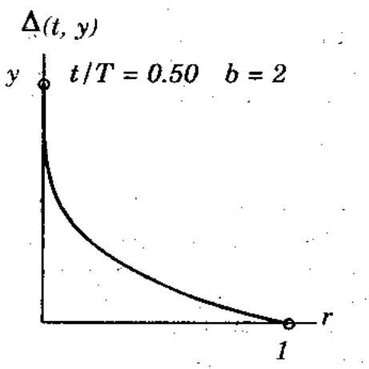

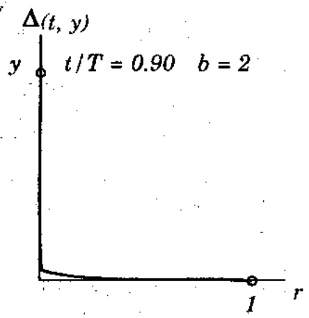

Hình 5.1. Δ(t,y) đối với hai lần chọn.

<!-- page: 51 -->

Hơn nữa, ngoài cách áp dụng đột biến chuẩn, ta có một số cơ chế mới: đột biến không đồng bộ cũng được áp dụng cho một vectơ lời giải thay vì chỉ một phần từ duy nhất của nó, khiến cho vectơ hơi trượt trong không gian lời giải.

## NHÓM TOÁN TỪ LAI TẠO

\- Lai đơn giản, định nghĩa theo cách thông thường, nhưng chỉ với các điểm tách cho phép giữa các $v'$, đối với nhiễm sắc thể $x$ cho trước.

\- Lai số học, được định nghĩa như một tổ hợp tuyến tính của hai vectơ: nếu $s_v^t$ và $s_w^t$ giao phối nhau, nhiễm sắc thể con có được là $s_v^{t+1} = a.s_w^t + (1 - a).s_v^t$ và $s_w^{t+1} = a.s_w^t + (1 - a).s_w^t$. Toán từ này có thể dùng tham số a hoặc là một hàng số (lai số học đồng bộ), hoặc là một biến mà giá trị của nó phụ thuộc tuổi của quản thể (lai số học không đồng bộ).

Ở dây, ta có một số cơ chế mới để áp dụng toán từ này; lai số học có thể được áp dụng cho các phần tử được chọn của hai vectơ hoặc cho toàn bộ các vectơ.

## 5.3. THỦ NGHIỆM VÀ KẾT QUẢ

Trong phần này, chúng tôi trình bày các kết quả của chương trình tiến hóa đối với các bài toán điều khiển tối ưu. Đối với tất cả các bài toán thử nghiệm kích thước quản thể cố định là 70, và mỗi lần chạy 40000 thể hệ. Đối với mỗi trường hợp thử nghiệm, ta thực hiện ba lần chạy khác nhau và chọn kết quả tốt nhất trong ba lần chạy đó; nhưng điều quan trọng cần để ý là độ lệch chuẩn của những lần chạy đó, hâu hết đều không dáng kể. Các vecto $<u_0,..., u_{N-1}>$ được khởi tạo ngầu nhiên, (nhưng trong miền xác định). Các bảng 5.2, 5.3, 5.4 cho biết các giá trị tìm được cùng các kết quả trung gian tại một số thể hệ. Thí dụ, các giá trị trong cột “10,000” biểu diễn một 100

phân kết quả sau 10,000 thể hệ, trong khi chạy 40.000. Điều quan trọng cần lưu ý là những giá trị đó tệ hơn những giá trị nhận được trong khi chỉ chạy 10,000 thể hệ, do bản chất của một số toán từ di truyền. Trong phân kế tiếp, ta so sánh những kết quả này với những lời giải chính xác và những lời giải nhận được từ gói tính toán máy GAMS. (\*)

Bảng 5.2. Kết quả chương trình tiến hóa của bài toán (5.1) - (5.2)

<table><tr><td rowspan="2">Trường hợp</td><td colspan="7">Các thể hệ</td><td rowspan="2">Nhân tố</td></tr><tr><td>1</td><td>100</td><td>1,000</td><td>10,000</td><td>20,000</td><td>30,000</td><td>40,000</td></tr><tr><td>I</td><td>17904.4</td><td>3.87385</td><td>1.73682</td><td>1.61859</td><td>1.61817</td><td>1.61804</td><td>1.61804</td><td> $10^{4}$ </td></tr><tr><td>II</td><td>13572.3</td><td>5.56187</td><td>1.35678</td><td>1.11451</td><td>1.09201</td><td>1.09162</td><td>1.09161</td><td> $10^{5}$ </td></tr><tr><td>III</td><td>17024.8</td><td>2.89355</td><td>1.06954</td><td>1.00952</td><td>1.00124</td><td>1.00102</td><td>1.00100</td><td> $10^{7}$ </td></tr><tr><td>IV</td><td>15082.1</td><td>8.74213</td><td>4.05532</td><td>3.71745</td><td>3.70811</td><td>3.70162</td><td>3.70160</td><td> $10^{4}$ </td></tr><tr><td>V</td><td>5968.42</td><td>12.2782</td><td>2.69862</td><td>2.85524</td><td>2.87645</td><td>2.87571</td><td>2.87569</td><td> $10^{5}$ </td></tr><tr><td>VI</td><td>17897.7</td><td>5.27447</td><td>2.09334</td><td>1.61863</td><td>1.61837</td><td>1.61805</td><td>1.61804</td><td> $10^{4}$ </td></tr><tr><td>VII</td><td>2690258</td><td>18.6685</td><td>7.23567</td><td>1.73564</td><td>1.65413</td><td>1.61842</td><td>1.61804</td><td> $10^{4}$ </td></tr><tr><td>VIII</td><td>123.942</td><td>72.1958</td><td>1.95783</td><td>1.00009</td><td>1.00005</td><td>1.00005</td><td>1.00005</td><td> $10^{4}$ </td></tr><tr><td>IX</td><td>7.28165</td><td>4.32740</td><td>4.39091</td><td>4.42524</td><td>4.31021</td><td>4.31004</td><td>4.31004</td><td> $10^{5}$ </td></tr><tr><td>X</td><td>9971391</td><td>148233</td><td>16081.0</td><td>1.48445</td><td>1.00040</td><td>1.00010</td><td>1.00010</td><td> $10^{4}$ </td></tr></table>

<small><span class="docvortex-page-footnote" data-block-type="page_footnote" style="color:#6b7280">(\*) GAMS là chương trình máy tính chuẩn dùng giải và giảng dạy các bài toán dạng này.</span></small>

<!-- page: 52 -->

Lưu ý, bài toán (5.5) - (5.7) có điều kiện ràng buộc ở giai đoạn cuối, khác với bài toán (5.1) - (5.2) ở chỗ là vectơ được khởi tạo, không ngầu nhiên lấm, $<u_{0}, \ldots, u_{N-1}>$ các số thực dương phát sinh một chuỗi $x_{1}$ (xem điều kiện (5.6)) sao cho $x_{0} = x_{N}$, với $a$ và $x_{0}$ cho trước. Trong chương trình tiến hóa của chúng ta, ta đã phát sinh một chuỗi ngầu nhiên $u_{0}, \ldots, u_{N-2}$, và đã đặt $u_{N-1} = a^{*}x_{N-1} - x_{N}$. Đối với $u_{N-1}$ âm, ta đã loại chuỗi này và lắp lại tiến trình khởi tạo (sẽ bàn chi tiết ở chương sau). Khó khăn tương tự xuất hiện trong tiến trình sinh sản. Một con (sau một số tác vụ di truyền) không còn thỏa ràng buộc $x_{0} = x_{N}$. Trong trường hợp đó, ta thay thành phần cuối của vectơ con $u$ bằng công thức $u_{N-1} = a^{*}x_{N-1} - x_{N}$. Lần nửa, nếu $u_{N-1}$ âm, ta sẽ không đưa đưa con đó vào quản thể mới.

Trong chương này, đây là bài toán thử nghiệm duy nhất có ràng buộc không tâm thường. Ta sẽ bàn toàn bộ vấn đề về các bài toán điều khiển tối ưu ràng buộc trong chương sau.

Bảng 5.3. Chương trình tiến hóa của bài toán thu hoạch (5.5) - (5.7)

<table><tr><td></td><td colspan="7">Các thế hệ</td></tr><tr><td>N</td><td>1</td><td>100</td><td>1000</td><td>10,000</td><td>20,000</td><td>30,000</td><td>40,000</td></tr><tr><td>2</td><td>5.3310</td><td>5.3317</td><td>5.3317</td><td>5.3317</td><td>5.3317</td><td>5.3317</td><td>5.331738</td></tr><tr><td>4</td><td>12.6848</td><td>12.7172</td><td>12.7206</td><td>12.7210</td><td>12.7210</td><td>12.7210</td><td>12.721038</td></tr><tr><td>8</td><td>25.4601</td><td>25.6772</td><td>25.9024</td><td>25.9057</td><td>25.9057</td><td>25.9057</td><td>25.905710</td></tr><tr><td>10</td><td>32.1981</td><td>32.5010</td><td>32.8152</td><td>32.8209</td><td>32.8209</td><td>32.8209</td><td>32.820943</td></tr><tr><td>20</td><td>65.3884</td><td>68.6257</td><td>73.1167</td><td>73.2372</td><td>73.2376</td><td>73.2376</td><td>73.237668</td></tr><tr><td>45</td><td>167.1384</td><td>251.3241</td><td>277.3990</td><td>279.0657</td><td>279.2612</td><td>279.2676</td><td>279.271421</td></tr></table>

Bảng 5.4. Chương trình tiến hóa cho bài toán xe kéo (5.9) - (5.11)

<table><tr><td colspan="8">Các thể hệ</td></tr><tr><td>N</td><td>1</td><td>100</td><td>1000</td><td>10,000</td><td>20,000</td><td>30,000</td><td>40,000</td></tr><tr><td>5</td><td>-3.008351</td><td>0.081197</td><td>0.119979</td><td>0.120000</td><td>0.120000</td><td>0.120000</td><td>0.120000</td></tr><tr><td>10</td><td>-5.668287</td><td>-0.011064</td><td>0.140195</td><td>0.142496</td><td>0.142500</td><td>0.142500</td><td>0.142500</td></tr><tr><td>15</td><td>-5.885241</td><td>-0.012345</td><td>0.142546</td><td>0.150338</td><td>0.150370</td><td>0.150370</td><td>0.150371</td></tr><tr><td>20</td><td>-7.477872</td><td>-0.126734</td><td>0.149953</td><td>0.154343</td><td>0.154375</td><td>0.154375</td><td>0.154377</td></tr><tr><td>25</td><td>-8.668933</td><td>-0.015673</td><td>0.143030</td><td>0.156775</td><td>0.156800</td><td>0.156800</td><td>0.156800</td></tr><tr><td>30</td><td>-12..257346</td><td>-0.194342</td><td>0.123045</td><td>0.158241</td><td>0.158421</td><td>0.158426</td><td>0.158426</td></tr><tr><td>35</td><td>-11.789546</td><td>-0.236753</td><td>0.110964</td><td>0.159307</td><td>0.159586</td><td>0.159592</td><td>0.159592</td></tr><tr><td>40</td><td>-10.985642</td><td>-0.235642</td><td>0.072378</td><td>0.160250</td><td>0.160466</td><td>0.160469</td><td>0.160469</td></tr><tr><td>45</td><td>-12.789345</td><td>-0.342671</td><td>0.072364</td><td>0.160913</td><td>0.161127</td><td>0.161152</td><td>0.161152</td></tr></table>

## 5.4. Chương trình tiến hóa với các phương pháp khác

Trong phần này, ta so sánh những kết quả trên với những lời giải chính xác cũng như những lời giải nhận được GAMS.

## 5.4.1. Bài toán tuyến tính bình phương

Lời giải chính xác của bài toán này với những giá trị của những tham số được đặc tả trong bằng 5.1, mô tả trong (5.3) và (5.4).

<!-- page: 53 -->

Đế làm nổi bất hiệu quả và tính cạnh tranh của chương trình tiến hóa, những bài toán thử nghiệm tương tự đã được giải bằng GAMS. Bảng (5.5) tóm tất các kết quả, ở đây các cột D chỉ phần trăm sai số tương đối.

Bảng 5.5. So sánh các lời giải của bài toán tuyến tính bình phương

<table><tr><td rowspan="2">Trường hợp</td><td>Lời giải chính xác</td><td colspan="2">Chương trình tiến hóa</td><td colspan="2">GAMS</td></tr><tr><td>Giá trị</td><td>Giá trị</td><td>D %</td><td>Giá trị</td><td>D %</td></tr><tr><td>I</td><td>16180.3399</td><td>16180.3928</td><td>0.000</td><td>16180.3399</td><td>0.000</td></tr><tr><td>II</td><td>109160.7978</td><td>109161.0138</td><td>0.000</td><td>109160.7078</td><td>0.000</td></tr><tr><td>III</td><td>10009990.0200</td><td>10010041.3789</td><td>0.000</td><td>10009990.0200</td><td>0.000</td></tr><tr><td>IV</td><td>37015.6212</td><td>37015.0426</td><td>0.000</td><td>37015.6212</td><td>0.000</td></tr><tr><td>V</td><td>287569.3725</td><td>287569.4357</td><td>0.000</td><td>287569.3725</td><td>0.000</td></tr><tr><td>VI</td><td>16180.3399</td><td>16180.4065</td><td>0.000</td><td>16180.3399</td><td>0.000</td></tr><tr><td>VII</td><td>16180.3399</td><td>16180.3784</td><td>0.000</td><td>16180.3399</td><td>0.000</td></tr><tr><td>VIII</td><td>10000.5000</td><td>10000.5000</td><td>0.000</td><td>10000.5000</td><td>0.000</td></tr><tr><td>IX</td><td>431004.0987</td><td>431004.4182</td><td>0.000</td><td>431004.0987</td><td>0.000</td></tr><tr><td>X</td><td>1000.9999</td><td>10001.0038</td><td>0.000</td><td>10000.9999</td><td>0.000</td></tr></table>

Thực ra, vì được thiết kế chuyên biệt, GAMS thực hiện bài toán tuyến tính thất hoàn hảo. Nhưng, đây lại không phải là trường hợp của bài toán thử nghiệm thứ hai.

## 5.4.2. Bài toán thu hoạch

Không có lời giải GAMS nào giống với lời giải chính xác. Sự khác biệt giữa các lời giải cảng tăng khi $N$ lớn như bằng 5.6 trình bày, và với $N > 4$, hệ thống không tìm được giá trị nào.

Có về là GAMS nhay cảm với sự không - lôi của bài toán tối ưu và với số biến.

## 5.4.3. Bài toán xe kéo

Cả GAMS và chương trình tiến hóa đều cho ra những kết quả tốt đối với bài toán xe kéo (bảng 5.7). Nhung, khá thú vị nếu để ý đến mối liên hệ giữa số lần mà các thuật giải tìm kiếm khác nhau cần có để hoàn thành công việc.

<table><tr><td rowspan="2">N</td><td>Lời giải chính xác</td><td colspan="2">GAMS</td><td colspan="2">GAMS+</td><td colspan="2">GT di truyền</td></tr><tr><td>giá trị</td><td>giá trị</td><td>D%</td><td>giá trị</td><td>D%</td><td>giá trị</td><td>D%</td></tr><tr><td>2</td><td>5.331738</td><td>4.3693</td><td>30.99</td><td>5.3316</td><td>0.00</td><td>5.3317</td><td>0.000</td></tr><tr><td>4</td><td>12.721038</td><td>5.9050</td><td>53.58</td><td>12.7210</td><td>0.00</td><td>12.7210</td><td>0.000</td></tr><tr><td>8</td><td>25.905710</td><td>*</td><td></td><td>18.8604</td><td>27.20</td><td>25.9057</td><td>0.000</td></tr><tr><td>10</td><td>32.820943</td><td>*</td><td></td><td>22.9416</td><td>30.10</td><td>32.8209</td><td>0.000</td></tr><tr><td>20</td><td>73.2337681</td><td>*</td><td></td><td>*</td><td></td><td>73.2376</td><td>0.000</td></tr><tr><td>45</td><td>279.275275</td><td>*</td><td></td><td>*</td><td></td><td>279.2714</td><td>0.001</td></tr></table>

Bàng 5.6. So sánh các lời giải của bài toán thu hoạch. Dấu sao (\*) có nghĩa là GAMS không báo cáo được giá trị hợp lý.

<!-- page: 54 -->

<table><tr><td rowspan="2">N</td><td>Lời giải chính xác</td><td colspan="2">GAMS</td><td colspan="2">GA</td></tr><tr><td>giá trị</td><td>giá trị</td><td>D(%)</td><td>giá trị</td><td>D(%)</td></tr><tr><td>5</td><td>0.120000</td><td>0.120000</td><td>0.000</td><td>0.120000</td><td>0.000</td></tr><tr><td>10</td><td>0.142500</td><td>0.142500</td><td>0.000</td><td>0.142500</td><td>0.000</td></tr><tr><td>15</td><td>0.150370</td><td>0.150370</td><td>0.000</td><td>0.150370</td><td>0.000</td></tr><tr><td>20</td><td>0.154375</td><td>0.154375</td><td>0.000</td><td>0.154375</td><td>0.000</td></tr><tr><td>25</td><td>0.156800</td><td>0.156800</td><td>0.000</td><td>0.156800</td><td>0.000</td></tr><tr><td>30</td><td>0.158426</td><td>0.158426</td><td>0.000</td><td>0.158426</td><td>0.000</td></tr><tr><td>35</td><td>0.160469</td><td>0.160469</td><td>0.000</td><td>0.160469</td><td>0.000</td></tr><tr><td>40</td><td>0.160469</td><td>0.160469</td><td>0.000</td><td>0.160469</td><td>0.000</td></tr><tr><td>45</td><td>0.161152</td><td>0.161152</td><td>0.000</td><td>0.161152</td><td>0.000</td></tr></table>

Bảng 5.7. So sánh các lời giải của bài toán xe kéo.

Bảng 5.8 cho biết về số lần lắp mà chương trình tiến hóa cần để đạt được lời giải chính xác (làm tròn đến 6 số lẻ), thời gian cần thiết cho việc đó, và thời gian tổng cộng cho cả 40,000 lần lắp (Nếu không biết lời giải chính xác ta không thể xác định độ chính xác của lời giải hiện hành). Cũng vậy, thời gian của GAMS là được cho trước.

Rô ràng là chương trình tiến hóa chậm hơn GAMS nhiều: có sự khác biệt về thời gian CPU. Tuy vậy, ta không so sánh thời gian cần thiết cho cả hai hệ thống hoàn thành việc tính toán, mà so sánh tỉ lệ gia tăng thời gian - là hàm theo kích thước bài toán. Hình 5.2 biểu diễn tỉ lệ gia tăng thời gian cần thiết để nhận được kết quả của chương trình tiến hóa và GAMS.

| N | Số lần lặp cần có | Thời gian (CPU) cần có (sec) | Thời gian cần cho 40,000 lần lặp (CPU sec) | Thời gian cần cho GAMS (CPU, sec) |
| --- | --- | --- | --- | --- |
| 5 | 6234 | 65.4 | 328.9 | 31.5 |
| 10 | 10231 | 109.7 | 400.9 | 33.1 |
| 15 | 19256 | 230.8 | 459.8 | 35.6 |
| 20 | 19993 | 257.8 | 590.8 | 41.1 |
| 25 | 18804 | 301.3 | 640.4 | 47.7 |
| 30 | 22976 | 389.5 | 701.9 | 58.2 |
| 35 | 23768 | 413.6 | 779.5 | 68.0 |
| 40 | 25634 | 467.8 | 850.7 | 81.3 |
| 45 | 28756 | 615.9 | 935.3 | 95.9 |

Bảng 5.8 Thời gian thực hiện của chương trình tiến hóa GAMS đối với bài toán xe kéo (5.9), (5.11): số lần lập cần có để đạt kết quả chính xác đến 6 số lẻ, thời gian cần thiết cho số lần lập đó, thời gian cần thiết cho cả 40,000 lần lập.

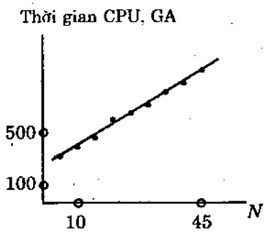

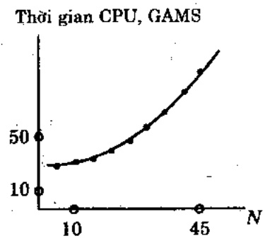

Hình 5.2. Thời gian là hàm của kích thước bài toán (N).

<!-- page: 55 -->

$T = 40,000,\quad t\text{tăng mõi lân}400$

## 5.4.4. Tâm quan trọng của đột biến không đồng bộ

So sánh những kết quả này với những lời giải chính xác cũng như những lời giải nhận được từ GA khác sẽ thấy thú vị là chúng hoàn toàn giống nhau, nhưng không có đột biến không đồng bộ ở đó. Bảng 5.9 tóm tắt kết quả; cột D cho thấy sai số tương đối theo phần trăm.

Thuật giải di truyền sử dụng đột biến không đồng bộ rõ ràng thực hiện tốt hơn về độ sự chính xác của lời giải tối ưu tìm được; trong khi GA cải tiến hiểm khi đạt được sai số vượt quá vài phần ngân, còn GA truyền thống hầu như khó vượt được một phần trăm. Hơn nữa, nó cũng đã hội tự nhanh về lời giải.

<table><tr><td rowspan="2">Trường hợp</td><td>Lời giải chính xác</td><td colspan="2">GA với đột biến không đồng bộ</td><td colspan="2">GA không đột biến không đồng bộ</td></tr><tr><td>giá trị</td><td>giá trị</td><td>D(%)</td><td>giá trị</td><td>D(%)</td></tr><tr><td>I</td><td>16180.3399</td><td>16180.3939</td><td>0.000</td><td>16234.3233</td><td>0.334</td></tr><tr><td>II</td><td>109160.7978</td><td>109163.0278</td><td>0.000</td><td>113807.2444</td><td>4.257</td></tr><tr><td>III</td><td>10009990.0200</td><td>10010391.3989</td><td>0.001</td><td>10128951.4515</td><td>1.188</td></tr><tr><td>IV</td><td>37015.6212</td><td>37015.0806</td><td>0.001</td><td>37035.5652</td><td>0.954</td></tr><tr><td>V</td><td>287569.3725</td><td>287569.7389</td><td>0.000</td><td>298214.4587</td><td>3.702</td></tr><tr><td>VI</td><td>16180.3399</td><td>16180.6166</td><td>0.002</td><td>16238.2135</td><td>0.358</td></tr><tr><td>VII</td><td>16180.3399</td><td>16188.2394</td><td>0.048</td><td>17278.8502</td><td>5.786</td></tr><tr><td>VIII</td><td>10000.5000</td><td>10000.5000</td><td>0.000</td><td>10000.5000</td><td>0.000</td></tr><tr><td>IX</td><td>431004.0987</td><td>431004.4092</td><td>0.000</td><td>431610.9771</td><td>0.141</td></tr><tr><td>X</td><td>10000.9999</td><td>10001.0045</td><td>0.000</td><td>10439.2695</td><td>4.380</td></tr></table>

Bảng 5.9. So sánh những lời giải của bài toán điều khiển động tuyến tính bình phương

Xem hình 5.3 để có một minh họa về hiệu quả của đột biến không đồng bộ trong tiến trình tiến hóa; đột biến mối làm tăng số cải thiện thấy được trong quản thể vào cuối đời sống của quản thể rất nhiều. Hơn nửa, một số nhỏ những cải thiện trước thời gian đó, cùng với một hội tự thực sự nhanh hơn, rõ ràng đã cho thấy một tìm kiếm tổng thể tốt hơn.

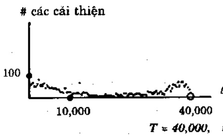

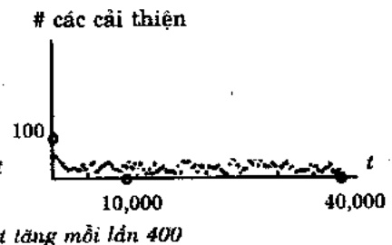

Hình 5.3. Số cải thiện trong trường hợp 1 của bài toán điều khiển động tuyến tính bình phương.

## 5.5. KÊT LUẬN

Trong chương này, ta đã nghiên cứu một toán từ mới, đột biến không đồng bộ, để cải thiện các khả năng tìm chính xác cục bộ của một GA. Các thử nghiệm đã thành công trên những bài toán điều khiển tối uu thời gian rời rạc. Đặc biệt, các kết quả rất dáng khích lệ vì các lời giải số đã đạt rất gần các lời giải giải tích một cách đáng hài lòng. Thêm nửa, thời gian máy tính toán là chấp nhận được (đối với 40,000 thế hệ, chỉ cần vài phút thời gian).

<!-- page: 56 -->

Các kết quả số đã được so sánh với những kết quả thu được với GAMS. Trong khi chương trình tiến hóa cho ta những kết quả tốt dáng kể với các lời giải giải tích cho tất cả các bài toán thử nghiệm, GAMS thất bại đối với một số các bài toán thử nghiệm. Chương trình tiến hóa đã cải đặt thể hiện một số tính chất không phải luôn luôn hiện diện trong các hệ thống (dựa trên đạo hàm) khác:

\- Hàm tối uu hóa của chương trình tiến hóa không cần liên tục.

\- Một số chương trình tối ưu hóa phải thực hiện trọn gói: người sử dụng phải đội cho đến khi chương trình hoàn tất. Đôi khi không thể có được một phần kết quả (hoặc xấp xi ở một số giai đoạn đầu). Các chương trình tiến hóa cung cấp thêm một số tính linh hoạt cho người sử dụng, vì người sử dụng có thể điều khiển “tình trạng tìm kiếm” trong thời gian chạy và ra những quyết định thích hợp. Đặc biệt, người sử dụng có thể đặc tả thời gian máy mà mình có thể chấp nhận (thời gian lâu hơn cung cấp câu trả lời chính xác hơn).

\- Độ phúc tạp của tính toán trong những chương trình tiến hóa tăng theo tỉ lệ tuyến tính; hầu hết những phương pháp tìm kiếm khác rất nhạy cảm với tỷ lệ này. Ta cũng có thể đề dàng cải thiện hiệu quả của hệ thống bằng những cải đặt song song; đối với những phương pháp tối ưu hóa khác thường khó thực hiện như vậy.

Gân dây có nhiều phát triển thú vị trong lãnh vực thuật giải tiến hóa để nâng cao khả năng chính xác của chúng. Những phương pháp này là thuật giải mã hóa Delta, Mã Hóa Tham Số Đông, chiến lược ARGOT, các chiến lược IRM, mở rộng của lập trình tiến hóa, tiến hóa thô, và các thuật giải di truyền theo quảng.

Có một số hoạt động khác (ít nhiều trực tiếp hơn) nhằm vào các khả năng chính xác. Những hoạt động này, gồm nghiên cứu của Arabas và những người khác, giới thiệu các phép lai trung gian bổ sung và đồng nhất của các chiến lược tiến hóa (xem chương 7). Hinterding cũng đã thử nghiệm với đột biến của các gen (tương ứng với các biến) thay cho đột biến bit. Từ đó, các tác giả phân tích ý nghĩa của mã hóa (Gray đối chiếu với Nhị phân), kết cấu thô, và tần suất của các đột biến gen như thế.

Cũng có những kết quả thú vị do Srinivas và Patnaik báo cáo, họ đã thử nghiệm với các xác suất đột biến và lai bổ sung để duy trì sự đa dạng của quản thể (và duy trì khả năng hội tụ của thuật giải). Trong cách tiếp cận này, các xác suất của những toán từ này thay đổi theo các giá trị thích nghi của những lời giải: những lời giải “tốt” được bảo vệ còn những lời giải “tôi” thì bị hủy. Nói chính xác hơn:

$$
p _ {c} = \left\{ \begin{array}{l l} k _ {1}. \left(f _ {\max} - f ^ {\prime}\right) / \left(f _ {\max} - \bar {f}\right), & \text {neu} f \leq \bar {f} \\ k _ {3} & , \text {nguoc lai} \end{array} \right.
$$

và

$$
p _ {c} = \left\{ \begin{array}{l l} k _ {2}. \left(f _ {\max} - f ^ {\prime}\right) / \left(f _ {\max - \bar {f}}\right), & \text {neu} f \leq \bar {f} \\ k _ {4} & \text {nguoc lai} \end{array} \right.
$$

<!-- page: 57 -->

Trong đó, $k_{1}$ và $k_{2}$ là những hàng dương (không lớn hơn 1), $f_{max}$ và $\overline{f}$ lần lượt cho biết các giá trị cực đại và trung bình của hàm thích nghi $f$ trong quản thể hiện tại, $f$ là giá trị của hàm thích nghi đối với một lời giải cho trước, còn $f$-giá trị lớn hơn (đối với hai lời giải được chọn để lai tạo). Chủ ý ràng (1) giá trị của $f_{max} - \overline{f}$ là cần thiết trong công thức trên; nó cũng quan trọng trong việc đo độ hội tụ của thuật giải; (2) $p_{c}$ và $p_{m}$ bằng 0 đối với lời giải có thích nghi cục đại; (3) $p_{c} = k_{1}$ và $p_{m} = k_{2}$ đối với lời giải có $f = \overline{f}$ và (4) $p_{c} = k_{3}$ và $p_{m} = k_{4}$ đối với những lời giải dưới trung bình.

## Chương 6

## XỦ LÝ RÀNG BUỘC

Bài toán qui hoạch phi tuyến tổng quát - NLP (nonlinear programming problem) là tìm x để hàm:

$$
f (x), \quad x = (x _ {1}, \dots , x _ {q}) \in R ^ {q}
$$

đạt giá trị tối ưu thỏa p ≥ 0 phương trình:

$$
g _ {j} (\boldsymbol {x}) = 0, j = 0, \dots , p,
$$

và m - p ≥ 0 bất phương trình:

$$
h _ {j} (x) \leq 0, j = p + 1, \dots , m
$$

Hiện chưa có phương pháp nào giúp xác định cực đại (hay cực tiểu) toàn cực cho bài toán NLP tổng quát. Chỉ khi hàm mục tiêu $f$ và các ràng buộc $c_{j}$ ($g_{j}$ và $h_{j}$), thỏa một số tính chất nào đó, thì đôi khi mới tìm được tối ưu toàn cực. Nhiểu thuật giải được phát triển cho những bài toán không ràng buộc (phương pháp tìm kiếm trực tiếp, phương pháp gradient) và những bài toán có ràng buộc (những thuật giải này thường được xếp vào một trong hai lớp: lớp phương pháp gián tiếp và lớp trực tiếp). Phương pháp gián tiếp giải bài toán NLP bằng cách trích ra một (số) bài toán tuyến tính từ bài toán gốc, trong khi phương pháp trực tiếp cố gắng xác định trực tiếp những điểm tìm kiếm. Để thực hiện, bài toán gốc được biến đổi thành bài toán không ràng buộc, để có thể áp dụng những phương pháp gradient, hay phương pháp gradient cải tiến. Mặc đầu những nghiên cứu về bài toán NLP trong những năm gần đây đã có những kết quả tích cực, nhưng công bình mà nói, chưa có thuật giải nào giải hiệu quả bài toán NLP tổng quát.

<!-- page: 58 -->

Có nhiều bài toán khác có liên quan đến các ký thuật tối ưu hóa truyền thống. Thí dụ, hâu hết các phương pháp được đề nghị là các phương pháp tâm cục bộ, chúng phụ thuộc vào sự tôn tại các đạo hàm và chúng không đủ mạnh trong những không gian không liên tục, miền xác định lớn, hay không gian tìm kiếm bị ahiều.

Trong chương này, ta sẽ xây dựng các chương trình tiến hoá giải bài toán NLP này. Đầu tiên, ta sẽ giải bài toán NLP có không gian tìm kiếm lồi. Sau đó, ta sẽ mở rộng cho bài toán NLP tổng quát.

## 6.1. Bài toán qui hoạch phi tuyến trên không gian lôi

Nhiều nhà nghiên cứu đã thử sử dụng GA với biểu diễn thực vào bài toán tối ưu số. Tuy nhiên, các bài toán tối ưu này chỉ bị ràng buộc theo miễn $D \subseteq R^{q}$, với $D = \prod_{k=1}^{q} < l_{k}, r_{k} >$, nghĩa là mối biến $x_{k}$ bị giới hạn trong một khoảng cho trước $<l_{k}, r_{k}> (1 \leq k \leq q)$. Nhưng bài toán tối ưu tổng quát thường gặp trong thực tế hấu hết lại là bài toán tối ưu có ràng buộc.

Trong bài toán tối ưu có ràng buộc, dạng hình học của tập lời giải trong $R^{q}$ có lẻ là đặc trưng quan trọng nhất của bài toán. Hiện chỉ có tập lôi là có phát triển lý thuyết dáng kể nhất.

Trong phần này, ta quan tâm đến bài toán tối ưu hàm $f(x_{1},\ldots,x_{q})\in R$,

với  $(x_{1},\ldots,x_{q})\in D\subseteq R^{q}$  và D là một tập lôi.

Miền $D$ được xác định từ các khoảng giá trị ($l_k \leq x_k \leq r_k$ với $k = 1, \ldots, q$) và từ tập các ràng buộc $C$. Do tính lôi của tập $D$ mà với mỗi điểm trong không gian tìm kiếm ($x_1, \ldots, x_q$) $\in D$, tôn tại một đoạn &lt;left(k), right(k)&gt; của biến $x_k$ ($1 \leq k \leq q$), trong đó các biến $x_i$ $(i=1,\ldots,k-1,\quad k+1,\ldots,q)$  khác vấn cô định. Nói cách khác, điểm  $(x_{1},\ldots,x_{k},\ldots,x_{q})\in D$  cho trước:

$$
y \in <   l e f t (k), r i g h t (k) > \Leftrightarrow (x _ {1}, \dots , x _ {l - 1}, y, x _ {k + 1}, \dots , x _ {n}) \in D.
$$

trong đó, tất cả $x$; $(i=1,\dots,k-1, k+1,\dots,q)$ vản là hàng số. Ta cũng giả định khoảng &lt;left(k), right(k)&gt; có thể tính được bằng máy.

Thí dụ, nếu $D \subseteq R^{2}$ được định nghĩa là:

$$
- 3 \leq x _ {1} \leq 3,
$$

$$
0 \leq x _ {2} \leq 8,
$$

$$
x _ {1} ^ {2} \leq x _ {2} \leq x _ {1} + 4,
$$

thì đối với điểm (2, 5) ∈ D cho trước:

$$
\text {left} (1) = 1, \text {right} (1) = \sqrt {5}
$$

$$
\text {left} (2) = 4, \text {right} (2) = 6
$$

Điều này có nghĩa là thành phần thứ nhất của vectơ (2, 5) có thể thay đổi từ 1 đến $\sqrt{5}$ (trong khi $x_{2} = 5$ vẫn không đổi) và thành phần thứ hai của vectơ này có thể thay đổi từ 4 đến 6 (trong khi $x_{1} = 2$ vẫn giữa nguyên).

Dī nhiên, nếu tập các ràng buộc C rổng, thì không gian tìm kiếm $D = \prod_{k=1}^{q} < l_k, r_k >$ là lồi; hơn nửa left ($k$) = $l_k$; right ($k$) = $r_k$ với $k = 1, \ldots, q$.

Tính chất trên là cơ sở để ta xây dựng các toán tử đột biến; nếu biến $x_k$ bị đột biến, khoảng đột biến phải là &lt;left(k), right(k)&gt;: và như thế, kết quả luôn thỏa ràng buộc.

<!-- page: 59 -->

Một tính chất khác của không gian tìm kiếm lôi là bảo đảm rằng, với hai điểm $x_{1}, x_{2}$ bất kỳ trong không gian lôi giải $D$, tổ hợp tuyến tính $ax_{1}+(1-a)x_{2}$, với $a \in [0, 1]$ cũng là điểm trong $D$. Tính chất này quan trọng khi ta xây dựng các phép lai số học.

Ta sẽ xét một lớp bài toán tối ưu được xác định trên một miền lôi; những bài toán này được hình thức hóa như sau:

Tôi uu hàm $f(x_{1}, x_{2}, ..., x_{q})$ với tập ràng buộc tuyến tính:

1. Ràng buộc về miền $l_i \leq x_i \leq u_i$. Ta viết $l \leq x \leq u$, trong đó, $l = <l_1, \ldots, l_q>$, $u = <u_1, \ldots, u_q>$, $x = <x_1, \ldots, x_q>$.

2. Ràng buộc đẳng thức $Ax = b$, trong đó, $x = <x_1, \dots, x_q>$, $A = (a_{ij})$, $b = <b_1, \dots, b_p>$, $1 \leq i \leq p$ và $1 \leq j \leq q$ ($p$ là số phương trình).

3. Ràng buộc bất đẳng thức $Cx <= d$, trong đó, $C = (c_{ij})$, $x = <x_1, \ldots, x_m>$, $d = <d_1, \ldots, d_m>$, $1 \leq i \leq m$ và $1 \leq j \leq m$ ($m$ là số bất đẳng thức).

Cách hình thức hóa như thế thường đủ để xử lý một lớp lớn các bài toán tối ưu với các ràng buộc tuyến tính của một hàm mục tiêu bất kỳ. Thí dụ bài toán vận tải phi tuyến, là một trong những bài toán thuộc lớp này.

Hệ thống GENOCOP, được phát triển bởi Michalewicz, cải đặt cách xử lý ràng buộc vừa tổng quát vừa độc lập bài toán. Ý tưởng chính là (1) loại trừ các đẳng thức có trong tập ràng buộc, và (2) thiết kế kỹ lường các toán từ di truyền đặc biệt, đảm bảo giữ được tất cả các nhiễm sắc thể trong không gian lời giải ràng buộc.

Trong một số kỹ thuật tối ưu hóa như qui hoạch tuyến tính, các ràng buộc về đẳng thức rất dễ cho việc giải bài toán tối ưu, do ta biết ràng, nếu lời giải tối ưu tồn tại, nó sẽ thuộc bề mặt của tập lồi. Vi thể, các bất đẳng thức sẽ được chuyển thành các đẳng thức bằng 116

cách thêm vào các biến tạm, và phương pháp lời giải tiến hành bằng
cách di chuyển từ đình này đến định khác trên bề mặt.

Ngược lại, đối với phương pháp phát sinh các lời giải ngẫu nhiên như GA, thì các ràng buộc đẳng thức như thế lại thật phiên toán. Chứng được loại trừ ngay từ đầu với cùng số biến bãi toán; hành động này cũng xóa đi một phần không gian cần tìm kiếm. Các ràng buộc còn lại, dưới dạng các bất đẳng thức tuyến tính, tạo thành một tập lời phải tìm cho lời giải. Tính lôi của không gian tìm kiếm bảo đảm ràng tổ hợp tuyến tính các lời giải cũng sẽ là một lời giải mà không cần kiểm tra ràng buộc - đây là đặc trưng được dùng chính trong phương pháp này. Các bất đẳng thức có thể được dùng để phát sinh biên của một biến bất kỳ cho trước: những biên này là động vì chúng phụ thuộc vào các giá trị của những biến khác và có thể được tính toán tự động một cách hiệu quả.

Giả sử tập ràng buộc đẳng thức được biểu diễn dưới dạng ma trận:

$$
\boldsymbol {A} \boldsymbol {x} = \boldsymbol {b}
$$

Ta giả định ràng có $p$ phương trình độc lập, nghĩa là có $p$ biến $x_{i1}, x_{i2}, \ldots, x_{ip} (|i_1, \ldots, i_p|) \subseteq \{1, 2, \ldots, q\}$) có thể được biểu diễn theo các biến khác. Do đó, chúng có thể bị loại như sau.

Ta tách dọc mắng A thành hai mắng $A_{1}$ và $A_{2}$ sao cho cột thứ $j$ của ma trận A thuộc $A_{1}$, nếu và chỉ nếu $j \in (i_{1}, \ldots, i_{p})$. Như vậy, $A_{1}^{-1}$ tồn tại. Tương tự, ta tách ma trận C và các vectơ $x$, $l$, $u$ (nghĩa là $x^{1} = <x_{i1}, \ldots, x_{ip}>$, $l_{1} = <l_{i1}, \ldots, l_{ip}>$ và $u_{1} = <u_{i1}, \ldots, u_{ip}>$). Rôi thì ta có:

$$
A _ {1} \boldsymbol {x} ^ {1} + A _ {2} \boldsymbol {x} ^ {2} = \boldsymbol {b}
$$

và dẽ dàng thấy răng:

<!-- page: 60 -->

$$
x ^ {I} = A _ {1} ^ {- 1} b - A _ {1} ^ {- 1} A _ {2} x ^ {2}
$$

Như thể, ta có thể bỏ các biến $x_{i_{j}}$, ..., $x_{i_{j}}$ và thay chúng bằng tố hợp tuyến tính của các biến còn lại. Nhưng mỗi biến $x_{i_{j}}$ ($j=1,2$, ..., $p$) bị ràng buộc thêm bồi một ràng buộc miễn $l_{i_{j}} \leq x_{i_{j}} \leq u_{i_{j}}$. Khi loại bỏ tất cả các biến $x_{i_{j}}$, sẽ cho ta một tập các bất đẳng thức mới,

$$
I _ {I} \leq x ^ {I} = A _ {1} ^ {- 1} b - A _ {1} ^ {- 1} A _ {2} x ^ {2} \leq u _ {1}
$$

tập này được thêm vào tập các bất đẳng thức gốc.

Tập gốc  $Cx \leq d$ ,

có thể được biểu diễn là

$$
C _ {1} \boldsymbol {x} ^ {1} + C _ {2} \boldsymbol {x} ^ {2} \leq \boldsymbol {d}
$$

và có thể biến đổi thành

$$
C _ {1} (A _ {1} ^ {- 1} b - A _ {1} ^ {- 1} A _ {2} x ^ {2}) + C _ {2} x ^ {2} \leq d
$$

Như vây, sau khi bổ $p$ biến $x_{i_1}$, ..., $x_{i_p}$, tập các ràng buộc cuối cùng chỉ gồm có các bất đẳng thức sau đây:

1. Các ràng buộc miền:  $l_{2} \leq x^{2} \leq u_{2}$ ,

2. Các bất đẳng thức mới: $I_{1} \leq x^{I} = A_{1}^{-1}b - A_{1}^{-1}A_{2}x^{2} \leq u_{1}$,

4. Các bất đẳng thức gốc (sau khi bỏ $x^{j}$ biến):

$$
(C _ {2} - C _ {1} A _ {1} ^ {- 1} A _ {2}) x _ {2} \leq d - C _ {1} A _ {1} ^ {- 1} b
$$

## 6.1.1. Một thí dụ minh họa

Giả sử ta muốn tối ưu hóa hàm 6. biến:

$$
f (x _ {1}, x _ {2}, x _ {3}, x _ {4}, x _ {5}, x _ {6})
$$

vói

$$
2 x _ {1} + x _ {2} + x _ {3} = 6
$$

$$
x _ {3} + x _ {5} - 3 x _ {6} = 1 0
$$

$$
x _ {1} + 4 x _ {4} = 3
$$

$$
x _ {2} + x _ {5} \leq 1 2 0
$$

$$
- 4 0 \leq x _ {1} \leq 2 0, 5 0 \leq x _ {2} <   = 7 5
$$

$$
0 \leq x _ {3} \leq 1 0, \quad 5 \leq x _ {4} \leq 1 5,
$$

$$
0 \leq x _ {5} \leq 2 0, - 5 <   = x _ {6} \leq 5
$$

Có 3 phương trình và 6 biến, như vậy sẽ có ba biến tự do. Ta sẽ dùng ba phương trình độc lập và biểu diễn các biến qua ba biến còn lại:

$$
x _ {1} = 3 - 4 x _ {4},
$$

$$
x _ {2} = - 1 0 + 8 x _ {4} + x _ {5} - 3 x _ {6},
$$

$$
x _ {3} = 1 0 - x _ {5} + 3 x _ {6}
$$

Như vây, ta đã biến bài toán gốc thành bài toán tối uu hóa một hàm ba biến $x_{4}, x_{5}, x_{6}$.

$$
\begin{array}{l} g (x _ {4}, x _ {5}, x _ {6}) = f ((3 - 4 x _ {4}), (- 1 0 + 8 x _ {4} + x _ {5} - 3 x _ {6}), (1 0 - x _ {5} + 3 x _ {6})) \\ - 1 0 + 8 x _ {4} + 2 x _ {5} - 3 x _ {6} \leq 1 2 0 (\textbf {v i} x _ {5} + x _ {2} \leq 1 2 0) \end{array}
$$

<!-- page: 61 -->

$$
- 4 0 \leq 3 - x _ {4} \leq 2 0, (v i - 4 0 \leq x _ {1} \leq 2 0),
$$

$$
5 0 \leq - 1 0 + 8 x _ {4} + x _ {5} - 3 x _ {6} \leq 7 5 (v i 5 0 \leq x _ {2} \leq 7 5)
$$

$$
0 \leq 1 0 - x _ {5} + 3 x _ {6} \leq 1 0 (v i 0 \leq x _ {3} \leq 1 0)
$$

$$
5 \leq x _ {4} \leq 1 5,   0 \leq x _ {5} \leq 2 0 v \dot {a} - 5 \leq x _ {6} \leq 5.
$$

Đến dây có thể lại giám thêm; chẳng hạn các bất đẳng thức thứ hai và thử năm có thể được biểu diễn bằng một bất đẳng thức duy nhất:

$$
5 \leq x _ {4} \leq 1 0. 7 5
$$

Biến đổi này hoàn thành bước đầu tiên của phương pháp: loại bót các bất đẳng thức. Dương nhiên, không gian tìm kiếm có được là không gian lỗi. Như đã trình bày trước, do tính chất lỗi của không gian tìm kiếm, điều tiếp theo là với mỗi điểm có được $(x_1, x_2, x_3)$ sẽ có được một khoảng $<left(k), right(k)>$ tương ứng của một biến $x_k$ ( $1 \leq k \leq 3$ ), trong đó, hai biến còn lại giữ cố định. Thí dụ, đối với không gian xác định như trên, và đối với một điểm cho trước $(x_4, x_5, x_6)$ là (10, 8, 2),

$$
\text {left} (1) = 7. 2 5, \text {right} (1) = 1 0. 3 7 5,
$$

$$
\text {left} (2) = 6, \text {right} (2) = 1 1,
$$

$$
\text {left} (3) = 1, \text {right} (3) = 2. 6 6 6,
$$

(left(1) và right(1) là các khoảng của thành phần đầu tiên của vecto (10, 8, 2), nghĩa là của biến $x_{4}$, v.v...). Có nghĩa là thành phần đầu tiên của vecto (10, 8, 2) có thể biến thiên từ 7.25 đến 10.375 (trong khi $x_{5} = 8$ và $x_{6} = 2$ vẫn không đối), thành phần thứ hai của vecto có thể biến thiên từ 6 đến 11 (trong khi $x_{4} = 10$ và $x_{6} = 2$ vẫn không đổi), và thành phần thứ ba của vectơ có thể biến thiên từ 1 đến 2.666 (trong khi $x_{4} = 10$ và $x_{5} = 8$ vẫn không đổi).

Hệ thống GENOCOP sẽ định vị một lời giải khởi tạo (khả thi) trong vùng cho phép. Nếu một số lần thử được xác định trước không thành công, hệ thống sẽ nhắc người sử dụng về điểm khởi tạo. Quản thể ban đầu gồm những bản sao tương tự của điểm ban đầu đó (dù là được người sử dụng phát sinh hay cung cấp).

Tiếp theo, ta xem xét các phép toán di truyền của GENOCOP

## 6.1.2. Toán tử

Trong phần này ta bàn về 6 phép toán di truyền với biểu diễn thực. Ba phép toán đầu tiên là toán từ một ngôi (loại đột biến), ba phép toán kia là toán từ 2 ngôi (các loại lai khác nhau).

## ĐỘT BIẾN ĐỒNG DẠNG

Toán tử này cần một cá thể $x$ và tạo ra một con. duy nhất $x'$. Toán tử này chọn một thành phần ngẫu nhiên $k \in (1, \ldots, q)$ của vectơ $x = (x_1, \ldots, x_k, \ldots, x_q)$, và sản sinh ra $x' = (x_1, \ldots, x'_k, \ldots, x_q)$, trong đó, $x'_k$ là giá trị ngẫu nhiên (phân bố xác suất đều) trong khoảng &lt;left(k)', right(k)&gt;.

Toán từ này đóng vai trò quan trọng trong những giai đoạn đầu của quá trình tiến hóa khi các lời giải được phép di chuyển tự do trong không gian tìm kiếm. Đặc biệt, toán từ cần thiết trong trường hợp quản thể ban đầu gồm nhiều bản sao của cùng một điểm. Tỉnh trạng như thế có thể thường xuyên xảy ra trong những bài toán tối uu có ràng buộc mà người sử dụng đặc tả điểm khởi đầu của tiến trình. Hơn nửa, điểm khởi đầu duy nhất này (không kê những khuyết điểm của nó) có một thuận lợi to lớn: nó cho phép phát triển một tiến trình lập mà lân lập kế tiếp bắt đầu tại điểm tốt nhất của

<!-- page: 62 -->

lân lập trước. Chính kỹ thuật này đã được dùng trong việc phát triển một hệ thống xử lý các ràng buộc phi tuyến trong những không gian không nhất thiết là lôi sau này.

Cũng vây, trong những giai đoạn sau của quá trình tiến hóa toán từ này cho phép thoát khởi tối ưu cục bộ để tìm một điểm tốt hơn.

## ĐỘT BIÊN BIÊN

Toán từ này cũng cần một cá thể cha $x$ và tạo ra một con duy nhất $x'$. Toán từ này là một biến thể của đột biến đồng dạng với $x'_{k}$ là $left(k)$ hoặc $right(k)$, với cùng xác suất.

Toán tử được xây dựng cho các bài toán tối ưu mà lời giải tối ưu nằm trên hoặc gần biên của không gian tìm kiếm khả thi. Do đó, nếu tập ràng buộc C rỗng và biên thật lớn, thì toán từ này gây phiên toái. Nhung nó lại có ích vô cùng khi có các ràng buộc. Thí dụ đơn giản này chứng minh sự tiện dụng của toán từ này; Đó là bài toán qui hoạch tuyến tính; trong trường hợp như thế ta biết lời giải toàn cục nằm ngay trên biên của không gian tìm kiếm.

Thí dụ 6.1

Xét trường hợp thử nghiệm sau:

$$
\text {Max} f (x _ {1}, x _ {2}) = 4 x _ {1} + 3 x _ {2}
$$

$$
2 \mathbf {x} _ {1} + 3 \mathbf {x} _ {2} \leq 6,
$$

$$
- 3 x 1 + 2 x 2 \leq 3,
$$

$$
2 x _ {1} + x _ {2} \leq 4
$$

$$
0 \leq x _ {i} \leq 2, i = 1, 2.
$$

Cục đại toàn cục lý thuyết là  $(x_{1}, x_{2}) = (1.5, 1.0)$  và  $f(1.5, 1.0) = 9.0$  để xác định sự tiện dụng của toán tử biên trong việc tối ưu bài toán trên 10 thử nghiệm đã được chạy và tất cả các toán tử đều hoạt động cùng với 10 thử nghiệm khác không có đột biến biên. Hệ thống có đột biến biên tìm được tối ưu toàn cục một cách đề dàng trong tất cả các lần chạy, trung bình trong khoảng 32 thể hệ, trong khi không có toán tử này thì thâm chí trong 100 thể hệ điểm tốt nhất tìm được (trong 10 lần chạy) là x = (1.501, 0.997) và  $f(x) = 8.996$  (điểm xấu nhất là x = (1.576, 0.847) và  $f(x) = 8.803$ ).

## ĐỘT BIẾN KHÔNG ĐỒNG DẠNG

Dây là toán tử (một ngôi) chịu trách nhiệm về khả năng nâng cao độ chính xác của hệ thống. Nó được định nghĩa như sau. Đối với cá thể cha $x$, nếu phân tử $x_k$ được chọn cho đột biến này, kết quả là $x' = <x_1, ..., x'_k, ..., x_q>$, trong đó:

$x_{k} = \left\{ \begin{array}{ll} x_{k} + \Delta (t, \text {right}(k) - x_{k}) & \text {neu chu so nhi phân ngāu nhiên là 0} \\ x_{k} - \Delta (t, x_{k} - \text {left}(k)) & \text {neu chu so nhi phân ngāu nhiên là 1} \end{array} \right.$

Hàm Δ(t, y) trả về một giá trị trong khoảng [0, y] sao cho xác suất của Δ(t, y) gần bằng 0 tăng khi t tăng (t là số thể hệ). Thuộc tính này khiển toán tử ban đầu sẽ tìm trong không gian đồng dạng (khi t nhỏ), và rất cục bộ ở những giai đoạn sau. Ta dùng hàm sau đây:

$$
\Delta (t, y) = y. r. (1 - \frac {t}{T}) ^ {b}
$$

trong đó, r là một số ngẫu nhiên trong khoảng [0..1], T là số thể hệ tối đa, còn b là tham số hệ thống, xác định mức độ không đồng dạng.

<!-- page: 63 -->

## LAI SỐ HỌC

Toán từ nhi phân này được định nghĩa là tổ hợp tuyến tính của hai vectơ: $x_1$ và $x_2$, các con sinh ra sẽ là $x'_1 = ax_1 + (1-a)x_2$ và $x'_2 = ax_2 + (1-a)x_1$. Toán từ này dùng giá trị ngẫu nhiên $a \in [0..1]$, vì nó luôn bảo đảm ($x'_1, x'_2 \in D$). Lai như thể được gọi là lai trung bình có bảo đảm ràng buộc (khi a = 1/2); lai tục khác; lai tuyến tỉnh; hay lai số học.

Sự quan trọng của phép lai số học được minh họa trong thí dụ sau.

## Thí dụ 6.2

Xét bài toán sau:

$$
\begin{array}{r l} \text {Min} f (x _ {1}, x _ {2}, x _ {3}, x _ {4}, x _ {5}) & = - 5 \sin (x _ {1}) \sin (x _ {2}) \sin (x _ {3}) \sin (x _ {4}) \sin (x _ {5}) \\ & \quad - \sin (5 x _ {1}) \sin (5 x _ {2}) \sin (5 x _ {3}) \sin (5 x _ {4}) \sin (5 x _ {5}), \end{array}
$$

$0 \leq x_{i} \leq \pi, \text{ với } 1 \leq i \leq 5.$

Lời giải toàn cục là  $(x_{1}, x_{2}, x_{3}, x_{4}, x_{5}) = (\pi/2, \pi/2, \pi/2, \pi/2, \pi/2)$ , và  $f(\pi/2, \pi/2, \pi/2, \pi/2, \pi/2) = -6$ .

Hình như hệ thống không – lai số học hội tự chậm hơn. Sau 50 thể hệ, giá trị trung bình của điểm tốt nhất (sau 10 lần chạy) là – 5.9814, và giá trị trung bình của điểm tốt nhất sau 100 thể hệ là-5.9966. Trong khi giá trị trung bình đối với hệ lai số học theo thứ tự là -5.9930 và -5.9996.

Thêm nửa, một điểm thú vị là hệ thống có lai số học ổn định hơn, với độ lệch chuẩn của những lời giải tốt nhất (có được trong 10 lần chạy) thấp hơn nhiều.

## LAI ĐƠN GIẢN

Toán từ nhi phân này được định nghĩa như sau: nếu kết hợp x1 = (x₁, ..., x\_q) và x2 = (y\_l,...,y\_q) thì sinh được các con là $x'1 = (x_1, ..., x_k, y_{k+1}, ..., y_q)$ và $x'_2 = (y_1, ..., y_k, x_{k+1}, ..., x_q)$. Một toán từ như thế có thể sinh các con ngoài miền D. Đề tránh điều này, ta sử dụng thuộc tính của không gian lôi trong đó tôn tại $a \in [0..1]$ sao cho:

$$
x _ {1} ^ {\prime} = <   x _ {1}, \dots , x _ {k}, y _ {k + 1} ^ {*} a + x _ {k + 1} ^ {*} (1 - a), \dots , y _ {q} ^ {*} a + x _ {q} (1 - a) >
$$

va

$$
x _ {2} ^ {\prime} = <   y _ {1}, \dots , y _ {k}, x _ {k + 1} ^ {*} a + y _ {k + 1} ^ {*} (1 - a), \dots , x q ^ {*} a + y _ {q} (1 - a) >
$$

là thỏa mãn ràng buộc.

Vấn đề còn lại cần giải quyết là cách tìm số $a$ lớn nhất để sự trao đổi thông tin là nhiều nhất. Phương pháp đơn giản nhất là bắt đầu với $a = 1$ và; nếu ít nhất có một con không thuộc $D$, thì giám số $a$ bằng vài hàng số $1/\rho$. Sau $\rho$ lần thử $a = 0$ và cả hai con đều thuộc $D$ vì chúng đồng nhất với cha mẹ của chúng. Điều cần thiết của việc giảm tối đa như thế nói chung nhỏ và giám nhanh qua suốt đời sống quản thể.

Dường như phẩm chất của phép lai đơn giản cũng giống như của lai số học. Các kết quả thực nghiệm cho thấy hàm không – lai đơn giản thấm chí còn ít ổn định hơn hệ không – lai số học; trong trường hợp này, độ lệch chuẩn của lời giải tốt nhất trong 10 lần chạy cao hơn nhiều. Cũng thế, lời giải xấu nhất nhận được trong 100 thể hệ có giá trị -5.9547, quá xấu so với lời giải tối nhất nhận được với tất cả các toán tử (-5.9982) hay lời giải xấu nhất nhận được mà không có lai số học (-5.9919).

<!-- page: 64 -->

## LAI HEURISTIC

Toán từ này là phép lai một con vì những lý do sau: (1) nó dùng các giá trị của hàm mục tiêu để quyết định hướng tìm kiếm, (2) nó chỉ tạo ra một con, và (3) cũng có thể không tạo ra con nào cả.

Toán từ này phát sinh một con duy nhất $x =$ từ hai cá thể cha mẹ $x_{1}$ và $x_{2}$ theo luật sau đây:

$$
x _ {3} = r ^ {*} (x _ {2} - x _ {1}) + x _ {2},
$$

trong đó, $r$ là số ngẫu nhiên giữa 0 và 1, và $x_2$ không xấu hơn $x_1$, nghĩa là, $f(x_2) \geq f(x_1)$ đối với những bài toán cực đại hóa và $f(x_2) \leq f(x_1)$ đối những bài toán cực tiểu hóa.

Có thể toán từ này phát sinh một vectơ con không thỏa ràng buộc. Trường hợp này, một giá trị ngẫu nhiên r khác được phát sinh và một con khác được tạo. Nếu sau w lần thử mà không tìm được một lời giải mới nào thỏa các ràng buộc, toán từ này sẽ bổ cuộc và sẽ không tạo ra con nào.

Duòng như phép lai heuristic đóng góp độ chính xác cho lời giải tìm được; các trách nhiệm của nó là (1) tìm chính xác cục bộ, và (2) tìm theo hướng húa hạn nhất.

## 6.2. Tối ưu hàm phi tuyến

Trong phân này, chúng tôi trình bày một hệ thống 'lai', hệ GENOCOP II, giải bài toán qui hoạch phi tuyến. Hệ thống được xây dựng dựa trên những ý tưởng rút ra từ những cải đặt gần đây trong lãnh vực tối ưu hóa kết hợp với những kinh nghiệm thu được từ hệ GENOCOP.

Ta giả thiết ràng hàm mục tiêu $f(x)$ và tất cả các ràng buộc là những hàm liên tục khả vi bậc hai theo $x$. Cách tiếp cận tổng quát là biến đổi bài toán $NLP$ thành một chuỗi các bài toán nhỏ dễ giải hơn. Những phương pháp này yêu cầu cách tính đạo hàm bậc hai tưởng minh (hay không tưởng minh) của hàm mục tiêu (hay hàm đã biến đổi).

Một trong các cách tiếp cận là phương pháp hàm thường phạt bình phương tuần tự, được vận dụng như ý tưởng chủ đạo hậu thuần cho hệ GENOCOP II. Phương pháp này thay bài toán NLP bằng NLP':

$$
\text {Tối ưu} F (\boldsymbol {x}, r) = f (\boldsymbol {x}) + \frac {1}{2 r} \overline {{C}} ^ {T} \overline {{C}}
$$

Trong đó, r > 0 và  $\overline{C}$  là vecto của tất cả ràng buộc hiện hành  $c_{1}, \ldots, c_{l}$ .

Fiacco và McCormick đã chứng minh được ràng khi $r \to 0$, lời giải của NLP và NLP' là tương đương.

Hình 7.1 trình bày các bước chính của hệ GENOCOP II.

## Thủ tục GENOCOP II

Bất dâu

$$
\mathbf {t} \leftarrow 0
$$

Tách tập các ràng buộc C thành,

$$
\mathrm{C} = L \cup N _ {e} \cup N _ {i}
$$

Chọn điểm khởi đầu $x_{s}$

<!-- page: 65 -->

Tạo tập A các ràng buộc hiện hành,

$$
A \leftarrow N _ {e} \cup V
$$

Đặt τ ← τ₀

Khi chuá thỏa (điều kiện dùng) Làm

$$
t \leftarrow t + 1
$$

Thi hành GENOCOP. với hàm:

$$
F (\dot {\boldsymbol {x}}, \tau) = f (\boldsymbol {x}) + \frac {1}{2 \tau} \overline {{A}} ^ {T} \overline {{A}}
$$

với tập ràng buộc tuyến tính L

và điểm khởi đầu  $x_{s}$

Lưu cá thể tốt nhất $x^{*}$:

$$
x _ {s} \leftarrow x ^ {*}
$$

Cập nhật A:

$$
A \leftarrow A - S \cup V,
$$

Giảm mức phạt τ :

$$
\tau \leftarrow g (\tau , t)
$$

Hết lặp
Kết thúc

## Hình 6.1. Mã giả thủ tục GENOCOP II

Trong thuật giải GENOCOP II, trước khi vào vòng lập cần thực hiện một số bước khởi tạo. Tham số $t$ (dùng để đếm số lần lập, nghĩa là số lần thi hành GENOCOP) có khởi tạo đầu bằng 0. Tập C các ràng buộc được chia thành ba tập con: ràng buộc tuyến tính $L$, phương trình phi tuyến $N_e$ và bất đẳng thức phi tuyến $N_i$. Diểm khởi 128

đầu $x_s$ (không nhất thiết thỏa ràng buộc) cho tiến trình tối ưu theo sau được chọn (hoặc người sử dụng được nhập vào). Tập các ràng buộc hiện hành $A$ khởi đầu gồm có các thành phần $N_r$, và tập $V \subseteq N_r$ của các ràng buộc bị vi phạm từ $N_r$. Một ràng buộc $c_j \in N_r$ bị vi phạm tại điểm $x$ nếu và chỉ nếu $c_j(x) > \delta (j = t+1, ..., m)$, ở đây $\delta$ là tham số hệ thống. Sau cùng, hệ số thường phạt $\tau$ được khởi tạo giá trị đầu $v_0$ (tham số hệ thống).

Trong thân vòng lặp, ta áp dụng GENOCOP để tối ưu hóa hàm:

$$
F (\boldsymbol {x}, \tau) = f (\boldsymbol {x}) + \frac {1}{2 \tau} \overline {{A}} ^ {T} \overline {{A}}
$$

với các ràng buộc tuyến tính L.

Chú ý rằng quản thể khởi tạo của GENOCOP gồm các bản sao giống nhau pop-size (của điểm khởi đầu cho lần lập thứ nhất và của điểm tốt nhất được giữ lại cho những lần lập kế tiếp); nhiều toán tử đột biến khác nhau tạo nên sự đa dạng cho quản thể vào giai đoạn đầu của tiến trình. Khi GENOCOP hội tụ, cá thể $x^{*}$ tốt nhất được giữ lại và dùng làm điểm khởi đầu $x_{s}$ cho lần lập kế tiếp. Nhung, lần lập kế tiếp được thực thi với giá trị tham số thường phạt giám ($\tau \leftarrow g(\tau, t)$) và một tập các ràng buộc hiện hành A mới:

$$
A \leftarrow A - S \cup V,
$$

trong đó, S và V là những tập con của $N_{i}$. S là tập các ràng buộc $x^{*}$ thỏa còn V là tập ràng buộc mà $x^{*}$ vi phạm. Chú ý ràng việc giảm $\tau$ dẫn đến việc tăng thương phạt.

Cơ chế của thuật giải được minh họa trong thí dụ sau.

Bài toán là:

<!-- page: 66 -->

$$
\text {Min} f (\boldsymbol {x}) = x _ {1} * x _ {2} ^ {2},
$$

$$
c _ {1}: 2 - x _ {1} ^ {2} - x _ {2} ^ {2} \geq 1 0.
$$

Lời giải toàn cục lý thuyết là $x^{*} = (-0.816497, -1.154701)$, và $f(x^{*}) = -1.088662$. Điểm khởi tạo $x_{0} = (-0.99, -0.99)$ thỏa mãn các ràng buộc. Sau lần lập thứ nhất (A rổng) hệ thống hội tụ vào $x_{1} = (-1.5, -1.5)$, $f(x_{1}) = -3.375$. Điểm $x_{1}$ vi phạm ràng buộc $c_{1}$ làm nó trở thành hiện hành. Điểm $x_{1}$ được dùng làm điểm khởi đầu cho lần lập thứ 2. Lần lập thứ 2 ($\tau = 10^{-1}$, $A = |c_{1}|$) đưa đến $x_{2} = (-0.831595, -1.179690)$, $f(x_{2}) = -1.122678$. Điểm $x_{2}$ được dùng làm điểm khởi đầu cho lần lập thứ 3. Lần lập thứ 3 ($\tau = 10^{-2}$, $A = |c_{1}|$) đưa đến $x_{3} = (-0.815862, 1.158801)$, $f(x_{3}) = -1.09985$. Chuỗi các điểm $x_{t}$ (trong đó $t = 4, 5, ...$ là số lần lập của thuật giải) hội tụ về điểm tối ưu.

## 6.3. Các kỹ thuật khác

Trong những năm gần đây, đã có nhiều phương pháp được để xuất để xử lý các ràng buộc của thuật giải di truyền đối giải bài toán NLP. Hâu hết đều dựa trên khái niệm về hàm thưởng-phạt để phạt những lời giải không khả thi, nghĩa là:

$$
e v a l (x) = \left\{ \begin{array}{c c c} f (x), & n \acute {e} u & x \quad t h o a \\ f (x) + p e n a l t y (x), & n g u o c & l a i \end{array} \right.
$$

trong đó, penalty (x) = 0, nếu x không vi phạm ràng buộc nào, và penalty (x) > 0 ngược lại. Trong hầu hết các phương pháp, một tập các hàm $f_j$ ($1 \leq j \leq p$) được sử dụng để xây dựng thường phạt; hàm $f_j$ do mức vi phạm của ràng buộc thứ j như sau:

$$
f _ {j} (x) = \left\{ \begin{array}{c c} m a x \{0, g _ {j} (x) \}, & 1 \leq j \leq p \\ \left| h _ {j} (x) \right|, & p + 1 \leq j \leq m \end{array} \right.
$$

Tuy nhiên, những phương pháp này khác nhau ở nhiều chi tiết quan trọng, cách thiết kế hàm thưởng phạt và cách áp dụng cho những lời giải không thỏa mãn ràng buộc. Ta sẽ lần lượt bản chi tiết về một số phương pháp như vậy; các phương pháp được trình bày theo thứ tự số tham số cần thiết ít dẫn.

## PHUONG PHÁP #1

Phương pháp này do Homaifar và cộng sự để nghi. Phương pháp này giả định ràng đối với mỗi ràng buộc ta thiết lập một họ các khoảng để xác định hệ số thường phạt thích hợp. Cách thực hiện như sau:

• Đối với mỗi ràng buộc, tạo nhiều cấp độ (l) vi phạm,

\- Với mỗi cấp độ vi phạm và mỗi ràng buộc, tạo một hệ số thường phạt $R_{ij}$ ($i = 1, 2,..., l; j = 1, 2,..., m$); những cấp độ vi phạm cao hơn cần các giá trị lớn hơn cho hệ số này.

\- Khởi đầu với một quân thể ngẫu nhiên các cá thể (thỏa mãn lẫn vi phạm ràng buộc),

\- Tiến hóa quản thể; lượng giá các cá thể theo công thức:

$$
e v a l (x) = f (x) + \sum_ {j = 1} ^ {m} R _ {i j} f _ {j} ^ {2} (x)
$$

Diểm yếu của phương pháp này là trong số các tham số: với $m$ ràng buộc, phương pháp cần $m$ tham số để thiết lập số quãng cho từng ràng buộc (Homaifar sử dụng cùng một tham số cho mọi ràng buộc và bằng $l=4$), thêm $l$ tham số cho mỗi ràng buộc (nghĩa là, tổng cộng có $l*m$ tham số; những tham số này biểu diễn các hệ số thường phạt $R_{ij}$). Như vậy phương pháp này cần $m(2l+1)$ tham số để xử lý $m$ ràng buộc. Ví dụ, có $m=5$ ràng buộc và $l=4$ cấp độ vị phạm, ta cần $5*(2*4+1)=45$ tham số! Rõ ràng các kết quả và tham số

<!-- page: 67 -->

phụ thuộc nhau. Và thường, đối với một bài toán cho trước, thường chỉ có một tập các tham số tối ưu duy nhất mà hệ thống phải tìm để đạt được lời giải gần – tối ưu nhất, nhưng thật khó mà tìm được tập tham số tối ưu này.

## PHƯƠNG PHÁP #2

Phương pháp này được Joines và Houck để nghị. Trái với phương pháp trên, các tác giả thực hiện thường phạt động. Các cá thể được lượng giá (tại lần lặp t) theo công thức:

$$
e v a l (x) = f (x) + (c \times t) ^ {\alpha} \sum_ {j = 1} ^ {m} f _ {j} ^ {\beta} (x)
$$

trong đó, C, α và β là những hàng số. Các tác giả chọn C=0.5, α = β = 2. Phương pháp cần ít tham số hơn nhiều so với phương pháp trước. Cũng vậy, thay vì định nghĩa nhiều cấp độ vi phạm, áp lực trên những lời giải không thỏa mãn tăng lên do (C\*t)\*α thành phần của số hạng thường phạt: về cuối tiến trình (khi thể hệ t lớn), thành phần này chấp nhận các giá trị lớn.

## PHƯƠNG PHÁP #3

Phương pháp này do Schoenauer và Xanthakis để nghị; thực hiện như sau:

\- Bất đầu với một quân thể ngẫu nhiên các cá thể (thỏa mãn hay vị phạm ràng buộc),

\- Khối tạo $j = 1$ (j là biến đếm ràng buộc),

\- Tiến hóa quản thể này với $eval(x) = f_j(x)$, cho đến khi một tỉ lệ phần trăm cho trước của quản thể (được gọi là ngưỡng lệch $\phi$) thỏa ràng buộc này,

• Tăng j : j = j + 1

\- Quân thể hiện hành là điểm khởi đầu cho giai đoạn kê tiếp của tiến trình, trong đó, $eval(x) = f_j(x)$. Trong giai đoạn này, những điểm không thỏa một trong các ràng buộc thứ nhất, thứ hai, ..., hay thứ (j-1) sẽ bị loại khởi quản thể. Tiêu chí dùng lần nửa lại là thỏa ràng buộc thứ j theo phần trăm ngưỡng lệch $\phi$ của quản thể.

\- Nếu $j < m$, lặp lại hai bước sau cùng, ngược lại ($j = m$) tối ưu hóa hàm mục tiêu, nghĩa là, $eval(x) = f(x)$, loại bổ các cá thể không khả thi.

Phương pháp này đôi hỏi các ràng buộc có bậc tuyến tính được xử lý lần lượt. Ta không thấy rõ tác động của bậc trong các ràng buộc đối với kết quả của các thuật giải; nhưng kinh nghiệm cho thấy các bậc khác nhau cung cấp các kết quả khác nhau (khác về ý nghĩa của tổng thời gian chạy và độ chính xác).

Tổng cộng, phương pháp này cần ba tham số: thừa số chia sẻ σ, ngưỡng lệch φ, và bậc cụ thể của các ràng buộc. Phương pháp này khác hai phương pháp trước nhiều, và, nói chung, cũng khác với những phương pháp thường phạt khác, vì nó chỉ xét mỗi lần một ràng buộc. Cũng vậy, ở bước cuối cùng của thuật giải, phương pháp này tối ưu hóa hàm mục tiêu f mà không có thành phần thường phạt nào.

## PHƯƠNG PHÁP #4

GENOCOP II là phương pháp #4. Như đã nói ở trên, đây là phương pháp duy nhất có phân biệt giữa ràng buộc tuyến tính và ràng buộc phi tuyến. Thuật giải duy trì tinh khả thi của tất cả các ràng buộc tuyến tính bằng một tập các toán từ đóng, chuyển một lời giải thỏa ràng buộc (thỏa theo nghĩa các ràng buộc tuyến tính mà thôi) thành một lời giải thỏa mãn các ràng buộc khác. Tại mỗi lần

<!-- page: 68 -->

lập, thuật giải chỉ xét các ràng buộc đang kích hoạt; áp lực trên các lời giải không thỏa mặn tăng lên do các giá trị nhiệt độ  $\tau$  giảm.

Phương pháp này có thêm một tính chất độc đáo: nó bất đầu từ một điểm duy nhất, do đó tương đối đề so sánh nó với những phương pháp tối ưu cổ diễn khác. Những phương pháp này được kiểm tra kết quả (đổi với một bài toán cho trước) từ một điểm khởi đầu nào đó.

Phương pháp #4 cần nhiệt độ ban đầu $\tau_{0}$ và nhiệt độ 'đông' $\tau_{i}$, và một phương án làm lạnh để giám nhiệt độ $\tau$. Các giá trị chuẩn là $\tau_{0}=1$, $\tau_{i+1}=0.1*\tau_{i}$, với $\tau_{i}=0.000001$.

## PHƯƠNG PHÁP #5

Do Powell để nghi, phương pháp này là phương pháp thường phạt cổ điện với một ngoại lệ dáng chú ý, mỗi cá thể được lượng giá bằng công thức:

$$
e v a l (x) = f (x) + r \sum_ {j = 1} ^ {m} f _ {j} (x) + \lambda \quad (t, x)
$$

trong đó, r là hàng số; nhưng cũng có một thành phần λ(t, x). Dây là lần lập bổ sung phụ thuộc hàm có ảnh hưởng đến việc lượng giá những lời giải không thỏa mãn. Vấn đề là phương pháp phân biệt các cá thể thỏa với các cá thể không thỏa ràng buộc theo một heuristic bổ sung: đối với một cá thể thỏa mãn x bất kỳ và một cá thể không thỏa mãn y bất kỳ, eval(x) < eval(y), nghĩa là lời giải thỏa ràng buộc tốt hơn lời giải không thỏa. Có thể đạt được điều này bằng nhiều cách; một khả năng là thiết lập:

$$
\lambda \quad (t, x) = \left\{ \begin{array}{l l} 0, & x \in F \\ m a x \{0, m a x _ {x \in F} \{f (x) \} - m i n _ {x \in F} \{r \sum_ {j = 1} ^ {m} f _ {j} (x) \} \}, & x \notin F \end{array} \right.
$$

trong đó, $F$ biểu thị phần khả thi của không gian tim kiểm. Nói cách khác, các cá thể không thỏa mãn bị phạt: các giá trị của chúng không thể tốt hơn giá trị của cá thể thỏa mãn xấu nhất (nghĩa là: $\max_{x \in F} \{f(x)\}$).

## PHƯƠNG PHÁP #6

Phương pháp cuối cùng loại bỏ những cá thể không thỏa mãn (phạt chết); phương pháp đã được dùng trong phương pháp chiến lược tiến hóa (xem phụ lục 2), chương trình tiến hóa giải bài toán tối ưu hóa số, và mô phỏng luyện thép.

## 6.4. Các khả năng khác

Như đã trình bày, nhiều nhà nghiên cứu đã nghiên các heuristic khi thiết kế các hàm thưởng phạt. Một số giả thiết đã được hình thức hoá nhu sau:

\- Thuống phạt là các hàm tính khoảng cách thỏa mãn ràng buộc sẽ thực hiện tốt hơn các thường phạt chỉ đơn thuẩn là các hàm tính số ràng buộc bị vi phạm.

\- Đối với những bài toán ít ràng buộc, và ít lời giải đầy đủ, nếu thường phạt chỉ đơn thuần là các hàm tính số ràng buộc bị xâm phạm sẽ khó tìm được lời giải,

\- Hàm thương phạt tốt có thể được xây dựng từ hai đại lượng, chi phí hoàn thành cực đại và chi phí hoàn thành ước tính.

\- Thuống phạt cần sát với chi phí hoàn thành ước tính, nhưng thường không nên nhỏ hơn. Thuống phạt càng chính xác thì lời giải tìm được càng tốt. Khi sự thường phạt lượng giá chi phí hoàn thành thường xuyên thấp hơn, thì việc tìm kiếm lời giải thất bại.

<!-- page: 69 -->

Hoặc heuristic khác:

\- Thuật giải di truyền có hệ số thường phạt thay đổi được sẽ thành công hơn thuật giải có nhân tố thường phạt có định,

Ố dây, sự biến đổi của hệ số thường phạt được quyết định theo heuristic.

Quan sát cuối cùng này được Smith và Tate nghiên cứu sâu hơn. Họ đã thử nghiệm với các thưởng phạt động mà phép đo thường phạt phụ thuộc số ràng buộc bị xâm phạm, hàm mục tiêu khả thi tốt nhất tìm được cũng như giá trị tốt nhất của hàm này.

Cũng vây, một phương pháp áp dụng thường phạt thích nghi được Bean và Hadj-Alouane để nghị. Nó dùng một hàm thường phạt, một thành phần của hàm thường phạt nhận một hôi tác từ tiến trình tìm kiếm. Mỗi cá thể được lượng giá bằng công thức:

$$
e v a l (\overline {{X}}) = f (\overline {{X}}) + \lambda \quad (t) \sum_ {j = 1} ^ {m} f _ {j} ^ {2} (\overline {{X}}),
$$

trong đó, λ(t) được cập nhật tại mỗi thể hệ t theo cách:

$$
\lambda \quad (t + 1) = \left\{ \begin{array}{l l} (1 / \beta_ {1}) \lambda \quad (t), & \overline {{B}} (i) \in F: \forall t - k + 1 \leq i \leq t \\ \beta_ {2} \lambda \quad (t), & \overline {{B}} (i) \notin F: \forall t - k + 1 \leq i \leq t \\ \lambda \quad (t), & n g u o c l a i \end{array} \right.
$$

trong đó, $\overline{B}(i)$ biểu diễn cá thể tốt nhất, trong thể hệ $i$, $\beta_1$, $\beta_2 > 1$ và $\beta_1 \neq \beta_2$ để tránh chu trình. Nói cách khác, phương pháp (1) giảm phạt $\lambda(t+1)$ đối với thể hệ $t+1$, nếu tất cả các cá thể tốt nhất trong các thể hệ cuối $k$ thỏa mặn, và (2) tăng phạt nếu tất cả các cá thể tốt nhất trong các thể hệ cuối $k$ là không thỏa mặn. Nếu có một số cá thể thỏa mãn và một số khác không thỏa mãn là những cá thể tốt nhất trong các thể hệ cuối $k$, $\lambda(t+1)$ vẫn giữ không đổi.

Phuong pháp trên được áp dụng cho những bài toán qui hoạch nguyên. Ví dụ:

Min cx

$$
\mathrm{Ax-b} \geq 0, (1)
$$

$$
\sum_ {j = 1} ^ {n _ {i}} x _ {i j} = 1, i = 1, 2, \dots , m (2)
$$

$$
x _ {i j} \in \{0, 1 \} (3)
$$

Đối với mỗi tập, $i=1,\ldots,m$, các phương trình (2) và (3) cần chính xác một biến trong $\left\{x_{ij}\right\}_{j=1}^{n_i}$ là 1. Ma trận A là $k*n$ ($n=\sum i=I^m n_i$) và $b$ là một vectơ hàng $k-$ chiều.

Hâu hết các kỹ thuật giải bài toán trên thành công đều là phương pháp nhánh cận dùng hoặc qui hoạch tuyến tính, hoặc phương pháp Lagrange mở rộng hoặc các biến thể của nó. Phương pháp Lagrange mở rộng loại bột một số ràng buộc bằng cách tổ hợp một thường phạt tuyến tính có trọng vào một vi phạm ràng buộc. Các trọng “dúng” có thể dẫn đến những giới hạn rất tốt hay ngay cả những lời giải tối ưu cho bài toán gốc; một phương pháp Lagrange mở rộng tiêu biểu thay bài toán gốc (các ràng buộc (1)) bằng công thức sau:

$$
\text {Min} c x - \lambda (A x - b)
$$

$$
E \boldsymbol {x} = e _ {m},   x _ {i j} \in \{0, 1 \}
$$

<!-- page: 70 -->

(các ràng buộc $Ex = e_m$ là những ràng buộc có nhiều lựa chọn, trong đó, $e_m$ là một trong các vectơ đó).

Cách tiếp cận được đề nghị thay bài toán gốc bằng:

Min $cx + p_{\lambda}(\pmb{x})$

$$
E x = e _ {m}, x _ {i j} \in \{0, 1 \}
$$

trong đó, $p_{\lambda}(x) = \sum_{i=1}^{k} \lambda_{i}[0, A_{i}x - b_{i}]^{2}$. Đây là hàm phi tuyến và một thuật giải di truyền được sử dụng để tối ưu hóa biểu thức.

Có nhiều ý kiến thú vị về phương pháp được đề nghị này. Trước tiên, các kết quả thực nghiệm cho thấy việc khởi đầu với những giá trị λ lớn sẽ không giúp thuật giải thành công. Vì thể thuật giải được đề nghị điều chỉnh vectơ λ đang khi chạy: dùng một chuỗi các vectơ λ tăng dẫn. Các thử nghiệm cho thấy tốc độ tăng của chuỗi này cực kỳ quan trọng: tốc độ chậm có thể cải thiện chất lượng lời giải, còn tốc độ nhanh có thể làm tiến hóa di truyền không hiệu quả. Hơn nữa, thuật giải di truyền được đề nghị dùng một kỹ thuật khóa ngẫu nhiên, mà lời giải được biểu diễn bằng vectơ các số ngẫu nhiên: thứ tự sắp xếp của chúng giải thích lời giải (chú ý sự tương tự giữa phương pháp này và ứng dụng chiến lược tiến hóa trong bài toán người du lịch; xem phụ lục 2 về chiến lược tiến hóa và chương 8 về bài toán người du lịch). Lời giải được biểu diễn bằng một chuỗi có chiều dài bằng số các tập nhiều chọn lựa. Mỗi vị trí i trong chuỗi có thể có giá trị nguyên trong {1,..., $n_i$}, với $n_i$ là số các biến trong tập nhiều chọn lựa.

Các phương pháp xử lý ràng buộc khác cũng đáng được lưu tâm. Một trong số đó dựa trên thuật giải sửa chữa: một lời giải không thỏa mãn x bị "buộc" vào vùng thỏa mãn và được lượng giá theo phiên bản đã sửa chữa của nó. Cũng có thể xây dựng thuật giải lai kết hợp một số thủ tục tối uu hóa tất định.

Một khả năng nửa là việc dùng các giá trị của hàm mục tiêu $f$ và các thường phạt $f_j$ làm thành phần của một vectơ và áp dụng các kỹ thuật đa-mục tiêu để cực tiểu hóa tất cả các thành phần của vectơ này. Nói cách khác, hàm mục tiêu $f$ và các độ đo vi phạm ràng buộc $f_j$ (với $m$ ràng buộc) tạo nên vectơ $v$ có $a^*(m+1)$ chiều:

$$
\boldsymbol {v} = (f, f _ {1}, \dots , f _ {m}).
$$

Bằng cách dùng một phương pháp tối ưu hóa đa mục tiêu nào đó; ta có thể cực tiểu hóa các thành phần của nó: một lời giải lý tưởng x có thể có $f_{j}(x) = 0$ với $1 \leq j \leq m$ và $f(x) \leq f(y)$ với mọi y thỏa mãn (các bài toán cực tiểu hóa).

Nhưng có một phương pháp khác được đề nghị bởi Le Riche và cộng sự cũng dáng quan tâm. Các tác giả thiết kế một thuật giải di truyền tách biệt dùng hai giá trị tham số thường phạt (cho mỗi ràng buộc) thay vì chỉ một; hai giá trị này có mục đích đạt được cân bằng giữa các thường phạt nặng và trung bình bằng các duy trì hai quản thể con của các cá thể. Quản thể bị phân thành hai nhóm hợp tác, mà các cá thể trong mỗi nhóm được lượng giá bằng một trong hai tham số thường phạt.

Cũng cần nhắc đến một phương pháp thú vị khác được Paredis báo cáo gần đây. Phương pháp này (được mô tả trong ngũ cảnh các

<!-- page: 71 -->

bài toán thỏa ràng buộc) dựa trên mô hình đồng – tiến hóa, theo đó quản thể các lời giải đồng tiến hóa với quản thể các ràng buộc: các lời giải thích hợp hơn thỏa nhiều ràng buộc hơn, trong khi những ràng buộc thích hợp hơn bị nhiều lời giải vi phạm hơn. Điều này có nghĩa là các cá thể trong quản thể lời giải được xét từ toàn bộ không gian tìm kiếm, và có nghĩa là không có phân biệt giữa những cá thể thỏa mãn và không thỏa mãn. Nhưng việc lượng giá một cá thể được quyết định trên cơ sở các phép đo vi phạm ràng buộc $f_j$; những $f_j$ tốt hơn (các ràng buộc hoạt động) có thể đóng góp nhiều hơn vào việc lượng giá lời giải. Có thể khá hay nếu áp dụng phương pháp này vào những bài toán tối ưu số có ràng buộc và so sánh nó với những phương pháp khác, nhưng khó khăn chính phải giải quyết trong việc áp dụng như thế đường như cũng rất giống với những phương pháp khác: làm sao để cân đối áp lực về tính thỏa mãn của lời giải với áp lực cực tiểu hóa hàm mục tiêu.

## 6.5. GENOCOP III

Phương pháp này kết hợp hệ GENOCOP (mô tả trong phần 6.1, nhưng cũng mở rộng nó bằng cách duy trì hai quản thể riêng biệt, ở đây việc phát triển trong một quản thể ảnh hưởng đến các tiến hóa của các cá thể trong quản thể khác. Quản thể thứ nhất Ps gồm các điểm tìm kiếm thỏa các ràng buộc tuyến tính của bài toán (giống như trong GENOCOP). Tính thỏa mãn (theo nghĩa các ràng buộc tuyến tính) của các điểm này được duy trì, giống như trước, bằng các toán tử chuyên biệt hóa. Quản thể thứ hai Pr gồm các điểm tham chiếu; các điểm này hoàn toàn thỏa mãn, nghĩa là, chúng thỏa mọi ràng buộc (nếu GENOCOP III gặp khó khăn trong việc định vị những điểm tham chiếu nhằm mục đích tối ưu hóa như thể, nó sẽ nhắc người sử dụng. Trong các trường hợp tỉ lệ ρ, giữa kích thước thỏa mãn và toàn bộ không gian tìm kiếm, là rất nhỏ, có thể sẽ xảy ra việc tập hợp khởi tạo của các điểm tham chiếu cần có nhiều bản sao của chỉ một điểm thỏa mãn). Hình 6.3 minh họa hai quân thể.

Các điểm tham chiếu $\overline{R}$, thuộc loại thỏa mãn được lượng giá trực tiếp bằng hàm mục tiêu (nghĩa là, $eval(\overline{R}) = f(\overline{R})$). Mặt khác, các điểm tìm kiếm không thỏa mãn được “sửa chữa” cho việc tiến hóa và tiến trình sửa chữa làm việc như sau. Giá sử có điểm tìm kiếm $\overline{S}$ không hoàn toàn thỏa mãn. Trong trường hợp đó, hệ thống chọn (những điểm tham chiếu tốt hơn có cơ hội được chọn cao hơn; một phương pháp chọn dựa trên xếp hạng phi tuyến được dùng) một trong những điểm tham chiếu, như $\overline{R}$, và tạo những điểm ngẫu nhiên $\overline{Z}$ từ một đoạn giữa $\overline{S}$ và $\overline{R}$ bằng cách phát sinh các số ngẫu nhiên $a$ trong khoảng $<0,1> : \overline{Z} = a\overline{S} + (1 - a)\overline{R}$. Hình 6.4 minh hoạ tiến trình sửa chữa này.

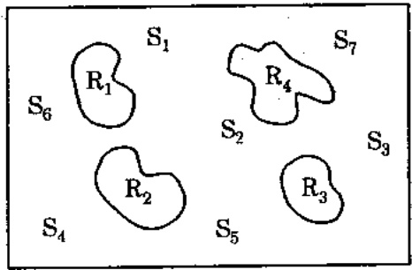

Hình 6.3. Quản thể Ps = $\left\{\overline{S}_1, \overline{S}_2, \overline{S}_3, \overline{S}_4\right\}$

và quản thể Pr = $\left\{\overline{R}_1, \overline{R}_2, \overline{R}_3, \overline{R}_4\right\}$

<!-- page: 72 -->

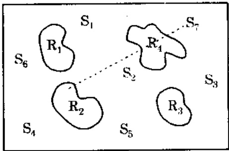

Hình 6.4. Lượng giá của điểm $\overline{S}$ không khả thi.

Một khi đã tìm được $\overline{Z}$ thỏa mân, $eval(\overline{S}) = eval(\overline{Z}) = f(\overline{Z})$. Hơn nửa, nếu $f(\overline{Z})$ tốt hơn $f(\overline{R})$, thì điểm $\overline{Z}$ thay $\overline{R}$ làm điểm tham chiếu mới. $\overline{Z}$ cũng thay $\overline{S}$ với xác suất thay thế $Pr$ cho trước.

GENOCOP III tránh được nhiều bất lợi của những hệ thống khác. Nó chỉ dua ra một ít tham số bổ sung (kích thước quản thể của các điểm tham chiếu, xác suất thay thế). Nó luôn luôn trả về lời giải thỏa mãn. Một không gian tìm kiếm thỏa mãn được tìm bằng cách tạo những tham chiếu từ những điểm tìm kiếm. Lân cận của những điểm tham chiếu tốt thường được khảo sát nhiều hơn. Một số điểm tham chiếu được chuyên vào quản thể các điểm tìm kiếm, ở đó chúng được biến đổi bởi các toán từ chuyên biệt (bảo tồn các ràng buộc tuyến tính). Thực nghiệm cũng chứng tổ GENOCOP III thường hiệu quả hơn các phương pháp khác.

## Chương 7

# BÀI TOÁN VẬN TẢI

Trong chương 6, chúng tôi đã trình bày các cách tiếp cận khác nhau hỗ trợ GA khi xử lý các ràng buộc. Tuy nhiên, với những bài toán đặc biệt (như bài toán vận tải chẳng hạn) nếu biết tận dụng những trị thức về bài toán, ta có thể thực hiện tốt hơn: sử dụng một cấu trúc dữ liệu (tự nhiên) thích hợp hơn (cho bài toán vận tải, một ma trận) và các toán tử di truyền chuyên biệt thao tác trên ma trận. Một tiến trình tiến hóa nhu thế, sẽ là một phương pháp mạnh hơn phương pháp mô tả trong chương trước nhiều. Các chương trình tiến hóa cải đặt các phương pháp xử lý ràng buộc của chương 6 giải bài toán có thể tối uu có ràng buộc tổng quát trong khi chương trình tiến hóa trình bày trong chương 7 này chỉ thích hợp cho bài toán vận tải. Khi trình bày bài toán vận tải, chúng tôi chỉ muốn nhân mạnh rằng trị thức về bài toán có thể giúp ích nhiều cho quá trình giải nó, nghĩa là, với một cấu trúc dữ liệu thích hợp cộng với các phép toán di truyền chuyên biệt ta sẽ có một chương trình tiến hóa tốt. Đây cũng chính là mục đích của cuốn sách.

## 7.1. Bài toán vận tải tuyến tính

Bài toán vận tải là một trong những bài toán tối ưu có ràng buộc đã được nghiên cứu chi tiết trong nhiều công trình. Mục đích là xây dựng một dự án vận tải với chi phí thấp nhất để vận chuyển một loại hàng hóa, từ một số nguồn đến một số đích. Bài toán yêu cầu cho biết khả năng cung ứng tại từng nguồn, nhu cầu của mỗi đích, và chi phí vận chuyển từ mỗi nguồn đến mỗi đích.

<!-- page: 73 -->

Do chỉ có một loại hàng hóa, mỗi đích có thể nhận hàng từ một hay nhiều nguồn. Mục tiêu là tìm số lượng cần chuyên chỗ từ mỗi nguồn đến mỗi đích sao cho tổng chi phí chuyên chỗ là tối thiểu.

Bài toán vận tải là tuyến tính nếu chi phí tỉ lệ với số lượng hàng vận tải; nếu không, nó là phi tuyến.

Giả sử có n nguồn và k đích. Số cung tại nguồn i là sour(i) và số cấu tại đích j là dest(j). Chi phí vận tải một đơn vị hàng giữa nguồn i và đích j là cost(i,j).

Nếu $x_{ij}$ là số lượng hàng được vận tải từ nguồn $i$ đến đích $j$ thì bài toán vận tải đã cho là bài toán tối ưu:

$$
\text {Min} \sum_ {i = 1} ^ {n} \sum_ {j = 1} ^ {k} f _ {i j} (x _ {i j})
$$

$$
\begin{array}{l l} \sum_ {j = 1} ^ {k} x _ {i j} \leq \text {sour} (i), & i = 1, 2, \dots , n \\ \sum_ {i = 1} ^ {n} x _ {i j} \geq \text {dest} (j), & j = 1, 2, \dots , k \\ x _ {i j}, \quad i = 1, 2, \dots , n; & j = 1, 2, \dots , k \end{array}
$$

Tập các ràng buộc thú nhất quy định rằng số lượng hàng được chỗ từ một nguồn không thể vượt quá số cung của nó; tập thứ hai yêu cầu ràng số lượng hàng chỗ đến đích phải thỏa số câu của nó: Nếu $f_{ij}$ ($x_{ij}$) = $cost(ij)^{*}x_{ij}$ với mọi $i, j$, bài toán là tuyến tính.

Bài toán trên bao hàm rằng tổng số cung $\sum_{i=1}^{k} \text{sour}(i)$ ít nhất phải bằng với tổng số câu $\sum_{j=1}^{n} \text{dest}(j)$. Khi tổng số cung bằng tổng số câu, bài toán vận tải gọi là bài toán vận tải cân bằng. Bài toán vận tải cân bằng chỉ khác bài toán vận tải tuyến tính ở chỗ là tất cả các ràng buộc tương ứng là các phương trình; nghĩa là

$$
\sum_ {j = 1} ^ {k} x _ {i j} = \text {sour} (i), \quad i = 1, 2, \dots , n
$$

$$
\sum_ {i = 1} ^ {n} x _ {i j} = d e s t (j), \quad j = 1, 2, \dots , k
$$

Nếu tất cả sour(i) và dest(j) là các số nguyên, một lời giải tối ưu bất kỳ của bài toán vận tải tuyến tính cân bằng cũng là lời giải nguyên, nghĩa là tất cả $x_{ij}$ ($i = 1, 2, 3,..., n$), ($j = 1, 2, 3,..., k$) là những số nguyên. Hơn nữa, số lượng các số nguyên dương $x_{ij}$, tổ đa là $k + n - 1$; trong phần này chúng tôi trình bày bài toán vận tải tuyến tính cân bằng.

Thí dụ 7.1. Giả sử có 3 nguồn và 4 đích, số cung tương ứng là:

$sour(1)=15, sour(2)=25\ \text{va}\ sour(3)=5.$

Số câu tương ứng là:

$dest(1) = 5, dest(2) = 15 dest (3) = 15 \text{ và } dest(4) = 10.$

Chú y là tổng số cung và tổng số câu đều bằng 45.

Chi phí vận chuyển một đơn vị, $cost(i, j)$ ($i = 1, 2, 3$ và $j=1, 2, 3, 4$) được cho trong bảng sau:

Chí phí

| 10 | 0 | 20 | 11 |
| --- | --- | --- | --- |
| 12 | 7 | 9 | 20 |
| 0 | 14 | 16 | 18 |

Lời giải tối ưu được trình bày trong bảng dưới. Tổng chỉ phí là 315. Lời giải gồm các giá trị nguyên của $x_{ij}$.

<!-- page: 74 -->

|  | 5 | 15 | 15 | 10 |
| --- | --- | --- | --- | --- |
| 15 | 0 | 5 | 0 | 10 |
| 25 | 0 | 10 | 15 | 0 |
| 5 | 5 | 0 | 0 | 0 |

## 7.1.1. Thuật giải di truyền cố diện giải bài toán vận tải cân bằng

Khi nói thuật giải di truyền “cổ điển”, chúng tôi muốn nơi đến một thuật giải mà trong đó các nhiễm sắc thể (nghĩa là, cách biểu diễn lời giải) là những chuỗi bit - danh sách các số 0 và 1. Một phương pháp dễ hiểu để định nghĩa một vectơ bit cho 1 lời giải bài toán vận tải là tạo một vectơ $<v_{1}, v_{2}, ..., v_{p}>$ ($p = n * k$), sao cho mỗi thành phần $v_{i}$ ($i = 1, 2, ..., p$), là một vectơ bit $<w_{0}^{i}, ..., w_{s}^{i}>$ và biểu diễn một số nguyên liên quan đến hàng $j$ và cột $m$ trong ma trận phân phối, mà ở đây $j = \lfloor (i-1)/k + 1 \rfloor$ và $m = (i-1) \mod k + 1$. Chiều dài của các vectơ $w$ (tham số $f$) quyết định số nguyên lớn nhất ($2^{s+1}-1$) cần có để biểu diễn một lời giải.

Ta sē tháo luân một cách ngắn gọn về cách biểu diễn này và việc phải thỏa mãn ràng buộc, cũng như về hàm lượng giá và các toán tử di truyền.

Thỏa mãn ràng buộc: Rõ ràng là mỗi vectơ lời giải phải thỏa các ràng buộc sau đây:

$$
\begin{array}{l} \sum_ {i = c k + 1} ^ {c k + k} v _ {i} = s o u r [ c + 1 ], \quad c = 0, 1, 2, \dots , n - 1 \\ \sum_ {j = m, s t e p k} ^ {k n} v _ {j} = d e s t [ m ], \quad m = 1, 2, \dots , k \\ v _ {q} \geq 0, \quad q = 1, 2, \dots , n; \quad j = 1, 2, \dots , k - n \end{array}
$$

Chú ý là ràng buộc cuối cùng luôn được thỏa (ta thông dịch một chuỗi các số 0 và 1 là một số nguyên dương). Hai ràng buộc đầu thể hiện tổng cung và tổng cầu tại mỗi nguồn và mỗi dịch, mặc dù những công thức này không đối xứng.

Hàm lượng giá: Hàm lượng giá đơn giản là tính tổng chi phí vận tải từ các nguồn đến các đích và được tính theo:

$$
\begin{array}{c} e v a l (<   v _ {1}, v _ {2},.., v _ {\mathrm{p}} >) = \sum_ {i = 1} ^ {p} v _ {i}. \cos t [ j ] [ m ] \\ \text {trong do,} j = \lfloor (i - 1) / k + 1 \rfloor \text {va} m = (i - 1) \mod k + 1. \end{array}
$$

Các toán tử di truyền: Không có định nghĩa tự nhiên nào về các thông tin di truyền đối với bài toán vận tải trong biểu diễn như trên. Đột biến thường được định nghĩa là thay đối của một bit trong một vectơ lời giải. Điều này tương ứng với thay đối của một giá trị nguyên $v_i$. Đối với những bài toán của ta, đột biến như vậy lại có thể gây ra một chuỗi những thay đối ở những điểm khác nhau (ít nhất là ba thay đối liên quan) để duy trì các ràng buộc. Chủ ý là ta luôn phải nhớ thay đối đã xảy ra trong cột nào và hàng nào - mắc dù là biểu diễn vectơ nhưng ta suy nghĩ và thực hiện theo cách các hàng và các cột (các nguồn và các đích). Đây là lý do khiến công thức trở nên phúc tạp; dấu hiệu đầu tiên của tính phúc tạp này là mất đi tính đối xứng khi diễn tả các ràng buộc.

Cùng có một số thắc mắc khác đặt ra. Đột biến được hiểu là những thay đổi nhỏ trong vectơ lời giải, nhưng theo những gì ta biết trước đây, chỉ một thay đổi trong một số nguyên lại có thể gây ra ít nhất ba thay đổi khác tại những vị trí thích hợp. Giá sử hai điểm ngẫu nhiên ($v_i$ và $v_m$, với $i < m$) được chọn sao cho chúng thuộc cùng một hàng hay một cột. Ta hãy giả sử ràng $v_i$, $v_j$, $v_k$, $v_m$, ($i < j < k < m$) là những thành phần của vectơ lời giải (được chọn để đột biến)

<!-- page: 75 -->

sao cho $v_{i}$ và $v_{k}$ cũng như $v_{j}$ và $v_{m}$ thuộc một cột, và $v_{t}, v_{j}$ cũng như $v_{k}, v_{m}$ thuộc cùng một hàng.

Tức là, trong biểu diễn ma trận, ta có:

| ... | . | ... | . | ... |
| --- | --- | --- | --- | --- |
| ... | $v_i$ | ... | $v_j$ | ... |
| ... | . | ... | . | ... |
| ... | . | ... | . | ... |
| ... | $v_k$ | ... | $v_m$ | ... |
| ... | . | ... | . | ... |

Bây giờ, ta gặp một khó khăn khi phải xác định thay đổi cần thiết trong vectơ lời giải. Ta nên tăng hay giảm $v_i$? Ta có thể chọn cách đổi nó thành một (thay đổi nhỏ nhất có thể) hay thành một số ngẫu nhiên nào đó trong khoảng $<0, 1, ..., v_i>$. Nếu tăng giá trị $v_i$ theo một hàng số C ta phải giám mỗi giá trị $v_j$ và $v_k$ theo cùng hàng số đó. Điều gì xảy ra nếu $v_j < C$ hoặc $v_k < C$? Ta có thể chọn $C = min(v_i, v_j, v_k)$, nhưng như thế, phần lớn các đột biến sẽ có kết quả không thay đổi gì cả, do xác suất của việc chọn ba phần tử không là 0 có thể gần bằng 0 (nhỏ hơn 1/n đối với các vectơ có kích thước $n^2$).

Như vây phương pháp thay đổi 1 bit làm cho các toán từ đột biến không hiệu quả vì cần những biểu thức phức tạp để kiểm soát hàng hay cột tương ứng của phần tử được chọn.

Tình trạng này còn có thể phúc tạp hơn nếu ta có sửa một nhiễm sắc thể sau khi áp dụng toán từ lai. Phá vỏ một vectơ tại một điểm ngẫu nhiên có thể đưa đến việc một cặp nhiễm sắc thể vi phạm nhiều ràng buộc. Nếu ta cổ hiệu chỉnh những lời giải này để thỏa tất cả các ràng buộc, chúng sẽ mất gần hết những tương đồng với chα me. Hơn nữa, cách làm như vậy không rõ ràng chút nào: nếu một vectơ v ở bên ngoài không gian tìm kiếm, “việc sửa đổi” nó cũng khó như giải bài toán gốc. Ngay cả khi thành công trong việc xây dựng một hệ thống dựa trên các thuật giải sửa chữa, thì hệ thống đó cũng khó mà tổng quát hóa được.

Như vây, biểu diễn vectơ nhị phân như trên không phải là cách thích hợp nhất để định nghĩa những toán từ di truyền trong những bài toán có ràng buộc kiểu này.

## 7.1.2. Kết hợp tri thức của bài toán để biểu diễn lời giải

Liêu có cách nào biểu diễn lời giải mà vân bảo tồn cấu trúc cơ bản của biểu diễn vectơ này khi thực hiện các phép di truyền không ? Ta tin là được, nhưng cần kết hợp tri thức của bài toán vào biểu diễn này.

Trước tiên, chúng tôi mô tả cách tạo một lời giải thỏa tất cả ràng buộc. Ta gọi thủ tục này là khối\_tạo - nó sẽ là thành phần cơ bản của toán từ đột biến khi ta bàn đến các toán từ di truyền của các cấu trúc - hai chiều. Nó tạo ra một ma trận có tối đa $k + n - 1$ phần tử khác 0, sao cho tất cả các ràng buộc được thỏa.

## Thủ tục khởi tạo

Nhập: măng dest[k], sour[n];

Xuất: măng  $(v)_{ij}$  sao cho  $v_{ij} \geq 0$  với mọi i và j

$$
\sum_ {j = 1} ^ {k} v _ {i j} = d e s t [ i ], \quad i = 1, 2, \dots , n
$$

<!-- page: 76 -->

$$
\sum_ {i = 1} ^ {n} v _ {i j} = \text {sour} [ j ], \quad j = 1, 2, \dots , k
$$

nghĩa là tất cả các ràng buộc được thỏa.

khôi\_tạo;

Bất đầu

$L \leftarrow \{1,2,\dots,k*n\}$: là danh sách các điểm chưa được xét;

Lăp

\- chọn một số ngẫu nhiên q trong L;

\- và q được gọi là điểm đã xét

\- (hàng) $i \leftarrow \lfloor (q - 1)/k + 1 \rfloor$

\- (côt) $j \leftarrow (q - 1) \mod k + 1$

\- $val \leftarrow min(sour[i], dest[j])$

\- $v_{ij} \leftarrow val$

\- $sour[i] \leftarrow sour[i] - val$

\- $dest[j] \leftarrow dest[j] - val$

Hết lập nếu (tất cả các điểm trong L đều được thăm)

Kết thúc

Thí dụ 7.2. Với ma trận trong thí dụ 7.1,

nghĩa là:

sour[1] = 15, sour[2] = 25, sour[3] = 5

$$
\text {dest} [ 1 ] = 5, \text {dest} [ 2 ] = 1 5, \text {dest} [ 3 ] = 1 5, \text {dest} [ 4 ] = 1 0
$$

có tất cả 3\*4 =12 số, đều chưa được thăm từ đầu. Chọn số ngẫu nhiên đầu tiên, 10 chẳng hạn. Số này được thông dịch thành (hàng) $i = 3$ và (cột) $j = 2$. val = min (sour[3], dest[2]) = 5, vì thế $v_{32} = 5$. Cũng chú ý rằng sau lần lập thú nhất, sour[3] = 0 và dest[2] = 10.

Ta lặp lại cách tính này với ba số (chưa thăm) ngẫu nhiên, như 8, 5, và 3 (tương ứng với hàng 2 và cột 4, hàng 2 và cột 1, và hàng 1 và cột 3). Ma trận có được $v_{ij}$ (cuối cùng) có nội dung như sau:

|  | 0 | 10 | 0 | 0 |
| --- | --- | --- | --- | --- |
| 0 |  |  | 15 |  |
| 10 | 5 |  |  | 10 |
| 0 |  | 5 |  |  |

Chú ý ràng các giá trị sour[i] và dest[j] là những số có được sau 4 lần lập.

Nếu có thêm chuỗi các số ngẫu nhiên là 1, 11, 4, 12, 7, 6, 9, 2, thì sẽ cho ma trận cuối cùng (với chuỗi các số ngẫu nhiên được chấp nhận <10, 8, 5, 3, 1, 11, 4, 12, 7, 6, 9, 2 >) là:

|  | 0 | 0 | 0 | 0 |
| --- | --- | --- | --- | --- |
| 0 | 0 | 0 | 15 | 0 |
| 0 | 5 | 10 | 0 | 10 |
| 0 | 0 | 5 | 0 | 0 |

Rõ ràng, sau 12 lân lặp tất cả (các bản sao cục bộ của) sour[i] và dest[j] = 0, cũng chú ý ràng, có nhiều chuỗi số mà thủ tục khởi\_tạo có thể tạo ra lời giải tối ưu cho chúng. Thí dụ, lời giải tối ưu (được cho trong thí dụ 7.1) có thể nhận được đối với bất cứ chuỗi nào sau

<!-- page: 77 -->

dây:<7, 9, 4, 2, 6, \*, \*, \*, \*, \*, \* > (trong đó \* biểu thị một số chưa thăm bất kỳ), cũng như đối với nhiều chuỗi khác.

Kỹ thuật này có thể phát sinh một lời giải khả thi chứa tối đa $k+n-1$ phần từ nguyên khác 0. Nó sẽ không phát sinh những lời giải khác, có thể cũng khả thi, nhưng không dùng chung đặc trung này. Thủ tục khởi tạo chắc chắn phải được hiệu chỉnh khi ta định giải bài toán vận tải phi tuyến.

Tri thúc và những đặc trưng lời giải của bài toán cho ta một cơ hội khác để biểu diễn lời giải của bài toán vận tải bằng một vecto. Vectơ lời giải sẽ là một chuỗi các số nguyên phân biệt $k * n$ trong khoảng $<1$, $k * n>$, (theo thủ tục khởi\_tạo) sẽ sinh ra một lời giải khả thi. Nói cách khác, ta sẽ xem vectơ lời giải là một hoán vị của các số, và ta có thể tìm các hoán vị cụ thể tương ứng với lời giải tối ưu.

Ta sē bàn ngắn gọn về những cài đặt của biểu diễn này trong việc phải thỏa ràng buộc, và về hàm lượng giá cũng như các toán tử di truyền.

Thỏa mãn ràng buộc: Bất cứ hoán vị nào của k\*n số phân biệt sẽ sinh ra một lời giải duy nhất thỏa tất cả các ràng buộc, điều này được bảo đảm bởi thủ tục khởi\_tạo.

Hàm lượng giá: Điều này tương đối dễ: hoán vị nào cũng tương ứng với một ma trận duy nhất, như (v\_{ij}) chẳng hạn. Hàm lượng giá là:

$$
\sum_ {i = 1} ^ {k} \sum_ {j = 1} ^ {n} v _ {i j}. \cos t [ i ] [ j ]
$$

Các toán tử di truyền: Cũng rất đề thực hiện.

\- Đảo: nếu $<x_1, x_2, \ldots, x_q>$ ($q = k*n$) là một lời giải thì vectơ đảo của nó $<x_q, x_{q-1}, \ldots, x_l>$ cũng là một lời giải.

\- Đột biến: bất cứ hai phần tử nào của vectơ lời giải $<x_{1}, x_{2}, \ldots, x_{q}>$, $x_{i}$ và $x_{j}$ chẳng hạn, cũng có thể được hoán vị và vectơ kết quả cũng là một lời giải.

\- Lai tạo: hơi phúc tạp hơn một chút. Chú ý rằng một toán tử lai (mù quảng) ngẫu nhiên có thể sinh ra các lời giải không hợp lệ: áp dụng một toán tử lai như thế vào các chuỗi: <1,2,3,4,5,6,|7,8,9,10,11,12> và < 7,3,1,11,4,12,|5,2,10,9,6,8> sẽ sinh ra (ở đây điểm lai tạo ở sau vị trí thứ 6) các lời giải <1,2,3,4,5,6,5,2,10,9,6,8> và < 7,3,1,11,4,12, 7,8,9,10,11,12>. Cả hai đều là những lời giải không hợp lệ.

Như vậy, ta phải dùng một dạng toán từ lai heuristic nào đó. Có một số tương đồng giữa các chuỗi vectơ lời giải này và các chuỗi vectơ lời giải của bài toán người du lịch. Ô đây ta dùng một toán từ lai heuristic, mà khi cho một cặp cha mẹ, sẽ tạo một con hợp lệ theo thủ tục sau đây:

(1) Tạo bản sao của phần tử thú hai trong cặp cha-mệ đã cho ;

(2) Chọn một phần ngẫu nhiên từ phần từ thứ nhất trong cập cha-mệ đó;

(3) Tạo những thay đổi tối thiểu cần thiết ở con để có được lời giải hợp lệ.

Thí dụ, nếu cặp cha-mẹ như thí dụ trên, và phân chọn được là (4,5,6,7), thì con có được là < 3,1,11,4,5,6,7,12,2,10,9,8>.

Dúng như ta mong muốn, con có mối liên hệ cấu trúc với cả cha và mẹ. Rôi vai trò của cặp cha-mệ này có thể được thay đổi khi sinh con thú hai.

Từ nay, ta sẽ gọi chương trình tiến hóa giải bài toán vận tải tuyến tính cân bằng với biểu diễn vectơ nguyên là hệ GENETIC-I.

<!-- page: 78 -->

## 7.1.3. Biểu diễn lời giải bài toán vận tải bằng ma trận

Có lẻ biểu diễn lời giải tự nhiên nhất cho bài toán vận tải là cấu trúc hai chiều. Nói cách khác, ma trận $V = (v_{ij})$ ($1 \leq i \leq k$, $1 \leq j \leq n$) có thể biểu diễn lời giải.

Ta sē bàn về những cài đặt của biểu diễn ma trận đồng thời cũng diễn tả ràng buộc, và về hàm lượng giá cũng như các toán tử di truyền.

Thỏa mãn ràng buộc: Rỗ ràng là mỗi ma trận lời giải $V = (v_{ij})$ có thể thỏa các ràng buộc sau:

$$
\begin{array}{l} \sum_ {j = 1} ^ {n} v _ {i j} = \text {sour} [ i ], \quad i = 1, 2, \dots , k \\ \bullet \quad \sum_ {i = 1} ^ {k} v _ {i j} = \text {dest} [ j ], \quad j = 1, 2, \dots , n \\ v _ {i j} \geq 0, \quad i = 1, 2, \dots , k; \quad j = 1, 2, \dots , n \end{array}
$$

\- Điều này tương tự với tập các ràng buộc trong phương pháp dễ hiểu (phần 7.1.2), nhưng các ràng buộc được diễn tả theo cách dễ dàng và tự nhiên hơn.

Hàm lượng giá: hàm lượng giá biểu thị là hàm mục tiêu thông thường:

$$
e v a l (v _ {i j}) = \sum_ {i = 1} ^ {k} \sum_ {j = 1} ^ {n} v _ {i j}. \cos t [ j ] [ m ]
$$

Công thức này đơn giản hơn nhiều so với phương pháp dễ hiểu và nhanh hơn trong hệ GENETIC-I, mà mỗi chuỗi phải được biến đổi (khởi tạo) thành một ma trận lời giải trước khi lượng giá.

Các toán tử di truyền: ở đây, ta định nghĩa hai toán tử di truyền, đột biến và lai. Thật khó mà định nghĩa một toán tử đảo có ý nghĩa trong trường hợp này.

Dột biến: giả sử ràng $\{i_{1}, i_{2}, ..., i_{p}\}$ là tập con của $\{1, 2, ..., k\}$ và $|j_{1}, j_{2}, ..., j_{q}|$ là tập con của $\{1, 2, ..., n\}$ sao cho $2 \leq p \leq k$, $2 \leq q \leq n$.

Ta hãy biểu thị một cha (mẹ) của đột biến bằng ma trận $(k \times n)$, $V = (v_{ij})$. Rồi tạo một ma trận con $(p \times q)$, $W = (w_{ij})$, từ tất cả các phần tử của ma trận V theo cách sau: một phần tử $v_{ij} \in V$ ở trong W nếu và chỉ nếu $i \in \{i_1, i_2, ..., i_p\}$ và $j \in \{j_1, j_2, ..., j_q\}$ (nếu $i = i_r$ và $j = j_s$, thì phần tử $v_{ij}$ được đặt trong hàng r và cột s của ma trận W).

Bây giờ ta có thể gán các giá trị mới sour W[i] và dest W[j] (1 ≤ i ≤ p, 1 ≤ j ≤ q) cho ma trận W:

$$
\begin{array}{l l} \text {sour} & W [ i ] = \sum_ {j \in \{j _ {1}, j _ {2}, \dots , j _ {q} \}} v _ {i j}, \quad 1 \leq i \leq p, \\ \text {dest} & W [ j ] = \sum_ {i \in \{i _ {1}, i _ {2}, \dots , j _ {p} \}} v _ {i j}, \quad 1 \leq j \leq q. \end{array}
$$

Ta có thể dùng thủ tục khởi tạo (phân 7.1.3) để gán các giá trị mới vào ma trận W sao cho tất cả các ràng buộc sour W[i] và dest W[j] được thỏa. Sau đó, ta thay những phân tử thích hợp của ma trận V bằng các phần tử mới của ma trận W. Bằng cách này , tất cả các ràng buộc toàn cục (sour[i] và dest[j]) được bảo toàn.

Thí dụ sau đây minh họa toán tử đột biến.

Thí dụ 7.3. \`Bài toán vận tải có 4 nguồn và 5 đích với những ràng buộc:

$$
s o u r [ 1 ] = 8, s o u r [ 2 ] = 4, s o u r [ 3 ] = 1 2, s o u r [ 4 ] = 6,
$$

$$
\text {dest} [ 1 ] = 3, \text {dest} [ 2 ] = 5, \text {dest} [ 3 ] = 1 0, \text {dest} [ 4 ] = 7, \text {dest} [ 5 ] = 5.
$$

<!-- page: 79 -->

Giả sử rằng ma trận V sau dây được chọn làm cha(mẹ) cho đột biến:

| 0 | 0 | 5 | 0 | 3 |
| --- | --- | --- | --- | --- |
| 0 | 4 | 0 | 0 | 0 |
| 0 | 0 | 5 | 7 | 0 |
| 3 | 1 | 0 | 0 | 2 |

Chọn (ngẫu nhiên) hai hàng - giả sử là {2,4} - và 3 cột - {2,3,5}. Ma trận con W tương ứng:

| 4 | 0 | 0 |
| --- | --- | --- |
| 1 | 0 | 2 |

Chú ý, sour W[1] = 4, sour W[2] = 3, dest W[1] = 5, dest W[2] = 0, dest W[3] = 2. Sau khởi tạo lại của ma trận W, ma trận có những giá trị sau:

| 2 | 0 | 2 |
| --- | --- | --- |
| 1 | 0 | 2 |

Vì thể, cuối cùng con của ma trận V sau đột biến là:

| 0 | 0 | 5 | 0 | 3 |
| --- | --- | --- | --- | --- |
| 0 | 2 | 0 | 0 | 2 |
| 0 | 0 | 5 | 7 | 0 |
| 3 | 3 | 0 | 0 | 0 |

## LAI TÃO

Giả sử ràng hai ma trận $V_{1} = (v_{ij}^{1})$ và $V_{2} = (v_{ij}^{2})$ được chọn làm cha-mệ để thực hiện lai. Ta mô tả thuật giải được dùng để sinh hai con $V_{3}$ và $V_{4}$.

Tạo hai ma trận tạm: $DIV = (div_{ij})$ và $REM = (rem_{ij})$. Với:

$$
d i v _ {i j} = \left\lfloor (v _ {i j} ^ {1} + v _ {i j} ^ {2}) / 2 \right\rfloor
$$

$$
r e m _ {i j} = (v _ {i j} ^ {1} + v _ {i j} ^ {2}) \bmod 2
$$

Ma trận DIV lưu các giá trị trung bình được làm tròn từ cả cha lần mẹ, ma trận REM theo dõi xem việc làm tròn nào là cần thiết.

Ma trận REM có một số thuộc tính thú vị sau: số các số 1 trong mỗi hàng và mỗi cột bằng nhau. Nói cách khác, các giá trị của sour REM[i] và dest REM[j] là những số nguyên chẩn. Ta dùng thuộc tính này để biến đổi REM thành hai ma trận REM₁ và REM₂ sao cho:

$REM = REM_{1} + REM_{2},$

sour REM1[i] = sour REM2[i] = sour REM[i]/2, i = 1,...,k.

dest REM1[j]= dest REM2[j] = dest REM[j]/2, j=1,..., n.

Rôi sinh ra hai con của  $V_{1}$  và  $V_{2}$ :

$$
V _ {3} = D I V + R E M,
$$

$$
V _ {4} = D I V + R E M _ {2}.
$$

Thí dụ sau đây sẽ minh họa phép lai trên.

<!-- page: 80 -->

Thí dụ 7.4. Lấy lại bài toán trong thí dụ 7.1

Giả sử các ma trận $V_1$ và $V_2$ sau đây đã được chọn làm cha-mệ đề lai tạo:

$V_{1}$

| 1 | 0 | 0 | 7 | 0 |
| --- | --- | --- | --- | --- |
| 0 | 4 | 0 | 0 | 0 |
| 2 | 1 | 4 | 0 | 5 |
| 0 | 0 | 6 | 0 | 0 |

$V_{2}$

| 0 | 0 | 5 | 0 | 3 |
| --- | --- | --- | --- | --- |
| 0 | 4 | 0 | 0 | 0 |
| 0 | 0 | 5 | 7 | 0 |
| 3 | 1 | 0 | 0 | 2 |

Các ma trận DIV và REM là:

DIV

| 0 | 0 | 2 | 3 | 1 |
| --- | --- | --- | --- | --- |
| 0 | 4 | 0 | 0 | 0 |
| 1 | 0 | 4 | 3 | 2 |
| 1 | 0 | 3 | 0 | 1 |

REM

| 1 | 0 | 1 | 1 | 1 |
| --- | --- | --- | --- | --- |
| 0 | 0 | 0 | 0 | 0 |
| 0 | 1 | 1 | 1 | 1 |
| 1 | 1 | 0 | 0 | 0 |

Hai ma trận $REM_{1}$ và $REM_{2}$ là:

$REM_{1}$

| 0 | 0 | 1 | 0 | 1 |
| --- | --- | --- | --- | --- |
| 0 | 0 | 0 | 0 | 0 |
| 0 | 1 | 0 | 1 | 0 |
| 1 | 0 | 0 | 0 | 0 |

$REM_{2}$

| 1 | 0 | 0 | 1 | 0 |
| --- | --- | --- | --- | --- |
| 0 | 0 | 0 | 0 | 0 |
| 0 | 0 | 1 | 0 | 1 |
| 0 | 1 | 0 | 0 | 0 |

Cuối cùng, hai con $V_{3}$ và $V_{4}$ là:

| 0 | 0 | 3 | 3 | 2 |
| --- | --- | --- | --- | --- |
| 0 | 4 | 0 | 0 | 0 |
| 1 | 1 | 4 | 4 | 2 |
| 2 | 0 | 3 | 0 | 1 |

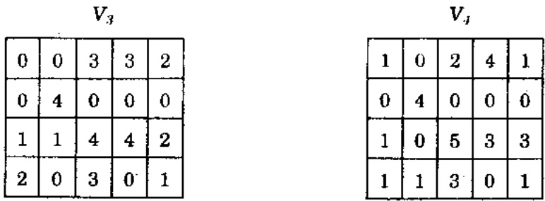

Chương trình tiến hóa này ta gọi là hệ GENETIC-II.

## 7.2. Bài toán vận tải phi tuyến

Phân này, ta bàn về chương trình tiến hóa giải bài toán vận tải phi tuyến cân bằng, theo 5 thành phần của thuật giải di truyền: biểu diễn , khối tạo, lượng giá, các toán tử và các tham số. Hệ thống cũng đặt tên là GENETIC-2 như trong trường hợp tuyến tính.

## 7.2.1. Biểu diễn

Cũng như trường hợp tuyến tính, ta chọn một cấu trúc hai chiều dễ biểu diễn lời giải (một nhiễm sắc thể) của bài toán vận tải: một ma trận $V = (x_{ij})$ ($1 \leq i \leq k$, $1 \leq j \leq n$). Lần này mỗi $x_{ij}$ là một số thực.

## 7.2.2. Khôi tạo

Thủ tục khởi tạo cũng giống như trong trường hợp tuyến tính (phân 7.1.3). Cũng vậy, nó tạo một ma trận có tối đa $k+n-1$ các phần tử khác 0 sao cho các tất cả các ràng buộc đều được thỏa.

## 7.2.3. Lượng giá

Trong trường hợp này ta phải tối ưu hóa chỉ phí, một hàm phi tuyến của các giá trị của ma trận.

<!-- page: 81 -->

## 7.2.4. Các toán tử

Ta định nghĩa hai toán tử di truyền, đột biến và lai số học.

## ĐỘT BIÊN

Có hai loại đột biến được định nghĩa. Loại thứ nhất, đột\_biến-1, giống như toán từ đã được dùng trong trường hợp tuyến tính và dual vào càng nhiều số 0 vào ma trận càng tốt. Loại thứ hai, đột\_biến-2, được hiệu chính để tránh chọn phải các số 0 bằng cách chọn các giá trị trong một khoảng. Toán từ đột\_biến-2 cơ bản cũng như đột\_biến-1 ngoại trừ việc sử dụng một phiên bản được hiệu chỉnh của thủ tục khởi tạo để tính toán lại các ma trận con được chọn.

Trong thủ tục khởi\_tạo ở phần 7.1.3 ta thay dòng:

val $\leftarrow$ min (sour[i], dest [j])

bàng các lệnh:

val $\leftarrow$ min (sour[i], dest [j])

Nếu (i là hàng sẵn có cuối cùng) Or (j là cột sẵn có cuối cùng)
Thì:

val ← val₁

Ngược lại $val \leftarrow$ số thực ngẫu nhiên trong khoảng $<0, val_1>$

Thay đổi này tạo ra các số thực thay vì các số nguyên hoặc số 0, nhưng thủ tục này cần được biến đổi thêm vì hiện tại nó tạo ra ma trận có thể vì phạm các ràng buộc.

Thí dụ, sử dụng lại ma trận ở Thí dụ 7.1, giả sử chuỗi các số được chọn là (3, 6, 12, 8, 10, 1, 2, 4, 9, 11, 7, 5) và số thực đầu tiên được phát sinh cho số 3 (hàng 1 cột 3) là 7.3 (là số thuộc khoáng [0.0, min(sour[1], dest[3])] = [0.0, 15.0]). Số thực ngẫu nhiên thứ hai cho số 6 (hàng 2, cột 2) là 12.1, và các số thực còn lại được phát sinh bằng thủ tục khởi\_tạo mới là: 3.3, 5.0, 1.0, 3.0, 1.9, 1.7, 0.4, 0.3, 7.4, 0.5. Ma trận kết quả là:

|  | 5.0 | 15.0 | 15.0 | 10.0 |
| --- | --- | --- | --- | --- |
| 15.0 | 3.0 | 1.9 | 7.3 | 1.7 |
| 25.0 | 0.5 | 12.1 | 7.4 | 5.0 |
| 5.0 | 0.4 | 1.0 | 0.3 | 3.3 |

Chỉ cần cộng thêm 1.1 vào phần tử $x_{11}$ các ràng buộc có thể được thỏa mãn hoàn toàn. Như vậy, ta cần thêm vào dòng cuối cùng của thuật giải đột\_biến-2 câu:

"Tạo các điều kiện cần thiết"

Điều này bổ sung cho việc thay đổi thủ tục khởi\_tạo.

## LAI TÃO

Bất đầu với hai cha-mệ (các ma trận $U$ và $V$) toán từ lai sẽ sinh ra hai con $X$ và $Y$, trong đó:

$$
\begin{array}{l} X = c _ {1} ^ {*} U + c _ {2} ^ {*} V \text {va:} \\ Y = c _ {1} ^ {*} V + c _ {2} ^ {*} U, \end{array}
$$

(với $c_{1}, c_{2} \geq 0$ và $c_{1} + c_{2} = 1$). Do tập ràng buộc buộc là lôi nên việc thực hiện này bảo đảm ràng cả hai con sinh ra đều thỏa mãn nếu cả cha và mẹ chúng thỏa mãn ràng buộc. Đây là cách giản đơn hóa rất quan trọng của trường hợp tuyến tính mà ở dây có thêm một yêu cầu nửa là giữ lại tất cả các thành phần của ma trận là các số nguyên.

<!-- page: 82 -->

## 7.2.5. Các tham số

Ngoài việc thiết lập các tham số điều khiển như đã sử dụng trong trường hợp bài toán tuyến tính (kích thước quản thể, xác suất đột biến và lai tạo, hạt giống ban đầu (số ngẫu nhiên), vv...) còn cần thêm một số tham số khác nửa. Đó là những hệ số lai tạo, $c_1$ và $c_2$, và $m_1$, một tham số xác định tỉ lệ để đột\_biến-1 được thực hiện trong các lần xảy ra đột biến.

## 7.2.6. Các ví dụ thực nghiệm

Đế có thể hình dung được hiệu quả của phương pháp được đề nghị, chúng tôi chọn minh họa phương pháp với bài toán vận tải 7×7 (bảng 7.2) và thử nghiệm với nhiều hàm mục tiêu khác nhau.

|  | 20 | 20 | 20 | 23 | 26 | 25 | 26 |
| --- | --- | --- | --- | --- | --- | --- | --- |
| 27 | $x_{1}$ | $x_{2}$ | $x_{3}$ | $x_{4}$ | $x_{5}$ | $x_{6}$ | $x_{7}$ |
| 28 | $x_{8}$ | $x_{9}$ | $x_{10}$ | $x_{11}$ | $x_{12}$ | $x_{13}$ | $x_{14}$ |
| 25 | $x_{15}$ | $x_{16}$ | $x_{17}$ | $x_{18}$ | $x_{19}$ | $x_{20}$ | $x_{21}$ |
| 20 | $x_{22}$ | $x_{23}$ | $x_{24}$ | $x_{25}$ | $x_{26}$ | $x_{27}$ | $x_{28}$ |
| 20 | $x_{29}$ | $x_{30}$ | $x_{31}$ | $x_{32}$ | $x_{33}$ | $x_{34}$ | $x_{35}$ |
| 20 | $x_{36}$ | $x_{37}$ | $x_{38}$ | $x_{39}$ | $x_{40}$ | $x_{41}$ | $x_{42}$ |
| 20 | $x_{43}$ | $x_{44}$ | $x_{45}$ | $x_{46}$ | $x_{47}$ | $x_{48}$ | $x_{49}$ |

Bảng 7.2. Bài toán vận tải 7×7.

Bài toán là:

$$
\text {Min} f (x) = f (x _ {1}, \dots , x _ {4 9}),
$$

Thỏa 14 phương trình (với 13 phương trình độc lập) sau:

$$
x _ {1} + x _ {2} + x _ {3} + x _ {4} + x _ {5} + x _ {6} + x _ {7} = 2 7
$$

$$
x _ {8} + x _ {9} + x _ {1 0} + x _ {1 1} + x _ {1 2} + x _ {1 3} + x _ {1 4} = 2 8
$$

$$
x _ {1 5} + x _ {1 6} + x _ {1 7} + x _ {1 8} + x _ {1 9} + x _ {2 0} + x _ {2 1} = 2 5
$$

$$
x _ {2 2} + x _ {2 3} + x _ {2 4} + x _ {2 5} + x _ {2 6} + x _ {2 7} + x _ {2 8} = 2 0
$$

$$
x _ {2 9} + x _ {3 0} + x _ {3 1} + x _ {3 2} + x _ {3 3} + x _ {3 4} + x _ {3 5} = 2 0
$$

$$
x _ {3 6} + x _ {3 7} + x _ {3 8} + x _ {3 9} + x _ {4 0} + x _ {4 1} + x _ {4 2} = 2 0
$$

$$
x _ {4 3} + x _ {4 4} + x _ {4 5} + x _ {4 6} + x _ {4 7} + x _ {4 8} + x _ {4 9} = 2 0
$$

$$
x _ {1} + x _ {8} + x _ {1 5} + x _ {2 2} + x _ {2 9} + x _ {3 6} + x _ {4 8} = 2 0
$$

$$
x _ {2} + x _ {9} + x _ {1 6} + x _ {2 3} + x _ {3 0} + x _ {3 7} + x _ {4 4} = 2 0
$$

$$
x _ {3} + x _ {1 0} + x _ {1 7} + x _ {2 4} + x _ {3 1} + x _ {3 8} + x _ {4 5} = 2 0
$$

$$
x _ {4} + x _ {1 1} + x _ {1 8} + x _ {2 5} + x _ {3 2} + x _ {3 9} + x _ {4 6} = 2 3
$$

$$
x _ {5} + x _ {1 2} + x _ {1 9} + x _ {2 6} + x _ {3 3} + x _ {4 0} + x _ {4 7} = 2 6
$$

$$
x _ {6} + x _ {1 3} + x _ {2 0} + x _ {2 7} + x _ {3 4} + x _ {4 1} + x _ {4 8} = 2 5
$$

$$
x _ {7} + x _ {1 4} + x _ {2 1} + x _ {2 8} + x _ {3 5} + x _ {4 2} + x _ {4 9} = 2 6
$$

Cách ứng xử của các thuật giải tối ưu phi tuyến tùy thuộc chặt chẽ vào dạng của hàm mục tiêu. Những kỹ thuật giải khác nhau rõ ràng sẽ có những đáp ứng khác nhau.

<!-- page: 83 -->

Vì mục đích thử nghiệm, ta đã chọn một lớp ngẫu nhiên các hàm mục tiêu mạnh thành các hàm sẽ gặp trong các bài toán OR (hàm thực hành), những bài toán này thường được minh hoạ trong các sách về tối uu (hàm hợp lý) và những bài toán thường gặp hơn trong các trường hợp thử nghiệm khó của các kỹ thuật tối uu hóa (hàm khác). Tóm lại, chúng có thể được mô tả như sau:

## • Hàm thực hành

Các hàm chi phí tuyến tính từng khúc thường xuất hiện trong thực hành vì những hạn chế về mặt dữ liệu hay vì những thực hiện phương tiện với những lãnh vực áp dụng những chi phí khác nhau, chúng thường là hàm không trơn và vì thể đạo hàm chắc chắn không liên tục. Chúng thường gây khó khăn cho những phương pháp dựa trên gradient mặc dù có thể chuyển chúng thành các hàm khả vi. Thí dụ : A(x) và B(x).

\- Hàm hợp lý

Đây là những hàm trơn.

• Các hàm khác

Những hàm này tiêu biểu có nhiều vùng trùng (hoặc nhiều đình) với nhiều tối ưu cục bộ gây rất nhiều khó khăn cho các phương pháp gradient. Chứng được dùng cho những thử nghiệm nghiệm khác để đánh giá các thuật giải tối ưu và ta hy vọng chúng ít xuất hiện trong thực tế. Thí dụ E(x) và F(x).

Dưới đây hai thí dụ diễn hình, từ mỗi nhóm hàm mục tiêu sử dụng trong các thử nghiệm. Chúng là những hàm riêng biệt của những thành phần thuộc vectơ lời giải không có các số hạng lai. Những phiên bản liên tục hóa của các đồ thị được trình bày trong hình 7.3.

Chi phí cung của hàm mục tiêu A (tham số =10) Chi phí cung của hàm mục tiêu B (tham số =5)

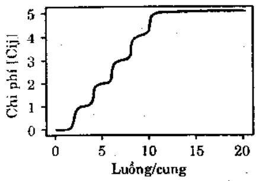

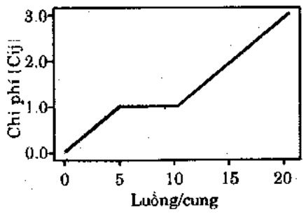

Chi phí cung của hàm mục tiêu

Chi phí cung của hàm mục tiêu D
(tham số = 1)

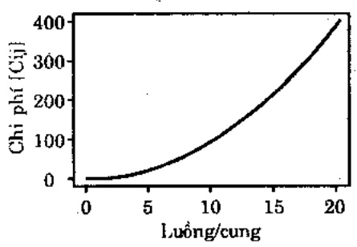

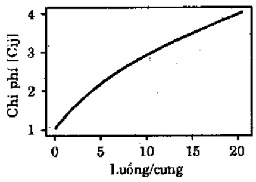

Chi phí cung của hàm mục tiêu F

Chi phí cung của hàm mục tiêu E

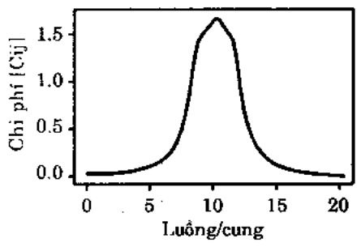

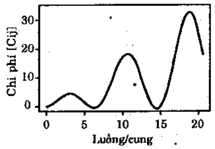

Hình 7.3. Sáu hàm thử nghiệm A - F

<!-- page: 84 -->

$$
- \text {Hàm} A (x) = \left\{ \begin{array}{c c c} 0, & \mathrm{néu} & 0 <   \mathrm{x} \leq \mathrm{S} \\ c _ {i j}, & \mathrm{néu} & \mathrm{S} <   \mathrm{x} \leq 2 \mathrm{S} \\ 2 c _ {i j}, & \mathrm{néu} & 2 \mathrm{S} <   \mathrm{x} \leq 3 \mathrm{S} \\ 3 c _ {i j}, & \mathrm{néu} & 3 S <   \mathrm{x} \leq 4 \mathrm{S} \\ 4 c _ {i j}, & \mathrm{néu} & 4 S <   \mathrm{x} \leq 5 \mathrm{S} \\ 5 c _ {i j}, & \mathrm{néu} & 5 S <   \mathrm{x} \end{array} \right.
$$

trong đó, S nhỏ hơn giá trị x cụ thể.

$$
- \text {Hàm} B (x) = \left\{ \begin{array}{c c c} \mathrm{c} _ {\mathrm{ij}} \frac {\mathrm{x}}{\mathrm{S}}, & \mathrm{n} \acute {\mathrm{e}} \mathrm{u} & 0 <   \mathrm{x} \leq \mathrm{S} \\ \mathrm{c} _ {\mathrm{ij}}, & \mathrm{n} \acute {\mathrm{e}} \mathrm{u} & \mathrm{S} <   \mathrm{x} \leq 2 \mathrm{S} \\ \mathrm{c} _ {\mathrm{ij}} (1 + \frac {\mathrm{x} - 2 \mathrm{S}}{\mathrm{S}}), & \mathrm{n} \acute {\mathrm{e}} \mathrm{u} & 2 \mathrm{S} <   \mathrm{x} \end{array} \right.
$$

trong đó, S là bậc của giá trị x cụ thể.

$$
- \text {Hàm} C (\mathbf {x}) = c _ {\mathrm{ij}} \mathbf {x} ^ {2}
$$

$$
- \text {Hàm} D (x) = c _ {i j} \sqrt {x}
$$

$$
- \text {Hàm} E (x) = c _ {i j} (\frac {1}{1 + (x - 2 S) ^ {2}} + \frac {1}{1 + (x - \frac {9}{4} S) ^ {2}} + \frac {1}{1 + (x - \frac {7}{4} S) ^ {2}})
$$

trong đó, S là bậc của giá trị x cụ thể.

$$
- \text {Hàm} F (x) = c _ {i j} x (\sin (x \frac {5 \pi}{4 S}) + 1)
$$

Trong đó, S là bậc của giá trị x cụ thể.

Hàm mục tiêu của bài toán vận tải thuộc dạng $\sum_{ij} f(x_{ij})$

trong đó, $f(x)$ là một trong 6 hàm trên, các tham số $c_{ij}$ nhận được từ ma trận tham số (xem hình 7.4), và $S$ nhận được từ các bài toán được thử nghiệm.

Đế tính đạo hàm S cần lượng giá một giá trị x đặc biệt; điều này được thực hiện bởi các lần chạy đầu tiên để lượng giá số lượng và tâm quan trọng của các  $x_{ij}$  khác 0. Theo cách này, ta tính được lường trung bình trên mỗi cung và tìm ra một giá trị của S. Đối với hàm A ta dùng S = 2 và dùng S = 5 cho B, E, F.

Chú ý ràng hàm mục tiêu trên mỗi cung đều giống nhau, vì vậy một ma trận chi phí được sử dụng để cho biết thay đổi giữa các cung. Ma trận dạng $c_{ij}$ có nhiệm vụ định tỉ lệ dạng hàm cơ bản, như vậy cung cấp 'một độ' thay đổi.

## 7.2.7. Thử nghiệm và kết quả

Khi thử nghiệm thuật giải GENETIC-2 trên bài toán vận tải tuyến tính (phân 7.1) ta có thể so sánh lời giải của nó với lời giải tối uu đã biết tìm được bằng các thuật giải chuẩn (như phương pháp đơn hình chẳng hạn). Nhu vậy ta có thể xác định hiệu quả của thuật giải di truyền. Khi ta thực nghiệm với các hàm mục tiêu phi tuyến, có thể không biết được tối uu chính xác. Việc thử nghiệm chỉ còn là so sánh các kết quả với kết quả của những phương pháp lời giải phi tuyến khác mà có thể chính chúng đã hội tụ vào một tối uu cục bộ.

Số nguồn: 7

Số đích : 7

Các luống nguồn: 27, 28, 25, 20, 20, 20, 20

Các luồng đích: 20, 20, 20, 23, 26, 25, 26

<!-- page: 85 -->

Ma trận tham số cung (Nguồn theo đích)

| 0 | 21 | 50 | 62 | 93 | 77 | 1000 |
| --- | --- | --- | --- | --- | --- | --- |
| 21 | 0 | 17 | 54 | 67 | 1000 | 48 |
| 50 | 17 | 0 | 60 | 98 | 67 | 25 |
| 62 | 54 | 60 | 0 | 27 | 1000 | 38 |
| 93 | 67 | 98 | 27 | 0 | 47 | 42 |
| 77 | 1000 | 67 | 1000 | 47 | 0 | 35 |
| 1000 | 48 | 25 | 38 | 42 | 35 | 0 |

## Hình 7.4. Mô tả bài toán thí dụ.

Như thường lệ, ta so sánh phương pháp thuật giải GENETIC-2 với hệ GAMS tiêu biểu của phương pháp chuẩn. Hệ GAMS này, chính là cài đặt phương pháp gradient, có thể khó hoặc không giải nổi một số bài toán mà ta thử nghiệm. Trong những trường hợp này, có thể tạo một số hiệu chỉnh cho các hàm mục tiêu để ít nhất phương pháp này cũng tìm được một lời giải gần đúng.

Lúc này, mục tiêu của bài toán vận tải có dạng

$$
\sum_ {i j} f (x _ {i j})
$$

trong đó, $f(x)$ là một trong 6 hàm trên được chọn, các tham số $c_{ij}$ nhận được từ ma trận tham số và $S$ là từ các thuộc tính của bài toán được thử nghiệm. $S$ được tính gần đúng từ luồng cung trung bình không là 0, được xác định từ một số lần chạy lúc đầu để bảo đảm các luồng xuất hiện trong phần thích hợp của hàm mục tiêu.

Ở một khóa cạnh nào đó, các hàm mục tiêu được câu trúc ngẫu nhiên hoàn toàn thích hợp để dùng trên mỗi cung. Hàm mục tiêu của ta được cho là để minh họa thuật giải đối với nhiều loại bài toán và câu hỏi rút xuống là có bao nhiêu biến đối cần thiết giữa các cung cho một dạng hàm cụ thể. Khi hàm giống hết nhau trên mỗi cung, bài toán có thể có nhiều lời giải với cùng chi phí, giảm thông tin nhận được khi phân tích thuật giải.

Trong các thử nghiệm của ta, một ma trận - chỉ phí được sử dụng để cung cấp biến đổi giữa các cung. Ma trận cung cấp các $c_{ij}$ có nhiệm vụ định tỉ lệ dạng hàm cơ bản, như vậy cung cấp 'một độ' thay đổi. Thêm ma trận (cung cấp nhiều độ thay đổi) là không cần thiết.

Đối với các hàm C, E, và F có thể áp dụng GAMS: dùng các hàm phi tuyến cài sẵn. Do yêu cầu lượng giá gradient của các hàm mục tiêu, GAMS không thể xử lý các hàm A, B, và D một cách trực tiếp. Trong trường hợp của A và B, không thể xây dựng công thức cho biểu thức trong GAMS, trong khi trường hợp của D (hàm rút căn bậc hai) lại có khó khăn trong việc đo các gradient gần 0. Vì vậy, có những hiệu chỉnh sau đây cho bài toán đối với các lần chạy GAMS,

## - Hàm A

Các hàm arctan riêng biệt được sử dụng để tính gần đúng mỗi bước trong 5 bước sau đây. Tham số A, P$_{A}$ được dùng để điều khiển độ 'khít khảo' của thích nghi. Chi phí trên cung [i, j] là:

<!-- page: 86 -->

$$
c _ {i j} \cdot \left( \begin{array}{l} \arctan (P _ {A} (x _ {i j} - S)) / \pi + \frac {1}{2} + \\ \arctan (P _ {A} (x _ {i j} - 2 S)) / \pi + \frac {1}{2} + \\ \arctan (P _ {A} (x _ {i j} - 3 S)) / \pi + \frac {1}{2} + \\ \arctan (P _ {A} (x _ {i j} - 4 S)) / \pi + \frac {1}{2} + \\ \arctan (P _ {A} (x _ {i j} - 5 S)) / \pi + \frac {1}{2} \end{array} \right)
$$

• Hàm B

Hàm arctan lại được sử dụng, lần này để tính gần đúng ba gradient. Một tham số P$_{b}$ được sử dụng để điều khiển độ khít khao của thích nghi. Chi phí trên cung [i,j] là:

$$
c _ {i j}. \left( \begin{array}{c} (\frac {x _ {i j}}{S}). (\arctan (P _ {B} x _ {i j}) / \pi + \frac {1}{2}) + \\ (1 - \frac {x _ {i j}}{S}). (\arctan (P _ {B} x _ {i j}) / \pi + \frac {1}{2}) + \\ (\frac {x _ {i j}}{S} - 2). (\arctan (P _ {B} x _ {i j}) / \pi + \frac {1}{2}) + \end{array} \right)
$$

• Hàm D

Đế tránh những vấn đề về gradient tại/gân 0, hàm D được đối thành:

$$
D ^ {\prime} (x) = D (x + \varepsilon)
$$

Cũng như trong trường hợp tuyến tính, đối với những bài toán nhiều lần chạy GAMS được tạo với các giá trị khác nhau của tham số hiệu chỉnh và kết quả tốt nhất được chọn. Các giá trị tốt nhất cho ba tham số tìm được là: $P_A$ giữa 1 và 20, $P_B$ rất lớn (thí dụ 1000), và $\varepsilon$ (cho hàm D) giữa 1 và 7. Các giá trị kết quả cuối cùng luôn luôn được tính sau khi tối ưu hóa bằng hàm không được hiệu chỉnh, thay vì hàm hiệu chỉnh.

Đối với tập thử nghiệm chính, 5 ma trận vận tải 10×10 được dùng cho mỗi hàm. Chứng được xây dựng từ một tập các giá trị độc lập được phân phối đều $c_{ij}$ và các vectơ nguồn và đích được chọn ngẫu nhiên với toàn luồng gồm 100 đơn vị. Mỗi tổ hợp hàm - ma trận chạy với 5 lần, sử dụng các hạt giống khởi đầu là số ngẫu nhiên cho thuật giải di truyền. Một lần chạy 10000 thể hệ.

S được cho giá trị bằng 2 đối với hàm A, nhưng bằng 5 cho các hàm B, E và F.

Dùng những bài toán lớn hơn nhiều để so sánh hệ thống di truyền với những phương pháp giải theo kiểu qui hoạch phi tuyến có lẻ chỉ có giá trị hạn chế. Kết quả của 10 × 10 lần chạy cho thấy khuynh hướng rơi vào tối ưu cục bộ (không toàn cục) của GAMS (và có thể nói, cả những hệ thống tương tự). Bỏ qua thời gian dùng để lượng giá hàm mục tiêu và sử dụng số lời giải được thử nghiệm làm mức đo thời gian thì cũng thấy rõ là những kỹ thuật qui hoạch phi tuyến chuẩn sẽ luôn ‘chấm dứt’ nhanh hơn các hệ thống tiến hóa. Điều này là do chúng chỉ khai thác tiêu biểu một đường dẫn đặc biệt bên trong vùng tối ưu cục bộ hiện hành. Chúng sẽ làm tốt chỉ khi tối ưu cục bộ tương đối tốt.

Một tập các tham số được chọn cho GENETIC-2 sau khi đã có kinh nghiệm với các bài toán tuyến tính và trên cơ sở những lần chạy thử với các bài toán phi tuyến. Kích thước quản thể giữ nguyên là 40. Tỉ lệ đột biến là $p_m = 20\%$ với tỉ lệ đột\_biến-1 là 50% và tỉ lệ lai $p_c = 55\%$. Các tỉ lệ lai là $c_1 = .35$ và $c_2 = .65$.

Có về là tỉ lệ đột biến được chọn quá cao và tỉ lệ lai quá thấp so với các thuật giải di truyền cổ điện. Nhung các toán tử lai khác với các toán tử cổ điện, vì (1) ta chọn cha-mệ cho đột biến và lai, nghĩa là, toàn bộ cấu trúc (trái với các bit đơn) trải qua đột biến, và (2) đột\_biến-1 tạo một con 'dấy' cha-mệ đến bề mặt của không gian lời

<!-- page: 87 -->

| 15.00 | 6.00 | 0.00 | 4.00 | 0.00 | 0.00 | 0.00 |
| --- | --- | --- | --- | --- | --- | --- |
| 0.00 | 14.00 | 0.00 | 14.00 | 0.00 | 0.00 | 0.00 |
| 0.00 | 0.00 | 20.00 | 0.00 | 0.00 | 0.00 | 3.00 |
| 5.00 | 0.00 | 0.00 | 3.00 | 6.00 | 0.00 | 6.00 |
| 0.00 | 0.00 | 0.00 | 0.00 | 20.00 | 0.00 | 0.00 |
| 0.00 | 0.00 | 0.00 | 0.00 | 0.00 | 20.00 | 0.00 |
| 0.00 | 0.00 | 0.00 | 0.00 | 0.00 | 5.00 | 15.00 |

$p_{c}=0\%, p_{m}=25\%, \text{ham A, chi phí 45.8}$

$p_{r}=0\%, p_{m}=25\%, \text{hàm F, chi phí 178.7}$

giải, trong khi lai và đột\_biến-2 'dây' con vào tâm của không gian lời giải.

Việc sử dụng các tỉ lệ đột biến cao cũng có thể gọi ý ràng thuật giải gần như là tìm kiếm ngẫu nhiên. Nhưng, thuật giải tìm kiếm ngẫu nhiên (tí lệ lai tạo 0%) thực hiện rất tối so với thuật giải đã sử dụng ở đây. Đề chủng minh điều này, ta lập bảng dưới đây (bàng 7.3) một số kết quả tiêu biểu cho những giá trị khác nhau của các tham số $p_m$ và $p_c$ bằng các hàm A và F và cho bài toán vận tải 7×7 cụ thể. Các giá trị được cho là chi phí tối thiểu trung bình nhận được trong 5 lần chạy với các hạt giống khác nhau trong 10000 thể hệ.

<table><tr><td>Hàm</td><td colspan="3"> $p_c = 0\%$   $p_c = 25\%$   $p_c = 5\%$  $p_m = 25\%$   $p_m = 0\%$   $p_m = 20\%$ </td></tr><tr><td>A</td><td>45.8</td><td>181.0</td><td>0.0</td></tr><tr><td>F</td><td>187.7</td><td>189.6</td><td>110.9</td></tr></table>

Bảng 7.3. các kết quả cho những giá trị khác nhau của $p_c$ và $p_m$

Bài toán vận tải 7×7 đã dùng được cho trong hình 7.4; các lời giải tìm được bằng thuật giải GENETIC-2 đối với các giá trị khác của các tham số $p_c$ và $p_m$ có trong hình 7.5.

20.00 0.00 0.00 1.00 2.00 3.00 4.00
0.00 20.00 1.00 2.00 2.00 2.00 1.00
0.00 0.00 19.00 0.00 2.00 1.00 3.00
0.00 0.00 0.00 20.00 0.00 0.00 0.00
8.00 0.00 0.00 0.00 20.00 0.00 6.00
8.00 0.00 8.00 8.00 8.00 20.00 8.50
8.00 8.50 8.50 8.50 8.50 8.50

<table><tr><td colspan="7"> $p_r = 0\%$ ,  $p_m = 25\%$ , hàm A, chi phí 181.2</td><td colspan="7"> $p_c = 25\%$ ,  $p_m = 0\%$ , hàm F, chi phí 189.8</td></tr><tr><td>18.25</td><td>0.00</td><td>0.11</td><td>1.81</td><td>3.30</td><td>3.53</td><td>0.00</td><td>20.00</td><td>0.25</td><td>0.00</td><td>0.75</td><td>0.00</td><td>6.00</td><td>0.00</td></tr><tr><td>0.00</td><td>18.21</td><td>3.94</td><td>3.05</td><td>0.00</td><td>1.97</td><td>0.82</td><td>0.00</td><td>5.75</td><td>0.00</td><td>12.75</td><td>0.00</td><td>0.00</td><td>0.00</td></tr><tr><td>1.75</td><td>1.75</td><td>13.24</td><td>1.46</td><td>1.46</td><td>1.48</td><td>3.83</td><td>0.00</td><td>0.00</td><td>20.00</td><td>0.00</td><td>0.00</td><td>0.00</td><td>1.00</td></tr><tr><td>0.00</td><td>0.00</td><td>1.91</td><td>14.37</td><td>1.18</td><td>0.35</td><td>1.69</td><td>0.00</td><td>14.00</td><td>0.00</td><td>0.00</td><td>6.00</td><td>0.00</td><td>0.00</td></tr><tr><td>0.00</td><td>0.00</td><td>0.71</td><td>0.97</td><td>19.10</td><td>0.21</td><td>0.00</td><td>0.00</td><td>0.00</td><td>0.00</td><td>0.01</td><td>20.00</td><td>0.00</td><td>0.00</td></tr><tr><td>0.00</td><td>0.00</td><td>0.51</td><td>0.71</td><td>1.96</td><td>17.20</td><td>0.00</td><td>0.00</td><td>0.00</td><td>0.00</td><td>0.00</td><td>0.00</td><td>14.25</td><td>5.25</td></tr><tr><td>0.00</td><td>0.00</td><td>0.05</td><td>0.14</td><td>0.00</td><td>0.16</td><td>19.65</td><td>0.00</td><td>0.00</td><td>0.00</td><td>0.00</td><td>0.00</td><td>5.20</td><td>13.20</td></tr></table>

Hình 7.4. Các lời giải tìm được bằng thuật giải GENETIC-2 đối với các giá trị khác của các tham số $p_c$ và $p_m$.

Một so sánh tiêu biểu về tối ưu giữa GENETIC-2 (tính trung bình trên 5 hạt giống) và GAMS được trình bày trong bảng 7.5 của một bài toán 10×10; Hình 7.6 mô tả điều này.

Hình 7.7 trình bày các kết quả của cả 5 bài toán được xét. Đối với lớp các bài toán 'thực hành', A và B, trung bình thì GENETIC-2 tốt hơn GAMS 24.5% trong trường hợp A và 11.5% trong trường hợp B. Đối với các hàm 'hợp lý' các kết quả lại khác. Trong trường hợp C (hàm bình phương) hệ thống di truyền thực hiện độ hơn 7.5% trong khi trong trường hợp D (hàm căn bậc hai), hệ thống di truyền trung bình tốt hơn 2.0%. Đối với những hàm 'khác', E và F, hệ thống di truyền thống trị; nó đưa đến những cải thiện 33.0% và 54.5% hơn hẩn GAMS tính trung bình trên 5 bài toán.

## 7.2.8. Kết luận

Mục đích của ta là khám phá các phản ứng của một loại thuật giải di truyền đối với những bài toán nhiều ràng buộc và nhiều hàm mục tiêu phi tuyến. Bài toán vận tải được chọn để nghiên cứu vì nó

<!-- page: 88 -->

cung cấp một tập lời giải lời, tương đối đơn giản. Điều này giúp dễ dàng hơn trong việc duy trì tính thỏa mãn của các lời giải. Như vậy ta có thể khảo sát tác động chỉ của hàm mục tiêu trên các phản ứng của thuật giải.

| Hàm | GAMS | GENETIC -2 | % sai bieț |
| --- | --- | --- | --- |
| A | 281.0 | 202.0 | -28.1 |
| B | 180.8 | 163.0 | -9.8 |
| C | 4402.0 | 4556.2 | +3.5 |
| D | 408.4 | 391.1 | -4.2 |
| E | 145.1 | 79.2 | -45.4 |
| F | 1200.8 | 201.9 | -83.2 |

Bảng 7.5. So sánh giữa GAMS và GENETIC-2.

Số nguồn: 10

Số đích: 10

Các luồng nguồn: 8, 8, 2, 26, 12, 1, 6, 18, 18, 1,

Các luồng đích: 19, 2, 33, 5, 11, 11, 2, 14, 2, 1

Ma trận tham số cung (nguồn theo đích)

| 15 | 3 | 23 | 1 | 19 | 14 | 6 | 16 | 41 | 33 |
| --- | --- | --- | --- | --- | --- | --- | --- | --- | --- |
| 13 | 17 | 30 | 36 | 20 | 17 | 26 | 19 | 3 | 33 |
| 37 | 17 | 30 | 5 | 48 | 27 | 8 | 25 | 36 | 21 |
| 13 | 13 | 31 | 7 | 35 | 11 | 20 | 41 | 34 | 3 |
| 31 | 24 | 8 | 30 | 28 | 33 | 2 | 8 | 1 | 8 |
| 32 | 36 | 12 | 9 | 18 | 1 | 44 | 49 | 11 | 11 |
| 49 | 6 | 17 | 0 | 42 | 45 | 22 | 9 | 10 | 47 |
| 2 | 21 | 18 | 40 | 47 | 27 | 27 | 49 | 19 | 42 |
| 13 | 16 | 25 | 21 | 19 | 0 | 32 | 20 | 32 | 35 |
| 23 | 42 | 2 | 0 | 9 | 30 | 5 | 29 | 31 | 29 |

Hình 7.6. Mô tả bài toán thí dụ.

Các chi phí tìm được qua hàm A

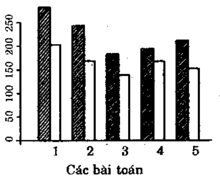

Các chi phí tìm được qua hàm B

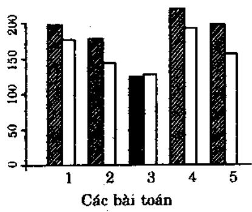

<!-- page: 89 -->

Các chỉ phí tìm được qua hàm C

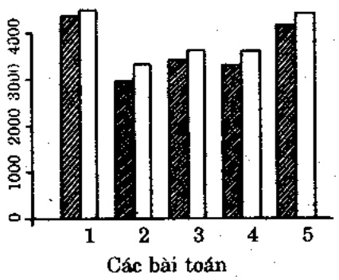

Các chi phí tìm được qua hàm E

Các chi phí tìm được qua hàm D

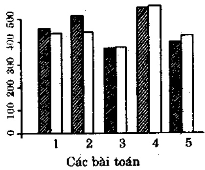

Các chi phí tìm được qua hàm F

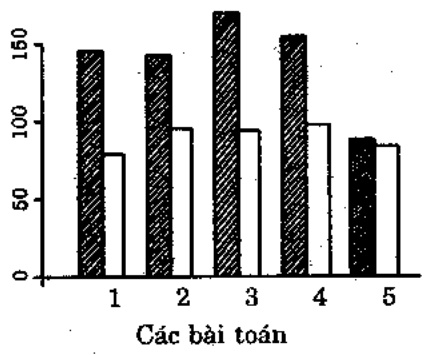

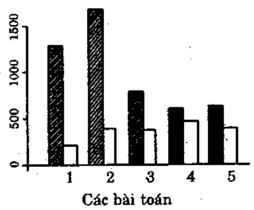

Hình 7.7. Các kết quả. Gạch chéo: GAMS. Trơn: GENETIC-2 trung bình

Các kết quả trên cho thấy hiệu quả của phương pháp di truyền trong việc tìm kiếm tối ưu toàn cục của những bài toán khó, mặc dù GAMS thực hiện tốt trên các hàm trơn, đơn điều, 'hop lý'. Các kỹ thuật được điều khiển bởi gradient thích hợp nhất cho các tỉnh hướng này. Đối với hàm C, GAMS tìm được những lời giải tốt hơn nhanh hơn GENETIC-2 nhiều.

Với các bài toán 'thực hành', các kỹ thuật gradient gặp khó khăn 'chỉ thấy gần' các vùng mối của các chi phí tốt hơn. Thuật giải di truyền, với cách tiếp cận toàn cục hơn, có thể sẵn sàng chuyển đến những vùng mới do đó phát sinh nhiều lời giải tốt hơn nhiều.

Những bài toán 'khác', mặc dù chúng trơn, nhưng có các tỉnh năng câu trúc quan trọng được thiết kế gây khó khăn thực sự cho những phương pháp gradient. GENETIC-2 ở đây xuất sắc hơn GAMS, thâm chí còn nhiều hơn trong các trường hợp 'thực hành'.

Việc so sánh GENOCOP (chuông 6) với GENETIC-2 cũng thú vị (xem bằng 7.5). Nói chung, kết quả của chúng rất giống nhau nhưng lại cần chú ý ràng, phương pháp ma trận được thiết kế theo bài toán đặc tả (vận tải), trong khi GENOCOP độc lập với bài toán và hoạt động không có một tri thức miền được mã hóa cũng. Nói cách khác, trong khi ta có thể mong đợi GENOCOP thực hiện cũng tốt như thể đối với các bài toán ràng buộc khác, thì GENETIC-2 không thể nào sử dụng được.

| Hàm | GENETIC II | GENOCOP | % sai bieț |
| --- | --- | --- | --- |
| A | 00.00 | 24.15 |  |
| B | 203.81 | 205.60 | 0.87 |
| C | 2564.23 | 2571.04 | 0.26 |
| D | 480.16 | 480.16 | 0.00 |
| E | 204.73 | 204.82 | 0.04 |
| F | 110.94 | 119.61 | 7.24 |

Bàng 7.5. GENETIC-2 đối với GENOCOP : các kết quả của bài toán 7x7 với các hàm chi phí vận tải A-F và ma trận chỉ phí đã cho trong hình 7.3

<!-- page: 90 -->

Khi so sánh cả 3 hệ thống (GAMS, GENOCOP, GENETIC-2) cần lưu ý ràng hai hệ thống GAMS và GENOCOP độc lập bài toán: chúng có khả năng tối ưu hóa bất cứ hàm nào có liên quan đến tập các ràng buộc tuyến tính. Hệ thống thứ ba GENETIC-2 chỉ được thiết kế cho các bài toán vận tải; các ràng buộc đặc biệt được kết hợp vào các cấu trúc dữ liệu ma trận và các toán từ “di truyền” đặc biệt.

GENETIC-2 được thiết kế đặc biệt cho các bài toán vận tải nhưng có một đặc trưng quan trọng là nó xử lý bất cứ loại hàm chi phí nào (không cần phải liên tục). Cũng có thể hiệu chính nó để xử lý nhiều bài toán nghiên cứu những toán từ giống nhau như một số bài toán lập thời khóa biểu. Đây có về là một hướng nghiên cứu húa hạn đưa đến một kỹ thuật chung để giải những bài toán tối ưu hóa có ràng buộc dựa trên ma trận.

Phân 3

## tóJuu tóHOP

<!-- page: 91 -->

## Chương 8

# BÀI TOÁN NGƯỜI DU LỊCH

Trong các chương tiếp theo, chúng tôi sẽ trình bày các chương trình tiến hóa được thiết kế cho những ứng dụng đặc hiệu (về đồ thị, phân hoạch, lập lịch). Bài toán người du lịch (TSP - Traveling Salesman Problem) chỉ là một trong những ứng dụng đó; nhưng ta coi nó là một bài toán đặc biệt và dành hẩn một chương để bàn về nó. Lý do vì sao?

Có rất nhiều lý do. Trước tiên, về ý niệm, TSP rất đơn giản: một du khách phải ghế mỗi thành phố trong vùng của anh ta, chính xác một lần, rời trở về điểm khởi hành. Chỉ phí du lịch giữa từng cập thành phố được cho trước, anh ta phải lập kế hoạch cho hành trình của mình ra sao để tổng chi phí cho toàn hành trình là tối thiểu? Không gian tìm kiếm của TSP là tập các hoàn vị của n thành phố. Bất cứ một hoán vị nào của n thành phố này cũng là một lời giải chấp nhận được (là toàn bộ một hành trình qua các thành phố). Lời giải tối ưu là một hoán vị với chi phí tối thiểu của hành trình. Kích thước của không gian tìm kiếm là n!.

TSP là một bài toán tương đối cổ điện: có tài liệu minh chứng bài toán này đã xuất hiện từ năm 1759 và bồi Euler, người có hứng thú giải bài toán mã đi tuần. Lời giải là chuỗi 64 ô cờ mà quân mã phải di qua, mỗi ô đúng một lần.

TSP được tập đoàn RAND giới thiệu vào 1948. Danh tiếng của tập đoàn này giúp TSP trở thành bài toán phố biến và nổi tiếng. Vào lúc đó, TSP cũng phố biến do qui hoạch tuyến tính là một vấn đề mới và do có nhiều nghiên cứu tập trung giải những bài toán tổ hợp.

<!-- page: 92 -->

Bài toán TSP được chứng minh thuộc loại NP-khó. Nó xuất hiện trong nhiều ứng dụng và số thành phố là hoàn toàn có ý nghĩa.

Trong những thập kỳ gần đây, đã xuất hiện nhiều thuật giải đạt gần đến được lời giải tối ưu của bài toán TSP: thuật giải láng giếng gần nhất, thuật giải háu ăn, đảo gần nhất, đảo xa nhất, các thuật giải do Karp, Like, Christofides, vv... Một nhóm thuật giải khác (2-opt, 3-opt, Lin-Kernighan) nhằm vào tối ưu cục bộ: cải thiện hành trình bằng các rối loan cục bộ. TSP cũng trở thành một đích nhằm của cộng đồng GA: nhiều thuật giải dựa trên di truyền đã được báo cáo trong những năm gần đây. Những thuật giải này nhằm tạo ra những lời giải gần tối ưu, bằng cách duy trì một quân thể các lời giải trải qua những biến đổi một ngôi và hai ngôi ('đột biến' và 'lai tạo') theo một kế hoạch chọn lọc nhiều về phía những cá thể phù hợp. Rất hay khi so sánh những phương pháp này, đặc biệt cần quan tâm đến việc biểu diễn và những toán từ di truyền được sử dụng – đây là những gì ta muốn thực hiện trong chương này. Nói cách khác, ta sẽ lần theo sự tiến hóa của những chương trình tiến hóa đối với TSP.

Đế làm nổi bật một số đặc trưng quan trọng của TSP, trước tiên ta hây xét bài toán CNF–có thể thỏa. Một biểu thức lôgic ở dạng nổi liên CNF là một chuỗi các mệnh để liên kết với nhau theo phép ∧ (and); một mệnh để là một chuỗi các literal liên kết với nhau bởi toán tử √ (or), một literal là một biến lôgic hay là phủ định của nó; biến lôgic là biến có thể có giá trị TRUE hoặc FALSE (1 hay 0).

Thí dụ, biểu thức lôgic sau đây có dạng CNF:

$$
(a \vee \bar {b} \vee c) \wedge (b \vee c \vee d \vee \bar {e}) \wedge (\bar {a} \vee c) \wedge (a \vee \bar {c} \vee \bar {e})
$$

trong đó, $a$, $b$, $c$, $d$, $e$ là các biến lôgic; $\bar{a}$ là phủ định của biến $a$ ($\bar{a}$ có giá trị TRUE nếu và chỉ nếu $a$ có giá trị FALSE).

Văn để là tìm giá trị các biến trong biểu thức sao cho biểu thức có giá trị là TRUE. Thí dụ, biểu thức lôgic CNF trên có nhiều nghiệm với $\alpha = \text{TRUE}$ và $c = \text{TRUE}$, các biến khác có giá trị bất kỳ.

Nếu ta thử áp dụng một thuật giải di truyền vào bài toán CNF–có thể thỏa, ta nhận thấy rằng khó tưởng tương bài toán có một biểu diễn khác phù hợp hơn: một vectơ nhị phân chiều dài có định (chiểu dài của vectơ tương ứng với số biến) sẽ đảm trách công việc. Hơn nữa, không có phụ thuộc nào giữa các bit: thay đổi nào cũng đưa đến một lời giải (có nghĩa) hợp lệ. Như vậy ta có thể áp dụng đột biến và lai tạo mà không cần các bộ giải mã hay các thuật giải sửa chữa. Tuy vậy, việc chọn hàm lượng giá là công việc khó khăn nhất. Chú ý rằng tất cả các biểu thức lôgic được đánh giá TRUE hay FALSE và nếu có một phép gán giá trị cụ thể đánh giá cả biểu thức là TRUE, thì đã tìm được lời giải của bài toán. Văn đề là trong khi tìm kiếm lời giải, tất cả các nhiễm sắc thể (các vectơ) trong một quân thể có thể có giá trị là FALSE (trừ phi kiểm được lời giải), vì thế không thể phân biệt giữa các nhiễm sắc thể 'tốt' và 'xấu'. Tóm lại, bài toán CNF– có thể thỏa có biểu diễn và các toán tử tự nhiên, mà không có hàm lượng giá tự nhiên.

Mặt khác, TSP có một hàm lượng giá cục dễ (và tự nhiên): dễ có một lời giải (hoán vị các thành phố) ta có thể tham chiếu bằng khoảng cách giữa tất cả các thành phố và (sau n-1 toán tử bổ sung) ta có toàn bộ chiều dài của hành trình. Thế nhưng, trong quản thể các hành trình, ta dễ dàng so sánh một cặp bất kỳ trong chúng. Tuy nhiên, việc chọn biểu diễn của một hành trình và việc chọn các toán tử cần dùng đều không có gì rõ ràng.

Một lý do khác nửa để nói về TSP trong một chương riêng biệt là do những kỹ thuật mô phỏng đã được dùng cho nhiều bài toán sắp thứ tự khác nhau, như bài toán lập lịch hay bài toán phân hoạch. Một số bài toán này sẽ được nói đến trong chương kế tiếp.

<!-- page: 93 -->

Có một điểm thống nhất trong cộng đồng GA là biểu diễn nhị phân của các hành trình không thích hợp với TSP. Lý do thật đề hiểu: sau cùng thì ta muốn có một hoán vị tốt nhất của các thành phố, nghĩa là:

$$
(i _ {1}, i _ {2}, \dots , i _ {n})
$$

trong đó,  $(i_{1}, i_{2}, ..., i_{n})$  là hoán vị của  $[1, 2, ..., n]$ . Mã nhi phân cho những thành phố này sẽ không thuận lợi. Nguộc lại, biểu diễn nhi phân cần đến các thuật giải sửa chữa đặc biệt, do thay đổi của một bit duy nhất cũng có thể dua đến một hành trình bất hợp lệ.

Trong một vai năm gần đây đã có 3 biểu diễn vectơ được xem xét có liên quan với TSP: biểu diễn kê, bậc và lộ trình. Mỗi biểu diễn này có các toán tử "di truyền" riêng – ta sẽ lần lượt bàn về chúng. Do tương đối dễ để tìm được một loại toán tử đột biến nào đó có thể đưa vào một thay đổi nhỏ trong hành trình, nên ta chủ yếu tập trung vào các toán tử lai. Trong cả ba biểu diễn này, hành trình được mô tả như một danh sách các thành phố. Trong những phần sau ta dùng một thí dụ có 9 thành phố được đánh số từ 1 đến 9.

## BIÊU DIÊN KÊ

Biểu diễn kê biểu diễn một hành trình là danh sách n thành phố. Thành phố j được đặt trong danh sách ở vị trí i nếu và chỉ nếu chuyển đi bắt đầu từ thành phố i đến thành phố j. Thí dụ, vecto:

$$
(2 4 8 3 9 7 1 5 6)
$$

biểu diễn hành trình sau đây:

$$
1 - 2 - 4 - 3 - 8 - 5 - 9 - 6 - 7
$$

Mỗi thành phố chỉ xuất hiện 1 lần trong danh sách kể; nhưng một số danh sách kể có thể biểu diễn các hành trình bất hợp lệ, nghĩa là:

$$
(2 4 8 1 9 3 5 7 6),
$$

dẫn đến:

$$
1 - 2 - 4 - 1,
$$

nghĩa là, một (phẩn) hành trình có một chu trình (xấy ra quá sớm).

Biểu diễn kê không hỗ trợ toán từ lai cổ diễn. Có lẻ cần có một thuật giải sửa chữa. Ba toán từ lai được định nghĩa cho biểu diễn kê: lai có các cạnh thay đổi, lai các đoạn hành trình con, và lai heuristic.

\- Lai-canh thay đổi, tạo ra con mới bằng cách chọn (ngẫu nhiên) một cạnh từ cha-mệ thứ nhất, rời chọn một cạnh thích hợp từ cha-mệ thứ hai, vv... - toán tử mở rộng hành trình bằng cách chọn các cạnh từ các cha-mệ luận phiên. Nếu cạnh mới từ một trong các cha-mệ tạo một chu trình vào hành trình hiện hành (mới một phần), thì toán từ chọn một cạnh thay thế (ngẫu nhiên) từ các cạnh còn lại không tạo các chu trình. Thí dụ, con thứ nhất từ hai cha-mệ:

$$
p _ {1} = (2 3 8 7 9 1 4 5 6) \mathrm{va}
$$

$$
p _ {2} = (7 5 1 6 9 2 8 4 3)
$$

có thể là:

$o_{1} = (258791643)$, ở đây tiến trình khởi đầu từ cạnh (1, 2) của cha-me $p_{1}$, và cạnh ngẫu nhiên duy nhất được tạo trong tiến trình xen kê các cạnh là (7, 6) thay vì (7, 8) sẽ tạo ra một chu trình quá sớm.

<!-- page: 94 -->

\- Lai—các doan hành trình con, tạo ra con mới bằng cách chọn hành trình con (chiều dài ngẫu nhiên) từ một trong các cha-mệ, rời chọn hành trình con (chiều dài ngẫu nhiên) từ một cha-mệ khác, vv...- toán từ mở rộng hành trình bằng cách chọn các cạnh từ các cha-mệ luận phiên. Lần nửa, nếu một cạnh nào đó (từ một trong các cha-mệ tạo một chu trình vào hành trình hiện hành (mới một phần), thì toán từ chọn một cạnh thay thế (ngẫu nhiên) từ các cạnh còn lại không tạo các chu trình..

\- Lai-heuristic, tạo ra con mới bằng cách chọn một thành phố ngẫu nhiên làm điểm khởi hành cho hành trình của con. Rôi so sánh hai cạnh (từ cả hai cha-mệ) rời thành phố này và chọn cạnh (ngắn hơn) tốt hơn. Thành phố ở đầu bên kia của cạnh được chọn dùng làm điểm khởi hành trong việc chọn cạnh ngắn hơn trong hai cạnh rời thành phố này vv.... Nếu, ở một giai đoạn nào đó, cạnh mới đưa một chu trình vào hành trình, thì hành trình sẽ được mở rộng bởi một cạnh ngẫu nhiên từ các cạnh còn lại không tạo chu trình.

Tác động của toán từ này là để dán những đường dẫn con ngắn của các hành trình cha-mệ. Nhùng, nó có thể để lại những giao điểm không muốn có của các cạnh – đó là lý do mà lai-heuristic không thích hợp cho việc dò tìm chính xác các hành trình. Suh và Gucht đưa vào một toán từ heuristic bổ sung (đưa trên thuật giải 2-opt) thích hợp cho việc dò tìm chính xác. Toán từ này chọn ngẫu nhiên hai cạnh (i j) và (k m), và kiểm tra xem:

$$
d i s t (i, j) + d i s t (k, m) > d i s t (i, m) + d i s t (k, j)
$$

trong đó $dist(a, b)$ là khoảng cách giữa hai thành phố $a$ và $b$. Nếu đây là trường hợp các cạnh ($i j$) và ($k m$), trong hành trình được thay thể bởi các cạnh ($i m$) và ($k j$).

Một thuận lợi của biểu diễn kể là ta có thể sử dụng lý thuyết lược đổ (xem chương 3) để phản tích. Các lược đổ tương ứng với các khối kiến trúc tự nhiên, nghĩa là các cạnh; như lược đổ sau:

$$
(* * * 3 * 7 * * *)
$$

biểu thị tập của tất cả các hành trình với các cạnh (4 3) và (6 7). Nhưng bất lợi chính của biểu diễn này là các kết quả tương đối xấu đối với tất cả các toán tử. Lai-các cạnh xen kẽ thường làm rối loạn các hành trình tốt do thao tác của chính nó qua các cạnh xen kẽ từ hai cha-mẹ. Lai-đoạn hành trình con thực hiện tốt hơn lai-các cạnh xen kẽ, do tỉ lệ rối loạn thấp hơn. Nhưng, kết quả vẫn rất thấp. Dĩ nhiên lai-heuristic là toán tử tốt nhất ở đây là vì hai phép lai đầu tiên là mù quảng, nghĩa là chúng không dễ ý đến các chiều dài thực của các cạnh. Mặt khác, lai-heuristic chọn cạnh tốt hơn trong hai cạnh - vì vậy mà nó thực hiện tốt hơn hai cách lai kia. Nhưng, kết quả của lai-heuristic vẫn không phải là xuất sắc: trong nhiều thử nghiệm trên 50, 100, và 200 thành phố hệ thống tìm các hành trình cỡ 25%, 15%, và 27% tối ưu, trong lần lượt khoáng 15000, 20000, và 25000 thể.hệ.

## BIỂU DIÊN THỨ TỰ

Biểu diễn thứ tự biểu diễn hành trình là danh sách của n thành phố; phần tử thứ i của danh sách là một số trong khoảng từ 1 đến n-i+1. Ý nghĩa của biểu diễn thứ tự như sau. Có một danh sách thứ tự của các thành phố C, được dùng làm điểm tham chiếu cho các danh sách trong các biểu diễn thứ tự. Ví dụ:

$$
C = (1 2 3 4 5 6 7 8 9)
$$

Một hành trình:

$$
1 - 2 - 4 - 3 - 8 - 5 - 9 - 6 - 7
$$

<!-- page: 95 -->

được biểu diễn là danh sách l của các tham chiếu:

$l = (112141311),$

và phải được thông dịch như sâu:

\- Số thứ nhất trong danh sách / là 1, vì thể lấy thành phố thứ nhất trong danh sách C là thành phố thứ nhất của hành trình (thành phố số 1), và lấy ra khởi C. Hành trình một phần là:

\- Số kế tiếp trong danh sách $l$ cũng là 1, vì thế lấy thành phố thứ nhất trong danh sách (còn lại) hiện hành $C$ là thành phố kế tiếp của hành trình (thành phố số 2), và lấy ra khởi $C$. Hành trình một phần bảy giờ là:

1-2

\- Số kế tiếp trong danh sách $l$ là 2, vì thế lấy thành phố thứ hai trong danh sách hiện hành $C$ là thành phố kế tiếp của hành trình (thành phố số 4), và lấy ra khởi $C$. Hành trình một phần hiện hành là:

1-2-4

\- Số kế tiếp trong danh sách $l$ là 1, vì thế lấy thành phố thứ nhất trong danh sách hiện hành $C$ là thành phố kế tiếp của hành trình (thành phố số 3), và lấy ra khởi $C$. Hành trình một phần hiện hành là:

1-2-4-3

\- Số kế tiếp trong danh sách $l$ là 4, vì thế lấy thành phố thú tư trong danh sách hiện hành $C$ là thành phố kế tiếp của hành trình (thành phố số 8), và lấy ra khởi C. Hành trình một phần hiện hành là:

1-2-4-3-8

\- Số kế tiếp trong danh sách $l$ lại là1, vì thể lấy thành phố thứ nhất trong danh sách hiện hành $C$ là thành phố kế tiếp của hành trình (thành phố số 5), và lấy ra khởi $C$. Hành trình một phần hiện hành là:

1-2-4-3-8-5

\- Số kế tiếp trong danh sách $l$ là 3, vì thế lấy thành phố thú ba trong danh sách hiện hành $C$ là thành phố kế tiếp của hành trình (thành phố số 9), và lấy ra khởi $C$. Hành trình một phần hiện hành là:

1-2-4-3-8-5-9

\- Số kế tiếp trong danh sách $l$ là 1, vì thế lấy thành phố thứ hai trong danh sách hiện hành $C$ là thành phố kế tiếp của hành trình (thành phố số 6), và lấy ra khởi $C$. Hành trình một phần hiện hành là:

1-2-4-3-8-5-9-6

\- Số kế tiếp trong danh sách $l$ là 2, vì thể lấy thành phố thú hai trong danh sách hiện hành $C$ là thành phố kế tiếp của hành trình (thành phố số 4), và lấy ra khởi $C$. Hành trình một phần hiện hành là:

1-2-4-3-8-5-9-6-7

Lợi ích chính của biểu diễn thứ tự là phép lai cổ diễn hoạt động tốt! Hai hành trình bất kỳ trong biểu diễn thứ tự được cắt sau một vị

<!-- page: 96 -->

trí nào đó và giao nhau, sẽ tạo ra hai con, mỗi con là một hành trình hợp lệ. Thí dụ hai cha-mẹ:

$$
p _ {l} = (1 1 2 1 | 4 1 3 1 1) \mathrm{va}
$$

$$
p _ {2} = (5 1 5 5 \mid 5 3 3 2 1),
$$

tương ứng với các hành trình:

$$
1 - 2 - 4 - 3 - 8 - 5 - 9 - 6 - 7 \text {va}
$$

$$
5 - 1 - 7 - 8 - 9 - 4 - 6 - 3 - 2,
$$

với điểm lai tạo được đánh dấu bồi ⁴, tạo ra các con sau đây:

$$
o _ {j} = (1 1 2 1 5 3 3 2 1) \mathrm{va}
$$

$$
o _ {2} = (5 1 5 5 4 1 3 1 1);
$$

các con này tương ứng với:

$$
1 - 2 - 4 - 3 - 9 - 7 - 8 - 6 - 5 \text {va}
$$

$$
5 - 1 - 7 - 8 - 6 - 2 - 9 - 3 - 4.
$$

Rất dễ thấy là các hành trình một phần không thay đổi phía bên trái của điểm lai, trong khi các hành trình một phần bên phải điểm lai lại bị rối loạn theo cách hoàn toàn ngẫu nhiên. Các kết quả thử nghiệm cho thấy biểu diễn này cùng phép lai cổ điện không thích hợp cho TSP.

## BIỂU DIỄN ĐƯỜNG DẪN

Có lẻ biểu diễn đường dẫn là biểu diễn tự nhiên nhất của một hành trình. Thị dụ hành trình

$$
5 - 1 - 7 - 8 - 9 - 4 - 6 - 2 - 3
$$

đơn giản được biểu diễn là:

$$
(5 1 7 8 9 4 6 2 3)
$$

cho đến gần đây, đã có ba phép lai được định nghĩa cho biểu diễn đường dẫn: lai-được ánh xạ từng phần (PMX), thủ tự (OX), và chu trình (CX). Ta lân lượt bàn về chúng.

\- PMX - do Golberg và Lingle để nghi - tạo ra con mới bằng cách chọn một chuỗi con của hành trình từ một cha-mệ đồng thời bảo toàn thứ tự và vị trí của tối da có thể các thành phố từ cha-mệ kia. Một chuỗi con của hành trình được chọn bằng cách chọn hai điểm cắt ngẫu nhiên, được dùng làm hai giới hạn cho các thao tác hoán vị. Thị dụ, hai cha-mệ (với hai điểm cắt được đánh dấu bởi 1')

$$
p _ {1} = (1 2 3 \mid 4 5 6 7 \mid 8 9) \mathrm{va}
$$

$$
p _ {2} = (4 5 2 | 1 8 7 6 | 9 3)
$$

tạo ra con theo cách sau. Trước hết các doạn giữa các điểm cắt được hoán vị ('x' được hiểu là 'hiện tại chưa biết'):

$$
o _ {I} = (\texttt {x x x} | 1 8 7 6 | \texttt {x x}) \texttt {v a}
$$

$$
o _ {2} = (\mathbf {x x x} | 4 5 6 7 | \mathbf {x x})
$$

Hoán vị này cũng định nghĩa một loạt các ánh xa:

$$
1 \leftrightarrow 4, 8 \leftrightarrow 5, 7 \leftrightarrow 6, \text {và} 6 \leftrightarrow 7.
$$

Rôi ta có thể thêm vào các thành phố (từ các cha-mệ gốc), mà không có xung đột:

$$
o _ {j} = (\texttt {x 2 3} | 1 8 7 6 | \texttt {x 9}) \texttt {v a}
$$

<!-- page: 97 -->

$$
o _ {2} = (\mathrm{x} \times 2 | 4 5 6 7 | 9 3)
$$

Cuối cùng, x đầu tiên trong con $o_{1}$ (lê ra phải là 1, nhưng không có xung đột) được thay bằng 4, vì ánh xạ (1↔4). Tương tự, x thứ hai trong con $o_{1}$ được thay bằng 5, còn x và x trong con $o_{2}$ là 1 và 8. Các con là:

$o_{j} = (423|1876|59)\mathrm{va}$

$o_{2} = (182|4567|93)$

Lai PMX khai thác các điểm tương đồng quan trọng trong giá trị và xếp bậc đồng thời khi được sử dụng với một kế hoạch sinh sản thích hợp.

\- OX - do Davis để nghi - tạo ra các con bằng cách chọn một chuỗi con của hành trình từ một cha-mệ và bảo tồn thứ tự tương đối của các thành phố của cha-mệ kia. Thí dụ, hai cha-mệ ( với hai điểm cắt được đánh dấu bởi 1)

$$
p _ {l} = (1 2 3 \mid 4 5 6 7 \mid 8 9) \mathrm{va}
$$

$$
p _ {2} = (4 5 2 \mid 1 8 7 6 \mid 9 3)
$$

tao ra các con nhu sau. Dầu tiên, các đoạn giữa các điểm cắt được sao chép vào các con:

$o_{1} = (\mathbf{x}\mathbf{x}\mathbf{x}|4567|\mathbf{x}\mathbf{x})\mathbf{v}\dot{\mathbf{a}}$

$o_{2} = (\mathbf{x}\mathbf{x}\mathbf{x}|1876|\mathbf{x}\mathbf{x}).$

Kế đến, bắt đầu từ điểm cắt thứ hai của một cha-mệ, các thành phố từ cha-mệ kia được sao chép theo cùng thứ tự, bổ đi các dấu hiệu đã có. Đến cuối chuỗi, ta tiếp tục từ vị trí đầu tiên của chuỗi. Thứ tự của các thành phố trong cha-mệ thứ hai (từ điểm cắt thứ hai là:

9 - 3 - 4 - 5 - 2 - 1 - 8 - 7 - 6;

sau khi bò đi các thành phố 4, 5, 6 và 7 đã có trong con thú nhất, ta có:

9-3-2-1-8.

Thứ tự này được đặt vào con thứ nhất (bất đầu từ điểm cắt thứ hai):

$$
o _ {1} = (2 1 8 | 4 5 6 7 | 9 3).
$$

Tương tự ta có con kia là:

<div class="docvortex-algorithm" style="white-space: pre-wrap; font-family:monospace;">
$o_{2} = (345|1876|92).$
</div>

Lai tạo OX khai thác thuộc tính về biểu diễn đường dẫn, mà thứ tự của các thành phố (chứ không phải là vị trí của chúng) rất quan trọng, nghĩa là, hai hành trình,:

9-3-4-5-2-1-8-7-6

4-5-2-1-8-7-6-9-3

thực ra là giống nhau.

\- CX - do Oliver để nghị - xây dựng con theo cách mỗi thành phố (và vị trí của nó) xuất phát từ một trong các cha-mệ. Ta giải thích cơ chế của lai chu trình bằng thí dụ sau đây. Hai cha-mệ:

$$
p _ {1} = (1 2 3 4 5 6 7 8 9) \mathrm{va}
$$

$$
p _ {2} = (4 1 2 8 7 6 9 3 5)
$$

sẽ tạo ra con thứ nhất bằng cách lấy thành phố thứ nhất
từ cha-mệ thứ nhất:

$$
o _ {I} = (1 \texttt {x x x x x x x x x})
$$

Do mỗi thành phố trong con có thể bị lấy di từ một trong các cha-mệ của nó (từ cùng vị trí), nên giờ ta không có chọn lựa nào: thành phố kế tiếp được xét phải là thành phố 4, do thành phố từ cha-mệ $p_{2}$ ngay "bên

<!-- page: 98 -->

duói" thành phố 1 được chọn. Trong $p_{i}$, thành phố này ở tại vị trí '4', nhu vậy:

<div class="docvortex-algorithm" style="white-space: pre-wrap; font-family:monospace;">
$o_{1} = (1 \times x \cdot 4 \times x \times x \times)$.
</div>

Điều này, trở lại bao hàm thành phố 8, do thành phố từ cha-mệ $p_{2}$ ngay “bên dưới” thành phố 4 được chọn. Như vậy:

$$
o _ {1} = (1 \texttt {x x} 4 \texttt {x x x} 8 \texttt {x});
$$

Theo luật này, các thành phố kế tiếp được gộp vào con thứ nhất là 3 và 2. Nhưng chú ý rằng việc chọn thành phố 2 đời hỏi việc chọn thành phố 1, đã có trong danh sách – như vậy ta đã hoàn thành một chu trình:

<div class="docvortex-algorithm" style="white-space: pre-wrap; font-family:monospace;">
$o_{f} = (1234xx8x)$.
</div>

Các thành phố còn lại được hoàn thành từ cha-mệ kia:

$$
o _ {I} = (1 2 3 4 7 6 9 8 5).
$$

Tương tự:

<div class="docvortex-algorithm" style="white-space: pre-wrap; font-family:monospace;">
$o_{2} = (412856739)$.
</div>

CX bảo toàn vị trí tuyệt đối của các phần tử theo thứ tự của cha-mệ.

Có thể định nghĩa các toán tử khác cho biểu diễn đường dẫn. Chắng hạn, Syswerda định nghĩa hai phiên bản hiệu chỉnh của toán tử lai thứ tự. (Nhung công trình này liên quan với bài toán lập lịch sẽ bàn đến trong chương sau) Hiệu chỉnh thứ nhất (là lai dựa trên thứ tự) chọn (ngẫu nhiên) nhiều vị trí trong một vectơ, và thứ tự trong các thành phố trong các vị trí được chọn trong một cha-mệ được đặt trên các thành phố tương ứng trong cha-mệ kia. Thí dụ, xét hai cha-mệ:

$$
p _ {I} = (1 2 3 4 5 6 7 8 9) \mathrm{va}
$$

$$
p _ {2} = (4 1 2 8 7 6 9 3 5).
$$

Giả sử các vị trí được chọn là thứ 3, thứ 4, thứ 6 và thứ 9; việc xếp thứ tự các thành phố trong những vị trí này từ cha-mệ $p_{2}$ sẽ được áp đặt trên cha-mệ $p_{1}$. Các thành phố tại những vị trí này (theo thứ tự đã cho) trong $p_{2}$ là 2, 8, 6 và 5. Trong cha-mệ $p_{1}$ các thành phố này xuất hiện tại các vị trí 2, 5, 6 và 8. Trong các con của các phần tử tại những vị trí này được sắp xếp lại để phù hợp với thứ tự của cùng những phần tử này từ $p_{2}$ (thứ tự là 2 - 8 - 6 - 5). Con đầu tiên là bản sao của $p_{1}$ trên tất cả vị trí trừ các vị trí 2, 5, 6, và 8:

$$
o _ {I} = (1 \times 3 4 \times \times \times 7 \times 9).
$$

tất cả những phần tử khác được đưa vào đầy đủ theo thứ tự đã cho trong cha-mệ $p_{2}$, nghĩa là 2, 8, 6, 5, và cuối cùng:

$$
o _ {I} = (1 2 3 4 8 6 7 5 9).
$$

Tuong tu, ta có thể xây dựng con thú hai:

$$
o _ {2} = (3 1 2 8 7 4 6 9 5).
$$

Hiệu chỉnh thứ hai (lai trên vị trí) giống với lai thứ tự gốc nhiều hơn. Khác biệt duy nhất là trong lai trên vị trí, thay vì chọn một chuỗi con các thành phố để sao chép, thì nhiều thành phố lại được chọn (ngẫu nhiên) cho mục đích này.

Khá thú vị khi nhận thấy ràng hai toán từ này (lai trên thú tự và lai trên vị trí) theo một ý nghĩa nào đó là tương đương nhau. Lai trên thủ tự với một số vị trí được chọn làm các điểm lai, và lai trên vị trí với những vị trí dáng khen là các điểm lai của nó sẽ luôn cho ra cùng kết quả. Điều này có nghĩa là nếu số các điểm lai trung bình là m/2 (m là tổng số thành phố), thì hai toán từ này sẽ thực hiện

<!-- page: 99 -->

giống nhau. Nhùng, nếu số các điểm lai tạo trung bình là, m/10 chẳng hạn, thì hai toán từ này sẽ cho những kết quả khác nhau.

Trong việc nghiên cứu những toán từ tái sắp xếp xuất hiện trong một vài năm gần đây, ta cũng nên nói đến toán từ đảo. Phép đảo đơn giản chọn hai điểm theo chiều dài của nhiễm sắc thể, được cắt tại những điểm này, và chuỗi con giữa các điểm này bị đảo. Thí dụ, một nhiễm sắc thể:

$$
(1 2 3 \mid 4 5 6 7 \mid 8 9)
$$

với hai điểm cắt đánh dấu bởi '1', được đối thành:

(12|6543|789).

Đảo đơn giản như thế bảo đảm ràng dúa con có được là một hành trình hợp lệ; một số phát hiện về lý thuyết cho thấy rằng toán từ phải có ích trong việc tìm ra những cách sắp xếp chuỗi tốt. Có người rằng trong một TSP có 50 thành phố, một hệ thống có đảo thực hiện trội hơn hệ thống có toán từ “giao và sửa”. Nhúng, việc tăng số điểm cắt làm giảm hiệu quả của hệ thống. Cũng vậy, đảo (giống như đột biến) là một toán từ một ngôi, chỉ có thể bổ sung cho những toán từ tái kết hợp, toán từ này không thể tự tái kết hợp thông tin. Nhiểu phiên bản của toán từ đảo đã được khám phá. Holland cũng đã cung cấp một thay đổi về Đình lý Lược đồ dễ thêm hiệu quả.

Ố điểm này ta cũng có thể nhắc đến một số nỗ lực gần đây, dùng các chiến lược tiến hóa để giải TSP. Một trong những cổ gắng này đã được thử nghiệm với 4 toán tử đột biến khác nhau:

• Đảo - như mô tả ở trén;

\- Chèn – chọn một thành phố và chèn nó vào một vị trí ngẫu nhiên;

\- Dời chỗ – chọn một hành trình con rối chèn nó vào một vị trí ngẫu nhiên;

\- Trao đổi qua lại- hoán vị hai thành phố.

Một phiên bản của toán tử lai-heuristic cũng được sử dụng. Trong hiệu chính này, nhiều cha-mệ góp sức trong việc tạo ra con. Sau khi chọn thành phố đầu tiên trong hành trình của các con (ngẫu nhiên), tất cả lân cận bên phải và trái của thành phố đó (từ tất cả cha-mệ) đều được khảo sát. Thành phố có khoảng cách ngắn nhất sẽ được chọn. Tiến trình tiếp tục cho đến khi hoàn tất hành trình.

Một ứng dụng khác của chiến lược tiến hóa là phát sinh một vectơ (số chấm động) trên n số (n tương ứng với số thành phố). Chiến lược tiến hóa được áp dụng như cho bất kỳ một bài toán liên tục nào. Kỹ xảo là ở việc mã hóa. Các thành phần của vectơ được sắp xếp và thứ tự của chúng quyết định hành trình. Thí dụ vectơ:

$$
v = (2. 3 4, - 1. 0 9, 1. 9 1, 0. 8 7, - 0. 1 2, 0. 9 9, 2. 1 3, 1. 2 3, 0. 5 5)
$$

tương ứng với hành trình:

$$
2 - 5 - 9 - 4 - 6 - 8 - 3 - 7 - 1,
$$

do số nhỏ nhất: -1.09 là thành phần thứ hai của vectơ v, nên số nhỏ thứ hai: 0.12 là thành phần thứ năm của vectơ vv,...

Hâu hết các toán từ được nói đến từ trước đến nay đều quan tâm đến các thành phố (nghĩa là, các vị trí và thủ tự của chúng) ngược lại với các cạnh – các cung nối giữa các thành phố. Vị trí cụ thể của một thành phố trong hành trình không quan trọng, mà là các nối giữa thành phố này với các thành phố khác.

Grefenstette đã phát triển một lớp các toán từ heuristic chú trong đến các cạnh. Các toán từ này làm việc như sau:

<!-- page: 100 -->

1. Chọn ngẫu nhiên thành phố của các con làm thành phố c hiện hành;

2. Chọn 4 cạnh (chọn 2 cạnh từ từng cha-mệ) gắn liền với thành phố hiện hành c.

3. Xác định phân bố xác suất trên các cạnh được chọn, dựa trên chi phí của chúng. Xác suất của cạnh có liên quan đến thành phố được thảm trước đáy là 0,

4. Chơn một cạnh. Nếu ít nhất một cạnh có xác suất khác 0, việc chọn được dựa vào phân bố ở trên; ngược lại, chọn ngẫu nhiên (từ những thành phố chưa thảm),

5. Thành phố ở 'đầu kia' của cạnh được chọn trở thành thành phố hiện hành c,

6. Nếu hành trình hoàn tất, dùng; ngược lại trở về bước 2.

Tuy vây, những toán từ như thế chuyển khoảng 60% các cạnh từ các cha-mệ – điều này có nghĩa là 40% các cạnh được chọn ngẫu nhiên.

Whitley, Starweather và Fuquay đã phát triển một toán từ lai tạo mới: lai tạo tái kết hợp cạnh (ER), chuyển hơn 95% các cạnh từ các cha-mệ cho đúa con duy nhất. Toán từ ER khai thác thông tin trên các cạnh trong một hành trình, như đối với hành trình:

## (312874695),

các cạnh là (3 1), (1 2), (2 8), (8 7), (7 4), (4 6), (6 9), (9 5) và (5 3). Cuối cùng, các cạnh – không phải các thành phố – mang các giá trị (các khoảng cách) trong TSP. Hàm mục tiêu cần cực tiểu hóa là tổng các cạnh xây dựng một hành trình hợp lệ. Vị trí của một thành phố trong hành trình không quan trọng: Các hành trình là khép kín. Hướng của một cạnh cũng không quan trọng: cả hai cạnh (3 1) và (1 3) đầu chí cho thấy rằng các thành phố 1 và 3 được nối trực tiếp.

Ý tưởng chính của lai ER là một con duy nhất được xây dựng từ các cạnh hiện diện trong cả hai cha-me. Điều này được thực hiện với sự trợ giúp của danh sách cạnh được tạo từ các hành trình của cả hai cha-me. Danh sách cạnh cung cấp, cho mỗi thành phố c, tất cả các thành phố khác nổi với thành phố c trong ít nhất là một cha-me. Rö ràng, có ít nhất là hai và nhiều nhất là 4 thành phố trong danh sách cho mỗi thành phố c. Thí dụ, đối với hai cha-me,

$$
p _ {1} = (1 2 3 4 5 6 7 8 9) \mathrm{va}
$$

$$
p _ {2} = (4 1 2 8 7 6 9 3 5),
$$

danh sách cạnh là:

thành phố 1: có các cạnh đến các thành phố khác là: 9 2 4
thành phố 2: có các cạnh đến các thành phố khác là: 1 3 8
thành phố 3: có các cạnh đến các thành phố khác là: 2 4 9 5
thành phố 4: có các cạnh đến các thành phố khác là: 3 5 1
thành phố 5: có các cạnh đến các thành phố khác là: 4 6 3
thành phố 6: có các cạnh đến các thành phố khác là: 5 7 9
thành phố 7: có các cạnh đến các thành phố khác là: 6 8
thành phố 8: có các cạnh đến các thành phố khác là: 7 9 2
thành phố 9: có các cạnh đến các thành phố khác là: 8 1 6 3

Việc xây dựng con bất đầu bằng việc chọn một thành phố khởi tạo từ một cha-mẹ. Các tác giả đã chọn một trong những thành phố khởi tạo (thí dụ 1 hoặc 4 trong thí dụ trên). Thành phố có số cạnh nhỏ nhất trong danh sách cạnh sẽ được chọn. Nếu những số này bằng nhau thì chọn ngẫu nhiên. Việc chọn như thế làm tăng cơ hội hoàn thành hành trình với tất cả các cạnh được chọn từ các cha-mẹ. Với việc chọn ngẫu nhiên, cơ hội để xảy ra thất bại về cạnh, nghĩa là, ở bên trái với một thành phố không có cạnh đi tiếp, sẽ cao

<!-- page: 101 -->

hơn nhiều. Giá sử ta đã chọn thành phố 1. Thành phố này được nối trực tiếp với 3 thành phố khác: 9, 2, và 4. Thành phố kế tiếp sẽ được chọn từ 3 thành phố này. Trong thí dụ của ta, các thành phố 4 và 2 có 3 cạnh còn thành phố 9 có 4 cạnh. Có một chọn lựa ngẫu nhiên được thực hiện giữa các thành phố 4 và 2; giả sử thành phố 4 được chọn. Lần nửa, các ứng viên của thành phố kế tiếp trong hành trình được xây dựng là 3 và 5, do chúng được nối trực tiếp với thành phố cuối cùng, 4. Thành phố 5 lại được chọn, do nó chỉ có 3 canh trái với thành phố 3 có 4 cạnh. Cho đến giờ, con có dạng sau đây:

(1 4 5 x x x x x x).

Tiếp tục thủ tục này, ta chấm dứt với con,

(145678239),

được tạo thành hoàn toàn từ các cạnh lấy từ hai cha-me. Từ một loạt các thử nghiệm, thất bại cạnh xuất hiện với tỉ lệ rất thấp (1%\~1.5%).

Toán tử ER được thử nghiệm trên 3 bài toán TSP với 30, 50, và75 thành phố – trong tất cả các trường hợp nó trả về một lời giải tốt hơn kết quả “tốt nhất được biết đến” trước đây.

Hai năm sau đó, lai tái kết hợp cạnh được mở rộng. Ý tưởng là các ‘chuỗi con thông thường’ không được bảo toàn trong lai ER. Thí dụ, nếu danh sách cạnh (ở trên) chứa hàng có 3 cạnh:

Thành phố 4: có các cạnh đến các thành phố khác là: 3 5 1,

một trong những cạnh này sẽ lắp lại. Nói về thí dụ ở trên, đó là cạnh (4 5). Cạnh này có trong cả hai cha-mệ. Nhưng nó được liệt kê là các cạnh khác, như (4 3) và (4 1), chỉ có trong một cha-mệ. Lời giải được để nghị hiệu chỉnh danh sách cạnh bằng cách lưu trữ các thành phố 'có cờ',

Thành phố 4: có các cạnh đến các thành phố khác là: 3 - 5 1;

Ký tự '-' chỉ đơn giản có nghĩa là thành phố có cờ 5 phải được liệt kê hai lần. Trong thí dụ trước đây về hai cha-mệ:

$p_{I} = (123456789)\mathrm{va}$

$p_{2} = (412876935)$

danh sách cạnh (nâng cao) là

Thành phố 1: có các cạnh đến các thành phố khác là: 9 - 2 4

Thành phố 2: có các cạnh đến các thành phố khác là: -1 3 8

Thành phố 3: có các cạnh đến các thành phố khác là: 2 4 9 5

Thành phố 4: có các cạnh đến các thành phố khác là: 3 - 5 1

Thành phố 5: có các cạnh đến các thành phố khác là: -4 6 3

Thành phố 6: có các cạnh đến các thành phố khác là: 5 -7 9

Thành phố 7: có các cạnh đến các thành phố khác là: -6 -8

Thành phố 8: có các cạnh đến các thành phố khác là: -7 9 2

Thành phố 9: có các cạnh đến các thành phố khác là: 8 1 6 3.

Thuật giải tạo con mới ưu tiên cho những thành phố có cờ: điều này chỉ quan trọng trong những trường hợp mà 3 cạnh được liệt kê — trong hai trường hợp kia, hoặc không thành phố nào có cờ, hoặc cả hai đều có. Mở rộng này (cộng với hiệu chính để tạo những chọn lựa tốt hơn khi cần chọn cạnh ngẫu nhiên) cải thiện dáng kê hiệu quả của hệ thống.

Các toán từ tái kết hợp cạnh cho thấy rõ ràng biểu diễn đường dẫn có thể quá xấu để biểu diễn các thuộc tính quan trọng của một hành trình – đây là lý do mà nó được bổ sung bởi danh sách cạnh. Có những biểu diễn khác, thích hợp hơn cho bài toán người du lịch không ? Ta không thể khẳng định ‘có’ cho câu hỏi này. Nhưng cũng

<!-- page: 102 -->

dáng để thử nghiệm với những toán tử khác, với biểu diễn không phải vecto.

Trong hai năm gần đây, có ít nhất 3 chương trình tiến hóa dựa trên biểu diễn ma trận của các nhiệm sắc thể cho TSP. Đó là những nổ lực của Fox và McMahon, Seniw, và Homaifar và Guan. Ta sẽ lần lượt bàn ngắn gọn về chúng.

Fox và McMahon biểu diễn một hành trình là một ma trận nhị phân thứ tự ưu tiên $M = [m_{ij}]$. Phân tử $m_{ij}$ trong hàng $i$ và cột $j$ chứa một số 1 nếu và chỉ nếu thành phố $i$ xuất hiện trước thành phố $j$ trong hành trình. Thí dụ, hành trình:

## (3 1 2 8 7 4 6 9 5)

được biểu diễn theo dạng ma trận trong hình 8.1

|  | 1 | 2 | 3 | 4 | 5 | 6 | 7 | 8 | 9 |
| --- | --- | --- | --- | --- | --- | --- | --- | --- | --- |
| 1 | 0 | 1 | 0 | 1 | 1 | 1 | 1 | 1 | 1 |
| 2 | 0 | 0 | 0 | 1 | 1 | 1 | 1 | 1 | 1 |
| 3 | 1 | 1 | 0 | 1 | 1 | 1 | 1 | 1 | 1 |
| 4 | 0 | 0 | 0 | 0 | 1 | 1 | 0 | 0 | 1 |
| 5 | 0 | 0 | 0 | 0 | 0 | 0 | 0 | 0 | 0 |
| 6 | 0 | 0 | 0 | 0 | 1 | 0 | 0 | 0 | 1 |
| 7 | 0 | 0 | 0 | 1 | 1 | 1 | 0 | 0 | 1 |
| 8 | 0 | 0 | 0 | 1 | 1 | 1 | 1 | 0 | 1 |
| 9 | 0 | 0 | 0 | 0 | 1 | 0 | 0 | 0 | 0 |

Hình 8.1. Biểu diễn ma trận của hành trình

Trong biểu diễn này, ma trận  $M_{n\times n}$  biểu diễn một hành trình có các thuộc tính sau đây:

(1)  $\frac{n(n-1)}{2}$  là số các số 1 trong m

(2) $m_{ii} = 0$ với mọi $1 \leq i \leq n$, và

(3) nếu  $m_{ij}=1$  và  $m_{jk}=1$  thì  $m_{ik}=1$ .

Nếu các số 1 trong ma trận ít hơn $\frac{n(n-1)}{2}$, và hai yêu cầu kia được thỏa thì các thành phố được sắp xếp một phần. Điều này có nghĩa là ta có thể hoàn tất ma trận đó (ít nhất theo một cách) để có được hành trình hợp lệ.

Toán từ giao dưa trên các quan sát ràng phép giao các bit từ cả hai ma trận kết quả trong ma trận mà (1) số số 1 không lớn hơn $\frac{n(n-1)}{2}$ và (2) cả hai cần được thỏa. Thế nhưng, ta có thể bổ tức một ma trận như thế để có được một hành trình hợp lệ.

Thí dụ, hai cha-mẹ:

$$
p _ {1} = (1 2 3 4 5 6 7 8 9) \mathrm{va} p _ {2} = (4 1 2 8 7 6 9 3 5)
$$

được biểu diễn bằng hai ma trận (hình 8.2).

Phép giao hai ma trận này cho ra ma trận trình bày trong hình 8.3.

<!-- page: 103 -->

|  | 1 | 2 | 3 | 4 | 5 | 6 | 7 | 8 | 9 |
| --- | --- | --- | --- | --- | --- | --- | --- | --- | --- |
| 1 | 0 | 1 | 1 | 1 | 1 | 1 | 1 | 1 | 1 |
| 2 | 0 | 0 | 1 | 1 | 1 | 1 | 1 | 1 | 1 |
| 3 | 0 | 0 | 0 | 1 | 1 | 1 | 1 | 1 | 1 |
| 4 | 0 | 0 | 0 | 0 | 1 | 1 | 1 | 1 | 1 |
| 5 | 0 | 0 | 0 | 0 | 0 | 1 | 1 | 1 | 1 |
| 6 | 0 | 0 | 0 | 0 | 0 | 0 | 1 | 1 | 1 |
| 7 | 0 | 0 | 0 | 0 | 0 | 0 | 0 | 1 | 1 |
| 8 | 0 | 0 | 0 | 0 | 0 | 0 | 0 | 0 | 1 |
| 9 | 0 | 0 | 0 | 0 | 0 | 0 | 0 | 0 | 0 |

Hình 8.2.a. Hai cha-mệ

|  | 1 | 2 | 3 | 4 | 5 | 6 | 7 | 8 | 9 |
| --- | --- | --- | --- | --- | --- | --- | --- | --- | --- |
| 1 | 0 | 1 | 1 | 0 | 1 | 1 | 1 | 1 | 1 |
| 2 | 0 | 0 | 1 | 0 | 1 | 1 | 1 | 1 | 1 |
| 3 | 0 | 0 | 0 | 0 | 1 | 0 | 0 | 0 | 0 |
| 4 | 1 | 1 | 1 | 0 | 1 | 1 | 1 | 1 | 1 |
| 5 | 0 | 0 | 0 | 0 | 0 | 0 | 0 | 0 | 0 |
| 6 | 0 | 0 | 1 | 0 | 1 | 0 | 0 | 0 | 1 |
| 7 | 0 | 0 | 1 | 0 | 1 | 1 | 0 | 0 | 1 |
| 8 | 0 | 0 | 1 | 0 | 1 | 1 | 1 | 0 | 1 |
| 9 | 0 | 0 | 1 | 0 | 1 | 0 | 0 | 0 | 0 |

Hình 8.2.b. Hai cha-mê

|  | 1 | 2 | 3 | 4 | 5 | 6 | 7 | 8 | 9 |
| --- | --- | --- | --- | --- | --- | --- | --- | --- | --- |
| 1 | 0 | 1 | 1 | 0 | 1 | 1 | 1 | 1 | 1 |
| 2 | 0 | 0 | 1 | 0 | 1 | 1 | 1 | 1 | 1 |
| 3 | 0 | 0 | 0 | 0 | 1 | 0 | 0 | 0 | 0 |
| 4 | 0 | 0 | 0 | 0 | 1 | 1 | 1 | 1 | 1 |
| 5 | 0 | 0 | 0 | 0 | 0 | 1 | 1 | 1 | 1 |
| 6 | 0 | 0 | 0 | 0 | 0 | 0 | 1 | 1 | 1 |
| 7 | 0 | 0 | 0 | 0 | 0 | 0 | 0 | 1 | 1 |
| 8 | 0 | 0 | 0 | 0 | 0 | 0 | 0 | 0 | 1 |
| 9 | 0 | 0 | 0 | 0 | 0 | 0 | 0 | 0 | 0 |

Hình 8.3. Giai đoạn thú nhất của toán tử giao.

Thứ tự một phần được áp đặt bởi kết quả của phép giao đời hồi thành phố 1 đúng trước các thành phố 2, 3, 5, 6, 7, 8, và 9; thành phố 2 đúng trước các thành phố 3, 5, 6, 7, 8, và 9; thành phố 3 đúng trước thành phố 5; thành phố 4 đúng trước các thành phố 5, 6, 7, 8, và 9; còn các thành phố 6, 7, và 8 đúng trước thành phố 9.

Trong giai đoạn kế tiếp của toán từ giao, một trong số các cha-mệ được chọn; vài số 1 (độc nhất đối với cha-mệ này) được 'thêm vào', và ma trận được hoàn tất theo một trình tự qua một phân tích của tổng số các hàng và các cột. Thí dụ, ma trận trong hình 8.4 là

<!-- page: 104 -->

một kết quả sau khi hoàn tất giai đoạn 2; nó biểu diễn hành trình (1 2 4 8 7 6 3 5 9).

|  | 1 | 2 | 3 | 4 | 5 | 6 | 7 | 8 | 9 |
| --- | --- | --- | --- | --- | --- | --- | --- | --- | --- |
| 1 | 0 | 1 | 1 | 1 | 1 | 1 | 1 | 1 | 1 |
| 2 | 0 | 0 | 1 | 1 | 1 | 1 | 1 | 1 | 1 |
| 3 | 0 | 0 | 0 | 0 | 1 | 0 | 0 | 0 | 1 |
| 4 | 0 | 0 | 1 | 0 | 1 | 1 | 1 | 1 | 1 |
| 5 | 0 | 0 | 0 | 0 | 0 | 0 | 0 | 0 | 1 |
| 6 | 0 | 0 | 1 | 0 | 1 | 0 | 0 | 0 | 1 |
| 7 | 0 | 0 | 1 | 0 | 1 | 1 | 0 | 0 | 1 |
| 8 | 0 | 0 | 1 | 0 | 1 | 1 | 1 | 0 | 1 |
| 9 | 0 | 0 | 0 | 0 | 0 | 0 | 0 | 0 | 0 |

Hình 8.4. Kết quả chung cuộc của phép giao

Toán từ độc nhất được dựa trên quan sát ràng tập con các bit từ một ma trận có thể được kết hợp an toàn với tập con các bit từ ma trận kia, nghĩa là hai tập con này có phần giao là trống. Toán từ chia tập các thành phố thành hai nhóm tách biệt. Đối với nhóm thành phố thứ nhất, nó sao các bit từ ma trận thứ nhất và đối với nhóm thành phố thứ hai nó sao chép các bit từ ma trận thứ hai. Cuối cùng, nó hoàn tất ma trận vào một trình tự qua một phân tích của tổng số các hàng và các cột (cùng như đối với toán từ giao).

Thí dụ, hai cha-mệ $p_{1}$ và $p_{2}$ và việc chia các thành phố thành {1, 2, 3, 4} và {5, 6, 7, 8, 9} tạo ra ma trận như trong hình 8.5, được hoàn tất cũng như đối với toán tử giao.

|  | 1 | 2 | 3 | 4 | 5 | 6 | 7 | 8 | 9 |
| --- | --- | --- | --- | --- | --- | --- | --- | --- | --- |
| 1 | 0 | 1 | 1 | 1 | x | x | x | x | x |
| 2 | 0 | 0 | 1 | 1 | x | x | x | x | x |
| 3 | 0 | 0 | 0 | 1 | x | x | x | x | x |
| 4 | 0 | 0 | 0 | 0 | x | x | x | x | x |
| 5 | x | x | x | x | 0 | 0 | 0 | 0 | 0 |
| 6 | x | x | x | x | 1 | 0 | 0 | 0 | 1 |
| 7 | x | x | x | x | 1 | 1 | 0 | 0 | 1 |
| 8 | x | x | x | x | 1 | 1 | 1 | 0 | 1 |
| 9 | x | x | x | x | 1 | 0 | 0 | 0 | 0 |

Hình 8.5. Thời kỳ đầu của toán tử hội

Các kết quả thực nghiệm trên nhiều cấu hình thành phố khác nhau (ngẫu nhiên, các nhóm, các vòng đồng tâm) bộc lộ một đặc trưng thú vị của các toán tử giao và hội, đặc trưng này tạo ra các tiến bộ ngay cả khi không sử dụng toán tử ưu tú (bảo toàn cái tốt nhất). Đây không phải là trường hợp của các toán tử ER hay PMX.

Phương pháp thú hai sử dụng biểu diễn ma trận được Davis Seniw để nghi. Phân tử ma trận $m_{i}$, trong hàng $i$ và cột $j$ chưa một

<!-- page: 105 -->

số 1 nếu và chỉ nếu hành trình di trực tiếp từ thành phố i đến thành phố j. Điều này có nghĩa là chỉ có một ô khác 0 cho mỗi hàng và mỗi cột trong ma trận (đối với mỗi thành phố i có đúng một thành phố được thăm trước i, và đúng một thành phố được thảm kê i). Thị dụ, một nhiễm sắc thể trong hình 8.6 (a) biểu diễn một hành trình thảm các thành phố (1, 2, 4, 3, 8, 6, 5, 7, 9) theo thứ tự này. Cũng lưu ý rằng, biểu diễn này tránh bài toán đặc tả thành phố khối đầu, nghĩa là, hình 8.6(a) cũng diễn tả các hành trình (2, 4, 3, 8, 6, 5, 7, 9, 1) và (4, 3, 8, 6, 5, 7, 9, 1, 2) vv...

|  | 1 | 2 | 3 | 4 | 5 | 6 | 7 | 8 | 9 |
| --- | --- | --- | --- | --- | --- | --- | --- | --- | --- |
| 1 | 0 | 1 | 0 | 0 | 0 | 0 | 0 | 0 | 0 |
| 2 | 0 | 0 | 0 | 1 | 0 | 0 | 0 | 0 | 0 |
| 3 | 0 | 0 | 0 | 0 | 0 | 0 | 0 | 1 | 0 |
| 4 | 0 | 0 | 1 | 0 | 0 | 0 | 0 | 0 | 0 |
| 5 | 0 | 0 | 0 | 0 | 0 | 0 | 1 | 0 | 0 |
| 6 | 0 | 0 | 0 | 0 | 1 | 0 | 0 | 0 | 0 |
| 7 | 0 | 0 | 0 | 0 | 0 | 0 | 0 | 0 | 1 |
| 8 | 0 | 0 | 0 | 0 | 0 | 1 | 0 | 0 | 0 |
| 9 | 1 | 0 | 0 | 0 | 0 | 0 | 0 | 0 | 0 |

Hình 8.6.a. Các nhiễm sắc thể ma trận nhi phân

|  | 1 | 2 | 3 | 4 | 5 | 6 | 7 | 8 | 9 |
| --- | --- | --- | --- | --- | --- | --- | --- | --- | --- |
| 1 | 0 | 1 | 0 | 0 | 0 | 0 | 0 | 0 | 0 |
| 2 | 0 | 0 | 0 | 1 | 0 | 0 | 0 | 0 | 0 |
| 3 | 0 | 0 | 0 | 0 | 0 | 0 | 0 | 1 | 0 |
| 4 | 0 | 0 | 0 | 0 | 1 | 0 | 0 | 0 | 0 |
| 5 | 0 | 0 | 0 | 0 | 0 | 0 | 1 | 0 | 0 |
| 6 | 0 | 0 | 0 | 0 | 0 | 0 | 0 | 0 | 1 |
| 7 | 1 | 0 | 0 | 0 | 0 | 0 | 0 | 0 | 0 |
| 8 | 0 | 0 | 0 | 0 | 0 | 1 | 0 | 0 | 0 |
| 9 | 0 | 0 | 1 | 0 | 0 | 0 | 0 | 0 | 0 |

Hình 8.6.b.

Một nhận xét thú vị là mỗi hành trình trọn vẹn được biểu diễn thành một ma trận nhị phân chỉ có một bit trong mỗi hàng và một bit trong mỗi cột được thiết lập là 1. Tuy vậy, không phải tất cả các ma trận có những thuộc tính này đều có thể biểu diễn chỉ một hành trình. Các nhiễm sắc thể ma trận nhị phân có thể biểu diễn nhiều hành trình con. Mỗi hành trình con cuối cùng sẽ vòng trở lại chính nó, mà không nổi với một hành trình con nào khác trong nhiễm sắc thể. Thí dụ, nhiễm sắc thể ở hình 8.6(b) biểu diễn hai hành trình con (1, 2, 4, 5, 7) và (3, 8, 6, 9).

Ta có thể sử dụng các hành trình con này với hy vọng việc xếp nhóm tự nhiên có thể xảy ra. Sau khi chương trình tiến hóa kết

<!-- page: 106 -->

thúc, nhiễm sắc thể tốt nhất được giám thành một hành trình đơn bằng cách sử dụng một thuật giải tất định để kết hợp liên tiếp các cặp hành trình con. Các hành trình con của một thành phố (một chuyển đi rời thành phố để đi trở lại chính nó), có chi phí khoáng cách là 0 thì không được chấp nhận. Giới hạn thấp hơn của q = 3 thành phố trong một hành trình con được thiết lập hầu ngăn GA giảm bài toán TSP thành một số lớn các hành trình con, mà mỗi hành trình con chỉ có rất ít thành phố (q là một tham số của phương pháp).

Hình 8.7(a) miêu tả các hành trình con là kết quả của một lần chạy thử của thuật giải trên một số thành phố được cố ý đặt vào các nhóm. Như mong đợi thuật giải phát triển các hành trình con biệt lập. Hình 8.7 (b) về ra hành trình sau khi các hành trình con đã được nổi kết.

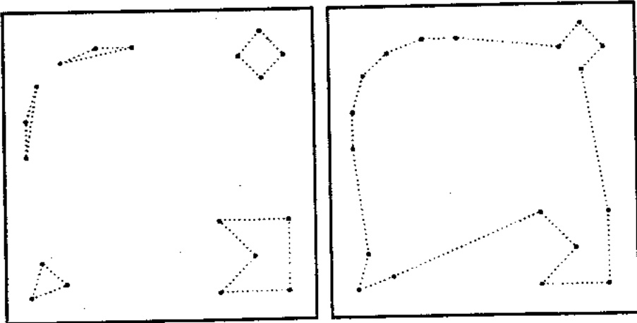

Hình 8.7. Các hành trình con riêng biệt và hành trình chung cuộc

Hai toán tử di truyền đã được định nghĩa: đột biến và lai. Toán, từ đột biến lấy một nhiễm sắc thể, chọn ngẫu nhiên nhiều hàng và nhiều cột trong nhiễm sắc thể đó, bỏ đi các bit đã được thiếp lập trong các phần giao của những hàng và cột đó, và thay thế chúng vào cấu hình khác, một cách ngẫu nhiên

Thí dụ, xét hành trình trong hình 8.6(a) biểu diễn hành trình sau:

## (1, 2, 4, 3, 8, 6, 5, 7, 9).

Giả sử các hàng 4, 6, 7, 9 và các cột 1, 3, 5, 8, và 9 được chọn ngẫu nhiên để tham gia đột biến. Các tổng của các hàng và các cột ở biên được tính. Các bit ở các phần giao của các hàng và cột này được bỏ đi và thay thế một cách ngẫu nhiên, mặc dù chúng phải khớp với các tổng ở biên. Nói cách khác, ma trận con tương ứng với các hàng 4, 6, 7 và 9, và các cột 1, 3, 5, 8, và 9 từ ma trận gốc (hình 8.8 (a)), được thay bằng một ma trận con khác (hình 8.8(b)).

Nhiễm sắc thể kết quả biểu diễn nhiễm sắc thể với hai hành trình con:

## (1, 2, 4, 5, 7) và (3, 8, 6, 9)

và được biểu diễn trong hình 8.6(b).

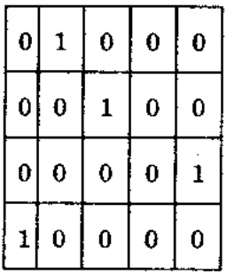

(a)

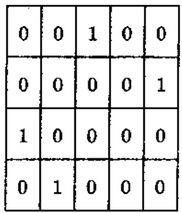

(b)

Hình 8.8. Phân nhiễm sắc thể trước (a) và sau (a) đột biến.

<!-- page: 107 -->

Toán từ lai bắt đầu bằng nhiễm sắc thể con có tất cả các bit được gán lại bằng 0. Toán từ thứ nhất khảo sát hai nhiễm sắc thể cha-mệ, và khi nó khám phá cũng bit đó (cùng hàng và cột) được thiết lập (nghĩa là, 1) trong cả cha-mệ, thì nó thiết lập bit tương ứng trong nhiễm sắc thể con (thời kỳ 1). Rồi toán từ luân phiên chép một bit được thiết lập từ mỗi cha-mệ, cho đến khi không còn bit nào trong cả hai cha-mệ có thể được chép mà không xâm phạm các giới hạn cơ bản của cấu trúc nhiễm sắc thể (thời kỳ 2). Cuối cùng, nếu không còn hàng nào trong nhiễm sắc thể của đưa con còn chứa một bit được thiết lập, nhiễm sắc thể sẽ được phù đầy một cách ngẫu nhiên (thời kỳ cuối). Do phép lai theo truyền thống, tạo ra hai nhiễm sắc thể con, toán từ được thực thi lần thứ hai với các nhiễm sắc thể cha-mệ được đối chỗ.

Thí dụ về phép lai sau đây bắt đầu bằng nhiễm sắc thể cha-mệ thứ nhất trong hình 8.9(a), biểu diễn hai hành trình con:

(1, 5, 3, 7, 8) và (2, 4, 9, 6).

và nhiễm sắc thể cha-mệ thứ hai (Hình 8.9(b) biểu diễn một hành trình:

(1, 5, 6, 2, 7, 8, 3, 4, 9).

|  | 1 | 2 | 3 | 4 | 5 | 6 | 7 | 8 | 9 |
| --- | --- | --- | --- | --- | --- | --- | --- | --- | --- |
| 1 | 0 | 0 | 0 | 0 | 1 | 0 | 0 | 0 | 0 |
| 2 | 0 | 0 | 0 | 1 | 0 | 0 | 0 | 0 | 0 |
| 3 | 0 | 0 | 0 | 0 | 0 | 0 | 1 | 0 | 0 |
| 4 | 0 | 0 | 0 | 0 | 0 | 0 | 0 | 0 | 1 |
| 5 | 0 | 0 | 1 | 0 | 0 | 0 | 0 | 0 | 0 |
| 6 | 0 | 1 | 0 | 0 | 0 | 0 | 0 | 0 | 0 |
| 7 | 0 | 0 | 0 | 0 | 0 | 0 | 0 | 1 | 0 |
| 8 | 1 | 0 | 0 | 0 | 0 | 0 | 0 | 0 | 0 |
| 9 | 0 | 0 | 0 | 0 | 0 | 1 | 0 | 0 | 0 |

Hình 8.9.a. Cha-mệ thú nhất (a) và thú hai (b)

|  | 1 | 2 | 3 | 4 | 5 | 6 | 7 | 8 | 9 |
| --- | --- | --- | --- | --- | --- | --- | --- | --- | --- |
| 1 | 0 | 0 | 0 | 0 | 1 | 0 | 0 | 0 | 0 |
| 2 | 0 | 0 | 0 | 0 | 0 | 0 | 1 | 0 | 0 |
| 3 | 0 | 0 | 0 | 1 | 0 | 0 | 0 | 0 | 0 |
| 4 | 0 | 0 | 0 | 0 | 0 | 0 | 0 | 0 | 1 |
| 5 | 0 | 0 | 0 | 0 | 0 | 1 | 0 | 0 | 0 |
| 6 | 0 | 1 | 0 | 0 | 0 | 0 | 0 | 0 | 0 |
| 7 | 0 | 0 | 0 | 0 | 0 | 0 | 0 | 1 | 0 |
| 8 | 0 | 0 | 1 | 0 | 0 | 0 | 0 | 0 | 0 |
| 9 | 1 | 0 | 0 | 0 | 0 | 0 | 0 | 0 | 0 |

Hinh 8.9.b.

Hai thời kỳ đầu tiên trong việc xây dựng con thú nhất được trình bày trong hình 8.10.

Con thứ nhất để lai, sau thời kỳ cuối, được trình bày trong hình 8.11. Nó biểu diễn hành trình con:

## (1, 5, 6, 2, 3, 4, 9, 7, 8)

Con thứ hai diễn tả:

(1, 5, 3, 4, 9) và (2, 7, 8, 6).

<!-- page: 108 -->

|  | 1 | 2 | 3 | 4 | 5 | 6 | 7 | 8 | 9 |
| --- | --- | --- | --- | --- | --- | --- | --- | --- | --- |
| 1 | 0 | 0 | 0 | 0 | 1 | 0 | 0 | 0 | 0 |
| 2 | 0 | 0 | 0 | 0 | 0 | 0 | 0 | 0 | 0 |
| 3 | 0 | 0 | 0 | 0 | 0 | 0 | 0 | 0 | 0 |
| 4 | 0 | 0 | 0 | 0 | 0 | 0 | 0 | 0 | 1 |
| 5 | 0 | 0 | 0 | 0 | 0 | 0 | 0 | 0 | 0 |
| 6 | 0 | 1 | 0 | 0 | 0 | 0 | 0 | 0 | 0 |
| 7 | 0 | 0 | 0 | 0 | 0 | 0 | 0 | 1 | 0 |
| 8 | 0 | 0 | 0 | 0 | 0 | 0 | 0 | 0 | 0 |
| 9 | 0 | 0 | 0 | 0 | 0 | 0 | 0 | 0 | 0 |

Hình 8.10.a. Các cha-mệ thứ nhất

|  | 1 | 2 | 3 | 4 | 5 | 6 | 7 | 8 | 9 |
| --- | --- | --- | --- | --- | --- | --- | --- | --- | --- |
| 1 | 0 | 0 | 0 | 0 | 1 | 0 | 0 | 0 | 0 |
| 2 | 0 | 0 | 1 | 0 | 0 | 0 | 0 | 0 | 0 |
| 3 | 0 | 0 | 0 | 0 | 0 | 0 | 0 | 0 | 0 |
| 4 | 0 | 0 | 0 | 0 | 0 | 0 | 0 | 0 | 1 |
| 5 | 0 | 0 | 0 | 0 | 0 | 1 | 0 | 0 | 0 |
| 6 | 0 | 1 | 0 | 0 | 0 | 0 | 0 | 0 | 0 |
| 7 | 0 | 0 | 0 | 0 | 0 | 0 | 0 | 1 | 0 |
| 8 | 1 | 0 | 0 | 0 | 0 | 0 | 0 | 0 | 0 |
| 9 | 0 | 0 | 0 | 0 | 0 | 0 | 0 | 0 | 0 |

Hình 8.10.b.

|  | 1 | 2 | 3 | 4 | 5 | 6 | 7 | 8 | 9 |
| --- | --- | --- | --- | --- | --- | --- | --- | --- | --- |
| 1 | 0 | 0 | 0 | 0 | 1 | 0 | 0 | 0 | 0 |
| 2 | 0 | 0 | 1 | 0 | 0 | 0 | 0 | 0 | 0 |
| 3 | 0 | 0 | 0 | 1 | 0 | 0 | 0 | 0 | 0 |
| 4 | 0 | 0 | 0 | 0 | 0 | 0 | 0 | 0 | 1 |
| 5 | 0 | 0 | 0 | 0 | 0 | 1 | 0 | 0 | 0 |
| 6 | 0 | 1 | 0 | 0 | 0 | 0 | 0 | 0 | 0 |
| 7 | 0 | 0 | 0 | 0 | 0 | 0 | 0 | 1 | 0 |
| 8 | 1 | 0 | 0 | 0 | 0 | 0 | 0 | 0 | 0 |
| 9 | 0 | 0 | 0 | 0 | 0 | 0 | 1 | 0 | 0 |

Hình 8.11. Các cha-mệ thứ hai

Chú ý ràng có những doạn chung của các nhiễm sắc thể cha-mệ trong cả hai con.

Chương trình tiến hóa này cho kết quả hợp lý trong nhiều trường hợp thử nghiệm từ 300 đến 500 thành phố. Nhưng, không thấy rõ ràng ảnh hưởng của tham số q (số thành phố tối thiểu trong

<!-- page: 109 -->

một hành trình con) trên chất lượng của lời giải cuối cùng. Cũng vậy, các thuật giải kết hợp nhiều hành trình con vào một hành trình duy nhất cũng chẳng có gì rõ ràng. Mặt khác, phương pháp có một số điểm tương đồng với thuật giải xếp nhóm để quy của Litke, thuật giải này thay thế một cách để quy các nhóm có kích thước B bằng các thành phố đại diện cho đến khi còn ít hơn B thành phố. Rôi thì, bài toán nhỏ hơn được giải một cách tối uu. Tất cả các nhóm lần lượt được mở rộng và thuật giải xếp thứ tự cho tập mở rộng giữa hai láng giềng trong hành trình hiện hành. Phương pháp này cũng có thể có ích cho việc giải bài toán nhiều người lái buôn du lịch, mà nhiều người lái buôn có thể hoàn thành các hành trình (không phủ nhau) riêng biệt của họ.

Phương pháp thú ba dựa trên biểu diễn ma trận đã được Homaifar và Guan để nghị. Cũng như phương pháp trước, phân tử $m_{ij}$ của ma trận nhị phân $M$ được thiết lập bằng 1, nếu và chỉ nếu có một cạnh từ thành phố $i$ đến thành phố $j$. Nhung, họ dùng các toán từ lai tạo khác và đảo heuristic.

Hai toán từ lai ma trận (MX) được định nghĩa như sau. Những toán từ này trao đổi tất cả các mục nhập của hai ma trận cha-mệ hoặc sau một điểm lai tạo đơn (lai tạo 1- điểm) hay giữa hai điểm lai tạo (lai tạo 2-diểm). Một “thuật giải sửa chữa” bổ sung được chạy để (1) loại các chỗ trùng nhau, nghĩa là, để bảo đảm ràng mỗi hàng và mỗi cột chỉ có chính xác một 1, và (2) cắt và nổi các chu trình (nếu có) nhằm sản xuất một hành trình hợp lệ.

Lai 2-diểm được minh họa qua thí dụ sau. Hai ma trận cha-mệ cho trong hình 8.12; biểu diễn hai hành trình hợp lệ:

(1 2 4 3 8 6 5 7 9) và (1 4 3 6 5 7 2 8 9)

|  | 1 | 2 | 3 | 4 | 5 | 6 | 7 | 8 | 9 |
| --- | --- | --- | --- | --- | --- | --- | --- | --- | --- |
| 1 | 0 | 1 | 0 | 0 | 0 | 0 | 0 | 0 | 0 |
| 2 | 0 | 0 | 0 | 1 | 0 | 0 | 0 | 0 | 0 |
| 3 | 0 | 0 | 0 | 0 | 0 | 0 | 0 | 1 | 0 |
| 4 | 0 | 0 | 1 | 0 | 0 | 0 | 0 | 0 | 0 |
| 5 | 0 | 0 | 0 | 0 | 0 | 0 | 1 | 0 | 0 |
| 6 | 0 | 0 | 0 | 0 | 1 | 0 | 0 | 0 | 0 |
| 7 | 0 | 0 | 0 | 0 | 0 | 0 | 0 | 0 | 1 |
| 8 | 0 | 0 | 0 | 0 | 0 | 1 | 0 | 0 | 0 |
| 9 | 1 | 0 | 0 | 0 | 0 | 0 | 0 | 0 | 0 |

Hình 8.12.a. Những nhiễm sắc thể ma trận nhị phân với các điểm lai tạo được đánh dấu

|  | 1 | 2 | 3 | 4 | 5 | 6 | 7 | 8 | 9 |
| --- | --- | --- | --- | --- | --- | --- | --- | --- | --- |
| 1 | 0 | 0 | 0 | 1 | 0 | 0 | 0 | 0 | 0 |
| 2 | 0 | 0 | 0 | 0 | 0 | 0 | 0 | 1 | 0 |
| 3 | 0 | 0 | 0 | 0 | 0 | 1 | 0 | 0 | 0 |
| 4 | 0 | 0 | 1 | 0 | 0 | 0 | 0 | 0 | 0 |
| 5 | 0 | 0 | 0 | 0 | 0 | 0 | 1 | 0 | 0 |
| 6 | 0 | 0 | 0 | 0 | 1 | 0 | 0 | 0 | 0 |
| 7 | 0 | 1 | 0 | 0 | 0 | 0 | 0 | 0 | 0 |
| 8 | 0 | 0 | 0 | 0 | 0 | 0 | 0 | 0 | 1 |
| 9 | 1 | 0 | 0 | 0 | 0 | 0 | 0 | 0 | 0 |

Hình 8.12.b.

<!-- page: 110 -->

Hai điểm lai được chọn; đây là các điểm giữa các cột 2 và 3 (điểm đầu tiên, và giữa các cột 6 và 7 (điểm thứ hai). Các điểm lai cắt ma trận theo chiều dọc: đối với mỗi ma trận, hai hàng đầu tiên thành lập phần đầu của sự cắt; các cột 3, 4, 5, 6 thuộc phần giữa; ba cột cuối thuộc phần thứ ba. Sau bước thứ nhất của toán từ MX 2–diểm, các mục nhập của cả hai ma trận được hoán đối giữa các điểm lai (nghĩa là các mục nhập trong các cột 3, 4, 5 và 6). Kết quả trung gian được trình bày trong hình 8.13.

Cả hai con, (a) và (b) đều bất hợp lệ; nhưng tổng số các số 1 trong mỗi ma trận trung gian đều đúng (là 9). Bước đầu tiên của "thuật giải sửa chữa" dòi đi với số 1 trong các ma trận để mỗi hàng và mỗi cột chỉ có đúng một 1. Thí dụ, trong đưa con ở hình 8.13 (a) các số 1 trùng lập xuất hiện trong các hàng 1 và 3. Thuật giải có thể chuyển ô $m_{14} = 1$ vào $m_{84}$, còn ô $m_{38} = 1$ vào $m_{28}$. Tương tự, trong con khác (hình 8.13 (b)) các số 1 trùng lập xuất hiện trong các hàng 2 và 8. Thuật giải có thể chuyển ô $m_{24} = 1$ vào $m_{34}$, còn ô $m_{86} = 1$ vào $m_{16}$. Sau khi hoàn tất bước đầu tiên của thuật giải sửa chữa, con thứ nhất biểu diễn một hành trình (hop lệ):

(1 2 8 4 3 6 5 7 9)

và con thú hai biểu diễn hành trình gồm có hai hành trình con:

(1 6 5 7 2 8 9) và (3 4).

|  | 1 | 2 | 3 | 4 | 5 | 6 | 7 | 8 | 9 |
| --- | --- | --- | --- | --- | --- | --- | --- | --- | --- |
| 1 | 0 | 1 | 0 | 1 | 0 | 0 | 0 | 0 | 0 |
| 2 | 0 | 0 | 0 | 0 | 0 | 0 | 0 | 0 | 0 |
| 3 | 0 | 0 | 0 | 0 | 0 | 1 | 0 | 1 | 0 |
| 4 | 0 | 0 | 1 | 0 | 0 | 0 | 0 | 0 | 0 |
| 5 | 0 | 0 | 0 | 0 | 0 | 0 | 1 | 0 | 0 |
| 6 | 0 | 0 | 0 | 0 | 1 | 0 | 0 | 0 | 0 |
| 7 | 0 | 0 | 0 | 0 | 0 | 0 | 0 | 0 | 1 |
| 8 | 0 | 0 | 0 | 0 | 0 | 0 | 0 | 0 | 0 |
| 9 | 1 | 0 | 0 | 0 | 0 | 0 | 0 | 0 | 0 |

Hình 8.13.a. Hai con tức thời sau bước đầu tiên của toán tử MX

|  | 1 | 2 | 3 | 4 | 5 | 6 | 7 | 8 | 9 |
| --- | --- | --- | --- | --- | --- | --- | --- | --- | --- |
| 1 | 0 | 0 | 0 | 0 | 0 | 0 | 0 | 0 | 0 |
| 2 | 0 | 0 | 0 | 1 | 0 | 0 | 0 | 1 | 0 |
| 3 | 0 | 0 | 0 | 0 | 0 | 0 | 0 | 0 | 0 |
| 4 | 0 | 0 | 1 | 0 | 0 | 0 | 0 | 0 | 0 |
| 5 | 0 | 0 | 0 | 0 | 0 | 0 | 1 | 0 | 0 |
| 6 | 0 | 0 | 0 | 0 | 1 | 0 | 0 | 0 | 0 |
| 7 | 0 | 1 | 0 | 0 | 0 | 0 | 0 | 0 | 1 |
| 8 | 0 | 0 | 0 | 0 | 0 | 1 | 0 | 0 | 1 |
| 9 | 1 | 0 | 0 | 0 | 0 | 0 | 0 | 0 | 0 |

Hình 8.13.b.

<!-- page: 111 -->

Buốc thú hai của thuật giải sửa chữa chỉ nên áp dụng cho con thú hai. Trong thời kỳ này, thuật giải cắt và nổi các hành trình con để cho ra một hành trình hợp lệ. Giai đoạn cắt và nổi xét đến các cạnh đang có trong các cha-mệ gốc. Thị dụ, cạnh (2 4) được chọn đến nổi hai hành trình con này, vi cạnh này hiện diện trong một cha-mệ. Như vậy, hành trình trọn vẹn (con thú hai hợp lệ) là:

$$
(1 6 5 7 2 4 3 8 9).
$$

Toán từ thứ hai được Homaifar và Guan sử dụng bổ sung cho phép lai MX là đảo heuristic. Toán từ đào thứ tự các thành phố giữa hai điểm cắt (như đảo đơn giản đã thực hiện – ta đã bàn về điều này trong phần trước của chương 8). Nếu khoảng cách giữa hai điểm cắt lớn (đảo thứ tự cao), toán từ khai thác các nổi kết giữa các đường dẫn 'tốt', ngược lại (đảo thứ tự thấp), toán từ sẽ thực hiện tìm kiếm cục bộ. Tuy vậy, có hai điểm khác biệt giữa các toán từ cổ diễn và các toán từ đào được đề nghị. Điều khác biệt thứ nhất là đưa con kết quả chỉ được chấp nhận nếu hành trình mối tốt hơn hành trình gốc. Khác biệt thứ hai là thủ tục đào chọn chỉ một thành phố trong một hành trình và kiểm soát sự cải thiện cho những lần đảo của thứ tự 2 (thấp nhất có thể). Đảo thứ nhất đưa đến cải thiện được chấp nhận và thủ tục đào chấm dứt. Ngọc lại, sẽ xét đến trong thứ tự 3, và cử thể.

Các kết quả được báo cáo thực nghiệm cho thấy rằng chương trình tiến hóa với các toán từ MX 2-diểm và các toán từ đảo thực hiện thành công trên những bài toán TSP có từ 30 - 100 thành phố. Trong thử nghiệm gần đây nhất, kết quả của thuật giải này đối với bài toán 320 thành phố chỉ khác với lời giải tối ưu 0.6%.

Trong chương này ta không cung cấp các kết quả chính xác của nhiều thực nghiệm đối với các cấu trúc dữ liệu và các toán từ 'đi truyền' khác nhau, mà đã thực hiện một tổng quan về nhiều nổ lực trong việc xây dựng chương trình tiến hóa thành công cho bài toán

TSP. Một trong những lý do là hầu hết các kết quả thực hiện được nói đến tùy thuộc năng nề vào nhiều chi tiết (kích thước quản thể, số thế hệ, kích thước bài toán, vv...). Thêm nửa, liên hệ đến kích thước tương đối nhỏ của TSP (trên 100 thành phố).

Tuy nhiên, phần lớn chương này so sánh phương pháp được đề nghị với những phương pháp khác. Hai họ các trường hợp thử nghiệm đã được dùng cho những so sánh này:

\- Chọn lựa ngẫu nhiên các thành phố. Ô đây, một công thức thực nghiệm đối với chiều dài mong đợi $L$ của một hành trình TSP tối thiểu là có ích:

$$
L ^ {*} = k \sqrt {n . R}
$$

trong đó, n là số thành phố, R là diện tích của hộp vuông mà các thành phố được đặt ngẫu nhiên trong đó, còn k là hằng số thực nghiệm xấp xi 0.765.

\- Suu tập về các thành phố đã được xuất bản (một phần có những lời giải tối ưu), ftp.softlib.rice.edu, directory/pub/tsplib. Có hai tập tin tsplib.sh và tsplib.tar, lần lượt có độ lớn là 6Mb và 2 Mb.

Đế có một bức tranh hoàn chỉnh về ứng dụng các kỹ thuật thuật giải di truyền vào TSP, ta nên báo cáo về công trình của các nhà nghiên cứu khác, đã sử dụng các GA để tối ưu hóa cục bộ của bài toán TSP. Các thuật giải tối ưu hóa cục bộ (2-opt, 3-opt, LinKernighan) cũng khá hiệu quả.

Các thuật giải tối ưu hóa cục bộ, với một hành trình cho trước (hiện hành), đặc tả một tập các hành trình lân cận và thay hành trình hiện hành bằng lân cận tốt nhất (có thể). Bước này được áp dụng cho đến khi chậm được tối ưu cục bộ. Thí dụ, thuật giải 2-opt định nghĩa các hành trình lân cận

<!-- page: 112 -->

mà ta có thể đạt được từ hành trình khác bằng cách chỉ hiệu chính hai cạnh.

Các thuật giải tìm kiếm cục bộ được dung làm cơ sở cho việc phát triển thuật giải tìm kiếm cục bộ di truyền, nó:

\- Sử dụng một thuật giải tìm kiếm cục bộ để thay mỗi hành trình trong quản thể hiện hành (có kích thước $\mu$) bằng một hành trình (tối ưu cục bộ),

\- Mở rộng quân thể bằng λ hành trình bổ sung – các con của toán từ tái kết hợp được áp dụng vào một số hành trình trong quickan thể hiện hành,

\- Lân nửa, sử dụng một thuật giải tìm kiếm cục bộ để thay mỗi con trong số λ con trong quản thế mở rộng bằng một hành trình (tối ưu cục bộ),

\- Giảm kích thước của quản thể mở rộng về kích thước gốc, $\mu$, theo một số chọn lọc (sinh tồn của phần tử thích nghi nhất),

\- Lập lại ba bước cuối cho đến khi gặp một điều kiện dùng nào đó (quá trình tiến hóa).

Chú ý là có một số tương đồng giữa thuật giải tìm kiếm cục bộ di truyền và chiến lược tiến hóa (μ +λ) (phụ lục 2). Như trong (μ +λ)-ES, các cá thể μ tạo ra λ con và quản thể mới (mở rộng) của (μ +λ) cá thể lại được giám xuống còn μ cá thể bằng một tiến trình chọn lọc.

Thuật giải tìm kiếm cục bộ di truyền nói trên tương tự với thuật giải di truyền dành cho bài toán TSP được Muhlenbein, Gorges-Schleuter, và Kramer đề nghị trước đó, thuật giải này khuyến khích “tiến hóa thông minh” của các cá thể. Thuật giải này:

\- Sử dụng một thuật giải tìm kiếm cục bộ (opt-2) để thay mỗi hành trình trong quản thể hiện hành bằng một hành trình (tối uu cục bộ),

\- Chọn phối ngẫu để ghép đời (các cá thể trên trung bình có nhiều con hơn),

• Sinh sản (lai và đột biến),

\- Tím cục tiêu bằng từng cả thể (giảm, bộ giải toán, mở rộng),

\- Lắp lại ba bước cuối cho đến khi gặp một điều kiện dùng nào đó (quá trình tiến hóa).

Lai được dùng trong thuật giải là phiên bản của lai thứ tự (OX). Ô dây hai cha-mệ với hai điểm cắt (được đánh dấu bằng $^{+}$ ):

$$
\begin{array}{l} p _ {1} = (1 2 3 \mid 4 5 6 7 \mid 8 9) \mathrm{va} \\ p _ {2} = (4 5 2 \mid 1 8 7 6 \mid 9 3), \end{array}
$$

sẽ sinh con theo cách sau. Trước tiên, các đoạn giữa hai điểm cắt được sao chép vào các con:

$$
o _ {1} = (\texttt {x x x} \mid 4 5 6 7 \mid \texttt {x x}) \mathrm{va}
$$

$$
o _ {2} = (\mathbf {x x x} \mid 1 8 7 6 \mid \mathbf {x x}).
$$

Kế tiếp, (thay vì bắt đầu từ điểm cắt thứ hai của một cha-mẹ như trong trường hợp của OX), các thành phố từ cha-mẹ kia được sao chép theo cùng thứ tự từ bắt đầu chuỗi, bổ qua các đấu hiệu đã có:

$$
o _ {1} = (2 1 8 \mid 4 5 6 7 \mid 9 3) \mathrm{va}
$$

$$
o _ {2} = (2 3 4 \mid 1 8 7 6 \mid 5 9).
$$

Các kết quả thực nghiệm ít ra cũng dáng khích lệ. Thuật giải tìm được một hành trình cho bài toán 530 thành phố và chiều dài

<!-- page: 113 -->

tìm được là 27702, trong vòng 0.06% của lời giải tối ưu (do Padberg và Rinaldi tìm được: 27686).

Gân dây có thêm hai phương pháp bổ sung. Phương pháp thử nhất, do Craighurst và Martin tập trung vào việc khảo sát mối liên lạc giữa việc ngăn ngừa việc hỗn giao (xem phụ lục 1) và việc thực hiện của thuật giải di truyền đối với bài toán TSP. Các tác giả sử dụng một GA có các tính năng sau dây cho các thử nghiệm của họ: kích thước quản thể là 128, chọn lựa dựa trên thế hệ được đặt trên cơ sở xếp bậc, mà 128 con tranh dấu với 128 cha-mệ, việc chọn lọc cho lai tạo MPX cũng dựa trên xếp bậc, leo đổi cục bộ, 2-opt) được thực hiện trên đưa con lúc tạo ra, tỉ lệ đột biến là 0.005, và điều kiện dùng là 500 thể hệ liên tiếp mà không có cải thiện. Phương pháp cho hỗn giao có tính hướng – gia đình: các tác giả chỉ quan tâm đến các tiền bối của hai cá thể được chọn để lai, và chúng đưa ra nhiều luật hỗn giao. Luật hỗn giao thứ $k$ cảm ghép đôi của một cá thể với $k-1$ tiền bối (nghĩa là, với $k=0$) thì không có các giới hạn, với $k=1$ thì cá thể không thể ghép đôi với chính nó, còn với $k=2$, nó không thể ghép đôi với chính nó, với cha-mệ nó, với con cái, cũng không thể với anh chỉ em ruột của nó, và cứ thế). Nhiểu thử nghiệm đã được thực hiện (trên 6 bài toán thử nghiệm (trong thư viện softlib.rice.edu đã trình bày ở phần đầu chương này) với số thành phố trong khoảng từ 48 - 101). Các kết quả cho thấy sự phụ thuộc qua lại mạnh và thú vị giữa các luật cảm hỗn giao và tỉ lệ đột biến: đối với những tỉ lệ đột biến thấp thì việc ngăn hỗn giao cải thiện các kết quả, nhưng nếu tỉ lệ đột biến cao, thì tầm quan trọng của cơ chế ngăn ngừa hỗn giao sẽ giảm cho đến khi (với những tỉ lệ đột biến cao ≈ 0.1) thì nó làm kết quả của hệ thống yếu di. Cũng vậy, những luật khác nhau về ngăn ngừa hỗn giao không tác động 224

đến sự đa dạng của quản thể (mà sự tương đồng giữa hai cá thể được đo làm tỉ số đo sự khác biệt giữa tổng số canh trong một lời giải và số các cạnh chung giữa các lời giải, và tổng số canh trong một lời giải) theo cách đầy ý nghĩa. Kết luận cuối cùng là câu trả lời phủ định cho câu hỏi sau đầy:" nhiều luật cảm hơn có tốt hơn không ?". Valenzuela và Jones để nghị một phương pháp thu vị áp dụng thuật giải tiến hóa cho các bài toán tổ hợp khó; phương pháp của họ dựa trên ý tưởng về kỹ thuật chia để trị của các thuật giải di truyền Karp-Steele dành cho các bài toán TSP. Thuật giải di truyền tiến hóa chia để trị (Evolutionary Divide and Conquer - EDAC) của họ có thể được áp dụng cho bất cứ bài toán nào mà trong đó một trì thức về các lời giải tốt nào đó của các bài toán con hữu ích cho việc xây dựng lời giải toàn cục, tuy vậy họ đã áp dụng kỹ thuật này cho bài toán TSP hình học. Nhiểu phương pháp cắt hai có thể được xét; những phương pháp này cắt hình chữ nhật có n thành phố thành hai hình chữ nhật nhỏ hơn. Thí dụ, một trong những phương pháp này chia bài toán bằng cách cắt đôi diện tích hình chữ nhật, song song với cạnh ngắn hơn; phương pháp kia giao thành phố gần giá trị int(n/2) nhất, với cạnh ngắn hơn của hình chữ nhật, như vậy, sẽ cung cấp một thành phố "dùng chung" giữa hai hình chữ nhật-con). Những bài toán con cuối cùng sẽ thật nhỏ (tiêu biểu là giữa 5 và 8 thành phố), và tương đối dễ giải (phương pháp 2-opt được chọn cho trường hợp này vì nó nhanh và đơn giản). Thuật giải đáp vá thay một số cạnh trong hai hành trình riêng biệt để có một hành trình lớn hơn. Giờ đây, vai trò chính yếu của thuật giải di truyền là quyết định hướng chia đôi (theo chiều ngang hay chiều đọc) được sử dụng tại mỗi giai đoạn. Một nhận xét thú vị là cấu trúc dữ liệu được dùng cho biểu diễn về nhiễm sắc thể của các cá thể là một măng nhị phân

<!-- page: 114 -->

$M_{p \times p}$  tương quan với các vùng hình học của hình vuông TSP. Nếu ở một giai đoạn nào đó của thuật giải chia để trị, mà một hình chữ nhật cần được chia đôi, thì một bit được chọn từ ma trấn M tương ứng gần nhất với trung tâm hình chữ nhật; giá trị của bit này xác định hướng cắt hiện hành (ngang với đọc). các toán từ di truyền được dùng trong rất đơn giản : lai hoán vị các phần từ nhị phân giữa hai măng được cắt (trong hai điểm) đọc theo các trực x hay y. Đột biến bật tất cả các bit của măng với xác suất không đổi (người ta dùng 0.1, nghĩa là 10% các bit trong măng được đột biến).

Dường như một chương trình tiến hóa tốt cho bài toán TSP cần kết hợp với các toán tử cải thiện cục bộ (nhóm đột biến, dựa trên các thuật giải dùng cho tối ưu hóa cục bộ, cùng (các) toán từ nhi phân được thiết kế cần thận (nhóm lai tạo), sẽ kết hợp thông tin heuristic về bài toán. Ta kết thúc chương này bằng một quan sát đơn giản: yêu cầu của chương trình tiến hóa đối với bài toán TSP, có thể bao gồm biểu diễn 'tốt nhất' và các toán tử 'di truyền' để thực hiện trên chúng, vẫn còn tiếp tục!

## Chương 9

# CÁC BÀI TOÁN TỔI ÚU TỔ HỢP KHÁC

Như đã lưu ý trước, duồng như đa số các nhà nghiên cứu đã biến đổi các cách cài đặt của họ về thuật giải di truyền hoặc bằng cách dùng biểu diễn nhiễm sắc thể không-chuẩn và/hoặc bằng cách thiết kế các toán tử di truyền chuyên biệt cho thích hợp với bài toán cần giải, để có được các chương trình tiến hóa hiệu quả. Những biến đổi nhu thế đã được thảo luận trong hai chương trước, dành cho bài toán vận tải và bài toán người du lịch. Trong chương này, ta khảo sát một số chương trình tiến hóa khác được các nhà nghiên cứu cài đặt, các chương trình này có biểu diễn nhiễm sắc thể không-chuẩn và/hoặc các toán tử sử dụng tri thức của bài toán. Trước hết, ta sẽ thảo luận về bài toán lập lịch, sau đó là bài toán thời khoá biểu trường học, một số bài toán phân hoạch, và cuối cùng là bài toán lập kế hoạch di duồng cho rôbô. Cuối cùng, ta sẽ kết thúc với một số chú thích ngắn gọn về một số ít bài toán thú vị khác.

Các hệ thống được mô tả và các kết quả của việc ứng dụng chúng cung cấp các luận cứ về cách tiếp cận lập trình tiến hóa, thúc đẩy việc sáng tạo các cấu trúc dữ liệu cùng với các toán tử cho phù hợp với các bài toán cần giải.

## 9.1. Bài toán lập lịch

Lập lịch là bài toán tổ chức sản xuất. Cần sản xuất nhiều (bộ phận) hàng hóa khác nhau; những bộ phận này có thể được xử lý theo một số kế hoạch khác nhau. Môi kế hoạch xử lý gồm một chuỗi thao tác; những thao tác này cần sử dụng một số tài nguyên và cần một số thời gian chạy máy. Một lịch sản xuất lập kế hoạch thực hiện các đơn đặt hàng. Trong đó, một số đơn đặt hàng có thể được thực hiện với cùng những thao tác tương đương. Nhiệm vụ là lên kế

<!-- page: 115 -->

hoach, lập lịch sản xuất, để thực hiện các đơn đặt hàng này nhanh nhất có thể.

Bài toán lập thời lịch là chọn một chuỗi các thao tác đồng thời chỉ định về thời gian bắt đầu/kết thúc và các tài nguyên cần thiết cho mỗi thao tác. Điều cần quan tâm chính yếu là chi phí thời gian máy rối và năng lực lao động, và các đơn đặt hàng cần hoàn thành đúng hạn.

Có nhiều phiên bản khác nhau về bài toán lập lịch, mỗi bài được đặc trưng bằng một số ràng buộc (nghĩa là, bảo trì, thời gian lắp đặt, vv...).

Sau đây là một ví dụ đơn giản về bài toán lập lịch.

Thí dụ 9.1. Giả sử có 3 đơn đặt hàng, $o_1$, $o_2$, $o_3$. Đối với mỗi đơn đặt hàng, các bộ phận và số mặt hàng cần sản xuất là:

$o_{1}$ :  $30 \times b\hat{o}$  phần a;

$o_{2}$ :  $45 \times b\hat{o}$  phần b;

$o_{3}$ :  $50 \times b\hat{o}$  phần a.

\- Môi bộ phận có một hay nhiều kế hoạch xử lý khác nhau:

a: kế hoạch # 1$_{a}$ (thaotác$_{7}$, thaotác$_{9}$);

a: kê hoạch # 2$_{a}$ (thaotác$_{1}$, thaotác$_{3}$, thaotác$_{7}$, thaotác$_{8}$);

a: kế hoạch # 3$_{a}$ (thaotác$_{5}$, thaotác$_{6}$);

b: kê hoạch # 1$_{b}$ (thaotác$_{2}$, thaotác$_{6}$, thaotác$_{7}$);

b: kế hoạch # 2, (thaotác₁, thaotác₉);

trong đó, các thaotác; biểu thị các thao tác cần thực hiện. Môi thao tác đời hồi một số thời gian trên một hay nhiều máy; cụ thể:

$thaotác_{1}:(m_{1}\ 10)(m_{3}\ 20);$

$thaotác_{2}:(m_{2}\ 20);$

$thaotác_{3}:(m_{2}\ 20)(m_{3}\ 30);$

$thaotác_{4}:(m_{1}\ 10)(m_{2}\ 30)(m_{3}\ 20);$

$thaotác_{5}:(m_{1}\ 10)(m_{3}\ 30);$

$thaotác_{6}:(m_{1}\ 40);$

$thaotác_{7}:(m_{3}20);$

$thaotác_{8}:(m_{1}\ 50)(m_{2}\ 30)(m_{3}\ 10);$

$thaotác_{9}:(m_{2}\ 20)(m_{3}\ 40);$

Cuối cùng mỗi máy cần có thời gian khởi động khi thực hiện:

$m_{1}:3;$

$m_{2}:5;$

$m_{3}:7.$

Bài toán lập lịch có thể sử dụng GA. Davis là một trong những người đầu tiên giải bài toán này bằng GA. Ý tuống chính trong phương pháp của ông mã hóa biểu diễn của lịch phân công là (1) các toán từ di truyền phải thực hiện theo cách có ý nghĩa, và (2) một bộ giải mã phải luôn luôn tạo ra một lời giải hợp lệ cho bài toán. Chiến lược này, mã hóa các lời giải cho các phép toán di truyền thực hiện

<!-- page: 116 -->

và giải mã chúng khi lượng giá, là hoàn toàn tổng quát và được áp dụng cho nhiều loại bài toán có ràng buộc khác. Jones cũng sử dụng những ý tưởng tương tự để giải bài toán phân hoạch.

Nói chung, ta thích một biểu diễn thông tin về các lịch phân công, như, “máy $m_{2}$ thực hiện thao tác $o_{1}$, trên bộ phận $a$ từ thời gian $t_{1}$, đến $t_{2}$”. Nhung, hầu hết các toán tử (đột biến, lai) được áp dụng vào một thông diệp như vây có thể tạo ra lịch phân công bất hợp lệ – vì thế mà Davis đã phải sử dụng chiến lược mã hóa/ giải mã.

Ta hāy xem chiến lược giải mã được áp dụng vào bài toán lập lịch ra sao. Hệ thống của Davis duy trì một danh sách ưu tiên cho mỗi máy; những ưu tiên này được liên kết với thời gian. Phân tử đầu của danh sách là thời điểm danh sách có hiệu lực, phần còn lại của danh sách được tạo từ một số hoán vị của các đơn đặt hàng, với hai phần tử bổ sung: 'chờ' và 'rỗi'. Thủ tục giải mã mô phỏng các thao tác của công việc theo cách mà khi một máy tính sẵn sàng chọn lựa, thì thao tác cho phép đầu tiên từ danh sách ưu tiên được lấy ra. Như vậy nếu danh sách ưu tiên của máy $m_{1}$ là:

$$
m _ {1}: (4 0 o _ {3} o _ {1} o _ {2} ^ {\prime} \text {chò' 'nhàn rõi'),}
$$

thì thủ tục giải mã vào thời điểm 40 có thể thực hiện đơn đặt hàng $o_3$ trên máy $m_1$. Nếu không được, thủ tục giải mã sẻ thực hiện đơn đặt hàng $o_1$ và $o_2$ (nghĩa là, tìm ở $o_1$ trước; nếu không được mối tìm ở $o_2$). Biểu diễn này bảo đảm tạo một lịch phân công hợp lệ.

## Các toán tử có tính chuyên biệt:

Chạy-rôi: toán từ này chỉ được áp dụng cho những danh sách uu tiên của các máy đã đội hơn một tiếng đồng hồ. Nó chèn 'rôi' làm phần tử thứ hai của danh sách uu tiên và thiết lập lại phần tử đầu tiên (thời gian) của danh sách uu tiên là 60 (phút).

Tranh giành: toán tử này “giành” các phần tử của danh sách ưu tiên;

Lai: toán từ này trao đổi các danh sách ưu tiên của các máy được chọn.

Xác suất thực hiện những phép toán này thay đổi từ 5% và 40% lần lượt cho tranh giành và lai lúc bắt đầu chạy, và giám dẫn xuống còn 1% và 5%. Xác suất thi hành chạy-rối là phần trăm thời gian máy chờ, chia cho tổng số thời gian mô phỏng.

Tuy nhiên, các thử nghiệm chỉ được thực hiện trên một thí dụ nhỏ có hai đơn đặt hàng, 6 máy và 3 toán tử, vì vậy khó mà lượng giá được mức độ hữu dụng của phương pháp này.

Một nhóm các nhà nghiên cứu khác đã tính gần đúng bài toán lập lịch theo cách giải của TSP. Xuất phát từ nhận xét là hầu hết các toán từ được phát triển cho TSP là ‘mù quảng’, nghĩa là chúng không sử dụng thông tin nào về các khoảng cách thực sự giữa các thành phố. Điều này có nghĩa là những toán từ này có thể sử dụng được cho bài toán lập lịch, mà ở đó không có khoảng cách giữa hai điểm (thành phố, đơn đặt hàng, công việc, vv...). Tuy vậy, cả hai bài toán, TSP và bài toán lập lịch có những đặc trưng khác nhau. Đối với bài toán TSP, thông tin quan trọng là thông tin kể về các thành phố, trong khi bài toán lập lịch lại là thứ tự tương đối của các đơn đặt hàng. Thông tin kể không có ích cho bài toán lập lịch, còn thứ tự tương đối lại không quan trọng đối với bài toán TSP do bản chất chu trình của các hành trình: hành trình (1 2 3 4 5 6 7 8) và (4 5 6 7 8 1 2 3) thực ra là giống nhau. Vì vậy mà ta cần những toán từ khác cho nhiều ứng dụng khác. Như ta quan sát sau,

"Gil Syswerda chỉ đạo một nghiên cứu trong đó việc 'tái kết hợp cạnh' (toán tử di truyền được thiết kế đặc biệt cho TSP) thực hiện kém có liên quan với các toán từ khác trong tác vụ lập lịch. Trong

<!-- page: 117 -->

khi kích thước quản thể được Syswerda sử dụng nhỏ (30 chuỗi) và các kết quả tốt thu được từ bài toán này chỉ sử dụng đột biến (không tái kết hợp), thảo luận của Syswerda về tâm quan trong tương đối của vị trí, thứ tự, tính chất kể đối với các tác vụ dẫn đến một vấn đề chưa được nói đến một cách đầy đủ. Các nhà nghiên cứu kể, đường như cứ ngầm cho rằng tất cả các tác vụ lập trình tự đều như nhau và chỉ một toán từ di truyền là đủ dùng cho tất cả các loại bài toán lập tuần tự."

Trước đó, Fox và McMahon cũng thực hiện một quan sát tương tự:

"Một điều quan trọng dáng để ý là khả năng áp dụng của mỗi toán từ di truyền vào nhiều loại bài toán tuần tự khác nhau. Thí dụ, trong TSP, giá trị của trình tự thì tương đương với giá trị trình tự đó theo thứ tự ngược lại. Trong bài toán lập thời biểu, dây là một lỗi lớn".

6 toán tử lập trình tự (lai thứ tự, lai ánh xạ riêng phần, tái kết hợp cạnh có tăng cường, lai trên thứ tự và lai trên vị trí – tất cả các toán từ này đã được bàn trong chương trước) được so sánh với với hai tác vụ lập trình tự khác: TSP 30–thành phố (mù quảng) và tác vụ lập trình tự 195 phần tử cho ứng dụng lập lịch. Đúng như mong đợi, các kết quả của việc tối ưu hóa thời lịch phân công (tối mức 'tốt' của 6 toán từ được nói đến) hấu nhu đối lập với các kết quả thu được từ TSP. Trong trường hợp tối ưu hóa lịch phân công, toán từ tái kết hợp cạnh có tăng cường là tốt nhất, tiếp theo là lai thứ tự, lai trên thứ tự và lai trên vị trí, còn PMX và lai chu trình lại xấu nhất. Nguộc lại, trong trường hợp TSP, toán từ tốt nhất lại là lai trên vị trí và lai trên thứ tự, kế đó là lai chu trình và PMX, còn lai thứ tự và, tái kết hợp cạnh có tăng cường lại rất xấu. Những khác biệt này có thể giải thích bằng cách khảo sát cách các toán từ này bảo toàn thông tin về tính kể (đối với TSP) và tính thứ tự (đối với bài toán lập thời lịch).

Những quan sát tương tự cũng có thể được thực hiện cho những bài toán lập trình tự (xếp thử tự khác). Davis mô tả một thuật giải di truyền dựa trên thứ tự cho bài toán tô màu đỏ thi sau đây:

Cho một đồ thị có 8 nút có trọng và n màu, tô màu các nút sao cho không có hai nút kể (bằng một nối trực tiếp) nhau nào trùng màu; điểm là tổng trọng của các nút được tô màu.

Một thuật giải tham lam đơn giản sẽ sắp xếp các nút theo thứ tự giám trọng rời xử lý (nghĩa là, gán màu hợp lệ đầu tiên trong danh sách màu cho một nút) theo thứ tự đó. Rỗ ràng, dây là bài toán lập trình tự – tối thiểu một hoán vị nút sẽ trả về lợi tức lớn nhất, vi thế ta tìm trình tự tối uu của các nút. Cũng hiển nhiên là thuật giải tham lam đơn giản không bảo đảm lời giải tối uu nhất: nên sử dụng một số kỹ thuật khác. Lần nửa, xét một cách phiến diện thì bài toán giống như TSP, ở đây ta theo dưới thứ tự tốt nhất của các thành phố được người du lịch thăm. Nhưng ‘bản chất’ của bài toán thì khác hẩn. Thí dụ, trong bài toán tô màu đỏ thị có các trọng của các nút, còn trong TSP các trọng được phân phối giữa các nút (các khoảng cách). Davis biểu diễn việc xếp thứ tự là danh sách các nút, (như (2 4 7 1 4 8 3 5 9), là biểu diễn đường dẫn của TSP) và sử dụng hai toán tử: lai trên thứ tự (được bàn trong chương 8 là một toán tử dùng cho TSP) và đột biến danh sách con tranh giành. Ngay cả đột biến có thể thực hiện một hiệu chỉnh cục bộ cho một nhiễm sắc thể, dưỡng như cũng độc lập bài toán.

"Thuòng có khuynh huóng xem các đột biến là hoán vị của các giá trị thuộc hai vùng trên nhiễm sắc thể. Tôi đã thử điều này trên nhiều bài toán khác nhau, nhưng nó cũng không thể thực hiện như một toán từ mà tôi gọi là đột biến danh sách con tranh giành."

Đột biến danh sách con tranh giành chọn một dành sách con các nút từ một cha-mệ và giành nó trong đúa con, nghĩa là cha-mệ

<!-- page: 118 -->

(được đánh dấu bằng |', ở chỗ bất dấu và kết thúc của danh sách con được chọn):

$$
p = (2 4 | 7 1 4 8 | 3 5 9)
$$

có thể sinh con:

$$
o = (2 4 | 4 8 1 7 | 3 5 9).
$$

Tuy vây, vấn còn phải xem cách toán từ này thực hiện đối với những bài toán xếp thứ tự hay lập lịch khác.

"Nhiều loại đột biến khác có thể được dùng trong những bài toán dựa trên thứ tự. Đột biến danh sách con tranh giành là loại thường được dùng nhất. Cho đến nay chưa có báo cáo đầy đủ nào về những loại toán tử này, mặc dù đầy là chủ đề đầy hùa hạn cho sự nghiệp mai sau."

Trở về với bài toán lập lịch. Như đã nói trước đây, Syswerda xây dựng một chương trình tiến hóa cho bài toán lập lịch. Nhưng một biểu diễn nhiễm sắc thể đơn giản đã được chọn,

"Chúng tôi chọn hai phần tử cơ bản trong việc chọn một biểu diễn nhiễm sắc thể cho bài toán lập lịch. Đầu tiên là danh sách các tác vụ cần lập lịch. Danh sách này rất giống với danh sách các thành phố được thăm trong bài toán TSP. Một cách khác là trực tiếp dùng lịch phân công làm nhiễm sắc thể. Điều này có về là một biểu diễn ruòm rà, cần đến những toán từ phức tạp, nhưng nó có một thuận lợi nhất định khi xử lý các bài toán thực tế phức tạp như lập lịch. Trong trường hợp ở đây, biểu diễn nhiễm sắc thể trong sáng và đơn giản có uu thế hơn biểu diễn phức tạp. Cú pháp nhiễm sắc thể mà ta dùng cho bài toán lập thời lịch là những gì đã được mô tả bên trên cho bài toán TSP, nhưng thay vì các thành phố thì ta dùng việc xếp thứ tự các tác vụ."

Nhiễm sắc thể được thông dịch bởi người lập lịch – một chương trình con 'hiễu' các chi tiết của các tác vụ lập lịch. Biểu diễn này được hỗ trợ bởi các toán tử chuyên biệt. Có 3 đột biến được xét đến: đột biến trên vị trí (hai tác vụ được chọn ngẫu nhiên, và tác vụ thứ hai được đặt trước tác vụ đầu tiên), đột biến trên thứ tự (hai tác vụ được chọn ngẫu nhiên, được hoán vị), và đột biến tranh giành (giống như đột biến danh sách con tranh giành của Davis được mô tả ở đoạn trên). Cả ba đột biến này đều thực hiện tốt hơn tìm kiếm ngẫu nhiên, với đột biến trên thứ tự rõ ràng là tốt nhất. Như đã để cập trước đây, các toán tử lai tốt nhất đối với bài toán lập lịch là các phép lai trên thứ tự và trên vị trí.

Những duống như việc chọn một biểu diễn đơn giản không hẩn là hay nhất. Phán đoán từ những thử nghiệm (không liên quan nhau) khác, như bài toán vận tải, ta thấy ràng biểu diễn nhiễm sắc thể được sử dụng phải gần gửi hơn với bài toán lập lịch. Đúng là trong những trường hợp đó cần phải thêm nổ lực đặc biệt khi thiết kế các toán từ ‘di truyền’ chuyên biệt; nhưng nổ lực này được trả công xứng đáng bằng sự gia tăng tốc độ và hiệu quả của hệ thống.Hon nửa, một số toán từ lại không hoàn toàn đơn giản như vậy,

"Một thuật giải tham lam đơn giản chạy trên lịch phân công có thể tìm được một chỗ cho tác vụ có độ ưu tiên cao, bằng cách bổ đi một hoặc hai tác vụ có độ ưu tiên thấp và thay chúng bằng tác vụ có độ ưu tiên cao."

Ta tin rǎng, nói chung, và riêng cho các bài toán lập lịch, dây là hướng cần theo: kết hợp tri thức bài toán không chỉ vào các toán tử (như đã làm đối với biểu diễn nhiễm sắc thể đơn giản), mà phải vào cả các cấu trúc nhiễm sắc thể.

Husband, Mill và Warrington đã biểu diễn một nhiễm sắc thể là một trình tự.

<!-- page: 119 -->

$$
(o p t _ {1} m _ {1} s _ {1}) (o p t _ {2} m _ {2} s _ {2}) (c o n _ {3} m _ {3} s _ {3}) \dots,
$$

trong đó, opr$_{i}$, m$_{i}$ và s, lần lượt biểu thị: thao tác, máy, và thời gian khởi động thứ i.

Một số tác giả khác đã so sánh ba biểu diễn, từ biểu diễn đơn giản nhất (biểu diễn - 1)

$$
(o _ {1}) (o _ {2}) (o _ {3}) \dots ,
$$

đến phúc tạp hơn (biểu diễn -2):

$(o_{1} \text{ kêhoach } \# 1_{a}) (o_{2} \text{ kêhoach } \# 2_{b}) (o_{3} \text{ kêhoach } \# 2_{a})... ,$

và phúc tạp nhất (biểu diễn -3):

$$
(o _ {1} <   c o n _ {2}: m _ {2}, c o n _ {7}: m _ {3}, c o n _ {9}: m _ {2} >) (o _ {2} <   c o n _ {1}: m _ {3}, c o n _ {9}: m _ {2} >)
$$

$$
(o _ {3} <   c o n _ {1}: m _ {1}, c o n _ {3}: m _ {2}, c o n _ {7}: m _ {3}, c o n _ {8}: m _ {l} >)
$$

Kết quả là biểu diễn – 3 tốt hơn hai biểu diễn kia rất nhiều.

"Chính các toán từ phải được điều chỉnh để phù hợp với các yêu cầu về miền. Biểu diễn nhiễm sắc thể nên chứa tất cả thông tin liên quan đến bài toán tối ưu hóa."

Tóm lại, có thể phân loại tất cả những phương pháp dựa trên GA thành nhiều bài toán lập lịch trên cơ sở biểu diễn nhiễm sắc thể. Và như vậy, có hai loại:

\- Biểu diễn gián tiếp, ở dây việc biến đổi một biểu diễn nhiễm sắc thể thành một lịch sản xuất hợp lệ phải được thực hiện bởi một bộ giải mã đặc biệt (bộ lập lịch); chỉ khi đó mới có thể lượng giá một cá thể lời giải. Hơn nữa, những biểu diễn này có thể được chia thành những biểu diễn độc lập miễn và những biểu diễn theo bài toán; trước đây ta đã gặp cả hai trường hợp này.

\- Biểu diễn trực tiếp, ở dây chính lịch sản xuất được sử dụng làm nhiễm sắc thể. Biểu diễn này thường cần một số toán tử đặc biệt.

## 9.2. Lập thời khoá biểu cho trường học

Một trong những bài toán thú vị nhất cho nghiên cứu về các phép toán di truyền là bài toán thời khóa biểu. Bài toán này có những ứng dụng thực hành quan trọng: nó được được xem là NP-khó.

Bài toán thời khóa biểu kết hợp nhiều ràng buộc không tâm thường thuộc nhiều loại. Có nhiều phiên bản của bài toán thời biểu, một trong những bài toán này có thể được mô tả như sau:

• Có một danh sách các giáo viên $\{GV_{1},\ldots,GV_{m}\}$

\- Một danh sách các quảng thời gian $\{T_{1},\ldots,T_{n}\}$,

\- Một danh sách các lớp $\{L_{1},\ldots,L_{k}\}$

Bài toán cần tìm thời khóa biểu tối ưu (giáo viên – thời gian – lớp); hàm mục tiêu phải thỏa những mục tiêu này (các ràng buộc mềm). Gôm có các mục tiêu su phạm (như trải một số lớp ra nguyên tuần) những mục tiêu thuộc cá nhân (những giáo viên hợp đồng không phải dạy buổi chiều), và các mục tiêu về tổ chức (như mỗi giờ có một giáo viên bổ sung sẵn sàng cho chỗ dạy tạm thời).

Các ràng buộc gồm:

\- Có một số giờ được xác định trước cho mỗi giáo viên và mỗi lớp: một thời khóa biểu hợp lệ phải “phù hợp” với những con số này,

<!-- page: 120 -->

• Chỉ một giáo viên trong một lớp vào một giờ nhất định,

\- Một giáo viên không thể dạy hai lớp cùng lúc,

\- Đối với môi lớp được xếp thời khóa biểu vào một quảng thời gian, phải có một giáo viên.

Dương như, biểu diễn nhiễm sắc thể tự nhiên nhất cho một lời giải của bài toán thời khóa biểu là biểu diễn ma trận: một ma trận  $(R)_{ij}$  ( $1 \leq i \leq m$  và  $1 \leq j \leq n$ ), ở đây mỗi hàng tương ứng với một giáo viên, mỗi cột tương ứng với một giờ, các phần tử của ma trận R là các lớp  $(r_{ij} \in |C_{i},..., C_{k}|)$

Các ràng buộc chủ yếu được xử lý bởi các toán tử di truyền (tác giả cũng sử dụng một thuật giải sửa chữa để loại bỏ những trường hợp mà có nhiều hơn một giáo viên xuất hiện trong cùng một lớp vào cùng một giờ). Các toán tử di truyền sau đây được sử dụng,

Dột biến bậc $k$: toán từ này chọn hai chuỗi $k$ phần từ kế nhau, từ cùng một hàng trong ma trận $R$, rối hoán vị chúng,

Dột biến ngày: toán từ này là một trường hợp đặc biệt của toán từ trước: nó chọn hai nhóm cột (giờ của ma trận R tương ứng với những ngày khác nhau, rối hoán vị chứng)

Lai: cho hai ma trận $R_{1}$ và $R_{2}$, toán từ này sắp xếp các hàng của ma trận thứ nhất theo giá trị giảm của hàm thích nghi cục bộ (một phần của hàm thích nghi chỉ thuộc về các đặc trưng cụ thể của từng giáo viên) và $b$ hàng tốt nhất ($b$ là tham số hệ thống, xác định trên cơ sở của hàm thích nghi cục bộ và cả hai cha-mệ) được lấy làm khối kiến trúc; còn lại $m-b$ hàng được lấy ra khởi ma trận trận $R_{2}$.

Chương trình tiến hóa này đã được thử nghiệm thành công trên dữ liệu của một trường lớn tại Milan, Ý.

Bài toán thời khóa biểu cũng được Paechter, Luchian và Petriuc nghiên cứu, họ đã so sánh hai phương pháp tiến hóa (phương pháp hoán vị khoảng –thời gian và phương pháp đặt và dồi chỗ) đối với một bài toán thời khóa biểu thực tế, lớn. Mới đây, Burke và cộng sự mô tả thuật giải di truyền ngẫu nhiên dùng trong các bài toán lập thời khóa biểu có ràng buộc cao. Cách tiếp cận này kết hợp biểu diễn trực tiếp thời khóa biểu bằng một số ít toán từ lai heuristic và toán từ đột biến heuristic. Theo đó, thuật giải này duy trì tính khả thi của các lời giải bằng các toán tử và các cấu trúc dữ liệu chuyên biệt hóa.

## 9.3. Phân hoạch đối tượng và đồ thị

Bài toán phân hoạch là cần chia n đối tượng thành k loại. Lớp bài toán này gồm nhiều bài toán nổi tiếng như bài toán đóng thùng (gán các mặt hàng vào các thùng), bài toán tô màu đỏ thị (gán các nút của độ thị vào các màu cụ thể), vv... Nhiểu hệ thống khác nhau đã được phát triển cho nhiều loại bài toán phân hoạch; trong phần này, ta bàn về một số bài toán đó.

Một trong những chương trình tiến hóa dựa trên việc biểu diễn tất cả các đối tượng (như các mặt hàng trong bài toán đóng thùng, hay các nút trong bài toán tô màu đỏ thị là một danh sách hoán vị); có thể áp dụng những toán tử đặc biệt, và một bộ giải mã thực hiện việc quyết định của công tác này. Thí dụ, đối với bài toán tô màu đỏ thi, Davis biểu diễn một hoàn vị các nút trong một nhiễm sắc thể và áp dụng những toán tử chuyên biệt (lai trên thứ tự đều, đột biến trên thứ tự) cho cấu trúc này. Đồng thời, một bộ giải mã theo nguyên lý tham lam được dùng để thông dịch cấu trúc này, cách tiến hành như sau: xét một màu cụ thể và tô (nếu có thể) tất cả các nút (theo thứ tự đã được cho trong nhiễm sắc thể) bằng màu này. Khi không còn có thể tô được nửa, chuyển sang màu kế tiếp. Davis đã thực nghiệm chương trình này cho một bài toán tố màu đỏ thị có 100 nút.

<!-- page: 121 -->

Von Laszewski mã hóa việc phân hoạch bằng việc mã hóa số - nhóm, nghĩa là các việc phân hoạch được biểu diễn làm n chuỗi các số nguyên:

$$
(i _ {1}, \dots , i _ {n}),
$$

trong đó, số nguyên thứ $j$, $i_j \in \{1, \dots, k\}$ biểu thị số nhóm được gán cho đối tượng $j$. Nhưng, biểu diễn này được hồ trợ “các toán từ cấu trúc thông minh”: lai cấu trúc và đột biến cấu trúc.

Lai tạo cấu trúc. Cơ chế của lai cấu trúc được trình bày qua thí dụ sau.

Giả sử có hai cha-mệ được chọn (các chuỗi -12)

$$
p _ {1} = (1 1 2 3 1 1 2 3 2 2 3 3) \text {và} p _ {2} = (1 1 2 1 2 3 1 2 2 3 3 3)
$$

Các chuỗi này được giải mã thành các phân hoạch sau:

$p_1: \{1, 2, 5, 6\}, \{3, 7, 9, 10\}, \{4, 8, 11, 12\} \text{ và}$

$p_2: \{1, 2, 4, 7\} \{3, 5, 8, 9\}, \{6, 10, 11, 12\}$.

Trước tiên, chọn ngẫu nhiên một phân hoạch: ví dụ phân hoạch #2. Phân hoạch này được sao chép từ $p_1$ thành $p_2$:

$$
p _ {2} ^ {\prime} = (1 1 2 1 2 3 2 2 2 2 3 3)
$$

Tiến trình sao chép này như đã thấy trong thí dụ trước thường làm hồng yêu cầu về kích thước phân hoạch đều, vì vậy ta áp dụng một thuật giải sửa chữa. Chú ý ràng trong $p_{2}$ gốc có những phân tử được gán cho phân hoạch #2, mà không là các phân tử của phân hoạch được sao chép: đó là các phân tử 5 và 8. Những phân tử này bị xóa,

$$
p _ {2} ^ {\prime \prime} = (1 1 2 1 * 3 2 * 2 2 3 3),
$$

và được thay thế (ngẫu nhiên) bàng các số của những phân hoạch khác, chúng được viết chống lên trong bước sao chép. Như vây con cuối cùng sẻ là:

$$
p _ {2} ^ {\prime \prime \prime} = (1 1 2 1 3 3 2 1 2 2 3 3),
$$

Như đã nói trước đây, trong phân mã hóa nhóm – số, hai phân hoạch giống nhau có thể được biểu diễn bởi các chuỗi khác nhau do việc đánh số phân hoạch khác nhau. Đề xử lý điều này, trước khi thực hiện phép lai, việc mã hóa được thay đổi phù hợp để giám thiếu những khác biệt giữa hai cha-mẹ.

Đột biến cấu trúc. Tiêu biểu, một đột biến có thể thay thế một thành phần của một chuỗi bằng một số ngẫu nhiên nào đó; nhưng, điều này có thể làm hổng yêu cầu về kích thước phân hoạch đều. Đột biến cấu trúc được định nghĩa là hoán vị của hai số trong chuỗi. Như vậy, một cha-mệ:

$$
p = (1 1 2 1 3 3 2 1 2 2 3 3)
$$

có thể tạo ra con sau đây (các số ở vị trí 4 và 6 được hoán vị):

$$
p ^ {\prime} = (1 1 2 3 3 1 2 1 2 2 3 3).
$$

Thuật giải được cải đặt thành một thuật giải di truyền song song bằng các chiến lược bổ sung (như chọn lọc thay thế cha-mệ); trên một đồ thị có 900 nút với tối đa 4 cập độ, chương trình tiến hóa này thực hiện tốt đẹp hơn hẩn các thuật giải heuristic. Một phương pháp tương tự đã được Muhlenberg thử nghiệm với cùng cách mã hóa số – nhóm, và ông cũng sử dụng lai “thông minh”, chuyển toàn bộ các phân hoạch chữ không phải các đối tượng riêng biệt.

<!-- page: 122 -->

Nhiều chương trình tiến hóa đã được John và Beltramo xây dựng cho lớp bài toán này. Những chương trình này sử dụng cách biểu diễn khác nhau và nhiều toán từ khác nhau để thao tác chúng. Khá thú vị khi quan sát tác động của việc sử dụng tri thức bài toán, đối với hiệu quả của các chương trình tiến hóa được cải đặt. Hai bài toán thử nghiệm được chọn:

\- Đề chia $n$ số vào $k$ nhóm nhằm tối thiểu hóa những khác biệt trong các tổng nhóm và;

\- Phân hoạch 48 tiểu bang của Mỹ thành 4 nhóm màu để tối thiểu hóa số những cập tiểu bang cùng biện giới vào cùng một nhóm;

Nhóm đầu tiên của các chương trình tiến hóa mã hóa các phân hoạch bằng n chuỗi các số nguyên:

$$
(i _ {1}, \dots , i _ {n}),
$$

trong đó, số nguyên thứ $j$, $i_j \in \{1, \ldots, k\}$ biểu thị số nhóm được gán cho đối tượng $j$; dây là việc mã hóa số-nhóm.

Việc mã hóa số-nhóm cho phép áp dụng các toán tử chuẩn. Một đột biến có thể thay thế một gen $i_{j}$ (chọn ngẫu nhiên) bằng một số (ngẫu nhiên) trong tập $\{1, ..., k\}$. Các phép lai (1-diểm hay đều) luôn tạo ra con hợp lệ. Nhưng, như đã nói trong một con (sau đột biến hay lai tạo) có thể chứa ít hơn $k$ nhóm; hơn nửa, một con của hai cha-mệ cả hai biểu diễn cùng phân hoạch, có thể biểu diễn một phân hoạch hoàn toàn khác, do việc đánh số các nhóm khác nhau. Những thuật giải sửa chữa đặc biệt (phương pháp thải hồi, đánh số lai các cha-mệ) đã được sử dụng để loại bổ những rắc rối này. Cũng vậy, ta có thể xét việc áp dụng lai trên cạnh (đi truyền định nghĩa trong chương 8). Ô dãy ta giả sử ràng hai đối tượng nối nhau bởi một cạnh nếu và chỉ nếu chúng trong cùng nhóm. Lai trên cạnh tạo ra con mới bằng cách nối các cạnh của các cha-mệ.

Chú ý ràng, nhiều thử nghiệm trên hai bài toán thử nghiệm này cho thấy uu thể của toán tử lai trên cạnh; nhưng biểu diễn được sử dụng không hỗ trợ toán tử này. Thực nghiệm cho thấy nó cần gấp 2 đến 5 lần thời gian tính toán máy mà các phương pháp lai tạo khác cần đến. Đó là do biểu diễn không thích hợp: thi dụ, hai cha-mệ:

$$
p _ {1} = (1 1 2 2 2 2 3 3)
$$

$$
p _ {2} = (1 2 2 2 2 3 3 3)
$$

biểu diễn các cạnh sau đây:

các cạnh của  $p_{j}$ : (12), (34), (35), (36), (45), (46), (56), (78).

các cạnh của  $p_{2}$ : (23), (24), (25), (34), (35), (45), (67), (68), (78).

Một con phải chứa các cạnh có trong một cha-mệ là ít nhất, như:

(11222333)

biểu diễn các cạnh sau đây:

(12), (34), (35), (45), (67), (68), (78).

Nhung, tiến trình chọn các cạnh lại không dễ dàng: việc chọn (5 6) và (6 7) – cả hai cạnh này đã được biểu diễn ở trên – bao hàm sự hiện diện của cạnh (5 7), không có ở đó.

Dương như, có một số biểu diễn khác thích hợp với bài toán hơn. Nhóm chương trình tiến hóa thứ hai mã hóa các phân hoạch thành các chuỗi-(n+k-1) các số nguyên phân biệt,

$$
(i _ {j}, \dots , i _ {n + k - j});
$$

<!-- page: 123 -->

các số nguyên trong khoảng {1,..., n} biểu diễn các đối tượng, các số nguyên trong khoảng {n+1,..., n+k-1} biểu diễn các dấu phân cách; đây là một cách mã hóa hoán vị bằng các dấu phân cách. Thí dụ, chuỗi-7:

(1122233)

được biểu diễn là một chuỗi-9

(128345967),

trong đó, 8 và 9 là các dấu phân cách.

Dī nhiên, phải dùng tất cả $k-1$ dấu phân cách; chúng cũng không thể xuất hiện tại vị trí đầu tiên hay cuối cùng, và cũng không thể xuất hiện liền nhau, cái này kế cái kia (nếu không, một chuỗi sẽ giải mã ra ít hơn $k$ nhóm).

Như thường lệ, cần phải quan tâm đến các toán tử. Điều này có thể tương tự với một số toán từ được dùng để giải bài toán người du lịch, mà TSP được biểu diễn là hoán vị của các thành phố. Một đột biến hoán vị hai đối tượng (các dấu phân cách được bỏ di). Hai phép lai được xét: lai thứ tự (OX) và lai phù hợp một phần (PMX) – đã được nói trong chương 8. Một phép lai có thể lập lại thao tác của nó cho đến khi con giải mã thành một phân hoạch $k$ nhóm.

Nói chung, các kết quả của các chương trình tiến hóa dựa trên hoán vị với các toán tử mã hóa sẽ tốt hơn đối với các chương trình dựa trên mã hóa số-nhóm. Nhung, chẳng có phương pháp mã hóa nào tận dụng được nhiều tri thức bài toán. Ta có thể xây dựng một họ thứ ba của các họ tiến hóa, kết hợp tri thức vào hàm mục tiêu. Điều này được thực hiện theo cách sau.

Biểu diễn được dùng là biểu diễn đơn giản nhất: mỗi chuỗi-n biểu diễn n đối tượng:

$$
(i _ {1}, \dots , i _ {n}),
$$

trong đó, $i_j \in \{1, \ldots, k\}$ biểu thị số đối tượng, $i_j \neq i_p$ với $j \neq p$.

Thông dịch của biểu diễn này dùng một heuristic tham lam: $k$ đối tượng đầu tiên trong chuỗi được dùng để khởi tạo $k$ nhóm, nghĩa là, mỗi $k$ đối tượng đầu tiên được đặt vào một nhóm riêng. Những đối tượng còn lại được thêm vào trên cơ sở đến- trước-di-trước, nghĩa là, chúng được thêm vào theo thứ tự mà chúng xuất hiện trong chuỗi; chúng được đặt vào nhóm thu hoạch giá trị mục tiêu tốt nhất. Heuristic tham lam này cũng đơn giản hóa các toán tử: mỗi hoán vị mã hóa một phân hoạch hợp lệ, vì vậy ta có thể dùng lại những toán từ như trong bài toán người du lịch. Không cần phải nói, phương pháp "giải mã tham lam" có hiệu quả tốt hơn các chương trình tiến hóa dựa trên những cách giải mã khác nhiều: số-nhóm và hoán vị bằng các dấu phân cách.

Gân dây, Falkernauer để nghị Thuật giải Di Truyền Gom Nhóm (GGA) để xử lý nhiều loại bài toán gom nhóm (phân hoạch) khác nhau; ông có gâng chú tâm vào biểu diễn nhiễm sắc thể thích hợp để nằm được câu trúc của bài toán. Trong phương pháp này, một nhiễm sắc thể gồm có hai phần: một phần đối tượng và một phần nhóm. Phân đối tượng dùng cách mã hóa số-nhóm: nó chứa một chuỗi n các số nguyên:

$$
(i _ {1}, \dots , i _ {n}),
$$

trong đó, số nguyên thứ $j$, $i_j \in \{1, \dots, k\}$ biểu thị số nhóm được gần cho đối tượng $j$. phần nhóm của nhiễm sắc thể có chiều dài thay đổi được và chỉ biểu diễn các nhóm. Thí dụ, nhiễm sắc thể sau đây:

$$
(1 2 1 3 3 3 1 1 2: 1 2 3)
$$

được thông dịch là: Phân thứ hai của nhiễm sắc thể cho thấy ràng có 3 nhóm (1, 2, và 3 – được đặc tả). Phân thứ nhất của nhiễm sắc thể

<!-- page: 124 -->

cho phép thông dịch những cấp phát: nhóm số 1 gồm các đối tượng {1, 3, 7, 8}; nhóm số 2 gồm các đối tượng {2, 9} và nhóm số 3 gồm các đối tượng {4, 5, 6}. Chú ý là ta có thể thay số '3' bằng số '5' trong biểu diễn trên (đĩ nhiên ở cả hai phần), và ý nghĩa của những cấp phát vấn không đổi.

Ý niệm chính của biểu diễn đó là các toán từ di truyền làm việc với phần nhóm (nghĩa là, phần thú hai) của các nhiễm sắc thể, trong khi phần thứ nhất của nhiễm sắc thể chỉ được sử dụng trong việc nhận dạng các cấp phát.

Thí dụ, đối với bài toán đóng thùng (nghĩa là, đóng thùng n đối tượng vào một số thùng tối thiểu có sức chúa không đối), toán từ BPCX (Bin Packing Crossover Operator - toán từ lai tạo đóng thùng) hoạt động như sau. Giá sử hai nhiễm sắc thể cha-mệ là:

(1 2 1 3 3 3 1 1 2 : 1 2 3) và

(233514226:23456).

Hai vị trí giao nhau được chọn (ngẫu nhiên) cho mỗi phân nhóm của các nhiễm sắc thể là:

(1 2 1 3 3 3 1 1 2 : 1 | 2 3 |) và

$$
(2 3 3 5 1 4 2 2 6: 2 | 3 4 | 5 6).
$$

Rối nội dung của phần giao của cha-mệ đầu tiên được chèn vào phần giao đầu tiên của cha-mệ thứ hai (đổi với con khác, vai trò của cha-mệ thứ nhất và thứ hai thay đổi lại):

$$
(...: 2 _ {1} 2 _ {1} 3 _ {1} 3 _ {2} 4 _ {2} 5 _ {2} 6 _ {2})
$$

Bây giờ ta có thể loại những màu thuẩn; chú ý là nội dung của các thùng nêu trên là như sau:

thùng 2₂ - các đối tượng 1.7 và 8

thùng 2$_{1}$ - các đối tượng 2 và 9

thùng 3₁ - các đối tượng 4, 5 và 6

thùng 3₂ - các đối tượng 2 và 3

thùng 4₂ - các đối tượng 6

thùng 5₂ - các đối tượng 4

thùng 6₂ - các đối tượng 9.

Do có những đối tượng trùng lập trong các thùng "mới" (từ cha-mệ thứ nhất) và trong những thùng "cũ" – từ cha-mệ thứ hai, nên tả bỏ đi những thùng "cũ" này (tạo ra những màu thuần) khối phần thứ hai của nhiễm sắc thể, bảy giờ là:

$$
(...: 2 _ {1} 2 _ {1} 3 _ {1})
$$

Chú ý là ta bỏ di thùng 6₂ (do đổi tượng 9 đã có trong 2₁ ), thùng 5₂ (do đối tượng 4 đã có trong 3₁), thùng 3₂ (do đối tượng 2 đã có trong 2₁ ). Ô giai doan này, nhiễm sắc thể con có dạng sau:

$$
(2 _ {2} 2 _ {1}? 3 _ {1} 3 _ {1} 3 _ {1} 2 _ {2} 2 _ {2} 2 _ {1}: 2 _ {2} 2 _ {1} 3 _ {1}).
$$

Sau khi đặt lại tên các số thùng 2$_{2}$, 2$_{1}$ và 3$_{1}$ lần lượt thành 1, 2, và 3 , nhiễm sắc thể là:

(1 2 ? 3 3 3 1 1 2 : 1 2 3).

<!-- page: 125 -->

Chú ý ràng do phương pháp của lời giải màu thuần trên, đối tượng thử ba mật đi chỗ cấp phát cho nó (diều này được đánh dấu bởi một dấu hoi ?' trong phân đầu của nhiễm sắc thể). Như vậy ta có thể dùng một thuật giải sửa chữa heuristic nào đó để hoàn thành một cả thể hợp lẻ; Falkenauer đã sử dụng heuristic giảm thích hợp đấu tiên để chèn những đối tượng còn thiếu vào. Nếu không có chỗ, cho đối tượng số 3 trong cả ba thùng trong nhiễm sắc thể trên, cần phải tạo thêm một thùng:

$$
(1 2 4 3 3 3 1 1 2: 1 2 3 4).
$$

Chú ý là một lai tạo như thế có trọng trách chuyển càng nhiều thông tin có ý nghĩa từ cả hai cha-mệ cảng tốt.

Trong phương pháp trên, toán từ đột biến rất đơn giản và có ích. Nó chọn và loại bỏ một vài thùng (ngẫu nhiên). Những đối tượng không được cấp phát sẽ được chèn lại vào các thùng theo một heuristic thích hợp đầu tiên (theo thứ tự ngẫu nhiên).

Các kết quả thử nghiệm rất tốt; Falkenauer kết luận bằng nhận xét sau đây:

"Chúng tôi cũng hy vọng đã thực hiện được một trường hợp có sức thuyết phục về tầm quan trọng việc mã hóa thỏa đáng (và do đó, của các toán từ di truyền) đối với một ứng dụng thành công của hệ biến hóa GA."

## 9.4. Vạch lộ trình cho rôbô di chuyển

Tìm duồng là một khoa học (hay một nghệ thuật) hướng dẫn lộ trình cho rôbô di chuyển qua môi trường. Vốn có trong tất cả các kế hoạch tìm duồng là mong muốn đến đích mà không bị lạc hay va vào những đối tượng khác.

Thông thường, một lộ trình được lập trước để rôbô di theo, đường di này có thể dẫn đất rôbô đến đích của nó, ta cơi như môi trường rôbô di động đã được biết rõ hoàn toàn và không thay đổi, và rôbô có thể di theo một cách hoàn hảo. Các bộ vạch lộ trình ban đầu là các bộ lập kế hoạch trước) hoặc chỉ thích hợp với việc vạch lộ trình trước như vậy. Tuy nhiên, các hạn chế của việc vạch lộ trình trước dẫn đất các nhà nghiên cứu tìm hiểu việc vạch lộ trình nội tại, phụ thuộc vào tri thức thu được từ việc cảm nhận môi trường cục bộ để xử lý các chuống ngại chưa biết khi rôbô bảng qua môi trường.

Chương trình tiến hóa được mô tả ở đây, nghĩa là bộ Tím Đường Tiến Hóa (EN), đồng nhất việc vạch lộ trình trước và nội tại với một bản đồ đơn giản có độ trung thực cao và một thuật giải vạch lộ trình hiệu quả. Phân đầu của thuật giải (bộ vạch lộ trình bên ngoài) tìm lộ trình toàn cục tối ưu từ khởi điểm đến đích, trong khi phần thứ hai (bộ vạch lộ trình nội tại) có trách nhiệm xử lý những va cham có thể xảy ra hay những vật thể chưa được biết trước bằng cách thay một phần của lộ trình toàn cục gốc bằng một hành trình con tối ưu. Cần chỉ rõ ràng cả hai phân của EN đều cùng một thuật giải tiến hóa với các giá trị tham số khác nhau. Trong những năm gần đây, nhiều nhà nghiên cứu khác đã thử nghiệm với những kỹ thuật tính toán máy tiến hóa cho bài toán vạch lộ trình. Davidor đã sử dụng cấu trúc động của nhiễm sắc thể và một toán từ lai được hiệu chỉnh để tối ưu hóa một số tiến trình thế giới thực (kể cả ứng dụng về lộ trình rôbô). Cồn có một thuật giải di truyền khác dành cho bài toán vạch lộ trình, kể cả các thuật giải di truyền sử dụng chiến lược tìm kiếm đa-heuristic. Cả hai cách tiếp cận đều chấp nhận việc có bản đồ định nghĩa trước gồm có các điểm nút. Các nhà nghiên cứu khác đã sử dụng hệ thống bộ phân loại hoặc lập trình di truyền để tiếp cận bài toán vạch lộ trình. Cách tiếp cận của chúng ta là duy nhất theo nghĩa là phương pháp Tím Đường Tiến Hóa (1) điều hành trong toàn bộ không gian trống và không tạo bất cứ một giả

<!-- page: 126 -->

dình trước nào về các điểm thất nút khả thi trong lộ trình và (2) kết hợp các thuật giải vạch kế hoạch trước với kế hoạch nội tại.

Trước khi giải thích chỉ tiết thuật giải này, trước hết ta hây giải thích cấu trúc bản đồ. Nhàm hô trợ việc tìm kiếm lô trình trong không gian trống, liên tục và toàn ven, các đồ thị định được sử dụng để biểu diễn các đối tượng trong môi trường. Hiện tại, ta giới hạn môi trường là không gian hai chiều chỉ có các vật thể đa giác và chỉ có các chuyển động của rôbô là được phiên dịch. Do đó, rôbô có thể co lại thành một điểm trong khi các vật thể trong môi trường lại theo đó mà 'lớn lên'. Một rôbô di động được trang bị bằng các thụ quan siêu âm (như rôbô Denning). Một vật thể đã biết được biểu diễn bằng danh sách thứ tự (theo chiều kim đồng hồ) các đỉnh của nó. Các chương ngại chưa biết gặp trên đường đi được mô hình hóa bằng các màng "tuồng", mà mỗi màng "tuồng" là một đoạn thắng và được biểu diễn bởi danh sách các điểm nút. Biểu diễn này cũng phù hợp với biểu diễn của những vật thể đã biết, trong khi nó cũng cung cấp sự kiện là thông tin từng phần về một chương ngại chưa biết có thể nhận được bằng cách cảm nhận tại một vị trí cụ thể. Cuối cùng, toàn bộ môi trường được định nghĩa là một vùng chữ nhật.

Bây giờ là lúc cần phải định nghĩa các lộ trình mà EN phát sinh. Một lộ trình gồm một hoặc nhiều đoạn thẳng, với vị trí khởi điểm, vị trí đích, và (có thể) các giao điểm của hai đoạn kể định nghĩa các nút. Một lộ trình hợp lệ chỉ gồm các nút hợp lệ. Một lộ trình không hợp lệ có ít nhất 1 nút không hợp lệ. Giả sử có một lộ trình $p < m_1$, $m_2, \ldots, m_n > (n \geq 2)$, với $m_1$ và $m_n$ lần lượt biểu thị nút khởi điểm và nút đích. Một nút $m_i$ ($i = 1, \ldots, n-1$) không hợp lệ nếu nó không thể nối với nút kế tiếp $m_{i+1}$ đo các chương ngại vật, hay nó được định vị bên trong (hoặc quá gần với) một chương ngại vật nào đó. Ta giả sử ràng các nút khởi điểm và đích được đặt ngoài các chương ngại vật và cũng không quá gần chúng. Nhùng chú ý là nút khởi điểm không cần hợp lệ (nó không cần phải nối với nút kể tiếp)

trong khi nút đích phải luôn luôn hợp lệ. Cũng chú ý ràng những lộ trình khác nhau có thể có các số nút khác nhau.

Giò ta sẵn sàng để hiểu thủ tục EN (hình 9.1)

## Thủ tục tìm đường tiến hóa

## Bất đầu

Bất đầu bộ vạch lộ trình bên ngoài

lấy bản đồ

nhận được tác vụ

thực hiện việc lập kê hoạch:

duòng đi hiện hành ← FEG (xuất phát, đích)

Kết thúc bộ vạch lộ trình bên ngoài

Nếu đường đi hiện hành là hợp lệ Thi

Bất đầu bộ vạch lộ trình bên trong

## Lập

di chuyển dọc theo đường di trong khi

cảm nhận môi trường chung quanh

Nếu quá sát với một vật thể nào Thi

<!-- page: 127 -->

## Bất dâu

khởi điểm-cục bộ← vị thí hiện tại

dích-hiện tại←-

nút gần nhất thuộc đường đi hiện tại

Nếu là vật thể mới

Thì cập nhật bản đồ đối tượng

Còn thì phát triển ảo đối tượng

tại vị trí gần nhất

thực hiện việc vạch lộ trình:

đường đi-hiện tại← NEG

(khoi diểm-hiện tại, đích-hiện tại)

cập nhật đường đi hiện tại

## Hết

Dên khi (dên đích) hoặc (điều kiện thất bại)

Kết thúc bộ vạch lộ trình bên trong

Kết thúc

Trước tiên EN đọc bản đồ rời nhận các vị trí khởi điểm và đích của tác vụ. Rôi FEG (oFf-line Evolutionary alGorithm) phát sinh một lộ trình toàn cục gần-tôi ưu, một lộ trình đường từng doan thắng gồm các điểm thất nút khả thi hoặc các nút. Hình 9.2 trình bày một lộ trình toàn cục như vậy được phát sinh bởi FEG. (Chu trình trọn ven mô phỏng rõbô).

Hình 9.1. Mã giả thuật giải tiến hóa.

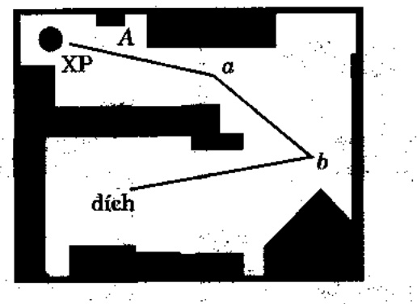

Hình 9.2. Môi trường và lộ trình toàn cục.

Vì rôbô bất đầu đi theo lộ trình để tiến về đích, nó cảm nhận môi trường đối với việc gần gửi những vật thể gần đó, và NEG(oN-line Evolutionary alGorithm) được sử dụng để phát sinh các lộ trình cục bộ nhằm đối phó với những vật thể và những va chậm bất ngờ. Đề mô phỏng tác động của những vật thể chưa biết trong môi trường có những tập tin dữ liệu bổ sung được tạo để biểu diễn những chương ngại vật đó (như các màng “tuồng” được giải thích trước đây). Chúng tôi đã thử nghiệm với 5 tập vật thể chưa biết khác nhau; hình 9.3 a-đ cho thấy hành động của rôbô đối với một trong những tập này.

<!-- page: 128 -->

(a)

(c)

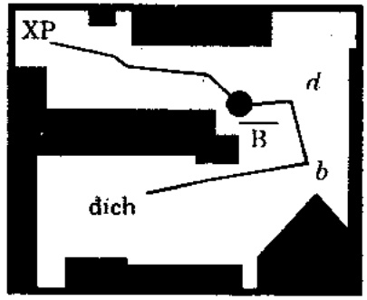

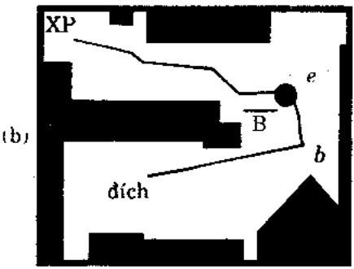

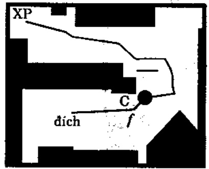

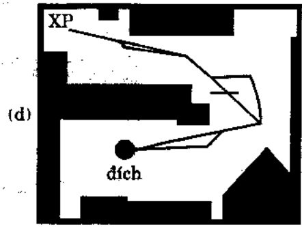

Hình 9.3. Lộ trình thực tế

Khi rô bô di chuyển quá gần phía góc trái - dưới của vật thể ở gần 'A', NEG và phát sinh một lộ trình cục bộ để quẹo ra xa 'A', cũng là lộ trình từng đoạn thắng. Rôi rôbô đi theo lộ trình hiện hành một cách thành công để đến điểm 'a'. Trong khi rôbô đi từ 'a' đến 'b', nó khám phá ra vật thể chưa biết hoặc vật thể 'B'. Bảy giờ EN cập nhật bản đồ và lần nửa NEG phát sinh hành trình cục bộ với điểm thất nút 'd' (hình 9.3a). Khi rôbô di chuyển từ 'd' đến 'b', nó tiến đến quá gần vật thể 'B': do đó, một hành trình cục bộ khác được phát sinh do được biểu diễn bởi điểm thất nút 'e' (hình 9.3b). Rôi rôbô di chuyển từ 'd' đến 'e' và cuối cùng đến đích con 'b'. Bước kế tiếp là đi từ 'b' đến đích, như trong hình 9.3c, đoạn lộ trình này quá sát góc phải-đuối của vật thể 'C'. Do đó, một lộ trình cục bộ khác được phát sinh khi được biểu diễn bởi điểm thất nút 'f và rối đến 'dích'. Hình 9.3d cho thấy lộ trình toàn cục gốc và lộ trình thực sự đã đi. Chủ ý là tiến trình tìm đường châm đứt khi rôbô đến đích hoặc có một điều kiện thất bại xây ra, nghĩa là EN không tìm được lộ trình khả thi trong một khoảng thời gian nào đó (nghĩa là, trong số thể hệ được xác định trong NEG).

Như đã nói, EN kết hợp việc vạch lộ trình nội tại với lộ trình cài trước với cùng cấu trúc dữ liệu và cùng thuật giải tìm lộ trình. Nghĩa là, khác biệt duy nhất giữa FEG và NEG là ở các tham số được dùng: kích thước quản thể pop-size$_{g}$, số thế hệ Tg, chiều dài tối đa của nhiễm sắc thể $n_{g}$, vv... đối với FEG, và pop-size$_{l}$, Tl, nl, vv... đối với NEG. Chủ ý là cả hai FEG và NEG đều thực hiện việc vạch lộ trình toàn cục, ngay cả khi NEG thường phát sinh một hành trình cục bộ, nó thực hiện trên bản đồ toàn cục được cập nhật. Hon nửa, nếu không có trong môi trường, hoặc không có vật thể nào được biết ngay từ đầu giữa vị trí khởi điểm và vị trí đích, thì FEG sẽ phát sinh một lộ trình thẳng chỉ có hai nút: vị trí khởi điểm và vị trí đích. Nó sẽ chỉ phụ thuộc vào NEG để đất rõbô đến đích trong khi tránh những vật thể chưa biết.

## Dưới đây, ta bàn chi tiết các thành phần của NEG và FEG.

Các nhiễm sắc thể là những danh sách thứ tự của các nút lộ trình như trong hình 9.4. Mỗi nút lộ trình, cách khởi con trở trở đến nút kế, gồm có các toạ độ x và y của một điểm thất nút trung gian đọc theo lộ trình và một biến Bool b, cho biết nút được cho là khả thi hay không.

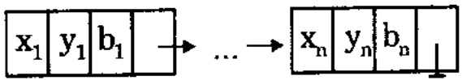

Hình 9.4. Nhiễm sắc thể biểu diễn một lộ trình.

<!-- page: 129 -->

Chiều dài của các nhiễm sắc thể (số nút lộ trình được biểu diễn trong một nhiễm sắc thể) có thể thay đổi. Trong cách vạch lộ trình bên ngoài, chiều dài tối đa của một nhiễm sắc thể được thiết lập là số $n_g$ của các đình, biểu diễn các vật thể đã biết trong môi trường. Không phải là tất cả các lộ trình khả thi đều cần một số lớn (như: $n_g$) nút trung gian: ngay cả trong các môi trường phúc tạp thì lộ trình khả thi cũng có thể hoàn toàn đơn giản. Do đó, ta cho chiều dài của nhiễm sắc thể biến đổi được để đối phó với những tỉnh hướng đó một cách uyền chuyển tốt đẹp.

Trong khi vạch lộ trình nội tại, lộ trình cục bộ để đi vòng qua một chương ngại vật cũng chỉ chữa một số nhỏ các nút, do đó tham số $n_l$ là chiều dài tối đa của nhiễm sắc thể trong giai đoạn này, tương đối nhỏ vào lúc bắt đầu tìm kiếm cục bộ. Nhưng nếu tiến trình tiến hóa không tìm được lộ trình hợp lệ sau một số thể hệ, chiều dài tối đa của nhiễm sắc thể sẽ tăng lên: trong tình huống này thì các lộ trình hợp lệ có thể có nhiều cấu trúc phúc tạp hơn. Trong hệ thống EN, ta đã sử dụng tham số $nl$ là hàm của số thể hệ hiện hành $t$, chính xác hơn là $n_l(t) = t$.

Các quản thể khởi tạo (pop-size$_{g}$ đối với FEG và pop-size$_{l}$ đối với NEG) của các nhiễm sắc thể được phát sinh ngẫu nhiên. Đối với mỗi nhiễm sắc thể, một số ngẫu nhiên được phát sinh trong khoảng 2.. max(2, $n_{g}$) (đối với bộ vạch lộ trình bên ngoài) để xác định chiều dài của nó. Các toạ độ x và y được tạo ngẫu nhiên cho mỗi nút của nhiễm sắc thể đó (các giá trị của toạ độ được giới hạn bên trong biên giới của môi trường).

Đối với mỗi nút của một nhiễm sắc thể, giá trị của biến Bool b được xác định (kiểm soát tính khả thi). Nếu nút khả thi, giá trị b của nó được thiết lập là TRUE, ngược lại sẽ là FALSE. Các phương pháp kiểm soát tính khả thi của một nút (nghĩa là sự hợp lệ của vị trí), sự không vuống các vật thể ở gần, và khả năng liên lạc) là tương đối đơn giản và dựa trên các thuật giải do Pavlidis mô tả.

Tính thích nghi (tổng chi phí lộ trình) của một nhiễm sắc thể $p = <m_1, m_2, ..., m_n>$ được xác định bởi hai hàm lượng giá riêng biệt (cho những cá thể khả thi và không khả thi):

• Đối với lộ trình hợp lệ $p$:

Path-Cost $(p) = w_{d}^{*}\text{dist}(p) + w_{s}^{*}\text{smooth}(p) + w_{c}^{*}\text{clear}(p)$,

trong đó, các trọng $w_{d}$, $w_{e}$; và $w_{e}$ chuẩn hóa tổng chi phí của một lộ trình, và

$$
- d i s t (p) = \sum_ {i = 1} ^ {n - 1} d (m _ {i}, m _ {i + 1}),
$$

trong đó, $d(m_{i}, m_{i+1})$ là khoảng cách giữa các điểm thất nút $m_{i}$ và $m_{i+1}$; nghĩa là hàm $dist(p)$ trả về tổng chiều dài của lộ trình $p$.

$$
- \text {smooth} (p) = \max _ {i = 2} ^ {n - 1} s (m _ {i})
$$

trong đó:

$$
s (m _ {i}) = \frac {\theta_ {i}}{\min \{d (m _ {i - 1} , m _ {i}) , d (m _ {i} , m _ {i + 1}) \}}
$$

nghĩa là hàm smooth(p) trả về độ cong lớn nhất của p tại một điểm thất nút.

$$
- \text {clear} (p) = \max _ {i = 2} ^ {n - 1} c _ {i}
$$

trong đó:

$$
c _ {i} = \left\{ \begin{array}{l} d _ {i} - \tau , \text {neu} d _ {i} \geq \tau \\ a (\tau - d _ {i}), \text {neu nguoc lai} \end{array} \right.
$$

$d_{i}$ là khoảng cách tối thiểu giữa đoạn $(m_{i}, mi+1)$ của lộ trình và tất cả các vật thể đã biết, τ định nghĩa khoảng cách an toàn, và $a$ là hệ số; nghĩa là hàm $clear(p)$ trả về con số lớn nhất để đo sự không vuống mắc giữa tất cả các đoạn của $p$ và những vật thể.

<!-- page: 130 -->

• Đối với lộ trình không hợp lệ $p$:

$$
\text {Path - Cost} (p) = \alpha + \beta + \gamma
$$

trong đó, α là số giao điểm của lộ trình p với tất cả các 'tuồng' của các vật thể, β là số giao điểm trung bình của mỗi đoạn không hợp lệ, và γ là chi phí của lộ trình hợp lệ tệ nhất trong quản thể hiện hành; do biến cuối cùng này, mà tất cả các lộ trình hợp lệ trong quản thể đều tốt hơn bất cứ lộ trình không hợp lệ nào.

Nhiều toán tử (lai,hay đột biến, chèn, xóa, làm trơn, và hoán vị) cũng có trong FEG và NEG. Ta sẽ lần lượt bàn về chúng.

Lai. Lai tạo này cũng giống lai 1 điểm cổ điện được sử dụng rộng rãi trong các thuật giải đi truyền. Nó tái kết hợp những phần "tốt" của các lộ trình có trong cả hai cha-mẹ, để tạo ra một lộ trình đầy hy vọng tốt hơn mà con biểu diễn. Hai nhiễm sắc thể được chọn bị cắt tại một số vị trí và được dán lại với nhau: phân đầu của nhiễm sắc thể thứ nhất với phần thứ thì của nhiễm sắc thể thứ hai, và phân đầu của nhiễm sắc thể thứ hai với phần thứ thì của nhiễm sắc thể thứ nhất. Nhung các điểm giao trong cả hai nhiễm sắc thể đều không được chọn ngẫu nhiên: nếu có các nút không khá thi trong nhiễm sắc thể, các điểm giao rơi vào sau một trong các nút đó.

Đột biến-1 Đột biến này có nhiệm vụ dò tìm chính xác các giá trị toa độ của các nút liệt kê trong nhiễm sắc thể. Nếu một nút của một nhiễm sắc thể được chọn cho đột biến này, thì các toa độ của nó được hiệu chỉnh. Thí dụ, toa độ x ∈ &lt;a, b&gt; (cũng như toa độ y được thay đổi như sau:

$$
\boldsymbol {x} = \left\{ \begin{array}{l l} x - \delta (t, x - a), & \text {neu} r = 0 \\ x - \delta (t, b - x), & \text {neu} r = 1 \end{array} \right.
$$

với r là bit ngẫu nhiên, và hàm δ(t,z) trả về một giá trị thuộc [0...z] sao cho xác suất của δ(t,z) gần bằng 0 sẽ tăng khi t tăng (t là số thế hệ hiện hành của tiên trình tiên hóa). Toán từ được mô hình hóa trên đột biến không đồng dạng được dùng trong các hệ thống tiền hóa cho việc tối ưu hóa phi tuyến. Đột biến này có nhiệm vụ "làm trơn" dạng của lộ trình.

Đột biến\_2. Đột biến này có ích trong những trường hợp cần có một thay đổi lớn hơn trong một giá trị (tình hướng này thường xảy ra trong giai đoạn vạch lộ trình bên trong, khi một chương ngại vật làm nghẽn lộ trình). Nếu một nút của nhiễm sắc thể được chọn cho đột biến này, các tọa độ của nó được hiệu chỉnh. Thí dụ, tọa độ x ∈ &lt;a,b&gt; (cũng như tọa độ y) được biến đổi như sau:

$$
\boldsymbol {x} = \left\{ \begin{array}{l l} \boldsymbol {x} - \Delta (t, \boldsymbol {x} - \boldsymbol {a}), & \text {neu} \boldsymbol {r} = 0 \\ \boldsymbol {x} - \Delta (t, \boldsymbol {b} - \boldsymbol {x}), & \text {neu} \boldsymbol {r} = 1 \end{array} \right.
$$

với r là bit ngẫu nhiên, và hàm Δ (t,z) trả về một giá trị trong khoảng [0,.z] sao cho xác suất Δ (t,z) gần bằng z sẽ tăng khi số thế hệ t tăng.

Chèn. Toán từ này chèn một nút mới vào lộ trình đang có; chỗ nào giữa hai nút nây cũng có cùng xác suất của việc chèn đó.

Xóa. Toán từ này xóa một nút khởi lộ trình; nút nào cũng có cùng xác suất xóa.

Làm trơn. Toán tử này làm trơn một phần lộ trình ở chỗ queo đột ngọt. Đối với điểm thất nút $m_i$ được chọn (có độ cong cao), toán tử này chọn hai điểm thất nút mới $k_1$ và $k_2$ (lần lượt từ các doạn ($m_{i-1}, m_i$) và ($m_i, m_{i+1}$)), chèn chúng vào lộ trình, bổ đi $m_i$; và nó tạo một lộ trình mới:

$$
p ^ {\prime} = (m _ {1}, \dots , m _ {i - 1}, k _ {1}, k _ {2}, m _ {i + 1}, \dots , m _ {n})
$$

<!-- page: 131 -->

Hoán vị. Toán từ này cắt nhiễm sắc thể được chọn thành hai phần (điểm cắt được xác định ngầu nhiên) rời hoán vị hai phần này.

Dựa trên những kết quả thử nghiệm sơ khởi, EN đã chứng tố là hiệu quả và thành cộng so với những việc tìm đường bằng những phương pháp truyền thống. Các kết quả của phiên bản hiện hành của hệ thống trên hai môi trường khác nhau được trình bày trong các hình 9.5 và 9.6.

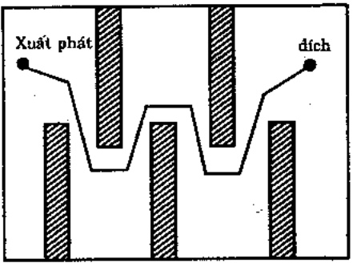

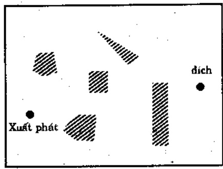

Hình 9.5. Kết quả của EN trên hai môi trường.

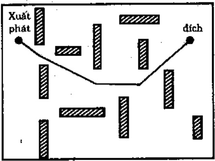

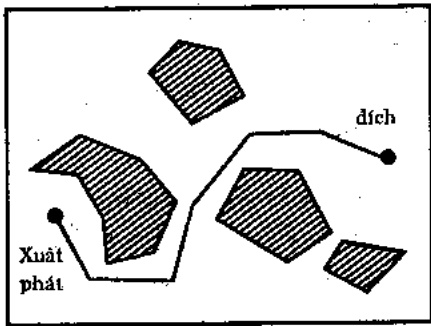

Hình 9.6. Kết quả của EN trên hai môi trường khác.

Dĩ nhiên, có một nhu cầu khai thác tiêm năng của EN bằng cách thực hiện thêm nhiều thử nghiệm trong những môi trường khác nhau, quan trọng nhất là bằng việc cài đặt EN trên một rôbô thực sự. Đồng thời, vẫn còn nhiều vấn đề về việc tìm đương tiền hóa cần được giải quyết; gồm có (1) thiết kế những điều kiện dùng thông minh hơn cho FEG và NEG để nhận thức tốt hơn các đích tối uu hóa (hiện nay các thuật giải dùng khi tìm được một lộ trình khả thi hoặc khi đã trải qua một số thế hệ cổ dinh) (2) đưa ra những tần suất chuyển đổi của toán tử di truyền khác với những tần suất trong phiên bản hiện hành của hệ thống (hiệu chỉnh này sẽ nâng cao hiệu quả của hệ thống và chỉ dựa trên nhận xét là những toán tử khác nhau có lẽ sẽ giữ những vai trò khác nhau, ở những giai đoạn khác nhau, trong quá trình tiến hóa) (3) mở rộng EN để thực thi trong một môi trường có những vật thể không đa diện, (4) kết hợp tri thức của giai đoạn hiện hành về việc tìm kiếm vào cách vận hành của các toán tử (như, có thể có nghĩa hơn khi bảng qua hai lộ trình tại những điểm thất nút không khả thi), và (5) khai thác một cơ chế học nào đó để EN có thể tận dụng được những kinh nghiệm đã qua.

Tuy vây, mắc dù EN rất có hiệu quả và thành công trong nhiều trường hợp, nó văn có một hạn chế lớn: nó cho rằng lộ trình thực sự dù tốt và khả thi có thể đạt được bằng sự xáo trộn nhỏ từ lộ trình tốt nhất hiện hành; hệ thống không được thiết kế để có thể thay thế lộ trình toàn cục hiện hành ; ở một giai đoạn nào đó trong khi bằng qua môi trường, bằng một lộ trình toàn cục khác (có thể là tốt hơn). Như thể cũng dáng để thử nghiệm với các lời giải khác. Không như EN gồm có các bộ vạch lộ trình bên trong và bên ngoài, một bộ tìm lộ trình chuyển đổi có thể hoàn toàn thuộc loại bên trong; nó có thể không ngừng chuyển lộ trình liên kết vị trí hiện hành của rôbô và đích dựa trên thông tin cảm nhận mới thu được.

## 9.5. Lưu ý

Trong doan cuối cùng này, ta bàn ngắn gọn về một số ít các ứng dụng tương đối mới của kỹ thuật tiến hóa, do một số lý đo, rất thú vị

<!-- page: 132 -->

(từ triển vọng xây dựng một chương trình tiến hóa). Ta sẻ lần lượt thảo luận chúng.

Có một số ứng dụng (như các bài toán thiết kế mạng máy tính), trong đó lời giải là đô thị. Bài toán biểu diễn các đô thị trong thuật giải di truyền là một bài toán khá thú vị kiểu đó. Mới dảy, Palmer và Kershenbaum đã thử nghiệm theo nhiều cách biểu diễn cây. Hộ nhận dạng nhiều thuộc tính cần có của một biểu diễn tốt; các thuộc tính này gồm:

1. Tính đầy đủ: khả năng biểu diễn mọi loại cây khả hữu,

2. Tính không có nhiều (bias): tất cả các cây có thể được biểu diễn với cùng số lượng mã hóa,

3. Độ tin cây: chỉ biểu diễn cây,

4. Tính hiệu quả: dễ dàng chuyển dạng giữa biểu diễn cây mà hóa và biểu diễn cây theo nhiều dạng qui uốc thích hợp cho việc lượng giá hàm thích nghi và các ràng buộc,

5. Tính cục bộ: những thay đổi nhỏ trong biểu diễn cây tạo ra những thay đổi nhỏ trong cây.

Đương nhiên, biểu diễn lý tưởng của cây sẽ có tất cả các thuộc tính trên. Tuy vậy, đa số các biểu diễn hiện có không đạt được điều này. Ngoài ra còn một vài biểu diễn. Các biểu diễn này gồm:

\- Biểu diễn vectơ đặc trưng, ở đây cây được biểu diễn bằng vectơ nhi phân có chiều dài bằng số cạnh của đồ thị cấp trên,

\- Biểu diễn tiền bối (ông bà), ở dây nút được thiết kế là góc và các ông bà của mỗi nút được ghi nhận: ở dây cây được mã hóa là vectơ số nguyên có chiều dài bằng số nút,

\- Biểu diễn các số Prufer, ở đây cây được mã thành số có n -2 “chữ số” (là số nút của cây), mỗi “chữ số” là số nguyên, xác định bằng một thuật giải đặc biệt.

Các tác giả cũng đề nghị một biểu diễn mới, dựa trên một quan sát đơn giản là một số nút nhất định phải nằm bên trong và các nút khác phải là nút lá. Trong biểu diễn này nhiễm sắc thể giữ giá trị nhiều của mỗi nút và mỗi cạnh có thể có (như vậy, cây được biểu diễn bằng vectơ $n + \frac{n(n + 1)}{2}$ số); các nhiều biến đổi ma trận chỉ phí C\_{ij} của đồ thị:

$$
C _ {i j} ^ {\prime} = C _ {i j} + P _ {1} (C _ {m a x}) b _ {i j} + P _ {2} (C _ {m a x}) (B _ {i} + b _ {j}),
$$

trong đó, P₁ và P₂ là các tham số của phương pháp, và Cmax là chỉ phí liên kết tối đa. Cây mà nhiễm sắc thể biểu diễn được tìm thấy bằng cách áp dụng thuật giải Prim, để tìm cây bắc câu tối thiểu qua các nút, bằng ma trận chi phí bị nhiều. Biểu diễn này cũng có thể mã hóa bất cứ cây nào được cung cấp các giá trị bᵢ thích hợp.

Một văn bản khác của Abuali và cộng sự khám phá một kế hoạch mã hóa mới để biểu diễn các cây bậc câu (đối với bài toán cây bậc câu tối thiểu). Kế hoạch mã hóa này dựa trên các nút được gọi là định thức, là các vectơ có $n-1$ số nguyên, số k thứ i trong một mã định thức tương ứng với một cạnh từ đình $k$ đến $i+1$.

Esbensen trình bày một thuật giải di truyền tìm kiếm các cây Steiner tối uu. Bài toán cây Steiner (phiên bản thuộc loại NP-đầy đủ) được hình thức hóa như sau: cho một đồ thị và một tập con xác định các định, công việc phải làm là tìm một đồ thị con chi phí tối thiểuバック qua các định xác định. Tác giả đã dùng một bộ giải mã tất định thông dịch các tập các định Steiner được chọn là một cây Steiner hợp lệ. Như vậy mỗi nhiễm sắc thể là một chuỗi nhị phân mà mỗi bit tương ứng với một định; một chuỗi nhị phân như thế biểu diễn một tập con các định Steiner. Tập con các định này cùng với

<!-- page: 133 -->

các đính xác định tạo thành khởi điểm cho bộ giải mã, bộ này (1) xây dựng đồ thị con do các đính này gây ra; (2) tính toán máy cây bậc cầu tối thiểu cho đồ thị con này; (3) xây dựng (từ cây bậc cầu tối thiểu này một đồ thị con khác bằng cách thay mỗi cạnh bằng một lộ trình ngắn nhất tương ứng trong đồ thị gốc; (4) tính toán một cây bậc cầu tối thiểu cho đồ thị con cố được; và (5) tính toán cây Steiner bằng cách xóa lần lượt (từ cây bậc cầu tối thiểu mới nhất) tất cả các đính không có trong danh sách gốc các đính cấp 1.

Bài toán phủ tập hợp (SCP) là bài toán phủ các hàng của một ma trận nhị phân $n \times k$, $A = (a_{ij})$, bằng một tập con các cột với chi phí tối thiểu; bài toán có nhiều ứng dụng thực hành (vị trí của các phương tiện, lập thời biểu nhóm làm việc, vv...). Mỗi cột $1 \leq j \leq k$ có kết hợp chi phí $c_j$; như vậy SCP có thể được diễn tả là:

$$
\sum_ {j = 1} ^ {k} c _ {j} x _ {j}
$$

với $x_{j}$ biểu thị một biến quyết định nhiệm phân ($x_{j} = 1$ nếu và chỉ nếu cột $j$ được chọn trong bao) thỏa:

$$
\sum_ {j = 1} ^ {k} a _ {i j} x _ {j} \geq 1,
$$

với mọi  $1 \leq i \leq n$ .

Beasley thử nghiệm nhiều bài toán SCP với thuật giải di truyền được hiệu chỉnh, từ 200 hàng, 1000 cột đến 1000 hàng 10000 cột. Các kết quả thất tốt; thuật giải đã phát sinh những lời giải tối ưu cho những bài toán có kích thước nhỏ hơn và những lời giải chất lượng cao cho những bài toán kích thước lớn hơn.

Chú ý ràng SCP có một biểu diễn "lý tưởng" từ triển vọng của một GA: chuỗi nhị phân của các $x_{j}$ ($1 \leq j \leq k$) biểu diễn một lời giải cho bài toán. Không cần thêm việc mã hóa nào. Hàm lượng giá (cho những cá thể khả thi) cũng dễ hiểu; chỉ là:

$$
f (x) = \sum_ {j = 1} ^ {k} c _ {j} x _ {j}
$$

Thách thức chính trong SCP là vấn đề tính khả thi; bất cứ toán từ nào được áp dụng cho các chuỗi nhị phân như thế cũng có thể tạo ra các con vi phạm ràng buộc của bài toán (nghĩa là, có một số hàng không được phủ). Beasley đã dùng một thuật giải sửa chữa để duy trì tính hợp lệ của lời giải. Thuật giải sửa chữa này có nhiệm vụ phủ những hàng chưa được phủ; việc tìm những cột bổ sung đưa trên tỉ lệ giữa chi phí của một cột và số các hàng chưa phủ mà nó sẽ phủ. Một lưu ý thú vị là một khi tiến trình sửa chữa hoàn tất và một cá thể không hợp lệ-được chuyển thành hợp lệ, thì một buốc tối uu hóa cục bộ được thực hiện, trong đó ta có thể bổ đi các cột không cần thiết (nghĩa là, các cột có thể bổ đi mà không vi phạm các ràng buộc).

Bui và Eppley mô tả thuật giải di truyền kết hợp dùng cho bài toán “nhóm” tối đa và cung cấp những kết quả thực nghiệm của nó trên những trường hợp thử nghiệm có đến 1500 định và trên nửa triệu canh. Bài toán nhóm tối đa là bài toán tìm một đồ thị con đủ (nghĩa là, nhóm) của một đồ thị được cho có kích thước cực đại (được đo bằng số đình). Phiên bản quyết định của bài toán là NP-đầy đủ; không có gì ngạc nhiên là nhiều phương pháp tính gần đúng khác nhau đã được đề nghị. Chủ ý là công việc phải làm là tìm một tập con các đình, do đó có thể dùng biểu diễn nhị phân dễ hiểu: vectơ nhị phân.

$$
<   \dot {b} _ {1}, \dots , b _ {n} >
$$

định nghĩa tập con đó (với mọi n định được sắp xếp theo thứ-tự ngẫu nhiên, mà tất cả các định là $b_i = 1$ bao hàm việc chọn nút thứ i). Thay vì thiết kế các toán tử phúc tập có thể duy trì tính khả thi của các

<!-- page: 134 -->

lời giải (nghĩa là, có thể báo đảm rảng con là một nhóm) hoặc thay vì thiết kế một thuật giải sửa chữa (có thể sửa một lời giải ngẫu nhiên thành một nhóm), các tác giả xây dựng một hàm mục tiêu thông minh có thể phân biệt giữa các không là-nhóm và gần như-nhóm; hàm này được định nghĩa là:

$$
f (X) = \alpha | X | + \beta \frac {2 e (X)}{| X | (| X | - 1)}
$$

với α và β là số nguyên (lần lượt được gọi là trọng lực lượng và trong hoàn chỉnh) và $e(X)$ trả về các cạnh trong đó thị con do X phát sinh. Một chú ý thú vị là tỉ lệ $\beta/\alpha$ có thể thay đổi: ban đầu thì nó nhỏ (giai đoạn khai thác, mà tính cơ bản của lời giải được nhân mạnh) và khi thuật giải tiến triển, tỉ lệ này tăng (tính hoàn chỉnh của lời giải được nhân mạnh). Điều quan trọng cần để ý là thuật giải được mô rộng bằng cách kết hợp một thủ tục con tối ưu hóa cục bộ. Thủ tục con heuristic này (1) quyết định xem việc loại bỏ một định nào đó (các định được xét theo một thủ tự đặc biệt) có cải thiện độ thích nghi của lời giải không (nếu có, đỉnh bị loại) và (2) cũng có gắng tăng tính cơ bản của lời giải; nó quyết định xem thêm vào một định có tăng giá trị thích nghi của lời giải không (nếu có, đỉnh được thêm vào).

Một ứng dụng thú vị của kỹ thuật tiến hóa để chất hàng lên tấm đỡ được Juliff mô tả. Bài toán này là bài toán lập thời lịch đặc biệt gồm có (1)- chất các hợp chứa hàng lên các tâm đỡ và (2) chống các tấm này lên xe tải. Yêu cầu bài toán thật phúc tạp do phải duy trì một cân bằng về tải (mọi lúc) trong khi giao hàng, và cực đại hóa tính hiệu quả của việc chất lên và đỡ hàng xuống. Cũng như đối với những bài toán lập lịch, ta có thể xây dựng một hệ thống với các biểu diễn trực tiếp hoặc gián tiếp; trong trường hợp gián tiếp, bộ lập lịch (hoặc trong trường hợp này là bộ xây dựng tải), có thể hoàn thành công việc. Nhung, cả hai cách tiếp cận này đều có những bất lợi: các toán từ bài toán đặc tả cao cấp (biểu diễn trực tiếp) hay tìm kiếm giới hạn (biểu diễn gián tiếp): thường thì một nhiễm sắc thể 266

biểu diễn một tính năng còn những tính năng khác không được biểu diễn đầy đủ (tri thức của những tính năng bổ sung này chỉ được kết hợp trong bộ xây dựng tải) vì thể tìm kiếm di truyền không được hướng dẫn đầy đủ.

Juliff phát triển một số hệ thống cho việc chất hàng lên tâm dở hàng dựa trên biểu diễn gián tiếp và những bộ xây dựng tải thông minh; một trong những hệ thống này kết hợp một cấu trúc đa nhiễm sắc thể để xử lý nhiều tính năng khác nhau của bài toán (thực ra có 3 nhiễm sắc thể được dùng); và không có gì ngạc nhiên, hệ thống đa nhiễm sắc thể thành công hơn các hệ thống một nhiễm sắc thể.

Gân dây, nhiều ứng dụng thú vị của kỹ thuật tiến hóa vận dụng vào nhiều bài toán thuộc khoa học quản lý (gồm những bài toán lập lịch và thời khóa biểu) đã được báo cáo.

Sự quan tâm vào các kỹ thuật tiến hóa của kỹ thuật công nghệ; nhiều bài viết để cập những vấn đề cụ thể và cung cấp những mô tả về những lời giải cụ thể trong lĩnh vực này.

Ta hây kết luận chương này bằng một nhận xét chung là ngày càng có nhiều ứng dụng khác nhau về các kỹ thuật tiến hóa cho những bài toán tối ưu tổ hợp (kể cả TSP) một số thuật giải tìm kiếm cục bộ heuristic để tăng hiệu quả. Điều này được thực hiện như một bước riêng rõ của thuật giải, hoặc những thuật giải đó được sử dụng như những đột biến thông minh. Các kết quả do Yagiura và Ibaraki báo cáo trong nghiên cứu gần đây của họ cho thấy rằng những thuật giải tìm kiếm cục bộ di truyền như vậy là những kỹ thuật mạnh sánh ngang với những kỹ thuật khác (tìm kiểm cục bộ đa khởi điểm ngẫu nhiên hay các thuật giải di truyền thuần chất).

Những kết quả này cũng nhân mạnh sự quan trọng của các toán từ đột biến, chúng không chỉ là các toán tử phụ, mà là những thành phần thiết yếu của tất cả các hệ thống tiến hóa. Điều này phù hợp (ò

<!-- page: 135 -->

một nghĩa nào đó) với các kết quả gần đây của Jones, ông đã thử nghiệm với các đột biến vị mô và cho thấy tầm quan trọng trong các cách mã hóa nhị phân (đổi với toán từ lai tạo). Dù thể nào, đường như tính cơ bản của các mẫu tự được dùng cho việc mã hóa các cá thể càng cao, vai trò của (các) toán tử đột biến càng lớn. Đây là trường hợp của các thuật giải mà các cá thể được biểu diễn bằng những vectơ thực, các số nguyên, các ma trận, các máy trạng thái hữu hạn, vv... Không có gì ngạc nhiên khi có một khuynh hướng mới trong phương pháp lập trình di truyền, có thể nhân mạnh vai trò của nhiều loại toán tử đột biến khác nhau; điều này cũng cho phép giảm rất nhiều các kích thước quản thể trong các phương pháp lập trình di truyền, do đó tăng thêm hiệu quả của chúng.

## PHU LUC

<!-- page: 136 -->

## Phụ lục 1

## CÁC CHỦ ĐỀ CHỌN LỌC

Với một bài toán được hình thức hóa tốt, ta có thể chứng minh được thuật giải di truyền hội tụ được về lời giải tối ưu. Tuy nhiên, các ứng dụng thực tiễn thường khác xa lý thuyết, do:

\- Cách biểu diễn nhiễm sắc thể có thể tạo ra không gian tìm kiếm khác với không gian thực sự của bài toán;

\- Số bước lặp, khi cài đặt, phải xác định trước, và

\- Kích thước quản thế giới hạn.

Những quan sát này hàm ý ràng, trong một số trường hợp, GA không thể tìm được lời giải tối ưu; nguyên nhân chính là do GA hội tụ sớm về các lời giải tối ưu cục bộ. Hội tụ sớm là vấn đề lớn của thuật giải di truyền cũng như các thuật giải tối ưu hóa khác. Nếu hội tụ xảy ra quá nhanh, thì các thông tin dáng giá đã phát triển trong quản thể thường bị mất mát.

Eshelman và Schaffer đã giới thiệu một số chiến lược mới nhằm chống hội tụ sớm; đó là (1) chiến lược ghép đôi, được gọi là tránh hỗn giao, (2) sử dụng phép lai đồng dạng, và (3) khám phá những chuỗi trùng lắp trong quản thể.

Tuy nhiên, hâu hết những nghiên cứu về lĩnh vực này đều liên quan đến:

• Quy mô và loại sai số do cơ chế tạo mẫu và

\- Bản chất của hàm mục tiêu.

<!-- page: 137 -->

## i. CƠ CHỀ TẠO MẦU

Dương nhu có hai vấn đề quan trọng trong tiên trình tiên hóa của tìm kiếm di truyền: Tính đa dạng quản thể và áp lực chọn lọc. Những yếu tố này liên quan mạnh mẻ với nhau: khi tăng áp lực chọn lọc thì tính đa dạng của quản thể sẽ giảm, và ngược lại. Nói cách khác, áp lực chọn lọc mạnh “ùng hộ” tính hội tụ sớm của tìm kiếm GA; nhưng nếu áp lực chọn lọc yếu có thể làm cho tìm kiếm thành vô hiệu. Như vậy, việc cân đối giữa hai yếu tố này rất quan trọng; các cơ chế tạo mẫu đều có khuynh hướng đạt đến mục đích này.

Công trình đầu tiên, và có lẻ đáng ghi nhận nhất, thuộc về DeJong, vào năm 1975. Ông đã xem xét các biến thể của một chọn lọc đơn giản đã được trình bày trong các chương trước. Biến thể đầu tiên – mô hình phát triển ưu tú – bảo tôn nhiễm sắc thể tốt nhất. Biến thể thứ hai – mô hình giá trị mong đợi – giảm độ hỗn loạn của chọn lọc. Thực hiện điều này bằng cách đưa vào một biến đêm cho từng nhiễm sắc thể v, với khởi tạo đầu $f(v)/\overline{f}$, và giám dân xuống 0.5 hay 1.0 khi nhiễm sắc thể được chọn tái sinh cho lai hoặc đột biến. Khi biến đêm nhiễm sắc thể tut xuống dưới số 0, thì nó không còn thích hợp để được chọn nữa. Biến thể thứ ba – mô hình giá trị mong đợi ưu tú – là kết hợp của hai biến thể trên. Mô hình thứ tư – mô hình nhân tố tập trung – một nhiễm sắc thể mới sinh thay cho nhiễm sắc thể “cữ” và một nhiễm sắc thể bị tiêu hủy sẽ được chọn trong số nhiễm sắc thể giống với nhiễm sắc thể mới.

Năm 1981, Brindle đã xem xét thêm một số biến thể khác: tạo mẫu tất định, tạo mẫu hỗn loạn phần du không thay thể, dấu tranh hỗn loạn, và tạo mẫu hỗn loạn phần du có thay thể. Nghiên cứu này xác nhận uu thế hơn hẩn của các cải tiến so với chọn lọc đơn giản. Đặc biệt, phương pháp tạo mẫu hỗn loạn phần du có thay thể cấp phát các mẫu, tùy theo các phần nguyên của giá trị cần có của các biến có xảy ra trong mỗi nhiễm sắc thể trong quản thể mối và nơi các nhiễm sắc thể cạnh tranh tương ứng với phần thập phân đối với các vị trí còn lại trong quản thể, đây là phương pháp thành công nhất và được nhiều nhà nghiên cứu xem như chuẩn. Năm 1987, Baker đã giới thiệu một nghiên cứu lý thuyết toàn diện về các cái tiến này bằng một số độ đo được định nghĩa tốt, và cũng đưa ra một phiên bản mối gọi là tạo mẫu không gian hôn loạn. Phương pháp này dùng cách "quay" bánh xe định tỉ lệ trước để thực hiện chọn lọc. Bánh xe này được thiết kế theo chuẩn, được quay với một số khoảng chia đều theo kích thước quản thể, khác với những gì thường thấy ở một bánh xe.

Các phương pháp khác để tạo mẫu quản thể là đánh trọng các nhiễm sắc thể: nhiễm sắc thể được chọn theo thứ hạng của chúng thay vì theo giá trị thực. Các phương pháp này đưa trên nhận xét về lý do hội tụ sớm thường do có sự hiện diện của các siêu cá thể, những siêu cá thể này tốt hơn khả năng thích nghi trung bình của quản thể nhiều. Những siêu cá thể này có số con nhiều hơn và (do kích thước quản thể không đối) sẽ ngân các cá thể khác sinh sản trong các thể hệ kế tiếp. Trong một số thể hệ, một siêu cá thể có thể loại bỏ chất liệu di truyền tốt và làm cho hội tụ sớm về tối ưu (có thể là cục bộ).

Có nhiều cách xếp hạng. Thí dụ, Baker lấy giá trị do người sử dụng định nghĩa, MAX, như cận trên của số con cần có, và một đường cong tuyến tính bằng qua MAX, sao cho vùng bên dưới đường này bằng với kích thước quản thể. Theo cách đó ta có thể dễ dàng quyết định sự khác biệt giữa số con mong đợi với các cá thể "kể cận". Thí dụ, với MAX = 2.0 và pop-size = 50, khác biệt giữa số con mong đợi và các cá thể "kể cận" sẽ là 0.04 = 2.0/50.

Một khả năng khác là dùng tham số người sử dụng định nghĩa q và định nghĩa một hàm tuyến tính, thí dụ:

$$
\text {prop} (r a n k) = q - (r a n k - 1) ^ {*} r,
$$

<!-- page: 138 -->

hay một hàm phi tuyến như:

$$
\text {prop} (r a n k) = (1 - q) ^ {r a n k - 1}.
$$

Cả hai hàm đều trả về xác suất cả thể được một xếp hàng rank (rank = 1 nghĩa là cả thể tốt nhất, rank = pop-size là cả thể xấu nhất) trong một lần chọn.

Cả hai phương sách này đều cho phép người sử dụng tác động vào áp lực chọn lọc của thuật giải. Trong trường hợp hàm tuyến tính, yêu cầu:

$$
\sum_ {i = 1} ^ {p o p \_ s i z e} p r o b (i) = 1
$$

có nghĩa là:

$$
q = r (p o p - s i z e - 1) / 2 + 1 / p o p - s i z e
$$

nếu $r = 0$ (kéo theo $q = 1 / pop - size$) thì không có áp lực chọn lọc gì cả: tất cả các cá thể được chọn theo cùng xác suất. Mặt khác, nếu

$$
q - (p o p - s i z e - 1) ^ {*} r = 0
$$

thì:

$$
r = 2 / (n (n - 1)), v \dot {a} q = 2 / n,
$$

cho áp lực chọn lọc lớn nhất.

Nói cách khác, nếu một hàm tuyến tính được chọn để tạo xác suất cho cá thể được xếp hạng,$^{1}$ một tham số riêng $q$, biến thiên trong khoảng [1/pop-size, 2/pop-size] có thể kiểm soát áp lực chọn lọc của thuật giải. Thí dụ, nếu $pop-size = 100$, và $q = 0.015$ thì $r =$ $q / (pop - size - 1) = 0.00015151515, \text{ và } prop(1) = 0.015, prop(2) = 0.0148484848, \ldots.$

prop(100) = 0.00000000000000000051.

Đối với hàm phi tuyến, tham số $q \in (0..1)$ không phụ thuộc kích thước quản thể; giá trị $q$ lớn hơn có nghĩa là áp lực chọn lọc của thuật giải mạnh hơn. Thí dụ, nếu $q = 0.1$ và pop-size = 100, thì $prop(1) = 0.100$ và $prop(2) = 0.1 * 0.9 = 0.090$, $prop(3) = 0.1 * 0.9 * 0.9 = 0.081$, ..., $prop(100) = 0.000003$. Chú ý rằng:

$$
\sum_ {i = 1} ^ {p o p \_ s i z e} p r o b (i) = 1 = \sum_ {i = 1} ^ {p o p - s i z e} q (1 - q) ^ {i - 1} \approx 1
$$

(Có thể thay dấu ≈ trong công thức trên bằng dấu =; khi ấy, chỉ cần định nghĩa  $prop(i) = c^{*}q(1-q)^{i-1}$  với  $c = \frac{1}{1 - (1 - q)^{pop - size}}$ )

Những cách tiếp cận nhu vây, mặc dù được dưa ra để cải tiến hành vi của thuật giải di truyền trong một số trường hợp, nhưng cũng có những khuyết điểm. Trước hết, chúng buộc người sử dụng phải quyết định lúc nào thì dùng đến các cơ chế này. Thứ hai, chúng bỏ qua các thông tin có liên quan giữa các nhiễm sắc thể khác nhau. Thứ ba, chúng xử sự với tất cả các trường hợp đều như nhau, bất chấp tâm quan trọng của từng bài toán cụ thể. Cuối cùng, các thủ tục chọn theo xếp hạng vi phạm lý thuyết Lược đồ. Tuy nhiên, chúng giúp tránh vấn đề định tỉ lệ (sẽ được thảo luận trong phần kế tiếp), chúng kiểm soát áp lực chọn lọc tốt hơn, và (cặp đôi với việc sinh sản mỗi-lần-một-con) làm cho việc nghiên cứu tập trung nhiều hơn.

Một phương pháp chọn lọc bổ sung, chọn lọc tranh dua, kết hợp ý tưởng xếp hạng theo nhiều cách hiệu quả và rất dáng quan tâm. Phương pháp này (trong một lần lặp) sẽ chọn một số $k$ cá thể và chọn ra từ tập $k$ phần tử này phần tử tốt nhất cho thể hệ kế tiếp.

<!-- page: 139 -->

Tiến trình này được lập lại pop-size lần. Rô ràng, nếu $k$ lớn sẽ làm tăng áp lực chọn lọc; thường $k = 2$ (kích thước tranh dua). Ô đây có thể thêm vào hương vị cho bài toán mô phỏng luyện thép bằng chọn lọc Boltzmann có cân nhắc, trong đó hai phần tử $i$, $j$ tranh đua nhau, và kẻ tháng được xác định qua công thức:

$$
\frac {1}{1 + e \frac {f (\bar {i}) - f (j)}{T}}
$$

với T là nhiệt độ và  $f(i)$  và  $f(j)$  lần lượt là các trị của hàm mục tiêu của i và j (công thức dành cho bài toán cực tiểu hóa).

Back và Hoffmeister đã khảo sát về các đặc trưng của thủ tục chọn lọc. Hộ chia các thủ tục chọn lọc thành hai loại: động và tỉnh - chọn lọc tỉnh yêu cầu xác suất chọn lọc là một hàng cho mọi thể hệ (thí dụ, chọn lọc theo hạng), trong khi chọn lọc động thì không cần điều này (nghĩa là, chọn lọc theo tỉ lệ). Một cách phân loại khác là chia các thủ tục thành các loại tiêu diệt và bảo tôn - chọn lọc bảo tôn yêu cầu có xác suất chọn lọc không bằng 0 đối với mỗi cá thể, trong khi chọn lọc tiêu diệt thì không. Các thủ tục chọn lọc tiêu diệt lại được chia làm hai loại phải và trái: trong chọn lọc tiêu diệt trái, các cá thể tốt nhất bị ngăn không cho sinh sản để tránh hội tụ sớm do các siêu cá thể (chọn lọc phải thì không). Ngoài ra, một số thủ tục chọn lọc thuần chủng, nghĩa là cha-mệ chỉ được phép sinh con trong một thể hệ thời (nghĩa là, thời gian sống của mỗi cá thể bị giới hạn trong một thể hệ thời bất kế độ thích nghi của nó). Chứng ta sẽ trở lại vấn đề chọn lọc thuần chủng và tiêu diệt trong phụ lục 2, khi bàn về các chiến lược tiến hóa và so sánh chúng với các thuật giải di truyền. Một số chọn lọc có tính thế hệ theo nghĩa là tập các cha-mệ được giữ cố định cho đến khi tất cả các con của thể hệ tiếp theo được sinh ra hoàn toàn; trong các cách chọn lọc trên đường tiến thì con sẽ lập tục thay thế cha-mệ của nó. Một số chọn lọc là uu tú theo nghĩa là một số (hay tất cả) cha-mệ được phép đồng thời qua chọn lọc cùng với con của chúng.

Trong hâu hết các thử nghiệm được trình bày trong phần này, ta dùng một biến thế mới, gồm hai bước, của thuật giải chọn lọc cơ bản. Nhưng hiệu chỉnh này không chỉ là một cơ chế chọn lọc mới: nó có thể sử dụng bất cứ phương thức tạo mẫu nào và chính nó cũng được thiết kế để giảm những tác động ngoài ý muốn của một số đặc trưng của hàm. Nó rơi vào loại chọn lọc động, bảo tồn, có tính thế hệ và uu tú.

Cấu trúc của thuật giải di truyền cải tiến (modGA) được trình bày trong hình p1. Cải tiến thuật giải di truyền cổ điện là trong modGA, ta không phải thực hiện bước chọn lọc "tái sinh $P'(t)$ từ $P(t-1)$", mà chọn các nhiễm sắc thể $r$ một cách độc lập (không cần thiết phải khác biệt) để sinh con và các nhiễm sắc thể (phân biệt) bị loại. Sau khi các bước "chọn-cha-mệ" và "chọn-loại" của modGA đã được thực hiện, có ba nhóm chuỗi (không nhất thiết rời rạc) trong quản thể:

\- $r$ chuỗi (không nhất thiết phân biệt) để sinh sản (chame),

\- chính xác r chuỗi bị loại, và

\- các chuỗi còn lại gọi là chuỗi trung tính.

Số chuỗi trung tính trong một quản thể (ít nhất là pop-size - 2r và nhiều nhất là pop-size-r) tuỷ thuộc vào số cha-mệ đã chọn lọc phân biệt và số các chuỗi gói lên nhau trong loại “cha-mệ” và loại “loại”. Rồi quản thể mới $P(t+1)$ được tạo ra, cần có pop-size - r chuỗi (tất cả các chuỗi, trừ những chuỗi đã chọn để loại) và r con của r cha-mệ.

<!-- page: 140 -->

## Thủ tục modGA

bất dâu.

$\mathbf{t}\gets 0$

khôi tạo P(t)

lượng giá P(t)

khi (điều kiện - dùng chua thỏa) làm

bất dâu

$t \leftarrow t + 1$

chọn cha-mẹ từ P(t-1)

chọn các cá thể loại từ P(t-1)

tạo P(t): tái sinh cha-mệ

lương giá P(t)

hết khi

hết modGA

## Hình P.1. Thuật giải modGA

Như đã trình bày, thuật giải có một bước khó-giải quyết: làm sao chọn r nhiễm sắc thể để loại. Rô ràng ta muốn thực hiện chọn lọc này theo cách mà các nhiễm sắc thể mạnh hơn ít khả năng bị loại hơn. Muốn thể, ta thay đổi phương thức tạo quản thể mới $P(t+1)$ như sau:

bước 1: chọn r cha-mệ tử $P(t)$. Môi nhiễm sắc thể đã chọn (hay mỗi bản sao của một số nhiễm sắc thể được chọn) được đánh dấu là có thể áp dụng chính xác cho một toán từ di truyền có định,

bước 2: chọn (pop-size - r) nhiễm sắc thể khác nhau từ $P(t)$ và sao chép chúng vào $P(t+1)$

bước 3: cho r nhiễm sắc thể cha-mệ, để có thể sinh được chính xác r con

bước 4: chèn r con mới này vào quản thể $P(t+1)$

Những chọn lọc trên (ở bước 1 và 2) được thực hiện tùy thuộc độ thích nghi của các nhiễm sắc thể (phương pháp tạo mẫu không gian hỗn loạn). Có một số khác biệt quan trọng giữa các chương trình chọn lọc khác nhau đã được bàn đến trước đây và chương trình vừa trình bày ở trên. Trước tiên, cả cha-mệ và con đều có nhiều cơ may để hiện hữu trong thế hệ mới: một cá thể trên trung bình sẽ có nhiều cơ hội để được chọn làm cha-mệ (bước 1) và, đồng thời, được chọn trong quản thể mối của (pop-size-r) phân tử (bước 2). Nếu như thể, một hoặc nhiều con của nó sẽ nhận một số trong r vị trí còn lại. Thứ hai, ta áp dụng các toán tử di truyền trên toàn bộ các cá thể tương phản với các bit cả thể (đột biến cố điện). Điều này có thể tạo ra cách xử lý đồng nhất tất cả các toán tử được dùng trong chương trình tiến hóa. Như vậy, nếu ba toán tử được dùng (đột biến, lai tạo, đảo), một số cha-mệ sẽ qua đột biến, một số khác qua lai tạo và số còn lại bị đào.

<!-- page: 141 -->

Cách tiếp cận modGA có một số đặc tính lý thuyết như thuật giải di truyền cổ điện. Ta có thể viết lại phương trình tăng trưởng (3.3) trong chương 3 thành:

$$
\xi (S, t + 1) \geq \xi (S, t) * p _ {s} (S) * p _ {g} (S)\tag{1}
$$

trong đó $p_{s}(S)$ biểu diễn xác suất sinh tôn của lược độ $S$ và $p_{g}(S)$ biểu diễn tăng trưởng của lược độ $S$. Tăng trưởng của lược độ $S$ xảy ra trong giai đoạn chọn lọc (giai đoạn tăng trưởng) khi nhiều bản sao của các lược đồ trên trung bình được chép vào quản thể mới. Xác suất tăng trưởng $p_{s}(S)$ của lược độ $S$, $p_{g}(S)=eval(S,t)/\overline{F(t)}$, và $p_{s}(S)>1$ đối với các lược đồ tốt trên trung bình. Rối các nhiễm sắc thể được chọn phải sống sót qua lai tạo và đột biến các toán tử di truyền (giai đoạn cơ rút). Như đã nói trong chương 3, xác suất sinh tôn $p_{s}(S)$ của lược độ $S$, là:

$$
p _ {s} (S) = 1 - p _ {c} \frac {\delta (S)}{m - 1} - p _ {m.} o (S) <   1
$$

Phương trình (1) hàm ý là lược đồ ngắn, bậc thấp, $p_g(S)$\*$p_s(S)>1$; do đó mà những lược đồ như thế nhận số lần thử tăng theo lũy thừa trong những thể hệ kế tiếp. Điều tương tự cũng đúng cho phiên bản modGA. Số nhiễm sắc thể cần có của lược đồ S trong thuật giải modGA cũng là kết quả của số nhiễm sắc thể trong quản thể cũ $\xi(S, t)$, xác suất sinh tôn ($p_s(S)<1$) và xác suất tăng trưởng $P_g(s)$ – điểm khác biệt duy nhất là sự thông dịch các thời kỳ tăng trưởng và cơ rút và bậc tương đối của chúng. Trong phiên bản modGA, thời kỳ cơ rút là: n - r nhiễm sắc thể được chọn cho quản thể mới. Xác suất sinh tồn được định nghĩa là một phần các nhiễm sắc thể của lược đồ S không bị chọn loại. Thời kỳ tăng trưởng xảy ra tiếp đó và được biểu hiện trong việc xuất hiện của r con mới. Xác suất tăng trưởng $p_g(S)$ của lược đồ S là xác suất tăng của lược đồ này, do các con mới sinh ra từ r cha-mệ. Lần nửa, đối với các lược đồ ngán, bậc thấp, $p_g(S)^*p_s(S)>1$ vẩn đúng và những lược đồ đó nhận các lần thử tăng theo lũy thừa trong các thể hệ kế tiếp:

Một trong những ý tưởng về thuật giải modGA là việc sử dụng các tài nguyên lưu trữ sẵn tốt hơn: kích thước quản thể. Thuật giải mới tránh được việc để lại những bản sao y hết của cùng các nhiễm sắc thể trong các quản thể mới (điều này cũng có thể xảy ra ngầu nhiên, nhưng thường rất hiểm). Mặt khác, thuật giải cổ diễn rất dễ tạo nhiều bản sao như thế.Hon nửa, nhiều sự cố như thể về các siêu cả thể tạo xác suất cho một phần ứng đáy chuyển: có cơ hội cho một số lượng lớn hơn các bản sao y như thế trong quản thể kế tiếp v.v... Cách này khiển kích thước quản thể bị giới hạn có thể thực sự chỉ biểu diễn một số giám của các nhiễm sắc thể đồng nhất. Sử dụng không gian nhỏ sẽ làm giám hiệu quả của thuật giải. Chú ý rằng cơ sở lý thuyết của thuật giải di truyền giả định kích thước quản thể vô hạn. Trong thuật giải modGA, ta có thể có một số thành viên của gia đình nhiễm sắc thể, nhưng tất cả các thành viên như thể đều khác nhau (dùng từ gia đình là ta muốn nói đến những con của cùng cha mẹ).

Như một thí dụ về một nhiễm sắc thể với một giá trị mong đợi trong $P(t+1)$ bằng $p = 3$. Cũng giả định là thuật giải di truyền cổ điện có xác suất lai tạo và đột biến $p_c = 0.3$ và $p_m = 0.003$. Sau bước chọn lọc, sẽ có chính xác $p = 3$ bản sao nhiễm sắc thể này trong quản thể $P(t+1)$ trước khi sinh. Sau khi sinh, cho chiều dài nhiễm sắc thể bằng 20, số bản sao y hết của nhiễm sắc thể này còn lại trong $P(t+1)$ sẽ là $p^*(1-p_c - p_m^* m) = 1.92$. Do đó, có thể an tâm khi nói ràng quân thể kế tiếp sẽ có hai bản sao y của nhiễm sắc thể đó, giảm đi số nhiễm sắc thể khác.

Các cải tiến trong modGA dựa trên ý tưởng về mô hình nhân tố tụ tập, trong mô hình này nhiễm sắc thể mối phát sinh sẽ thay thể một nhiễm sắc thể cũ nào đó. Nhung khác biệt là ở chỗ trong mô hình nhân tố tụ tập nhiễm sắc thể bị loại được chọn từ số nhiễm sắc

<!-- page: 142 -->

thể giống nhiễm sắc thể mới, còn trong modGA, các nhiễm sắc thể bị loại là những nhiễm sắc thể có độ thích nghi thấp hơn.

Đối với $r$ nhỏ, modGA thuộc về lớp các Thuật giải Tiến Hóa Trạng Thái Ôn Định (SSGA: Steady State GAs); khác biệt chính giữa GA và SSGA là trong SSGA chỉ một số ít thành viên của quản thể bị thay đổi (trong từng thể hệ). Cùng có vài tương đồng giữa modGA và các hệ phân lớp; thành phần di truyền của hệ phân lớp làm thay đổi quản thể càng ít cảng tốt. Trong modGA, ta có thể điều chỉnh một thay đổi như thể nhỏ tham số $r$, nó xác định số nhiễm sắc thể cần sinh ra và số nhiễm sắc thể phải chết. Trong modGA, (pop\_size - $r$) nhiễm sắc thể được đặt vào quản thể mối mà không biến đổi. Đặc biệt, khi $r = 1$, chỉ một nhiễm sắc thể được thay thể trong mỗi thể hệ. GAIN dây, Miihlenbein để xuất thuật giải tái sinh GA ( BGA: breeder GA), trong đó $r$ cá thể tốt nhất được chọn và ghép đôi ngầu nhiên cho đến khi số con tương đương với kích thước quản thể. Thế hệ con thay thế quản thể cha-mệ và cá thể tốt nhất tìm thấy từ trước đến giờ vẫn còn lại trong quản thể.

## 2. Các đặc trưng của hàm

Thuật giải modGA cung cấp một cơ chế mới tạo một quản thể mới từ quân thể cũ. Tuy nhiên duồng như một số độ đo bổ sung có lẻ liên quan đến đặc trưng hàm đang cần tối ưu. Qua nhiều năm, ta đã thấy được ba hướng cơ bản. Một trong các hướng vay mượn kỹ thuật mô phỏng luyện thép là thay đổi độ hỗn loạn của hệ thống. (tốc độ hội tụ quản thể được kiểm soát bằng các toán tử nhiệt động học, các toán tử này sử dụng tham số nhiệt độ toàn cực).

Một hướng khác là chỉ định tái sinh tương ứng với thứ hạng thay vì theo giá trị thực (đã thảo luận trong đoạn trước), do việc xếp hàng một cách tự động dẫn đến việc định tỉ lệ đồng nhất qua quản thể.

Hướng cuối cùng tập trung vào việc thứ có định chỉnh hàm cần tối ưu bằng cách đưa vào một cơ chế định tỉ lệ. Theo Goldberg, ta chia các cơ chế này thành ba loại:

1. Định tỉ lệ tuyến tỉnh. Theo phương pháp này, độ thích nghi các nhiễm sắc thể hiện có được định theo công thức:

$$
f _ {i} = a ^ {*} f _ {i} + b,
$$

các tham số $a$, $b$ được chọn sao cho độ thích nghi trung bình được ánh xạ vào chính nó và tăng độ thích nghi tốt nhất bằng cách nhân với độ thích nghi trung bình. Cơ chế này, dù rất mạnh, có thể tạo ra các giả trị âm cần phải xử lý riêng. Ngoài ra các tham số $a$, $b$ thường gắn với đời sống quản thể và không phụ thuộc bài toán.

2. Phép cất Sigma. Phương pháp được thiết kế là một cải tiến về định tỉ lệ tuyến tính vừa để xử lý các giá trị âm, vừa để kết hợp thông tin phụ thuộc bài toán vào chính ánh xa. Ô đây, độ thích nghi mới được tính theo:

$$
f _ {i} = f _ {i} + (\overline {{f}} - c ^ {*} \sigma),
$$

trong đó c là số nguyên nhỏ (thường là một số trong khoảng 1 đến 5) còn σ là độ lệch chuẩn của quản thể; với giá trị âm thì $f''$ được thiết lập bằng 0.

3. Định tỉ lệ luật lũy thừa. Trong phương pháp này, thích nghi lúc khởi tạo được coi như năng lực đặc biệt:

$$
f _ {i} ^ {\prime} = f _ {i} ^ {k},
$$

với một số $k$ gần bằng 1. Tham số $k$ định tỉ lệ hàm $f$; tuy nhiên, một số nhà nghiên cứu cho ràng nên chọn $k$ độc lập với bài toán. Cũng trong các nghiên cứu đó, các tác giả đã cho $k = 1.005$.

<!-- page: 143 -->

Văn để dáng lưu tâm nhất, kết hợp với đặc trưng của hàm đang được quan tâm có nhiều khác biệt trong độ thích nghi tương đối. Đế minh họa, xét hai hàm: $f_{1}(x)$ và $f_{2}(x) + c$ (hằng số), vì cả hai cơ bản giống nhau (nghĩa là, chúng có cùng một lời giải tối uu), ta có thể cho ràng cả hai có thể được tối uu hóa với cùng độ phúc tạp. Nhung, nếu $c >> f_{1}(x)$, thì hàm $f_{2}(x)$ sẽ hội tụ chậm hơn hàm $f_{1}(x)$ nhiều. Thật ra, ở trường hợp thái quá, hàm thứ hai sẽ được tối uu hóa bằng một tiến trình tìm kiếm hoàn toàn ngẫu nhiên; cách ứng phó như vậy có lẻ chấp nhận được trong đời sống ban đầu của quản thể, nhưng về sau nó có thể gây hai. Ngọc lại, $f_{1}(x)$ có thể hội tụ quá nhanh đầy thuật giải về tối uu cục bộ.

Ngoài ra, do kích thước của quản thể có định, cách ứng phó của một GA có thể không giống nhau trong mỗi lần chạy – đó là do các lôi tạo mẫu hữu hạn. Xét hàm $f_{3}(x)$ với mẫu $x_{1}^{\prime} \in P(t)$ gần một số tối ưu cục bộ và $f_{1}(x_{i}^{\prime})$ lớn hơn thích nghi trung bình $f(x^{\prime})$ nhiều (nghĩa là $x_{i}^{\prime}$; là siêu cá thể). Hơn nửa, giả định ràng không có $x_{j}^{\prime}$ gần cục đại toàn cục đã tìm được. Có thể đây là trường hợp của hàm không-trơn cao độ. Trong trường hợp như vậy, sẽ có sự hội tự nhanh về tối ưu cục bộ. Do vậy, quân thể $P(t+1)$ trở nên quá bảo hòa với các phần từ gần lời giải đó, làm giám cơ hội khai thác toàn cục cần cho việc tìm kiếm các tối ưu khác. Trong khi cách ứng phó như vậy là chấp nhận được ở các giai đoạn tiến hóa sau này, và thâm chí dáng ao ước ở những giai đoạn cuối, thì ở những giai đoạn đầu nó lại hoàn toàn gây phiên phúc. Hơn nửa, bình thường các quản thể về sau (trong các giai đoạn cuối của thuật giải) bảo hòa với những nhiễm sắc thể có cùng độ thích nghi, do tất cả các nhiễm sắc thể này có liên quan rất mật thiết (bôi các tiến trình giao phối). Vì thế, bằng các kỹ thuật chọn lọc truyền thống, việc tạo mẫu thực sự trở nên ngẫu nhiên. Cách ứng phó đó hoàn toàn trái với cách ứng phó dáng mong đợi nhất, mà theo đó, tác động của thích nghi của các nhiệm sắc thể tương đối giám dẫn trong tiến trình chọn lọc ở các giai đoạn khởi đầu của đời sống quản thể và tăng ở những giai đoạn cuối.

Một trong những hệ thống nổi tiếng nhất, GENESIS 1.2ucsd, dùng 2 tham số để điều khiển việc tìm kiếm có liên quan đến đặc trung của hàm được tối ưu hóa: của số định tỉ lệ và hàng từ của phép cắt sigma. Hệ thống cực tiểu hóa hàm, trong những trường hợp như vậy, thường thì hàm lượng giá eval trả về:

$$
e v a l (x) = F - f (x),
$$

trong đó, $F$ là hàng số thỏa $F > f(x)$, với mọi $x$. Như đã nói ở trên, việc chọn $F$ xấu sẽ có tác động không tốt cho việc tìm kiếm, hơn nửa $F$ có thể không thích hợp. Cửa số định tỉ lệ $W$ của GENESIS 1.2ucsd cho phép người sử dụng điều khiển $ky$ cập nhật cho hàng số $F$: nếu $W > 0$ hệ thống đặt $F$ là cực trị của $f(x)$ đã xuất hiện trong các thể hệ $W$ cuối cùng. Giá trị của $W = 0$ biểu diễn của số vô hạn, nghĩa là $F = max \cdot (f(x))$ qua tất cả các lần tiến hóa. Nếu $W < 0$, người sử dụng có thể dùng một phương pháp khác đã được nói đến từ trước: phép cắt sigma.

Cũng cần khảo sát tâm quan trọng của điều kiện dùng đơn giản nhất có thể kiểm soát số thế hệ hiện tại; tìm kiếm sẽ kết thúc nếu tổng số thể hệ đã vượt quá một hàng số cho trước. Theo hình 0.1 (phân dẫn nhập), điều kiện kết thúc đó được biểu diễn là “$t \geq T$” đối với vài hàng số $T$. Trong một số phiên bản về chương trình tiến hóa, không phải mọi cá thể đều cần tiến hóa lại: vài cả thể trong đó vượt từ thể hệ này qua thể hệ kế tiếp mà chẳng thay đổi gì cả. Trong những trường hợp như thế, sẽ rất ý nghĩa (để so sánh với một số thuật giải cổ diễn khác) nếu ta đêm số lần lượng giá hàm (thường thì con số này tỉ lệ với số thế hệ) và kết thúc tìm kiếm khi số lần lượng giá hàm vượt quá một hàng đã định trước.

Nhung những điều kiện kết thúc ở trên giả thiết như người sử dụng đã biết đặc trưng của hàm, có ảnh hưởng đến chiều dài của tìm kiếm. Trong nhiều thí dụ, rất khó xác định tổng số thế hệ (hay lượng giá hàm) phải là bao nhiều. Có lẻ sẽ tốt hơn nhiều nếu thuật

<!-- page: 144 -->

giải chấm dứt quá trình tìm kiếm khi cơ hội cho một cải thiện quan trọng còn tương đối mong manh.

Có hai loại điều kiện dùng cơ bản, các điều kiện này dùng các đặc trưng tìm kiếm để quyết định ngùng quá trình tìm kiếm. Một loại – dựa trên cấu trúc nhiễm sắc thể (kiểu gen); loại kia – dựa trên ý nghĩa của một nhiễm sắc thể đặc biệt. Các điều kiện dùng trong loại thứ nhất đo sự hội tụ của quản thể bằng cách kiểm soát số alen được hội tụ, ở đây alen được coi như hội tụ nếu một số phần trăm quân thể đã định trước có cùng (hoặc tương đương – đối với các biểu diễn không nhị phân) giá trị trong alen này. Nếu số alen hội tụ vượt quá số phần trăm nào đó của tổng số alen, việc tìm kiếm sẽ kết thúc. Các điều kiện kết thúc trong loại thứ hai đo tiến bộ của thuật giải trong một số thể hệ đã định trước: nếu tiến bộ này nhỏ hơn một hàng số epsilon nào đó (được cho nhu một tham số của phương pháp), kết thúc tìm kiếm.

## 3. THUẬT GIẢI DI TRUYỀN ÁNH XẠ CO

Sự hội tụ của thuật giải di truyền là một trong những vấn đề lý thuyết nhiều thách thức nhất trong lãnh vực máy tính tiến hóa. Nhiểu nhà khảo cứu khai thác vấn đề này từ nhiều góc cạnh khác nhau. Golberg và Segrest sử dụng xích Markov hữu hạn phân tích thuật giải di truyền (quản thể hữu hạn, chỉ sinh sản và đột biến). David và Principe khám phá một khả năng ngoại suy của nền tảng lý thuyết đang có về thuật giải mô phỏng luyện thép trên mô hình thuật giải di truyền và xích Markov. Eiben, Aarts và Van Hee đã để nghị thuật giải di truyền trường thống nhất thuật giải di truyền và mô phỏng luyện thép; người ta đã thảo luận về phân tích xích Markov trên thuật giải di truyền trường như vậy và những điều kiện hàm ý ràng quá trình tiến hóa tìm ra tối ưu với xác suất bằng 1 đã cho trước. Kingdon tìm ra các điểm khởi đầu, hội tụ và lớp các bài toán mà các thuật giải di truyền khó giải được. Ý niệm về các lược đồ đối kháng được tổng quát hóa và xác suất hội tụ của những luộc đồ được cung cấp. Nhiểu nhà nghiên cứu cũng xét nhiều loại định nghĩa khác nhau về các bài toán lùa. Gân đây Rudov chứng minh rằng thuật giải di truyền cổ điện không bao giờ hội tụ về tối ưu toàn cục. mà chính các phiên bản được hiệu chỉnh đã bảo tôn lời giải tốt nhất trong quản thể (như mô hình uu tú).

Có thể tiếp cận định lý điểm bất động Banắc để chúng minh sự hội tụ của thuật giải di truyền. Tiếp cận này cung cấp một cách giải thích trực giác về tính hội tụ của các GA (không có mô hình uu tú); yêu cầu duy nhất là phải có cải thiện trong quản thể kế tiếp (không nhất thiết là cải thiện của cá thể tốt nhất). Đình lý điểm bất động Banắc sử dụng ánh xạ co trong không gian métric. Đình lý này phát biểu rằng, bất cứ ánh xạ co f nào cũng có một điểm bất động duy nhất, nghĩa là, một phần tử x sao cho $f(x) = x$. Kỹ thuật điểm bất động thường được coi là công cụ mạnh để định nghĩa ngữ nghĩa máy tính. Thí dụ, các ngữ nghĩa biểu thị của một chương trình hoặc máy tính thường được cho là điểm bất động tối thiểu của ánh xạ liên tục được định nghĩa trên một đàn thích hợp. Nhung không giống các ngữ nghĩa biểu thị truyền thống, ta thấy rằng đây là những không gian métric cung cấp một phương cách tự nhiên và rất đơn giản để biểu diễn ngữ nghĩa của thuật giải di truyền. Thuật giải di truyền có thể được định nghĩa là sự biến dạng giữa các quản thể. Bảy giờ, giả sử ta có thể tìm được những không gian métric như vậy mà trong các không gian này biến dạng đó là co. Trong trường hợp đó, ngữ nghĩa của thuật giải di truyền được xem là các điểm bất động của biến đổi cấp trên. Do bất cứ biến dạng nào như vậy cùng có duy nhất một điểm bất động, nên sự hội tụ của thuật giải di truyền chỉ là một hệ quả đơn giản.

Theo trực giác, một không gian métric là một cặp thứ tự của một tập và một hàm cho phép ta đo khoảng cách giữa các cặp phần tử của tập. Một ánh xạ $f$ được định nghĩa trên các phần tử của một tập như thể là ánh xạ co nếu khoảng cách giữa $f(x)$ và $f(y)$ nhỏ hơn khoảng cách giữa $x$ và $y$.

<!-- page: 145 -->

Bây giờ, ta định nghĩa một cách hình thức hơn. Gọi R là tập các số thực. Tập S và ánh xạ $\delta: S$ x $S \to R$ là không gian métric nếu với mọi $x, y \in S$:

\- $\delta(x,y) \geq 0$ và $\delta(x,y) = 0$ nếu $x = y$

$\delta (x,y) = \delta (y,x)$

$\delta (x,y) + \delta (y,z)\geq \delta (x,z)$

Ánh xạ δ được gọi là khoảng cách. Ta thường biểu thị không gian métric bằng cấp &lt;S, δ&gt;.

Cho $<S, \delta >$ là không gian métric và $f: S \to S$ là một ánh xa. Ta nói $f$ là ánh xạ cơ nếu và chỉ nếu có một hàng số $\varepsilon \in [0,1)$ sao cho với mọi $x, y \in S$:

$$
(f (x), f (y)) \leq \varepsilon^ {*} \delta (x, y)
$$

Đế hình thức hóa định lý Banắc, ta phải định nghĩa tính đủ của không gian métric. Dây $p_0, p_1, \ldots$ các phần tử thuộc không gian métric $<S, \delta>$ là dãy Cauchy nếu và chỉ nếu với mọi $\varepsilon > 0$, tôn tại $k$ sao cho với mọi $m, n > k$, $\delta(p_m, p_n) < \varepsilon$. Không gian métric là đủ nếu mọi dãy Cauchy $p_0, p_1, \ldots$ đều có giới hạn $p = \lim_{n \to \infty} p_n$.

Và đây là định lý Banắc. Việc chứng minh định lý có thể tim thấy trong hầu hết tài liệu về-topô.

Định lý. Cho &lt;S, δ &gt; là không gian métric đủ và f: S → S là ánh xạ co. Thị f có điểm cố định duy nhất x ∈ S sao cho với mọi $x_0 \in S$:

$$
x = \lim _ {i \to \infty} f ^ {i} (x _ {0})
$$

trong đó $f^{0}(x_{0}) = x_{0}$ và $f^{i+1}(x_{0}) = f(f^{i}(x_{0}))$

Định lý Banắc có thể sử dụng để chứng minh tính hội tự của thuật giải di truyền. Thực vậy, nếu ta xây dựng không gian métric S theo cách môi phần tử của không gian là các quản thể, thì bất cứ ánh xạ cơ f nào cũng có điểm bất động duy nhất, mà theo định lý Banắc, điểm này đạt được bằng việc lập f được áp dụng vào một quản thể khởi đầu được chọn ngẫu nhiên P(0). Nhu vậy, ta tìm được không gian métric thích hợp mà trong đó thuật giải di truyền cơ, rời ta có thể chứng minh sự hội tự của các thuật giải di truyền đó về điểm bất động, độc lập với việc chọn khởi tạo quản thể ban đầu. Việc chứng minh rất đơn giản với một chút biến thể của thuật giải di truyền, gọi là Thuật giải Di Truyền Anh Xạ Co (CM-GA).

Không mất tính tổng quát, giả sử ta đang xét bài toán cực đại hóa, nghĩa là các bài toán mà lời giải $x_i$ tốt hơn lời giải $x_j$, nếu và chỉ nếu $eval(\overline{x_i}) > eval(\overline{x_j})$.

Giả sử kích thước của quản thể pop-size = n không đổi; mỗi quản thể gồm có n cá thể, nghĩa là $P = \{ \bar{x}_1, ..., \bar{x}_n \}$. Hon nửa, ta xét hàm lượng giá Eval của quản thể P; thí dụ ta có thể giả định:

$$
\text {Eval} (P) = \frac {1}{n} \sum_ {\overline {{x _ {i}}} \in P} \operatorname{eval} (\overline {{x _ {i}}})
$$

eval trả về độ 'thích nghi' của cá thể $x_i$ trong quản thể $P$. Tập $S$ là tập gồm tất cả các quản thể có thể có, $P$, nghĩa là mọi vecto $\{\bar{x}_1, ..., \bar{x}_n\} \in S$.

Tiếp đến, ta sẽ định nghĩa ánh xạ (khoảng cách) δ : S x S → R, và ánh xạ co f: S → S trong không gian métric < S, δ>. Khoảng cách δ trong không gian métric S của các quản thể có thể định nghĩa là:

<!-- page: 146 -->

$$
\delta (P _ {1}, P _ {2}) = \left\{ \begin{array}{c c} 0, & (P _ {1} = P _ {2}) \\ | 1 + M - E v a l (P _ {1}) | + | 1 + M - E v a l (P _ {2}) |, & (P _ {1} \neq P _ {2}) \end{array} \right.
$$

trong đó, M là chăn hạn trên của hàm eval trong miền đang xét, nghĩa là,  $eval(\bar{x}) \leq M$  với mọi cá thể  $\bar{x}$  (do đó  $eval(p) \leq M$  với mọi quản thể P có thể có). Thật ra:

\- $\delta(P_{1},\dot{P}_{2})\geq0$ với mọi quân thể P1 và P2; hơn nửa $\delta(P1, P2)=0$ nếu và chỉ nếu $P1=P2$

$\delta(P_{1},P_{2})=\delta(P_{2},P_{1}),\mathrm{v}\dot{\mathrm{a}}$

$\delta (P_1,P_2) + \delta (P_2,P_3) = |1 + M\cdot Eval(P_1)| + |1 + M\cdot Eval(P_2)$ $|+|1 + M - Eval(P_2)| + |1 + M - Eval(P_3)|\geq |1 + M - Eval(P_1)| + |1 + M - Eval(P_3)| = \delta (P_1,P_3),$

do đó, < S, δ > là không gian métric.

Hon nửa, không gian métric < S, δ > là không gian đủ. Do đối với mọi dãy Cauchy $P_{1}, P_{2}$ ... các quản thể, luôn tôn tại k sao cho với mọi n > k, $P_{n} = P_{k}$. Điều này có nghĩa là tất cả các dãy Cauchy $P_{i}$ có một giới hạn khi $i \to \infty$.

Bây giờ ta bàn về ánh xạ co, $f: S \to S$. Đó đơn giản chỉ là một lần lập của thuật giải di truyền (xem hình 2) đã cho miễn là có cải thiện (theo ý nghĩa của hàm $Eval$) từ quản thể P(t) đến quản thể P(t+1). Trong trường hợp đó, $f(P(t)) = P(t+1)$. Nói các khác, lần lập thứ $t$ của thuật giải di truyền sẽ là một toán từ ánh xạ co $f$ nếu và chỉ nếu $Eval(P(t)) < Eval(P(t+1))$. Nếu không có cải thiện, ta không đém lần lập đó, nghĩa là, ta chạy tiến trình chọn lọc và tái kết hợp lại một lần nửa.

Cấu trúc của thuật giải di truyền biến thế như thế (Thuật giải Di Truyền Anh Xạ Co - CM-GA) được minh họa trong hình 2. Bước lặp được hiệu chỉnh như thế của CM-GA thực sự thỏa mãn yêu cầu 290

của ánh xạ co. Hiền nhiên là nếu lần lập $f: P(t) \to P(t+1)$ cải thiện một quản thể theo ý nghĩa của hàm $Eval$, nghĩa là, nếu:

$$
\operatorname{Eval} (P _ {j} (t)) <   \operatorname{Eval} (f (P _ {j} (t))) = \operatorname{Eval} (P _ {j} (t + I)), v \dot {a}
$$

$$
\operatorname{Eval} (P _ {2} (t)) <   \operatorname{Eval} (f (P _ {2} (t))) = \operatorname{Eval} (P _ {2} (t + 1))
$$

thì

$$
\begin{array}{l} \delta (f (p 1 (t)), f (p 2 (t)) = | 1 + M \cdot E v a l (f (P 1 (t))) | + | 1 + M \cdot E v a l (f (P 2 (t))) | <  \\ | 1 + M \cdot E v a l (P 1 (t)) | + | 1 + M \cdot E v a l (P 2 (t)) | = \delta (P 1 (t), P 2 (t)) \end{array}
$$

```txt
Thủ tục CM-GA
bất đầu
    t = 0
    khởi tạo P(t)
    lượng giá P(t)
    khi (điều kiện dùng chưa thỏa) làm
    bắt đầu ánh xạ co f: P(t) → P(t+1)
        t = t+1
        chọn P(t) từ P(t-1)
        tái kết hợp P(t)
        lượng giá P(t)
        nếu Eval(P(t-1)) ≥ Eval(P(t))
        thì t = t-1
    hết lập
Kết thúc
```

Hình P.2. Thuật giải di truyền ánh xạ co

<!-- page: 147 -->

Tóm lại, CM-GA thỏa mãn các giá thuyết về điểm bất động Banắc: không gian của các quản thể < S, δ > là không gian métric hoàn chỉnh và lần lập f : P(t) → P(t+1) (cải thiện quản thể theo ý nghĩa của hàm lượng giá Eval) là ánh xạ co. Do đó:

$$
P ^ {*} = \lim _ {i \to \infty} f ^ {i} (P ((0)))
$$

nghĩa là, thuật giải CM-GA hội tự về quản thể P\*, là điểm bất động duy nhất trong không gian của tất cả quản thể.

Rõ ràng, P\* biểu diễn quản thể đạt được tối ưu toàn cục. Chú ý ràng, hàm Eval đã được định nghĩa là:

$$
E v a l (P) = \frac {1}{n} \sum_ {\overline {{x _ {i}}} \in P} e v a l (\overline {{x _ {i}}}).
$$

nghĩa là, điểm bất động P\* đạt được khi tất cả các cá thể trong quản thế này có cùng giá trị (cục đại toàn cực). Hon nửa, P\* không phụ thuộc quản thể khởi tạo P(0).

Ở đây xuất hiện một vấn đề thú vi khi hàm lượng giá Eval có nhiều cực trị. Trong trường hợp đó, thuật giải di truyền ánh xạ co như trên không thực sự là một ánh xạ co, cũng như đối với các quản thể tối ưu P(1), P(2).

$$
\delta (f (P 1), f (P 2)) = \delta (P 1, P 2).
$$

Mặt khác, có thể thấy rõ trong trường hợp này là CM-GA hội tụ về một trong các quản thể tối ưu có thể có. Điều đó, nghĩa là mỗi lần chạy của thuật giải lại hội tụ về một quản thể tối ưu.

Thoạt đầu, kết quả có về bất ngờ: trong trường hợp thuật giải di truyền ánh xa co, việc chọn quản thể khởi đầu có thể chỉ ảnh hưởng 292

đến tốc độ hội tụ. Thuật giải di truyền ánh xạ cơ được để nghị (trên cơ sở định lý Banắc) sẽ luôn luôn hội tụ về tối ưu toàn cục (với thời gian vô hạn). Nhưng có thể là (ở một giai đoạn nào đó của thuật giải) không có quản thể mới nào được chấp nhận trong một thời gian dài và thuật giải bị quản trong việc tìm ra quản thể mới P(t). Nói cách khác, các toán tử đột biến và lai tạo áp dụng cho một quản thể cụ thể không thể sinh ra quản thể “tốt hơn” và thuật giải quản khi có thực hiện bước hội tụ tiếp theo. Việc chọn khoảng cách δ giữa các quản thể và hàm lượng giá eval được thực hiện chỉ để làm đơn giản mọi việc càng nhiều càng tốt. Mặt khác, những chọn lựa như thế có thể ảnh hưởng đến tốc độ hội tụ và có về như phụ thuộc ứng dụng.

## 4. Thuật giải di truyền với kích thước quản thể thay đổi

Kích thước quản thể là một trong những lựa chọn quan trong nhất mà tất cả người sử dụng thuật giải di truyền phải-đương đầu và có thể tuỷ thuộc ứng dụng. Nếu kích thước quản thể quá nhỏ, thuật giải di truyền hội tụ quá mau; còn nếu quá lớn, sẽ hao phí tài nguyên máy tính: thời gian chờ của một cải thiện có thể rất dài. Như đã nói có hai vấn đề quan trọng trong quá trình tiến hóa của thuật giải: tính đa dạng quản thể và áp lực chọn lọc. Hiền nhiên, cả hai yếu tố này đều bị ảnh hưởng bởi kích thước quản thể.

Trong phần này ta bàn về Thuật giải Di Truyền Với Kích Thước Quản Thế Thay Đối (GAVaPS). Thuật giải này không dùng một biến thể nào của cơ chế chọn lọc đã bàn trước đây (phần 1), mà lại giới thiệu khái niệm về “tuổi” của một nhiễm sắc thể, tương đương với số thể hệ mà nhiễm sắc thể còn “sống”. Nhu vậy, khái niệm tuổi của nhiễm sắc thể thay cho khái niệm chọn lọc và, do nó phụ thuộc vào độ thích nghi của cá thể, nên ảnh hưởng đến kích thước quản thể ở mỗi giai đoạn của tiến trình. Dương như bước tiếp cận đó cũng “tự nhiên” hơn các cơ chế chọn lọc đã nói trước đây nhiều: cuối cùng,

<!-- page: 148 -->

| Thủ tục GAVaPS |
| --- |
| bất đầu |
| t = 0 |
| khởi tạo P(t) |
| luống giá P(t) |

tiến trình định tuổi được biết đến trong tất cả các môi trường tự nhiên.

Hình như phương pháp sử dụng kích thước quản thể thay đổi tương tự với một số chiến lược tiến hóa (phụ lục 2) và các phương pháp khác mà con cái dấu tranh với cha-mẹ để sinh tôn. Nhưng một khác biệt quan trọng là, tất cả các phương pháp khác kích thước quản thể cố định, trong khi kích thước quản thể trong GAVaPS lại biến đổi từng thời kỳ.

Động cơ khác của chương trình này dựa trên nhận xét sau đây: một số nhà nghiên cứu khảo sát khả năng đưa vào những xác suất bổ sung của các toán tử di truyền cho thuật giải di truyền; những ký thuật khác như chiến lược tiến hóa cũng kết hợp với xác suất bổ sung những toán tử của nó thời gian trước đây. Có lý khi cho rằng ở những giai đoạn khác nhau của tiến trình tiến hóa các toán tử khác nhau có tầm quan trọng khác nhau và hệ thống phải được phép tự điều chỉnh các tần số và phạm vi. Điều tương tự cũng đúng đối với kích thước quản thể: ở những giai đoạn khác nhau của tiến trình tiến hóa, những kích thước quản thể khác nhau đều có thể 'tôi uu', như vậy việc thử nghiệm với một số luật heuristic để điều chỉnh kích thước quản thể cho đúng với giai đoạn tìm kiếm hiện hành cũng quan trọng.

Thuật giải GAVaPS, vào thời điểm $t$ xử lý quản thể $P(t)$ các nhiễm sắc thể. Trong bước 'tái kết hợp P(t)', một quản thể phụ trợ mới được tạo (đầy là quản thể con). Kích thước của quản thể phụ trợ tí lệ với kích thước quản thể gốc; quản thể phụ trợ chúa AuxPopSize (t) = [pop-size (t)\*ρ] nhiễm sắc thể (ta xem tham số ρ là tốc độ sinh sản). Môi nhiễm sắc thể trong quản thể có thể được chọn lọc để tái sinh (nghĩa là, đặt các con vào quản thể phụ trợ) với các xác suất bằng nhau, độc lập với giá trị thích nghi của nó. Con được tạo bằng cách áp dụng các toán tử di truyền (lai và đột biến) vào các nhiễm sắc thể được chọn. Do việc chọn các nhiễm sắc thể không phụ thuộc vào giá trị thích nghi của chúng, nghĩa là không có bước chọn lọc như thế, ta giới thiệu khái niệm về tuổi của nhiễm sắc thể và tham số thời gian sống của nó.

## Cấu trúc GAVaPS được trình bày trong hình 3

Tham số thời gian sống được gán một lần cho các nhiễm sắc thể trong bước lượng giá (sau khi khởi tạo các nhiễm sắc thể hoặc sau bước kết hợp các thành viên của quản thể phụ trợ) và giữ nguyên (đôi với một nhiễm sắc thể đã cho) qua suốt quá trình tiến hóa, nghĩa là từ lúc sinh cho đến lúc chết của nhiễm sắc thể. Điều này có nghĩa là, đối với nhiễm sắc thể 'già' thì các giá trị thời gian sống của nó không được tính lại. Nhiễm sắc thể chết khi tuổi của nó, nghĩa là số thể hệ mà nhiễm sắc thể tôn tại (khởi tạo là 0), vượt quá giá trị thời gian sống của nó. Nói cách khác, thời gian sống của một nhiễm sắc thể quyết định số thể hệ GAVaPS mà trong thời gian đó nhiễm sắc thể được lưu trong quản thể: sau khi thời gian sống của nó kết thúc, nhiễm sắc thể chết đi. Như vậy kích thước của quản thể sau một lần lắp là:

$$
P o p s i z e (t + 1) = P o p s i z e (t) + A u x P o p s i z e (t) \cdot D (t),
$$

trong đó, D(t) là số nhiễm sắc thể chết đi ở thể hệ t.

<!-- page: 149 -->

## khi (điều kiện-dùng chưa thỏa) lặp

## bất dâu

$t = t + 1$

tăng tuổi của môi cá thể lên 1

tái kết hợp P(t)

luộng giá P(t)

xóa tất cả các cá thể

có tuổi lớn hơn thời gian sống của nó khởi P(t)

hét lặp

kết thúc

## Hình P.3. Thuật giải GAVaPS

Có nhiều chiến lược để gán giá trị thời gian sống. Rō ràng, khi gán một giá trị hàng số (lớn hơn 1) độc lập với bất cứ thống kê nào về tìm kiếm có thể làm tăng kích thước quản thể theo lũy thừa. Hơn nữa, do không có một cơ chế chọn lọc nào đúng nghĩa trong GAVaPS, nên không tôn tại áp lực chọn lọc nào, vì thế gán một giá trị hàng số cho tham số thời gian sống có thể đưa đến hiệu quả xấu cho thuật giải. Đề đưa vào một áp lực chọn lọc, cần phải thực hiện việc tính toán thời gian sống tỉnh vi hơn. Các chiến lược tính toán thời gian sống cần phải cũng có các cả thể với độ thích nghi trên trung bình, và do đó, hạn chế các cả thể có độ thích nghi dưới trung bình và điều chỉnh kích thước của quản thể cho đúng với giai đoạn tìm kiểm hiện hành (nhất là, ngân tăng trưởng của quản thể theo lũy thừa và không hạ thấp các chi phí mô phỏng). Việc cùng có các cá thể thích nghi có thể dẫn đến việc phân phát con trong các quản thể phụ trợ. Do có xác suất bằng nhau để mỗi cá thể trải qua tái kết hợp di truyền, nên số con mong đợi của mỗi cá thể tỉ lệ với giá trị đời sống của nó (cho thời gian sống quyết định số thể hệ giữa cá thể trong quản thể). Vì thể các cá thể có giá trị thích nghi trên trung bình sẽ được hướng các giá trị thời gian sống cao hơn. Khi tính thời gian sống, một trạng thái tìm kiếm sẽ được quan tâm. Do đó ta dùng một số phép đo trạng thái tìm kiếm: AvgFit, MaxFit và MinFit theo thú tư biểu diễn các giá trị thích nghi trung bình, lớn nhất và nhỏ nhất trong quản thể hiện tại, và AbsFitMax, AbsFitMin cho các giá trị thích nghi lớn nhất và nhỏ nhất tìm được từ trước đến giờ. Cũng cần để ý ràng việc tính thời gian sống cần phải để thực hiện để không phí phạm tài nguyên.

Khi đã ghi nhận tất cả những điều trên, nhiều chiến lược tính thời gian sống đã được cải đặt và sử dụng cho các thứ nghiệm. Tham số thời gian sống của cá thể thứ i (lifetime[i]) có thể xác định bằng cách:

(1) Phân phối theo tí lệ

$(MinLT + \eta \frac{fitness[i]}{AvgFit}, MaxLT)$, fitness : độ thích nghi

(2) Phân phối tuyến tính

$$
M i n L T + 2 \eta \frac {f i t n e s s [ i ] - A b s F i t M i n}{A b s F i t M a x - A b s F i t M i n}
$$

(3) Phân phối song tuyến tính

$$
\left\{ \begin{array}{c l} M i n L T + \eta \frac {\text {fitness} [ i ] - M i n F i t}{A v g F i t - M i n F i t}, & (A v g F i t \geq f i t n e s s [ i ]) \\ \frac {1}{2} (M i n L T + M a x L T) + \eta \frac {\text {fitness} [ i ] - A v g F i t}{M a x F i t - A v g F i t}, & (A v g F i t <   f i t n e s s [ i ] \end{array} \right.
$$

<!-- page: 150 -->

trong đó, MaxLT và MinLT lần lượt biểu diễn giá trị thời gian sống cục đại và cục tiểu cho phép (nhùng giá trị này được cho như là các tham số GAVaPS), và η=1/2(MaxLT-MinLT).

Chiến lược dấu tiên (phán phối theo tỉ lệ) xuất hiện từ ý tưởng về chọn bánh xe rulét: giá trị đời sống của một cá thể tỉ lệ với độ thích nghi của nó (trong các giới hạn MinLT và MaxLT). Nhưng chiến lược này có một khuyết điểm nghiêm trọng - nó không sử dụng thông tin nào về “những điều tốt khách quan” của cá thể tính được bằng cách liên hệ độ thích nghi của nó với giá trị tốt nhất từ trước. Quan sát này gọi ý chiến lược tuyến tính. Trong chiến lược này, giá trị thời gian sống được tính theo thích nghi cá thể liên hệ với giá trị tốt nhất hiện tại. Nhưng, nếu nhiều cá thể có độ thích nghi của chúng bằng hay xấp xỉ với giá trị tốt nhất, chiến lược đó dẫn đến việc phân phối các giá trị thời gian sống dài, như vậy sẽ làm tăng kích thước quản thể. Cuối cùng chiến lược song tuyến tính có khuynh hướng thỏa hiệp giữa hai chiến lược trước. Nó làm rõ những khác biệt giữa giá trị thời gian sống của những cá thể gần-nhu-tốt-nhất bằng thông tin về độ thích nghi trung bình, nhưng cũng quan tâm đến các giá trị thích nghi lớn nhất và nhỏ nhất tìm được từ trước.

Thuật giải GAVaPS được thử nghiệm trên những hàm sau:

G1: -xsin(10πx)+1

$$
- 2. 0 \leq x \leq 1. 0
$$

G2: integer(8x)/8

$$
0. 0 \leq x \leq 1. 0
$$

G3: $\mathbf{x}^{*}\mathrm{sgn}(\mathbf{x})$

$$
- 1. 0 \leq x <   = 2. 0
$$

$$
\mathrm{G4:} 0. 5 + \frac {\sin^ {2} \sqrt {x ^ {2} + y ^ {2}} - 0 . 5}{(1 + 0 . 0 0 1 (x ^ {2} + y ^ {2})) ^ {2}} \quad - 1 0 0 \leq x, y \leq 1 0 0
$$

Hàm G1 và G4 là các hàm có nhiều cục đại cục bộ. Hàm G2 không thể tối ưu hóa bằng bất kỳ kỹ thuật gradient, vì không có sẵn thông tin gradient nào. Hàm G3 biểu diễn "bài toán lùa". Khi cục đại hóa hàm đó, hai hướng tăng trưởng dễ dàng được nhận ra, nhưng các biên được chọn sao cho cục đại cục bộ chỉ đạt được đối với một biên mà thôi. Trong trường hợp các kỹ thuật dựa trên gradient với cách tạo mẫu ngẫu nhiên, điều này có thể dẫn đến việc tìm thấy các cục đại cục bộ.

Hiệu quả GAVaPS được kiểm tra và so sánh với hiệu quả của thuật giải di truyền đơn giản của Golberg (SGA). Các phương pháp mã hóa bài toán cũng như các toán tử di truyền cũng tương tự đối với SGA và GAVaPS (một các mã hóa nhị phân đơn giản đã được dùng và hai toán tử di truyền: đột biến và lai tạo một điểm).

Đối với các thử nghiệm, ta đã có những giả định sau đây. Kích thước khởi tạo của một quản thể là 20. Trường hợp của SGA, kích thước của quản thể đầu tiên vẫn không đối qua toàn bộ tiến trình. Tỉ lệ sinh sản $\rho$ được đặt là 0.4 (tham số này vô nghĩa đối với SGA). Tỉ lệ đột biến được đặt là 0.015, và tỉ lệ lai tạo được đặt là 0.65. Chiều dài nhiễm sắc thể là 20. Qua tất cả các thử nghiệm, ta giả định ràng các giá trị thời gian sống cực đại và cực tiểu không đối và bằng MaxLT=7 và MinLT=1.

Đế so sánh SGA và GAVaPS, ta chọn hai tham số: chi phí của thuật giải được biểu diễn bằng evalnum (trung bình của số lượng giá hàm trên tất cả các lần chạy) và việc thực hiện được biểu diễn bằng avgmax (trung bình của các giá trị cục đại tìm được qua tất cả các lần chạy). Cả hai thuật giải đều có cùng điều kiện dùng: chúng chấm dứt khi không có tiến bộ nào theo nghĩa của giá trị tốt nhất tìm được cho thể hệ tiếp sau, conv =20. Quản thể được khối tạo ngẫu nhiên, có 20 lần chạy độc lập được thực hiện. Rôi, những phép đo về hiệu quả và chi phí được tính trung bình trên 20 lần chạy này sẽ cho kết quả báo cáo. Trong khi thử nghiệm ảnh hưởng của một tham số trên hiệu quả và chi phí, các giá trị của các tham số được báo cáo trên đây vẫn không đối, ngoại trừ giá trị đã được thử nghiệm.

<!-- page: 151 -->

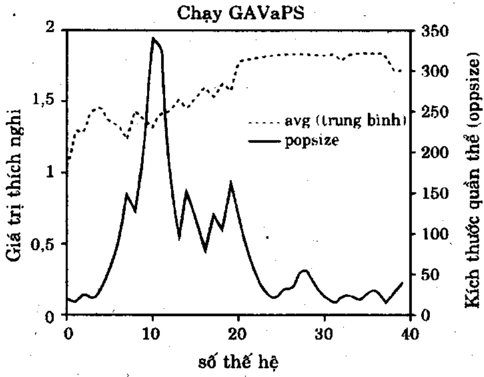

Hình P.4. PopSize(t) và thích nghi trung bình của quản thể đối với lần chạy GAVaPS.

Hình P.4 minh hoạ PopSize(t) và độ thích nghi trung bình của quản thể cho một lần chạy GAVaPS đối với hàm G4 có tính toán thời gian sống song tuyến tính (những quan sát tương tự cũng được thực hiện cho những hàm khác và những chiến lược khác cũng được thực hiện để phân phối các giá trị thời gian sống). Dạng của đường cong PopSize(t) có về rất thú vị. Trước tiên, khi biến thể của sự thích nghi tương đối cao, kích thước quản thể tăng. Điều này có nghĩa là, GAVaPS thực hiện việc tìm kiếm tối ưu trái rộng. Khi lân cận của tối ưu được định vị, thuật giải bắt đầu hội tụ và kích thước quản thể giám. Nhưng, vấn còn tìm thêm cải thiện. Khi xuất hiện xác suất cho một kết quả tốt hơn, một sự bùng nổ khác về quản thể xảy ra, theo sau bởi một giai đoạn hội tụ khác. Dương như GAVaPS kết hợp tiến trình tự-điều chỉnh tốt bằng việc chọn kích thước quản thể tại mỗi giai đoạn của tiến trình tiến hóa.

Hình P.5, P.6 cho thấy tác động của tỉ lệ sinh sản đối với hiệu quả của GAVaPS, đối với SGA, giá trị này không có ý nghĩa (do trong trường hợp này, quản thể cũ chống lên quản thể mới). Trong trường hợp GAVaPS, giá trị này ánh hưởng mạnh mẻ đến chi phí mô phỏng, chi phí này giảm bởi việc hạ thấp tốc độ sinh sản, nhưng không mất sự chính xác (xem các giá trị có liên quan avgmax). Từ những thử nghiệm này, có thể phản đoán duồng như chọn lọc tối ưu của $\rho$ xấp xỉ 0.4.

Hình P.7, P.8 cho thấy tác động của kích thước quản thể lúc khởi tạo đối chiếu với hiệu quả (avgmax) và chi phí tính toán (evalnum) của các thuật giải. Trong trường hợp SGA kích thước quản thể cho tất cả lần chạy không đối và bằng giá trị ban đầu của nó. Như ta mong đội, đối với SGA các giá trị thấp của kích thước quản thể mang ý nghĩa chi phí thấp và hiệu quả kém. Tăng kích thước quản thể lúc đầu sẽ cải thiện hiệu quả nhưng cũng tăng chi phí tính toán. Rôi đến giai đoạn “bảo hòa hiệu quả” trong khi chi phí vẫn tăng tuyến tính. Trường hợp GAVaPS, kích thước quản thể khởi tạo không ảnh hưởng gì đến hiệu quả (rất tốt) cũng như chi phí (chấp nhận được và đủ đối với hiệu quả thật tốt).

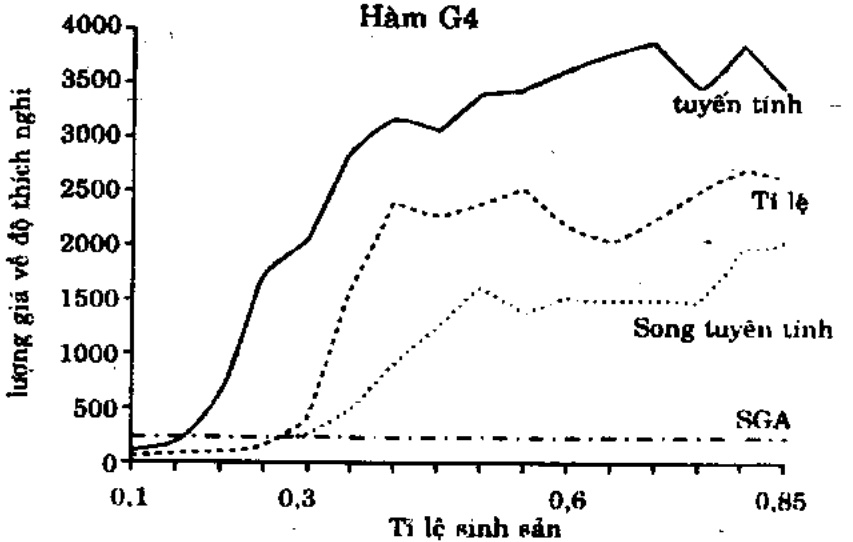

Hình P.5. So sánh SGA và GAVaPS: Tỉ lệ sinh sản đối chiếu với số lượng giá

<!-- page: 152 -->

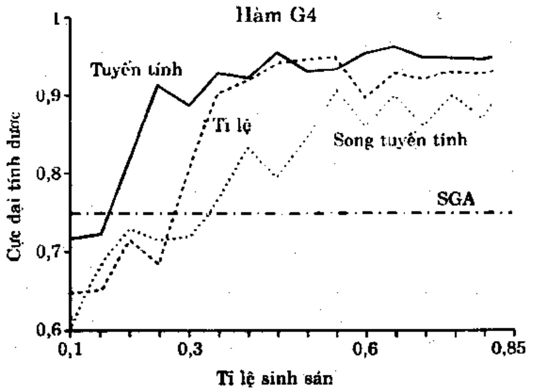

Hình P.6. So sánh SGA và GAVaPS: Tỉ lệ sinh sản đối chiếu với hiệu quả trung bình

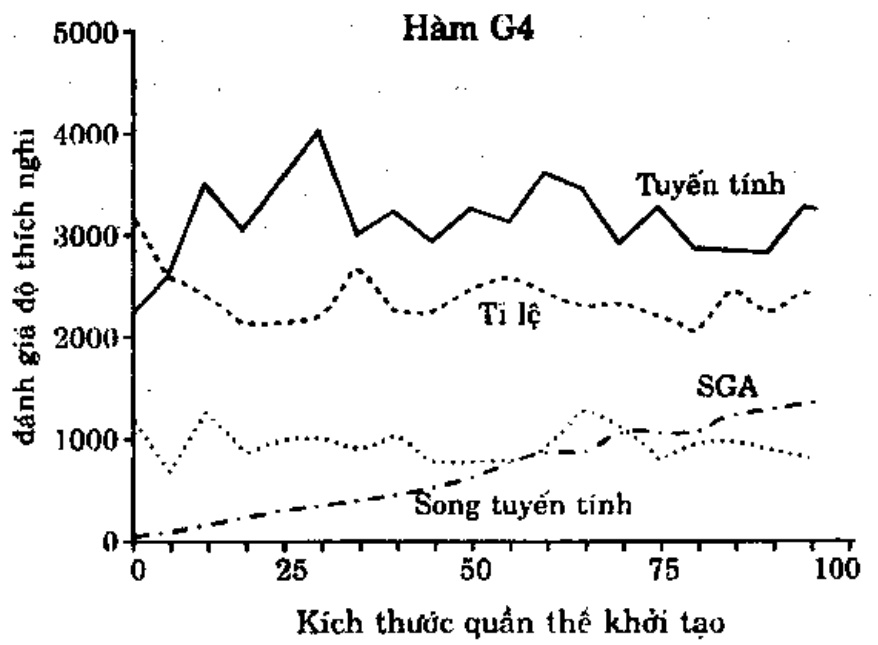

Hình P.7. So sánh SGA và GAVaPS:kích thước quản thể lúc khởi tạo đối chiếu với số tiến hóa

Có thể thực hiện những quan sát tương tự bằng cách phản tích chi phí và hiệu quả của cả hai thuật giải trên các hàm còn lại G1-G3. Nhung cần để ý rằng SGA có cách ứng xử tối ưu (hiệu quả tốt nhất và chi phí tối thiểu) đối với các giá trị kích thước quản thể khác nhau cho cả 4 bài toán. Mặt khác, GAVaPS chấp nhận một kích thước quản thể cho bài toán sắp tối và trạng thái tìm kiếm. Trong bảng sau đây, chúng ta báo cáo về hiệu quả và chi phí mô phỏng đạt được từ các kinh nghiệm với mọi hàm thử nghiệm G1-G4. Các hàng 'SGA', 'GAVaPS(1)', 'GAVaPS(2)', và 'GAVaPS(30)' chứa các giá trị tốt nhất tìm được (V) và số các tiến hóa hàm (E) của SGA và GAVaPS theo thứ tự của các phân phối tí lệ, tuyến tính, song tuyến tính. Các kích thước quản thể tối ưu đối với SGA trong các trường hợp thử nghiệm G1-G4 theo thứ tự là 75, 15, 75, 100.

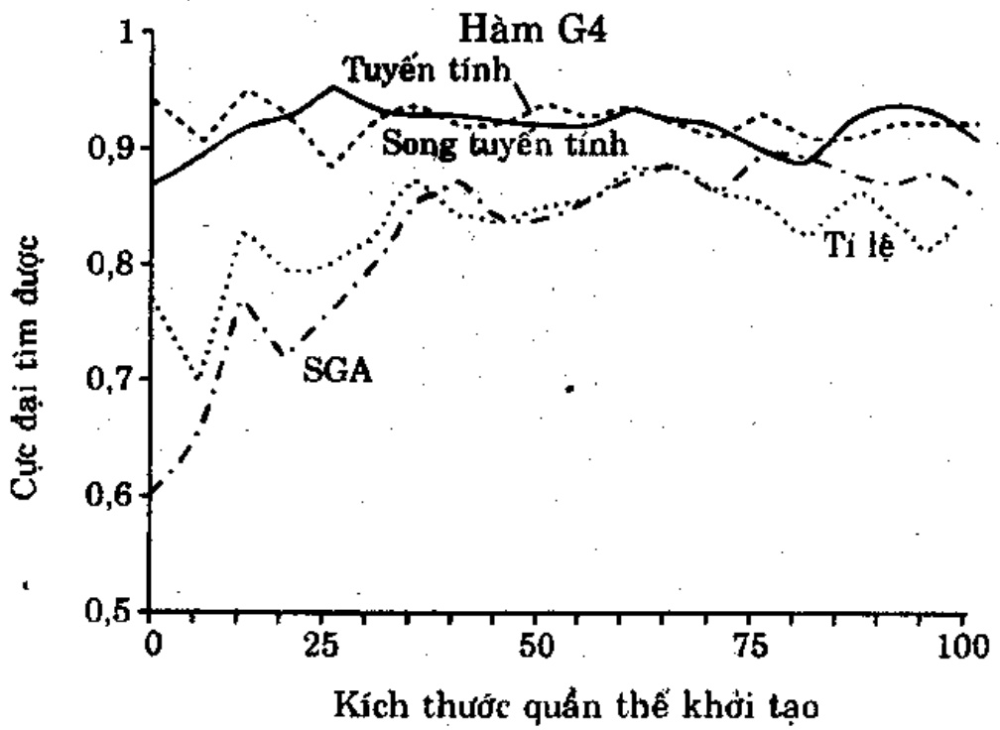

Hình P.8. So sánh SGA và GAVaPS: đối chiếu kích thước quản thể với hiệu quả trung bình.

<!-- page: 153 -->

Bảng P.1. So sánh giữa ba chiến lược

<table><tr><td rowspan="3">Kiêugiaithuật</td><td colspan="8">Hàm</td></tr><tr><td colspan="2">G1</td><td colspan="2">G2</td><td colspan="2">G3</td><td colspan="2">G4</td></tr><tr><td>V</td><td>E</td><td>V</td><td>E</td><td>V</td><td>E</td><td>V</td><td>E</td></tr><tr><td>SGA</td><td>2.814</td><td>1467</td><td>0.875</td><td>345</td><td>1.996</td><td>1420</td><td>0.969</td><td>2186</td></tr><tr><td>GAVaPS(1)</td><td>2.831</td><td>1708</td><td>0.875</td><td>970</td><td>1.999</td><td>1682</td><td>0.969</td><td>2133</td></tr><tr><td>GAVaPS(2)</td><td>2.841</td><td>3040</td><td>0.875</td><td>1450</td><td>1.999</td><td>2813</td><td>0.970</td><td>3739</td></tr><tr><td>GAVaPS(3)</td><td>2.813</td><td>1538</td><td>0.875</td><td>670</td><td>1.999</td><td>1555</td><td>0.972</td><td>2106</td></tr></table>

Chiến lược tuyến tính (2) được đặc trưng bằng hiệu quả tốt nhất và (thật không may) chi phí cao nhất. Mặt khác, chiến lược song tuyến tính (3) thì rè nhất, nhưng hiệu quả không tốt như tuyến tính. Cuối cùng, chiến lược tỉ lệ (1), cho ta một hiệu quả trung bình và chi phí trung bình. Nên lưu ý ràng, thuật giải GAVaPS với chiến lược phân phát thời gian sống (1) - (3), trong hầu hết các trường hợp, cho hiệu quả tốt hơn SGA. Chi phí cho GAVaPS (so với SGA) cao hơn, tuy nhiên các kết quả của SGA đã được báo cáo về vấn đề kích thước tối ưu của quản thể. Thí dụ, nếu kích thước quản thể đối với SGA rút kinh nghiệm qua các hàm G2 là 75 (thay-vì tối ưu là 15), thì chi phí mô phỏng SGA sẽ là 1035.

Tri thúc về sự chọn lọc các tham số GA cho thích hợp vấn còn rời rạc và có nền tăng thực nghiệm. Trong những tham số này, kích thước quản thể dưỡng như là tham số quan trọng nhất, vì nó ảnh hưởng mạnh mẻ đến chi phí mô phỏng GA. Cách tốt nhất đối với giá 304

trị thiết lập của nó là để nó tự tìm, dựa theo các nhu cầu thực tế của GA. Đó là ý tưởng ẩn sau phương pháp GAVaPS: ở các giai đoạn tìm kiếm khác nhau xử lý các kích thước quân thể khác nhau có lẻ là tốt nhất. Tuy nhiên, các kết quả đã được báo cáo chỉ là khởi đầu và việc phân phối tham số thời gian sống cần được nghiên cứu thêm.

## 5. Thuật giải di truyền, các ràng buộc và bài toán ba lô

Như đã nói trong phần dẫn nhập, các kỹ thuật xử lý ràng buộc của thuật giải di truyền có thể được gom vào một số loại. Một cách đề xử lý với các ứng viên vi phạm ràng buộc là phát sinh những lời mà không xét đến ràng buộc rối thường phạt chúng bằng cách giám "độ tốt" của hàm lượng giá. Nói cách khác, bài toán ràng buộc được biến đổi thành không ràng buộc, bằng cách thêm thường phạt vào tất cả vi phạm ràng buộc; thường phạt này được góp vào lượng giá hàm. Dương nhiên, có nhiều hàm thường phạt khác nhau có thể áp dụng. Một số hàm thường phạt gán một hàng số làm mức đo thường phạt. Những hàm thường phạt khác phụ thuộc vào mức độ vi phạm: vi phạm càng nhiều thì phạt càng nặng, (nhưng, tăng trưởng hàm có thể là logarít, tuyến tính, bình phương, lũy thừa v.v phù hợp với ràng buộc bị vi phạm).

Phiên bản bổ sung của các thường phạt là loại trừ các lời giải không-khả thi khởi quản thể (nghĩa là, áp dụng thường phạt nghiêm khác nhất: phạt chết. Kỹ thuật này được dùng thành công trong các chiến lược tiền hóa (chuông 8) cho những bài toán tối ưu số. Nhưng, cách này có một số khuyết điểm. Đối với vài bài toán xác suất phát sinh (bằng phương tiện của các toán tử di truyền chuẩn) một lời giải khả thi khá nhỏ và thuật giải tốn một lượng lớn thời gian đánh giá các cá thể không hợp lệ. Hơn nữa, trong cách này, những lời giải không khá thi không đóng góp vào vùng lưu trữ gen của các quản thể.

<!-- page: 154 -->

Một loại khác của phương pháp xử lý ràng buộc là dựa trên việc ứng dụng các thuật giải sửa chữa đặc biệt để "sửa" những lời giải không khả thi phát sinh như thể. Lân nửa, những thuật giải sửa chữa như thế có thể quá căng về mặt tính toán khi chạy và thuật giải có được phải được thiết kế theo màu của ứng dụng cụ thể. Hon nửa, đối với một số bài toán, tiến trình sửa chữa có lẻ cũng khó ngang với bài toán gốc.

Cách tiếp cận thứ ba tập trung vào việc sử dụng các ánh xạ biểu diễn đặc biệt (các bộ giải mã) bảo đảm (hoặc ít nhất tăng xác suất của) thể hệ của lời giải khả thi hay việc dùng những toán từ bài toán-dặc tả bảo toàn tính khả thi của các lời giải. Nhưng chạy những bộ giải mã bằng máy tính là việc rất căng. Tuy vậy, tất cả các ràng buộc có thể dễ dàng cải đặt theo cách này và thuật giải có được phải được thiết kế theo mẫu ứng dụng cụ thể.

Trong phần này, ta khảo sát những kỹ thuật trên với một bài toán cụ thể: bài toán balô 0/1. Bài toán này dễ dàng hình thức hóa, nhưng phiên bản quyết định của nó thuộc về họ các bài toán NP-đầy đủ. Đây là bài tập thú vị để lượng giá những thuận lợi và bất lợi của các tất cả xử lý ràng buộc trên bài toán cụ thể có một ràng buộc duy nhất này: các kết luận của nó có thể áp dụng cho nhiều bài toán tối ưu hóa có ràng buộc. Nhung cũng nên chú ý ràng mục đích chính của phần này là minh họa khái niệm về các bộ giải mã, thuật giải di truyền, và các hàm thưởng phạt (được nói ngắn gọn trong phần dẫn nhập) trên một thí dụ cụ thể; nó không hệ là một nghiên cứu đầy đủ về các phương pháp có thể có. Vì lý do đó ta không cung cấp các lời giải tối ưu cho các trường hợp thử nghiệm: ta chỉ đua ra một vài so sánh giữa các phương pháp được giới thiệu.

## 5.1. Bài toán ba lô 0/1 và dữ liệu thử nghiệm

Có nhiều loại bài toán kiểu ba lô khác nhau, trong đó cho trước một tập thực thể, cùng các giá trị và kích thước của chúng và ta mong chọn được một hay nhiều tập con rời nhau sao cho tổng kích thước trong mỗi tập con không vượt quá giới hạn cho phép và tổng giá trị đã chọn được là lớn nhất. Bài toán này là một thí dụ về bài toán thuộc lớp NP-khó-và-lón có thể tiếp cận bằng cách dùng heuristic. Bài toán được chọn cho thử nghiệm này là bài toán ba lô 0/1. Công việc phải làm là, đối với một tập các trọng số đã cho W[i], lợi ích P[i] và sức chứa C, tìm một vectơ nhị phân x = < x[1],..., x[n]>, sao cho:

$$
\sum_ {i = 1} ^ {n} x [ i ]. W [ i ] \leq C
$$

và dé cho:

$$
P (x) = \sum_ {i = 1} ^ {n} x [ i ]. P [ i ]
$$

là cực đại.

Khó khăn của những bài toán loại này chịu ảnh hưởng rất lớn bồi tương quan giữa lợi ích và các trọng, nên ta khảo sát ba tập dữ liệu thử:

\- Không tương quan

$W[i]:=\mathrm{random}\left([1..v]\right)\mathrm{va}$

$P[i] := \text{random}([1..v])$

\- Tương quan yếu

$W[i]:=\mathrm{random}\left(\left[1..v\right]\right)\mathrm{va}$

$$
P [ i ] := W [ i ] + \text {random} ([ - r.. r ]),
$$

(nếu với một $i$ bất kỳ, $P[i] \leq 0$, giá trị đó bị bỏ qua và phép tính được lập lại cho đến khi $P[i] > 0$).

<!-- page: 155 -->

• Tương quan mạnh

$W[i]:=\mathrm{random}\left([1..v]\right)\mathrm{va}$

$$
P [ i ] := W [ i ] + r
$$

Tương quan cao hơn có nghĩa là giá trị khác biệt nhỏ hơn:

$$
\max _ {i = 1.. n} [ P [ i ] / W [ i ] | - \min _ {i = 1.. n} | P [ i ] / W [ i ] |;
$$

(những bài toán tương quan cao hơn có mức khó khăn cao hơn).

Dữ liệu được phát sinh bằng các thiết lập tham số: $v = 10$ và $r = 5$. Đối với các thử nghiệm ta đã dùng ba tập dữ liệu cho mỗi thực thể lần lượt có n = 100, 250, và 500 món. Ta quan tâm đến hai loại ba lô:

\- sức chúa ba lô hạn chế

Ba lô có sức chứa $C_1 = 2\nu$. Trong trường hợp này, lời giải tối ưu chứa rất ít mục. Đối với những điều kiện không đầy đủ, một vùng hâu như phụ trách toàn bộ miễn.

\- sức chứa ba lô trung bình

Ba lô có súc chúa $C_{2}=0.5\sum_{i=t}^{n}W[i]$. Trong trường hợp này khoảng phân nửa các món nằm trong lời giải tối uu.

Việc tăng sức chứa C không làm tăng nhiều thời gian tính toán của các thuật giải cổ điện.

## 5.2. Mô tả các thuật giải

Ba loại thuật giải được cải đặt và thử nghiệm là: thuật giải dựa trên hàm thuống phạt ($A_{p}[i]$, $i$ là chỉ số của một thuật giải cụ thể trong lớp này), thuật giải dựa trên phương pháp sửa chữa ($A_{r}[i]$), thuật giải dựa trên việc giải mã ( $A_{d}[i]$ ). Ta lần lượt bàn về ba loại thuật giải này:

## THUẬT GIẢI $A_{P}[I]$

Trong tất cả các thuật giải loại này, một chuỗi nhị phân có chiều dài n biểu diễn lời giải x của bài toán: món thứ i được chọn cho ba lô nếu và chỉ nếu $x[i] = 1$.

Độ thích nghi eval (x) của môi chuỗi được định nghĩa là:

$$
e v a l (x) = \sum_ {i = 1} ^ {n} x [ i ]. P [ i ] - P e n (x),
$$

trong đó, hàm thuống phạt $Pen(x)$ sẽ bằng 0 với lời giải khá thi $x$, nghĩa là, các lời giải thoả $\sum_{i=1}^{n} x[i].W[i] \leq C$, ngược lại, $Pen(x)$ lớn hơn 0.

Có nhiều chiến lược để gán giá trị thường phạt. Ô đây, ta chỉ quan tâm đến ba trường hợp mà hàm thường phạt tăng theo lôgarít, tuyến tính và bình phương tùy theo mức độ xâm phạm:

$$
A _ {\rho} [ 1 ]: P e n (x) = \log_ {2} (1 + \rho . (\sum_ {i = 1} ^ {n} x [ i ], W [ i ] - C))
$$

$$
A _ {p} [ 2 ]: P e n (x) = \rho . (\sum_ {i = 1} ^ {n} x [ i ]. W [ i ] - C)
$$

$$
A _ {p} [ 3 ]: P e n (x) = (\rho . (\sum_ {i = 1} ^ {n} x [ i ]. W [ i ] - C)) ^ {2}
$$

Trong cả ba trường hợp, $\rho = \max_{i=1..n} |\mathrm{P}[i]/\mathrm{W}[i]|$.

<!-- page: 156 -->

## THUẬT GIẢI $A_{R}[I]$

Cùng như trong loại thuật giải trước, một chuỗi nhi phân có chiều dài n biểu diễn lời giải x của bài toán: món thứ i được chọn cho ba lô nếu và chỉ nếu $x[i] = 1$.

Độ thích nghi eval (x) của mỗi chuỗi được định nghĩa là,

$$
e v a l (\boldsymbol {x}) = \sum_ {i = 1} ^ {n} x ^ {\prime} [ i ]. P [ i ]
$$

trong đó, vecto x' là phiên bản được sửa chữa của vecto gốc x.

Ố dây có 2 khóa cạnh thú vị. Trước tiên, ta có thể có nhiều phương pháp sửa chữa khác nhau. Thứ hai, vài phần trăm các nhiễm sắc thể được sửa chữa có thể thay cho các nhiễm sắc thể gốc trong quản thể. Tỉ lệ thay thể đó thay đổi từ 0% đến 1%, hay theo luật 5%. Luật này cho rằng, trong thực nghiệm, nếu thay các nhiễm sắc thể gốc với xác suất 5%, hiệu quả của thuật giải sẽ tốt hơn khi thay thế bằng các tỉ lệ khác (nhất là, nó tốt hơn các chiến lược ‘không bao giờ thay’ hoặc ‘luôn luôn thay’).

Ta cải đặt và thử nghiệm hai thuật giải sửa chữa khác nhau, cả hai đều dựa trên cùng một thủ tục như trong hình P.9.

Thủ tục sửa chữa (x)

Bất đầu

ba lô quá đầy:= false

$$
x ^ {\prime} := x
$$

$$
\mathbf {n} \hat {\mathbf {e}} \mathbf {u} \sum_ {i = 1} ^ {n} x ^ {\prime} [ i ] ^ {*} W [ i ] > C
$$

thì ba lô - quá dầy:= true

khi (ba lô - quá đầy) làm

bất đầu

$i:=$ chọn một món trong ba lô

loại món đó khởi ba lô, nghĩa là, x'[i]:= 0

$$
\mathbf {n} \acute {\mathrm{e}} \mathbf {u} \sum_ {i = 1} ^ {n} x ^ {\prime} [ i ] * W [ i ] \leq C
$$

thì ba lô-quá dây:= false

hết lặp

Kết thúc

## Hình P.9. Thủ tục sửa chữa

Hai thuật giải sửa chữa như trình bày ở trên chỉ khác nhau trong câu lệnh chọn của thủ tục chọn lọc, lệnh này chọn một món để lấy ra khối ba lô:

\- $A_{r}[I]$ (sùa chữa ngẫu nhiên) thủ tục chọn lọc chọn ngẫu nhiên một phần tử trong ba lô.

<!-- page: 157 -->

\- $A_{r}[2]$ (sửa chữa tham lam) Tất cả các món trong ba lô được sắp theo thú tự giám dẫn về lợi ích của chúng đối với tỉ lệ trọng số. Thủ tục chọn lọc luôn luôn chọn món cuối cùng (trong danh sách các món có sẵn) để xóa bỏ.

## THUẬT GIẢI $A_{d}[I]$

Một bộ giải mã cho bài toán ba lô dựa trên biểu diễn nguyên (integer). Ô dây ta dùng biểu diễn thứ tự các món được chọn. Mỗi nhiễm sắc thể là một vectơ có n số nguyên; thành phần thứ i của vectơ là một số nguyên trong khoảng từ 1 đến n-i+1. Biểu diễn thứ tự tham chiếu đến danh sách L các món; một vectơ được giải mã bằng cách chọn món thích hợp trong danh sách hiện hành. Thí dụ, đối với danh sách $L=(1,2,3,4,5,6)$, vectơ <4,3,4,1,1,1> được giải mã thành chuỗi các mục sau đây: 4, 3, 6 (do 6 là phần tử thứ tự trong danh sách hiện hành sau khi loại bỏ 4 và 3), 1, 2 và 5. Hiến nhiên, trong phương pháp này một nhiễm sắc thể có thể được thông dịch là chiến lược kết hợp các món vào lời giải. Hon nửa, lai một - điểm được áp dụng cho hai cha-mệ hợp lệ bất kỳ, cũng sẽ cho ra một con hợp lệ. Toán từ đột biến được định nghĩa theo cùng cách với biểu diễn nhi phân: nếu gen thứ i bị đột biến, nó sẽ có một giá trị ngẫu nhiên trong khoảng [1...n-i+1]. Thuật giải giải mã được trình bày trong hình P10.

Hai thuật giải dựa trên các kỹ thuật giải mã được bàn ở đây chỉ khác nhau ở thủ tục xây dựng:

\- $A_{d}[1]$ (giải mã ngẫu nhiên). Trong thuật giải này, thủ tục xây dựng tạo danh sách $L$ sao cho thủ tự các món trong danh sách tương ứng với các món trong tập tin nhập (ngẫu nhiên).

\- $A_{d}[2]$ (giải mã tham lam). Thủ tục xây dựng tạo danh sách L theo thứ tự giảm lợi tức theo tỉ lệ trọng số. Việc giải mã vectơ $x$ được thực hiện trên cơ sở thứ tự sắp xếp (có một số điểm tương tự với phương pháp $A_{r}[2]$). Thị dụ, $x[j] = 23$ được thông dịch thành món thứ 23 (theo thứ tự giảm lợi tức đối với tỉ lệ trọng số trên danh sách hiện hành L.

## 4.5.3. Thử nghiệm và kết quả

Trong tất cả các thử nghiệm, kích thước kết quả là hàng số và bằng 100. Cũng thể, các xác suất đột biến và lai không đối, và lần lượt là: 0.05 và 0.65.

```autohotkey
Thủ tục giải mã (x)
Bất đầu
    xây dựng danh sách L
    i:= 1
    TổngTrọng := 0
    TổngLợiIch := 0
    khi i ≤ n làm
    bắt đầu
```

<!-- page: 158 -->

```txt
j:= x[i]
xóa món thứ j khởi danh sách L
nếu TổngTrọng + W[j] ≤ C thì
bất đầu
TổngTrọng:= TổngTrọng + Trọng [j]
TổngLợiích:= TổngLợiích + Lợi Ích[j]
Hết nếu
i:= i+1
Hết lặp
Kết thúc
```

## Hình P.10. Thủ tục giải mã của biểu diễn thứ tự

Khi ta đã gom lời giải tốt nhất tìm được trong vòng 500 thể hệ như là độ do hiệu quả của thuật giải. Thực nghiệm chứng minh ràng, sau một số thể hệ như vậy, ta không thấy thêm cải thiện nào. Các kết quả được trình bày trong bảng 2 là các giá trị trung bình của 25 thử nghiệm. Các lời giải chính xác không được liệt kê ở đây; bảng chỉ so sánh hiệu quả tương đối giữa các thuật giải khác nhau. Lưu ý, các tập tin dữ liệu không được sắp xếp (thứ tự của các món là tùy ý, không liên quan đến các tỉ lệ P[i]/W[i] của chúng). Các thực thể với sức chúa $C_1$ và $C_2$ theo thứ tự không chế các sức chúa nhỏ và trung bình.

Kết quả của các phương pháp $A_{i}[1]$ và $A_{i}[2]$ đã đạt được bằng cách sử dụng luật 5%. Ta đã xem xét luật 5% làm việc với bài toán ba lô 0/1 (luật được phát hiện từ thực nghiệm trên hai bài toán tổ hợp khác: bài toán thiết kế mạng và bài toán tổ màu bản đồ). Với món đích so sánh, ta đã chọn các tập dữ liệu thử nghiệm có tương quan yếu giữa giá trị và lợi ích. Tất cả các giá trị tham số đều cố định và tỉ lệ sửa chữa thay đổi từ 0% đến 100%. ta không thấy ảnh hưởng của luật 5% trên hiệu quả của thuật giải di truyền. Các kết quả (thuật giải $A_{i}[2]$) được tập hợp trong bảng 3.

Ta có thể tóm tất những kết luận chính rút ra từ các thử nghiệm như sau:

\- Các hàm thường phạt $A_{p}[i]$ (với mọi $i$) không tạo ra kết quả khả thi với những bài toán có sức chứa ba lô nhỏ ($C_{1}$). Đây là trường hợp đối với bất cứ số món nào ($n=100$, 250, và 500) và với mọi tương quan.

\- Chỉ phán đoán từ những kết quả thử nghiệm trên các bài toán có sức chứa ba lô trung bình ($C_2$), thuật giải $A_p[1]$ dưa trên hàm thường phạt lôgarít thành công rõ rệt: nó hiệu quả hơn tất cả các kỹ thuật khác qua mọi trường hợp (không tương quan, tương quan yếu và mạnh, với $n=100, 250$, và $500$ món). Nhưng, như đã trình bày, nó lại thất bại ở những bài toán có sức chứa hạn chế.

\- Chỉ phán đoán từ những kết quả thử nghiệm trên các bài toán sức chữa ba lô nhỏ ($C_{1}$), phương pháp sửa chữa $A$,[2] (sửa chữa tham lam) cho thấy: nó hiệu quả hơn tất cả các phương pháp khác qua mọi thử nghiệm.

<!-- page: 159 -->

Phụ Lục 1 : Các Chủ Đề Chọn Lọc

<table><tr><td rowspan="2">tương quan</td><td rowspan="2">số món</td><td rowspan="2">thực thể</td><td colspan="7">Phương pháp</td></tr><tr><td> $A_p[1]$ </td><td> $A_p[2]$ </td><td> $A_p[3]$ </td><td> $A_r[1]$ </td><td> $A_r[2]$ </td><td> $A_d[1]$ </td><td> $A_d[2]$ </td></tr><tr><td rowspan="6">không</td><td rowspan="2">100</td><td>C1</td><td>*</td><td>*</td><td>*</td><td>62.9</td><td>94.0</td><td>63.5</td><td>59.4</td></tr><tr><td>C2</td><td>398.1</td><td>341.3</td><td>342.6</td><td>344.6</td><td>371.3</td><td>354.7</td><td>353.3</td></tr><tr><td rowspan="2">250</td><td>C1</td><td>*</td><td>*</td><td>*</td><td>62.6</td><td>135.1</td><td>58.0</td><td>60.4</td></tr><tr><td>C2</td><td>919.6</td><td>837.3</td><td>825.5</td><td>842.2</td><td>894.4</td><td>867.4</td><td>857.5</td></tr><tr><td rowspan="2">500</td><td>C1</td><td>*</td><td>*</td><td>*</td><td>63.9</td><td>156.2</td><td>61.0</td><td>61.4</td></tr><tr><td>C2</td><td>1712.2</td><td>1570.8</td><td>1565.1</td><td>1577.4</td><td>1663.2</td><td>1602.8</td><td>1597.0</td></tr><tr><td rowspan="6">yếu</td><td rowspan="2">100</td><td>C1</td><td>*</td><td>*</td><td>*</td><td>39.7</td><td>51.0</td><td>38.2</td><td>38.4</td></tr><tr><td>C2</td><td>408.5</td><td>327.0</td><td>328.3</td><td>30.1</td><td>358.2</td><td>333.6</td><td>332.3</td></tr><tr><td rowspan="2">250</td><td>C1</td><td>*</td><td>*</td><td>*</td><td>43.7</td><td>74.0</td><td>42.7</td><td>44.7</td></tr><tr><td>C2</td><td>920.8</td><td>791.3</td><td>788.5</td><td>798.4</td><td>852.1</td><td>804.4</td><td>799.0</td></tr><tr><td rowspan="2">500</td><td>C1</td><td>*</td><td>*</td><td>*</td><td>44.5</td><td>93.8</td><td>43.2</td><td>44.5</td></tr><tr><td>C2</td><td>1729.0</td><td>1531.8</td><td>1532.0</td><td>1538.6</td><td>1624.8</td><td>1548.4</td><td>1547.0</td></tr><tr><td rowspan="6">mạnh</td><td rowspan="2">100</td><td>C1</td><td>*</td><td>*</td><td>*</td><td>61.6</td><td>90.0</td><td>59.5</td><td>59.5</td></tr><tr><td>C2</td><td>741.7</td><td>564.5</td><td>564.4</td><td>566.5</td><td>577.0</td><td>576.2</td><td>576.2</td></tr><tr><td rowspan="2">250</td><td>C1</td><td>*</td><td>*</td><td>*</td><td>65.5</td><td>117.0</td><td>65.5</td><td>64.0</td></tr><tr><td>C2</td><td>1631.9</td><td>1339.5</td><td>1343.4</td><td>1345.8</td><td>1364.4</td><td>1366.4</td><td>1359.0</td></tr><tr><td rowspan="2">500</td><td>C1</td><td>*</td><td>*</td><td>*</td><td>67.5</td><td>120.0</td><td>67.1</td><td>64.1</td></tr><tr><td>C2</td><td>3051.6</td><td>2703.8</td><td>2700.8</td><td>2709.5</td><td>2748.1</td><td>2738.0</td><td>2744.0</td></tr></table>

Bảng P.2. Kết quả các thử nghiệm; dấu sao có nghĩa là không tìm được lời giải hợp lệ thỏa ràng buộc thời gian được cho.

Những kết quả này cũng dễ hiểu. Trong trường hợp sức chứa ba lô nhỏ, chỉ có một phần nhỏ các tập con các món có thể đóng góp lời giải khả thì; do đó hấu hết các phương pháp thường phạt đều thất bai. Đây cũng là trường hợp của những bài toán tổ hợp khác: tỉ lệ giữa phân khả thi của không gian tìm kiếm và của toàn bộ không gian tìm kiếm càng nhỏ, các phương pháp hàm thường phạt càng khó cung cấp những kết quả khả thi.

Ngược lại, thuật giải sửa chữa có hiệu quả hoàn toàn tốt. Trường hợp sức chứa ba lô trung bình, phương pháp hàm thưởng phạt lôgarít (nghĩa là thưởng phạt nhỏ) có uu thể hơn: sẽ thú vị nếu để ý ràng kích thước của bài toán không ảnh hưởng đến các kết quả.

Như đã trình bày trước đây, những thử nghiệm này chưa cung cấp một bức tranh toàn diện; trong tương lai gần, người ta dự tính làm nhiều thử nghiệm bổ sung. Trong loại hàm thưởng phạt, sẽ thú vị để thử nghiệm với những công thức bổ sung. Tất cả những thưởng phạt được quan tâm đều thuộc dạng $Pen(x) = f(x)$, trong đó, $f$ là hàm lôgarít, tuyến tính hay bình phương. Một khả năng khác để thử nghiệm với $Pen(x) = a + f(x)$ với một hàng số $a$ nào đó. Như vậy, sẽ cung cấp một thường phạt tối thiểu cho bất kỳ một vectơ không khả thi nào. Hơn nửa, thử nghiệm với các hàm thưởng phạt động cũng thú vị, ở đây các giá trị của các hàm tùy thuộc vào các tham số bổ sung, như số thể hệ chẳng hạn. Cũng dáng để thử nghiệm với các hàm thưởng phạt tự thích nghi. Sau cùng, xác suất của các toán tử được áp dụng có thể thích nghi (như trong các chiến lược tiến hóa); một số thử nghiệm khối tạo cho thấy các kích thước quản thể thích nghi có thể có một số thuận lợi (phần 4); vì thế, những ý kiến về các hàm thưởng phạt thích nghi cũng dáng được quan tâm. Trong phiên bản đơn giản nhất của nó, hệ số thưởng phạt có thể là một phần của vectơ lời giải và trải qua tất cả những thay đổi di truyền (ngẫu nhiên) (trái với ý kiến về các hàm thưởng phạt động, ở đây hệ số thưởng phạt như thế bị thay đổi trên cơ sở thưởng quy là hàm của số thể hệ, chẳng hạn).

Cũng có thể thử nghiệm với nhiều lược đồ sửa chữa, gồm có cả những heuristic khác với tỉ lệ của lợi ích và trọng số. Cũng sẽ thú vị

<!-- page: 160 -->

khi kết hợp các phương pháp thường phạt với các giá trị sửa chữa: những lời giải không khả thi của các thuật giải Ap[i] có thể được sửa chữa thành khả thi.

Trong loại bộ giải mà cần phải thủ nghiệm với nhiều biểu diễn (integer) khác nhau (như đã được thực hiện cho bài toán người du lịch trước): biểu diễn kể (lai với các cạnh thay đổi, đột biến các phần của hành trình con, hay đột biến heuristic), hoặc biểu diễn đường dẫn với các đột biến PMX, OX và CX, hay ngay cả đột biến tái kết hợp cạnh). Cũng thú vị khi so sánh lợi ích của những biểu diễn này và các toán tử của bài toán ba lô 0/1 (như đã thực hiện đối với bài toán người du lịch và lập thời khóa biểu). Cũng hoàn toàn có khả năng là một đột biến mới nào đó cung cấp những kết quả tốt nhất.

## 6. NHỮNG Ý KIẾN KHÁC

Những phân trước trong phụ lục này, ta đã bàn một số vấn đề liên quan đến việc xóa lôi có thể có trong các cơ chế tao mẫu. Mục đích cơ bản của nghiên cứu này nhằm nâng cao chất lượng của tìm kiếm di truyền để tránh hội tụ sớm. Trong những năm gần đây, đã có một số nỗ lực nghiên cứu khác để xử lý lược đổ tốt hơn, nhưng sử dụng những phương pháp khác nhau. Trong phần này, ta bàn về những phương pháp đó.

Hướng thử nhất có liên quan đến toán tử di truyền lai. Toán tử này được gọi ý từ một tiến trình sinh học; nhưng, nó có vài khuyết điểm. Thí dụ, giả sử có hai lược đồ hiệu quả cao:

$$
S _ {I} = (0 0 1 * * * * * * * * 0 1) \mathrm{va}
$$

$$
S _ {2} = (* * * * 1 1 * * * * * * *).
$$

Cũng có hai chuỗi trong quản thể $v_1$ và $v_2$ lần lượt tương ứng với $S_1$ và $S_2$:

$$
\dot {v} _ {I} = (\mathbf {0 0 1 0 0 0 1 1 0 1 0 0 1})
$$

$$
v _ {2} = (1 1 1 0 1 1 0 0 0 1 0 0 0).
$$

Rô ràng lai không thể thực hiện một số kết hợp tính chất được mã hóa trên nhiễm sắc thế; không thể có một chuỗi phù hợp với lược đồ:

$$
S _ {3} = (0 0 1 * 1 1 * * * * * 0 1),
$$

bôi lược đồ thứ nhất sẽ bị hủy.

Ta cũng bàn thêm về phép lai một điểm cổ điện trong một số dạng không đối xứng giữa đột biến và lai: đột biến phụ thuộc chiều dài của nhiễm sắc thể còn lai thì không. Thí dụ, nếu xác suất của đột biến $P_m$ là 0.01, còn chiều dài nhiễm sắc thể là 100, số bit đột biến mong đợi trong nhiễm sắc thể là một. Nếu chiều dài của nhiễm sắc thể là 1000, số bit đột biến mong đợi trong nhiễm sắc thể là mươi. Mặt khác, trong cả hai trường hợp này, lai một điểm kết hợp hai chuỗi trên cơ sở của một vị trí lai, bất chấp chiều dài của chuỗi.

Một số nhà nghiên cứu đã thử nghiệm những phép lai khác nhau. Thí dụ, lai hai điểm chọn hai vị trí lai và nguyên liệu nhiễm sắc thể được hoán vị giữa chúng. Hiến nhiên, chuỗi $v_{1}$ và $v_{2}$ có thể sinh một cặp con:

$$
v _ {1} ^ {\prime} = (0 0 1 | 0 1 1 0 0 | 0 1 0 0 1) \mathrm{va}
$$

$$
v _ {2} ^ {\prime} = (1 1 1 | 0 0 0 1 1 | 0 1 0 0 0),
$$

ở dây $v'_{1}$ phù hợp với:

$S_{3} = (001 * 11 * * * * * 01)$, không thể xảy ra với lai một điểm.

<!-- page: 161 -->

Tương tự, có những lược đó mà lai hai điểm không thể kết hợp, ta cũng có thể thử nghiệm với lai nhiều điểm, một mở rộng tự nhiên của lai hai điểm. Nhưng chú ý ràng, do lai nhiều điểm phải xen kẻ các đoạn (có được sau khi cắt một nhiễm sắc thể thành s mạnh) giữa hai cha-mẹ, nên số đoạn phải chẩn, nghĩa là lai nhiều điểm không phải là mở rộng tự nhiên của lai một điểm.

Schaffer và Morishima đã thử nghiệm phép lai phân phối các điểm lai của nó bằng cùng những tiến trình có sẵn tại chỗ (sự tôn tại của cá thể thích nghi nhất và tái kết hợp). Điều này được thực hiện bằng cách đưa những điểm đặc biệt vào biểu diễn chuỗi, những điểm này kiểm soát những vị trí trong chuỗi nơi đã xây ra lai. Hy vọng rằng những vị trí lai có thể trải qua một tiến trình tiến hóa: nếu một vị trí nào đó sinh các con yếu, vị trí đó sẻ chết (và ngược lại). Thực nghiệm cho thấy phép lai thích nghi có hiệu quả tốt bằng hoặc hơn GA cổ diễn trên một số lớn các bài toán thử nghiệm. Spears đã thử nghiệm với một phép lai đặc biệt (hai phép lai, lai một điểm và lai đồng nhất, được xét đến) bằng cách mở rộng biểu diễn nhiễm sắc thể bằng bit bổ sung.

Một số nhà nghiên cứu đã thử nghiệm với các phép lai khác: lai phân đoạn và lai trộn. Lai phân đoạn là biến thể của lai nhiều điểm, cho phép số điểm lai thay đổi được. Số (cổ định) điểm lai (hoặc cắt đoạn) được thay bằng tỉ lệ chuyển đổi đoạn. Tỉ lệ này đặc tả xác suất mà một đoạn sẽ chấm dứt tại một điểm nào đó trong chuỗi. Thí dụ, nếu tỉ lệ chuyển đổi đoạn là $s = 0.2$, thì nếu bắt đầu từ đầu đoạn, cơ hội chấm dứt đoạn này tại mỗi bit sẽ là 0.2. Nói cách khác, với tỉ lệ chuyển đổi đoạn $s = 0.2$, số đoạn mong đợi sẽ là $m/5$, nhưng không như lai nhiều điểm, số điểm lai sẽ thay đổi. Lai trộn có thể được xem là một cơ chế bổ sung có thể áp dụng với các cách lai khác. Nó độc lập với số điểm lai. Lai xáo trộn là phép lai (1) xáo trộn ngầu nhiên các vị trí bit của hai chuỗi kế nhau, (2) bắt chéo các chuỗi, nghĩa là trao đổi các đoạn giữa các điểm lai, và (3) không xáo trộn các chuỗi.

Một bước-tổng quát hóa xa hơn của lai một điểm, hai và nhiều điểm là lai đồng nhất: đối với mối bit trong dựa con đầu tiên, nó quyết định (với một xác suất $p$ nào đó) cha-mệ nào sẽ đóng góp giá trị của nó vào vị trí đó. Dưa con thứ hai sẽ nhận bit từ cha-mệ khác.

Thí dụ, cho $p = 0.5$ (lai đồng nhất 0.5), các chuỗi:

$$
v _ {I} = (0 0 1 0 0 0 1 1 0 1 0 0 1) \text {va}
$$

$$
v _ {2} = (1 1 1 0 1 1 0 0 0 1 0 0 0)
$$

có thể sinh ra cặp con sau đây:

$$
v _ {I} ^ {\prime} = (0 _ {1} 0 _ {1} 1 _ {2} 0 _ {1} 1 _ {2} 1 _ {2} 0 _ {2} 1 _ {1} 0 _ {1} 1 _ {2} 0 _ {1} 0 _ {1} 0 _ {2}) \mathrm{va}
$$

$$
v _ {z} ^ {\prime} = (1 _ {2} 1 _ {2} 1 _ {1} 0 _ {2} 0 _ {1} 0 _ {1} 1 _ {1} 0 _ {2} 0 _ {2} 1 _ {1} 0 _ {2} 0 _ {2} 1 _ {1})
$$

Do lai đồng nhất trao đổi các bit chữ không phải các đoạn, nó có thể kết hợp các tính năng với nhau bất chấp vị trí tương đối của chúng. Đối với nhiều bài toán, khả năng này quan trọng hơn những bất lợi của việc phá hủy các khối kiến trúc gây ra. Nhúng, với những bài toán khác, lai đồng nhất lại kém hiệu quả hơn lai hai điểm. Syswerda so sánh về lý thuyết lai đồng nhất 0.5 với lai một điểm và hai điểm. Spears và De Jong đã phân tích về phép lai p-đồng nhất, nghĩa là phép lai có liên quan với các điểm lai m\*p trung bình.

Eshelman thử nghiệm nhiều toán tử lai khác nhau. Kết quả cho thấy lai một điểm đã thất bại; nhưng những toán tử lai khác cũng không thành công rõ ràng. Một ý kiến chung về những thử nghiệm trên là mỗi phép lai này chỉ đặc biệt có tốt trong số lớp bài toán và rất xấu trong những bài toán khác. Điều này càng cùng có ý kiến của chúng ta về sự phụ thuộc của các toán tử vào bài toán trong lập trình tiến hóa.

<!-- page: 162 -->

Muhlenbein và Voigt phát hiện một số thuộc tính của toán từ tái kết hợp mới, gọi là tái kết hợp vùng chữa, ở đây các gen được nhật ra ngẫu nhiên từ vùng chữa được định nghĩa bởi các cha-mệ được chọn. Một viễn cảnh thú vị của toán từ này là nó cho phép nhiều cha-mệ tham gia vào việc sinh san một con. Lai nhiều cha-mệ như thế cũng được Eiben và một số tác giả khác để cập, ở đây nhiều kỹ thuật quét gen (sinh một con duy nhất từ nhiều cha-mệ) đã được nghiên cứu. Renders và Bersini đã thử nghiệm với phép lai một chiều trên những bài toán tối ưu số; phép lai này gồm việc tính trọng tâm của nhóm các cha-mệ và gồm cả việc chuyển từ cá thể tệ nhất vượt cả điểm trọng tâm.

Nhiều nhà nghiên cứu cũng để ý vào ảnh hưởng của các tham số điều khiển của GA (kích thước quản thể, xác suất thi hành các toán tử) đối với hiệu quả của hệ thống. Grefenstette áp dụng một siêu-GA để điều khiển các tham số của một GA khác. Goldberg thì phân tích lý thuyết về kích thước quản thể tối ưu. Các kết quả gọi ý rằng (1) đột biến đóng một vai trò quan trọng, (2) tấm quan trọng của tỉ lệ lai lai nhỏ hơn mong đợi, (3) chiến lược tìm kiếm chỉ dựa trên chọn lọc và đột biến có thể là một thủ tục đột biến mạnh, ngay cả khi không có sự trợ giúp của lai. Nhưng GA vấn thiếu các heuristic tốt để quyết định những giá trị tốt cho các tham số của chúng: không có thiết lập đơn lẻ nào có thể phổ dụng cho tất cả các bài toán được bàn đến. Dương như việc tìm các giá trị tốt cho các tham số GA mang tỉnh nghệ thuật nhiều hơn là khoa học.

Cho đến lúc này, ta cũng chỉ bàn đến hai toán từ di truyền cơ bản: lai (một diễn, hai điểm, đồng nhất, vv...) và đột biến được áp dụng cho những cá thể hay những bit với một số tỉ lệ cố định (các xác suất của lai $p_c$ và đột biến $p_m$). Nhu ța đã thấy trong chương trình minh hoạ ở chương 2, có thể áp dụng phép lai và đột biến vào cùng một cá thể (thí dụ $v_{13}$). Thật ra, hai toán từ cơ bản này được xem như một toán từ tái kết hợp, toán từ “lai và đột biến”, vi cả hai đều áp dụng được vào các cá thể một cách đồng thời. Khi thực nghiệm với các toán tử di truyền, có một khả năng làm cho chúng độc lập: một (hoặc nhiều) toán tử này sẽ được áp dụng suốt giai doạn sinh sản, nhưng không phải cả hai. Có một vài lợi ích trong cách phân chia như vậy. Đầu tiên, đột biến sẽ không được áp dụng lâu hơn vào kết quả của toán tử lai, làm cho toàn thể tiến trình đơn gian hơn một cách có mục đích. Kế đến, mở rộng một danh sách các toán tử di truyền bằng cách thêm vào các toán tử mới sẽ dễ hơn: danh sách như vậy có thể chúa nhiều toán tử phụ thuộc bài toán. Dây chính là ý kiến ẩn sau lập trình tiến hóa: có nhiều “toán tử di truyền” phụ thuộc bài toán, được áp dụng vào các cấu trúc dữ liệu cá thể. Cũng nên nhớ ràng, đối với các chương trình tiến hóa được trình bày trong sách này, ta đã phát triển một chương trình chọn lọc đặc biệt modGA tạo thuận cho ý kiến trên. Hơn nửa, ta có thể di xa hơn. Mỗi toán tử có độ thích nghi riêng của nó và cũng trải qua một tiến trình tiến hóa nào đó. Nhung các toán tử được chọn và áp dụng một cách ngẫu nhiên, tùy theo độ thích nghi của chúng. Ý kiến này không phải mới và đã từng xuất hiện, nhưng nó lại mang một ý nghĩa mới và tâm quan trọng mới trong kỹ thuật lập trình tiến hóa.

Một hướng thú vị khác trong việc tìm kiếm cách xử lý lược đổ tốt hơn, đã được nói đến cùng với bài toán lùa, đã được đề nghị gần đây: thuật giải di truyền hỗn loạn (mGA).

mGA khác với GA cổ diễn ở nhiều mặt: biểu diễn, các toán tử, kích thước quản thể, chọn lọc, và các giai đoạn của tiến tình tiến hóa. Ta sẽ lần lượt bàn ngắn gọn về chúng.

Trước tiên, mỗi bit nhiễm sắc thể được gắn với tên của nó (số) - cùng một heuristic mà ta đã dùng khi bàn về toán từ đảo. Ngoài ra, các chuỗi có chiều dài thay đổi được và không yêu cầu chuỗi phải có các bổ sung đầy đủ về gen. Chuỗi có thể có các gen lẻ và thừa. Thí dụ, các chuỗi sau đây là các nhiễm sắc thể hợp lệ trong mGA:

$$
v _ {J} = ((7, 1) (1, 0))
$$

<!-- page: 163 -->

$$
v _ {2} = ((3, 1) (9, 0) (3, 1) (3, 1) (3, 1))
$$

$$
v _ {3} = ((2, 1) (2, 0) (4, 1) (5, 0) (6, 0) (7, 1) (8, 1))
$$

Số đầu trong môi cập ngoặc chí vị trí, số thứ hai chỉ giá trị bit. Theo đó, chuỗi thứ nhất $v_1$ đặc tả hai bit: bit 1 ở vị trí thứ 7 và bit 0 ở vị trí thứ nhất.

Rô ràng, chiều dài thay đổi được, các chuỗi được đặc tả trên mức hoặc dưới mức đều có thể ảnh hưởng đến các toán từ được sử dụng. Lai đơn giản được thay thế bởi hai toán tử (thậm chí・đơn giản hơn): ghép và cắt. Toán từ ghép nổi hai chuỗi đã chọn (bằng các khả năng ghép đặc hiệu). Thí dụ, nổi các chuỗi $v_1$ và $v_2$ ta được:

$$
v _ {4} = ((7, 1) (1, 0) (3, 1) (9, 0) (3, 1) (3, 1) (3, 1)).
$$

Toán từ cắt (với một xác-suất cắt nào đó) chuỗi được chọn tại một vị trí xác định ngẫu nhiên dọc theo chiều dài của nó. Thí dụ, cắt chuỗi $v_{3}$ tại vị trí 4 , ta có:

$$
v _ {5} = ((2, 1) (2, 0) (4, 1) (5, 0))
$$

$$
v _ {6} = ((6, 0) (7, 1) (8, 1))
$$

Hơn nửa, có một toán từ đột biến không đổi, đối 0 thành 1 (hay ngược lại) với một xác suất xác định nào đó.

Có một số khác biệt khác giữa GA và mGA. Các thuật giải di truyền hỗn loạn (đối với chọn lọc dáng tin cây bất chấp việc định tỉ lệ hàm) dùng dạng chọn lọc tranh dua; các thuật giải này cũng chia tiến trình tiến hóa thành hai giai đoạn (giai đoạn đầu chọn các khối kiến trúc, và các toán tử di truyền chỉ tham gia trong giai đoạn hai), và kích thước quản thể chỉ thay đổi trong tiến trình.

Phụ lục 2

## CHIẾN LƯỢC TIÊN HÓA VÀ CÁC PHƯƠNG PHÁP KHÁC

Các chiến lược tiến hóa (ES) là những thuật giải rập khuôn các nguyên tắc của tiến hóa tự nhiên, để giải những bài toán tối ưu hóa có tham số. Chứng được phát triển ở Đức trong thập kỳ 1960.

Các chiến lược tiến hóa ban đầu là những chương trình tiến hóa sử dụng biểu diễn số chấm động, với đột biến là toán từ tái kết hợp duy nhất. Chúng được áp dụng vào những bài toán tối ưu hóa khác nhau với các tham số có thể biến thiên liên tục. Chỉ gần đây, chúng mới được mở rộng cho những bài toán rời rạc.

Trong chương này, ta mô tả ES nguyên thủy dựa trên một quần thể có hai thành viên và toán từ đột biến, và nhiều quân thể có nhiều thành viên ES (phần 1); phần 2 so sánh ES với GA, trong khi phần 4 giới thiệu các chiến lược do nhiều nhà nghiên cứu gần đây để xuất.

## 1. TIÊN HÓA CỦA CÁC CHIẾN LƯỢC TIÊN HÓA

Các chiến lược tiến hóa sớm nhất được dựa trên quản thể chỉ có một cá thể. Chỉ có một toán từ di truyền được dùng trong tiến trình tiến hóa. Nhung, ý tưởng thú vị (không có trong GA) là biểu diễn cá thể bằng một cập vectơ chấm động, nghĩa là, $v = (x, \sigma)$. Ô dây, vectơ x biểu diễn một điểm trong không gian tìm kiếm; vectơ, σ là vectơ của các độ lệch chuẩn; đột biến được thực hiện bằng các thay x bằng

$$
x ^ {t + 1} = x ^ {t} + N (0, \sigma)
$$

trong đó $N(0, \sigma)$ là vecto Gauss ngẫu nhiên, độc lập có trung bình là 0 và độ lệch chuẩn $\sigma$. (Điều này phù hợp với quan sát sinh học là những thay đổi nhỏ xuất hiện thường xuyên hơn những thay đổi lớn

<!-- page: 164 -->

hơn). Con (cá thể được đột biến) được nhận làm thành viên của quản thể (nó thay cha-mệ nó) nếu và chỉ nếu nó thích nghi hơn và tất cả các ràng buộc (nếu có) được thỏa. Thị dụ, nếu f là hàm mục tiêu không ràng buộc cần cực đại hóa, một con ($x^{1+1}$, $\sigma$) thay cha-mệ của nó($x^1$, $\sigma$) nếu và chỉ nếu $f(x^{1+1}) > f(x^1)$. Nếu không, con sẽ bị loại và quản thể không đối.

Ta hây minh họa bước đầu tiên của chiến lược tiến hóa đó bằng cách xét bài toán cực đại hóa đã được dùng làm thí dụ (cho thuật giải di truyền đơn giản) trong chương.2:

$$
f (x _ {1}, x _ {2}) = 2 1. 5 + x _ {1} ^ {*} \sin (4 \pi x _ {1}) + x _ {2} ^ {*} \sin (2 0 \pi x _ {2})
$$

$$
\text {vói} - 3. 0 \leq x _ {1} \leq 1 2. 1 \text {và} 4. 1 \leq x _ {2} \leq 5. 8
$$

Như đã giải thích trước, một quản thể chỉ gồm một cá thể duy nhất $(x, \sigma)$, $x = (x_1, x_2)$ là điểm nằm trong không gian tìm kiếm (-3.0 ≤ $x_1$ ≤ 12.1 và 4.1 ≤ $x_2$ ≤ 5.8) và $\sigma = (\sigma_1, \sigma_2)$ biểu diễn hai độ lệch chuẩn được dùng trong đột biến. Ta giả sử ràng tại một thời điểm $t$ nào đó, quản thể có một phần tử là cá thể sau:

$$
(\boldsymbol {x} ^ {l}, \sigma) = ((5. 3, 4. 9), (1. 0, 1. 0)),
$$

và giả sử thêm, đột biến đưa đến thay đổi sau đây:

$$
x _ {1} ^ {\prime + 1} = x _ {1} ^ {\prime} + (0, 1. 0) = 5. 3 + 0. 4 = 5. 7
$$

$$
x _ {2} ^ {t + 1} = x _ {2} ^ {t} + (0, 1. 0) = 4. 9 - 0. 3 = 4. 6
$$

Vi

$$
f (x ^ {t}) = f (5. 3, 4. 9) = 1 8. 3 8 3 7 0 5 <   2 4 8 4 9 5 3 2 = f (5. 7, 4. 6) = f (x ^ {t + I}),
$$

và cả $x_{1}^{t+1}$ lân $x_{2}^{t+1}$-dêu nằm trong các khoảng của chúng, con này sẽ thay cha-mệ của nó trong quản thể một phần tử. Mặc dù quản thể có một cả thể duy nhất trải qua đột biến, nhưng chiến lược tiến hóa nêu trên lại được gọi là “chiến lược tiến hóa có hai thành viên”. Lý do là con dấu tranh với cha-mệ và ở giai đoạn tranh dấu có(tạm thời) hai cá thể trong quản thể.

Vecto của các độ lệch chuẩn σ vấn không đổi trong tiến trình tiến hóa. Nếu tất cả các thành phần của vecto này đều giống nhau, nghĩa là σ = (σ, ..., σ), và bài toán tối ưu hóa là thường lệ, có thể chứng minh định lý hội tụ:

Dình lý 1 (Dình lý hội tụ) Với σ > 0 và một bài toán tối ưu hóa thông thường, có $f_{opt} > -\infty$ (cục tiểu hóa) hoặc $f_{opt} < \infty$ (cục đại hóa)

$$
p \{\lim _ {t \to \infty} f (x _ {t}) = f _ {o p t} \} = 1
$$

Dịnh lý hội tụ phát biểu ràng tối ưu toàn cục được tìm với xác suất bằng 1, đối với thời gian tìm kiểm đủ dài; nhưng lại không cung cấp những manh mối cho tốc độ hội tụ (thương số của khoảng cách đã vượt được để tiến đến tối ưu và số thế hệ cần thiết đã trải qua để vượt được khoảng cách này). Đề tăng tốc độ hội tụ, Rechenberg đề nghị một "luật thành công 1/5":

Tỉ lệ φ của đột biến thành công đối với tất cả các đột biến phải là 1/5. Nếu φ >1/5, hãy tăng phương sai của toán tử đột biến; ngược lại, hãy giám nó.

Luật thành công 1/5 xuất hiện như một kết luận của quá trình thực nghiệm tốc độ hội tụ của hai hàm (được gọi là mô hình trải dài và mô hình khối cầu. Luật này được áp dụng mỗi $k$ thể hệ ($k$ là một tham số khác của phương pháp): luật thành công 1/5.

$$
\sigma_ {2} ^ {t + 1} = \left\{ \begin{array}{l l} c _ {d} \sigma^ {t}, & \text {neu} \varphi (\mathrm{k}) <   1 / 5 \\ c _ {i} \sigma^ {t}, & \text {neu} \varphi (\mathrm{k}) > 1 / 5 \\ \sigma^ {t}, & \text {neu} \varphi (\mathrm{k}) = 1 / 5 \end{array} \right.
$$

<!-- page: 165 -->

trong đó, $\varphi(k)$ là tỉ lệ thành công của toán tử đột biến trong $k$ thể hệ cuối cùng, và $c_{i} > 1$ và $c_{d} < 1$ điều hòa các tốc độ tăng giám cho phương sai của đột biến. Trong các thử nghiệm của mình, Schwefel đã dùng các giá trị sau: $c_{d} = 0.82$, $c_{i} = 1.22 = 1/0.82$.

Lý do trực giác dàng sau luật thành công 1/5 này là hiệu quả tìm kiếm gia tăng: nếu thành công, tìm kiếm sẽ tiếp tục trong các bước "lớn hơn"; nếu không, các bước sẽ ngắn đi, tuy nhiên, tìm kiếm này có thể dẫn đến việc hội tự sớm đối với một số lớp hàm – điều này dựa đến việc tỉnh chế phương pháp: kích thước quản thể gia tăng.

Chiến lược tiến hóa có nhiều thành viên khác với chiến lược có hai thành viên trong kích thước của quản thể trước đây (pop-size >1). Các tính năng khác của các chiến lược tiến hóa nhiều thành viên là:

• Tất cả các cá thể trong quản thể có cùng xác suất ghép đôi,

\- Khả năng đưa vào một toán từ tái kết hợp (trong công đồng GA có tên "lai đồng dạng"), ở đây hai cha-me (được chọn ngẫu nhiên):

$$
(x ^ {1}, \sigma^ {1}) = ((x _ {1} ^ {1}, \dots , x _ {1} ^ {n}), (\sigma_ {1} ^ {1}, \dots , \sigma_ {n} ^ {1})) \cdot \mathrm{v} \dot {\alpha}
$$

$$
(x ^ {2}, \sigma^ {2}) = ((x _ {1} ^ {2},..., x _ {n} ^ {2}), (\sigma_ {1} ^ {2},..., \sigma_ {n} ^ {2}))
$$

sinh ra con:

$$
(x, \sigma) = ((x _ {1} ^ {q 1}, \dots , x _ {n} ^ {q n}), (\sigma_ {1} ^ {q 1}, \dots , \sigma_ {n} ^ {q n}))
$$

trong đó $q_{i}=1$ hoặc $q_{i}=2$ với cùng xác suất và $i=1,\ldots,n$.

Toán tử đột biến và hiệu chỉnh của σ vấn không đổi.

Văn có điểm tương đồng giữa chiến lược tiến hóa hai thành viên và nhiều thành viên: cả hai đều sản sinh một con duy nhất. Trong chiến lược hai thành viên, con tranh dấu với cha-mệ của nó. Trong chiến lược nhiều thành viên, cá thể yếu nhất (trong số pop-size +1 cá thể; nghĩa là, các cá thể pop-size gốc cộng 1 con) bị loại trừ. Một chú ý có lợi, cũng giải thích được những tỉnh chế sau này của các chiến lược tiến hóa là:

(1+1) - ES, cho chiến lược tiến hóa hai thành viên, và

$(\mu + 1) - \text{ES}$, cho chiến lược tiến hóa nhiều thành viên,

vói μ = pop-size.

Chiến lược tiến hóa nhiều thành viên phát triển thành:

$$
(\mu + \lambda) - \mathbf {E S s} \text {va} (\mu , \lambda) - \mathbf {E S s};
$$

Ý chính ẩn sau chiến lược tiến hóa này là cho phép điều chỉnh các tham số (như phương sai đột biến) để tự thích nghi chú không thay đổi các giá trị của chúng bằng một thuật giải có tính tất định nào đó.

$(\mu + \lambda) - \text{ES} \text{là mở rộng tự nhiên củaepsilon lực tiến hóa nhiều thành viên } (\mu + 1) - \text{ES}, \text{ ở đây, } \mu \text{ cá thể sản sinh } \lambda \text{ con. Quản thể mới (tạm thời) } \mu + \lambda \text{ cá thể qua quá trình chọn lọc lần nửa còn } \mu \text{ cá thể. Mặt khác, trong } (\mu , \lambda) - \text{ES}, \mu \text{ cá thể sản xuất } \lambda \text{ con } (\lambda > \mu ) \text{ và tiến trình chọn lọc chọn một quản thể mới gồm } \mu \text{ cá thể chỉ từ tập } \lambda \text{ con. Làm như vậy, đời sống của mỗi cá thể giới hạn chỉ trong một thể hệ. Điều này cho phép } (\mu , \lambda) - \text{ES} \text{ thực hiện tốt hơn trên những bài toán có tối ưu dịch chuyển hay trên những bài toán mà hàm mục tiêu bị nhiều.}$

Các toán tử được dùng trong các $(\mu + \lambda) - \text{ES}$ và $(\mu, \lambda) - \text{ES}$ kết hợp việc học hai cấp: tham số điều khiển $\sigma$ của chúng không còn là hàng số, cũng không được thay đổi bằng một thuật giải tất định nào đó (như luật thành công 1/5), nhưng nó được kết hợp vào cấu trúc của các cá thể và trái qua quá trình tiến hóa. Đề sản sinh một con, hệ thống hoạt động qua nhiều giai đoạn:

\- chơn hai cá thể:

$$
(x ^ {I}, \sigma^ {I}) = ((x _ {1} ^ {I}, \dots , x _ {1} ^ {n}), (\sigma_ {1} ^ {I}, \dots , \sigma_ {n} ^ {I})) \text {va}
$$

<!-- page: 166 -->

$$
(x ^ {2}, \sigma^ {2}) = ((x _ {1} ^ {2}, \dots , x _ {n} ^ {2}), (\sigma_ {1} ^ {2}, \dots , \sigma_ {n} ^ {2}))
$$

và áp dụng một toán tử (lai tao, tái kết hợp). Có hai loại lai tao:

\- rời rạc, khi con mới là:

$$
(x, \sigma) = ((x _ {1} ^ {q l}, \dots , x _ {n} ^ {q n}), (\sigma_ {1} ^ {q l}, \dots , \sigma_ {n} ^ {q n}))
$$

ở đây, $q_{i} = 1$ hay $q_{i} = 2$ (vì thể mỗi thành phần xuất phát từ cha-mệ được chọn trước, thứ nhất hay thứ hai).

\- trung gian, khi con mới là:

$$
(x, \sigma) = ((x _ {1} ^ {1} + x _ {1} ^ {2}) / 2, \dots , (x _ {n} ^ {1} + x _ {n} ^ {2}) / 2), ((\sigma_ {1} ^ {1} + \sigma_ {1} ^ {2}) / 2, \dots , (\sigma_ {n} ^ {1} + \sigma_ {n} ^ {2}) / 2)).
$$

Mỗi toán từ này cũng có thể được áp dụng vào chế độ toàn cục, ở đây cặp cha-mệ mới được chọn cho mỗi thành phần của vectơ con.

\- áp dụng đột biến cho con nhận được $(x, \sigma)$; con mới nhận được là $(x', \sigma')$, ô dây:

$$
\sigma^ {I} = \sigma^ {*} e ^ {N (0, \Delta \sigma)} \mathbf {v} \dot {\mathbf {a}}
$$

$$
\boldsymbol {x} ^ {t} = \boldsymbol {x} + N (0, \sigma^ {t})
$$

trong đó Δσ là tham số của phương pháp.

Đế cải thiện tốc độ hội tụ của ES, Schewel đưa vào thêm một tham số điều khiển  $\theta$ . Điều khiển mối này tạo tương quan giữa các đột biến. Đối với ES đã để cập từ trước đến giờ (với, được chuyên dùng cho mỗi  $x_{i}$ ), hướng được ua thích của tìm kiếm chỉ có thể được thiết lập đọc theo các trục của hệ thống kết hợp. Bảy giờ mỗi cá thể trong quản thể được biểu diễn là:

Các toán từ tái kết hợp cũng giống như những toán từ đã nói đến ở doan trên và đột biến tạo con ($x'$, $\sigma'$, $\theta'$) từ ($x$, $\sigma$, $\theta$) theo cách sau:

$$
\sigma^ {\prime} = \sigma^ {*} e ^ {N (0, \lambda a)} v a
$$

$$
\theta^ {\prime} = \theta + N (0, \Delta \theta)
$$

$$
x ^ {\prime} = x + C (0, \sigma^ {\prime}, \theta^ {\prime})
$$

trong đó $\Delta\theta$ là tham số bổ sung của phương pháp, và $C(0, \sigma', \theta')$ cho thấy vecto Gauss ngẫu nhiên độc lập với trung bình 0 và mật độ xác suất thích hợp.

Chiến lược tiến hóa rất hiệu quả trong các miền số, vì chúng được (ít nhất là lúc đầu) chuyên dùng cho các bài toán tối uu hàm (thực). Chúng là các thí dụ về chương trình tiến hóa sử dụng cấu trúc dữ liệu thích hợp (vectơ chấm động) được mở rộng bằng các tham số chiến lược điều khiển) và các toán tử “di truyền” cho bài toán.

Khá thú vị khi so sánh thuật giải di truyền và chiến lược tiến hóa: những khác biệt và tương đồng, những mặt mạnh và mặt yếu của chúng sẽ được bàn đến trong phần sau.

## 2. SO·SÁNH CÁC CHIẾN LƯỢC TIẾN HÓA VÀ CÁC THUẬT GIẢI DI TRUYỀN

Khác biệt cơ bản giữa chiến lược tiến hóa và thuật giải di truyền là ô các lãnh vực áp dụng chúng. Chiến lược tiến hóa được phát triển nhu những phương pháp tối ưu số. Chúng sử dụng một thủ tục leo đổi đặc biệt với kích thước bước tự thích nghi σ và đốc nghiêng θ. Chỉ gần dây, ES mối được áp dụng cho các bài toán tối ưu rời rạc. Mặt khác, thuật giải di truyền được hình thức hóa thành những kỹ thuật tìm kiếm thích hợp (mục đích chung, cấp phát số lần thử tăng theo lũy thừa cho các lược đồ trên trung bình. GA được áp dụng trong nhiều lãnh vực khác nhau, và một việc tối ưu hóa tham số (thực) chỉ là một lãnh vực của những ứng dụng của chúng).

Vì lý do đó, sẽ không công bằng nếu so sánh thời gian thực hiện và độ chính xác của ES và GA trên cơ sở tối ưu hàm số. Nhung

<!-- page: 167 -->

cả hai, ES và GA đều là những thí dụ về chương trình tiến hóa, nên nếu bàn một cách tổng quát về những khác biệt và tương đồng của chúng thì cũng hoàn toàn tự nhiên.

Tương đồng chính giữa các ES và GA là cả hai hệ thống đều duy trì các quản thể những lời giải mạnh và tận dụng nguyên tắc chọn lọc tự nhiên. Tuy vậy, giữa hai phương pháp này có rất nhiều khác biệt.

Khác biệt đầu tiên giữa ES và GA cổ điện là cách biểu diễn các cá thể. Như trong nhiều dịp đã được nói đến, ES thao tác trên các vectơ chấm động, trong khi GA cổ diễn thao tác trên các vectơ nhị phân.

Khác biệt thú hai ẩn trong chính tiến trình chọn lọc. Trong một thể hệ của ES, μ cha-mệ phát sinh quản thể trung gian gồm λ con được sản sinh bằng việc tái kết hợp và các toán tử đột biến (với (μ + λ) - ES), cộng với (đối với (μ , λ) - ES) μ cha-mệ gốc. Rồi tiến trình chọn lọc giám kích thước của quản thể trung gian này còn μ cá thể bằng cách loại bỏ những cá thể ít thích nghi nhất trong quản thể. Quản thể gồm μ cá thể này thành lập thể hệ kế tiếp. Trong một thể hệ của GA, thủ tục chọn lọc chọn pop-size cá thể từ quản thể được có kích thước pop-size. Các cá thể được chọn lập đi lập lại, nghĩa là một cá thể mạnh sẽ có cơ hội tốt để được chọn nhiều lần vào quản thể mới. Đồng thời, ngay cả cá thể yếu nhất cũng có cơ hội để được chọn.

Trong ES, thủ tục chọn lọc là tất định: nó chọn μ tốt nhất từ μ + λ ((μ + λ) - ES hoặc (μ , λ) - ES) cá thể (không lập). Mặt khác, trong GA, thủ tục chọn lọc là ngẫu nhiên, chọn pop-size từ pop-size cá thể (lắp đi lắp lại), các cơ hội chọn lọc tỉ lệ với độ thích nghi của cá thể. Thực ra một số GA dùng chọn lọc xếp hạng; nhưng các cá thể mạnh vẫn có thể được chọn vài lần. Nói cách khác, việc chọn trong

ES là tỉnh, làm tuyệt chủng và có tính thể hệ, đối với  $(\mu', \lambda) - ES$ , trong khi ở GA việc chọn là động, có tính bảo tồn.

Thứ tự tương đối của các thủ tục chọn lọc và tái kết hợp tạo nên khác biệt thứ ba giữa GA và ES: trong ES, tiên trình chọn lọc tiếp theo việc áp dụng các toán từ tái kết hợp, trong khi trong GA các bước này xuất hiện theo thủ tự ngược lại. Trong ES, con là kết quả lai tạo giữa hai cha-mệ và một đột biến sau đó. Khi quản thể trung gian của $\mu +\lambda$ (hoặc $\lambda$) các cá thể đã hoàn tất, thủ tục chọn lọc giám kích thước của nó còn lại $\mu$ cá thể. Trong GA, trước tiên, ta chọn quản thể trung gian. Rối áp dụng các toán từ di truyền (lai tạo và đột biến) cho một số cá thể (được chọn theo xác suất lai tạo) và một số gen (chọn theo xác suất đột biến).

Khác biệt kế tiếp giữa ES và GA là các tham số sinh sản của GA (xác suất lai tạo, xác suất đột biến) giữ nguyên không đối trong suốt quá trình tiến hóa, trong khi ES thay đổi chúng (σ và θ) luôn: chúng trải qua đột biến và lai tạo cùng với vectơ lời giải x, do một cá thể được hiểu là một bộ ba (x, σ, θ). Điều này rất quan trọng – tính tự thích nghi của các tham số điều khiển trong ES chịu trách nhiệm dò tìm chính xác cục bộ của hệ thống.

ES và GA cũng xử lý các ràng buộc theo cách khác nhau. Chiến lược tiến hóa nhận một tập các bất đẳng thức $q \geq 0$:

$$
g _ {I} (x) \geq 0, \dots , g _ {q} (x) \geq 0,
$$

là một phần của bài toán tối ưu hóa. Nếu trong lần lắp nào đó, có một con không thỏa tất cả các ràng buộc này, thì con đó không đủ phẩm chất, nghĩa là nó không được chọn vào quản thể mối. Nếu tỉ lệ xuất hiện những con bất hợp lệ như thế cao thì ES điều chỉnh những tham số điều khiển của chúng, như bằng cách giám các thành phần của vectơ σ. Chiến lược chính của thuật giải di truyền để xử lý các ràng buộc là phạt những cá thể vi phạm. Lý do là vì đối với những

<!-- page: 168 -->

bài toán có ràng buộc phúc tạp, ta không thể bỏ qua các con bất hợp lệ (GA không điều chỉnh các tham số điều khiển của chúng – ngược lai thuật giải sẽ không tiến hóa trong phần lớn thời gian). Đồng thời, thường các bộ giải mã hay các thuật giải sửa chữa có chỉ phí quá cao, không thể xét đến (những nổ lực để xây dựng một thuật giải sửa chữa tốt cũng bằng nỗ lực để giải chính bài toán). Kỹ thuật hàm thường phạt có nhiều bất lợi, một trong những bất lợi đó là sự phụ thuộc vào bài toán.

Những điều vừa nói trên dây bao hàm ràng ES và GA hoàn toàn khác biệt theo nhiều chi tiết. Nhu, khi xem phát triển của ES và GA kỹ hơn trong 20 năm sau này, ta phải công nhận ràng khoảng cách giữa những phương pháp này ngày càng thu nhỏ lai.

Một lần nửa, ta lại bàn về những vấn đề chung quanh các ES và GA, nhưng lần này từ bối cảnh lịch sử.

Ban đầu, có những dấu hiệu cho thấy thuật giải di truyền tổ ra khó thực hiện việc tìm kiếm đối với những ứng dụng số. Nhiểu nhà nghiên cứu đã thử nghiệm với những biểu diễn khác nhau (mã Gray, số chấm động và những toán từ khác nhau để cải thiện hiệu quả của hệ thống dựa trên GA. Ngày nay, khác biệt dấu tiên giữa GA và ES không còn là những vấn đề này nửa: hâu hết các ứng dụng GA cho những bài toán tối ưu hóa sử dụng biểu diễn chấm động, áp dụng các toán từ theo cách thích hợp. Dương như cộng đồng GA vay mượn ý tưởng về biểu diễn vectơ từ ES.

Những kết quả từ những thử nghiệm của chúng ta với các chương trình tiến hóa cung cấp một nhận xét thú vị: chỉ lai tạo hoặc chỉ đột biến thì không thỏa tiến trình tiến hóa. Cả hai toán tử (hoặc cả hai họ các toán tử này) đều cần thiết cho hiệu quả của hệ thống. Các toán tử lai tạo rất quan trọng trong việc khảo sát những vùng húa hạn trong không gian tìm kiếm và chịu trách nhiệm về hội tự sớm hơn (nhưng không quá sớm); trong nhiều hệ thống – đặc biệt đôi với những người làm việc trên những cấu trúc dữ liệu phong phú hơn, việc giám tỉ lệ lai tạo làm hiệu quả của chúng kém đi. Đồng thời, xác suất áp dụng các toán tư đột biến lai thật cao: hệ thống GENETIC -2 sử dụng tỉ lệ đột biến cao là 0.2.

Cộng đồng ES cũng đạt đến kết luận tương tự. Do đó, toán từ lai tạo được đưa vào ES. Chú ý ràng ES ban đầu chỉ dựa trên một toán từ đột biến và toán từ lai tạo chỉ được kết hợp mãi sau này. Dương như tỉ số giữa GA và ES bằng nhau: cộng đồng ES vay muộn ý tưởng về toán từ lai tạo từ GA.

Có thêm nhiều vấn đề thú vị về mối liên quan giữa ES và GA. Gân đây, một số toán từ lai tạo khác đồng thời được đưa vào GA và ES. Hai vecto $x_{1}$ và $x_{2}$ có thể sản sinh hai con $y_{1}$ và $y_{2}$, là tổ hợp tuyến tính của các cha-mệ của chúng, nghĩa là:

$$
\mathbf {y} _ {1} = \mathbf {a x} _ {1} + (1 - \mathbf {a}) \mathbf {x} _ {2} \mathbf {v} \dot {\mathbf {a}}
$$

$$
y _ {2} = (1 - a) x _ {1} + a x _ {2}.
$$

Lai tạo như thế được gọi là:

\- trong GA: lai trung bình bảo đảm ràng buộc (khi $a=1/2$), hay lai số học, và

• trong ES: lai tạo trung gian.

Việc tự thích nghi của các tham số điều khiển trong ES cũng có phần tương ứng của nó trong nghiên cứu GA, ý nghĩ áp dụng thuật giải di truyền khi đang chạy trong ES đã được phát biểu trước đây; hệ thống Argot áp dụng biểu diễn của những cả thể. Bài toán áp dụng các tham số điều khiển cho thuật giải di truyền cũng được nhận thức vào lúc đó. Rò ràng là việc tìm các thiết lập tốt cho các tham số GA đối với một bài toán đặc biệt không phải là một tác vụ tầm thường. Nhiểu phương pháp đã được đề nghị. Một số phương pháp sử dụng thuật giải di truyền giám sát để tối ưu hóa các tham số của thuật giải di truyền “thích dáng” đối với một lớp bài toán. Các

<!-- page: 169 -->

tham số được xét là kích thước quản thể, tỉ lệ lai tạo, tỉ lệ đột biến, cách biệt thể hệ (phẩn trăm quản thể bị thay thế trong mỗi thể hệ), của số định tỉ lệ, và một chiến lược chọn lọc (tính khiết hoặc ưu tú). Phương pháp khác bao gồm việc áp dụng các xác suất của các toán tử di truyền: từ ý tưởng là xác suất áp dụng một toán tử được thay đổi theo tỉ lệ để hiệu quả của các cá thể được tăng theo toán tử này. Trực giác cho ràng các toán tử hiện đang “thực hiện tốt” nên được sử dụng thường xuyên hơn. Nhiểu tác giả thử nghiệm với 4 chiến lược khác nhau để cấp phát xác suất của toán tử đột biến: (1) xác suất không đổi, (2) giám theo lũy thừa, (3) tăng theo lũy thừa và (4) kết hợp (2) và (3).

Cũng vậy, nếu nhớ lại đột biến không đồng dạng, ta sẽ nhận thấy rằng toán từ thay đối hành động của nó trong quá trình tiến hóa.

Ta hây so sánh chương trình tiến hóa dựa trên di truyền GENOCOP với một chiến lược tiến hóa một cách ngắn gọn. Cả hai hệ thống duy trì các quản thể lời giải mạnh và dùng thủ tục chọn lọc để phân biệt giữa các cả thể 'tốt' và 'xấu'. Cả hai hệ thống đều dùng biểu diễn số chấm động. Chúng cho độ chính xác cao (qua việc áp dụng các tham số điều khiển – đối với ES; và qua đột biến không đồng dạng – đối với GENOCOP). Cả hai hệ thống xử lý các ràng buộc một cách tỉnh tế: GENOCOP tận dụng sự hiện diện của các ràng buộc tuyến tính, ES thực hiện trên tập các bất đẳng thức. Cả hai hệ thống đều kết hợp 'ý tưởng xử lý ràng buộc' của nhau. Các toán tử cũng tương tự. Một hệ thống dùng lai tạo trung gian, hệ thống kia dùng lai tạo số học. Chúng có thực sự khác nhau không ?

Nhiều tác giả đã đưa ra một so sánh thú vị giữa ES và GA từ viễn cảnh của các chiến lược tiến hóa.

Một vài năm trước, một kỹ thuật qui hoạch tiến hóa (EP) đã được tổng quát hóa để xử lý các bài toán tối ưu số. Chúng hoàn toàn tương tự các lan truyền ngược tiến hóa; chúng dùng biểu diễn chấm động và đột biến làm toán từ màu chất. Khác biệt cơ bản giữa chiến lược tiến hóa và các kỹ thuật tiến hóa có thể tóm tất như sau:

• EP không dùng các toán từ tải kết hợp.

\- EP sử dụng chọn lọc theo xác suất (chọn lọc dấu tranh) trong khi ES chọn μ cá thể tốt nhất cho thể hệ kế tiếp,

\- trong EP các giá trị thích nghi nhận được từ các giá trị hàm mục tiêu bằng cách định tỉ lệ chứng và có lẻ bằng cách tạo một số thay đổi ngẫu nhiên,

\- độ lệch chuẩn cho đột biến của mỗi cá thể được tính là căn bậc hai của một biến đổi tuyến tính của giá trị thích nghi của chính nó.

## 3. TỔI UU HÓA HÀM DA MỤC TIÊU VÀ ĐA KẾT QUẢ

Trong hâu hết các chương, ta giới thiệu các phương pháp tối ưu đơn, toàn cục của một hàm. Những trong nhiều trường hợp, một hàm có thể có nhiều tối ưu cần được xác định (tối ưu hóa đa kết quả) hoặc có nhiều hơn một chuẩn để tối ưu (tối ưu đa mục tiêu). Rõ ràng, rất cần những kỹ thuật mới để tiếp cận những loại bài toán này; ta sẽ lần lượt bàn về chúng.

## 3.1. Tối ưu hóa đa kết quả

Trong nhiều ứng dụng, việc định vị tất cả lời giải tối ưu của một hàm cho trước có thể rất quan trọng. Một số phương pháp dựa trên các kỹ thuật tiến hóa đã được đề nghị cho phương pháp tối ưu đã kết quả này.

Kỹ thuật thứ nhất dựa trên việc lập: ta chỉ việc chạy nhiều lần thuật giải. Nếu tất cả tối ưu có cùng khả năng được tìm ra như nhau, số lần chạy độc lập sẽ là:

<!-- page: 170 -->

$$
p \sum_ {i = 1} ^ {p} \frac {1}{i} \approx p (\gamma + \log p),
$$

trong đó p là số tối ưu vàγ = 0.577 là hàng số Euler. Không may, trong hầu hết các ứng dụng thực tế, các tối ưu lại không có khả năng như nhau, vì vậy số lần chạy độc lập phải cao hơn. Cũng có thể dùng một cài đặt song song phương pháp lập này, lúc đó nhiều quản thể con sẽ tiến hóa cùng lúc (theo cách độc lập, nghĩa là không liên lạc nhau).

Golberg và Richardson mô tả một phương pháp dựa trên sự dùng chung; phương pháp này cho phép việc thành lập các quản thể con ổn định (các chủng loại) của nhiều chuỗi khác nhau – bằng cách này thuật giải khám phá được nhiều định cùng lúc. Hàm dùng chung xác định việc giảm mức thích nghi của một cá thể do lân cận của nó ở khoảng cách “dist” nào đó. Hàm dùng chung sh được định nghĩa là hàm theo khoảng cách có những thuộc tính sau:

\- $0 \leq sh(dist) \leq 1$, với mọi quảng dist

\- $sh(0) = 1$ và

$$
\lim _ {\mathrm{dist} \to \infty} \mathrm{sh} (\mathrm{dist}) = 0
$$

Có nhiều hàm dùng chung thỏa các điều kiện trên, một khả năng là:

$$
s h (d i s t) = \left\{ \begin{array}{c l} 1 - \left(\frac {d i s t}{\sigma_ {s h}}\right) ^ {\alpha}, & \text {neu dist} <   \sigma_ {s h} \\ 0, & \text {nguoc lai} \end{array} \right.
$$

trong đó $\sigma_{sh}$ và $\alpha$ là những hàng số.

Độ thích nghi (dùng chung) mới của một cá thể x được cho bồi:

$eval^{\prime}(\boldsymbol{x}) = eval(\boldsymbol{x}) / m(\boldsymbol{x})$

trong đó $m(x)$ trả về số đếm vừa ý cho một cá thể $x$ cụ thể:

$$
m (x) = \sum_ {y} s h (d i s t (x, y))
$$

Trong công thức trên, tổng tất cả các y trong quản thể bao gồm chính chuỗi x; do đó, nếu chuỗi x bản thân nó đã tự vừa, giá trị thích nghi của nó không giảm ($m(x) = 1$). Nguộc lại, hàm thích nghi sẽ giảm theo lũy thừa với số và độ gần với các lân cận.

Nghĩa là, khi nhiều cá thể ở gần nhau, chủng đóng góp vào số đêm chung của nhau, như vậy làm giám các giá trị thích nghi của nhau. Do đó, kỹ thuật này giới hạn sự gia tăng vô tổ chức của các chủng loại cụ thể trong quản thể.

Gân đây, Beasly, Bull và Martin đã mô tả một kỹ thuật mới (được gọi là sự vừa vận liên tiếp) cho tối uu đa kết quả hầu tránh những bất lợi của phương pháp dùng chung này (như, độ phúc tạp về thời gian do những tính toán dùng chung thích nghi, kích thước quản thể, tỉ lệ với số tối uu). Thuật giải được đề nghị này cũng dùng hàm khoảng cách dist và hàm thích nghi eval và nó dựa trên những ý tưởng sau đây: khi tìm được tối uu, hàm lượng giá có thể được hiệu chỉnh để loại bỏ lời giải (đã tìm được) này, vì tìm lại cùng một tối uu chẳng thú vị chút nào. Ô một nghĩa nào đó, những lần chạy kế tiếp của thuật giải di truyền có sử dụng tri thức có được trong những lần chạy trước (ngược lại với kỹ thuật lập đơn giản: mỗi lần chạy khởi đầu bằng một quản thể được phát sinh ngẫu nhiên). Các bước cơ bản của thuật giải này là:

1. Khởi tạo: cân bằng hàm thích nghi đã biến đổi bằng hàm thích nghi thô.

2. Chạy GA với hàm thích nghi đã biến đổi, giữ thông tin về cá thể tốt nhất tìm được trong lần chạy này.

<!-- page: 171 -->

3. Cập nhật hàm thích nghi đã biến đổi để tạo sự suy thoái trong vùng gần cá thể tốt nhất, tạo ra một hàm thích nghi mối.

4. Nếu độ thích nghi thô của cá thể tốt nhất được ua thích, (nghĩa là nó vượt ngưỡng lời giải), hãy đưa nó ra làm lời giải.

5. Nếu không tìm được tất cả lời giải, trở về bước hai.

Nhung gần đây Spears lại để nghị một phương pháp khác. Thuật giải được đề nghị này thực hiện những ý tưởng về dùng chung và về giao phối hạn chế. Nhung loại bổ ý niệm về khoảng cách métric mà thay bằng khái niệm về nhân: mỗi cá thể trong quản thể có một nhân (trong các thử nghiệm đã được báo cáo, nhân là một chuỗi n-bit, do đó, các nhân có thể được dùng để biểu diễn 2$^{n}$ quản thể con):

Giả sử một hàm đơn giản có hai đình, một đình cao gấp hai đình kia và giả sử thêm ràng ta cho phép một bit gần thêm vào mỗi cá thể. Mỗi bit gần thêm này được khối tạo ngẫu nhiên, vì thế lúc bất đầu chạy ta có hai quân thể con gần như cùng kích thước. Do được tạo mẫu ngẫu nhiên, cả hai quân thể con cuối cùng cũng ổn định trên đỉnh cao hơn, hay cả hai cùng cư trú trên đỉnh thấp hơn. Nhưng trong một số trường hợp (vẫn do tạo mẫu ngẫu nhiên), mỗi quân thể con sẽ hướng về hai đỉnh khác nhau, nếu ta không có sự dùng chung thích nghi, các cá thể trên đỉnh cao hơn luôn luôn có nhiều con hơn các cá thể trên đỉnh thấp hơn và cuối cùng quân thể con trên đỉnh thấp sẽ biến mất. Nhưng nếu có dùng chung thích nghi, đỉnh cao hơn chỉ có thể mang được số cá thể nhiều hơn đỉnh thấp hai lần (vì nó chỉ cao gặp hai lần). Cơ chế dùng chung thích nghi đã điều chỉnh động tính thích nghi nhận được sao cho hai đỉnh coi như có cùng độ cao. Kết quả là cả hai quân thể con đều sinh tôn một cách vùng chắc.Hon nửa, sự giao phối hạn chế ngăn ngừa việc lai tạo giữa những cá thể trên hai đỉnh, điều này thường đưa đến những cá thể có thích nghi thấp.

## 3.2. Tôi itu da mục tiêu

Đối với nhiều bài toán ra quyết định trong thế giới thực, có một nhu cầu là tối ưu hóa đồng thời nhiều mục tiêu.

Những bài toán tối ưu đa mục tiêu này cần những kỹ thuật riêng biệt, mà những kỹ thuật này rất khác với các kỹ thuật tối ưu hóa chuẩn, đối với tối ưu hóa một mục tiêu duy nhất. Rô ràng là nếu có hai mục tiêu cần tối ưu hóa, ta có thể tìm một lời giải tốt nhất, tương xứng với mục tiêu thứ nhất, còn lời giải kia là tốt nhất đối với mục tiêu thứ hai.

Sẽ tiên hơn nếu phân loại tất cả những lời giải mạnh cho bài toán tối uu hóa đa mục tiêu thành những lời giải bị thống trị và không bị thống trị (hay Pareto-optimal). Vì lời giải $x$ sẽ bị thống trị nếu tại đó tồn tại lời giải khả thi $y$ không kém $x$ trên mọi toạ độ, nghĩa là, đối với mọi hàm mục tiêu $f_i$ ($i = 1, \ldots, k$):

$$
f _ {i} (\boldsymbol {x}) \leq f _ {i} (\boldsymbol {y}) \text {vói moi} 1 \leq i \leq k
$$

Nếu lời giải không bị thống trị bởi bất cứ lời giải khả thi nào khác, ta gọi nó là lời giải không bị thống trị (hoặc Pareto-optimal). Tất cả các lời giải Pareto-optimal có lẽ cho ta một vài lợi ích; lý tưởng thì hệ thống có thể báo cáo lại tập của mọi điểm Pareto-optimal.

Có một số phương pháp cổ diễn về tối ưu da mục tiêu. Những phương pháp này bao gồm phương pháp trọng số hóa các mục tiêu, ở đó các hàm mục tiêu $f_i$ được tổ hợp thành một hàm mục tiêu chung $F$:

$$
F (x) = \sum_ {i = 1} ^ {k} w _ {i} f _ {i} (x)
$$

<!-- page: 172 -->

trong đó các trọng $w_{i} \in [0..1]$ và $\sum_{i=1}^{k} w_{i} = 1$. Các vectơ trọng khác

nhau cho các lời giải Pareto – optimal khác nhau. Một phương pháp khác (phương pháp hàm khoảng cách) tổ hợp nhiều hàm mục tiêu vào một hàm trên cơ sở của cấp cần có của vectơ y:

$$
F (\boldsymbol {x}) = \left(\sum_ {i = 1} ^ {k} \left| f _ {i} (\boldsymbol {x}) - y _ {i} \right| ^ {r}\right) ^ {\frac {1}{r}}.
$$

(thường) r = 2 (không gian métric Euclide).

Tối ưu đa mục tiêu cũng hưởng lợi từ cộng đồng GA. Vào 1984, Schaffer phát triển chương trình VEGA (Vector Evaluated Genetic Algorithm: thuật giải di truyền vectơ lượng giá), là mở rộng của chương trình GENESIS bao gồm các hàm đa mục tiêu. Ý chính hỗ trợ chương trình VEGA là chia quản thể thành các quản thể con (cùng kích thước); mỗi quản thể con “chịu trách nhiệm” về một mục tiêu duy nhất. Thủ tục chọn lọc được thực hiện độc lập cho mỗi mục tiêu, nhưng lai tạo lại được thực thi ngang qua các biên của quản thể con. Những heuristic bổ sung cũng được phát triển như phương án phân phối lai tài sản, kế hoạch lai giống và nghiên cứu cách giảm khuynh hướng hội tự của hệ thống về những cá thể không là tốt nhất đối với mỗi mục tiêu.

Srinivas và Deb đề nghị một kỹ thuật mới NSGA (Non-dominated Sorting GA: thuật giải di truyền sắp xếp không thống trị) dựa trên nhiều tầng phân loại các cá thể. Trước khi hệ thống hoạt động, quản thể được xếp hàng trên cơ sở không bị thống trị: tất cả những cá thể không bị thống trị được phân vào một loại (với giá trị thích nghi giả, tỉ lệ với kích thước quản thể, để cung cấp một tiêm năng sinh sản bằng nhau cho những cá thể này). Đề duy trì tính đa dạng của quản thể, những cá thể được phân loại được chia xẻ những giá trị thích nghi giả của chúng (xem phân trước). Rôi nhóm các cá thể đã phân loại này không được quan tâm nửa để xét đến một lớp các cá thể không bị thông trị khác. Tiến trình tiếp tục cho đến tất cả cá thể trong quản thể được phân loại.

Gân dây, Fonseca và Fleming công bó một nghiên cứu về các thuật giải tiến hóa về tối ưu da mục tiêu. Ho cung cấp một tổng quan về cả hai loại kỹ thuật (những kỹ thuật này kết hợp nhiều tiêu chuẩn vào một hàm mục tiêu và trả về một giá trị duy nhất, và những kỹ thuật dựa trên Pareto-optimal lại trả về một tập các giá trị), cũng như những vấn đề nghiên cứu mở.

## 4. NHỮNG CHƯƠNG TRÌNH TIẾN HÓA KHÁC

Như đã nói từ trước, những thuật giải di truyền (cổ diễn) không thích hợp để dò tìm lời giải chính xác cao, vì thế đối với những bài toán tối uu số chẳng hạn, GA cho ra những lời giải kém chính xác hơn ES, trừ phi biểu diễn những cá thể trong GA được đối từ nhị phân thành chấm động và hệ thống (tiến hóa) cung cấp các toán từ chuyên biệt (như đột biến không đồng dạng. Nhưng, trong thập ký cuối, đã có một số nỗ lực để cải thiện (trực tiếp hoặc gián tiếp) đặc trưng này của GA.

Một hiệu chỉnh thú vị của GA, là mã hóa Delta, do Whitley để nghị gần đây. Ý tưởng chính của chiến lược này là nó cơi những cá thể trong quản thể không là các lời giải mạnh của bài toán, mà là những giá trị (nhỏ) bổ sung (gọi là các giá trị delta), dễ bổ sung vào lời giải mạnh hiện hành. Thuật giải mã hóa Delta (được giản lược hóa) được mô tả trong hình 1.

<!-- page: 173 -->

## Phụ Lục 2 : Chiến Lước Tiến Hóa Và Các Phương Pháp Khác

áp dụng GA ở cấp x

lưu lời giải tốt nhất (x) :

khi (điều kiện dùng chưa thỏa) làm

bất-dầu-

áp dụng GA ở cấp. δ

lưu lời giải tốt nhất (δ)

biến đổi lời giải tốt nhất (cấp x):

$x \leftarrow x + \delta$

hết lặp

kết thúc

Hình P.1. Một thuật giải mã hóa Delta (đã giản lược).

Thuật giải mã hóa Delta ứng dụng những kỹ thuật thuật giải di truyền theo hai mức: mức các lời giải mạnh của bài toán (mức x) và (giai đoạn lập) mức các thay đổi delta (mức δ). Lời giải mạnh nhất tìm được ở mức x bằng cách dụng GA được lưu (x) và được giữ làm điểm tham chiếu. Rôi nhiều lần lập của GA bên trong được thực thi (mức δ). Kết thúc của một lần thực hiện của GA theo mức này (nghĩa là khi GA hội tụ) cho ra vectơ hiệu chỉnh tốt nhất δ, cập nhật các giá trị của x. Sau khi cập nhật, lần lập kế tiếp diện ra. Môi lần áp dụng GA trong giai đoạn lập lại khởi tạo quân thể của các δ một cách ngẫu nhiên. Dương nhiên ta lượng giá x+δ để lượng giá cá thể δ.

Thuật giải mã hóa Delta gốc phúc tạp hơn, vì nó thao tác trên các chuỗi bit. Làm như vậy, mã hóa Delta bảo tôn được những nền tảng lý thuyết của thuật giải di truyền (vì tại mỗi lần lập lại có một lần chạy GA). Các điều kiện dùng của các GA ở cả hai mức được biểu diễn theo khoảng cách Hamming giữa phần tử tốt nhất và kém nhất trong quản thể (thuật giải dùng khi khoảng cách Hamming không lớn hơn 1). Ngoài ra, có một biến len để giải mã số bit biểu diễn một thành phần của vectơ δ (thực ra, chỉ có len -1 là biểu diễn giá trị tuyệt đối của thành phần; bit cuối cùng là bit dấu). Nếu lời giải tốt nhất từ cấp δ đạt được vectơ

$$
\boldsymbol {\delta} = (0, 0, \dots , 0),
$$

(nghĩa là, không có thay đổi ở lời giải mạnh tốt nhất), biến len được tăng lên 1 (để tăng độ chính xác của lời giải), ngược lại nó sẽ bị giảm 1. Cũng ghi nhận ràng mã δ khiển cho các đột biến trở thành không cần thiết, do những lần khởi tạo lại của các quản thể theo mức δ cho mỗi lần lập.

Ta có thể giản lược thuật giải mã hóa Delta gốc (hình 1 đã cho một thí dụ giản lược như vậy) và cải thiện độ chính xác cũng như thời gian thực hiện của nó, nếu ta biểu diễn cả hai vectơ x và δ bằng các chuỗi số chấm động.

Ý kiến về việc khởi tạo lại quản thể đã được bàn đến Golbergs khám phá các thuộc tính của hệ thống: dùng kích thước quản thể nhỏ nhưng khởi tạo lại nó mỗi khi thuật giải di truyền hội tụ (và dĩ nhiên lưu những cá thể tốt nhất!). Xem hình 2 để biết được về chiến lược này (gọi là chọn theo chuỗi).

<!-- page: 174 -->

phát sinh một quản thể (nhỏ)

khi (điều kiện dùng chưa thỏa) làm

bất dâu

áp dụng GA

lưu lời giải tốt nhất (x)

phát sinh một quản thể mới bằng cách truyền

các cá thể tốt nhất của quản thể được

hội tụ rời phát sinh các cá thể còn lại

một cách ngâu nhiên.

hết lặp

kết thúc

Hình P.2. GA dưa trên quản thể được khởi tạo lại.

Việc khởi tạo lại các quản thể làm cho các cá thể có tính đa dạng và giúp hệ thống có hiệu quả tích cực.

Một số chiến lược được đề nghị có bao gồm một thành phần học, cũng theo cùng cách như trong các chiến lược tiến hóa. Grefenstette để nghị các tham số điều khiển tối ưu hóa cho thuật giải di truyền (kích thước quản thể, các tỉ lệ lai tạo và đột biến, vv...) bằng một thuật giải khác, thuật giải di truyền giám sát. Shaefer bản về chiến lước ARGOT (Adaptive Representation Genetic Optimizer Technique), mà hệ thống học cách biểu diễn bên trong tốt nhất cho các cá thể.

Một chương trình tiến hóa thú vị khác là chiến lược tiến hóa chọn lọc (IRM, Immune Recruitment Mechanism: Cơ chế tuyến chọn miễn dịch), được đề nghị gần đây làm kỹ thuật tối ưu hóa trong những không gian thực (một hệ thống tương tự cho các hàm tối ưu hóa trong các không gian Hamming là GIRM). Chiến lược kết hợp một số ý tưởng đã có trước đây để hướng điều khiển theo hướng ta muốn. Như trong tất cả kỹ thuật lập trình tiến hóa, con được phát sinh từ quản thể hiện hành. trong những thuật giải di truyền cổ điện, con thay chỗ cha-mệ. Trong chiến lược tiến hóa, con dấu tranh với cha-mệ (các ES đầu tiên), nó dấu tranh với cha-mệ và những con khác ((μ +λ) -ES), hay tranh dấu với các con khác ((μ ,λ) -ES). Trong hệ thống IRM, con phải qua một thử nghiệm bổ sung về mối quan hệ chặt chẽ với các láng giềng. Kiểm tra muốn biết nó có đủ tương đồng với những láng giềng gần của nó không.

Nói chung, một ứng viên $k$ chỉ có thể qua được kiểm tra quan hệ này, nếu:

$$
\sum_ {i} m (k, i). f _ {i} > T
$$

trong đó, i biểu thị các chủng loại khác đã có trong quản thể, f; là tập trung của các chủng loại i, còn m(k,i) là hàm quan hệ của các chủng loại k và i, cuối cùng, T là ngưỡng tuyến chọn.

Chiến lược IRM chỉ đạo tìm kiếm bằng cách chỉ nhận những cá thể thỏa kiểm tra quan hệ. Glover trong Scatter and Tabu Search đã hình thức hóa những ý tưởng tương tự. Những kỹ thuật tìm kiếm Scatter, giống các chương trình tiến hóa khác, duy trì một quản thể các lời giải mạnh (vectơ $x^{i}$ là các điểm tham chiếu). Chiến lược này thống nhất các tập con được ua thích của các điểm tham chiếu để phát sinh những điểm thử nghiệm (con) bằng những tổ hợp tuyến

<!-- page: 175 -->

tính có trọng, và chọn những phần tử tốt nhất làm nguồn của các điểm tham chiếu mới (quản thể mới). Một khuynh hưỡng mới ở đây là việc dùng đa lai tạo (được gọi là tổ hợp trọng), mà nhiều (hơn 2) cha-mệ góp sức để tạo một con. Glover mở rộng ý tưởng về tìm kiếm Scatter bằng cách kết hợp nó với tìm kiếm Tabu - kỹ thuật này hạn chế việc chọn con mới (nó đời hồi bộ nhớ nơi giữ tập cá thể tiền sử. Hình 3 trình bày cấu trúc của thuật giải tìm kiếm scatter/tabu.

Sau khi khởi tạo và lượng giá thuật giải tìm kiếm scatter/tabu phân loại (phân loại bước $P(t)$) quản thể các lời giải $\bar{X}_{1}, \ldots, \bar{X}_{pop\_size}$ thành nhiều tập. Gôm có (1) tập các phần tử phát sinh tiền sử tối ưu $V$ chứa một số (có định) các lời giải tốt nhất qua toàn bộ quá trình, (2) tập các phần tử phát sinh tabu $T \subseteq V$ chứa những lời giải hiện không được xét đến, (3) tập các phần tử phát sinh tiền sử được chọn $V^{*}$ chứa những phần từ tốt nhất của $V - T$, và (4) tập các phần tử phát sinh đang được chọn $S^{*}$ chứa những phần từ tốt nhất của $S$. Bước phân loại (phân loại $P(t)$) sau này được lập lại trong giai đoạn lập của thuật giải.

Trong mỗi lần lập, một tập $R(t)$ các điểm thử nghiệm lại được tạo. Các điểm thử nghiệm tương ứng với số con của quản thể $P(t)$; chúng được lượng giá và (một số) được kết hợp vào quản thể mới (chọn $P(t)$ từ $P(t-1)$ và $R(t)$).

```python
thủ tục tìm kiếm scatter/ tabu
bất dấu
    t = 0
    khởi tạo P(t)
    lượng giá P(t)
```

```txt
khi (điều kiện dùng chua thỏa) làm
bất đầu
    t = t+1
    tạo ra R(t)
    lượng giá R(t)
    chọn P(t) từ P(t-1) và R(t)
    phân loại* P(t)
hết lặp
kết thúc.
```

## Hình P.3. tìm kiểm scatter/ tabu

Gân dây, David Fogel áp dụng những ý tưởng về lập trình tiến hóa vào tối uu hóa liên tục giá trị thực mở rộng này góp vào các biến độc lập tự thích nghi và những thủ tục tối uu hóa ma trận đồng phương sai.

Maniezzo phát triển khái niệm tiến hóa nổi hạt, mà thuật giải cho phép tiến hóa các mẫu hàm mục tiêu đồng thời với phân giải sự tạo mẫu (nghĩa là, sự nổi hạt). Chiều dài của các cá thể trở nên thay đổi được mà việc mã hóa được thông dịch theo cấp phân giải cụ thể được đặc tả trong nhiễm sắc thể.

Một khái niệm của thuật giải di truyền xử lý quãng (thuật giải di truyền quãng Interval Genetic Algorithm) cũng được Muselli và Ridella khám phá. Thuật giải di truyền quãng kết hợp ý tưởng của những thuật giải di truyền và luyện thép mô phỏng; các toán tử di truyền (lai tạo, phát sinh một quãng mới từ hai quãng; sát nhập,

<!-- page: 176 -->

phát sinh con tử hai cha-mệ là chỗ giao nhau của hai quāng và đột biến, tìm kiếm quāng (nghĩa là một cha hoặc mẹ) cho điểm tốt nhất.

Dương như, hướng tìm kiếm nhiều hóa hen nhất của “ bộ tối ưu hóa tối ưu” nằm ở đầu đó trong những ý tương trên. Môi chiến lược cung cấp một hiểu biết mới, có thể hữu ích cho việc phát triển một chương trình tiến hóa đối với một số lớp bài toán.

## TÀI LIÊU THAM KHẢO

[Bak96] Thomas Back. Evolutionary Algorithms in Theory and Practice. Oxford University Press, 1996.

[Deb99] K. Deb. Evolutionary Multi-Criterion Optimization. John Wiley and Sons, 1999.

[Gol89] D.E. Goldberg. Genetic Algorithms in Search Optimization and Machine Learning. Addition Wesley, 1989

[MDS99] Z. Michalewicz, K. Deb, M. Schmidt and Th. Stidsen. Evolutionary Algorithms for Engineering Applications. John Wiley and Sons, 1999.

[Mic99] Zbigniew Michalewicz. Genetic Algorithms + Data Structures = Evolution Programs. Springer, 1999.

[SD 99] Th. Stutzle and M. Dorigo. ACO Algorithms for the Traveling Salesman Problem. John Wiley and Sons, 1999.

## SÁCH ĐÃ XUẤT BẢN

• Đô họa máy tính trong ngôn ngữ C.

• Đồ họa vi tính [tập 1, 2].

• Thiết kế đồ họa định hướng đối tượng với C++.

\- Bài tập ngôn ngữ C từ A đến Z.

\- Lập trình Windows (bảng VC++).

\- Giáo trình lý thuyết và bài tập ngôn ngữ C [tập 1, 2].

\- Giáo trình lý thuyết và bài tập Pascal [tập 1, 2].

\- Giáo trình lý thuyết và bài tập FoxPro [tập 1].

\- Sử dụng và khai thác Visual FoxPro 6.0.

\- Access 2000 lập trình ứng dụng cơ sở dữ liệu [tập 1, 2].

• Giáo trình lý thuyết và bài tập Java.

\- Java lập trình mạng.

• Giáo trình lý thuyết và bài tập Oracle.

\- Giáo trình lý thuyết và bài tập Visual J++ 6.0.

\- Giáo trình lý thuyết và bài tập Delphi.

• Giáo trình mạng Novell Netware 5.

\- Giáo trình Windows-Word-Excel [tập 2 Microsoft Word 2000].

\- Giáo trình cấu trúc máy tính.

\- Giáo trình trí tuệ nhân tạo – Mạng Noron, phương pháp và ứng dụng.

\- Giáo trình trí tuệ nhân tạo - Lập trình tiến hóa.

• Hợp ngữ và lập trình ứng dụng.

\- Visual Basic 6.0 - Lập trình cơ sở dữ liệu.

\- Các ký xào lập trình với Visual Basic và Delphi.

• Adobe Photoshop 5.5 và Imageready 2.0.

• Adobe Illustrator 8.0.

\- Adobe Illustrator - Các kỹ thuật nâng cao.

• Adobe Indesign.

• Vẽ minh họa với CorelDraw 9.

• Dàn trang với QuarkXpress.

• Thiết kế 3 chiều với 3D Studio Max 3.0.

• Autocad 2000 [tập 1, 2].

\- Thực hành thiết kế trang Web với Frontpage 2000.

• Frontpage 2000 toàn tập.

• Internet Explorer 5 (toàn tập)

\- Sử dụng e-mail và tin học vấn phòng trén mạng với Outlook 2000

• Modem truyền số liệu.

• Cơ sở ký thuật chuyên mạch và tổng đài [tập 1, 2].

• Vận hành và khai thác Windows 98.

\- Làm chú Windows 2000 server [tập 1, 2].

\- Đố họa và multimedia trong văn phòng với Microsoft PowerPoint 2000.

<!-- page: 177 -->

## ÂN TAO

## tiến hóa

thuật giải di truyền. Lý thuyết, nguyên lý và cơ ch
i di truyền được phân tích và giải thích tường tận và đ
đu cụ thể.

yuyên giải bài toán tối ưu hàm số với các ràng buộc
c kỹ thuật xử lý ràng buộc được xem xét và phân tích

n tối ưu tổ hợp phổ biến đã được xếp vào lớp các bà c xem xét và giải quyết bằng kỹ thuật lập trình tiến hóa


